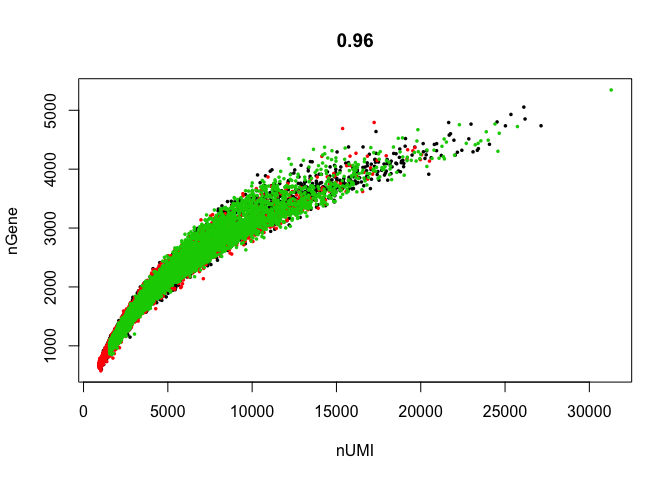

## Load the Seurat object

```r
load(file="original_seurat_object.RData")
experiment.aggregate
```

```
## Loading required package: Seurat
```

```
## Loading required package: ggplot2
```

```
## Loading required package: cowplot
```

```
## 
## Attaching package: 'cowplot'
```

```
## The following object is masked from 'package:ggplot2':
## 
##     ggsave
```

```
## Loading required package: Matrix
```

```
## An object of class seurat in project scRNA workshop 
##  15606 genes across 21685 samples.
```

## Some basic QA/QC of the metadata, print tables of the 5% quantiles.

Show 5% qunatiles for number of genes per cell per sample

```r
do.call("cbind", tapply(experiment.aggregate@meta.data$nGene,experiment.aggregate@ident,quantile,probs=seq(0,1,0.05)))
```

```
##      sample1 sample2 sample3
## 0%    602.00   575.0  852.00
## 5%    851.00   787.7 1104.65
## 10%   999.50   899.0 1197.00
## 15%  1126.00   990.0 1279.00
## 20%  1237.00  1060.0 1361.00
## 25%  1330.00  1133.0 1458.00
## 30%  1413.00  1207.0 1557.00
## 35%  1495.00  1300.0 1655.00
## 40%  1583.00  1381.0 1754.00
## 45%  1676.75  1469.0 1845.85
## 50%  1778.50  1572.0 1949.00
## 55%  1881.00  1669.7 2073.00
## 60%  1981.00  1771.4 2199.00
## 65%  2088.75  1873.0 2350.00
## 70%  2202.00  1987.0 2500.20
## 75%  2332.25  2132.5 2670.00
## 80%  2502.00  2266.0 2849.00
## 85%  2706.00  2426.9 3024.00
## 90%  3004.00  2634.0 3223.70
## 95%  3438.00  2939.0 3476.00
## 100% 5054.00  4793.0 5345.00
```

Show 5% qunatiles for number of UMI per cell per sample

```r
do.call("cbind", tapply(experiment.aggregate@meta.data$nUMI,experiment.aggregate@ident,quantile,probs=seq(0,1,0.05)))
```

```
##       sample1 sample2  sample3
## 0%    1006.00   929.0  1541.00
## 5%    1265.00  1142.7  1885.65
## 10%   1544.00  1351.0  2056.00
## 15%   1831.25  1555.0  2242.95
## 20%   2113.00  1711.0  2444.20
## 25%   2324.00  1861.0  2704.00
## 30%   2528.50  2039.2  2990.90
## 35%   2749.25  2245.0  3297.55
## 40%   3004.00  2463.0  3595.00
## 45%   3280.75  2690.3  3907.00
## 50%   3601.00  2960.0  4211.00
## 55%   3959.50  3271.0  4611.15
## 60%   4321.00  3573.4  5087.00
## 65%   4726.50  3912.6  5723.45
## 70%   5188.50  4346.0  6421.00
## 75%   5731.25  4860.5  7152.00
## 80%   6532.00  5446.0  8042.00
## 85%   7525.50  6179.6  9007.20
## 90%   8914.00  7131.2 10217.60
## 95%  11610.00  8700.5 12177.70
## 100% 27134.00 20518.0 31296.00
```

Show 5% qunatiles for number of mitochondrial percentage per cell per sample

```r
round(do.call("cbind", tapply(experiment.aggregate@meta.data$percent.mito,experiment.aggregate@ident,quantile,probs=seq(0,1,0.05))), digits = 3)
```

```
##      sample1 sample2 sample3
## 0%     0.000   0.000   0.000
## 5%     0.007   0.006   0.011
## 10%    0.011   0.010   0.018
## 15%    0.014   0.013   0.022
## 20%    0.016   0.016   0.025
## 25%    0.019   0.018   0.028
## 30%    0.021   0.021   0.032
## 35%    0.024   0.023   0.035
## 40%    0.027   0.026   0.037
## 45%    0.030   0.028   0.040
## 50%    0.033   0.031   0.043
## 55%    0.036   0.034   0.046
## 60%    0.039   0.037   0.049
## 65%    0.043   0.041   0.053
## 70%    0.047   0.044   0.056
## 75%    0.051   0.048   0.060
## 80%    0.055   0.052   0.064
## 85%    0.060   0.057   0.070
## 90%    0.067   0.064   0.076
## 95%    0.077   0.074   0.088
## 100%   0.271   0.277   0.338
```

Plot the number of cells each gene is represented by

```r
plot(sort(Matrix::rowSums(experiment.aggregate@data>=2)) , xlab="gene rank", ylab="number of cells", main="Cells per genes ( >= 2 )")
```

<!-- -->

Violin plot of 1) number of genes, 2) number of UMI and 3) percent mitochondrial genes

```r
VlnPlot(
  experiment.aggregate,
  c("nGene", "nUMI","percent.mito"),
  nCol = 1)
```

<!-- -->

Gene Plot, scatter plot of gene expression across cells, (colored by sample)

```r
GenePlot(
  experiment.aggregate, "nUMI", "nGene",
  cex.use = 0.5)
```

<!-- -->

### Cell filtering
We use the information above to filter out cells. Here we choose those that have percent mitochondrial genes max of 10% and unique UMI counts under 20,000 or greater than 500, Note that low.thresholds and high.thresholds are used to define a 'gate' -Inf and Inf should be used if you don't want a lower or upper threshold.


```r
experiment.aggregate <- FilterCells(
  object = experiment.aggregate,
  subset.names = c("percent.mito"),
  low.thresholds = c(-Inf),
  high.thresholds = c(0.1))

experiment.aggregate <- FilterCells(
  object = experiment.aggregate,
  subset.names = c("nUMI"),
  low.thresholds = c(500),
  high.thresholds = c(20000))

experiment.aggregate
```

```
## An object of class seurat in project scRNA workshop 
##  15606 genes across 21288 samples.
```


```r
table(experiment.aggregate@meta.data$orig.ident)
```

```
## 
## sample1 sample2 sample3 
##    6843    7772    6673
```

## Next we want to normalize the data

After filtering out cells from the dataset, the next step is to normalize the data. By default, we employ a global-scaling normalization method LogNormalize that normalizes the gene expression measurements for each cell by the total expression, multiplies this by a scale factor (10,000 by default), and then log-transforms the data.


```r
?NormalizeData
experiment.aggregate <- NormalizeData(
  object = experiment.aggregate,
  normalization.method = "LogNormalize",
  scale.factor = 10000)
```

### You may also want to filter out additional genes.

When creating the base Seurat object we did filter out some genes, recall _Keep all genes expressed in >= 10 cells_. After filtering cells and you may want to be more aggressive with the gene filter. Seurat doesn't supply such a function (that I can find), so below is a function that can do so, it filters genes requiring a min.value (log-normalized) in at least min.cells, here expression of 1 in at least 100 cells.


```r
FilterGenes <- 
function (object, min.value=1, min.cells = 0, genes = NULL) {
  parameters.to.store <- as.list(environment(), all = TRUE)[names(formals("FilterGenes"))]
  object <- Seurat:::SetCalcParams(object = object, calculation = "FilterGenes", ... = parameters.to.store)
  genes.use <- rownames(object@data)

  if (!is.null(genes)) {
    genes.use <- intersect(genes.use, genes)
    object@data <- object@data[genes.use, ]
    return(object)
  } else if (min.cells > 0) {
    num.cells <- Matrix::rowSums(object@data > min.value)
    genes.use <- names(num.cells[which(num.cells >= min.cells)])
    object@data <- object@data[genes.use, ]
    return(object)
  } else {
    return(object)
  }
}

experiment.aggregate <- FilterGenes(object = experiment.aggregate, min.value = 1, min.cells = 100)
experiment.aggregate
```

```
## An object of class seurat in project scRNA workshop 
##  11454 genes across 21288 samples.
```

## Identify variable genes

The function FindVariableGenes calculates highly variable genes (genes that are outliers on a 'mean variability plot') that can be used to focus on these for downstream analysis.  First, uses a function to calculate average expression (mean.function) and dispersion (dispersion.function) for each gene. Next, divides genes into num.bin (deafult 20) bins based on their average expression, and calculates z-scores for dispersion within each bin. The purpose of this is to identify variable genes while controlling for the strong relationship between variability and average expression. This helps control for the relationship between variability and average expression.


```r
?FindVariableGenes
length(FindVariableGenes(
  object = experiment.aggregate,
  mean.function = ExpMean,
  dispersion.function = LogVMR,
  x.low.cutoff = 0.24,
  x.high.cutoff = 3,
  y.cutoff = 0.5, do.plot=T)@var.genes)
```

<!-- -->

```
## [1] 781
```

```r
experiment.aggregate <- FindVariableGenes(
  object = experiment.aggregate,
  mean.function = ExpMean,
  dispersion.function = LogVMR,
  x.low.cutoff = 0.125,
  x.high.cutoff = 4,
  y.cutoff = 0.5, do.plot=F)

length(experiment.aggregate@var.genes)
```

```
## [1] 1123
```

#### Question(s)

1. Play some with the filtering parameters, see how results change?
2. Increase/Decrease the y.cutoff, how do things change?


## Finally, lets save the filtered and normalized data

```r
save(experiment.aggregate, file="pre_sample_corrected.RData")
```

## Session Information

```r
sessionInfo()
```

```
## R version 3.4.4 (2018-03-15)
## Platform: x86_64-apple-darwin15.6.0 (64-bit)
## Running under: macOS High Sierra 10.13.3
## 
## Matrix products: default
## BLAS: /Library/Frameworks/R.framework/Versions/3.4/Resources/lib/libRblas.0.dylib
## LAPACK: /Library/Frameworks/R.framework/Versions/3.4/Resources/lib/libRlapack.dylib
## 
## locale:
## [1] en_US.UTF-8/en_US.UTF-8/en_US.UTF-8/C/en_US.UTF-8/en_US.UTF-8
## 
## attached base packages:
## [1] stats     graphics  grDevices utils     datasets  methods   base     
## 
## other attached packages:
## [1] Seurat_2.2.1  Matrix_1.2-12 cowplot_0.9.2 ggplot2_2.2.1
## 
## loaded via a namespace (and not attached):
##   [1] diffusionMap_1.1-0   Rtsne_0.13           VGAM_1.0-5          
##   [4] colorspace_1.3-2     ggridges_0.4.1       class_7.3-14        
##   [7] modeltools_0.2-21    mclust_5.4           rprojroot_1.3-2     
##  [10] htmlTable_1.11.2     base64enc_0.1-3      proxy_0.4-21        
##  [13] rstudioapi_0.7       DRR_0.0.3            flexmix_2.3-14      
##  [16] prodlim_1.6.1        mvtnorm_1.0-7        lubridate_1.7.3     
##  [19] ranger_0.9.0         codetools_0.2-15     splines_3.4.4       
##  [22] R.methodsS3_1.7.1    mnormt_1.5-5         robustbase_0.92-8   
##  [25] knitr_1.20           tclust_1.3-1         RcppRoll_0.2.2      
##  [28] Formula_1.2-2        caret_6.0-78         ica_1.0-1           
##  [31] broom_0.4.3          ddalpha_1.3.1.1      cluster_2.0.6       
##  [34] kernlab_0.9-25       R.oo_1.21.0          sfsmisc_1.1-2       
##  [37] compiler_3.4.4       backports_1.1.2      assertthat_0.2.0    
##  [40] lazyeval_0.2.1       lars_1.2             acepack_1.4.1       
##  [43] htmltools_0.3.6      tools_3.4.4          bindrcpp_0.2        
##  [46] igraph_1.2.1         gtable_0.2.0         glue_1.2.0          
##  [49] reshape2_1.4.3       dplyr_0.7.4          Rcpp_0.12.16        
##  [52] trimcluster_0.1-2    gdata_2.18.0         ape_5.0             
##  [55] nlme_3.1-131.1       iterators_1.0.9      fpc_2.1-11          
##  [58] psych_1.7.8          timeDate_3043.102    gower_0.1.2         
##  [61] stringr_1.3.0        irlba_2.3.2          gtools_3.5.0        
##  [64] DEoptimR_1.0-8       MASS_7.3-49          scales_0.5.0        
##  [67] ipred_0.9-6          parallel_3.4.4       RColorBrewer_1.1-2  
##  [70] yaml_2.1.18          pbapply_1.3-4        gridExtra_2.3       
##  [73] segmented_0.5-3.0    rpart_4.1-13         latticeExtra_0.6-28 
##  [76] stringi_1.1.7        foreach_1.4.4        checkmate_1.8.5     
##  [79] caTools_1.17.1       lava_1.6             dtw_1.18-1          
##  [82] SDMTools_1.1-221     rlang_0.2.0          pkgconfig_2.0.1     
##  [85] prabclus_2.2-6       bitops_1.0-6         evaluate_0.10.1     
##  [88] lattice_0.20-35      ROCR_1.0-7           purrr_0.2.4         
##  [91] bindr_0.1.1          labeling_0.3         recipes_0.1.2       
##  [94] htmlwidgets_1.0      tidyselect_0.2.4     CVST_0.2-1          
##  [97] plyr_1.8.4           magrittr_1.5         R6_2.2.2            
## [100] gplots_3.0.1         Hmisc_4.1-1          dimRed_0.1.0        
## [103] sn_1.5-1             withr_2.1.2          pillar_1.2.1        
## [106] foreign_0.8-69       mixtools_1.1.0       survival_2.41-3     
## [109] scatterplot3d_0.3-41 nnet_7.3-12          tsne_0.1-3          
## [112] tibble_1.4.2         KernSmooth_2.23-15   rmarkdown_1.9       
## [115] grid_3.4.4           data.table_1.10.4-3  FNN_1.1             
## [118] ModelMetrics_1.1.0   metap_0.8            digest_0.6.15       
## [121] diptest_0.75-7       numDeriv_2016.8-1    tidyr_0.8.0         
## [124] R.utils_2.6.0        stats4_3.4.4         munsell_0.4.3
```
