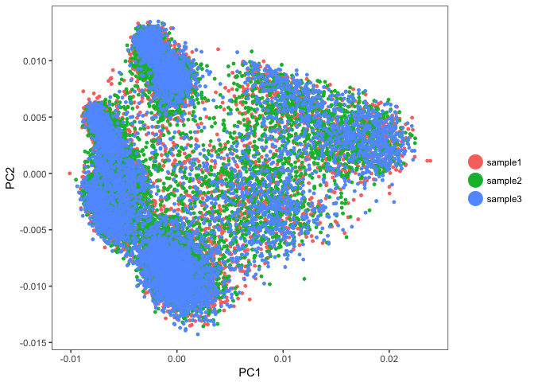
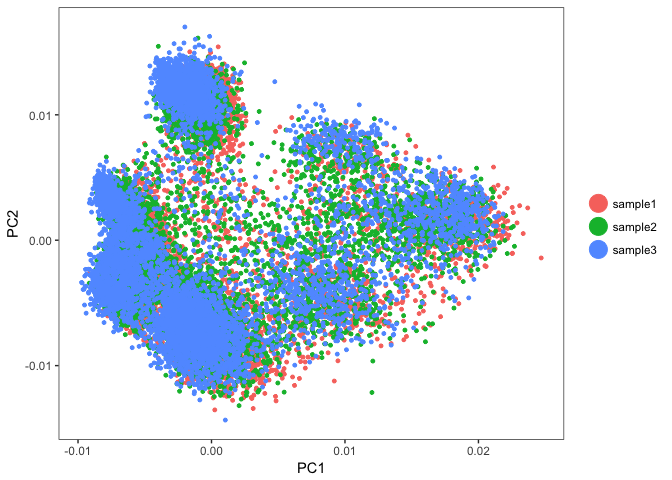

## Load the Seurat object

```r
load(file="pre_sample_corrected.RData")
experiment.aggregate
```

```
## Loading required package: Seurat
```

```
## Loading required package: ggplot2
```

```
## Loading required package: cowplot
```

```
## 
## Attaching package: 'cowplot'
```

```
## The following object is masked from 'package:ggplot2':
## 
##     ggsave
```

```
## Loading required package: Matrix
```

```
## An object of class seurat in project scRNA workshop 
##  11454 genes across 21288 samples.
```

## Exploring Batch effects 3 ways, none, Seurat [vars.to.regress] and COMBAT

First lets view the data without any corrections

## PCA in prep for tSNE

ScaleData - Scales and centers genes in the dataset. 

```
## [1] "Scaling data matrix"
## 
  |                                                                       
  |                                                                 |   0%
  |                                                                       
  |=====                                                            |   8%
  |                                                                       
  |===========                                                      |  17%
  |                                                                       
  |================                                                 |  25%
  |                                                                       
  |======================                                           |  33%
  |                                                                       
  |===========================                                      |  42%
  |                                                                       
  |================================                                 |  50%
  |                                                                       
  |======================================                           |  58%
  |                                                                       
  |===========================================                      |  67%
  |                                                                       
  |=================================================                |  75%
  |                                                                       
  |======================================================           |  83%
  |                                                                       
  |============================================================     |  92%
  |                                                                       
  |=================================================================| 100%
```

Run PCA


TSNEPlot


## Correct for sample to sample differences (seurat)

Use vars.to.regress to correct for the sample to sample differences and percent mitochondria

```
## [1] "Regressing out orig.ident"   "Regressing out percent.mito"
## 
  |                                                                       
  |                                                                 |   0%
  |                                                                       
  |=                                                                |   1%
  |                                                                       
  |=                                                                |   2%
  |                                                                       
  |==                                                               |   3%
  |                                                                       
  |===                                                              |   4%
  |                                                                       
  |===                                                              |   5%
  |                                                                       
  |====                                                             |   6%
  |                                                                       
  |=====                                                            |   7%
  |                                                                       
  |=====                                                            |   8%
  |                                                                       
  |======                                                           |   9%
  |                                                                       
  |======                                                           |  10%
  |                                                                       
  |=======                                                          |  10%
  |                                                                       
  |=======                                                          |  11%
  |                                                                       
  |========                                                         |  12%
  |                                                                       
  |========                                                         |  13%
  |                                                                       
  |=========                                                        |  14%
  |                                                                       
  |==========                                                       |  15%
  |                                                                       
  |==========                                                       |  16%
  |                                                                       
  |===========                                                      |  17%
  |                                                                       
  |============                                                     |  18%
  |                                                                       
  |============                                                     |  19%
  |                                                                       
  |=============                                                    |  20%
  |                                                                       
  |==============                                                   |  21%
  |                                                                       
  |==============                                                   |  22%
  |                                                                       
  |===============                                                  |  23%
  |                                                                       
  |================                                                 |  24%
  |                                                                       
  |================                                                 |  25%
  |                                                                       
  |=================                                                |  26%
  |                                                                       
  |==================                                               |  27%
  |                                                                       
  |==================                                               |  28%
  |                                                                       
  |===================                                              |  29%
  |                                                                       
  |===================                                              |  30%
  |                                                                       
  |====================                                             |  30%
  |                                                                       
  |====================                                             |  31%
  |                                                                       
  |=====================                                            |  32%
  |                                                                       
  |=====================                                            |  33%
  |                                                                       
  |======================                                           |  34%
  |                                                                       
  |=======================                                          |  35%
  |                                                                       
  |=======================                                          |  36%
  |                                                                       
  |========================                                         |  37%
  |                                                                       
  |=========================                                        |  38%
  |                                                                       
  |=========================                                        |  39%
  |                                                                       
  |==========================                                       |  40%
  |                                                                       
  |===========================                                      |  41%
  |                                                                       
  |===========================                                      |  42%
  |                                                                       
  |============================                                     |  43%
  |                                                                       
  |=============================                                    |  44%
  |                                                                       
  |=============================                                    |  45%
  |                                                                       
  |==============================                                   |  46%
  |                                                                       
  |===============================                                  |  47%
  |                                                                       
  |===============================                                  |  48%
  |                                                                       
  |================================                                 |  49%
  |                                                                       
  |================================                                 |  50%
  |                                                                       
  |=================================                                |  50%
  |                                                                       
  |=================================                                |  51%
  |                                                                       
  |==================================                               |  52%
  |                                                                       
  |==================================                               |  53%
  |                                                                       
  |===================================                              |  54%
  |                                                                       
  |====================================                             |  55%
  |                                                                       
  |====================================                             |  56%
  |                                                                       
  |=====================================                            |  57%
  |                                                                       
  |======================================                           |  58%
  |                                                                       
  |======================================                           |  59%
  |                                                                       
  |=======================================                          |  60%
  |                                                                       
  |========================================                         |  61%
  |                                                                       
  |========================================                         |  62%
  |                                                                       
  |=========================================                        |  63%
  |                                                                       
  |==========================================                       |  64%
  |                                                                       
  |==========================================                       |  65%
  |                                                                       
  |===========================================                      |  66%
  |                                                                       
  |============================================                     |  67%
  |                                                                       
  |============================================                     |  68%
  |                                                                       
  |=============================================                    |  69%
  |                                                                       
  |=============================================                    |  70%
  |                                                                       
  |==============================================                   |  70%
  |                                                                       
  |==============================================                   |  71%
  |                                                                       
  |===============================================                  |  72%
  |                                                                       
  |===============================================                  |  73%
  |                                                                       
  |================================================                 |  74%
  |                                                                       
  |=================================================                |  75%
  |                                                                       
  |=================================================                |  76%
  |                                                                       
  |==================================================               |  77%
  |                                                                       
  |===================================================              |  78%
  |                                                                       
  |===================================================              |  79%
  |                                                                       
  |====================================================             |  80%
  |                                                                       
  |=====================================================            |  81%
  |                                                                       
  |=====================================================            |  82%
  |                                                                       
  |======================================================           |  83%
  |                                                                       
  |=======================================================          |  84%
  |                                                                       
  |=======================================================          |  85%
  |                                                                       
  |========================================================         |  86%
  |                                                                       
  |=========================================================        |  87%
  |                                                                       
  |=========================================================        |  88%
  |                                                                       
  |==========================================================       |  89%
  |                                                                       
  |==========================================================       |  90%
  |                                                                       
  |===========================================================      |  90%
  |                                                                       
  |===========================================================      |  91%
  |                                                                       
  |============================================================     |  92%
  |                                                                       
  |============================================================     |  93%
  |                                                                       
  |=============================================================    |  94%
  |                                                                       
  |==============================================================   |  95%
  |                                                                       
  |==============================================================   |  96%
  |                                                                       
  |===============================================================  |  97%
  |                                                                       
  |================================================================ |  98%
  |                                                                       
  |================================================================ |  99%
  |                                                                       
  |=================================================================| 100%
## [1] "Scaling data matrix"
## 
  |                                                                       
  |                                                                 |   0%
  |                                                                       
  |=====                                                            |   8%
  |                                                                       
  |===========                                                      |  17%
  |                                                                       
  |================                                                 |  25%
  |                                                                       
  |======================                                           |  33%
  |                                                                       
  |===========================                                      |  42%
  |                                                                       
  |================================                                 |  50%
  |                                                                       
  |======================================                           |  58%
  |                                                                       
  |===========================================                      |  67%
  |                                                                       
  |=================================================                |  75%
  |                                                                       
  |======================================================           |  83%
  |                                                                       
  |============================================================     |  92%
  |                                                                       
  |=================================================================| 100%
```



Corrected TSE Plot


## COMBAT corrected, https://academic.oup.com/biostatistics/article-lookup/doi/10.1093/biostatistics/kxj037

```r
source("https://bioconductor.org/biocLite.R")
```

```
## Bioconductor version 3.6 (BiocInstaller 1.28.0), ?biocLite for help
```

```r
biocLite("sva")
```

```
## BioC_mirror: https://bioconductor.org
```

```
## Using Bioconductor 3.6 (BiocInstaller 1.28.0), R 3.4.4 (2018-03-15).
```

```
## Installing package(s) 'sva'
```

```
## 
## The downloaded binary packages are in
## 	/var/folders/vv/3xsj6xdd3j7828czt77bcltr0000gn/T//Rtmpvpdz5J/downloaded_packages
```

```r
library(sva)
```

```
## Loading required package: mgcv
```

```
## Loading required package: nlme
```

```
## This is mgcv 1.8-23. For overview type 'help("mgcv-package")'.
```

```
## Loading required package: genefilter
```

```
## Loading required package: BiocParallel
```

```r
?ComBat
m = as.data.frame(as.matrix(experiment.aggregate@data))
com = ComBat(dat=m, batch=experiment.aggregate@meta.data$orig.ident, prior.plots=FALSE, par.prior=TRUE)
```

```
## Found3batches
```

```
## Adjusting for0covariate(s) or covariate level(s)
```

```
## Standardizing Data across genes
```

```
## Fitting L/S model and finding priors
```

```
## Finding parametric adjustments
```

```
## Adjusting the Data
```


```r
experiment.aggregate.combat <- experiment.aggregate
experiment.aggregate.combat@data = Matrix(as.matrix(com))
experiment.aggregate.combat = ScaleData(experiment.aggregate.combat)
```

```
## [1] "Scaling data matrix"
## 
  |                                                                       
  |                                                                 |   0%
  |                                                                       
  |=====                                                            |   8%
  |                                                                       
  |===========                                                      |  17%
  |                                                                       
  |================                                                 |  25%
  |                                                                       
  |======================                                           |  33%
  |                                                                       
  |===========================                                      |  42%
  |                                                                       
  |================================                                 |  50%
  |                                                                       
  |======================================                           |  58%
  |                                                                       
  |===========================================                      |  67%
  |                                                                       
  |=================================================                |  75%
  |                                                                       
  |======================================================           |  83%
  |                                                                       
  |============================================================     |  92%
  |                                                                       
  |=================================================================| 100%
```


```r
experiment.aggregate.combat <- RunPCA(object = experiment.aggregate.combat, pc.genes = experiment.aggregate.combat@var.genes, do.print = FALSE, pcs.compute = 40, weight.by.var = FALSE)

PCAPlot(object = experiment.aggregate.combat, dim.1 = 1, dim.2 = 2)
```

<!-- -->


```r
experiment.aggregate.combat <- RunTSNE(object = experiment.aggregate.combat, dims.use = 1:12, do.fast = TRUE)
TSNEPlot(object = experiment.aggregate.combat)
```

<!-- -->

#### Question(s)

1. Explore differences in regressed variables. eg remove percent.mito, add in nUMI?

## Session Information

```r
sessionInfo()
```

```
## R version 3.4.4 (2018-03-15)
## Platform: x86_64-apple-darwin15.6.0 (64-bit)
## Running under: macOS High Sierra 10.13.3
## 
## Matrix products: default
## BLAS: /Library/Frameworks/R.framework/Versions/3.4/Resources/lib/libRblas.0.dylib
## LAPACK: /Library/Frameworks/R.framework/Versions/3.4/Resources/lib/libRlapack.dylib
## 
## locale:
## [1] en_US.UTF-8/en_US.UTF-8/en_US.UTF-8/C/en_US.UTF-8/en_US.UTF-8
## 
## attached base packages:
## [1] stats     graphics  grDevices utils     datasets  methods   base     
## 
## other attached packages:
##  [1] sva_3.26.0           BiocParallel_1.12.0  genefilter_1.60.0   
##  [4] mgcv_1.8-23          nlme_3.1-131.1       BiocInstaller_1.28.0
##  [7] Seurat_2.2.1         Matrix_1.2-12        cowplot_0.9.2       
## [10] ggplot2_2.2.1       
## 
## loaded via a namespace (and not attached):
##   [1] backports_1.1.2      Hmisc_4.1-1          VGAM_1.0-5          
##   [4] sn_1.5-1             plyr_1.8.4           igraph_1.2.1        
##   [7] lazyeval_0.2.1       splines_3.4.4        digest_0.6.15       
##  [10] foreach_1.4.4        htmltools_0.3.6      lars_1.2            
##  [13] gdata_2.18.0         memoise_1.1.0        magrittr_1.5        
##  [16] checkmate_1.8.5      cluster_2.0.6        mixtools_1.1.0      
##  [19] ROCR_1.0-7           sfsmisc_1.1-2        limma_3.34.9        
##  [22] recipes_0.1.2        annotate_1.56.1      gower_0.1.2         
##  [25] matrixStats_0.53.1   dimRed_0.1.0         R.utils_2.6.0       
##  [28] colorspace_1.3-2     blob_1.1.0           dplyr_0.7.4         
##  [31] RCurl_1.95-4.10      bindr_0.1.1          survival_2.41-3     
##  [34] iterators_1.0.9      ape_5.0              glue_1.2.0          
##  [37] DRR_0.0.3            gtable_0.2.0         ipred_0.9-6         
##  [40] kernlab_0.9-25       ddalpha_1.3.1.1      prabclus_2.2-6      
##  [43] BiocGenerics_0.24.0  DEoptimR_1.0-8       scales_0.5.0        
##  [46] mvtnorm_1.0-7        DBI_0.8              Rcpp_0.12.16        
##  [49] metap_0.8            dtw_1.18-1           xtable_1.8-2        
##  [52] htmlTable_1.11.2     tclust_1.3-1         bit_1.1-12          
##  [55] foreign_0.8-69       proxy_0.4-21         mclust_5.4          
##  [58] SDMTools_1.1-221     Formula_1.2-2        stats4_3.4.4        
##  [61] tsne_0.1-3           lava_1.6             prodlim_1.6.1       
##  [64] htmlwidgets_1.0      FNN_1.1              gplots_3.0.1        
##  [67] RColorBrewer_1.1-2   fpc_2.1-11           acepack_1.4.1       
##  [70] modeltools_0.2-21    ica_1.0-1            XML_3.98-1.10       
##  [73] pkgconfig_2.0.1      R.methodsS3_1.7.1    flexmix_2.3-14      
##  [76] nnet_7.3-12          caret_6.0-78         AnnotationDbi_1.40.0
##  [79] tidyselect_0.2.4     labeling_0.3         rlang_0.2.0         
##  [82] reshape2_1.4.3       munsell_0.4.3        tools_3.4.4         
##  [85] RSQLite_2.0          ranger_0.9.0         broom_0.4.3         
##  [88] ggridges_0.4.1       evaluate_0.10.1      stringr_1.3.0       
##  [91] yaml_2.1.18          bit64_0.9-7          ModelMetrics_1.1.0  
##  [94] knitr_1.20           robustbase_0.92-8    caTools_1.17.1      
##  [97] purrr_0.2.4          bindrcpp_0.2         pbapply_1.3-4       
## [100] R.oo_1.21.0          RcppRoll_0.2.2       compiler_3.4.4      
## [103] rstudioapi_0.7       tibble_1.4.2         stringi_1.1.7       
## [106] lattice_0.20-35      trimcluster_0.1-2    psych_1.7.8         
## [109] diffusionMap_1.1-0   pillar_1.2.1         data.table_1.10.4-3 
## [112] bitops_1.0-6         irlba_2.3.2          R6_2.2.2            
## [115] latticeExtra_0.6-28  KernSmooth_2.23-15   gridExtra_2.3       
## [118] IRanges_2.12.0       codetools_0.2-15     MASS_7.3-49         
## [121] gtools_3.5.0         assertthat_0.2.0     CVST_0.2-1          
## [124] rprojroot_1.3-2      withr_2.1.2          mnormt_1.5-5        
## [127] S4Vectors_0.16.0     diptest_0.75-7       parallel_3.4.4      
## [130] grid_3.4.4           rpart_4.1-13         timeDate_3043.102   
## [133] tidyr_0.8.0          class_7.3-14         rmarkdown_1.9       
## [136] segmented_0.5-3.0    Rtsne_0.13           numDeriv_2016.8-1   
## [139] scatterplot3d_0.3-41 Biobase_2.38.0       lubridate_1.7.3     
## [142] base64enc_0.1-3
```
