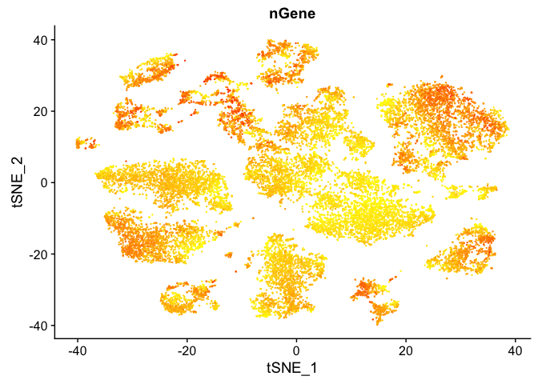
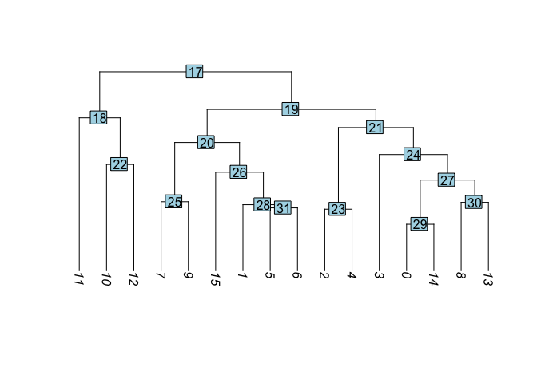
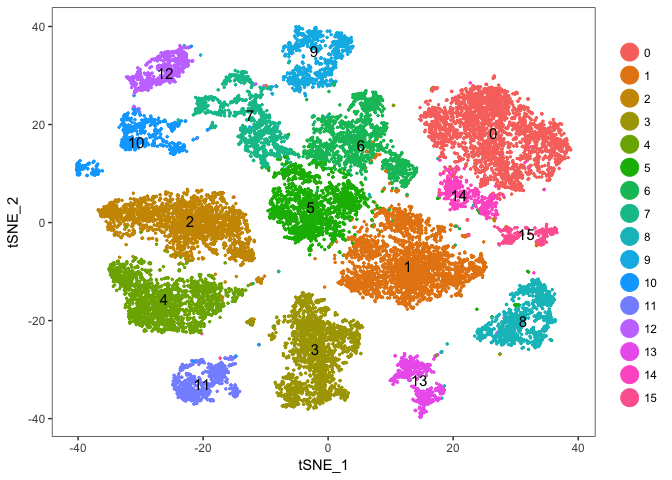
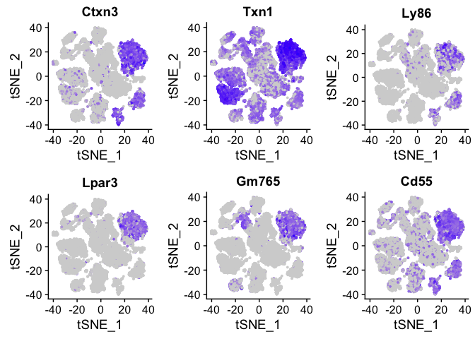
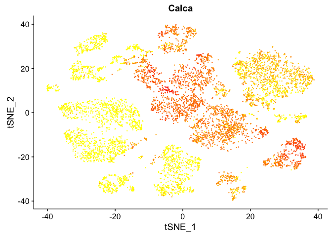

## Load the Seurat object

```r
load(file="pca_sample_corrected.RData")
experiment.aggregate
```

```
## Loading required package: Seurat
```

```
## Loading required package: ggplot2
```

```
## Loading required package: cowplot
```

```
## 
## Attaching package: 'cowplot'
```

```
## The following object is masked from 'package:ggplot2':
## 
##     ggsave
```

```
## Loading required package: Matrix
```

```
## An object of class seurat in project scRNA workshop 
##  11454 genes across 21288 samples.
```

## Identifying clusters

Seurat implements an graph-based clustering approach. Distances between the cells are calculated based on previously identified PCs. Seurat approach was heavily inspired by recent manuscripts which applied graph-based clustering approaches to scRNAseq data. Briefly, Seurat identify clusters of cells by a shared nearest neighbor (SNN) modularity optimization based clustering algorithm. First calculate k-nearest neighbors (KNN) and construct the SNN graph. Then optimize the modularity function to determine clusters. For a full description of the algorithms, see Waltman and van Eck (2013) The European Physical Journal B.

The FindClusters function implements the procedure, and contains a resolution parameter that sets the granularity of the downstream clustering, with increased values leading to a greater number of clusters. I tend to like to perform a series of resolutions, investigate and choose.

__WARNING: TAKES A LONG TIME TO RUN__

```r
use.pcs = 1:35

experiment.aggregate <- FindClusters(
    object = experiment.aggregate, 
    reduction.type = "pca", 
    dims.use = use.pcs, 
    resolution = seq(0.5,4,0.5), 
    print.output = FALSE, 
    save.SNN = TRUE
)
PrintFindClustersParams(object = experiment.aggregate)
```

```
## Parameters used in latest FindClusters calculation run on: 2018-03-22 08:56:57
## =============================================================================
## Resolution: 0.5
## -----------------------------------------------------------------------------
## Modularity Function    Algorithm         n.start         n.iter
##      1                   1                 100             10
## -----------------------------------------------------------------------------
## Reduction used          k.param          k.scale          prune.SNN
##      pca                 30                25              0.0667
## -----------------------------------------------------------------------------
## Dims used in calculation
## =============================================================================
## 1 2 3 4 5 6 7 8 9 10 11 12 13 14 15 16 17 18 19 20 21 22 23 24 25 26 27 28 29
## 30 31 32 33 34 35
```

Lets first investigate how many clusters each resolution produces and set it to the smallest resolutions of 0.5 (fewest clusters). finnaly lets produce a table of cluster to sample assignments.


```r
sapply(grep("^res",colnames(experiment.aggregate@meta.data),value = TRUE),
       function(x) length(unique(experiment.aggregate@meta.data[,x])))
```

```
## res.0.5   res.1 res.1.5   res.2 res.2.5   res.3 res.3.5   res.4 
##      16      23      30      37      41      43      46      50
```

```r
experiment.aggregate <- SetAllIdent(experiment.aggregate, id = "res.0.5")

table(experiment.aggregate@ident,experiment.aggregate@meta.data$orig.ident)
```

```
##     
##      sample1 sample2 sample3
##   0     1084    1138     523
##   1      799     974     954
##   2      760     724     747
##   3      727     656     591
##   4      632     649     560
##   5      484     626     579
##   6      464     491     579
##   7      315     441     375
##   8      338     399     304
##   9      248     318     326
##   10     183     332     257
##   11     204     261     263
##   12     176     233     204
##   13     213     182     216
##   14     123     201     132
##   15      93     147      63
```

tSNE dimensionality reduction plots are then used to visualise clustering results. As input to the tSNE, you should use the same PCs as input to the clustering analysis.


```r
experiment.aggregate <- RunTSNE(
  object = experiment.aggregate,
  reduction.use = "pca",
  dims.use = use.pcs,
  do.fast = TRUE)
```


Plot TSNE coloring by the slot 'ident' (default).

```r
TSNEPlot(object = experiment.aggregate, pt.size=0.5)
```

<!-- -->

Plot TSNE coloring by the slot 'orig.ident' (sample names).

```r
TSNEPlot(object = experiment.aggregate, group.by="orig.ident", pt.size=0.5)
```

<!-- -->

Plot TSNE coloring by the clustering resolution 4

```r
TSNEPlot(object = experiment.aggregate, group.by="res.4", pt.size=0.5, do.label = TRUE)
```

<!-- -->

FeaturePlot can be used to color cells with a 'feature', non categorical data, like number of UMIs

```r
FeaturePlot(experiment.aggregate, features.plot=c('nUMI'), pt.size=0.5)
```

<!-- -->
and number of genes present

```r
FeaturePlot(experiment.aggregate, features.plot=c('nGene'), pt.size=0.5)
```

<!-- -->

and percent mitochondrial 

```r
FeaturePlot(experiment.aggregate, features.plot=c('percent.mito'), pt.size=0.5)
```

<!-- -->

## Building  a  tree relating the 'average' cell from each cluster. Tree is estimated based on a distance matrix constructed in either gene expression space or PCA space.


```r
experiment.aggregate <- BuildClusterTree(
  experiment.aggregate,
  pcs.use = use.pcs,
  do.reorder = F,
  reorder.numeric = F,
  do.plot=F)
```

```
## [1] "Finished averaging RNA for cluster 0"
## [1] "Finished averaging RNA for cluster 1"
## [1] "Finished averaging RNA for cluster 2"
## [1] "Finished averaging RNA for cluster 3"
## [1] "Finished averaging RNA for cluster 4"
## [1] "Finished averaging RNA for cluster 5"
## [1] "Finished averaging RNA for cluster 6"
## [1] "Finished averaging RNA for cluster 7"
## [1] "Finished averaging RNA for cluster 8"
## [1] "Finished averaging RNA for cluster 9"
## [1] "Finished averaging RNA for cluster 10"
## [1] "Finished averaging RNA for cluster 11"
## [1] "Finished averaging RNA for cluster 12"
## [1] "Finished averaging RNA for cluster 13"
## [1] "Finished averaging RNA for cluster 14"
## [1] "Finished averaging RNA for cluster 15"
```

```r
PlotClusterTree(experiment.aggregate)
```

<!-- -->

Plot the split at node 30

```r
ColorTSNESplit(experiment.aggregate, node = 30)
```

<!-- -->


```r
TSNEPlot(object = experiment.aggregate, pt.size=0.5, do.label = TRUE)
```

<!-- -->


```r
experiment.merged <- RenameIdent(
  object = experiment.aggregate,
  old.ident.name = c('14'),
  new.ident.name = '0'
)
TSNEPlot(object = experiment.merged, pt.size=0.5, do.label = T)
```

<!-- -->

## Identifying Marker Genes

Seurat can help you find markers that define clusters via differential expression.

`FindMarkers` identifies markers for a cluster relative to all other clusters.

`FindAllMarkers` does so for all clusters

`FindAllMarkersNode` defines all markers that split a Node __(Warning: need to validate)__


```r
?FindMarkers

markers = FindMarkers(experiment.aggregate, ident.1=c(0,14), genes.use=rownames(experiment.aggregate@scale.data))

head(markers)
```

```
##       p_val avg_logFC pct.1 pct.2 p_val_adj
## Ctxn3     0  1.665902 0.923 0.143         0
## Txn1      0  1.559953 0.978 0.663         0
## Ly86      0  1.490500 0.631 0.092         0
## Lpar3     0  1.451481 0.759 0.015         0
## Gm765     0  1.445594 0.818 0.059         0
## Cd55      0  1.336349 0.931 0.261         0
```

```r
dim(markers)
```

```
## [1] 451   5
```

```r
table(markers$avg_logFC > 0)
```

```
## 
## FALSE  TRUE 
##   364    87
```

 
pct.1 and pct.2 are the proportion of cells with expression above 0 in ident.1 and ident.2 respectively. p_val is the raw p_value associated with the differntial expression test with adjusted value in p_val_adj. avg_logFC is the average log fold change difference between the two groups. 
 
avg_diff (lines 130, 193 and) appears to be the difference in log(x = mean(x = exp(x = x) - 1) + 1) between groups.  It doesn’t seem like this should work out to be the signed ratio of pct.1 to pct.2 so I must be missing something.  It doesn’t seem to be related at all to how the p-values are calculated so maybe it doesn’t matter so much, and the sign is probably going to be pretty robust to how expression is measured.

Can use a violin plot to visualize the expression pattern of some markers

```r
VlnPlot(object = experiment.aggregate, features.plot = rownames(markers)[1:2])
```

<!-- -->

Or a feature plot

```r
FeaturePlot(
    experiment.aggregate, 
    head(rownames(markers)), 
    cols.use = c("lightgrey", "blue"), 
    nCol = 3
)
```

<!-- -->

```r
FeaturePlot(
    experiment.aggregate, 
    "Lpar3", 
    cols.use = c("lightgrey", "blue") 
)
```

<!-- -->

FindAllMarkers can be used to automate the process across all genes.
__WARNING: TAKES A LONG TIME TO RUN__


```r
markers_all <- FindAllMarkers(
    object = experiment.aggregate, 
    only.pos = TRUE, 
    min.pct = 0.25, 
    thresh.use = 0.25
)
dim(markers_all)
```

```
## [1] 7271    7
```

```r
head(markers_all)
```

```
##       p_val avg_logFC pct.1 pct.2 p_val_adj cluster  gene
## Ctxn3     0  1.578061 0.933 0.161         0       0 Ctxn3
## Txn1      0  1.570280 0.988 0.669         0       0  Txn1
## Lpar3     0  1.529082 0.841 0.022         0       0 Lpar3
## Ly86      0  1.513758 0.673 0.099         0       0  Ly86
## Gm765     0  1.472250 0.861 0.071         0       0 Gm765
## Cd55      0  1.330898 0.950 0.274         0       0  Cd55
```

```r
table(table(markers_all$gene))
```

```
## 
##    1    2    3    4    5    6    7    9 
## 1182  908  560  327  173   51   15    1
```

```r
markers_all_single <- markers_all[markers_all$gene %in% names(table(markers_all$gene))[table(markers_all$gene) == 1],]

dim(markers_all_single)
```

```
## [1] 1182    7
```

```r
table(table(markers_all_single$gene))
```

```
## 
##    1 
## 1182
```

```r
table(markers_all_single$cluster)
```

```
## 
##   0   1   2   3   4   5   6   7   8   9  10  11  12  13  14  15 
##  84  21  90 110 248  28  29  43  16  45 194 133  62  58  11  10
```

```r
head(markers_all_single)
```

```
##               p_val avg_logFC pct.1 pct.2 p_val_adj cluster          gene
## Lpar3             0 1.5290822 0.841 0.022         0       0         Lpar3
## 9130204L05Rik     0 0.7503062 0.303 0.013         0       0 9130204L05Rik
## Ms4a3             0 0.5940921 0.402 0.021         0       0         Ms4a3
## Barx2             0 0.5135031 0.326 0.007         0       0         Barx2
## Prkcq             0 0.4908947 0.332 0.009         0       0         Prkcq
## Zdhhc12           0 0.4667916 0.412 0.068         0       0       Zdhhc12
```

Plot a heatmap of genes by cluster for the top 5 marker genes per cluster

```r
#install.packages("dplyr")
library(dplyr)
```

```
## 
## Attaching package: 'dplyr'
```

```
## The following objects are masked from 'package:stats':
## 
##     filter, lag
```

```
## The following objects are masked from 'package:base':
## 
##     intersect, setdiff, setequal, union
```

```r
top5 <- markers_all_single %>% group_by(cluster) %>% top_n(5, avg_logFC)
dim(top5)
```

```
## [1] 80  7
```

```r
DoHeatmap(
    object = experiment.aggregate, 
    genes.use = top5$gene, 
    slim.col.label = TRUE, 
    remove.key = TRUE
)
```

<!-- -->


```r
# Get expression of 
getGeneClusterMeans <- function(gene, cluster){
  x <- experiment.aggregate@data[gene,]
  m <- tapply(x, ifelse(experiment.aggregate@ident == cluster, 1, 0), mean)
  mean.in.cluster <- m[2]
  mean.out.of.cluster <- m[1]
  return(list(mean.in.cluster = mean.in.cluster, mean.out.of.cluster = mean.out.of.cluster))
}

## for sake of time only using first six (head)
means <- mapply(getGeneClusterMeans, head(markers_all[,"gene"]), head(markers_all[,"cluster"]))
means <- matrix(unlist(means), ncol = 2, byrow = T)

colnames(means) <- c("mean.in.cluster", "mean.out.of.cluster")
markers_all2 <- cbind(head(markers_all), means)
head(markers_all2)
```

```
##       p_val avg_logFC pct.1 pct.2 p_val_adj cluster  gene mean.in.cluster
## Ctxn3     0  1.578061 0.933 0.161         0       0 Ctxn3        2.011848
## Txn1      0  1.570280 0.988 0.669         0       0  Txn1        3.532586
## Lpar3     0  1.529082 0.841 0.022         0       0 Lpar3        1.361024
## Ly86      0  1.513758 0.673 0.099         0       0  Ly86        1.318193
## Gm765     0  1.472250 0.861 0.071         0       0 Gm765        1.472922
## Cd55      0  1.330898 0.950 0.274         0       0  Cd55        1.915879
##       mean.out.of.cluster
## Ctxn3          0.27084140
## Txn1           1.44303974
## Lpar3          0.02792977
## Ly86           0.14667298
## Gm765          0.10476314
## Cd55           0.41644465
```

## Finishing up clusters.

At this point in time you should use the tree, markers, domain knowledge, and goals to finalize your clusters. This may mean adjusting PCA to use, mergers clusters together, choosing a new resolutions, etc. When finished you can further name it cluster by something more informative. Ex.

```r
experiment.clusters <- experiment.aggregate
experiment.clusters <- RenameIdent(
  object = experiment.clusters,
  old.ident.name = c('0'),
  new.ident.name = 'cell_type_A'
)

TSNEPlot(object = experiment.clusters, pt.size=0.5, do.label = T)
```

<!-- -->

```r
experiment.aggregate <- AddMetaData(
  object = experiment.aggregate,
  metadata = experiment.aggregate@ident,
  col.name = "finalcluster")
head(experiment.aggregate@meta.data)
```

```
##                           nGene nUMI orig.ident percent.mito      batchid
## AAAACCTGAGATCACGG-sample1  1309 2435    sample1  0.075154004 UCD_VitE_Def
## AAAACCTGAGCATCATC-sample1  1331 2650    sample1  0.008301887 UCD_VitE_Def
## AAAACCTGAGCGCTCCA-sample1  1507 2817    sample1  0.038693646 UCD_VitE_Def
## AAAACCTGAGTGGGATC-sample1  1891 3625    sample1  0.005517241 UCD_VitE_Def
## AAAACCTGCAGACAGGT-sample1   786 1091    sample1  0.013748854 UCD_VitE_Def
## AAAACCTGGTATAGGTA-sample1  2505 7248    sample1  0.027179912 UCD_VitE_Def
##                           res.0.5 res.1 res.1.5 res.2 res.2.5 res.3
## AAAACCTGAGATCACGG-sample1       2     5       2     1       1     0
## AAAACCTGAGCATCATC-sample1       0     1       5     3      18    17
## AAAACCTGAGCGCTCCA-sample1       2     5       2     1       1     0
## AAAACCTGAGTGGGATC-sample1       9     8       9    24      24    24
## AAAACCTGCAGACAGGT-sample1       3     2       8     6       7     6
## AAAACCTGGTATAGGTA-sample1      12    12      13    12      11    10
##                           res.3.5 res.4 finalcluster
## AAAACCTGAGATCACGG-sample1       0     0            2
## AAAACCTGAGCATCATC-sample1      16    12            0
## AAAACCTGAGCGCTCCA-sample1       0     0            2
## AAAACCTGAGTGGGATC-sample1      25    24            9
## AAAACCTGCAGACAGGT-sample1      21    13            3
## AAAACCTGGTATAGGTA-sample1      24    23           12
```

## Subsetting samples

```r
experiment.sample2 <- SubsetData(
  object = experiment.aggregate,
  cells.use = rownames(experiment.aggregate@meta.data)[experiment.aggregate@meta.data$orig.ident %in% c("sample2")])

TSNEPlot(object = experiment.sample2, group.by="res.0.5", pt.size=0.5, do.label = TRUE)
```

<!-- -->

```r
FeaturePlot(experiment.sample2, features.plot=c('Calca'), pt.size=0.5)
```

<!-- -->

```r
FeaturePlot(experiment.sample2, features.plot=c('Adcyap1'), pt.size=0.5)
```

<!-- -->

### Adding in a new metadata column representing samples within clusters


```r
samplecluster = paste(experiment.aggregate@meta.data$orig.ident,experiment.aggregate@meta.data$finalcluster,sep = '-')

names(samplecluster) = rownames(experiment.aggregate@meta.data)
head(samplecluster)
```

```
## AAAACCTGAGATCACGG-sample1 AAAACCTGAGCATCATC-sample1 
##               "sample1-2"               "sample1-0" 
## AAAACCTGAGCGCTCCA-sample1 AAAACCTGAGTGGGATC-sample1 
##               "sample1-2"               "sample1-9" 
## AAAACCTGCAGACAGGT-sample1 AAAACCTGGTATAGGTA-sample1 
##               "sample1-3"              "sample1-12"
```

```r
experiment.aggregate <- AddMetaData(
  object = experiment.aggregate,
  metadata = samplecluster,
  col.name = "samplecluster")

# set the identity to the new variable 
experiment.aggregate <- SetAllIdent(experiment.aggregate, id = "samplecluster")

markers.comp <- FindMarkers(experiment.aggregate, ident.1 = "sample1-0", ident.2= c("sample2-0","sample3-0"))

markers.comp
```

```
##                      p_val  avg_logFC pct.1 pct.2    p_val_adj
## 9130204L05Rik 1.244451e-20  0.3814872 0.398 0.241 1.425394e-16
## Apoe          2.310683e-03 -0.2991319 0.267 0.313 1.000000e+00
```

```r
DoHeatmap(experiment.aggregate,
          use.scaled = TRUE,
          cells.use=rownames(experiment.aggregate@meta.data)[experiment.aggregate@meta.data$samplecluster %in% c( "sample1-0", "sample2-0" )],
          genes.use = rownames(markers.comp),
          slim.col.label = TRUE
          )
```

<!-- -->

```r
experiment.aggregate <- SetAllIdent(experiment.aggregate, id = "finalcluster")
```

And last lets save all the objects in our session.

```r
save(list=ls(), file="clusters_seurat_object.RData")
```

## Session Information

```r
sessionInfo()
```

```
## R version 3.4.4 (2018-03-15)
## Platform: x86_64-apple-darwin15.6.0 (64-bit)
## Running under: macOS High Sierra 10.13.3
## 
## Matrix products: default
## BLAS: /Library/Frameworks/R.framework/Versions/3.4/Resources/lib/libRblas.0.dylib
## LAPACK: /Library/Frameworks/R.framework/Versions/3.4/Resources/lib/libRlapack.dylib
## 
## locale:
## [1] en_US.UTF-8/en_US.UTF-8/en_US.UTF-8/C/en_US.UTF-8/en_US.UTF-8
## 
## attached base packages:
## [1] stats     graphics  grDevices utils     datasets  methods   base     
## 
## other attached packages:
## [1] dplyr_0.7.4   bindrcpp_0.2  Seurat_2.2.1  Matrix_1.2-12 cowplot_0.9.2
## [6] ggplot2_2.2.1
## 
## loaded via a namespace (and not attached):
##   [1] diffusionMap_1.1-0   Rtsne_0.13           VGAM_1.0-5          
##   [4] colorspace_1.3-2     ggridges_0.4.1       class_7.3-14        
##   [7] modeltools_0.2-21    mclust_5.4           rprojroot_1.3-2     
##  [10] htmlTable_1.11.2     base64enc_0.1-3      proxy_0.4-21        
##  [13] rstudioapi_0.7       DRR_0.0.3            flexmix_2.3-14      
##  [16] prodlim_1.6.1        mvtnorm_1.0-7        lubridate_1.7.3     
##  [19] ranger_0.9.0         codetools_0.2-15     splines_3.4.4       
##  [22] R.methodsS3_1.7.1    mnormt_1.5-5         robustbase_0.92-8   
##  [25] knitr_1.20           tclust_1.3-1         RcppRoll_0.2.2      
##  [28] Formula_1.2-2        caret_6.0-78         ica_1.0-1           
##  [31] broom_0.4.3          ddalpha_1.3.1.1      cluster_2.0.6       
##  [34] kernlab_0.9-25       R.oo_1.21.0          sfsmisc_1.1-2       
##  [37] compiler_3.4.4       backports_1.1.2      assertthat_0.2.0    
##  [40] lazyeval_0.2.1       lars_1.2             acepack_1.4.1       
##  [43] htmltools_0.3.6      tools_3.4.4          igraph_1.2.1        
##  [46] gtable_0.2.0         glue_1.2.0           reshape2_1.4.3      
##  [49] Rcpp_0.12.16         trimcluster_0.1-2    gdata_2.18.0        
##  [52] ape_5.0              nlme_3.1-131.1       iterators_1.0.9     
##  [55] fpc_2.1-11           psych_1.7.8          timeDate_3043.102   
##  [58] gower_0.1.2          stringr_1.3.0        irlba_2.3.2         
##  [61] gtools_3.5.0         DEoptimR_1.0-8       MASS_7.3-49         
##  [64] scales_0.5.0         ipred_0.9-6          parallel_3.4.4      
##  [67] RColorBrewer_1.1-2   yaml_2.1.18          pbapply_1.3-4       
##  [70] gridExtra_2.3        segmented_0.5-3.0    rpart_4.1-13        
##  [73] latticeExtra_0.6-28  stringi_1.1.7        foreach_1.4.4       
##  [76] checkmate_1.8.5      caTools_1.17.1       lava_1.6            
##  [79] dtw_1.18-1           SDMTools_1.1-221     rlang_0.2.0         
##  [82] pkgconfig_2.0.1      prabclus_2.2-6       bitops_1.0-6        
##  [85] evaluate_0.10.1      lattice_0.20-35      ROCR_1.0-7          
##  [88] purrr_0.2.4          bindr_0.1.1          labeling_0.3        
##  [91] recipes_0.1.2        htmlwidgets_1.0      tidyselect_0.2.4    
##  [94] CVST_0.2-1           plyr_1.8.4           magrittr_1.5        
##  [97] R6_2.2.2             gplots_3.0.1         Hmisc_4.1-1         
## [100] dimRed_0.1.0         sn_1.5-1             withr_2.1.2         
## [103] pillar_1.2.1         foreign_0.8-69       mixtools_1.1.0      
## [106] survival_2.41-3      scatterplot3d_0.3-41 nnet_7.3-12         
## [109] tsne_0.1-3           tibble_1.4.2         KernSmooth_2.23-15  
## [112] rmarkdown_1.9        grid_3.4.4           data.table_1.10.4-3 
## [115] FNN_1.1              ModelMetrics_1.1.0   metap_0.8           
## [118] digest_0.6.15        diptest_0.75-7       numDeriv_2016.8-1   
## [121] tidyr_0.8.0          R.utils_2.6.0        stats4_3.4.4        
## [124] munsell_0.4.3
```

