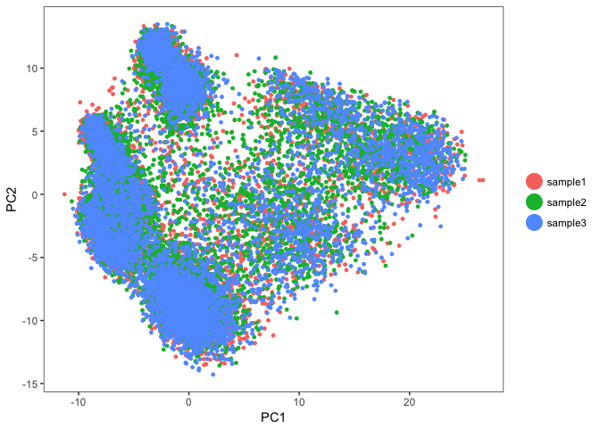
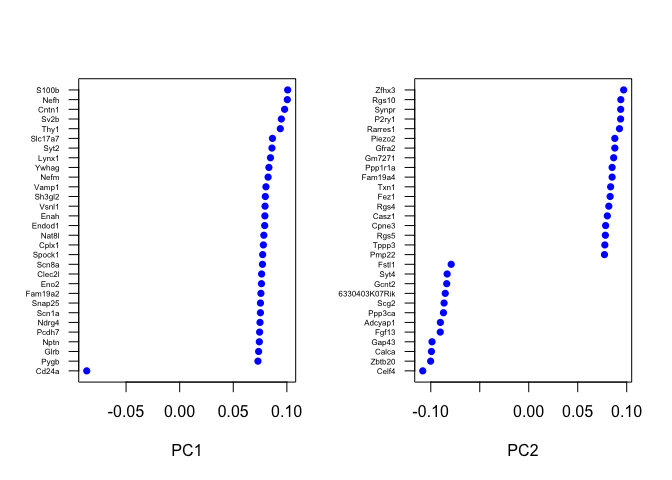
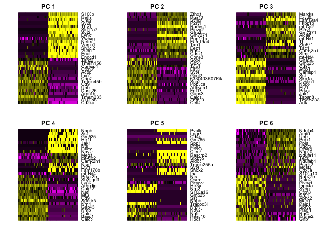
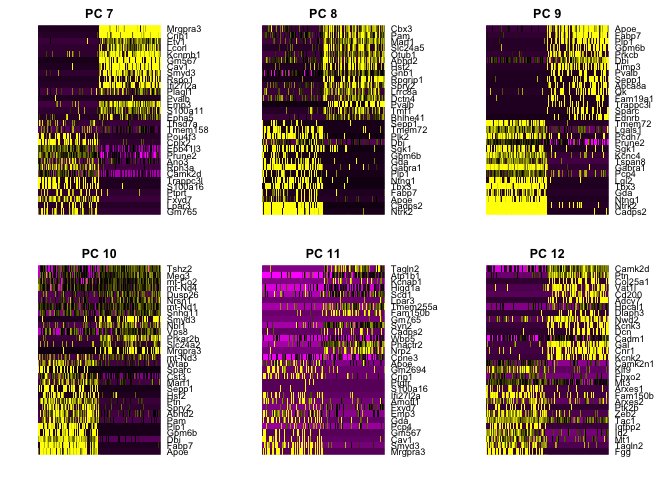
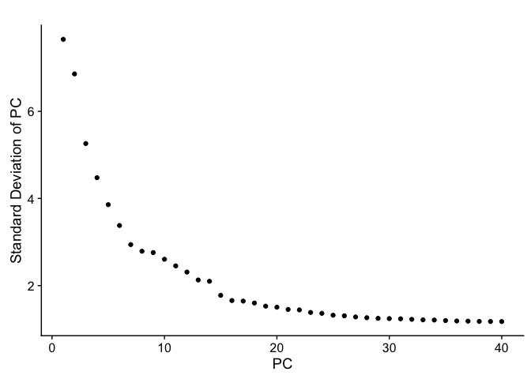
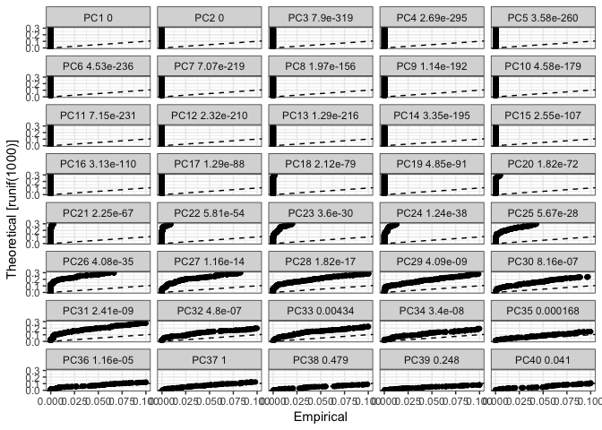

## Load the Seurat object

```r
load(file="pre_sample_corrected.RData")
experiment.aggregate
```

```
## Loading required package: Seurat
```

```
## Loading required package: ggplot2
```

```
## Loading required package: cowplot
```

```
## 
## Attaching package: 'cowplot'
```

```
## The following object is masked from 'package:ggplot2':
## 
##     ggsave
```

```
## Loading required package: Matrix
```

```
## An object of class seurat in project scRNA workshop 
##  11454 genes across 21288 samples.
```


## Now doing so for 'real'

ScaleData - Scales and centers genes in the dataset. If variables are provided in vars.to.regress, they are individually regressed against each gene, and the resulting residuals are then scaled and centered. Here we use only the highly variable genes identified above and then regress out for sample (orig.ident) and percentage mitochondria (percent.mito).


```r
?ScaleData
experiment.aggregate <- ScaleData(
  object = experiment.aggregate,
  do.scale = FALSE,
  do.center = FALSE,
  vars.to.regress = c("orig.ident", "percent.mito"))
```

```
## [1] "Regressing out orig.ident"   "Regressing out percent.mito"
## 
  |                                                                       
  |                                                                 |   0%
  |                                                                       
  |=                                                                |   1%
  |                                                                       
  |=                                                                |   2%
  |                                                                       
  |==                                                               |   3%
  |                                                                       
  |===                                                              |   4%
  |                                                                       
  |===                                                              |   5%
  |                                                                       
  |====                                                             |   6%
  |                                                                       
  |=====                                                            |   7%
  |                                                                       
  |=====                                                            |   8%
  |                                                                       
  |======                                                           |   9%
  |                                                                       
  |======                                                           |  10%
  |                                                                       
  |=======                                                          |  10%
  |                                                                       
  |=======                                                          |  11%
  |                                                                       
  |========                                                         |  12%
  |                                                                       
  |========                                                         |  13%
  |                                                                       
  |=========                                                        |  14%
  |                                                                       
  |==========                                                       |  15%
  |                                                                       
  |==========                                                       |  16%
  |                                                                       
  |===========                                                      |  17%
  |                                                                       
  |============                                                     |  18%
  |                                                                       
  |============                                                     |  19%
  |                                                                       
  |=============                                                    |  20%
  |                                                                       
  |==============                                                   |  21%
  |                                                                       
  |==============                                                   |  22%
  |                                                                       
  |===============                                                  |  23%
  |                                                                       
  |================                                                 |  24%
  |                                                                       
  |================                                                 |  25%
  |                                                                       
  |=================                                                |  26%
  |                                                                       
  |==================                                               |  27%
  |                                                                       
  |==================                                               |  28%
  |                                                                       
  |===================                                              |  29%
  |                                                                       
  |===================                                              |  30%
  |                                                                       
  |====================                                             |  30%
  |                                                                       
  |====================                                             |  31%
  |                                                                       
  |=====================                                            |  32%
  |                                                                       
  |=====================                                            |  33%
  |                                                                       
  |======================                                           |  34%
  |                                                                       
  |=======================                                          |  35%
  |                                                                       
  |=======================                                          |  36%
  |                                                                       
  |========================                                         |  37%
  |                                                                       
  |=========================                                        |  38%
  |                                                                       
  |=========================                                        |  39%
  |                                                                       
  |==========================                                       |  40%
  |                                                                       
  |===========================                                      |  41%
  |                                                                       
  |===========================                                      |  42%
  |                                                                       
  |============================                                     |  43%
  |                                                                       
  |=============================                                    |  44%
  |                                                                       
  |=============================                                    |  45%
  |                                                                       
  |==============================                                   |  46%
  |                                                                       
  |===============================                                  |  47%
  |                                                                       
  |===============================                                  |  48%
  |                                                                       
  |================================                                 |  49%
  |                                                                       
  |================================                                 |  50%
  |                                                                       
  |=================================                                |  50%
  |                                                                       
  |=================================                                |  51%
  |                                                                       
  |==================================                               |  52%
  |                                                                       
  |==================================                               |  53%
  |                                                                       
  |===================================                              |  54%
  |                                                                       
  |====================================                             |  55%
  |                                                                       
  |====================================                             |  56%
  |                                                                       
  |=====================================                            |  57%
  |                                                                       
  |======================================                           |  58%
  |                                                                       
  |======================================                           |  59%
  |                                                                       
  |=======================================                          |  60%
  |                                                                       
  |========================================                         |  61%
  |                                                                       
  |========================================                         |  62%
  |                                                                       
  |=========================================                        |  63%
  |                                                                       
  |==========================================                       |  64%
  |                                                                       
  |==========================================                       |  65%
  |                                                                       
  |===========================================                      |  66%
  |                                                                       
  |============================================                     |  67%
  |                                                                       
  |============================================                     |  68%
  |                                                                       
  |=============================================                    |  69%
  |                                                                       
  |=============================================                    |  70%
  |                                                                       
  |==============================================                   |  70%
  |                                                                       
  |==============================================                   |  71%
  |                                                                       
  |===============================================                  |  72%
  |                                                                       
  |===============================================                  |  73%
  |                                                                       
  |================================================                 |  74%
  |                                                                       
  |=================================================                |  75%
  |                                                                       
  |=================================================                |  76%
  |                                                                       
  |==================================================               |  77%
  |                                                                       
  |===================================================              |  78%
  |                                                                       
  |===================================================              |  79%
  |                                                                       
  |====================================================             |  80%
  |                                                                       
  |=====================================================            |  81%
  |                                                                       
  |=====================================================            |  82%
  |                                                                       
  |======================================================           |  83%
  |                                                                       
  |=======================================================          |  84%
  |                                                                       
  |=======================================================          |  85%
  |                                                                       
  |========================================================         |  86%
  |                                                                       
  |=========================================================        |  87%
  |                                                                       
  |=========================================================        |  88%
  |                                                                       
  |==========================================================       |  89%
  |                                                                       
  |==========================================================       |  90%
  |                                                                       
  |===========================================================      |  90%
  |                                                                       
  |===========================================================      |  91%
  |                                                                       
  |============================================================     |  92%
  |                                                                       
  |============================================================     |  93%
  |                                                                       
  |=============================================================    |  94%
  |                                                                       
  |==============================================================   |  95%
  |                                                                       
  |==============================================================   |  96%
  |                                                                       
  |===============================================================  |  97%
  |                                                                       
  |================================================================ |  98%
  |                                                                       
  |================================================================ |  99%
  |                                                                       
  |=================================================================| 100%
## [1] "Scaling data matrix"
## 
  |                                                                       
  |                                                                 |   0%
  |                                                                       
  |=====                                                            |   8%
  |                                                                       
  |===========                                                      |  17%
  |                                                                       
  |================                                                 |  25%
  |                                                                       
  |======================                                           |  33%
  |                                                                       
  |===========================                                      |  42%
  |                                                                       
  |================================                                 |  50%
  |                                                                       
  |======================================                           |  58%
  |                                                                       
  |===========================================                      |  67%
  |                                                                       
  |=================================================                |  75%
  |                                                                       
  |======================================================           |  83%
  |                                                                       
  |============================================================     |  92%
  |                                                                       
  |=================================================================| 100%
```

```r
norm.data <- experiment.aggregate@data
experiment.aggregate@data <- experiment.aggregate@scale.data
experiment.aggregate@data <- norm.data
experiment.aggregate <- ScaleData(
  object = experiment.aggregate,
  genes.use=experiment.aggregate@var.genes)
```

```
## [1] "Scaling data matrix"
## 
  |                                                                       
  |                                                                 |   0%
  |                                                                       
  |================================                                 |  50%
  |                                                                       
  |=================================================================| 100%
```

## Dimensionality reduction with PCA 

Next we perform PCA on the scaled data. By default, the genes in object@var.genes are used as input, but can be alternatively defined. Running dimensionality reduction on highly variable genes can improve performance. 


```r
?RunPCA
experiment.aggregate <- RunPCA(
  object = experiment.aggregate,
  pc.genes = experiment.aggregate@var.genes,
  do.print = TRUE,
  pcs.print = 1:5,
  genes.print = 5,
  pcs.compute = 40,
  maxit = 500)
```

```
## [1] "PC1"
## [1] "Cd24a"   "S100a6"  "Tmem233" "Arpc1b"  "Dusp26" 
## [1] ""
## [1] "S100b" "Nefh"  "Cntn1" "Sv2b"  "Thy1" 
## [1] ""
## [1] ""
## [1] "PC2"
## [1] "Celf4"  "Zbtb20" "Calca"  "Gap43"  "Fgf13" 
## [1] ""
## [1] "Zfhx3"   "Rgs10"   "Synpr"   "P2ry1"   "Rarres1"
## [1] ""
## [1] ""
## [1] "PC3"
## [1] "Adk"     "Tmem233" "Tspan8"  "Jak1"    "Prkca"  
## [1] ""
## [1] "Marcks"  "Fxyd6"   "Fam19a4" "Fkbp1b"  "mt-Co2" 
## [1] ""
## [1] ""
## [1] "PC4"
## [1] "Calcb" "Basp1" "Calca" "Nmb"   "Gap43"
## [1] ""
## [1] "Nppb"  "Sst"   "Gm525" "Htr1f" "Jak1" 
## [1] ""
## [1] ""
## [1] "PC5"
## [1] "Hpcal1" "Resp18" "Ngfr"   "Npy2r"  "Nrp1"  
## [1] ""
## [1] "Pvalb" "Lpar3" "Cd44"  "Gm765" "Spp1" 
## [1] ""
## [1] ""
```

```r
PrintPCAParams(experiment.aggregate)
```

```
## Parameters used in latest PCA calculation run on: 2018-03-22 08:21:40
## =============================================================================
## PCs computed    Genes used in calculation    PCs Scaled by Variance Explained
##     40                  1123                               TRUE
## -----------------------------------------------------------------------------
## rev.pca 
##  FALSE
## -----------------------------------------------------------------------------
## Full gene list can be accessed using 
##  GetCalcParam(object = object, calculation = "RunPCA", parameter = "pc.genes")
```

Seurat then provides a number of ways to visualize the PCA results

```r
PCAPlot(
  object = experiment.aggregate,
  dim.1 = 1,
  dim.2 = 2 )
```

<!-- -->

Visualize top genes associated with principal components

```r
VizPCA(
  object = experiment.aggregate,
  pcs.use=1:2
)
```

<!-- -->

Draws a heatmap focusing on a principal component. Both cells and genes are sorted by their principal component scores. Allows for nice visualization of sources of heterogeneity in the dataset.


```r
PCHeatmap(
    object = experiment.aggregate, 
    pc.use = 1:6, 
    cells.use = 500, 
    do.balanced = TRUE, 
    label.columns = FALSE,
    use.full = FALSE
)
```

<!-- -->

```r
PCHeatmap(
    object = experiment.aggregate, 
    pc.use = 7:12, 
    cells.use = 500, 
    do.balanced = TRUE, 
    label.columns = FALSE,
    use.full = FALSE
)
```

<!-- -->

### Selecting which PCs to use
To overcome the extensive technical noise in any single gene, Seurat clusters cells based on their PCA scores, with each PC essentially representing a metagene that combines information across a correlated gene set. Determining how many PCs to include downstream is therefore an important step. 

PCElbowPlot plots the standard deviations (or approximate singular values if running PCAFast) of the principle components for easy identification of an elbow in the graph. This elbow often corresponds well with the significant PCs and is much faster to run.


```r
PCElbowPlot(
  experiment.aggregate,
  num.pc = 40)
```

<!-- -->

The JackStraw function randomly permutes a subset of data, and calculates projected PCA scores for these 'random' genes. Then compares the PCA scores for the 'random' genes with the observed PCA scores to determine statistical signifance. End result is a p-value for each gene's association with each principal component. We identify significant PCs as those who have a strong enrichment of low p-value genes.

__WARNING: TAKES A LONG TIME TO RUN__

```r
experiment.aggregate <- JackStraw(
    object = experiment.aggregate, 
    num.replicate = 100, 
    num.pc = 40,
    do.print = FALSE
)
```


```r
JackStrawPlot(object = experiment.aggregate, PCs = 1:40, nCol = 5)
```

```
## Warning: Removed 33153 rows containing missing values (geom_point).
```

<!-- -->

Looking at the results of the JackStraw plot, we determine to use the first 35 PCs

```r
use.pcs = 1:35
```

## Finally, lets save the filtered and normalized data

```r
save(experiment.aggregate, file="pca_sample_corrected.RData")
```

## Session Information

```r
sessionInfo()
```

```
## R version 3.4.4 (2018-03-15)
## Platform: x86_64-apple-darwin15.6.0 (64-bit)
## Running under: macOS High Sierra 10.13.3
## 
## Matrix products: default
## BLAS: /Library/Frameworks/R.framework/Versions/3.4/Resources/lib/libRblas.0.dylib
## LAPACK: /Library/Frameworks/R.framework/Versions/3.4/Resources/lib/libRlapack.dylib
## 
## locale:
## [1] en_US.UTF-8/en_US.UTF-8/en_US.UTF-8/C/en_US.UTF-8/en_US.UTF-8
## 
## attached base packages:
## [1] stats     graphics  grDevices utils     datasets  methods   base     
## 
## other attached packages:
## [1] Seurat_2.2.1  Matrix_1.2-12 cowplot_0.9.2 ggplot2_2.2.1
## 
## loaded via a namespace (and not attached):
##   [1] diffusionMap_1.1-0   Rtsne_0.13           VGAM_1.0-5          
##   [4] colorspace_1.3-2     ggridges_0.4.1       class_7.3-14        
##   [7] modeltools_0.2-21    mclust_5.4           rprojroot_1.3-2     
##  [10] htmlTable_1.11.2     base64enc_0.1-3      proxy_0.4-21        
##  [13] rstudioapi_0.7       DRR_0.0.3            flexmix_2.3-14      
##  [16] prodlim_1.6.1        mvtnorm_1.0-7        lubridate_1.7.3     
##  [19] ranger_0.9.0         codetools_0.2-15     splines_3.4.4       
##  [22] R.methodsS3_1.7.1    mnormt_1.5-5         robustbase_0.92-8   
##  [25] knitr_1.20           tclust_1.3-1         RcppRoll_0.2.2      
##  [28] Formula_1.2-2        caret_6.0-78         ica_1.0-1           
##  [31] broom_0.4.3          ddalpha_1.3.1.1      cluster_2.0.6       
##  [34] kernlab_0.9-25       R.oo_1.21.0          sfsmisc_1.1-2       
##  [37] compiler_3.4.4       backports_1.1.2      assertthat_0.2.0    
##  [40] lazyeval_0.2.1       lars_1.2             acepack_1.4.1       
##  [43] htmltools_0.3.6      tools_3.4.4          bindrcpp_0.2        
##  [46] igraph_1.2.1         gtable_0.2.0         glue_1.2.0          
##  [49] reshape2_1.4.3       dplyr_0.7.4          Rcpp_0.12.16        
##  [52] trimcluster_0.1-2    gdata_2.18.0         ape_5.0             
##  [55] nlme_3.1-131.1       iterators_1.0.9      fpc_2.1-11          
##  [58] psych_1.7.8          timeDate_3043.102    gower_0.1.2         
##  [61] stringr_1.3.0        irlba_2.3.2          gtools_3.5.0        
##  [64] DEoptimR_1.0-8       MASS_7.3-49          scales_0.5.0        
##  [67] ipred_0.9-6          parallel_3.4.4       RColorBrewer_1.1-2  
##  [70] yaml_2.1.18          pbapply_1.3-4        gridExtra_2.3       
##  [73] segmented_0.5-3.0    rpart_4.1-13         latticeExtra_0.6-28 
##  [76] stringi_1.1.7        foreach_1.4.4        checkmate_1.8.5     
##  [79] caTools_1.17.1       lava_1.6             dtw_1.18-1          
##  [82] SDMTools_1.1-221     rlang_0.2.0          pkgconfig_2.0.1     
##  [85] prabclus_2.2-6       bitops_1.0-6         evaluate_0.10.1     
##  [88] lattice_0.20-35      ROCR_1.0-7           purrr_0.2.4         
##  [91] bindr_0.1.1          labeling_0.3         recipes_0.1.2       
##  [94] htmlwidgets_1.0      tidyselect_0.2.4     CVST_0.2-1          
##  [97] plyr_1.8.4           magrittr_1.5         R6_2.2.2            
## [100] gplots_3.0.1         Hmisc_4.1-1          dimRed_0.1.0        
## [103] sn_1.5-1             withr_2.1.2          pillar_1.2.1        
## [106] foreign_0.8-69       mixtools_1.1.0       survival_2.41-3     
## [109] scatterplot3d_0.3-41 nnet_7.3-12          tsne_0.1-3          
## [112] tibble_1.4.2         KernSmooth_2.23-15   rmarkdown_1.9       
## [115] grid_3.4.4           data.table_1.10.4-3  FNN_1.1             
## [118] ModelMetrics_1.1.0   metap_0.8            digest_0.6.15       
## [121] diptest_0.75-7       numDeriv_2016.8-1    tidyr_0.8.0         
## [124] R.utils_2.6.0        stats4_3.4.4         munsell_0.4.3
```
