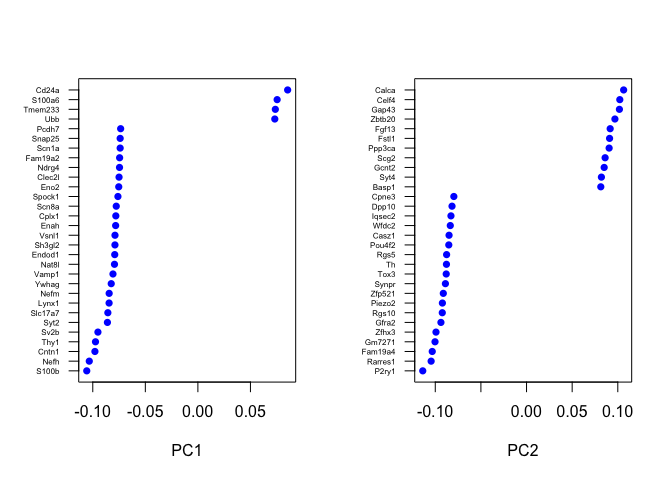
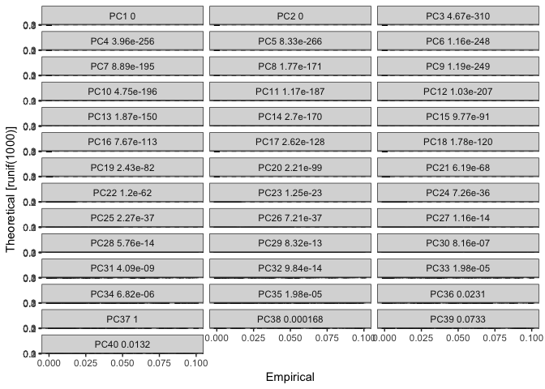
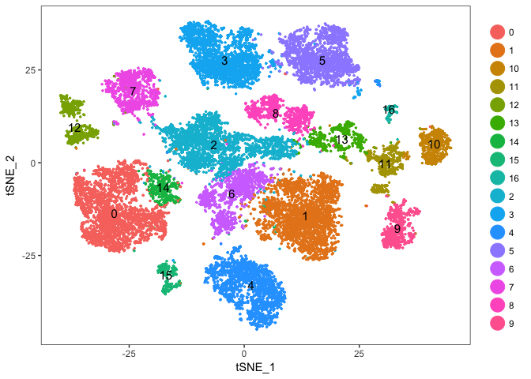
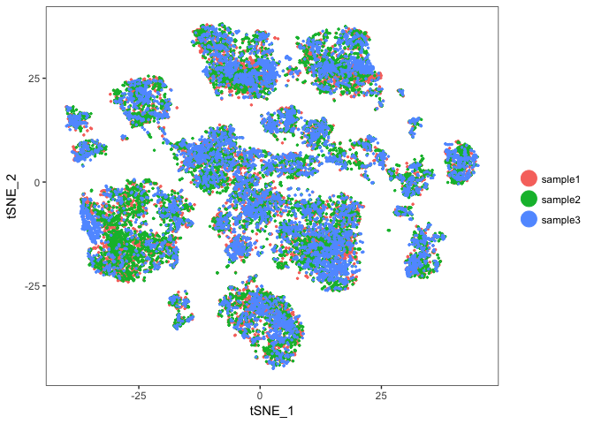
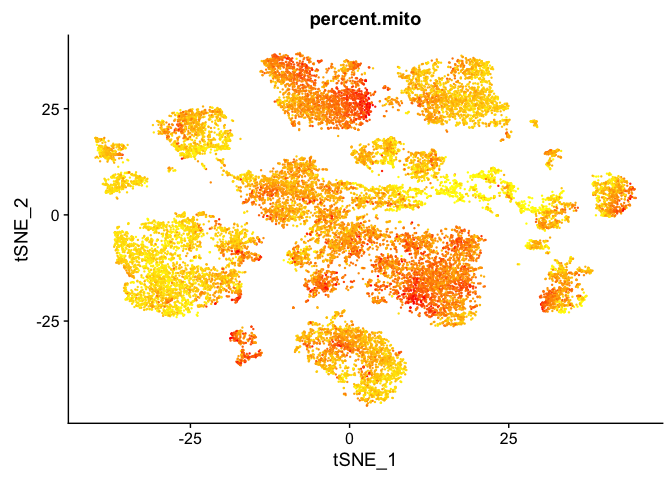
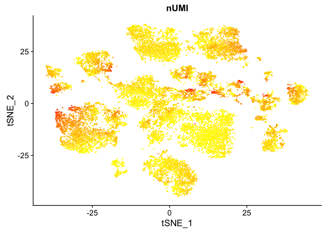
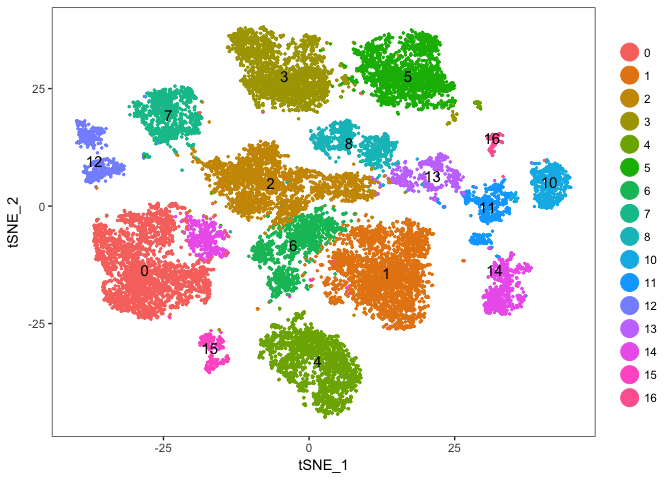
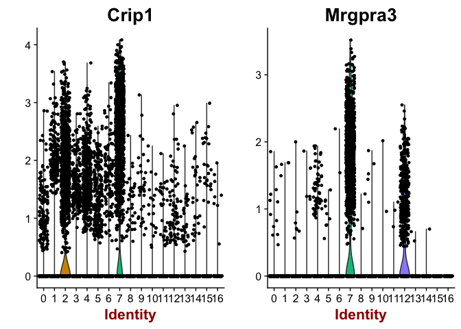
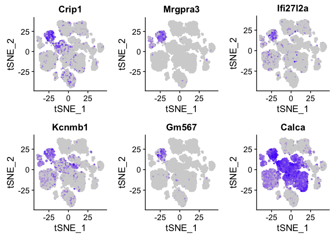

[Seurat](http://satijalab.org/seurat/) is a popular R package that is designed for QC, analysis, and exploration of single cell RNA-seq data. Seurat aims to enable users to identify and interpret sources of heterogeneity from single cell transcriptomic measurements, and to integrate diverse types of single cell data. Further, the authors provide several [tutorials](http://satijalab.org/seurat/get_started.html), on their website.

Dowload and expand the expression_tables.tar.gz file to extract the single cell matrix files for the three samples. These are isolated mouse cells ran on the 10X genomics platform for single cell RNA sequencing, sequenced with UC Davis on 1 HiSeq 4000.

* sample1, UCD_VitE_Def
* sample2, UCD_Supp_VitE
* sample3, UCD_Adj_VitE

We start with loading needed libraries for R, at this time all we need is the package [Seurat](http://satijalab.org/seurat/).

```
## Loading required package: ggplot2
```

```
## Loading required package: cowplot
```

```
## 
## Attaching package: 'cowplot'
```

```
## The following object is masked from 'package:ggplot2':
## 
##     ggsave
```

```
## Loading required package: Matrix
```

## Load the Cell Ranger Matrix Data and create the base Seurat object.
Cell Ranger provides a function `cellranger aggr` that will combine multiple samples into a single matrix file. However, when processing data in R and Seurat this is unnecessary and we can aggregate them in R.

Seurat provides a function `Read10X` to read in 10X data folder. First we read in data from each individual sample folder. First, we initialize the Seurat object (`CreateSeuratObject`) with the raw (non-normalized data). Keep all genes expressed in >= 10 cells. Keep all cells with at least 200 detected genes. Also extracting sample names, calculating and adding in the metadata mitochondrial percentage of each cell. Adding in the metadata batchid. Finally, saving the raw Seurat object.

```r
## Dataset for analysis
dataset_loc <- "expression_tables"
ids <- c("sample1", "sample2", "sample3")

d10x.data <- sapply(ids, function(i){
  d10x <- Read10X(file.path(dataset_loc,i,"outs/filtered_gene_bc_matrices/mm10/"))
  colnames(d10x) <- paste(sapply(strsplit(colnames(d10x),split="-"),'[[',1L),i,sep="-")
  d10x
})

experiment.data <- do.call("cbind", d10x.data)

experiment.aggregate <- CreateSeuratObject(
  experiment.data,
  project = "scRNA workshop", 
  min.cells = 10,
  min.genes = 200,
  names.field = 2,
  names.delim = "\\-")
```
Calculate percent mitochondrial genes per cell. In mouse these genes can be identified as those that begin with 'mt', in human data they begin with MT.

```r
mito.genes <- grep("^mt-", rownames(experiment.aggregate@data), value = T)
percent.mito <- Matrix::colSums(experiment.aggregate@raw.data[mito.genes, ]) / Matrix::colSums(experiment.aggregate@raw.data)

# AddMetaData adds columns to object@data.info, and is a great place to stash QC stats
experiment.aggregate <- AddMetaData(
  object = experiment.aggregate,
  metadata = percent.mito,
  col.name= "percent.mito")
```

The original samples names (the names above in ids) can be found in the metadata slot, column orig.ident. Here we build a new metadata variable 'batchid' which can be used to specify treatment groups.

```r
samplename = experiment.aggregate@meta.data$orig.ident
table(samplename)
```

```
## samplename
## sample1 sample2 sample3 
##    6956    7855    6874
```

```r
batchid = rep("UCD_VitE_Def",length(samplename))
batchid[samplename %in% c("sample2")] = "UCD_Supp_VitE"
batchid[samplename %in% c("sample3")] = "UCD_Adj_VitE"
names(batchid) = rownames(experiment.aggregate@meta.data)

experiment.aggregate <- AddMetaData(
  object = experiment.aggregate,
  metadata = batchid,
  col.name = "batchid")
```

Finally, save the original object, write out a tab-delimited table that could be read into excel, and view the object.

```r
## Original dataset in Seurat class, with no filtering
save(experiment.aggregate,file="original_seurat_object.RData")
# write.table(as.matrix(experiment.data),"raw.datatable.txt",sep="\t",col.names=T,row.names=T)
experiment.aggregate
```

```
## An object of class seurat in project scRNA workshop 
##  15606 genes across 21685 samples.
```

### Lets spend a little time getting to know the Seurat object.

The Seurat object is the center of each single cell analysis. It stores __all__ information associated with the dataset, including data, annotations, analyes, etc. The R function slotNames can be used to view the slot names within an object.


```r
slotNames(experiment.aggregate)
```

```
##  [1] "raw.data"     "data"         "scale.data"   "var.genes"   
##  [5] "is.expr"      "ident"        "meta.data"    "project.name"
##  [9] "dr"           "assay"        "hvg.info"     "imputed"     
## [13] "cell.names"   "cluster.tree" "snn"          "calc.params" 
## [17] "kmeans"       "spatial"      "misc"         "version"
```

We can then few the data within a slot with the `@` operator.

```r
head(experiment.aggregate@meta.data)
```

```
##                           nGene nUMI orig.ident percent.mito      batchid
## AAAACCTGAGATCACGG-sample1  1309 2435    sample1  0.075154004 UCD_VitE_Def
## AAAACCTGAGCATCATC-sample1  1331 2650    sample1  0.008301887 UCD_VitE_Def
## AAAACCTGAGCGCTCCA-sample1  1507 2817    sample1  0.038693646 UCD_VitE_Def
## AAAACCTGAGTGGGATC-sample1  1891 3625    sample1  0.005517241 UCD_VitE_Def
## AAAACCTGCAGACAGGT-sample1   786 1091    sample1  0.013748854 UCD_VitE_Def
## AAAACCTGGTATAGGTA-sample1  2505 7248    sample1  0.027179912 UCD_VitE_Def
```


```r
table(experiment.aggregate@meta.data$orig.ident)
```

```
## 
## sample1 sample2 sample3 
##    6956    7855    6874
```

## Some basic QA/QC of the metadata, print tables of the 5% quantiles.

Show 5% qunatiles for number of genes per cell per sample

```r
do.call("cbind", tapply(experiment.aggregate@meta.data$nGene,experiment.aggregate@ident,quantile,probs=seq(0,1,0.05)))
```

```
##      sample1 sample2 sample3
## 0%    602.00   575.0  852.00
## 5%    851.00   787.7 1104.65
## 10%   999.50   899.0 1197.00
## 15%  1126.00   990.0 1279.00
## 20%  1237.00  1060.0 1361.00
## 25%  1330.00  1133.0 1458.00
## 30%  1413.00  1207.0 1557.00
## 35%  1495.00  1300.0 1655.00
## 40%  1583.00  1381.0 1754.00
## 45%  1676.75  1469.0 1845.85
## 50%  1778.50  1572.0 1949.00
## 55%  1881.00  1669.7 2073.00
## 60%  1981.00  1771.4 2199.00
## 65%  2088.75  1873.0 2350.00
## 70%  2202.00  1987.0 2500.20
## 75%  2332.25  2132.5 2670.00
## 80%  2502.00  2266.0 2849.00
## 85%  2706.00  2426.9 3024.00
## 90%  3004.00  2634.0 3223.70
## 95%  3438.00  2939.0 3476.00
## 100% 5054.00  4793.0 5345.00
```

Show 5% qunatiles for number of UMI per cell per sample

```r
do.call("cbind", tapply(experiment.aggregate@meta.data$nUMI,experiment.aggregate@ident,quantile,probs=seq(0,1,0.05)))
```

```
##       sample1 sample2  sample3
## 0%    1006.00   929.0  1541.00
## 5%    1265.00  1142.7  1885.65
## 10%   1544.00  1351.0  2056.00
## 15%   1831.25  1555.0  2242.95
## 20%   2113.00  1711.0  2444.20
## 25%   2324.00  1861.0  2704.00
## 30%   2528.50  2039.2  2990.90
## 35%   2749.25  2245.0  3297.55
## 40%   3004.00  2463.0  3595.00
## 45%   3280.75  2690.3  3907.00
## 50%   3601.00  2960.0  4211.00
## 55%   3959.50  3271.0  4611.15
## 60%   4321.00  3573.4  5087.00
## 65%   4726.50  3912.6  5723.45
## 70%   5188.50  4346.0  6421.00
## 75%   5731.25  4860.5  7152.00
## 80%   6532.00  5446.0  8042.00
## 85%   7525.50  6179.6  9007.20
## 90%   8914.00  7131.2 10217.60
## 95%  11610.00  8700.5 12177.70
## 100% 27134.00 20518.0 31296.00
```

Show 5% qunatiles for number of mitochondrial percentage per cell per sample

```r
round(do.call("cbind", tapply(experiment.aggregate@meta.data$percent.mito,experiment.aggregate@ident,quantile,probs=seq(0,1,0.05))), digits = 3)
```

```
##      sample1 sample2 sample3
## 0%     0.000   0.000   0.000
## 5%     0.007   0.006   0.011
## 10%    0.011   0.010   0.018
## 15%    0.014   0.013   0.022
## 20%    0.016   0.016   0.025
## 25%    0.019   0.018   0.028
## 30%    0.021   0.021   0.032
## 35%    0.024   0.023   0.035
## 40%    0.027   0.026   0.037
## 45%    0.030   0.028   0.040
## 50%    0.033   0.031   0.043
## 55%    0.036   0.034   0.046
## 60%    0.039   0.037   0.049
## 65%    0.043   0.041   0.053
## 70%    0.047   0.044   0.056
## 75%    0.051   0.048   0.060
## 80%    0.055   0.052   0.064
## 85%    0.060   0.057   0.070
## 90%    0.067   0.064   0.076
## 95%    0.077   0.074   0.088
## 100%   0.271   0.277   0.338
```

Plot the number of cells each gene is represented by

```r
plot(sort(Matrix::rowSums(experiment.aggregate@data>=2)) , xlab="gene rank", ylab="number of cells", main="Cells per genes ( >= 2 )")
```

<!-- -->

Violin plot of 1) number of genes, 2) number of UMI and 3) percent mitochondrial genes

```r
VlnPlot(
  experiment.aggregate,
  c("nGene", "nUMI","percent.mito"),
  nCol = 1)
```

<!-- -->

Gene Plot, scatter plot of gene expression across cells, (colored by sample)

```r
GenePlot(
  experiment.aggregate, "nUMI", "nGene",
  cex.use = 0.5)
```

<!-- -->

### Cell filtering
We use the information above to filter out cells. Here we choose those that have percent mitochondrial genes max of 10% and unique UMI counts under 20,000 or greater than 500, Note that low.thresholds and high.thresholds are used to define a 'gate' -Inf and Inf should be used if you don't want a lower or upper threshold.


```r
experiment.aggregate <- FilterCells(
  object = experiment.aggregate,
  subset.names = c("percent.mito"),
  low.thresholds = c(-Inf),
  high.thresholds = c(0.1))

experiment.aggregate <- FilterCells(
  object = experiment.aggregate,
  subset.names = c("nUMI"),
  low.thresholds = c(500),
  high.thresholds = c(20000))

experiment.aggregate@data
```

```
## 15606 x 21288 sparse Matrix of class "dgCMatrix"
```

```
##    [[ suppressing 29 column names 'AAAACCTGAGATCACGG-sample1', 'AAAACCTGAGCATCATC-sample1', 'AAAACCTGAGCGCTCCA-sample1' ... ]]
##    [[ suppressing 29 column names 'AAAACCTGAGATCACGG-sample1', 'AAAACCTGAGCATCATC-sample1', 'AAAACCTGAGCGCTCCA-sample1' ... ]]
```

```
##                                                                                      
## Xkr4           . . .  . .  . .  . .  .  . .  . . .  .  . . . . .  . .  .  . . .  .  .
## Sox17          . . .  . .  . .  . .  .  . .  . . .  .  . . . . .  . .  .  . . .  .  .
## Mrpl15         . 1 .  . .  1 .  . .  .  1 .  1 . .  .  . . . . .  . .  .  . . .  .  .
## Lypla1         . 1 .  . .  . .  1 1  .  1 .  . 1 1  .  . . . 2 .  . .  .  . . .  .  .
## Tcea1          . . .  . .  . .  . .  .  1 .  1 . .  .  . . . . .  . .  .  . . .  .  1
## Rgs20          . . .  . .  . 1  . .  .  . .  . . .  .  . . . . 1  . .  .  . . .  .  .
## Atp6v1h        . . .  . .  . 1  . .  .  . .  . . .  1  1 . . . .  . .  .  . . .  .  .
## Oprk1          . . .  . .  . .  . .  .  . .  . . .  .  . . . . .  . .  .  . . .  .  .
## Rb1cc1         . 1 .  1 1  . .  . .  .  1 .  1 . 1  .  . . . . 1  . .  .  . 1 .  .  .
## 4732440D04Rik  . . .  . .  . .  . .  .  . .  . . .  .  . . . . .  . .  .  . . .  .  .
## St18           . . .  . .  . .  . .  .  . .  . . .  .  . . . . .  . .  .  . . .  .  .
## Pcmtd1         . . .  . .  . .  1 1  .  . .  . . .  .  . . . . 1  . .  .  . . .  .  1
## Gm26901        . . .  . .  . .  . .  .  . .  . . .  .  . . . . .  . .  .  . . .  .  .
## Sntg1          . . .  . .  . .  . .  .  . .  . . .  .  . . . . .  . .  .  . . .  .  .
## Rrs1           . . 1  . 2  1 .  . .  .  . .  . . .  .  . . . 3 .  . 1  .  . 1 .  1  .
## Mybl1          . . .  . .  . .  1 .  .  . .  . . .  .  . . . . .  . .  .  . . .  .  .
## Vcpip1         . 1 .  . .  3 .  . .  2  . .  1 . .  1  . 1 . . 1  . .  1  . . .  1  .
## 1700034P13Rik  . . .  . .  . .  . .  .  . .  . . .  .  . . . . .  . .  .  . . .  .  .
## Sgk3           . . .  . .  . .  . .  .  . .  . . .  .  . . . . .  . .  .  . . .  .  .
## Mcmdc2         . . .  . .  . .  . .  .  . .  . . .  .  . . . . .  . .  .  . . .  .  .
## Snhg6          . . 1  1 .  1 .  1 .  .  . .  . . 1  1  1 . . . .  . .  .  . . .  .  .
## Tcf24          . . .  . .  . .  . .  .  . .  . . .  .  . . . . .  . .  .  . . .  .  .
## Cops5          . . .  . .  1 .  1 .  .  1 .  . 1 .  1  4 . . . .  . .  .  1 . .  .  .
## Cspp1          . . .  . 1  . .  . .  .  . .  . . .  .  . . 1 . .  . .  .  1 . .  .  .
## Arfgef1        . . .  . .  . .  . .  1  1 .  1 . 1  1  . . . . .  . .  .  . . .  .  2
## Cpa6           . . .  . .  . .  . .  .  . .  . . .  .  . . . . .  . .  .  . . .  .  .
## Prex2          . . .  . .  . .  . .  .  . .  . . .  .  . . . . 1  . .  .  . . .  .  .
## A830018L16Rik  . . .  . .  . .  . .  .  . .  . . .  .  . . . . .  . .  1  . . .  .  .
## Sulf1          . . .  . .  . .  . .  .  . .  . . .  .  . . . . 1  . .  .  . 1 .  .  .
## Slco5a1        . . .  . .  . .  . .  .  . .  . . .  .  . . . . .  . .  .  . . .  .  .
## Ncoa2          . . .  . .  . .  . .  1  . .  . . .  .  . 1 . . .  . .  .  . . 1  .  1
## Tram1          1 . 1  . .  1 .  . 1  .  . .  . 1 .  .  . 1 . . 1  . .  .  . . 1  .  1
## Lactb2         . . .  . .  . .  . .  1  . .  . . .  .  . . . 1 .  . .  .  . . .  .  .
## Gm9947         . . .  . .  . .  . .  .  1 .  . . .  .  . . . . .  . .  .  . . .  .  .
## Msc            . . .  . .  . .  . .  .  . .  . . .  .  . . . . .  . .  .  . . .  .  .
## Trpa1          . . .  . .  . .  . .  .  . .  . . .  .  . . . 1 .  . .  .  . . .  .  .
## Kcnb2          . 1 .  2 .  3 1  3 1  .  1 .  4 2 .  1  . . . . .  1 1  1  5 1 .  .  1
## Terf1          . . .  . 1  . .  . .  .  . .  1 . 1  1  . . . . .  . .  .  . . .  .  .
## Sbspon         . . .  . .  . .  . .  .  . .  . . .  .  . . . . .  . .  .  . . .  .  .
## 4930444P10Rik  . . .  . .  . .  . .  .  . .  . . .  .  . . . . .  . .  .  . . .  .  .
## Rpl7           . 2 .  2 .  1 .  3 3  .  3 .  . 1 1  1  1 1 2 1 1  . 2  2  . . 3  3  .
## Rdh10          . . .  . .  . .  . .  .  . .  . . .  .  . . . . .  . .  .  . . .  .  .
## Stau2          1 . 2  1 .  2 .  . .  .  . .  . 3 1  1  2 . . 2 1  1 .  .  3 . .  .  .
## Ube2w          . . .  . .  . .  . .  1  1 2  1 . 2  1  1 . 2 . 1  . 1  1  . 1 .  .  .
## Tceb1          . 4 1  3 .  5 1  2 1  .  4 3  1 . 4  2  5 1 2 4 1  . 1  .  1 . 1  3  1
## D030040B21Rik  . . .  . .  . .  . .  .  . .  . . .  .  . . . . .  . .  .  . . .  .  .
## Tmem70         . . .  . .  1 .  . .  .  . .  . . 1  .  . . . 1 .  . .  .  . . 1  .  .
## Ly96           . . .  . .  . .  . .  .  . .  . . .  .  . . . . .  . .  .  . . .  .  .
## Jph1           . . .  . .  . .  1 .  .  . .  . . .  .  . . . . .  . .  .  . . .  .  .
## Gdap1          . . .  . .  . 2  . 1  .  2 .  1 1 2  .  1 . . . .  . 1  .  2 1 1  .  .
## Pi15           . . .  . .  . .  . .  .  . .  . . .  .  . . . . .  . .  .  . . .  .  .
## Crispld1       . . .  . .  . .  . .  .  . .  . . .  .  . . . . .  . .  .  . . .  .  .
## Mcm3           . . .  . .  . .  . .  .  . .  . . .  .  . . . . .  . .  .  . . .  .  .
## 6720483E21Rik  . . .  . .  . .  . .  .  . .  . . .  .  . . . . .  . .  .  . . .  .  .
## Paqr8          . . .  . .  . 1  . .  .  . .  . . .  .  . . 1 . .  . .  1  . . .  .  .
## Efhc1          . . .  . .  . .  . .  .  . .  . . .  .  . . . . .  . .  .  1 . .  .  .
## Tram2          . . .  . .  . .  . .  .  . .  . . .  .  . . . . .  . .  .  . . .  .  .
## Tmem14a        1 1 .  . .  2 .  . .  .  . .  . . .  .  2 . 1 . .  . .  .  . . .  .  .
## Gsta3          . . .  . .  . .  . .  .  . .  . . .  .  . . . . .  . .  .  . . .  .  .
## Gm28836        . . .  . .  . .  . .  .  . .  . . .  .  . . . . .  . .  .  . . .  .  .
## Kcnq5          . . .  . .  . .  . 1  .  . .  . . .  .  . . . . .  . .  .  . . .  .  .
## Rims1          2 . .  . .  . .  . .  .  1 .  . . 1  .  . . . . .  . .  .  1 . .  .  .
## 4933415F23Rik  . . .  . .  . .  . .  .  . .  . . .  .  . . . . .  . .  .  . . .  .  .
## Gm29107        . . .  . .  . .  . .  .  . .  . . .  .  . . . . .  . .  .  . . .  .  .
## Ogfrl1         2 1 2  1 .  5 1  . 2  4  2 .  3 2 1  2  1 . . 3 .  . 1  1  3 . .  .  .
## B3gat2         . . .  . .  . .  . .  .  . .  . . .  .  . . . . .  . .  .  . . .  .  .
## Smap1          1 . 1  . .  2 1  . .  .  2 1  . . 1  .  2 1 1 . .  . .  1  2 . .  .  .
## Sdhaf4         . . .  . .  2 .  . .  .  2 .  . . 3  .  1 . . 3 .  . .  1  . . .  1  .
## Fam135a        . . .  . .  1 .  . .  .  . 1  . . .  .  . . 1 . .  . .  .  . . .  .  1
## Col19a1        . . .  . .  1 .  . .  .  . .  . . .  .  . . . . .  . .  .  . . .  .  .
## Lmbrd1         . . .  . .  . .  . .  .  . .  . . .  .  1 . . 1 .  . .  .  . . .  .  .
## Adgrb3         . . .  . .  . .  1 .  .  . .  . . .  .  . . . . .  . .  .  . . .  .  .
## Phf3           . . .  . .  . .  . .  1  . 1  . . 1  .  1 . . . .  . 1  .  . . 1  .  .
## Ptp4a1         . . 1  . .  . 1  1 .  .  1 .  3 . .  .  . . . 1 1  . 3  .  . . .  1  .
## Khdrbs2        . . .  . .  . .  . .  .  . .  . . .  .  . . . . .  . .  .  . . .  .  1
## Prim2          . . .  . .  . .  . .  .  . .  . . .  .  . . . . .  . .  .  . . .  .  .
## Rab23          . . .  . .  . .  . .  .  . .  . . .  .  . . . . .  . .  .  . . .  .  .
## Bag2           . 1 1  . .  . .  . .  .  4 .  . . .  .  1 . . . .  . .  .  . . .  1  .
## Zfp451         . . .  . .  . .  . .  .  2 .  . . 1  .  1 . . . .  1 .  .  . . .  .  .
## Bend6          . . .  . .  1 .  . .  .  . .  4 . .  1  . . . . .  . 1  .  . . .  .  .
## Dst            1 1 1  2 .  5 1  2 .  2  2 .  3 . 2  1  2 2 2 4 1  . 4  1  2 . 2  2  2
## Ccdc115        . . .  . .  . .  . .  1  2 .  . . .  3  . . . . .  . .  .  1 . .  .  .
## Imp4           . . .  . .  . .  . .  .  . .  . . .  .  . . . . .  . .  .  . . .  .  .
## Ptpn18         . . .  . .  . .  . .  .  . .  . . .  .  . . . . .  . .  .  . . .  .  .
## Amer3          . . .  . .  . .  . .  .  . .  . . .  .  . . . . .  . .  .  . . .  .  .
## Arhgef4        . . .  1 .  . .  . .  .  . .  . . .  .  . . . . .  . .  .  . . .  .  .
## Fam168b        1 . .  . 1  . .  . .  1  . .  1 . .  .  . . . . .  . .  .  1 . 1  .  .
## Plekhb2        . . .  2 .  3 1  . .  .  1 1  2 . 1  .  . . 1 1 .  . .  1  . . .  3  1
## 1110002O04Rik  . . .  . .  . .  . .  .  . .  . . .  .  . . . . .  . .  .  . . .  .  .
## Hs6st1         . . .  . .  . .  . .  .  . .  1 1 .  .  . . . . .  . .  .  . . .  .  .
## Uggt1          . . .  . .  1 .  . .  .  1 .  . . .  .  . . 1 . .  . .  .  1 . .  .  1
## Arid5a         . . .  . .  . .  . .  .  . .  . . .  .  . 1 . . .  . .  .  . . .  .  1
## 4930403P22Rik  . . .  . .  . .  . .  .  . .  . . .  .  . . . . .  . .  .  . . .  .  .
## Kansl3         . . .  . .  . .  . .  1  . .  . . .  .  . . . . .  . .  .  . . .  .  .
## Lman2l         . . .  . .  . 2  . .  .  . .  . . .  .  . . . . .  . .  .  . . .  .  .
## Cnnm4          . . .  . .  . .  . .  .  . .  . . .  .  . . . . .  . .  .  . . .  .  .
## Cnnm3          . . .  . .  . .  . .  .  . .  . . .  .  1 . . . .  . .  .  . . .  .  .
## Ankrd39        . . .  . .  . .  . .  1  1 .  . . .  .  . . . . .  . .  .  . . .  .  .
## Sema4c         . . .  . .  . .  . .  .  1 .  . . .  .  . . . . .  . .  .  . . .  1  .
## Fam178b        . . .  . .  . .  . .  .  1 .  . . .  .  . . . . .  . .  .  . . .  .  .
## Cox5b          3 5 2  . . 17 . 10 2  7 15 6  4 3 7  4  8 3 6 8 3  . . 13  2 . .  5  1
## Actr1b         . 2 .  1 .  . 1  . .  1  1 .  1 . 1  1  . . 3 1 .  . .  .  . 1 .  .  .
## Zap70          . . .  . .  . .  . .  .  . .  . . .  .  . . . . .  . .  .  . . .  .  .
## Tmem131        . . .  . .  . .  . .  .  . .  . . .  .  . . . . .  . .  .  . . .  .  .
## Vwa3b          . . .  . .  . .  . .  .  . .  . . .  .  . . . . .  . .  .  . . .  .  .
## Cnga3          . . .  . .  . .  . .  .  . .  . . .  .  . . . . .  . .  .  . . .  .  .
## Inpp4a         . . .  1 .  2 .  . .  .  . .  . 1 .  .  . . 1 . .  1 .  .  6 . 1  .  .
## Coa5           . 1 .  . .  1 .  1 .  .  . 1  1 . .  .  . . . . .  2 .  .  . . .  .  1
## Unc50          . 1 .  . .  . .  . .  .  3 .  . . 1  1  1 . . 1 1  . .  .  . . .  .  .
## Mgat4a         . . .  . .  . .  1 .  .  . .  . 1 .  .  . . . . .  . .  .  . . 1  .  .
## 2010300C02Rik  1 . .  . .  . .  . .  .  . .  . . .  .  . . . . .  . .  .  . . .  .  .
## Tsga10         . . .  . .  . .  . .  .  . .  . . .  .  . . . . .  . .  .  . . .  .  .
## Lipt1          . . .  . .  . .  . .  .  . .  . . .  .  . . . . .  . .  .  . . .  .  .
## Mitd1          . . .  . .  . .  . .  .  . .  . . .  .  1 . . . .  . .  .  . . .  .  .
## Mrpl30         . 1 3  1 .  . .  . .  .  1 2  . 1 .  2  1 . . . .  . .  .  2 . 1  .  .
## Txndc9         . . 1  . .  . .  . .  .  1 .  . . .  .  . . . . .  . 1  .  . 1 .  .  .
## Eif5b          . . 1  . .  1 1  . .  .  1 1  1 4 2  2  . . . . .  . 1  .  1 1 .  1  .
## Rev1           . . .  . .  . .  1 .  .  1 .  . . .  .  . . . . .  . .  .  . . .  .  .
## Aff3           . . .  . .  . .  . .  .  . 1  . . .  1  . . . . .  . .  .  . . .  .  2
## Gm16152        . . .  . .  . .  . .  .  . .  . . .  .  . . . . .  . 1  .  . . .  .  1
## Lonrf2         . . .  1 .  . .  . .  1  . 1  . . .  .  . . . . .  . .  .  . . .  .  .
## Chst10         . . .  . .  . .  . .  .  . .  . . .  .  . . . . .  . .  .  . . .  .  .
## Nms            . . .  . .  . .  . .  .  . .  . . .  .  . . . . .  . .  .  . . .  .  .
## Pdcl3          . . .  . .  1 .  1 .  .  1 .  . . .  .  2 . . 1 .  . .  1  . 1 .  .  .
## Npas2          . . .  . .  . .  . .  .  . .  . . .  1  . . . . .  . .  .  . . .  .  .
## Rpl31          4 1 4  2 .  2 2  4 2  2 13 1  4 1 2  1  5 . 3 . 1  . 2  4  2 3 1  3  .
## Tbc1d8         . . .  . .  . .  . .  .  . .  . . .  .  . . . . .  . .  .  . 1 .  .  .
## Cnot11         . . .  . 1  . .  . .  .  . .  . . .  .  1 . . . .  . .  .  . . .  .  1
## Rnf149         . . .  . 1  . .  . .  .  2 .  . . .  .  . . . . .  . .  .  . . 1  .  .
## Creg2          . . .  . .  . .  . .  .  . .  . . .  .  . . . . .  . .  .  . . .  .  .
## D930019O06Rik  . . .  . .  . .  . .  .  . .  . . .  .  . . . . .  . .  .  . . .  .  .
## Map4k4         . . .  . .  . .  . .  .  . 1  . . .  .  1 2 . . .  . .  .  . . .  .  .
## Il1r2          . . .  . .  . .  . .  .  . .  . . .  .  . . . . .  . .  .  . . .  1  .
## Gm16894        . . .  . .  . .  . .  .  . .  . . .  .  . . . . .  . .  .  . . .  .  .
## Il1r1          . . .  . .  . .  . .  .  . .  . . .  .  . . . . .  . .  .  . . .  .  .
## Slc9a2         . . .  . .  . .  . .  .  . .  . . .  .  . . . . .  . .  .  . . .  .  .
## Mfsd9          . . .  . .  . .  . .  .  . .  . . .  .  . . . . .  . .  .  . . .  .  .
## Mrps9          . . 1  . .  1 .  . .  .  1 .  . . .  .  . . . . .  . .  .  . . .  .  .
## Gpr45          . . .  1 .  . .  1 .  .  . .  . . .  .  . . 1 . .  . .  .  . . .  .  2
## Tgfbrap1       . . .  . .  . .  . .  .  . .  1 . 1  .  . . . . .  . .  .  . . .  .  .
## 8430432A02Rik  . . .  . .  . .  . .  .  . .  . . .  .  . . . . .  . .  .  . . .  .  .
## AI597479       . . .  . .  . .  . .  .  1 .  . . .  .  . . . . .  . .  1  . . .  .  .
## Fhl2           . . .  . .  . .  . .  .  . .  1 . .  .  . . . . .  . .  .  . . .  .  .
## Nck2           . . .  . .  . .  . .  .  . .  . . .  .  . . . . .  . .  .  . . .  .  .
## 1500015O10Rik  . . .  . .  . .  . .  .  . .  . . .  .  . . . . .  . .  .  . . .  .  .
## Gm29156        . . .  . .  . .  . .  .  . .  . . .  .  . . . . .  . .  .  . . .  .  .
## Uxs1           . . .  . .  . .  1 .  1  . .  . . 1  .  . . . . .  . .  .  . . .  .  .
## Tpp2           . 1 .  . .  . .  . .  .  . .  . . .  .  . . . 1 .  . .  .  . . .  .  .
## Tex30          . . .  . .  . .  . .  .  . .  . . .  .  . . . . .  . .  .  . . .  .  .
## Kdelc1         . . .  . .  . .  . .  .  . .  . . .  .  . . . . .  . .  .  . . .  .  .
## Bivm           . . .  . .  . .  . .  1  . .  . . .  .  . . . 1 .  . .  .  . . .  .  .
## Ercc5          . . .  . .  . .  . .  .  . .  . . .  .  . . . . 1  . .  .  . . .  .  .
## Gulp1          . . .  . .  . .  . .  .  . .  . . .  .  . . . . .  . .  .  . . .  .  .
## Col3a1         . . .  . 1  . .  . .  .  . .  . . .  .  . . . . .  . .  .  . . .  .  .
## Col5a2         . . .  . .  . .  . .  .  . .  . . .  .  . . . . .  . .  .  . . .  .  .
## Wdr75          . . .  . .  . .  . .  .  . .  . . .  .  . . . 1 .  . .  .  . . .  .  .
## Slc40a1        . . .  . .  . .  . .  .  . .  . . .  .  . . . . .  . .  .  . . .  .  .
## Dnah7b         . . .  . .  . .  . .  .  . .  . . .  .  . . . . .  . .  .  . . .  .  .
## Slc39a10       . . 1  . .  . .  . .  1  1 .  . . .  .  1 . . . .  . .  .  2 . .  .  1
## Gm28151        . . .  . .  . .  . .  .  . .  . . .  .  . . . . .  . .  .  . . .  .  .
## Tmeff2         2 . .  2 .  1 1  . .  .  1 .  3 . .  .  6 . . . .  . .  .  1 . .  .  .
## Gm29325        . . .  . .  . .  . .  .  . .  . . .  .  . . . . .  . .  .  . . .  .  .
## 9330175M20Rik  . . .  . .  . .  . .  .  . .  . . .  .  . . . . .  . .  .  . . .  .  .
## Sdpr           . . .  . .  . .  . .  .  . .  . . .  .  . . . . 1  . .  .  . . .  .  .
## Nabp1          . . .  . .  . .  . .  .  . .  . . .  .  . . . . .  . .  .  . . .  .  .
## Myo1b          . . .  . .  . .  . 1  .  . .  . . .  1  . . . . .  . .  .  . . .  .  1
## Stat1          . . .  . .  . .  . .  .  . .  . . .  .  . 1 . . .  . .  .  . . .  .  .
## Gls            . 1 1  2 .  . .  . .  2  1 .  1 . 1  2  2 1 . . .  1 .  1  2 1 .  .  1
## Nab1           . . .  . .  . .  . .  .  . .  . . .  .  . . . . .  . .  .  . . .  .  .
## Tmem194b       . . .  . .  . .  . .  .  . .  . . .  .  . . . . .  . .  .  . . .  .  .
## Mfsd6          1 . .  . .  . 1  . .  1  . .  . . 1  1  . . . . .  . 1  .  . . .  .  .
## Inpp1          . . .  . .  1 .  . .  .  . .  1 . .  .  . . 1 . .  . .  1  . . .  .  .
## Hibch          . . .  1 .  . .  . .  .  1 .  . . 1  .  . . . . .  . .  .  . . .  .  .
## 1700019D03Rik  . . .  . .  . .  . .  .  . .  . . .  .  . . . . .  . .  .  . . .  .  .
## Mstn           . . .  . .  . .  . .  .  . .  . . .  .  . . . . .  . .  .  . . .  .  .
## Pms1           . . .  . .  . .  . .  .  . .  . . .  .  . . . . .  . .  .  . . .  .  .
## Ormdl1         . . .  . .  . .  . .  .  . .  . . .  .  . . . . .  . .  .  . . .  .  .
## Osgepl1        . . .  . .  . .  1 .  .  . .  . . .  .  . . . . .  . 1  .  . . .  .  .
## Gm28551        . . .  . .  . .  . .  .  . .  . . .  .  . . . . .  . .  .  . . .  .  .
## Asnsd1         . . .  . .  . .  . .  .  . .  . . .  .  . . . . 1  . .  .  . 1 .  .  .
## Dnah7a         . . .  . .  . .  . .  .  . .  . . .  .  . . . . .  . .  .  . . .  .  .
## Stk17b         . . .  1 .  . .  . .  .  . .  . . .  .  . . . . .  . .  .  . . .  .  .
## Hecw2          . . .  . .  . .  1 .  .  . .  . . 1  .  . . . . .  . .  .  . . .  .  .
## Gtf3c3         . . .  . .  . .  . .  .  . .  . . .  .  . . . . .  . .  .  . . 1  .  .
## Pgap1          . . .  . 1  . .  . .  .  . .  . . .  .  . . . 1 .  . .  .  . . .  .  .
## Ankrd44        . . .  . .  . .  . .  .  . .  . . .  1  . . . . .  . .  .  . . .  .  .
## Sf3b1          1 . .  . .  . 1  . 1  .  . 1  . . .  .  . . . . 1  . .  .  . . 1  .  2
## Coq10b         . 1 .  . .  1 1  . .  .  . .  . . .  .  . . . . .  . .  1  . . .  .  .
## Hspd1          . 2 .  . .  1 .  . .  3  . .  . . .  1  3 . . . .  . .  2  1 . .  .  .
## Hspe1          . . .  2 .  9 1  4 .  2  8 2  2 . 3  1  2 . 3 . 1  . 1  2  2 1 .  1  2
## Mob4           . . .  1 .  . .  2 1  .  4 .  . 2 1  4  . 1 . 1 .  . .  .  1 1 2  .  .
## Rftn2          . . .  . .  . .  . .  .  . .  . . .  .  . . . . .  . .  .  . . .  .  .
## Gm10561        . . .  . .  . .  . .  .  . .  . . .  .  . . . . .  . .  .  . . .  .  .
## Mars2          . . .  . .  . .  . .  .  . .  . . .  .  . . . . .  . .  .  . . .  .  .
## Plcl1          . . .  . .  . .  . .  .  . .  . . .  .  . . . . .  . .  .  . . .  .  .
## 1700066M21Rik  . . .  . .  . .  . .  .  . .  . . .  .  . . . 1 .  . .  .  . . .  .  .
## Tyw5           . . .  . .  . .  . .  .  . .  . . .  .  . . . . 1  . .  .  . . .  .  .
## 9430016H08Rik  . . .  . .  . .  . .  .  . .  . 1 .  .  1 . . . .  . .  .  . . .  1  .
## Spats2l        . . .  . .  2 .  . .  1  . .  . 1 .  .  1 . . . .  . .  .  . . .  .  .
## Kctd18         . . .  . .  . .  . .  .  . .  1 . .  .  . . . . .  . .  .  . . .  .  .
## Sgol2a         . . .  . .  . .  . .  .  . .  . . .  .  . . . . .  . .  .  . . .  .  .
## Aox1           . . .  . .  . .  . .  .  . .  1 . .  .  . . . . .  . .  .  . . .  .  .
## Aox3           . . .  . .  . .  . .  .  . .  . . .  .  . . . . .  . .  .  . . .  .  .
## Aox4           . . .  . .  . .  . .  .  . .  . . .  .  . . . . .  . .  .  . . .  .  .
## Bzw1           . . 1  . .  1 .  . .  1  2 .  . . .  1  1 . 1 1 .  . .  1  1 1 .  .  .
## Clk1           . . .  . .  . 1  . .  .  . .  . . .  1  1 . . . .  . .  .  . . .  .  .
## Ppil3          . . .  . .  . .  . .  1  . .  . . .  .  . . . . .  . .  .  1 . .  .  .
## Nif3l1         . . .  . .  . .  . .  .  . .  . . .  .  . . . . .  . .  .  . . .  .  .
## Orc2           1 . 1  . .  . .  . .  .  . .  . . .  .  . . . . .  . .  .  1 . .  1  .
## Gm15834        . . .  . .  . .  . .  .  . .  . . .  .  . . . . .  . .  .  . . .  .  .
## Fam126b        . . .  . .  . .  . .  .  . 1  . . 1  .  . . . . 1  . .  .  1 . .  .  .
## Ndufb3         . 2 1  5 3  4 .  1 .  3  5 2  1 1 1  1  2 . 2 4 1  . .  .  . 1 .  1  1
## Als2cr12       . . .  . .  . .  . .  .  . .  . . .  .  . . . . .  . .  .  . . .  .  .
## Cflar          . . .  . .  1 .  . .  .  . .  2 . 1  .  . . . 1 .  . .  .  . . .  .  .
## Casp8          . . .  . .  . .  . .  .  . .  . . .  .  . . . . .  . .  .  . . .  .  .
## Trak2          . . .  1 .  1 .  . .  1  . 1  . 2 .  .  . . . . .  . .  .  . . .  .  .
## Stradb         . . .  . .  . .  . .  .  . .  . . .  .  . . . . .  . .  1  . . .  .  .
## Tmem237        . . .  . .  . 1  1 .  .  . .  . . .  .  . 1 . . .  . .  .  . . .  1  .
## G730003C15Rik  . . .  . .  . .  . .  .  . .  . . .  .  . . . . .  . .  .  . . .  .  .
## Mpp4           . . .  . .  . .  . .  .  . .  . . .  .  . . . . .  . .  .  . . .  .  .
## Als2           . . .  . .  . .  . .  .  . .  . . .  .  . . . . .  . .  .  . . .  .  .
## Cdk15          . . .  . .  . .  . .  .  . .  . . .  1  . . . . .  . .  .  . . .  .  .
## Fzd7           . . .  . .  . .  . .  .  . .  . . .  .  . . . . .  . .  .  . . .  .  .
## Sumo1          1 3 4  2 2  1 .  2 .  1 10 3  1 . 1  1  3 1 2 6 1  1 .  2  1 1 .  4  2
## Nop58          . . .  . .  1 .  . .  .  . 1  . . 1  .  . . . . .  . .  .  . . .  .  1
## Bmpr2          . 1 .  . .  3 1  1 2  2  . .  2 . 1  .  1 1 1 1 .  . .  .  3 2 .  .  2
## Fam117b        1 . .  1 .  . .  . .  .  . .  . . .  1  1 1 . . .  . .  .  . . 1  .  .
## Ica1l          . . .  . .  . .  . .  .  . .  1 . .  1  . . . . .  . .  .  . 1 .  .  .
## Wdr12          . . .  . .  . .  1 .  .  1 .  . . .  .  . . . . .  . 1  .  . . .  .  .
## Carf           . . .  . .  . .  . .  .  . .  . . .  .  . . . . .  . .  .  . . .  .  .
## Nbeal1         1 2 1  1 .  . 1  . 1  1  . .  . 1 .  .  . . . . 1  . 1  3  1 1 1  .  1
## Cyp20a1        . . .  . .  . .  . .  .  . .  1 . .  .  . . . . .  . .  .  . . .  .  .
## Abi2           . . .  . .  . .  1 .  1  . .  . . .  .  1 . . . .  . 1  .  . . .  .  1
## Raph1          . . .  1 .  . .  2 .  .  1 .  . . 1  .  1 2 . 2 1  . 1  .  1 . 1  .  .
## Cd28           . . .  . .  . .  . .  .  . .  . . .  .  . . . . .  . .  .  . . .  .  .
## 9530026F06Rik  . . .  . .  . .  . .  .  . .  . . .  .  . . . . .  . .  .  . . .  .  .
## Pard3b         . . .  . .  . .  . .  .  . .  . . .  .  . . . . .  . .  .  . . .  .  .
## Nrp2           1 . .  1 .  . .  . .  4  . .  5 . 2  .  . . . . .  . .  .  . . .  .  .
## Gm29083        . . .  . .  . .  . .  .  . .  . . .  .  . . . . .  . .  .  . . .  .  .
## Gm4208         . . .  . .  . .  . .  .  . .  . . .  .  . . . . .  . .  .  . . .  .  .
## Ino80d         . . 1  . .  . .  . .  1  . .  . . .  .  . 1 . . .  . .  .  1 1 .  .  .
## Ino80dos       . . .  . .  . .  . .  .  . .  . . .  .  . . . . .  . .  .  . . .  .  .
## Gm20342        . . .  . .  . .  . .  .  . .  . . .  .  . . . . .  . .  .  . . .  .  .
## Ndufs1         . . .  . .  1 .  . .  .  . .  . . 2  .  . . . . .  1 .  1  . . .  .  .
## Eef1b2         . . .  1 .  2 .  1 .  .  5 1  . 1 .  .  3 . 1 1 .  1 1  1  1 . .  1  .
## Gpr1           . . .  . .  . .  . .  .  . .  . . .  .  . . . . .  . .  .  . . .  .  .
## Zdbf2          . . .  . .  . .  . .  .  . .  . . .  .  . . . . .  . .  .  . . .  .  .
## Adam23         . . .  . .  . .  1 .  .  . .  . . .  .  . . . . .  . .  .  . . .  .  .
## Dytn           . . .  . .  . .  . .  .  . .  . . .  .  . . . . .  . .  .  . . .  .  .
## Fastkd2        . . .  . .  . .  . .  .  . .  . . .  .  . . . . .  . .  .  . . .  .  .
## 4933402D24Rik  . . .  . .  . .  . .  .  . .  . . .  .  . . . . .  . .  .  . . .  .  .
## Klf7           3 2 9  4 2  2 1  6 2  2  3 1  4 3 2  7  3 3 1 1 2  4 3  1  9 2 1  2  6
## Gm26649        . . .  . .  . .  . .  .  . .  . . .  .  . . . . .  . .  .  . . .  .  .
## Creb1          . . .  . .  . .  . .  .  . .  . . .  .  . . . . .  . .  .  . . .  .  1
## Mettl21a       . . .  . .  . .  . .  .  1 .  . . .  .  . . . . .  . .  .  . . .  .  .
## Ccnyl1         . . .  . .  . .  . .  .  . .  . . .  .  . . . . .  . .  .  . . .  .  .
## Fzd5           . . .  . .  . .  . .  .  . .  . . .  .  . . . . .  . .  .  . . .  .  .
## Plekhm3        1 . .  1 .  . 1  . .  .  2 .  . . 1  .  . . . . .  . .  1  . . .  .  .
## D630023F18Rik  . . .  . .  . .  . .  .  . .  . . .  .  . . . . .  . .  .  . . .  .  .
## Idh1           . 2 1  3 .  2 .  1 .  2  1 .  . . 1  .  . . . . 1  . 2  .  1 . .  .  .
## Pikfyve        . . .  1 .  1 .  . .  .  . .  . . .  .  . . . 1 .  . .  .  . . .  .  .
## Map2           . . .  . .  . .  . .  .  . .  2 . .  .  . . . . .  . .  1  . 1 .  .  1
## Unc80          1 . .  . .  . .  . 1  .  . .  1 . .  .  . . . . .  . .  .  . . .  .  .
## Rpe            . . .  . .  . .  . .  .  . .  . . 1  .  . . 1 . .  . .  .  . . .  1  .
## Kansl1l        . . .  . .  . .  . .  .  . .  . . .  .  . . . 1 .  . .  .  . . .  .  .
## Acadl          1 . 1  . .  . .  . .  .  1 .  . . .  .  . 1 . . .  . .  .  . . .  .  1
## Lancl1         . . .  . .  . .  . .  .  2 .  . . .  .  . . . . .  . 1  .  . . .  1  .
## Cps1           . . .  . .  . .  . .  .  . .  . . .  .  . . . . .  . .  .  . . .  .  .
## Erbb4          . . .  . .  . .  . .  .  . .  . . .  .  . . . . .  . .  .  . . .  .  .
## Ikzf2          . . .  . .  . .  . .  1  . .  . . .  .  . . . . .  . .  .  . . .  .  .
## Vwc2l          . . .  . .  . .  . .  .  . .  . . .  .  . . . . .  . .  .  . . .  .  .
## Bard1          . . .  . .  . .  . .  .  . .  . . .  .  . . . . .  . .  .  . . .  .  .
## Atic           . . .  . .  . .  . .  .  . .  . . .  .  . . . . .  . .  1  . . .  .  .
## Fn1            . . .  . .  . .  . .  .  . .  . . .  .  . . . . .  . .  .  . . .  .  .
## Mreg           . . .  . .  . .  . .  1  . .  . . .  .  . . . . .  . .  .  . . .  .  .
## D230017M19Rik  . . .  . .  . .  . .  .  . .  . . .  .  . . . . .  . .  .  . . .  .  .
## Pecr           . . .  . .  . .  . .  .  . .  . . .  .  . . . . .  . .  .  . . .  .  .
## Tmem169        . . .  . .  . .  . .  .  . .  . . .  .  . . . . .  . .  .  . . .  .  .
## Xrcc5          . . .  . .  . .  . .  .  . 1  . . .  .  . . . . .  . .  .  . . .  .  .
## March4         . . .  . .  1 1  . .  1  . .  . . .  .  . . . . .  . .  .  . . .  .  .
## Smarcal1       . . .  . .  . .  . .  .  . .  . . .  .  . . . . .  . .  .  . . .  .  .
## Rpl37a        10 3 4  6 . 14 8  5 7  6 15 5  7 7 4  2  4 1 9 3 2  2 2  1  8 3 3 10 10
## Igfbp2         . . .  . .  . .  . .  .  . .  1 . .  .  . . . . .  . .  .  . . .  .  .
## Igfbp5         . . .  . .  . .  . .  .  . .  . . .  .  . . . . .  . .  .  . . .  .  .
## Tns1           1 . 1  1 1  . .  . .  2  1 .  1 . 1  .  1 . . . .  . .  .  1 . .  .  .
## Cxcr2          . . .  . .  . .  . .  .  . .  . . .  .  . . . . .  . .  .  . . .  .  .
## Arpc2          1 . 1  . 1  5 .  1 1  1  3 4  1 . 1  3  9 2 2 1 .  . .  .  3 . .  2  .
## Aamp           . . 1  . .  1 .  . .  .  1 .  . . .  .  2 . . 1 .  . .  .  . . .  .  .
## Pnkd           1 . .  3 .  3 .  . .  .  . 1  . . 1  .  1 . 1 . .  . .  1  1 . .  1  .
## Tmbim1         . . .  . .  . .  . .  .  . .  . 1 .  .  . . . . .  . .  .  1 . .  1  .
## Catip          . . .  . .  . .  . .  .  . .  . . .  .  . . . . .  . .  .  . . .  .  .
## Slc11a1        . . .  . .  . .  . .  .  . .  . . .  .  . . . . .  . .  .  . . .  .  .
## Ctdsp1         . . .  . .  . .  . .  .  . .  . . .  .  . . . . .  . .  .  . . .  .  .
## Usp37          . . .  . .  . .  . .  .  1 .  1 . .  .  . . . . .  . .  .  . . .  .  .
## Rqcd1          . . .  . .  1 .  . .  .  . .  . . .  .  . . . . .  . .  .  . . .  .  .
## Plcd4          1 . .  . .  1 .  . .  .  . .  . . .  .  . . . . .  . .  2  . . .  .  .
## Zfp142         . . .  . .  . .  1 .  .  . .  . . .  .  . . . . .  . .  .  . . .  .  .
## Bcs1l          . . .  . .  . .  . .  .  . .  . . 1  .  . . . . .  . .  .  . . .  .  .
## Rnf25          . . .  . .  . .  . .  .  . .  . . .  .  1 . . . .  . .  .  . . .  .  .
## Stk36          . . .  . .  . .  . .  .  . .  . . .  .  . . . . .  . .  .  . . .  .  .
## Ttll4          . . .  . .  . .  . .  .  . .  . . .  .  . . . . .  . .  .  . . .  .  .
## Cyp27a1        . . .  . .  . .  . .  .  . .  . . .  .  . . . . .  . .  .  . . .  .  .
## Wnt6           . . .  . .  . .  . .  .  . .  . . .  .  . . . . .  . .  .  . . .  .  .
## Gm29539        . . .  . .  . .  . .  .  . .  . . .  .  . . . . .  . .  .  . . .  .  .
## Wnt10a         . . .  . .  . .  . .  .  . .  . 1 .  .  . . . . .  . .  .  . . .  .  .
## Cdk5r2         . . 1  2 .  2 .  1 .  1  . .  1 . .  .  . . . . .  . .  1  . . .  .  .
## Cryba2         . . .  . .  . .  . .  .  . .  . . .  .  . . . . .  . .  .  . . .  .  .
## Nhej1          . . .  . .  . .  . .  .  . .  . . .  .  . . . . .  . .  .  . . .  .  .
## Cnppd1         . . .  . .  . .  . .  .  1 .  . . .  .  . . . . .  . .  .  . . .  .  .
## Fam134a        . . .  . 1  1 1  . .  .  . .  1 . .  .  . . . . .  . .  .  1 . .  .  .
## Zfand2b        . 1 .  . .  . .  . 1  .  2 .  1 . .  1  . . . . .  . .  .  . . .  2  .
## Abcb6          . . .  . .  . .  . .  .  . .  . . .  .  . . . . .  . .  .  . . .  .  .
## Atg9a          . . .  . .  1 1  . .  .  . .  1 . .  .  . . . . .  . .  1  1 . .  .  .
## Ankzf1         . . .  . .  . .  . .  .  . .  . . .  .  . . 1 . .  . .  .  . . .  .  .
## Glb1l          . . .  . .  . .  . .  .  . .  . . .  .  . . . . .  . .  .  . . .  .  .
## Stk16          . 1 .  . .  1 .  1 .  .  . .  . . .  .  1 . . . .  . .  .  . . .  .  .
## Tuba4a         . . .  . .  . .  . .  .  . .  1 . .  .  . . . . .  . .  2  . . .  .  1
## Dnajb2         . . .  . .  . .  . .  .  . .  . . .  .  . . . 1 .  . .  .  . . .  .  .
## Ptprn          . . .  1 1  1 .  . 1  .  . .  3 . .  .  . . . . .  . .  .  . . .  .  1
## Resp18         . . .  1 1  1 .  . .  .  . .  . . .  .  . . . . .  . .  .  . . .  9  .
## Dnpep          . . .  . .  1 .  1 .  .  . .  . . .  .  . . . . .  . .  .  . . .  1  .
## Des            . . .  . .  . .  . .  .  . .  . . .  .  . . . . .  . .  .  . . .  .  .
## Speg           . . .  . .  . .  . .  .  . .  . . 1  .  . . . . .  . .  .  . . .  .  .
## Gmppa          . . .  . 1  . .  . .  .  . .  . . .  .  . . . . .  . .  1  . . .  .  .
## Chpf           . . .  . .  . .  . .  1  . .  . . .  .  . 1 . 1 .  . .  .  . . .  .  .
## Obsl1          . . .  . .  . .  . .  .  . .  . . .  .  . . . 1 .  . .  .  . . .  .  .
## Tmem198        . . .  . .  . .  . .  .  . .  . . .  .  . . . . .  . .  .  . . .  .  .
## Inha           1 . .  . .  . .  . .  .  . .  . . .  .  . . . . .  . .  .  . . .  .  .
## Stk11ip        . . 1  . .  . .  . .  .  . .  . . .  .  . . . . .  . .  .  . . .  .  .
## Slc4a3         1 . .  . .  . .  . .  .  . .  . . .  .  . . . . .  . .  .  . . 1  .  .
## Epha4          . . .  . .  . .  . .  .  . .  . . .  .  . . . . .  . .  .  . . .  .  .
## Sgpp2          . . .  1 .  1 .  . .  .  . .  . 1 .  1  . . . . .  . .  1  . . .  .  .
## Farsb          . . .  . .  . .  . .  .  . .  . . .  1  1 . . . .  . .  1  . . .  .  1
## Mogat1         . . .  . .  . .  . .  .  . .  . . .  .  . . . . .  . .  .  . . .  .  .
## Acsl3          . . .  . .  . .  . .  .  . .  . . .  .  . . . . .  . .  .  . 1 1  .  .
## Utp14b         . . .  . .  . .  . .  .  . .  . . .  .  . . . . .  . .  .  . . .  .  .
## Gm29536        . . .  . .  . .  . .  .  . .  . . .  .  . . . . .  . .  .  . . .  .  .
## Kcne4          . . .  . .  . .  . .  .  . .  . . .  .  . . . . .  . .  .  . . .  .  .
## Scg2           . . .  1 .  . 1  . 1  .  . .  4 . .  .  . . 1 . 2  . .  2  . . 3  3  3
## Ap1s3          . . .  . .  . .  . .  .  . .  . . .  .  . . . . .  . .  .  . . .  .  .
## Wdfy1          . . .  . .  . .  . .  .  . .  . . .  .  . . . 1 1  . .  1  . . .  .  .
## Mrpl44         2 . .  . .  . .  . .  .  . .  . 1 .  .  . . . . .  . .  .  . . .  .  .
## Serpine2       . . .  . .  . .  . .  .  . .  . . .  .  . . . . .  . .  .  . . .  .  .
## Cul3           3 . .  2 .  . .  . .  .  . .  . . 2  1  1 . . . .  . 1  .  1 . 1  1  .
## Dock10         . . .  . .  . .  . .  .  . .  . . .  .  . . . . 1  . .  .  . . .  .  .
## Nyap2          . . .  . .  . .  . .  .  . .  . . .  .  . . . . .  . .  .  . . .  .  1
## Irs1           . . .  . .  . .  . .  .  . .  . . .  .  . . . . .  . .  .  . . .  .  .
## Rhbdd1         . . .  1 .  . .  . .  .  . .  . . .  .  . . . . .  . .  .  . . .  .  .
## Col4a4         . . .  . .  . .  . .  .  . .  . . .  .  . . . . .  . .  .  . . .  .  .
## Col4a3         . . .  . .  . .  . .  .  . .  . . .  .  . . . . .  . .  .  . . .  .  .
## Mff            1 . .  . .  1 .  . .  1  3 .  4 . 1  .  1 1 . 1 .  . .  .  1 2 1  .  1
## Agfg1          . . .  . .  1 .  1 1  .  2 .  1 . .  .  . . . . .  . .  .  . . .  .  1
## Slc19a3        . . .  . .  . .  . .  .  . .  . . .  .  . . . . .  . .  .  . . .  .  .
## Sphkap         . . .  . .  . .  . .  .  . .  . . .  .  . . . . .  . .  2  . . 1  .  .
## Pid1           . . .  . .  . .  . .  .  . .  . . .  .  . . . . .  . .  .  . . .  .  .
## Dner           . . .  2 1  4 1  . .  4  . .  1 2 3  .  3 1 . . .  . .  5  . . .  .  1
## Trip12         . . .  . .  1 1  1 .  2  1 .  2 3 .  .  . . . . .  . 1  .  1 1 3  .  .
## Fbxo36         . . .  . .  1 .  . .  .  . .  . . .  1  . . . . .  . .  .  . . .  1  .
## Slc16a14       . . .  . .  . .  . .  .  . .  . . .  .  . . . . .  . .  .  . . .  .  .
## Sp110          . . .  . .  . .  . .  .  . .  . . .  .  . . . . .  . .  .  . . .  .  .
## Sp100          . . .  2 .  . .  . .  .  . .  . . .  .  . . . . .  . .  .  . . .  .  .
## Cab39          1 1 .  2 .  1 1  . .  .  2 .  3 1 2  1  1 1 . 1 1  2 .  1  . 2 .  2  .
## Itm2c          . 1 .  1 .  . 1  1 1  1  . .  1 . 1  .  1 . . . .  . .  .  . . .  2  .
## 4933407L21Rik  . . .  . .  . .  . .  .  . .  . . .  .  . . . . .  . .  .  . . .  .  .
## 2810459M11Rik  . . .  . .  . .  . .  .  . .  . . .  .  . . . . .  . .  .  . . .  .  .
## Psmd1          1 . .  . .  . .  . .  .  1 .  . . .  .  2 . . . .  . .  1  . . .  .  .
## Armc9          . . .  . .  . .  . .  .  . .  . . .  .  . . . . .  . .  .  . . .  .  .
## Ncl            . . .  . .  1 .  . .  .  2 .  . . .  1  2 . . . .  . .  .  . 2 .  .  .
## Nmur1          . . .  . .  . .  . .  .  . .  . . .  .  . . . . .  . .  .  . . .  .  .
## Ptma           4 3 7  2 2  7 2  4 7  2 14 1  7 6 .  3 10 2 4 1 .  5 3  2  4 3 1  3  1
## Pde6d          . 1 .  . .  . .  . .  .  2 1  1 . .  1  1 . 1 1 .  . .  .  1 1 .  1  .
## Cops7b         . . .  . .  . .  . .  2  . .  . . .  .  . . . . .  . .  .  . . .  .  .
## Dis3l2         . . 1  . .  . .  . .  .  . .  . . .  .  . . . . .  . .  .  . . .  .  .
## Ecel1          . . .  . .  . .  . .  .  . .  . . .  .  . . . . .  . .  .  . . .  .  .
## Eif4e2         . . .  . .  . .  . .  .  1 2  . . .  .  1 . . . 1  1 .  .  . . .  .  .
## Efhd1          . . .  . .  . .  . .  .  . .  . . .  .  . . . . .  . .  .  . . .  .  .
## Gigyf2         . . .  . .  1 .  . .  1  . .  . 1 .  .  . . . . .  1 .  .  . . .  .  .
## 3110079O15Rik  . . .  . .  . .  . .  .  . .  . . .  .  . . . . .  . .  .  . . .  .  .
## Ngef           . . .  . .  . .  . .  .  . .  . . .  .  . . . . .  . .  .  . . .  .  .
## Neu2           . . .  . .  . .  . .  .  . .  . . .  .  . . . . .  . .  .  . . .  .  .
## Inpp5d         . . .  . .  . .  . .  .  . .  . . .  .  . . . . .  . .  .  . . .  .  .
## Atg16l1        . . .  . .  . .  . .  .  . 1  . . .  .  . . . . .  . .  .  . . .  .  .
## Sag            . . .  . .  . .  . .  .  . .  . . .  .  . . . . .  . .  .  . . .  1  .
## Dgkd           . . .  . .  . .  . .  .  . .  . . .  .  . . . . .  . .  .  . . .  1  .
## Usp40          . . .  . .  . .  . .  1  . .  . . .  .  . . . . .  . .  .  . . .  .  .
## Dnajb3         . . .  . .  . .  . .  .  . .  . . .  .  . . . . .  . .  .  . . .  .  .
## Hjurp          . . .  . .  . .  . .  .  1 .  . . 1  .  . . . . .  . .  6  . . .  .  .
## Trpm8          . . .  . .  . .  . .  .  . .  . . .  .  . . . . .  . .  .  . . .  .  .
## Arl4c          . . .  . .  . .  . .  .  . .  2 . 1  .  . . . . .  . .  .  . . .  .  1
## Sh3bp4         . . .  . .  1 .  . .  .  . .  . . .  .  . . . . .  . .  .  . . .  .  .
## Agap1          . . .  . .  . .  . .  .  . 1  1 . .  .  . . . . .  . .  .  . . .  .  .
## Asb18          . . .  . .  . .  . .  .  . .  . . .  .  . . . . .  . .  .  . . .  .  .
## 4930434B07Rik  . . .  . .  . .  . .  .  . .  . . .  .  . . . . .  . .  .  . . .  .  .
## Ackr3          . . .  . .  . .  . .  .  . .  . . .  .  . . . . .  . .  .  . . .  .  .
## Cops8          . . .  2 .  . .  1 .  2  1 1  1 . .  .  1 . . . .  . .  .  . . .  .  .
## Col6a3         . . .  . .  . .  . .  .  . .  . . .  .  . . . . .  . .  .  . . .  .  .
## Mlph           . . .  . .  . .  . .  .  . .  . . .  .  . . . . .  . .  .  . . .  .  .
## Lrrfip1        . . 1  . .  . .  . 1  .  . .  . . .  .  . 1 . . .  . .  .  . . .  .  .
## Ramp1          . . .  . .  . .  . .  .  . .  . . .  .  . . . . .  . .  .  . . .  .  .
## Ube2f          . 1 .  . .  . .  . .  .  1 .  . . .  .  1 . . . .  . .  1  . . .  1  .
## Scly           . . .  . .  . .  . .  .  . .  . . .  .  . . . . .  . .  .  . . .  .  .
## Ilkap          . . 1  1 .  . .  . .  .  . .  1 . .  .  . 1 . 1 .  . .  .  1 1 .  .  1
## Hes6           . . .  . .  1 .  1 1  .  1 .  . . .  .  . . . 1 .  . .  .  . 1 .  1  .
## Per2           . . .  . .  . .  . .  .  . .  . . .  .  . . . 1 .  . .  .  . . .  .  .
## Traf3ip1       . . .  . .  . .  . .  .  . .  . . .  .  . . . . .  . .  .  . . .  .  .
## Asb1           . 1 .  . .  . .  . .  .  . .  2 . .  .  . . . . .  . .  .  . . .  .  .
## Hdac4          . . .  . .  1 .  . .  .  1 .  . . .  .  . 1 . . .  . .  .  . . .  .  .
## Gm26720        . . .  . .  . .  . .  .  . .  . . .  .  . . . . .  . .  .  . . .  .  .
## Ndufa10        . 1 1  . .  3 .  1 .  1  2 .  3 . .  .  3 1 . 1 .  . .  .  1 1 .  3  .
## Myeov2         . . 2  2 .  7 .  1 1  2  7 1  5 1 3  3  4 6 1 3 1  . .  .  4 . .  1  .
## Otos           . . .  . .  . .  . .  .  . .  . . .  .  . . . . .  . .  .  . . .  .  .
## Gm29483        . . .  . .  . .  . .  .  . .  . . .  .  . . . . .  . .  .  . . .  .  .
## Gpc1           . 1 .  . .  . .  . .  .  . .  . . .  .  . . . . .  . .  .  . . .  .  .
## Gm29480        . . .  . .  . .  . .  .  . .  . . .  .  . . . . .  . .  .  . . .  .  .
## Dusp28         . . .  1 .  . .  . .  .  . .  . . .  .  . . . . .  . .  .  . . .  .  .
## 5033417F24Rik  . . .  . .  . .  . .  .  . .  . . .  .  . . . . .  . .  .  . . .  .  .
## Rnpepl1        . . .  . .  . .  . .  .  . .  . . .  .  . . . . .  . .  .  . . .  .  .
## 9430060I03Rik  . . .  . .  . .  . .  .  . .  . . .  .  . . . . .  . .  .  . . .  .  .
## Capn10         . 1 .  . .  . .  . .  .  1 .  2 . .  .  . . . . .  . .  .  . . .  .  .
## Gpr35          . . .  . .  1 .  . .  .  . .  . . .  .  . . . . .  . .  .  . . .  .  .
## Kif1a          1 2 .  4 2  3 .  2 .  2  4 .  5 . 1  .  1 . . 4 .  . .  .  4 1 .  2  1
## Gm28086        . . .  . .  . .  . .  .  . .  . . .  .  . . . . .  . .  .  . . .  .  .
## Sned1          . . .  . .  . .  . .  .  . .  . . .  .  . . . . .  . .  .  . . .  .  .
## Mterf4         . . .  . .  1 .  . .  .  . .  . . .  .  . . . . .  . .  .  . . .  .  .
## Gm28535        . . .  . .  . .  . .  .  . .  . . .  .  . . . . .  . .  .  . . .  .  .
## Pask           . . .  . .  . .  . .  .  . .  . . .  .  . . . . .  . .  .  . . .  .  .
## Ppp1r7         . . .  . .  2 .  . 1  .  . .  1 . .  .  2 . 1 . .  . .  1  . . .  1  .
## Ano7           . . .  . .  . .  . .  .  . .  . . .  .  . . . . .  . .  .  . . .  .  .
## Hdlbp          . . .  2 .  . .  . .  .  . .  3 . .  2  . . 1 1 .  1 .  .  . . .  .  .
## Sept2          . . .  . .  . .  1 .  .  4 .  1 . .  .  . . . . .  . .  1  . . 1  2  1
## Farp2          . . .  . .  . .  . .  .  . .  . . .  .  . . . . .  . .  .  . . .  .  .
## Stk25          . . .  1 .  . .  . .  .  2 .  . . 2  1  . . . . .  . .  .  2 . .  1  .
## Bok            . . .  . .  . .  . .  .  . .  . 2 .  .  . . . . .  . .  .  . . .  .  .
## Thap4          . . .  . .  . .  . .  .  . .  . . .  .  . . . . .  . .  .  . . .  .  .
## Atg4b          . . .  . .  . .  . .  .  . .  . . .  .  . . . . .  . .  .  . . .  .  .
## Dtymk          . . .  . .  . .  2 .  .  1 .  . . 1  .  . . . . .  . .  .  . . .  .  .
## Ing5           . . .  . .  . .  . .  .  . 1  . . .  .  1 . . . .  . .  .  . . .  .  .
## D2hgdh         . . .  . .  . .  . .  .  . .  . . .  .  . . . . .  . .  .  . . .  .  .
## Fam174a        . 1 .  . 3  2 1  2 .  1  3 .  2 3 1  1  1 . . 1 1  . 3  3  7 1 1  3  4
## St8sia4        . . .  . .  . .  . .  .  . .  . . .  .  . . . . .  . .  .  . . .  .  .
## Slco4c1        . . .  . .  . .  . .  .  . .  . . .  .  . . . . .  . .  .  . . .  .  .
## Panct2         . . .  . .  . .  . .  .  . .  . . .  .  . . . . .  . .  .  . . .  .  .
## Slco6c1        . . .  . .  . .  . .  .  . .  . . .  .  . . . . .  . .  .  . . .  .  .
## D1Ertd622e     . . .  . .  . .  . 1  .  1 .  . . .  .  . . . . .  . .  .  1 . .  .  1
## Ppip5k2        . . .  . .  . .  1 .  .  . .  . 1 .  1  . . . . .  . .  .  . . .  .  .
## Gin1           . . .  . .  . .  . .  .  . .  . . .  .  . . . . .  . .  .  . . .  .  .
## Pam            . 1 1  1 1 12 .  . .  .  3 1  1 1 .  1  2 . . 1 .  . 2  .  1 3 .  2  2
## Gm7967         . . .  . .  . .  . .  .  . .  . . .  .  . . . . .  . .  .  . . .  .  .
## Cntnap5b       . . .  . .  . .  . .  .  . .  . . .  .  . . . . .  . .  .  . . .  .  .
## Cdh20          . . .  . .  . .  . .  .  . .  . . .  .  . . . . .  . .  .  . . .  .  .
## Rnf152         . . .  . .  . .  . .  .  . .  . . .  .  . . . . .  . .  .  . . .  .  .
## Pign           . . .  . .  . .  . .  .  . .  . . .  .  . . . . .  . .  .  . . .  .  .
## 2310035C23Rik  . . .  . 1  . .  . 1  1  . .  2 . .  .  . 1 . . 1  . .  .  . 1 .  .  .
## Tnfrsf11a      . . 1  . .  . .  . .  .  . .  . . .  1  . . . . .  . .  .  . . .  .  .
## Gm7160         . . .  . .  . .  . .  .  . .  . . .  .  . . . . .  . .  .  . . .  .  .
## Zcchc2         . . .  . .  . .  . .  .  . .  . . .  .  . . . . .  . .  .  . . .  .  .
## Phlpp1         . . .  . .  . .  . .  .  . .  . . .  .  . . . . .  . .  .  . . .  .  .
## Bcl2           . . .  . .  . .  . .  .  . .  1 . .  .  . . . . .  . .  .  . . .  .  .
## Kdsr           . . .  . .  . .  . .  .  1 .  1 1 1  .  . 1 . 1 .  . .  .  1 . .  .  .
## Vps4b          1 . .  1 2  1 .  2 1  1  1 .  1 3 2  4  3 . . 3 .  1 1  .  2 . .  .  .
## Serpinb5       . . .  . .  . .  . .  .  . .  . . .  .  . . . . .  . .  .  . . .  .  .
## Serpinb3a      . . .  . .  . .  . .  .  . .  . . .  .  . . . . .  . .  .  . . .  .  .
## Serpinb8       . . .  . .  . .  . .  .  . .  1 . .  .  . . . . 1  . .  .  . . .  .  .
## Cdh7           . . .  . .  . .  . .  .  . .  . . .  .  . . . . .  . .  .  . . .  .  .
## Cdh19          . . .  . .  . .  . .  .  . .  . . .  .  . . . . .  . .  .  . . .  .  .
## Gm29088        . . .  . .  . .  . .  .  . .  . . .  .  . . . . .  . .  .  . . .  .  .
## Dsel           . . .  . .  . .  . .  .  . .  . . .  .  . . . . .  . .  .  . . .  .  .
## 9330185C12Rik  . . .  . .  . .  . .  .  . .  . . .  .  . . . . .  . .  .  . . .  .  .
## Cntnap5a       . . .  . .  . .  . .  .  . .  . . 1  .  . . . . .  . .  .  . . .  .  .
## Tsn            . . .  1 .  1 .  2 .  .  5 .  1 . .  1  1 . . 2 .  . .  .  . . .  .  1
## Nifk           . . .  . .  . .  . .  .  . .  . . .  .  . . . . .  . .  1  . . .  .  .
## Clasp1         . . 1  . 1  . .  . .  .  1 .  4 . .  .  . . . . .  . .  1  . . .  .  1
## 2900060B14Rik  . . .  . .  . .  . .  .  . .  . . .  .  . . . . .  . .  .  . . .  .  .
## Inhbb          . . .  . .  . .  . .  .  . .  . . .  .  . . . . .  . .  .  . . .  .  .
## Ralb           . . .  . .  . .  . .  .  . .  . . .  .  . . . . .  . .  .  . . .  .  .
## Gm27184        . . .  . .  . .  . .  .  . .  . . .  .  . . . . .  . .  .  . . .  .  .
## Tmem185b       . . .  . .  . .  . 1  .  . .  . . .  .  2 . . . .  . .  .  . . .  .  .
## Epb41l5        . . .  . .  . .  . .  .  . .  . . 1  .  . . . . .  . .  .  . . .  .  .
## Ptpn4          . . .  . .  . .  . .  1  . 1  . . .  .  . . . . .  . .  .  . . .  .  .
## Tmem177        . . .  . .  . .  . .  .  . .  . . .  .  . . . . .  . .  .  . . .  .  .
## Dbi            1 . .  4 1  3 .  1 .  2  5 .  . . 2  4  2 . . . 3  . .  1  . 1 8  .  4
## 3110009E18Rik  . . .  . .  . .  . .  .  . .  . . .  .  . . . . .  . .  .  . . .  .  .
## Steap3         . . .  1 .  . .  . .  .  . .  . . .  .  . . . . .  . .  .  . . .  .  .
## C1ql2          . . .  . .  . .  . .  .  . .  . . .  .  . . . . .  . .  .  . . .  .  .
## Insig2         . . 1  1 .  1 .  . .  .  1 .  2 . .  .  2 . 1 . .  . .  .  . . .  .  1
## Ccdc93         . . .  . .  . .  . .  .  . .  . . .  .  . . . . .  . .  .  . . .  .  .
## Htr5b          . . .  . .  . .  . .  .  . .  . . .  .  . . . . .  . .  .  . . .  .  .
## Ddx18          . . .  . .  . .  . .  .  . .  . . .  .  2 . . . .  . .  .  . . .  2  .
## Dpp10          . 1 1  . .  1 .  . .  .  1 .  . 1 .  .  3 1 . . .  2 .  .  1 . .  .  .
## 1700121L03Rik  . . .  . .  . .  . .  .  . .  . . .  .  . . . . .  . .  .  . . .  .  .
## Actr3          . 1 .  . .  3 1  2 .  1  3 .  . . 3  1  1 1 . 4 .  1 .  3  2 . .  2  2
## Slc35f5        . . .  . .  . .  1 .  .  . .  . . .  1  . . . . .  . .  .  . . .  1  .
## Gpr39          . . .  . .  . .  . .  .  . .  . . .  .  . . . . .  . .  .  . . .  .  .
## Lypd1          . . .  . .  . .  . .  2  2 .  . . .  1  1 . . . .  . .  .  . . .  .  .
## Nckap5         . . .  . .  . .  . .  .  . .  . . .  .  . . . . .  . .  .  . . .  .  .
## Mgat5          . . 1  . .  . .  . .  .  . .  . . .  .  . . 1 . .  . .  .  . . 1  .  .
## Tmem163        . . .  . .  . .  . .  .  . .  . . .  .  . . . . .  . .  .  . . .  .  .
## 2900009J06Rik  . . .  . .  . .  . .  .  . .  . . .  .  . . . . .  . .  1  . . .  .  .
## Ccnt2          . . .  . .  . .  . .  .  . .  . . .  .  . . . . .  . .  1  . . .  .  1
## Rab3gap1       . . .  . .  . .  . .  .  . .  . . 1  .  . . . . .  . .  1  . . .  .  .
## Zranb3         . . .  . .  . .  . .  .  . .  . . .  .  . . . . .  . .  .  . . .  .  .
## R3hdm1         . . .  . .  . .  . .  .  2 .  . 1 .  .  . . . . .  . .  .  . . .  .  1
## Ubxn4          . . .  . .  . .  . .  .  2 .  1 . 2  .  1 . 1 . .  . .  1  1 . .  .  .
## Lct            . . .  . .  . .  . .  .  . .  . . .  .  . . . . .  . .  .  . . .  .  .
## Mcm6           . . .  . .  . .  . .  .  . .  . . .  .  . . . . .  . .  .  . . .  .  .
## Dars           . . .  . .  . .  . .  .  . .  . 1 .  .  . . . . .  . .  .  . 1 .  1  .
## Cxcr4          . . .  . .  . .  . .  .  . .  . . .  .  . . . . .  . .  .  . . .  .  .
## Thsd7b         . . .  . .  . .  . .  .  . .  . . .  .  . . . . .  . 1  .  . . .  .  .
## Gm16081        . . .  . .  . .  . .  .  . .  . . .  .  . . . . .  . .  .  . . .  .  .
## Gm15675        . . .  . .  . .  . .  .  . .  . . .  .  . . . 1 .  . .  .  . . .  .  .
## Cd55           1 4 .  . .  . .  3 .  . 11 .  . . .  3  . . . 2 .  1 .  .  3 . .  .  1
## Gm16083        . . .  . .  . .  . .  .  . .  . . .  .  . . . . .  . .  .  . . .  .  .
## Pfkfb2         . . .  . .  . .  . .  .  . .  . . .  .  . . . . .  . .  .  . . .  .  .
## Yod1           1 . .  . .  . .  1 .  1  . .  1 . .  .  . 1 . . .  . .  .  1 . .  .  .
## AA986860       . . .  . .  . .  . .  .  . .  . . .  .  . . . . .  . .  .  . . .  .  .
## Fcmr           . . .  . .  . .  . .  .  . .  . . .  .  . . . . .  . .  .  . . .  .  .
## Mapkapk2       . . .  . .  . .  . .  .  . .  . . .  .  . . . . .  . .  .  . . .  .  .
## Dyrk3          . . .  . .  . .  . .  .  . .  . . .  .  . . . . .  . .  .  . . .  .  .
## Eif2d          . . .  . .  . .  . .  .  . .  . . .  .  . . . . .  . .  .  . . .  .  .
## Rassf5         . . .  1 .  . .  . .  .  . .  . . .  .  . . . . .  . .  1  1 . .  .  .
## Ikbke          . . .  . .  . .  . .  .  . .  . . .  .  . . . . .  . .  .  . . .  .  .
## Gm28913        . . .  . .  . .  . .  .  . .  . . .  .  . . . . .  . .  .  . . .  .  .
## Srgap2         . . .  . .  . .  . .  .  . .  . . .  .  . . . . .  . .  .  . . .  .  .
## Fam72a         . . .  . .  . .  . .  .  . .  . . .  .  . . . . .  . .  .  . . .  1  .
## Slc41a1        . . .  . .  . .  . .  .  . .  . . .  .  . . . . .  . .  .  . . .  .  .
## Rab29          . . .  . .  . .  . .  .  . .  . . .  .  . . . . .  . .  .  . . .  .  .
## Nucks1         1 . 1  . .  1 .  . 3  .  2 .  2 . 1  .  3 1 1 . 1  . 2  .  1 1 .  .  1
## Slc45a3        . . .  . .  . 1  . .  1  . .  . . .  .  . . 1 . .  . .  .  . . .  .  .
## Elk4           . . .  . .  . .  . .  .  . .  . . .  .  . . . . .  . .  .  . . .  .  .
## Mfsd4          . . .  . .  . .  . .  .  . 1  . . .  .  . . . . .  . .  .  . . .  .  .
## Cdk18          . . .  . .  . .  . .  .  . .  . . .  .  . . . . .  . .  .  . . .  .  .
## Lemd1          . . .  . .  . .  . .  .  . .  . . .  .  . . . . .  . .  .  . . .  .  .
## Klhdc8a        . . .  . .  . .  . .  1  1 .  . . .  .  . . . . .  . .  .  . . .  .  .
## Nuak2          . . .  . .  . .  . .  .  . .  . . .  .  . . . . .  . .  .  . . .  .  .
## Tmcc2          . . .  1 .  . .  . .  1  . .  . 1 .  1  . . . 1 .  . .  .  . . .  .  .
## Dstyk          . . .  . .  . .  . 2  .  . .  . . .  2  . . . 1 .  . .  .  . . .  .  .
## Rbbp5          . . .  1 .  . .  1 .  .  . .  1 . .  1  . . . . .  . .  .  . . .  .  .
## Tmem81         . . .  . .  . .  . .  .  1 .  . . .  .  . . . . .  . .  .  . . .  .  .
## Cntn2          . . .  1 .  . .  . .  2  . .  1 . .  .  1 . . . .  . .  .  . . .  .  .
## Nfasc          . . .  1 .  . .  . .  .  . .  3 . .  .  . . . . .  . .  .  . . .  .  .
## Lrrn2          . . .  . .  . .  . .  .  . .  . . .  .  . . . . .  . .  .  . . .  .  .
## Mdm4           . . .  . .  . .  1 .  .  . .  . . .  .  . . . . .  . 1  .  1 . .  .  .
## Pik3c2b        . . .  . .  . .  . .  .  . .  . . .  .  . . . . .  . .  .  . . .  .  .
## Ppp1r15b       . . .  . .  . .  . .  .  . .  1 1 .  .  . . . 1 .  . .  .  1 . .  .  .
## Plekha6        . . .  1 .  . .  . 1  1  . .  1 . .  .  2 . . 2 .  . .  1  . . .  .  .
## Gm19461        . . .  . .  . .  . .  .  . .  . . .  .  . . . . .  . .  1  . . .  .  .
## Etnk2          . . .  . .  . .  . .  .  . .  . . .  .  . . . . .  . .  .  . . .  .  .
## Sox13          . . .  . .  . .  . .  .  . .  . . .  .  . . . . .  . .  .  . . .  .  .
## Snrpe          . 2 1  1 .  1 .  . 1  1  2 2  2 . 3  1  2 . . 1 1  . .  1  3 . .  1  .
## Gm26706        . . .  . .  . .  . .  .  . .  . . .  .  . . . . .  . .  .  . . .  .  .
## Zc3h11a        . . .  . .  . .  . .  .  . .  . . .  .  . . . . .  . .  .  . . .  .  .
## Atp2b4         . 1 .  . .  . .  . 1  .  . .  . . .  .  . . . . .  . .  .  . 1 .  .  1
## Btg2           . . .  . .  . .  . .  .  . .  . . .  .  . . . . .  . .  .  . . .  .  .
## Chit1          . . .  . .  . .  . .  .  . .  . . .  .  . . . . .  . .  .  . . .  .  .
## Chil1          . . .  . .  . .  . .  .  . .  . . .  .  . . . . .  . .  .  . . .  .  .
## Adora1         . . .  . .  . .  . .  .  . .  . . .  .  . . . . .  . .  .  . . .  .  .
## Ppfia4         . . .  . .  . .  . .  1  . .  . . .  .  . . . . .  . .  .  . . .  .  .
## Tmem183a       . . .  . .  . .  . .  .  1 .  . . 1  .  . 1 1 1 .  . .  .  . . .  1  .
## Cyb5r1         . . .  1 .  . .  . .  .  1 .  . . 1  .  1 . . . .  1 .  .  1 . .  .  .
## Adipor1        1 1 1  . 1  1 1  1 .  2  2 .  1 . .  .  . 1 . . .  1 2  .  . . 1  .  1
## Klhl12         . . .  . .  . .  . .  .  . .  . . 1  .  . . . . .  . .  .  . . .  2  .
## Rabif          . . .  . .  . .  . 1  .  1 .  . . .  .  . . . . .  . .  .  . . .  1  .
## Kdm5b          . . .  . .  . .  . .  .  . .  . . .  .  . . . . .  . .  .  1 . .  .  .
## Gm26783        . . .  . .  . .  . .  .  . .  . . .  .  . . . . .  . .  .  . . .  .  .
## Syt2           . . .  1 .  . .  . .  .  . .  2 . .  .  . . . . .  . .  2  . 1 .  .  1
## Ppp1r12b       . . .  . .  . 1  1 .  .  . .  . . .  .  . . . . .  . .  .  . . .  .  .
## Ube2t          . . .  . .  . .  . .  .  1 .  . . .  .  . . . . .  . .  .  . . .  .  1
## Lgr6           . . .  . .  . .  . .  .  . .  . . .  .  . . . . .  . .  .  . . .  .  .
## Arl8a          3 . 2  3 1  3 .  1 2  2  7 .  3 1 3  4  4 3 3 . .  1 1  4 11 1 .  2  2
## Gm15445        . . .  . .  . .  . .  .  . .  . . .  .  . . . . .  . .  .  . . .  .  .
## Gpr37l1        . . .  . .  . .  . .  .  . .  . . .  .  . . . . 1  . .  .  . . .  .  .
## Rnpep          . . .  . .  . .  . .  .  . .  . . .  .  . . . . .  . .  .  . . .  .  .
## Timm17a        . 1 .  1 .  2 .  1 .  1  2 .  1 . .  .  5 . 3 2 .  . .  1  1 . .  4  .
## Lmod1          . . .  . .  . .  . .  .  . .  . . .  .  . . . . .  . .  .  . . .  .  .
## Shisa4         . . 2  2 .  . .  . .  1  1 1  . . .  .  . . . . .  . .  .  . . .  .  .
## Ipo9           . 1 1  . .  . .  1 1  .  . .  . . .  .  . . . . .  . .  .  . . .  .  .
## Nav1           1 . 1  2 .  4 .  1 1  1  1 1  1 . .  .  . . . 1 .  1 .  3  2 . .  .  .
## Gm4793         . . .  . .  . .  . .  .  . .  . . .  .  . . . . .  . .  .  . . .  .  .
## Gm38399        . . .  . .  . .  . .  .  . .  . . .  .  . . . . .  . .  .  . . .  .  .
## Csrp1          . . .  1 .  . .  . .  .  . .  . . .  .  . . . . .  . .  .  . . .  .  .
## Phlda3         . . .  . .  . .  . .  .  . .  1 1 .  .  . . . . .  . .  .  . . .  .  .
## Tnni1          . . .  . .  . .  . .  .  . .  . . .  .  . . . . .  . .  .  . . .  .  .
## Tnnt2          . . .  . .  . .  . .  .  . .  . . .  .  . . . . .  . .  .  . . .  .  .
## Pkp1           . . .  . .  . .  . .  .  . .  . . .  .  . . . . .  . .  .  . . .  .  .
## Tmem9          . . .  . .  . .  1 .  .  . 1  . . .  .  . . . . .  . .  1  . . .  1  .
## Kif21b         . . .  . .  . .  . .  .  . .  . . .  .  . . . . .  . .  .  . . .  .  .
## Camsap2        . . .  3 .  . .  . 1  1  2 .  3 1 1  1  . . 1 . .  1 .  .  1 . .  .  1
## Ddx59          . . .  . .  . .  . .  .  . .  . . .  .  . . . . .  . .  .  . . .  .  .
## Kif14          . . .  . .  . .  . .  .  . .  . . .  .  . . . . .  . .  .  . . .  .  .
## Zfp281         . . 1  . .  . .  . .  .  . .  . . .  .  . . . . .  . .  .  . . .  .  .
## Gm19705        . . .  . .  . .  . .  .  . .  . . .  .  . . . . .  . .  .  . . .  .  .
## Nr5a2          . . .  . .  . .  . .  .  . .  . . .  .  . . . . .  . .  .  . . .  .  .
## A430106G13Rik  . . .  . .  . .  . .  .  . .  . . .  .  . . . . .  . .  .  . . .  .  .
## Nek7           . . 1  1 .  . 1  . 1  .  3 1  1 . .  .  2 . 1 2 .  . .  .  . . .  .  2
## Lhx9           . . .  . .  . .  . .  .  . .  . . .  .  . . . . .  . .  .  . . .  .  .
## 2310009B15Rik  . . .  . .  1 .  . .  .  . .  . . .  .  . . . 1 .  . .  .  . 1 .  .  .
## Dennd1b        . . .  . .  . .  . .  .  . .  . . .  1  . . . 1 .  . .  .  1 . .  .  .
## Crb1           . . .  . .  . .  . .  .  . .  . . .  .  . . . . .  . .  .  . . .  .  .
## Zbtb41         . . .  . .  . .  . .  .  . .  . . .  .  . . . . .  . .  1  . . .  .  .
## Cfh            . . .  . .  . .  . .  .  . .  . . .  .  . . . . .  . .  .  . . .  .  .
## Kcnt2          . . .  . .  . .  . .  .  . .  1 . .  .  . . . . .  . 1  .  . . .  .  .
## Cdc73          . . .  1 .  1 .  . .  .  . .  . . .  1  . . . . .  . .  3  . . .  .  1
## B3galt2        . . .  . .  . .  . .  .  . .  . . .  .  . . . . .  . .  .  . . .  .  .
## Glrx2          . 1 .  . .  . 1  1 .  .  1 .  . 1 .  1  1 . 1 . 1  1 .  .  . . .  .  .
## Trove2         1 . .  . .  . .  . 3  .  . .  . . .  .  . 1 . . .  1 .  .  . . .  .  .
## Uchl5          . . .  . .  . .  . .  .  . .  1 . .  .  1 . . . .  . .  .  . . .  .  1
## Rgs2           . . .  . .  . .  . .  .  . .  . . .  .  . . . . .  . .  .  . . .  .  .
## Brinp3         . . .  . .  . .  . .  .  . .  . . .  .  . . . . .  . .  .  . . .  .  .
## Ptgs2          . . .  . .  . .  . .  .  . .  . . .  .  . . . . .  . .  .  . . .  .  .
## BC003331       . . 1  . .  . .  . 1  .  . .  . . .  .  . . . . .  . .  .  . . .  .  .
## Tpr            . . .  . .  . .  . .  .  . .  . . .  .  . . 1 . .  . .  .  . . .  .  .
## Hmcn1          . . .  . .  . .  . .  .  . .  . . .  .  . . . . .  . .  .  . . .  .  .
## Gm10138        . . .  . .  . .  . .  .  . .  . . .  .  . . . . .  . .  .  . . .  .  .
## Ivns1abp       . . 1  . .  1 2  2 .  .  . .  . 1 .  2  1 . 1 . 1  . .  .  1 . 1  1  1
## Swt1           . 1 .  . .  . .  . 1  .  . .  . . .  .  . . . 1 .  . .  .  1 . .  .  .
## Trmt1l         . . .  . .  . .  . .  .  . .  . . 1  .  . . . . .  . .  .  1 . .  .  .
## Rnf2           . . .  . .  . .  . .  .  . .  . . .  .  . . . . .  . .  .  . . 1  .  .
## Fam129a        . . .  . .  . .  . .  .  . .  . . .  .  . . . . .  . .  .  . . .  .  .
## 2810414N06Rik  . . .  . .  . .  . .  .  . .  . . .  .  . . . . .  . .  .  . . .  .  .
## Edem3          . 1 .  . .  . .  . .  .  . .  . . .  .  . . . . .  . .  1  . . .  .  .
## 1700025G04Rik  . . .  . .  1 1  . .  .  1 1  . . 1  .  . . . . .  . .  .  . . .  .  .
## Tsen15         . . .  . .  . .  . .  .  2 1  . . .  .  1 . . . .  . .  1  . . .  .  .
## Colgalt2       . . .  . .  . .  . .  .  . .  . . .  .  . . . . .  . .  1  . . .  .  .
## Rgl1           . . 1  . .  . .  1 .  .  . .  . . .  .  . . . . .  . .  .  . . .  .  .
## Arpc5          1 2 1  . .  . .  2 .  1  3 1  1 . .  2  2 1 . 2 .  . .  .  . . .  4  .
## Ncf2           . . .  . .  . .  . .  .  . .  . . .  .  . . . . .  . .  .  . . .  .  .
## Smg7           . . .  . .  . .  . .  .  1 .  . . .  1  . . . . .  . .  .  . . .  .  .
## Nmnat2         . . .  . .  . 1  . 1  .  . .  1 . 1  .  . . . . .  . .  .  . . .  .  .
## Lamc2          . . .  . .  . .  . .  .  . .  . . .  .  . . . . .  . .  .  . . .  .  .
## Lamc1          . . .  . .  . .  . .  .  . .  . . .  .  . . . . .  . .  .  . . .  .  .
## Shcbp1l        . . .  . .  . .  . .  .  . .  . . .  .  . . . . .  . .  .  . . .  .  .
## Dhx9           . . .  1 .  . .  . .  .  2 .  . . .  .  . . . . .  . .  .  . . .  .  .
## Npl            . . .  . .  . .  . .  .  . .  . . .  .  . . . . .  . .  .  . . .  .  .
## Rgs8           . . .  . .  . .  . .  .  1 .  . . .  .  . . . . .  . .  .  . . .  .  .
## Rgs16          . . .  . .  . .  . .  .  . .  . . .  .  . . . . .  . .  .  . . .  .  .
## Rnasel         . . .  . 1  . .  . .  .  2 .  . . .  .  . . . . .  . .  .  . . .  .  .
## Rgsl1          . . .  . .  . .  . .  .  . .  . . .  .  . . . . .  . .  .  . . .  .  .
## Teddm2         . . .  . .  . .  . .  .  . .  . . .  .  . . . . .  . .  .  . . .  .  .
## Glul           . . .  1 1  . .  . .  3  . .  1 1 .  .  4 . 2 2 1  . .  .  . . .  .  2
## Cacna1e        . . .  . .  . .  . .  .  . .  . . .  .  . . . . .  . .  .  . . .  .  .
## Gm9530         . . .  . .  . .  . .  .  . .  . . .  .  . . . . .  . .  .  . . .  .  .
## Ier5           . . .  . .  . 1  . .  .  . .  . . .  .  . . . . .  . .  .  . . .  .  .
## Mr1            . . .  . .  . .  . .  .  . .  . . .  .  . . . . .  . .  .  . . .  .  .
## Stx6           . . .  . .  . .  . 1  .  . .  1 . .  .  . . . . .  . .  .  . . .  .  .
## BC034090       . . .  . .  . .  . .  .  . .  . . .  .  . . . . .  . .  .  . . .  .  .
## Xpr1           1 . .  . .  . .  . .  .  1 .  1 . .  .  . . . . .  . .  .  . . .  .  .
## Gm5532         . . .  . .  . .  . .  .  . .  . . .  .  . . . . .  . .  .  . . .  .  .
## Acbd6          . . 1  . .  . .  1 .  .  3 .  . . .  .  . . 1 . .  . .  .  . . .  .  .
## Qsox1          . . .  . .  . .  . .  .  . .  . 1 .  .  . . . . .  . .  .  . . .  .  .
## Cep350         . . .  . .  . .  . .  .  . .  . . .  .  . . . . .  . .  .  . . .  .  .
## Tor1aip1       . . .  . .  . .  . .  .  . .  . . .  .  . . . . 1  . .  .  . . .  .  .
## Tor1aip2       . . .  . .  . .  1 .  .  . .  . 2 .  1  2 . . . .  . .  .  . 1 .  .  .
## Tdrd5          . . .  . .  . .  . .  .  . .  . . .  .  . . . . .  . .  .  . . .  .  .
## Gm2000         . . .  . .  . .  1 .  .  . 2  . . .  .  . . . . .  . .  .  . . .  .  .
## Soat1          . . .  . .  . .  . .  .  . .  . . .  .  . . . . .  . .  .  . . .  .  .
## Gm10031        . . .  . .  1 .  . .  .  . .  . . .  .  . . . . .  . .  .  . . .  .  .
## Abl2           . . .  1 .  . .  . .  .  . .  . . .  .  . . . . .  . .  .  . . .  .  1
## Tor3a          . . .  . .  . .  . .  .  . .  . . .  .  . . . . .  . .  .  . . .  .  .
## Fam20b         . . .  1 .  . .  . .  .  1 .  . 1 .  .  . . . . .  1 .  1  . . .  .  .
## Ralgps2        . . .  . .  . .  . .  .  . .  . . .  .  . . . . .  . .  1  . . .  .  .
## Angptl1        . . .  . .  . .  . .  .  . .  . . .  .  . . . . .  . .  .  . . .  .  .
## Gm28694        . . .  . .  . .  . .  .  . .  . . .  .  . . . . .  . .  .  . . .  .  .
## Tex35          . . .  . .  . .  . .  .  . .  . . .  .  . . . . .  . .  .  . . .  .  .
## Rasal2         . . .  1 .  . .  . .  .  . .  . . .  .  . . . . .  . .  .  . . .  .  .
## BC026585       . . .  . .  . .  . .  .  . .  . . .  .  . . . . .  . .  .  . . .  .  .
## Sec16b         . . .  . .  . .  . .  .  . .  . . .  .  . . . . .  . .  .  . . .  .  .
## Brinp2         . . .  . .  . .  . .  .  . .  . . .  .  . . . . .  . .  .  . . .  .  .
## Astn1          . . .  . 1  . .  . .  1  . .  1 . .  .  . . . . .  1 .  1  . . .  .  .
## Pappa2         . . .  . .  . .  . .  .  . .  . . .  .  . . . . .  . .  .  . . .  .  .
## Rfwd2          . 1 .  . .  . .  . 1  .  . .  . . .  .  1 . . . .  . .  .  1 . .  .  .
## Tnr            . . .  . .  . .  . .  .  1 .  . . .  .  . . . . .  . .  .  . . .  .  .
## 4930523C07Rik  . . .  . .  . .  . .  .  . .  . . .  .  . . . . .  . .  .  . . .  .  .
## Mrps14         . 1 .  . .  1 .  1 1  .  5 .  1 . .  .  1 . . 2 .  . .  .  . . .  .  .
## Cacybp         . 2 .  1 .  . .  2 .  1  3 1  3 . .  .  1 . . . .  . 1  .  . . .  4  .
## Rabgap1l       . . .  . .  1 .  . .  .  . .  . 1 1  1  . . 1 . .  . .  .  . . .  1  1
## Gm37083        . . .  . .  . .  . .  .  . .  . . .  .  . . . . .  . .  .  . . .  .  .
## Rc3h1          2 . .  . 1  1 .  . .  .  1 .  . 1 1  1  . . 1 1 .  1 .  .  . . .  .  1
## Serpinc1       . . .  . .  . .  . .  .  . .  . . .  .  . . . . .  . .  .  . . .  .  .
## Zbtb37         . . .  . .  . .  . .  .  . .  . . .  .  . . . . .  . .  .  . . .  .  .
## Dars2          . . .  . .  1 .  . .  .  . .  . . .  .  . . . . .  . .  .  . . .  .  .
## Cenpl          1 . .  . .  . .  . .  .  . .  . . .  .  . . . . .  . .  .  . . .  .  .
## Klhl20         . . .  . .  . .  . .  .  . .  . . .  .  . . . . .  . .  .  . . .  .  .
## Ankrd45        . . .  . .  . .  . .  .  . .  . . .  .  . . . . .  . .  .  . . .  .  .
## Prdx6          . . .  1 .  . .  1 .  .  1 .  . . 1  .  . 2 . . .  . .  .  2 . .  2  .
## Suco           1 1 .  . 1  . .  . .  .  2 .  . . .  .  . . . . .  . .  .  . . .  .  .
## Pigc           . . .  . .  . .  . .  .  . .  . . .  .  . . . . .  . .  1  . . .  .  .
## Dnm3           1 1 .  4 1  1 .  1 2  .  4 1  5 . 1  2  1 . 3 . .  1 .  3  . . 2  .  .
## Mettl13        . . .  . .  . .  . .  .  . .  . . .  .  . . . . .  . .  .  . . .  .  .
## Vamp4          1 2 .  1 .  2 .  . .  1  1 .  1 . .  1  2 . 1 1 2  . .  .  . . .  .  .
## Myoc           . . .  . .  . .  . .  .  . .  . . .  .  . . . . .  . .  .  . . .  .  .
## Prrc2c         . . .  . .  . .  . .  2  . .  . . .  .  . . . . .  . .  .  . . 1  .  1
## Fmo1           . . .  . .  . .  . .  .  . .  . . .  .  . . . . .  . .  .  . . .  .  .
## Fmo2           . . .  . .  . .  . .  .  . .  . . .  .  . . . . .  . .  .  . . .  .  .
## Prrx1          . . .  . .  . .  . .  .  . .  . . .  .  . . . . .  . .  .  . . .  .  .
## Gorab          . . .  . .  . .  . .  .  . .  1 1 .  .  . . . . .  . .  .  . . .  .  .
## Kifap3         1 3 .  2 .  5 1  1 .  2  5 2  1 . 3  1  5 . 2 2 .  . .  1  6 . .  1  .
## Scyl3          . . .  . .  . .  . .  .  . .  . . .  .  . . . . .  . .  .  . . .  .  .
## BC055324       . . .  . .  . .  . .  .  . .  . . .  .  . . . . .  . .  .  . . .  .  .
## Mettl18        . . .  . .  . .  . .  .  . .  . . .  .  . . . . .  . .  .  . . .  .  .
## Slc19a2        . . .  . .  . 1  . .  .  . .  1 . .  .  . . . . .  . .  .  . . .  .  .
## Ccdc181        . . .  . .  . .  . .  1  1 .  . . .  .  1 . . . .  . .  .  . . .  .  .
## Blzf1          . . .  . .  . .  . .  .  1 .  . 1 .  .  1 . 1 . .  . .  .  1 . 1  .  .
## Nme7           . . .  . .  . .  . .  .  . .  . . .  .  . . . . .  . .  .  . . .  .  .
## Atp1b1         . 3 2 10 3  9 .  2 . 15 10 . 14 2 9  2  1 . 2 3 .  . . 23  6 . 2  3  .
## Sft2d2         . . .  . .  . .  . .  .  . .  . . 1  .  . . . . .  . .  .  . . .  .  .
## Tiprl          . . 1  1 .  1 1  . .  .  . .  1 1 .  .  . . . . .  . .  .  . . .  1  .
## Gpr161         . . .  . .  . .  . .  .  . .  . . .  .  . . . . .  . .  .  . . .  .  .
## Dcaf6          . . .  . .  . .  . .  1  . .  1 . .  1  . . 1 . .  . .  .  . . .  .  .
## Mpc2           . . .  1 .  4 .  3 2  1  2 .  . 1 2  1  3 . . 1 .  . .  .  . . .  .  1
## Adcy10         . . .  . .  . .  . .  .  . .  . . .  .  . . . . .  . .  .  . . .  .  .
## Mpzl1          . . .  . .  . .  . .  .  . .  . . .  .  . . . . .  . .  .  . . .  .  .
## Rcsd1          . . .  . .  . .  . .  .  . .  . . 1  .  . . . . .  . .  .  . . .  .  .
## Creg1          . . .  . .  1 .  . .  .  . .  . . .  .  . . . . .  . .  .  . . .  .  .
## Pou2f1         . . .  . .  . .  . .  .  . .  . . .  .  . . . . .  . .  .  . . .  .  .
## Mael           . . .  . .  . .  . .  .  . .  . . .  .  . . . . .  . .  .  . . .  .  .
## Ildr2          . . .  . .  . .  . .  .  . .  . . .  .  . . . . .  . .  .  . . .  .  .
## Gm15853        . . .  . .  . .  . .  .  . .  . . .  .  . . . . .  . .  .  . . .  .  .
## Tada1          . . .  . .  . .  . .  .  1 .  . . .  1  . . . . .  . .  .  . . .  .  .
## Pogk           . . .  1 .  . .  . .  .  2 .  . . .  .  . . . . .  . .  .  . . .  .  .
## Gm4847         . . .  . .  . .  . .  .  . .  . . .  .  . . . . .  . .  .  . . .  .  .
## Gm16701        . . .  . .  . .  . .  .  . .  . . .  .  . . . . .  . .  .  . . .  .  .
## Gm16701.1      1 . .  . .  . .  . .  .  . .  . . .  .  . . . . .  . .  .  . . .  .  .
## Fam78b         . . .  . .  . .  . .  .  . .  1 . .  .  . . . . .  . .  .  . . .  .  .
## Uck2           . . .  . .  . .  . .  1  . .  . . .  .  . . . . .  . .  .  . . .  .  .
## Tmco1          1 2 .  . .  . .  . .  1  1 .  1 1 1  .  . . . . .  . .  .  . . .  1  .
## Aldh9a1        . . .  . .  . .  . .  .  . .  . . .  .  . . . . .  . .  .  . . .  .  .
## Mgst3          . 1 .  . .  1 .  2 .  .  5 1  2 . 1  .  7 1 . 4 .  . .  1  . . .  .  1
## Rxrg           . . .  . .  . .  . .  .  . .  . . .  .  . . . . .  . 1  .  . . .  .  .
## Pbx1           . . .  . .  1 .  . .  .  . .  2 . .  .  . . . . .  . 1  .  . . 1  .  .
## Nuf2           . . .  . .  . .  . .  .  . .  . . .  .  . . . . .  . .  .  . . .  .  .
## Rgs5           1 . 1  . .  8 .  . .  2  . .  . 1 6  .  3 3 . . .  . .  .  . . .  .  .
## Rgs4           6 9 6  4 5  8 1 12 .  6 26 1  5 5 5 16 14 7 1 5 2 11 .  8 12 . 1  .  2
## Hsd17b7        . . .  . .  . .  . .  .  . .  1 . .  .  . . . . .  . .  .  . . .  .  1
## 3110045C21Rik  . . .  . .  . .  . .  .  . .  . . .  .  . . . . .  . .  .  . . .  .  .
## Ddr2           . . .  . .  . .  . .  .  . .  . . .  .  . . . . .  . .  .  . . .  .  .
## Uap1           . . .  . .  . .  . .  1  1 .  . . 1  .  . . . . .  . 1  .  . . .  .  1
## Uhmk1          . 3 .  5 .  1 .  1 1  3  . .  6 1 1  1  . 1 1 4 2  . .  2  . 2 .  .  1
## 4930500M09Rik  . . .  . .  . .  . .  .  . .  . . .  .  . . . . .  . .  .  . . .  .  .
## Gm7694         . . .  . .  . .  . .  .  . .  . . .  .  . . . . .  . .  .  . . .  .  .
## Nos1ap         . . .  . .  . .  . .  .  . .  . . .  .  . . . . .  . .  .  . . .  .  .
## Olfml2b        . . .  . .  . .  . .  .  . .  . . .  .  . . . . .  . .  .  . . .  .  .
## Atf6           . . .  . .  . .  . .  .  . .  . . .  .  . . . . 1  . 1  .  . . .  .  .
## Dusp12         . . .  . .  . .  . .  .  . .  . 1 .  .  . . 1 . .  . .  .  . . .  .  .
## Gm26620        . . .  . .  . .  . .  .  . .  . . .  .  . . . . .  . .  .  . . .  .  .
## Fcgr2b         . . .  . .  . .  . .  .  . .  . . .  .  . . . . .  . .  .  . . .  .  .
## Fcgr3          . . .  . .  . .  . .  .  . .  . . .  .  . . . . .  . .  .  . . .  .  .
## Cfap126        . . .  . .  . .  . .  .  . .  . . .  .  . . . . .  . .  .  . . .  .  .
## Sdhc           . . .  1 .  1 .  . .  .  . 1  . 1 1  .  . . . . .  . .  2  . . .  .  .
## Mpz            . . .  . .  . .  . .  .  . .  . . .  .  . . . 1 .  . .  .  . . .  .  .
## Pcp4l1         . . .  1 .  . .  . .  .  . .  3 . .  .  . . . . .  1 .  .  . . .  .  .
## Nr1i3          . . .  . .  . .  . .  .  . .  . . .  .  . . . . .  . .  .  . . .  .  .
## Tomm40l        . . .  . .  . .  . .  1  2 .  . 1 .  .  . . . . .  . .  .  . . .  .  .
## Apoa2          . . .  . .  . .  . .  .  . .  1 . .  .  . . . . .  . .  .  . . .  .  .
## Fcer1g         . . .  . .  . .  . .  .  . .  . . .  .  . . . . .  . .  .  . . .  .  .
## Ndufs2         1 . .  2 .  . .  1 .  .  1 .  2 . 1  .  . . . . .  . .  1  1 . .  1  .
## Adamts4        . . .  . .  . .  . .  .  . .  . . .  .  . . . . .  . .  .  . . .  .  .
## B4galt3        . . .  1 .  . .  . .  .  1 .  . . .  .  . . . . .  . .  .  . . .  .  .
## Ppox           . . .  . .  . .  . .  .  . .  . . .  .  . . . . .  . .  .  . . .  .  .
## Usp21          . . .  . .  . .  . .  .  . .  . . .  .  . . . . .  . .  .  . . .  .  1
## Ufc1           1 . .  . .  . 1  1 .  1  2 1  . 1 1  .  . . . . 1  2 .  1  2 . .  3  .
## Gm20045        . . .  . .  . .  . .  .  . .  . . .  .  . . . . .  . .  .  . . .  .  .
## Dedd           . . .  . .  . .  . .  .  . .  . . .  .  . . . . .  . .  .  . . .  .  .
## Nit1           . . .  . .  . .  . .  .  . .  . . .  .  . . . . .  . .  .  . . .  .  .
## Pfdn2          2 3 3  . 1  5 .  3 3  3  3 2  1 7 2  .  2 3 1 1 .  . .  5  2 . 1  1  6
## Klhdc9         . . .  . .  . .  . .  .  . .  1 . .  .  . . . . .  . .  .  . . .  .  .
## Pvrl4          . . .  . .  . .  . .  .  . .  . . .  .  . . . . .  . .  .  . . .  .  .
## Arhgap30       . . .  . .  . .  . .  .  . .  . . .  .  . . . . .  . .  .  . . .  .  .
## Usf1           . . .  . .  . .  . .  .  . .  . . .  .  . . . . .  . .  .  . . .  .  .
## Tstd1          . 1 .  . .  . .  . .  .  . .  . . .  1  . . . . .  . .  .  . . .  .  .
## Gm26641        . . .  . .  . .  . .  .  . .  . . .  .  . . . . .  . .  .  . . .  .  .
## F11r           . . .  . .  . .  . .  .  . .  . . .  .  . . . . .  . .  .  . . .  .  .
## B930036N10Rik  . . .  . .  . .  . .  .  . .  . . .  .  . . . . .  . .  .  . . .  .  .
## Alyref2        . . .  . .  . .  . .  .  . .  . . .  .  . . . . .  . .  .  . . .  .  .
## Slamf1         . . .  . .  . .  . .  .  . .  . . .  .  . . . . .  . .  .  . . .  .  .
## Gm37065        . . .  . .  . .  . .  .  . .  . . .  .  . . . . .  . .  .  . . .  .  .
## Vangl2         . . .  . .  . .  . .  .  . .  . . .  .  . . . . .  . .  .  . . .  .  .
## Nhlh1          . . .  . .  . .  . .  .  . .  . . .  .  . . . . .  . .  .  . . .  .  .
## Ncstn          . . .  . .  . .  . .  1  . .  1 1 .  .  . . . . .  1 .  .  . . .  .  1
## Copa           1 . .  . .  1 .  1 1  1  1 .  2 . 1  .  . 2 2 . .  . .  .  2 . .  .  .
## Pex19          1 . .  . .  . .  . .  .  1 .  . . .  .  . . . 2 .  . .  .  2 . .  1  .
## Dcaf8          . . .  1 .  1 .  . .  1  . .  . . .  .  . . . . .  . .  .  . . .  .  .
## Pea15a         2 . .  . .  . .  . 1  6  . 3  1 . 1  .  1 . . . .  . 1  3  1 . 1  .  .
## Igsf8          . . .  . .  . .  . .  .  . .  . . .  .  1 . 1 1 .  1 1  .  . . .  .  1
## Atp1a2         . . .  . .  . .  . .  .  . .  . . .  .  . . . . 1  . .  .  . . .  .  1
## Kcnj9          . . .  . .  . .  . .  .  . .  . . .  .  . . . . .  . .  .  . . .  .  .
## Kcnj10         . . .  . .  . .  . .  .  . .  . . .  .  . . . . .  . .  .  . . .  .  .
## Pigm           . . .  . .  . .  . .  .  . .  . . .  .  . . . . 1  . .  .  . . .  .  .
## Igsf9          . . .  . .  . .  . .  .  . .  . . .  .  . . . . .  . .  .  . . .  .  .
## Tagln2         . . .  . .  2 .  1 .  1  . .  . . .  .  1 . . . .  . 1  .  . . .  .  .
## Vsig8          . . .  . .  . .  . .  .  . .  . . .  .  . . . . .  . .  .  . . .  .  .
## Dusp23         . . .  . .  . .  . .  .  . .  . . .  .  . . . . .  . .  .  . . .  .  .
## Ackr1          . . .  3 .  1 .  . .  3  . .  1 . 1  .  . . . . .  1 .  1  1 . .  .  .
## Cadm3          . . .  . .  . .  . .  1  1 .  1 1 1  .  1 . . . .  . .  .  1 . .  .  .
## AI607873       . . .  . .  . .  . .  .  . .  . . .  .  . . . . .  . .  .  . . .  .  .
## Mndal          . . .  . .  . .  . .  .  . .  . . .  .  . . . . .  . .  .  . . .  .  .
## Ifi203         . . .  . .  . .  . .  .  . .  . . .  .  . . . . .  . .  .  . . .  .  .
## Spta1          . . .  . .  . .  . .  .  . .  . . .  .  . . . . .  . .  .  . . .  .  .
## Fmn2           . . 1  . .  . .  . .  .  1 .  . . 1  1  . . . . .  . .  1  . . .  .  1
## Grem2          . . .  . .  . .  . .  .  . .  . . .  .  . . . . .  . .  .  . . .  .  .
## Rgs7           . . .  . .  1 .  2 .  .  2 .  1 . .  1  . . . 2 .  1 1  .  1 . .  .  .
## Gm36307        . . .  . .  . .  . .  .  . .  . . .  .  . . . . .  . .  .  . . .  .  .
## Fh1            . . .  . .  . .  . .  .  . .  . . .  .  . . . . .  . .  .  . . .  .  .
## Opn3           . . .  . .  . .  . .  .  . .  . . .  .  . . . . .  . .  .  . . .  .  .
## Chml           . . .  . .  . .  . .  .  . .  . . .  .  . . . . .  . .  .  . . .  .  .
## Pld5           2 . 2  . .  1 .  1 .  1  1 .  . 1 .  .  2 . . . .  1 .  .  1 . .  .  .
## Rbm8a2         . . .  . .  . .  . .  .  . .  . . .  .  . . . . .  . .  .  . . .  .  .
## Gm38101        . . .  . .  . .  . .  .  . .  . . .  .  . . . . .  . .  .  . . .  .  .
## Gm36536        . . .  . .  . .  . .  .  . .  . . .  .  . . . . .  . .  .  . . .  .  .
## Cep170         . . .  . .  . 1  2 .  .  . .  1 . .  .  2 . . . .  . .  .  . . .  .  .
## Sdccag8        . . .  . .  . .  . .  .  . .  . . .  .  . . . . .  . .  1  . . .  .  .
## Akt3           . . .  . .  . .  . .  .  . .  . . .  1  1 1 . . .  . .  .  . . .  .  .
## Zbtb18         . . .  . .  . 1  . .  1  . .  . . 1  .  . . 1 . .  . 1  .  1 . .  .  .
## Adss           . . .  1 2  . .  . .  .  . .  . . .  1  . . . . .  . .  .  . . .  .  .
## Gm16432        . . .  . .  . .  . .  .  . .  . . .  .  . . . . .  . .  .  . . .  .  .
## Desi2          . . .  . .  . .  2 .  .  1 .  . . .  .  . . . . .  . .  .  . . .  .  .
## B230369F24Rik  . . .  . .  . .  . .  .  . .  . . .  .  . . . . .  . .  .  . . .  .  .
## Cox20          . 1 .  . .  1 .  2 .  .  2 .  . . 1  1  . . 1 3 .  . .  .  . . .  1  1
## Gm16586        . . .  . .  . .  . .  .  . .  . . .  .  . . . . .  . .  .  . . .  .  .
## Hnrnpu         . . 1  . .  . .  . 1  1  1 .  3 . .  1  . . 2 1 .  . 1  1  1 . .  1  1
## Efcab2         . . .  . .  . .  . .  .  . .  . . .  .  . . . . .  . .  .  . . .  .  .
## Kif26b         . . .  . .  . .  . .  .  . .  1 . .  .  . . . . .  . .  1  1 . .  .  .
## Smyd3          . . .  . .  . .  . .  .  . .  . . .  .  . . . . .  . .  .  . . .  1  .
## Tfb2m          . . .  . .  . .  . .  .  . .  . . .  .  . . . . .  . .  .  . . .  .  .
## Cnst           . . .  . .  . .  . .  1  . .  . . .  .  . . . . .  . .  1  . . .  .  .
## Sccpdh         . . .  . .  . .  1 .  .  . .  . . .  .  . . . . .  . .  .  1 . .  .  .
## Ahctf1         . . .  . .  . .  . .  .  . .  . . .  .  . . . . 1  . .  .  . . .  .  .
## Cdc42bpa       . . .  . .  1 .  . 1  .  . .  2 . .  .  . . 1 1 .  . .  .  . . .  .  .
## Adck3          . . .  1 .  . .  . .  .  . .  . . .  .  . . . . .  . .  .  . . .  .  .
## Gm37336        . . .  . .  . .  . .  .  . .  . . .  .  . . . . .  . .  .  . . .  .  .
## Psen2          . 1 .  . .  . .  . .  .  . .  1 1 1  .  1 . . . 2  . .  .  . . .  .  .
## Itpkb          . . .  . 1  . 1  . .  .  . .  . 1 .  2  . . 1 1 .  . .  .  . 1 .  .  .
## 6330403A02Rik  . . .  . .  . .  . .  .  . .  . . .  .  . . . . .  . 1  .  . . .  .  .
## Parp1          . . 3  . .  . .  . .  .  4 .  . . .  .  . . . . .  . .  1  1 1 .  .  .
## Lin9           . . .  . .  . .  . .  .  . .  . . .  .  . . . . .  . .  .  . . .  .  .
## Acbd3          . . .  2 .  1 .  . .  .  1 .  . . .  .  . . . . .  . .  .  2 . .  .  .
## H3f3a          . 2 .  1 .  1 .  . .  .  2 1  . 1 .  .  1 . 2 . 2  . .  .  . . .  .  .
## Gm17275        . . .  . .  . .  . .  .  . .  . . .  .  . . . . .  . .  .  . . .  .  .
## H3f3aos        . . .  . .  . .  . .  .  . .  . . .  .  . . . . .  . .  .  . . .  .  .
## Sde2           . . .  . .  . .  . .  .  . .  . . .  .  . . . . .  . .  1  . . .  .  .
## Pycr2          . . .  . .  . .  . .  .  1 .  . . .  3  1 . . . .  . .  .  . . .  .  .
## Lefty1         . . .  . .  . .  . .  .  . .  . . .  .  . . . . .  . .  .  . . .  .  .
## Tmem63a        . . .  . .  . .  . .  .  . .  . . .  .  . . 1 . .  . .  .  . . .  .  .
## Ephx1          . . .  . .  . .  . .  .  . .  . . .  .  . . . . .  . .  .  . . .  .  .
## Nvl            . . .  . .  . .  . .  .  . .  . . .  .  . . . . .  . .  .  . . .  .  .
## Cnih4          . . .  1 .  3 .  . .  .  1 .  . . .  .  . . 2 . .  . .  .  . . .  .  .
## Wdr26          . . 2  . .  . 1  . .  2  . .  1 1 .  .  . . . . .  . .  .  1 . .  .  1
## Cnih3          . . .  . .  . .  . .  .  . .  . . .  .  . . . . .  . .  .  . . .  .  .
## Dnah14         . . .  . .  . .  . .  .  . .  . . .  .  . . . . .  . .  .  . . .  .  .
## Lbr            . . .  . .  . .  . 1  .  . .  . . .  .  . . . . .  . .  .  . . .  .  .
## Enah           1 . .  1 .  . .  . .  1  . .  3 . .  .  . . . . .  1 1  .  . . .  .  .
## Srp9           1 1 4  1 .  1 .  1 1  2  4 1  1 . 1  1  1 . . 2 1  . 1  2  2 . 1  .  .
## Degs1          . . .  . 1  7 1  3 .  1  8 1  1 . 4  1  1 1 . 1 .  . .  1  2 1 .  .  1
## Fbxo28         . . .  . 1  . .  . .  .  . .  1 . 1  .  . 1 . . 1  . 1  .  . . .  .  .
## Trp53bp2       . . .  . .  . .  . .  .  . .  . . 1  .  . . 1 . .  . .  .  . . .  .  .
## Capn2          . 1 .  . .  1 .  1 .  1  1 .  2 . .  .  . . . . 1  . .  .  . . .  .  1
## Gm37218        . . .  . .  . .  . .  .  . .  . . .  .  . . . . .  . .  .  . . .  .  .
## Susd4          . . .  . .  . .  . .  .  . .  1 . .  .  . . . . .  . .  .  . . .  .  .
## Tlr5           . . .  . .  . .  . .  .  . .  . . .  .  . . . . .  . .  .  . . .  .  .
## Gm38079        . . .  . .  . .  . .  .  . .  . . .  .  . . . . .  . .  .  . . .  .  .
## Disp1          . . 1  . .  . .  . .  .  . .  . . .  1  . . . . .  . .  .  . . .  .  .
## Brox           . . .  . .  . .  . .  1  . .  . . 2  .  . . . . .  . 2  1  1 . .  .  .
## Aida           . . 1  . .  . .  . 1  .  . .  . . .  .  . . . . .  . .  .  . . .  .  .
## Mia3           . . .  . .  1 .  . .  1  . .  . . .  1  . . . 1 1  . .  .  . 1 1  .  .
## Taf1a          . . .  . .  . .  . .  .  . .  . . .  .  . . . . .  . .  .  . . .  .  .
## Gm37986        . . .  . .  . .  . .  .  . .  . . .  .  . . . . .  1 .  .  . . .  .  .
## Hhipl2         . . .  . .  . .  . .  .  . .  . . .  .  . . . . .  . .  .  . . .  .  .
## Gm33973        . . .  . .  . .  . .  .  . .  . . .  .  . . . . .  . .  .  . . .  .  .
## Dusp10         . . .  . .  . .  . .  .  . .  . . .  1  . . . . .  . .  .  . . .  .  .
## 1700056E22Rik  . . .  . .  . .  . .  .  . .  . . .  .  . . . . .  . .  .  . . .  .  .
## Hlx            . . .  . .  . .  . .  .  . .  . . .  .  . . . . .  . .  .  . . .  .  .
## Gm34342        . . .  . .  . .  . .  .  . .  . . .  .  . . . . .  . .  .  . . .  .  .
## Marc2          . . .  . .  . .  . .  .  . .  . . .  .  . . . 1 .  . .  .  . . .  .  .
## C130074G19Rik  . . .  . .  . .  . .  .  . .  . . .  .  . . . . .  . .  .  . . .  .  .
## Mark1          . . .  . .  . .  . .  1  . .  . . 1  .  . . . . .  . .  .  . . .  .  .
## Rab3gap2       . . .  . .  1 .  1 .  1  1 .  1 . .  .  . . . . .  . .  .  1 . .  .  .
## Iars2          . . 1  . .  . .  . .  .  . .  . . .  .  . . . . .  . .  .  . . .  .  .
## Bpnt1          . . .  2 .  . .  . .  2  1 .  1 . .  1  1 . . . .  . .  .  . . .  1  .
## 4930532G15Rik  . . .  . .  . .  . .  .  . .  . . .  .  . . . . .  . .  .  . . .  .  .
## Eprs           . . .  . .  1 .  1 .  .  . 1  . . .  1  1 . . . .  . .  .  . . .  .  .
## Slc30a10       . . .  . .  . .  . .  .  . .  . . .  .  . . . . .  . .  .  . . .  .  .
## Lyplal1        . . .  . .  . .  . .  .  . .  1 . .  1  . . . . .  . .  .  . . .  .  .
## Tgfb2          . . .  . .  . .  . .  1  . .  1 . .  .  . . . . .  . .  .  . . .  .  .
## Rrp15          . . .  . .  . .  . .  .  . .  . . .  .  . . . . .  . .  .  . . .  .  .
## A430105J06Rik  . . .  . .  . .  . .  .  . .  . . .  .  . . . . .  . .  .  . . .  .  .
## Gpatch2        . . .  . .  . .  . .  .  . .  . . .  .  1 . . . .  . .  .  . . .  .  .
## Esrrg          . . .  . .  . .  . .  .  . .  . . .  .  . . . . .  . .  .  . . .  .  .
## Kctd3          . . .  1 .  . .  . .  .  . .  . . .  .  . . . . .  . .  .  . . .  .  .
## Kcnk2          . . .  . .  . .  . 1  .  . .  2 . .  .  . . . . .  . .  1  . . .  .  .
## A430027H14Rik  . . .  . .  . .  . .  .  . .  . . .  .  . . . . .  . .  .  . . .  .  .
## Cenpf          . . .  . .  . .  . .  .  . .  . . .  .  . . . . .  . .  .  . . .  .  .
## Ptpn14         . . .  . .  . .  . .  .  . .  . . .  .  . . . . .  . .  .  . . .  .  .
## Smyd2          . . 1  . .  . .  . 1  1  . .  1 . .  .  . . . . .  . .  1  . . .  1  .
## Prox1          . . .  . .  . .  . .  .  . .  . . .  .  . . . . .  . .  .  . . .  .  .
## Rps6kc1        . . .  . .  . .  . .  .  . .  . . .  .  . . . . .  . .  .  . . .  .  .
## Angel2         . . .  . .  . .  . .  1  . .  . . .  .  . . . . .  . .  .  . . .  .  .
## Vash2          . . .  . .  . .  . .  .  . .  . . .  .  . . . . .  . .  .  . . .  .  .
## Mfsd7b         . . .  . .  . .  . .  .  . .  . . .  .  . . . . .  . .  .  1 . .  .  .
## Tatdn3         . . .  . .  . .  . .  .  . .  . . .  .  . . . . .  . .  .  . . .  .  .
## Nsl1           . . .  . .  . .  . .  .  . .  . . .  .  . . . . .  . .  .  . . .  .  .
## Batf3          . . .  . .  . .  . .  .  . .  . . .  .  . . . . .  . .  .  . . .  .  .
## Fam71a         . . .  . .  . .  . .  .  . .  . . .  .  . . . . .  . .  .  . . .  .  .
## Atf3           . . .  . .  . .  . .  .  . .  . . .  .  . . 1 . .  . .  .  . 1 .  .  .
## D730003I15Rik  . . .  . .  . .  . .  .  . .  . . .  .  . . . . .  . .  .  . . .  .  .
## Gm37168        . . .  . .  . .  . .  .  . .  . . .  .  . . . . .  . .  .  . . .  .  .
## Nenf           1 1 1  . .  1 .  1 2  1  5 .  1 1 .  2  3 . 1 . 1  . 1  .  3 . 1  .  1
## Tmem206        . . .  . .  . .  . .  .  . .  . . .  .  . . . . .  . .  .  . . .  .  .
## Ppp2r5a        . . .  . .  . .  . .  .  . .  . . .  .  . . . . .  . .  .  . . .  .  .
## Dtl            . . .  . .  . .  . .  .  . .  . . .  .  . . . . .  . .  .  . . .  .  .
## Ints7          . . .  . .  . .  . .  .  . .  . . .  .  . . . . .  . .  .  . . .  .  .
## Lpgat1         . . .  . .  . .  . .  1  1 2  . 1 1  1  1 . . 2 .  . .  .  . . .  .  .
## Nek2           . . .  . .  . .  . .  .  . .  . . .  .  . . . . .  . .  .  . . .  .  .
## 1700034H15Rik  . . .  . .  . .  . .  .  . .  . . .  .  . . . . .  . .  .  . . .  .  .
## Slc30a1        . . .  . .  . .  . .  .  . .  . . .  .  . . . . .  . .  .  . . .  .  .
## Gm26670        . . .  . .  . .  . .  .  . .  . . .  .  . . . . .  . .  .  . . .  .  .
## Rcor3          . . .  . .  . .  1 .  .  1 .  . 1 .  1  . . . . .  . .  .  . . .  .  .
## Gm10516        . . .  . .  . .  . .  .  . .  . . .  .  . . . . .  . .  1  . . .  .  .
## Kcnh1          . . .  1 .  . .  . 1  .  . .  . . .  .  . . . . .  . .  .  . . .  .  .
## Hhat           . . .  . .  . .  . .  .  . .  . . .  .  . . . . .  . .  .  . . .  .  .
## Sertad4        . . .  . .  . .  . .  .  . .  1 . .  .  . . . . .  . .  .  . 1 .  .  .
## Gm15867        . . .  . .  . .  . .  .  . .  . . .  .  . . . . .  . .  .  . . .  .  .
## Syt14          . . .  . .  . .  . .  .  . .  . . .  .  . . . . .  . .  .  . . .  .  .
## Diexf          . . .  . .  . .  . .  .  . .  . . .  .  1 . . . .  . .  .  . . .  .  .
## Irf6           . . .  . .  . .  . .  .  . .  . . .  .  . . . . .  . .  1  . . .  .  .
## A130010J15Rik  . . 1  . .  . .  . .  1  . .  . . .  .  . . . . .  . .  .  . 1 .  1  .
## Traf3ip3       . . .  . .  . .  . .  .  . .  . . .  .  . . . . .  . .  .  . . .  .  .
## G0s2           . . .  . .  . .  . .  .  . .  . . .  .  . . . . .  . .  .  . . .  .  .
## Camk1g         . . .  . .  . .  . .  .  . .  . . .  .  . . . . .  . .  .  1 . .  .  .
## Plxna2         1 . .  1 .  . .  . .  .  . .  . . .  .  . . . . .  1 1  .  . . .  .  .
## Cd34           . . 1  . .  . .  . .  .  . .  . . .  .  1 . . . .  . .  .  . . .  .  .
## Gm16897        . . .  . .  . .  . .  .  . .  . . .  .  . . . . .  . .  .  . . .  .  .
## Cd46           . . .  . .  . .  . .  .  . .  . . .  .  . . . . .  . .  .  . . .  .  .
## Cr1l           . . .  . .  . .  . .  .  . 1  . . .  1  . . . . .  . .  .  . . .  .  .
## Cr2            . . .  . .  . .  . .  .  . .  . . .  .  . . . . .  . .  .  . . .  .  .
## Fam171a1       . . .  1 .  . .  . .  .  . .  . . .  .  . . . . .  . .  .  . . .  .  .
## Nmt2           . . 1  . .  1 .  . .  .  . .  1 2 1  .  1 . . . .  . .  .  . . .  .  .
## Rpp38          . . .  . .  . .  . .  .  . .  . . .  .  . . . . .  . .  .  . . .  .  .
## Acbd7          . . .  . .  . .  . .  .  . .  . . .  .  . . . . .  . .  .  . . .  .  .
## Meig1          . . .  . .  . .  . .  .  . .  . . .  .  . . . . .  . .  .  . . .  .  .
## Dclre1c        . . .  . .  . .  . .  .  . .  . . .  .  . . . . .  . .  .  . . .  .  .
## Suv39h2        . . .  1 .  . .  . .  .  . .  . . .  .  . . . . .  . .  .  . . .  .  .
## Hspa14         . . .  . .  . .  . .  .  . .  . . .  .  . . . . .  . .  .  . . 1  .  .
## Cdnf           . . .  . .  . .  . .  .  . .  . . .  .  . . . . .  . .  .  . . .  .  .
## Fam107b        . . .  . .  . .  . .  .  . .  . . .  .  . . . . .  . .  .  . . .  .  .
## Frmd4a         . 1 .  . .  . 1  . .  .  . .  . . .  .  . 1 . . .  . .  .  . . .  .  1
## Prpf18         . . .  . .  . .  . .  .  . .  . . .  .  . . . . .  . .  .  . . .  .  .
## Bend7          . . .  . .  . .  . .  .  . .  . . .  .  . . . . .  . .  .  . . .  .  .
## Sephs1         . . .  . .  . .  . 1  .  . .  . . .  .  . . . . .  . .  .  . . .  .  .
## Phyh           . . .  . .  . .  1 .  .  . 1  1 . .  .  . . . . .  . .  1  . . .  .  .
## Mcm10          . . .  . .  . .  . .  .  . .  . . .  .  . . . . .  . .  .  . . .  .  .
## Optn           . . .  . .  . .  . .  .  . .  . . .  .  . . . . .  . .  .  . . .  .  .
## Camk1d         . . .  1 .  . .  . .  .  . .  . . .  .  . . . . .  . .  1  . . .  .  .
## Cdc123         . . 1  . .  1 .  . .  .  2 .  . . .  .  . . . . .  1 .  1  . 1 .  .  .
## Nudt5          . . .  . .  1 .  . .  .  . .  . . .  .  . . . . .  . .  .  . . .  .  .
## Gm13199        . . .  . .  . .  . .  .  . .  . . .  .  . . . . .  . .  .  . . .  .  .
## Sec61a2        . . .  . .  . .  . 1  .  . .  . . .  .  . 1 1 . .  . .  .  . . .  .  .
## Gm13267        . . .  . .  . .  . .  .  . .  . . .  .  . . . . .  . .  .  . . .  .  .
## Dhtkd1         . . .  . .  . .  . .  .  . .  . . .  .  . . . . .  . .  .  . . .  .  .
## Upf2           . . .  . .  . .  . .  1  . .  . . .  .  . . . 1 .  . .  .  . . .  .  1
## Proser2        . . .  . .  . .  . .  .  . .  . . .  .  1 . . . .  . .  .  . . .  .  .
## Usp6nl         . . .  . .  . .  . .  .  . .  . . .  .  . . . . .  . .  .  . . .  .  .
## Gm13391        . . .  . .  . .  . .  .  . .  . . .  .  . . . . .  . .  .  . . .  .  .
## Celf2          . 1 1  . .  . .  . .  .  . .  1 . 1  .  . . . . .  . 2  .  . . 1  .  .
## Taf3           . . .  . .  . .  . .  .  . .  . . .  .  . . . . .  . .  .  . . .  .  .
## Atp5c1         . . 1  . .  6 .  1 .  2  7 .  4 2 2  3  3 . 1 3 1  . .  2  2 1 1  1  .
## Kin            . . .  . .  . .  . .  .  . .  . . .  .  . . . . .  . .  .  . . .  .  .
## Itih5          . . .  . .  . .  . .  .  . .  . . .  .  . . . . .  . .  .  . . .  .  .
## Sfmbt2         . . .  . .  . .  . .  .  . .  . . .  .  . . . . .  . .  .  . . .  .  .
## Prkcq          . . .  . .  . .  1 .  .  1 .  . . .  .  . . . 1 .  . .  .  . . .  .  .
## Gm13293        . . .  . .  . .  . .  .  . .  . . .  .  . . . . .  . .  .  . . .  .  .
## Pfkfb3         . . .  . 1  . 1  . .  .  1 .  . . .  .  1 . . . .  . .  1  . . .  .  1
## Rbm17          1 . .  . .  1 .  1 .  2  2 .  . . 1  .  . . . . .  . .  .  2 . .  .  .
## Il15ra         . . .  . .  . .  . .  .  . .  . . .  .  . . . . .  . .  .  . . .  .  .
## Fbxo18         . . .  1 .  . .  . .  .  . .  . . .  .  . . . . .  . .  1  . . .  .  1
## Ankrd16        . . .  . .  . .  . .  .  . .  . . .  .  . . . . .  . .  .  . . .  .  .
## Itga8          . . .  . .  . .  . .  .  . .  . . .  .  . . . . .  . .  .  . . .  .  .
## E030013I19Rik  . . .  . .  . .  . .  .  . .  . . .  .  . . . . .  . .  .  . . .  .  .
## Fam188a        . 1 1  2 .  1 .  1 .  1  2 .  . . 2  .  1 1 1 . 1  . 1  1  1 . .  .  .
## C1ql3          . . .  . .  . .  . .  .  . .  . . .  .  . . . . .  . .  .  . . .  .  .
## Rsu1           . 1 .  . .  1 .  1 .  .  1 1  . 1 .  .  . . . 1 .  . 1  .  . . .  .  .
## Cubn           . . .  . .  . .  . .  .  . .  . . .  .  . . . . .  . .  .  . . .  .  .
## Trdmt1         . . .  . .  . .  . .  .  . .  . . .  .  . . . . .  . .  .  . . .  .  .
## Vim            . . .  . .  . 1  . .  .  2 .  . . .  .  . . . . .  . .  .  1 . .  .  .
## St8sia6        . . .  . .  . .  . .  .  . .  . . .  .  . . . . .  . .  .  . . .  .  .
## Hacd1          1 . .  1 .  . .  . .  .  . 1  . . .  .  . . . 1 .  . .  1  . . .  .  .
## Stam           . . .  . .  . .  1 .  .  . .  . . 1  1  . . . 2 1  . .  .  1 . .  .  .
## Tmem236        . . .  . .  . .  . .  .  . .  . . .  .  . . . . .  . .  .  . . .  .  .
## Mrc1           . . .  . .  . .  . .  .  . .  . . .  .  . . . . .  . .  .  . . .  .  .
## Cacnb2         . . .  . .  . .  . .  .  . .  . . .  .  . . . . .  . .  .  . . .  .  .
## Nsun6          . . .  . .  . .  . .  .  . .  . . .  .  . . . . .  . .  .  . . .  .  .
## Arl5b          . . .  . .  . 1  . .  .  . .  . . .  .  . . . . 1  . .  .  . . .  .  .
## Plxdc2         . . .  . .  . .  . .  .  . .  . . .  .  . . . . .  . .  .  . . 1  .  .
## Nebl           1 . .  1 .  . .  . 1  .  . .  . . .  .  . . . . .  . .  .  1 . 1  .  1
## A930004D18Rik  . . .  . .  . .  . .  .  . .  . . .  .  . . . . .  . .  .  . . .  .  .
## Skida1         . . .  . .  . .  . .  .  . .  . . .  1  . . . . .  . .  .  . . .  .  .
## Mllt10         . . .  . .  . .  . .  .  1 .  . . .  .  . . 1 . .  . .  .  1 . .  .  .
## Dnajc1         . . .  . .  . 1  . .  .  . .  . . .  .  . . . . .  . .  .  . . .  .  .
## Commd3         . 1 1  . .  2 .  2 .  .  4 1  1 . .  .  3 . . . .  . .  .  . 1 .  .  .
## Bmi1           . . .  . 1  . .  . .  .  . .  . . .  .  . . . . .  . .  1  . . .  .  .
## Spag6          . . .  . .  . .  . .  .  . .  . . .  .  . . . . .  . .  .  . . .  .  .
## Carlr          . . .  . .  . .  . .  .  . .  . . .  .  . . . . .  . .  .  . . .  .  .
## Pip4k2a        1 . .  . .  . .  . .  1  . .  . . .  .  . . . . .  . .  .  . . .  .  .
## Msrb2          . . .  . 1  1 .  . .  .  1 .  . . .  .  . . 1 . .  . .  .  . . .  .  .
## Otud1          . . .  . .  . .  . 1  .  . .  1 . .  .  . . . . .  . .  .  . . .  .  1
## Etl4           . . .  . 1  . .  . .  .  1 .  . . .  1  . . . . .  . .  .  . . .  1  .
## Arhgap21       . . .  . .  . .  . .  .  1 .  . 1 .  .  . 1 . 1 .  . .  1  . . .  .  .
## Gm13375        . . .  . .  . .  . .  .  . .  . . .  .  . . . . .  . .  .  . . .  .  .
## Enkur          . . .  . .  . .  . .  .  . .  . . .  .  . . . . .  . .  .  . . .  .  .
## Thnsl1         1 . .  . .  . .  . .  .  1 .  . . .  .  . 1 . . .  . .  .  . . .  .  .
## Gpr158         . . .  . .  2 .  . .  .  . .  2 . .  .  . . . . .  . .  .  . . .  .  .
## Gad2           . . .  . .  . .  . .  .  . .  . . .  .  . . . . .  . .  .  . . .  .  .
## Pdss1          . . .  . .  . .  . .  .  . .  . . .  .  . . . . .  . .  .  . . .  .  .
## Abi1           . . 1  . .  1 1  2 .  .  1 .  . 2 1  .  2 . . 2 .  1 .  .  1 . 1  .  1
## Acbd5          2 1 .  . .  . .  . .  .  3 .  2 2 .  1  . 1 . 3 .  . .  2  . . .  1  .
## Mastl          . . .  . .  . .  . .  .  . .  . . .  .  . . . . .  . .  .  . . .  .  .
## Yme1l1         . . .  . .  1 .  . .  2  . .  . 1 1  .  . . . . .  . 1  .  1 . .  .  .
## Spopl          . . .  . .  . .  . .  1  . .  . . .  .  . . . 1 .  . .  .  . . .  1  .
## Hnmt           . . .  . .  . .  . .  .  . .  . . .  .  . . . . .  . .  .  . . .  .  .
## Psd4           . . .  . .  . .  . .  .  . .  . . .  .  . . . . .  . .  .  . . .  .  .
## Pax8           . . .  . 1  . .  . .  .  . .  . . .  .  . . . . .  . .  .  . . .  .  .
## Cacna1b        . . 1  . .  1 .  . .  .  . .  1 . .  .  . . . 1 .  1 1  .  1 2 .  1  .
## Ehmt1          . . .  . .  . .  . .  .  . .  . . .  .  . . . . 1  . 1  .  . . .  .  .
## Arrdc1         . . .  . .  . .  . .  .  . .  . . .  .  . . . . .  . .  .  . . .  .  .
## Zmynd19        . . .  . .  . .  . .  .  . .  1 . .  .  . . . . .  . .  .  1 . 1  .  .
## Dph7           . . .  . .  . .  . .  .  . .  . . .  .  . . . . .  . .  .  . . .  .  .
## Mrpl41         . 1 .  4 .  1 .  3 .  .  3 .  2 . 1  2  1 1 . . .  1 1  .  2 . .  .  .
## Pnpla7         . . .  . .  . .  . .  .  . .  . . .  .  . . . . .  . .  .  . . .  .  .
## Nsmf           . . .  . .  . .  . 1  .  . .  . 1 .  .  . . . . .  . .  .  . 1 .  .  .
## Nrarp          . . .  . .  . .  . .  .  . .  . . .  .  . . . . .  . .  .  . . .  .  .
## Nelfb          . . .  . .  1 1  . .  .  . .  . . .  .  . . . . .  . .  .  . . .  .  .
## Tubb4b         . 1 .  1 .  3 .  1 .  .  9 1  2 . .  .  1 . . 1 .  3 .  1  3 . .  3  .
## Rnf208         . . .  . .  1 .  . .  .  . .  2 . .  .  . . . . .  . .  .  . 1 .  .  .
## Ndor1          . . .  . .  . .  . .  .  . .  1 . .  .  . . . . .  . .  .  . . .  .  .
## Tmem203        1 . .  . .  . .  . .  .  . .  . . .  .  . . . 1 .  . .  .  . . .  .  .
## Tprn           . . .  . .  . .  . .  .  . .  . . .  .  . . . . .  . .  .  . . .  .  .
## Ssna1          1 1 .  . .  2 2  1 .  1  4 2  . . .  .  . . . 1 .  1 .  .  . . .  2  .
## Anapc2         . . .  . .  . .  . .  .  1 .  . . 1  .  . . . . .  1 .  .  . . 1  .  1
## Grin1          . . .  . .  . .  . .  .  . .  . . .  .  1 . . . .  . .  .  . . .  .  .
## AA543186       . . .  . .  . .  . .  .  . .  . . .  .  . . . . .  . .  .  . . .  .  .
## Man1b1         . . .  . .  . .  . .  1  . .  . 1 .  .  . . . . .  . .  .  . . .  .  .
## Dpp7           . . .  . .  . .  . .  .  . .  . . .  .  . . . . .  . .  .  . . .  .  .
## Uap1l1         . . .  . .  . .  . .  .  . .  . . .  .  . . . . .  . .  .  . . .  .  .
## Sapcd2         . . .  . .  . .  . .  .  . .  . . .  .  . . . . .  . .  .  . . .  .  .
## Entpd2         . . .  . .  . .  . .  .  . .  . . .  .  . . . . .  . .  .  . . .  .  .
## Npdc1          . 1 1  1 .  1 .  2 1  2  6 1  2 . 1  1  4 . . 1 .  . .  1  . . .  2  1
## Fut7           . . .  . .  . .  . .  .  . .  . . .  .  . . . . .  . .  .  . . .  .  .
## Abca2          . . .  . .  . 2  . .  .  . .  . . .  .  . . . 1 .  . .  .  . . .  .  .
## BC029214       2 . 1  . .  1 .  2 .  1  1 .  . 1 .  .  1 . . . .  . 1  1  . . .  1  .
## Clic3          . . .  . .  . .  1 .  .  . .  . . .  .  . . . . .  . .  .  . . .  .  .
## Ptgds          . . .  . .  . .  . .  .  . .  . . .  .  . . . . .  . .  .  . . .  .  .
## C8g            . . .  . .  . .  . .  .  . .  . . .  .  . . . . .  . .  .  . . .  .  .
## Fbxw5          . 1 .  1 .  . .  . .  1  1 .  . . .  .  . . . . .  1 .  .  . . .  .  .
## Traf2          . . .  . .  . .  . .  .  . .  . . .  .  . . . . .  . .  .  . . .  .  .
## Edf1           1 1 3  2 .  3 .  8 .  1  3 2  3 1 2  1  6 2 1 4 1  . 2  4  1 1 .  3  .
## Phpt1          . . .  . .  . .  . 1  2  . .  . . 1  .  . . . 2 .  . .  .  . . .  .  .
## Gm996          . . .  . .  . .  . .  .  . .  . . .  .  . . . . .  . .  .  . . .  .  .
## Rabl6          . . .  1 .  1 .  . .  1  . .  1 1 .  1  . . . . 1  . .  .  2 . .  1  .
## Tmem141        . . .  . .  . .  . 1  .  . .  2 . 1  .  1 . . . .  . .  .  1 . .  .  .
## A230005M16Rik  . . .  . .  . .  . .  .  . .  . . .  .  . . . . .  . .  .  . . .  .  .
## Bmyc           . . .  2 .  2 .  . 1  .  1 2  2 3 .  .  2 1 . 1 .  . .  .  1 . 1  1  .
## Kcnt1          . . .  . .  . .  . .  .  . .  . . .  .  . . . 1 1  . 1  .  2 . .  .  .
## Camsap1        . . 1  . .  . .  . 1  .  . .  . . .  .  . . . . .  . .  .  . . .  .  .
## Ubac1          . . .  . .  . .  . .  .  . .  . . 1  1  3 . . . .  . .  .  2 . .  .  .
## Nacc2          1 . 1  1 .  5 1  1 2  .  1 .  3 1 2  2  . . . 2 1  . .  1  1 1 1  .  1
## C330006A16Rik  . . .  . .  2 .  . .  .  . .  . . .  .  . . . 1 .  . 1  .  . . .  .  .
## Qsox2          . . .  . .  . .  . .  .  . .  . . .  .  . . . . .  . .  .  . . .  .  .
## Gpsm1          . . .  . .  . .  . .  .  . .  . . .  .  . . . . .  . .  .  . . .  .  .
## Dnlz           . 2 .  2 .  1 .  1 .  .  3 1  . . 2  2  . . . . 1  . .  2  1 1 .  .  1
## Card9          . . .  . .  . .  . .  .  . .  . . .  .  . . . . .  . .  .  . . .  .  .
## Snapc4         . . .  . .  . .  . .  .  . .  . . .  .  . . . . .  . .  .  . . .  .  .
## Sdccag3        . . 1  . .  . .  . .  1  1 .  . . .  .  . . 1 . .  . .  .  . . .  .  1
## Pmpca          . . .  . .  . .  . .  .  1 .  . . 2  .  1 . . . .  . .  .  1 1 .  .  .
## Inpp5e         . . .  . .  . .  . .  .  . .  . . .  .  . . . . .  . .  .  . . .  .  .
## Sec16a         . . 1  . .  . .  . .  .  . .  . . .  .  . . . . .  . .  .  . . .  .  .
## Notch1         . . .  . .  . .  . .  .  . .  . . .  .  . . . . .  . .  .  . . .  .  .
## Egfl7          . . .  . .  . .  . .  .  . .  . . .  .  . . . . .  . .  2  . . .  .  .
## Agpat2         . . .  . .  . .  . 1  .  . .  . . .  .  . . . . .  . .  .  . . .  .  .
## Fam69b         . . .  1 .  2 .  . .  .  . .  . . .  .  . 1 . . .  . .  1  . . .  1  .
## Surf6          . . .  . .  . .  . .  .  . .  . . .  .  . . . . .  . .  .  . . .  .  .
## Med22          . . .  . .  . .  . .  .  . .  1 . .  .  . . . . .  . .  .  . . .  .  .
## Rpl7a          . 2 2  . .  . .  . .  1  4 2  1 . .  1  1 1 1 . .  . 1  1  1 . .  2  2
## Surf1          2 . .  . .  . .  2 .  1  . .  1 . .  .  2 . . 1 .  . .  .  1 . .  .  .
## Surf2          . . .  . .  . .  . .  .  . 1  . . .  .  . . . . .  . .  .  . . .  .  .
## Surf4          . . 1  . .  . .  . .  .  . .  . . 1  .  1 . . . .  . .  .  1 . .  .  .
## Rexo4          . . .  . .  . .  1 .  .  . .  . . .  .  . . . . .  . .  .  . . .  1  .
## Adamts13       . . .  . .  . .  . .  .  . .  . . .  .  . . . . .  . .  .  . . .  .  .
## Cacfd1         2 . .  2 .  . .  . .  1  1 .  2 . .  .  2 . . . .  . .  1  1 1 .  .  .
## Slc2a6         . . .  . .  . .  . .  1  . .  . . .  .  . . . . .  . .  .  . . .  .  .
## Tmem8c         . . .  . .  . .  . .  .  . .  . . .  .  . . . . .  . .  .  . . .  .  .
## Adamtsl2       . . .  . .  . .  . .  .  . .  . . .  .  . . . . .  . .  .  . . .  .  .
## Fam163b        . . .  . .  . .  . .  .  . .  . . .  .  . . . . .  . .  .  . . .  .  .
## Vav2           . . .  . .  . 1  . .  .  . .  . . .  .  . . . . .  . .  .  . . .  .  .
## Brd3           1 . .  . .  . .  . .  .  . 1  . . .  .  . . . . .  . .  .  . . .  .  .
## Wdr5           . . .  . .  . .  . .  .  . .  . . .  .  . . . . .  . .  .  . . .  .  .
## Rxra           . . .  . .  . .  . .  .  . .  . . .  .  . . . . .  . .  .  . . .  .  .
## Col5a1         . . .  . .  . .  . .  .  . .  . . .  .  . . . . .  . .  .  . . .  .  .
## F730016J06Rik  . . .  . .  . .  . .  .  . .  . . .  .  . . . . .  . .  .  . . .  .  .
## Olfm1          1 . 3  . .  3 .  1 .  .  . 2  2 . 3  .  1 . . 1 1  . 1  1  1 1 .  .  5
## Gm13373        . . .  . .  . .  . .  .  . .  . . .  .  . . . . .  . .  .  . . .  .  .
## Ppp1r26        . . .  . .  . .  . .  .  . .  . . .  .  1 . . . .  . .  .  . . .  .  .
## 1700007K13Rik  . . .  . .  . .  . .  .  . .  . . .  .  . . . . .  . .  .  . . .  .  .
## Mrps2          . . .  . .  . .  . 1  .  . .  . . .  .  . . . . .  . .  .  . . .  .  .
## Ralgds         . . .  . .  . .  . .  .  . .  . . .  .  . . 1 1 .  . .  .  1 . 1  .  .
## Gtf3c5         . . .  . .  . .  . .  .  . .  . . .  .  . . . . .  . .  .  . . .  .  .
## Tsc1           . . .  . .  . .  . .  .  . .  . . .  .  . . . . .  . .  .  1 . .  .  .
## 1700026L06Rik  . . .  . .  . .  . .  .  . .  . . .  .  . . . . .  . .  .  . . .  .  .
## Ak8            . . .  . .  . .  . .  .  . .  . . .  .  . . . . .  . .  .  . . .  .  .
## Gtf3c4         1 . .  . .  . .  . .  .  . .  . . .  .  . 1 . . .  . .  .  . 1 .  .  .
## Ddx31          . . .  . .  . .  . .  .  . .  . . .  .  . . . . .  . .  .  . . .  .  .
## Ttf1           . . .  . .  . .  . .  .  . .  . . .  .  . . . . .  . .  .  . . .  .  1
## Setx           1 . .  . .  . .  . .  .  . .  1 . .  .  . . . . .  . .  .  . . .  .  .
## Med27          . . .  . .  . .  . .  .  . .  . . .  .  . . . . .  . .  .  . . .  .  .
## Rapgef1        . . .  . .  . .  1 .  .  1 .  . . .  .  . . . . .  . .  .  . . .  .  .
## Trub2          . . .  . .  . .  . .  .  . .  . . .  .  . . . 1 1  . .  .  . . .  .  .
## Coq4           . . .  . .  . .  . .  .  . .  . . .  .  . . . . .  . .  .  . . .  .  .
## Slc27a4        1 . .  . .  . .  . 2  .  . .  1 . .  .  . . . . .  . .  .  . . .  .  .
## Urm1           . . .  . .  4 .  . .  .  2 .  2 . .  .  . . . . .  . .  .  . . .  .  .
## 2600006K01Rik  . . .  . .  . .  . .  .  . .  . . .  .  . . . . .  . .  .  . . .  .  .
## Cercam         . . .  . .  . .  . .  .  . .  . . .  .  . . . . .  . .  .  . . .  .  .
## Odf2           . . .  . .  . .  2 .  .  . .  . . .  .  . . . . .  . 1  .  1 . .  .  .
## Gle1           . . .  . .  . 1  . .  .  . .  . . .  .  . . 1 . .  . 1  1  . . .  1  .
## Sptan1         . . 1  . 1  1 .  . 1  1  . 2  . . 3  2  1 . . 1 .  . 1  .  . 1 .  .  .
## Wdr34          . . .  . .  . .  . .  .  . .  . . .  .  . . . . .  . .  .  . . .  .  .
## Set            2 . 1  . .  . .  . .  1  5 .  . . 1  .  2 . 1 1 1  1 .  .  4 . .  .  .
## Zdhhc12        . . .  . .  . .  . 1  .  4 .  . . .  1  . . . 1 .  . .  .  . . 1  .  .
## Zer1           . . .  . .  . .  1 .  .  . .  . . .  .  . . . . .  . .  .  . 1 .  .  .
## Tbc1d13        . . .  . 1  . .  . .  1  . .  . . .  .  . . . . .  . .  .  . . .  .  .
## Endog          . 1 1  . .  . .  1 .  .  . .  . . .  .  . . . . .  . .  .  1 . .  .  .
## D2Wsu81e       . . .  . .  . .  . .  .  . .  . . .  .  . . . . .  . .  .  . . .  .  .
## Ccbl1          . . .  . .  . .  . .  .  . .  . . .  .  . . . . .  . .  .  . . .  .  .
## 1700084E18Rik  . . .  . .  . .  . .  .  . .  . . .  .  . . . . .  . .  .  . . .  .  .
## Lrrc8a         2 . .  . .  . .  . .  .  . .  1 . 1  .  1 . . . .  . .  3  3 1 .  .  .
## Dolk           . . .  . .  . .  . .  .  . .  . . .  .  . . . . .  . .  .  1 . .  .  .
## Nup188         . . .  . .  . .  . .  .  . .  . . .  .  . . . . .  . .  .  . . .  .  .
## Sh3glb2        . . 1  1 .  1 .  . .  2  2 3  . 1 2  .  1 1 1 . .  . .  .  2 . .  1  .
## Fam73b         . . .  . .  . .  1 .  1  . .  . . .  .  . . . . .  . .  .  . . .  .  .
## Dolpp1         . . .  1 .  . .  . .  .  . .  . . .  .  . . 1 . .  . .  .  1 . .  .  .
## Crat           . . .  . .  . .  . .  .  . .  . . .  1  . . . . .  . .  .  . . .  .  .
## Ppp2r4         . . 1  2 .  . .  . .  2  . .  . . .  .  . . 1 . .  . 2  2  . . .  1  .
## Ier5l          . . .  . .  . 1  . .  .  . .  . . .  .  . . . . .  . .  .  . . 1  .  .
## Cstad          . . .  . .  . .  . .  .  . .  . . .  .  . . . . .  . .  .  . . .  .  .
## 1700001O22Rik  . . .  . .  . .  . .  .  . .  . . .  .  . . . . .  . .  .  . . .  .  .
## Ntmt1          . . .  . .  1 .  . .  1  . .  . . .  1  . . 1 . .  . .  1  . . .  .  .
## Asb6           . . .  . .  . .  . .  1  . .  . . .  .  . . . . .  . .  .  . . .  .  .
## Prrx2          . . .  . .  . .  . .  .  . .  . . .  .  . . . . .  . .  .  . . .  .  .
## Ptges          . . .  . .  . .  . .  .  . .  . . .  .  . . . . .  . .  .  . . .  .  .
## Tor1b          . . .  . .  . .  . .  .  . .  . . .  .  . . . 1 .  . .  .  1 . .  .  .
## Tor1a          . . .  . .  . .  . .  .  . .  . . .  2  . . . . .  . .  .  . . .  .  .
## BC005624       . . .  . .  . .  1 .  .  1 .  . . 1  .  . . . 1 .  . .  .  . . .  .  .
## Usp20          . . .  1 1  . .  . .  1  . .  . . .  .  . . . . .  . .  .  . . .  1  .
## Fnbp1          . . .  . .  2 .  1 .  .  1 .  . . .  1  . . 1 . .  . .  .  . . .  .  .
## Gpr107         . . .  . .  . .  . .  .  . .  . . .  .  . . . . .  . .  .  . . .  .  .
## Ncs1           . 1 .  2 .  2 .  . .  .  . .  1 1 1  .  . . . 3 .  . .  2  . . .  .  .
## Hmcn2          . . .  . .  . .  . .  .  . .  . . .  .  . . . . .  . .  .  . . .  .  .
## Ass1           1 . 1  . .  . .  1 .  .  1 1  . . .  .  1 . . . .  . .  .  . . .  .  1
## Fubp3          . 1 .  . .  . .  . .  .  . .  . . .  .  . . . . .  . .  .  . . .  .  .
## Gm13425        . . .  . .  . .  . .  .  1 .  . . .  .  . . 3 . .  . .  1  . . 1  .  .
## Prdm12         . . .  . .  . .  . .  .  1 .  1 . .  .  1 . . . .  . 1  2  . . 1  .  .
## Exosc2         . . 1  . .  . .  . .  .  . .  . . .  .  1 . . . .  . .  1  . . .  .  .
## Abl1           . . .  . .  . .  1 .  .  . .  . . .  .  . . . . .  . .  .  . . .  .  .
## Fibcd1         . . .  . .  . .  . .  .  . .  . . .  .  . . . . .  . .  .  . . .  .  .
## Aif1l          . . .  . .  . .  . .  .  . .  . . .  .  . . . . .  . .  .  . . .  .  .
## Nup214         . . .  . .  . 1  . .  .  1 .  . . .  .  . . . . .  . .  .  . . .  .  .
## Fam78a         . . .  . .  . .  . .  .  . .  . . .  .  . . . . .  . .  .  . . .  .  .
## Plpp7          . . .  . .  . .  . .  .  . .  . . .  .  . . . . .  . .  .  1 . .  1  .
## Prrc2b         1 . 1  1 .  . .  2 .  .  . .  1 . .  .  . . . . .  1 .  .  1 . 1  .  1
## Gm13610        . . .  . .  . .  . .  .  . .  . . .  .  . . . . .  . .  .  . . .  .  .
## Pomt1          . . .  . .  . .  . .  .  . .  . . .  .  . . . . .  . .  .  . . .  .  .
## Uck1           . . .  . .  . .  . .  .  . .  1 . .  .  1 . . . .  . .  .  . . .  .  .
## Swi5           . 1 3  2 .  7 .  5 1  1  5 3  2 . 1  2  6 2 1 3 .  2 .  1  . . 1  .  .
## Golga2         . . .  . .  1 .  . .  .  . .  1 . .  .  . . . . .  . .  .  . . .  .  .
## Dnm1           . . .  . .  . .  . .  .  2 2  2 . .  .  . . . . .  . .  1  . 1 .  .  .
## Ciz1           . . .  . .  . .  . .  .  . .  . . .  .  . . . . .  . .  .  . . .  .  .
## 1110008P14Rik  . 2 .  9 .  1 .  6 1  2  1 1  4 1 3  1  1 . 3 3 .  . .  1  2 . .  2  1
## Ptges2         . . .  . .  . .  . .  .  1 1  . . 1  .  1 . . . .  . .  .  . . .  1  .
## Slc25a25       . . .  1 .  1 .  . .  .  . .  1 . .  .  . 1 1 . .  . .  .  . . .  .  .
## Naif1          . . .  . .  . .  . .  .  . .  . . .  .  . . . . .  . .  .  . . .  .  .
## Fam102a        . . .  . .  . .  . .  .  . .  . 1 .  .  . . . . .  . .  .  1 . .  .  1
## Dpm2           . . .  . .  1 .  1 .  2  2 .  . . .  .  2 . . . 1  . 1  .  1 . .  1  .
## 9430097D07Rik  . . .  . .  . .  . .  .  . .  . . .  .  . . . . .  . .  .  . . .  .  .
## Pip5kl1        . . .  . .  . .  . .  .  . .  . . .  .  . . . . .  . .  .  . . .  .  .
## St6galnac4     . . .  . .  . .  . .  .  . .  . . .  .  . . . . .  . .  .  . . .  .  .
## St6galnac6     . . .  . .  . .  . .  .  . .  . . .  1  . 1 . . .  . .  .  . . .  1  .
## Ak1            . . .  1 1  2 .  . .  .  . .  1 . 1  .  . . . . 1  . .  1  . . .  2  .
## Eng            . . .  . .  . .  . .  .  . .  . . .  .  . . . . .  . .  .  . . .  .  .
## Fpgs           . . .  . .  . .  . .  .  . .  . . .  .  . . . . .  . .  .  . . .  .  .
## Cdk9           . . .  2 .  . .  . 2  .  . .  1 . 1  .  . . 2 . .  . .  .  . . .  .  .
## Sh2d3c         . . .  . .  . .  . .  .  . .  . . .  .  . . . . .  . .  .  . . .  .  .
## 6330409D20Rik  . . .  . .  1 .  . .  .  . .  . . .  .  . . . . .  . .  .  . . .  .  .
## Ttc16          . . .  . .  . .  . .  .  . .  . . .  .  . . . . .  . .  .  . . .  .  .
## Tor2a          . . .  . .  . .  1 .  .  . .  . . .  .  . . . . .  . .  .  . . .  .  .
## Ptrh1          . 2 .  . .  3 .  1 .  1  2 .  . . .  .  3 . . . .  . .  .  . . .  .  .
## Stxbp1         2 1 3  2 2  2 .  1 .  3  2 .  4 . 3  1  3 . . 2 .  . 1  1  3 . .  .  3
## Gm13524        . . .  . .  . .  . .  .  . .  . . .  .  . . . . .  . .  .  . . .  .  .
## Gm13523        . . .  . .  . .  . .  .  . .  . . .  .  . . . . .  . .  .  . . .  .  .
## Fam129b        . . 1  . .  . .  . .  .  . .  . . .  .  . . . . .  . .  .  . . 1  .  .
## Lrsam1         . . .  . .  . .  . .  .  . .  3 . .  .  . . . . .  . .  .  . . 1  .  .
## Rpl12          . . .  . .  1 .  2 .  .  4 2  2 . .  2  . . 1 1 .  . .  .  . 1 .  2  2
## Slc2a8         . . .  . .  . .  . .  .  . .  . . .  .  . . . . .  . .  1  . . .  .  .
## Garnl3         . . .  . 1  . .  . .  .  1 .  2 . .  .  . . . . .  1 .  .  . . .  .  .
## Ralgps1        . . .  . .  . .  . .  .  . .  . . .  .  . . . . .  . 1  .  . . .  1  .
## Angptl2        . . .  . .  . .  . .  .  . .  . . .  .  . . . . .  . .  .  . . .  .  .
## Zbtb34         . . .  . .  . .  . .  .  . .  . . .  .  . . . . .  . .  .  . . .  .  .
## Zbtb43         . . .  . .  . .  . .  .  1 .  . . 1  .  . . . . 1  . .  .  . . .  .  .
## Gm13530        . . .  . .  . .  . .  .  . .  . . .  .  . . . . .  . .  .  . . .  .  .
## Mvb12b         . . .  . .  1 .  . .  .  . .  . . .  .  1 . . . .  . .  .  . . .  .  .
## Pbx3           . . .  . .  . .  . .  .  1 .  . . .  1  . . . . .  1 .  .  . . .  .  .
## Mapkap1        . . .  . 1  2 .  . .  1  . .  . . .  .  . . . . .  . .  .  . . .  .  .
## Gapvd1         . . .  . 1  . .  . .  .  1 .  . . .  .  . . . . .  . .  .  . . .  .  .
## Hspa5          . . 2  . .  2 .  . .  3  . .  1 . .  .  2 2 . . 1  . .  .  . . .  .  .
## Rabepk         . . 1  . .  . .  . .  .  . .  . . .  .  . . . . .  . .  .  . . .  .  .
## Fbxw2          1 . .  . .  . .  2 .  .  2 .  . . .  .  1 . 1 . 1  . .  .  1 . .  .  .
## Psmd5          . . .  . .  . .  . .  1  1 .  . . .  .  . . . . .  . .  .  . . 1  .  .
## Cutal          . . .  . .  . .  . .  .  . .  . . .  .  . . . . .  . .  .  . . .  .  .
## Phf19          . . .  . .  . .  . .  .  . .  . . .  .  . . . . .  . .  .  . . .  .  .
## Cntrl          . . .  . .  . .  . .  .  . .  . . .  .  . . . . .  . .  .  . . .  .  .
## Rab14          . 1 1  1 1  2 1  1 .  3  3 1  2 1 1  2  4 . 3 2 1  . 1  2  3 . .  2  2
## Gsn            . . .  . .  1 .  . .  1  . .  . . 1  .  . . . . .  . .  .  . . .  1  .
## Stom           . . .  . .  . .  . .  .  . .  . . .  .  . . . . .  . .  .  . . .  1  .
## Ggta1          . . .  . .  . 1  . .  .  2 .  . . .  .  . . . . .  . .  .  1 . .  .  .
## Dab2ip         . . .  1 1  . .  . 1  .  . 1  . . .  .  1 . 1 . .  . .  .  . . .  .  .
## Ttll11         . . .  . .  . .  . .  .  . .  . . .  .  . . . . .  . .  .  . . .  .  .
## Ndufa8         . 2 1  . .  5 .  4 2  .  4 1  1 . 4  .  3 . 1 1 .  . .  2  1 . .  1  1
## Morn5          . . .  . .  . .  . .  .  . .  . . .  .  . . . . .  . .  .  . . .  .  .
## Rbm18          . . .  . .  . .  . .  .  . .  . . .  .  . . . . .  . .  .  . . .  .  .
## Mrrf           . . .  . .  3 .  . 1  .  . .  . . .  1  . . . . .  . .  .  . 1 .  .  .
## Pdcl           . . .  . .  . 1  . 1  .  2 .  1 . .  .  1 . . . .  . .  .  . . .  .  1
## Rc3h2          . . .  . .  1 .  1 1  .  . .  1 . 1  1  . . . . .  . .  1  . . .  .  .
## Zbtb6          . . .  . .  . .  . .  .  . .  . . .  .  . . . . .  . .  .  . . .  .  .
## Zbtb26         . . .  . .  . .  . .  .  . .  . . .  .  . . . . .  . .  .  . . .  .  .
## Rabgap1        . . .  . .  . .  . .  .  . .  . . .  .  . . . . .  . .  .  . . .  .  .
## Strbp          . 1 .  . .  . .  . .  1  . 1  4 . .  .  . . . . .  . .  .  . . .  1  .
## Gpr21          . . .  . .  . .  . .  .  . .  . . .  .  . . . . .  . .  .  . . .  .  .
## Dennd1a        . . .  . .  . .  . .  .  . .  . . .  .  . . . . .  . .  .  . . .  .  .
## Gm13589        . . .  . .  . .  . .  .  . .  . . .  .  . . . . .  . .  .  . . .  .  .
## Nek6           . . .  . .  . .  . .  .  . .  . . .  .  . . . 1 .  . .  .  . . .  .  .
## Psmb7          1 . .  . .  2 .  1 1  .  7 2  . 1 1  .  2 . 1 1 1  . .  1  . . .  1  .
## Nr6a1          . . .  1 .  . .  . .  1  . .  . . .  .  . . . . .  . .  .  . . .  .  .
## Olfml2a        . . .  . .  . .  . .  .  . .  . . .  .  . . . . .  . .  .  . . .  .  .
## Wdr38          . . .  . .  . .  . .  .  . .  . . .  .  . . . . .  . .  .  . . .  .  .
## Rpl35          3 1 .  2 1  5 1  2 .  3  3 3  1 2 2  .  2 . 3 3 .  2 2  1  4 1 1  .  1
## Arpc5l         . . 1  . .  1 .  . .  .  1 1  . . 1  1  . . . 1 .  . .  2  . . .  1  1
## Golga1         . . .  . .  . .  . .  .  . .  . . .  .  . . 1 . .  . .  .  . . .  .  1
## Scai           . . .  . .  . .  . .  .  . .  . . .  .  . . . . .  . .  .  . . .  .  .
## Ppp6c          3 2 .  1 .  . .  1 .  .  . .  . . 1  .  . 2 . . .  . .  .  . . 1  .  .
## Lrp1b          . . .  . .  . .  . .  .  . .  . . .  .  . . . . .  . .  .  . . .  .  .
## Kynu           . . .  . .  . .  . .  .  . .  . . .  .  . . . . .  . .  .  . . .  .  .
## Arhgap15       . . .  . .  . .  . .  .  . .  1 . .  .  . . . . .  . 1  1  . . .  .  1
## Gtdc1          . . .  . .  . .  . .  .  . .  . . .  .  . . . . .  . .  .  . . .  .  .
## Zeb2           . . .  1 .  . .  . .  .  . .  1 . .  .  . . . . 1  . .  .  . . .  .  3
## Zeb2os         . . .  . .  . .  . .  .  . .  . . .  .  . . . . .  . .  .  . . .  .  .
## Gm13470        . . .  . .  . .  . .  .  . .  . . .  .  . . . . .  . .  .  . . .  .  .
## Acvr2a         . . .  . .  . .  . .  .  . .  . . .  .  . . 1 . .  . .  .  . . .  .  1
## Orc4           1 . .  . .  . .  . .  .  . .  . . 1  1  . . . . 1  . .  .  1 . .  .  1
## Mbd5           . . .  . .  . .  . .  .  . .  . . .  .  . . . . .  . .  .  . . .  .  .
## Epc2           . . .  . .  . .  . .  .  . .  1 . .  .  . . . . .  . .  .  . . .  .  .
## Kif5c          . . 2  1 .  5 .  2 1  .  . 1  2 . 2  2  5 2 . . .  1 .  1  1 . .  .  1
## Lypd6b         . . .  . .  . .  . .  .  . .  . . .  .  . . . 1 .  . .  .  . . .  .  .
## Lypd6          . . .  . .  . .  . .  .  . .  . . .  1  . . 1 . .  . .  .  . . .  .  .
## Mmadhc         . . .  . .  . 1  . .  .  . .  . . .  .  . . . 1 1  . 1  .  . . .  .  .
## Rnd3           . . .  . .  . .  . 2  .  . .  . . .  .  . . . . .  . .  .  . . .  .  1
## Rbm43          . . .  . .  . .  . .  .  . .  . . .  .  . . . . .  . .  .  1 . .  .  .
## Nmi            . . .  . .  . .  . .  .  . .  . . .  .  . . . . .  . .  .  . . .  .  .
## Tnfaip6        . . .  . .  . .  . .  .  . .  . . .  .  . . . . .  . .  .  . . .  .  .
## Rif1           . . .  . .  . .  . .  .  . .  . . .  .  . . . . .  . .  .  . . .  .  .
## Neb            . . .  . .  . .  . .  .  . .  . . .  .  . . . . .  . .  .  . . .  .  .
## Arl5a          1 . .  . .  . .  . .  .  . .  1 . 1  .  . . . 1 1  . 1  .  . . .  .  .
## Cacnb4         1 1 .  1 .  1 .  . 1  .  1 .  3 . 1  1  1 1 . 2 .  . .  1  2 . .  .  .
## Stam2          . . .  . .  . .  . .  .  1 .  . . .  .  . . 1 . .  . .  .  . . .  .  .
## Fmnl2          . . .  . .  . .  . 1  .  1 .  . . .  .  . . . . .  . .  .  2 . .  .  .
## Prpf40a        . . .  . 1  . 1  . .  .  1 .  . . .  .  . 1 . . .  . .  .  . . .  .  .
## Arl6ip6        . . .  . .  . .  . .  .  . .  . . .  .  . . . . .  . .  .  . . .  .  .
## Rprm           . . 2  . .  4 .  . .  1  . 2  1 . 2  .  1 . . 1 .  . .  1  . . .  .  .
## Galnt13        1 . .  1 .  . 1  . .  1  . .  . 1 .  .  . . . . .  . .  1  . . .  .  .
## Gm14033        . . .  . .  . .  . .  .  . .  . . .  .  . . . . .  . .  .  . . .  .  .
## Gm26794        . . .  . .  . .  . .  .  . .  . . .  .  . . . . .  . .  .  . . .  .  .
## Kcnj3          . 1 .  . .  . .  1 .  .  . .  . . .  .  . . . . .  . .  .  . . .  1  .
## Nr4a2          . . .  . .  . .  . .  .  . .  . . .  .  . . . . .  . .  .  . . .  .  .
## Gpd2           . . .  . .  . 1  . .  .  2 .  . . .  .  . 1 1 . .  . .  .  . . .  .  .
## Galnt5         . . .  . .  . .  . .  .  . .  . . .  .  . . . . .  . .  .  . . .  .  .
## Acvr1c         . . .  . .  . .  . .  .  . .  . . .  .  . . 1 . .  . .  .  . . .  .  .
## Acvr1          . . .  1 .  . .  . .  .  . .  1 . .  .  . . . . .  . .  .  1 . .  .  .
## Upp2           . . .  . .  . .  . .  .  . .  . . .  .  . . . . .  . .  .  . . .  .  1
## Ccdc148        . . .  . .  . .  . .  .  1 .  . . .  .  . . . . .  . .  .  . . .  .  .
## Pkp4           . . .  . .  . .  . .  .  1 .  . . .  .  . . . . .  . .  .  . . .  .  .
## Dapl1          . . .  . .  . .  . .  .  . .  . . .  .  . . . . .  . .  .  . . .  .  .
## Tanc1          . . .  . .  2 .  . .  2  . .  . . .  .  . . 1 1 .  . 1  .  . . 1  .  .
## Wdsub1         . . .  . .  . .  . .  .  . .  . . .  .  1 . . . .  . .  .  . . .  .  .
## Baz2b          . . .  . .  . .  . .  .  . .  . . .  .  . . 1 . .  . .  .  . . .  .  .
## Gm13572        . . .  . .  . .  . .  .  . .  . . .  .  . . . . .  . .  .  . . .  .  .
## March7         . 2 1  1 .  1 .  1 .  .  2 .  2 . .  1  . . . . .  . .  .  . . .  .  .
## Cd302          . . .  . .  . .  . .  .  . .  . . .  .  . . . . .  . .  .  . . .  .  .
## Ly75           . . .  . .  . .  . .  .  . .  . . .  .  . . . . .  . .  .  . . .  .  .
## Gm13571        . . .  . .  . .  . .  .  . .  . . .  .  . . . . .  . .  .  . . .  .  .
## Gm13580        . . .  . .  . .  . .  .  . .  . . .  .  . . . . .  . .  .  . . .  1  .
## Pla2r1         . . .  . .  . .  . .  .  . .  . . .  .  . . . . .  . .  .  . . .  .  .
## Itgb6          . . .  . .  . .  . .  .  . .  . . .  .  . . . . .  . .  .  . . .  .  .
## Rbms1          1 2 2  . 1  . .  2 .  1  6 1  . 2 .  4  4 . 1 6 .  2 2  .  4 . 2  2  2
## Gm13582        . . .  . .  . .  . .  .  . .  . . .  .  . . . . .  . .  .  . . .  .  .
## Tank           . . .  . .  . .  . .  .  . .  . . .  1  . . . . .  . .  .  . . .  .  .
## Psmd14         . . 1  1 .  . .  . .  .  1 1  . 2 2  .  2 . . . .  . .  .  . . .  2  .
## Slc4a10        . . .  . .  . .  . .  .  . .  . . .  .  . . . . .  . .  .  . . .  .  .
## Fap            . . .  . .  . .  . .  .  . .  . . .  .  . . . . .  . .  .  . . .  .  .
## Ifih1          . . .  . .  . .  . .  .  . .  . . .  .  . . . . .  . .  .  . . .  .  .
## Gca            . . .  . .  . .  1 .  .  . .  . . .  .  . . . 1 .  . .  .  . . .  .  1
## Kcnh7          . . .  1 2  4 .  . .  .  . .  . . 1  .  . . 1 . .  . .  3  . . .  .  .
## Fign           . . .  . .  . .  . .  .  . .  . . .  .  . . . . .  . .  .  . . .  .  .
## Grb14          . . .  . .  . .  . .  .  . 1  . . .  .  . . . . .  . .  1  . . .  .  .
## Cobll1         . . .  . .  . .  . .  .  . .  . . .  .  . . . . .  . .  .  . . .  .  .
## Slc38a11       . . .  . .  . .  . .  .  . .  . . .  .  . . . . .  . .  .  . . .  .  .
## Scn3a          . . 1  . .  . .  . .  .  . .  . 1 .  .  . . . . .  . .  .  . . .  .  .
## Scn2a1         . . .  . .  . .  . .  1  1 .  . . .  1  . . . . .  . .  .  . . .  .  .
## Csrnp3         1 . .  1 .  . .  1 .  1  1 .  . 1 1  .  . . . . .  1 .  .  1 . 2  .  .
## Gm13619        . . .  . .  . .  . .  .  . .  . . .  .  . . . . .  . .  .  . . .  .  .
## Galnt3         . . .  . .  . .  . .  .  1 .  . . .  .  . . . . .  . .  .  . . .  .  .
## Ttc21b         . . .  . .  . .  . .  .  . .  . . .  .  . . . . .  . .  .  . . .  .  .
## Scn1a          1 . .  . .  2 .  . .  .  . .  . . .  .  . . . . .  . .  2  . . .  .  .
## Gm13629        . . .  . .  . .  . .  .  . .  . . .  .  . . . . .  . .  .  . . .  .  .
## Scn9a          3 1 .  1 1  1 1  . 1  .  2 1  . 1 .  .  5 . 3 1 .  1 .  1  3 . .  1  .
## Scn7a          2 1 .  6 1 12 2  . 3 12  1 1  8 . 2  1  1 3 1 1 .  . 1  4  1 2 1  1  .
## B3galt1        . . .  . .  . .  . .  .  . .  . . .  .  . . . . .  . .  3  . . .  .  1
## Stk39          . . 1  . .  3 .  1 .  .  . .  2 . 1  .  1 . . . .  . .  .  1 1 .  .  .
## Cers6          . . .  . .  . .  . .  .  . .  . . .  .  . . . . .  . .  .  . . .  .  .
## Spc25          . . .  . .  . .  . .  .  . .  . . .  .  . . . . .  . .  .  . . .  .  .
## Bbs5           . . .  . .  1 .  1 .  .  . .  . . .  .  . . . . .  . .  .  . . .  .  .
## Fastkd1        . . .  . .  1 .  1 .  .  . .  . . .  .  . . . . .  . .  1  . . .  .  .
## Ppig           2 1 .  . 1  . .  . 1  .  1 .  2 1 .  1  . . . 2 .  . .  .  1 . 1  1  2
## Ccdc173        . . .  . .  . .  . .  .  1 .  . . .  .  . . . . .  . .  .  . . .  .  .
## Phospho2       . . .  . .  . .  . .  .  . .  . . 1  .  . . . . .  . .  .  1 . .  .  .
## Klhl23         . . .  . .  . .  . .  .  . .  . . .  .  . . . . .  . .  .  . . .  .  .
## Ssb            . . 1  . .  1 .  1 .  .  1 .  . . 1  .  1 . . . .  . .  1  . . .  1  .
## Mettl5         . . .  . .  . .  . .  .  . .  . . .  .  . . . . .  . .  .  . . .  .  .
## Mettl5os       . . .  . .  . .  . .  .  . .  . . .  .  . . . . .  . .  .  . . .  .  .
## Ubr3           . . .  1 1  1 .  . .  1  1 .  1 . 1  .  . . . 1 1  . .  1  1 . .  .  1
## Erich2         . . .  . .  . .  . .  .  . .  . . .  .  . . . . .  . .  .  . . .  .  .
## Gad1           . . .  . .  . .  . .  .  . .  . . .  .  . . . . .  . .  .  . . .  .  .
## Gorasp2        . . .  . .  . .  . .  .  . .  . . .  .  . . . . .  . .  3  1 . .  .  1
## Tlk1           . . .  1 1  . .  . .  .  2 .  1 . .  .  . . . 1 .  . .  1  2 1 1  .  .
## Mettl8         . . .  . .  . .  . .  .  . .  . . .  .  . . . . .  . .  .  . . .  .  .
## Dcaf17         . . .  . .  . .  . .  .  . .  . . .  .  . . . . .  . .  .  . . .  .  .
## Cybrd1         . . .  . .  . .  . .  .  . .  . . .  .  . . . . .  . .  .  . . .  .  .
## Dync1i2        . 1 3  3 1  2 .  4 3  1 12 3  1 2 1  7  1 . 2 4 1  . .  .  6 . .  3  1
## Slc25a12       . . .  . .  . .  . .  .  . .  . . .  .  . . . . .  . .  .  1 1 .  1  .
## Hat1           . . .  . .  . .  . .  .  . .  . . .  .  1 . . . .  . .  .  . . .  .  .
## Metap1d        . . .  . .  . .  . .  .  . .  . . .  .  . . . . .  . .  .  . . .  .  .
## Itga6          . . .  . .  1 .  . .  1  . .  . 1 .  .  . . . . .  . .  .  . . .  .  1
## Gm17250        . . .  . .  . .  . .  .  . .  . . .  .  . . . . .  . .  .  . . .  .  .
## Pdk1           . . .  . .  . .  . .  .  . .  1 . .  .  . . . . .  . .  .  . . .  .  1
## Rapgef4        . . .  . .  1 .  . .  1  . .  3 . .  .  . . . . .  . .  .  . . .  .  1
## Zak            . . .  . .  . .  . .  .  1 .  . . 1  .  . . . . .  . .  .  . . .  .  .
## Cdca7          . . .  . .  . .  . .  .  . .  . . .  .  . . . . .  . .  .  . . .  .  .
## Sp3            . . .  . .  . .  . .  .  . .  . . .  .  . 1 . . .  . .  1  . . .  .  .
## Sp3os          . . .  . .  . .  . .  .  . .  . . .  .  . . . 1 .  . .  .  . . .  .  .
## Ola1           . . .  . .  2 .  . .  1  1 .  1 . 1  .  2 . . . 1  2 .  2  2 . .  .  .
## Sp9            . . .  . .  . .  . .  .  . .  . . 1  .  . . . . .  . .  .  . . .  .  .
## Cir1           . . .  . .  . .  . 2  1  . .  . . .  .  1 1 . 1 .  . .  1  . . .  1  .
## Scrn3          . 1 .  2 .  . .  . .  .  . .  . . 1  1  . . . . .  . .  .  1 . .  .  1
## Gpr155         . . .  2 .  . .  . .  .  1 .  . . .  1  . . . . .  . .  .  . . .  .  .
## Wipf1          . . .  . .  . .  . .  .  2 .  . . .  .  . . . 1 .  . .  .  . . .  .  .
## Chrna1         . . .  . .  . .  . .  .  . .  . . .  .  . . . . .  . .  .  . . .  .  .
## Chrna1os       . . .  . 1  . .  . .  .  . .  . . .  .  . . . . .  . .  .  . . .  .  .
## Chn1os3        . . .  . .  . .  . .  .  . .  . . .  .  . . . . .  . .  .  . . .  .  .
## Chn1           . 2 .  . .  1 .  . 1  1  3 .  1 . .  .  . . . . .  2 .  .  . . .  1  .
## Atf2           . . .  . .  . .  1 .  .  . .  . . 1  .  1 . 1 1 .  . 1  .  1 . .  .  .
## Atp5g3         1 6 1  3 .  8 2  . .  1  5 .  3 . 5  1  3 . 5 1 .  . .  3  1 1 .  3  1
## Lnp            . 1 .  . .  . 1  . .  2  . .  . 1 1  .  1 . 1 2 .  . .  .  1 1 .  .  .
## Hoxd10         . . .  . .  . .  . .  .  . .  . . .  .  . . . . .  . .  .  . . .  .  .
## Hoxd9          . . .  . .  . .  . .  .  . .  . . .  .  . . . . .  . .  .  . . .  .  .
## Hoxd3os1       . 1 .  . .  . .  . .  .  . .  . . .  .  . . . . .  . .  .  1 . .  .  .
## Hoxd8          . . .  . .  . .  . .  1  . .  . . .  .  . . . . .  . .  .  . . .  .  .
## Hoxd3          . . .  . .  . .  . .  .  . .  . . .  .  . . . . .  . .  .  . . .  .  .
## Hoxd4          . . .  . .  . .  . .  .  . .  1 . .  .  . . . . .  . .  .  . . .  .  .
## Haglr          . . .  . .  . .  . .  .  . .  . . .  .  . . . . .  . .  .  . . .  .  .
## Hoxd1          . . .  1 .  . .  . .  2  . .  1 . 1  .  . . . . .  . .  .  . . .  .  1
## Mtx2           . . .  1 .  3 .  1 .  .  5 .  . . 2  1  . . . 1 .  . .  .  . . .  1  .
## Hnrnpa3        . 1 1  . .  . .  1 .  1  4 .  2 . 1  4  1 . . 1 2  . .  .  . . .  .  .
## Nfe2l2         . . .  . .  . .  . .  .  . .  1 . .  .  . . . . .  . .  .  . . 1  .  1
## Agps           . . .  . .  . .  . .  .  . .  3 . .  .  . . . . .  . .  .  . . .  .  1
## Ttc30b         . 1 .  . .  . .  . .  .  . .  . . .  .  . . . . .  . .  .  . . .  .  .
## Ttc30a2        . . .  . .  . .  . .  .  . .  . . .  .  . . . . .  . .  .  . . .  .  .
## Ttc30a1        . . .  . .  . .  . .  .  . .  . . .  .  . . . . .  . 1  .  . . .  .  .
## Pde11a         . . .  . .  . .  1 .  .  1 .  . . .  .  . . . . .  . .  .  . . .  .  .
## Rbm45          . . .  . .  . .  1 .  .  . .  . . .  .  . . . . .  . .  .  . . .  .  .
## Osbpl6         . . .  . .  . .  . .  1  . .  . 1 .  .  . . . . .  . .  .  . . .  .  .
## Prkra          . . 1  . .  . .  . .  .  2 .  . . .  .  . 1 . 1 .  . .  .  . . .  .  .
## Dfnb59         . . .  . .  . .  . .  .  . .  . . .  .  . . . . .  . .  .  . . .  .  .
## Fkbp7          . . .  . .  . .  . .  .  1 .  . . .  .  . . . . .  . .  .  . . .  .  .
## Plekha3        . . .  1 .  1 .  . 1  .  . .  . . .  .  . . 2 . .  . .  .  . . .  .  1
## Ccdc141        . 2 2  . .  1 .  . .  .  . .  1 1 .  2  1 . . . .  . 1  .  1 . .  .  .
## Sestd1         . . .  1 .  . .  1 1  2  . .  . . 2  .  . . . . .  . .  .  . . .  .  .
## Zfp385b        . . .  1 .  . .  . .  .  . .  . . .  .  . . . 2 .  . .  .  1 . .  .  .
## Cwc22          . . .  . .  . .  . .  .  . .  . . .  .  . . . . .  . .  .  . . .  .  .
## Ube2e3         . 1 .  . .  1 .  2 .  1  . .  1 . .  .  1 . . . .  . .  1  1 . .  .  .
## Itga4          . . .  . .  . .  . .  .  . .  . . .  .  . . . . .  . .  .  . . .  .  .
## Cerkl          . . .  . .  . .  . .  .  . .  . . .  .  . . . . .  . .  .  . . .  .  .
## Neurod1        . . .  . .  . .  . .  .  . .  . . .  .  . . . . .  . .  .  . . .  .  .
## Ssfa2          1 . .  . .  . 1  . .  1  . .  . . .  .  . . . . 1  . .  .  . . .  .  .
## Ppp1r1c        . 5 1  4 2  8 .  6 1  6  6 3  5 5 5  3  2 1 2 5 1  1 2  1  4 1 .  8  2
## Pde1a          . . .  . .  . .  . .  .  . .  . . .  .  . . . . .  . .  .  . . .  .  .
## Dnajc10        . . .  1 .  . .  . .  .  1 .  . . 1  .  . . . . .  1 .  .  . . .  .  .
## Frzb           . . .  . .  . .  . .  .  . .  . . .  .  . . . . .  . .  .  . . .  .  .
## Nckap1         . . .  4 .  1 1  . .  1  1 .  . . 1  .  . . . 1 1  . 1  1  2 1 .  1  .
## Dusp19         . . .  . .  1 .  . .  .  . .  . . .  .  1 . . . .  . .  .  1 . .  .  .
## Nup35          . . .  . .  . .  . .  .  . .  . . 1  .  . . . . .  . .  .  . . .  .  .
## Zfp804a        . . .  . .  . .  . .  .  . .  1 . .  .  . . . . .  . .  .  . . .  .  .
## Zc3h15         . . .  . .  1 .  1 .  1  . .  2 . .  .  1 . . . .  . 1  .  . . .  .  1
## Itgav          . . .  . .  . .  . .  .  . .  . . .  .  . . . . .  . .  .  . . .  .  .
## Fam171b        1 . .  . .  . .  1 1  .  . .  . . 1  2  1 . . . .  . .  .  2 1 .  1  1
## Calcrl         . . .  . .  . .  . .  .  . .  . . .  .  . . . . .  . .  .  . . .  .  .
## Tfpi           . . .  . .  . .  . .  .  . .  . . .  .  . . . . .  . .  .  . . .  .  .
## Ctnnd1         . . .  . .  . .  . .  .  . .  . . 1  .  . . . . .  . .  .  . . .  .  .
## 2700094K13Rik  1 . .  . 1  1 1  . .  .  4 .  . . .  .  . . . 1 .  1 .  .  1 1 .  .  .
## Tmx2           . . .  . .  1 .  1 .  1  2 1  3 . 1  2  1 . . 1 .  . .  2  . . .  .  .
## Med19          . . .  . .  . .  . .  .  . .  . 1 .  .  . . . . .  . .  .  . . .  .  .
## Zdhhc5         . . .  . .  . .  . .  .  . .  1 . .  .  . . . . .  . .  .  . . .  .  .
## Clp1           . . .  . .  . .  . .  .  . .  . . .  .  . . . . .  . .  .  . . .  .  .
## Ypel4          . . .  . .  1 .  . .  1  . .  . . .  .  . . . . .  . .  .  . . .  .  1
## Gm19426        . . .  . .  . .  . .  .  . .  . . .  .  . . . . .  . .  .  . . .  .  .
## Serping1       . . .  . .  . .  1 .  .  4 .  . . .  .  . . . 1 .  . .  .  . . .  .  .
## Ube2l6         . . .  . .  . .  . .  .  . .  . . .  .  . . . . .  . .  .  . . .  .  .
## Timm10         1 . .  . .  2 .  2 .  .  6 .  . . 2  .  2 1 . . .  . 1  .  . . .  .  .
## Slc43a3        . . .  . .  . .  . .  .  . .  . . .  .  . . . . .  . .  .  . . .  .  .
## P2rx3          . . .  . .  . .  1 .  .  . .  . . .  .  . . . . .  . .  .  . . .  .  .
## Ssrp1          . . .  . 1  . .  . .  .  1 .  . . .  .  1 . . 1 .  . .  .  . 2 .  .  .
## Tnks1bp1       . . .  . .  . .  . .  .  . .  . . .  .  . 1 . . .  . .  .  . . .  .  .
## Lrrc55         . . .  . .  . .  . .  .  . .  . . .  .  . . . . .  . .  .  . . .  .  .
## Gm13715        . . .  . .  . .  . .  .  . .  . . .  .  . . . . .  . .  .  . . .  .  .
## Ptprj          . . .  . .  . .  . .  .  . .  . . .  .  . . . . .  . .  .  . . .  .  .
## Nup160         . . .  . .  . .  . .  .  . .  . . .  .  . . . . 1  . .  .  . . .  .  .
## Fnbp4          . . .  . .  . .  . .  .  . .  . . .  .  . . . . .  . .  .  . . .  .  .
## Mtch2          1 2 .  . .  5 .  . .  1  1 .  1 . .  1  2 1 . 2 .  . .  .  1 . .  2  1
## C1qtnf4        . . .  . .  . 1  . .  .  . .  . . .  .  . 1 . . .  . .  .  . . .  .  .
## Ndufs3         . . .  . .  2 .  5 .  .  3 1  2 1 1  .  1 . . 2 .  1 .  .  1 . .  .  .
## Kbtbd4         . . .  . .  . .  . .  .  . .  . . .  .  . . . . .  . .  .  . . 1  .  .
## Celf1          . . .  . .  . .  2 1  .  . .  . . 1  1  . . 1 . .  . .  .  1 1 .  1  .
## Rapsn          . . .  . .  . .  . .  .  . .  1 . .  .  . . . 1 .  . 1  .  . . .  .  .
## Psmc3          . . 1  . .  . 2  2 .  .  3 1  1 2 1  .  1 1 . 1 .  1 1  .  3 . .  2  .
## Slc39a13       1 . .  . .  . .  . .  .  . .  . . .  .  . . . . .  . .  .  . . .  .  .
## Madd           . . .  1 .  . .  . .  .  . .  . . .  .  . . . . .  . .  1  . . .  .  .
## Nr1h3          . . .  . .  . .  . .  .  . .  . . .  .  . . . . .  . .  .  . . .  .  .
## Acp2           . . .  1 .  1 .  . 1  .  . .  . . .  1  . . . . .  . .  .  . . 1  .  .
## Ddb2           . . .  . .  . .  . .  .  . .  . . .  .  . . . . .  . .  .  . . .  .  .
## A330069E16Rik  1 . .  1 .  . .  . .  .  2 .  1 1 .  .  1 1 . . .  . .  .  . . .  .  .
## Pacsin3        . . .  . .  . .  . .  .  . .  . . .  .  . . . . .  . .  .  . . .  .  .
## Arfgap2        . . .  1 .  . .  1 .  .  . .  . . .  .  . . . . .  . .  .  1 . .  .  .
## 1110051M20Rik  . . .  . .  . .  1 .  1  . .  . . .  .  . . . . .  . .  1  1 . .  .  .
## Lrp4           . . .  . .  . .  . .  .  . .  . . .  .  . . . . .  . .  .  . . .  .  .
## Ckap5          . 1 .  1 .  1 1  . .  .  . .  . . 1  .  . . . . .  . .  2  . . .  .  .
## F2             . . .  . .  . .  . .  .  . .  . . .  .  . . . . .  . .  .  . . .  .  .
## Zfp408         . . .  . .  . .  . .  .  . .  . . .  .  . . . . .  . .  .  . . .  .  .
## Arhgap1        . . .  1 .  . .  . .  .  . .  1 . .  .  . . . . .  . .  .  1 . .  .  .
## Atg13          . . .  2 .  1 .  . .  .  . .  . . 1  .  1 . 1 . .  1 .  .  . . .  .  .
## Harbi1         . . .  . .  . .  . .  .  . 1  . . .  .  . . . . .  . .  .  . . .  .  .
## Ambra1         . . .  . .  . .  . .  .  . .  . . .  .  . . . . .  . .  .  . . .  .  .
## Mdk            . . .  . .  . .  . .  .  . .  . . .  1  . . . . .  . .  .  . . .  .  .
## Dgkz           . . .  . 1  2 .  2 .  3  1 .  1 1 3  2  . . 2 4 .  2 .  .  2 . .  2  .
## Creb3l1        . . .  . .  . .  . .  .  . .  . . 1  .  . . . . .  . .  .  . . .  .  .
## Phf21a         . . .  . .  . 1  . .  .  . .  . . .  .  . . . 1 .  . .  .  . . .  1  .
## Gyltl1b        . . .  . .  . .  . .  .  . .  . . .  .  . . . . .  . .  .  . . .  .  .
## Pex16          . . .  . .  1 .  . .  1  . .  . . .  .  1 . . 2 .  . .  1  . . .  .  .
## 1700029I15Rik  . . .  . .  . .  . .  .  . .  . . .  .  . . . . .  . .  .  . . .  .  .
## Mapk8ip1       . . .  . .  1 .  . .  .  1 .  1 . 1  .  . . . . .  . .  .  1 . .  .  .
## Cry2           1 . .  2 .  . .  . .  .  1 .  . . .  .  . . . . .  . .  1  . . 1  .  .
## Slc35c1        . . .  . .  . .  . .  .  . .  . . .  .  . . . . .  . .  .  . . 1  1  .
## Gm13814        . . .  . .  . .  . .  .  . .  . . .  .  . . . . .  . .  .  . . .  .  .
## Chst1          . . .  . .  . .  . .  .  . .  . . .  .  . . . . .  . .  .  . . .  .  .
## Syt13          . . .  . .  . .  . .  .  . .  . . .  .  . . . . .  . .  .  . . .  .  .
## Prdm11         . . .  . .  . .  . .  .  . .  . . .  .  . . . . .  . .  .  . . .  .  .
## Trp53i11       . . .  . .  . .  . .  .  . .  . . .  .  . . . . .  . .  .  . . .  .  .
## Tspan18        . . .  . .  . .  . .  .  . .  . . .  .  . . . . .  . .  .  . . .  .  .
## Cd82           . . .  . 1  . .  . .  .  . .  . . .  .  . . . . .  . .  .  . . .  .  .
## Ext2           . . .  . .  . .  . .  .  . .  . 1 .  .  . . . . 1  . .  .  . . .  .  .
## Accs           . . .  . .  . .  . .  .  . .  . . .  .  . . . . .  . .  .  . . .  .  .
## Gm13889        . . 2  . .  2 1  3 1  3  1 1  2 1 .  1  2 1 1 . 1  . 1  .  . 2 .  .  2
## Alkbh3         . . .  . .  . .  . .  .  . .  . . .  .  . . . . .  . .  .  . . .  .  .
## Hsd17b12       . . 1  1 .  1 .  2 .  .  3 .  . . 1  .  1 . . 1 .  . .  1  1 . 1  .  1
## E530001K10Rik  . . .  . .  . .  . .  .  . .  . . .  .  . . . . .  . .  .  . . .  .  .
## Ttc17          . . .  . .  . .  . .  .  . .  . . .  .  . . . . .  . .  .  . . .  .  .
## Api5           . . .  . .  . .  . .  .  . .  1 . 1  .  . . . . .  1 .  .  . . .  .  .
## Lrrc4c         . . .  . .  . .  . .  .  . .  . . .  .  . . . . .  . .  .  . . .  .  .
## Gm10801        . . .  . .  . .  . .  .  . .  . . .  .  . . . . .  . .  .  . . .  .  .
## Gm10800        . . .  . .  . .  . .  .  . .  . . .  .  . . . . .  . .  .  . . .  .  .
## B230118H07Rik  . . .  . .  3 .  1 .  1  3 .  1 . .  .  . . . . .  . .  .  . . .  1  .
## Traf6          . . 1  . .  . .  . .  .  . .  . . .  .  . . . . .  . .  .  . . .  .  .
## Prr5l          . . .  . .  . .  . .  .  . .  . . .  .  . . . . .  . .  .  . . .  .  .
## Commd9         . . .  . .  1 .  1 .  .  . .  . . 1  2  2 . . . .  . .  .  . . .  .  .
## Ldlrad3        . . .  1 .  . .  . .  .  . .  . . .  .  . . . . .  . .  .  . . .  .  .
## Trim44         . 2 .  . 1  . 1  . .  1  . .  . . .  1  . . . . .  . .  .  1 . .  .  1
## Fjx1           . . .  . .  . .  . .  .  . .  . . .  .  . . . . .  . .  .  . . .  .  .
## Slc1a2         . . .  . .  . .  . .  .  . .  . . .  .  . . . . .  . .  .  . . .  .  .
## Cd44           . 2 .  . .  . .  3 .  .  3 .  . . .  3  1 . . 1 .  . .  .  3 1 3  .  1
## Pdhx           . . .  . .  . .  . .  .  . .  . . .  .  . . . . .  . .  .  . . .  .  .
## Apip           . 1 .  . .  . .  . 1  .  . .  1 . .  .  . . . . .  . .  .  1 . .  .  .
## Ehf            . . .  . .  . .  . .  .  . .  . . .  .  . . . . .  . .  .  . . .  .  .
## Elf5           . . .  . .  . .  . .  .  . .  . . .  .  . . . . .  . .  .  . . .  .  .
## Cat            1 . .  . 1  . .  1 .  .  1 .  . . .  1  . . . 1 .  . .  .  . . .  .  .
## Abtb2          . . .  . .  . .  . .  2  . .  1 . 1  .  . 1 . . .  . .  .  . . .  .  .
## Nat10          . . .  . .  . .  . .  .  . .  . . .  .  . . . . .  . .  .  . . .  .  .
## Caprin1        . 1 .  1 .  1 1  . 2  2  1 .  4 . 1  1  1 . 2 . .  2 1  .  3 2 .  1  .
## Lmo2           . . .  . .  . .  . .  .  . .  . . .  .  . . . . .  . .  .  . . .  .  .
## Fbxo3          . . .  1 .  . .  . .  .  1 .  . . 1  .  1 . . . .  . .  1  . . 1  .  .
## Cd59b          . . .  . .  . .  . .  .  . .  . . .  .  . . 1 . .  . .  .  . . .  .  .
## Cd59a          2 . .  . .  1 .  . .  .  . .  1 . 2  .  2 . . . .  . .  .  . . .  .  .
## D430041D05Rik  . . .  . .  . .  . .  .  . .  . . .  .  . . . . .  . .  .  . . .  .  .
## Hipk3          . . 1  . .  . .  . 1  1  2 .  1 . 1  .  . 1 . 1 .  1 .  1  1 2 .  .  1
## Cstf3          . . 1  1 .  . .  . .  1  1 .  . . .  1  . . 1 . .  . .  .  1 1 .  1  .
## Tcp11l1        . . .  . .  . .  . .  .  . .  . . .  .  . . . . .  . .  .  1 . .  .  .
## Pin1rt1        . . .  . .  . .  . .  .  . .  . . .  .  . . . . .  . .  .  . . .  .  .
## Depdc7         . . .  . .  . .  . .  .  . 1  . . .  .  . . . . .  . .  .  . . .  .  .
## Qser1          1 . .  . .  . .  . .  .  . .  . . .  .  . . . . .  . .  .  . . .  .  .
## Ccdc73         . . .  . .  . .  1 .  .  . .  . . .  .  . . . . .  . .  .  . . .  .  .
## Eif3m          . . 2  2 .  . .  2 .  .  3 .  1 1 .  .  1 . . . .  . .  .  . 2 .  1  1
## Them7          . . .  . .  . .  . .  .  . .  . . .  .  . . . . .  . .  .  . . .  .  .
## Rcn1           . . .  . .  . .  . 1  .  . .  . . .  .  . . . . .  . .  .  . . .  .  .
## Elp4           . . .  . .  . .  . 1  .  . .  . . .  .  . . . . .  . .  .  . . .  .  .
## Immp1l         . . .  1 .  . .  1 .  .  2 .  . . 1  .  . . . . .  . .  .  . 1 .  1  .
## Dnajc24        . . .  . 1  . .  . .  .  . .  . . .  .  . . . . .  . .  .  . . .  .  .
## Mpped2         2 . .  . .  . .  . .  .  2 .  . . .  1  . . 1 2 .  . .  .  2 . 1  .  1
## Arl14ep        . . .  . .  . .  . .  .  1 .  . . .  .  . . . . .  . .  .  . . .  .  .
## Kcna4          . . .  . .  . .  . .  .  . .  . . .  .  . . . 1 .  . .  .  . . .  .  1
## Mettl15        . . .  . .  . .  . .  .  . .  . . .  .  . . . . .  . .  .  . . .  .  .
## Kif18a         . . .  . .  . .  . .  .  . .  . . .  .  . . . . .  . .  .  . . .  .  .
## Bdnf           . . .  . .  1 4  . 1  .  2 .  . . 1  .  . . . . .  . .  .  . 1 .  .  .
## Lin7c          . . .  . .  . 2  1 .  .  . .  . . .  .  . . . . .  . .  .  1 . 1  .  .
## Lgr4           . . .  . .  . .  . .  .  . .  . . .  .  . . . . .  . 1  .  . . .  .  .
## Ccdc34         . . .  . .  . .  1 .  .  . .  . . .  1  . . . . .  . .  .  1 . .  1  .
## Fibin          . . .  . .  . .  . .  .  . .  . . .  .  . . . . .  . .  .  . . .  .  .
## Ano3           1 4 .  . .  1 .  1 .  2  6 .  . . .  3  . 1 2 3 .  1 .  .  . . .  1  .
## Muc15          . . .  . .  . .  . .  .  . .  . . .  .  . . . . .  . .  .  . . .  .  .
## Lpcat4         . . .  . .  . .  . .  .  . .  . . .  .  . . . . .  . .  .  . . .  .  .
## Nop10          . 4 1  3 1 11 1  3 2  2  7 1  2 . 5  5  6 1 3 3 1  . .  4  . 1 .  4  .
## Slc12a6        1 . .  . .  . .  . .  1  . .  . . .  .  . . . . .  . .  .  . . 1  .  .
## Emc4           . . .  . .  2 .  1 .  .  2 .  1 . .  2  1 . . 1 .  . .  .  . . .  .  .
## Katnbl1        . . .  . .  . .  . .  .  . .  . 1 .  .  . . . . .  . .  .  . . .  .  .
## Emc7           . 1 .  . .  1 .  2 .  .  4 .  1 . 1  .  2 . 1 . .  . .  .  . . .  2  .
## Aven           1 . .  . .  . .  1 .  .  . 1  1 . .  .  . . . . .  . .  .  . . .  .  .
## Ryr3           . . .  . .  . .  . .  .  . .  . . .  .  . . . . .  . .  .  . . .  .  .
## Fmn1           . . .  . .  . .  . .  .  . .  . . 1  1  . . 1 1 1  . 2  1  . . .  .  1
## Grem1          . . .  . .  . .  . .  .  . .  . . .  .  . . . . .  . .  .  . . .  .  .
## Scg5           . 1 .  . .  . .  . .  .  3 .  . . 1  3  2 . . . .  . .  .  . 1 .  1  .
## Arhgap11a      . . .  . .  . .  . .  .  . .  . . .  .  . . . . .  . .  1  . . .  .  .
## Gjd2           . . .  . .  . .  . .  .  . .  . . .  .  . . . . .  . .  .  . . .  .  .
## Aqr            . . .  . .  . .  . .  .  . .  1 . .  .  . . . . .  . .  .  . . .  .  .
## Zfp770         . 1 .  . .  . .  . .  1  . .  . . .  .  . . . . .  . .  1  . . .  .  .
## Dph6           . 1 1  . .  . .  1 .  .  . .  . . .  .  . . . . .  . .  .  . . .  .  .
## BC052040       . . 1  . .  . .  . .  .  . .  . . .  .  . . . . .  . .  .  . . .  .  .
## Meis2          . . .  . .  . .  . .  .  . .  . . .  .  . . . . .  . .  .  . . .  .  .
## 2700033N17Rik  . . .  . .  . .  . .  .  . .  . . .  .  . . . . .  . .  .  . . .  .  .
## D330050G23Rik  . . .  . .  . .  . .  .  . .  . . .  .  . . . . .  . .  .  . . .  .  .
## Gm29340        . . .  . .  . .  . .  .  . .  . . .  .  . . . . .  . .  .  . . .  .  .
## Spred1         . . .  . .  . .  . .  .  . .  1 . .  1  1 . . . .  . .  .  . . .  .  .
## Fam98b         . . .  1 .  . .  2 .  .  1 .  . . .  1  . . . . .  . .  .  . 1 .  .  .
## Rasgrp1        1 . 2  . .  . .  . .  .  . 2  . . .  .  2 . . 5 .  . .  2  . . .  .  .
## Thbs1          . . .  . .  . .  . .  .  . .  . . .  .  . . . . .  . .  .  . . .  .  .
## Fsip1          . . .  . .  . .  . .  .  . .  . . .  .  . . . . .  . .  .  . . .  .  .
## Gpr176         . . .  . .  . .  . .  .  . .  . . .  .  . 1 . . .  . .  .  . . .  .  .
## Eif2ak4        . . .  . .  . .  . .  .  . .  . . .  .  . . . . .  . .  .  . . .  .  .
## Srp14          2 4 1  2 .  8 .  8 1  3 10 2  4 3 4  2  4 . 2 8 1  1 .  .  1 1 1  2  1
## Bmf            . . .  . .  . .  . .  .  . .  . . .  .  . . . . .  . .  .  . . .  .  .
## Bub1b          . . .  . .  . .  . .  .  . .  . . .  .  . . . . .  . .  .  . . .  .  .
## Pak6           . . .  . .  . .  . .  .  . .  . . .  .  . . . . .  . .  .  . . .  .  .
## Inafm2         . . .  . .  . .  . .  .  . .  1 . .  .  . . . . .  . .  .  . . .  .  .
## A430105I19Rik  . . .  . .  . .  . .  .  . .  . . .  .  . . . . .  . .  .  . . .  .  .
## Disp2          . . .  1 .  . .  . .  .  . .  . . .  1  . . . . .  . .  .  . . .  .  .
## Knstrn         . . .  . .  . .  . .  .  . .  . . .  .  . . . . .  . .  .  . . .  .  .
## Ivd            . . .  . .  . .  . .  1  . .  . . .  .  . . . . .  . .  .  . . .  .  .
## Bahd1          1 . .  . .  1 .  . .  .  . .  . . .  .  . . 1 . .  . .  .  . . .  .  .
## Chst14         . . .  . .  . .  . .  .  . .  . . .  .  . . . . .  . .  .  . . .  .  .
## Ccdc32         . . .  1 .  1 .  . .  .  . .  . 1 .  .  . . . . .  . 1  .  . . .  .  .
## Rpusd2         . . .  . .  . .  . .  .  . .  . . .  .  . . . . .  . .  .  . . .  .  .
## Rad51          . . .  . .  . .  . .  .  . .  . . .  .  . . . . .  . .  .  . . .  .  .
## Rmdn3          . . .  . .  . .  . .  .  . .  . . .  .  . . . . .  1 .  .  . . .  .  .
## Gchfr          . . .  1 .  . .  . .  .  . .  . . .  .  . . . . .  . .  .  . . .  .  .
## Dnajc17        . . .  . .  . .  . .  1  . .  . . .  .  . . . . .  . .  .  . . .  .  .
## Zfyve19        . . .  . .  . .  . .  .  1 .  . . .  .  . 1 . . .  . .  .  . . .  .  .
## Rhov           . . .  . .  . .  . .  .  . .  . . .  .  . . . . .  . .  .  . . .  4  1
## Vps18          . . .  . .  . .  . .  .  . .  . . .  .  . . . . .  . .  .  . . .  .  .
## Dll4           . . .  . .  . .  . .  .  . .  . . .  .  . . . . .  . .  .  . . .  .  .
## Chac1          . . .  . .  . .  . .  .  . .  . . .  .  . . . . .  . .  .  . . .  .  .
## Ino80          . . .  . .  . .  . .  .  . .  . . .  .  . . . . .  . .  .  . . .  .  .
## Exd1           . . .  . .  . .  . .  .  . .  . . .  .  . . . . .  . .  .  . . .  .  .
## Chp1           3 1 .  . .  2 1  . .  .  5 .  4 . .  1  2 . . . .  . .  2  . 1 .  .  1
## 1700020I14Rik  . 1 1  . .  . .  1 .  3  . .  1 . 1  .  2 . . . .  . .  1  . . .  .  .
## Oip5           . . .  . .  . .  . .  .  . .  . . .  .  . . . . .  . .  .  . . .  .  .
## Nusap1         . . .  . .  . .  . .  .  . .  . . .  .  . . . . .  . .  .  . . .  .  .
## Ndufaf1        . 1 .  . .  . .  . .  .  2 .  . . .  .  1 . . . .  . .  .  . . .  .  .
## Rtf1           . 2 .  . .  . .  . .  .  5 .  1 . .  .  2 2 . . 1  1 .  2  1 . .  .  1
## Itpka          . . .  . .  . .  . .  .  . .  . . .  .  . . . . .  . .  .  . . .  .  .
## Ltk            . . .  . .  . .  . .  .  . .  . . .  .  . . . . .  . .  .  . . .  .  .
## Rpap1          . . .  . .  . .  . .  .  . .  . . .  .  . . . . .  . .  .  . . .  .  .
## Tyro3          . . .  . .  . .  . .  1  . .  1 . .  .  . . . . .  . .  .  . . .  .  .
## Mga            . . .  . .  1 .  . .  .  . .  . . .  .  . . . . .  . .  .  . . .  .  .
## Mapkbp1        . . .  . .  1 .  . .  .  . .  . . .  .  . . . . .  . .  .  . . .  .  .
## Jmjd7          . . .  . .  . .  . .  .  . .  . . .  .  . . . . .  . .  .  . . .  .  .
## Ehd4           . . .  . .  . .  . .  .  1 .  . . .  .  1 . . . .  . .  .  . . .  .  .
## Pla2g4e        . . .  . .  . .  . .  .  . .  . . .  .  . . . . .  . .  .  . . .  .  .
## Vps39          . . .  . .  . .  1 .  .  . .  . . .  .  . . . . .  . .  .  . . .  .  .
## Tmem87a        . . .  . .  . .  . .  .  . .  . . .  .  . . . . .  . .  .  . . .  .  .
## Ganc           . . .  . .  . .  . .  1  . .  . . .  .  . . . . .  . .  .  . . .  .  .
## Capn3          . . .  . .  . .  . .  .  . .  . . .  .  . . . . .  . .  .  . . .  .  .
## Zfp106         . . .  . .  . 1  . .  .  . .  . . .  .  . 1 . 1 .  . 1  1  1 . .  .  .
## Gm26899        . . .  . .  . .  . .  .  . .  . . .  .  . . . . .  . .  .  . . .  .  .
## Snap23         . . .  . .  . .  . .  .  . .  . . .  .  . . . . .  . .  .  . . .  .  .
## Lrrc57         . . .  . .  . .  . .  .  . 1  . . .  1  . . . . .  . .  .  . . .  1  .
## Haus2          . . .  . .  . .  . .  .  . .  1 . .  .  . . . . .  . .  .  . . .  1  1
## Stard9         . . .  . .  . 1  1 .  1  . .  . . .  .  . . . . .  . .  .  . . .  .  1
## Cdan1          . . .  . .  . .  . .  .  . .  . . .  .  . . . . .  . .  .  . . .  .  .
## Ttbk2          . . .  1 .  1 2  . 1  1  1 .  3 . 2  .  1 . 1 . .  . .  2  . . .  .  .
## Ubr1           . . .  . .  . .  . .  .  . .  1 . .  1  1 . . . .  . .  1  . . .  .  .
## Tmem62         . . .  . .  . .  . .  1  . .  . . .  .  1 . 1 . .  . .  .  . . .  .  .
## Ccndbp1        . . 1  1 .  1 .  1 .  .  . .  . 1 2  1  . . . 1 .  . .  .  1 . .  .  .
## Tgm5           . . .  . .  . .  . .  .  . .  . . .  .  . . . . .  . .  .  . . .  .  .
## Lcmt2          . . .  . .  . .  . .  .  . .  . . .  .  . . . . .  . .  .  . . .  .  .
## Adal           . . .  . .  . .  . .  .  . .  . . .  .  . . . . .  . .  .  . . .  .  .
## Zscan29        . . .  . .  . .  1 .  .  . .  . . .  .  . . . . .  . .  .  . . .  .  .
## Tubgcp4        . . .  . .  . .  1 .  .  . .  . . .  .  . . . . .  . .  .  . . .  .  .
## Trp53bp1       . . .  . .  . .  . .  .  . .  . 1 .  .  1 . . . .  . .  .  . . .  1  1
## Map1a          . 1 .  3 .  1 .  1 1  .  . .  1 . .  1  . . 1 . .  . .  1  2 . .  .  .
## Ppip5k1        . . .  . .  . .  . .  .  . .  . . 1  .  . . . . .  . .  .  . . .  1  .
## Ckmt1          . . .  . .  . .  . .  .  . .  1 . .  .  2 1 . . .  . 1  2  . . .  1  .
## Catsper2       . . .  . .  . .  . .  .  . .  . . .  .  . . . . .  . .  .  . . .  .  .
## Pdia3          . 1 .  . .  . .  . .  .  3 .  . . .  .  1 . . . 2  . .  1  . . .  .  .
## Serf2          2 5 1  4 3 13 1  7 .  3  9 2 12 2 6  7  4 1 4 8 .  4 1  2  6 4 1  2  5
## Hypk           . . 2  2 .  2 .  4 .  1  8 1  4 1 2  .  . 1 3 1 .  . .  2  2 . 1  5  1
## Mfap1b         . . .  . 1  . .  . .  .  . .  . . .  .  1 . . . .  . .  .  . . .  .  .
## Mfap1a         . . .  . .  . .  1 .  .  1 .  . . .  .  . . . . .  . 1  .  . . .  .  .
## Wdr76          . . .  . .  . .  . .  .  . .  . . .  .  . . . . .  . .  .  . . .  .  .
## Frmd5          . . .  . .  . .  . .  .  . .  . . .  .  . . . . .  . .  .  . . .  .  .
## Casc4          . . .  1 .  1 .  . .  .  . .  1 . .  .  . . . 1 .  . .  .  . 1 .  .  .
## Ctdspl2        . . .  . .  . .  . .  .  . .  . . .  .  . . . . .  . .  .  . . .  .  .
## Eif3j1         . . .  . .  1 .  1 .  .  2 .  1 . 1  1  . . 1 . .  . .  .  . . 1  .  .
## Spg11          . . .  . .  . .  . .  .  . .  . . .  .  . . . . .  . .  .  . . .  .  .
## Patl2          . . .  . .  . .  . .  .  . .  . . .  .  . . . 1 .  . .  .  . . .  .  .
## B2m            . . .  . .  1 .  3 2  .  . .  . . .  .  . . . 1 .  . .  .  1 . .  .  3
## Sord           1 . .  . .  1 .  . .  .  . .  . . .  .  . . . . .  . .  .  1 . .  .  .
## Duoxa1         . . .  . .  . .  . .  .  . .  . . .  .  . . . . .  . .  .  . . .  .  .
## Shf            . . .  . .  . .  . .  .  . .  . . .  .  . . . . .  . .  1  . . .  .  .
## Gatm           . . .  1 .  1 .  . .  2  1 .  3 . 1  .  1 1 . 1 .  . .  1  1 . .  .  .
## AA467197       . . .  . .  . .  . .  .  . .  . . .  .  . . . . .  . .  .  . . .  .  .
## Slc30a4        . . .  . .  . .  . .  .  . .  . . .  .  . 1 . . .  . .  .  . . .  .  .
## Bloc1s6os      . . .  . .  . .  . .  .  . .  . . .  .  . . . . .  . .  .  . . .  .  .
## Bloc1s6        . . .  . 1  . .  1 .  .  . .  1 . .  .  1 . . . .  . .  .  . . .  .  .
## Sqrdl          . . .  . .  . .  . .  .  . .  . . .  .  . . . . .  . .  .  . . .  .  .
## Sema6d         . . .  . .  . .  . .  .  . .  . . .  .  . . . . .  . .  .  . . .  .  .
## Slc24a5        1 . .  . .  1 .  . .  1  . .  . . .  .  . . . . 1  . 1  .  . 1 .  .  .
## Myef2          . 1 .  1 .  1 .  1 .  .  . .  1 . .  .  . . 1 . .  1 1  .  1 1 .  .  .
## Ctxn2          . . .  . .  . .  . .  .  . .  . . .  .  . . . . .  . .  .  . . .  .  .
## Slc12a1        . . .  . .  . .  . .  .  . .  . . .  .  . . . . .  . .  .  . . .  .  .
## Gm14002        . . .  . .  . .  . .  .  . .  . . .  .  . . . . .  . .  .  . . .  .  .
## Dut            . . 1  1 .  1 .  . .  .  2 .  . . 1  .  . . . . .  . .  .  1 . 1  .  .
## Fbn1           . . .  . .  . .  . .  2  . .  . . .  .  . . . . .  . .  .  . . .  .  .
## Gm9913         . . .  . .  . .  . .  .  . .  . . .  .  . . . . .  . .  .  . . .  .  .
## Cep152         . . .  . .  . .  . .  .  . .  . . .  .  . . . . .  . .  .  . . .  .  .
## Shc4           . . .  . .  . .  . .  .  . .  . . .  .  . . . . .  . .  .  . . .  .  .
## Eid1           . . .  . .  3 1  . 1  .  . .  1 . .  .  . . . . .  . .  1  . . .  .  .
## Secisbp2l      1 . .  . .  . .  . 1  .  . 1  . . .  .  . . . . .  . 2  .  . . 2  .  1
## Cops2          . . 1  1 1  . .  . .  .  1 .  1 . .  .  1 . . . .  . 1  1  1 . .  .  .
## Galk2          . 1 .  . .  . .  . .  .  . .  1 . .  .  . . . 1 .  . .  .  . . .  .  .
## Fam227b        . . .  . .  . .  . .  .  . .  . . .  .  . . . . .  . .  .  . . .  .  .
## Fgf7           . . .  . .  . .  . .  .  . .  . . .  .  . . . . .  . .  .  . . .  .  .
## Dtwd1          . . .  . .  . .  . .  .  . .  . . .  .  . . . . .  . .  .  . . .  .  .
## Hdc            . . .  . .  . .  . .  .  . .  . . .  .  . . . . .  . .  .  . . .  .  .
## Gabpb1         . . .  . .  . .  . .  .  . .  . . .  .  . . . . .  . .  .  . . .  .  .
## Gm27003        . . .  . .  . .  . .  .  . .  . . .  .  . . . . .  . .  .  . . .  .  .
## Usp8           . . .  . .  1 .  1 .  1  . .  1 . .  .  . . . . .  . .  .  . . .  .  .
## Usp50          . . .  1 .  2 .  . .  .  2 .  . . .  .  . . . 1 .  . .  .  . . .  .  .
## Trpm7          . . .  . .  . .  . .  .  . .  2 . .  .  . . . . .  . .  .  . . .  .  .
## Sppl2a         . . .  . .  . .  . .  .  . .  . . .  .  . . . . .  . .  .  . . .  .  .
## Ap4e1          . . .  . .  . .  . .  .  . .  . . .  .  . . . . .  . .  .  . . .  .  .
## Blvra          1 . .  . .  1 .  . .  .  2 .  . . 1  .  . . . . .  . .  .  . . .  .  .
## Ncaph          . . .  . .  . .  . .  .  . .  . . .  .  . . . . .  . .  .  . . .  .  .
## Itpripl1       . . .  . .  . .  . .  .  . .  . . .  .  . . . . .  . 1  .  . . .  .  .
## 1810024B03Rik  . . .  . .  . .  . .  .  . .  . . .  .  . . . . .  . .  .  . . .  1  .
## Snrnp200       . 1 .  . .  . .  . .  .  1 .  . . .  .  . . . . .  . .  .  . . .  .  .
## Ciao1          . . .  . .  . .  . .  .  1 .  . . .  .  . . . . .  . .  .  . . .  .  .
## Tmem127        . . 1  . .  . .  . .  .  . .  . . .  .  . . . . .  1 .  .  . . .  .  .
## Stard7         . . .  2 .  . .  . 1  .  . .  . . .  .  . . . . .  . 1  .  2 . .  .  .
## Dusp2          . . .  . .  . .  . .  .  . .  . . .  .  . . . . .  . .  .  . . .  .  .
## Adra2b         . . .  . .  . .  . .  .  . .  . . .  .  . . . . .  . .  .  . . .  .  .
## Gpat2          . . .  . .  . .  . .  .  . .  . . .  .  . . . . .  . .  .  . . .  .  .
## Fahd2a         . . .  . .  . .  . .  .  . .  . . .  .  . . . . .  . .  .  . . .  .  .
## Kcnip3         . . 1  . .  2 .  . .  .  . .  1 . .  .  . . 1 . .  . .  .  2 . .  .  .
## Prom2          . . .  . .  . .  . .  .  . .  . . .  .  . . . . .  . .  .  . . .  .  .
## Zfp661         . . .  . .  . .  . .  .  . .  . . .  .  . . . . .  . .  .  . . .  .  .
## Mrps5          . 1 .  . .  . .  1 .  2  . .  . . .  .  . . . . .  . .  1  1 . .  .  .
## Mal            . . .  . .  . .  1 .  .  1 .  1 . .  1  . . . 1 .  . .  .  . . .  .  .
## Nphp1          . . .  . .  . .  . .  .  . .  . . .  .  . . . . .  . .  .  . . .  1  .
## 1500011K16Rik  . 1 .  . 1  1 .  . .  .  2 3  . 1 3  1  2 1 . . .  . .  .  . . .  1  .
## Bub1           . . .  . .  . .  . .  .  . .  . . .  .  . . . . .  . .  .  . . .  .  .
## Bcl2l11        . . .  . .  . .  . .  .  . .  . . .  .  . . . . .  . .  .  . . .  .  .
## Anapc1         . . .  . .  . .  . .  .  . .  . . .  .  . . . . .  . .  .  . . .  .  1
## Mertk          . . .  . .  . .  . .  .  . .  . . .  .  . . . . .  . .  .  . . .  .  .
## Tmem87b        1 . .  . .  . .  . .  .  . .  . . .  1  . . . . .  . .  1  . . 1  1  .
## Fbln7          . . .  . .  . .  . .  .  . .  . . .  .  . . . . .  . .  .  . . .  .  .
## Zc3h8          . . .  . .  . .  . .  .  . .  . . .  .  . . . . .  . .  .  . . .  .  .
## Gm10762        . . .  . .  . .  . .  .  . .  . . .  .  . . . . .  . .  .  . . .  .  .
## Zc3h6          . . .  . .  . .  . .  .  . .  . . .  .  . . 1 . .  . .  .  . . .  .  .
## Ttl            . . .  . .  . .  . .  .  2 .  2 1 1  .  1 . . 1 .  . .  2  1 . .  .  .
## Polr1b         . . .  . .  . .  . .  .  . .  . . .  .  . . . . .  . .  .  . . .  .  .
## Chchd5         . . .  . .  . .  . .  .  . .  . 1 .  .  1 . . . .  . .  .  . . .  .  .
## AI847159       . . .  . .  . .  . .  .  . .  . . .  .  . . . . .  . .  .  . . .  .  .
## Gm14029        . . .  . .  . .  . .  .  . .  . . .  .  . . . . .  . .  .  . . .  .  .
## Slc20a1        . . .  . .  . .  . .  1  . .  . . .  .  . . . . .  . .  1  . . .  .  .
## Ckap2l         . . .  . .  . .  . .  .  . .  . . .  .  . . . . .  . .  .  . . .  .  .
## Sirpa          . . .  . .  . .  . .  .  . .  . . .  .  . . . . .  . .  .  . . .  .  .
## Pdyn           . . .  . .  . .  . .  .  . .  . . .  .  . . . . .  . .  .  . . .  .  .
## Stk35          . . .  . .  . .  . .  .  . .  . . .  .  . . . . .  . .  .  . . .  .  .
## Snrpb          . . .  . .  . .  1 .  .  1 1  1 . .  .  1 . . . .  . .  1  . 1 .  1  .
## Tmc2           . . .  . .  . .  . .  .  . .  . . .  .  . . . . .  . .  .  . . .  .  .
## Nop56          . . .  . .  . .  . .  .  . .  . . .  .  . . . . .  . .  .  . . .  .  .
## Idh3b          . . .  . .  2 .  2 1  2  1 .  . . .  .  2 . . 1 .  . .  .  . . .  .  .
## Ebf4           . . .  . .  . .  . .  .  . .  . . .  .  . . . . .  . .  .  . . .  .  .
## Cpxm1          . . .  . .  . .  . .  .  . .  . . .  .  . . . . .  . .  .  . . .  .  .
## Pced1a         . . .  . .  . .  . .  1  . .  . . .  .  . . . . .  . .  .  . . .  .  .
## Vps16          . . .  . .  . .  . .  .  . .  . . .  .  . . . . .  1 .  .  . . .  .  .
## Ptpra          . . .  . .  . .  . .  .  2 .  1 . .  .  . . . . .  . .  1  . . .  1  1
## Mrps26         . . .  1 .  5 .  . .  2  1 .  1 . .  2  2 1 . 1 .  . .  .  1 . .  .  2
## Oxt            . . .  . .  . .  . .  .  . .  . . .  .  . . . . .  . .  .  . . .  .  .
## Avp            . . 1  . .  . .  . .  .  . .  . . .  .  . . . . .  . .  .  . . .  .  .
## Ubox5          . . .  . .  . .  . .  .  . 1  . . .  .  . . . . .  . .  .  . . .  .  .
## Fastkd5        . . .  . .  . .  . .  .  . 1  . . .  .  . . . . .  . .  .  . . .  .  .
## Lzts3          . . .  . .  . .  . .  .  . .  . . .  .  . . . . .  . .  .  . . .  .  .
## Ddrgk1         . . 1  . .  . 1  . 2  .  1 .  . . .  2  1 1 . 2 1  . .  .  2 . .  2  .
## Itpa           . . .  . .  . .  . .  1  2 .  . . 1  .  . . . 1 .  1 .  .  . . .  1  .
## Slc4a11        . . .  . .  . .  . .  .  . .  . . .  1  . . . . .  . .  .  . . .  .  .
##                     
## Xkr4          ......
## Sox17         ......
## Mrpl15        ......
## Lypla1        ......
## Tcea1         ......
## Rgs20         ......
## Atp6v1h       ......
## Oprk1         ......
## Rb1cc1        ......
## 4732440D04Rik ......
## St18          ......
## Pcmtd1        ......
## Gm26901       ......
## Sntg1         ......
## Rrs1          ......
## Mybl1         ......
## Vcpip1        ......
## 1700034P13Rik ......
## Sgk3          ......
## Mcmdc2        ......
## Snhg6         ......
## Tcf24         ......
## Cops5         ......
## Cspp1         ......
## Arfgef1       ......
## Cpa6          ......
## Prex2         ......
## A830018L16Rik ......
## Sulf1         ......
## Slco5a1       ......
## Ncoa2         ......
## Tram1         ......
## Lactb2        ......
## Gm9947        ......
## Msc           ......
## Trpa1         ......
## Kcnb2         ......
## Terf1         ......
## Sbspon        ......
## 4930444P10Rik ......
## Rpl7          ......
## Rdh10         ......
## Stau2         ......
## Ube2w         ......
## Tceb1         ......
## D030040B21Rik ......
## Tmem70        ......
## Ly96          ......
## Jph1          ......
## Gdap1         ......
## Pi15          ......
## Crispld1      ......
## Mcm3          ......
## 6720483E21Rik ......
## Paqr8         ......
## Efhc1         ......
## Tram2         ......
## Tmem14a       ......
## Gsta3         ......
## Gm28836       ......
## Kcnq5         ......
## Rims1         ......
## 4933415F23Rik ......
## Gm29107       ......
## Ogfrl1        ......
## B3gat2        ......
## Smap1         ......
## Sdhaf4        ......
## Fam135a       ......
## Col19a1       ......
## Lmbrd1        ......
## Adgrb3        ......
## Phf3          ......
## Ptp4a1        ......
## Khdrbs2       ......
## Prim2         ......
## Rab23         ......
## Bag2          ......
## Zfp451        ......
## Bend6         ......
## Dst           ......
## Ccdc115       ......
## Imp4          ......
## Ptpn18        ......
## Amer3         ......
## Arhgef4       ......
## Fam168b       ......
## Plekhb2       ......
## 1110002O04Rik ......
## Hs6st1        ......
## Uggt1         ......
## Arid5a        ......
## 4930403P22Rik ......
## Kansl3        ......
## Lman2l        ......
## Cnnm4         ......
## Cnnm3         ......
## Ankrd39       ......
## Sema4c        ......
## Fam178b       ......
## Cox5b         ......
## Actr1b        ......
## Zap70         ......
## Tmem131       ......
## Vwa3b         ......
## Cnga3         ......
## Inpp4a        ......
## Coa5          ......
## Unc50         ......
## Mgat4a        ......
## 2010300C02Rik ......
## Tsga10        ......
## Lipt1         ......
## Mitd1         ......
## Mrpl30        ......
## Txndc9        ......
## Eif5b         ......
## Rev1          ......
## Aff3          ......
## Gm16152       ......
## Lonrf2        ......
## Chst10        ......
## Nms           ......
## Pdcl3         ......
## Npas2         ......
## Rpl31         ......
## Tbc1d8        ......
## Cnot11        ......
## Rnf149        ......
## Creg2         ......
## D930019O06Rik ......
## Map4k4        ......
## Il1r2         ......
## Gm16894       ......
## Il1r1         ......
## Slc9a2        ......
## Mfsd9         ......
## Mrps9         ......
## Gpr45         ......
## Tgfbrap1      ......
## 8430432A02Rik ......
## AI597479      ......
## Fhl2          ......
## Nck2          ......
## 1500015O10Rik ......
## Gm29156       ......
## Uxs1          ......
## Tpp2          ......
## Tex30         ......
## Kdelc1        ......
## Bivm          ......
## Ercc5         ......
## Gulp1         ......
## Col3a1        ......
## Col5a2        ......
## Wdr75         ......
## Slc40a1       ......
## Dnah7b        ......
## Slc39a10      ......
## Gm28151       ......
## Tmeff2        ......
## Gm29325       ......
## 9330175M20Rik ......
## Sdpr          ......
## Nabp1         ......
## Myo1b         ......
## Stat1         ......
## Gls           ......
## Nab1          ......
## Tmem194b      ......
## Mfsd6         ......
## Inpp1         ......
## Hibch         ......
## 1700019D03Rik ......
## Mstn          ......
## Pms1          ......
## Ormdl1        ......
## Osgepl1       ......
## Gm28551       ......
## Asnsd1        ......
## Dnah7a        ......
## Stk17b        ......
## Hecw2         ......
## Gtf3c3        ......
## Pgap1         ......
## Ankrd44       ......
## Sf3b1         ......
## Coq10b        ......
## Hspd1         ......
## Hspe1         ......
## Mob4          ......
## Rftn2         ......
## Gm10561       ......
## Mars2         ......
## Plcl1         ......
## 1700066M21Rik ......
## Tyw5          ......
## 9430016H08Rik ......
## Spats2l       ......
## Kctd18        ......
## Sgol2a        ......
## Aox1          ......
## Aox3          ......
## Aox4          ......
## Bzw1          ......
## Clk1          ......
## Ppil3         ......
## Nif3l1        ......
## Orc2          ......
## Gm15834       ......
## Fam126b       ......
## Ndufb3        ......
## Als2cr12      ......
## Cflar         ......
## Casp8         ......
## Trak2         ......
## Stradb        ......
## Tmem237       ......
## G730003C15Rik ......
## Mpp4          ......
## Als2          ......
## Cdk15         ......
## Fzd7          ......
## Sumo1         ......
## Nop58         ......
## Bmpr2         ......
## Fam117b       ......
## Ica1l         ......
## Wdr12         ......
## Carf          ......
## Nbeal1        ......
## Cyp20a1       ......
## Abi2          ......
## Raph1         ......
## Cd28          ......
## 9530026F06Rik ......
## Pard3b        ......
## Nrp2          ......
## Gm29083       ......
## Gm4208        ......
## Ino80d        ......
## Ino80dos      ......
## Gm20342       ......
## Ndufs1        ......
## Eef1b2        ......
## Gpr1          ......
## Zdbf2         ......
## Adam23        ......
## Dytn          ......
## Fastkd2       ......
## 4933402D24Rik ......
## Klf7          ......
## Gm26649       ......
## Creb1         ......
## Mettl21a      ......
## Ccnyl1        ......
## Fzd5          ......
## Plekhm3       ......
## D630023F18Rik ......
## Idh1          ......
## Pikfyve       ......
## Map2          ......
## Unc80         ......
## Rpe           ......
## Kansl1l       ......
## Acadl         ......
## Lancl1        ......
## Cps1          ......
## Erbb4         ......
## Ikzf2         ......
## Vwc2l         ......
## Bard1         ......
## Atic          ......
## Fn1           ......
## Mreg          ......
## D230017M19Rik ......
## Pecr          ......
## Tmem169       ......
## Xrcc5         ......
## March4        ......
## Smarcal1      ......
## Rpl37a        ......
## Igfbp2        ......
## Igfbp5        ......
## Tns1          ......
## Cxcr2         ......
## Arpc2         ......
## Aamp          ......
## Pnkd          ......
## Tmbim1        ......
## Catip         ......
## Slc11a1       ......
## Ctdsp1        ......
## Usp37         ......
## Rqcd1         ......
## Plcd4         ......
## Zfp142        ......
## Bcs1l         ......
## Rnf25         ......
## Stk36         ......
## Ttll4         ......
## Cyp27a1       ......
## Wnt6          ......
## Gm29539       ......
## Wnt10a        ......
## Cdk5r2        ......
## Cryba2        ......
## Nhej1         ......
## Cnppd1        ......
## Fam134a       ......
## Zfand2b       ......
## Abcb6         ......
## Atg9a         ......
## Ankzf1        ......
## Glb1l         ......
## Stk16         ......
## Tuba4a        ......
## Dnajb2        ......
## Ptprn         ......
## Resp18        ......
## Dnpep         ......
## Des           ......
## Speg          ......
## Gmppa         ......
## Chpf          ......
## Obsl1         ......
## Tmem198       ......
## Inha          ......
## Stk11ip       ......
## Slc4a3        ......
## Epha4         ......
## Sgpp2         ......
## Farsb         ......
## Mogat1        ......
## Acsl3         ......
## Utp14b        ......
## Gm29536       ......
## Kcne4         ......
## Scg2          ......
## Ap1s3         ......
## Wdfy1         ......
## Mrpl44        ......
## Serpine2      ......
## Cul3          ......
## Dock10        ......
## Nyap2         ......
## Irs1          ......
## Rhbdd1        ......
## Col4a4        ......
## Col4a3        ......
## Mff           ......
## Agfg1         ......
## Slc19a3       ......
## Sphkap        ......
## Pid1          ......
## Dner          ......
## Trip12        ......
## Fbxo36        ......
## Slc16a14      ......
## Sp110         ......
## Sp100         ......
## Cab39         ......
## Itm2c         ......
## 4933407L21Rik ......
## 2810459M11Rik ......
## Psmd1         ......
## Armc9         ......
## Ncl           ......
## Nmur1         ......
## Ptma          ......
## Pde6d         ......
## Cops7b        ......
## Dis3l2        ......
## Ecel1         ......
## Eif4e2        ......
## Efhd1         ......
## Gigyf2        ......
## 3110079O15Rik ......
## Ngef          ......
## Neu2          ......
## Inpp5d        ......
## Atg16l1       ......
## Sag           ......
## Dgkd          ......
## Usp40         ......
## Dnajb3        ......
## Hjurp         ......
## Trpm8         ......
## Arl4c         ......
## Sh3bp4        ......
## Agap1         ......
## Asb18         ......
## 4930434B07Rik ......
## Ackr3         ......
## Cops8         ......
## Col6a3        ......
## Mlph          ......
## Lrrfip1       ......
## Ramp1         ......
## Ube2f         ......
## Scly          ......
## Ilkap         ......
## Hes6          ......
## Per2          ......
## Traf3ip1      ......
## Asb1          ......
## Hdac4         ......
## Gm26720       ......
## Ndufa10       ......
## Myeov2        ......
## Otos          ......
## Gm29483       ......
## Gpc1          ......
## Gm29480       ......
## Dusp28        ......
## 5033417F24Rik ......
## Rnpepl1       ......
## 9430060I03Rik ......
## Capn10        ......
## Gpr35         ......
## Kif1a         ......
## Gm28086       ......
## Sned1         ......
## Mterf4        ......
## Gm28535       ......
## Pask          ......
## Ppp1r7        ......
## Ano7          ......
## Hdlbp         ......
## Sept2         ......
## Farp2         ......
## Stk25         ......
## Bok           ......
## Thap4         ......
## Atg4b         ......
## Dtymk         ......
## Ing5          ......
## D2hgdh        ......
## Fam174a       ......
## St8sia4       ......
## Slco4c1       ......
## Panct2        ......
## Slco6c1       ......
## D1Ertd622e    ......
## Ppip5k2       ......
## Gin1          ......
## Pam           ......
## Gm7967        ......
## Cntnap5b      ......
## Cdh20         ......
## Rnf152        ......
## Pign          ......
## 2310035C23Rik ......
## Tnfrsf11a     ......
## Gm7160        ......
## Zcchc2        ......
## Phlpp1        ......
## Bcl2          ......
## Kdsr          ......
## Vps4b         ......
## Serpinb5      ......
## Serpinb3a     ......
## Serpinb8      ......
## Cdh7          ......
## Cdh19         ......
## Gm29088       ......
## Dsel          ......
## 9330185C12Rik ......
## Cntnap5a      ......
## Tsn           ......
## Nifk          ......
## Clasp1        ......
## 2900060B14Rik ......
## Inhbb         ......
## Ralb          ......
## Gm27184       ......
## Tmem185b      ......
## Epb41l5       ......
## Ptpn4         ......
## Tmem177       ......
## Dbi           ......
## 3110009E18Rik ......
## Steap3        ......
## C1ql2         ......
## Insig2        ......
## Ccdc93        ......
## Htr5b         ......
## Ddx18         ......
## Dpp10         ......
## 1700121L03Rik ......
## Actr3         ......
## Slc35f5       ......
## Gpr39         ......
## Lypd1         ......
## Nckap5        ......
## Mgat5         ......
## Tmem163       ......
## 2900009J06Rik ......
## Ccnt2         ......
## Rab3gap1      ......
## Zranb3        ......
## R3hdm1        ......
## Ubxn4         ......
## Lct           ......
## Mcm6          ......
## Dars          ......
## Cxcr4         ......
## Thsd7b        ......
## Gm16081       ......
## Gm15675       ......
## Cd55          ......
## Gm16083       ......
## Pfkfb2        ......
## Yod1          ......
## AA986860      ......
## Fcmr          ......
## Mapkapk2      ......
## Dyrk3         ......
## Eif2d         ......
## Rassf5        ......
## Ikbke         ......
## Gm28913       ......
## Srgap2        ......
## Fam72a        ......
## Slc41a1       ......
## Rab29         ......
## Nucks1        ......
## Slc45a3       ......
## Elk4          ......
## Mfsd4         ......
## Cdk18         ......
## Lemd1         ......
## Klhdc8a       ......
## Nuak2         ......
## Tmcc2         ......
## Dstyk         ......
## Rbbp5         ......
## Tmem81        ......
## Cntn2         ......
## Nfasc         ......
## Lrrn2         ......
## Mdm4          ......
## Pik3c2b       ......
## Ppp1r15b      ......
## Plekha6       ......
## Gm19461       ......
## Etnk2         ......
## Sox13         ......
## Snrpe         ......
## Gm26706       ......
## Zc3h11a       ......
## Atp2b4        ......
## Btg2          ......
## Chit1         ......
## Chil1         ......
## Adora1        ......
## Ppfia4        ......
## Tmem183a      ......
## Cyb5r1        ......
## Adipor1       ......
## Klhl12        ......
## Rabif         ......
## Kdm5b         ......
## Gm26783       ......
## Syt2          ......
## Ppp1r12b      ......
## Ube2t         ......
## Lgr6          ......
## Arl8a         ......
## Gm15445       ......
## Gpr37l1       ......
## Rnpep         ......
## Timm17a       ......
## Lmod1         ......
## Shisa4        ......
## Ipo9          ......
## Nav1          ......
## Gm4793        ......
## Gm38399       ......
## Csrp1         ......
## Phlda3        ......
## Tnni1         ......
## Tnnt2         ......
## Pkp1          ......
## Tmem9         ......
## Kif21b        ......
## Camsap2       ......
## Ddx59         ......
## Kif14         ......
## Zfp281        ......
## Gm19705       ......
## Nr5a2         ......
## A430106G13Rik ......
## Nek7          ......
## Lhx9          ......
## 2310009B15Rik ......
## Dennd1b       ......
## Crb1          ......
## Zbtb41        ......
## Cfh           ......
## Kcnt2         ......
## Cdc73         ......
## B3galt2       ......
## Glrx2         ......
## Trove2        ......
## Uchl5         ......
## Rgs2          ......
## Brinp3        ......
## Ptgs2         ......
## BC003331      ......
## Tpr           ......
## Hmcn1         ......
## Gm10138       ......
## Ivns1abp      ......
## Swt1          ......
## Trmt1l        ......
## Rnf2          ......
## Fam129a       ......
## 2810414N06Rik ......
## Edem3         ......
## 1700025G04Rik ......
## Tsen15        ......
## Colgalt2      ......
## Rgl1          ......
## Arpc5         ......
## Ncf2          ......
## Smg7          ......
## Nmnat2        ......
## Lamc2         ......
## Lamc1         ......
## Shcbp1l       ......
## Dhx9          ......
## Npl           ......
## Rgs8          ......
## Rgs16         ......
## Rnasel        ......
## Rgsl1         ......
## Teddm2        ......
## Glul          ......
## Cacna1e       ......
## Gm9530        ......
## Ier5          ......
## Mr1           ......
## Stx6          ......
## BC034090      ......
## Xpr1          ......
## Gm5532        ......
## Acbd6         ......
## Qsox1         ......
## Cep350        ......
## Tor1aip1      ......
## Tor1aip2      ......
## Tdrd5         ......
## Gm2000        ......
## Soat1         ......
## Gm10031       ......
## Abl2          ......
## Tor3a         ......
## Fam20b        ......
## Ralgps2       ......
## Angptl1       ......
## Gm28694       ......
## Tex35         ......
## Rasal2        ......
## BC026585      ......
## Sec16b        ......
## Brinp2        ......
## Astn1         ......
## Pappa2        ......
## Rfwd2         ......
## Tnr           ......
## 4930523C07Rik ......
## Mrps14        ......
## Cacybp        ......
## Rabgap1l      ......
## Gm37083       ......
## Rc3h1         ......
## Serpinc1      ......
## Zbtb37        ......
## Dars2         ......
## Cenpl         ......
## Klhl20        ......
## Ankrd45       ......
## Prdx6         ......
## Suco          ......
## Pigc          ......
## Dnm3          ......
## Mettl13       ......
## Vamp4         ......
## Myoc          ......
## Prrc2c        ......
## Fmo1          ......
## Fmo2          ......
## Prrx1         ......
## Gorab         ......
## Kifap3        ......
## Scyl3         ......
## BC055324      ......
## Mettl18       ......
## Slc19a2       ......
## Ccdc181       ......
## Blzf1         ......
## Nme7          ......
## Atp1b1        ......
## Sft2d2        ......
## Tiprl         ......
## Gpr161        ......
## Dcaf6         ......
## Mpc2          ......
## Adcy10        ......
## Mpzl1         ......
## Rcsd1         ......
## Creg1         ......
## Pou2f1        ......
## Mael          ......
## Ildr2         ......
## Gm15853       ......
## Tada1         ......
## Pogk          ......
## Gm4847        ......
## Gm16701       ......
## Gm16701.1     ......
## Fam78b        ......
## Uck2          ......
## Tmco1         ......
## Aldh9a1       ......
## Mgst3         ......
## Rxrg          ......
## Pbx1          ......
## Nuf2          ......
## Rgs5          ......
## Rgs4          ......
## Hsd17b7       ......
## 3110045C21Rik ......
## Ddr2          ......
## Uap1          ......
## Uhmk1         ......
## 4930500M09Rik ......
## Gm7694        ......
## Nos1ap        ......
## Olfml2b       ......
## Atf6          ......
## Dusp12        ......
## Gm26620       ......
## Fcgr2b        ......
## Fcgr3         ......
## Cfap126       ......
## Sdhc          ......
## Mpz           ......
## Pcp4l1        ......
## Nr1i3         ......
## Tomm40l       ......
## Apoa2         ......
## Fcer1g        ......
## Ndufs2        ......
## Adamts4       ......
## B4galt3       ......
## Ppox          ......
## Usp21         ......
## Ufc1          ......
## Gm20045       ......
## Dedd          ......
## Nit1          ......
## Pfdn2         ......
## Klhdc9        ......
## Pvrl4         ......
## Arhgap30      ......
## Usf1          ......
## Tstd1         ......
## Gm26641       ......
## F11r          ......
## B930036N10Rik ......
## Alyref2       ......
## Slamf1        ......
## Gm37065       ......
## Vangl2        ......
## Nhlh1         ......
## Ncstn         ......
## Copa          ......
## Pex19         ......
## Dcaf8         ......
## Pea15a        ......
## Igsf8         ......
## Atp1a2        ......
## Kcnj9         ......
## Kcnj10        ......
## Pigm          ......
## Igsf9         ......
## Tagln2        ......
## Vsig8         ......
## Dusp23        ......
## Ackr1         ......
## Cadm3         ......
## AI607873      ......
## Mndal         ......
## Ifi203        ......
## Spta1         ......
## Fmn2          ......
## Grem2         ......
## Rgs7          ......
## Gm36307       ......
## Fh1           ......
## Opn3          ......
## Chml          ......
## Pld5          ......
## Rbm8a2        ......
## Gm38101       ......
## Gm36536       ......
## Cep170        ......
## Sdccag8       ......
## Akt3          ......
## Zbtb18        ......
## Adss          ......
## Gm16432       ......
## Desi2         ......
## B230369F24Rik ......
## Cox20         ......
## Gm16586       ......
## Hnrnpu        ......
## Efcab2        ......
## Kif26b        ......
## Smyd3         ......
## Tfb2m         ......
## Cnst          ......
## Sccpdh        ......
## Ahctf1        ......
## Cdc42bpa      ......
## Adck3         ......
## Gm37336       ......
## Psen2         ......
## Itpkb         ......
## 6330403A02Rik ......
## Parp1         ......
## Lin9          ......
## Acbd3         ......
## H3f3a         ......
## Gm17275       ......
## H3f3aos       ......
## Sde2          ......
## Pycr2         ......
## Lefty1        ......
## Tmem63a       ......
## Ephx1         ......
## Nvl           ......
## Cnih4         ......
## Wdr26         ......
## Cnih3         ......
## Dnah14        ......
## Lbr           ......
## Enah          ......
## Srp9          ......
## Degs1         ......
## Fbxo28        ......
## Trp53bp2      ......
## Capn2         ......
## Gm37218       ......
## Susd4         ......
## Tlr5          ......
## Gm38079       ......
## Disp1         ......
## Brox          ......
## Aida          ......
## Mia3          ......
## Taf1a         ......
## Gm37986       ......
## Hhipl2        ......
## Gm33973       ......
## Dusp10        ......
## 1700056E22Rik ......
## Hlx           ......
## Gm34342       ......
## Marc2         ......
## C130074G19Rik ......
## Mark1         ......
## Rab3gap2      ......
## Iars2         ......
## Bpnt1         ......
## 4930532G15Rik ......
## Eprs          ......
## Slc30a10      ......
## Lyplal1       ......
## Tgfb2         ......
## Rrp15         ......
## A430105J06Rik ......
## Gpatch2       ......
## Esrrg         ......
## Kctd3         ......
## Kcnk2         ......
## A430027H14Rik ......
## Cenpf         ......
## Ptpn14        ......
## Smyd2         ......
## Prox1         ......
## Rps6kc1       ......
## Angel2        ......
## Vash2         ......
## Mfsd7b        ......
## Tatdn3        ......
## Nsl1          ......
## Batf3         ......
## Fam71a        ......
## Atf3          ......
## D730003I15Rik ......
## Gm37168       ......
## Nenf          ......
## Tmem206       ......
## Ppp2r5a       ......
## Dtl           ......
## Ints7         ......
## Lpgat1        ......
## Nek2          ......
## 1700034H15Rik ......
## Slc30a1       ......
## Gm26670       ......
## Rcor3         ......
## Gm10516       ......
## Kcnh1         ......
## Hhat          ......
## Sertad4       ......
## Gm15867       ......
## Syt14         ......
## Diexf         ......
## Irf6          ......
## A130010J15Rik ......
## Traf3ip3      ......
## G0s2          ......
## Camk1g        ......
## Plxna2        ......
## Cd34          ......
## Gm16897       ......
## Cd46          ......
## Cr1l          ......
## Cr2           ......
## Fam171a1      ......
## Nmt2          ......
## Rpp38         ......
## Acbd7         ......
## Meig1         ......
## Dclre1c       ......
## Suv39h2       ......
## Hspa14        ......
## Cdnf          ......
## Fam107b       ......
## Frmd4a        ......
## Prpf18        ......
## Bend7         ......
## Sephs1        ......
## Phyh          ......
## Mcm10         ......
## Optn          ......
## Camk1d        ......
## Cdc123        ......
## Nudt5         ......
## Gm13199       ......
## Sec61a2       ......
## Gm13267       ......
## Dhtkd1        ......
## Upf2          ......
## Proser2       ......
## Usp6nl        ......
## Gm13391       ......
## Celf2         ......
## Taf3          ......
## Atp5c1        ......
## Kin           ......
## Itih5         ......
## Sfmbt2        ......
## Prkcq         ......
## Gm13293       ......
## Pfkfb3        ......
## Rbm17         ......
## Il15ra        ......
## Fbxo18        ......
## Ankrd16       ......
## Itga8         ......
## E030013I19Rik ......
## Fam188a       ......
## C1ql3         ......
## Rsu1          ......
## Cubn          ......
## Trdmt1        ......
## Vim           ......
## St8sia6       ......
## Hacd1         ......
## Stam          ......
## Tmem236       ......
## Mrc1          ......
## Cacnb2        ......
## Nsun6         ......
## Arl5b         ......
## Plxdc2        ......
## Nebl          ......
## A930004D18Rik ......
## Skida1        ......
## Mllt10        ......
## Dnajc1        ......
## Commd3        ......
## Bmi1          ......
## Spag6         ......
## Carlr         ......
## Pip4k2a       ......
## Msrb2         ......
## Otud1         ......
## Etl4          ......
## Arhgap21      ......
## Gm13375       ......
## Enkur         ......
## Thnsl1        ......
## Gpr158        ......
## Gad2          ......
## Pdss1         ......
## Abi1          ......
## Acbd5         ......
## Mastl         ......
## Yme1l1        ......
## Spopl         ......
## Hnmt          ......
## Psd4          ......
## Pax8          ......
## Cacna1b       ......
## Ehmt1         ......
## Arrdc1        ......
## Zmynd19       ......
## Dph7          ......
## Mrpl41        ......
## Pnpla7        ......
## Nsmf          ......
## Nrarp         ......
## Nelfb         ......
## Tubb4b        ......
## Rnf208        ......
## Ndor1         ......
## Tmem203       ......
## Tprn          ......
## Ssna1         ......
## Anapc2        ......
## Grin1         ......
## AA543186      ......
## Man1b1        ......
## Dpp7          ......
## Uap1l1        ......
## Sapcd2        ......
## Entpd2        ......
## Npdc1         ......
## Fut7          ......
## Abca2         ......
## BC029214      ......
## Clic3         ......
## Ptgds         ......
## C8g           ......
## Fbxw5         ......
## Traf2         ......
## Edf1          ......
## Phpt1         ......
## Gm996         ......
## Rabl6         ......
## Tmem141       ......
## A230005M16Rik ......
## Bmyc          ......
## Kcnt1         ......
## Camsap1       ......
## Ubac1         ......
## Nacc2         ......
## C330006A16Rik ......
## Qsox2         ......
## Gpsm1         ......
## Dnlz          ......
## Card9         ......
## Snapc4        ......
## Sdccag3       ......
## Pmpca         ......
## Inpp5e        ......
## Sec16a        ......
## Notch1        ......
## Egfl7         ......
## Agpat2        ......
## Fam69b        ......
## Surf6         ......
## Med22         ......
## Rpl7a         ......
## Surf1         ......
## Surf2         ......
## Surf4         ......
## Rexo4         ......
## Adamts13      ......
## Cacfd1        ......
## Slc2a6        ......
## Tmem8c        ......
## Adamtsl2      ......
## Fam163b       ......
## Vav2          ......
## Brd3          ......
## Wdr5          ......
## Rxra          ......
## Col5a1        ......
## F730016J06Rik ......
## Olfm1         ......
## Gm13373       ......
## Ppp1r26       ......
## 1700007K13Rik ......
## Mrps2         ......
## Ralgds        ......
## Gtf3c5        ......
## Tsc1          ......
## 1700026L06Rik ......
## Ak8           ......
## Gtf3c4        ......
## Ddx31         ......
## Ttf1          ......
## Setx          ......
## Med27         ......
## Rapgef1       ......
## Trub2         ......
## Coq4          ......
## Slc27a4       ......
## Urm1          ......
## 2600006K01Rik ......
## Cercam        ......
## Odf2          ......
## Gle1          ......
## Sptan1        ......
## Wdr34         ......
## Set           ......
## Zdhhc12       ......
## Zer1          ......
## Tbc1d13       ......
## Endog         ......
## D2Wsu81e      ......
## Ccbl1         ......
## 1700084E18Rik ......
## Lrrc8a        ......
## Dolk          ......
## Nup188        ......
## Sh3glb2       ......
## Fam73b        ......
## Dolpp1        ......
## Crat          ......
## Ppp2r4        ......
## Ier5l         ......
## Cstad         ......
## 1700001O22Rik ......
## Ntmt1         ......
## Asb6          ......
## Prrx2         ......
## Ptges         ......
## Tor1b         ......
## Tor1a         ......
## BC005624      ......
## Usp20         ......
## Fnbp1         ......
## Gpr107        ......
## Ncs1          ......
## Hmcn2         ......
## Ass1          ......
## Fubp3         ......
## Gm13425       ......
## Prdm12        ......
## Exosc2        ......
## Abl1          ......
## Fibcd1        ......
## Aif1l         ......
## Nup214        ......
## Fam78a        ......
## Plpp7         ......
## Prrc2b        ......
## Gm13610       ......
## Pomt1         ......
## Uck1          ......
## Swi5          ......
## Golga2        ......
## Dnm1          ......
## Ciz1          ......
## 1110008P14Rik ......
## Ptges2        ......
## Slc25a25      ......
## Naif1         ......
## Fam102a       ......
## Dpm2          ......
## 9430097D07Rik ......
## Pip5kl1       ......
## St6galnac4    ......
## St6galnac6    ......
## Ak1           ......
## Eng           ......
## Fpgs          ......
## Cdk9          ......
## Sh2d3c        ......
## 6330409D20Rik ......
## Ttc16         ......
## Tor2a         ......
## Ptrh1         ......
## Stxbp1        ......
## Gm13524       ......
## Gm13523       ......
## Fam129b       ......
## Lrsam1        ......
## Rpl12         ......
## Slc2a8        ......
## Garnl3        ......
## Ralgps1       ......
## Angptl2       ......
## Zbtb34        ......
## Zbtb43        ......
## Gm13530       ......
## Mvb12b        ......
## Pbx3          ......
## Mapkap1       ......
## Gapvd1        ......
## Hspa5         ......
## Rabepk        ......
## Fbxw2         ......
## Psmd5         ......
## Cutal         ......
## Phf19         ......
## Cntrl         ......
## Rab14         ......
## Gsn           ......
## Stom          ......
## Ggta1         ......
## Dab2ip        ......
## Ttll11        ......
## Ndufa8        ......
## Morn5         ......
## Rbm18         ......
## Mrrf          ......
## Pdcl          ......
## Rc3h2         ......
## Zbtb6         ......
## Zbtb26        ......
## Rabgap1       ......
## Strbp         ......
## Gpr21         ......
## Dennd1a       ......
## Gm13589       ......
## Nek6          ......
## Psmb7         ......
## Nr6a1         ......
## Olfml2a       ......
## Wdr38         ......
## Rpl35         ......
## Arpc5l        ......
## Golga1        ......
## Scai          ......
## Ppp6c         ......
## Lrp1b         ......
## Kynu          ......
## Arhgap15      ......
## Gtdc1         ......
## Zeb2          ......
## Zeb2os        ......
## Gm13470       ......
## Acvr2a        ......
## Orc4          ......
## Mbd5          ......
## Epc2          ......
## Kif5c         ......
## Lypd6b        ......
## Lypd6         ......
## Mmadhc        ......
## Rnd3          ......
## Rbm43         ......
## Nmi           ......
## Tnfaip6       ......
## Rif1          ......
## Neb           ......
## Arl5a         ......
## Cacnb4        ......
## Stam2         ......
## Fmnl2         ......
## Prpf40a       ......
## Arl6ip6       ......
## Rprm          ......
## Galnt13       ......
## Gm14033       ......
## Gm26794       ......
## Kcnj3         ......
## Nr4a2         ......
## Gpd2          ......
## Galnt5        ......
## Acvr1c        ......
## Acvr1         ......
## Upp2          ......
## Ccdc148       ......
## Pkp4          ......
## Dapl1         ......
## Tanc1         ......
## Wdsub1        ......
## Baz2b         ......
## Gm13572       ......
## March7        ......
## Cd302         ......
## Ly75          ......
## Gm13571       ......
## Gm13580       ......
## Pla2r1        ......
## Itgb6         ......
## Rbms1         ......
## Gm13582       ......
## Tank          ......
## Psmd14        ......
## Slc4a10       ......
## Fap           ......
## Ifih1         ......
## Gca           ......
## Kcnh7         ......
## Fign          ......
## Grb14         ......
## Cobll1        ......
## Slc38a11      ......
## Scn3a         ......
## Scn2a1        ......
## Csrnp3        ......
## Gm13619       ......
## Galnt3        ......
## Ttc21b        ......
## Scn1a         ......
## Gm13629       ......
## Scn9a         ......
## Scn7a         ......
## B3galt1       ......
## Stk39         ......
## Cers6         ......
## Spc25         ......
## Bbs5          ......
## Fastkd1       ......
## Ppig          ......
## Ccdc173       ......
## Phospho2      ......
## Klhl23        ......
## Ssb           ......
## Mettl5        ......
## Mettl5os      ......
## Ubr3          ......
## Erich2        ......
## Gad1          ......
## Gorasp2       ......
## Tlk1          ......
## Mettl8        ......
## Dcaf17        ......
## Cybrd1        ......
## Dync1i2       ......
## Slc25a12      ......
## Hat1          ......
## Metap1d       ......
## Itga6         ......
## Gm17250       ......
## Pdk1          ......
## Rapgef4       ......
## Zak           ......
## Cdca7         ......
## Sp3           ......
## Sp3os         ......
## Ola1          ......
## Sp9           ......
## Cir1          ......
## Scrn3         ......
## Gpr155        ......
## Wipf1         ......
## Chrna1        ......
## Chrna1os      ......
## Chn1os3       ......
## Chn1          ......
## Atf2          ......
## Atp5g3        ......
## Lnp           ......
## Hoxd10        ......
## Hoxd9         ......
## Hoxd3os1      ......
## Hoxd8         ......
## Hoxd3         ......
## Hoxd4         ......
## Haglr         ......
## Hoxd1         ......
## Mtx2          ......
## Hnrnpa3       ......
## Nfe2l2        ......
## Agps          ......
## Ttc30b        ......
## Ttc30a2       ......
## Ttc30a1       ......
## Pde11a        ......
## Rbm45         ......
## Osbpl6        ......
## Prkra         ......
## Dfnb59        ......
## Fkbp7         ......
## Plekha3       ......
## Ccdc141       ......
## Sestd1        ......
## Zfp385b       ......
## Cwc22         ......
## Ube2e3        ......
## Itga4         ......
## Cerkl         ......
## Neurod1       ......
## Ssfa2         ......
## Ppp1r1c       ......
## Pde1a         ......
## Dnajc10       ......
## Frzb          ......
## Nckap1        ......
## Dusp19        ......
## Nup35         ......
## Zfp804a       ......
## Zc3h15        ......
## Itgav         ......
## Fam171b       ......
## Calcrl        ......
## Tfpi          ......
## Ctnnd1        ......
## 2700094K13Rik ......
## Tmx2          ......
## Med19         ......
## Zdhhc5        ......
## Clp1          ......
## Ypel4         ......
## Gm19426       ......
## Serping1      ......
## Ube2l6        ......
## Timm10        ......
## Slc43a3       ......
## P2rx3         ......
## Ssrp1         ......
## Tnks1bp1      ......
## Lrrc55        ......
## Gm13715       ......
## Ptprj         ......
## Nup160        ......
## Fnbp4         ......
## Mtch2         ......
## C1qtnf4       ......
## Ndufs3        ......
## Kbtbd4        ......
## Celf1         ......
## Rapsn         ......
## Psmc3         ......
## Slc39a13      ......
## Madd          ......
## Nr1h3         ......
## Acp2          ......
## Ddb2          ......
## A330069E16Rik ......
## Pacsin3       ......
## Arfgap2       ......
## 1110051M20Rik ......
## Lrp4          ......
## Ckap5         ......
## F2            ......
## Zfp408        ......
## Arhgap1       ......
## Atg13         ......
## Harbi1        ......
## Ambra1        ......
## Mdk           ......
## Dgkz          ......
## Creb3l1       ......
## Phf21a        ......
## Gyltl1b       ......
## Pex16         ......
## 1700029I15Rik ......
## Mapk8ip1      ......
## Cry2          ......
## Slc35c1       ......
## Gm13814       ......
## Chst1         ......
## Syt13         ......
## Prdm11        ......
## Trp53i11      ......
## Tspan18       ......
## Cd82          ......
## Ext2          ......
## Accs          ......
## Gm13889       ......
## Alkbh3        ......
## Hsd17b12      ......
## E530001K10Rik ......
## Ttc17         ......
## Api5          ......
## Lrrc4c        ......
## Gm10801       ......
## Gm10800       ......
## B230118H07Rik ......
## Traf6         ......
## Prr5l         ......
## Commd9        ......
## Ldlrad3       ......
## Trim44        ......
## Fjx1          ......
## Slc1a2        ......
## Cd44          ......
## Pdhx          ......
## Apip          ......
## Ehf           ......
## Elf5          ......
## Cat           ......
## Abtb2         ......
## Nat10         ......
## Caprin1       ......
## Lmo2          ......
## Fbxo3         ......
## Cd59b         ......
## Cd59a         ......
## D430041D05Rik ......
## Hipk3         ......
## Cstf3         ......
## Tcp11l1       ......
## Pin1rt1       ......
## Depdc7        ......
## Qser1         ......
## Ccdc73        ......
## Eif3m         ......
## Them7         ......
## Rcn1          ......
## Elp4          ......
## Immp1l        ......
## Dnajc24       ......
## Mpped2        ......
## Arl14ep       ......
## Kcna4         ......
## Mettl15       ......
## Kif18a        ......
## Bdnf          ......
## Lin7c         ......
## Lgr4          ......
## Ccdc34        ......
## Fibin         ......
## Ano3          ......
## Muc15         ......
## Lpcat4        ......
## Nop10         ......
## Slc12a6       ......
## Emc4          ......
## Katnbl1       ......
## Emc7          ......
## Aven          ......
## Ryr3          ......
## Fmn1          ......
## Grem1         ......
## Scg5          ......
## Arhgap11a     ......
## Gjd2          ......
## Aqr           ......
## Zfp770        ......
## Dph6          ......
## BC052040      ......
## Meis2         ......
## 2700033N17Rik ......
## D330050G23Rik ......
## Gm29340       ......
## Spred1        ......
## Fam98b        ......
## Rasgrp1       ......
## Thbs1         ......
## Fsip1         ......
## Gpr176        ......
## Eif2ak4       ......
## Srp14         ......
## Bmf           ......
## Bub1b         ......
## Pak6          ......
## Inafm2        ......
## A430105I19Rik ......
## Disp2         ......
## Knstrn        ......
## Ivd           ......
## Bahd1         ......
## Chst14        ......
## Ccdc32        ......
## Rpusd2        ......
## Rad51         ......
## Rmdn3         ......
## Gchfr         ......
## Dnajc17       ......
## Zfyve19       ......
## Rhov          ......
## Vps18         ......
## Dll4          ......
## Chac1         ......
## Ino80         ......
## Exd1          ......
## Chp1          ......
## 1700020I14Rik ......
## Oip5          ......
## Nusap1        ......
## Ndufaf1       ......
## Rtf1          ......
## Itpka         ......
## Ltk           ......
## Rpap1         ......
## Tyro3         ......
## Mga           ......
## Mapkbp1       ......
## Jmjd7         ......
## Ehd4          ......
## Pla2g4e       ......
## Vps39         ......
## Tmem87a       ......
## Ganc          ......
## Capn3         ......
## Zfp106        ......
## Gm26899       ......
## Snap23        ......
## Lrrc57        ......
## Haus2         ......
## Stard9        ......
## Cdan1         ......
## Ttbk2         ......
## Ubr1          ......
## Tmem62        ......
## Ccndbp1       ......
## Tgm5          ......
## Lcmt2         ......
## Adal          ......
## Zscan29       ......
## Tubgcp4       ......
## Trp53bp1      ......
## Map1a         ......
## Ppip5k1       ......
## Ckmt1         ......
## Catsper2      ......
## Pdia3         ......
## Serf2         ......
## Hypk          ......
## Mfap1b        ......
## Mfap1a        ......
## Wdr76         ......
## Frmd5         ......
## Casc4         ......
## Ctdspl2       ......
## Eif3j1        ......
## Spg11         ......
## Patl2         ......
## B2m           ......
## Sord          ......
## Duoxa1        ......
## Shf           ......
## Gatm          ......
## AA467197      ......
## Slc30a4       ......
## Bloc1s6os     ......
## Bloc1s6       ......
## Sqrdl         ......
## Sema6d        ......
## Slc24a5       ......
## Myef2         ......
## Ctxn2         ......
## Slc12a1       ......
## Gm14002       ......
## Dut           ......
## Fbn1          ......
## Gm9913        ......
## Cep152        ......
## Shc4          ......
## Eid1          ......
## Secisbp2l     ......
## Cops2         ......
## Galk2         ......
## Fam227b       ......
## Fgf7          ......
## Dtwd1         ......
## Hdc           ......
## Gabpb1        ......
## Gm27003       ......
## Usp8          ......
## Usp50         ......
## Trpm7         ......
## Sppl2a        ......
## Ap4e1         ......
## Blvra         ......
## Ncaph         ......
## Itpripl1      ......
## 1810024B03Rik ......
## Snrnp200      ......
## Ciao1         ......
## Tmem127       ......
## Stard7        ......
## Dusp2         ......
## Adra2b        ......
## Gpat2         ......
## Fahd2a        ......
## Kcnip3        ......
## Prom2         ......
## Zfp661        ......
## Mrps5         ......
## Mal           ......
## Nphp1         ......
## 1500011K16Rik ......
## Bub1          ......
## Bcl2l11       ......
## Anapc1        ......
## Mertk         ......
## Tmem87b       ......
## Fbln7         ......
## Zc3h8         ......
## Gm10762       ......
## Zc3h6         ......
## Ttl           ......
## Polr1b        ......
## Chchd5        ......
## AI847159      ......
## Gm14029       ......
## Slc20a1       ......
## Ckap2l        ......
## Sirpa         ......
## Pdyn          ......
## Stk35         ......
## Snrpb         ......
## Tmc2          ......
## Nop56         ......
## Idh3b         ......
## Ebf4          ......
## Cpxm1         ......
## Pced1a        ......
## Vps16         ......
## Ptpra         ......
## Mrps26        ......
## Oxt           ......
## Avp           ......
## Ubox5         ......
## Fastkd5       ......
## Lzts3         ......
## Ddrgk1        ......
## Itpa          ......
## Slc4a11       ......
## 
##  ..............................
##  ........suppressing columns and rows in show(); maybe adjust 'options(max.print= *, width = *)'
##  ..............................
```

```
##    [[ suppressing 29 column names 'AAAACCTGAGATCACGG-sample1', 'AAAACCTGAGCATCATC-sample1', 'AAAACCTGAGCGCTCCA-sample1' ... ]]
```

```
##                                                                                        
## Ripk4           .  .  .  . .  .  .  .  .  .   .   .  .  .  .  .  .  .  .  .  .  .  .  .
## Prdm15          .  .  .  . .  .  .  .  .  .   .   .  .  .  .  .  .  .  .  .  .  .  .  .
## C2cd2           .  .  .  . .  .  .  .  .  .   .   .  .  .  .  .  .  .  .  .  .  .  .  .
## Zbtb21          .  .  .  . .  .  .  .  .  .   .   .  .  .  .  .  .  .  .  .  .  .  .  .
## C030010L15Rik   .  .  .  . .  .  .  .  .  .   .   .  .  .  .  .  .  .  .  .  .  .  .  .
## B230307C23Rik   .  .  .  . .  .  .  .  .  .   .   .  .  .  .  .  .  .  .  .  .  .  .  .
## Scaf8           .  .  .  . .  .  .  .  .  .   .   .  .  .  .  .  .  .  .  .  .  .  .  .
## Tiam2           .  .  .  . .  .  .  .  .  .   .   .  .  .  .  .  .  .  .  .  .  .  .  .
## Tfb1m           .  .  .  . .  .  .  .  .  .   .   .  .  .  .  .  .  .  .  .  .  .  .  .
## Arid1b          .  1  .  . .  1  .  .  .  2   1   .  .  .  .  .  .  1  .  1  .  .  .  .
## Tmem242         .  .  .  2 .  2  .  .  .  .   1   .  .  .  .  .  .  .  .  1  .  .  .  .
## Zdhhc14         .  .  .  . .  .  .  .  .  .   .   .  1  .  .  .  .  .  .  .  .  .  .  .
## Snx9            .  .  .  . .  .  .  .  .  .   .   .  .  .  .  .  .  .  .  .  .  .  .  .
## Synj2           .  .  .  . .  .  .  .  .  .   1   .  .  .  .  .  .  .  .  1  .  .  .  .
## Serac1          .  .  .  . .  .  .  .  .  .   .   .  .  .  .  .  .  .  .  .  .  .  .  .
## Gtf2h5          .  1  1  2 .  4  .  2  .  1   4   1  1  .  2  1  6  2  1  2  1  .  .  1
## Tulp4           .  1  .  1 1  .  .  .  2  .   .   .  2  .  .  .  .  .  1  1  2  .  .  2
## Tmem181a        .  .  .  . .  .  .  .  .  .   1   .  .  .  .  .  .  .  .  .  .  .  .  .
## Dynlt1a         .  .  .  . .  .  .  .  .  .   .   .  .  .  .  .  .  .  .  1  .  .  .  .
## Dynlt1b         .  .  .  . .  .  .  .  .  .   .   1  .  .  .  .  .  .  .  .  .  .  .  .
## Dynlt1c         .  .  .  . .  .  .  .  .  .   .   .  .  .  .  .  .  .  .  .  .  .  .  .
## Dynlt1f         .  .  .  . .  .  .  .  .  .   1   .  .  .  .  1  .  .  .  .  .  .  .  .
## Sytl3           .  .  .  . .  .  .  .  .  .   .   .  .  .  .  .  .  .  .  .  .  .  .  .
## Ezr             .  .  .  . .  .  .  1  .  .   .   .  .  .  .  .  .  .  .  .  .  .  .  .
## Gm2885          .  .  .  . .  .  .  .  .  .   .   .  .  .  .  .  .  .  .  .  .  .  .  .
## Rsph3b          .  .  .  . .  .  .  .  .  .   .   .  .  .  .  .  .  .  .  .  .  .  .  .
## Tagap1          .  .  .  . .  .  .  .  .  .   .   .  .  .  .  .  .  .  .  .  .  .  .  .
## Rnaset2b        .  .  .  . .  .  .  .  .  1   .   .  .  .  .  .  .  .  .  .  .  .  .  .
## Rps6ka2         1  .  .  . .  .  .  1  .  .   .   .  .  1  .  .  .  .  .  1  .  .  .  .
## Fndc1           .  .  .  . .  .  .  .  .  .   .   .  .  .  .  .  .  .  .  .  .  .  .  .
## E430024P14Rik   .  .  .  . .  .  .  .  .  .   .   .  .  .  .  .  .  .  .  .  .  .  .  .
## Rsph3a          .  .  .  . .  .  .  .  .  .   .   .  .  .  .  .  .  .  .  .  .  .  .  .
## Gm1604a         .  .  .  . .  .  .  .  .  .   .   .  .  .  .  .  .  .  .  .  .  .  .  .
## Rnaset2a        .  .  .  . .  .  .  .  .  .   .   .  .  .  .  .  .  .  .  .  .  .  .  .
## Fgfr1op         .  .  .  . .  .  .  .  .  .   .   .  .  .  .  .  .  .  .  .  .  .  .  .
## Mpc1            .  2  1  3 .  3  .  4  .  3   5   3  2  .  3  1  6  1  .  1  .  .  .  5
## Sft2d1          1  1  .  1 1  .  .  .  1  .   .   1  1  .  1  .  .  2  .  .  .  .  .  .
## Prr18           .  .  .  . .  .  .  .  .  .   .   .  .  .  .  .  .  .  .  .  .  .  .  .
## Gm16702         .  .  .  . .  .  .  .  .  .   .   .  .  .  .  1  .  .  1  .  .  .  .  .
## Pde10a          .  .  .  1 .  .  .  .  .  .   .   .  .  .  .  1  .  .  .  .  .  .  .  .
## 1700010I14Rik   .  .  .  . .  .  .  .  .  .   .   .  .  .  .  .  .  .  .  .  .  .  .  .
## Qk              .  .  1  . .  .  .  .  1  .   .   .  .  .  .  .  .  .  .  .  .  .  .  .
## Pacrg           .  .  .  . .  .  .  .  .  .   .   .  .  .  .  .  .  .  .  .  .  .  .  .
## Park2           .  .  .  . .  .  .  .  .  .   .   .  .  .  .  .  1  .  .  .  .  .  .  .
## Agpat4          .  .  .  1 .  .  .  .  1  .   .   1  .  .  1  .  1  .  .  .  .  .  .  .
## Map3k4          .  .  .  1 .  .  .  .  .  .   .   .  .  .  .  .  .  .  .  .  .  .  .  .
## 4732491K20Rik   .  .  .  . .  .  .  .  .  .   .   .  .  .  .  .  .  .  .  .  .  .  .  .
## Slc22a3         .  .  .  . .  .  .  .  .  .   .   .  .  .  .  .  .  .  .  .  .  .  .  .
## Slc22a2         .  .  .  . .  .  .  .  .  .   .   .  .  .  .  .  .  .  .  .  .  .  .  .
## Igf2r           .  .  .  . .  .  .  .  .  .   .   .  .  .  .  .  .  .  .  .  .  .  .  .
## Airn            .  .  .  . .  .  .  .  .  .   .   .  .  .  .  .  .  .  .  .  .  .  .  .
## Mas1            .  .  .  . .  .  .  .  .  .   .   .  .  .  .  .  .  .  .  .  .  .  .  .
## Mrpl18          .  1  .  1 .  4  .  1  .  .   .   .  3  .  .  .  1  .  .  1  .  .  .  2
## Tcp1            .  .  .  2 .  .  .  .  .  .   .   1  1  .  .  .  2  .  .  .  .  1  .  1
## Acat2           .  .  .  . .  1  .  .  .  .   1   .  .  .  .  .  .  .  .  1  .  .  .  .
## Wtap            .  .  .  1 .  4  1  2  2  1   .   .  2  2  .  .  1  1  .  1  1  .  .  1
## Sod2            .  .  1  2 .  1  .  1  1  1   1   .  1  .  .  2  .  .  .  1  .  .  .  .
## Tcte2           .  .  .  . .  .  .  .  .  .   .   .  .  .  .  .  .  .  .  .  .  .  .  .
## Gm16052         .  .  .  . .  .  .  .  .  .   .   .  .  .  .  .  .  .  .  .  .  .  .  .
## Gm16049         .  .  .  . .  .  .  .  .  .   .   .  .  .  .  .  .  .  .  .  .  .  .  .
## Mllt4           .  .  .  . .  .  .  .  .  .   .   .  .  .  .  .  .  .  .  .  .  .  .  .
## Dact2           .  .  .  . .  .  .  .  .  .   .   .  .  .  .  .  .  .  .  .  .  .  .  .
## Smoc2           .  .  .  . .  .  .  .  .  .   .   .  .  .  .  .  .  .  .  .  .  .  .  .
## Thbs2           .  .  .  . .  .  .  .  .  .   .   .  .  .  .  .  .  .  .  .  .  .  .  .
## Wdr27           .  .  .  . .  .  .  .  .  .   .   .  .  .  .  .  .  .  .  .  .  .  .  .
## 1600012H06Rik   1  .  .  . .  .  .  .  .  .   .   .  .  .  .  .  .  .  .  .  .  .  .  .
## Phf10           .  .  .  . .  .  .  .  1  .   1   .  .  .  .  .  .  .  .  .  .  .  .  .
## Gm3448          .  .  .  . .  .  .  .  .  .   .   .  .  .  .  .  .  .  .  .  .  .  .  .
## Ermard          .  .  .  . .  .  .  .  .  .   .   .  .  .  .  .  .  .  .  .  .  .  .  .
## Tcte3           .  1  .  . .  .  .  .  .  .   .   .  .  .  .  .  .  .  .  .  .  .  .  .
## Gm28873         .  .  .  . .  .  .  .  .  .   .   .  .  .  .  .  .  .  .  .  .  .  .  .
## Dll1            .  .  .  . .  .  .  .  .  .   .   .  .  .  .  .  .  .  .  .  .  .  .  .
## Fam120b         .  .  .  . .  .  .  .  .  .   .   .  .  .  .  .  .  .  .  .  .  .  .  .
## Psmb1           1  1  .  . .  6  1  1  1  .   7   1  5  .  2  5  8  .  2  1  .  1  .  3
## Tbp             .  .  .  . .  .  .  .  .  .   .   .  .  .  .  .  .  .  .  .  .  .  .  .
## Pdcd2           .  .  .  1 .  .  .  .  .  .   2   .  .  .  .  .  .  .  1  .  .  .  .  .
## Prdm9           .  .  .  . .  .  .  .  .  .   .   .  .  .  .  .  .  .  .  .  .  .  .  1
## Chd1            .  .  .  . .  .  .  .  .  .   1   1  .  .  .  .  .  .  .  .  .  .  .  .
## Rgmb            .  .  1  . .  .  .  .  .  .   2   1  .  .  .  1  .  .  .  .  .  .  .  .
## BC002059        .  .  .  . .  .  .  .  .  .   .   .  .  .  .  .  .  .  .  .  .  .  .  .
## Zfp97           .  .  .  . .  .  .  .  .  .   .   .  .  .  .  .  .  .  .  .  .  .  .  .
## Gm6712          .  .  .  . .  .  .  .  .  .   .   .  .  .  .  .  .  .  .  .  .  .  .  .
## Gm26873         .  .  .  . .  .  .  .  .  .   .   .  .  .  .  .  .  .  .  .  .  .  .  .
## Lix1            2  .  1  1 .  3  .  1  .  3   8   1  2  1  2  1  .  .  .  5  .  2  .  .
## Lnpep           .  .  .  . .  .  .  .  .  .   1   .  .  .  .  .  .  .  .  .  .  .  .  .
## Spaca6          .  .  .  . .  .  .  .  .  .   .   .  .  .  .  .  .  .  .  .  .  .  .  .
## Has1            .  .  .  . .  .  .  .  .  .   .   .  .  .  .  .  .  .  .  .  .  .  .  .
## Gm7535          .  .  .  . .  .  .  .  .  .   .   .  .  .  .  .  .  .  .  .  .  .  .  .
## Ppp2r1a         1  .  .  . .  1  .  .  .  1   .   .  2  .  2  1  2  .  2  .  .  .  .  1
## Zfp160          .  .  .  . .  .  .  .  .  .   .   .  .  .  .  .  .  .  .  .  .  .  .  .
## Zfp677          .  .  .  . .  .  .  .  .  .   .   .  .  .  .  .  .  .  .  .  .  .  .  .
## Zfp54           .  .  .  . .  .  .  .  .  .   .   .  .  .  .  .  .  .  .  .  .  .  .  .
## Zfp51           .  .  .  . .  .  .  .  .  .   .   .  .  .  .  .  .  .  .  .  .  .  .  .
## Zfp53           .  .  .  . .  .  .  .  .  .   .   .  .  .  .  .  .  .  .  .  .  .  .  .
## 9330136K24Rik   .  .  .  . .  .  .  .  .  .   .   .  .  .  .  .  .  .  .  .  .  .  .  .
## Zfp52           .  .  .  . .  .  .  .  .  .   .   .  .  .  .  .  .  .  .  .  .  .  .  .
## Zfp948          .  .  .  . .  .  .  1  .  .   .   .  .  .  .  .  .  .  .  .  .  .  .  1
## 3110052M02Rik   .  1  .  . .  .  .  .  .  .   .   .  .  .  .  .  .  .  .  .  .  .  .  .
## Zfp760          .  .  .  . .  .  .  .  .  .   .   .  .  .  .  .  .  .  .  .  .  .  .  .
## Zfp229          .  .  .  . .  .  .  .  .  .   .   .  .  .  1  .  .  .  .  .  .  .  .  .
## Zfp820          .  .  .  . .  .  .  .  .  .   .   .  .  .  .  .  .  .  1  .  .  .  .  .
## 2210404O09Rik   .  .  .  . .  .  .  .  .  .   .   .  1  .  .  .  .  .  .  .  .  .  .  .
## Zfp942          .  .  .  . .  1  .  .  .  .   .   .  .  .  .  .  .  .  .  .  .  .  .  .
## Zfp943          .  .  .  . .  .  .  .  .  .   .   .  .  .  .  .  .  .  .  .  .  .  .  .
## Zfp947          .  .  .  . .  1  .  .  .  .   .   .  .  .  .  .  .  .  .  .  .  .  .  .
## Gm4944          .  .  .  . .  .  .  .  .  .   .   .  .  .  .  .  .  1  .  .  .  .  .  .
## Zfp944          .  .  .  . .  .  .  .  .  .   .   .  .  .  .  .  .  .  .  .  .  .  .  .
## Zfp758          .  .  .  . .  .  .  .  .  .   .   .  .  .  .  .  .  .  .  .  .  .  .  .
## Zfp946          .  .  .  . .  .  .  .  .  .   .   .  .  .  .  .  .  .  .  .  .  .  .  .
## Gm5493          .  .  .  . .  .  .  .  .  .   .   .  .  .  .  .  .  .  .  .  .  .  .  .
## Gm16386         .  .  .  . .  .  .  .  .  .   .   .  .  .  .  .  .  .  .  .  .  .  .  .
## Zfp945          .  .  .  . .  .  .  .  .  .   .   .  .  .  .  .  .  .  .  1  .  .  .  .
## Zfp40           .  .  .  1 .  .  .  .  .  .   .   .  .  .  .  .  1  .  .  .  1  .  .  .
## Zfp213          .  .  .  . .  .  .  .  .  .   .   .  .  .  .  .  .  .  .  .  .  .  .  .
## Zfp13           .  .  .  . .  .  .  .  .  .   .   .  .  .  .  .  .  .  .  .  .  .  .  .
## Mmp25           .  .  .  . .  .  .  .  .  .   .   .  .  .  .  .  .  .  .  .  .  .  .  .
## Ccdc64b         .  .  .  . .  .  .  .  .  .   .   .  .  .  .  .  .  .  .  .  .  .  .  .
## Thoc6           .  .  .  . .  .  .  .  .  .   .   .  .  .  .  .  1  .  .  .  .  .  .  .
## Hcfc1r1         .  1  .  1 .  5  .  .  .  4   9   1  3  .  2  1  3  .  .  2  .  .  1  4
## Tnfrsf12a       .  .  .  . .  .  .  .  .  .   .   .  .  .  .  .  .  .  .  .  .  .  .  .
## Cldn9           .  .  .  . .  .  .  .  .  .   .   .  .  .  .  .  .  .  .  .  .  .  .  .
## 1520401A03Rik   .  .  .  . .  .  .  .  .  .   .   .  .  .  .  .  .  .  .  .  .  .  .  .
## Pkmyt1          .  .  .  . .  .  .  .  .  .   .   .  .  .  .  1  .  .  1  .  .  .  .  .
## Paqr4           1  .  .  . .  .  .  .  .  .   2   .  .  .  .  .  1  .  .  1  .  .  .  .
## Kremen2         .  .  .  . .  .  .  .  .  .   .   .  .  .  .  .  .  .  .  .  .  .  .  .
## 9530082P21Rik   .  .  .  . .  .  .  .  .  .   .   .  .  .  .  .  .  .  .  .  .  .  .  .
## Flywch1         .  .  .  . .  .  .  .  1  .   .   .  1  .  2  .  .  .  .  .  .  .  .  1
## Flywch2         .  1  1  . .  1  1  .  .  .   .   .  .  .  .  1  .  .  .  .  .  .  .  .
## Srrm2           .  .  .  . .  4  1  1  .  1   5   .  1  .  .  2  .  .  .  .  .  .  .  1
## Tceb2           1  7  4  4 2 12  . 15  2  3  20   1  3  2  4  5  8  .  1  8  .  3  1  2
## Prss32          .  .  .  . .  .  .  .  .  .   .   .  .  .  .  .  .  .  .  .  .  .  .  .
## Kctd5           .  .  .  . .  .  .  .  .  .   2   .  .  .  .  .  .  .  .  .  1  .  .  .
## Pdpk1           .  .  .  2 .  .  1  .  .  1   2   .  1  .  1  2  .  1  .  1  .  .  .  1
## Amdhd2          .  .  .  1 .  .  .  .  .  .   .   .  .  .  .  .  .  .  .  .  .  .  .  .
## Gm43796         .  .  .  . .  .  .  .  .  .   .   .  .  .  .  .  .  .  .  .  .  .  .  .
## Atp6v0c         .  .  .  . .  .  .  .  .  .   .   .  .  .  .  .  .  .  .  .  .  .  .  .
## Tbc1d24         .  .  .  . .  .  .  .  .  .   .   .  .  .  .  1  .  .  .  .  .  .  .  .
## 1600002H07Rik   .  .  .  . .  .  .  .  .  .   .   .  .  .  .  .  .  .  .  .  .  .  .  .
## Ccnf            .  .  .  . .  .  .  .  .  .   .   .  .  .  .  .  .  .  .  .  .  .  .  .
## Abca3           .  .  .  . .  .  .  .  .  1   .   .  .  .  .  .  .  .  .  .  .  .  .  .
## Rnps1           .  1  .  . .  1  .  .  .  .   .   .  2  1  .  1  .  .  1  .  .  .  1  .
## Eci1            .  .  .  . .  1  .  .  .  .   1   .  .  .  .  .  .  .  .  .  .  .  .  .
## Dnase1l2        .  .  .  . .  .  .  .  .  .   .   .  .  .  .  .  .  .  .  .  .  .  .  .
## E4f1            .  .  .  . .  .  .  .  .  .   .   .  .  .  .  .  .  .  .  .  .  .  .  .
## Pgp             .  2  1  . 1  3  1  3  .  1   5   .  2  .  1  4  4  1  1  1  1  .  .  2
## Mlst8           .  .  .  . 1  .  .  .  .  .   .   .  .  .  .  .  .  .  .  .  .  .  .  .
## Caskin1         1  .  1  . .  .  .  .  .  .   .   .  1  .  .  .  .  .  .  1  .  .  .  .
## Traf7           .  .  .  . .  .  .  .  .  1   1   .  .  .  .  .  .  .  .  .  1  .  .  .
## Rab26           .  .  .  . .  .  .  .  .  .   .   .  .  .  .  .  .  .  .  .  .  .  .  .
## Rab26os         .  .  .  . .  .  .  .  .  .   .   .  .  .  1  .  .  .  .  .  .  .  .  1
## Pkd1            .  .  .  . .  .  .  .  .  .   .   .  .  .  .  .  .  .  .  .  .  .  .  .
## Tsc2            .  .  .  . .  .  .  .  .  .   1   .  .  .  .  .  .  .  .  .  .  .  .  .
## Nthl1           .  .  .  . .  .  .  .  .  .   .   .  .  .  .  .  .  .  .  .  .  .  .  .
## Slc9a3r2        .  .  1  . .  .  .  2  .  .   2   .  .  .  .  2  1  .  .  .  .  .  .  .
## Npw             .  .  .  . .  .  .  .  .  .   .   .  .  .  .  .  .  .  .  .  .  .  .  .
## Zfp598          .  .  .  . .  .  .  .  .  .   .   .  .  .  .  .  .  1  .  .  .  .  .  .
## Syngr3          .  .  .  . .  .  1  .  .  1   1   .  1  1  .  .  1  1  .  1  .  .  1  .
## Gfer            .  .  .  . .  .  .  .  .  .   .   .  1  .  .  .  .  .  .  .  .  .  .  .
## Noxo1           .  .  .  . .  .  .  .  .  .   .   .  .  .  .  .  .  .  .  .  .  .  .  .
## Tbl3            .  .  .  . .  .  .  .  .  .   .   .  .  .  .  .  .  .  .  .  .  .  .  .
## Rps2            1  2  6  1 .  2  .  4  1  1  11   3  1  4  .  3  5  2  5  3  1  1  1  2
## Snhg9           .  .  .  . .  .  .  .  .  .   .   .  .  .  .  .  .  .  .  .  .  .  .  .
## Ndufb10         .  3  1  2 . 10  .  3  1  4   3   2  .  .  1  2  1  .  1  2  1  1  .  5
## Msrb1           .  1  .  . .  1  .  1  .  1   2   .  .  1  1  .  2  .  .  .  .  .  .  .
## Hs3st6          .  .  .  . .  .  .  .  .  .   .   .  .  .  .  .  .  .  .  .  .  .  .  .
## Hagh            .  1  .  . .  1  .  6  .  .   5   1  .  .  .  2  2  .  .  5  .  .  .  .
## Fahd1           .  .  .  . .  .  .  .  .  .   .   .  .  .  .  .  .  .  .  .  .  .  .  .
## Igfals          .  .  .  . .  .  .  .  .  .   .   .  .  .  .  .  .  .  .  .  .  .  .  .
## Nubp2           .  .  .  . .  2  .  .  .  1   .   .  1  1  .  .  .  .  .  .  .  .  .  .
## Spsb3           .  .  .  . .  .  .  .  .  .   .   1  .  .  .  .  1  .  .  .  .  .  .  .
## Eme2            .  .  .  . .  .  .  .  .  .   .   .  .  .  .  .  .  .  .  .  .  .  .  .
## Mapk8ip3        .  .  .  1 .  1  .  .  .  2   .   .  1  .  .  .  .  .  .  .  1  .  .  .
## Mrps34          .  .  .  . .  1  .  .  .  .   2   .  .  .  .  .  2  .  .  1  .  .  .  .
## Nme3            .  .  .  . .  .  .  .  .  .   .   .  .  .  .  .  .  .  .  .  .  .  .  .
## Hn1l            .  .  .  . .  .  .  .  .  .   .   .  .  .  .  .  .  .  .  .  .  .  .  .
## Cramp1l         .  .  .  . .  1  .  .  .  .   .   .  .  .  .  .  .  .  .  .  .  .  .  1
## Ift140          .  .  .  . .  .  .  .  .  .   .   .  .  .  .  .  .  .  .  .  .  .  .  .
## Tmem204         .  .  .  . .  .  .  .  .  .   .   .  .  .  .  .  .  .  .  .  .  .  .  .
## Telo2           .  .  .  . .  .  .  .  .  .   .   .  .  .  .  .  .  .  .  .  .  .  .  .
## Clcn7           .  .  .  . .  .  .  .  .  .   .   .  .  .  .  .  .  .  .  .  .  .  .  .
## BC003965        .  .  .  1 .  .  .  .  .  1   .   .  .  1  .  1  1  .  .  .  .  .  .  .
## Unkl            .  .  2  . .  .  .  .  .  .   .   .  1  .  .  .  .  .  .  .  .  .  .  1
## Gnptg           .  .  .  . .  .  .  .  .  .   .   1  .  .  .  .  .  .  .  .  .  .  1  .
## Tsr3            .  .  .  . .  .  1  .  .  .   1   .  1  .  .  1  .  .  .  .  .  .  .  .
## Baiap3          .  .  .  . .  .  .  .  .  .   .   .  .  .  .  .  .  .  .  .  .  .  .  .
## Ube2i           .  .  .  . 1  .  .  3  .  1   3   .  .  .  .  .  1  .  1  2  .  .  .  .
## Cacna1h         .  .  1  . .  1  .  .  .  .   .   .  .  .  1  .  .  .  .  .  .  .  .  .
## Tekt4           .  .  .  . .  .  .  .  .  .   .   .  .  .  .  .  .  .  .  .  .  .  .  .
## Sox8            .  .  .  . .  .  .  .  .  .   .   .  .  .  .  .  .  .  .  .  .  .  .  .
## Lmf1            .  .  .  . .  .  .  .  .  .   .   .  .  .  .  .  .  .  .  .  .  .  .  .
## Gng13           .  .  .  . .  .  .  .  .  .   .   .  .  .  .  .  .  .  .  .  .  .  .  .
## Chtf18          .  .  .  . .  .  .  .  .  .   .   .  .  .  .  .  .  .  .  .  .  .  .  .
## Rpusd1          .  .  .  . .  .  .  .  .  .   .   .  .  .  .  .  .  .  .  .  .  .  .  .
## Mslnl           .  .  .  . .  .  .  .  .  .   .   .  .  .  .  .  .  .  .  .  .  .  .  .
## Narfl           1  .  .  . .  1  .  .  .  .   .   .  .  .  .  .  .  .  .  1  .  .  .  .
## Haghl           .  .  .  . .  .  .  1  .  .   1   .  3  .  .  1  .  .  .  .  .  .  .  1
## Ccdc78          .  .  .  . .  .  .  .  .  .   .   .  .  .  .  .  .  .  .  .  .  .  .  .
## Fam173a         .  .  1  . .  3  .  2  .  .   1   2  .  .  .  2  3  1  .  1  1  1  .  .
## Metrn           .  .  .  . .  .  .  .  .  .   .   .  .  .  1  .  .  .  .  .  .  .  .  .
## Fbxl16          .  .  .  2 .  .  .  .  1  .   .   .  .  .  .  .  .  .  .  .  .  .  .  .
## Wdr24           .  .  .  . .  .  .  .  .  .   .   .  1  .  .  .  .  .  .  .  .  .  .  .
## Jmjd8           .  .  .  . .  .  .  .  .  .   .   .  .  .  .  .  .  .  .  .  .  .  .  .
## Stub1           1  .  .  . 1  1  .  1  .  .   3   3  1  .  1  .  3  1  .  1  1  .  .  1
## Rhot2           .  .  1  . .  .  .  .  .  .   .   .  .  .  1  .  1  .  .  .  .  .  1  .
## Wdr90           .  .  .  . .  .  .  .  .  .   .   .  .  .  .  .  .  .  .  .  .  .  .  .
## Fam195a         .  .  .  . .  .  .  .  .  .   .   .  1  .  .  .  .  .  .  .  .  .  .  .
## 0610011F06Rik   .  .  .  . .  .  .  .  .  .   1   .  2  .  .  .  1  .  .  1  .  .  .  .
## Wfikkn1         .  .  .  . .  .  .  .  .  .   .   .  .  .  .  .  .  .  .  .  .  .  .  .
## Rab40c          .  .  .  . .  1  .  .  1  .   .   .  .  .  .  .  .  .  .  .  .  .  .  .
## Pigq            .  .  .  . .  .  .  .  .  1   1   .  .  .  1  .  .  .  .  .  .  .  .  .
## Capn15          .  .  .  . .  .  .  .  .  .   .   .  .  .  .  .  .  .  .  .  .  .  .  .
## 1700022N22Rik   .  .  .  . .  .  .  .  .  .   .   .  .  .  .  .  .  .  .  .  .  .  .  .
## Rab11fip3       .  .  .  . .  1  .  .  .  .   .   .  .  .  .  .  .  .  .  .  .  .  .  .
## Decr2           .  1  .  . .  .  1  .  .  .   .   .  .  .  .  .  .  .  .  1  .  .  .  .
## Nme4            .  .  .  . .  .  .  .  .  .   .   .  .  .  .  .  .  .  .  .  .  .  .  .
## Gm8186          .  .  .  . .  .  .  .  .  .   .   .  .  .  .  .  .  .  .  .  .  .  .  .
## Tmem8           .  .  .  . .  .  .  .  1  .   .   .  .  .  .  .  1  .  .  .  .  .  .  .
## Mrpl28          .  .  .  . .  .  .  .  .  1   3   1  1  .  .  2  2  1  1  .  .  .  .  .
## Axin1           .  .  .  . .  .  .  .  .  .   .   .  .  .  .  .  .  .  .  .  .  .  .  .
## Arhgdig         2  2  .  8 .  5  .  .  2  .   3   .  7  3  .  1  5  1  1  2  .  .  1  1
## Rgs11           .  .  .  . .  .  .  .  .  .   .   .  .  .  .  .  .  .  .  .  .  .  .  .
## Fam234a         .  .  .  . .  .  .  .  .  .   .   .  .  .  .  .  .  .  .  .  .  .  .  .
## Luc7l           .  .  .  . .  .  .  1  .  .   1   .  1  .  .  .  .  .  .  .  .  .  .  1
## Neurl1b         .  .  .  . .  .  .  .  .  .   .   .  .  .  .  .  .  .  .  .  .  .  .  .
## Dusp1           .  .  1  2 1  .  .  .  .  .   .   .  .  .  .  1  1  .  .  .  .  .  1  1
## Ergic1          .  .  .  1 .  .  .  .  1  .   .   .  2  1  1  .  1  .  .  .  .  .  .  1
## Atp6v0e         .  2  .  . .  1  .  .  .  .   1   .  1  .  .  1  .  .  2  1  .  .  .  1
## Crebrf          .  1  .  1 .  1  .  1  1  1   .   .  .  .  .  .  .  .  .  1  .  .  1  .
## Bnip1           .  .  .  . .  1  .  .  .  .   .   .  .  .  .  .  .  .  .  .  .  .  .  .
## Gm17382         .  .  .  . .  .  .  .  .  .   .   .  .  .  .  .  .  .  .  .  .  .  .  .
## Kifc5b          .  .  .  . .  .  .  .  .  .   .   .  .  .  .  .  .  .  .  .  .  .  .  .
## Phf1            .  .  .  . .  1  .  .  .  .   .   .  .  1  .  1  .  .  .  .  .  .  .  .
## Cuta            .  .  1  . .  2  .  2  1  .   3   1  .  .  .  1  .  .  .  .  1  .  .  .
## Syngap1         .  .  .  . .  .  .  .  .  .   .   .  .  .  .  .  .  .  .  .  .  .  1  .
## Ggnbp1          .  .  .  . .  .  .  .  .  .   .   .  .  .  .  .  .  .  .  .  .  .  .  .
## Bak1            .  .  .  . .  .  .  .  .  .   .   .  .  .  .  .  .  .  .  .  .  .  .  .
## Itpr3           .  .  .  . .  .  .  .  .  .   .   .  .  .  .  .  .  .  .  .  .  .  .  .
## Uqcc2           1  .  .  5 1  4  .  2  2  2   6   3  3  .  2  .  3  .  1  2  .  .  .  2
## Ip6k3           .  .  .  . .  .  .  .  .  .   .   .  .  .  .  .  .  .  .  .  .  .  .  .
## Lemd2           .  .  .  . .  2  .  .  .  1   .   .  .  1  .  .  .  .  .  .  .  .  .  .
## Gm26724         .  .  .  . .  .  .  .  .  .   .   .  .  .  .  .  .  .  .  .  .  .  .  .
## Grm4            .  .  .  . .  1  .  .  .  1   .   .  .  .  .  .  .  .  .  .  .  .  .  .
## Hmga1           .  .  .  . .  .  .  .  .  .   .   .  .  .  .  .  .  .  .  .  .  .  .  .
## AI413582        .  .  1  1 .  3  .  3  .  2  13   1  1  2  1  6  3  .  4  6  .  3  1  .
## Nudt3           .  .  2  1 1  .  .  .  1  .   2   1  .  1  1  .  .  .  .  .  .  .  .  2
## Rps10           1  2  .  1 .  3  .  .  1  .   3   1  3  2  1  1  .  1  1  1  .  .  1  1
## Gm15420         .  .  .  . .  .  .  .  .  .   .   .  .  .  .  .  .  .  .  .  .  .  .  .
## Pacsin1         1  .  .  . .  1  .  1  1  .   3   .  1  1  .  .  1  .  1  .  .  .  .  3
## Spdef           .  .  .  . .  .  .  .  .  .   .   .  .  .  .  .  .  .  .  .  .  .  .  .
## D17Wsu92e       .  .  .  1 .  .  1  .  .  .   .   1  .  1  .  .  .  .  .  1  .  .  1  .
## Snrpc           .  .  .  . .  1  .  .  .  .   1   .  .  .  .  1  .  .  .  1  .  .  .  .
## Uhrf1bp1        .  .  .  . .  .  .  .  .  .   .   .  .  .  .  .  .  .  .  .  .  .  .  1
## Taf11           .  .  .  . .  .  .  .  .  .   1   1  2  .  .  .  1  .  1  .  .  .  .  .
## Anks1           .  .  .  . .  .  .  .  .  .   .   .  .  .  .  .  .  .  .  .  .  .  .  1
## Tcp11           .  .  .  . .  .  .  .  .  .   .   .  .  .  .  .  .  .  .  .  .  .  .  .
## Scube3          .  .  .  . .  .  .  .  .  .   .   .  .  .  .  .  .  .  .  .  .  .  .  .
## Zfp523          .  .  .  . .  .  .  .  .  .   .   .  .  .  .  .  .  .  .  .  .  .  .  .
## Def6            .  .  .  . .  .  .  .  .  .   .   .  .  .  .  .  .  .  .  .  .  .  .  .
## Ppard           .  .  .  . .  .  .  .  .  .   .   .  .  .  .  .  .  .  .  .  .  .  .  .
## Fance           .  .  .  . .  .  .  .  .  .   .   .  .  .  .  .  .  .  .  .  .  .  .  .
## Rpl10a          1  4  3  2 1  4  .  6  1  1  12   1  6  .  .  3  2  1  2  1  .  1  1  1
## Fkbp5           .  .  .  . .  .  .  .  1  .   .   .  .  .  .  .  .  .  .  .  .  .  .  .
## Gm20109         .  .  .  . .  .  .  .  .  .   .   .  .  .  .  .  .  .  .  .  .  .  .  .
## E230001N04Rik   .  .  .  . .  .  .  .  .  .   .   .  .  .  .  .  .  .  .  .  .  .  .  .
## Lhfpl5          .  .  .  . .  1  .  .  .  .   .   .  .  .  .  .  1  .  .  1  .  .  .  .
## Srpk1           .  .  .  . .  .  .  .  .  .   .   .  3  .  .  .  1  1  .  .  .  .  .  .
## Slc26a8         .  .  .  . .  .  .  .  .  .   .   .  .  .  .  .  .  .  .  .  .  .  .  .
## Mapk14          .  .  .  . 1  .  .  .  .  .   .   .  .  .  .  .  .  .  .  .  1  .  .  .
## Mapk13          .  .  .  . .  .  .  .  .  .   .   .  .  .  .  .  .  .  .  .  .  .  .  .
## Brpf3           .  .  .  1 .  .  .  .  .  .   .   .  .  .  .  .  .  .  .  .  .  .  .  .
## 4930539E08Rik   .  .  .  . .  .  1  .  .  .   .   .  .  .  .  .  .  .  .  .  .  .  .  .
## Kctd20          .  .  .  1 .  .  .  1  .  .   .   .  .  .  .  .  1  .  1  .  .  .  .  .
## Stk38           .  .  .  . .  .  .  .  .  .   .   .  .  .  .  .  .  .  .  .  .  .  .  .
## Srsf3           1  .  .  1 .  1  .  .  2  1   .   1  3  2  1  .  2  .  .  1  1  .  .  .
## Cdkn1a          .  .  2  . .  .  .  .  .  .   .   1  .  .  .  .  1  .  .  1  .  .  .  .
## Cpne5           .  .  .  . .  .  .  .  .  .   .   .  .  1  .  .  .  .  .  .  .  .  .  .
## Ppil1           .  .  .  . .  .  .  .  .  .   .   .  .  .  .  .  .  .  .  .  .  .  .  .
## BC004004        1  .  .  . .  .  2  1  .  1   2   .  1  .  .  .  1  .  .  .  .  .  .  .
## Pi16            .  .  .  . .  .  .  .  .  .   .   .  .  .  .  .  .  .  .  .  .  .  .  .
## Mtch1           .  .  .  2 .  1  1  1  .  .   5   2  3  1  1  6  1  .  .  1  .  1  1  .
## Fgd2            .  .  .  . .  .  .  .  .  .   .   .  .  .  .  .  .  .  .  .  .  .  .  .
## Gm26885         .  .  .  . .  .  .  .  .  .   .   .  .  .  .  .  .  .  .  .  .  .  .  .
## Pim1            .  .  .  . .  .  .  .  .  .   .   .  .  .  .  .  .  .  .  .  .  .  .  .
## Tbc1d22b        .  .  .  . .  .  .  .  .  .   .   .  .  .  .  .  .  .  .  .  .  .  .  .
## Rnf8            .  .  .  . .  2  .  .  .  .   1   .  .  .  .  1  .  .  .  .  .  .  .  .
## Cmtr1           .  .  .  . .  .  .  .  .  .   .   .  .  .  .  .  .  .  .  .  .  .  .  .
## Ccdc167         .  .  1  . .  1  .  .  .  .   .   .  .  .  1  .  1  .  1  .  .  .  .  .
## Mdga1           .  .  .  . .  .  .  .  .  .   .   .  .  .  .  .  .  .  .  .  .  .  .  .
## Zfand3          .  .  .  1 .  .  .  .  .  1   .   .  .  .  1  .  1  .  .  .  .  .  .  .
## Btbd9           .  .  .  . .  .  .  .  .  .   .   .  .  .  .  .  .  .  .  .  .  .  .  .
## Glo1            .  1  .  . 2  4  .  2  .  .   3   .  1  1  .  3  1  .  .  5  .  .  .  .
## 1700097N02Rik   .  .  .  . .  .  .  .  .  .   .   .  .  .  .  .  .  .  .  .  .  1  .  .
## Dnah8           .  .  .  . .  .  .  .  .  .   .   .  .  .  .  .  .  .  .  .  .  .  .  .
## Abcg1           .  .  .  . .  .  .  .  .  .   .   .  .  .  .  .  .  .  .  .  .  .  .  .
## Rsph1           .  .  .  . .  .  .  .  .  .   .   .  .  .  .  .  .  .  .  .  .  .  .  .
## Slc37a1         .  .  .  . .  .  .  .  .  .   .   .  .  .  .  .  .  1  .  .  .  .  .  .
## Pde9a           .  .  .  . .  .  .  .  .  .   .   .  .  .  .  .  .  .  .  .  .  .  .  .
## Wdr4            .  .  .  . .  .  .  .  .  .   .   .  .  1  .  .  .  .  .  .  .  .  .  .
## Ndufv3          .  1  1  3 1 12  .  6  1  3   5   1  2  .  4  4  9  .  6  6  2  .  .  6
## Pknox1          .  .  .  . .  .  .  .  .  .   .   .  .  .  .  .  .  .  .  .  .  .  .  .
## U2af1           1  1  2  . .  .  .  .  1  .   2   .  .  .  .  1  2  2  .  .  .  .  .  1
## Sik1            .  .  .  . .  .  .  .  .  .   .   .  .  .  .  .  .  .  .  .  .  .  .  .
## Hsf2bp          .  .  .  . .  .  .  .  .  .   .   .  .  .  .  .  .  .  .  .  .  .  .  .
## Rrp1b           .  .  .  . .  .  .  .  .  .   .   .  .  .  .  .  .  .  .  .  .  .  .  .
## Gm17276         .  .  .  . .  .  .  .  .  .   .   .  .  .  .  .  .  .  .  .  .  .  .  .
## Notch3          .  .  .  . .  .  .  .  .  .   .   .  .  .  .  .  .  .  .  .  .  .  .  .
## Brd4            .  .  1  . .  1  .  .  .  .   .   .  .  .  .  .  .  1  .  1  .  .  .  .
## Gm26549         .  .  .  . .  .  .  .  .  .   .   .  .  .  .  .  .  .  .  .  .  .  .  .
## Akap8           .  .  .  . .  .  .  .  .  .   .   .  .  .  .  .  .  .  .  .  .  .  .  .
## Akap8l          .  .  .  . .  .  .  1  .  .   .   .  .  .  .  .  .  .  .  .  .  .  .  .
## Wiz             .  .  .  . .  .  .  .  .  .   .   .  .  .  .  1  .  .  .  .  .  .  .  .
## Cyp4f16         .  .  .  . .  .  .  .  .  .   .   .  .  .  .  .  .  .  .  .  .  .  .  .
## Cyp4f15         .  .  .  . .  .  .  .  .  .   .   .  .  .  .  .  .  .  .  .  .  .  .  .
## Zfp871          .  .  .  . .  .  .  .  .  .   .   1  .  .  .  .  .  .  .  .  .  2  .  .
## Gm17115         .  .  .  . .  .  .  .  .  .   .   .  .  .  .  .  .  .  .  .  .  .  .  .
## Zfp811          .  .  .  . .  .  .  .  .  .   .   .  .  .  .  .  .  .  .  .  .  .  .  .
## Zfp799          .  .  .  . .  .  .  .  .  .   .   .  .  .  .  .  .  .  .  .  .  .  .  .
## Zfp870          .  .  .  . .  .  .  .  .  .   .   .  .  .  .  .  .  .  .  .  .  .  .  .
## Cyp4f14         .  .  .  . .  .  .  .  .  .   .   .  .  .  .  .  .  .  .  .  .  .  .  .
## Cyp4f13         .  .  .  . .  .  .  .  .  .   .   .  .  .  .  .  .  .  .  .  .  .  .  .
## Zfp472          .  .  .  . .  .  .  .  .  .   .   .  .  .  .  .  .  .  .  .  .  .  .  .
## Zfp952          .  .  .  . .  .  .  1  .  .   .   .  .  .  .  .  .  .  .  .  .  .  .  .
## Zfp763          .  .  .  . .  .  .  1  .  .   .   .  .  .  .  .  .  .  .  .  .  .  .  .
## Zfp563          .  .  .  . .  .  .  .  .  .   .   .  .  .  .  .  .  .  .  .  .  .  .  .
## Morc2b          .  .  .  . .  .  .  .  .  .   .   .  .  .  .  .  .  .  .  .  .  .  .  .
## Zfp955a         .  .  .  . .  .  .  .  .  .   .   .  .  .  .  .  .  .  .  .  .  .  .  .
## Zfp955b         .  .  .  . .  .  .  .  .  .   .   .  .  .  .  .  .  .  .  .  .  .  .  .
## Zfp81           .  .  .  . .  .  .  .  .  .   .   .  .  .  .  .  .  .  .  .  .  .  .  .
## Zfp101          .  .  .  . .  .  .  .  .  .   .   .  .  .  .  .  .  .  .  .  .  .  .  .
## Adamts10        .  .  .  . .  .  .  .  .  .   .   .  .  .  .  .  .  .  .  1  .  .  .  .
## Zfp414          .  .  .  . .  .  .  .  .  .   1   .  .  .  .  1  .  .  .  .  .  .  .  .
## Hnrnpm          1  .  .  . .  1  .  .  .  .   .   .  .  .  .  2  1  .  .  .  .  .  .  .
## March2          .  .  .  2 1  1  .  .  .  .   .   .  2  2  .  4  .  .  1  .  .  .  .  .
## Rab11b          .  .  .  . .  .  1  1  1  1   3   1  1  1  .  2  4  2  .  1  .  .  1  .
## Angptl4         .  .  .  . .  .  .  .  .  .   .   .  .  .  .  .  .  .  .  .  .  .  .  .
## Kank3           .  .  .  . .  .  .  .  .  .   .   .  .  .  .  .  .  .  .  .  .  .  .  .
## Rps28           1  2  3  3 2  3  .  1  2  4   4   4  4  2  4  .  3  .  2  2  .  3  3  3
## Ndufa7          .  1  .  1 2 10  .  6  3  1   9   1  .  1  4  1  3  1  4  2  .  .  .  3
## Cd320           .  .  1  . .  .  .  .  .  .   .   .  .  .  1  .  .  .  .  .  .  .  .  .
## Kifc1           .  .  .  . .  .  .  .  .  .   .   .  .  .  .  .  .  .  .  .  .  .  .  .
## Platr17         .  .  .  . .  .  .  .  .  .   .   .  .  .  .  .  .  .  .  .  .  .  .  .
## BC051226        .  .  .  . .  1  .  .  .  .   1   .  .  .  .  .  .  .  .  .  .  .  .  .
## Daxx            .  .  .  . .  .  .  .  .  .   .   .  .  .  .  .  .  .  .  .  .  .  .  .
## Tapbp           .  .  .  . .  .  .  .  .  .   1   .  2  1  .  .  .  .  1  .  .  .  .  .
## Zbtb22          .  .  .  . .  .  .  .  .  .   1   .  .  .  .  .  .  .  .  .  .  .  .  .
## Gm19412         .  .  .  . .  .  .  .  .  .   .   .  .  .  .  .  .  .  .  .  .  .  .  .
## Rgl2            .  .  .  . .  .  .  .  .  .   .   .  .  .  .  .  .  .  .  .  .  .  .  .
## Pfdn6           .  1  .  . .  3  .  .  .  1   1   .  .  .  1  .  1  .  .  .  .  .  .  1
## Wdr46           .  .  .  . .  .  .  .  .  .   .   .  .  .  .  .  .  .  .  .  .  .  .  .
## B3galt4         .  .  .  . .  .  .  .  .  .   .   .  .  .  .  .  .  .  .  .  .  .  .  .
## Rps18           6  1  5  3 1  8  4 10  4  3  13   4 10  8  1  6  7  2 10  5  1  1  3  5
## Vps52           .  .  1  . .  .  .  .  .  .   .   .  .  .  .  .  .  .  .  .  .  .  .  .
## H2-K1           .  .  .  . .  .  .  .  .  .   1   .  .  .  .  1  .  .  .  1  .  .  .  .
## Ring1           .  .  .  . .  .  .  .  .  .   .   .  .  .  .  1  .  .  .  .  .  .  .  .
## H2-Ke6          .  1  .  . .  .  .  .  .  .   .   .  .  .  .  .  .  .  1  .  .  .  .  .
## Slc39a7         .  1  .  . .  .  .  .  .  1   .   .  .  .  .  .  .  .  .  .  .  .  .  .
## Rxrb            .  .  .  . .  .  .  .  .  .   .   .  .  .  .  .  .  .  .  .  .  .  .  1
## Col11a2         .  .  .  . .  .  .  .  .  .   .   .  .  .  .  .  .  .  .  .  .  .  .  .
## Brd2            .  .  3  1 .  1  1  .  .  2   .   .  1  .  1  .  .  1  .  .  .  1  .  .
## H2-DMa          .  .  .  . .  .  .  .  .  .   .   .  .  .  .  .  .  .  .  .  .  .  .  .
## H2-DMb2         .  .  .  . .  .  .  .  .  .   .   .  .  .  .  .  .  .  .  .  .  .  .  .
## H2-DMb1         .  .  .  . .  .  .  .  .  .   .   .  .  .  .  .  .  .  .  .  .  .  .  .
## Psmb9           .  .  .  . .  .  .  .  .  .   .   .  .  .  .  .  .  .  .  .  .  .  .  .
## Tap1            .  .  .  . .  .  .  .  .  .   .   .  .  .  .  .  .  .  .  .  .  .  .  .
## Psmb8           .  .  .  . .  .  .  .  .  .   3   .  .  .  .  1  .  .  .  .  .  .  .  .
## Tap2            .  .  .  . .  .  .  .  .  .   .   1  .  .  .  .  .  .  1  .  .  .  .  .
## H2-Ab1          .  .  .  . .  .  .  .  .  .   .   .  .  .  .  .  .  .  .  .  .  .  .  .
## H2-Aa           .  .  .  . .  .  .  .  .  .   .   .  .  .  .  .  .  .  .  .  .  .  .  .
## H2-Eb1          .  .  .  . .  .  .  .  .  .   .   .  .  .  .  .  .  .  .  .  .  .  .  .
## BC051142        .  .  .  . .  .  .  .  .  .   .   .  .  .  .  .  .  .  .  .  .  .  .  .
## Notch4          .  .  .  . .  .  .  .  .  .   .   .  .  .  .  .  .  .  .  .  .  .  .  .
## Gpsm3           .  .  .  . .  .  .  .  1  .   .   .  .  .  .  .  1  .  .  .  .  .  .  .
## Pbx2            .  .  .  . .  .  .  .  .  .   .   .  .  .  .  .  .  .  .  .  .  .  .  .
## Ager            .  .  .  . .  .  .  .  .  .   .   .  .  .  .  .  .  .  .  .  .  .  .  .
## Rnf5            .  1  1  1 1  .  .  1  .  .   2   1  .  .  .  1  2  1  .  2  .  .  .  .
## Gm20463         .  .  .  . .  .  .  .  .  .   .   .  .  .  .  .  .  .  .  .  .  .  .  .
## Agpat1          .  .  .  . .  .  .  .  .  .   .   .  .  .  .  .  .  .  .  .  .  .  .  .
## Egfl8           .  .  .  . .  .  .  .  .  .   .   .  .  .  .  .  .  .  .  .  .  .  .  .
## Ppt2            1  .  .  . .  .  .  .  1  .   .   1  .  .  .  .  .  .  .  .  .  .  .  .
## Prrt1           .  .  .  . .  .  .  .  .  .   .   .  .  .  .  .  .  .  .  .  .  .  .  .
## Fkbpl           .  .  .  . .  .  .  .  .  .   .   .  .  .  .  .  .  .  .  .  .  .  .  .
## Atf6b           .  .  .  . .  2  .  .  .  .   .   .  .  .  .  .  1  .  .  .  .  .  .  .
## Tnxb            .  .  .  . .  .  .  .  .  .   .   .  .  .  .  .  .  .  .  .  .  .  .  .
## C4b             .  .  .  . .  .  .  .  .  .   .   .  .  .  .  .  .  .  .  .  .  .  .  .
## Stk19           .  .  .  . .  1  .  .  .  .   2   .  .  .  .  .  .  1  .  1  .  .  .  .
## Dxo             .  .  .  . .  .  .  .  .  .   .   .  .  .  .  .  .  .  .  .  .  .  .  .
## Skiv2l          .  .  .  . .  .  .  .  .  .   .   .  .  .  .  .  .  .  .  .  .  .  .  .
## Nelfe           .  .  .  . .  .  .  .  .  .   .   .  .  .  .  .  .  .  .  .  .  .  .  .
## C2              .  .  .  . .  .  .  .  .  .   .   .  .  .  .  .  .  .  .  .  .  .  1  .
## Zbtb12          .  .  .  . .  .  .  .  .  .   .   .  .  .  .  .  .  .  .  .  .  .  .  .
## Ehmt2           .  .  .  . .  .  .  .  .  .   .   .  1  .  .  .  .  .  .  .  .  .  .  .
## Neu1            .  .  .  . .  1  .  .  .  .   .   .  .  1  .  .  .  .  .  .  .  1  .  .
## Hspa1b          .  .  .  . .  .  1  .  .  .   .   .  .  .  .  .  .  .  .  1  .  .  .  .
## Hspa1a          .  .  .  . .  .  .  .  .  .   .   .  .  .  .  .  .  .  .  .  1  .  .  .
## Gm10501         .  .  .  . .  .  .  .  .  .   .   .  .  .  .  .  .  .  .  .  .  .  .  .
## Lsm2            .  .  .  . .  .  .  1  .  .   1   .  .  .  .  .  1  .  .  .  .  .  .  .
## Vars            .  .  .  . .  .  .  .  .  .   .   .  1  .  .  .  .  .  .  .  .  .  .  .
## Vwa7            1  .  .  . .  .  .  1  .  .   .   .  1  .  .  .  .  .  .  .  .  .  .  .
## Sapcd1          .  .  .  . .  .  .  .  .  .   .   .  .  .  .  .  .  .  .  .  .  .  .  .
## Msh5            .  .  .  . .  .  .  .  .  .   .   .  .  .  .  .  .  .  .  .  .  .  .  .
## Clic1           .  1  2  . .  4  .  3  .  1   5   2  1  .  1  3  2  .  .  1  1  .  .  .
## Ddah2           .  .  .  . .  .  .  .  .  .   .   .  .  .  .  .  1  .  .  .  .  .  .  .
## Abhd16a         .  .  .  . .  .  .  .  .  1   2   .  .  .  .  1  2  .  .  .  .  .  .  .
## Csnk2b          .  .  1  . .  2  .  .  .  .   1   .  1  1  .  1  2  .  .  .  .  .  .  .
## Gpank1          .  .  .  . .  .  .  .  .  .   .   .  .  .  .  .  .  .  .  .  .  .  .  .
## Gm20522         .  .  .  . .  .  .  .  .  .   .   .  .  .  .  .  .  .  .  .  .  .  .  .
## D17H6S53E       .  .  .  . .  .  .  .  .  .   .   .  .  .  .  .  .  .  .  .  .  .  .  .
## Bag6            .  1  .  . .  .  .  .  .  .   .   .  1  .  .  .  .  .  .  .  .  .  .  .
## Prrc2a          .  1  .  . .  .  .  .  .  .   .   .  .  .  .  .  .  .  .  .  .  .  .  .
## Aif1            .  .  .  . .  .  .  .  .  .   .   .  .  .  .  .  .  .  .  .  .  .  .  .
## Lst1            .  .  .  . .  .  .  .  .  .   .   .  .  .  .  .  .  .  1  .  .  .  .  .
## Ltb             .  .  .  . .  .  .  .  .  .   .   .  .  .  .  .  .  .  .  .  .  .  .  .
## Tnf             .  .  .  . .  .  .  .  .  .   .   .  .  .  .  .  .  .  .  .  .  .  .  .
## Nfkbil1         .  .  .  . .  .  .  .  .  .   1   .  .  .  .  .  .  .  .  1  .  .  .  .
## Atp6v1g2        .  .  .  1 .  2  .  .  .  1   .   .  1  2  .  2  .  1  .  .  1  1  .  2
## Ddx39b          .  .  .  . .  2  .  .  .  .   .   .  .  1  .  .  .  .  .  .  .  .  1  .
## H2-D1           .  .  .  . .  .  .  .  .  .   4   2  .  .  .  1  .  .  .  .  .  .  .  .
## H2-Q2           .  .  .  . .  .  1  .  .  .   .   .  .  .  .  .  .  .  .  .  .  .  .  .
## H2-Q4           .  .  .  . .  .  .  .  .  .   .   .  .  .  .  .  .  .  .  .  .  .  .  .
## H2-Q6           .  .  .  . .  .  .  .  .  .   .   .  .  .  .  .  .  .  .  .  .  .  .  .
## H2-Q7           .  .  .  . .  .  .  .  .  .   .   .  .  .  .  .  .  .  .  .  .  .  .  .
## Pou5f1          .  .  .  . .  .  .  .  .  .   .   .  .  .  .  .  .  .  .  .  .  .  .  .
## Tcf19           .  .  .  . .  .  .  .  .  .   .   .  .  .  .  .  .  .  .  .  .  .  .  .
## Cchcr1          .  .  .  . .  .  .  .  .  .   .   .  .  .  .  .  .  .  .  .  .  .  .  .
## Vars2           .  .  .  . .  .  .  .  .  .   .   .  .  .  .  .  .  .  .  .  .  .  .  .
## Gtf2h4          .  .  .  1 .  .  .  .  .  .   .   .  .  .  .  .  .  .  .  .  .  .  .  .
## Ddr1            .  .  .  . .  .  .  .  .  .   .   .  .  .  .  .  .  .  .  1  .  .  .  .
## Gm4577          .  .  .  . .  .  .  .  .  .   .   .  .  .  .  .  .  .  .  .  .  .  .  .
## Gm20442         .  .  .  . .  .  .  .  .  .   .   .  .  .  .  .  .  .  .  .  .  .  .  .
## Ier3            .  .  1  . .  .  .  .  .  .   .   .  .  .  .  .  .  .  .  .  .  .  .  .
## Flot1           .  .  .  . .  1  .  1  .  1   2   1  1  1  .  .  3  1  .  .  1  1  1  1
## Tubb5           4  4 11 10 1 10  1 17  5  3  23   5 13  4  8 10 14  6  6  6  1  5  9  4
## Mdc1            .  .  .  . .  .  .  .  .  .   .   .  .  .  .  .  .  .  .  .  .  .  .  .
## Ppp1r18os       .  .  .  . .  .  .  .  .  .   .   .  .  .  .  .  .  .  .  .  .  .  .  .
## Nrm             .  .  .  . .  .  .  .  .  .   .   .  .  .  .  .  .  .  .  .  .  .  .  .
## Ppp1r18         .  .  .  . .  .  .  .  .  .   .   .  1  .  .  .  .  .  .  .  .  .  .  .
## Dhx16           .  .  .  . .  .  .  .  .  .   .   .  .  .  .  .  .  .  .  .  .  .  .  .
## 2310061I04Rik   .  .  1  . .  .  .  .  .  .   1   .  2  .  2  .  .  .  .  1  .  .  .  1
## Gm16279         .  .  .  . .  .  .  .  .  .   .   .  .  .  .  .  .  .  .  .  .  .  .  .
## Atat1           .  .  .  . .  .  .  .  .  .   .   .  .  .  .  .  .  .  .  .  .  .  .  .
## Mrps18b         .  .  .  . .  .  .  2  .  .   1   .  1  .  .  .  .  1  1  .  .  .  .  .
## Ppp1r10         .  .  .  . .  .  .  1  .  .   .   .  .  .  .  .  .  .  .  1  .  .  .  .
## Abcf1           .  1  .  . .  .  .  1  .  .   .   .  .  .  .  .  .  1  .  .  .  .  1  .
## Prr3            .  .  .  . .  .  .  .  .  .   .   .  .  1  .  .  .  .  .  .  .  .  .  .
## Gnl1            .  .  .  . .  .  .  .  .  .   2   .  .  .  .  .  .  .  .  .  .  .  .  .
## A930015D03Rik   .  .  .  . .  .  .  .  .  .   .   .  .  .  .  .  .  .  .  .  .  .  .  .
## H2-T23          .  .  .  . .  2  .  .  .  .   .   .  .  .  .  .  .  .  .  .  .  .  .  .
## H2-T22          1  .  .  . .  .  .  .  .  .   .   .  .  .  .  .  .  .  .  .  .  .  .  .
## Gm20546         .  .  .  . .  .  .  .  .  .   .   .  .  .  .  .  .  .  .  .  .  .  .  .
## Rpp21           .  .  .  . .  1  .  .  1  2   4   3  .  1  1  .  .  .  .  .  .  .  .  1
## Trim39          .  .  .  . .  .  .  .  .  .   .   .  .  .  .  .  .  .  .  .  .  .  .  .
## H2-M10.4        .  .  .  . .  .  .  .  .  .   .   .  .  .  .  .  .  .  .  .  .  .  .  .
## Trim26          .  .  .  . .  1  .  .  .  .   .   .  1  .  .  .  .  1  .  .  .  .  .  .
## Trim40          .  .  .  . .  .  .  .  .  .   .   .  .  .  .  .  .  .  .  .  .  .  .  .
## Ppp1r11         .  .  1  . .  2  .  .  .  1   4   1  1  .  2  .  4  .  1  3  .  .  1  .
## Znrd1           .  .  .  . .  .  .  .  .  .   2   .  .  .  .  .  .  .  .  .  .  .  .  .
## Znrd1as         .  .  .  . .  .  .  .  .  .   .   .  .  .  .  .  .  .  .  .  .  .  .  .
## H2-M5           .  .  .  . .  .  .  .  .  .   .   .  .  .  .  .  .  .  .  .  .  .  .  .
## Zfp57           .  .  .  . .  .  .  .  .  .   .   .  .  .  .  .  .  .  .  .  .  .  .  .
## Gabbr1          2  .  .  2 .  1  .  1  .  2   .   1  6  .  2  1  .  1  .  1  .  .  .  .
## H2-M3           .  .  .  . .  .  .  .  .  .   .   .  .  .  .  1  .  .  .  .  .  .  .  .
## Gm26917         .  .  .  . .  .  .  .  .  .   .   .  .  1  .  .  .  .  .  .  .  .  .  .
## Gm42418         .  .  .  . .  .  .  .  .  .   1   .  .  .  .  .  .  .  .  .  .  .  .  .
## AY036118        .  .  .  . .  .  .  .  .  .   .   .  .  .  .  1  .  .  .  .  .  .  .  .
## 9130008F23Rik   .  .  .  . .  .  .  .  .  .   .   .  .  .  .  .  .  .  .  .  .  .  .  .
## Cenpq           .  .  .  . .  .  .  .  1  .   .   .  .  .  .  .  .  .  .  .  .  .  .  .
## Mut             1  .  .  . .  .  .  .  .  .   .   .  .  .  .  .  .  .  .  .  .  .  1  .
## Ptchd4          .  .  .  . .  .  .  .  .  .   .   .  .  .  .  .  .  .  .  .  .  .  .  .
## Adgrf4          .  .  .  . .  .  .  .  .  .   .   .  .  .  .  .  .  .  .  .  .  .  .  .
## Cd2ap           .  .  .  . .  .  .  .  .  .   .   .  1  .  .  .  .  .  .  .  .  .  .  .
## Tnfrsf21        .  .  .  . .  .  .  .  .  2   .   .  2  .  1  1  .  .  1  .  .  1  2  .
## Adgrf5          .  .  .  . .  .  .  .  .  .   .   .  .  .  .  .  .  .  .  .  .  .  .  .
## Ankrd66         .  .  .  . .  .  .  .  .  .   .   .  .  .  .  .  .  .  .  .  .  .  .  .
## Pla2g7          .  .  1  . .  .  .  .  .  .   4   .  .  1  .  .  4  .  .  .  .  .  .  .
## Tdrd6           .  .  .  . .  .  .  .  .  .   .   .  .  .  .  .  .  .  .  .  .  .  .  .
## Slc25a27        .  .  .  . .  .  .  .  .  .   .   .  .  .  .  .  .  .  .  .  .  .  .  .
## Cyp39a1         .  .  .  . .  1  .  .  .  .   .   .  .  .  .  .  .  .  .  .  .  .  .  .
## Rcan2           1  .  1  . .  3  .  .  .  3   2   .  1  1  .  .  2  .  .  2  .  1  .  .
## Enpp5           .  .  .  2 .  .  .  .  .  1   .   .  1  .  .  .  .  .  .  .  .  .  .  .
## Enpp4           1  .  .  . .  .  .  .  .  1   .   .  .  .  .  .  .  .  .  .  .  .  .  .
## Clic5           .  .  .  . .  .  .  .  .  .   .   .  .  .  .  .  .  .  .  .  .  .  .  .
## Runx2           .  1  .  . 1  .  .  .  .  .   .   .  .  .  .  .  .  .  .  .  .  .  .  .
## Runx2os1        .  .  .  . .  .  .  .  .  .   .   .  .  .  .  .  .  .  .  .  .  .  .  .
## Supt3           .  .  .  . .  1  .  .  .  .   .   .  .  .  .  .  .  .  .  .  .  .  .  .
## Cdc5l           .  .  .  . .  .  .  .  .  .   .   .  .  .  .  .  1  .  .  .  .  .  .  .
## B230354K17Rik   .  .  .  . .  .  .  .  .  .   .   .  .  .  .  .  .  .  .  .  .  .  .  .
## Spats1          .  .  .  . .  .  .  .  .  .   1   .  .  .  .  .  .  .  .  .  .  .  .  .
## Aars2           .  .  .  . .  .  .  .  .  .   1   .  .  .  .  .  .  .  .  .  .  .  .  .
## Tmem151b        .  .  .  . .  .  .  .  .  .   .   1  .  .  .  .  .  .  .  .  .  .  .  .
## Nfkbie          .  .  .  . .  .  .  .  .  .   .   .  .  .  .  .  .  .  .  .  .  .  .  .
## Slc35b2         .  .  .  . .  .  .  .  .  .   .   .  .  .  1  .  .  .  .  .  .  .  .  .
## Hsp90ab1        7  5  7  7 3 10  2 16  7  5  27  10 11  7  5 16 12  4  8 13  3  1  3 10
## Slc29a1         .  .  .  . .  1  .  .  .  .   .   .  .  .  .  .  .  .  .  .  2  .  .  .
## Gm7325          .  .  .  . .  .  .  .  .  .   .   .  .  .  .  .  .  .  .  .  .  .  .  .
## Capn11          .  .  .  . .  .  .  .  .  .   .   .  .  .  .  .  .  .  .  .  .  .  .  .
## Tmem63b         .  .  .  3 .  .  .  .  .  1   2   1  1  .  2  1  .  .  .  .  2  .  .  .
## Mrpl14          .  .  .  . .  .  .  .  .  2   1   1  .  1  .  .  .  .  1  .  .  1  .  1
## F630040K05Rik   .  .  .  . .  .  .  .  .  .   .   .  .  .  .  .  .  .  .  .  .  .  .  .
## Vegfa           .  .  .  . .  .  .  .  .  .   .   .  .  .  .  .  .  .  .  1  .  .  .  .
## Mrps18a         .  1  .  1 .  2  .  .  1  .   1   .  .  .  .  1  1  .  1  1  .  .  .  2
## Rsph9           .  .  .  . .  .  .  .  .  .   .   .  .  .  .  .  .  .  .  .  .  .  .  .
## Mad2l1bp        .  .  .  . .  .  .  .  .  .   .   .  .  .  .  .  .  .  .  .  .  .  .  .
## Gtpbp2          .  .  .  . .  .  .  .  .  .   .   .  .  .  .  .  1  .  .  .  .  .  .  .
## Xpo5            .  .  .  . .  .  .  .  .  .   .   .  .  .  .  .  .  .  .  .  .  .  .  .
## Polr1c          .  .  1  . .  .  .  .  .  .   .   .  .  .  .  .  .  .  .  1  1  .  .  .
## Yipf3           .  .  .  . .  1  .  .  .  1   .   1  .  .  1  .  .  .  .  .  .  .  .  .
## Lrrc73          .  .  .  . .  .  .  .  .  .   .   .  .  .  1  .  .  .  .  .  .  .  .  .
## Tjap1           .  .  .  . .  .  .  .  .  .   .   .  .  .  .  .  .  .  .  .  .  .  .  .
## Abcc10          .  .  .  . .  .  .  .  .  .   .   .  .  .  .  .  .  .  .  .  .  .  .  .
## Zfp318          .  .  .  . .  .  .  1  .  1   .   .  .  .  .  .  .  .  1  .  .  .  .  .
## Crip3           .  .  .  . .  .  .  .  .  .   .   .  .  .  .  .  .  .  .  .  .  .  .  .
## Slc22a7         .  .  .  . .  .  .  .  .  .   .   .  .  .  .  .  .  .  .  .  .  .  .  .
## Gm5093          .  .  .  . .  .  .  .  .  .   .   .  .  .  .  .  .  .  .  .  .  .  .  .
## Ttbk1           .  .  .  . .  1  .  .  .  .   .   .  .  .  .  .  .  .  .  .  .  .  .  .
## Dnph1           .  .  .  . .  .  .  .  .  .   .   .  .  .  .  .  .  .  .  .  .  .  .  .
## Cul9            .  .  .  . .  .  1  .  .  .   .   .  .  .  .  .  .  .  .  .  .  .  .  .
## Srf             .  .  .  . .  .  .  .  .  .   .   .  .  .  .  .  .  .  .  .  .  .  .  .
## Ptk7            .  .  .  . .  .  .  .  .  .   .   .  .  .  .  .  .  .  .  .  .  .  .  .
## Klc4            .  .  .  . .  1  .  .  .  .   .   .  1  .  .  1  .  .  .  .  .  .  .  .
## Mrpl2           .  .  .  . .  1  .  .  .  1   1   1  .  .  .  1  1  .  1  .  .  .  .  .
## Cul7            .  .  .  . .  .  .  .  .  .   .   .  .  .  .  .  .  .  .  .  .  .  .  .
## Rrp36           .  .  .  . .  .  .  .  .  .   .   .  .  .  .  .  .  .  .  .  .  .  .  .
## Klhdc3          .  .  .  . .  .  .  1  .  1   .   .  .  .  .  .  .  .  .  .  .  .  .  .
## Mea1            1  .  1  1 .  2  .  1  1  .   1   .  .  1  .  1  .  .  .  .  .  .  .  .
## Ppp2r5d         .  .  .  . 1  .  .  .  .  .   .   .  .  .  .  .  .  .  .  .  .  .  .  .
## Pex6            .  .  .  1 .  1  .  .  .  .   .   .  .  .  .  .  .  .  1  .  .  .  .  .
## Gnmt            .  .  .  . .  .  .  .  .  .   .   .  .  .  .  .  .  .  .  .  .  .  .  .
## Cnpy3           .  .  .  . .  .  .  .  1  .   .   1  .  .  .  .  .  .  .  .  .  .  .  .
## Ptcra           .  .  .  . .  .  .  .  .  .   .   .  .  .  .  .  .  .  .  .  .  .  .  .
## 2310039H08Rik   .  .  .  . .  .  .  .  .  .   .   1  .  .  .  .  .  .  .  .  .  .  .  .
## Rpl7l1          .  .  .  . .  .  .  .  .  .   1   .  .  .  .  .  .  .  .  .  .  .  .  .
## Gltscr1l        .  .  .  . .  .  .  .  .  .   1   .  .  .  .  .  .  .  .  .  .  .  .  .
## A330017A19Rik   .  .  .  . .  .  .  .  .  .   .   .  .  .  .  .  .  .  .  .  .  .  .  .
## Tbcc            .  .  .  . .  .  .  .  .  .   1   .  .  .  .  .  .  .  .  .  .  .  .  .
## Ubr2            .  .  .  . .  .  .  .  .  .   1   .  .  .  .  1  .  .  .  .  .  .  .  .
## Mrps10          .  2  .  1 1  .  .  .  .  .   1   .  .  .  .  2  1  .  1  1  .  .  .  .
## Guca1b          .  .  .  . .  .  .  .  .  .   .   .  .  .  .  .  .  .  .  .  .  .  .  .
## Guca1a          .  .  .  . .  .  .  .  .  .   .   .  .  .  .  .  .  .  .  .  .  .  .  .
## 1700001C19Rik   .  .  .  . .  .  .  .  .  .   .   .  .  .  .  .  .  .  .  .  .  .  .  .
## AI661453        .  .  .  . .  .  .  .  .  .   .   .  .  .  .  .  .  .  .  .  .  .  .  .
## Taf8            .  .  .  . .  .  .  .  .  .   .   .  .  .  .  .  .  .  .  .  .  .  .  .
## Ccnd3           .  .  .  . .  .  .  2  .  .   .   .  .  .  .  .  .  .  .  .  .  .  .  .
## Bysl            .  .  .  . .  .  .  .  .  .   .   .  .  1  .  .  1  .  .  .  .  .  .  .
## Med20           .  .  .  . .  1  .  .  .  .   .   .  .  .  .  .  .  .  .  .  .  .  .  .
## Gm20517         .  .  .  . .  .  .  .  .  .   .   .  .  .  .  .  .  .  .  .  .  .  .  .
## Usp49           .  .  .  . .  .  .  .  .  .   .   .  .  .  .  .  .  .  .  .  .  .  .  .
## Tomm6           .  .  .  . .  .  .  1  1  .   .   1  .  .  .  .  .  .  .  .  .  .  .  .
## Tomm6os         .  .  .  . .  .  .  .  .  .   .   .  .  .  .  .  .  .  .  .  .  .  .  .
## Prickle4        .  .  .  . .  .  .  .  .  .   .   .  .  .  .  .  .  .  .  .  .  .  .  .
## Frs3            .  .  .  . .  .  .  .  .  .   .   .  .  .  .  .  .  .  .  1  .  .  .  .
## Tfeb            .  .  .  . .  .  .  .  .  .   .   .  .  .  .  .  .  .  .  .  .  .  .  .
## Foxp4           .  .  .  . .  .  .  .  .  .   .   .  .  .  .  .  1  .  .  .  .  .  .  .
## Gm15556         .  .  .  . .  .  .  .  .  .   .   .  .  .  .  .  .  .  .  .  .  .  .  .
## Trem2           .  .  .  . .  .  .  .  .  .   .   .  .  .  .  .  .  .  .  .  .  .  .  1
## Nfya            .  .  .  . .  .  .  .  .  .   .   .  .  .  .  .  .  .  .  .  .  .  .  .
## Oard1           .  .  .  . .  .  .  .  .  .   .   .  .  .  .  .  .  .  1  .  .  .  .  .
## Apobec2         .  .  .  . .  .  .  .  .  .   .   .  .  .  .  .  .  .  .  .  .  .  .  .
## Lrfn2           .  .  .  . .  .  .  .  .  .   .   .  .  .  .  .  .  .  .  .  .  .  .  .
## Mocs1           .  .  .  . .  .  .  .  .  .   .   .  .  .  .  .  .  .  .  .  .  .  .  .
## Daam2           .  .  .  . .  .  .  .  .  .   .   .  .  .  .  .  .  .  .  .  .  .  .  .
## Gm16555         .  .  .  . .  .  .  .  .  .   .   .  .  .  .  .  .  .  .  .  .  .  .  .
## Rftn1           .  .  .  . .  .  .  .  .  .   .   .  .  .  .  .  .  .  .  .  .  .  .  .
## Dazl            .  .  .  . .  .  .  .  .  .   .   .  .  .  .  .  .  .  .  .  .  .  .  .
## Plcl2           .  .  .  . .  .  .  .  .  .   .   .  .  .  .  .  .  .  .  .  .  .  .  .
## Gm7334          .  .  .  . .  .  .  .  .  .   .   .  .  .  .  .  .  .  .  .  .  .  .  .
## Tbc1d5          .  .  1  . .  .  .  .  .  .   .   .  .  .  .  .  .  .  .  .  .  .  .  .
## Satb1           .  .  .  . .  1  .  .  .  .   .   .  .  1  1  .  .  .  .  .  .  .  .  .
## Gm27217         .  .  .  . .  .  .  .  .  .   .   .  .  .  .  .  .  .  .  .  .  .  .  .
## Kcnh8           .  .  .  . .  .  .  .  .  .   .   .  .  .  .  .  .  .  .  .  .  .  .  1
## Rab5a           .  3  .  1 .  3  .  1  .  .   1   .  .  1  .  2  1  .  .  1  1  .  .  1
## Kat2b           1  .  .  . .  .  .  .  .  .   .   .  .  .  .  .  .  .  1  .  .  .  .  .
## Sgol1           .  .  .  . .  .  .  .  .  .   .   .  .  .  .  .  .  .  .  .  .  .  .  .
## Slc5a7          .  .  .  . .  .  .  .  .  .   .   .  .  .  .  .  .  .  .  .  .  .  1  .
## St6gal2         .  .  .  . .  .  .  .  .  .   1   .  .  .  .  .  .  .  .  .  .  .  .  .
## Gm26547         .  .  .  . .  .  .  .  .  .   .   .  .  .  .  .  .  .  .  .  .  .  .  .
## Pot1b           .  .  .  . .  .  .  .  .  .   .   .  .  .  .  .  .  .  .  .  .  .  .  .
## Zfp119a         .  .  .  . .  .  .  .  .  .   .   .  .  .  .  .  .  .  .  .  .  .  .  .
## Zfp959          .  .  .  . .  .  .  .  .  .   .   .  .  .  .  .  .  .  .  .  .  .  .  .
## Zfp119b         .  .  .  . .  .  .  1  .  .   .   .  .  .  .  .  .  .  .  .  .  .  .  .
## Ebi3            .  .  .  . .  .  .  .  .  .   .   .  .  .  .  .  .  .  .  .  .  .  .  .
## Ccdc94          .  .  .  . .  .  .  .  .  .   .   .  .  .  .  .  .  .  .  .  .  .  .  .
## Shd             .  .  .  . .  .  .  .  .  .   .   .  .  .  .  .  1  .  .  .  .  .  .  .
## Fsd1            .  .  .  . .  1  .  .  .  .   1   .  .  .  .  1  .  .  .  .  .  .  .  .
## Mpnd            .  .  .  . .  1  .  .  3  .   1   .  .  .  1  .  .  .  1  .  .  .  .  1
## Sh3gl1          .  .  .  . .  .  .  .  .  .   .   .  .  .  .  .  .  .  .  1  .  .  .  .
## Chaf1a          .  .  .  . .  .  .  .  .  .   .   .  .  .  .  .  .  .  .  .  .  .  .  .
## Ubxn6           .  .  .  . .  .  .  .  .  .   3   2  .  3  .  .  .  .  .  1  .  .  1  .
## Hdgfrp2         .  .  .  . .  .  .  .  .  .   .   .  .  .  .  .  .  .  .  .  .  .  .  .
## Sema6b          .  .  .  . .  .  .  .  .  .   .   .  .  .  .  .  .  .  .  .  .  .  .  .
## Tnfaip8l1       .  .  .  . .  .  .  .  .  .   .   .  .  .  .  .  .  .  .  .  .  .  .  .
## Mydgf           .  1  .  . .  1  .  .  .  .   2   .  .  .  .  .  1  .  .  .  .  .  .  .
## Dpp9            .  .  .  . .  1  .  .  .  .   .   .  1  .  .  .  .  .  .  .  .  .  .  .
## Fem1a           .  .  .  . .  .  .  .  .  .   .   .  .  .  .  .  .  .  .  .  .  .  .  .
## Ticam1          .  .  .  . .  .  .  .  .  .   .   .  .  .  .  .  .  .  .  .  .  .  .  .
## Plin3           .  .  .  . .  .  .  .  .  .   .   .  .  .  .  .  .  .  .  .  .  .  .  .
## Kdm4b           .  .  .  . .  .  .  .  .  .   .   .  .  .  .  .  .  .  .  .  .  .  .  .
## Ptprs           .  .  .  1 .  1  .  .  .  1   .   .  1  .  .  .  .  .  .  .  .  .  .  .
## Safb2           .  .  .  . .  .  .  .  .  .   .   1  .  .  .  .  .  .  .  .  .  .  .  .
## Safb            .  .  .  . .  .  .  .  .  .   1   .  .  .  .  .  .  .  .  .  .  .  .  .
## 2410015M20Rik   1  .  .  . .  3  .  3  .  2   3   2  1  1  6  .  2  .  .  3  .  .  1  .
## Rpl36           1  2  5  . 1  3  1  5  5  2   7   .  7  3  4  1  4  .  6  1  1  .  6  5
## Lonp1           .  .  .  . .  .  .  .  .  .   .   .  .  .  .  .  1  .  .  1  .  .  .  .
## Catsperd        .  .  .  . .  .  .  .  .  .   .   .  .  .  .  .  .  .  .  .  .  .  .  .
## Ranbp3          .  .  .  . .  .  .  .  .  .   .   .  .  .  .  .  1  .  1  .  .  .  .  .
## Vmac            .  .  .  . .  .  .  .  .  .   .   .  .  .  .  .  .  .  .  .  .  .  .  .
## Ndufa11         .  7  4  1 . 14  .  8  .  3  17   3  2  1 10  2 15  1  3  7  .  .  .  6
## Nrtn            .  .  .  . .  1  1  .  .  .   .   .  .  .  .  .  .  .  .  .  .  .  .  .
## Dus3l           .  .  .  . .  .  .  .  .  .   .   .  .  .  1  .  .  .  .  .  .  .  .  .
## Prr22           .  .  .  . .  .  .  .  .  .   .   .  .  .  .  .  .  .  .  .  .  .  .  .
## Rfx2            .  .  .  . .  .  .  .  .  .   .   .  .  .  .  .  .  .  .  .  .  .  .  .
## 1700061G19Rik   .  .  .  . .  .  .  .  .  .   .   .  .  .  .  .  .  .  .  .  .  .  .  .
## Mllt1           .  .  .  . .  .  .  .  .  .   .   .  .  .  .  .  .  .  .  .  .  .  .  .
## Clpp            .  .  .  . .  2  .  .  .  1   2   .  .  .  .  1  2  .  .  1  .  .  .  .
## Alkbh7          .  .  .  . .  .  .  .  .  .   .   .  2  .  3  .  .  .  .  .  .  .  .  .
## Gtf2f1          1  .  .  . .  .  .  1  .  .   1   .  .  .  .  .  1  .  .  .  .  .  .  .
## Khsrp           .  .  .  . .  .  .  .  .  .   .   .  .  .  .  .  .  .  .  .  .  .  .  .
## Slc25a23        .  .  .  . .  .  .  .  .  1   .   .  .  .  .  .  1  .  .  .  .  .  .  .
## Crb3            .  .  .  . .  .  .  .  .  .   .   .  .  .  .  .  .  .  .  .  .  .  .  .
## Tubb4a          2  1  .  . .  3  1  1  .  .   2   1  .  1  1  .  2  .  .  .  .  .  .  2
## Gm11110         .  .  .  . .  .  .  .  .  .   .   .  .  .  .  .  .  .  .  .  .  .  .  .
## Tnfsf9          .  .  .  . .  .  .  .  .  .   .   .  .  .  .  .  .  .  .  .  .  .  .  .
## Gpr108          .  .  .  . .  .  .  .  .  .   .   .  .  .  .  .  .  .  .  .  .  .  .  .
## Trip10          .  .  .  . .  .  .  .  .  .   .   .  .  .  .  .  .  .  .  .  .  1  .  .
## Adgre1          .  .  .  . .  .  .  .  .  .   .   .  .  .  .  .  .  .  .  .  .  .  .  .
## Cntnap5c        .  .  .  . .  .  .  .  .  .   .   .  .  .  .  .  .  .  .  .  .  .  .  .
## Rpl7a-ps5       .  .  .  1 .  .  .  .  .  .   1   .  .  .  .  .  .  .  .  .  .  .  .  .
## Pdzph1          .  .  .  . .  .  .  .  .  .   .   .  .  .  .  .  .  .  .  .  .  .  .  .
## Nudt12          .  .  .  . .  .  .  .  .  .   .   .  .  .  .  .  .  .  .  .  .  .  .  .
## Efna5           .  .  2  1 .  .  .  1  .  .   .   .  .  .  .  .  .  .  .  .  .  .  .  .
## Fbxl17          .  .  .  . .  .  .  .  .  1   .   .  .  .  .  .  .  .  .  .  .  .  .  .
## Fer             .  .  .  . .  .  .  .  .  .   1   .  .  .  .  .  .  .  .  .  .  .  .  .
## Pja2            2  .  1  4 3  5  4  1  2  3   3   .  5  2  2  2  4  4  1  1  2  1  2  2
## Man2a1          .  .  .  . .  .  .  .  .  .   .   .  .  .  .  .  .  .  .  .  .  .  .  .
## Tmem232         .  .  .  . .  .  .  .  .  .   .   .  .  .  .  .  .  .  .  .  .  .  .  .
## Vapa            1  1  2  1 2  3  .  2  .  3   5   .  6  2  2  3  7  .  2  1  1  2  .  3
## Rab31           .  .  .  . .  .  .  .  .  .   .   .  .  .  .  .  .  .  .  .  .  .  .  .
## Ppp4r1          .  .  .  . .  .  .  .  .  .   .   .  .  .  .  .  .  .  .  .  .  .  .  .
## Ralbp1          2  .  1  . 1  1  .  1  1  1   3   .  .  .  .  .  .  1  5  .  .  2  2  .
## Twsg1           .  .  .  . .  .  .  .  .  .   .   .  .  .  .  .  .  .  .  .  .  .  1  .
## Ankrd12         .  .  .  . .  .  .  .  .  .   1   .  .  1  .  1  .  .  1  .  .  .  .  1
## Ndufv2          2  1  1  . .  5  1  1  .  1   .   .  .  .  .  1  .  .  .  .  .  .  .  .
## Wash1           .  1  .  . .  .  .  .  .  .   .   .  .  .  .  .  .  .  .  .  .  .  .  .
## Ddx11           .  .  .  . .  .  .  .  .  .   .   .  .  .  .  .  .  .  .  .  .  .  .  .
## Mtcl1           .  .  .  . .  .  .  .  .  .   .   .  .  .  1  .  .  .  .  .  .  .  .  .
## Rab12           .  .  .  . .  .  .  .  .  .   .   .  .  .  .  .  .  .  .  .  .  .  .  .
## Ptprm           .  .  .  . .  .  .  .  .  .   .   .  .  .  .  .  .  .  .  .  .  .  .  .
## Lama1           .  .  .  . .  .  .  .  .  .   .   .  .  .  .  .  .  .  .  .  .  .  .  .
## Arhgap28        .  .  .  1 .  1  .  .  .  .   .   .  1  .  .  .  .  .  .  .  .  .  .  .
## L3mbtl4         .  .  .  . .  .  .  1  .  .   .   .  .  .  .  .  .  .  .  .  .  .  .  .
## Tmem200c        .  .  .  . .  .  .  .  .  .   .   .  .  .  .  .  .  .  .  .  .  .  .  .
## Epb41l3         .  4  .  9 .  1  3  2  2  9   2   .  7  1  4  2  2  .  .  1  1  .  1  1
## Zbtb14          .  .  .  . .  .  .  .  .  .   .   .  .  .  .  .  .  .  .  1  .  .  .  .
## A930029G22Rik   .  .  .  . .  .  .  .  .  .   .   .  .  .  .  .  .  .  .  .  .  .  .  1
## C030034I22Rik   .  .  .  . .  .  .  .  .  .   .   .  .  .  .  .  .  .  .  .  .  .  .  .
## A330050F15Rik   .  .  .  . .  .  .  .  .  .   .   .  .  .  .  .  .  .  .  .  .  .  .  .
## Dlgap1          .  1  .  . .  .  .  .  .  .   .   .  1  .  .  1  1  .  .  .  .  1  .  .
## Tgif1           .  .  .  . .  .  .  .  .  .   .   .  .  .  .  .  .  .  .  .  .  .  .  .
## Gm28727         .  .  .  . .  .  .  .  .  .   .   .  .  .  .  .  .  .  .  .  .  .  .  .
## Myl12b          .  1  2  . .  1  .  .  .  .   8   1  1  .  1  2  2  .  1  4  1  .  2  3
## Myl12a          .  .  1  . .  .  .  .  .  .   2   1  1  .  .  .  .  .  .  .  .  .  .  .
## Myom1           .  .  .  . .  .  .  .  .  .   .   .  .  .  .  .  .  .  .  .  .  .  .  .
## Lpin2           .  .  .  . .  .  1  .  .  .   .   .  .  .  .  .  .  .  .  .  .  .  .  .
## Smchd1          .  .  .  . .  .  .  .  .  .   .   .  .  .  .  .  .  .  .  .  .  .  .  .
## Gm4707          .  .  .  . .  .  .  .  .  .   .   .  .  .  .  .  .  .  .  .  .  .  .  .
## Ndc80           .  .  .  . .  .  .  .  .  .   .   .  .  .  .  .  .  .  .  .  .  .  .  .
## Spdya           .  .  .  . .  .  .  .  .  .   .   .  .  .  .  .  .  .  .  .  .  .  .  .
## Wdr43           .  1  1  . .  1  .  .  .  .   .   .  .  .  .  1  1  .  .  .  .  .  .  .
## Fam179a         .  .  .  . .  .  .  .  .  .   .   .  .  .  .  .  .  .  .  .  .  .  .  .
## Clip4           .  .  .  . 1  .  .  .  .  .   .   .  .  1  .  .  .  1  .  1  .  .  .  1
## Ypel5           .  1  .  1 .  1  1  1  .  2   2   .  1  .  .  2  1  .  2  .  .  1  .  .
## Lbh             .  2  .  . 1  .  1  .  .  .   1   .  .  .  .  .  .  .  2  3  .  .  .  .
## Lclat1          .  .  .  . .  .  .  .  .  .   .   .  .  .  .  .  .  .  1  .  .  .  .  .
## Galnt14         .  .  .  . .  .  .  .  .  .   .   .  .  1  .  .  .  .  .  .  .  .  .  .
## Ehd3            .  .  .  1 .  2  .  1  .  1   .   1  .  .  .  1  .  .  .  .  .  .  .  1
## Xdh             .  .  .  . .  .  .  .  .  .   .   .  .  .  .  .  .  .  .  .  .  .  .  .
## Memo1           .  .  1  . .  1  .  .  1  .   1   .  .  .  .  .  .  .  .  .  .  .  .  .
## Dpy30           .  .  .  . .  .  1  1  1  .   .   1  .  .  .  3  3  .  1  2  .  .  .  4
## Spast           .  .  .  1 .  1  .  .  .  .   .   .  .  .  .  .  .  .  .  .  .  .  .  .
## Slc30a6         .  .  .  . .  .  .  .  .  .   .   1  .  .  .  1  .  .  .  .  .  .  .  .
## Yipf4           .  .  .  . .  .  .  .  1  .   1   .  .  .  .  .  2  2  .  .  .  .  1  .
## Birc6           .  .  .  2 .  .  .  .  .  .   .   .  1  .  .  .  .  .  1  .  .  .  .  .
## Ttc27           .  .  .  . .  1  .  .  .  .   .   .  .  .  .  1  .  .  .  .  .  .  .  .
## Ltbp1           .  .  .  . .  .  .  .  .  .   .   .  .  .  .  .  .  .  .  .  .  .  .  .
## Rasgrp3         .  .  .  . .  .  .  .  .  .   .   .  .  .  .  .  .  .  .  .  .  .  .  .
## Fam98a          1  .  .  . .  .  .  .  .  .   .   .  .  .  1  .  .  .  .  .  .  .  .  .
## Crim1           .  .  .  . .  .  .  .  .  .   .   .  .  .  .  .  .  .  .  .  .  .  .  .
## Fez2            .  .  .  . .  .  .  .  .  .   1   .  .  .  .  .  .  .  .  .  .  .  .  .
## Gm10093         .  .  .  . .  .  .  .  .  .   .   .  .  .  .  .  .  .  .  .  .  .  .  .
## Vit             .  .  .  . .  .  .  .  .  .   .   .  .  .  .  .  .  .  .  .  .  .  .  .
## Strn            .  .  .  . 1  .  .  .  .  .   .   .  .  .  .  .  1  .  .  .  .  .  .  .
## Heatr5b         .  .  .  . .  .  .  .  .  .   .   .  .  .  .  .  .  .  .  .  .  .  .  .
## Gpatch11        .  .  .  . .  .  1  .  .  .   .   .  .  .  .  .  1  .  .  .  .  1  .  .
## Eif2ak2         .  .  .  . .  .  .  .  .  .   2   .  .  .  .  .  .  .  1  .  .  .  .  .
## Gm26637         .  .  .  . .  .  .  .  .  .   .   .  .  .  .  .  .  .  .  .  .  .  .  .
## Cebpzos         .  1  1  1 1  1  .  .  1  .   2   .  .  .  1  .  .  .  5  1  .  .  .  .
## Cebpz           .  1  .  . .  1  .  .  .  .   3   .  .  .  .  .  .  .  .  .  .  .  .  .
## Ndufaf7         .  .  .  . .  .  .  .  .  .   .   .  1  .  .  .  1  .  .  1  .  .  .  .
## Prkd3           .  .  .  . .  .  .  .  .  .   .   .  .  .  .  .  .  .  .  .  .  .  .  .
## Qpct            .  .  .  . .  .  .  .  .  .   .   .  .  .  .  .  .  .  .  .  .  .  .  .
## Cdc42ep3        .  .  .  . .  .  .  .  .  .   1   .  .  .  .  .  .  .  .  .  .  .  1  .
## Gm17315         .  .  .  . .  .  .  .  .  .   .   .  .  .  .  .  .  .  .  .  .  .  .  .
## Rmdn2           .  .  .  . .  .  .  .  .  .   .   .  .  .  .  .  .  .  .  .  .  .  .  .
## Cyp1b1          .  .  .  . .  .  1  .  .  .   .   .  .  .  .  .  .  .  .  .  .  .  .  .
## Atl2            .  .  .  . .  .  .  .  .  .   .   .  .  .  .  .  .  .  .  .  .  .  .  .
## Hnrnpll         .  .  .  . .  .  .  .  .  .   .   .  1  .  .  .  .  .  .  .  .  .  .  .
## Galm            .  .  .  . .  .  .  .  .  .   .   .  .  .  .  .  .  .  .  .  .  .  .  .
## Srsf7           .  .  .  . .  .  .  1  .  .   .   .  2  .  .  .  1  .  .  1  .  .  .  .
## Gemin6          .  .  .  . .  .  .  .  .  .   .   .  .  .  .  .  .  .  .  .  .  1  .  .
## Dhx57           .  .  .  . .  .  .  .  .  .   .   .  .  .  .  .  .  .  .  .  .  .  .  .
## Morn2           .  .  .  . .  .  .  1  .  .   1   .  .  .  .  .  .  .  .  .  .  .  .  .
## Arhgef33        .  .  .  . .  .  .  .  .  .   .   .  .  .  .  .  .  .  .  .  .  .  .  .
## Sos1            .  1  .  . .  2  .  1  2  1   .   .  .  1  .  .  .  .  .  .  .  .  .  .
## Cdkl4           .  .  .  . .  .  .  .  .  .   .   .  .  .  .  .  .  .  .  .  .  .  .  .
## Map4k3          1  .  .  . .  .  .  .  .  .   .   .  .  1  .  .  1  .  .  .  .  .  .  .
## Tmem178         .  .  .  . .  .  .  .  .  .   .   .  .  .  .  .  .  .  .  .  .  .  .  .
## Thumpd2         .  .  .  . .  .  .  .  .  .   .   .  .  .  .  .  .  .  .  .  .  .  .  .
## Pkdcc           .  .  .  . .  .  .  .  .  .   .   .  .  .  .  .  .  .  .  .  .  .  .  .
## Eml4            .  .  .  . .  .  .  .  .  .   .   .  .  .  .  .  .  .  .  .  .  .  .  .
## Cox7a2l         5  1  4  2 1  1  1  1  1  1   8   .  5  1  1  3  1  2  2  2  .  .  1  1
## Kcng3           .  .  .  . .  .  .  .  .  .   .   .  .  .  .  .  .  .  .  .  .  .  .  .
## Mta3            .  .  .  . .  .  .  .  .  .   .   .  .  .  .  .  .  .  .  .  .  .  1  .
## C430042M11Rik   .  .  .  . .  .  .  .  .  .   .   .  .  .  .  .  .  .  .  .  .  .  .  .
## Zfp36l2         .  .  .  . .  .  .  .  .  .   .   .  .  .  .  .  .  .  .  .  .  .  .  .
## Thada           .  .  .  . .  .  .  .  .  .   .   .  .  .  .  .  .  .  .  .  .  .  .  .
## Plekhh2         .  .  .  . .  .  .  .  .  .   .   .  .  .  .  .  .  .  .  .  .  .  .  .
## Dync2li1        .  .  .  . .  .  .  .  .  .   .   .  .  .  .  .  .  .  .  .  .  .  .  .
## Abcg8           .  .  .  . .  .  .  .  .  .   .   .  .  .  .  .  .  .  .  .  .  .  .  .
## Lrpprc          .  .  1  . .  .  .  .  .  .   .   .  .  .  .  .  1  .  1  .  .  .  .  .
## 1110020A21Rik   .  .  .  . .  .  .  .  .  .   .   .  .  .  .  .  .  .  .  .  .  .  .  .
## Ppm1b           .  .  .  . .  1  .  1  .  1   2   .  2  1  .  1  3  .  1  .  .  .  1  .
## Slc3a1          .  .  .  . .  .  .  .  .  .   .   .  .  .  .  .  .  .  .  .  .  .  .  .
## Prepl           .  .  .  . .  .  .  .  .  .   .   .  .  .  .  .  .  .  .  .  .  .  .  .
## Camkmt          .  .  .  . .  .  .  .  .  .   .   .  .  .  .  .  .  .  .  .  .  .  .  .
## Six2            .  .  .  . .  .  .  .  .  .   .   .  .  .  .  .  .  .  .  .  .  .  .  .
## Srbd1           .  .  .  . .  1  .  .  .  .   .   .  .  .  .  .  .  .  .  .  .  .  .  .
## Prkce           .  .  .  1 1  1  1  .  .  1   1   .  1  .  2  1  3  .  .  .  .  .  .  1
## Epas1           .  .  .  . .  .  .  .  .  .   .   .  .  .  .  .  .  .  .  1  .  .  .  .
## Rhoq            .  1  .  3 .  .  .  .  .  .   2   .  2  .  .  .  .  1  .  .  .  1  .  .
## Pigf            .  .  .  . .  .  .  1  .  .   2   .  .  .  .  .  .  .  .  .  .  .  .  .
## Cript           .  1  .  1 1  2  .  1  .  .   5   .  2  1  4  .  .  1  1  5  2  .  .  1
## Socs5           .  .  .  . .  1  .  1  .  2   .   .  .  .  .  .  .  .  .  .  .  .  .  .
## Mcfd2           .  .  .  . 1  .  .  .  .  1   1   .  .  .  .  .  .  .  .  .  .  .  .  .
## 4833418N02Rik   .  .  .  . .  .  .  .  .  .   .   .  .  .  .  .  .  .  .  .  .  .  .  .
## Ttc7            .  .  .  . .  .  .  .  .  .   .   .  .  .  .  .  .  .  .  .  .  .  .  .
## Calm2           7 26  2 12 4 53  8 37  8 11  89   9 24  3 15 30 40  7 13 35  5  9  . 13
## Epcam           .  .  .  . .  .  .  .  .  .   .   .  .  .  .  .  .  .  .  .  .  .  .  .
## Msh2            .  .  .  . .  .  .  .  .  .   1   .  .  .  .  .  .  .  .  .  .  .  .  .
## Kcnk12          .  .  .  . .  .  .  .  .  .   .   .  .  .  .  .  .  .  1  .  .  .  .  .
## Msh6            .  .  .  1 .  .  .  .  .  .   .   .  .  .  .  .  .  .  .  .  .  .  .  .
## Fbxo11          .  .  .  . .  1  .  .  .  .   .   .  .  .  .  .  .  .  .  .  .  .  1  1
## Foxn2           .  .  .  . .  .  .  .  .  .   1   .  .  .  .  .  .  .  .  .  .  .  .  .
## Ppp1r21         1  .  .  . .  .  .  .  .  .   1   .  .  .  .  .  .  .  .  .  .  1  .  .
## Ston1           .  .  .  . .  .  .  .  .  .   .   .  .  .  .  .  .  .  .  .  .  .  .  .
## Lhcgr           .  .  .  . .  .  .  .  .  .   .   .  .  .  .  .  .  .  .  .  .  .  .  .
## Gm10184         .  .  .  . .  .  .  .  .  .   .   .  .  .  .  .  .  .  .  .  .  .  .  .
## Nrxn1           .  .  1  2 .  .  2  2  1  2   2   1  1  .  .  .  1  1  .  .  .  1  1  1
## Adcyap1         .  .  .  . .  .  6  .  4  1   .   .  .  .  .  .  .  .  .  .  4  .  1  .
## Mettl4          .  .  .  . .  .  .  .  .  .   .   .  .  .  .  .  .  .  .  .  .  .  .  .
## Gm1976          .  .  .  . .  1  .  .  .  .   1   .  .  .  .  .  1  .  .  .  .  .  .  1
## Gm26734         .  .  .  . .  .  .  .  .  .   .   .  .  .  .  .  .  .  .  .  .  .  .  .
## Gm20939         .  .  .  . .  .  .  .  .  .   .   .  .  .  .  .  .  .  .  .  .  .  .  .
## Uba1y           .  .  .  . .  .  .  .  .  .   .   .  .  .  .  .  .  .  .  .  .  .  .  .
## Kdm5d           .  .  .  . .  .  .  .  .  .   .   .  .  .  .  .  .  .  .  .  .  .  .  .
## Eif2s3y         .  .  .  . .  .  .  .  .  .   .   .  .  .  .  .  .  .  .  .  .  .  .  .
## Gm29650         .  .  .  . .  .  .  .  .  .   .   .  .  .  .  .  .  .  .  .  .  .  .  .
## Uty             .  .  .  . .  .  .  .  .  .   .   .  .  .  .  .  .  .  .  .  .  .  .  .
## Ddx3y           .  .  .  . .  .  .  .  .  .   .   .  .  .  .  .  .  .  .  .  .  .  .  .
## Erdr1           .  .  .  . .  .  1  .  .  .   .   .  .  .  .  .  .  .  .  .  .  .  .  .
## Crem            .  .  .  . .  .  .  .  .  1   .   .  .  .  1  .  .  .  .  .  .  .  .  .
## Gm6225          .  .  .  . .  .  .  .  .  .   .   .  .  .  .  .  .  .  .  .  .  .  .  .
## Cul2            .  .  .  . .  .  .  1  .  .   1   .  2  .  .  .  .  1  .  .  .  .  .  .
## Bambi           .  .  .  . .  .  .  .  .  .   1   .  .  .  .  .  .  .  .  .  .  .  .  .
## Map3k8          .  .  .  . .  .  .  .  .  .   .   .  .  .  .  .  .  .  .  .  .  .  .  .
## Mtpap           .  .  .  . .  .  .  .  .  .   .   .  .  .  .  .  .  .  .  .  .  .  .  .
## 9430020K01Rik   .  .  .  . .  .  .  .  .  .   .   .  .  .  .  .  .  .  .  .  .  .  1  .
## Svil            .  .  .  . .  .  .  .  .  .   .   .  .  .  .  .  .  .  .  .  .  .  .  .
## Gm26682         .  .  .  . .  .  .  .  .  .   .   .  .  .  .  .  .  .  .  .  .  .  .  .
## Zfp438          .  .  .  . .  .  .  .  .  .   .   .  .  .  .  .  .  .  .  .  .  .  .  .
## Zeb1            .  .  .  . .  .  .  .  .  1   .   .  1  .  .  .  .  .  1  .  .  .  .  .
## Arhgap12        .  .  .  1 .  .  .  .  .  .   .   .  .  .  .  .  .  .  .  2  .  .  .  1
## Kif5b           2  4  2  6 3  4  .  6  .  3  11   .  4  3  .  4  5  1  6  3  1  1  2  1
## Rpl27-ps3       .  .  .  . .  .  .  .  .  .   .   1  .  .  .  .  .  .  1  .  .  .  1  .
## Epc1            .  .  .  . .  .  .  .  .  .   .   .  .  .  .  .  .  .  .  .  .  .  .  .
## Rab18           1  .  1  1 1  1  .  1  .  1   1   .  1  .  2  1  .  1  1  1  .  .  1  1
## Mkx             .  .  .  . .  .  .  .  .  .   .   .  .  .  .  .  .  .  .  .  .  .  .  .
## Mpp7            .  .  .  . .  1  .  .  .  .   .   .  .  .  .  .  .  .  .  .  .  .  1  .
## Wac             .  .  1  . .  .  .  .  .  .   1   .  .  .  1  .  .  1  .  .  .  .  .  1
## Fzd8            .  .  .  . .  .  .  .  .  .   .   .  .  .  .  .  .  .  .  .  .  .  .  .
## Ccny            .  .  .  . .  .  .  .  .  .   .   .  1  .  .  .  .  .  .  .  .  .  .  .
## Gm17430         .  .  .  . .  .  .  .  .  .   .   .  .  .  .  .  .  .  .  .  .  .  .  .
## Thoc1           .  .  .  . .  .  .  .  .  .   .   .  .  .  .  .  .  .  .  .  .  .  .  .
## Usp14           1  .  1  1 .  1  1  .  .  .   2   3  .  .  1  .  2  1  .  .  .  .  1  2
## Rock1           .  .  .  . .  1  .  .  .  .   .   .  .  .  .  .  .  .  .  .  .  .  .  .
## Greb1l          .  .  .  . .  .  .  .  .  .   .   .  .  .  .  .  .  .  .  .  .  .  1  .
## Esco1           .  .  .  . .  .  .  .  .  .   .   .  .  .  .  .  .  .  .  .  .  .  .  .
## Snrpd1          1  1  .  2 .  2  .  .  .  .   1   .  1  .  .  2  .  .  .  .  .  .  .  1
## Abhd3           .  .  .  . .  .  .  .  .  .   .   .  .  .  .  .  .  .  .  .  .  .  .  .
## Mib1            .  .  1  1 .  .  .  .  .  .   .   .  .  .  .  .  .  .  1  .  .  .  .  .
## Rbbp8           .  .  .  . .  .  .  .  .  .   .   .  .  .  .  .  .  .  .  .  .  .  .  .
## Gm6277          .  .  .  . .  .  .  .  .  .   .   .  .  .  .  .  .  .  .  .  .  .  .  .
## Cables1         .  .  .  . .  .  .  .  .  .   .   .  .  .  .  .  .  .  .  .  .  .  .  .
## Tmem241         .  .  .  . .  .  .  .  .  .   .   .  .  .  .  .  .  .  .  .  .  .  .  .
## Riok3           .  .  .  1 .  .  .  1  .  .   .   .  .  .  .  .  .  .  .  .  .  .  .  .
## 3110002H16Rik   .  .  .  . .  .  .  .  .  .   1   1  .  .  .  .  .  .  .  .  .  .  .  .
## Npc1            .  .  .  . .  .  .  .  .  .   .   .  1  .  .  2  .  .  1  .  .  .  .  .
## Gm15956         .  .  .  . .  .  .  .  .  .   .   .  .  .  .  .  .  .  .  .  .  .  .  .
## Ankrd29         .  .  .  . .  .  .  .  .  .   .   .  2  .  .  .  .  .  .  .  .  .  .  .
## Lama3           .  .  .  . .  .  .  .  .  .   .   .  .  .  .  .  .  .  .  .  .  .  .  1
## Ttc39c          .  .  .  . .  2  .  .  .  .   3   .  .  .  .  .  .  .  .  .  .  .  .  .
## Cabyr           .  .  .  . .  .  .  .  .  .   .   .  .  .  .  .  .  .  .  .  .  .  .  .
## Osbpl1a         .  .  1  . .  1  .  .  .  .   .   .  .  1  1  .  2  .  .  .  .  .  .  .
## Impact          1  .  1  . .  .  .  .  .  1   2   .  .  .  1  .  .  .  1  .  .  .  .  .
## Zfp521          2  .  1  . .  .  .  .  .  .   .   .  .  1  .  .  2  1  .  .  .  .  .  1
## Gm5160          .  .  .  . .  .  .  .  .  .   .   .  .  .  .  .  .  .  .  .  .  .  .  .
## Ss18            .  .  1  . .  .  .  .  .  .   .   .  .  .  .  .  .  .  .  .  .  .  .  .
## Psma8           .  .  .  . .  .  .  .  .  .   .   .  .  .  .  .  .  .  .  .  .  .  .  .
## Taf4b           .  .  .  . .  .  .  .  .  .   .   .  .  .  .  .  .  .  .  .  .  .  .  .
## Kctd1           .  .  .  . .  .  .  .  .  .   .   .  .  .  .  .  .  .  .  .  .  .  .  .
## Aqp4            .  .  .  . .  .  .  .  .  .   .   .  .  .  .  .  .  .  .  .  .  .  .  .
## Chst9           .  .  .  . .  .  .  .  .  .   .   .  .  .  .  .  .  .  .  .  .  .  .  .
## Gm10036         .  .  1  . .  1  .  .  .  .   .   .  .  .  1  .  1  .  1  .  .  .  .  .
## Cdh2            .  .  1  . 1  .  .  .  1  .   .   1  1  .  .  .  1  .  .  .  1  .  1  2
## Dsc2            .  .  .  . .  .  .  .  .  .   .   .  .  .  .  .  .  .  .  .  .  .  .  .
## Dsg1a           .  .  .  . .  .  .  .  .  .   .   .  .  .  .  .  .  .  .  .  .  .  .  .
## Ttr             .  .  .  . .  .  .  .  .  .   .   .  .  .  .  .  .  .  .  .  .  .  .  .
## Gm10269         .  .  .  . .  .  .  .  .  1   .   .  .  .  .  .  .  .  .  .  .  .  .  .
## B4galt6         .  2  2  1 .  .  1  .  .  1   5   .  1  1  .  3  1  1  1  1  .  1  .  1
## Trappc8         .  .  1  2 1  .  .  .  .  .   .   .  .  .  .  .  .  .  .  .  .  .  .  .
## Rnf125          .  .  .  . .  .  .  .  .  .   .   .  .  .  .  .  .  .  .  .  1  .  .  .
## Rnf138          .  .  .  . .  .  .  .  .  .   .   .  .  .  .  .  .  .  .  .  .  .  .  .
## Garem           .  .  .  . .  .  .  .  .  .   .   .  .  .  .  .  .  .  .  .  .  .  .  .
## Ccdc178         .  .  .  . .  .  .  .  .  .   .   .  .  .  .  .  .  .  .  .  .  .  .  .
## Asxl3           .  1  .  . .  .  .  .  .  .   .   .  .  .  .  .  .  .  .  1  .  .  .  .
## Nol4            .  1  .  . .  .  .  .  .  .   .   .  .  .  .  .  .  .  .  .  .  .  .  .
## Dtna            .  .  1  . 1  .  .  .  .  1   1   .  .  .  .  .  .  .  .  .  2  1  1  .
## Gm15972         .  .  .  . .  .  .  .  .  .   .   .  .  .  .  .  .  .  .  .  .  .  .  .
## Mapre2          1  .  .  1 .  1  1  .  .  2   2   .  1  1  2  .  .  .  1  .  .  .  .  .
## Zfp397          .  .  .  . .  .  .  .  .  .   .   .  .  .  .  .  .  .  .  .  .  .  .  .
## Zfp35           .  .  .  . .  .  .  .  .  .   .   .  .  .  .  .  .  .  .  .  .  .  .  .
## Zfp24           .  .  .  . .  .  .  .  .  .   .   .  .  .  .  .  .  .  .  .  .  .  .  .
## Ino80c          .  .  .  . .  .  .  .  .  .   .   .  .  .  .  .  .  .  .  1  .  .  .  .
## Galnt1          .  .  .  . .  .  .  .  1  .   .   .  .  .  .  .  .  .  .  .  1  .  .  1
## 2700062C07Rik   .  .  .  . .  .  .  .  1  .   .   .  .  .  .  .  1  .  .  .  .  1  .  .
## Rprd1a          .  .  .  . .  2  .  .  1  1   1   .  2  .  .  .  .  .  1  .  .  .  .  2
## Slc39a6         1  .  .  . .  .  1  .  1  .   .   .  2  .  .  .  1  .  1  .  .  .  .  .
## Elp2            .  .  .  . .  .  .  .  .  .   .   .  .  .  .  .  .  .  .  .  .  .  .  .
## Mocos           .  .  .  . .  .  .  .  .  .   .   .  .  .  .  .  .  .  .  .  .  .  .  .
## Fhod3           .  .  .  . .  .  .  .  .  .   .   .  .  .  .  .  .  .  .  .  .  .  .  .
## Tpgs2           .  .  .  1 .  .  .  .  .  .   .   .  .  .  1  .  .  .  .  1  .  .  1  .
## AW554918        .  .  .  . .  .  .  .  .  .   .   .  .  .  .  .  .  .  .  .  .  .  .  .
## Celf4           .  .  .  2 1  .  2  1  3  .   .   .  7  .  .  .  .  .  1  .  2  .  4  1
## Pik3c3          .  .  .  . .  .  .  .  .  .   .   .  .  .  .  .  .  .  .  .  .  .  .  .
## Rit2            .  .  .  2 .  .  .  .  3  .   .   .  4  .  .  1  .  .  3  .  1  .  .  .
## Syt4            .  6  1  5 2  2  6  6  8  1   9   2  5  1  1  3  .  1  1  6  7  2  5  6
## Gm26658         .  .  .  . .  .  .  .  .  .   .   .  .  .  .  .  .  .  .  .  .  .  .  .
## Slc25a46        2  .  1  1 .  1  .  1  1  .   1   1  2  .  .  .  1  .  .  1  .  .  .  .
## B930094E09Rik   .  .  .  . .  .  .  .  .  .   .   .  .  .  .  .  .  .  .  .  .  .  .  .
## Sap130          .  .  1  . .  .  .  .  .  .   .   .  .  .  .  .  .  .  .  .  .  .  .  .
## Ammecr1l        .  .  .  . .  .  .  .  .  .   .   .  .  .  .  .  .  1  .  .  .  .  .  1
## Gm26533         .  .  .  . .  .  .  .  .  .   .   .  .  .  .  .  .  .  .  .  .  .  .  .
## Polr2d          .  .  .  . .  .  .  .  .  .   .   .  .  .  .  .  1  .  .  2  .  .  .  .
## Wdr33           .  .  .  . .  .  .  .  .  .   .   .  .  .  .  .  .  .  .  .  .  .  .  .
## Sft2d3          .  .  .  . .  .  .  .  .  .   1   .  .  .  .  .  1  .  .  .  .  .  .  .
## Lims2           .  .  1  . .  .  .  .  .  .   .   .  .  .  .  .  .  .  .  .  .  .  .  .
## Gm16344         .  .  .  . .  .  .  .  .  .   .   .  .  .  .  .  .  .  .  .  .  .  .  .
## Iws1            .  .  .  . .  .  .  1  .  .   .   .  1  .  .  .  .  .  .  .  .  .  .  .
## Proc            .  .  .  . .  .  .  .  .  .   .   .  .  .  .  .  .  .  .  .  .  .  .  .
## Map3k2          .  .  .  . .  .  .  .  .  .   .   .  .  .  .  .  .  .  .  .  .  .  .  .
## Ercc3           .  .  .  . .  .  .  .  .  .   .   .  .  .  .  .  1  1  .  .  .  .  .  .
## A830052D11Rik   .  .  .  . .  .  .  .  .  .   .   .  .  .  .  .  .  .  .  .  .  .  .  .
## Bin1            .  .  .  . 1  .  .  2  1  .   .   .  1  .  .  .  .  .  .  1  .  .  .  1
## Gypc            .  .  .  . .  .  .  .  .  .   .   .  .  .  .  .  .  .  .  .  .  .  .  .
## Tslp            .  .  .  . .  .  .  .  .  .   .   .  .  .  .  .  .  .  .  .  .  .  .  .
## Wdr36           .  .  .  . .  .  .  .  .  .   .   .  .  .  .  .  .  .  .  .  .  .  .  .
## Camk4           .  .  .  . .  .  .  .  .  .   .   .  .  .  .  .  .  .  .  .  .  .  .  .
## Stard4          .  .  .  . .  .  .  .  .  .   .   .  .  .  .  .  .  .  .  .  1  .  .  .
## Nrep            .  .  .  . .  .  .  .  .  .   .   .  .  1  .  .  .  .  .  .  .  .  1  .
## Epb41l4aos      .  .  .  . .  .  .  .  .  .   .   .  .  .  .  .  .  .  .  .  .  .  .  .
## Epb41l4a        .  .  .  . .  .  .  .  .  .   .   .  .  .  .  .  .  .  .  .  .  .  .  .
## Apc             1  1  1  1 .  .  .  3  1  .   1   .  1  .  2  .  .  1  .  1  .  1  .  .
## Srp19           .  1  .  . .  4  .  2  1  .   2   1  1  1  .  1  .  .  .  1  .  .  .  .
## Reep5           1  6  2  4 1  5  . 10  .  3  17   2  2  .  3  5  4  3  3  4  .  .  .  .
## Pkd2l2          .  .  .  . .  .  .  .  .  .   .   .  .  .  .  .  .  .  .  .  .  .  .  .
## Fam13b          .  .  .  . .  .  .  .  .  .   .   .  .  .  .  .  .  .  .  .  .  .  .  .
## Nme5            .  .  .  . .  .  .  .  .  .   .   .  .  .  .  .  .  .  .  .  .  .  .  .
## 4933408B17Rik   .  .  .  . .  .  .  .  .  .   .   .  .  .  .  .  .  .  .  .  .  .  .  .
## Brd8            .  .  .  . .  1  .  .  .  .   .   .  .  .  .  .  .  .  .  1  .  .  .  .
## Kif20a          .  .  .  . .  .  .  .  .  .   .   .  .  .  .  .  .  .  .  .  .  .  .  .
## Cdc23           .  .  .  . .  .  .  .  .  .   .   .  .  .  1  .  .  .  .  .  .  .  .  .
## Gfra3           .  .  .  . .  .  .  .  .  .   .   .  .  .  .  .  .  .  .  .  .  .  .  .
## Cdc25c          .  .  .  . .  .  .  .  .  .   .   .  .  .  .  .  .  .  .  .  .  .  .  .
## Gm3550          .  .  .  . .  .  .  .  .  .   .   .  .  .  .  .  .  .  .  .  .  .  .  .
## Fam53c          .  .  .  1 .  .  .  .  .  .   .   .  .  .  .  .  .  .  .  .  .  .  .  1
## Kdm3b           .  .  .  . .  .  .  .  .  .   .   .  .  .  .  .  .  .  .  1  .  .  .  1
## Reep2           .  .  .  . .  .  .  .  .  1   .   .  .  .  .  .  .  .  .  .  .  1  .  .
## Egr1            1  .  1  1 1  .  1  .  .  .   .   .  .  .  .  .  1  1  1  .  .  .  1  1
## Etf1            .  .  1  . .  1  .  1  .  1   .   .  .  .  .  .  .  .  .  .  .  .  .  1
## Hspa9           1  .  1  1 .  1  .  .  .  .   1   .  1  .  .  .  .  .  2  .  .  .  .  .
## Ctnna1          .  .  .  . .  1  .  .  .  .   .   .  1  .  .  .  .  .  .  .  .  .  .  .
## Lrrtm2          .  .  .  . .  .  1  .  .  .   .   .  .  1  .  .  .  .  .  .  .  .  .  .
## Sil1            .  .  .  . .  .  .  1  .  .   .   .  .  .  .  .  .  .  .  .  .  .  .  .
## Gm5239          .  .  .  . .  .  .  .  .  .   .   .  .  .  .  .  .  .  .  .  .  .  .  .
## Matr3           .  .  .  2 .  1  .  1  .  1   2   .  2  1  .  3  4  .  1  1  2  1  .  3
## Paip2           .  .  3  1 .  4  .  2  2  2   5   .  3  .  1  4  2  .  1  1  1  .  .  .
## Prob1           .  .  .  . .  .  .  .  .  .   .   .  .  .  .  .  .  .  .  .  .  .  .  .
## Spata24         .  .  .  . .  .  .  .  .  .   .   .  .  .  .  .  .  .  .  .  .  .  .  .
## Dnajc18         .  .  1  . .  1  .  .  .  .   .   .  .  .  .  .  .  .  .  .  .  .  .  .
## 1700066B19Rik   .  .  .  . .  .  .  .  .  .   .   .  .  .  .  .  .  .  .  .  .  .  .  .
## Ecscr           .  .  .  . .  .  .  .  .  .   .   .  .  .  .  .  .  .  .  .  .  .  .  .
## Tmem173         .  .  .  . .  .  .  .  .  .   .   .  .  .  .  .  .  .  .  .  .  .  .  .
## Ube2d2a         .  1  .  3 .  2  .  .  .  2   4   .  6  1  2  2  2  .  1  1  .  1  .  .
## Cxxc5           .  .  1  . .  .  .  .  .  .   .   .  1  .  .  .  .  .  .  .  .  .  .  1
## Psd2            .  .  .  . .  .  .  .  .  .   .   .  .  .  1  .  .  .  .  .  .  .  .  .
## Nrg2            .  .  .  . .  .  .  .  .  .   .   .  .  .  .  .  .  .  .  .  .  .  .  .
## Pura            1  2  .  3 .  2  .  2  1  2   2   .  6  3  5  5  4  .  3  2  .  .  2  3
## Cystm1          .  4  .  4 3 20  .  4  3  5  24   .  3  .  5  8  3  1 12 13  1  2  1  .
## Pfdn1           .  1  2  1 .  2  .  .  .  .   3   2  .  1  2  2  1  .  1  2  .  .  .  1
## Hbegf           .  .  .  . .  .  .  .  .  .   .   .  .  .  .  .  .  .  .  .  .  .  .  1
## Ankhd1          .  .  .  . .  .  .  .  .  .   .   1  .  .  .  .  .  .  .  .  .  .  .  .
## Sra1            .  .  .  . .  3  .  .  1  .   4   1  .  .  .  1  2  .  .  1  .  .  .  1
## Slc35a4         .  .  .  . .  .  .  1  .  .   1   .  .  .  .  2  .  .  .  .  .  .  .  .
## E230025N22Rik   .  .  .  . .  .  .  .  .  .   .   .  .  .  .  .  .  .  .  .  .  .  .  .
## Cd14            .  .  .  . .  .  .  .  .  .   .   .  .  .  .  .  .  .  .  .  .  .  .  .
## Tmco6           .  .  .  . .  .  .  .  .  .   .   .  .  .  .  .  .  .  .  .  .  .  .  .
## Ndufa2          .  2  1  3 1 16  1  5  .  3   4   3  3  2  1  5  4  .  1  3  .  .  1  5
## Ik              .  .  1  . .  .  .  .  .  1   .   .  .  .  .  .  .  .  .  1  1  .  .  .
## Wdr55           .  .  .  . .  .  .  .  .  .   .   .  .  .  .  .  .  .  .  .  .  .  .  .
## Dnd1            .  .  .  . .  .  .  .  .  .   .   .  .  .  .  .  .  .  .  .  .  .  .  .
## Hars            .  .  .  . .  .  .  .  .  .   .   .  .  1  1  .  .  .  .  .  .  .  1  .
## Hars2           .  .  .  . .  .  .  .  .  .   .   .  .  .  .  .  .  .  .  .  .  .  .  .
## Zmat2           .  1  .  1 .  1  2  .  .  .   .   1  .  1  1  .  1  .  1  1  .  .  .  .
## Pcdha5          .  .  .  . .  .  .  .  .  .   .   .  .  .  .  .  .  .  .  .  .  .  .  .
## Pcdha11.1       .  .  .  . .  .  .  .  .  .   .   .  .  .  .  .  .  .  .  .  .  .  .  .
## Pcdhac2         .  .  .  . .  .  .  .  .  .   .   .  .  .  .  .  .  .  .  .  .  .  .  .
## Pcdhb3          .  .  .  . .  .  .  .  .  .   .   .  .  .  .  .  .  .  .  .  .  .  1  .
## Pcdhb4          .  .  .  . .  .  .  .  .  .   .   .  .  .  .  .  .  .  .  .  .  .  .  .
## Pcdhb5          .  .  .  . .  .  .  .  .  .   .   .  .  .  1  .  .  .  .  .  .  .  .  .
## Pcdhb6          .  .  .  . .  .  .  .  .  .   .   .  .  .  .  .  .  .  .  .  .  .  .  .
## Pcdhb7          .  .  .  . .  .  .  .  .  .   .   .  .  .  .  .  .  .  .  .  .  .  .  .
## Pcdhb8          .  .  .  . .  .  .  .  .  .   .   .  .  .  .  .  .  .  .  .  .  .  .  .
## Pcdhb9          .  .  .  . .  .  .  .  .  .   .   .  .  .  .  .  .  .  .  .  .  .  .  .
## Pcdhb10         .  .  .  . .  .  .  .  .  .   .   .  .  .  .  .  .  .  .  .  .  .  .  .
## Pcdhb11         .  .  .  . .  .  .  .  .  .   .   .  .  .  .  .  .  .  .  .  .  .  .  .
## Pcdhb12         .  .  .  . .  .  .  .  .  .   .   .  .  .  .  .  .  .  .  .  .  .  .  .
## Pcdhb13         .  .  .  . .  .  .  .  .  1   .   .  .  .  .  .  .  .  .  .  .  .  .  .
## Pcdhb14         .  .  .  . .  .  .  .  1  .   .   .  .  .  .  .  .  .  .  .  .  .  .  .
## Pcdhb15         .  .  .  . .  .  .  .  .  .   .   .  .  .  .  .  .  .  .  .  .  .  .  .
## Pcdhb16         1  .  .  . .  .  .  .  .  .   .   .  .  .  .  .  .  .  .  .  .  .  .  .
## Pcdhb17         .  .  .  . .  .  .  .  .  .   .   .  .  .  .  .  .  .  .  .  .  .  .  .
## Pcdhb18         .  .  .  . .  .  .  .  .  .   .   .  1  .  .  .  .  .  .  .  .  .  .  .
## Pcdhb19         .  .  .  . .  .  .  .  .  .   .   .  .  .  .  .  .  .  .  .  .  .  .  .
## Pcdhb20         .  .  .  . .  .  .  .  .  .   .   .  .  .  .  .  .  .  .  .  .  .  .  .
## Pcdhb21         .  .  .  . .  .  .  .  .  .   .   .  .  .  .  .  .  .  .  .  .  .  .  .
## Pcdhb22         .  .  .  . .  .  .  .  .  .   .   .  .  .  .  .  .  .  .  .  .  .  .  .
## Slc25a2         .  .  .  . .  .  .  .  .  .   .   .  .  .  .  .  .  .  .  .  .  .  .  .
## Taf7            .  1  2  . .  .  .  .  .  .   1   .  1  .  .  .  .  .  .  .  .  .  .  .
## 3222401L13Rik   .  .  .  . .  .  .  .  .  .   .   .  .  .  .  .  .  .  .  .  .  .  .  .
## Pcdhga3         .  .  .  . .  .  .  .  .  .   .   .  .  .  .  .  .  .  .  .  .  .  .  .
## Pcdhga7         .  .  .  . .  .  .  .  .  .   .   .  .  .  .  .  .  .  .  .  .  .  .  .
## Pcdhgb4         .  .  .  . .  .  .  .  .  .   .   .  .  .  .  .  .  .  .  .  .  .  .  .
## Pcdhga12        .  .  .  . .  .  .  .  .  .   .   .  .  .  .  1  .  .  .  .  .  .  .  .
## BC037039        .  .  .  . .  .  .  .  .  .   .   .  .  .  .  .  .  .  .  .  .  .  .  .
## Pcdhga8.1       .  .  .  . .  .  .  .  .  .   .   .  .  .  .  .  .  .  .  .  .  .  .  .
## Pcdhgc5         .  .  .  . .  .  .  .  .  .   .   .  .  .  .  .  .  .  .  .  .  .  .  .
## Diaph1          .  .  .  . .  .  .  .  .  .   .   .  .  .  .  .  .  .  .  .  .  .  .  .
## Hdac3           .  .  .  . .  1  .  .  1  .   .   .  .  .  .  .  .  .  .  .  .  .  .  .
## Rell2           .  .  .  1 .  1  .  .  .  .   .   .  3  .  1  .  .  .  .  .  .  .  .  .
## Fchsd1          .  .  .  . .  .  .  .  .  .   .   .  .  .  .  .  .  .  .  .  .  .  .  .
## Arap3           .  .  .  . .  .  .  .  .  .   .   .  .  .  .  .  .  .  .  .  .  .  .  .
## Pcdh1           .  .  .  . .  .  .  .  .  .   1   .  .  .  .  .  .  .  .  .  .  .  .  .
## 1700086O06Rik   .  .  .  . 1  .  .  .  .  .   .   .  1  .  .  .  1  .  .  .  .  .  .  .
## 0610009O20Rik   .  .  .  . .  1  .  .  .  .   .   .  .  .  .  .  .  .  .  .  .  .  .  .
## Pcdh12          .  .  .  . .  .  .  .  .  .   .   .  .  .  .  .  .  .  .  .  .  .  .  .
## Rnf14           1  1  .  . .  2  2  1  .  .   .   1  2  1  .  .  1  .  .  .  1  1  1  .
## Gnpda1          .  .  .  . .  .  .  .  .  .   .   .  .  .  .  .  .  .  .  .  .  .  .  .
## Ndfip1          .  .  .  . .  .  .  1  .  .   1   .  .  .  .  1  1  .  .  .  .  .  .  .
## Spry4           .  .  .  . .  .  .  .  .  .   .   .  .  .  .  .  .  .  .  .  .  .  .  .
## Arhgap26        .  1  .  . .  .  .  1  .  .   .   .  .  .  .  1  .  .  .  .  .  .  .  .
## Fgf1            .  .  .  . .  2  .  .  2  3   1   .  1  .  .  .  .  .  .  .  .  1  .  .
## Gm15337         .  .  .  . .  .  .  .  .  .   .   .  .  .  .  .  .  .  .  .  .  .  .  .
## Nr3c1           .  .  .  1 .  .  .  1  .  .   .   .  .  .  .  .  .  .  .  .  .  .  .  .
## Yipf5           .  .  .  . .  .  .  .  .  .   .   .  .  .  .  .  1  .  .  .  .  .  .  .
## 2900055J20Rik   .  .  .  . .  .  1  .  .  .   2   .  .  1  .  .  .  .  1  .  1  .  .  .
## Kctd16          .  .  .  . .  .  .  .  .  .   1   .  .  .  .  .  .  .  .  .  .  .  .  .
## Prelid2         .  .  .  . .  .  .  .  .  .   .   .  .  .  1  .  .  .  .  .  .  .  .  .
## Grxcr2          .  .  .  . .  .  .  .  .  .   .   .  .  .  .  .  .  .  .  .  .  .  .  .
## Lars            .  1  .  . .  .  .  .  .  .   .   .  1  .  .  .  .  .  .  .  .  .  .  .
## Rbm27           .  .  .  . .  .  .  .  .  .   .   .  .  .  .  1  .  .  1  .  .  1  .  .
## Pou4f3          .  .  .  . .  .  1  .  .  .   .   .  4  .  .  .  .  .  .  .  .  .  .  .
## Tcerg1          .  .  .  . .  .  .  .  .  1   .   .  .  .  .  .  .  .  .  .  .  .  1  .
## Gpr151          .  .  .  . .  .  .  .  .  .   .   .  .  .  .  .  .  .  .  .  .  .  .  .
## Ppp2r2b         1  .  1  . .  1  .  1  1  2   .   .  .  .  1  .  .  .  .  3  .  .  1  .
## Stk32a          .  .  .  . .  .  .  .  .  .   .   .  .  .  .  .  .  .  .  .  .  .  .  .
## Dpysl3          .  .  .  . .  1  .  1  .  1   3   .  3  .  1  .  .  .  1  1  1  .  .  1
## Eif3j2          .  .  .  . .  .  .  .  .  .   .   .  .  .  .  .  .  .  .  .  .  .  .  .
## Jakmip2         .  .  .  1 .  .  .  .  .  .   .   .  .  .  .  .  .  .  .  .  .  .  .  .
## Dcp2            .  .  .  . .  .  1  .  .  .   .   .  1  .  .  .  .  .  .  .  .  .  .  .
## Mcc             .  .  .  . .  .  .  .  .  .   .   .  .  .  .  .  .  .  .  .  .  .  .  .
## A930012L18Rik   .  .  .  . .  .  .  .  .  .   .   .  .  .  .  .  .  .  .  .  .  .  .  .
## Ythdc2          .  .  .  . .  .  1  .  .  .   1   .  .  .  .  .  .  .  .  .  .  .  .  .
## Kcnn2           .  .  .  . .  .  .  .  .  .   .   .  .  .  .  .  .  .  .  .  .  .  .  .
## Trim36          .  1  1  1 1  .  1  1  .  1   2   .  2  .  .  .  1  .  .  2  .  .  .  .
## Pggt1b          .  .  .  . .  .  .  .  .  .   .   .  .  .  .  .  .  .  .  .  .  .  .  .
## Ccdc112         1  .  .  . .  .  .  .  1  .   .   .  .  .  .  .  .  .  .  .  .  .  .  .
## Fem1c           .  .  .  . .  .  .  .  1  .   .   .  .  .  .  .  .  .  .  .  .  .  .  1
## Tmed7           .  .  .  1 .  1  .  .  .  .   .   .  .  .  .  .  1  .  .  .  .  .  1  2
## Eif1a           1  1  .  . 1  1  .  .  1  .   .   .  .  .  .  .  .  .  .  1  .  .  .  .
## Cdo1            .  .  .  . .  .  .  .  .  .   .   .  .  .  .  .  .  .  .  .  .  .  .  .
## Atg12           1  .  .  . .  .  .  .  .  .   .   .  1  .  2  .  .  .  2  1  .  .  .  .
## Ap3s1           1  4  2  2 1  .  .  3  .  .  14   .  1  1  1  3  4  3  2  3  .  .  .  3
## Commd10         .  .  .  . .  .  .  .  2  .   .   .  .  .  .  .  .  .  .  .  .  .  .  .
## Sema6a          .  .  .  . .  1  .  .  .  .   .   .  .  .  .  .  .  .  .  .  .  .  .  1
## Eno1b           .  .  .  . .  .  .  .  .  .   .   .  .  .  .  .  .  .  .  .  .  .  .  .
## Dtwd2           .  .  .  . .  .  .  .  .  .   .   .  .  .  .  .  .  .  .  .  .  .  .  .
## Dmxl1           .  .  .  1 .  .  .  .  .  .   .   .  .  .  .  .  .  .  .  .  .  .  1  1
## Tnfaip8         .  .  .  . .  .  .  .  .  .   1   .  .  .  .  .  .  1  .  .  .  1  .  .
## Hsd17b4         .  .  .  . .  .  .  .  .  .   .   .  .  .  .  .  .  .  1  .  .  .  .  .
## Prr16           .  .  .  . .  .  .  .  .  .   .   .  .  .  .  .  .  .  .  .  .  .  .  .
## Gm4950          .  .  .  . .  .  .  .  .  .   .   1  .  .  1  1  .  .  .  .  .  .  .  1
## Srfbp1          .  .  .  . .  .  .  .  .  .   .   .  .  .  .  .  .  .  .  .  .  .  .  .
## Sncaip          .  .  .  . .  .  .  .  .  .   .   .  .  .  .  .  .  .  .  .  .  .  .  .
## Snx2            .  .  .  . .  .  .  .  1  .   3   .  .  .  .  .  .  .  .  .  .  1  .  .
## Snx24           .  .  .  . .  .  .  .  .  .   .   .  .  .  .  .  .  .  .  .  .  .  .  .
## Ppic            .  .  .  . .  .  .  .  .  .   .   .  .  .  .  .  .  .  .  .  .  .  .  .
## Cep120          .  .  1  . 1  .  .  .  .  .   .   .  .  .  .  .  .  .  .  .  .  1  .  .
## Csnk1g3         .  .  .  . .  .  1  .  .  .   .   .  .  .  1  .  .  .  1  .  .  1  .  1
## Redrum          .  .  .  . .  .  .  .  .  .   .   .  .  .  .  .  .  .  .  .  .  .  .  .
## Zfp608          .  .  .  . .  .  .  .  .  .   .   .  .  .  .  .  .  .  .  .  .  .  .  .
## Gm4221          .  .  .  . .  .  .  .  .  .   .   .  .  .  .  .  .  .  .  .  .  .  .  .
## Gramd3          .  .  .  . .  .  .  .  .  .   .   .  .  .  .  .  .  .  .  .  .  .  .  .
## Aldh7a1         .  .  .  . .  .  .  .  .  .   .   .  .  .  .  .  .  .  .  .  .  .  .  .
## Phax            .  .  .  . .  .  .  .  .  .   1   .  .  .  .  .  1  .  .  .  .  .  .  .
## Lmnb1           .  .  .  . .  .  .  .  .  .   .   .  .  .  .  .  .  .  .  .  .  .  .  .
## March3          .  .  .  . .  .  .  .  .  .   .   .  .  .  .  .  .  .  .  .  .  .  .  .
## C330018D20Rik   .  .  .  . .  .  .  .  .  1   .   .  .  .  .  .  .  .  .  .  .  .  .  .
## Megf10          .  .  .  . .  .  .  .  .  .   .   .  .  .  .  .  .  .  .  .  .  .  .  .
## Prrc1           .  .  .  . .  .  .  .  .  .   .   .  .  .  .  .  .  .  .  .  .  .  .  .
## Ctxn3           .  3  .  . .  .  .  9  .  .   8   .  .  .  .  3  .  1  .  4  .  1  .  .
## 1700011I03Rik   .  .  .  . .  .  .  .  .  .   .   .  .  .  .  .  .  .  .  .  .  .  .  .
## Slc12a2         .  .  .  . .  1  .  .  .  .   2   .  .  1  2  .  1  .  .  .  1  .  .  .
## Fbn2            .  .  .  . .  .  .  .  .  .   .   .  .  .  .  .  .  .  .  .  .  .  .  .
## Gm26507         .  .  .  . .  .  .  .  .  .   .   .  .  .  .  .  .  .  .  .  .  .  .  .
## Isoc1           1  .  .  . .  .  .  1  .  .   2   .  .  .  .  .  .  .  .  1  .  .  .  .
## Adamts19        .  .  .  . .  .  .  .  .  .   .   .  .  .  .  .  .  .  .  .  .  .  .  .
## A730017C20Rik   .  .  .  . .  .  .  .  .  .   .   .  .  .  .  .  .  .  .  .  .  .  .  .
## Gm4951          .  .  .  . .  .  .  .  .  .   .   .  .  .  .  .  .  .  .  .  .  .  .  .
## Iigp1           .  .  .  . .  .  .  .  .  .   .   .  .  .  .  .  .  .  .  .  .  .  .  .
## Smim3           .  .  .  . .  .  .  .  .  .   .   .  .  .  .  .  .  .  .  .  .  .  .  .
## Dctn4           .  1  1  1 .  3  .  .  1  1   2   .  1  .  .  2  1  .  1  .  .  1  .  2
## Rbm22           .  .  .  . .  .  .  1  .  .   .   .  .  .  .  .  .  .  .  .  .  .  .  1
## Synpo           .  .  .  . .  .  .  .  .  .   .   .  .  .  .  .  .  .  .  .  .  .  .  .
## Ndst1           .  .  .  . .  .  .  .  .  1   .   .  .  .  .  .  .  .  .  .  .  .  .  .
## Rps14           6  2 11  6 1 13  1  8  .  6  17   8 17  7  6 10  9  5  8  5  2  2  5 11
## Cd74            .  .  .  . .  .  .  .  .  .   .   .  .  .  .  .  .  .  .  .  .  .  .  .
## Tcof1           .  .  .  . .  .  .  .  .  .   .   .  .  .  .  .  .  .  .  .  .  .  .  .
## Camk2a          .  1  .  1 1  1  .  .  .  .   .   .  1  .  .  .  .  .  1  .  1  .  .  .
## Slc6a7          .  .  .  . .  .  .  .  .  .   .   .  .  .  .  .  .  .  .  .  1  .  .  .
## Pdgfrb          .  .  .  . .  .  .  1  .  .   .   .  .  .  .  .  .  .  .  .  .  .  .  .
## Csf1r           .  .  .  . .  .  .  .  .  .   .   .  .  .  .  .  .  .  .  .  .  .  .  .
## Hmgxb3          .  .  .  1 .  .  .  .  .  .   .   2  1  .  .  1  .  .  .  .  .  .  .  .
## Slc26a2         .  .  .  . .  .  .  .  .  .   .   .  .  .  .  .  .  .  .  .  .  .  .  .
## Pde6a           .  .  .  . .  .  .  .  .  .   .   .  .  .  .  .  .  .  .  .  .  .  .  .
## Ppargc1b        .  .  .  . .  .  .  .  .  .   1   .  .  .  .  .  .  .  .  .  .  .  .  .
## Csnk1a1         2  .  1  1 1  1  1  2  1  2   3   .  5  .  .  2  .  1  3  1  .  1  3  2
## Bvht            .  .  .  . .  .  .  .  .  .   .   1  .  .  .  .  1  .  .  .  .  .  .  .
## Pcyox1l         .  .  .  . .  .  .  .  .  1   .   .  .  .  .  1  .  .  .  .  .  .  1  1
## Grpel2          .  .  .  . .  1  .  .  .  .   1   .  .  .  .  .  .  .  .  .  .  .  .  .
## 1500015A07Rik   .  .  .  . .  .  .  .  .  .   .   .  .  .  .  .  .  .  .  .  .  .  .  .
## Afap1l1         .  .  .  . .  .  .  .  .  .   .   .  .  .  .  .  .  .  .  .  .  .  .  .
## Ablim3          .  .  .  . .  .  .  .  .  .   .   .  .  .  .  .  .  .  .  .  .  .  .  .
## Adrb2           .  .  .  . .  .  .  .  .  .   .   .  .  .  .  .  .  .  .  .  .  .  .  .
## Htr4            .  .  .  . .  .  .  .  .  .   .   .  .  .  .  .  .  .  .  .  .  .  .  .
## Fbxo38          .  .  .  . .  .  .  .  .  .   1   .  .  .  .  .  .  1  .  .  .  1  .  .
## Spink10         .  .  .  . .  .  .  .  .  .   .   .  .  .  .  .  .  .  .  .  .  .  .  .
## Gm17732         .  .  .  . .  .  .  .  .  .   .   .  .  .  .  .  .  .  .  .  .  .  .  .
## 2700046A07Rik   .  .  .  . .  .  .  .  .  .   .   .  .  .  .  .  .  .  .  .  .  .  .  .
## Napg            .  .  .  . .  1  1  .  .  .   1   1  .  .  .  1  1  .  1  .  .  .  .  .
## Piezo2          4  .  4  1 .  5  .  1  .  4   1   2  2  2  .  .  9  2  .  2  .  .  .  .
## Txnl1           .  .  .  1 .  1  1  .  .  1   1   .  .  1  1  2  2  .  .  1  .  .  1  .
## Wdr7            .  .  .  1 .  1  .  1  .  .   .   .  2  .  1  .  .  .  .  .  .  .  .  1
## St8sia3         .  .  .  . .  .  .  1  .  .   .   .  2  .  .  1  .  .  .  .  .  .  .  .
## Onecut2         .  .  .  . .  1  .  .  .  1   .   .  .  .  2  1  1  2  .  .  .  .  .  2
## Fech            .  .  .  . .  .  .  .  .  .   .   .  .  .  .  .  .  1  .  .  .  .  .  .
## Nars            1  1  .  1 .  1  1  .  .  2   2   1  1  .  3  2  1  .  1  1  .  1  1  .
## Atp8b1          .  .  .  . .  .  .  .  .  .   .   .  .  .  .  .  .  .  .  .  .  .  .  .
## Nedd4l          1  .  .  1 .  .  .  .  .  .   1   .  3  .  .  1  .  .  .  .  .  .  .  .
## Alpk2           .  .  .  . .  .  .  .  .  .   .   .  .  .  .  .  .  .  .  .  .  .  .  .
## Malt1           .  .  .  . .  .  .  .  .  .   .   .  .  .  .  .  .  .  .  .  .  .  .  .
## Zfp532          .  .  .  . .  1  .  .  .  .   .   .  .  .  .  .  .  .  .  .  .  .  .  .
## Oacyl           .  .  .  . .  .  .  .  .  .   .   .  .  .  .  .  .  .  .  .  .  .  .  .
## Sec11c          .  .  .  2 .  4  .  .  1  .   1   .  1  .  .  1  1  .  1  .  .  .  .  1
## Grp             .  .  .  . .  .  .  .  .  .   .   .  .  .  .  .  .  .  .  .  .  .  .  .
## Lman1           1  .  .  . .  .  .  .  .  .   .   .  .  .  .  .  .  .  .  .  .  .  .  .
## Ccbe1           .  .  .  . .  .  .  .  .  .   .   .  .  .  .  .  .  .  .  .  .  .  .  .
## Pmaip1          .  .  .  . .  1  .  .  .  .   .   .  .  .  .  .  .  .  .  .  .  .  .  .
## Mc4r            .  .  .  . .  .  .  .  .  .   .   .  .  .  .  .  .  .  .  .  .  .  .  .
## Gnal            .  1  .  2 .  .  .  1  1  .   .   .  .  .  .  2  .  .  .  3  .  .  .  .
## Mppe1           .  .  .  . .  .  .  .  .  .   .   .  .  .  .  .  .  .  .  .  .  .  .  .
## Impa2           .  .  .  . .  .  .  .  .  1   .   .  .  .  .  .  .  .  .  .  .  .  .  .
## Cidea           .  .  .  . .  .  .  .  .  .   .   .  .  .  .  .  .  .  .  .  .  .  .  .
## Tubb6           .  .  .  . .  .  .  .  .  .   .   1  .  .  .  .  .  .  .  .  .  .  .  .
## Afg3l2          .  .  .  1 .  1  .  .  .  .   .   .  .  .  .  .  .  .  .  1  .  .  .  .
## Slmo1           .  .  .  . .  .  .  .  .  1   .   .  .  .  .  .  .  .  .  .  .  .  .  .
## Spire1          .  .  .  . .  .  .  .  .  .   .   .  .  .  .  .  .  .  .  .  .  .  .  .
## Gm17669         .  .  .  . .  .  .  .  .  .   .   .  .  .  .  .  .  .  .  .  .  .  .  .
## Cep76           .  .  .  . .  .  .  .  .  .   .   .  .  .  .  .  .  .  .  .  .  .  .  .
## Psmg2           .  .  .  . .  1  .  .  .  .   1   .  .  .  .  .  .  .  .  .  .  .  .  .
## Ptpn2           .  .  .  . .  .  .  .  .  .   .   .  .  .  .  .  .  .  .  .  .  .  .  .
## Gm26910         .  .  .  . .  .  .  .  .  .   .   .  .  .  .  .  .  .  .  .  .  .  .  .
## Seh1l           .  .  .  . .  .  .  .  .  .   1   .  1  .  1  .  .  .  .  .  .  .  .  .
## Cep192          .  .  .  . .  .  .  .  .  .   .   .  .  .  .  .  .  .  .  .  .  .  .  .
## Ldlrad4         .  .  .  . .  .  .  .  .  .   .   .  .  .  .  .  .  .  .  .  .  .  .  .
## Fam210a         .  .  .  . .  .  .  .  .  .   .   .  .  .  .  .  1  1  .  .  .  .  .  .
## Rnmt            .  .  .  . .  .  .  .  .  .   1   .  .  .  .  .  .  .  .  .  .  .  .  .
## Tcf4            .  .  .  1 .  .  .  .  .  .   .   .  .  .  .  .  .  .  .  .  .  .  .  .
## Ccdc68          .  .  .  . .  .  .  2  .  .   2   .  .  .  .  .  .  .  .  .  .  .  .  .
## Rab27b          .  3  .  . .  .  .  2  1  .   4   .  .  .  .  2  2  .  .  .  .  1  .  .
## Dynap           .  .  .  . .  .  .  .  .  .   .   .  .  .  .  .  .  .  .  .  .  .  .  .
## 4930503L19Rik   .  .  .  . .  1  .  .  .  .   .   .  .  .  .  .  .  .  .  .  .  .  .  .
## Stard6          .  .  .  . .  .  .  .  .  .   .   .  .  .  .  .  .  .  .  .  .  .  .  .
## Poli            .  .  .  . .  .  .  .  .  .   .   .  .  .  .  .  .  .  .  .  .  .  .  .
## Mbd2            .  .  .  . .  .  .  .  .  .   .   .  .  .  1  .  .  .  .  .  .  .  .  .
## Mex3c           .  .  .  1 .  .  .  .  .  .   1   .  .  .  .  .  .  .  1  .  .  .  .  .
## Smad4           .  .  .  . .  .  .  .  1  .   .   .  .  .  .  .  .  .  .  .  1  .  .  1
## Elac1           .  .  .  . .  .  .  .  .  .   .   .  .  .  .  .  .  .  .  .  .  .  .  .
## Me2             .  .  .  . .  .  .  .  .  .   1   .  .  1  .  .  .  .  .  .  .  .  .  .
## Mro             .  .  .  . .  .  .  .  .  .   .   .  .  .  .  .  .  .  .  .  .  .  .  .
## Mapk4           .  .  .  . .  .  .  .  .  .   .   .  .  .  .  .  .  .  .  .  .  .  .  .
## Cxxc1           .  .  .  . .  .  .  .  .  .   .   .  .  .  .  .  .  .  .  .  .  .  .  .
## Mbd1            .  .  .  . .  .  .  .  .  .   .   .  .  .  .  .  1  .  .  .  .  .  .  .
## Myo5b           .  .  .  . .  .  .  .  .  .   .   .  .  .  .  .  .  .  .  .  .  .  .  .
## Acaa2           .  .  .  . .  .  1  .  .  .   1   .  .  .  .  .  1  .  .  .  .  .  .  .
## Lipg            .  .  .  . .  .  .  .  .  .   .   .  .  .  .  .  .  .  .  .  .  .  .  .
## Rpl17           6  .  3  . .  1  3  3  4  1   3   5  3  .  1  2  2  3  2  1  .  .  1  1
## BC031181        1  5  2  1 .  1  .  8  .  .   5   1  .  1  .  1  2  .  .  1  .  .  .  .
## Dym             .  .  1  . .  .  .  .  .  1   1   .  .  1  .  .  .  1  1  .  .  .  .  .
## Smad7           .  .  .  . .  .  .  .  .  .   .   .  .  .  .  .  .  .  .  .  .  .  .  .
## Ctif            .  .  2  . .  .  .  .  .  .   1   .  .  .  .  .  2  .  .  .  .  .  .  .
## Zbtb7c          .  .  .  . .  .  .  .  .  .   .   .  .  .  .  .  .  .  .  .  .  .  .  .
## Smad2           .  .  .  1 .  .  .  .  .  .   .   .  .  .  .  .  .  .  .  .  .  .  .  .
## Ier3ip1         2  1  .  1 .  2  1  4  .  2   5   1  1  .  1  .  .  2  .  .  1  1  1  3
## Hdhd2           .  .  1  . .  .  .  .  1  .   .   1  .  .  .  1  .  .  .  1  .  .  1  .
## Katnal2         .  .  .  . .  .  .  .  .  .   .   .  .  .  .  .  .  .  .  .  .  .  .  .
## Pias2           .  .  .  . .  .  .  .  .  .   .   .  .  .  .  .  2  .  .  .  .  .  .  .
## St8sia5         .  .  .  . .  .  .  .  .  .   .   .  .  .  .  .  .  .  .  .  .  .  .  .
## Rnf165          .  .  .  . .  .  .  .  .  .   .   .  .  .  .  .  .  .  .  .  .  .  1  .
## 8030462N17Rik   .  .  .  . .  .  .  .  .  .   .   .  .  .  .  .  .  .  .  .  .  .  .  .
## A330094K24Rik   .  .  .  . .  .  .  .  .  .   .   .  .  .  .  .  .  .  .  .  .  .  .  .
## Haus1           .  .  .  . .  .  .  .  .  .   .   1  .  .  .  .  .  .  .  1  .  .  .  .
## Atp5a1          .  2  .  2 .  6  2  1  1  5   4   1  2  .  5  .  4  .  1  .  .  .  1  4
## Pstpip2         .  .  .  . .  .  .  .  .  .   .   .  .  .  .  .  .  .  .  .  .  .  .  .
## Epg5            .  .  .  1 .  .  .  .  .  .   .   .  .  .  .  .  .  .  .  .  .  .  .  .
## Slc14a1         .  .  .  . .  .  .  .  .  .   .   .  .  .  .  .  .  .  .  .  .  .  .  .
## Gm6133          .  .  .  . .  .  .  .  1  .   .   .  .  .  .  .  .  .  .  .  .  .  .  .
## Setbp1          .  .  .  . .  .  .  .  .  .   .   .  .  .  .  .  .  .  .  .  .  .  .  .
## Pard6g          .  .  .  . .  .  .  .  .  .   .   .  1  .  .  .  .  .  .  .  .  .  .  .
## Adnp2           .  1  .  . .  .  .  .  .  .   .   .  .  .  .  .  .  .  .  .  .  .  .  .
## Rbfa            .  .  1  . .  .  .  .  .  .   .   .  .  .  .  1  3  .  .  .  .  .  .  .
## Gm16286         .  .  .  1 1  .  .  1  .  .   8   .  1  .  .  2  1  1  1  1  1  .  .  1
## Txnl4a          .  .  .  1 .  .  1  1  2  2   1   1  .  1  .  1  2  .  .  .  .  1  .  1
## Hsbp1l1         .  .  2  . .  1  .  1  .  1   .   2  1  1  .  .  1  .  1  .  .  .  .  .
## Pqlc1           .  .  1  . .  1  .  1  .  .   .   .  1  .  1  .  .  1  1  1  .  .  1  .
## Kcng2           .  .  1  . .  .  .  .  .  .   2   .  .  .  .  .  1  .  .  .  .  .  .  .
## Gm26676         .  .  .  . .  .  .  .  .  .   .   .  .  .  .  .  .  .  .  .  .  .  .  .
## Ctdp1           .  .  .  . .  .  .  .  .  .   .   .  .  .  .  .  .  .  .  .  .  .  .  .
## Nfatc1          .  .  .  . .  .  .  .  .  .   .   .  .  .  .  .  .  .  .  .  .  .  .  .
## Atp9b           .  .  .  . .  .  .  .  .  .   .   .  1  1  .  .  .  .  .  1  .  .  .  1
## Galr1           .  .  .  . .  .  .  .  .  .   .   .  .  .  .  .  .  .  .  .  .  .  .  .
## Mbp             1  .  .  1 .  .  .  .  .  .   .   .  1  .  .  .  1  1  .  .  .  .  .  .
## Zfp236          .  .  .  . .  .  .  .  .  .   .   .  .  .  .  .  .  .  1  .  .  .  .  .
## Zfp516          .  .  .  . .  .  .  .  .  .   .   .  .  .  .  .  .  .  .  .  .  .  .  .
## Tshz1           .  .  .  1 .  .  .  .  .  .   .   .  .  .  .  1  .  .  .  .  1  .  .  .
## Zadh2           .  .  .  1 .  .  .  .  .  .   .   .  .  .  .  .  .  .  .  .  .  .  .  .
## Zfp407          .  .  .  . .  .  .  .  .  .   .   .  .  .  .  .  .  .  .  .  .  .  .  .
## Cndp1           .  .  .  . .  .  .  .  .  .   .   .  .  .  .  .  .  .  .  .  .  .  .  .
## Cndp2           .  .  .  . .  .  .  .  .  .   1   .  .  .  1  .  1  .  .  .  .  .  .  1
## Cyb5a           1  1  .  . .  3  .  2  .  .   2   .  2  1  .  .  4  1  2  .  .  2  .  .
## Timm21          .  .  .  . .  .  .  .  .  .   .   1  .  .  .  .  .  .  .  .  .  .  .  .
## Neto1           .  .  .  . .  .  .  .  .  .   .   .  .  .  .  .  .  .  .  .  .  .  .  .
## Cbln2           .  .  .  . .  .  .  .  .  1   .   .  .  .  3  .  .  .  .  .  .  .  .  .
## Socs6           .  .  .  . .  .  .  .  .  .   .   .  .  .  .  .  .  .  .  .  .  1  .  .
## Rttn            .  .  .  . .  .  .  .  .  .   .   .  .  .  .  .  .  .  .  .  .  .  .  .
## Dok6            .  .  .  . .  .  .  .  .  .   .   .  .  .  .  .  .  .  .  .  .  .  .  .
## Tmx3            .  .  .  . .  1  .  .  1  1   2   .  .  1  .  .  2  1  .  2  .  .  2  .
## Ighmbp2         .  .  .  . .  .  .  .  .  .   .   .  .  .  .  .  .  .  .  .  .  .  .  .
## Mrpl21          .  .  .  . .  2  .  1  .  .   6   .  .  .  .  1  .  .  1  2  .  1  .  1
## Cpt1a           .  .  .  . .  .  .  .  .  1   .   .  1  .  1  .  .  .  .  .  .  .  .  .
## Gal             .  .  .  . .  .  1  .  2  .   .   .  .  .  .  .  .  .  .  .  2  .  5  .
## Ppp6r3          .  .  .  . .  1  .  1  .  .   .   .  .  .  .  .  .  .  .  .  .  1  .  .
## 1810055G02Rik   .  .  .  . .  .  .  .  .  .   .   .  .  .  .  .  .  .  .  .  .  .  .  .
## Suv420h1        .  .  .  . .  .  .  .  .  .   .   .  .  .  .  .  .  .  .  .  .  .  .  .
## Chka            .  .  .  . .  1  .  .  .  .   1   .  1  .  .  .  .  1  .  .  .  .  1  .
## Tcirg1          .  .  .  . .  .  .  .  .  .   .   .  .  .  .  .  .  .  .  .  .  .  .  .
## Ndufs8          .  .  1  . .  .  .  3  .  1   5   .  2  .  .  .  1  .  .  .  .  .  .  2
## Aldh3b1         .  .  .  . .  .  .  .  .  .   .   .  .  .  .  .  .  .  .  .  .  .  .  .
## Unc93b1         .  .  .  . .  .  .  .  .  .   .   .  .  .  .  .  .  .  .  .  .  .  .  .
## Aldh3b2         .  .  .  . .  .  .  .  .  .   .   .  .  .  .  .  .  .  .  .  .  .  .  .
## Acy3            .  .  .  . .  .  .  .  .  .   .   .  .  .  .  .  .  .  .  .  .  .  .  .
## Nudt8           .  .  .  . .  1  .  .  .  .   .   .  .  .  .  .  .  .  .  1  .  .  .  .
## Doc2g           .  .  .  . .  .  .  .  .  .   .   .  .  .  .  .  .  .  .  .  .  .  .  .
## Ndufv1          1  .  .  . .  .  .  .  .  1   4   1  .  .  1  1  1  1  .  .  .  .  .  .
## Gstp1           .  .  .  . .  1  1  .  .  .   .   1  .  .  .  .  .  .  .  .  .  .  .  .
## Cdk2ap2         .  .  1  1 1  .  .  .  .  .   .   .  1  .  .  .  .  .  .  1  .  .  .  .
## Pitpnm1         .  .  .  . .  .  .  .  .  .   .   .  .  .  .  .  .  .  .  .  .  .  .  1
## Aip             .  .  1  . 1  2  .  .  .  .   2   .  .  .  2  3  3  .  .  .  .  .  .  .
## Coro1b          .  .  .  . .  .  .  .  .  .   1   .  .  .  .  .  .  .  .  .  .  .  .  .
## Rps6kb2         .  .  .  . .  .  .  .  .  .   .   .  .  .  .  .  .  .  .  .  .  .  .  .
## Carns1          .  .  .  . .  .  .  .  .  .   .   .  .  .  .  .  .  .  .  .  .  .  .  .
## Tbc1d10c        .  .  .  . .  .  .  .  .  .   .   .  .  .  .  .  .  .  .  .  .  .  .  .
## Ppp1ca          .  .  2  . .  1  .  2  1  2   1   2  3  3  2  .  5  .  2  3  .  .  2  .
## Rad9a           .  .  .  . .  1  .  .  .  .   .   .  .  .  1  .  .  .  .  .  .  .  .  .
## Clcf1           .  .  .  . .  .  .  .  .  .   .   .  .  .  .  .  .  .  .  .  .  .  .  1
## Pold4           .  .  .  . .  1  .  1  .  .   1   .  1  .  .  .  .  .  .  .  .  .  .  1
## Ssh3            .  .  .  . .  .  .  .  .  .   .   .  .  .  .  .  .  .  .  .  .  .  .  .
## Ankrd13d        .  .  .  . .  .  .  .  .  .   2   .  .  .  .  .  .  .  .  .  .  .  .  .
## Adrbk1          .  .  .  2 .  .  .  .  .  1   .   .  .  .  .  1  2  .  .  1  .  .  .  .
## Kdm2a           .  .  .  . .  .  1  .  .  1   .   .  .  .  .  .  .  .  .  1  .  .  1  .
## Rhod            .  .  .  . .  .  .  .  .  .   .   .  .  .  .  .  .  .  .  .  .  .  .  .
## Syt12           .  .  .  . .  .  .  .  .  .   .   .  .  .  .  .  .  .  .  .  .  .  .  .
## 2010003K11Rik   .  .  .  . .  .  .  .  .  .   .   .  .  .  .  .  .  .  .  .  .  .  .  .
## Pcx             .  .  .  . .  .  .  .  .  .   .   .  .  .  1  .  .  .  .  .  .  .  .  1
## Lrfn4           .  .  .  . .  .  .  .  .  .   .   .  .  .  .  .  .  .  .  .  .  .  .  .
## Rce1            .  .  .  . .  .  .  1  .  .   .   .  .  .  .  .  1  .  .  .  .  .  1  .
## Gm960           .  .  .  . .  .  .  .  .  .   .   .  .  .  .  .  .  .  .  .  .  .  .  .
## Sptbn2          .  .  .  . .  .  .  .  .  .   .   .  .  .  .  .  .  .  .  .  .  .  .  1
## Gm21992         .  .  .  . .  .  .  .  .  .   .   .  .  .  .  .  .  .  .  .  .  .  .  .
## Rbm4b           .  .  1  . .  .  .  .  .  .   .   .  1  .  .  .  .  .  .  .  .  .  .  .
## Rbm4            .  .  .  . .  .  .  .  .  .   .   .  .  .  .  .  .  .  .  .  .  .  .  .
## Rbm14           .  .  .  . .  .  .  .  .  .   .   .  .  .  .  .  .  .  .  .  .  .  .  .
## Ccs             .  .  .  . .  .  .  .  .  .   2   .  .  .  .  .  .  .  .  .  .  .  .  1
## Ccdc87          .  .  .  . .  .  .  .  .  .   .   .  .  .  .  .  1  .  .  .  .  .  .  .
## Ctsf            .  .  .  . .  .  .  .  .  1   .   .  .  .  1  .  .  .  .  .  .  .  .  .
## Actn3           .  .  .  . .  .  .  .  .  .   .   .  .  .  .  .  .  .  .  .  .  .  .  .
## Zdhhc24         .  .  .  . .  .  .  .  .  .   .   .  .  .  .  .  .  .  .  .  .  .  .  .
## Bbs1            .  .  .  . .  .  .  .  .  .   .   .  .  .  .  .  .  .  .  .  .  .  .  .
## Dpp3            .  .  1  . .  2  1  1  .  .   .   .  .  .  .  1  .  .  .  .  .  .  .  .
## Peli3           .  .  .  . .  .  .  .  .  .   .   .  .  .  .  .  .  .  .  .  .  .  .  .
## Mrpl11          .  .  .  . .  1  .  1  1  .   1   1  .  .  .  .  .  1  .  .  .  1  .  .
## Npas4           .  .  .  . .  .  .  .  .  .   .   .  .  .  .  .  .  .  .  .  .  .  .  .
## Slc29a2         .  .  .  . .  1  .  .  .  .   .   .  .  .  .  .  .  .  .  .  .  .  .  .
## B4gat1          .  .  .  . .  1  1  .  .  .   2   .  .  .  .  .  .  .  .  .  .  1  .  1
## Brms1           .  .  .  . .  .  .  .  .  .   1   1  .  .  .  .  .  .  .  .  .  .  .  .
## Rin1            .  .  .  . .  .  .  .  .  .   .   .  .  .  .  .  .  .  .  .  .  .  .  .
## Tmem151a        2  .  1  2 .  1  1  1  .  .   .   .  1  .  .  3  4  2  .  .  .  .  .  .
## Yif1a           .  .  .  . .  .  .  .  .  .   1   .  .  .  1  .  1  .  .  .  .  .  .  .
## Cnih2           .  .  1  . .  .  .  .  1  .   .   .  .  .  .  .  .  .  .  .  .  .  1  1
## Rab1b           1  .  .  . .  .  .  .  .  .   .   .  .  .  .  .  1  .  .  .  .  .  .  .
## Klc2            1  .  .  . .  .  .  1  .  .   2   .  1  .  .  1  1  .  2  .  .  2  .  1
## Pacs1           .  .  .  . .  .  .  .  .  .   .   .  .  .  1  .  .  .  .  .  .  .  .  .
## Sf3b2           .  .  .  . .  .  .  .  .  .   1   2  .  .  .  .  2  .  .  1  .  .  .  1
## Gal3st3         .  .  .  . .  .  .  .  .  .   .   .  .  .  .  .  .  .  .  .  .  .  .  .
## Cst6            1  .  1  2 .  2  .  1  .  2   .   .  .  .  2  .  2  .  .  .  .  .  .  1
## Banf1           1  .  .  1 .  1  .  2  .  1   2   .  2  .  1  1  2  .  .  1  .  .  .  1
## Eif1ad          1  2  .  . .  .  .  .  .  .   .   .  .  .  .  2  .  .  .  .  .  .  .  .
## Sart1           .  .  .  . .  .  .  .  .  .   .   .  .  .  .  .  .  .  .  .  .  .  .  .
## 4930481A15Rik   .  .  .  . .  .  .  .  .  .   .   .  .  .  .  .  .  .  1  .  .  .  .  .
## Drap1           2  1  .  1 1  .  .  .  .  1   1   .  2  .  1  3  2  .  .  2  .  1  .  1
## AI837181        .  .  1  . .  2  .  .  .  .   .   .  .  .  .  .  .  .  .  .  .  .  .  .
## Fosl1           .  .  .  . .  .  .  .  .  .   .   .  .  .  .  .  .  .  .  .  .  .  .  .
## Ccdc85b         .  .  .  . .  .  1  .  .  .   .   .  .  .  .  .  .  .  .  .  .  .  .  .
## Fibp            .  .  .  . .  1  .  .  .  .   1   .  .  .  .  1  .  .  .  .  .  .  .  .
## Efemp2          .  .  .  . .  .  .  .  .  .   .   .  .  .  .  .  .  .  .  .  .  .  .  .
## Mus81           .  .  .  . .  .  .  .  .  .   .   .  .  .  .  .  .  .  .  .  .  .  .  .
## Cfl1            3  6  2  6 3  9  1  5  .  3  20   .  8  4  2  8 11  .  5  5  4  1  1  3
## Snx32           .  .  .  . .  .  .  .  .  .   .   .  .  .  .  .  1  .  .  .  .  .  .  .
## Ap5b1           .  .  .  . .  .  .  .  .  .   .   .  .  .  .  .  .  .  .  .  .  .  .  .
## Rnaseh2c        .  .  .  . .  1  .  2  1  .   .   .  2  .  2  .  .  .  2  .  .  .  .  .
## Kat5            .  .  .  . .  .  .  .  .  .   1   .  .  .  .  .  .  .  .  .  .  .  .  .
## Rela            .  .  .  . .  .  .  .  .  .   .   .  .  .  .  .  .  .  .  .  .  .  .  .
## Sipa1           .  .  .  . .  .  .  .  .  .   .   .  .  .  .  .  .  .  .  .  .  .  .  .
## Pcnxl3          .  .  .  . .  .  .  .  .  .   .   .  .  .  .  .  .  .  .  .  .  .  .  .
## Map3k11         .  .  .  . .  .  .  .  .  .   .   .  .  .  .  .  .  .  .  .  .  1  .  .
## Kcnk7           .  .  .  . .  .  .  .  .  .   .   .  .  .  .  .  .  .  .  .  .  .  .  .
## Ehbp1l1         .  .  .  . .  .  .  .  .  .   .   .  .  .  .  .  .  .  .  1  .  .  .  .
## Fam89b          .  .  .  . .  .  .  .  .  .   .   .  .  .  .  .  .  .  .  .  .  .  .  .
## Sssca1          .  .  .  1 .  .  .  .  .  .   1   .  .  .  .  1  1  .  .  1  .  .  .  .
## Ltbp3           .  .  .  1 .  .  .  .  .  .   .   .  .  .  .  .  .  .  .  .  .  .  .  .
## Scyl1           .  .  .  . .  .  .  .  .  1   .   .  .  .  .  .  .  .  .  .  .  .  .  .
## Malat1         30  5  7  . .  .  7 46 66  3 151 108  6  2  1 11 23 18 35 19  7  2  8  2
## Neat1           .  .  .  . .  .  .  .  2  .   .   .  .  .  .  .  .  .  .  .  .  .  .  .
## Frmd8os         .  .  .  . .  .  .  .  .  .   .   .  .  .  .  .  .  .  .  .  .  .  .  .
## Frmd8           .  .  .  . .  .  .  .  .  .   .   .  .  .  .  .  .  .  .  .  .  .  .  .
## Slc25a45        .  .  .  . .  .  .  .  .  .   .   .  .  .  .  .  .  .  .  .  .  .  .  .
## Tigd3           .  .  .  . .  .  .  .  .  .   .   .  .  .  .  .  .  .  .  .  .  .  .  .
## Dpf2            .  .  .  . .  .  .  .  .  1   1   1  .  .  .  .  .  .  .  .  .  .  .  .
## Cdc42ep2        .  .  .  . .  .  .  .  .  .   .   .  .  .  .  .  .  .  .  .  .  .  .  .
## Pola2           .  .  .  . .  .  .  .  .  .   .   .  .  1  .  1  .  .  .  .  .  .  .  .
## Capn1           .  .  .  1 .  .  .  1  .  .   .   .  .  .  .  .  .  .  .  .  .  1  .  .
## Gm10814         .  .  .  . .  .  .  .  .  .   .   .  .  .  .  .  .  .  .  .  .  .  .  .
## Syvn1           .  .  .  . .  .  .  .  .  .   .   .  1  .  .  .  .  .  .  .  .  .  .  .
## Mrpl49          .  .  .  . .  .  .  .  .  .   1   .  .  .  .  .  1  .  .  .  .  .  .  .
## Fau             4  2  4  3 .  4  2  6  2  3  13   7 10  4  7  3 10  2  5  2  3  4  .  5
## Znhit2          .  .  .  . .  .  .  1  .  .   4   .  .  .  1  .  1  .  .  1  .  .  1  .
## Tm7sf2          .  .  .  1 .  .  .  .  .  .   .   .  .  .  1  .  .  .  .  .  .  .  .  .
## Vps51           .  .  .  . .  .  .  .  .  .   .   .  .  .  .  .  .  .  .  .  .  .  .  .
## Zfpl1           .  1  .  . .  1  .  .  .  .   .   1  .  .  .  .  .  .  .  .  .  .  .  .
## Cdca5           .  .  .  . .  .  .  .  .  .   .   .  .  .  .  .  .  .  .  .  .  .  .  .
## Sac3d1          .  .  .  . .  1  1  .  .  .   1   .  .  .  .  .  .  .  .  .  .  .  .  .
## Snx15           .  1  .  1 .  .  .  1  .  2   .   .  1  .  .  .  .  .  .  .  .  .  .  .
## Arl2            .  .  .  . .  .  .  .  .  2   .   1  .  1  .  1  2  .  .  1  .  .  2  1
## 1700123I01Rik   .  .  .  . .  .  .  .  .  .   .   .  .  .  .  .  .  .  .  .  .  .  .  .
## Gpha2           .  .  .  . .  .  .  .  .  .   .   .  .  .  .  .  .  .  .  .  .  .  .  .
## Ppp2r5b         .  1  .  . .  .  .  .  1  .   1   .  .  .  .  .  1  .  .  1  .  .  .  .
## Atg2a           .  .  .  . .  .  .  .  .  .   .   .  .  .  .  .  .  .  .  .  .  .  .  .
## Ehd1            .  1  .  . .  .  .  .  .  .   .   .  .  .  .  .  .  .  .  .  .  .  .  .
## Cdc42bpg        .  .  .  . .  .  .  .  .  .   .   .  .  .  .  .  .  .  .  .  .  .  .  .
## Men1            .  .  .  . .  .  .  .  .  .   .   .  .  .  .  .  .  .  .  .  .  .  .  .
## Map4k2          .  .  .  1 .  .  .  .  .  .   .   .  .  .  .  .  .  .  .  .  .  .  .  .
## Gm14966         .  .  .  . .  .  .  .  .  .   .   .  .  .  .  .  .  .  .  .  .  .  .  .
## Sf1             .  .  .  2 .  .  .  .  .  .   .   .  1  .  .  1  .  .  1  .  .  .  .  .
## Rasgrp2         .  .  .  . .  .  .  .  .  .   .   .  .  .  .  .  .  .  .  .  .  .  .  .
## Nrxn2           .  .  2  3 1  1  .  .  .  1   1   .  1  .  .  2  4  .  2  1  .  1  2  2
## Gm14964         .  .  .  . .  .  .  .  .  .   .   .  .  .  .  .  .  .  .  .  .  .  .  .
## Rps6ka4         .  .  .  1 .  1  .  .  .  .   .   .  .  .  .  .  .  .  1  .  .  .  .  .
## Ccdc88b         .  .  .  . .  .  .  .  .  .   .   .  .  .  .  .  .  .  .  .  .  .  .  .
## Prdx5           .  .  .  1 .  7  .  5  2  3   6   3  2  .  4  2  9  .  2  2  1  .  .  .
## Trmt112         .  1  1  . .  1  .  .  .  .   4   1  1  1  .  2  .  .  1  .  1  .  .  1
## Esrra           .  .  .  1 .  .  .  .  .  .   .   .  .  .  .  .  .  .  .  .  .  .  .  1
## Tex40           .  .  .  . .  .  .  .  .  .   .   .  .  .  .  .  .  .  .  .  .  .  .  .
## Kcnk4           .  .  .  . .  .  .  .  .  .   .   .  .  .  .  .  .  .  .  .  .  .  .  .
## Gpr137          .  .  .  . .  .  .  .  .  .   .   .  .  .  .  .  .  .  .  1  .  .  .  2
## Bad             .  .  .  . .  1  .  .  .  .   .   .  .  .  .  .  2  .  .  .  1  .  .  .
## Plcb3           .  .  .  . .  .  .  2  1  .   2   .  1  .  .  .  .  .  1  .  .  .  .  .
## Ppp1r14b        .  2  .  . .  .  .  .  .  .   1   .  1  .  .  3  .  .  .  .  .  .  .  .
## Fkbp2           1  1  1  2 1  5  .  1  .  1   6   1  2  3  1  1  4  1  2  1  .  1  .  .
## Vegfb           .  1  .  1 .  .  .  .  .  .   .   1  2  .  1  .  .  .  1  .  .  .  .  .
## Dnajc4          .  .  .  . .  .  .  .  .  .   .   .  .  .  .  .  .  .  .  .  .  .  .  .
## Nudt22          .  .  .  . .  .  .  .  .  .   .   .  .  .  .  .  .  .  .  .  .  .  .  .
## Trpt1           .  .  .  . .  .  .  .  .  .   .   .  .  .  .  .  .  .  .  .  .  .  .  .
## Stip1           .  .  .  . 1  .  .  .  .  .   1   .  1  .  .  .  2  1  .  .  .  1  .  .
## Macrod1         .  .  .  . .  .  .  .  .  .   2   .  .  .  .  .  .  .  .  .  .  .  .  .
## Flrt1           .  .  .  . .  .  .  .  .  .   .   .  .  .  .  .  .  .  .  .  .  .  .  .
## Otub1           .  .  1  . .  .  1  2  .  1   3   .  .  .  .  2  .  .  .  2  .  .  1  .
## Cox8a           4  7  5 20 1 51  2 14  5 13  20   7 16  7 22 12 25  2  5 12  1  2  2  6
## Naa40           .  .  .  . .  .  .  .  .  1   .   .  .  .  .  .  .  .  .  .  .  .  .  .
## Rcor2           .  .  .  . .  .  .  .  .  .   .   .  .  .  .  .  .  .  .  .  .  .  .  .
## Mark2           .  .  .  . .  .  .  .  .  .   .   .  .  .  .  .  1  1  .  .  .  .  .  .
## Gm17227         .  .  .  . .  .  .  .  .  .   .   .  .  .  .  .  .  .  .  .  .  .  .  .
## AI846148        .  .  .  . .  .  .  .  .  .   .   .  .  1  .  .  .  .  .  .  .  .  .  .
## 1700105P06Rik   .  .  .  . .  .  .  .  .  .   .   .  .  .  .  .  .  .  .  .  .  .  .  .
## 2700081O15Rik   .  .  .  . .  .  .  .  .  .   1   .  .  .  .  .  .  .  .  .  .  .  .  .
## Rtn3            .  1  .  3 .  2  .  1  5  2   6   2 12  .  5  2  2  2  1  3  .  1  4  2
## Atl3            .  .  .  . .  2  .  .  .  .   .   .  .  .  .  .  .  .  .  .  .  .  .  .
## Pla2g16         .  .  .  . .  .  .  .  .  .   .   .  .  .  .  .  .  .  .  .  .  .  .  .
## Slc22a29        .  .  .  . .  .  .  .  .  .   .   .  .  .  .  .  .  .  .  .  .  .  .  .
## Chrm1           .  .  .  . .  .  .  .  .  .   .   .  .  .  .  .  .  .  .  .  .  .  .  .
## Slc3a2          2  .  .  . .  .  .  1  .  .   1   1  .  .  .  .  .  .  .  .  .  .  .  .
## Wdr74           .  .  .  . .  .  .  .  .  .   1   .  .  .  .  .  .  .  .  .  .  .  .  .
## Stx5a           .  1  .  . .  .  .  .  .  1   .   .  1  .  .  .  1  .  .  .  .  .  .  .
## Nxf1            1  1  .  . .  .  .  .  .  .   2   .  .  1  1  .  .  .  .  2  .  .  .  .
## Taf6l           .  .  .  . .  .  .  .  .  .   .   .  .  .  .  .  .  .  1  1  .  1  .  .
## Polr2g          1  .  .  . .  2  .  .  .  .   2   .  .  .  1  1  1  .  .  1  .  .  .  1
## Zbtb3           .  .  .  . .  .  .  .  .  .   .   .  .  .  .  .  .  .  .  .  .  .  .  .
## Ttc9c           .  .  .  . .  .  .  .  .  1   .   .  1  .  .  .  .  .  .  .  .  .  .  .
## Hnrnpul2        .  .  .  . .  1  .  .  .  1   .   1  2  .  .  .  .  .  .  .  .  1  .  1
## Gng3            1  2  5  2 1  8  .  3  6  .   7   3  4  3  2  4  9  1  .  5  1  4  1  1
## Bscl2           1  1  1  . .  .  .  .  .  .   .   .  1  .  .  .  .  1  1  .  .  .  1  1
## Lrrn4cl         .  .  .  . .  .  .  .  .  .   .   .  .  .  .  .  .  .  .  .  .  .  .  .
## Ubxn1           .  .  2  . .  1  .  1  1  .   2   .  1  .  .  1  1  1  .  .  .  1  .  .
## Uqcc3           .  .  .  . .  2  .  1  1  1   2   3  .  .  1  .  1  .  .  .  .  .  .  2
## Lbhd1           .  .  .  . .  .  .  .  .  .   .   .  .  .  .  .  .  .  .  .  .  .  .  .
## 1810009A15Rik   .  .  .  . .  .  .  .  .  .   .   .  .  .  .  .  .  .  .  .  .  .  .  .
## Ints5           .  .  .  . .  .  .  .  .  .   .   .  .  .  .  .  .  .  .  .  .  .  .  .
## Ganab           .  .  .  . .  .  .  .  .  .   .   .  .  .  .  .  .  .  .  .  .  .  .  1
## B3gat3          1  1  1  . .  1  1  2  .  1   2   .  2  .  1  1  2  .  .  .  .  .  .  .
## Rom1            .  .  .  . .  .  .  .  .  .   .   1  .  .  .  .  .  .  .  .  .  .  .  1
## Eml3            .  .  .  . .  1  .  .  .  .   .   .  .  .  .  .  .  .  .  .  .  .  .  .
## Mta2            .  .  .  . .  .  .  .  1  .   .   .  .  .  .  .  1  .  .  .  .  .  .  .
## Tut1            .  .  .  . .  .  .  .  .  .   .   .  .  .  .  .  .  .  .  .  .  .  .  .
## Eef1g           4  .  3  1 .  2  4  3  1  1   6   3  7  2  .  .  3  1  2  3  1  .  2  4
## Ahnak           3  .  2  . .  .  .  2  1  .   5   3  2  1  .  2  4  2  .  .  .  1  .  .
## Scgb1a1         .  .  .  . .  .  .  .  .  .   .   .  .  .  .  .  .  .  .  .  .  .  .  .
## Asrgl1          .  .  .  . .  .  .  .  .  .   .   .  .  .  .  .  .  .  .  .  .  .  .  .
## Pcna-ps2        .  .  .  . .  .  .  .  .  .   .   .  .  .  .  .  .  .  .  .  .  .  .  .
## Incenp          .  .  .  . .  .  .  .  .  .   .   .  .  .  .  .  .  .  .  .  .  .  .  .
## Fth1           12  7 22 14 6 20 11 28  5 10  38   6 42  6  4 25 21  6  7 14  1  5  3 17
## Best1           .  .  .  . .  .  .  .  .  .   .   .  .  .  .  .  .  .  .  .  .  .  .  .
## Rab3il1         .  .  .  . .  .  .  .  .  .   .   .  .  .  .  .  .  .  .  .  .  .  .  .
## Fads3           1  .  .  . .  .  .  .  .  .   1   1  .  .  .  1  1  .  .  .  .  .  .  .
## Fads2           .  .  .  . .  .  .  .  .  .   .   .  .  .  .  .  .  .  .  .  .  .  .  .
## Fads1           1  .  .  . .  .  .  .  .  .   .   1  .  .  .  .  .  .  .  .  .  .  .  1
## Fen1            .  .  .  . .  .  .  .  .  .   .   .  .  .  .  .  .  .  .  .  .  .  .  .
## Tmem258         .  1  .  . 1  3  .  1  1  .   2   .  .  .  5  1  .  .  2  2  .  .  .  .
## Myrf            .  .  .  . .  .  .  .  .  .   .   .  .  .  .  .  .  .  .  .  .  .  .  .
## Dagla           .  .  .  . .  .  .  .  .  .   .   .  .  .  .  .  .  .  .  .  .  .  .  .
## Syt7            1  1  .  . .  .  .  2  .  .   1   1  1  .  1  .  .  .  .  1  .  1  .  .
## Lrrc10b         .  .  .  . .  .  .  .  .  .   .   .  .  .  .  .  .  .  .  .  .  .  .  .
## Sdhaf2          .  .  .  . .  .  .  .  .  .   .   .  .  .  .  .  1  .  .  .  .  .  .  .
## Cpsf7           .  .  .  . .  .  .  .  .  .   .   .  .  .  .  .  .  .  .  .  .  .  .  .
## Tmem216         .  .  .  1 .  .  .  .  .  .   .   .  .  .  .  .  .  .  .  .  .  .  .  .
## Tmem138         .  .  .  . .  1  .  .  .  .   .   .  .  .  .  .  .  .  .  .  .  .  .  .
## Cyb561a3        .  .  .  . .  .  .  .  .  .   .   .  .  .  .  .  .  .  .  .  .  .  .  .
## Tkfc            .  .  .  . .  .  .  .  .  .   .   .  1  .  .  .  .  .  .  .  .  .  .  .
## Ddb1            .  .  .  . 1  1  .  .  1  .   .   .  1  .  2  .  .  .  1  1  .  .  .  .
## Vps37c          .  .  .  . .  .  .  .  .  .   .   .  .  .  .  .  .  .  .  .  .  .  .  .
## Cd6             .  .  .  . .  .  .  .  .  .   .   .  .  .  .  .  .  .  .  .  .  .  .  .
## Slc15a3         .  .  .  . .  .  .  .  .  .   .   .  .  .  .  .  .  .  .  .  .  .  .  .
## Tmem132a        .  .  .  . .  .  .  .  .  .   .   .  .  .  .  .  .  .  .  .  .  .  .  .
## Tmem109         1  .  .  1 .  .  .  1  .  .   .   .  .  .  .  .  .  1  .  .  .  .  .  .
## Prpf19          .  .  .  . .  .  .  .  1  .   .   .  1  .  1  .  1  .  .  .  .  .  1  .
## Ccdc86          .  .  .  . .  .  .  .  .  .   .   .  .  .  .  .  .  .  .  .  .  .  .  .
## AW112010        .  .  .  . .  .  .  .  .  .   .   .  .  .  .  .  .  .  .  .  .  .  .  .
## 4930526L06Rik   .  .  .  . .  .  .  .  .  .   .   .  .  .  .  .  .  .  .  .  .  .  .  .
## Ms4a7           .  .  .  . .  .  .  .  .  .   .   .  .  .  .  .  .  .  .  .  .  .  .  .
## Ms4a6c          .  .  .  . .  .  .  .  .  .   .   .  .  .  .  .  .  .  .  .  .  .  .  .
## Ms4a6b          .  .  .  . .  .  .  .  .  .   .   .  .  .  .  .  .  .  .  .  .  .  .  .
## Ms4a2           .  .  .  . .  .  .  .  .  .   .   .  .  .  .  .  .  .  .  .  .  .  .  .
## Ms4a3           .  .  .  . .  .  .  2  .  .   .   .  .  .  .  .  .  .  .  1  .  .  .  .
## Oosp2           .  .  .  . .  .  .  .  .  .   .   .  .  .  .  .  .  .  .  .  .  .  .  .
## Mrpl16          .  .  .  . .  1  .  .  .  .   .   .  .  .  .  1  .  .  .  .  .  .  .  .
## Stx3            .  .  .  . .  .  1  .  .  .   .   .  .  .  .  .  .  .  .  .  .  .  .  .
## Patl1           .  .  .  . .  .  .  .  1  .   .   .  .  .  .  .  .  .  .  .  .  .  .  .
## Osbp            .  .  .  . .  .  .  .  .  .   .   .  1  .  .  .  1  .  1  .  1  1  1  .
## Dtx4            .  .  .  . .  .  .  .  .  .   .   .  .  .  .  .  .  .  .  .  .  .  .  .
## Fam111a         .  .  .  . .  .  .  .  .  .   .   .  .  .  .  .  .  .  .  .  .  .  .  .
## Gm4952          .  .  .  . .  .  .  .  .  .   .   .  .  .  .  .  .  .  .  .  .  .  .  .
## Glyat           .  .  .  . .  .  .  .  .  .   .   .  .  .  .  .  .  .  .  .  .  .  .  .
## Zfp91           1  .  1  . .  .  .  .  .  .   .   .  .  .  .  2  1  .  .  .  .  .  .  1
## Lpxn            .  .  .  . .  .  .  .  .  .   .   .  .  .  .  .  .  .  .  .  .  .  .  .
## Tle4            .  .  .  2 .  .  .  .  .  .   .   .  1  .  2  .  .  .  1  1  .  .  .  1
## Psat1           .  .  .  . .  .  .  .  .  .   1   .  .  .  .  .  .  .  .  .  .  .  .  .
## Cep78           .  .  .  . .  .  .  .  .  .   .   .  .  .  .  .  .  .  .  .  .  .  .  1
## C130060C02Rik   .  .  .  . .  .  .  .  .  .   .   .  .  .  .  .  .  .  .  .  .  .  .  .
## Gnaq            .  4  .  1 .  .  2  4  1  .   5   .  1  2  1  1  .  .  1  1  .  1  .  1
## Gna14           .  .  .  . .  .  .  1  .  .   2   .  .  .  .  3  .  .  .  3  .  1  .  .
## Vps13a          .  .  .  . .  .  .  .  .  .   2   .  .  .  .  .  .  .  .  .  1  .  .  .
## Prune2          5  5  3  7 3 17  2 11  4  4  14   .  3  3  5  .  5  1  .  .  1  .  3 13
## Gcnt1           .  .  .  . .  .  .  .  .  .   .   .  .  .  .  .  .  .  .  .  .  .  .  .
## Rfk             .  .  .  1 .  1  2  .  .  .   2   .  1  .  .  1  .  .  .  .  .  .  1  1
## Pcsk5           .  .  .  . .  .  .  .  .  .   .   .  .  .  .  .  .  .  .  .  .  .  .  .
## Ostf1           1  .  .  . 1  .  .  2  .  1   7   .  .  3  .  1 13  2  .  .  .  .  1  6
## Nmrk1           .  .  .  . .  .  .  .  .  .   .   .  .  .  .  .  .  .  .  .  .  .  .  .
## Carnmt1         .  .  .  . .  .  .  .  .  .   .   .  .  .  .  .  .  .  1  1  .  .  .  .
## D030056L22Rik   .  .  .  . .  .  .  1  .  .   .   .  .  .  .  .  1  .  .  .  .  .  .  1
## Trpm6           .  .  .  . .  .  .  .  .  .   .   .  .  .  .  .  .  .  .  .  .  .  .  .
## Aldh1a1         .  .  .  . .  .  .  .  .  .   .   .  .  .  .  .  .  .  .  .  .  .  .  .
## Aldh1a7         .  .  .  . .  .  .  .  .  .   .   .  .  .  .  .  .  .  .  .  .  .  .  .
## Tmc1            .  .  .  . .  .  .  .  .  .   .   .  .  .  .  .  .  .  .  .  .  .  .  .
## Zfand5          .  .  2  3 .  1  .  .  .  3   2   2  1  .  1  1  .  .  1  1  1  .  .  2
## Gda             .  .  .  . .  2  .  .  .  .   .   .  .  .  .  .  .  .  .  .  .  .  .  .
## 1110059E24Rik   .  .  2  . .  .  .  .  .  .   .   .  1  .  1  1  .  .  .  .  .  .  .  .
## Abhd17b         .  .  .  . .  1  1  2  1  .   1   1  1  .  .  .  .  .  1  1  .  .  .  1
## Tmem2           .  .  .  . .  .  .  1  .  .   .   .  .  .  .  .  .  .  .  .  .  .  .  .
## Trpm3           .  .  .  . .  .  .  .  .  .   .   .  .  .  .  .  .  .  .  .  .  .  .  .
## Gm27151         .  .  .  . .  .  .  .  .  .   .   .  .  .  .  1  .  .  .  .  .  .  .  .
## 2410080I02Rik   .  .  .  . .  .  .  .  .  .   .   .  .  .  .  .  .  .  .  .  .  .  .  .
## Klf9            .  1  .  1 1  .  .  1  1  .   2   .  .  .  .  .  1  .  .  .  .  .  1  .
## Smc5            .  .  .  . .  .  .  .  .  .   1   1  .  .  .  .  .  .  .  .  1  .  .  .
## Mamdc2          .  .  .  . .  .  .  .  .  .   .   .  .  .  .  .  .  .  .  .  .  .  .  .
## Gm9493          .  .  .  . .  .  .  .  .  .   .   .  .  .  .  .  .  1  .  1  .  .  1  .
## Gm6563          .  .  1  . .  .  .  .  .  .   .   .  1  .  .  1  .  .  .  .  .  .  .  .
## Ptar1           .  .  .  . .  .  .  .  .  .   .   .  .  .  .  .  .  .  .  .  .  .  .  .
## Gm9938          .  .  .  . .  .  .  .  .  .   .   .  .  .  .  .  .  .  .  .  .  .  .  .
## Apba1           .  .  .  1 .  2  1  1  .  1   1   .  .  1  .  .  1  .  .  1  .  .  .  .
## Fam189a2        .  .  .  . .  .  .  .  .  .   .   .  .  .  .  .  .  .  .  .  .  .  1  .
## Tjp2            .  .  .  . .  .  .  .  .  .   .   .  .  .  .  .  .  .  .  .  .  .  .  .
## Fxn             .  .  .  . .  .  .  .  .  .   .   .  .  .  1  .  .  .  .  .  .  .  .  .
## Pip5k1b         .  .  .  . .  .  .  .  .  .   .   .  1  .  .  .  .  .  .  .  .  .  .  .
## Fam122a         .  .  .  . .  .  .  .  .  .   .   .  .  .  .  .  .  .  .  .  .  .  .  .
## Gm10053         .  .  .  . .  .  .  .  .  .   .   .  .  .  .  1  .  .  .  .  .  .  .  .
## Cbwd1           .  .  .  . .  .  .  .  .  .   .   .  .  .  .  .  .  .  .  1  .  .  .  .
## Dock8           .  .  .  . .  .  .  .  .  .   .   .  .  .  .  .  .  .  .  .  .  .  .  .
## Kank1           .  .  .  . .  1  .  .  .  .   .   .  .  .  .  .  .  .  .  .  .  .  .  .
## Smarca2         .  1  .  . 1  .  1  1  .  .   .   .  1  .  .  1  2  1  1  1  .  .  1  1
## Vldlr           .  .  .  . .  .  .  .  .  .   .   .  .  .  .  .  .  .  .  1  .  .  .  .
## Pum3            .  .  .  . .  .  .  .  .  1   .   .  .  .  .  .  .  .  .  .  .  .  .  .
## Rfx3            .  .  .  . .  .  .  .  .  .   1   .  .  .  .  .  .  .  .  .  .  .  .  .
## Glis3           .  .  .  . .  .  .  .  .  .   .   .  .  .  .  .  .  .  .  .  .  .  .  .
## Slc1a1          .  .  .  . .  .  .  .  .  .   .   .  .  .  .  .  .  .  .  .  .  .  .  .
## 4430402I18Rik   .  .  .  . .  .  .  .  .  .   .   .  .  .  .  .  .  .  1  .  .  .  .  .
## Plpp6           .  .  .  . .  .  .  .  .  .   .   .  .  .  .  .  .  .  .  .  .  .  .  .
## Cdc37l1         .  .  .  . .  .  .  .  .  .   .   .  .  .  .  .  .  .  .  .  .  .  .  .
## Ak3             .  .  .  . .  .  .  .  .  .   .   .  1  .  .  .  .  .  .  .  .  1  .  .
## 1700018L02Rik   .  .  .  . .  .  .  .  .  .   .   .  .  .  .  .  .  .  .  .  .  .  .  .
## Rcl1            .  .  .  . .  .  .  .  .  .   .   .  .  .  .  .  .  .  .  .  .  .  .  .
## Jak2            .  .  .  . .  .  .  .  .  .   .   .  .  .  .  1  .  .  .  .  1  .  .  .
## Insl6           .  .  .  . .  .  .  .  1  .   .   .  .  .  .  .  .  .  .  .  .  .  .  .
## Rln1            .  .  .  . .  .  .  .  .  .   .   .  .  .  .  .  .  .  .  .  .  .  .  .
## Plgrkt          .  .  .  . .  1  .  .  .  .   .   .  .  .  .  .  .  .  .  .  .  .  .  .
## Cd274           .  .  .  . .  .  .  .  .  .   .   .  .  .  .  .  .  .  .  .  .  .  .  .
## A930007I19Rik   .  .  .  . .  .  .  .  .  .   .   .  .  .  .  .  .  .  .  .  .  .  .  .
## Ric1            .  .  .  . .  .  .  1  .  .   .   .  .  .  .  .  .  .  .  .  .  .  .  .
## Ermp1           .  .  .  . .  1  .  .  .  1   .   .  1  .  .  .  .  .  .  .  .  .  .  .
## 9930021J03Rik   .  .  .  . .  .  .  1  .  .   1   .  .  .  .  .  .  .  .  .  1  .  .  .
## Ranbp6          .  .  .  . .  .  .  .  .  .   1   .  .  .  .  .  1  .  .  .  .  .  1  1
## Il33            .  .  .  . .  .  .  .  .  .   .   .  .  .  .  .  .  .  .  .  .  .  .  .
## Uhrf2           .  .  .  . .  .  .  .  .  1   .   .  .  .  .  .  .  .  .  .  .  .  .  .
## Gldc            .  .  .  . .  .  .  .  .  .   .   .  .  .  .  .  .  .  .  .  .  .  .  .
## Mbl2            .  .  .  . .  .  .  .  .  .   .   .  .  .  .  .  .  .  .  .  .  .  .  .
## Prkg1           .  .  .  . .  .  1  .  .  .   .   .  .  .  .  .  .  .  .  .  .  .  .  .
## Cstf2t          1  .  1  . .  1  .  1  .  .   .   1  .  .  .  .  1  .  .  .  1  .  .  .
## Asah2           .  .  .  . .  .  .  .  .  .   .   .  .  .  .  .  .  .  .  .  .  .  .  .
## Sgms1           .  .  .  . .  .  .  .  .  .   .   .  .  .  .  .  .  .  .  .  .  .  .  .
## 2700046G09Rik   .  .  .  . .  .  .  .  .  .   .   .  .  .  .  .  .  .  .  .  .  .  .  .
## Rpl9-ps6        .  1  .  . .  1  .  .  .  1   1   .  1  .  .  1  .  .  .  .  .  .  .  1
## Minpp1          .  .  .  . .  1  .  1  .  .   .   .  .  .  1  .  .  .  .  .  .  .  .  .
## Atad1           .  1  .  . 1  2  .  1  .  .   .   .  .  .  .  .  .  .  1  1  .  .  .  .
## Pten            .  .  .  . 1  .  1  4  .  1   2   1  .  .  1  5  .  .  .  .  .  .  .  1
## Rnls            .  .  .  . .  .  .  .  .  .   .   .  .  .  .  .  .  .  .  .  .  .  .  .
## Lipo1           .  .  .  . .  .  .  .  .  1   .   .  .  .  .  .  .  1  .  .  .  .  .  .
## Lipo2           .  .  .  . .  .  .  .  .  .   .   .  .  .  .  .  .  .  .  .  .  .  .  .
## Lipk            .  .  .  . .  .  .  .  .  .   .   .  .  .  .  .  .  .  .  .  .  .  .  .
## Stambpl1        .  .  .  . .  .  .  .  .  .   .   .  .  .  .  .  .  .  .  .  .  .  .  .
## Acta2           .  .  .  . .  .  .  .  .  .   .   .  .  .  .  .  .  .  .  .  .  .  .  .
## Fas             .  .  .  . .  .  .  .  .  .   .   .  .  .  .  .  .  .  .  .  .  .  .  .
## Ch25h           .  .  .  . .  .  .  .  .  .   .   .  .  .  .  .  .  .  .  .  .  .  .  .
## Gm26902         .  .  .  . .  .  .  .  .  .   .   .  .  .  .  .  .  .  .  .  .  .  .  .
## Lipa            .  .  .  1 1  .  .  1  .  .   1   .  .  .  1  .  .  .  .  .  .  .  .  .
## Ifit2           .  .  .  . .  .  .  .  .  .   1   .  .  .  .  .  .  .  .  .  .  .  .  .
## Ifit3           .  .  .  . .  .  .  .  .  .   .   .  .  .  .  .  .  .  .  .  .  .  .  .
## Ifit1bl1        .  .  .  . .  .  .  .  .  .   .   .  .  .  .  .  .  .  .  .  .  .  1  .
## Ifit3b          .  .  .  . .  .  .  .  .  .   .   .  .  .  .  .  .  .  .  .  .  1  .  .
## Ifit1bl2        .  .  .  . .  .  .  .  .  .   .   .  .  .  .  .  .  .  1  .  .  .  .  .
## Ifit1           .  .  .  1 1  .  1  2  .  .   1   .  1  .  .  .  .  .  .  .  .  5  .  .
## Slc16a12        .  .  1  . .  .  .  .  .  .   .   .  .  .  .  .  .  .  .  .  .  .  .  .
## Pank1           .  .  .  . .  .  .  .  .  .   .   .  1  .  .  .  .  .  .  .  .  .  .  .
## Kif20b          .  .  .  . .  .  .  .  .  .   .   .  .  .  .  .  .  .  .  .  .  .  .  .
## A830019P07Rik   .  .  .  . .  .  .  .  .  .   .   .  .  .  .  .  .  .  .  .  .  .  .  .
## Htr7            .  .  .  . .  .  .  .  .  2   .   .  .  .  .  .  .  .  .  .  .  .  .  .
## Rpp30           .  .  .  . .  .  .  .  .  .   .   .  .  .  .  .  .  .  .  .  .  .  .  .
## Pcgf5           .  .  .  . .  .  .  .  .  .   .   .  .  .  .  .  .  .  .  .  .  .  .  .
## Hectd2          .  .  .  . .  .  .  .  .  .   .   .  .  .  .  .  .  .  .  .  .  .  .  .
## Ppp1r3c         .  .  .  . .  .  .  .  .  .   .   .  .  .  .  .  .  .  .  .  .  .  .  .
## Tnks2           .  .  .  . .  .  .  .  .  .   .   1  1  .  .  .  .  .  .  .  .  .  1  .
## Fgfbp3          .  .  .  . .  .  .  .  .  .   .   .  .  .  .  .  .  .  .  .  .  .  .  .
## Btaf1           .  .  .  . .  .  .  .  .  .   .   .  .  .  .  .  .  .  .  .  .  .  .  .
## Cpeb3           .  .  .  . .  .  .  .  .  .   .   .  .  .  1  .  .  .  .  .  .  .  .  1
## A330032B11Rik   .  .  .  . .  .  .  .  .  .   .   .  .  .  .  .  .  .  .  .  .  .  .  .
## March5          1  .  .  . .  .  .  .  .  1   1   .  1  .  .  .  1  .  .  .  .  .  1  1
## Ide             .  .  .  . .  .  .  .  .  .   .   .  .  .  .  .  .  .  .  .  .  .  .  1
## Kif11           .  .  .  . .  .  .  .  .  .   .   .  .  .  .  .  .  .  .  .  .  .  .  .
## Exoc6           .  .  .  . .  .  .  .  .  .   .   .  .  .  .  .  .  .  .  .  .  .  .  .
## Myof            .  .  .  . .  .  .  .  .  .   .   .  .  .  .  .  .  .  .  .  .  .  .  .
## Cep55           .  .  .  . .  .  .  .  .  .   .   .  .  .  .  .  .  .  .  .  .  .  .  .
## Fra10ac1        .  .  .  . .  .  .  .  .  .   1   .  .  1  .  .  1  .  .  .  .  .  .  .
## Lgi1            .  1  .  1 .  .  .  .  .  .   .   .  .  .  .  .  .  .  .  .  .  .  1  .
## Slc35g1         .  .  .  . .  .  .  .  .  .   .   .  .  .  .  .  .  .  .  .  .  .  .  .
## Plce1           .  .  .  . .  .  .  .  .  .   .   .  .  .  .  .  .  .  .  .  .  .  .  .
## Noc3l           .  .  .  . .  .  .  .  .  1   .   .  .  .  .  .  1  .  .  .  .  .  .  .
## Tbc1d12         .  .  .  . .  .  .  .  .  .   .   .  .  .  .  .  .  .  .  .  .  .  .  .
## Hells           .  .  .  . .  .  .  .  .  .   .   .  .  .  .  .  1  .  .  .  .  .  .  .
## Cyp2c65         .  .  .  . .  .  .  .  .  .   .   .  .  .  .  .  .  .  .  .  .  .  .  .
## Pdlim1          .  .  .  . .  1  .  1  .  .   .   .  .  .  1  .  .  .  .  .  1  .  .  .
## Sorbs1          .  .  .  . .  .  .  .  .  .   .   .  .  .  .  .  .  .  .  .  .  .  .  .
## Aldh18a1        .  .  .  . .  .  .  .  .  .   .   .  .  .  .  .  .  .  .  .  .  .  .  .
## Gm27042         .  .  .  . .  .  .  .  .  .   .   .  .  .  .  .  .  .  .  .  .  .  .  .
## Tctn3           .  .  .  . .  .  .  .  .  .   .   .  .  .  .  .  .  .  .  .  .  .  .  .
## Entpd1          .  .  .  . .  .  .  .  .  .   .   .  .  .  .  .  .  .  .  .  .  .  .  .
## Ccnj            .  .  .  . .  .  .  .  .  .   .   .  .  .  .  .  .  .  .  .  .  .  .  .
## Zfp518a         .  .  .  . .  .  .  .  .  .   .   .  1  .  .  .  .  .  .  .  .  .  .  .
## Tm9sf3          .  1  .  . .  2  1  .  1  5   1   .  1  .  .  1  2  1  1  .  1  1  1  4
## Lcor            .  .  .  . .  .  .  .  .  .   .   .  .  .  .  .  .  .  .  .  .  .  .  .
## AI606181        .  .  .  . .  .  .  .  .  .   .   .  .  .  .  .  .  .  .  .  .  .  .  .
## Slit1           .  .  .  . .  .  .  .  .  .   .   .  .  .  .  .  .  .  .  .  .  .  .  .
## Arhgap19        .  .  .  . .  .  .  .  .  .   .   .  .  .  .  .  .  .  .  .  .  .  .  .
## Frat2           .  .  .  . 1  .  .  .  1  .   1   .  .  .  .  1  .  .  .  .  .  .  .  .
## Rrp12           .  .  .  . .  .  .  .  .  .   .   .  .  .  .  .  .  .  .  .  .  .  .  .
## Pgam1           1  5  1  1 .  3  3  5  2  2   7   .  5  .  .  3  3  .  1  3  1  1  .  2
## Exosc1          .  1  .  . .  .  .  .  .  .   1   .  .  .  .  .  .  .  .  .  .  .  .  .
## Zdhhc16         .  .  .  . .  .  .  .  1  .   .   .  .  .  .  .  .  .  .  1  .  .  .  .
## Mms19           .  .  .  1 .  .  .  .  .  .   .   .  .  .  1  .  .  .  .  .  1  .  .  .
## Ubtd1           .  .  .  . .  .  .  .  .  1   .   .  .  .  .  .  .  1  .  1  .  .  1  .
## Ankrd2          .  .  .  . .  .  .  .  .  .   .   .  .  .  .  .  .  .  .  .  .  .  .  .
## Hoga1           .  .  .  . .  .  .  .  .  .   .   .  .  .  .  .  .  .  .  .  .  .  .  .
## Morn4           .  1  .  . .  .  1  .  .  .   .   .  .  .  .  .  .  .  .  .  .  .  .  .
## Pi4k2a          1  .  .  1 .  .  .  .  1  .   1   .  .  .  .  .  1  .  1  .  .  .  .  2
## Avpi1           .  .  .  . .  .  .  .  .  .   .   .  1  .  .  .  2  .  .  .  .  .  .  .
## Marveld1        .  .  .  . .  .  .  .  .  .   .   .  .  .  .  .  .  .  .  .  .  .  .  .
## Zfyve27         .  .  .  . .  1  .  .  .  .   .   .  2  1  .  .  .  .  .  .  .  .  .  .
## Sfrp5           .  .  .  . .  .  .  .  .  .   .   .  .  .  .  .  .  .  .  .  .  .  .  .
## Golga7b         .  .  1  . .  .  1  1  .  .   1   .  .  .  .  .  .  .  2  .  .  .  .  .
## Crtac1          .  .  .  1 .  .  .  .  .  .   .   .  1  .  .  .  .  .  .  .  .  .  .  .
## R3hcc1l         .  .  .  . .  .  .  .  .  .   .   .  .  .  .  .  .  .  .  .  .  .  .  .
## Loxl4           .  .  .  . .  .  .  .  .  .   .   .  .  .  .  .  .  .  .  .  .  .  .  .
## Hps1            .  .  .  . .  .  .  .  .  .   .   .  .  .  .  .  .  .  .  .  .  .  .  .
## Cnnm1           .  .  .  . .  .  .  .  .  .   .   .  1  .  .  .  .  .  .  .  .  .  .  .
## Got1            .  .  .  . .  1  .  1  .  1   .   .  .  .  2  .  3  .  1  .  .  .  .  .
## Slc25a28        .  .  .  . .  .  .  .  .  1   .   .  .  .  .  .  .  .  .  .  .  .  .  .
## Entpd7          .  .  .  . .  .  .  .  .  .   .   .  1  .  .  .  1  .  .  .  .  .  .  .
## Cox15           .  .  .  . .  .  .  .  .  .   .   .  1  .  .  .  1  .  .  .  .  .  .  .
## Cutc            .  .  .  . .  .  .  .  .  .   .   .  .  .  .  .  .  .  .  .  .  .  .  .
## Cpn1            .  .  .  . .  .  .  .  .  .   .   .  .  .  .  .  .  .  .  .  .  .  .  .
## Erlin1          .  .  .  . .  .  .  .  .  .   .   .  .  .  .  .  .  .  .  .  .  .  .  .
## Chuk            .  .  .  . .  .  .  .  .  .   1   .  1  .  1  .  .  .  .  .  .  .  .  .
## Cwf19l1         .  .  .  . .  .  .  .  .  .   .   .  .  .  .  .  .  .  .  .  .  .  .  .
## Bloc1s2         2  .  .  . .  .  .  1  .  1   .   .  .  .  .  .  4  1  .  .  .  .  .  .
## Scd3            .  .  .  . .  .  .  .  .  .   .   .  .  .  .  .  .  .  .  .  .  .  .  .
## Scd2            1  1  2  1 3  8  .  5  .  9   6   1  1  .  3  6  5  .  1  6  2  1  .  3
## Scd4            .  .  .  . .  .  .  .  .  .   .   .  .  .  .  .  .  .  .  .  .  .  .  .
## Scd1            1  .  .  . .  1  .  2  .  .   2   .  .  .  .  2  1  1  .  2  .  .  .  .
## Sec31b          .  .  .  . .  .  .  .  .  .   .   .  .  .  .  .  1  .  .  .  .  .  .  .
## Ndufb8          2  5  3  4 2 13  .  6  4  4  22   2  3  3  7  4  9  3  3  7  .  .  .  4
## Hif1an          .  .  .  1 .  .  .  .  .  .   .   .  .  .  .  .  .  .  .  .  .  .  .  .
## Pax2            .  .  .  . .  .  .  .  .  .   .   .  .  .  .  .  .  .  .  .  .  .  .  .
## Fam178a         .  .  .  . .  .  .  .  .  1   .   .  .  .  .  .  .  .  .  .  .  .  .  .
## Sema4g          .  .  .  . .  .  .  .  .  .   .   .  .  .  .  .  .  .  .  .  .  .  .  .
## Mrpl43          .  1  .  . .  2  .  2  .  .   2   .  .  .  .  .  1  .  1  .  .  .  .  .
## Peo1            .  .  .  . .  .  .  .  .  .   .   .  .  .  .  .  .  .  .  .  .  .  .  .
## Lzts2           .  .  .  . .  .  .  .  .  .   .   .  .  .  .  .  .  .  .  .  .  .  .  .
## Pdzd7           .  .  .  . .  .  .  .  .  .   .   .  .  .  .  .  .  .  .  .  .  .  .  .
## Sfxn3           .  .  .  . .  3  .  .  .  .   1   .  1  1  .  1  .  1  .  .  .  1  .  3
## Kazald1         .  .  .  . .  .  .  .  .  .   .   .  .  .  .  .  .  .  .  .  .  .  .  1
## Gm29595         .  .  1  . .  .  .  .  .  .   .   .  .  .  .  .  .  .  .  .  .  .  .  .
## Gm28578         .  .  .  . .  .  .  .  .  .   .   .  .  .  .  .  .  .  .  .  .  .  .  .
## Btrc            .  .  .  . .  1  .  1  .  .   .   .  .  1  .  .  .  .  .  .  .  .  .  .
## Poll            .  .  .  . .  .  .  .  .  .   .   .  .  .  .  .  .  .  .  .  .  .  .  .
## Dpcd            .  .  3  . .  1  .  1  .  .   2   .  1  1  .  1  3  .  .  .  .  .  .  .
## Fbxw4           .  .  .  . .  .  .  .  .  .   .   .  .  .  .  .  .  .  .  .  .  .  .  .
## Npm3            .  .  .  . .  .  .  .  .  .   .   .  .  .  .  .  .  1  .  .  .  .  .  .
## Mgea5           1  .  .  . .  1  1  .  .  .   .   .  2  .  .  .  1  .  .  .  .  .  .  1
## Kcnip2          .  .  .  . .  .  .  .  .  .   1   .  .  .  .  .  2  .  .  1  .  .  .  .
## 9130011E15Rik   .  .  .  . .  .  .  .  .  .   .   .  .  .  .  .  .  .  .  .  .  .  .  .
## Hps6            .  .  .  . .  .  .  .  .  .   .   .  .  .  .  .  .  .  .  .  .  .  .  .
## Ldb1            .  .  .  . .  .  .  1  .  .   .   .  .  .  .  .  .  .  .  .  .  .  .  .
## Pprc1           .  .  .  . .  .  .  .  .  .   .   .  .  .  .  .  .  .  .  .  .  .  .  .
## Nolc1           .  .  .  . .  .  .  .  .  .   .   .  .  .  .  .  1  .  .  .  .  .  .  .
## Pitx3           .  .  .  . .  .  .  .  .  .   .   .  .  .  .  .  .  .  .  .  .  .  .  .
## Gbf1            .  .  .  . .  .  .  .  .  .   2   .  2  .  .  .  1  .  .  .  .  .  .  .
## Nfkb2           .  .  .  . .  .  .  .  .  .   .   .  .  .  .  .  .  .  .  .  .  .  .  .
## Psd             .  .  .  . .  .  .  .  .  .   .   1  .  .  .  .  .  .  .  .  .  .  .  .
## Fbxl15          .  .  .  . .  1  .  2  .  .   .   .  .  .  .  1  .  .  .  2  .  .  .  .
## Cuedc2          .  3  2  . .  1  .  3  1  .   3   3  1  .  1  3  6  .  .  1  .  .  .  .
## Tmem180         1  .  .  . .  .  .  .  .  1   .   .  2  .  .  .  .  .  .  .  .  .  .  .
## Actr1a          .  .  .  . .  1  .  1  .  2   .   .  .  1  .  .  .  1  .  .  .  .  .  .
## Sufu            .  .  .  . .  .  .  .  .  .   .   .  .  .  .  .  .  .  .  .  .  .  .  .
## Trim8           .  .  1  . .  .  .  .  .  .   1   .  1  .  .  .  .  .  .  .  .  1  .  .
## Arl3            .  1  .  . .  2  .  2  1  .   .   1  1  .  .  1  .  1  .  .  .  .  .  .
## Sfxn2           .  .  .  . .  .  .  .  .  .   .   .  .  .  .  .  .  .  .  .  .  .  .  .
## Wbp1l           .  .  .  . .  .  .  .  .  .   .   .  .  .  .  .  .  .  .  .  .  .  .  .
## Borcs7          .  .  .  . .  .  .  1  1  .   1   .  .  .  .  .  1  .  .  1  .  .  .  .
## As3mt           .  .  .  . .  1  .  .  .  .   .   .  .  .  .  .  .  .  .  .  .  .  .  .
## Cnnm2           .  .  .  . .  1  .  .  .  .   .   .  .  .  .  .  .  .  .  .  .  .  .  .
## Nt5c2           .  .  .  . .  .  .  .  .  .   .   .  .  1  .  .  .  1  .  .  .  .  .  .
## Ina             .  .  .  . .  .  1  .  .  .   1   .  .  .  .  .  .  .  .  .  .  .  .  .
## Pcgf6           .  .  .  . .  .  .  .  .  .   .   .  .  .  .  .  .  .  .  .  .  .  .  .
## Taf5            .  .  .  1 .  1  .  .  .  .   1   .  .  .  .  .  .  .  .  .  .  .  .  .
## Usmg5           1  2  4 10 2 16  .  2  1  8  15   3 10  2 12  5  4  1  7  6  .  1  .  4
## Pdcd11          .  .  .  . .  .  .  .  .  .   .   .  .  .  .  .  .  .  .  .  .  .  .  .
## Calhm2          .  .  .  . .  .  .  .  .  .   .   .  .  .  .  .  .  .  .  .  .  .  .  .
## Neurl1a         .  .  .  . .  .  .  1  .  .   .   .  .  .  1  .  .  .  .  .  .  .  .  .
## Sh3pxd2a        .  .  .  . .  .  .  .  .  .   .   .  .  .  .  1  .  .  .  .  .  .  1  .
## Obfc1           .  .  .  . .  1  .  .  .  .   .   .  .  .  .  .  .  .  .  .  .  .  .  1
## Gm19557         .  .  .  . .  .  .  .  .  .   .   .  .  .  .  .  .  .  .  .  .  .  .  .
## Slk             .  .  .  . .  .  1  .  .  .   .   .  2  .  .  .  1  .  .  .  .  .  .  .
## Sfr1            .  .  .  . 1  .  .  1  .  .   3   .  .  .  .  .  1  1  .  .  .  .  .  .
## Cfap43          .  .  .  . .  .  .  .  .  .   .   .  .  .  .  .  .  .  .  .  .  .  .  .
## Gsto1           .  .  .  . .  2  .  .  .  .   .   1  .  .  .  .  1  .  .  .  .  .  .  .
## Gsto2           .  .  .  . .  .  .  .  .  .   .   .  .  .  .  .  .  .  .  .  .  .  .  .
## Cfap58          .  .  .  . .  .  .  .  .  .   .   .  .  .  .  .  .  .  .  .  .  .  .  .
## Sorcs3          .  .  .  . .  1  .  .  .  .   .   .  .  .  .  .  .  .  .  .  .  .  .  .
## Rpl13a-ps1      .  .  .  . .  .  .  .  .  .   .   .  .  .  .  .  .  .  .  .  .  .  .  .
## Sorcs1          .  .  .  . .  .  .  .  .  .   .   .  .  .  .  .  .  .  .  .  .  .  .  .
## Xpnpep1         .  .  .  1 .  .  .  1  1  1   .   .  .  .  .  .  .  .  .  .  .  .  .  .
## Add3            .  .  .  . .  .  .  .  .  .   .   .  .  .  .  .  .  .  .  .  .  .  .  .
## Mxi1            .  .  .  . .  .  .  .  .  .   .   .  .  .  .  .  .  .  .  .  .  .  .  .
## Smndc1          .  .  1  . .  2  1  .  1  .   .   .  .  .  .  .  .  .  1  .  1  .  1  1
## Mirt1           .  .  .  . .  .  .  .  .  .   .   .  .  .  .  .  .  .  .  .  .  .  .  .
## Dusp5           .  .  1  . .  1  .  .  .  3   1   1  .  .  .  .  .  .  .  .  .  .  .  .
## Nutf2-ps1       .  .  .  . .  .  .  .  .  .   .   .  .  .  .  .  .  .  .  .  .  .  .  .
## Smc3            .  .  .  . .  .  .  .  .  .   .   .  .  .  .  .  .  .  2  2  .  .  .  .
## Rbm20           .  .  .  . .  .  .  .  .  .   .   .  .  .  .  .  .  .  .  .  .  .  .  .
## Pdcd4           .  1  .  . .  1  .  .  .  .   .   .  .  .  .  .  .  .  .  .  .  .  .  1
## Bbip1           .  .  2  . .  .  .  1  .  .   .   .  .  .  .  1  .  .  .  .  .  .  .  .
## Shoc2           .  .  .  . .  .  .  .  .  .   1   1  .  .  1  .  .  .  1  1  .  .  .  .
## Adra2a          .  .  .  . .  .  .  .  .  .   .   .  .  .  .  .  .  .  .  .  .  .  .  .
## Gpam            .  .  .  . .  .  .  .  .  .   .   .  .  .  .  .  .  .  .  .  .  .  .  .
## Gucy2g          .  .  .  . .  .  .  .  .  .   .   .  .  .  .  .  .  .  .  .  .  .  .  .
## Acsl5           .  .  1  . .  .  .  .  .  .   .   .  .  .  1  .  .  .  .  .  .  .  .  .
## Zdhhc6          .  .  .  . .  .  .  .  .  .   .   .  .  .  .  .  1  .  .  .  .  .  .  .
## Vti1a           .  .  .  . .  1  .  .  .  .   .   .  .  .  .  .  .  .  .  .  .  .  .  .
## Tcf7l2          .  .  .  . .  .  .  .  .  .   .   .  .  .  .  .  .  .  .  .  .  .  .  .
## Gm17197         .  .  .  . .  .  .  .  .  .   .   .  .  .  .  .  .  .  .  .  .  .  .  .
## Casp7           .  .  .  . .  .  .  .  .  .   .   .  .  .  .  .  .  .  .  .  .  .  .  .
## Dclre1a         .  .  .  . .  .  .  .  .  .   .   .  .  .  .  .  .  .  .  .  .  .  .  .
## Nhlrc2          .  .  .  . .  .  .  .  .  .   .   .  .  .  .  .  .  .  .  .  .  .  .  .
## Adrb1           .  .  .  . .  .  .  .  .  .   .   .  .  .  .  .  .  .  .  .  .  .  .  .
## Ccdc186         .  .  .  . .  .  .  .  .  .   .   .  1  .  .  .  .  .  .  .  .  .  .  .
## Afap1l2         .  .  .  . .  .  .  .  .  .   .   .  .  .  .  .  .  .  .  .  .  .  .  .
## Ablim1          .  .  .  1 .  .  .  .  .  2   .   2  1  .  .  .  .  .  .  .  .  .  .  .
## B230217O12Rik   .  .  .  . .  .  .  .  .  .   .   .  .  .  .  .  1  .  .  .  .  .  1  .
## Fam160b1        .  .  .  . .  1  .  .  .  .   .   .  .  .  .  .  .  .  .  .  .  .  .  .
## Trub1           .  .  .  . .  .  .  .  .  .   .   .  .  .  .  .  1  .  .  .  .  .  .  .
## Atrnl1          .  .  .  1 .  .  .  .  .  .   1   .  2  .  .  .  .  1  .  .  .  .  1  1
## Gfra1           .  1  .  . .  .  .  .  .  .   .   .  .  .  .  .  .  .  .  .  .  .  .  .
## Ccdc172         .  .  .  . .  .  .  .  .  .   .   .  .  .  .  .  .  .  .  .  .  .  .  .
## 1810007D17Rik   .  .  .  . .  .  .  .  .  .   .   .  .  .  .  .  .  .  .  .  .  .  .  .
## Pnlip           .  .  .  . .  .  .  .  .  .   .   .  .  .  1  .  .  .  .  .  .  .  .  .
## Hspa12a         .  .  .  . .  .  .  .  .  .   1   .  .  1  .  .  .  .  .  .  .  1  1  .
## Eno4            .  .  .  . .  .  .  .  .  .   .   .  .  .  .  .  .  .  .  .  .  .  .  .
## Shtn1           .  .  .  . .  .  .  .  .  .   .   .  .  .  .  .  .  .  1  .  .  .  .  .
## Kcnk18          .  .  .  . .  .  .  .  .  .   .   .  .  .  .  .  .  .  .  .  .  .  .  .
## Slc18a2         .  .  .  . .  .  .  .  .  .   .   .  .  .  .  .  .  .  .  .  .  .  .  .
## Pdzd8           .  .  1  . .  .  .  .  .  .   .   .  1  .  .  .  .  .  .  .  .  .  .  .
## Rps12-ps3       .  .  .  . .  .  .  .  .  .   .   .  .  .  .  .  .  .  1  .  .  .  .  .
## Rab11fip2       1  .  .  1 .  .  .  1  .  .   1   .  .  1  .  2  .  .  1  1  .  .  .  2
## Fam204a         .  .  .  . .  1  1  .  .  .   3   1  .  1  .  .  1  .  .  .  1  .  .  .
## Cacul1          .  .  .  . .  .  1  1  .  1   1   .  1  .  .  1  .  .  .  .  .  .  .  .
## Nanos1          .  .  .  . .  .  .  .  .  .   .   .  .  .  .  .  .  .  .  .  .  .  .  .
## Eif3a           .  .  .  . 1  .  1  1  1  1   .   .  2  .  1  .  .  .  .  2  2  2  1  2
## Fam45a          .  .  .  . .  .  .  .  .  .   .   .  1  1  .  .  .  .  .  .  .  .  .  .
## Sfxn4           .  .  .  . .  .  .  1  .  .   .   .  .  .  .  .  .  .  .  .  .  .  .  .
## Prdx3           1  .  .  . .  .  .  .  .  .   1   1  .  .  1  1  1  .  .  2  .  .  .  .
## Grk5            .  .  .  . .  .  .  1  .  .   .   .  .  .  .  .  .  .  .  .  .  .  .  .
## Zfp950          .  .  .  . .  .  .  .  .  .   .   .  .  .  .  .  .  .  .  .  .  .  .  .
## Csf2ra          .  .  .  . .  .  .  .  .  .   .   .  .  .  .  .  2  .  .  .  .  .  .  .
## mt-Nd1         35  4 16  4 . 31  8 11  9 21  18   7  3 12 12  8  5 17  8  3  3  9 11 13
## mt-Nd2          4  1  .  . .  1  1  2  2  5   .   .  1  5  2  .  1  .  2  .  .  1  1  2
## mt-Co1         34  4 14  4 8 29 18 21 24 47  38  15 12 19 28 20 27 22 15 10 12 17 16 22
## mt-Co2         15  .  7  . 4 13  4  2  6 14  10   7  1  9  5  1  2  1  5  1  1  .  7 14
## mt-Atp8         .  .  .  . .  .  .  .  .  1   .   .  .  .  .  .  .  .  .  .  .  .  .  .
## mt-Atp6        45  5 34  6 1 76 16 24 13 47  72  25 22 41 22 21 32 27 28 13 12 16 27 35
## mt-Co3         32  3 20  1 2 16 22 15 17 25  20  22  7 20 17  9 17  9 17  2 11  7 14 29
## mt-Nd3          1  .  .  . .  1  .  1  .  3   1   .  .  .  .  1  .  1  .  .  .  1  1  1
## mt-Nd4l         .  .  .  . .  .  1  .  .  .   1   1  .  .  1  .  .  .  .  1  .  .  .  .
## mt-Nd4          6  2  7  3 .  7  2  5  7  5   4   3  1  3  2  4  6  1  7  .  2  2  6  5
## mt-Nd5          1  .  .  . .  .  .  .  .  1   .   .  1  .  .  2  .  .  1  .  .  .  .  .
## mt-Nd6          .  .  .  . .  .  .  .  .  1   .   .  .  .  .  .  .  .  1  .  .  .  1  .
## mt-Cytb        10  3 11  2 . 23  8  7  7 26  15   7  4  8  8  5  5  7  7  6  4  4 10 17
## Vamp7           .  .  1  1 .  .  .  2  .  .   3   1  .  .  .  .  .  .  .  1  .  .  .  .
## Spry3           .  .  .  . .  .  .  .  .  1   .   .  .  .  .  .  .  .  .  .  .  .  .  .
## Tmlhe           .  .  .  . .  .  .  .  .  .   .   .  .  .  .  .  .  .  .  .  .  .  .  .
## PISD            .  .  .  1 .  .  .  .  1  .   .   .  .  .  .  .  .  .  .  1  .  .  .  .
## DHRSX           .  .  .  . .  .  .  .  1  .   .   .  .  .  .  .  .  .  .  .  .  .  .  .
## CAAA01147332.1  .  .  .  . .  .  .  .  .  .   .   .  .  .  .  .  .  .  .  .  .  .  .  .
##                                    
## Ripk4           .  . .  .  1 ......
## Prdm15          .  . .  .  . ......
## C2cd2           .  . .  .  . ......
## Zbtb21          .  . .  .  . ......
## C030010L15Rik   .  . .  .  . ......
## B230307C23Rik   .  . .  .  . ......
## Scaf8           .  . .  .  . ......
## Tiam2           .  . .  .  . ......
## Tfb1m           .  . .  .  . ......
## Arid1b          .  . .  .  . ......
## Tmem242         .  . .  .  . ......
## Zdhhc14         .  . .  .  . ......
## Snx9            .  . .  1  . ......
## Synj2           .  . .  .  . ......
## Serac1          .  . .  .  . ......
## Gtf2h5          1  . .  .  . ......
## Tulp4           3  1 .  .  3 ......
## Tmem181a        .  . .  .  . ......
## Dynlt1a         1  . .  .  . ......
## Dynlt1b         .  . .  .  . ......
## Dynlt1c         .  . .  .  . ......
## Dynlt1f         .  . .  .  . ......
## Sytl3           .  . .  .  . ......
## Ezr             .  . .  .  . ......
## Gm2885          .  . .  .  . ......
## Rsph3b          .  . .  .  . ......
## Tagap1          1  . .  .  . ......
## Rnaset2b        .  . .  .  . ......
## Rps6ka2         .  . .  .  . ......
## Fndc1           .  . .  .  . ......
## E430024P14Rik   .  . .  .  . ......
## Rsph3a          .  . .  .  . ......
## Gm1604a         .  . .  .  . ......
## Rnaset2a        .  . .  .  . ......
## Fgfr1op         .  . .  .  . ......
## Mpc1            2  . .  4  1 ......
## Sft2d1          .  . .  .  1 ......
## Prr18           .  . .  .  . ......
## Gm16702         .  . .  .  . ......
## Pde10a          .  . .  .  . ......
## 1700010I14Rik   .  . .  .  . ......
## Qk              .  . .  .  . ......
## Pacrg           .  . .  .  . ......
## Park2           .  . .  .  . ......
## Agpat4          1  . .  .  . ......
## Map3k4          1  . .  .  . ......
## 4732491K20Rik   .  . .  .  . ......
## Slc22a3         .  . .  .  . ......
## Slc22a2         .  . .  .  . ......
## Igf2r           .  . .  .  . ......
## Airn            .  . .  .  . ......
## Mas1            .  . .  .  . ......
## Mrpl18          .  . .  1  2 ......
## Tcp1            1  . .  .  1 ......
## Acat2           2  . .  1  . ......
## Wtap            3  1 .  1  . ......
## Sod2            1  1 .  4  1 ......
## Tcte2           .  . .  .  . ......
## Gm16052         .  . .  .  . ......
## Gm16049         .  . .  .  . ......
## Mllt4           .  . .  .  . ......
## Dact2           .  . .  .  . ......
## Smoc2           .  . .  .  . ......
## Thbs2           .  . .  .  . ......
## Wdr27           .  . .  .  . ......
## 1600012H06Rik   .  . .  .  . ......
## Phf10           .  . .  .  . ......
## Gm3448          .  . .  .  . ......
## Ermard          .  . .  .  . ......
## Tcte3           .  . .  .  . ......
## Gm28873         .  . .  .  . ......
## Dll1            .  . .  .  . ......
## Fam120b         .  . 1  .  1 ......
## Psmb1           3  . .  1  . ......
## Tbp             .  . .  .  . ......
## Pdcd2           .  . .  .  . ......
## Prdm9           .  . .  .  . ......
## Chd1            .  . .  .  . ......
## Rgmb            .  1 .  .  1 ......
## BC002059        .  . .  .  . ......
## Zfp97           .  . .  .  . ......
## Gm6712          .  . .  .  . ......
## Gm26873         .  . .  .  . ......
## Lix1            2  . .  .  . ......
## Lnpep           .  . .  .  . ......
## Spaca6          .  . .  .  . ......
## Has1            .  . .  .  . ......
## Gm7535          .  . .  .  . ......
## Ppp2r1a         1  . .  .  1 ......
## Zfp160          .  . .  .  . ......
## Zfp677          .  . .  .  . ......
## Zfp54           .  . .  .  . ......
## Zfp51           .  . .  .  . ......
## Zfp53           .  . .  .  . ......
## 9330136K24Rik   .  . .  .  . ......
## Zfp52           .  . .  .  . ......
## Zfp948          .  . .  .  . ......
## 3110052M02Rik   .  . .  .  . ......
## Zfp760          .  . .  .  . ......
## Zfp229          1  . .  .  . ......
## Zfp820          .  . .  .  . ......
## 2210404O09Rik   .  . .  .  . ......
## Zfp942          .  . .  .  . ......
## Zfp943          .  . .  .  . ......
## Zfp947          .  . .  .  . ......
## Gm4944          .  . .  .  . ......
## Zfp944          .  . .  .  . ......
## Zfp758          .  . .  .  . ......
## Zfp946          .  . .  1  . ......
## Gm5493          .  . .  .  . ......
## Gm16386         .  . .  .  . ......
## Zfp945          .  . .  .  . ......
## Zfp40           .  . .  .  . ......
## Zfp213          .  . .  .  . ......
## Zfp13           .  . .  .  . ......
## Mmp25           .  . .  .  . ......
## Ccdc64b         .  . .  .  . ......
## Thoc6           .  . .  .  . ......
## Hcfc1r1         2  1 .  2  1 ......
## Tnfrsf12a       .  . .  .  . ......
## Cldn9           .  . .  .  . ......
## 1520401A03Rik   .  . .  .  . ......
## Pkmyt1          .  . .  1  . ......
## Paqr4           .  . .  .  . ......
## Kremen2         .  . .  .  . ......
## 9530082P21Rik   .  . .  .  . ......
## Flywch1         .  . .  1  . ......
## Flywch2         .  1 .  .  . ......
## Srrm2           2  3 .  .  1 ......
## Tceb2           3  1 1  1  2 ......
## Prss32          .  . .  .  . ......
## Kctd5           .  . .  .  . ......
## Pdpk1           1  . 1  .  . ......
## Amdhd2          1  . .  1  . ......
## Gm43796         .  . .  .  . ......
## Atp6v0c         .  . .  .  . ......
## Tbc1d24         .  . .  .  . ......
## 1600002H07Rik   .  . .  .  . ......
## Ccnf            .  . .  .  . ......
## Abca3           .  . .  .  1 ......
## Rnps1           .  1 .  .  . ......
## Eci1            .  . .  .  . ......
## Dnase1l2        .  . .  .  . ......
## E4f1            .  . .  .  . ......
## Pgp             2  . 1  2  3 ......
## Mlst8           .  . .  .  . ......
## Caskin1         .  . .  .  . ......
## Traf7           .  . .  .  . ......
## Rab26           .  . .  .  . ......
## Rab26os         .  . .  .  . ......
## Pkd1            .  . .  .  . ......
## Tsc2            .  . .  .  . ......
## Nthl1           .  . .  .  . ......
## Slc9a3r2        2  . .  .  . ......
## Npw             .  . .  .  . ......
## Zfp598          .  . .  .  . ......
## Syngr3          1  . .  .  . ......
## Gfer            .  . .  .  . ......
## Noxo1           .  . .  .  . ......
## Tbl3            .  . .  .  . ......
## Rps2            8  1 2  3  1 ......
## Snhg9           .  . .  .  . ......
## Ndufb10         2  . .  .  . ......
## Msrb1           .  . .  .  . ......
## Hs3st6          .  . .  .  . ......
## Hagh            3  . .  .  . ......
## Fahd1           .  . .  .  . ......
## Igfals          .  . .  .  . ......
## Nubp2           .  . .  .  . ......
## Spsb3           1  . .  .  . ......
## Eme2            .  . .  .  . ......
## Mapk8ip3        1  . .  .  1 ......
## Mrps34          .  . .  .  . ......
## Nme3            .  . .  .  . ......
## Hn1l            .  . .  .  . ......
## Cramp1l         .  . .  .  . ......
## Ift140          .  . .  .  . ......
## Tmem204         .  . .  .  . ......
## Telo2           .  . .  .  . ......
## Clcn7           .  . .  .  . ......
## BC003965        1  . .  .  . ......
## Unkl            .  . .  .  . ......
## Gnptg           .  . .  .  . ......
## Tsr3            .  . .  .  . ......
## Baiap3          .  . .  .  . ......
## Ube2i           .  . .  1  . ......
## Cacna1h         .  . .  .  . ......
## Tekt4           .  . .  .  . ......
## Sox8            .  . .  .  . ......
## Lmf1            .  . .  .  . ......
## Gng13           .  . .  .  . ......
## Chtf18          .  . .  .  . ......
## Rpusd1          .  . .  .  . ......
## Mslnl           .  . .  .  . ......
## Narfl           .  . .  .  . ......
## Haghl           .  . .  .  . ......
## Ccdc78          .  . .  .  . ......
## Fam173a         .  . 1  2  3 ......
## Metrn           .  . .  .  . ......
## Fbxl16          .  . .  .  . ......
## Wdr24           .  . .  .  . ......
## Jmjd8           .  . .  .  . ......
## Stub1           .  . .  1  1 ......
## Rhot2           .  . .  .  . ......
## Wdr90           .  . .  .  . ......
## Fam195a         .  . .  .  . ......
## 0610011F06Rik   .  . .  .  . ......
## Wfikkn1         .  . .  .  . ......
## Rab40c          1  . .  .  . ......
## Pigq            .  . .  .  1 ......
## Capn15          .  . .  .  . ......
## 1700022N22Rik   .  . .  .  . ......
## Rab11fip3       .  . .  .  . ......
## Decr2           .  . .  .  . ......
## Nme4            .  . .  .  . ......
## Gm8186          .  . .  .  . ......
## Tmem8           .  . .  .  . ......
## Mrpl28          1  . .  2  . ......
## Axin1           .  . .  .  . ......
## Arhgdig         4  1 1  .  3 ......
## Rgs11           .  . .  .  . ......
## Fam234a         .  . .  .  . ......
## Luc7l           1  . .  .  . ......
## Neurl1b         .  . .  .  . ......
## Dusp1           .  . .  1  . ......
## Ergic1          1  . .  .  . ......
## Atp6v0e         .  1 .  .  . ......
## Crebrf          1  2 .  .  . ......
## Bnip1           .  . .  .  . ......
## Gm17382         .  . .  .  . ......
## Kifc5b          .  . .  .  . ......
## Phf1            .  . .  .  . ......
## Cuta            .  . 1  1  . ......
## Syngap1         .  . .  .  1 ......
## Ggnbp1          .  . .  .  . ......
## Bak1            .  . .  .  . ......
## Itpr3           .  . .  .  . ......
## Uqcc2           .  . 1  4  2 ......
## Ip6k3           .  . .  .  . ......
## Lemd2           .  . .  .  1 ......
## Gm26724         .  . .  .  . ......
## Grm4            .  . .  .  . ......
## Hmga1           .  . .  .  . ......
## AI413582        5  . 1  3  2 ......
## Nudt3           .  . .  .  . ......
## Rps10           1  1 .  4  1 ......
## Gm15420         .  . .  .  . ......
## Pacsin1         2  . .  .  . ......
## Spdef           .  . .  .  . ......
## D17Wsu92e       2  . .  .  1 ......
## Snrpc           1  . .  1  . ......
## Uhrf1bp1        .  . .  .  . ......
## Taf11           .  . .  .  . ......
## Anks1           .  . .  .  . ......
## Tcp11           .  . .  .  . ......
## Scube3          .  . .  .  . ......
## Zfp523          .  . .  .  . ......
## Def6            .  . .  .  . ......
## Ppard           .  . .  .  . ......
## Fance           .  . 1  .  . ......
## Rpl10a          6  2 2  7  1 ......
## Fkbp5           .  . .  .  . ......
## Gm20109         .  . .  .  . ......
## E230001N04Rik   .  . .  .  . ......
## Lhfpl5          .  . .  .  . ......
## Srpk1           .  . .  2  2 ......
## Slc26a8         .  . .  .  . ......
## Mapk14          .  . .  .  . ......
## Mapk13          .  . .  .  . ......
## Brpf3           .  . .  .  . ......
## 4930539E08Rik   .  . .  .  . ......
## Kctd20          .  . .  .  . ......
## Stk38           .  . .  .  . ......
## Srsf3           .  . .  1  . ......
## Cdkn1a          .  . .  .  . ......
## Cpne5           .  . .  .  . ......
## Ppil1           .  . .  .  . ......
## BC004004        .  . .  .  . ......
## Pi16            .  . .  .  . ......
## Mtch1           2  . .  2  . ......
## Fgd2            .  . .  .  . ......
## Gm26885         .  . .  .  . ......
## Pim1            .  2 .  .  . ......
## Tbc1d22b        .  . .  .  . ......
## Rnf8            .  . .  .  . ......
## Cmtr1           .  . .  .  . ......
## Ccdc167         .  . .  .  . ......
## Mdga1           .  . .  .  . ......
## Zfand3          1  . 1  .  . ......
## Btbd9           .  . .  .  . ......
## Glo1            .  . .  1  . ......
## 1700097N02Rik   .  . .  .  . ......
## Dnah8           .  . .  .  . ......
## Abcg1           .  . .  .  . ......
## Rsph1           .  . .  .  . ......
## Slc37a1         .  . .  .  . ......
## Pde9a           .  . .  .  . ......
## Wdr4            .  . .  .  . ......
## Ndufv3          1  . .  4  . ......
## Pknox1          .  . .  .  . ......
## U2af1           2  . .  .  1 ......
## Sik1            .  . .  .  . ......
## Hsf2bp          .  . .  .  . ......
## Rrp1b           .  . .  .  . ......
## Gm17276         .  . .  .  . ......
## Notch3          .  . .  .  . ......
## Brd4            .  . .  .  . ......
## Gm26549         .  . .  .  . ......
## Akap8           .  . .  .  . ......
## Akap8l          1  . 1  1  . ......
## Wiz             1  . .  .  . ......
## Cyp4f16         .  . .  .  . ......
## Cyp4f15         .  . .  .  . ......
## Zfp871          .  . .  .  1 ......
## Gm17115         .  . .  .  . ......
## Zfp811          .  . .  .  . ......
## Zfp799          .  . .  .  . ......
## Zfp870          .  . .  .  . ......
## Cyp4f14         .  . .  .  . ......
## Cyp4f13         .  . .  .  . ......
## Zfp472          .  . .  .  . ......
## Zfp952          .  . .  .  . ......
## Zfp763          .  1 .  .  . ......
## Zfp563          .  . .  .  . ......
## Morc2b          .  . .  .  . ......
## Zfp955a         .  . .  .  . ......
## Zfp955b         .  . .  .  . ......
## Zfp81           .  . .  .  . ......
## Zfp101          .  . .  .  . ......
## Adamts10        .  . .  .  . ......
## Zfp414          .  . .  .  . ......
## Hnrnpm          .  . .  .  . ......
## March2          3  . 1  4  4 ......
## Rab11b          1  . .  .  1 ......
## Angptl4         .  . .  .  . ......
## Kank3           .  . .  .  . ......
## Rps28           .  3 2  1  . ......
## Ndufa7          2  1 1  1  . ......
## Cd320           1  . .  1  . ......
## Kifc1           .  . .  .  . ......
## Platr17         .  . .  .  . ......
## BC051226        .  . .  .  . ......
## Daxx            .  . .  .  . ......
## Tapbp           .  . .  .  . ......
## Zbtb22          .  . .  .  . ......
## Gm19412         .  . .  .  . ......
## Rgl2            .  . .  .  . ......
## Pfdn6           .  . .  2  . ......
## Wdr46           .  . .  .  . ......
## B3galt4         .  . .  .  . ......
## Rps18           9  1 2  5  3 ......
## Vps52           .  . .  .  . ......
## H2-K1           .  . .  .  . ......
## Ring1           .  . .  .  . ......
## H2-Ke6          .  . .  .  . ......
## Slc39a7         .  . .  .  . ......
## Rxrb            .  . .  .  . ......
## Col11a2         .  . .  .  . ......
## Brd2            1  . .  .  1 ......
## H2-DMa          .  . .  .  . ......
## H2-DMb2         .  . .  .  . ......
## H2-DMb1         .  . .  .  . ......
## Psmb9           .  . .  .  . ......
## Tap1            .  . .  .  . ......
## Psmb8           .  . .  .  1 ......
## Tap2            .  . .  .  . ......
## H2-Ab1          .  . .  .  . ......
## H2-Aa           .  . .  .  . ......
## H2-Eb1          .  . .  .  . ......
## BC051142        .  . .  .  . ......
## Notch4          .  . .  .  . ......
## Gpsm3           .  1 .  .  . ......
## Pbx2            .  . .  .  . ......
## Ager            .  . .  .  . ......
## Rnf5            2  1 1  .  . ......
## Gm20463         .  . .  .  . ......
## Agpat1          .  . .  .  . ......
## Egfl8           .  . .  .  . ......
## Ppt2            .  . .  .  . ......
## Prrt1           .  1 .  .  . ......
## Fkbpl           .  . .  .  . ......
## Atf6b           .  . .  .  1 ......
## Tnxb            .  . .  .  . ......
## C4b             .  . .  .  . ......
## Stk19           .  . .  .  . ......
## Dxo             .  . .  .  . ......
## Skiv2l          1  . .  .  . ......
## Nelfe           .  . .  .  . ......
## C2              .  . .  .  . ......
## Zbtb12          .  . .  .  . ......
## Ehmt2           .  . .  .  1 ......
## Neu1            .  1 .  .  . ......
## Hspa1b          .  . .  .  . ......
## Hspa1a          .  . .  .  . ......
## Gm10501         .  . .  .  . ......
## Lsm2            .  . .  1  . ......
## Vars            .  . .  .  . ......
## Vwa7            .  . .  .  . ......
## Sapcd1          .  . .  .  . ......
## Msh5            .  . .  .  . ......
## Clic1           1  . 1  1  1 ......
## Ddah2           .  . .  .  . ......
## Abhd16a         .  . .  .  . ......
## Csnk2b          1  . .  .  . ......
## Gpank1          .  . .  .  . ......
## Gm20522         .  . .  .  . ......
## D17H6S53E       .  . .  .  . ......
## Bag6            .  . .  .  . ......
## Prrc2a          1  . .  .  . ......
## Aif1            .  . .  .  . ......
## Lst1            .  . .  .  1 ......
## Ltb             .  . .  .  . ......
## Tnf             .  . .  .  . ......
## Nfkbil1         1  . .  .  . ......
## Atp6v1g2        1  . 1  .  . ......
## Ddx39b          .  . .  .  . ......
## H2-D1           .  . .  .  . ......
## H2-Q2           .  . .  .  . ......
## H2-Q4           .  . .  .  . ......
## H2-Q6           .  . .  .  . ......
## H2-Q7           .  . .  .  . ......
## Pou5f1          .  . .  .  . ......
## Tcf19           .  . .  .  . ......
## Cchcr1          1  . .  .  . ......
## Vars2           .  . .  .  . ......
## Gtf2h4          .  . .  .  . ......
## Ddr1            .  . .  .  . ......
## Gm4577          .  . .  .  . ......
## Gm20442         .  . .  .  . ......
## Ier3            .  . .  .  . ......
## Flot1           2  1 1  3  . ......
## Tubb5          17  5 2 12  9 ......
## Mdc1            .  . .  .  . ......
## Ppp1r18os       .  . .  .  . ......
## Nrm             .  . .  .  . ......
## Ppp1r18         .  . .  .  . ......
## Dhx16           .  . .  .  . ......
## 2310061I04Rik   .  . .  .  . ......
## Gm16279         .  . .  .  . ......
## Atat1           .  . .  .  . ......
## Mrps18b         .  . .  .  . ......
## Ppp1r10         .  . .  .  . ......
## Abcf1           1  . .  .  . ......
## Prr3            .  . .  .  . ......
## Gnl1            .  . .  .  . ......
## A930015D03Rik   .  . .  .  . ......
## H2-T23          .  . .  .  . ......
## H2-T22          .  . .  .  . ......
## Gm20546         .  . .  .  . ......
## Rpp21           .  1 .  .  1 ......
## Trim39          .  . .  .  . ......
## H2-M10.4        .  . .  .  . ......
## Trim26          .  . .  .  . ......
## Trim40          .  . .  .  . ......
## Ppp1r11         2  1 .  1  . ......
## Znrd1           .  . .  .  . ......
## Znrd1as         .  . .  .  . ......
## H2-M5           .  . .  .  . ......
## Zfp57           .  . .  .  . ......
## Gabbr1          1  1 .  1  2 ......
## H2-M3           .  . .  .  . ......
## Gm26917         .  . .  .  . ......
## Gm42418         .  . .  1  . ......
## AY036118        .  . .  .  . ......
## 9130008F23Rik   .  . .  .  . ......
## Cenpq           .  . .  .  . ......
## Mut             1  . .  .  . ......
## Ptchd4          .  . .  .  . ......
## Adgrf4          .  . .  .  . ......
## Cd2ap           .  . .  .  . ......
## Tnfrsf21        .  1 .  .  1 ......
## Adgrf5          .  . .  .  . ......
## Ankrd66         .  . .  .  . ......
## Pla2g7          .  . 1  .  . ......
## Tdrd6           .  . .  .  . ......
## Slc25a27        .  . .  1  . ......
## Cyp39a1         .  . .  .  . ......
## Rcan2           2  . .  .  . ......
## Enpp5           1  . .  .  . ......
## Enpp4           .  . .  .  . ......
## Clic5           .  . .  .  . ......
## Runx2           .  . .  .  . ......
## Runx2os1        .  . .  .  . ......
## Supt3           .  . .  .  . ......
## Cdc5l           .  . .  .  . ......
## B230354K17Rik   .  . .  .  . ......
## Spats1          .  . .  .  . ......
## Aars2           .  . .  .  . ......
## Tmem151b        .  . 1  .  . ......
## Nfkbie          .  . .  .  . ......
## Slc35b2         .  . .  .  . ......
## Hsp90ab1        9  5 1  5  9 ......
## Slc29a1         .  . .  1  . ......
## Gm7325          .  . .  .  . ......
## Capn11          .  . .  .  . ......
## Tmem63b         .  . .  .  1 ......
## Mrpl14          .  1 .  3  1 ......
## F630040K05Rik   .  . .  .  . ......
## Vegfa           .  . .  .  . ......
## Mrps18a         1  . .  2  . ......
## Rsph9           .  . .  .  . ......
## Mad2l1bp        .  . .  1  . ......
## Gtpbp2          .  . .  .  . ......
## Xpo5            .  . .  .  . ......
## Polr1c          .  . .  .  . ......
## Yipf3           1  . .  1  . ......
## Lrrc73          .  . 1  .  . ......
## Tjap1           .  . .  .  . ......
## Abcc10          .  . .  .  . ......
## Zfp318          .  . .  1  . ......
## Crip3           .  . .  .  . ......
## Slc22a7         .  . .  .  . ......
## Gm5093          .  . .  .  . ......
## Ttbk1           .  . .  .  . ......
## Dnph1           .  . .  .  . ......
## Cul9            .  . .  .  . ......
## Srf             .  . .  .  . ......
## Ptk7            .  . .  .  . ......
## Klc4            .  . .  .  . ......
## Mrpl2           .  . .  .  . ......
## Cul7            .  . .  .  . ......
## Rrp36           .  . .  .  . ......
## Klhdc3          .  . .  .  . ......
## Mea1            .  . .  .  . ......
## Ppp2r5d         .  . .  .  . ......
## Pex6            .  . .  1  . ......
## Gnmt            .  . .  .  . ......
## Cnpy3           .  . .  .  . ......
## Ptcra           .  . .  .  . ......
## 2310039H08Rik   .  . .  .  . ......
## Rpl7l1          .  . .  1  . ......
## Gltscr1l        .  . .  .  . ......
## A330017A19Rik   .  . .  .  . ......
## Tbcc            .  . .  1  1 ......
## Ubr2            .  . .  .  . ......
## Mrps10          .  . .  1  1 ......
## Guca1b          .  . .  .  . ......
## Guca1a          .  . .  .  . ......
## 1700001C19Rik   .  . .  .  . ......
## AI661453        .  . .  .  . ......
## Taf8            .  . .  .  . ......
## Ccnd3           .  . .  1  . ......
## Bysl            .  . 1  1  . ......
## Med20           .  . .  .  . ......
## Gm20517         .  . .  .  . ......
## Usp49           .  . .  .  . ......
## Tomm6           2  . .  .  . ......
## Tomm6os         .  . .  .  . ......
## Prickle4        .  . .  .  . ......
## Frs3            .  . .  .  . ......
## Tfeb            .  . .  .  . ......
## Foxp4           .  . .  .  . ......
## Gm15556         .  . .  .  . ......
## Trem2           .  . .  .  . ......
## Nfya            .  . .  .  . ......
## Oard1           .  . .  .  1 ......
## Apobec2         .  . .  .  . ......
## Lrfn2           .  . .  .  . ......
## Mocs1           .  . .  .  . ......
## Daam2           .  . .  .  . ......
## Gm16555         .  . .  .  . ......
## Rftn1           .  . .  .  . ......
## Dazl            .  . .  .  . ......
## Plcl2           .  . .  .  . ......
## Gm7334          .  . .  .  . ......
## Tbc1d5          .  . .  .  . ......
## Satb1           .  . .  .  . ......
## Gm27217         .  . .  .  . ......
## Kcnh8           .  . .  .  . ......
## Rab5a           1  . 1  .  . ......
## Kat2b           .  . .  .  . ......
## Sgol1           .  . .  .  . ......
## Slc5a7          .  . .  .  . ......
## St6gal2         .  . .  .  . ......
## Gm26547         .  . .  .  . ......
## Pot1b           .  . .  .  . ......
## Zfp119a         .  . .  .  . ......
## Zfp959          .  . .  .  . ......
## Zfp119b         .  . .  .  . ......
## Ebi3            .  . .  .  . ......
## Ccdc94          .  . .  .  . ......
## Shd             .  . .  .  . ......
## Fsd1            .  1 .  .  . ......
## Mpnd            1  . .  .  . ......
## Sh3gl1          .  . .  .  . ......
## Chaf1a          .  . .  .  . ......
## Ubxn6           1  . .  .  . ......
## Hdgfrp2         .  . .  .  . ......
## Sema6b          .  . .  .  . ......
## Tnfaip8l1       .  . .  .  . ......
## Mydgf           .  . .  .  . ......
## Dpp9            1  . .  .  . ......
## Fem1a           .  . .  1  1 ......
## Ticam1          .  . .  .  . ......
## Plin3           .  . .  .  . ......
## Kdm4b           .  . .  .  . ......
## Ptprs           1  . 2  1  1 ......
## Safb2           1  . .  .  . ......
## Safb            .  . .  .  . ......
## 2410015M20Rik   .  . .  2  . ......
## Rpl36           7  2 2  6  1 ......
## Lonp1           .  . .  .  . ......
## Catsperd        .  . .  .  . ......
## Ranbp3          .  . .  .  . ......
## Vmac            .  . .  .  . ......
## Ndufa11         1  . 1  6  2 ......
## Nrtn            .  . .  .  . ......
## Dus3l           .  . .  .  . ......
## Prr22           .  . .  .  . ......
## Rfx2            .  . .  .  . ......
## 1700061G19Rik   .  . .  .  . ......
## Mllt1           .  . .  .  . ......
## Clpp            1  . .  1  . ......
## Alkbh7          .  . .  .  . ......
## Gtf2f1          .  . .  .  . ......
## Khsrp           .  . .  .  . ......
## Slc25a23        .  . .  .  . ......
## Crb3            .  . .  .  . ......
## Tubb4a          .  . .  .  1 ......
## Gm11110         .  . .  .  . ......
## Tnfsf9          .  . .  .  . ......
## Gpr108          .  . .  1  . ......
## Trip10          .  . .  .  . ......
## Adgre1          .  . .  .  . ......
## Cntnap5c        .  . .  .  . ......
## Rpl7a-ps5       .  . .  .  . ......
## Pdzph1          .  . .  .  . ......
## Nudt12          .  . .  .  . ......
## Efna5           .  . .  .  . ......
## Fbxl17          .  . .  .  1 ......
## Fer             1  . .  1  . ......
## Pja2            .  . .  2  . ......
## Man2a1          .  . .  .  . ......
## Tmem232         .  . .  .  . ......
## Vapa            2  1 2  2  . ......
## Rab31           .  . .  .  . ......
## Ppp4r1          .  . .  .  . ......
## Ralbp1          2  . .  2  1 ......
## Twsg1           .  . .  .  . ......
## Ankrd12         4  1 1  3  1 ......
## Ndufv2          .  1 .  .  . ......
## Wash1           .  . .  .  . ......
## Ddx11           .  . .  .  . ......
## Mtcl1           .  . .  .  1 ......
## Rab12           .  . .  .  . ......
## Ptprm           .  2 .  .  . ......
## Lama1           .  . .  .  . ......
## Arhgap28        .  . .  .  . ......
## L3mbtl4         .  . .  .  . ......
## Tmem200c        .  . .  .  . ......
## Epb41l3         1  2 2  .  4 ......
## Zbtb14          1  . .  .  . ......
## A930029G22Rik   .  . .  .  . ......
## C030034I22Rik   .  . .  .  . ......
## A330050F15Rik   .  . .  .  . ......
## Dlgap1          1  . .  .  . ......
## Tgif1           .  . .  .  . ......
## Gm28727         .  . .  .  . ......
## Myl12b          .  . .  1  1 ......
## Myl12a          .  . .  .  . ......
## Myom1           .  . .  .  . ......
## Lpin2           .  . .  .  . ......
## Smchd1          .  . .  .  . ......
## Gm4707          .  . .  .  . ......
## Ndc80           .  . .  .  . ......
## Spdya           .  . .  .  . ......
## Wdr43           .  . .  .  . ......
## Fam179a         .  . .  .  . ......
## Clip4           1  . .  .  . ......
## Ypel5           1  2 .  .  1 ......
## Lbh             1  . .  .  . ......
## Lclat1          .  . .  .  . ......
## Galnt14         .  . .  .  . ......
## Ehd3            .  . .  .  . ......
## Xdh             .  . .  .  . ......
## Memo1           .  . .  .  . ......
## Dpy30           .  1 .  .  . ......
## Spast           1  . .  .  . ......
## Slc30a6         .  . .  .  . ......
## Yipf4           2  . .  .  1 ......
## Birc6           .  . .  .  . ......
## Ttc27           .  . .  .  . ......
## Ltbp1           .  . .  .  . ......
## Rasgrp3         .  . .  .  . ......
## Fam98a          .  . 1  .  . ......
## Crim1           .  . .  .  . ......
## Fez2            1  . .  .  . ......
## Gm10093         .  . .  .  . ......
## Vit             .  . .  .  . ......
## Strn            .  . .  .  . ......
## Heatr5b         .  . .  .  . ......
## Gpatch11        .  1 .  .  . ......
## Eif2ak2         .  . .  .  . ......
## Gm26637         .  . .  .  . ......
## Cebpzos         .  . .  1  . ......
## Cebpz           .  . .  .  . ......
## Ndufaf7         .  . .  .  . ......
## Prkd3           .  . .  .  . ......
## Qpct            .  . .  .  . ......
## Cdc42ep3        .  . .  .  . ......
## Gm17315         .  . .  .  . ......
## Rmdn2           .  . .  .  . ......
## Cyp1b1          .  . .  .  . ......
## Atl2            .  . .  1  . ......
## Hnrnpll         1  . .  .  . ......
## Galm            .  . .  .  . ......
## Srsf7           1  . .  1  . ......
## Gemin6          .  . .  .  . ......
## Dhx57           .  . .  .  . ......
## Morn2           .  . .  1  1 ......
## Arhgef33        .  . .  .  . ......
## Sos1            1  1 2  .  1 ......
## Cdkl4           .  . .  .  . ......
## Map4k3          1  . .  .  . ......
## Tmem178         .  . .  .  . ......
## Thumpd2         .  . .  .  . ......
## Pkdcc           .  . .  .  . ......
## Eml4            .  . .  .  . ......
## Cox7a2l         4  . .  3  1 ......
## Kcng3           .  . .  .  . ......
## Mta3            .  . .  .  . ......
## C430042M11Rik   .  . .  .  . ......
## Zfp36l2         .  . .  .  . ......
## Thada           .  . .  .  . ......
## Plekhh2         .  . .  .  . ......
## Dync2li1        .  . .  .  . ......
## Abcg8           .  . .  .  . ......
## Lrpprc          .  . .  .  . ......
## 1110020A21Rik   .  . .  .  . ......
## Ppm1b           .  1 .  .  3 ......
## Slc3a1          .  . .  .  . ......
## Prepl           .  . .  .  . ......
## Camkmt          .  . .  .  . ......
## Six2            .  . .  .  . ......
## Srbd1           .  . .  .  . ......
## Prkce           .  . .  2  . ......
## Epas1           .  . .  .  . ......
## Rhoq            .  . .  2  1 ......
## Pigf            .  . .  .  . ......
## Cript           1  . .  1  1 ......
## Socs5           .  . .  .  . ......
## Mcfd2           1  . 1  .  . ......
## 4833418N02Rik   .  . .  .  . ......
## Ttc7            .  . .  .  . ......
## Calm2           8  4 1 20  8 ......
## Epcam           .  . .  .  . ......
## Msh2            .  . .  .  . ......
## Kcnk12          .  . .  .  . ......
## Msh6            .  . .  .  . ......
## Fbxo11          .  . .  .  . ......
## Foxn2           .  . .  .  . ......
## Ppp1r21         .  . 1  1  . ......
## Ston1           .  . .  .  . ......
## Lhcgr           .  . .  .  . ......
## Gm10184         .  . .  .  . ......
## Nrxn1           2  1 .  1  3 ......
## Adcyap1         .  2 .  .  4 ......
## Mettl4          .  . .  .  . ......
## Gm1976          1  . .  .  . ......
## Gm26734         .  . .  .  . ......
## Gm20939         .  . .  .  . ......
## Uba1y           .  . .  .  . ......
## Kdm5d           .  . .  .  . ......
## Eif2s3y         .  . .  .  . ......
## Gm29650         .  . .  .  . ......
## Uty             .  . .  .  . ......
## Ddx3y           .  . .  .  . ......
## Erdr1           .  . .  .  . ......
## Crem            .  . .  .  . ......
## Gm6225          .  . .  .  . ......
## Cul2            .  . .  1  . ......
## Bambi           .  . .  .  . ......
## Map3k8          .  . .  .  . ......
## Mtpap           .  . .  .  . ......
## 9430020K01Rik   .  . .  .  . ......
## Svil            .  . .  .  . ......
## Gm26682         .  . .  .  . ......
## Zfp438          .  . .  .  . ......
## Zeb1            2  . .  .  . ......
## Arhgap12        .  . .  .  . ......
## Kif5b          12  . .  1  . ......
## Rpl27-ps3       .  . .  .  . ......
## Epc1            .  . .  .  . ......
## Rab18           1  . 2  3  1 ......
## Mkx             .  . .  .  . ......
## Mpp7            .  . .  .  . ......
## Wac             .  . .  .  . ......
## Fzd8            .  . .  .  . ......
## Ccny            1  . .  .  . ......
## Gm17430         .  . .  .  . ......
## Thoc1           .  . .  .  . ......
## Usp14           .  . .  2  . ......
## Rock1           .  . .  .  . ......
## Greb1l          .  . .  .  1 ......
## Esco1           .  . .  .  . ......
## Snrpd1          .  . .  2  . ......
## Abhd3           .  . .  .  . ......
## Mib1            1  . 1  2  1 ......
## Rbbp8           .  . .  .  . ......
## Gm6277          .  . .  .  . ......
## Cables1         .  . .  .  . ......
## Tmem241         .  . .  .  . ......
## Riok3           .  . .  .  1 ......
## 3110002H16Rik   .  . .  .  . ......
## Npc1            .  . .  .  . ......
## Gm15956         .  . .  .  . ......
## Ankrd29         .  . .  .  . ......
## Lama3           .  . .  .  . ......
## Ttc39c          1  . .  .  . ......
## Cabyr           .  . .  .  . ......
## Osbpl1a         .  . .  .  . ......
## Impact          1  . .  1  1 ......
## Zfp521          .  . .  .  . ......
## Gm5160          .  . .  .  . ......
## Ss18            .  . .  .  . ......
## Psma8           .  . .  .  . ......
## Taf4b           .  . .  .  . ......
## Kctd1           .  . .  .  . ......
## Aqp4            .  . .  .  . ......
## Chst9           .  . .  .  . ......
## Gm10036         .  . .  .  . ......
## Cdh2            .  . 1  .  1 ......
## Dsc2            .  . .  .  . ......
## Dsg1a           .  . .  .  . ......
## Ttr             .  . .  .  . ......
## Gm10269         .  . .  .  . ......
## B4galt6         2  . .  .  4 ......
## Trappc8         .  . .  .  . ......
## Rnf125          .  . .  .  . ......
## Rnf138          .  . .  .  . ......
## Garem           .  . .  .  . ......
## Ccdc178         .  . .  .  . ......
## Asxl3           .  . .  .  . ......
## Nol4            1  . .  .  . ......
## Dtna            .  . .  .  . ......
## Gm15972         .  . .  .  . ......
## Mapre2          1  . .  2  . ......
## Zfp397          .  . .  .  . ......
## Zfp35           .  . .  .  . ......
## Zfp24           .  . 1  .  1 ......
## Ino80c          .  . .  .  . ......
## Galnt1          .  . .  .  . ......
## 2700062C07Rik   1  . .  .  . ......
## Rprd1a          .  . .  .  1 ......
## Slc39a6         .  1 .  .  . ......
## Elp2            .  . .  1  . ......
## Mocos           .  . .  .  . ......
## Fhod3           .  . .  .  . ......
## Tpgs2           1  . .  .  . ......
## AW554918        .  . .  .  . ......
## Celf4           1  . 4  2  9 ......
## Pik3c3          .  . .  .  . ......
## Rit2            .  1 1  .  2 ......
## Syt4           10  3 4  .  8 ......
## Gm26658         .  . .  .  . ......
## Slc25a46        1  . 1  .  1 ......
## B930094E09Rik   .  . .  .  . ......
## Sap130          .  . .  .  . ......
## Ammecr1l        .  . .  .  . ......
## Gm26533         .  . .  .  . ......
## Polr2d          .  . .  .  . ......
## Wdr33           .  . .  .  . ......
## Sft2d3          .  . .  .  . ......
## Lims2           .  . .  .  . ......
## Gm16344         .  . .  .  . ......
## Iws1            1  . .  .  1 ......
## Proc            .  . .  .  . ......
## Map3k2          .  . .  .  . ......
## Ercc3           .  . .  .  . ......
## A830052D11Rik   .  . .  .  . ......
## Bin1            .  . .  1  . ......
## Gypc            .  . .  .  . ......
## Tslp            .  . .  .  . ......
## Wdr36           .  . .  .  . ......
## Camk4           .  . 1  1  . ......
## Stard4          .  . .  .  . ......
## Nrep            .  . .  .  . ......
## Epb41l4aos      .  . .  .  . ......
## Epb41l4a        .  . .  .  . ......
## Apc             .  . .  .  1 ......
## Srp19           .  . .  .  . ......
## Reep5           5  2 3  4  1 ......
## Pkd2l2          .  . .  .  . ......
## Fam13b          .  1 .  .  . ......
## Nme5            .  . .  .  . ......
## 4933408B17Rik   .  . .  .  . ......
## Brd8            .  . .  1  . ......
## Kif20a          .  . .  .  . ......
## Cdc23           .  . .  .  . ......
## Gfra3           .  . .  .  . ......
## Cdc25c          .  . .  .  . ......
## Gm3550          .  . .  .  . ......
## Fam53c          .  1 .  .  . ......
## Kdm3b           .  . .  .  . ......
## Reep2           1  1 .  .  . ......
## Egr1            .  1 .  .  1 ......
## Etf1            .  . .  1  . ......
## Hspa9           .  . .  .  . ......
## Ctnna1          .  . .  .  . ......
## Lrrtm2          .  . .  .  1 ......
## Sil1            .  . .  .  . ......
## Gm5239          .  . .  .  . ......
## Matr3           4  1 .  1  3 ......
## Paip2           4  . .  2  1 ......
## Prob1           .  . .  .  . ......
## Spata24         .  . .  .  . ......
## Dnajc18         .  . .  .  . ......
## 1700066B19Rik   .  . .  .  . ......
## Ecscr           .  . .  .  . ......
## Tmem173         .  . .  .  . ......
## Ube2d2a         5  2 .  .  1 ......
## Cxxc5           .  . .  .  . ......
## Psd2            .  . .  .  . ......
## Nrg2            .  . .  .  . ......
## Pura            2  1 .  3  4 ......
## Cystm1          4  2 1  6  1 ......
## Pfdn1           .  . .  .  1 ......
## Hbegf           .  . .  .  . ......
## Ankhd1          .  . .  .  . ......
## Sra1            1  . .  .  . ......
## Slc35a4         .  . .  .  . ......
## E230025N22Rik   .  . .  .  . ......
## Cd14            .  . .  .  . ......
## Tmco6           .  . .  .  . ......
## Ndufa2          1  . .  2  1 ......
## Ik              .  . .  .  . ......
## Wdr55           .  . .  .  . ......
## Dnd1            .  . .  .  . ......
## Hars            .  . 1  1  . ......
## Hars2           .  . .  .  . ......
## Zmat2           .  . .  .  . ......
## Pcdha5          .  . .  .  . ......
## Pcdha11.1       .  . .  .  . ......
## Pcdhac2         .  . .  .  . ......
## Pcdhb3          .  . .  .  . ......
## Pcdhb4          .  . .  .  . ......
## Pcdhb5          .  . .  .  . ......
## Pcdhb6          .  . .  .  . ......
## Pcdhb7          .  . .  .  . ......
## Pcdhb8          .  . .  .  . ......
## Pcdhb9          .  . .  .  . ......
## Pcdhb10         .  . .  .  . ......
## Pcdhb11         .  . .  .  . ......
## Pcdhb12         .  . .  .  . ......
## Pcdhb13         .  . .  .  . ......
## Pcdhb14         .  . .  .  . ......
## Pcdhb15         .  . .  .  . ......
## Pcdhb16         .  . .  .  . ......
## Pcdhb17         .  . 1  .  . ......
## Pcdhb18         .  . .  .  . ......
## Pcdhb19         .  . .  .  . ......
## Pcdhb20         .  . .  .  . ......
## Pcdhb21         .  . .  .  . ......
## Pcdhb22         .  . .  .  . ......
## Slc25a2         .  . .  .  . ......
## Taf7            .  1 1  .  . ......
## 3222401L13Rik   .  . .  .  . ......
## Pcdhga3         .  . .  .  . ......
## Pcdhga7         .  . .  .  . ......
## Pcdhgb4         .  . .  .  . ......
## Pcdhga12        .  . .  .  . ......
## BC037039        .  . .  .  . ......
## Pcdhga8.1       .  . .  .  . ......
## Pcdhgc5         .  . .  .  . ......
## Diaph1          .  . .  .  . ......
## Hdac3           .  . .  .  . ......
## Rell2           .  . .  .  . ......
## Fchsd1          .  . .  .  . ......
## Arap3           .  . .  .  . ......
## Pcdh1           .  . .  .  . ......
## 1700086O06Rik   .  . .  1  . ......
## 0610009O20Rik   .  . .  .  . ......
## Pcdh12          .  . .  .  . ......
## Rnf14           .  . .  .  3 ......
## Gnpda1          .  . .  .  . ......
## Ndfip1          .  . .  1  . ......
## Spry4           .  . .  .  . ......
## Arhgap26        .  . 1  .  . ......
## Fgf1            .  . .  1  2 ......
## Gm15337         .  . .  .  . ......
## Nr3c1           .  . .  .  . ......
## Yipf5           1  . .  .  . ......
## 2900055J20Rik   2  . .  .  . ......
## Kctd16          .  . .  .  . ......
## Prelid2         .  . .  .  . ......
## Grxcr2          .  . .  .  . ......
## Lars            .  . .  .  . ......
## Rbm27           .  . 1  .  . ......
## Pou4f3          .  . .  .  . ......
## Tcerg1          .  . .  .  . ......
## Gpr151          .  . .  .  . ......
## Ppp2r2b         3  . .  .  5 ......
## Stk32a          .  . .  .  . ......
## Dpysl3          1  . .  1  1 ......
## Eif3j2          .  . .  .  . ......
## Jakmip2         .  . .  .  1 ......
## Dcp2            .  . .  .  . ......
## Mcc             .  . .  .  . ......
## A930012L18Rik   .  . .  .  . ......
## Ythdc2          .  . .  .  . ......
## Kcnn2           .  . .  .  1 ......
## Trim36          3  1 1  .  . ......
## Pggt1b          .  . .  .  . ......
## Ccdc112         .  . .  .  . ......
## Fem1c           .  . .  .  . ......
## Tmed7           1  . .  .  . ......
## Eif1a           1  . .  .  . ......
## Cdo1            .  . .  .  . ......
## Atg12           .  . .  .  . ......
## Ap3s1           2  1 2  3  4 ......
## Commd10         .  . .  .  . ......
## Sema6a          .  . .  .  . ......
## Eno1b           .  . .  .  . ......
## Dtwd2           .  . .  .  . ......
## Dmxl1           .  . .  .  . ......
## Tnfaip8         .  . .  .  . ......
## Hsd17b4         .  . .  .  . ......
## Prr16           .  . .  .  . ......
## Gm4950          .  . .  .  . ......
## Srfbp1          .  . .  .  . ......
## Sncaip          .  . .  .  . ......
## Snx2            .  . .  .  . ......
## Snx24           .  . .  .  . ......
## Ppic            .  . .  .  . ......
## Cep120          1  . .  .  1 ......
## Csnk1g3         2  . .  .  1 ......
## Redrum          .  . .  .  . ......
## Zfp608          .  . .  .  1 ......
## Gm4221          .  . .  .  . ......
## Gramd3          .  . .  .  . ......
## Aldh7a1         1  . .  .  1 ......
## Phax            .  . .  .  . ......
## Lmnb1           .  . .  .  . ......
## March3          .  . .  .  . ......
## C330018D20Rik   .  . .  .  . ......
## Megf10          .  . .  .  . ......
## Prrc1           .  . .  .  . ......
## Ctxn3           5  . .  .  . ......
## 1700011I03Rik   .  . .  .  . ......
## Slc12a2         .  . 2  .  1 ......
## Fbn2            .  . .  .  . ......
## Gm26507         .  . .  .  . ......
## Isoc1           .  . .  .  . ......
## Adamts19        .  . .  .  . ......
## A730017C20Rik   .  . .  .  . ......
## Gm4951          .  . .  .  . ......
## Iigp1           .  . .  .  . ......
## Smim3           1  . .  .  . ......
## Dctn4           3  1 .  .  . ......
## Rbm22           .  . .  .  1 ......
## Synpo           .  . .  .  . ......
## Ndst1           .  . .  .  . ......
## Rps14           9  3 3 12  4 ......
## Cd74            .  . .  .  . ......
## Tcof1           .  . .  .  1 ......
## Camk2a          .  . .  2  . ......
## Slc6a7          .  . .  .  . ......
## Pdgfrb          .  . .  .  . ......
## Csf1r           .  . .  .  . ......
## Hmgxb3          .  . .  .  . ......
## Slc26a2         .  . .  .  . ......
## Pde6a           .  . .  .  . ......
## Ppargc1b        .  . .  .  . ......
## Csnk1a1         3  1 1  3  3 ......
## Bvht            .  . .  .  . ......
## Pcyox1l         .  . .  .  . ......
## Grpel2          .  . .  .  . ......
## 1500015A07Rik   .  . .  .  . ......
## Afap1l1         .  . .  .  . ......
## Ablim3          .  . .  .  . ......
## Adrb2           .  . .  .  . ......
## Htr4            .  . .  .  . ......
## Fbxo38          .  . .  .  1 ......
## Spink10         .  . .  .  . ......
## Gm17732         .  . .  .  . ......
## 2700046A07Rik   .  . .  .  . ......
## Napg            1  1 .  .  . ......
## Piezo2          1  . 1  .  1 ......
## Txnl1           1  . .  .  . ......
## Wdr7            .  . .  .  1 ......
## St8sia3         .  . .  .  . ......
## Onecut2         .  . .  1  . ......
## Fech            .  . .  .  . ......
## Nars            .  . .  .  . ......
## Atp8b1          .  . .  .  . ......
## Nedd4l          .  . .  1  . ......
## Alpk2           .  . .  .  . ......
## Malt1           .  . .  .  . ......
## Zfp532          .  . .  .  . ......
## Oacyl           .  . .  .  . ......
## Sec11c          3  . .  .  . ......
## Grp             .  . .  .  . ......
## Lman1           .  . .  2  . ......
## Ccbe1           .  . .  .  . ......
## Pmaip1          .  . .  .  . ......
## Mc4r            .  . .  .  . ......
## Gnal            2  1 2  .  2 ......
## Mppe1           .  . .  .  . ......
## Impa2           .  . .  .  . ......
## Cidea           .  . .  .  . ......
## Tubb6           .  . .  .  . ......
## Afg3l2          .  . .  .  . ......
## Slmo1           .  . .  .  . ......
## Spire1          .  . .  .  . ......
## Gm17669         .  . .  .  . ......
## Cep76           .  . .  .  . ......
## Psmg2           1  . .  .  . ......
## Ptpn2           .  . .  .  . ......
## Gm26910         .  . .  .  . ......
## Seh1l           1  . .  .  1 ......
## Cep192          .  . .  .  . ......
## Ldlrad4         .  . .  .  . ......
## Fam210a         .  . .  .  . ......
## Rnmt            .  . .  1  . ......
## Tcf4            .  . .  .  . ......
## Ccdc68          .  . .  .  . ......
## Rab27b          6  1 .  .  . ......
## Dynap           .  . .  .  . ......
## 4930503L19Rik   .  . .  .  . ......
## Stard6          .  . .  .  . ......
## Poli            .  . .  .  . ......
## Mbd2            .  . .  .  . ......
## Mex3c           .  . .  .  . ......
## Smad4           .  . .  .  . ......
## Elac1           .  . .  .  . ......
## Me2             .  . .  .  . ......
## Mro             .  . .  .  . ......
## Mapk4           .  . .  .  . ......
## Cxxc1           .  . .  .  . ......
## Mbd1            .  . .  .  . ......
## Myo5b           .  . .  .  . ......
## Acaa2           .  . .  .  . ......
## Lipg            .  . .  .  . ......
## Rpl17           4  . .  5  2 ......
## BC031181        .  . .  3  1 ......
## Dym             1  . .  .  . ......
## Smad7           .  . .  .  . ......
## Ctif            .  . .  .  . ......
## Zbtb7c          .  . .  .  . ......
## Smad2           .  . .  .  . ......
## Ier3ip1         3  1 .  2  . ......
## Hdhd2           1  . .  .  . ......
## Katnal2         .  . .  .  . ......
## Pias2           .  . .  .  . ......
## St8sia5         .  . .  .  . ......
## Rnf165          .  . .  1  . ......
## 8030462N17Rik   .  . .  .  . ......
## A330094K24Rik   .  . .  .  . ......
## Haus1           .  . .  .  . ......
## Atp5a1          3  2 .  4  4 ......
## Pstpip2         .  . .  .  . ......
## Epg5            .  . .  .  . ......
## Slc14a1         .  . .  .  . ......
## Gm6133          .  . .  .  . ......
## Setbp1          .  . .  .  . ......
## Pard6g          .  . .  .  . ......
## Adnp2           .  . .  .  1 ......
## Rbfa            .  . .  .  . ......
## Gm16286         .  . .  .  . ......
## Txnl4a          .  1 .  .  . ......
## Hsbp1l1         .  . .  .  . ......
## Pqlc1           1  . .  1  1 ......
## Kcng2           .  . .  2  . ......
## Gm26676         .  . .  .  . ......
## Ctdp1           .  . .  .  . ......
## Nfatc1          .  . .  .  . ......
## Atp9b           .  . .  .  . ......
## Galr1           .  . .  .  . ......
## Mbp             .  . .  .  . ......
## Zfp236          .  . .  .  . ......
## Zfp516          .  . .  .  . ......
## Tshz1           .  . .  .  . ......
## Zadh2           .  . .  .  . ......
## Zfp407          .  . .  .  . ......
## Cndp1           .  . .  .  . ......
## Cndp2           .  . .  .  . ......
## Cyb5a           .  1 .  2  . ......
## Timm21          .  . .  .  . ......
## Neto1           .  . .  .  . ......
## Cbln2           .  . .  .  . ......
## Socs6           .  . .  .  . ......
## Rttn            .  . .  .  . ......
## Dok6            .  . .  .  . ......
## Tmx3            1  . .  .  1 ......
## Ighmbp2         .  . .  .  . ......
## Mrpl21          .  . .  1  . ......
## Cpt1a           .  . .  .  . ......
## Gal             .  3 1  .  2 ......
## Ppp6r3          .  . .  .  . ......
## 1810055G02Rik   .  . .  .  . ......
## Suv420h1        .  . .  .  . ......
## Chka            .  1 .  .  1 ......
## Tcirg1          .  . .  .  . ......
## Ndufs8          2  . .  1  1 ......
## Aldh3b1         .  . .  .  . ......
## Unc93b1         .  . .  .  . ......
## Aldh3b2         .  . .  .  . ......
## Acy3            .  . .  .  . ......
## Nudt8           .  . .  .  . ......
## Doc2g           .  . .  .  . ......
## Ndufv1          .  . .  1  2 ......
## Gstp1           .  1 .  .  . ......
## Cdk2ap2         2  . .  1  . ......
## Pitpnm1         .  . .  .  . ......
## Aip             2  . .  .  . ......
## Coro1b          .  . .  .  . ......
## Rps6kb2         .  . .  .  . ......
## Carns1          .  . .  .  . ......
## Tbc1d10c        .  . .  .  . ......
## Ppp1ca          .  1 .  .  . ......
## Rad9a           .  . .  .  . ......
## Clcf1           .  . .  .  . ......
## Pold4           1  . .  .  . ......
## Ssh3            .  . .  .  . ......
## Ankrd13d        .  . .  .  . ......
## Adrbk1          5  . 1  .  . ......
## Kdm2a           .  . .  .  . ......
## Rhod            .  . .  .  . ......
## Syt12           .  . .  .  . ......
## 2010003K11Rik   .  . .  .  . ......
## Pcx             .  . .  .  . ......
## Lrfn4           .  . .  .  . ......
## Rce1            .  . .  .  . ......
## Gm960           .  . .  .  . ......
## Sptbn2          .  . .  .  . ......
## Gm21992         .  . .  .  . ......
## Rbm4b           1  . .  .  . ......
## Rbm4            .  . .  .  . ......
## Rbm14           .  . .  .  . ......
## Ccs             .  . .  .  . ......
## Ccdc87          .  . .  .  . ......
## Ctsf            .  . .  .  . ......
## Actn3           .  . .  .  . ......
## Zdhhc24         .  . .  .  . ......
## Bbs1            .  . .  .  . ......
## Dpp3            .  . .  .  . ......
## Peli3           .  . .  .  . ......
## Mrpl11          .  . .  .  . ......
## Npas4           .  . .  .  . ......
## Slc29a2         .  . .  .  . ......
## B4gat1          .  . .  1  . ......
## Brms1           .  . .  .  . ......
## Rin1            .  . .  .  . ......
## Tmem151a        1  . .  .  . ......
## Yif1a           .  . .  .  . ......
## Cnih2           1  1 .  .  . ......
## Rab1b           2  1 .  .  . ......
## Klc2            4  . .  .  4 ......
## Pacs1           .  . .  .  . ......
## Sf3b2           .  . .  1  . ......
## Gal3st3         .  . .  .  . ......
## Cst6            .  . .  .  . ......
## Banf1           .  . .  1  . ......
## Eif1ad          .  . .  .  . ......
## Sart1           .  . .  .  . ......
## 4930481A15Rik   .  . .  1  . ......
## Drap1           1  . .  1  . ......
## AI837181        .  . .  .  . ......
## Fosl1           .  . .  .  . ......
## Ccdc85b         .  . .  .  . ......
## Fibp            .  . .  1  . ......
## Efemp2          .  . .  .  . ......
## Mus81           .  . .  .  . ......
## Cfl1            8  . 1  7  3 ......
## Snx32           .  . .  1  . ......
## Ap5b1           .  . .  .  . ......
## Rnaseh2c        .  . .  1  1 ......
## Kat5            1  . .  .  . ......
## Rela            .  . .  .  1 ......
## Sipa1           .  . .  .  . ......
## Pcnxl3          .  . .  .  . ......
## Map3k11         .  . .  .  . ......
## Kcnk7           .  . .  .  . ......
## Ehbp1l1         .  . .  .  . ......
## Fam89b          .  . .  1  . ......
## Sssca1          .  . .  1  . ......
## Ltbp3           .  . .  .  . ......
## Scyl1           1  . .  .  . ......
## Malat1         39 22 4 22 39 ......
## Neat1           .  . .  .  1 ......
## Frmd8os         .  . .  .  . ......
## Frmd8           .  . .  .  . ......
## Slc25a45        .  . .  .  . ......
## Tigd3           .  . .  .  . ......
## Dpf2            1  . .  1  . ......
## Cdc42ep2        .  . .  .  . ......
## Pola2           .  . .  .  . ......
## Capn1           .  . .  .  . ......
## Gm10814         .  . .  .  . ......
## Syvn1           1  . .  .  1 ......
## Mrpl49          .  . .  .  . ......
## Fau             4  5 1  8  8 ......
## Znhit2          .  . .  .  . ......
## Tm7sf2          .  . .  .  . ......
## Vps51           .  . .  .  . ......
## Zfpl1           .  . .  .  . ......
## Cdca5           .  . .  .  . ......
## Sac3d1          .  . .  .  . ......
## Snx15           .  . .  .  . ......
## Arl2            .  . .  1  . ......
## 1700123I01Rik   .  . .  .  . ......
## Gpha2           .  . .  .  . ......
## Ppp2r5b         1  . .  .  . ......
## Atg2a           .  . .  .  . ......
## Ehd1            .  . .  .  . ......
## Cdc42bpg        .  . .  .  . ......
## Men1            .  . .  .  . ......
## Map4k2          .  . .  .  . ......
## Gm14966         .  . .  .  . ......
## Sf1             .  . .  .  1 ......
## Rasgrp2         .  . .  .  . ......
## Nrxn2           .  . .  .  1 ......
## Gm14964         .  . .  .  . ......
## Rps6ka4         .  . .  1  . ......
## Ccdc88b         .  . .  .  . ......
## Prdx5           .  . .  1  1 ......
## Trmt112         .  1 1  1  1 ......
## Esrra           .  . .  .  . ......
## Tex40           .  . .  .  . ......
## Kcnk4           .  . .  .  . ......
## Gpr137          1  . .  .  1 ......
## Bad             .  . .  .  . ......
## Plcb3           .  . .  .  . ......
## Ppp1r14b        1  . 1  1  1 ......
## Fkbp2           2  . .  1  2 ......
## Vegfb           .  . .  .  . ......
## Dnajc4          .  . .  .  . ......
## Nudt22          .  . .  .  . ......
## Trpt1           .  . .  .  . ......
## Stip1           .  . .  .  . ......
## Macrod1         .  . .  .  . ......
## Flrt1           .  . .  .  . ......
## Otub1           5  2 .  .  1 ......
## Cox8a           5  . 2 13  4 ......
## Naa40           .  . .  .  . ......
## Rcor2           .  . .  .  . ......
## Mark2           1  . 1  .  . ......
## Gm17227         .  . .  .  . ......
## AI846148        .  . .  .  . ......
## 1700105P06Rik   .  . .  .  . ......
## 2700081O15Rik   1  . .  .  . ......
## Rtn3            2  1 3  2  1 ......
## Atl3            .  . .  1  1 ......
## Pla2g16         .  . .  .  . ......
## Slc22a29        .  . .  .  . ......
## Chrm1           .  . .  .  . ......
## Slc3a2          .  . .  .  . ......
## Wdr74           .  . .  .  . ......
## Stx5a           .  . .  .  . ......
## Nxf1            .  . .  1  . ......
## Taf6l           .  . .  .  . ......
## Polr2g          .  . .  1  . ......
## Zbtb3           .  . .  .  . ......
## Ttc9c           .  . .  .  . ......
## Hnrnpul2        .  . .  .  1 ......
## Gng3            1  . .  3  1 ......
## Bscl2           2  . 1  .  . ......
## Lrrn4cl         .  . .  .  . ......
## Ubxn1           2  . 1  .  . ......
## Uqcc3           .  . .  1  . ......
## Lbhd1           .  . .  .  . ......
## 1810009A15Rik   .  . .  .  . ......
## Ints5           .  . .  .  . ......
## Ganab           .  . .  .  . ......
## B3gat3          1  . .  1  2 ......
## Rom1            .  . .  .  . ......
## Eml3            .  . .  .  . ......
## Mta2            .  . .  .  . ......
## Tut1            .  . .  .  . ......
## Eef1g           5  1 2  1  . ......
## Ahnak           3  1 .  .  1 ......
## Scgb1a1         .  . .  .  . ......
## Asrgl1          .  . .  .  . ......
## Pcna-ps2        .  . .  .  . ......
## Incenp          .  . .  .  1 ......
## Fth1           32  6 8 11 21 ......
## Best1           .  . .  .  . ......
## Rab3il1         .  . .  .  . ......
## Fads3           .  . .  .  . ......
## Fads2           .  . .  .  . ......
## Fads1           .  . .  .  . ......
## Fen1            1  . .  .  . ......
## Tmem258         .  1 .  1  . ......
## Myrf            .  . .  .  . ......
## Dagla           .  . .  .  . ......
## Syt7            .  . .  .  . ......
## Lrrc10b         .  . .  .  . ......
## Sdhaf2          1  . .  .  . ......
## Cpsf7           .  . .  .  . ......
## Tmem216         .  . .  .  . ......
## Tmem138         .  . .  .  . ......
## Cyb561a3        .  . .  .  . ......
## Tkfc            .  . .  .  . ......
## Ddb1            .  . .  .  . ......
## Vps37c          .  . .  .  . ......
## Cd6             .  . .  .  . ......
## Slc15a3         .  . .  .  . ......
## Tmem132a        .  . .  .  . ......
## Tmem109         1  . .  1  . ......
## Prpf19          1  . .  .  . ......
## Ccdc86          .  . .  .  . ......
## AW112010        .  . .  .  . ......
## 4930526L06Rik   .  . .  .  . ......
## Ms4a7           .  . .  .  . ......
## Ms4a6c          .  . .  .  . ......
## Ms4a6b          .  . .  .  . ......
## Ms4a2           .  . .  .  . ......
## Ms4a3           1  . .  .  . ......
## Oosp2           .  . .  .  . ......
## Mrpl16          .  . .  .  . ......
## Stx3            .  . .  .  . ......
## Patl1           .  . .  .  . ......
## Osbp            .  . .  .  . ......
## Dtx4            .  . .  .  . ......
## Fam111a         .  . .  .  . ......
## Gm4952          .  . .  .  . ......
## Glyat           .  . .  .  . ......
## Zfp91           .  . .  .  . ......
## Lpxn            .  . .  .  . ......
## Tle4            .  . .  1  . ......
## Psat1           1  . .  .  . ......
## Cep78           .  . .  .  . ......
## C130060C02Rik   .  . .  .  . ......
## Gnaq            3  . .  .  1 ......
## Gna14           1  . .  .  . ......
## Vps13a          2  . .  .  . ......
## Prune2         25  6 1  1  3 ......
## Gcnt1           .  . .  .  . ......
## Rfk             .  1 1  .  . ......
## Pcsk5           .  . .  .  . ......
## Ostf1           2  . 1  4  . ......
## Nmrk1           .  . .  .  . ......
## Carnmt1         .  . .  .  . ......
## D030056L22Rik   .  . .  .  . ......
## Trpm6           .  . .  .  . ......
## Aldh1a1         .  . .  .  . ......
## Aldh1a7         .  . .  .  . ......
## Tmc1            .  . .  .  . ......
## Zfand5          .  . 1  2  1 ......
## Gda             .  . .  .  . ......
## 1110059E24Rik   .  . .  .  . ......
## Abhd17b         .  1 .  1  . ......
## Tmem2           .  . .  .  . ......
## Trpm3           .  . .  .  . ......
## Gm27151         .  . .  .  . ......
## 2410080I02Rik   .  . .  .  . ......
## Klf9            1  . .  1  . ......
## Smc5            .  . .  .  . ......
## Mamdc2          .  . .  .  . ......
## Gm9493          1  . .  1  . ......
## Gm6563          .  . .  .  . ......
## Ptar1           .  . .  .  . ......
## Gm9938          .  . .  .  . ......
## Apba1           .  . .  1  . ......
## Fam189a2        1  . .  .  . ......
## Tjp2            .  . .  .  . ......
## Fxn             .  . .  .  1 ......
## Pip5k1b         .  . .  .  . ......
## Fam122a         1  . .  .  . ......
## Gm10053         .  . .  .  . ......
## Cbwd1           .  . .  .  . ......
## Dock8           .  . .  .  . ......
## Kank1           .  . .  .  . ......
## Smarca2         3  . .  .  . ......
## Vldlr           .  . .  .  . ......
## Pum3            1  . .  .  . ......
## Rfx3            .  . .  .  . ......
## Glis3           .  . .  .  . ......
## Slc1a1          .  . .  .  . ......
## 4430402I18Rik   .  . .  .  . ......
## Plpp6           .  . .  .  . ......
## Cdc37l1         .  1 .  .  1 ......
## Ak3             .  . .  .  . ......
## 1700018L02Rik   .  . .  .  . ......
## Rcl1            .  . .  .  . ......
## Jak2            .  . .  .  . ......
## Insl6           .  . .  .  . ......
## Rln1            .  . .  .  . ......
## Plgrkt          .  . .  .  . ......
## Cd274           .  . .  .  . ......
## A930007I19Rik   .  . .  .  . ......
## Ric1            .  . .  .  . ......
## Ermp1           1  . .  .  . ......
## 9930021J03Rik   .  . .  .  . ......
## Ranbp6          .  . 1  .  . ......
## Il33            .  . .  .  . ......
## Uhrf2           .  . .  .  . ......
## Gldc            .  . .  .  . ......
## Mbl2            .  . .  .  . ......
## Prkg1           .  . .  .  . ......
## Cstf2t          .  . .  .  . ......
## Asah2           .  . .  .  . ......
## Sgms1           .  . .  .  1 ......
## 2700046G09Rik   .  . .  .  . ......
## Rpl9-ps6        .  . .  .  . ......
## Minpp1          .  . .  .  . ......
## Atad1           1  . .  .  1 ......
## Pten            3  . .  1  . ......
## Rnls            .  . .  .  . ......
## Lipo1           .  . .  .  . ......
## Lipo2           .  . .  .  . ......
## Lipk            .  . .  .  . ......
## Stambpl1        .  2 .  .  1 ......
## Acta2           .  . .  .  . ......
## Fas             .  . .  .  . ......
## Ch25h           .  . .  .  . ......
## Gm26902         .  . .  .  . ......
## Lipa            .  . .  .  . ......
## Ifit2           .  . .  .  . ......
## Ifit3           .  . .  .  . ......
## Ifit1bl1        .  . .  .  . ......
## Ifit3b          .  . .  .  . ......
## Ifit1bl2        .  . .  .  . ......
## Ifit1           2  1 .  .  1 ......
## Slc16a12        .  . .  .  . ......
## Pank1           .  . .  .  . ......
## Kif20b          .  . .  .  . ......
## A830019P07Rik   .  . .  .  . ......
## Htr7            .  . .  .  . ......
## Rpp30           .  . .  .  . ......
## Pcgf5           .  . .  .  . ......
## Hectd2          .  . .  .  . ......
## Ppp1r3c         .  . .  .  . ......
## Tnks2           1  . .  .  . ......
## Fgfbp3          .  . .  .  . ......
## Btaf1           .  . .  .  . ......
## Cpeb3           .  . .  .  . ......
## A330032B11Rik   .  . .  .  . ......
## March5          2  . .  .  1 ......
## Ide             .  . .  .  . ......
## Kif11           .  . .  .  . ......
## Exoc6           .  . .  .  . ......
## Myof            .  . .  .  . ......
## Cep55           .  . .  .  . ......
## Fra10ac1        1  . .  .  . ......
## Lgi1            .  . .  .  . ......
## Slc35g1         .  . .  .  . ......
## Plce1           .  . .  .  . ......
## Noc3l           .  . .  .  . ......
## Tbc1d12         .  . .  1  . ......
## Hells           .  . .  .  . ......
## Cyp2c65         .  . .  .  . ......
## Pdlim1          .  . .  .  . ......
## Sorbs1          .  . .  .  . ......
## Aldh18a1        .  . .  .  . ......
## Gm27042         .  . .  .  . ......
## Tctn3           .  . .  .  . ......
## Entpd1          .  . .  .  . ......
## Ccnj            .  . .  .  . ......
## Zfp518a         .  . .  .  . ......
## Tm9sf3          1  1 1  2  1 ......
## Lcor            .  . .  .  . ......
## AI606181        .  . .  .  . ......
## Slit1           .  . .  .  . ......
## Arhgap19        .  . .  .  . ......
## Frat2           .  2 .  1  . ......
## Rrp12           .  . .  .  . ......
## Pgam1           2  1 2  2  2 ......
## Exosc1          .  . .  .  . ......
## Zdhhc16         .  . .  .  . ......
## Mms19           .  . .  .  . ......
## Ubtd1           .  . .  .  . ......
## Ankrd2          .  . .  .  . ......
## Hoga1           .  . .  .  . ......
## Morn4           .  . .  .  . ......
## Pi4k2a          2  . .  .  . ......
## Avpi1           .  1 .  .  1 ......
## Marveld1        .  . .  .  1 ......
## Zfyve27         .  . 1  .  . ......
## Sfrp5           .  . 1  .  . ......
## Golga7b         1  . .  1  . ......
## Crtac1          .  1 .  .  . ......
## R3hcc1l         .  . .  .  . ......
## Loxl4           .  . .  .  . ......
## Hps1            .  . .  .  . ......
## Cnnm1           .  . .  .  . ......
## Got1            .  . .  .  2 ......
## Slc25a28        .  . .  .  . ......
## Entpd7          1  . .  .  . ......
## Cox15           .  . .  .  . ......
## Cutc            .  . .  .  . ......
## Cpn1            .  . .  .  . ......
## Erlin1          .  . .  .  . ......
## Chuk            .  . 1  .  . ......
## Cwf19l1         .  . .  .  . ......
## Bloc1s2         .  . .  .  . ......
## Scd3            .  . .  .  . ......
## Scd2            2  1 3  .  3 ......
## Scd4            .  . .  .  . ......
## Scd1            2  . 2  .  . ......
## Sec31b          .  . .  .  . ......
## Ndufb8          .  . .  2  2 ......
## Hif1an          .  . .  .  . ......
## Pax2            .  . .  .  . ......
## Fam178a         .  . .  .  . ......
## Sema4g          .  . .  .  . ......
## Mrpl43          .  . .  .  2 ......
## Peo1            .  . .  .  . ......
## Lzts2           .  . .  .  . ......
## Pdzd7           .  . .  .  . ......
## Sfxn3           .  . .  1  . ......
## Kazald1         .  . .  .  . ......
## Gm29595         .  . .  .  . ......
## Gm28578         .  . .  .  . ......
## Btrc            .  . .  .  . ......
## Poll            .  . .  .  . ......
## Dpcd            .  . .  1  1 ......
## Fbxw4           .  . .  .  . ......
## Npm3            .  . .  .  . ......
## Mgea5           .  . .  .  1 ......
## Kcnip2          .  . .  .  . ......
## 9130011E15Rik   .  . .  .  . ......
## Hps6            .  . .  .  . ......
## Ldb1            .  . .  .  . ......
## Pprc1           .  . .  .  . ......
## Nolc1           .  . .  .  1 ......
## Pitx3           .  . .  .  . ......
## Gbf1            .  . .  .  . ......
## Nfkb2           .  . .  .  . ......
## Psd             .  . .  .  1 ......
## Fbxl15          .  . .  1  . ......
## Cuedc2          1  . 1  3  . ......
## Tmem180         .  . .  .  . ......
## Actr1a          .  . .  .  . ......
## Sufu            .  . .  .  . ......
## Trim8           1  . .  .  . ......
## Arl3            1  . .  1  . ......
## Sfxn2           .  . .  .  . ......
## Wbp1l           .  . .  .  . ......
## Borcs7          .  . .  .  . ......
## As3mt           .  . .  .  . ......
## Cnnm2           .  . .  .  . ......
## Nt5c2           .  . .  .  . ......
## Ina             1  . .  .  . ......
## Pcgf6           .  . .  .  . ......
## Taf5            .  . .  .  . ......
## Usmg5           .  . 1  5  . ......
## Pdcd11          .  . .  .  . ......
## Calhm2          .  . .  .  . ......
## Neurl1a         .  . .  .  . ......
## Sh3pxd2a        .  . .  .  . ......
## Obfc1           .  . .  .  . ......
## Gm19557         .  . .  .  . ......
## Slk             .  . .  .  . ......
## Sfr1            .  . .  .  . ......
## Cfap43          .  . .  .  . ......
## Gsto1           .  . .  1  . ......
## Gsto2           .  . .  .  . ......
## Cfap58          .  . .  .  . ......
## Sorcs3          .  . .  .  . ......
## Rpl13a-ps1      .  . .  .  . ......
## Sorcs1          .  . .  .  . ......
## Xpnpep1         .  . .  .  . ......
## Add3            .  . .  .  . ......
## Mxi1            .  . .  .  . ......
## Smndc1          .  . .  .  . ......
## Mirt1           .  . .  .  . ......
## Dusp5           .  . .  .  . ......
## Nutf2-ps1       .  . .  .  . ......
## Smc3            .  . .  .  . ......
## Rbm20           .  . .  .  . ......
## Pdcd4           2  1 .  .  . ......
## Bbip1           3  . .  1  . ......
## Shoc2           .  . .  .  . ......
## Adra2a          .  . .  .  . ......
## Gpam            .  . .  .  . ......
## Gucy2g          .  . .  .  . ......
## Acsl5           .  . .  .  . ......
## Zdhhc6          .  . 1  .  . ......
## Vti1a           .  . .  .  . ......
## Tcf7l2          .  . .  .  1 ......
## Gm17197         .  . .  .  . ......
## Casp7           .  . .  .  . ......
## Dclre1a         .  . .  .  . ......
## Nhlrc2          .  . .  .  . ......
## Adrb1           .  . .  .  . ......
## Ccdc186         1  . .  .  . ......
## Afap1l2         .  . .  .  . ......
## Ablim1          .  . .  .  1 ......
## B230217O12Rik   .  . .  .  . ......
## Fam160b1        .  . .  .  . ......
## Trub1           .  . .  .  . ......
## Atrnl1          .  1 .  .  . ......
## Gfra1           1  . .  .  . ......
## Ccdc172         .  . .  .  . ......
## 1810007D17Rik   .  . .  .  . ......
## Pnlip           .  . .  .  . ......
## Hspa12a         .  . .  .  . ......
## Eno4            .  . .  .  . ......
## Shtn1           .  . .  .  . ......
## Kcnk18          .  . .  .  . ......
## Slc18a2         .  . .  .  . ......
## Pdzd8           .  . .  .  1 ......
## Rps12-ps3       .  . .  .  . ......
## Rab11fip2       .  . .  .  . ......
## Fam204a         1  . .  1  . ......
## Cacul1          1  1 .  .  . ......
## Nanos1          .  . .  .  . ......
## Eif3a           1  1 .  1  . ......
## Fam45a          2  1 .  1  . ......
## Sfxn4           .  . .  .  . ......
## Prdx3           .  . .  .  1 ......
## Grk5            .  . .  .  . ......
## Zfp950          .  . .  .  . ......
## Csf2ra          .  . .  .  . ......
## mt-Nd1         16 18 2  8 29 ......
## mt-Nd2          2  . .  .  3 ......
## mt-Co1         19 20 4 16 34 ......
## mt-Co2         10  8 1  4 14 ......
## mt-Atp8         .  . .  .  . ......
## mt-Atp6        35 18 7 28 30 ......
## mt-Co3         19 19 3 14 19 ......
## mt-Nd3          2  . .  3  2 ......
## mt-Nd4l         .  . .  2  . ......
## mt-Nd4          2  5 .  3  5 ......
## mt-Nd5          .  . .  .  . ......
## mt-Nd6          .  . .  .  . ......
## mt-Cytb        10  6 1  8  9 ......
## Vamp7           .  . .  1  2 ......
## Spry3           .  1 .  .  . ......
## Tmlhe           .  . .  .  . ......
## PISD            .  . .  .  . ......
## DHRSX           .  . .  .  . ......
## CAAA01147332.1  .  . .  .  . ......
```


```r
table(experiment.aggregate@meta.data$orig.ident)
```

```
## 
## sample1 sample2 sample3 
##    6843    7772    6673
```

## Next we want to normalize the data

After filtering out cells from the dataset, the next step is to normalize the data. By default, we employ a global-scaling normalization method LogNormalize that normalizes the gene expression measurements for each cell by the total expression, multiplies this by a scale factor (10,000 by default), and then log-transforms the data.


```r
experiment.aggregate <- NormalizeData(
  object = experiment.aggregate,
  normalization.method = "LogNormalize",
  scale.factor = 10000)
```

### You may also want to filter out additional genes.

When creating the base Seurat object we did filter out some genes, recall _Keep all genes expressed in >= 10 cells_. After filtering cells and you may want to be more aggressive with the gene filter. Seurat doesn't supply such a function (that I can find), so below is a function that can do so, it filters genes requiring a min.value (log-normalized) in at least min.cells, here expression of 1 in at least 100 cells.


```r
FilterGenes <- 
function (object, min.value=1, min.cells = 0, genes = NULL) {
  parameters.to.store <- as.list(environment(), all = TRUE)[names(formals("FilterGenes"))]
  object <- Seurat:::SetCalcParams(object = object, calculation = "FilterGenes", ... = parameters.to.store)
  genes.use <- rownames(object@data)

  if (!is.null(genes)) {
    genes.use <- intersect(genes.use, genes)
    object@data <- object@data[genes.use, ]
    return(object)
  } else if (min.cells > 0) {
    num.cells <- Matrix::rowSums(object@data > min.value)
    genes.use <- names(num.cells[which(num.cells >= min.cells)])
    object@data <- object@data[genes.use, ]
    return(object)
  } else {
    return(object)
  }
}

experiment.aggregate <- FilterGenes(object = experiment.aggregate, min.value = 1, min.cells = 100)
experiment.aggregate@data
```

```
## 11454 x 21288 sparse Matrix of class "dgCMatrix"
```

```
##    [[ suppressing 29 column names 'AAAACCTGAGATCACGG-sample1', 'AAAACCTGAGCATCATC-sample1', 'AAAACCTGAGCGCTCCA-sample1' ... ]]
##    [[ suppressing 29 column names 'AAAACCTGAGATCACGG-sample1', 'AAAACCTGAGCATCATC-sample1', 'AAAACCTGAGCGCTCCA-sample1' ... ]]
```

```
##                                                                              
## Mrpl15        .        1.563098 .        .        .        0.8669706 .       
## Lypla1        .        1.563098 .        .        .        .         .       
## Tcea1         .        .        .        .        .        .         .       
## Rgs20         .        .        .        .        .        .         2.000650
## Atp6v1h       .        .        .        .        .        .         2.000650
## Oprk1         .        .        .        .        .        .         .       
## Rb1cc1        .        1.563098 .        1.324052 2.319039 .         .       
## 4732440D04Rik .        .        .        .        .        .         .       
## Pcmtd1        .        .        .        .        .        .         .       
## Sntg1         .        .        .        .        .        .         .       
## Rrs1          .        .        1.515100 .        2.961752 0.8669706 .       
## Mybl1         .        .        .        .        .        .         .       
## Vcpip1        .        1.563098 .        .        .        1.6368727 .       
## Sgk3          .        .        .        .        .        .         .       
## Snhg6         .        .        1.515100 1.324052 .        0.8669706 .       
## Cops5         .        .        .        .        .        0.8669706 .       
## Cspp1         .        .        .        .        2.319039 .         .       
## Arfgef1       .        .        .        .        .        .         .       
## Prex2         .        .        .        .        .        .         .       
## A830018L16Rik .        .        .        .        .        .         .       
## Sulf1         .        .        .        .        .        .         .       
## Slco5a1       .        .        .        .        .        .         .       
## Ncoa2         .        .        .        .        .        .         .       
## Tram1         1.630568 .        1.515100 .        .        0.8669706 .       
## Lactb2        .        .        .        .        .        .         .       
## Gm9947        .        .        .        .        .        .         .       
## Msc           .        .        .        .        .        .         .       
## Trpa1         .        .        .        .        .        .         .       
## Kcnb2         .        1.563098 .        1.874451 .        1.6368727 2.000650
## Terf1         .        .        .        .        2.319039 .         .       
## 4930444P10Rik .        .        .        .        .        .         .       
## Rpl7          .        2.145600 .        1.874451 .        0.8669706 .       
## Rdh10         .        .        .        .        .        .         .       
## Stau2         1.630568 .        2.091833 1.324052 .        1.3242546 .       
## Ube2w         .        .        .        .        .        .         .       
## Tceb1         .        2.778468 1.515100 2.227416 .        2.0666671 2.000650
## Tmem70        .        .        .        .        .        0.8669706 .       
## Ly96          .        .        .        .        .        .         .       
## Jph1          .        .        .        .        .        .         .       
## Gdap1         .        .        .        .        .        .         2.623779
## Paqr8         .        .        .        .        .        .         2.000650
## Tmem14a       1.630568 1.563098 .        .        .        1.3242546 .       
## Kcnq5         .        .        .        .        .        .         .       
## Rims1         2.220675 .        .        .        .        .         .       
## Ogfrl1        2.220675 1.563098 2.091833 1.324052 .        2.0666671 2.000650
## B3gat2        .        .        .        .        .        .         .       
## Smap1         1.630568 .        1.515100 .        .        1.3242546 2.000650
## Sdhaf4        .        .        .        .        .        1.3242546 .       
## Fam135a       .        .        .        .        .        0.8669706 .       
## Lmbrd1        .        .        .        .        .        .         .       
## Adgrb3        .        .        .        .        .        .         .       
## Phf3          .        .        .        .        .        .         .       
## Ptp4a1        .        .        1.515100 .        .        .         2.000650
## Khdrbs2       .        .        .        .        .        .         .       
## Prim2         .        .        .        .        .        .         .       
## Rab23         .        .        .        .        .        .         .       
## Bag2          .        1.563098 1.515100 .        .        .         .       
## Zfp451        .        .        .        .        .        .         .       
## Bend6         .        .        .        .        .        0.8669706 .       
## Dst           1.630568 1.563098 1.515100 1.874451 .        2.0666671 2.000650
## Ccdc115       .        .        .        .        .        .         .       
## Imp4          .        .        .        .        .        .         .       
## Amer3         .        .        .        .        .        .         .       
## Arhgef4       .        .        .        1.324052 .        .         .       
## Fam168b       1.630568 .        .        .        2.319039 .         .       
## Plekhb2       .        .        .        1.874451 .        1.6368727 2.000650
## Hs6st1        .        .        .        .        .        .         .       
## Uggt1         .        .        .        .        .        0.8669706 .       
## Arid5a        .        .        .        .        .        .         .       
## Kansl3        .        .        .        .        .        .         .       
## Lman2l        .        .        .        .        .        .         2.623779
## Cnnm4         .        .        .        .        .        .         .       
## Cnnm3         .        .        .        .        .        .         .       
## Ankrd39       .        .        .        .        .        .         .       
## Sema4c        .        .        .        .        .        .         .       
## Fam178b       .        .        .        .        .        .         .       
## Cox5b         2.589291 2.989107 2.091833 .        .        3.1968243 .       
## Actr1b        .        2.145600 .        1.324052 .        .         2.000650
## Tmem131       .        .        .        .        .        .         .       
## Inpp4a        .        .        .        1.324052 .        1.3242546 .       
## Coa5          .        1.563098 .        .        .        0.8669706 .       
## Unc50         .        1.563098 .        .        .        .         .       
## Mgat4a        .        .        .        .        .        .         .       
## Tsga10        .        .        .        .        .        .         .       
## Mitd1         .        .        .        .        .        .         .       
## Mrpl30        .        1.563098 2.455274 1.324052 .        .         .       
## Txndc9        .        .        1.515100 .        .        .         .       
## Eif5b         .        .        1.515100 .        .        0.8669706 2.000650
## Rev1          .        .        .        .        .        .         .       
## Aff3          .        .        .        .        .        .         .       
## Gm16152       .        .        .        .        .        .         .       
## Lonrf2        .        .        .        1.324052 .        .         .       
## Chst10        .        .        .        .        .        .         .       
## Pdcl3         .        .        .        .        .        0.8669706 .       
## Rpl31         2.858027 1.563098 2.721263 1.874451 .        1.3242546 2.623779
## Tbc1d8        .        .        .        .        .        .         .       
## Cnot11        .        .        .        .        2.319039 .         .       
## Rnf149        .        .        .        .        2.319039 .         .       
## Creg2         .        .        .        .        .        .         .       
## Map4k4        .        .        .        .        .        .         .       
## Il1r1         .        .        .        .        .        .         .       
## Mfsd9         .        .        .        .        .        .         .       
## Mrps9         .        .        1.515100 .        .        0.8669706 .       
## Gpr45         .        .        .        1.324052 .        .         .       
## Tgfbrap1      .        .        .        .        .        .         .       
## AI597479      .        .        .        .        .        .         .       
## Uxs1          .        .        .        .        .        .         .       
## Tpp2          .        1.563098 .        .        .        .         .       
## Tex30         .        .        .        .        .        .         .       
## Bivm          .        .        .        .        .        .         .       
## Ercc5         .        .        .        .        .        .         .       
## Wdr75         .        .        .        .        .        .         .       
## Slc39a10      .        .        1.515100 .        .        .         .       
## Tmeff2        2.220675 .        .        1.874451 .        0.8669706 2.000650
## Sdpr          .        .        .        .        .        .         .       
## Nabp1         .        .        .        .        .        .         .       
## Myo1b         .        .        .        .        .        .         .       
## Stat1         .        .        .        .        .        .         .       
## Gls           .        1.563098 1.515100 1.874451 .        .         .       
## Nab1          .        .        .        .        .        .         .       
## Mfsd6         1.630568 .        .        .        .        .         2.000650
## Inpp1         .        .        .        .        .        0.8669706 .       
## Hibch         .        .        .        1.324052 .        .         .       
## 1700019D03Rik .        .        .        .        .        .         .       
## Ormdl1        .        .        .        .        .        .         .       
## Osgepl1       .        .        .        .        .        .         .       
## Asnsd1        .        .        .        .        .        .         .       
## Dnah7a        .        .        .        .        .        .         .       
## Stk17b        .        .        .        1.324052 .        .         .       
## Hecw2         .        .        .        .        .        .         .       
## Gtf3c3        .        .        .        .        .        .         .       
## Pgap1         .        .        .        .        2.319039 .         .       
## Ankrd44       .        .        .        .        .        .         .       
## Sf3b1         1.630568 .        .        .        .        .         2.000650
## Coq10b        .        1.563098 .        .        .        0.8669706 2.000650
## Hspd1         .        2.145600 .        .        .        0.8669706 .       
## Hspe1         .        .        .        1.874451 .        2.5965388 2.000650
## Mob4          .        .        .        1.324052 .        .         .       
## Mars2         .        .        .        .        .        .         .       
## Plcl1         .        .        .        .        .        .         .       
## 1700066M21Rik .        .        .        .        .        .         .       
## Tyw5          .        .        .        .        .        .         .       
## 9430016H08Rik .        .        .        .        .        .         .       
## Spats2l       .        .        .        .        .        1.3242546 .       
## Kctd18        .        .        .        .        .        .         .       
## Aox1          .        .        .        .        .        .         .       
## Bzw1          .        .        1.515100 .        .        0.8669706 .       
## Clk1          .        .        .        .        .        .         2.000650
## Ppil3         .        .        .        .        .        .         .       
## Nif3l1        .        .        .        .        .        .         .       
## Orc2          1.630568 .        1.515100 .        .        .         .       
## Fam126b       .        .        .        .        .        .         .       
## Ndufb3        .        2.145600 1.515100 2.694161 3.349824 1.8746848 .       
## Cflar         .        .        .        .        .        0.8669706 .       
## Trak2         .        .        .        1.324052 .        0.8669706 .       
## Stradb        .        .        .        .        .        .         .       
## Tmem237       .        .        .        .        .        .         2.000650
## Cdk15         .        .        .        .        .        .         .       
## Fzd7          .        .        .        .        .        .         .       
## Sumo1         1.630568 2.511285 2.721263 1.874451 2.961752 0.8669706 .       
## Nop58         .        .        .        .        .        0.8669706 .       
## Bmpr2         .        1.563098 .        .        .        1.6368727 2.000650
## Fam117b       1.630568 .        .        1.324052 .        .         .       
## Ica1l         .        .        .        .        .        .         .       
## Wdr12         .        .        .        .        .        .         .       
## Carf          .        .        .        .        .        .         .       
## Nbeal1        1.630568 2.145600 1.515100 1.324052 .        .         2.000650
## Cyp20a1       .        .        .        .        .        .         .       
## Abi2          .        .        .        .        .        .         .       
## Raph1         .        .        .        1.324052 .        .         .       
## Pard3b        .        .        .        .        .        .         .       
## Nrp2          1.630568 .        .        1.324052 .        .         .       
## Ino80d        .        .        1.515100 .        .        .         .       
## Gm20342       .        .        .        .        .        .         .       
## Ndufs1        .        .        .        .        .        0.8669706 .       
## Eef1b2        .        .        .        1.324052 .        1.3242546 .       
## Adam23        .        .        .        .        .        .         .       
## Fastkd2       .        .        .        .        .        .         .       
## Klf7          2.589291 2.145600 3.494957 2.487776 2.961752 1.3242546 2.000650
## Creb1         .        .        .        .        .        .         .       
## Mettl21a      .        .        .        .        .        .         .       
## Ccnyl1        .        .        .        .        .        .         .       
## Fzd5          .        .        .        .        .        .         .       
## Plekhm3       1.630568 .        .        1.324052 .        .         2.000650
## Idh1          .        2.145600 1.515100 2.227416 .        1.3242546 .       
## Pikfyve       .        .        .        1.324052 .        0.8669706 .       
## Map2          .        .        .        .        .        .         .       
## Unc80         1.630568 .        .        .        .        .         .       
## Rpe           .        .        .        .        .        .         .       
## Kansl1l       .        .        .        .        .        .         .       
## Acadl         1.630568 .        1.515100 .        .        .         .       
## Lancl1        .        .        .        .        .        .         .       
## Ikzf2         .        .        .        .        .        .         .       
## Vwc2l         .        .        .        .        .        .         .       
## Atic          .        .        .        .        .        .         .       
## Mreg          .        .        .        .        .        .         .       
## D230017M19Rik .        .        .        .        .        .         .       
## Pecr          .        .        .        .        .        .         .       
## Tmem169       .        .        .        .        .        .         .       
## Xrcc5         .        .        .        .        .        .         .       
## March4        .        .        .        .        .        0.8669706 2.000650
## Smarcal1      .        .        .        .        .        .         .       
## Rpl37a        3.739282 2.511285 2.721263 2.865152 .        3.0113927 3.954141
## Igfbp2        .        .        .        .        .        .         .       
## Igfbp5        .        .        .        .        .        .         .       
## Tns1          1.630568 .        1.515100 1.324052 2.319039 .         .       
## Arpc2         1.630568 .        1.515100 .        2.319039 2.0666671 .       
## Aamp          .        .        1.515100 .        .        0.8669706 .       
## Pnkd          1.630568 .        .        2.227416 .        1.6368727 .       
## Tmbim1        .        .        .        .        .        .         .       
## Ctdsp1        .        .        .        .        .        .         .       
## Usp37         .        .        .        .        .        .         .       
## Rqcd1         .        .        .        .        .        0.8669706 .       
## Plcd4         1.630568 .        .        .        .        0.8669706 .       
## Zfp142        .        .        .        .        .        .         .       
## Bcs1l         .        .        .        .        .        .         .       
## Rnf25         .        .        .        .        .        .         .       
## Cdk5r2        .        .        1.515100 1.874451 .        1.3242546 .       
## Nhej1         .        .        .        .        .        .         .       
## Cnppd1        .        .        .        .        .        .         .       
## Fam134a       .        .        .        .        2.319039 0.8669706 2.000650
## Zfand2b       .        1.563098 .        .        .        .         .       
## Abcb6         .        .        .        .        .        .         .       
## Atg9a         .        .        .        .        .        0.8669706 2.000650
## Ankzf1        .        .        .        .        .        .         .       
## Stk16         .        1.563098 .        .        .        0.8669706 .       
## Tuba4a        .        .        .        .        .        .         .       
## Dnajb2        .        .        .        .        .        .         .       
## Ptprn         .        .        .        1.324052 2.319039 0.8669706 .       
## Resp18        .        .        .        1.324052 2.319039 0.8669706 .       
## Dnpep         .        .        .        .        .        0.8669706 .       
## Speg          .        .        .        .        .        .         .       
## Gmppa         .        .        .        .        2.319039 .         .       
## Chpf          .        .        .        .        .        .         .       
## Obsl1         .        .        .        .        .        .         .       
## Tmem198       .        .        .        .        .        .         .       
## Inha          1.630568 .        .        .        .        .         .       
## Stk11ip       .        .        1.515100 .        .        .         .       
## Slc4a3        1.630568 .        .        .        .        .         .       
## Epha4         .        .        .        .        .        .         .       
## Sgpp2         .        .        .        1.324052 .        0.8669706 .       
## Farsb         .        .        .        .        .        .         .       
## Acsl3         .        .        .        .        .        .         .       
## Utp14b        .        .        .        .        .        .         .       
## Scg2          .        .        .        1.324052 .        .         2.000650
## Ap1s3         .        .        .        .        .        .         .       
## Wdfy1         .        .        .        .        .        .         .       
## Mrpl44        2.220675 .        .        .        .        .         .       
## Serpine2      .        .        .        .        .        .         .       
## Cul3          2.589291 .        .        1.874451 .        .         .       
## Dock10        .        .        .        .        .        .         .       
## Nyap2         .        .        .        .        .        .         .       
## Irs1          .        .        .        .        .        .         .       
## Rhbdd1        .        .        .        1.324052 .        .         .       
## Mff           1.630568 .        .        .        .        0.8669706 .       
## Agfg1         .        .        .        .        .        0.8669706 .       
## Sphkap        .        .        .        .        .        .         .       
## Pid1          .        .        .        .        .        .         .       
## Dner          .        .        .        1.874451 2.319039 1.8746848 2.000650
## Trip12        .        .        .        .        .        0.8669706 2.000650
## Fbxo36        .        .        .        .        .        0.8669706 .       
## Cab39         1.630568 1.563098 .        1.874451 .        0.8669706 2.000650
## Itm2c         .        1.563098 .        1.324052 .        .         2.000650
## Psmd1         1.630568 .        .        .        .        .         .       
## Armc9         .        .        .        .        .        .         .       
## Ncl           .        .        .        .        .        0.8669706 .       
## Ptma          2.858027 2.511285 3.252277 1.874451 2.961752 2.3662955 2.623779
## Pde6d         .        1.563098 .        .        .        .         .       
## Cops7b        .        .        .        .        .        .         .       
## Dis3l2        .        .        1.515100 .        .        .         .       
## Eif4e2        .        .        .        .        .        .         .       
## Gigyf2        .        .        .        .        .        0.8669706 .       
## Ngef          .        .        .        .        .        .         .       
## Atg16l1       .        .        .        .        .        .         .       
## Sag           .        .        .        .        .        .         .       
## Dgkd          .        .        .        .        .        .         .       
## Usp40         .        .        .        .        .        .         .       
## Hjurp         .        .        .        .        .        .         .       
## Arl4c         .        .        .        .        .        .         .       
## Sh3bp4        .        .        .        .        .        0.8669706 .       
## Agap1         .        .        .        .        .        .         .       
## Cops8         .        .        .        1.874451 .        .         .       
## Lrrfip1       .        .        1.515100 .        .        .         .       
## Ube2f         .        1.563098 .        .        .        .         .       
## Scly          .        .        .        .        .        .         .       
## Ilkap         .        .        1.515100 1.324052 .        .         .       
## Hes6          .        .        .        .        .        0.8669706 .       
## Per2          .        .        .        .        .        .         .       
## Traf3ip1      .        .        .        .        .        .         .       
## Asb1          .        1.563098 .        .        .        .         .       
## Hdac4         .        .        .        .        .        0.8669706 .       
## Ndufa10       .        1.563098 1.515100 .        .        1.6368727 .       
## Myeov2        .        .        2.091833 1.874451 .        2.3662955 .       
## Gpc1          .        1.563098 .        .        .        .         .       
## Dusp28        .        .        .        1.324052 .        .         .       
## Rnpepl1       .        .        .        .        .        .         .       
## Capn10        .        1.563098 .        .        .        .         .       
## Gpr35         .        .        .        .        .        0.8669706 .       
## Kif1a         1.630568 2.145600 .        2.487776 2.961752 1.6368727 .       
## Sned1         .        .        .        .        .        .         .       
## Mterf4        .        .        .        .        .        0.8669706 .       
## Ppp1r7        .        .        .        .        .        1.3242546 .       
## Hdlbp         .        .        .        1.874451 .        .         .       
## Sept2         .        .        .        .        .        .         .       
## Farp2         .        .        .        .        .        .         .       
## Stk25         .        .        .        1.324052 .        .         .       
## Bok           .        .        .        .        .        .         .       
## Thap4         .        .        .        .        .        .         .       
## Atg4b         .        .        .        .        .        .         .       
## Dtymk         .        .        .        .        .        .         .       
## Ing5          .        .        .        .        .        .         .       
## D2hgdh        .        .        .        .        .        .         .       
## Fam174a       .        1.563098 .        .        3.349824 1.3242546 2.000650
## St8sia4       .        .        .        .        .        .         .       
## D1Ertd622e    .        .        .        .        .        .         .       
## Ppip5k2       .        .        .        .        .        .         .       
## Gin1          .        .        .        .        .        .         .       
## Pam           .        1.563098 1.515100 1.324052 2.319039 2.8654124 .       
## Gm7967        .        .        .        .        .        .         .       
## Pign          .        .        .        .        .        .         .       
## 2310035C23Rik .        .        .        .        2.319039 .         .       
## Tnfrsf11a     .        .        1.515100 .        .        .         .       
## Zcchc2        .        .        .        .        .        .         .       
## Phlpp1        .        .        .        .        .        .         .       
## Bcl2          .        .        .        .        .        .         .       
## Kdsr          .        .        .        .        .        .         .       
## Vps4b         1.630568 .        .        1.324052 2.961752 0.8669706 .       
## Serpinb8      .        .        .        .        .        .         .       
## Cdh7          .        .        .        .        .        .         .       
## Cdh19         .        .        .        .        .        .         .       
## Dsel          .        .        .        .        .        .         .       
## Cntnap5a      .        .        .        .        .        .         .       
## Tsn           .        .        .        1.324052 .        0.8669706 .       
## Nifk          .        .        .        .        .        .         .       
## Clasp1        .        .        1.515100 .        2.319039 .         .       
## Inhbb         .        .        .        .        .        .         .       
## Ralb          .        .        .        .        .        .         .       
## Tmem185b      .        .        .        .        .        .         .       
## Epb41l5       .        .        .        .        .        .         .       
## Ptpn4         .        .        .        .        .        .         .       
## Tmem177       .        .        .        .        .        .         .       
## Dbi           1.630568 .        .        2.487776 2.319039 1.6368727 .       
## 3110009E18Rik .        .        .        .        .        .         .       
## Steap3        .        .        .        1.324052 .        .         .       
## Insig2        .        .        1.515100 1.324052 .        0.8669706 .       
## Ccdc93        .        .        .        .        .        .         .       
## Htr5b         .        .        .        .        .        .         .       
## Ddx18         .        .        .        .        .        .         .       
## Dpp10         .        1.563098 1.515100 .        .        0.8669706 .       
## Actr3         .        1.563098 .        .        .        1.6368727 2.000650
## Slc35f5       .        .        .        .        .        .         .       
## Lypd1         .        .        .        .        .        .         .       
## Mgat5         .        .        1.515100 .        .        .         .       
## Tmem163       .        .        .        .        .        .         .       
## 2900009J06Rik .        .        .        .        .        .         .       
## Ccnt2         .        .        .        .        .        .         .       
## Rab3gap1      .        .        .        .        .        .         .       
## Zranb3        .        .        .        .        .        .         .       
## R3hdm1        .        .        .        .        .        .         .       
## Ubxn4         .        .        .        .        .        .         .       
## Dars          .        .        .        .        .        .         .       
## Cxcr4         .        .        .        .        .        .         .       
## Thsd7b        .        .        .        .        .        .         .       
## Gm15675       .        .        .        .        .        .         .       
## Cd55          1.630568 2.778468 .        .        .        .         .       
## Gm16083       .        .        .        .        .        .         .       
## Pfkfb2        .        .        .        .        .        .         .       
## Yod1          1.630568 .        .        .        .        .         .       
## Mapkapk2      .        .        .        .        .        .         .       
## Dyrk3         .        .        .        .        .        .         .       
## Eif2d         .        .        .        .        .        .         .       
## Rassf5        .        .        .        1.324052 .        .         .       
## Gm28913       .        .        .        .        .        .         .       
## Srgap2        .        .        .        .        .        .         .       
## Fam72a        .        .        .        .        .        .         .       
## Slc41a1       .        .        .        .        .        .         .       
## Rab29         .        .        .        .        .        .         .       
## Nucks1        1.630568 .        1.515100 .        .        0.8669706 .       
## Slc45a3       .        .        .        .        .        .         2.000650
## Elk4          .        .        .        .        .        .         .       
## Mfsd4         .        .        .        .        .        .         .       
## Cdk18         .        .        .        .        .        .         .       
## Lemd1         .        .        .        .        .        .         .       
## Klhdc8a       .        .        .        .        .        .         .       
## Tmcc2         .        .        .        1.324052 .        .         .       
## Dstyk         .        .        .        .        .        .         .       
## Rbbp5         .        .        .        1.324052 .        .         .       
## Cntn2         .        .        .        1.324052 .        .         .       
## Nfasc         .        .        .        1.324052 .        .         .       
## Lrrn2         .        .        .        .        .        .         .       
## Mdm4          .        .        .        .        .        .         .       
## Ppp1r15b      .        .        .        .        .        .         .       
## Plekha6       .        .        .        1.324052 .        .         .       
## Gm19461       .        .        .        .        .        .         .       
## Snrpe         .        2.145600 1.515100 1.324052 .        0.8669706 .       
## Zc3h11a       .        .        .        .        .        .         .       
## Atp2b4        .        1.563098 .        .        .        .         .       
## Btg2          .        .        .        .        .        .         .       
## Adora1        .        .        .        .        .        .         .       
## Ppfia4        .        .        .        .        .        .         .       
## Tmem183a      .        .        .        .        .        .         .       
## Cyb5r1        .        .        .        1.324052 .        .         .       
## Adipor1       1.630568 1.563098 1.515100 .        2.319039 0.8669706 2.000650
## Klhl12        .        .        .        .        .        .         .       
## Rabif         .        .        .        .        .        .         .       
## Kdm5b         .        .        .        .        .        .         .       
## Syt2          .        .        .        1.324052 .        .         .       
## Ppp1r12b      .        .        .        .        .        .         2.000650
## Ube2t         .        .        .        .        .        .         .       
## Arl8a         2.589291 .        2.091833 2.227416 2.319039 1.6368727 .       
## Gpr37l1       .        .        .        .        .        .         .       
## Rnpep         .        .        .        .        .        .         .       
## Timm17a       .        1.563098 .        1.324052 .        1.3242546 .       
## Shisa4        .        .        2.091833 1.874451 .        .         .       
## Ipo9          .        1.563098 1.515100 .        .        .         .       
## Nav1          1.630568 .        1.515100 1.874451 .        1.8746848 .       
## Gm38399       .        .        .        .        .        .         .       
## Csrp1         .        .        .        1.324052 .        .         .       
## Phlda3        .        .        .        .        .        .         .       
## Tmem9         .        .        .        .        .        .         .       
## Kif21b        .        .        .        .        .        .         .       
## Camsap2       .        .        .        2.227416 .        .         .       
## Zfp281        .        .        1.515100 .        .        .         .       
## Nek7          .        .        1.515100 1.324052 .        .         2.000650
## 2310009B15Rik .        .        .        .        .        0.8669706 .       
## Dennd1b       .        .        .        .        .        .         .       
## Zbtb41        .        .        .        .        .        .         .       
## Kcnt2         .        .        .        .        .        .         .       
## Cdc73         .        .        .        1.324052 .        0.8669706 .       
## Glrx2         .        1.563098 .        .        .        .         2.000650
## Trove2        1.630568 .        .        .        .        .         .       
## Uchl5         .        .        .        .        .        .         .       
## Rgs2          .        .        .        .        .        .         .       
## BC003331      .        .        1.515100 .        .        .         .       
## Tpr           .        .        .        .        .        .         .       
## Hmcn1         .        .        .        .        .        .         .       
## Gm10138       .        .        .        .        .        .         .       
## Ivns1abp      .        .        1.515100 .        .        0.8669706 2.623779
## Swt1          .        1.563098 .        .        .        .         .       
## Trmt1l        .        .        .        .        .        .         .       
## Rnf2          .        .        .        .        .        .         .       
## Edem3         .        1.563098 .        .        .        .         .       
## 1700025G04Rik .        .        .        .        .        0.8669706 2.000650
## Tsen15        .        .        .        .        .        .         .       
## Colgalt2      .        .        .        .        .        .         .       
## Rgl1          .        .        1.515100 .        .        .         .       
## Arpc5         1.630568 2.145600 1.515100 .        .        .         .       
## Smg7          .        .        .        .        .        .         .       
## Nmnat2        .        .        .        .        .        .         2.000650
## Lamc1         .        .        .        .        .        .         .       
## Dhx9          .        .        .        1.324052 .        .         .       
## Npl           .        .        .        .        .        .         .       
## Rgs8          .        .        .        .        .        .         .       
## Rgs16         .        .        .        .        .        .         .       
## Rnasel        .        .        .        .        2.319039 .         .       
## Teddm2        .        .        .        .        .        .         .       
## Glul          .        .        .        1.324052 2.319039 .         .       
## Cacna1e       .        .        .        .        .        .         .       
## Ier5          .        .        .        .        .        .         2.000650
## Stx6          .        .        .        .        .        .         .       
## Xpr1          1.630568 .        .        .        .        .         .       
## Acbd6         .        .        1.515100 .        .        .         .       
## Qsox1         .        .        .        .        .        .         .       
## Cep350        .        .        .        .        .        .         .       
## Tor1aip1      .        .        .        .        .        .         .       
## Tor1aip2      .        .        .        .        .        .         .       
## Gm2000        .        .        .        .        .        .         .       
## Soat1         .        .        .        .        .        .         .       
## Gm10031       .        .        .        .        .        0.8669706 .       
## Abl2          .        .        .        1.324052 .        .         .       
## Fam20b        .        .        .        1.324052 .        .         .       
## Ralgps2       .        .        .        .        .        .         .       
## Rasal2        .        .        .        1.324052 .        .         .       
## Brinp2        .        .        .        .        .        .         .       
## Astn1         .        .        .        .        2.319039 .         .       
## Rfwd2         .        1.563098 .        .        .        .         .       
## Tnr           .        .        .        .        .        .         .       
## 4930523C07Rik .        .        .        .        .        .         .       
## Mrps14        .        1.563098 .        .        .        0.8669706 .       
## Cacybp        .        2.145600 .        1.324052 .        .         .       
## Rabgap1l      .        .        .        .        .        0.8669706 .       
## Rc3h1         2.220675 .        .        .        2.319039 0.8669706 .       
## Zbtb37        .        .        .        .        .        .         .       
## Dars2         .        .        .        .        .        0.8669706 .       
## Cenpl         1.630568 .        .        .        .        .         .       
## Klhl20        .        .        .        .        .        .         .       
## Ankrd45       .        .        .        .        .        .         .       
## Prdx6         .        .        .        1.324052 .        .         .       
## Suco          1.630568 1.563098 .        .        2.319039 .         .       
## Pigc          .        .        .        .        .        .         .       
## Dnm3          1.630568 1.563098 .        2.487776 2.319039 0.8669706 .       
## Mettl13       .        .        .        .        .        .         .       
## Vamp4         1.630568 2.145600 .        1.324052 .        1.3242546 .       
## Prrc2c        .        .        .        .        .        .         .       
## Gorab         .        .        .        .        .        .         .       
## Kifap3        1.630568 2.511285 .        1.874451 .        2.0666671 2.000650
## Scyl3         .        .        .        .        .        .         .       
## Slc19a2       .        .        .        .        .        .         2.000650
## Ccdc181       .        .        .        .        .        .         .       
## Blzf1         .        .        .        .        .        .         .       
## Nme7          .        .        .        .        .        .         .       
## Atp1b1        .        2.511285 2.091833 3.352924 3.349824 2.5965388 .       
## Sft2d2        .        .        .        .        .        .         .       
## Tiprl         .        .        1.515100 1.324052 .        0.8669706 2.000650
## Gpr161        .        .        .        .        .        .         .       
## Dcaf6         .        .        .        .        .        .         .       
## Mpc2          .        .        .        1.324052 .        1.8746848 .       
## Mpzl1         .        .        .        .        .        .         .       
## Creg1         .        .        .        .        .        0.8669706 .       
## Pou2f1        .        .        .        .        .        .         .       
## Ildr2         .        .        .        .        .        .         .       
## Gm15853       .        .        .        .        .        .         .       
## Tada1         .        .        .        .        .        .         .       
## Pogk          .        .        .        1.324052 .        .         .       
## Gm16701       .        .        .        .        .        .         .       
## Gm16701.1     1.630568 .        .        .        .        .         .       
## Fam78b        .        .        .        .        .        .         .       
## Uck2          .        .        .        .        .        .         .       
## Tmco1         1.630568 2.145600 .        .        .        .         .       
## Aldh9a1       .        .        .        .        .        .         .       
## Mgst3         .        1.563098 .        .        .        0.8669706 .       
## Rxrg          .        .        .        .        .        .         .       
## Pbx1          .        .        .        .        .        0.8669706 .       
## Rgs5          1.630568 .        1.515100 .        .        2.4880291 .       
## Rgs4          3.244179 3.554269 3.104553 2.487776 3.846514 2.4880291 2.000650
## Hsd17b7       .        .        .        .        .        .         .       
## 3110045C21Rik .        .        .        .        .        .         .       
## Uap1          .        .        .        .        .        .         .       
## Uhmk1         .        2.511285 .        2.694161 .        0.8669706 .       
## Nos1ap        .        .        .        .        .        .         .       
## Olfml2b       .        .        .        .        .        .         .       
## Atf6          .        .        .        .        .        .         .       
## Dusp12        .        .        .        .        .        .         .       
## Sdhc          .        .        .        1.324052 .        0.8669706 .       
## Mpz           .        .        .        .        .        .         .       
## Pcp4l1        .        .        .        1.324052 .        .         .       
## Tomm40l       .        .        .        .        .        .         .       
## Apoa2         .        .        .        .        .        .         .       
## Ndufs2        1.630568 .        .        1.874451 .        .         .       
## B4galt3       .        .        .        1.324052 .        .         .       
## Ppox          .        .        .        .        .        .         .       
## Usp21         .        .        .        .        .        .         .       
## Ufc1          1.630568 .        .        .        .        .         2.000650
## Dedd          .        .        .        .        .        .         .       
## Nit1          .        .        .        .        .        .         .       
## Pfdn2         2.220675 2.511285 2.455274 .        2.319039 2.0666671 .       
## Pvrl4         .        .        .        .        .        .         .       
## Usf1          .        .        .        .        .        .         .       
## Tstd1         .        1.563098 .        .        .        .         .       
## F11r          .        .        .        .        .        .         .       
## B930036N10Rik .        .        .        .        .        .         .       
## Alyref2       .        .        .        .        .        .         .       
## Slamf1        .        .        .        .        .        .         .       
## Ncstn         .        .        .        .        .        .         .       
## Copa          1.630568 .        .        .        .        0.8669706 .       
## Pex19         1.630568 .        .        .        .        .         .       
## Dcaf8         .        .        .        1.324052 .        0.8669706 .       
## Pea15a        2.220675 .        .        .        .        .         .       
## Igsf8         .        .        .        .        .        .         .       
## Atp1a2        .        .        .        .        .        .         .       
## Pigm          .        .        .        .        .        .         .       
## Tagln2        .        .        .        .        .        1.3242546 .       
## Dusp23        .        .        .        .        .        .         .       
## Ackr1         .        .        .        2.227416 .        0.8669706 .       
## Cadm3         .        .        .        .        .        .         .       
## Fmn2          .        .        1.515100 .        .        .         .       
## Rgs7          .        .        .        .        .        0.8669706 .       
## Fh1           .        .        .        .        .        .         .       
## Opn3          .        .        .        .        .        .         .       
## Chml          .        .        .        .        .        .         .       
## Pld5          2.220675 .        2.091833 .        .        0.8669706 .       
## Rbm8a2        .        .        .        .        .        .         .       
## Cep170        .        .        .        .        .        .         2.000650
## Sdccag8       .        .        .        .        .        .         .       
## Akt3          .        .        .        .        .        .         .       
## Zbtb18        .        .        .        .        .        .         2.000650
## Adss          .        .        .        1.324052 2.961752 .         .       
## Desi2         .        .        .        .        .        .         .       
## B230369F24Rik .        .        .        .        .        .         .       
## Cox20         .        1.563098 .        .        .        0.8669706 .       
## Gm16586       .        .        .        .        .        .         .       
## Hnrnpu        .        .        1.515100 .        .        .         .       
## Efcab2        .        .        .        .        .        .         .       
## Kif26b        .        .        .        .        .        .         .       
## Smyd3         .        .        .        .        .        .         .       
## Tfb2m         .        .        .        .        .        .         .       
## Cnst          .        .        .        .        .        .         .       
## Sccpdh        .        .        .        .        .        .         .       
## Ahctf1        .        .        .        .        .        .         .       
## Cdc42bpa      .        .        .        .        .        0.8669706 .       
## Adck3         .        .        .        1.324052 .        .         .       
## Psen2         .        1.563098 .        .        .        .         .       
## Itpkb         .        .        .        .        2.319039 .         2.000650
## 6330403A02Rik .        .        .        .        .        .         .       
## Parp1         .        .        2.455274 .        .        .         .       
## Acbd3         .        .        .        1.874451 .        0.8669706 .       
## H3f3a         .        2.145600 .        1.324052 .        0.8669706 .       
## Sde2          .        .        .        .        .        .         .       
## Pycr2         .        .        .        .        .        .         .       
## Lefty1        .        .        .        .        .        .         .       
## Tmem63a       .        .        .        .        .        .         .       
## Ephx1         .        .        .        .        .        .         .       
## Nvl           .        .        .        .        .        .         .       
## Cnih4         .        .        .        1.324052 .        1.6368727 .       
## Wdr26         .        .        2.091833 .        .        .         2.000650
## Cnih3         .        .        .        .        .        .         .       
## Lbr           .        .        .        .        .        .         .       
## Enah          1.630568 .        .        1.324052 .        .         .       
## Srp9          1.630568 1.563098 2.721263 1.324052 .        0.8669706 .       
## Degs1         .        .        .        .        2.319039 2.3662955 2.000650
## Fbxo28        .        .        .        .        2.319039 .         .       
## Trp53bp2      .        .        .        .        .        .         .       
## Capn2         .        1.563098 .        .        .        0.8669706 .       
## Susd4         .        .        .        .        .        .         .       
## Disp1         .        .        1.515100 .        .        .         .       
## Brox          .        .        .        .        .        .         .       
## Aida          .        .        1.515100 .        .        .         .       
## Mia3          .        .        .        .        .        0.8669706 .       
## Taf1a         .        .        .        .        .        .         .       
## Dusp10        .        .        .        .        .        .         .       
## Marc2         .        .        .        .        .        .         .       
## Mark1         .        .        .        .        .        .         .       
## Rab3gap2      .        .        .        .        .        0.8669706 .       
## Iars2         .        .        1.515100 .        .        .         .       
## Bpnt1         .        .        .        1.874451 .        .         .       
## Eprs          .        .        .        .        .        0.8669706 .       
## Lyplal1       .        .        .        .        .        .         .       
## Tgfb2         .        .        .        .        .        .         .       
## Rrp15         .        .        .        .        .        .         .       
## Gpatch2       .        .        .        .        .        .         .       
## Esrrg         .        .        .        .        .        .         .       
## Kctd3         .        .        .        1.324052 .        .         .       
## Kcnk2         .        .        .        .        .        .         .       
## Cenpf         .        .        .        .        .        .         .       
## Smyd2         .        .        1.515100 .        .        .         .       
## Rps6kc1       .        .        .        .        .        .         .       
## Angel2        .        .        .        .        .        .         .       
## Mfsd7b        .        .        .        .        .        .         .       
## Tatdn3        .        .        .        .        .        .         .       
## Atf3          .        .        .        .        .        .         .       
## D730003I15Rik .        .        .        .        .        .         .       
## Nenf          1.630568 1.563098 1.515100 .        .        0.8669706 .       
## Tmem206       .        .        .        .        .        .         .       
## Ppp2r5a       .        .        .        .        .        .         .       
## Ints7         .        .        .        .        .        .         .       
## Lpgat1        .        .        .        .        .        .         .       
## Slc30a1       .        .        .        .        .        .         .       
## Rcor3         .        .        .        .        .        .         .       
## Gm10516       .        .        .        .        .        .         .       
## Kcnh1         .        .        .        1.324052 .        .         .       
## Hhat          .        .        .        .        .        .         .       
## Sertad4       .        .        .        .        .        .         .       
## Syt14         .        .        .        .        .        .         .       
## Diexf         .        .        .        .        .        .         .       
## Irf6          .        .        .        .        .        .         .       
## A130010J15Rik .        .        1.515100 .        .        .         .       
## Traf3ip3      .        .        .        .        .        .         .       
## G0s2          .        .        .        .        .        .         .       
## Camk1g        .        .        .        .        .        .         .       
## Plxna2        1.630568 .        .        1.324052 .        .         .       
## Cd34          .        .        1.515100 .        .        .         .       
## Cr1l          .        .        .        .        .        .         .       
## Fam171a1      .        .        .        1.324052 .        .         .       
## Nmt2          .        .        1.515100 .        .        0.8669706 .       
## Rpp38         .        .        .        .        .        .         .       
## Acbd7         .        .        .        .        .        .         .       
## Meig1         .        .        .        .        .        .         .       
## Suv39h2       .        .        .        1.324052 .        .         .       
## Hspa14        .        .        .        .        .        .         .       
## Fam107b       .        .        .        .        .        .         .       
## Frmd4a        .        1.563098 .        .        .        .         2.000650
## Prpf18        .        .        .        .        .        .         .       
## Sephs1        .        .        .        .        .        .         .       
## Phyh          .        .        .        .        .        .         .       
## Optn          .        .        .        .        .        .         .       
## Camk1d        .        .        .        1.324052 .        .         .       
## Cdc123        .        .        1.515100 .        .        0.8669706 .       
## Nudt5         .        .        .        .        .        0.8669706 .       
## Sec61a2       .        .        .        .        .        .         .       
## Gm13267       .        .        .        .        .        .         .       
## Upf2          .        .        .        .        .        .         .       
## Proser2       .        .        .        .        .        .         .       
## Usp6nl        .        .        .        .        .        .         .       
## Celf2         .        1.563098 1.515100 .        .        .         .       
## Taf3          .        .        .        .        .        .         .       
## Atp5c1        .        .        1.515100 .        .        2.2276617 .       
## Kin           .        .        .        .        .        .         .       
## Itih5         .        .        .        .        .        .         .       
## Prkcq         .        .        .        .        .        .         .       
## Pfkfb3        .        .        .        .        2.319039 .         2.000650
## Rbm17         1.630568 .        .        .        .        0.8669706 .       
## Il15ra        .        .        .        .        .        .         .       
## Fbxo18        .        .        .        1.324052 .        .         .       
## Ankrd16       .        .        .        .        .        .         .       
## Fam188a       .        1.563098 1.515100 1.874451 .        0.8669706 .       
## Rsu1          .        1.563098 .        .        .        0.8669706 .       
## Trdmt1        .        .        .        .        .        .         .       
## Vim           .        .        .        .        .        .         2.000650
## Hacd1         1.630568 .        .        1.324052 .        .         .       
## Stam          .        .        .        .        .        .         .       
## Cacnb2        .        .        .        .        .        .         .       
## Nsun6         .        .        .        .        .        .         .       
## Arl5b         .        .        .        .        .        .         2.000650
## Plxdc2        .        .        .        .        .        .         .       
## Nebl          1.630568 .        .        1.324052 .        .         .       
## A930004D18Rik .        .        .        .        .        .         .       
## Skida1        .        .        .        .        .        .         .       
## Mllt10        .        .        .        .        .        .         .       
## Dnajc1        .        .        .        .        .        .         2.000650
## Commd3        .        1.563098 1.515100 .        .        1.3242546 .       
## Bmi1          .        .        .        .        2.319039 .         .       
## Pip4k2a       1.630568 .        .        .        .        .         .       
## Msrb2         .        .        .        .        2.319039 0.8669706 .       
## Otud1         .        .        .        .        .        .         .       
## Etl4          .        .        .        .        2.319039 .         .       
## Arhgap21      .        .        .        .        .        .         .       
## Thnsl1        1.630568 .        .        .        .        .         .       
## Gpr158        .        .        .        .        .        1.3242546 .       
## Pdss1         .        .        .        .        .        .         .       
## Abi1          .        .        1.515100 .        .        0.8669706 2.000650
## Acbd5         2.220675 1.563098 .        .        .        .         .       
## Yme1l1        .        .        .        .        .        0.8669706 .       
## Spopl         .        .        .        .        .        .         .       
## Hnmt          .        .        .        .        .        .         .       
## Psd4          .        .        .        .        .        .         .       
## Cacna1b       .        .        1.515100 .        .        0.8669706 .       
## Ehmt1         .        .        .        .        .        .         .       
## Arrdc1        .        .        .        .        .        .         .       
## Zmynd19       .        .        .        .        .        .         .       
## Dph7          .        .        .        .        .        .         .       
## Mrpl41        .        1.563098 .        2.487776 .        0.8669706 .       
## Nsmf          .        .        .        .        .        .         .       
## Nrarp         .        .        .        .        .        .         .       
## Nelfb         .        .        .        .        .        0.8669706 2.000650
## Tubb4b        .        1.563098 .        1.324052 .        1.6368727 .       
## Rnf208        .        .        .        .        .        0.8669706 .       
## Ndor1         .        .        .        .        .        .         .       
## Tmem203       1.630568 .        .        .        .        .         .       
## Tprn          .        .        .        .        .        .         .       
## Ssna1         1.630568 1.563098 .        .        .        1.3242546 2.623779
## Anapc2        .        .        .        .        .        .         .       
## Grin1         .        .        .        .        .        .         .       
## Man1b1        .        .        .        .        .        .         .       
## Dpp7          .        .        .        .        .        .         .       
## Uap1l1        .        .        .        .        .        .         .       
## Npdc1         .        1.563098 1.515100 1.324052 .        0.8669706 .       
## Abca2         .        .        .        .        .        .         2.623779
## BC029214      2.220675 .        1.515100 .        .        0.8669706 .       
## Fbxw5         .        1.563098 .        1.324052 .        .         .       
## Traf2         .        .        .        .        .        .         .       
## Edf1          1.630568 1.563098 2.455274 1.874451 .        1.6368727 .       
## Phpt1         .        .        .        .        .        .         .       
## Gm996         .        .        .        .        .        .         .       
## Rabl6         .        .        .        1.324052 .        0.8669706 .       
## Tmem141       .        .        .        .        .        .         .       
## Bmyc          .        .        .        1.874451 .        1.3242546 .       
## Kcnt1         .        .        .        .        .        .         .       
## Camsap1       .        .        1.515100 .        .        .         .       
## Ubac1         .        .        .        .        .        .         .       
## Nacc2         1.630568 .        1.515100 1.324052 .        2.0666671 2.000650
## C330006A16Rik .        .        .        .        .        1.3242546 .       
## Qsox2         .        .        .        .        .        .         .       
## Gpsm1         .        .        .        .        .        .         .       
## Dnlz          .        2.145600 .        1.874451 .        0.8669706 .       
## Snapc4        .        .        .        .        .        .         .       
## Sdccag3       .        .        1.515100 .        .        .         .       
## Pmpca         .        .        .        .        .        .         .       
## Inpp5e        .        .        .        .        .        .         .       
## Sec16a        .        .        1.515100 .        .        .         .       
## Notch1        .        .        .        .        .        .         .       
## Egfl7         .        .        .        .        .        .         .       
## Agpat2        .        .        .        .        .        .         .       
## Fam69b        .        .        .        1.324052 .        1.3242546 .       
## Surf6         .        .        .        .        .        .         .       
## Med22         .        .        .        .        .        .         .       
## Rpl7a         .        2.145600 2.091833 .        .        .         .       
## Surf1         2.220675 .        .        .        .        .         .       
## Surf2         .        .        .        .        .        .         .       
## Surf4         .        .        1.515100 .        .        .         .       
## Rexo4         .        .        .        .        .        .         .       
## Cacfd1        2.220675 .        .        1.874451 .        .         .       
## Slc2a6        .        .        .        .        .        .         .       
## Vav2          .        .        .        .        .        .         2.000650
## Brd3          1.630568 .        .        .        .        .         .       
## Wdr5          .        .        .        .        .        .         .       
## Rxra          .        .        .        .        .        .         .       
## F730016J06Rik .        .        .        .        .        .         .       
## Olfm1         1.630568 .        2.455274 .        .        1.6368727 .       
## Gm13373       .        .        .        .        .        .         .       
## Ppp1r26       .        .        .        .        .        .         .       
## Mrps2         .        .        .        .        .        .         .       
## Ralgds        .        .        .        .        .        .         .       
## Gtf3c5        .        .        .        .        .        .         .       
## Tsc1          .        .        .        .        .        .         .       
## Gtf3c4        1.630568 .        .        .        .        .         .       
## Ddx31         .        .        .        .        .        .         .       
## Ttf1          .        .        .        .        .        .         .       
## Setx          1.630568 .        .        .        .        .         .       
## Med27         .        .        .        .        .        .         .       
## Rapgef1       .        .        .        .        .        .         .       
## Trub2         .        .        .        .        .        .         .       
## Coq4          .        .        .        .        .        .         .       
## Slc27a4       1.630568 .        .        .        .        .         .       
## Urm1          .        .        .        .        .        1.8746848 .       
## Odf2          .        .        .        .        .        .         .       
## Gle1          .        .        .        .        .        .         2.000650
## Sptan1        .        .        1.515100 .        2.319039 0.8669706 .       
## Wdr34         .        .        .        .        .        .         .       
## Set           2.220675 .        1.515100 .        .        .         .       
## Zdhhc12       .        .        .        .        .        .         .       
## Zer1          .        .        .        .        .        .         .       
## Tbc1d13       .        .        .        .        2.319039 .         .       
## Endog         .        1.563098 1.515100 .        .        .         .       
## D2Wsu81e      .        .        .        .        .        .         .       
## Ccbl1         .        .        .        .        .        .         .       
## Lrrc8a        2.220675 .        .        .        .        .         .       
## Dolk          .        .        .        .        .        .         .       
## Nup188        .        .        .        .        .        .         .       
## Sh3glb2       .        .        1.515100 1.324052 .        0.8669706 .       
## Fam73b        .        .        .        .        .        .         .       
## Dolpp1        .        .        .        1.324052 .        .         .       
## Crat          .        .        .        .        .        .         .       
## Ppp2r4        .        .        1.515100 1.874451 .        .         .       
## Ier5l         .        .        .        .        .        .         2.000650
## Ntmt1         .        .        .        .        .        0.8669706 .       
## Asb6          .        .        .        .        .        .         .       
## Tor1b         .        .        .        .        .        .         .       
## Tor1a         .        .        .        .        .        .         .       
## BC005624      .        .        .        .        .        .         .       
## Usp20         .        .        .        1.324052 2.319039 .         .       
## Fnbp1         .        .        .        .        .        1.3242546 .       
## Gpr107        .        .        .        .        .        .         .       
## Ncs1          .        1.563098 .        1.874451 .        1.3242546 .       
## Ass1          1.630568 .        1.515100 .        .        .         .       
## Fubp3         .        1.563098 .        .        .        .         .       
## Gm13425       .        .        .        .        .        .         .       
## Prdm12        .        .        .        .        .        .         .       
## Exosc2        .        .        1.515100 .        .        .         .       
## Abl1          .        .        .        .        .        .         .       
## Nup214        .        .        .        .        .        .         2.000650
## Plpp7         .        .        .        .        .        .         .       
## Prrc2b        1.630568 .        1.515100 1.324052 .        .         .       
## Pomt1         .        .        .        .        .        .         .       
## Uck1          .        .        .        .        .        .         .       
## Swi5          .        1.563098 2.455274 1.874451 .        2.3662955 .       
## Golga2        .        .        .        .        .        0.8669706 .       
## Dnm1          .        .        .        .        .        .         .       
## Ciz1          .        .        .        .        .        .         .       
## 1110008P14Rik .        2.145600 .        3.251443 .        0.8669706 .       
## Ptges2        .        .        .        .        .        .         .       
## Slc25a25      .        .        .        1.324052 .        0.8669706 .       
## Fam102a       .        .        .        .        .        .         .       
## Dpm2          .        .        .        .        .        0.8669706 .       
## St6galnac4    .        .        .        .        .        .         .       
## St6galnac6    .        .        .        .        .        .         .       
## Ak1           .        .        .        1.324052 2.319039 1.3242546 .       
## Fpgs          .        .        .        .        .        .         .       
## Cdk9          .        .        .        1.874451 .        .         .       
## Sh2d3c        .        .        .        .        .        .         .       
## 6330409D20Rik .        .        .        .        .        0.8669706 .       
## Tor2a         .        .        .        .        .        .         .       
## Ptrh1         .        2.145600 .        .        .        1.6368727 .       
## Stxbp1        2.220675 1.563098 2.455274 1.874451 2.961752 1.3242546 .       
## Fam129b       .        .        1.515100 .        .        .         .       
## Lrsam1        .        .        .        .        .        .         .       
## Rpl12         .        .        .        .        .        0.8669706 .       
## Slc2a8        .        .        .        .        .        .         .       
## Garnl3        .        .        .        .        2.319039 .         .       
## Ralgps1       .        .        .        .        .        .         .       
## Angptl2       .        .        .        .        .        .         .       
## Zbtb34        .        .        .        .        .        .         .       
## Zbtb43        .        .        .        .        .        .         .       
## Mvb12b        .        .        .        .        .        0.8669706 .       
## Pbx3          .        .        .        .        .        .         .       
## Mapkap1       .        .        .        .        2.319039 1.3242546 .       
## Gapvd1        .        .        .        .        2.319039 .         .       
## Hspa5         .        .        2.091833 .        .        1.3242546 .       
## Rabepk        .        .        1.515100 .        .        .         .       
## Fbxw2         1.630568 .        .        .        .        .         .       
## Psmd5         .        .        .        .        .        .         .       
## Cntrl         .        .        .        .        .        .         .       
## Rab14         .        1.563098 1.515100 1.324052 2.319039 1.3242546 2.000650
## Gsn           .        .        .        .        .        0.8669706 .       
## Stom          .        .        .        .        .        .         .       
## Ggta1         .        .        .        .        .        .         2.000650
## Dab2ip        .        .        .        1.324052 2.319039 .         .       
## Ttll11        .        .        .        .        .        .         .       
## Ndufa8        .        2.145600 1.515100 .        .        2.0666671 .       
## Rbm18         .        .        .        .        .        .         .       
## Mrrf          .        .        .        .        .        1.6368727 .       
## Pdcl          .        .        .        .        .        .         2.000650
## Rc3h2         .        .        .        .        .        0.8669706 .       
## Zbtb6         .        .        .        .        .        .         .       
## Zbtb26        .        .        .        .        .        .         .       
## Rabgap1       .        .        .        .        .        .         .       
## Strbp         .        1.563098 .        .        .        .         .       
## Dennd1a       .        .        .        .        .        .         .       
## Nek6          .        .        .        .        .        .         .       
## Psmb7         1.630568 .        .        .        .        1.3242546 .       
## Nr6a1         .        .        .        1.324052 .        .         .       
## Rpl35         2.589291 1.563098 .        1.874451 2.319039 2.0666671 2.000650
## Arpc5l        .        .        1.515100 .        .        0.8669706 .       
## Golga1        .        .        .        .        .        .         .       
## Scai          .        .        .        .        .        .         .       
## Ppp6c         2.589291 2.145600 .        1.324052 .        .         .       
## Lrp1b         .        .        .        .        .        .         .       
## Arhgap15      .        .        .        .        .        .         .       
## Gtdc1         .        .        .        .        .        .         .       
## Zeb2          .        .        .        1.324052 .        .         .       
## Zeb2os        .        .        .        .        .        .         .       
## Acvr2a        .        .        .        .        .        .         .       
## Orc4          1.630568 .        .        .        .        .         .       
## Mbd5          .        .        .        .        .        .         .       
## Epc2          .        .        .        .        .        .         .       
## Kif5c         .        .        2.091833 1.324052 .        2.0666671 .       
## Lypd6b        .        .        .        .        .        .         .       
## Lypd6         .        .        .        .        .        .         .       
## Mmadhc        .        .        .        .        .        .         2.000650
## Rnd3          .        .        .        .        .        .         .       
## Rbm43         .        .        .        .        .        .         .       
## Nmi           .        .        .        .        .        .         .       
## Rif1          .        .        .        .        .        .         .       
## Arl5a         1.630568 .        .        .        .        .         .       
## Cacnb4        1.630568 1.563098 .        1.324052 .        0.8669706 .       
## Stam2         .        .        .        .        .        .         .       
## Fmnl2         .        .        .        .        .        .         .       
## Prpf40a       .        .        .        .        2.319039 .         2.000650
## Arl6ip6       .        .        .        .        .        .         .       
## Rprm          .        .        2.091833 .        .        1.8746848 .       
## Galnt13       1.630568 .        .        1.324052 .        .         2.000650
## Kcnj3         .        1.563098 .        .        .        .         .       
## Nr4a2         .        .        .        .        .        .         .       
## Gpd2          .        .        .        .        .        .         2.000650
## Galnt5        .        .        .        .        .        .         .       
## Acvr1         .        .        .        1.324052 .        .         .       
## Upp2          .        .        .        .        .        .         .       
## Ccdc148       .        .        .        .        .        .         .       
## Pkp4          .        .        .        .        .        .         .       
## Tanc1         .        .        .        .        .        1.3242546 .       
## Wdsub1        .        .        .        .        .        .         .       
## Baz2b         .        .        .        .        .        .         .       
## March7        .        2.145600 1.515100 1.324052 .        0.8669706 .       
## Ly75          .        .        .        .        .        .         .       
## Pla2r1        .        .        .        .        .        .         .       
## Rbms1         1.630568 2.145600 2.091833 .        2.319039 .         .       
## Tank          .        .        .        .        .        .         .       
## Psmd14        .        .        1.515100 1.324052 .        .         .       
## Slc4a10       .        .        .        .        .        .         .       
## Ifih1         .        .        .        .        .        .         .       
## Gca           .        .        .        .        .        .         .       
## Kcnh7         .        .        .        1.324052 2.961752 1.8746848 .       
## Fign          .        .        .        .        .        .         .       
## Grb14         .        .        .        .        .        .         .       
## Scn3a         .        .        1.515100 .        .        .         .       
## Scn2a1        .        .        .        .        .        .         .       
## Csrnp3        1.630568 .        .        1.324052 .        .         .       
## Galnt3        .        .        .        .        .        .         .       
## Ttc21b        .        .        .        .        .        .         .       
## Scn1a         1.630568 .        .        .        .        1.3242546 .       
## Scn9a         2.589291 1.563098 .        1.324052 2.319039 0.8669706 2.000650
## Scn7a         2.220675 1.563098 .        2.865152 2.319039 2.8654124 2.623779
## B3galt1       .        .        .        .        .        .         .       
## Stk39         .        .        1.515100 .        .        1.6368727 .       
## Cers6         .        .        .        .        .        .         .       
## Bbs5          .        .        .        .        .        0.8669706 .       
## Fastkd1       .        .        .        .        .        0.8669706 .       
## Ppig          2.220675 1.563098 .        .        2.319039 .         .       
## Phospho2      .        .        .        .        .        .         .       
## Ssb           .        .        1.515100 .        .        0.8669706 .       
## Mettl5        .        .        .        .        .        .         .       
## Ubr3          .        .        .        1.324052 2.319039 0.8669706 .       
## Gorasp2       .        .        .        .        .        .         .       
## Tlk1          .        .        .        1.324052 2.319039 .         .       
## Mettl8        .        .        .        .        .        .         .       
## Dcaf17        .        .        .        .        .        .         .       
## Dync1i2       .        1.563098 2.455274 2.227416 2.319039 1.3242546 .       
## Slc25a12      .        .        .        .        .        .         .       
## Hat1          .        .        .        .        .        .         .       
## Metap1d       .        .        .        .        .        .         .       
## Itga6         .        .        .        .        .        0.8669706 .       
## Pdk1          .        .        .        .        .        .         .       
## Rapgef4       .        .        .        .        .        0.8669706 .       
## Zak           .        .        .        .        .        .         .       
## Sp3           .        .        .        .        .        .         .       
## Sp3os         .        .        .        .        .        .         .       
## Ola1          .        .        .        .        .        1.3242546 .       
## Cir1          .        .        .        .        .        .         .       
## Scrn3         .        1.563098 .        1.874451 .        .         .       
## Gpr155        .        .        .        1.874451 .        .         .       
## Wipf1         .        .        .        .        .        .         .       
## Chrna1os      .        .        .        .        2.319039 .         .       
## Chn1          .        2.145600 .        .        .        0.8669706 .       
## Atf2          .        .        .        .        .        .         .       
## Atp5g3        1.630568 3.163004 1.515100 2.227416 .        2.4880291 2.623779
## Lnp           .        1.563098 .        .        .        .         2.000650
## Hoxd9         .        .        .        .        .        .         .       
## Hoxd3os1      .        1.563098 .        .        .        .         .       
## Hoxd8         .        .        .        .        .        .         .       
## Hoxd4         .        .        .        .        .        .         .       
## Haglr         .        .        .        .        .        .         .       
## Hoxd1         .        .        .        1.324052 .        .         .       
## Mtx2          .        .        .        1.324052 .        1.6368727 .       
## Hnrnpa3       .        1.563098 1.515100 .        .        .         .       
## Nfe2l2        .        .        .        .        .        .         .       
## Agps          .        .        .        .        .        .         .       
## Ttc30b        .        1.563098 .        .        .        .         .       
## Ttc30a1       .        .        .        .        .        .         .       
## Pde11a        .        .        .        .        .        .         .       
## Rbm45         .        .        .        .        .        .         .       
## Osbpl6        .        .        .        .        .        .         .       
## Prkra         .        .        1.515100 .        .        .         .       
## Fkbp7         .        .        .        .        .        .         .       
## Plekha3       .        .        .        1.324052 .        0.8669706 .       
## Ccdc141       .        2.145600 2.091833 .        .        0.8669706 .       
## Sestd1        .        .        .        1.324052 .        .         .       
## Zfp385b       .        .        .        1.324052 .        .         .       
## Cwc22         .        .        .        .        .        .         .       
## Ube2e3        .        1.563098 .        .        .        0.8669706 .       
## Itga4         .        .        .        .        .        .         .       
## Ssfa2         1.630568 .        .        .        .        .         2.000650
## Ppp1r1c       .        2.989107 1.515100 2.487776 2.961752 2.4880291 .       
## Pde1a         .        .        .        .        .        .         .       
## Dnajc10       .        .        .        1.324052 .        .         .       
## Frzb          .        .        .        .        .        .         .       
## Nckap1        .        .        .        2.487776 .        0.8669706 2.000650
## Dusp19        .        .        .        .        .        0.8669706 .       
## Nup35         .        .        .        .        .        .         .       
## Zfp804a       .        .        .        .        .        .         .       
## Zc3h15        .        .        .        .        .        0.8669706 .       
## Itgav         .        .        .        .        .        .         .       
## Fam171b       1.630568 .        .        .        .        .         .       
## Calcrl        .        .        .        .        .        .         .       
## Ctnnd1        .        .        .        .        .        .         .       
## 2700094K13Rik 1.630568 .        .        .        2.319039 0.8669706 2.000650
## Tmx2          .        .        .        .        .        0.8669706 .       
## Med19         .        .        .        .        .        .         .       
## Zdhhc5        .        .        .        .        .        .         .       
## Clp1          .        .        .        .        .        .         .       
## Ypel4         .        .        .        .        .        0.8669706 .       
## Serping1      .        .        .        .        .        .         .       
## Ube2l6        .        .        .        .        .        .         .       
## Timm10        1.630568 .        .        .        .        1.3242546 .       
## Slc43a3       .        .        .        .        .        .         .       
## P2rx3         .        .        .        .        .        .         .       
## Ssrp1         .        .        .        .        2.319039 .         .       
## Tnks1bp1      .        .        .        .        .        .         .       
## Ptprj         .        .        .        .        .        .         .       
## Nup160        .        .        .        .        .        .         .       
## Fnbp4         .        .        .        .        .        .         .       
## Mtch2         1.630568 2.145600 .        .        .        2.0666671 .       
## C1qtnf4       .        .        .        .        .        .         2.000650
## Ndufs3        .        .        .        .        .        1.3242546 .       
## Kbtbd4        .        .        .        .        .        .         .       
## Celf1         .        .        .        .        .        .         .       
## Rapsn         .        .        .        .        .        .         .       
## Psmc3         .        .        1.515100 .        .        .         2.623779
## Slc39a13      1.630568 .        .        .        .        .         .       
## Madd          .        .        .        1.324052 .        .         .       
## Acp2          .        .        .        1.324052 .        0.8669706 .       
## Ddb2          .        .        .        .        .        .         .       
## A330069E16Rik 1.630568 .        .        1.324052 .        .         .       
## Pacsin3       .        .        .        .        .        .         .       
## Arfgap2       .        .        .        1.324052 .        .         .       
## 1110051M20Rik .        .        .        .        .        .         .       
## Ckap5         .        1.563098 .        1.324052 .        0.8669706 2.000650
## Arhgap1       .        .        .        1.324052 .        .         .       
## Atg13         .        .        .        1.874451 .        0.8669706 .       
## Harbi1        .        .        .        .        .        .         .       
## Ambra1        .        .        .        .        .        .         .       
## Mdk           .        .        .        .        .        .         .       
## Dgkz          .        .        .        .        2.319039 1.3242546 .       
## Creb3l1       .        .        .        .        .        .         .       
## Phf21a        .        .        .        .        .        .         2.000650
## Pex16         .        .        .        .        .        0.8669706 .       
## Mapk8ip1      .        .        .        .        .        0.8669706 .       
## Cry2          1.630568 .        .        1.874451 .        .         .       
## Slc35c1       .        .        .        .        .        .         .       
## Chst1         .        .        .        .        .        .         .       
## Tspan18       .        .        .        .        .        .         .       
## Cd82          .        .        .        .        2.319039 .         .       
## Ext2          .        .        .        .        .        .         .       
## Accs          .        .        .        .        .        .         .       
## Gm13889       .        .        2.091833 .        .        1.3242546 2.000650
## Alkbh3        .        .        .        .        .        .         .       
## Hsd17b12      .        .        1.515100 1.324052 .        0.8669706 .       
## Ttc17         .        .        .        .        .        .         .       
## Api5          .        .        .        .        .        .         .       
## Lrrc4c        .        .        .        .        .        .         .       
## Gm10800       .        .        .        .        .        .         .       
## B230118H07Rik .        .        .        .        .        1.6368727 .       
## Traf6         .        .        1.515100 .        .        .         .       
## Commd9        .        .        .        .        .        0.8669706 .       
## Ldlrad3       .        .        .        1.324052 .        .         .       
## Trim44        .        2.145600 .        .        2.319039 .         2.000650
## Cd44          .        2.145600 .        .        .        .         .       
## Pdhx          .        .        .        .        .        .         .       
## Apip          .        1.563098 .        .        .        .         .       
## Cat           1.630568 .        .        .        2.319039 .         .       
## Abtb2         .        .        .        .        .        .         .       
## Nat10         .        .        .        .        .        .         .       
## Caprin1       .        1.563098 .        1.324052 .        0.8669706 2.000650
## Lmo2          .        .        .        .        .        .         .       
## Fbxo3         .        .        .        1.324052 .        .         .       
## Cd59b         .        .        .        .        .        .         .       
## Cd59a         2.220675 .        .        .        .        0.8669706 .       
## D430041D05Rik .        .        .        .        .        .         .       
## Hipk3         .        .        1.515100 .        .        .         .       
## Cstf3         .        .        1.515100 1.324052 .        .         .       
## Tcp11l1       .        .        .        .        .        .         .       
## Depdc7        .        .        .        .        .        .         .       
## Qser1         1.630568 .        .        .        .        .         .       
## Eif3m         .        .        2.091833 1.874451 .        .         .       
## Rcn1          .        .        .        .        .        .         .       
## Elp4          .        .        .        .        .        .         .       
## Immp1l        .        .        .        1.324052 .        .         .       
## Dnajc24       .        .        .        .        2.319039 .         .       
## Mpped2        2.220675 .        .        .        .        .         .       
## Arl14ep       .        .        .        .        .        .         .       
## Kcna4         .        .        .        .        .        .         .       
## Mettl15       .        .        .        .        .        .         .       
## Bdnf          .        .        .        .        .        0.8669706 3.279988
## Lin7c         .        .        .        .        .        .         2.623779
## Lgr4          .        .        .        .        .        .         .       
## Ccdc34        .        .        .        .        .        .         .       
## Fibin         .        .        .        .        .        .         .       
## Ano3          1.630568 2.778468 .        .        .        0.8669706 .       
## Lpcat4        .        .        .        .        .        .         .       
## Nop10         .        2.778468 1.515100 2.227416 2.319039 2.7835658 2.000650
## Slc12a6       1.630568 .        .        .        .        .         .       
## Emc4          .        .        .        .        .        1.3242546 .       
## Katnbl1       .        .        .        .        .        .         .       
## Emc7          .        1.563098 .        .        .        0.8669706 .       
## Aven          1.630568 .        .        .        .        .         .       
## Fmn1          .        .        .        .        .        .         .       
## Scg5          .        1.563098 .        .        .        .         .       
## Arhgap11a     .        .        .        .        .        .         .       
## Aqr           .        .        .        .        .        .         .       
## Zfp770        .        1.563098 .        .        .        .         .       
## Dph6          .        1.563098 1.515100 .        .        .         .       
## Meis2         .        .        .        .        .        .         .       
## Spred1        .        .        .        .        .        .         .       
## Fam98b        .        .        .        1.324052 .        .         .       
## Rasgrp1       1.630568 .        2.091833 .        .        .         .       
## Thbs1         .        .        .        .        .        .         .       
## Gpr176        .        .        .        .        .        .         .       
## Eif2ak4       .        .        .        .        .        .         .       
## Srp14         2.220675 2.778468 1.515100 1.874451 .        2.4880291 .       
## Bmf           .        .        .        .        .        .         .       
## Inafm2        .        .        .        .        .        .         .       
## Disp2         .        .        .        1.324052 .        .         .       
## Ivd           .        .        .        .        .        .         .       
## Bahd1         1.630568 .        .        .        .        0.8669706 .       
## Chst14        .        .        .        .        .        .         .       
## Ccdc32        .        .        .        1.324052 .        0.8669706 .       
## Rmdn3         .        .        .        .        .        .         .       
## Gchfr         .        .        .        1.324052 .        .         .       
## Dnajc17       .        .        .        .        .        .         .       
## Zfyve19       .        .        .        .        .        .         .       
## Rhov          .        .        .        .        .        .         .       
## Vps18         .        .        .        .        .        .         .       
## Chac1         .        .        .        .        .        .         .       
## Ino80         .        .        .        .        .        .         .       
## Chp1          2.589291 1.563098 .        .        .        1.3242546 2.000650
## 1700020I14Rik .        1.563098 1.515100 .        .        .         .       
## Ndufaf1       .        1.563098 .        .        .        .         .       
## Rtf1          .        2.145600 .        .        .        .         .       
## Rpap1         .        .        .        .        .        .         .       
## Tyro3         .        .        .        .        .        .         .       
## Mga           .        .        .        .        .        0.8669706 .       
## Mapkbp1       .        .        .        .        .        0.8669706 .       
## Jmjd7         .        .        .        .        .        .         .       
## Ehd4          .        .        .        .        .        .         .       
## Vps39         .        .        .        .        .        .         .       
## Tmem87a       .        .        .        .        .        .         .       
## Ganc          .        .        .        .        .        .         .       
## Zfp106        .        .        .        .        .        .         2.000650
## Snap23        .        .        .        .        .        .         .       
## Lrrc57        .        .        .        .        .        .         .       
## Haus2         .        .        .        .        .        .         .       
## Stard9        .        .        .        .        .        .         2.000650
## Cdan1         .        .        .        .        .        .         .       
## Ttbk2         .        .        .        1.324052 .        0.8669706 2.623779
## Ubr1          .        .        .        .        .        .         .       
## Tmem62        .        .        .        .        .        .         .       
## Ccndbp1       .        .        1.515100 1.324052 .        0.8669706 .       
## Lcmt2         .        .        .        .        .        .         .       
## Adal          .        .        .        .        .        .         .       
## Zscan29       .        .        .        .        .        .         .       
## Tubgcp4       .        .        .        .        .        .         .       
## Trp53bp1      .        .        .        .        .        .         .       
## Map1a         .        1.563098 .        2.227416 .        0.8669706 .       
## Ppip5k1       .        .        .        .        .        .         .       
## Ckmt1         .        .        .        .        .        .         .       
## Pdia3         .        1.563098 .        .        .        .         .       
## Serf2         2.220675 2.989107 1.515100 2.487776 3.349824 2.9410639 2.000650
## Hypk          .        .        2.091833 1.874451 .        1.3242546 .       
## Mfap1b        .        .        .        .        2.319039 .         .       
## Mfap1a        .        .        .        .        .        .         .       
## Casc4         .        .        .        1.324052 .        0.8669706 .       
## Ctdspl2       .        .        .        .        .        .         .       
## Eif3j1        .        .        .        .        .        0.8669706 .       
## Spg11         .        .        .        .        .        .         .       
## B2m           .        .        .        .        .        0.8669706 .       
## Sord          1.630568 .        .        .        .        0.8669706 .       
## Shf           .        .        .        .        .        .         .       
## Gatm          .        .        .        1.324052 .        0.8669706 .       
## Slc30a4       .        .        .        .        .        .         .       
## Bloc1s6       .        .        .        .        2.319039 .         .       
## Sema6d        .        .        .        .        .        .         .       
## Slc24a5       1.630568 .        .        .        .        0.8669706 .       
## Myef2         .        1.563098 .        1.324052 .        0.8669706 .       
## Ctxn2         .        .        .        .        .        .         .       
## Dut           .        .        1.515100 1.324052 .        0.8669706 .       
## Cep152        .        .        .        .        .        .         .       
## Shc4          .        .        .        .        .        .         .       
## Eid1          .        .        .        .        .        1.6368727 2.000650
## Secisbp2l     1.630568 .        .        .        .        .         .       
## Cops2         .        .        1.515100 1.324052 2.319039 .         .       
## Galk2         .        1.563098 .        .        .        .         .       
## Dtwd1         .        .        .        .        .        .         .       
## Gabpb1        .        .        .        .        .        .         .       
## Usp8          .        .        .        .        .        0.8669706 .       
## Usp50         .        .        .        1.324052 .        1.3242546 .       
## Trpm7         .        .        .        .        .        .         .       
## Sppl2a        .        .        .        .        .        .         .       
## Ap4e1         .        .        .        .        .        .         .       
## Blvra         1.630568 .        .        .        .        0.8669706 .       
## Itpripl1      .        .        .        .        .        .         .       
## Snrnp200      .        1.563098 .        .        .        .         .       
## Ciao1         .        .        .        .        .        .         .       
## Tmem127       .        .        1.515100 .        .        .         .       
## Stard7        .        .        .        1.874451 .        .         .       
## Gpat2         .        .        .        .        .        .         .       
## Fahd2a        .        .        .        .        .        .         .       
## Kcnip3        .        .        1.515100 .        .        1.3242546 .       
## Mrps5         .        1.563098 .        .        .        .         .       
## Mal           .        .        .        .        .        .         .       
## Nphp1         .        .        .        .        .        .         .       
## 1500011K16Rik .        1.563098 .        .        2.319039 0.8669706 .       
## Bcl2l11       .        .        .        .        .        .         .       
## Anapc1        .        .        .        .        .        .         .       
## Tmem87b       1.630568 .        .        .        .        .         .       
## Zc3h8         .        .        .        .        .        .         .       
## Zc3h6         .        .        .        .        .        .         .       
## Ttl           .        .        .        .        .        .         .       
## Polr1b        .        .        .        .        .        .         .       
## Chchd5        .        .        .        .        .        .         .       
## Slc20a1       .        .        .        .        .        .         .       
## Sirpa         .        .        .        .        .        .         .       
## Stk35         .        .        .        .        .        .         .       
## Snrpb         .        .        .        .        .        .         .       
## Nop56         .        .        .        .        .        .         .       
## Idh3b         .        .        .        .        .        1.3242546 .       
## Ebf4          .        .        .        .        .        .         .       
## Pced1a        .        .        .        .        .        .         .       
## Vps16         .        .        .        .        .        .         .       
## Ptpra         .        .        .        .        .        .         .       
## Mrps26        .        .        .        1.324052 .        2.0666671 .       
## Ubox5         .        .        .        .        .        .         .       
## Ddrgk1        .        .        1.515100 .        .        .         2.000650
## Itpa          .        .        .        .        .        .         .       
## Slc4a11       .        .        .        .        .        .         .       
## 4930402H24Rik .        .        1.515100 .        .        .         .       
## Atrn          .        .        .        1.324052 .        .         .       
## Gfra4         .        .        .        .        .        0.8669706 .       
## 1700037H04Rik .        1.563098 1.515100 1.324052 .        0.8669706 2.000650
## Spef1         .        .        .        .        .        .         .       
## Cenpb         .        .        .        1.324052 .        .         .       
## Cdc25b        .        .        .        .        .        .         .       
## Ap5s1         .        .        .        .        .        .         .       
## Pank2         .        1.563098 .        .        .        .         .       
## Rnf24         .        1.563098 .        .        .        .         .       
## Smox          .        .        .        .        .        .         .       
## Prnp          .        1.563098 .        .        .        1.8746848 .       
## Slc23a2       .        .        .        .        .        .         .       
## Tmem230       .        1.563098 .        .        .        0.8669706 .       
## Pcna          .        .        .        .        .        .         .       
## Cds2          .        2.145600 .        .        .        .         .       
## Prokr2        .        .        .        .        .        .         .       
## Gpcpd1        .        1.563098 .        .        .        .         .       
## 1110034G24Rik .        .        .        .        .        .         .       
## Chgb          .        .        .        .        .        .         .       
## Trmt6         .        .        .        1.324052 .        .         .       
## Mcm8          .        .        .        .        .        .         .       
## Crls1         .        .        .        .        .        .         2.000650
## Lrrn4         .        .        .        .        .        .         .       
## Tmx4          .        .        .        1.874451 .        .         .       
## Plcb1         .        .        .        .        .        .         .       
## Plcb4         .        .        .        .        .        0.8669706 .       
## Snap25        2.220675 2.511285 2.091833 3.607183 2.961752 2.5965388 2.000650
## Mkks          .        .        .        .        .        0.8669706 .       
## Slx4ip        .        .        .        .        .        .         .       
## Jag1          .        .        .        .        .        .         .       
## Btbd3         .        .        .        .        .        .         .       
## Tasp1         .        .        .        .        .        .         .       
## Esf1          1.630568 .        .        .        .        .         .       
## Ndufaf5       .        .        .        .        .        .         .       
## Macrod2       .        .        .        1.324052 .        .         .       
## Flrt3         .        .        .        .        .        .         .       
## Kif16b        .        .        .        .        .        .         .       
## Snrpb2        1.630568 .        .        .        .        1.3242546 .       
## Pcsk2os1      .        .        .        .        .        .         .       
## Pcsk2         .        1.563098 .        .        .        .         .       
## Dstn          2.220675 1.563098 .        .        .        0.8669706 2.000650
## Rrbp1         1.630568 .        .        .        .        0.8669706 .       
## Snx5          .        .        .        .        .        .         .       
## Mgme1         .        .        .        .        .        .         .       
## Ovol2         .        .        .        .        .        .         .       
## Csrp2bp       .        .        .        1.324052 .        .         .       
## Dzank1        .        .        .        1.324052 .        1.3242546 .       
## Polr3f        .        .        .        .        .        0.8669706 .       
## Rbbp9         .        .        .        .        .        .         .       
## Sec23b        .        .        .        .        .        .         2.000650
## Gm561         1.630568 1.563098 1.515100 1.324052 .        .         .       
## Dtd1          .        .        .        .        .        .         .       
## Slc24a3       .        .        .        .        .        .         .       
## Rin2          .        .        .        .        .        .         .       
## Naa20         .        .        .        .        .        0.8669706 .       
## Crnkl1        .        .        .        .        .        .         .       
## Cfap61        .        .        .        .        .        .         .       
## Insm1         .        .        .        .        .        .         .       
## Ralgapa2      .        .        .        .        .        .         .       
## Kiz           1.630568 .        .        .        .        .         .       
## Xrn2          .        .        .        .        .        .         .       
## Thbd          .        .        .        .        .        .         2.000650
## Nxt1          .        .        .        .        .        .         .       
## Gzf1          .        .        .        1.324052 .        .         .       
## Napb          .        1.563098 2.091833 3.138488 .        1.3242546 2.000650
## Cst3          .        2.145600 1.515100 .        2.961752 2.6944183 .       
## Syndig1       .        .        .        .        .        .         .       
## Zfp120        .        .        .        .        .        0.8669706 .       
## 3300002I08Rik .        .        .        .        .        .         .       
## Apmap         .        .        .        .        .        .         .       
## Entpd6        .        .        .        .        .        .         .       
## Pygb          .        1.563098 1.515100 1.874451 .        2.0666671 .       
## Abhd12        .        2.145600 1.515100 .        2.319039 0.8669706 .       
## Nsfl1c        .        .        1.515100 .        .        .         .       
## Fkbp1a        .        3.554269 .        2.227416 2.319039 2.0666671 2.623779
## Snph          .        .        .        .        .        0.8669706 .       
## Tmem74b       .        .        .        .        .        .         .       
## Psmf1         .        .        .        .        .        .         .       
## Rspo4         .        .        .        .        .        .         .       
## AA387200      .        .        .        .        .        .         .       
## Scrt2         .        .        .        .        .        .         .       
## Srxn1         .        .        .        .        .        0.8669706 .       
## Csnk2a1       .        .        .        1.324052 .        .         .       
## Tbc1d20       .        .        .        1.324052 .        .         .       
## Rbck1         .        .        1.515100 .        .        .         .       
## Nrsn2         .        .        .        .        .        .         .       
## Sox12         .        .        .        .        .        .         .       
## Zcchc3        .        .        .        1.324052 .        .         .       
## H13           .        .        .        .        .        0.8669706 .       
## Mcts2         .        .        .        .        .        0.8669706 .       
## Id1           .        .        .        .        .        .         .       
## Cox4i2        .        .        .        .        .        .         .       
## Bcl2l1        .        .        .        .        .        .         .       
## Dusp15        .        .        .        1.324052 .        .         2.000650
## Pdrg1         .        .        .        .        .        1.3242546 .       
## Tm9sf4        .        .        .        .        .        .         .       
## Tspyl3        .        .        .        .        .        0.8669706 .       
## Plagl2        .        .        .        .        .        .         .       
## Pofut1        .        .        .        .        .        .         .       
## Kif3b         .        .        .        .        .        .         .       
## Asxl1         .        .        .        .        .        0.8669706 .       
## Nol4l         .        .        .        1.324052 .        .         .       
## Commd7        .        .        .        .        .        .         .       
## Mapre1        1.630568 .        .        1.324052 .        1.6368727 .       
## Cdk5rap1      .        .        .        .        .        .         .       
## Snta1         .        .        .        1.324052 .        .         .       
## Cbfa2t2       .        .        .        .        .        .         .       
## Necab3        2.220675 .        1.515100 .        .        0.8669706 .       
## E2f1          .        .        1.515100 .        .        .         .       
## Pxmp4         .        .        .        .        .        .         .       
## Chmp4b        .        .        1.515100 2.227416 .        0.8669706 2.000650
## Raly          .        .        1.515100 1.324052 .        0.8669706 2.000650
## Eif2s2        .        .        1.515100 2.227416 .        1.8746848 .       
## Ahcy          .        .        .        .        .        .         .       
## Itch          .        .        .        .        .        .         .       
## Dynlrb1       2.220675 2.778468 2.091833 2.227416 2.961752 2.0666671 2.623779
## Map1lc3a      1.630568 2.511285 2.455274 3.352924 2.961752 2.4880291 2.623779
## Pigu          .        .        .        .        .        .         2.000650
## Trp53inp2     .        .        .        .        .        .         .       
## Ncoa6         .        .        .        1.324052 .        .         .       
## Ggt7          .        .        .        .        .        .         .       
## Acss2         .        .        .        .        .        .         .       
## Gss           .        .        1.515100 .        .        .         .       
## Trpc4ap       .        .        .        .        .        .         .       
## Edem2         .        .        .        .        .        .         .       
## Mmp24         .        .        .        .        .        .         .       
## BC029722      .        .        .        .        .        .         2.000650
## Eif6          1.630568 2.145600 .        .        2.319039 .         .       
## Uqcc1         .        .        .        .        .        0.8669706 .       
## Cep250        .        .        .        .        .        .         .       
## Ergic3        .        .        .        .        .        .         .       
## Rbm12         1.630568 .        .        .        .        .         .       
## Nfs1          .        .        1.515100 .        .        .         2.000650
## Romo1         .        1.563098 .        2.487776 2.319039 2.3662955 .       
## Rbm39         1.630568 2.145600 .        1.324052 .        2.0666671 2.623779
## Phf20         1.630568 .        .        .        .        .         .       
## Scand1        .        1.563098 .        .        .        .         .       
## Cnbd2         .        .        .        .        .        .         .       
## Epb41l1       .        .        .        .        .        .         2.000650
## Aar2          .        .        .        .        2.319039 .         .       
## Dlgap4        .        .        .        .        .        .         .       
## 1110008F13Rik .        .        .        .        .        1.3242546 .       
## Ndrg3         .        .        .        1.324052 .        0.8669706 .       
## Soga1         .        .        .        .        .        .         .       
## Samhd1        .        .        .        .        .        .         .       
## Rpn2          .        .        .        .        .        .         .       
## Manbal        1.630568 1.563098 .        .        .        .         .       
## Src           .        .        .        .        .        .         .       
## Blcap         .        .        .        1.324052 .        .         .       
## Nnat          .        .        .        .        .        .         .       
## Ctnnbl1       .        .        .        .        .        0.8669706 .       
## Vstm2l        1.630568 .        1.515100 .        .        .         .       
## Tti1          .        .        .        .        .        .         .       
## Rprd1b        .        .        .        .        .        .         2.000650
## Snhg11        1.630568 .        1.515100 .        .        .         2.623779
## Ralgapb       .        .        .        1.324052 .        0.8669706 .       
## Ppp1r16b      .        .        .        .        .        .         .       
## Fam83d        .        .        .        .        .        .         .       
## Dhx35         .        .        .        .        .        .         .       
## Top1          .        .        .        .        .        1.6368727 .       
## Plcg1         .        .        .        .        .        .         .       
## Zhx3          .        .        .        .        .        .         .       
## Chd6          1.630568 .        .        1.324052 .        .         .       
## Ptprt         .        .        .        .        .        .         2.000650
## Srsf6         .        .        2.091833 1.324052 .        0.8669706 2.000650
## Ift52         .        .        .        .        .        .         .       
## Tox2          .        .        1.515100 .        .        .         .       
## Jph2          .        .        .        .        .        .         .       
## Oser1         .        .        .        .        .        .         .       
## 2900093K20Rik .        .        .        .        .        .         .       
## Gdap1l1       .        .        .        .        .        0.8669706 .       
## Fitm2         .        .        .        .        .        .         2.000650
## Ttpal         .        .        .        .        .        .         .       
## Serinc3       1.630568 1.563098 1.515100 .        .        1.3242546 .       
## Pkig          1.630568 2.511285 .        .        .        .         .       
## Ada           .        .        .        .        .        .         .       
## Rims4         .        .        .        .        .        .         .       
## Ywhab         1.630568 1.563098 2.091833 2.694161 .        1.6368727 2.623779
## Pabpc1l       .        .        .        .        .        .         .       
## Tomm34        1.630568 .        .        1.874451 .        .         .       
## Stk4          .        .        .        1.324052 .        .         .       
## Kcns1         .        .        .        .        .        .         .       
## Matn4         .        .        .        .        .        .         .       
## Sdc4          .        .        .        .        .        .         .       
## Sys1          .        .        .        1.324052 .        .         .       
## Dbndd2        .        .        .        .        .        .         .       
## Pigt          .        .        1.515100 .        .        0.8669706 .       
## Gm14317       .        .        .        .        .        .         .       
## Wfdc2         .        .        1.515100 .        .        .         .       
## Eppin         .        .        .        .        .        .         .       
## Dnttip1       .        .        .        .        .        .         .       
## Snx21         .        .        .        .        .        0.8669706 .       
## Acot8         .        .        .        .        .        .         .       
## Zswim1        .        .        .        .        .        .         .       
## Ctsa          .        .        1.515100 .        .        .         .       
## Pltp          .        .        .        .        .        .         .       
## Pcif1         .        .        .        .        .        .         .       
## Zfp335        .        .        .        .        .        0.8669706 .       
## Ncoa5         .        .        .        .        .        .         .       
## Slc35c2       .        .        .        .        .        .         .       
## Elmo2         .        .        .        .        .        .         .       
## Zfp334        .        .        .        .        .        .         .       
## Trp53rka      .        .        1.515100 .        .        .         .       
## Zmynd8        .        .        .        .        .        .         .       
## Ncoa3         .        .        .        .        .        .         .       
## Sulf2         .        .        .        .        .        .         .       
## Prex1         .        .        .        .        .        .         .       
## Trp53rkb      .        1.563098 .        .        .        .         .       
## Arfgef2       .        .        .        1.324052 .        .         .       
## Cse1l         .        .        .        1.324052 .        .         .       
## Stau1         .        .        .        .        .        .         .       
## Ddx27         .        .        .        .        .        .         .       
## Znfx1         .        .        .        1.324052 .        .         .       
## Zfos1         1.630568 1.563098 .        .        .        .         2.000650
## Kcnb1         1.630568 .        .        1.324052 .        0.8669706 .       
## B4galt5       .        .        .        .        .        .         .       
## Slc9a8        .        .        .        .        .        .         .       
## Spata2        .        .        .        .        .        .         .       
## Rnf114        1.630568 .        .        .        .        .         .       
## Ube2v1        .        .        .        .        .        .         .       
## Tmem189       1.630568 .        .        .        .        0.8669706 .       
## Cebpb         .        .        .        .        .        .         .       
## Ptpn1         .        .        1.515100 .        .        .         .       
## Pard6b        .        .        .        .        .        .         .       
## Dpm1          .        .        .        .        .        .         .       
## Mocs3         .        .        .        .        .        .         .       
## Atp9a         .        .        2.091833 1.324052 .        1.3242546 2.000650
## Zfp64         .        1.563098 .        .        .        .         .       
## Tshz2         2.589291 .        2.455274 1.324052 3.628694 .         2.623779
## Zfp217        .        .        .        .        .        .         .       
## Pfdn4         2.220675 2.145600 .        2.227416 .        0.8669706 .       
## Dok5          .        .        .        .        .        0.8669706 .       
## Fam210b       .        .        .        .        .        .         .       
## Cstf1         .        .        .        .        .        .         .       
## Rtfdc1        .        .        .        1.324052 .        .         .       
## Rae1          .        .        .        .        .        .         2.000650
## Rbm38         .        .        .        .        .        .         .       
## Pmepa1        .        .        .        .        .        .         .       
## Rab22a        .        .        .        .        .        .         .       
## Vapb          .        .        .        .        .        0.8669706 .       
## Stx16         .        .        .        1.324052 .        .         .       
## Npepl1        .        .        .        .        .        .         .       
## Gnas          3.392743 2.511285 2.931161 1.874451 2.961752 1.3242546 2.000650
## Gm20721       .        .        .        .        .        .         .       
## Nelfcd        .        .        .        .        .        .         .       
## Ctsz          .        .        2.091833 .        .        .         .       
## Atp5e         .        1.563098 1.515100 2.227416 2.319039 2.3662955 2.000650
## Slmo2         .        .        .        .        .        .         .       
## Gm4631        .        .        .        .        .        .         .       
## Gm4723        .        .        .        .        .        .         .       
## Gm6710        .        .        .        .        .        .         .       
## Gm14305       1.630568 .        .        .        .        .         .       
## Gm14295       .        .        .        .        .        .         .       
## Gm14296       .        .        .        .        .        .         .       
## Gm14419       .        .        .        .        .        .         .       
## Gm14418       .        .        .        .        .        .         .       
## Gm14326       .        .        .        .        .        .         .       
## Zfp931        .        .        .        .        .        .         .       
## Phactr3       .        1.563098 .        .        .        .         .       
## Ppp1r3d       1.630568 .        .        .        .        .         .       
## Fam217b       .        .        .        .        .        .         .       
## Cdh4          .        .        .        .        .        .         .       
## Taf4a         .        .        .        .        .        .         .       
## Lsm14b        .        .        .        .        .        .         .       
## Psma7         1.630568 1.563098 .        .        .        2.0666671 .       
## Ss18l1        .        .        .        .        .        .         .       
## Mtg2          .        .        .        .        .        .         .       
## Hrh3          .        .        .        .        .        0.8669706 .       
## Osbpl2        .        .        .        .        .        .         .       
## Adrm1         .        1.563098 .        .        .        .         2.000650
## Rps21         2.589291 2.145600 2.091833 2.487776 .        1.6368727 3.004771
## Cables2       .        .        .        .        .        .         .       
## B230312C02Rik .        .        .        .        .        .         .       
## Mrgbp         .        .        .        .        .        .         .       
## Ogfr          .        .        .        .        .        .         .       
## Tcfl5         .        .        .        .        .        .         .       
## Dido1         .        1.563098 .        .        .        0.8669706 .       
## Gid8          .        .        .        .        .        .         2.000650
## Ythdf1        .        .        .        .        .        .         .       
## Nkain4        .        .        .        .        .        .         .       
## Arfgap1       .        .        .        .        .        .         .       
## Chrna4        .        .        .        .        .        .         .       
## Kcnq2         .        .        .        .        .        .         .       
## Eef1a2        1.630568 2.145600 2.091833 1.874451 .        2.3662955 .       
## Ppdpf         .        1.563098 2.091833 1.324052 .        1.3242546 .       
## Gmeb2         .        .        .        .        .        .         .       
## Stmn3         2.220675 2.778468 1.515100 2.487776 3.349824 3.2517084 .       
## Rtel1         .        .        .        .        .        .         .       
## Arfrp1        .        .        .        1.324052 .        .         .       
## Zgpat         .        .        1.515100 .        .        .         .       
## Zbtb46        .        .        .        .        .        .         .       
## Tpd52l2       .        .        .        1.324052 .        1.3242546 .       
## Dnajc5        2.589291 1.563098 .        1.324052 2.319039 0.8669706 .       
## Uckl1         .        .        .        .        .        0.8669706 .       
## Zfp512b       .        .        .        .        .        .         .       
## Prpf6         .        .        .        .        .        .         .       
## Samd10        .        .        .        .        .        .         2.000650
## Tcea2         .        .        .        1.324052 .        .         .       
## Rgs19         .        .        .        .        .        .         .       
## Oprl1         .        .        .        .        .        .         .       
## Myt1          .        .        .        .        .        .         2.000650
## Pcmtd2        .        .        .        1.324052 .        .         2.000650
## Polr3k        .        .        .        .        .        .         .       
## Nudt11        .        .        .        1.324052 .        .         .       
## Nudt10        .        .        1.515100 .        .        .         .       
## Bmp15         .        .        2.091833 .        .        .         .       
## Dgkk          .        .        .        .        .        .         .       
## Clcn5         .        .        .        .        .        .         .       
## Ppp1r3f       .        .        .        .        .        .         .       
## Ccdc22        .        .        .        .        .        .         .       
## Syp           .        .        .        1.874451 .        1.6368727 2.000650
## Plp2          .        .        1.515100 .        .        0.8669706 .       
## Gpkow         1.630568 .        .        .        .        .         .       
## Wdr45         .        .        .        .        .        .         .       
## Praf2         1.630568 1.563098 .        .        .        .         .       
## Ccdc120       .        .        .        .        .        .         .       
## Tfe3          .        .        .        .        .        .         2.000650
## Gripap1       .        .        2.091833 .        .        0.8669706 .       
## Kcnd1         1.630568 .        .        .        .        0.8669706 .       
## Otud5         .        .        .        .        .        .         .       
## Pim2          .        .        .        .        .        .         .       
## Slc35a2       .        .        .        .        .        .         .       
## Pqbp1         .        .        .        .        .        .         .       
## Timm17b       .        .        .        .        .        0.8669706 .       
## Pcsk1n        1.630568 2.511285 3.252277 2.865152 2.961752 2.6944183 3.823346
## Hdac6         .        .        .        .        .        .         .       
## Suv39h1       .        .        .        .        .        .         .       
## Wdr13         1.630568 .        1.515100 .        .        .         .       
## Rbm3          .        .        .        2.227416 3.349824 .         2.000650
## Tbc1d25       .        .        .        .        .        .         .       
## Ebp           .        .        .        .        .        0.8669706 .       
## Porcn         .        .        .        .        .        .         .       
## Ftsj1         .        .        .        .        .        .         .       
## B630019K06Rik .        .        .        .        .        .         .       
## Lancl3        .        .        .        .        .        .         .       
## Xk            .        .        .        .        .        .         2.000650
## Dynlt3        .        2.778468 2.455274 2.227416 2.961752 1.6368727 .       
## Rpgr          .        .        .        .        .        .         .       
## Tspan7        .        .        .        1.324052 .        0.8669706 .       
## Mid1ip1       .        .        .        1.874451 .        0.8669706 .       
## Bcor          1.630568 .        .        .        .        .         .       
## Atp6ap2       1.630568 .        .        .        .        2.0666671 2.623779
## 1810030O07Rik .        .        .        1.324052 .        .         .       
## Med14         .        .        .        .        .        0.8669706 .       
## Usp9x         2.589291 .        1.515100 1.324052 2.319039 1.3242546 2.000650
## Ddx3x         .        .        1.515100 2.487776 .        0.8669706 2.000650
## Cask          .        .        .        .        .        .         .       
## Maoa          .        .        .        .        .        .         .       
## Maob          .        .        .        .        .        .         .       
## Ndp           .        .        .        1.324052 .        0.8669706 .       
## Fundc1        .        1.563098 .        1.324052 .        .         .       
## Kdm6a         .        .        .        .        .        0.8669706 .       
## Rp2           .        .        .        .        .        .         .       
## Jade3         .        .        .        .        .        .         .       
## Ndufb11       .        1.563098 .        1.324052 2.319039 2.2276617 2.000650
## Rbm10         .        .        .        .        .        .         .       
## Uba1          .        .        .        1.324052 .        .         .       
## Cdk16         .        .        .        .        .        .         2.000650
## Usp11         1.630568 .        .        .        .        .         .       
## Araf          2.220675 1.563098 1.515100 .        2.319039 0.8669706 .       
## Syn1          1.630568 .        .        .        2.319039 1.3242546 .       
## Elk1          .        .        .        .        .        .         .       
## Uxt           .        .        .        .        .        .         .       
## Klhl13        .        .        .        .        .        .         .       
## Wdr44         .        .        .        1.324052 .        .         .       
## Dock11        1.630568 2.145600 .        .        .        0.8669706 .       
## Il13ra1       .        .        .        .        .        .         .       
## Zcchc12       .        .        1.515100 .        .        .         2.000650
## Pgrmc1        1.630568 1.563098 .        .        .        .         2.000650
## Akap17b       .        .        .        .        .        .         .       
## Slc25a5       .        .        1.515100 1.324052 2.319039 2.0666671 .       
## 2310010G23Rik .        .        .        .        .        .         .       
## C330007P06Rik .        1.563098 .        1.324052 .        .         .       
## Ube2a         2.220675 2.145600 .        .        .        0.8669706 .       
## Nkrf          .        1.563098 .        .        .        .         .       
## Sept6         .        .        1.515100 1.324052 .        0.8669706 2.000650
## Rpl39         2.589291 2.511285 2.721263 2.487776 2.319039 1.8746848 2.623779
## Upf3b         .        .        .        1.324052 2.319039 .         .       
## Nkap          .        .        .        .        .        1.3242546 .       
## Ndufa1        .        1.563098 .        2.694161 2.961752 2.8654124 .       
## Rnf113a1      .        .        .        .        .        .         .       
## Zbtb33        .        .        .        .        .        .         .       
## Tmem255a      .        2.511285 .        .        .        .         .       
## Lamp2         1.630568 .        .        .        .        2.2276617 2.000650
## Cul4b         .        .        .        .        .        .         .       
## Mcts1         .        .        .        .        .        1.3242546 .       
## C1galt1c1     .        1.563098 .        .        .        .         .       
## Gria3         .        .        .        .        .        .         .       
## Thoc2         .        .        .        .        2.319039 .         .       
## Xiap          .        1.563098 2.091833 1.324052 .        .         .       
## Stag2         .        1.563098 .        .        .        .         .       
## Tenm1         .        .        .        1.324052 .        .         .       
## Dcaf12l1      .        .        .        .        .        .         .       
## Smarca1       1.630568 .        .        .        .        .         .       
## Ocrl          1.630568 .        1.515100 .        .        .         2.000650
## Zdhhc9        .        .        .        .        .        .         2.000650
## Utp14a        .        .        .        .        .        .         .       
## Bcorl1        .        .        .        .        .        .         .       
## Aifm1         .        .        .        .        .        .         .       
## Rab33a        .        .        .        .        .        .         .       
## Zfp280c       .        .        .        .        .        .         .       
## Slc25a14      .        .        .        .        .        .         .       
## Gpr119        .        .        1.515100 .        .        .         .       
## Rbmx2         .        .        .        .        .        .         .       
## Enox2         .        .        .        .        .        0.8669706 .       
## Arhgap36      .        .        .        .        .        .         .       
## Stk26         .        .        .        .        .        .         .       
## Rap2c         .        .        .        1.324052 .        .         .       
## Hs6st2        .        .        .        .        .        .         2.000650
## Gpc3          .        .        .        .        .        .         .       
## Phf6          .        .        .        .        .        .         .       
## Hprt          .        2.511285 .        1.324052 2.319039 1.6368727 .       
## Fam122b       1.630568 .        .        .        .        .         .       
## Mospd1        .        .        .        .        .        .         2.000650
## Cxx1a         .        1.563098 1.515100 .        2.319039 0.8669706 .       
## Cxx1b         .        .        1.515100 1.324052 .        .         .       
## 4930502E18Rik .        .        .        .        .        .         .       
## Zfp449        .        .        .        .        .        .         .       
## Smim10l2a     .        .        1.515100 .        .        0.8669706 .       
## Ddx26b        .        .        .        .        .        .         .       
## Mmgt1         .        .        .        .        .        0.8669706 .       
## Slc9a6        .        1.563098 1.515100 1.874451 2.319039 0.8669706 .       
## Fhl1          .        .        .        1.324052 .        1.3242546 .       
## Htatsf1       .        .        .        .        .        .         .       
## Arhgef6       .        .        .        .        .        .         .       
## Rbmx          .        .        .        .        .        .         .       
## Fgf13         .        2.511285 .        2.865152 3.349824 2.3662955 4.069792
## Atp11c        .        1.563098 .        .        .        .         .       
## Slitrk4       .        .        .        .        .        0.8669706 .       
## Slitrk2       .        .        .        .        .        .         .       
## Fmr1          1.630568 1.563098 .        1.324052 .        .         .       
## Gm14698       .        .        .        .        .        .         .       
## Ids           2.220675 2.145600 .        2.694161 2.319039 1.3242546 2.000650
## 1110012L19Rik .        .        .        .        .        .         .       
## BC023829      .        .        .        1.324052 .        .         .       
## Mamld1        .        .        .        .        .        .         .       
## Mtm1          .        .        .        .        .        0.8669706 .       
## Mtmr1         .        .        .        .        .        .         .       
## Cd99l2        .        .        2.091833 .        .        .         .       
## Hmgb3         .        .        .        .        .        0.8669706 .       
## Vma21         .        1.563098 .        1.324052 .        .         2.000650
## Prrg3         .        .        1.515100 .        .        .         .       
## Gabra3        .        .        .        .        .        .         .       
## Cetn2         .        .        .        .        .        0.8669706 .       
## Nsdhl         .        .        .        .        .        1.6368727 .       
## Xlr3b         .        .        .        .        .        .         .       
## F8a           .        .        1.515100 .        .        .         .       
## Zfp275        .        .        1.515100 1.874451 .        .         .       
## Haus7         .        .        .        .        .        .         .       
## Atp2b3        .        .        .        .        .        .         .       
## Pnck          .        .        .        .        .        .         .       
## Slc6a8        .        .        .        .        .        .         .       
## Bcap31        .        .        2.091833 .        .        1.6368727 .       
## Idh3g         .        .        .        .        .        0.8669706 .       
## Ssr4          .        2.145600 .        1.324052 .        .         .       
## Pdzd4         .        .        .        .        .        .         .       
## L1cam         .        .        .        .        2.319039 .         .       
## Naa10         .        .        .        .        .        .         .       
## Hcfc1         .        1.563098 .        .        .        .         .       
## Irak1         .        .        .        .        .        .         2.000650
## Mecp2         1.630568 .        .        .        .        .         .       
##                                                                              
## Mrpl15        .        .        .        0.6883815 .        1.029105 .       
## Lypla1        1.139273 1.740334 .        0.6883815 .        .        1.745390
## Tcea1         .        .        .        0.6883815 .        1.029105 .       
## Rgs20         .        .        .        .         .        .        .       
## Atp6v1h       .        .        .        .         .        .        .       
## Oprk1         .        .        .        .         .        .        .       
## Rb1cc1        .        .        .        0.6883815 .        1.029105 .       
## 4732440D04Rik .        .        .        .         .        .        .       
## Pcmtd1        1.139273 1.740334 .        .         .        .        .       
## Sntg1         .        .        .        .         .        .        .       
## Rrs1          .        .        .        .         .        .        .       
## Mybl1         1.139273 .        .        .         .        .        .       
## Vcpip1        .        .        1.809691 .         .        1.029105 .       
## Sgk3          .        .        .        .         .        .        .       
## Snhg6         1.139273 .        .        .         .        .        .       
## Cops5         1.139273 .        .        0.6883815 .        .        1.745390
## Cspp1         .        .        .        .         .        .        .       
## Arfgef1       .        .        1.268152 0.6883815 .        1.029105 .       
## Prex2         .        .        .        .         .        .        .       
## A830018L16Rik .        .        .        .         .        .        .       
## Sulf1         .        .        .        .         .        .        .       
## Slco5a1       .        .        .        .         .        .        .       
## Ncoa2         .        .        1.268152 .         .        .        .       
## Tram1         .        1.740334 .        .         .        .        1.745390
## Lactb2        .        .        1.268152 .         .        .        .       
## Gm9947        .        .        .        0.6883815 .        .        .       
## Msc           .        .        .        .         .        .        .       
## Trpa1         .        .        .        .         .        .        .       
## Kcnb2         1.997891 1.740334 .        0.6883815 .        2.103432 2.347201
## Terf1         .        .        .        .         .        1.029105 .       
## 4930444P10Rik .        .        .        .         .        .        .       
## Rpl7          1.997891 2.714545 .        1.3791373 .        .        1.745390
## Rdh10         .        .        .        .         .        .        .       
## Stau2         .        .        .        .         .        .        2.720268
## Ube2w         .        .        1.268152 0.6883815 2.186979 1.029105 .       
## Tceb1         1.658036 1.740334 .        1.6018019 2.554308 1.029105 .       
## Tmem70        .        .        .        .         .        .        .       
## Ly96          .        .        .        .         .        .        .       
## Jph1          1.139273 .        .        .         .        .        .       
## Gdap1         .        1.740334 .        1.0922530 .        1.029105 1.745390
## Paqr8         .        .        .        .         .        .        .       
## Tmem14a       .        .        .        .         .        .        .       
## Kcnq5         .        1.740334 .        .         .        .        .       
## Rims1         .        .        .        0.6883815 .        .        .       
## Ogfrl1        .        2.341661 2.417441 1.0922530 .        1.855623 2.347201
## B3gat2        .        .        .        .         .        .        .       
## Smap1         .        .        .        1.0922530 1.600222 .        .       
## Sdhaf4        .        .        .        1.0922530 .        .        .       
## Fam135a       .        .        .        .         1.600222 .        .       
## Lmbrd1        .        .        .        .         .        .        .       
## Adgrb3        1.139273 .        .        .         .        .        .       
## Phf3          .        .        1.268152 .         1.600222 .        .       
## Ptp4a1        1.139273 .        .        0.6883815 .        1.855623 .       
## Khdrbs2       .        .        .        .         .        .        .       
## Prim2         .        .        .        .         .        .        .       
## Rab23         .        .        .        .         .        .        .       
## Bag2          .        .        .        1.6018019 .        .        .       
## Zfp451        .        .        .        1.0922530 .        .        .       
## Bend6         .        .        .        .         .        2.103432 .       
## Dst           1.658036 .        1.809691 1.0922530 .        1.855623 .       
## Ccdc115       .        .        1.268152 1.0922530 .        .        .       
## Imp4          .        .        .        .         .        .        .       
## Amer3         .        .        .        .         .        .        .       
## Arhgef4       .        .        .        .         .        .        .       
## Fam168b       .        .        1.268152 .         .        1.029105 .       
## Plekhb2       .        .        .        0.6883815 1.600222 1.525431 .       
## Hs6st1        .        .        .        .         .        1.029105 1.745390
## Uggt1         .        .        .        0.6883815 .        .        .       
## Arid5a        .        .        .        .         .        .        .       
## Kansl3        .        .        1.268152 .         .        .        .       
## Lman2l        .        .        .        .         .        .        .       
## Cnnm4         .        .        .        .         .        .        .       
## Cnnm3         .        .        .        .         .        .        .       
## Ankrd39       .        .        1.268152 0.6883815 .        .        .       
## Sema4c        .        .        .        0.6883815 .        .        .       
## Fam178b       .        .        .        0.6883815 .        .        .       
## Cox5b         3.102115 2.341661 2.938100 2.7636343 3.207806 2.103432 2.720268
## Actr1b        .        .        1.268152 0.6883815 .        1.029105 .       
## Tmem131       .        .        .        .         .        .        .       
## Inpp4a        .        .        .        .         .        .        1.745390
## Coa5          1.139273 .        .        .         1.600222 1.029105 .       
## Unc50         .        .        .        1.3791373 .        .        .       
## Mgat4a        1.139273 .        .        .         .        .        1.745390
## Tsga10        .        .        .        .         .        .        .       
## Mitd1         .        .        .        .         .        .        .       
## Mrpl30        .        .        .        0.6883815 2.186979 .        1.745390
## Txndc9        .        .        .        0.6883815 .        .        .       
## Eif5b         .        .        .        0.6883815 1.600222 1.029105 2.991349
## Rev1          1.139273 .        .        0.6883815 .        .        .       
## Aff3          .        .        .        .         1.600222 .        .       
## Gm16152       .        .        .        .         .        .        .       
## Lonrf2        .        .        1.268152 .         1.600222 .        .       
## Chst10        .        .        .        .         .        .        .       
## Pdcl3         1.139273 .        .        0.6883815 .        .        .       
## Rpl31         2.251079 2.341661 1.809691 2.6301886 1.600222 2.103432 1.745390
## Tbc1d8        .        .        .        .         .        .        .       
## Cnot11        .        .        .        .         .        .        .       
## Rnf149        .        .        .        1.0922530 .        .        .       
## Creg2         .        .        .        .         .        .        .       
## Map4k4        .        .        .        .         1.600222 .        .       
## Il1r1         .        .        .        .         .        .        .       
## Mfsd9         .        .        .        .         .        .        .       
## Mrps9         .        .        .        0.6883815 .        .        .       
## Gpr45         1.139273 .        .        .         .        .        .       
## Tgfbrap1      .        .        .        .         .        1.029105 .       
## AI597479      .        .        .        0.6883815 .        .        .       
## Uxs1          1.139273 .        1.268152 .         .        .        .       
## Tpp2          .        .        .        .         .        .        .       
## Tex30         .        .        .        .         .        .        .       
## Bivm          .        .        1.268152 .         .        .        .       
## Ercc5         .        .        .        .         .        .        .       
## Wdr75         .        .        .        .         .        .        .       
## Slc39a10      .        .        1.268152 0.6883815 .        .        .       
## Tmeff2        .        .        .        0.6883815 .        1.855623 .       
## Sdpr          .        .        .        .         .        .        .       
## Nabp1         .        .        .        .         .        .        .       
## Myo1b         .        1.740334 .        .         .        .        .       
## Stat1         .        .        .        .         .        .        .       
## Gls           .        .        1.809691 0.6883815 .        1.029105 .       
## Nab1          .        .        .        .         .        .        .       
## Mfsd6         .        .        1.268152 .         .        .        .       
## Inpp1         .        .        .        .         .        1.029105 .       
## Hibch         .        .        .        0.6883815 .        .        .       
## 1700019D03Rik .        .        .        .         .        .        .       
## Ormdl1        .        .        .        .         .        .        .       
## Osgepl1       1.139273 .        .        .         .        .        .       
## Asnsd1        .        .        .        .         .        .        .       
## Dnah7a        .        .        .        .         .        .        .       
## Stk17b        .        .        .        .         .        .        .       
## Hecw2         1.139273 .        .        .         .        .        .       
## Gtf3c3        .        .        .        .         .        .        .       
## Pgap1         .        .        .        .         .        .        .       
## Ankrd44       .        .        .        .         .        .        .       
## Sf3b1         .        1.740334 .        .         1.600222 .        .       
## Coq10b        .        .        .        .         .        .        .       
## Hspd1         .        .        2.159042 .         .        .        .       
## Hspe1         2.251079 .        1.809691 2.1887365 2.186979 1.525431 .       
## Mob4          1.658036 1.740334 .        1.6018019 .        .        2.347201
## Mars2         .        .        .        .         .        .        .       
## Plcl1         .        .        .        .         .        .        .       
## 1700066M21Rik .        .        .        .         .        .        .       
## Tyw5          .        .        .        .         .        .        .       
## 9430016H08Rik .        .        .        .         .        .        1.745390
## Spats2l       .        .        1.268152 .         .        .        1.745390
## Kctd18        .        .        .        .         .        1.029105 .       
## Aox1          .        .        .        .         .        1.029105 .       
## Bzw1          .        .        1.268152 1.0922530 .        .        .       
## Clk1          .        .        .        .         .        .        .       
## Ppil3         .        .        1.268152 .         .        .        .       
## Nif3l1        .        .        .        .         .        .        .       
## Orc2          .        .        .        .         .        .        .       
## Fam126b       .        .        .        .         1.600222 .        .       
## Ndufb3        1.139273 .        2.159042 1.7838040 2.186979 1.029105 1.745390
## Cflar         .        .        .        .         .        1.525431 .       
## Trak2         .        .        1.268152 .         1.600222 .        2.347201
## Stradb        .        .        .        .         .        .        .       
## Tmem237       1.139273 .        .        .         .        .        .       
## Cdk15         .        .        .        .         .        .        .       
## Fzd7          .        .        .        .         .        .        .       
## Sumo1         1.658036 .        1.268152 2.3892134 2.554308 1.029105 .       
## Nop58         .        .        .        .         1.600222 .        .       
## Bmpr2         1.139273 2.341661 1.809691 .         .        1.525431 .       
## Fam117b       .        .        .        .         .        .        .       
## Ica1l         .        .        .        .         .        1.029105 .       
## Wdr12         1.139273 .        .        0.6883815 .        .        .       
## Carf          .        .        .        .         .        .        .       
## Nbeal1        .        1.740334 1.268152 .         .        .        1.745390
## Cyp20a1       .        .        .        .         .        1.029105 .       
## Abi2          1.139273 .        1.268152 .         .        .        .       
## Raph1         1.658036 .        .        0.6883815 .        .        .       
## Pard3b        .        .        .        .         .        .        .       
## Nrp2          .        .        2.417441 .         .        2.301865 .       
## Ino80d        .        .        1.268152 .         .        .        .       
## Gm20342       .        .        .        .         .        .        .       
## Ndufs1        .        .        .        .         .        .        .       
## Eef1b2        1.139273 .        .        1.7838040 1.600222 .        1.745390
## Adam23        1.139273 .        .        .         .        .        .       
## Fastkd2       .        .        .        .         .        .        .       
## Klf7          2.620819 2.341661 1.809691 1.3791373 1.600222 2.103432 2.720268
## Creb1         .        .        .        .         .        .        .       
## Mettl21a      .        .        .        0.6883815 .        .        .       
## Ccnyl1        .        .        .        .         .        .        .       
## Fzd5          .        .        .        .         .        .        .       
## Plekhm3       .        .        .        1.0922530 .        .        .       
## Idh1          1.139273 .        1.809691 0.6883815 .        .        .       
## Pikfyve       .        .        .        .         .        .        .       
## Map2          .        .        .        .         .        1.525431 .       
## Unc80         .        1.740334 .        .         .        1.029105 .       
## Rpe           .        .        .        .         .        .        .       
## Kansl1l       .        .        .        .         .        .        .       
## Acadl         .        .        .        0.6883815 .        .        .       
## Lancl1        .        .        .        1.0922530 .        .        .       
## Ikzf2         .        .        1.268152 .         .        .        .       
## Vwc2l         .        .        .        .         .        .        .       
## Atic          .        .        .        .         .        .        .       
## Mreg          .        .        1.268152 .         .        .        .       
## D230017M19Rik .        .        .        .         .        .        .       
## Pecr          .        .        .        .         .        .        .       
## Tmem169       .        .        .        .         .        .        .       
## Xrcc5         .        .        .        .         1.600222 .        .       
## March4        .        .        1.268152 .         .        .        .       
## Smarcal1      .        .        .        .         .        .        .       
## Rpl37a        2.452941 3.523260 2.792739 2.7636343 3.033541 2.609329 3.529207
## Igfbp2        .        .        .        .         .        1.029105 .       
## Igfbp5        .        .        .        .         .        .        .       
## Tns1          .        .        1.809691 0.6883815 .        1.029105 .       
## Arpc2         1.139273 1.740334 1.268152 1.3791373 2.822362 1.029105 .       
## Aamp          .        .        .        0.6883815 .        .        .       
## Pnkd          .        .        .        .         1.600222 .        .       
## Tmbim1        .        .        .        .         .        .        1.745390
## Ctdsp1        .        .        .        .         .        .        .       
## Usp37         .        .        .        0.6883815 .        1.029105 .       
## Rqcd1         .        .        .        .         .        .        .       
## Plcd4         .        .        .        .         .        .        .       
## Zfp142        1.139273 .        .        .         .        .        .       
## Bcs1l         .        .        .        .         .        .        .       
## Rnf25         .        .        .        .         .        .        .       
## Cdk5r2        1.139273 .        1.268152 .         .        1.029105 .       
## Nhej1         .        .        .        .         .        .        .       
## Cnppd1        .        .        .        0.6883815 .        .        .       
## Fam134a       .        .        .        .         .        1.029105 .       
## Zfand2b       .        1.740334 .        1.0922530 .        1.029105 .       
## Abcb6         .        .        .        .         .        .        .       
## Atg9a         .        .        .        .         .        1.029105 .       
## Ankzf1        .        .        .        .         .        .        .       
## Stk16         1.139273 .        .        .         .        .        .       
## Tuba4a        .        .        .        .         .        1.029105 .       
## Dnajb2        .        .        .        .         .        .        .       
## Ptprn         .        1.740334 .        .         .        1.855623 .       
## Resp18        .        .        .        .         .        .        .       
## Dnpep         1.139273 .        .        .         .        .        .       
## Speg          .        .        .        .         .        .        .       
## Gmppa         .        .        .        .         .        .        .       
## Chpf          .        .        1.268152 .         .        .        .       
## Obsl1         .        .        .        .         .        .        .       
## Tmem198       .        .        .        .         .        .        .       
## Inha          .        .        .        .         .        .        .       
## Stk11ip       .        .        .        .         .        .        .       
## Slc4a3        .        .        .        .         .        .        .       
## Epha4         .        .        .        .         .        .        .       
## Sgpp2         .        .        .        .         .        .        1.745390
## Farsb         .        .        .        .         .        .        .       
## Acsl3         .        .        .        .         .        .        .       
## Utp14b        .        .        .        .         .        .        .       
## Scg2          .        1.740334 .        .         .        2.103432 .       
## Ap1s3         .        .        .        .         .        .        .       
## Wdfy1         .        .        .        .         .        .        .       
## Mrpl44        .        .        .        .         .        .        1.745390
## Serpine2      .        .        .        .         .        .        .       
## Cul3          .        .        .        .         .        .        .       
## Dock10        .        .        .        .         .        .        .       
## Nyap2         .        .        .        .         .        .        .       
## Irs1          .        .        .        .         .        .        .       
## Rhbdd1        .        .        .        .         .        .        .       
## Mff           .        .        1.268152 1.3791373 .        2.103432 .       
## Agfg1         1.139273 1.740334 .        1.0922530 .        1.029105 .       
## Sphkap        .        .        .        .         .        .        .       
## Pid1          .        .        .        .         .        .        .       
## Dner          .        .        2.417441 .         .        1.029105 2.347201
## Trip12        1.139273 .        1.809691 0.6883815 .        1.525431 2.720268
## Fbxo36        .        .        .        .         .        .        .       
## Cab39         .        .        .        1.0922530 .        1.855623 1.745390
## Itm2c         1.139273 1.740334 1.268152 .         .        1.029105 .       
## Psmd1         .        .        .        0.6883815 .        .        .       
## Armc9         .        .        .        .         .        .        .       
## Ncl           .        .        .        1.0922530 .        .        .       
## Ptma          2.251079 3.523260 1.809691 2.6991358 1.600222 2.609329 3.379933
## Pde6d         .        .        .        1.0922530 1.600222 1.029105 .       
## Cops7b        .        .        1.809691 .         .        .        .       
## Dis3l2        .        .        .        .         .        .        .       
## Eif4e2        .        .        .        0.6883815 2.186979 .        .       
## Gigyf2        .        .        1.268152 .         .        .        1.745390
## Ngef          .        .        .        .         .        .        .       
## Atg16l1       .        .        .        .         1.600222 .        .       
## Sag           .        .        .        .         .        .        .       
## Dgkd          .        .        .        .         .        .        .       
## Usp40         .        .        1.268152 .         .        .        .       
## Hjurp         .        .        .        0.6883815 .        .        .       
## Arl4c         .        .        .        .         .        1.525431 .       
## Sh3bp4        .        .        .        .         .        .        .       
## Agap1         .        .        .        .         1.600222 1.029105 .       
## Cops8         1.139273 .        1.809691 0.6883815 1.600222 1.029105 .       
## Lrrfip1       .        1.740334 .        .         .        .        .       
## Ube2f         .        .        .        0.6883815 .        .        .       
## Scly          .        .        .        .         .        .        .       
## Ilkap         .        .        .        .         .        1.029105 .       
## Hes6          1.139273 1.740334 .        0.6883815 .        .        .       
## Per2          .        .        .        .         .        .        .       
## Traf3ip1      .        .        .        .         .        .        .       
## Asb1          .        .        .        .         .        1.525431 .       
## Hdac4         .        .        .        0.6883815 .        .        .       
## Ndufa10       1.139273 .        1.268152 1.0922530 .        1.855623 .       
## Myeov2        1.139273 1.740334 1.809691 2.0710866 1.600222 2.301865 1.745390
## Gpc1          .        .        .        .         .        .        .       
## Dusp28        .        .        .        .         .        .        .       
## Rnpepl1       .        .        .        .         .        .        .       
## Capn10        .        .        .        0.6883815 .        1.525431 .       
## Gpr35         .        .        .        .         .        .        .       
## Kif1a         1.658036 .        1.809691 1.6018019 .        2.301865 .       
## Sned1         .        .        .        .         .        .        .       
## Mterf4        .        .        .        .         .        .        .       
## Ppp1r7        .        1.740334 .        .         .        1.029105 .       
## Hdlbp         .        .        .        .         .        1.855623 .       
## Sept2         1.139273 .        .        1.6018019 .        1.029105 .       
## Farp2         .        .        .        .         .        .        .       
## Stk25         .        .        .        1.0922530 .        .        .       
## Bok           .        .        .        .         .        .        2.347201
## Thap4         .        .        .        .         .        .        .       
## Atg4b         .        .        .        .         .        .        .       
## Dtymk         1.658036 .        .        0.6883815 .        .        .       
## Ing5          .        .        .        .         1.600222 .        .       
## D2hgdh        .        .        .        .         .        .        .       
## Fam174a       1.658036 .        1.268152 1.3791373 .        1.525431 2.720268
## St8sia4       .        .        .        .         .        .        .       
## D1Ertd622e    .        1.740334 .        0.6883815 .        .        .       
## Ppip5k2       1.139273 .        .        .         .        .        1.745390
## Gin1          .        .        .        .         .        .        .       
## Pam           .        .        .        1.3791373 1.600222 1.029105 1.745390
## Gm7967        .        .        .        .         .        .        .       
## Pign          .        .        .        .         .        .        .       
## 2310035C23Rik .        1.740334 1.268152 .         .        1.525431 .       
## Tnfrsf11a     .        .        .        .         .        .        .       
## Zcchc2        .        .        .        .         .        .        .       
## Phlpp1        .        .        .        .         .        .        .       
## Bcl2          .        .        .        .         .        1.029105 .       
## Kdsr          .        .        .        0.6883815 .        1.029105 1.745390
## Vps4b         1.658036 1.740334 1.268152 0.6883815 .        1.029105 2.720268
## Serpinb8      .        .        .        .         .        1.029105 .       
## Cdh7          .        .        .        .         .        .        .       
## Cdh19         .        .        .        .         .        .        .       
## Dsel          .        .        .        .         .        .        .       
## Cntnap5a      .        .        .        .         .        .        .       
## Tsn           1.658036 .        .        1.7838040 .        1.029105 .       
## Nifk          .        .        .        .         .        .        .       
## Clasp1        .        .        .        0.6883815 .        2.103432 .       
## Inhbb         .        .        .        .         .        .        .       
## Ralb          .        .        .        .         .        .        .       
## Tmem185b      .        1.740334 .        .         .        .        .       
## Epb41l5       .        .        .        .         .        .        .       
## Ptpn4         .        .        1.268152 .         1.600222 .        .       
## Tmem177       .        .        .        .         .        .        .       
## Dbi           1.139273 .        1.809691 1.7838040 .        .        .       
## 3110009E18Rik .        .        .        .         .        .        .       
## Steap3        .        .        .        .         .        .        .       
## Insig2        .        .        .        0.6883815 .        1.525431 .       
## Ccdc93        .        .        .        .         .        .        .       
## Htr5b         .        .        .        .         .        .        .       
## Ddx18         .        .        .        .         .        .        .       
## Dpp10         .        .        .        0.6883815 .        .        1.745390
## Actr3         1.658036 .        1.268152 1.3791373 .        .        .       
## Slc35f5       1.139273 .        .        .         .        .        .       
## Lypd1         .        .        1.809691 1.0922530 .        .        .       
## Mgat5         .        .        .        .         .        .        .       
## Tmem163       .        .        .        .         .        .        .       
## 2900009J06Rik .        .        .        .         .        .        .       
## Ccnt2         .        .        .        .         .        .        .       
## Rab3gap1      .        .        .        .         .        .        .       
## Zranb3        .        .        .        .         .        .        .       
## R3hdm1        .        .        .        1.0922530 .        .        1.745390
## Ubxn4         .        .        .        1.0922530 .        1.029105 .       
## Dars          .        .        .        .         .        .        1.745390
## Cxcr4         .        .        .        .         .        .        .       
## Thsd7b        .        .        .        .         .        .        .       
## Gm15675       .        .        .        .         .        .        .       
## Cd55          1.997891 .        .        2.4761521 .        .        .       
## Gm16083       .        .        .        .         .        .        .       
## Pfkfb2        .        .        .        .         .        .        .       
## Yod1          1.139273 .        1.268152 .         .        1.029105 .       
## Mapkapk2      .        .        .        .         .        .        .       
## Dyrk3         .        .        .        .         .        .        .       
## Eif2d         .        .        .        .         .        .        .       
## Rassf5        .        .        .        .         .        .        .       
## Gm28913       .        .        .        .         .        .        .       
## Srgap2        .        .        .        .         .        .        .       
## Fam72a        .        .        .        .         .        .        .       
## Slc41a1       .        .        .        .         .        .        .       
## Rab29         .        .        .        .         .        .        .       
## Nucks1        .        2.714545 .        1.0922530 .        1.525431 .       
## Slc45a3       .        .        1.268152 .         .        .        .       
## Elk4          .        .        .        .         .        .        .       
## Mfsd4         .        .        .        .         1.600222 .        .       
## Cdk18         .        .        .        .         .        .        .       
## Lemd1         .        .        .        .         .        .        .       
## Klhdc8a       .        .        1.268152 0.6883815 .        .        .       
## Tmcc2         .        .        1.268152 .         .        .        1.745390
## Dstyk         .        2.341661 .        .         .        .        .       
## Rbbp5         1.139273 .        .        .         .        1.029105 .       
## Cntn2         .        .        1.809691 .         .        1.029105 .       
## Nfasc         .        .        .        .         .        1.855623 .       
## Lrrn2         .        .        .        .         .        .        .       
## Mdm4          1.139273 .        .        .         .        .        .       
## Ppp1r15b      .        .        .        .         .        1.029105 1.745390
## Plekha6       .        1.740334 1.268152 .         .        1.029105 .       
## Gm19461       .        .        .        .         .        .        .       
## Snrpe         .        1.740334 1.268152 1.0922530 2.186979 1.525431 .       
## Zc3h11a       .        .        .        .         .        .        .       
## Atp2b4        .        1.740334 .        .         .        .        .       
## Btg2          .        .        .        .         .        .        .       
## Adora1        .        .        .        .         .        .        .       
## Ppfia4        .        .        1.268152 .         .        .        .       
## Tmem183a      .        .        .        0.6883815 .        .        .       
## Cyb5r1        .        .        .        0.6883815 .        .        .       
## Adipor1       1.139273 .        1.809691 1.0922530 .        1.029105 .       
## Klhl12        .        .        .        .         .        .        .       
## Rabif         .        1.740334 .        0.6883815 .        .        .       
## Kdm5b         .        .        .        .         .        .        .       
## Syt2          .        .        .        .         .        1.525431 .       
## Ppp1r12b      1.139273 .        .        .         .        .        .       
## Ube2t         .        .        .        0.6883815 .        .        .       
## Arl8a         1.139273 2.341661 1.809691 2.0710866 .        1.855623 1.745390
## Gpr37l1       .        .        .        .         .        .        .       
## Rnpep         .        .        .        .         .        .        .       
## Timm17a       1.139273 .        1.268152 1.0922530 .        1.029105 .       
## Shisa4        .        .        1.268152 0.6883815 1.600222 .        .       
## Ipo9          1.139273 1.740334 .        .         .        .        .       
## Nav1          1.139273 1.740334 1.268152 0.6883815 1.600222 1.029105 .       
## Gm38399       .        .        .        .         .        .        .       
## Csrp1         .        .        .        .         .        .        .       
## Phlda3        .        .        .        .         .        1.029105 1.745390
## Tmem9         1.139273 .        .        .         1.600222 .        .       
## Kif21b        .        .        .        .         .        .        .       
## Camsap2       .        1.740334 1.268152 1.0922530 .        1.855623 1.745390
## Zfp281        .        .        .        .         .        .        .       
## Nek7          .        1.740334 .        1.3791373 1.600222 1.029105 .       
## 2310009B15Rik .        .        .        .         .        .        .       
## Dennd1b       .        .        .        .         .        .        .       
## Zbtb41        .        .        .        .         .        .        .       
## Kcnt2         .        .        .        .         .        1.029105 .       
## Cdc73         .        .        .        .         .        .        .       
## Glrx2         1.139273 .        .        0.6883815 .        .        1.745390
## Trove2        .        2.714545 .        .         .        .        .       
## Uchl5         .        .        .        .         .        1.029105 .       
## Rgs2          .        .        .        .         .        .        .       
## BC003331      .        1.740334 .        .         .        .        .       
## Tpr           .        .        .        .         .        .        .       
## Hmcn1         .        .        .        .         .        .        .       
## Gm10138       .        .        .        .         .        .        .       
## Ivns1abp      1.658036 .        .        .         .        .        1.745390
## Swt1          .        1.740334 .        .         .        .        .       
## Trmt1l        .        .        .        .         .        .        .       
## Rnf2          .        .        .        .         .        .        .       
## Edem3         .        .        .        .         .        .        .       
## 1700025G04Rik .        .        .        0.6883815 1.600222 .        .       
## Tsen15        .        .        .        1.0922530 1.600222 .        .       
## Colgalt2      .        .        .        .         .        .        .       
## Rgl1          1.139273 .        .        .         .        .        .       
## Arpc5         1.658036 .        1.268152 1.3791373 1.600222 1.029105 .       
## Smg7          .        .        .        0.6883815 .        .        .       
## Nmnat2        .        1.740334 .        .         .        1.029105 .       
## Lamc1         .        .        .        .         .        .        .       
## Dhx9          .        .        .        1.0922530 .        .        .       
## Npl           .        .        .        .         .        .        .       
## Rgs8          .        .        .        0.6883815 .        .        .       
## Rgs16         .        .        .        .         .        .        .       
## Rnasel        .        .        .        1.0922530 .        .        .       
## Teddm2        .        .        .        .         .        .        .       
## Glul          .        .        2.159042 .         .        1.029105 1.745390
## Cacna1e       .        .        .        .         .        .        .       
## Ier5          .        .        .        .         .        .        .       
## Stx6          .        1.740334 .        .         .        1.029105 .       
## Xpr1          .        .        .        0.6883815 .        1.029105 .       
## Acbd6         1.139273 .        .        1.3791373 .        .        .       
## Qsox1         .        .        .        .         .        .        1.745390
## Cep350        .        .        .        .         .        .        .       
## Tor1aip1      .        .        .        .         .        .        .       
## Tor1aip2      1.139273 .        .        .         .        .        2.347201
## Gm2000        1.139273 .        .        .         2.186979 .        .       
## Soat1         .        .        .        .         .        .        .       
## Gm10031       .        .        .        .         .        .        .       
## Abl2          .        .        .        .         .        .        .       
## Fam20b        .        .        .        0.6883815 .        .        1.745390
## Ralgps2       .        .        .        .         .        .        .       
## Rasal2        .        .        .        .         .        .        .       
## Brinp2        .        .        .        .         .        .        .       
## Astn1         .        .        1.268152 .         .        1.029105 .       
## Rfwd2         .        1.740334 .        .         .        .        .       
## Tnr           .        .        .        0.6883815 .        .        .       
## 4930523C07Rik .        .        .        .         .        .        .       
## Mrps14        1.139273 1.740334 .        1.7838040 .        1.029105 .       
## Cacybp        1.658036 .        1.268152 1.3791373 1.600222 1.855623 .       
## Rabgap1l      .        .        .        .         .        .        1.745390
## Rc3h1         .        .        .        0.6883815 .        .        1.745390
## Zbtb37        .        .        .        .         .        .        .       
## Dars2         .        .        .        .         .        .        .       
## Cenpl         .        .        .        .         .        .        .       
## Klhl20        .        .        .        .         .        .        .       
## Ankrd45       .        .        .        .         .        .        .       
## Prdx6         1.139273 .        .        0.6883815 .        .        .       
## Suco          .        .        .        1.0922530 .        .        .       
## Pigc          .        .        .        .         .        .        .       
## Dnm3          1.139273 2.341661 .        1.6018019 1.600222 2.301865 .       
## Mettl13       .        .        .        .         .        .        .       
## Vamp4         .        .        1.268152 0.6883815 .        1.029105 .       
## Prrc2c        .        .        1.809691 .         .        .        .       
## Gorab         .        .        .        .         .        1.029105 1.745390
## Kifap3        1.139273 .        1.809691 1.7838040 2.186979 1.029105 .       
## Scyl3         .        .        .        .         .        .        .       
## Slc19a2       .        .        .        .         .        1.029105 .       
## Ccdc181       .        .        1.268152 0.6883815 .        .        .       
## Blzf1         .        .        .        0.6883815 .        .        1.745390
## Nme7          .        .        .        .         .        .        .       
## Atp1b1        1.658036 .        3.671585 2.3892134 .        3.264990 2.347201
## Sft2d2        .        .        .        .         .        .        .       
## Tiprl         .        .        .        .         .        1.029105 1.745390
## Gpr161        .        .        .        .         .        .        .       
## Dcaf6         .        .        1.268152 .         .        1.029105 .       
## Mpc2          1.997891 2.341661 1.268152 1.0922530 .        .        1.745390
## Mpzl1         .        .        .        .         .        .        .       
## Creg1         .        .        .        .         .        .        .       
## Pou2f1        .        .        .        .         .        .        .       
## Ildr2         .        .        .        .         .        .        .       
## Gm15853       .        .        .        .         .        .        .       
## Tada1         .        .        .        0.6883815 .        .        .       
## Pogk          .        .        .        1.0922530 .        .        .       
## Gm16701       .        .        .        .         .        .        .       
## Gm16701.1     .        .        .        .         .        .        .       
## Fam78b        .        .        .        .         .        1.029105 .       
## Uck2          .        .        1.268152 .         .        .        .       
## Tmco1         .        .        1.268152 0.6883815 .        1.029105 1.745390
## Aldh9a1       .        .        .        .         .        .        .       
## Mgst3         1.658036 .        .        1.7838040 1.600222 1.525431 .       
## Rxrg          .        .        .        .         .        .        .       
## Pbx1          .        .        .        .         .        1.525431 .       
## Rgs5          .        .        1.809691 .         .        .        1.745390
## Rgs4          3.276916 .        2.792739 3.2866381 1.600222 2.301865 3.204398
## Hsd17b7       .        .        .        .         .        1.029105 .       
## 3110045C21Rik .        .        .        .         .        .        .       
## Uap1          .        .        1.268152 0.6883815 .        .        .       
## Uhmk1         1.139273 1.740334 2.159042 .         .        2.467368 1.745390
## Nos1ap        .        .        .        .         .        .        .       
## Olfml2b       .        .        .        .         .        .        .       
## Atf6          .        .        .        .         .        .        .       
## Dusp12        .        .        .        .         .        .        1.745390
## Sdhc          .        .        .        .         1.600222 .        1.745390
## Mpz           .        .        .        .         .        .        .       
## Pcp4l1        .        .        .        .         .        1.855623 .       
## Tomm40l       .        .        1.268152 1.0922530 .        .        1.745390
## Apoa2         .        .        .        .         .        1.029105 .       
## Ndufs2        1.139273 .        .        0.6883815 .        1.525431 .       
## B4galt3       .        .        .        0.6883815 .        .        .       
## Ppox          .        .        .        .         .        .        .       
## Usp21         .        .        .        .         .        .        .       
## Ufc1          1.139273 .        1.268152 1.0922530 1.600222 .        1.745390
## Dedd          .        .        .        .         .        .        .       
## Nit1          .        .        .        .         .        .        .       
## Pfdn2         1.997891 2.714545 2.159042 1.3791373 2.186979 1.029105 3.529207
## Pvrl4         .        .        .        .         .        .        .       
## Usf1          .        .        .        .         .        .        .       
## Tstd1         .        .        .        .         .        .        .       
## F11r          .        .        .        .         .        .        .       
## B930036N10Rik .        .        .        .         .        .        .       
## Alyref2       .        .        .        .         .        .        .       
## Slamf1        .        .        .        .         .        .        .       
## Ncstn         .        .        1.268152 .         .        1.029105 1.745390
## Copa          1.139273 1.740334 1.268152 0.6883815 .        1.525431 .       
## Pex19         .        .        .        0.6883815 .        .        .       
## Dcaf8         .        .        1.268152 .         .        .        .       
## Pea15a        .        1.740334 2.792739 .         2.554308 1.029105 .       
## Igsf8         .        .        .        .         .        .        .       
## Atp1a2        .        .        .        .         .        .        .       
## Pigm          .        .        .        .         .        .        .       
## Tagln2        1.139273 .        1.268152 .         .        .        .       
## Dusp23        .        .        .        .         .        .        .       
## Ackr1         .        .        2.159042 .         .        1.029105 .       
## Cadm3         .        .        1.268152 0.6883815 .        1.029105 1.745390
## Fmn2          .        .        .        0.6883815 .        .        .       
## Rgs7          1.658036 .        .        1.0922530 .        1.029105 .       
## Fh1           .        .        .        .         .        .        .       
## Opn3          .        .        .        .         .        .        .       
## Chml          .        .        .        .         .        .        .       
## Pld5          1.139273 .        1.268152 0.6883815 .        .        1.745390
## Rbm8a2        .        .        .        .         .        .        .       
## Cep170        1.658036 .        .        .         .        1.029105 .       
## Sdccag8       .        .        .        .         .        .        .       
## Akt3          .        .        .        .         .        .        .       
## Zbtb18        .        .        1.268152 .         .        .        .       
## Adss          .        .        .        .         .        .        .       
## Desi2         1.658036 .        .        0.6883815 .        .        .       
## B230369F24Rik .        .        .        .         .        .        .       
## Cox20         1.658036 .        .        1.0922530 .        .        .       
## Gm16586       .        .        .        .         .        .        .       
## Hnrnpu        .        1.740334 1.268152 0.6883815 .        1.855623 .       
## Efcab2        .        .        .        .         .        .        .       
## Kif26b        .        .        .        .         .        1.029105 .       
## Smyd3         .        .        .        .         .        .        .       
## Tfb2m         .        .        .        .         .        .        .       
## Cnst          .        .        1.268152 .         .        .        .       
## Sccpdh        1.139273 .        .        .         .        .        .       
## Ahctf1        .        .        .        .         .        .        .       
## Cdc42bpa      .        1.740334 .        .         .        1.525431 .       
## Adck3         .        .        .        .         .        .        .       
## Psen2         .        .        .        .         .        1.029105 1.745390
## Itpkb         .        .        .        .         .        .        1.745390
## 6330403A02Rik .        .        .        .         .        .        .       
## Parp1         .        .        .        1.6018019 .        .        .       
## Acbd3         .        .        .        0.6883815 .        .        .       
## H3f3a         .        .        .        1.0922530 1.600222 .        1.745390
## Sde2          .        .        .        .         .        .        .       
## Pycr2         .        .        .        0.6883815 .        .        .       
## Lefty1        .        .        .        .         .        .        .       
## Tmem63a       .        .        .        .         .        .        .       
## Ephx1         .        .        .        .         .        .        .       
## Nvl           .        .        .        .         .        .        .       
## Cnih4         .        .        .        0.6883815 .        .        .       
## Wdr26         .        .        1.809691 .         .        1.029105 1.745390
## Cnih3         .        .        .        .         .        .        .       
## Lbr           .        1.740334 .        .         .        .        .       
## Enah          .        .        1.268152 .         .        1.855623 .       
## Srp9          1.139273 1.740334 1.809691 1.6018019 1.600222 1.029105 .       
## Degs1         1.997891 .        1.268152 2.1887365 1.600222 1.029105 .       
## Fbxo28        .        .        .        .         .        1.029105 .       
## Trp53bp2      .        .        .        .         .        .        .       
## Capn2         1.139273 .        1.268152 0.6883815 .        1.525431 .       
## Susd4         .        .        .        .         .        1.029105 .       
## Disp1         .        .        .        .         .        .        .       
## Brox          .        .        1.268152 .         .        .        .       
## Aida          .        1.740334 .        .         .        .        .       
## Mia3          .        .        1.268152 .         .        .        .       
## Taf1a         .        .        .        .         .        .        .       
## Dusp10        .        .        .        .         .        .        .       
## Marc2         .        .        .        .         .        .        .       
## Mark1         .        .        1.268152 .         .        .        .       
## Rab3gap2      1.139273 .        1.268152 0.6883815 .        1.029105 .       
## Iars2         .        .        .        .         .        .        .       
## Bpnt1         .        .        1.809691 0.6883815 .        1.029105 .       
## Eprs          1.139273 .        .        .         1.600222 .        .       
## Lyplal1       .        .        .        .         .        1.029105 .       
## Tgfb2         .        .        1.268152 .         .        1.029105 .       
## Rrp15         .        .        .        .         .        .        .       
## Gpatch2       .        .        .        .         .        .        .       
## Esrrg         .        .        .        .         .        .        .       
## Kctd3         .        .        .        .         .        .        .       
## Kcnk2         .        1.740334 .        .         .        1.525431 .       
## Cenpf         .        .        .        .         .        .        .       
## Smyd2         .        1.740334 1.268152 .         .        1.029105 .       
## Rps6kc1       .        .        .        .         .        .        .       
## Angel2        .        .        1.268152 .         .        .        .       
## Mfsd7b        .        .        .        .         .        .        .       
## Tatdn3        .        .        .        .         .        .        .       
## Atf3          .        .        .        .         .        .        .       
## D730003I15Rik .        .        .        .         .        .        .       
## Nenf          1.139273 2.341661 1.268152 1.7838040 .        1.029105 1.745390
## Tmem206       .        .        .        .         .        .        .       
## Ppp2r5a       .        .        .        .         .        .        .       
## Ints7         .        .        .        .         .        .        .       
## Lpgat1        .        .        1.268152 0.6883815 2.186979 .        1.745390
## Slc30a1       .        .        .        .         .        .        .       
## Rcor3         1.139273 .        .        0.6883815 .        .        1.745390
## Gm10516       .        .        .        .         .        .        .       
## Kcnh1         .        1.740334 .        .         .        .        .       
## Hhat          .        .        .        .         .        .        .       
## Sertad4       .        .        .        .         .        1.029105 .       
## Syt14         .        .        .        .         .        .        .       
## Diexf         .        .        .        .         .        .        .       
## Irf6          .        .        .        .         .        .        .       
## A130010J15Rik .        .        1.268152 .         .        .        .       
## Traf3ip3      .        .        .        .         .        .        .       
## G0s2          .        .        .        .         .        .        .       
## Camk1g        .        .        .        .         .        .        .       
## Plxna2        .        .        .        .         .        .        .       
## Cd34          .        .        .        .         .        .        .       
## Cr1l          .        .        .        .         1.600222 .        .       
## Fam171a1      .        .        .        .         .        .        .       
## Nmt2          .        .        .        .         .        1.029105 2.347201
## Rpp38         .        .        .        .         .        .        .       
## Acbd7         .        .        .        .         .        .        .       
## Meig1         .        .        .        .         .        .        .       
## Suv39h2       .        .        .        .         .        .        .       
## Hspa14        .        .        .        .         .        .        .       
## Fam107b       .        .        .        .         .        .        .       
## Frmd4a        .        .        .        .         .        .        .       
## Prpf18        .        .        .        .         .        .        .       
## Sephs1        .        1.740334 .        .         .        .        .       
## Phyh          1.139273 .        .        .         1.600222 1.029105 .       
## Optn          .        .        .        .         .        .        .       
## Camk1d        .        .        .        .         .        .        .       
## Cdc123        .        .        .        1.0922530 .        .        .       
## Nudt5         .        .        .        .         .        .        .       
## Sec61a2       .        1.740334 .        .         .        .        .       
## Gm13267       .        .        .        .         .        .        .       
## Upf2          .        .        1.268152 .         .        .        .       
## Proser2       .        .        .        .         .        .        .       
## Usp6nl        .        .        .        .         .        .        .       
## Celf2         .        .        .        .         .        1.029105 .       
## Taf3          .        .        .        .         .        .        .       
## Atp5c1        1.139273 .        1.809691 2.0710866 .        2.103432 2.347201
## Kin           .        .        .        .         .        .        .       
## Itih5         .        .        .        .         .        .        .       
## Prkcq         1.139273 .        .        0.6883815 .        .        .       
## Pfkfb3        .        .        .        0.6883815 .        .        .       
## Rbm17         1.139273 .        1.809691 1.0922530 .        .        .       
## Il15ra        .        .        .        .         .        .        .       
## Fbxo18        .        .        .        .         .        .        .       
## Ankrd16       .        .        .        .         .        .        .       
## Fam188a       1.139273 .        1.268152 1.0922530 .        .        .       
## Rsu1          1.139273 .        .        0.6883815 1.600222 .        1.745390
## Trdmt1        .        .        .        .         .        .        .       
## Vim           .        .        .        1.0922530 .        .        .       
## Hacd1         .        .        .        .         1.600222 .        .       
## Stam          1.139273 .        .        .         .        .        .       
## Cacnb2        .        .        .        .         .        .        .       
## Nsun6         .        .        .        .         .        .        .       
## Arl5b         .        .        .        .         .        .        .       
## Plxdc2        .        .        .        .         .        .        .       
## Nebl          .        1.740334 .        .         .        .        .       
## A930004D18Rik .        .        .        .         .        .        .       
## Skida1        .        .        .        .         .        .        .       
## Mllt10        .        .        .        0.6883815 .        .        .       
## Dnajc1        .        .        .        .         .        .        .       
## Commd3        1.658036 .        .        1.6018019 1.600222 1.029105 .       
## Bmi1          .        .        .        .         .        .        .       
## Pip4k2a       .        .        1.268152 .         .        .        .       
## Msrb2         .        .        .        0.6883815 .        .        .       
## Otud1         .        1.740334 .        .         .        1.029105 .       
## Etl4          .        .        .        0.6883815 .        .        .       
## Arhgap21      .        .        .        0.6883815 .        .        1.745390
## Thnsl1        .        .        .        0.6883815 .        .        .       
## Gpr158        .        .        .        .         .        1.525431 .       
## Pdss1         .        .        .        .         .        .        .       
## Abi1          1.658036 .        .        0.6883815 .        .        2.347201
## Acbd5         .        .        .        1.3791373 .        1.525431 2.347201
## Yme1l1        .        .        1.809691 .         .        .        1.745390
## Spopl         .        .        1.268152 .         .        .        .       
## Hnmt          .        .        .        .         .        .        .       
## Psd4          .        .        .        .         .        .        .       
## Cacna1b       .        .        .        .         .        1.029105 .       
## Ehmt1         .        .        .        .         .        .        .       
## Arrdc1        .        .        .        .         .        .        .       
## Zmynd19       .        .        .        .         .        1.029105 .       
## Dph7          .        .        .        .         .        .        .       
## Mrpl41        1.997891 .        .        1.3791373 .        1.525431 .       
## Nsmf          .        1.740334 .        .         .        .        1.745390
## Nrarp         .        .        .        .         .        .        .       
## Nelfb         .        .        .        .         .        .        .       
## Tubb4b        1.139273 .        .        2.2939904 1.600222 1.525431 .       
## Rnf208        .        .        .        .         .        1.525431 .       
## Ndor1         .        .        .        .         .        1.029105 .       
## Tmem203       .        .        .        .         .        .        .       
## Tprn          .        .        .        .         .        .        .       
## Ssna1         1.139273 .        1.268152 1.6018019 2.186979 .        .       
## Anapc2        .        .        .        0.6883815 .        .        .       
## Grin1         .        .        .        .         .        .        .       
## Man1b1        .        .        1.268152 .         .        .        1.745390
## Dpp7          .        .        .        .         .        .        .       
## Uap1l1        .        .        .        .         .        .        .       
## Npdc1         1.658036 1.740334 1.809691 1.9377264 1.600222 1.525431 .       
## Abca2         .        .        .        .         .        .        .       
## BC029214      1.658036 .        1.268152 0.6883815 .        .        1.745390
## Fbxw5         .        .        1.268152 0.6883815 .        .        .       
## Traf2         .        .        .        .         .        .        .       
## Edf1          2.890147 .        1.268152 1.3791373 2.186979 1.855623 1.745390
## Phpt1         .        1.740334 1.809691 .         .        .        .       
## Gm996         .        .        .        .         .        .        .       
## Rabl6         .        .        1.268152 .         .        1.029105 1.745390
## Tmem141       .        1.740334 .        .         .        1.525431 .       
## Bmyc          .        1.740334 .        0.6883815 2.186979 1.525431 2.720268
## Kcnt1         .        .        .        .         .        .        .       
## Camsap1       .        1.740334 .        .         .        .        .       
## Ubac1         .        .        .        .         .        .        .       
## Nacc2         1.139273 2.341661 .        0.6883815 .        1.855623 1.745390
## C330006A16Rik .        .        .        .         .        .        .       
## Qsox2         .        .        .        .         .        .        .       
## Gpsm1         .        .        .        .         .        .        .       
## Dnlz          1.139273 .        .        1.3791373 1.600222 .        .       
## Snapc4        .        .        .        .         .        .        .       
## Sdccag3       .        .        1.268152 0.6883815 .        .        .       
## Pmpca         .        .        .        0.6883815 .        .        .       
## Inpp5e        .        .        .        .         .        .        .       
## Sec16a        .        .        .        .         .        .        .       
## Notch1        .        .        .        .         .        .        .       
## Egfl7         .        .        .        .         .        .        .       
## Agpat2        .        1.740334 .        .         .        .        .       
## Fam69b        .        .        .        .         .        .        .       
## Surf6         .        .        .        .         .        .        .       
## Med22         .        .        .        .         .        1.029105 .       
## Rpl7a         .        .        1.268152 1.6018019 2.186979 1.029105 .       
## Surf1         1.658036 .        1.268152 .         .        1.029105 .       
## Surf2         .        .        .        .         1.600222 .        .       
## Surf4         .        .        .        .         .        .        .       
## Rexo4         1.139273 .        .        .         .        .        .       
## Cacfd1        .        .        1.268152 0.6883815 .        1.525431 .       
## Slc2a6        .        .        1.268152 .         .        .        .       
## Vav2          .        .        .        .         .        .        .       
## Brd3          .        .        .        .         1.600222 .        .       
## Wdr5          .        .        .        .         .        .        .       
## Rxra          .        .        .        .         .        .        .       
## F730016J06Rik .        .        .        .         .        .        .       
## Olfm1         1.139273 .        .        .         2.186979 1.525431 .       
## Gm13373       .        .        .        .         .        .        .       
## Ppp1r26       .        .        .        .         .        .        .       
## Mrps2         .        1.740334 .        .         .        .        .       
## Ralgds        .        .        .        .         .        .        .       
## Gtf3c5        .        .        .        .         .        .        .       
## Tsc1          .        .        .        .         .        .        .       
## Gtf3c4        .        .        .        .         .        .        .       
## Ddx31         .        .        .        .         .        .        .       
## Ttf1          .        .        .        .         .        .        .       
## Setx          .        .        .        .         .        1.029105 .       
## Med27         .        .        .        .         .        .        .       
## Rapgef1       1.139273 .        .        0.6883815 .        .        .       
## Trub2         .        .        .        .         .        .        .       
## Coq4          .        .        .        .         .        .        .       
## Slc27a4       .        2.341661 .        .         .        1.029105 .       
## Urm1          .        .        .        1.0922530 .        1.525431 .       
## Odf2          1.658036 .        .        .         .        .        .       
## Gle1          .        .        .        .         .        .        .       
## Sptan1        .        1.740334 1.268152 .         2.186979 .        .       
## Wdr34         .        .        .        .         .        .        .       
## Set           .        .        1.268152 1.7838040 .        .        .       
## Zdhhc12       .        1.740334 .        1.6018019 .        .        .       
## Zer1          1.139273 .        .        .         .        .        .       
## Tbc1d13       .        .        1.268152 .         .        .        .       
## Endog         1.139273 .        .        .         .        .        .       
## D2Wsu81e      .        .        .        .         .        .        .       
## Ccbl1         .        .        .        .         .        .        .       
## Lrrc8a        .        .        .        .         .        1.029105 .       
## Dolk          .        .        .        .         .        .        .       
## Nup188        .        .        .        .         .        .        .       
## Sh3glb2       .        .        1.809691 1.0922530 2.554308 .        1.745390
## Fam73b        1.139273 .        1.268152 .         .        .        .       
## Dolpp1        .        .        .        .         .        .        .       
## Crat          .        .        .        .         .        .        .       
## Ppp2r4        .        .        1.809691 .         .        .        .       
## Ier5l         .        .        .        .         .        .        .       
## Ntmt1         .        .        1.268152 .         .        .        .       
## Asb6          .        .        1.268152 .         .        .        .       
## Tor1b         .        .        .        .         .        .        .       
## Tor1a         .        .        .        .         .        .        .       
## BC005624      1.139273 .        .        0.6883815 .        .        .       
## Usp20         .        .        1.268152 .         .        .        .       
## Fnbp1         1.139273 .        .        0.6883815 .        .        .       
## Gpr107        .        .        .        .         .        .        .       
## Ncs1          .        .        .        .         .        1.029105 1.745390
## Ass1          1.139273 .        .        0.6883815 1.600222 .        .       
## Fubp3         .        .        .        .         .        .        .       
## Gm13425       .        .        .        0.6883815 .        .        .       
## Prdm12        .        .        .        0.6883815 .        1.029105 .       
## Exosc2        .        .        .        .         .        .        .       
## Abl1          1.139273 .        .        .         .        .        .       
## Nup214        .        .        .        0.6883815 .        .        .       
## Plpp7         .        .        .        .         .        .        .       
## Prrc2b        1.658036 .        .        .         .        1.029105 .       
## Pomt1         .        .        .        .         .        .        .       
## Uck1          .        .        .        .         .        1.029105 .       
## Swi5          2.452941 1.740334 1.268152 1.7838040 2.554308 1.525431 .       
## Golga2        .        .        .        .         .        1.029105 .       
## Dnm1          .        .        .        1.0922530 2.186979 1.525431 .       
## Ciz1          .        .        .        .         .        .        .       
## 1110008P14Rik 2.620819 1.740334 1.809691 0.6883815 1.600222 2.103432 1.745390
## Ptges2        .        .        .        0.6883815 1.600222 .        .       
## Slc25a25      .        .        .        .         .        1.029105 .       
## Fam102a       .        .        .        .         .        .        1.745390
## Dpm2          1.139273 .        1.809691 1.0922530 .        .        .       
## St6galnac4    .        .        .        .         .        .        .       
## St6galnac6    .        .        .        .         .        .        .       
## Ak1           .        .        .        .         .        1.029105 .       
## Fpgs          .        .        .        .         .        .        .       
## Cdk9          .        2.341661 .        .         .        1.029105 .       
## Sh2d3c        .        .        .        .         .        .        .       
## 6330409D20Rik .        .        .        .         .        .        .       
## Tor2a         1.139273 .        .        .         .        .        .       
## Ptrh1         1.139273 .        1.268152 1.0922530 .        .        .       
## Stxbp1        1.139273 .        2.159042 1.0922530 .        2.103432 .       
## Fam129b       .        .        .        .         .        .        .       
## Lrsam1        .        .        .        .         .        1.855623 .       
## Rpl12         1.658036 .        .        1.6018019 2.186979 1.525431 .       
## Slc2a8        .        .        .        .         .        .        .       
## Garnl3        .        .        .        0.6883815 .        1.525431 .       
## Ralgps1       .        .        .        .         .        .        .       
## Angptl2       .        .        .        .         .        .        .       
## Zbtb34        .        .        .        .         .        .        .       
## Zbtb43        .        .        .        0.6883815 .        .        .       
## Mvb12b        .        .        .        .         .        .        .       
## Pbx3          .        .        .        0.6883815 .        .        .       
## Mapkap1       .        .        1.268152 .         .        .        .       
## Gapvd1        .        .        .        0.6883815 .        .        .       
## Hspa5         .        .        2.159042 .         .        1.029105 .       
## Rabepk        .        .        .        .         .        .        .       
## Fbxw2         1.658036 .        .        1.0922530 .        .        .       
## Psmd5         .        .        1.268152 0.6883815 .        .        .       
## Cntrl         .        .        .        .         .        .        .       
## Rab14         1.139273 .        2.159042 1.3791373 1.600222 1.525431 1.745390
## Gsn           .        .        1.268152 .         .        .        .       
## Stom          .        .        .        .         .        .        .       
## Ggta1         .        .        .        1.0922530 .        .        .       
## Dab2ip        .        1.740334 .        .         1.600222 .        .       
## Ttll11        .        .        .        .         .        .        .       
## Ndufa8        2.251079 2.341661 .        1.6018019 1.600222 1.029105 .       
## Rbm18         .        .        .        .         .        .        .       
## Mrrf          .        1.740334 .        .         .        .        .       
## Pdcl          .        1.740334 .        1.0922530 .        1.029105 .       
## Rc3h2         1.139273 1.740334 .        .         .        1.029105 .       
## Zbtb6         .        .        .        .         .        .        .       
## Zbtb26        .        .        .        .         .        .        .       
## Rabgap1       .        .        .        .         .        .        .       
## Strbp         .        .        1.268152 .         1.600222 2.103432 .       
## Dennd1a       .        .        .        .         .        .        .       
## Nek6          .        .        .        .         .        .        .       
## Psmb7         1.139273 1.740334 .        2.0710866 2.186979 .        1.745390
## Nr6a1         .        .        1.268152 .         .        .        .       
## Rpl35         1.658036 .        2.159042 1.3791373 2.554308 1.029105 2.347201
## Arpc5l        .        .        .        0.6883815 1.600222 .        .       
## Golga1        .        .        .        .         .        .        .       
## Scai          .        .        .        .         .        .        .       
## Ppp6c         1.139273 .        .        .         .        .        .       
## Lrp1b         .        .        .        .         .        .        .       
## Arhgap15      .        .        .        .         .        1.029105 .       
## Gtdc1         .        .        .        .         .        .        .       
## Zeb2          .        .        .        .         .        1.029105 .       
## Zeb2os        .        .        .        .         .        .        .       
## Acvr2a        .        .        .        .         .        .        .       
## Orc4          .        .        .        .         .        .        .       
## Mbd5          .        .        .        .         .        .        .       
## Epc2          .        .        .        .         .        1.029105 .       
## Kif5c         1.658036 1.740334 .        .         1.600222 1.525431 .       
## Lypd6b        .        .        .        .         .        .        .       
## Lypd6         .        .        .        .         .        .        .       
## Mmadhc        .        .        .        .         .        .        .       
## Rnd3          .        2.341661 .        .         .        .        .       
## Rbm43         .        .        .        .         .        .        .       
## Nmi           .        .        .        .         .        .        .       
## Rif1          .        .        .        .         .        .        .       
## Arl5a         .        .        .        .         .        1.029105 .       
## Cacnb4        .        1.740334 .        0.6883815 .        1.855623 .       
## Stam2         .        .        .        0.6883815 .        .        .       
## Fmnl2         .        1.740334 .        0.6883815 .        .        .       
## Prpf40a       .        .        .        0.6883815 .        .        .       
## Arl6ip6       .        .        .        .         .        .        .       
## Rprm          .        .        1.268152 .         2.186979 1.029105 .       
## Galnt13       .        .        1.268152 .         .        .        1.745390
## Kcnj3         1.139273 .        .        .         .        .        .       
## Nr4a2         .        .        .        .         .        .        .       
## Gpd2          .        .        .        1.0922530 .        .        .       
## Galnt5        .        .        .        .         .        .        .       
## Acvr1         .        .        .        .         .        1.029105 .       
## Upp2          .        .        .        .         .        .        .       
## Ccdc148       .        .        .        0.6883815 .        .        .       
## Pkp4          .        .        .        0.6883815 .        .        .       
## Tanc1         .        .        1.809691 .         .        .        .       
## Wdsub1        .        .        .        .         .        .        .       
## Baz2b         .        .        .        .         .        .        .       
## March7        1.139273 .        .        1.0922530 .        1.525431 .       
## Ly75          .        .        .        .         .        .        .       
## Pla2r1        .        .        .        .         .        .        .       
## Rbms1         1.658036 .        1.268152 1.9377264 1.600222 .        2.347201
## Tank          .        .        .        .         .        .        .       
## Psmd14        .        .        .        0.6883815 1.600222 .        2.347201
## Slc4a10       .        .        .        .         .        .        .       
## Ifih1         .        .        .        .         .        .        .       
## Gca           1.139273 .        .        .         .        .        .       
## Kcnh7         .        .        .        .         .        .        .       
## Fign          .        .        .        .         .        .        .       
## Grb14         .        .        .        .         1.600222 .        .       
## Scn3a         .        .        .        .         .        .        1.745390
## Scn2a1        .        .        1.268152 0.6883815 .        .        .       
## Csrnp3        1.139273 .        1.268152 0.6883815 .        .        1.745390
## Galnt3        .        .        .        0.6883815 .        .        .       
## Ttc21b        .        .        .        .         .        .        .       
## Scn1a         .        .        .        .         .        .        .       
## Scn9a         .        1.740334 .        1.0922530 1.600222 .        1.745390
## Scn7a         .        2.714545 3.454781 0.6883815 1.600222 2.733620 .       
## B3galt1       .        .        .        .         .        .        .       
## Stk39         1.139273 .        .        .         .        1.525431 .       
## Cers6         .        .        .        .         .        .        .       
## Bbs5          1.139273 .        .        .         .        .        .       
## Fastkd1       1.139273 .        .        .         .        .        .       
## Ppig          .        1.740334 .        0.6883815 .        1.525431 1.745390
## Phospho2      .        .        .        .         .        .        .       
## Ssb           1.139273 .        .        0.6883815 .        .        .       
## Mettl5        .        .        .        .         .        .        .       
## Ubr3          .        .        1.268152 0.6883815 .        1.029105 .       
## Gorasp2       .        .        .        .         .        .        .       
## Tlk1          .        .        .        1.0922530 .        1.029105 .       
## Mettl8        .        .        .        .         .        .        .       
## Dcaf17        .        .        .        .         .        .        .       
## Dync1i2       2.251079 2.714545 1.268152 2.5561333 2.554308 1.029105 2.347201
## Slc25a12      .        .        .        .         .        .        .       
## Hat1          .        .        .        .         .        .        .       
## Metap1d       .        .        .        .         .        .        .       
## Itga6         .        .        1.268152 .         .        .        1.745390
## Pdk1          .        .        .        .         .        1.029105 .       
## Rapgef4       .        .        1.268152 .         .        1.855623 .       
## Zak           .        .        .        0.6883815 .        .        .       
## Sp3           .        .        .        .         .        .        .       
## Sp3os         .        .        .        .         .        .        .       
## Ola1          .        .        1.268152 0.6883815 .        1.029105 .       
## Cir1          .        2.341661 1.268152 .         .        .        .       
## Scrn3         .        .        .        .         .        .        .       
## Gpr155        .        .        .        0.6883815 .        .        .       
## Wipf1         .        .        .        1.0922530 .        .        .       
## Chrna1os      .        .        .        .         .        .        .       
## Chn1          .        1.740334 1.268152 1.3791373 .        1.029105 .       
## Atf2          1.139273 .        .        .         .        .        .       
## Atp5g3        .        .        1.268152 1.7838040 .        1.855623 .       
## Lnp           .        .        1.809691 .         .        .        1.745390
## Hoxd9         .        .        .        .         .        .        .       
## Hoxd3os1      .        .        .        .         .        .        .       
## Hoxd8         .        .        1.268152 .         .        .        .       
## Hoxd4         .        .        .        .         .        1.029105 .       
## Haglr         .        .        .        .         .        .        .       
## Hoxd1         .        .        1.809691 .         .        1.029105 .       
## Mtx2          1.139273 .        .        1.7838040 .        .        .       
## Hnrnpa3       1.139273 .        1.268152 1.6018019 .        1.525431 .       
## Nfe2l2        .        .        .        .         .        1.029105 .       
## Agps          .        .        .        .         .        1.855623 .       
## Ttc30b        .        .        .        .         .        .        .       
## Ttc30a1       .        .        .        .         .        .        .       
## Pde11a        1.139273 .        .        0.6883815 .        .        .       
## Rbm45         1.139273 .        .        .         .        .        .       
## Osbpl6        .        .        1.268152 .         .        .        1.745390
## Prkra         .        .        .        1.0922530 .        .        .       
## Fkbp7         .        .        .        0.6883815 .        .        .       
## Plekha3       .        1.740334 .        .         .        .        .       
## Ccdc141       .        .        .        .         .        1.029105 1.745390
## Sestd1        1.139273 1.740334 1.809691 .         .        .        .       
## Zfp385b       .        .        .        .         .        .        .       
## Cwc22         .        .        .        .         .        .        .       
## Ube2e3        1.658036 .        1.268152 .         .        1.029105 .       
## Itga4         .        .        .        .         .        .        .       
## Ssfa2         .        .        1.268152 .         .        .        .       
## Ppp1r1c       2.620819 1.740334 2.792739 1.9377264 2.554308 2.301865 3.204398
## Pde1a         .        .        .        .         .        .        .       
## Dnajc10       .        .        .        0.6883815 .        .        .       
## Frzb          .        .        .        .         .        .        .       
## Nckap1        .        .        1.268152 0.6883815 .        .        .       
## Dusp19        .        .        .        .         .        .        .       
## Nup35         .        .        .        .         .        .        .       
## Zfp804a       .        .        .        .         .        1.029105 .       
## Zc3h15        1.139273 .        1.268152 .         .        1.525431 .       
## Itgav         .        .        .        .         .        .        .       
## Fam171b       1.139273 1.740334 .        .         .        .        .       
## Calcrl        .        .        .        .         .        .        .       
## Ctnnd1        .        .        .        .         .        .        .       
## 2700094K13Rik .        .        .        1.6018019 .        .        .       
## Tmx2          1.139273 .        1.268152 1.0922530 1.600222 1.855623 .       
## Med19         .        .        .        .         .        .        1.745390
## Zdhhc5        .        .        .        .         .        1.029105 .       
## Clp1          .        .        .        .         .        .        .       
## Ypel4         .        .        1.268152 .         .        .        .       
## Serping1      1.139273 .        .        1.6018019 .        .        .       
## Ube2l6        .        .        .        .         .        .        .       
## Timm10        1.658036 .        .        1.9377264 .        .        .       
## Slc43a3       .        .        .        .         .        .        .       
## P2rx3         1.139273 .        .        .         .        .        .       
## Ssrp1         .        .        .        0.6883815 .        .        .       
## Tnks1bp1      .        .        .        .         .        .        .       
## Ptprj         .        .        .        .         .        .        .       
## Nup160        .        .        .        .         .        .        .       
## Fnbp4         .        .        .        .         .        .        .       
## Mtch2         .        .        1.268152 0.6883815 .        1.029105 .       
## C1qtnf4       .        .        .        .         .        .        .       
## Ndufs3        2.452941 .        .        1.3791373 1.600222 1.525431 1.745390
## Kbtbd4        .        .        .        .         .        .        .       
## Celf1         1.658036 1.740334 .        .         .        .        .       
## Rapsn         .        .        .        .         .        1.029105 .       
## Psmc3         1.658036 .        .        1.3791373 1.600222 1.029105 2.347201
## Slc39a13      .        .        .        .         .        .        .       
## Madd          .        .        .        .         .        .        .       
## Acp2          .        1.740334 .        .         .        .        .       
## Ddb2          .        .        .        .         .        .        .       
## A330069E16Rik .        .        .        1.0922530 .        1.029105 1.745390
## Pacsin3       .        .        .        .         .        .        .       
## Arfgap2       1.139273 .        .        .         .        .        .       
## 1110051M20Rik 1.139273 .        1.268152 .         .        .        .       
## Ckap5         .        .        .        .         .        .        .       
## Arhgap1       .        .        .        .         .        1.029105 .       
## Atg13         .        .        .        .         .        .        .       
## Harbi1        .        .        .        .         1.600222 .        .       
## Ambra1        .        .        .        .         .        .        .       
## Mdk           .        .        .        .         .        .        .       
## Dgkz          1.658036 .        2.159042 0.6883815 .        1.029105 1.745390
## Creb3l1       .        .        .        .         .        .        .       
## Phf21a        .        .        .        .         .        .        .       
## Pex16         .        .        1.268152 .         .        .        .       
## Mapk8ip1      .        .        .        0.6883815 .        1.029105 .       
## Cry2          .        .        .        0.6883815 .        .        .       
## Slc35c1       .        .        .        .         .        .        .       
## Chst1         .        .        .        .         .        .        .       
## Tspan18       .        .        .        .         .        .        .       
## Cd82          .        .        .        .         .        .        .       
## Ext2          .        .        .        .         .        .        1.745390
## Accs          .        .        .        .         .        .        .       
## Gm13889       1.997891 1.740334 2.159042 0.6883815 1.600222 1.525431 1.745390
## Alkbh3        .        .        .        .         .        .        .       
## Hsd17b12      1.658036 .        .        1.3791373 .        .        .       
## Ttc17         .        .        .        .         .        .        .       
## Api5          .        .        .        .         .        1.029105 .       
## Lrrc4c        .        .        .        .         .        .        .       
## Gm10800       .        .        .        .         .        .        .       
## B230118H07Rik 1.139273 .        1.268152 1.3791373 .        1.029105 .       
## Traf6         .        .        .        .         .        .        .       
## Commd9        1.139273 .        .        .         .        .        .       
## Ldlrad3       .        .        .        .         .        .        .       
## Trim44        .        .        1.268152 .         .        .        .       
## Cd44          1.997891 .        .        1.3791373 .        .        .       
## Pdhx          .        .        .        .         .        .        .       
## Apip          .        1.740334 .        .         .        1.029105 .       
## Cat           1.139273 .        .        0.6883815 .        .        .       
## Abtb2         .        .        1.809691 .         .        1.029105 .       
## Nat10         .        .        .        .         .        .        .       
## Caprin1       .        2.341661 1.809691 0.6883815 .        2.103432 .       
## Lmo2          .        .        .        .         .        .        .       
## Fbxo3         .        .        .        0.6883815 .        .        .       
## Cd59b         .        .        .        .         .        .        .       
## Cd59a         .        .        .        .         .        1.029105 .       
## D430041D05Rik .        .        .        .         .        .        .       
## Hipk3         .        1.740334 1.268152 1.0922530 .        1.029105 .       
## Cstf3         .        .        1.268152 0.6883815 .        .        .       
## Tcp11l1       .        .        .        .         .        .        .       
## Depdc7        .        .        .        .         1.600222 .        .       
## Qser1         .        .        .        .         .        .        .       
## Eif3m         1.658036 .        .        1.3791373 .        1.029105 1.745390
## Rcn1          .        1.740334 .        .         .        .        .       
## Elp4          .        1.740334 .        .         .        .        .       
## Immp1l        1.139273 .        .        1.0922530 .        .        .       
## Dnajc24       .        .        .        .         .        .        .       
## Mpped2        .        .        .        1.0922530 .        .        .       
## Arl14ep       .        .        .        0.6883815 .        .        .       
## Kcna4         .        .        .        .         .        .        .       
## Mettl15       .        .        .        .         .        .        .       
## Bdnf          .        1.740334 .        1.0922530 .        .        .       
## Lin7c         1.139273 .        .        .         .        .        .       
## Lgr4          .        .        .        .         .        .        .       
## Ccdc34        1.139273 .        .        .         .        .        .       
## Fibin         .        .        .        .         .        .        .       
## Ano3          1.139273 .        1.809691 1.9377264 .        .        .       
## Lpcat4        .        .        .        .         .        .        .       
## Nop10         1.997891 2.341661 1.809691 2.0710866 1.600222 1.525431 .       
## Slc12a6       .        .        1.268152 .         .        .        .       
## Emc4          1.139273 .        .        1.0922530 .        1.029105 .       
## Katnbl1       .        .        .        .         .        .        1.745390
## Emc7          1.658036 .        .        1.6018019 .        1.029105 .       
## Aven          1.139273 .        .        .         1.600222 1.029105 .       
## Fmn1          .        .        .        .         .        .        .       
## Scg5          .        .        .        1.3791373 .        .        .       
## Arhgap11a     .        .        .        .         .        .        .       
## Aqr           .        .        .        .         .        1.029105 .       
## Zfp770        .        .        1.268152 .         .        .        .       
## Dph6          1.139273 .        .        .         .        .        .       
## Meis2         .        .        .        .         .        .        .       
## Spred1        .        .        .        .         .        1.029105 .       
## Fam98b        1.658036 .        .        0.6883815 .        .        .       
## Rasgrp1       .        .        .        .         2.186979 .        .       
## Thbs1         .        .        .        .         .        .        .       
## Gpr176        .        .        .        .         .        .        .       
## Eif2ak4       .        .        .        .         .        .        .       
## Srp14         2.890147 1.740334 2.159042 2.3892134 2.186979 2.103432 2.720268
## Bmf           .        .        .        .         .        .        .       
## Inafm2        .        .        .        .         .        1.029105 .       
## Disp2         .        .        .        .         .        .        .       
## Ivd           .        .        1.268152 .         .        .        .       
## Bahd1         .        .        .        .         .        .        .       
## Chst14        .        .        .        .         .        .        .       
## Ccdc32        .        .        .        .         .        .        1.745390
## Rmdn3         .        .        .        .         .        .        .       
## Gchfr         .        .        .        .         .        .        .       
## Dnajc17       .        .        1.268152 .         .        .        .       
## Zfyve19       .        .        .        0.6883815 .        .        .       
## Rhov          .        .        .        .         .        .        .       
## Vps18         .        .        .        .         .        .        .       
## Chac1         .        .        .        .         .        .        .       
## Ino80         .        .        .        .         .        .        .       
## Chp1          .        .        .        1.7838040 .        2.103432 .       
## 1700020I14Rik 1.139273 .        2.159042 .         .        1.029105 .       
## Ndufaf1       .        .        .        1.0922530 .        .        .       
## Rtf1          .        .        .        1.7838040 .        1.029105 .       
## Rpap1         .        .        .        .         .        .        .       
## Tyro3         .        .        1.268152 .         .        1.029105 .       
## Mga           .        .        .        .         .        .        .       
## Mapkbp1       .        .        .        .         .        .        .       
## Jmjd7         .        .        .        .         .        .        .       
## Ehd4          .        .        .        0.6883815 .        .        .       
## Vps39         1.139273 .        .        .         .        .        .       
## Tmem87a       .        .        .        .         .        .        .       
## Ganc          .        .        1.268152 .         .        .        .       
## Zfp106        .        .        .        .         .        .        .       
## Snap23        .        .        .        .         .        .        .       
## Lrrc57        .        .        .        .         1.600222 .        .       
## Haus2         .        .        .        .         .        1.029105 .       
## Stard9        1.139273 .        1.268152 .         .        .        .       
## Cdan1         .        .        .        .         .        .        .       
## Ttbk2         .        1.740334 1.268152 0.6883815 .        1.855623 .       
## Ubr1          .        .        .        .         .        1.029105 .       
## Tmem62        .        .        1.268152 .         .        .        .       
## Ccndbp1       1.139273 .        .        .         .        .        1.745390
## Lcmt2         .        .        .        .         .        .        .       
## Adal          .        .        .        .         .        .        .       
## Zscan29       1.139273 .        .        .         .        .        .       
## Tubgcp4       1.139273 .        .        .         .        .        .       
## Trp53bp1      .        .        .        .         .        .        1.745390
## Map1a         1.139273 1.740334 .        .         .        1.029105 .       
## Ppip5k1       .        .        .        .         .        .        .       
## Ckmt1         .        .        .        .         .        1.029105 .       
## Pdia3         .        .        .        1.3791373 .        .        .       
## Serf2         2.764523 .        2.159042 2.2939904 2.186979 3.117186 2.347201
## Hypk          2.251079 .        1.268152 2.1887365 1.600222 2.103432 1.745390
## Mfap1b        .        .        .        .         .        .        .       
## Mfap1a        1.139273 .        .        0.6883815 .        .        .       
## Casc4         .        .        .        .         .        1.029105 .       
## Ctdspl2       .        .        .        .         .        .        .       
## Eif3j1        1.139273 .        .        1.0922530 .        1.029105 .       
## Spg11         .        .        .        .         .        .        .       
## B2m           1.997891 2.341661 .        .         .        .        .       
## Sord          .        .        .        .         .        .        .       
## Shf           .        .        .        .         .        .        .       
## Gatm          .        .        1.809691 0.6883815 .        1.855623 .       
## Slc30a4       .        .        .        .         .        .        .       
## Bloc1s6       1.139273 .        .        .         .        1.029105 .       
## Sema6d        .        .        .        .         .        .        .       
## Slc24a5       .        .        1.268152 .         .        .        .       
## Myef2         1.139273 .        .        .         .        1.029105 .       
## Ctxn2         .        .        .        .         .        .        .       
## Dut           .        .        .        1.0922530 .        .        .       
## Cep152        .        .        .        .         .        .        .       
## Shc4          .        .        .        .         .        .        .       
## Eid1          .        1.740334 .        .         .        1.029105 .       
## Secisbp2l     .        1.740334 .        .         1.600222 .        .       
## Cops2         .        .        .        0.6883815 .        1.029105 .       
## Galk2         .        .        .        .         .        1.029105 .       
## Dtwd1         .        .        .        .         .        .        .       
## Gabpb1        .        .        .        .         .        .        .       
## Usp8          1.139273 .        1.268152 .         .        1.029105 .       
## Usp50         .        .        .        1.0922530 .        .        .       
## Trpm7         .        .        .        .         .        1.525431 .       
## Sppl2a        .        .        .        .         .        .        .       
## Ap4e1         .        .        .        .         .        .        .       
## Blvra         .        .        .        1.0922530 .        .        .       
## Itpripl1      .        .        .        .         .        .        .       
## Snrnp200      .        .        .        0.6883815 .        .        .       
## Ciao1         .        .        .        0.6883815 .        .        .       
## Tmem127       .        .        .        .         .        .        .       
## Stard7        .        1.740334 .        .         .        .        .       
## Gpat2         .        .        .        .         .        .        .       
## Fahd2a        .        .        .        .         .        .        .       
## Kcnip3        .        .        .        .         .        1.029105 .       
## Mrps5         1.139273 .        1.809691 .         .        .        .       
## Mal           1.139273 .        .        0.6883815 .        1.029105 .       
## Nphp1         .        .        .        .         .        .        .       
## 1500011K16Rik .        .        .        1.0922530 2.554308 .        1.745390
## Bcl2l11       .        .        .        .         .        .        .       
## Anapc1        .        .        .        .         .        .        .       
## Tmem87b       .        .        .        .         .        .        .       
## Zc3h8         .        .        .        .         .        .        .       
## Zc3h6         .        .        .        .         .        .        .       
## Ttl           .        .        .        1.0922530 .        1.525431 1.745390
## Polr1b        .        .        .        .         .        .        .       
## Chchd5        .        .        .        .         .        .        1.745390
## Slc20a1       .        .        1.268152 .         .        .        .       
## Sirpa         .        .        .        .         .        .        .       
## Stk35         .        .        .        .         .        .        .       
## Snrpb         1.139273 .        .        0.6883815 1.600222 1.029105 .       
## Nop56         .        .        .        .         .        .        .       
## Idh3b         1.658036 1.740334 1.809691 0.6883815 .        .        .       
## Ebf4          .        .        .        .         .        .        .       
## Pced1a        .        .        1.268152 .         .        .        .       
## Vps16         .        .        .        .         .        .        .       
## Ptpra         .        .        .        1.0922530 .        1.029105 .       
## Mrps26        .        .        1.809691 0.6883815 .        1.029105 .       
## Ubox5         .        .        .        .         1.600222 .        .       
## Ddrgk1        .        2.341661 .        0.6883815 .        .        .       
## Itpa          .        .        1.268152 1.0922530 .        .        .       
## Slc4a11       .        .        .        .         .        .        .       
## 4930402H24Rik .        .        .        0.6883815 .        .        .       
## Atrn          .        .        1.268152 .         .        .        .       
## Gfra4         .        .        .        .         .        .        .       
## 1700037H04Rik 2.620819 1.740334 .        0.6883815 .        1.029105 2.347201
## Spef1         .        .        .        .         .        .        .       
## Cenpb         .        .        1.268152 .         .        .        1.745390
## Cdc25b        .        .        .        .         .        .        .       
## Ap5s1         .        .        1.268152 .         .        .        .       
## Pank2         1.139273 .        .        0.6883815 .        .        .       
## Rnf24         .        .        .        .         .        .        .       
## Smox          .        .        .        .         .        .        .       
## Prnp          1.139273 .        1.809691 0.6883815 2.186979 1.525431 1.745390
## Slc23a2       .        .        1.268152 .         1.600222 .        .       
## Tmem230       .        .        .        0.6883815 .        1.525431 .       
## Pcna          .        .        .        .         .        .        .       
## Cds2          1.658036 1.740334 1.809691 1.7838040 .        1.525431 .       
## Prokr2        .        .        .        .         .        1.525431 .       
## Gpcpd1        .        .        .        .         .        .        .       
## 1110034G24Rik .        .        .        .         1.600222 .        .       
## Chgb          .        .        .        .         1.600222 .        .       
## Trmt6         .        .        .        .         .        .        .       
## Mcm8          .        .        .        .         .        .        .       
## Crls1         .        .        .        .         1.600222 .        .       
## Lrrn4         .        .        .        .         .        .        .       
## Tmx4          1.139273 1.740334 .        0.6883815 .        1.029105 .       
## Plcb1         .        .        .        .         .        .        .       
## Plcb4         .        .        .        .         .        .        .       
## Snap25        1.658036 2.985530 2.792739 1.0922530 2.554308 3.610140 1.745390
## Mkks          .        .        1.268152 1.0922530 1.600222 .        .       
## Slx4ip        .        .        .        .         .        .        .       
## Jag1          .        .        .        .         .        .        .       
## Btbd3         .        .        1.268152 .         .        .        .       
## Tasp1         .        .        .        .         .        .        .       
## Esf1          .        .        .        1.0922530 .        .        .       
## Ndufaf5       .        .        .        0.6883815 .        .        .       
## Macrod2       .        .        .        1.3791373 .        1.029105 .       
## Flrt3         .        .        .        .         .        .        .       
## Kif16b        .        .        .        .         .        .        .       
## Snrpb2        .        .        .        .         .        1.855623 .       
## Pcsk2os1      .        .        .        .         .        1.029105 .       
## Pcsk2         .        .        .        1.3791373 .        .        .       
## Dstn          1.658036 1.740334 1.268152 1.7838040 2.822362 1.525431 .       
## Rrbp1         .        .        .        .         .        .        .       
## Snx5          .        .        1.809691 .         .        .        1.745390
## Mgme1         .        .        .        .         .        .        .       
## Ovol2         .        .        .        .         .        .        .       
## Csrp2bp       .        .        .        .         .        .        .       
## Dzank1        1.139273 .        .        0.6883815 .        .        .       
## Polr3f        .        .        .        0.6883815 .        .        .       
## Rbbp9         .        .        .        .         .        .        .       
## Sec23b        .        .        .        .         .        .        .       
## Gm561         .        .        .        .         .        .        .       
## Dtd1          1.658036 .        .        .         .        1.029105 .       
## Slc24a3       .        .        .        .         .        .        .       
## Rin2          .        .        .        .         .        .        .       
## Naa20         .        .        1.268152 1.6018019 .        1.029105 .       
## Crnkl1        .        .        .        .         .        .        1.745390
## Cfap61        .        .        .        .         .        .        .       
## Insm1         .        .        .        0.6883815 .        .        .       
## Ralgapa2      .        .        .        .         .        .        .       
## Kiz           .        .        .        .         .        .        .       
## Xrn2          .        1.740334 .        .         .        .        .       
## Thbd          .        1.740334 .        .         .        .        .       
## Nxt1          .        .        .        .         .        .        .       
## Gzf1          .        .        .        .         .        .        .       
## Napb          1.997891 1.740334 2.159042 .         2.186979 .        1.745390
## Cst3          2.890147 2.714545 2.159042 2.1887365 1.600222 1.029105 .       
## Syndig1       .        .        .        .         .        .        .       
## Zfp120        .        .        .        0.6883815 .        .        .       
## 3300002I08Rik .        .        .        .         .        .        .       
## Apmap         .        .        .        .         .        .        .       
## Entpd6        .        .        .        .         .        .        .       
## Pygb          .        .        2.417441 .         1.600222 .        .       
## Abhd12        .        1.740334 1.268152 1.6018019 .        1.029105 .       
## Nsfl1c        .        1.740334 .        .         .        .        .       
## Fkbp1a        2.620819 1.740334 2.622593 2.9353899 1.600222 2.301865 3.204398
## Snph          .        .        .        0.6883815 .        1.029105 .       
## Tmem74b       .        .        .        .         .        1.029105 .       
## Psmf1         .        .        .        0.6883815 .        .        .       
## Rspo4         .        .        .        .         .        .        .       
## AA387200      .        .        .        .         .        .        .       
## Scrt2         .        .        1.268152 0.6883815 .        .        .       
## Srxn1         .        .        .        0.6883815 .        1.525431 .       
## Csnk2a1       1.139273 1.740334 .        1.0922530 .        1.029105 1.745390
## Tbc1d20       .        .        .        .         .        .        .       
## Rbck1         .        1.740334 .        .         .        1.029105 .       
## Nrsn2         .        .        .        .         .        .        .       
## Sox12         .        .        .        .         .        .        .       
## Zcchc3        .        .        .        .         .        .        .       
## H13           1.658036 .        .        0.6883815 .        .        .       
## Mcts2         .        .        .        0.6883815 .        .        .       
## Id1           .        .        .        .         .        .        .       
## Cox4i2        .        .        .        .         .        .        .       
## Bcl2l1        .        .        .        .         .        .        .       
## Dusp15        .        .        .        .         .        .        .       
## Pdrg1         1.139273 .        1.268152 0.6883815 .        1.029105 .       
## Tm9sf4        .        .        .        1.0922530 .        .        .       
## Tspyl3        .        .        .        .         .        .        .       
## Plagl2        .        .        .        .         .        .        .       
## Pofut1        .        .        .        .         .        .        .       
## Kif3b         .        .        .        .         .        .        .       
## Asxl1         .        .        .        .         .        .        .       
## Nol4l         .        .        .        .         .        .        .       
## Commd7        1.139273 .        .        .         .        .        .       
## Mapre1        1.658036 1.740334 .        1.0922530 .        .        1.745390
## Cdk5rap1      .        .        .        .         .        .        .       
## Snta1         .        .        .        .         .        .        .       
## Cbfa2t2       .        .        .        .         .        .        .       
## Necab3        .        .        .        .         1.600222 .        .       
## E2f1          .        .        .        .         1.600222 .        .       
## Pxmp4         .        .        .        .         .        .        .       
## Chmp4b        1.658036 2.341661 1.268152 1.3791373 2.186979 1.029105 .       
## Raly          1.139273 .        1.268152 .         1.600222 1.029105 .       
## Eif2s2        .        1.740334 1.268152 1.6018019 2.822362 .        .       
## Ahcy          .        .        .        .         .        1.029105 .       
## Itch          .        .        .        .         2.186979 .        .       
## Dynlrb1       2.452941 2.985530 1.268152 2.8242237 2.554308 1.525431 2.720268
## Map1lc3a      3.001737 2.341661 .        3.1688995 2.186979 3.034192 2.347201
## Pigu          1.139273 .        1.268152 .         .        .        .       
## Trp53inp2     .        .        .        .         .        1.029105 .       
## Ncoa6         .        .        .        .         .        .        .       
## Ggt7          .        .        1.268152 .         .        1.525431 .       
## Acss2         .        .        .        .         .        1.525431 .       
## Gss           .        .        .        .         .        .        .       
## Trpc4ap       .        .        .        .         .        .        .       
## Edem2         .        .        .        .         .        .        .       
## Mmp24         .        .        .        .         .        .        .       
## BC029722      .        .        1.268152 .         .        .        .       
## Eif6          .        .        .        1.3791373 .        .        .       
## Uqcc1         .        .        .        .         1.600222 .        .       
## Cep250        .        .        .        .         .        .        .       
## Ergic3        1.658036 .        1.268152 1.3791373 .        1.029105 .       
## Rbm12         .        .        .        .         .        .        .       
## Nfs1          .        .        1.268152 .         .        .        .       
## Romo1         1.139273 3.198520 2.622593 1.6018019 2.186979 2.467368 .       
## Rbm39         1.997891 .        1.809691 2.4761521 .        1.855623 .       
## Phf20         .        .        1.268152 0.6883815 1.600222 1.029105 .       
## Scand1        1.658036 .        1.268152 0.6883815 1.600222 .        1.745390
## Cnbd2         .        .        .        .         .        .        .       
## Epb41l1       .        .        .        .         .        1.029105 .       
## Aar2          .        .        1.268152 .         .        .        .       
## Dlgap4        .        .        .        .         .        .        .       
## 1110008F13Rik .        .        .        1.0922530 1.600222 1.029105 .       
## Ndrg3         .        .        1.268152 .         .        .        .       
## Soga1         .        .        .        .         .        .        .       
## Samhd1        .        .        .        .         .        .        .       
## Rpn2          .        .        .        0.6883815 .        .        .       
## Manbal        .        .        .        1.0922530 1.600222 .        1.745390
## Src           .        .        .        .         .        .        .       
## Blcap         1.139273 .        .        0.6883815 .        .        .       
## Nnat          1.658036 .        .        .         .        .        .       
## Ctnnbl1       .        .        .        .         .        .        .       
## Vstm2l        .        .        1.268152 .         .        .        .       
## Tti1          .        .        .        .         .        .        .       
## Rprd1b        .        .        .        .         1.600222 .        .       
## Snhg11        1.658036 2.714545 1.809691 1.0922530 2.186979 1.029105 .       
## Ralgapb       .        .        1.268152 .         .        .        .       
## Ppp1r16b      .        .        .        .         .        .        .       
## Fam83d        .        .        .        1.0922530 .        .        .       
## Dhx35         .        .        .        .         .        .        .       
## Top1          .        1.740334 .        .         .        .        .       
## Plcg1         .        .        .        .         .        .        .       
## Zhx3          .        .        .        .         .        .        .       
## Chd6          .        .        1.268152 .         .        .        1.745390
## Ptprt         1.139273 .        .        1.3791373 .        1.029105 .       
## Srsf6         .        .        .        0.6883815 .        .        .       
## Ift52         .        .        .        .         .        .        .       
## Tox2          .        .        .        1.3791373 .        .        .       
## Jph2          .        .        .        .         .        .        .       
## Oser1         .        .        .        0.6883815 1.600222 .        .       
## 2900093K20Rik .        .        .        0.6883815 .        .        .       
## Gdap1l1       .        .        .        .         .        .        .       
## Fitm2         .        .        .        .         .        1.029105 .       
## Ttpal         .        .        .        .         .        .        .       
## Serinc3       .        .        .        .         .        1.029105 1.745390
## Pkig          .        .        .        1.0922530 .        .        .       
## Ada           .        .        .        .         .        .        .       
## Rims4         .        .        1.268152 .         .        .        .       
## Ywhab         2.251079 2.341661 1.268152 1.9377264 1.600222 2.301865 1.745390
## Pabpc1l       .        .        .        .         .        .        .       
## Tomm34        .        .        .        0.6883815 1.600222 1.029105 .       
## Stk4          .        .        .        .         .        .        .       
## Kcns1         .        .        .        .         .        .        .       
## Matn4         .        .        .        .         .        .        .       
## Sdc4          .        .        .        .         .        .        .       
## Sys1          .        .        .        .         .        .        .       
## Dbndd2        .        .        .        .         .        .        .       
## Pigt          .        .        .        .         .        .        .       
## Gm14317       .        .        .        .         .        .        .       
## Wfdc2         .        .        .        .         3.033541 .        1.745390
## Eppin         .        .        .        .         .        .        .       
## Dnttip1       .        .        .        .         .        .        .       
## Snx21         1.139273 .        .        0.6883815 .        .        .       
## Acot8         .        .        .        .         .        .        1.745390
## Zswim1        .        .        .        .         .        .        .       
## Ctsa          .        .        .        0.6883815 1.600222 .        .       
## Pltp          .        .        .        .         .        .        .       
## Pcif1         .        .        .        .         .        1.525431 .       
## Zfp335        .        .        .        .         .        .        .       
## Ncoa5         .        .        .        .         .        .        .       
## Slc35c2       .        .        .        .         .        .        .       
## Elmo2         .        .        .        .         .        .        .       
## Zfp334        .        .        .        .         .        .        .       
## Trp53rka      .        .        .        .         .        .        .       
## Zmynd8        .        .        1.268152 .         .        .        .       
## Ncoa3         .        .        .        0.6883815 .        .        .       
## Sulf2         .        .        1.809691 .         1.600222 .        .       
## Prex1         .        .        .        0.6883815 .        .        .       
## Trp53rkb      .        .        .        .         .        .        .       
## Arfgef2       .        .        .        .         .        1.029105 .       
## Cse1l         .        .        .        .         .        .        .       
## Stau1         .        .        .        .         .        .        .       
## Ddx27         .        .        .        .         .        .        .       
## Znfx1         1.139273 2.341661 .        .         .        1.029105 .       
## Zfos1         1.997891 .        .        1.0922530 1.600222 .        .       
## Kcnb1         1.139273 .        2.159042 1.0922530 .        1.029105 .       
## B4galt5       .        .        .        .         .        1.029105 .       
## Slc9a8        1.139273 .        .        .         .        1.029105 .       
## Spata2        .        .        .        0.6883815 .        .        .       
## Rnf114        .        .        .        .         .        .        .       
## Ube2v1        .        .        .        .         .        .        .       
## Tmem189       1.139273 .        1.268152 1.3791373 .        1.525431 1.745390
## Cebpb         .        .        .        0.6883815 .        .        .       
## Ptpn1         .        .        .        .         .        .        .       
## Pard6b        .        .        .        .         .        .        .       
## Dpm1          .        .        .        1.3791373 .        .        .       
## Mocs3         .        .        .        .         .        .        .       
## Atp9a         1.139273 .        1.268152 1.0922530 .        .        .       
## Zfp64         .        .        .        .         .        .        .       
## Tshz2         2.620819 2.341661 .        2.4761521 3.207806 1.029105 2.347201
## Zfp217        .        .        .        .         .        .        .       
## Pfdn4         1.139273 1.740334 .        0.6883815 .        1.855623 .       
## Dok5          .        .        .        0.6883815 .        1.029105 .       
## Fam210b       .        .        .        .         .        .        .       
## Cstf1         .        .        .        .         .        .        .       
## Rtfdc1        .        1.740334 .        .         .        .        .       
## Rae1          .        .        .        .         .        .        .       
## Rbm38         .        .        .        .         .        .        .       
## Pmepa1        .        .        .        0.6883815 .        .        .       
## Rab22a        .        1.740334 .        .         .        .        .       
## Vapb          1.139273 1.740334 .        0.6883815 .        2.103432 1.745390
## Stx16         .        .        .        .         .        .        .       
## Npepl1        .        .        .        .         .        .        .       
## Gnas          2.890147 2.714545 1.268152 2.3892134 2.554308 2.301865 1.745390
## Gm20721       .        .        .        .         .        .        .       
## Nelfcd        .        .        .        .         .        .        .       
## Ctsz          1.139273 .        .        .         .        .        .       
## Atp5e         2.251079 .        2.159042 1.0922530 1.600222 .        .       
## Slmo2         1.139273 .        .        .         .        .        1.745390
## Gm4631        .        .        .        .         .        .        .       
## Gm4723        .        .        .        .         .        .        .       
## Gm6710        .        .        .        .         .        .        .       
## Gm14305       .        .        .        .         .        .        .       
## Gm14295       .        .        .        0.6883815 1.600222 .        .       
## Gm14296       .        .        .        .         .        .        .       
## Gm14419       .        .        .        .         .        .        .       
## Gm14418       .        1.740334 .        .         .        1.029105 .       
## Gm14326       .        .        .        .         .        .        .       
## Zfp931        1.139273 .        .        .         .        .        .       
## Phactr3       .        .        1.809691 0.6883815 .        .        .       
## Ppp1r3d       .        .        .        .         .        .        .       
## Fam217b       .        .        .        .         .        .        .       
## Cdh4          .        .        .        .         .        .        .       
## Taf4a         .        .        .        .         .        .        .       
## Lsm14b        .        .        .        .         .        1.029105 .       
## Psma7         1.997891 1.740334 1.268152 1.9377264 3.033541 .        1.745390
## Ss18l1        .        .        .        .         .        .        .       
## Mtg2          .        .        .        .         .        1.029105 .       
## Hrh3          .        .        .        .         .        .        .       
## Osbpl2        .        .        .        .         .        .        .       
## Adrm1         .        .        .        0.6883815 .        1.855623 .       
## Rps21         2.251079 .        .        2.0710866 2.554308 2.609329 2.720268
## Cables2       .        .        .        .         .        .        .       
## B230312C02Rik .        .        .        0.6883815 .        .        .       
## Mrgbp         1.139273 .        .        .         .        .        .       
## Ogfr          .        .        .        .         .        .        .       
## Tcfl5         .        1.740334 .        .         .        .        .       
## Dido1         .        .        .        .         .        .        .       
## Gid8          .        .        .        .         .        1.029105 .       
## Ythdf1        .        .        .        0.6883815 .        1.029105 .       
## Nkain4        .        .        .        .         .        .        .       
## Arfgap1       .        .        .        .         .        .        .       
## Chrna4        .        .        .        .         .        .        .       
## Kcnq2         .        .        .        .         .        1.029105 .       
## Eef1a2        1.139273 3.198520 2.417441 1.0922530 2.186979 1.525431 .       
## Ppdpf         1.139273 1.740334 1.268152 1.0922530 .        1.029105 .       
## Gmeb2         .        .        .        .         .        .        .       
## Stmn3         3.001737 3.198520 3.604408 2.3892134 3.207806 2.943681 2.720268
## Rtel1         .        .        .        .         .        .        .       
## Arfrp1        .        .        .        .         .        .        .       
## Zgpat         .        .        .        .         .        .        .       
## Zbtb46        .        .        .        .         .        .        .       
## Tpd52l2       .        .        .        .         .        .        .       
## Dnajc5        .        .        .        .         .        1.525431 1.745390
## Uckl1         .        .        .        0.6883815 .        .        .       
## Zfp512b       .        .        .        .         .        .        .       
## Prpf6         .        .        .        .         .        .        .       
## Samd10        .        .        .        .         .        .        .       
## Tcea2         .        .        .        .         .        .        .       
## Rgs19         .        .        .        .         .        .        .       
## Oprl1         .        .        .        .         .        .        .       
## Myt1          .        .        1.268152 .         .        .        .       
## Pcmtd2        .        1.740334 .        0.6883815 .        .        .       
## Polr3k        .        .        .        0.6883815 .        .        .       
## Nudt11        .        .        .        .         .        .        .       
## Nudt10        .        .        .        0.6883815 .        .        .       
## Bmp15         .        .        .        .         .        .        .       
## Dgkk          .        .        .        .         1.600222 .        .       
## Clcn5         .        1.740334 .        .         1.600222 .        .       
## Ppp1r3f       .        .        .        .         .        .        .       
## Ccdc22        .        .        .        .         .        .        .       
## Syp           1.139273 .        2.417441 1.0922530 .        1.525431 1.745390
## Plp2          .        .        .        .         .        .        .       
## Gpkow         .        .        .        .         1.600222 .        .       
## Wdr45         .        1.740334 .        .         1.600222 .        .       
## Praf2         2.251079 .        1.268152 1.0922530 .        .        .       
## Ccdc120       .        .        .        .         .        .        .       
## Tfe3          .        .        1.809691 .         .        .        .       
## Gripap1       .        .        .        .         .        .        1.745390
## Kcnd1         1.139273 .        .        1.0922530 1.600222 1.525431 1.745390
## Otud5         .        .        .        0.6883815 .        .        .       
## Pim2          .        .        .        .         1.600222 .        .       
## Slc35a2       .        .        .        .         .        .        .       
## Pqbp1         .        .        1.268152 .         .        .        .       
## Timm17b       1.139273 .        .        .         2.186979 1.029105 .       
## Pcsk1n        3.555117 2.714545 3.064989 3.7042520 1.600222 3.938854 2.720268
## Hdac6         .        .        .        .         .        .        .       
## Suv39h1       .        .        .        .         .        .        .       
## Wdr13         .        .        .        .         .        .        .       
## Rbm3          2.764523 .        1.268152 2.4761521 1.600222 1.029105 1.745390
## Tbc1d25       .        .        .        .         .        .        .       
## Ebp           1.139273 .        .        1.3791373 .        1.029105 .       
## Porcn         .        .        .        0.6883815 .        .        .       
## Ftsj1         .        .        .        .         .        .        .       
## B630019K06Rik .        .        .        .         .        1.855623 .       
## Lancl3        .        .        .        .         .        .        .       
## Xk            .        .        .        .         .        .        .       
## Dynlt3        1.658036 2.341661 1.268152 2.1887365 2.186979 1.525431 1.745390
## Rpgr          .        .        .        .         .        .        .       
## Tspan7        1.658036 .        2.159042 .         .        1.525431 .       
## Mid1ip1       1.658036 .        1.268152 0.6883815 .        1.029105 .       
## Bcor          .        .        .        .         .        .        .       
## Atp6ap2       1.658036 1.740334 1.809691 1.0922530 .        1.525431 1.745390
## 1810030O07Rik .        .        .        .         .        .        .       
## Med14         .        .        .        .         .        1.525431 .       
## Usp9x         .        2.714545 1.268152 1.3791373 2.186979 1.855623 2.347201
## Ddx3x         1.139273 1.740334 2.792739 1.3791373 1.600222 2.103432 1.745390
## Cask          .        .        .        0.6883815 .        1.029105 1.745390
## Maoa          .        .        .        0.6883815 .        .        .       
## Maob          .        .        .        .         .        .        .       
## Ndp           .        .        .        .         .        .        .       
## Fundc1        .        1.740334 1.268152 0.6883815 .        1.525431 1.745390
## Kdm6a         .        .        .        .         .        .        .       
## Rp2           .        .        .        .         .        .        .       
## Jade3         .        .        .        .         .        .        .       
## Ndufb11       1.658036 1.740334 .        1.7838040 .        1.029105 2.347201
## Rbm10         .        .        .        .         .        .        .       
## Uba1          .        .        1.268152 0.6883815 1.600222 2.103432 .       
## Cdk16         .        .        .        .         .        1.029105 .       
## Usp11         .        .        .        .         .        .        .       
## Araf          1.139273 2.714545 1.809691 1.7838040 2.186979 1.029105 .       
## Syn1          .        .        1.809691 1.0922530 2.186979 2.103432 .       
## Elk1          .        .        .        .         .        .        .       
## Uxt           .        .        .        0.6883815 .        .        .       
## Klhl13        .        .        .        .         .        .        .       
## Wdr44         .        .        1.268152 0.6883815 .        1.029105 .       
## Dock11        .        .        .        .         .        .        .       
## Il13ra1       .        .        .        .         .        .        .       
## Zcchc12       .        .        .        .         .        .        .       
## Pgrmc1        1.139273 1.740334 1.268152 1.0922530 .        .        .       
## Akap17b       .        .        .        .         .        1.029105 .       
## Slc25a5       .        1.740334 1.809691 2.1887365 .        1.525431 2.347201
## 2310010G23Rik .        .        .        .         .        .        .       
## C330007P06Rik .        .        .        .         .        .        .       
## Ube2a         1.139273 1.740334 .        0.6883815 .        .        .       
## Nkrf          .        .        .        .         .        .        .       
## Sept6         .        1.740334 1.268152 .         .        .        .       
## Rpl39         2.452941 2.985530 2.622593 1.7838040 2.186979 2.301865 2.991349
## Upf3b         .        .        .        0.6883815 .        .        .       
## Nkap          .        .        .        0.6883815 .        .        .       
## Ndufa1        2.251079 2.341661 1.809691 1.3791373 1.600222 1.029105 1.745390
## Rnf113a1      .        .        .        .         .        .        .       
## Zbtb33        .        .        .        .         .        .        .       
## Tmem255a      1.997891 1.740334 .        0.6883815 .        .        .       
## Lamp2         1.997891 .        1.268152 1.3791373 .        1.855623 1.745390
## Cul4b         .        .        .        .         .        .        .       
## Mcts1         .        .        .        0.6883815 1.600222 1.029105 .       
## C1galt1c1     .        .        1.268152 .         .        .        .       
## Gria3         .        .        .        .         .        .        .       
## Thoc2         .        .        .        .         1.600222 .        .       
## Xiap          .        .        .        .         .        .        .       
## Stag2         .        .        .        .         .        .        .       
## Tenm1         .        .        .        .         .        .        .       
## Dcaf12l1      .        .        .        .         .        .        .       
## Smarca1       .        .        .        .         .        .        .       
## Ocrl          .        1.740334 .        .         .        .        .       
## Zdhhc9        .        .        .        .         .        .        .       
## Utp14a        .        .        .        .         .        .        .       
## Bcorl1        .        .        .        .         .        .        .       
## Aifm1         .        .        .        .         .        .        .       
## Rab33a        .        .        .        0.6883815 .        .        .       
## Zfp280c       .        .        .        0.6883815 .        .        .       
## Slc25a14      .        .        .        .         .        .        .       
## Gpr119        .        .        .        .         .        .        .       
## Rbmx2         .        .        .        .         .        .        .       
## Enox2         .        .        .        .         .        1.029105 .       
## Arhgap36      .        .        .        .         .        .        .       
## Stk26         .        .        .        .         .        .        .       
## Rap2c         1.139273 .        .        .         .        .        .       
## Hs6st2        1.658036 .        .        1.3791373 .        .        .       
## Gpc3          .        .        .        .         .        .        .       
## Phf6          .        .        .        0.6883815 .        .        .       
## Hprt          1.997891 1.740334 1.268152 1.7838040 1.600222 1.855623 .       
## Fam122b       .        .        .        .         .        .        1.745390
## Mospd1        .        .        1.268152 1.0922530 1.600222 .        .       
## Cxx1a         .        1.740334 1.268152 1.0922530 .        1.855623 1.745390
## Cxx1b         1.139273 .        1.809691 .         .        1.525431 .       
## 4930502E18Rik .        1.740334 .        .         .        .        .       
## Zfp449        .        1.740334 .        .         .        .        .       
## Smim10l2a     .        1.740334 .        .         .        .        .       
## Ddx26b        .        .        .        .         .        .        .       
## Mmgt1         .        .        .        .         .        .        .       
## Slc9a6        .        .        .        0.6883815 .        1.029105 .       
## Fhl1          .        .        .        1.0922530 .        .        .       
## Htatsf1       .        .        .        .         .        .        1.745390
## Arhgef6       .        .        .        .         .        .        .       
## Rbmx          .        .        .        .         .        .        .       
## Fgf13         2.251079 2.714545 1.809691 2.7636343 1.600222 1.029105 .       
## Atp11c        .        .        .        0.6883815 .        .        .       
## Slitrk4       .        .        .        .         .        .        .       
## Slitrk2       .        .        .        .         .        .        .       
## Fmr1          .        .        .        0.6883815 .        1.029105 .       
## Gm14698       .        .        .        .         .        .        .       
## Ids           1.658036 1.740334 .        .         .        .        .       
## 1110012L19Rik 1.139273 .        .        .         .        .        .       
## BC023829      1.139273 .        .        .         .        1.029105 .       
## Mamld1        .        .        .        .         .        .        .       
## Mtm1          .        .        .        .         .        .        .       
## Mtmr1         .        .        .        .         .        .        .       
## Cd99l2        .        .        1.809691 .         .        1.029105 .       
## Hmgb3         1.139273 .        .        .         1.600222 .        .       
## Vma21         .        .        .        .         .        1.029105 .       
## Prrg3         .        .        .        .         1.600222 .        .       
## Gabra3        .        .        .        .         .        .        .       
## Cetn2         1.139273 .        .        .         .        1.029105 .       
## Nsdhl         1.139273 .        .        .         .        .        1.745390
## Xlr3b         .        .        .        .         .        .        .       
## F8a           .        .        .        .         .        .        1.745390
## Zfp275        .        1.740334 .        .         .        .        .       
## Haus7         .        .        .        .         .        .        .       
## Atp2b3        .        .        .        .         .        .        .       
## Pnck          .        .        .        .         .        .        .       
## Slc6a8        .        .        .        .         .        .        .       
## Bcap31        1.658036 .        .        1.0922530 .        1.029105 .       
## Idh3g         .        .        .        0.6883815 .        .        .       
## Ssr4          1.658036 .        .        1.7838040 1.600222 .        .       
## Pdzd4         .        .        .        .         .        .        .       
## L1cam         .        .        .        0.6883815 .        .        .       
## Naa10         .        .        .        .         .        1.029105 .       
## Hcfc1         1.139273 .        1.268152 .         .        .        .       
## Irak1         .        .        .        .         .        .        .       
## Mecp2         .        1.740334 .        .         .        .        .       
##                                                                              
## Mrpl15        .        .        .         .        .        .        .       
## Lypla1        1.328932 .        .         .        .        1.745585 .       
## Tcea1         .        .        .         .        .        .        .       
## Rgs20         .        .        .         .        .        .        2.267012
## Atp6v1h       .        1.253299 0.9432759 .        .        .        .       
## Oprk1         .        .        .         .        .        .        .       
## Rb1cc1        1.328932 .        .         .        .        .        2.267012
## 4732440D04Rik .        .        .         .        .        .        .       
## Pcmtd1        .        .        .         .        .        .        2.267012
## Sntg1         .        .        .         .        .        .        .       
## Rrs1          .        .        .         .        .        2.091108 .       
## Mybl1         .        .        .         .        .        .        .       
## Vcpip1        .        1.253299 .         1.914521 .        .        2.267012
## Sgk3          .        .        .         .        .        .        .       
## Snhg6         1.328932 1.253299 0.9432759 .        .        .        .       
## Cops5         .        1.253299 1.9842411 .        .        .        .       
## Cspp1         .        .        .         .        1.454652 .        .       
## Arfgef1       1.328932 1.253299 .         .        .        .        .       
## Prex2         .        .        .         .        .        .        2.267012
## A830018L16Rik .        .        .         .        .        .        .       
## Sulf1         .        .        .         .        .        .        2.267012
## Slco5a1       .        .        .         .        .        .        .       
## Ncoa2         .        .        .         1.914521 .        .        .       
## Tram1         .        .        .         1.914521 .        .        2.267012
## Lactb2        .        .        .         .        .        1.213317 .       
## Gm9947        .        .        .         .        .        .        .       
## Msc           .        .        .         .        .        .        .       
## Trpa1         .        .        .         .        .        1.213317 .       
## Kcnb2         .        1.253299 .         .        .        .        .       
## Terf1         1.328932 1.253299 .         .        .        .        .       
## 4930444P10Rik .        .        .         .        .        .        .       
## Rpl7          1.328932 1.253299 0.9432759 1.914521 2.023663 1.213317 2.267012
## Rdh10         .        .        .         .        .        .        .       
## Stau2         1.328932 1.253299 1.4199136 .        .        1.745585 2.267012
## Ube2w         1.880077 1.253299 0.9432759 .        2.023663 .        2.267012
## Tceb1         2.493869 1.792385 2.1795026 1.914521 2.023663 2.347415 2.267012
## Tmem70        1.328932 .        .         .        .        1.213317 .       
## Ly96          .        .        .         .        .        .        .       
## Jph1          .        .        .         .        .        .        .       
## Gdap1         1.880077 .        0.9432759 .        .        .        .       
## Paqr8         .        .        .         .        1.454652 .        .       
## Tmem14a       .        .        1.4199136 .        1.454652 .        .       
## Kcnq5         .        .        .         .        .        .        .       
## Rims1         1.328932 .        .         .        .        .        .       
## Ogfrl1        1.328932 1.792385 0.9432759 .        .        2.091108 .       
## B3gat2        .        .        .         .        .        .        .       
## Smap1         1.328932 .        1.4199136 1.914521 1.454652 .        .       
## Sdhaf4        2.233344 .        0.9432759 .        .        2.091108 .       
## Fam135a       .        .        .         .        1.454652 .        .       
## Lmbrd1        .        .        0.9432759 .        .        1.213317 .       
## Adgrb3        .        .        .         .        .        .        .       
## Phf3          1.328932 .        0.9432759 .        .        .        .       
## Ptp4a1        .        .        .         .        .        1.213317 2.267012
## Khdrbs2       .        .        .         .        .        .        .       
## Prim2         .        .        .         .        .        .        .       
## Rab23         .        .        .         .        .        .        .       
## Bag2          .        .        0.9432759 .        .        .        .       
## Zfp451        1.328932 .        0.9432759 .        .        .        .       
## Bend6         .        1.253299 .         .        .        .        .       
## Dst           1.880077 1.253299 1.4199136 2.531105 2.023663 2.347415 2.267012
## Ccdc115       .        2.140728 .         .        .        .        .       
## Imp4          .        .        .         .        .        .        .       
## Amer3         .        .        .         .        .        .        .       
## Arhgef4       .        .        .         .        .        .        .       
## Fam168b       .        .        .         .        .        .        .       
## Plekhb2       1.328932 .        .         .        1.454652 1.213317 .       
## Hs6st1        .        .        .         .        .        .        .       
## Uggt1         .        .        .         .        1.454652 .        .       
## Arid5a        .        .        .         1.914521 .        .        .       
## Kansl3        .        .        .         .        .        .        .       
## Lman2l        .        .        .         .        .        .        .       
## Cnnm4         .        .        .         .        .        .        .       
## Cnnm3         .        .        0.9432759 .        .        .        .       
## Ankrd39       .        .        .         .        .        .        .       
## Sema4c        .        .        .         .        .        .        .       
## Fam178b       .        .        .         .        .        .        .       
## Cox5b         3.017447 2.398577 2.6061689 2.909688 3.030035 2.991574 3.294041
## Actr1b        1.328932 1.253299 .         .        2.384071 1.213317 .       
## Tmem131       .        .        .         .        .        .        .       
## Inpp4a        .        .        .         .        1.454652 .        .       
## Coa5          .        .        .         .        .        .        .       
## Unc50         1.328932 1.253299 0.9432759 .        .        1.213317 2.267012
## Mgat4a        .        .        .         .        .        .        .       
## Tsga10        .        .        .         .        .        .        .       
## Mitd1         .        .        0.9432759 .        .        .        .       
## Mrpl30        .        1.792385 0.9432759 .        .        .        .       
## Txndc9        .        .        .         .        .        .        .       
## Eif5b         1.880077 1.792385 .         .        .        .        .       
## Rev1          .        .        .         .        .        .        .       
## Aff3          .        1.253299 .         .        .        .        .       
## Gm16152       .        .        .         .        .        .        .       
## Lonrf2        .        .        .         .        .        .        .       
## Chst10        .        .        .         .        .        .        .       
## Pdcl3         .        .        1.4199136 .        .        1.213317 .       
## Rpl31         1.880077 1.253299 2.1795026 .        2.384071 .        2.267012
## Tbc1d8        .        .        .         .        .        .        .       
## Cnot11        .        .        0.9432759 .        .        .        .       
## Rnf149        .        .        .         .        .        .        .       
## Creg2         .        .        .         .        .        .        .       
## Map4k4        .        .        0.9432759 2.531105 .        .        .       
## Il1r1         .        .        .         .        .        .        .       
## Mfsd9         .        .        .         .        .        .        .       
## Mrps9         .        .        .         .        .        .        .       
## Gpr45         .        .        .         .        1.454652 .        .       
## Tgfbrap1      1.328932 .        .         .        .        .        .       
## AI597479      .        .        .         .        .        .        .       
## Uxs1          1.328932 .        .         .        .        .        .       
## Tpp2          .        .        .         .        .        1.213317 .       
## Tex30         .        .        .         .        .        .        .       
## Bivm          .        .        .         .        .        1.213317 .       
## Ercc5         .        .        .         .        .        .        2.267012
## Wdr75         .        .        .         .        .        1.213317 .       
## Slc39a10      .        .        0.9432759 .        .        .        .       
## Tmeff2        .        .        2.3427946 .        .        .        .       
## Sdpr          .        .        .         .        .        .        2.267012
## Nabp1         .        .        .         .        .        .        .       
## Myo1b         .        1.253299 .         .        .        .        .       
## Stat1         .        .        .         1.914521 .        .        .       
## Gls           1.328932 1.792385 1.4199136 1.914521 .        .        .       
## Nab1          .        .        .         .        .        .        .       
## Mfsd6         1.328932 1.253299 .         .        .        .        .       
## Inpp1         .        .        .         .        1.454652 .        .       
## Hibch         1.328932 .        .         .        .        .        .       
## 1700019D03Rik .        .        .         .        .        .        .       
## Ormdl1        .        .        .         .        .        .        .       
## Osgepl1       .        .        .         .        .        .        .       
## Asnsd1        .        .        .         .        .        .        2.267012
## Dnah7a        .        .        .         .        .        .        .       
## Stk17b        .        .        .         .        .        .        .       
## Hecw2         1.328932 .        .         .        .        .        .       
## Gtf3c3        .        .        .         .        .        .        .       
## Pgap1         .        .        .         .        .        1.213317 .       
## Ankrd44       .        1.253299 .         .        .        .        .       
## Sf3b1         .        .        .         .        .        .        2.267012
## Coq10b        .        .        .         .        .        .        .       
## Hspd1         .        1.253299 1.7413683 .        .        .        .       
## Hspe1         2.233344 1.253299 1.4199136 .        2.384071 .        2.267012
## Mob4          1.328932 2.398577 .         1.914521 .        1.213317 .       
## Mars2         .        .        .         .        .        .        .       
## Plcl1         .        .        .         .        .        .        .       
## 1700066M21Rik .        .        .         .        .        1.213317 .       
## Tyw5          .        .        .         .        .        .        2.267012
## 9430016H08Rik .        .        0.9432759 .        .        .        .       
## Spats2l       .        .        0.9432759 .        .        .        .       
## Kctd18        .        .        .         .        .        .        .       
## Aox1          .        .        .         .        .        .        .       
## Bzw1          .        1.253299 0.9432759 .        1.454652 1.213317 .       
## Clk1          .        1.253299 0.9432759 .        .        .        .       
## Ppil3         .        .        .         .        .        .        .       
## Nif3l1        .        .        .         .        .        .        .       
## Orc2          .        .        .         .        .        .        .       
## Fam126b       1.328932 .        .         .        .        .        2.267012
## Ndufb3        1.328932 1.253299 1.4199136 .        2.023663 2.347415 2.267012
## Cflar         1.328932 .        .         .        .        1.213317 .       
## Trak2         .        .        .         .        .        .        .       
## Stradb        .        .        .         .        .        .        .       
## Tmem237       .        .        .         1.914521 .        .        .       
## Cdk15         .        1.253299 .         .        .        .        .       
## Fzd7          .        .        .         .        .        .        .       
## Sumo1         1.328932 1.253299 1.7413683 1.914521 2.023663 2.720489 2.267012
## Nop58         1.328932 .        .         .        .        .        .       
## Bmpr2         1.328932 .        0.9432759 1.914521 1.454652 1.213317 .       
## Fam117b       .        1.253299 0.9432759 1.914521 .        .        .       
## Ica1l         .        1.253299 .         .        .        .        .       
## Wdr12         .        .        .         .        .        .        .       
## Carf          .        .        .         .        .        .        .       
## Nbeal1        .        .        .         .        .        .        2.267012
## Cyp20a1       .        .        .         .        .        .        .       
## Abi2          .        .        0.9432759 .        .        .        .       
## Raph1         1.328932 .        0.9432759 2.531105 .        1.745585 2.267012
## Pard3b        .        .        .         .        .        .        .       
## Nrp2          1.880077 .        .         .        .        .        .       
## Ino80d        .        .        .         1.914521 .        .        .       
## Gm20342       .        .        .         .        .        .        .       
## Ndufs1        1.880077 .        .         .        .        .        .       
## Eef1b2        .        .        1.7413683 .        1.454652 1.213317 .       
## Adam23        .        .        .         .        .        .        .       
## Fastkd2       .        .        .         .        .        .        .       
## Klf7          1.880077 2.918480 1.7413683 2.909688 1.454652 1.213317 2.906958
## Creb1         .        .        .         .        .        .        .       
## Mettl21a      .        .        .         .        .        .        .       
## Ccnyl1        .        .        .         .        .        .        .       
## Fzd5          .        .        .         .        .        .        .       
## Plekhm3       1.328932 .        .         .        .        .        .       
## Idh1          1.328932 .        .         .        .        .        2.267012
## Pikfyve       .        .        .         .        .        1.213317 .       
## Map2          .        .        .         .        .        .        .       
## Unc80         .        .        .         .        .        .        .       
## Rpe           1.328932 .        .         .        1.454652 .        .       
## Kansl1l       .        .        .         .        .        1.213317 .       
## Acadl         .        .        .         1.914521 .        .        .       
## Lancl1        .        .        .         .        .        .        .       
## Ikzf2         .        .        .         .        .        .        .       
## Vwc2l         .        .        .         .        .        .        .       
## Atic          .        .        .         .        .        .        .       
## Mreg          .        .        .         .        .        .        .       
## D230017M19Rik .        .        .         .        .        .        .       
## Pecr          .        .        .         .        .        .        .       
## Tmem169       .        .        .         .        .        .        .       
## Xrcc5         .        .        .         .        .        .        .       
## March4        .        .        .         .        .        .        .       
## Smarcal1      .        .        .         .        .        .        .       
## Rpl37a        2.493869 1.792385 1.9842411 1.914521 3.419265 2.091108 2.906958
## Igfbp2        .        .        .         .        .        .        .       
## Igfbp5        .        .        .         .        .        .        .       
## Tns1          1.328932 .        0.9432759 .        .        .        .       
## Arpc2         1.328932 2.140728 2.7157163 2.531105 2.023663 1.213317 .       
## Aamp          .        .        1.4199136 .        .        1.213317 .       
## Pnkd          1.328932 .        0.9432759 .        1.454652 .        .       
## Tmbim1        .        .        .         .        .        .        .       
## Ctdsp1        .        .        .         .        .        .        .       
## Usp37         .        .        .         .        .        .        .       
## Rqcd1         .        .        .         .        .        .        .       
## Plcd4         .        .        .         .        .        .        .       
## Zfp142        .        .        .         .        .        .        .       
## Bcs1l         1.328932 .        .         .        .        .        .       
## Rnf25         .        .        0.9432759 .        .        .        .       
## Cdk5r2        .        .        .         .        .        .        .       
## Nhej1         .        .        .         .        .        .        .       
## Cnppd1        .        .        .         .        .        .        .       
## Fam134a       .        .        .         .        .        .        .       
## Zfand2b       .        1.253299 .         .        .        .        .       
## Abcb6         .        .        .         .        .        .        .       
## Atg9a         .        .        .         .        .        .        .       
## Ankzf1        .        .        .         .        1.454652 .        .       
## Stk16         .        .        0.9432759 .        .        .        .       
## Tuba4a        .        .        .         .        .        .        .       
## Dnajb2        .        .        .         .        .        1.213317 .       
## Ptprn         .        .        .         .        .        .        .       
## Resp18        .        .        .         .        .        .        .       
## Dnpep         .        .        .         .        .        .        .       
## Speg          1.328932 .        .         .        .        .        .       
## Gmppa         .        .        .         .        .        .        .       
## Chpf          .        .        .         1.914521 .        1.213317 .       
## Obsl1         .        .        .         .        .        1.213317 .       
## Tmem198       .        .        .         .        .        .        .       
## Inha          .        .        .         .        .        .        .       
## Stk11ip       .        .        .         .        .        .        .       
## Slc4a3        .        .        .         .        .        .        .       
## Epha4         .        .        .         .        .        .        .       
## Sgpp2         .        1.253299 .         .        .        .        .       
## Farsb         .        1.253299 0.9432759 .        .        .        .       
## Acsl3         .        .        .         .        .        .        .       
## Utp14b        .        .        .         .        .        .        .       
## Scg2          .        .        .         .        1.454652 .        2.906958
## Ap1s3         .        .        .         .        .        .        .       
## Wdfy1         .        .        .         .        .        1.213317 2.267012
## Mrpl44        .        .        .         .        .        .        .       
## Serpine2      .        .        .         .        .        .        .       
## Cul3          1.880077 1.253299 0.9432759 .        .        .        .       
## Dock10        .        .        .         .        .        .        2.267012
## Nyap2         .        .        .         .        .        .        .       
## Irs1          .        .        .         .        .        .        .       
## Rhbdd1        .        .        .         .        .        .        .       
## Mff           1.328932 .        0.9432759 1.914521 .        1.213317 .       
## Agfg1         .        .        .         .        .        .        .       
## Sphkap        .        .        .         .        .        .        .       
## Pid1          .        .        .         .        .        .        .       
## Dner          2.233344 .        1.7413683 1.914521 .        .        .       
## Trip12        .        .        .         .        .        .        .       
## Fbxo36        .        1.253299 .         .        .        .        .       
## Cab39         1.880077 1.253299 0.9432759 1.914521 .        1.213317 2.267012
## Itm2c         1.328932 .        0.9432759 .        .        .        .       
## Psmd1         .        .        1.4199136 .        .        .        .       
## Armc9         .        .        .         .        .        .        .       
## Ncl           .        1.253299 1.4199136 .        .        .        .       
## Ptma          .        2.140728 2.8144390 2.531105 2.648440 1.213317 .       
## Pde6d         .        1.253299 0.9432759 .        1.454652 1.213317 .       
## Cops7b        .        .        .         .        .        .        .       
## Dis3l2        .        .        .         .        .        .        .       
## Eif4e2        .        .        0.9432759 .        .        .        2.267012
## Gigyf2        .        .        .         .        .        .        .       
## Ngef          .        .        .         .        .        .        .       
## Atg16l1       .        .        .         .        .        .        .       
## Sag           .        .        .         .        .        .        .       
## Dgkd          .        .        .         .        .        .        .       
## Usp40         .        .        .         .        .        .        .       
## Hjurp         1.328932 .        .         .        .        .        .       
## Arl4c         1.328932 .        .         .        .        .        .       
## Sh3bp4        .        .        .         .        .        .        .       
## Agap1         .        .        .         .        .        .        .       
## Cops8         .        .        0.9432759 .        .        .        .       
## Lrrfip1       .        .        .         1.914521 .        .        .       
## Ube2f         .        .        0.9432759 .        .        .        .       
## Scly          .        .        .         .        .        .        .       
## Ilkap         .        .        .         1.914521 .        1.213317 .       
## Hes6          .        .        .         .        .        1.213317 .       
## Per2          .        .        .         .        .        1.213317 .       
## Traf3ip1      .        .        .         .        .        .        .       
## Asb1          .        .        .         .        .        .        .       
## Hdac4         .        .        .         1.914521 .        .        .       
## Ndufa10       .        .        1.7413683 1.914521 .        1.213317 .       
## Myeov2        2.233344 2.140728 1.9842411 3.575211 1.454652 2.091108 2.267012
## Gpc1          .        .        .         .        .        .        .       
## Dusp28        .        .        .         .        .        .        .       
## Rnpepl1       .        .        .         .        .        .        .       
## Capn10        .        .        .         .        .        .        .       
## Gpr35         .        .        .         .        .        .        .       
## Kif1a         1.328932 .        0.9432759 .        .        2.347415 .       
## Sned1         .        .        .         .        .        .        .       
## Mterf4        .        .        .         .        .        .        .       
## Ppp1r7        .        .        1.4199136 .        1.454652 .        .       
## Hdlbp         .        1.792385 .         .        1.454652 1.213317 .       
## Sept2         .        .        .         .        .        .        .       
## Farp2         .        .        .         .        .        .        .       
## Stk25         1.880077 1.253299 .         .        .        .        .       
## Bok           .        .        .         .        .        .        .       
## Thap4         .        .        .         .        .        .        .       
## Atg4b         .        .        .         .        .        .        .       
## Dtymk         1.328932 .        .         .        .        .        .       
## Ing5          .        .        0.9432759 .        .        .        .       
## D2hgdh        .        .        .         .        .        .        .       
## Fam174a       1.328932 1.253299 0.9432759 .        .        1.213317 2.267012
## St8sia4       .        .        .         .        .        .        .       
## D1Ertd622e    .        .        .         .        .        .        .       
## Ppip5k2       .        1.253299 .         .        .        .        .       
## Gin1          .        .        .         .        .        .        .       
## Pam           .        1.253299 1.4199136 .        .        1.213317 .       
## Gm7967        .        .        .         .        .        .        .       
## Pign          .        .        .         .        .        .        .       
## 2310035C23Rik .        .        .         1.914521 .        .        2.267012
## Tnfrsf11a     .        1.253299 .         .        .        .        .       
## Zcchc2        .        .        .         .        .        .        .       
## Phlpp1        .        .        .         .        .        .        .       
## Bcl2          .        .        .         .        .        .        .       
## Kdsr          1.328932 .        .         1.914521 .        1.213317 .       
## Vps4b         1.880077 2.398577 1.7413683 .        .        2.091108 .       
## Serpinb8      .        .        .         .        .        .        2.267012
## Cdh7          .        .        .         .        .        .        .       
## Cdh19         .        .        .         .        .        .        .       
## Dsel          .        .        .         .        .        .        .       
## Cntnap5a      1.328932 .        .         .        .        .        .       
## Tsn           .        1.253299 0.9432759 .        .        1.745585 .       
## Nifk          .        .        .         .        .        .        .       
## Clasp1        .        .        .         .        .        .        .       
## Inhbb         .        .        .         .        .        .        .       
## Ralb          .        .        .         .        .        .        .       
## Tmem185b      .        .        1.4199136 .        .        .        .       
## Epb41l5       1.328932 .        .         .        .        .        .       
## Ptpn4         .        .        .         .        .        .        .       
## Tmem177       .        .        .         .        .        .        .       
## Dbi           1.880077 2.398577 1.4199136 .        .        .        3.294041
## 3110009E18Rik .        .        .         .        .        .        .       
## Steap3        .        .        .         .        .        .        .       
## Insig2        .        .        1.4199136 .        1.454652 .        .       
## Ccdc93        .        .        .         .        .        .        .       
## Htr5b         .        .        .         .        .        .        .       
## Ddx18         .        .        1.4199136 .        .        .        .       
## Dpp10         .        .        1.7413683 1.914521 .        .        .       
## Actr3         2.233344 1.253299 0.9432759 1.914521 .        2.347415 .       
## Slc35f5       .        1.253299 .         .        .        .        .       
## Lypd1         .        1.253299 0.9432759 .        .        .        .       
## Mgat5         .        .        .         .        1.454652 .        .       
## Tmem163       .        .        .         .        .        .        .       
## 2900009J06Rik .        .        .         .        .        .        .       
## Ccnt2         .        .        .         .        .        .        .       
## Rab3gap1      1.328932 .        .         .        .        .        .       
## Zranb3        .        .        .         .        .        .        .       
## R3hdm1        .        .        .         .        .        .        .       
## Ubxn4         1.880077 .        0.9432759 .        1.454652 .        .       
## Dars          .        .        .         .        .        .        .       
## Cxcr4         .        .        .         .        .        .        .       
## Thsd7b        .        .        .         .        .        .        .       
## Gm15675       .        .        .         .        .        1.213317 .       
## Cd55          .        2.140728 .         .        .        1.745585 .       
## Gm16083       .        .        .         .        .        .        .       
## Pfkfb2        .        .        .         .        .        .        .       
## Yod1          .        .        .         1.914521 .        .        .       
## Mapkapk2      .        .        .         .        .        .        .       
## Dyrk3         .        .        .         .        .        .        .       
## Eif2d         .        .        .         .        .        .        .       
## Rassf5        .        .        .         .        .        .        .       
## Gm28913       .        .        .         .        .        .        .       
## Srgap2        .        .        .         .        .        .        .       
## Fam72a        .        .        .         .        .        .        .       
## Slc41a1       .        .        .         .        .        .        .       
## Rab29         .        .        .         .        .        .        .       
## Nucks1        1.328932 .        1.7413683 1.914521 1.454652 .        2.267012
## Slc45a3       .        .        .         .        1.454652 .        .       
## Elk4          .        .        .         .        .        .        .       
## Mfsd4         .        .        .         .        .        .        .       
## Cdk18         .        .        .         .        .        .        .       
## Lemd1         .        .        .         .        .        .        .       
## Klhdc8a       .        .        .         .        .        .        .       
## Tmcc2         .        1.253299 .         .        .        1.213317 .       
## Dstyk         .        1.792385 .         .        .        1.213317 .       
## Rbbp5         .        1.253299 .         .        .        .        .       
## Cntn2         .        .        0.9432759 .        .        .        .       
## Nfasc         .        .        .         .        .        .        .       
## Lrrn2         .        .        .         .        .        .        .       
## Mdm4          .        .        .         .        .        .        .       
## Ppp1r15b      .        .        .         .        .        1.213317 .       
## Plekha6       .        .        1.4199136 .        .        1.745585 .       
## Gm19461       .        .        .         .        .        .        .       
## Snrpe         2.233344 1.253299 1.4199136 .        .        1.213317 2.267012
## Zc3h11a       .        .        .         .        .        .        .       
## Atp2b4        .        .        .         .        .        .        .       
## Btg2          .        .        .         .        .        .        .       
## Adora1        .        .        .         .        .        .        .       
## Ppfia4        .        .        .         .        .        .        .       
## Tmem183a      1.328932 .        .         1.914521 1.454652 1.213317 .       
## Cyb5r1        1.328932 .        0.9432759 .        .        .        .       
## Adipor1       .        .        .         1.914521 .        .        .       
## Klhl12        1.328932 .        .         .        .        .        .       
## Rabif         .        .        .         .        .        .        .       
## Kdm5b         .        .        .         .        .        .        .       
## Syt2          .        .        .         .        .        .        .       
## Ppp1r12b      .        .        .         .        .        .        .       
## Ube2t         .        .        .         .        .        .        .       
## Arl8a         2.233344 2.398577 1.9842411 2.909688 2.384071 .        .       
## Gpr37l1       .        .        .         .        .        .        2.267012
## Rnpep         .        .        .         .        .        .        .       
## Timm17a       .        .        2.1795026 .        2.384071 1.745585 .       
## Shisa4        .        .        .         .        .        .        .       
## Ipo9          .        .        .         .        .        .        .       
## Nav1          .        .        .         .        .        1.213317 .       
## Gm38399       .        .        .         .        .        .        .       
## Csrp1         .        .        .         .        .        .        .       
## Phlda3        .        .        .         .        .        .        .       
## Tmem9         .        .        .         .        .        .        .       
## Kif21b        .        .        .         .        .        .        .       
## Camsap2       1.328932 1.253299 .         .        1.454652 .        .       
## Zfp281        .        .        .         .        .        .        .       
## Nek7          .        .        1.4199136 .        1.454652 1.745585 .       
## 2310009B15Rik .        .        .         .        .        1.213317 .       
## Dennd1b       .        1.253299 .         .        .        1.213317 .       
## Zbtb41        .        .        .         .        .        .        .       
## Kcnt2         .        .        .         .        .        .        .       
## Cdc73         .        1.253299 .         .        .        .        .       
## Glrx2         .        1.253299 0.9432759 .        1.454652 .        2.267012
## Trove2        .        .        .         1.914521 .        .        .       
## Uchl5         .        .        0.9432759 .        .        .        .       
## Rgs2          .        .        .         .        .        .        .       
## BC003331      .        .        .         .        .        .        .       
## Tpr           .        .        .         .        1.454652 .        .       
## Hmcn1         .        .        .         .        .        .        .       
## Gm10138       .        .        .         .        .        .        .       
## Ivns1abp      .        1.792385 0.9432759 .        1.454652 .        2.267012
## Swt1          .        .        .         .        .        1.213317 .       
## Trmt1l        1.328932 .        .         .        .        .        .       
## Rnf2          .        .        .         .        .        .        .       
## Edem3         .        .        .         .        .        .        .       
## 1700025G04Rik 1.328932 .        .         .        .        .        .       
## Tsen15        .        .        0.9432759 .        .        .        .       
## Colgalt2      .        .        .         .        .        .        .       
## Rgl1          .        .        .         .        .        .        .       
## Arpc5         .        1.792385 1.4199136 1.914521 .        1.745585 .       
## Smg7          .        1.253299 .         .        .        .        .       
## Nmnat2        1.328932 .        .         .        .        .        .       
## Lamc1         .        .        .         .        .        .        .       
## Dhx9          .        .        .         .        .        .        .       
## Npl           .        .        .         .        .        .        .       
## Rgs8          .        .        .         .        .        .        .       
## Rgs16         .        .        .         .        .        .        .       
## Rnasel        .        .        .         .        .        .        .       
## Teddm2        .        .        .         .        .        .        .       
## Glul          .        .        1.9842411 .        2.023663 1.745585 2.267012
## Cacna1e       .        .        .         .        .        .        .       
## Ier5          .        .        .         .        .        .        .       
## Stx6          .        .        .         .        .        .        .       
## Xpr1          .        .        .         .        .        .        .       
## Acbd6         .        .        .         .        1.454652 .        .       
## Qsox1         .        .        .         .        .        .        .       
## Cep350        .        .        .         .        .        .        .       
## Tor1aip1      .        .        .         .        .        .        2.267012
## Tor1aip2      .        1.253299 1.4199136 .        .        .        .       
## Gm2000        .        .        .         .        .        .        .       
## Soat1         .        .        .         .        .        .        .       
## Gm10031       .        .        .         .        .        .        .       
## Abl2          .        .        .         .        .        .        .       
## Fam20b        .        .        .         .        .        .        .       
## Ralgps2       .        .        .         .        .        .        .       
## Rasal2        .        .        .         .        .        .        .       
## Brinp2        .        .        .         .        .        .        .       
## Astn1         .        .        .         .        .        .        .       
## Rfwd2         .        .        0.9432759 .        .        .        .       
## Tnr           .        .        .         .        .        .        .       
## 4930523C07Rik .        .        .         .        .        .        .       
## Mrps14        .        .        0.9432759 .        .        1.745585 .       
## Cacybp        .        .        0.9432759 .        .        .        .       
## Rabgap1l      1.328932 1.253299 .         .        1.454652 .        .       
## Rc3h1         1.328932 1.253299 .         .        1.454652 1.213317 .       
## Zbtb37        .        .        .         .        .        .        .       
## Dars2         .        .        .         .        .        .        .       
## Cenpl         .        .        .         .        .        .        .       
## Klhl20        .        .        .         .        .        .        .       
## Ankrd45       .        .        .         .        .        .        .       
## Prdx6         1.328932 .        .         2.531105 .        .        .       
## Suco          .        .        .         .        .        .        .       
## Pigc          .        .        .         .        .        .        .       
## Dnm3          1.328932 1.792385 0.9432759 .        2.384071 .        .       
## Mettl13       .        .        .         .        .        .        .       
## Vamp4         .        1.253299 1.4199136 .        1.454652 1.213317 2.906958
## Prrc2c        .        .        .         .        .        .        .       
## Gorab         .        .        .         .        .        .        .       
## Kifap3        2.233344 1.253299 2.1795026 .        2.023663 1.745585 .       
## Scyl3         .        .        .         .        .        .        .       
## Slc19a2       .        .        .         .        .        .        .       
## Ccdc181       .        .        0.9432759 .        .        .        .       
## Blzf1         .        .        0.9432759 .        1.454652 .        .       
## Nme7          .        .        .         .        .        .        .       
## Atp1b1        3.257829 1.792385 0.9432759 .        2.023663 2.091108 .       
## Sft2d2        1.328932 .        .         .        .        .        .       
## Tiprl         .        .        .         .        .        .        .       
## Gpr161        .        .        .         .        .        .        .       
## Dcaf6         .        1.253299 .         .        1.454652 .        .       
## Mpc2          1.880077 1.253299 1.7413683 .        .        1.213317 .       
## Mpzl1         .        .        .         .        .        .        .       
## Creg1         .        .        .         .        .        .        .       
## Pou2f1        .        .        .         .        .        .        .       
## Ildr2         .        .        .         .        .        .        .       
## Gm15853       .        .        .         .        .        .        .       
## Tada1         .        1.253299 .         .        .        .        .       
## Pogk          .        .        .         .        .        .        .       
## Gm16701       .        .        .         .        .        .        .       
## Gm16701.1     .        .        .         .        .        .        .       
## Fam78b        .        .        .         .        .        .        .       
## Uck2          .        .        .         .        .        .        .       
## Tmco1         1.328932 .        .         .        .        .        .       
## Aldh9a1       .        .        .         .        .        .        .       
## Mgst3         1.328932 .        2.4831276 1.914521 .        2.347415 .       
## Rxrg          .        .        .         .        .        .        .       
## Pbx1          .        .        .         .        .        .        .       
## Rgs5          2.871418 .        1.7413683 2.909688 .        .        .       
## Rgs4          2.700356 3.714304 3.1336377 3.725352 1.454652 2.551250 2.906958
## Hsd17b7       .        .        .         .        .        .        .       
## 3110045C21Rik .        .        .         .        .        .        .       
## Uap1          1.328932 .        .         .        .        .        .       
## Uhmk1         1.328932 1.253299 .         1.914521 1.454652 2.347415 2.906958
## Nos1ap        .        .        .         .        .        .        .       
## Olfml2b       .        .        .         .        .        .        .       
## Atf6          .        .        .         .        .        .        2.267012
## Dusp12        .        .        .         .        1.454652 .        .       
## Sdhc          1.328932 .        .         .        .        .        .       
## Mpz           .        .        .         .        .        1.213317 .       
## Pcp4l1        .        .        .         .        .        .        .       
## Tomm40l       .        .        .         .        .        .        .       
## Apoa2         .        .        .         .        .        .        .       
## Ndufs2        1.328932 .        .         .        .        .        .       
## B4galt3       .        .        .         .        .        .        .       
## Ppox          .        .        .         .        .        .        .       
## Usp21         .        .        .         .        .        .        .       
## Ufc1          1.328932 .        .         .        .        .        2.267012
## Dedd          .        .        .         .        .        .        .       
## Nit1          .        .        .         .        .        .        .       
## Pfdn2         1.880077 .        1.4199136 2.909688 1.454652 1.213317 .       
## Pvrl4         .        .        .         .        .        .        .       
## Usf1          .        .        .         .        .        .        .       
## Tstd1         .        1.253299 .         .        .        .        .       
## F11r          .        .        .         .        .        .        .       
## B930036N10Rik .        .        .         .        .        .        .       
## Alyref2       .        .        .         .        .        .        .       
## Slamf1        .        .        .         .        .        .        .       
## Ncstn         .        .        .         .        .        .        .       
## Copa          1.328932 .        .         2.531105 2.023663 .        .       
## Pex19         .        .        .         .        .        1.745585 .       
## Dcaf8         .        .        .         .        .        .        .       
## Pea15a        1.328932 .        0.9432759 .        .        .        .       
## Igsf8         .        .        0.9432759 .        1.454652 1.213317 .       
## Atp1a2        .        .        .         .        .        .        2.267012
## Pigm          .        .        .         .        .        .        2.267012
## Tagln2        .        .        0.9432759 .        .        .        .       
## Dusp23        .        .        .         .        .        .        .       
## Ackr1         1.328932 .        .         .        .        .        .       
## Cadm3         1.328932 .        0.9432759 .        .        .        .       
## Fmn2          1.328932 1.253299 .         .        .        .        .       
## Rgs7          .        1.253299 .         .        .        1.745585 .       
## Fh1           .        .        .         .        .        .        .       
## Opn3          .        .        .         .        .        .        .       
## Chml          .        .        .         .        .        .        .       
## Pld5          .        .        1.4199136 .        .        .        .       
## Rbm8a2        .        .        .         .        .        .        .       
## Cep170        .        .        1.4199136 .        .        .        .       
## Sdccag8       .        .        .         .        .        .        .       
## Akt3          .        1.253299 0.9432759 1.914521 .        .        .       
## Zbtb18        1.328932 .        .         .        1.454652 .        .       
## Adss          .        1.253299 .         .        .        .        .       
## Desi2         .        .        .         .        .        .        .       
## B230369F24Rik .        .        .         .        .        .        .       
## Cox20         1.328932 1.253299 .         .        1.454652 2.091108 .       
## Gm16586       .        .        .         .        .        .        .       
## Hnrnpu        .        1.253299 .         .        2.023663 1.213317 .       
## Efcab2        .        .        .         .        .        .        .       
## Kif26b        .        .        .         .        .        .        .       
## Smyd3         .        .        .         .        .        .        .       
## Tfb2m         .        .        .         .        .        .        .       
## Cnst          .        .        .         .        .        .        .       
## Sccpdh        .        .        .         .        .        .        .       
## Ahctf1        .        .        .         .        .        .        2.267012
## Cdc42bpa      .        .        .         .        1.454652 1.213317 .       
## Adck3         .        .        .         .        .        .        .       
## Psen2         1.328932 .        0.9432759 .        .        .        2.906958
## Itpkb         .        1.792385 .         .        1.454652 1.213317 .       
## 6330403A02Rik .        .        .         .        .        .        .       
## Parp1         .        .        .         .        .        .        .       
## Acbd3         .        .        .         .        .        .        .       
## H3f3a         .        .        0.9432759 .        2.023663 .        2.906958
## Sde2          .        .        .         .        .        .        .       
## Pycr2         .        2.140728 0.9432759 .        .        .        .       
## Lefty1        .        .        .         .        .        .        .       
## Tmem63a       .        .        .         .        1.454652 .        .       
## Ephx1         .        .        .         .        .        .        .       
## Nvl           .        .        .         .        .        .        .       
## Cnih4         .        .        .         .        2.023663 .        .       
## Wdr26         .        .        .         .        .        .        .       
## Cnih3         .        .        .         .        .        .        .       
## Lbr           .        .        .         .        .        .        .       
## Enah          .        .        .         .        .        .        .       
## Srp9          1.328932 1.253299 0.9432759 .        .        1.745585 2.267012
## Degs1         2.493869 1.253299 0.9432759 1.914521 .        1.213317 .       
## Fbxo28        1.328932 .        .         1.914521 .        .        2.267012
## Trp53bp2      1.328932 .        .         .        1.454652 .        .       
## Capn2         .        .        .         .        .        .        2.267012
## Susd4         .        .        .         .        .        .        .       
## Disp1         .        1.253299 .         .        .        .        .       
## Brox          1.880077 .        .         .        .        .        .       
## Aida          .        .        .         .        .        .        .       
## Mia3          .        1.253299 .         .        .        1.213317 2.267012
## Taf1a         .        .        .         .        .        .        .       
## Dusp10        .        1.253299 .         .        .        .        .       
## Marc2         .        .        .         .        .        1.213317 .       
## Mark1         1.328932 .        .         .        .        .        .       
## Rab3gap2      .        .        .         .        .        .        .       
## Iars2         .        .        .         .        .        .        .       
## Bpnt1         .        1.253299 0.9432759 .        .        .        .       
## Eprs          .        1.253299 0.9432759 .        .        .        .       
## Lyplal1       .        1.253299 .         .        .        .        .       
## Tgfb2         .        .        .         .        .        .        .       
## Rrp15         .        .        .         .        .        .        .       
## Gpatch2       .        .        0.9432759 .        .        .        .       
## Esrrg         .        .        .         .        .        .        .       
## Kctd3         .        .        .         .        .        .        .       
## Kcnk2         .        .        .         .        .        .        .       
## Cenpf         .        .        .         .        .        .        .       
## Smyd2         .        .        .         .        .        .        .       
## Rps6kc1       .        .        .         .        .        .        .       
## Angel2        .        .        .         .        .        .        .       
## Mfsd7b        .        .        .         .        .        .        .       
## Tatdn3        .        .        .         .        .        .        .       
## Atf3          .        .        .         .        1.454652 .        .       
## D730003I15Rik .        .        .         .        .        .        .       
## Nenf          .        1.792385 1.7413683 .        1.454652 .        2.267012
## Tmem206       .        .        .         .        .        .        .       
## Ppp2r5a       .        .        .         .        .        .        .       
## Ints7         .        .        .         .        .        .        .       
## Lpgat1        1.328932 1.253299 0.9432759 .        .        1.745585 .       
## Slc30a1       .        .        .         .        .        .        .       
## Rcor3         .        1.253299 .         .        .        .        .       
## Gm10516       .        .        .         .        .        .        .       
## Kcnh1         .        .        .         .        .        .        .       
## Hhat          .        .        .         .        .        .        .       
## Sertad4       .        .        .         .        .        .        .       
## Syt14         .        .        .         .        .        .        .       
## Diexf         .        .        0.9432759 .        .        .        .       
## Irf6          .        .        .         .        .        .        .       
## A130010J15Rik .        .        .         .        .        .        .       
## Traf3ip3      .        .        .         .        .        .        .       
## G0s2          .        .        .         .        .        .        .       
## Camk1g        .        .        .         .        .        .        .       
## Plxna2        .        .        .         .        .        .        .       
## Cd34          .        .        0.9432759 .        .        .        .       
## Cr1l          .        1.253299 .         .        .        .        .       
## Fam171a1      .        .        .         .        .        .        .       
## Nmt2          1.328932 .        0.9432759 .        .        .        .       
## Rpp38         .        .        .         .        .        .        .       
## Acbd7         .        .        .         .        .        .        .       
## Meig1         .        .        .         .        .        .        .       
## Suv39h2       .        .        .         .        .        .        .       
## Hspa14        .        .        .         .        .        .        .       
## Fam107b       .        .        .         .        .        .        .       
## Frmd4a        .        .        .         1.914521 .        .        .       
## Prpf18        .        .        .         .        .        .        .       
## Sephs1        .        .        .         .        .        .        .       
## Phyh          .        .        .         .        .        .        .       
## Optn          .        .        .         .        .        .        .       
## Camk1d        .        .        .         .        .        .        .       
## Cdc123        .        .        .         .        .        .        .       
## Nudt5         .        .        .         .        .        .        .       
## Sec61a2       .        .        .         1.914521 1.454652 .        .       
## Gm13267       .        .        .         .        .        .        .       
## Upf2          .        .        .         .        .        1.213317 .       
## Proser2       .        .        0.9432759 .        .        .        .       
## Usp6nl        .        .        .         .        .        .        .       
## Celf2         1.328932 .        .         .        .        .        .       
## Taf3          .        .        .         .        .        .        .       
## Atp5c1        1.880077 2.140728 1.7413683 .        1.454652 2.091108 2.267012
## Kin           .        .        .         .        .        .        .       
## Itih5         .        .        .         .        .        .        .       
## Prkcq         .        .        .         .        .        1.213317 .       
## Pfkfb3        .        .        0.9432759 .        .        .        .       
## Rbm17         1.328932 .        .         .        .        .        .       
## Il15ra        .        .        .         .        .        .        .       
## Fbxo18        .        .        .         .        .        .        .       
## Ankrd16       .        .        .         .        .        .        .       
## Fam188a       1.880077 .        0.9432759 1.914521 1.454652 .        2.267012
## Rsu1          .        .        .         .        .        1.213317 .       
## Trdmt1        .        .        .         .        .        .        .       
## Vim           .        .        .         .        .        .        .       
## Hacd1         .        .        .         .        .        1.213317 .       
## Stam          1.328932 1.253299 .         .        .        1.745585 2.267012
## Cacnb2        .        .        .         .        .        .        .       
## Nsun6         .        .        .         .        .        .        .       
## Arl5b         .        .        .         .        .        .        2.267012
## Plxdc2        .        .        .         .        .        .        .       
## Nebl          .        .        .         .        .        .        .       
## A930004D18Rik .        .        .         .        .        .        .       
## Skida1        .        1.253299 .         .        .        .        .       
## Mllt10        .        .        .         .        1.454652 .        .       
## Dnajc1        .        .        .         .        .        .        .       
## Commd3        .        .        1.7413683 .        .        .        .       
## Bmi1          .        .        .         .        .        .        .       
## Pip4k2a       .        .        .         .        .        .        .       
## Msrb2         .        .        .         .        1.454652 .        .       
## Otud1         .        .        .         .        .        .        .       
## Etl4          .        1.253299 .         .        .        .        .       
## Arhgap21      .        .        .         1.914521 .        1.213317 .       
## Thnsl1        .        .        .         1.914521 .        .        .       
## Gpr158        .        .        .         .        .        .        .       
## Pdss1         .        .        .         .        .        .        .       
## Abi1          1.328932 .        1.4199136 .        .        1.745585 .       
## Acbd5         .        1.253299 .         1.914521 .        2.091108 .       
## Yme1l1        1.328932 .        .         .        .        .        .       
## Spopl         .        .        .         .        .        1.213317 .       
## Hnmt          .        .        .         .        .        .        .       
## Psd4          .        .        .         .        .        .        .       
## Cacna1b       .        .        .         .        .        1.213317 .       
## Ehmt1         .        .        .         .        .        .        2.267012
## Arrdc1        .        .        .         .        .        .        .       
## Zmynd19       .        .        .         .        .        .        .       
## Dph7          .        .        .         .        .        .        .       
## Mrpl41        1.328932 1.792385 0.9432759 1.914521 .        .        .       
## Nsmf          .        .        .         .        .        .        .       
## Nrarp         .        .        .         .        .        .        .       
## Nelfb         .        .        .         .        .        .        .       
## Tubb4b        .        .        0.9432759 .        .        1.213317 .       
## Rnf208        .        .        .         .        .        .        .       
## Ndor1         .        .        .         .        .        .        .       
## Tmem203       .        .        .         .        .        1.213317 .       
## Tprn          .        .        .         .        .        .        .       
## Ssna1         .        .        .         .        .        1.213317 .       
## Anapc2        1.328932 .        .         .        .        .        .       
## Grin1         .        .        0.9432759 .        .        .        .       
## Man1b1        .        .        .         .        .        .        .       
## Dpp7          .        .        .         .        .        .        .       
## Uap1l1        .        .        .         .        .        .        .       
## Npdc1         1.328932 1.253299 1.9842411 .        .        1.213317 .       
## Abca2         .        .        .         .        .        1.213317 .       
## BC029214      .        .        0.9432759 .        .        .        .       
## Fbxw5         .        .        .         .        .        .        .       
## Traf2         .        .        .         .        .        .        .       
## Edf1          1.880077 1.253299 2.3427946 2.531105 1.454652 2.347415 2.267012
## Phpt1         1.328932 .        .         .        .        1.745585 .       
## Gm996         .        .        .         .        .        .        .       
## Rabl6         .        1.253299 .         .        .        .        2.267012
## Tmem141       1.328932 .        0.9432759 .        .        .        .       
## Bmyc          .        .        1.4199136 1.914521 .        1.213317 .       
## Kcnt1         .        .        .         .        .        1.213317 2.267012
## Camsap1       .        .        .         .        .        .        .       
## Ubac1         1.328932 1.253299 1.7413683 .        .        .        .       
## Nacc2         1.880077 1.792385 .         .        .        1.745585 2.267012
## C330006A16Rik .        .        .         .        .        1.213317 .       
## Qsox2         .        .        .         .        .        .        .       
## Gpsm1         .        .        .         .        .        .        .       
## Dnlz          1.880077 1.792385 .         .        .        .        2.267012
## Snapc4        .        .        .         .        .        .        .       
## Sdccag3       .        .        .         .        1.454652 .        .       
## Pmpca         1.880077 .        0.9432759 .        .        .        .       
## Inpp5e        .        .        .         .        .        .        .       
## Sec16a        .        .        .         .        .        .        .       
## Notch1        .        .        .         .        .        .        .       
## Egfl7         .        .        .         .        .        .        .       
## Agpat2        .        .        .         .        .        .        .       
## Fam69b        .        .        .         1.914521 .        .        .       
## Surf6         .        .        .         .        .        .        .       
## Med22         .        .        .         .        .        .        .       
## Rpl7a         .        1.253299 0.9432759 1.914521 1.454652 .        .       
## Surf1         .        .        1.4199136 .        .        1.213317 .       
## Surf2         .        .        .         .        .        .        .       
## Surf4         1.328932 .        0.9432759 .        .        .        .       
## Rexo4         .        .        .         .        .        .        .       
## Cacfd1        .        .        1.4199136 .        .        .        .       
## Slc2a6        .        .        .         .        .        .        .       
## Vav2          .        .        .         .        .        .        .       
## Brd3          .        .        .         .        .        .        .       
## Wdr5          .        .        .         .        .        .        .       
## Rxra          .        .        .         .        .        .        .       
## F730016J06Rik .        .        .         .        .        .        .       
## Olfm1         2.233344 .        0.9432759 .        .        1.213317 2.267012
## Gm13373       .        .        .         .        .        .        .       
## Ppp1r26       .        .        0.9432759 .        .        .        .       
## Mrps2         .        .        .         .        .        .        .       
## Ralgds        .        .        .         .        1.454652 1.213317 .       
## Gtf3c5        .        .        .         .        .        .        .       
## Tsc1          .        .        .         .        .        .        .       
## Gtf3c4        .        .        .         1.914521 .        .        .       
## Ddx31         .        .        .         .        .        .        .       
## Ttf1          .        .        .         .        .        .        .       
## Setx          .        .        .         .        .        .        .       
## Med27         .        .        .         .        .        .        .       
## Rapgef1       .        .        .         .        .        .        .       
## Trub2         .        .        .         .        .        1.213317 2.267012
## Coq4          .        .        .         .        .        .        .       
## Slc27a4       .        .        .         .        .        .        .       
## Urm1          .        .        .         .        .        .        .       
## Odf2          .        .        .         .        .        .        .       
## Gle1          .        .        .         .        1.454652 .        .       
## Sptan1        2.233344 1.792385 0.9432759 .        .        1.213317 .       
## Wdr34         .        .        .         .        .        .        .       
## Set           1.328932 .        1.4199136 .        1.454652 1.213317 2.267012
## Zdhhc12       .        1.253299 .         .        .        1.213317 .       
## Zer1          .        .        .         .        .        .        .       
## Tbc1d13       .        .        .         .        .        .        .       
## Endog         .        .        .         .        .        .        .       
## D2Wsu81e      .        .        .         .        .        .        .       
## Ccbl1         .        .        .         .        .        .        .       
## Lrrc8a        1.328932 .        0.9432759 .        .        .        .       
## Dolk          .        .        .         .        .        .        .       
## Nup188        .        .        .         .        .        .        .       
## Sh3glb2       1.880077 .        0.9432759 1.914521 1.454652 .        .       
## Fam73b        .        .        .         .        .        .        .       
## Dolpp1        .        .        .         .        1.454652 .        .       
## Crat          .        1.253299 .         .        .        .        .       
## Ppp2r4        .        .        .         .        1.454652 .        .       
## Ier5l         .        .        .         .        .        .        .       
## Ntmt1         .        1.253299 .         .        1.454652 .        .       
## Asb6          .        .        .         .        .        .        .       
## Tor1b         .        .        .         .        .        1.213317 .       
## Tor1a         .        1.792385 .         .        .        .        .       
## BC005624      1.328932 .        .         .        .        1.213317 .       
## Usp20         .        .        .         .        .        .        .       
## Fnbp1         .        1.253299 .         .        1.454652 .        .       
## Gpr107        .        .        .         .        .        .        .       
## Ncs1          1.328932 .        .         .        .        2.091108 .       
## Ass1          .        .        0.9432759 .        .        .        .       
## Fubp3         .        .        .         .        .        .        .       
## Gm13425       .        .        .         .        2.384071 .        .       
## Prdm12        .        .        0.9432759 .        .        .        .       
## Exosc2        .        .        0.9432759 .        .        .        .       
## Abl1          .        .        .         .        .        .        .       
## Nup214        .        .        .         .        .        .        .       
## Plpp7         .        .        .         .        .        .        .       
## Prrc2b        .        .        .         .        .        .        .       
## Pomt1         .        .        .         .        .        .        .       
## Uck1          .        .        0.9432759 .        .        .        .       
## Swi5          1.328932 1.792385 2.3427946 2.531105 1.454652 2.091108 .       
## Golga2        .        .        .         .        .        .        .       
## Dnm1          .        .        .         .        .        .        .       
## Ciz1          .        .        .         .        .        .        .       
## 1110008P14Rik 2.233344 1.253299 0.9432759 .        2.384071 2.091108 .       
## Ptges2        1.328932 .        0.9432759 .        .        .        .       
## Slc25a25      .        .        .         1.914521 1.454652 .        .       
## Fam102a       .        .        .         .        .        .        .       
## Dpm2          .        .        1.4199136 .        .        .        2.267012
## St6galnac4    .        .        .         .        .        .        .       
## St6galnac6    .        1.253299 .         1.914521 .        .        .       
## Ak1           1.328932 .        .         .        .        .        2.267012
## Fpgs          .        .        .         .        .        .        .       
## Cdk9          1.328932 .        .         .        2.023663 .        .       
## Sh2d3c        .        .        .         .        .        .        .       
## 6330409D20Rik .        .        .         .        .        .        .       
## Tor2a         .        .        .         .        .        .        .       
## Ptrh1         .        .        1.7413683 .        .        .        .       
## Stxbp1        2.233344 1.253299 1.7413683 .        .        1.745585 .       
## Fam129b       .        .        .         .        .        .        .       
## Lrsam1        .        .        .         .        .        .        .       
## Rpl12         .        1.792385 .         .        1.454652 1.213317 .       
## Slc2a8        .        .        .         .        .        .        .       
## Garnl3        .        .        .         .        .        .        .       
## Ralgps1       .        .        .         .        .        .        .       
## Angptl2       .        .        .         .        .        .        .       
## Zbtb34        .        .        .         .        .        .        .       
## Zbtb43        1.328932 .        .         .        .        .        2.267012
## Mvb12b        .        .        0.9432759 .        .        .        .       
## Pbx3          .        1.253299 .         .        .        .        .       
## Mapkap1       .        .        .         .        .        .        .       
## Gapvd1        .        .        .         .        .        .        .       
## Hspa5         .        .        1.4199136 2.531105 .        .        2.267012
## Rabepk        .        .        .         .        .        .        .       
## Fbxw2         .        .        0.9432759 .        1.454652 .        2.267012
## Psmd5         .        .        .         .        .        .        .       
## Cntrl         .        .        .         .        .        .        .       
## Rab14         1.328932 1.792385 1.9842411 .        2.384071 1.745585 2.267012
## Gsn           1.328932 .        .         .        .        .        .       
## Stom          .        .        .         .        .        .        .       
## Ggta1         .        .        .         .        .        .        .       
## Dab2ip        .        .        0.9432759 .        1.454652 .        .       
## Ttll11        .        .        .         .        .        .        .       
## Ndufa8        2.493869 .        1.7413683 .        1.454652 1.213317 .       
## Rbm18         .        .        .         .        .        .        .       
## Mrrf          .        1.253299 .         .        .        .        .       
## Pdcl          .        .        0.9432759 .        .        .        .       
## Rc3h2         1.328932 1.253299 .         .        .        .        .       
## Zbtb6         .        .        .         .        .        .        .       
## Zbtb26        .        .        .         .        .        .        .       
## Rabgap1       .        .        .         .        .        .        .       
## Strbp         .        .        .         .        .        .        .       
## Dennd1a       .        .        .         .        .        .        .       
## Nek6          .        .        .         .        .        1.213317 .       
## Psmb7         1.328932 .        1.4199136 .        1.454652 1.213317 2.267012
## Nr6a1         .        .        .         .        .        .        .       
## Rpl35         1.880077 .        1.4199136 .        2.384071 2.091108 .       
## Arpc5l        1.328932 1.253299 .         .        .        1.213317 .       
## Golga1        .        .        .         .        1.454652 .        .       
## Scai          .        .        .         .        .        .        .       
## Ppp6c         1.328932 .        .         2.531105 .        .        .       
## Lrp1b         .        .        .         .        .        .        .       
## Arhgap15      .        .        .         .        .        .        .       
## Gtdc1         .        .        .         .        .        .        .       
## Zeb2          .        .        .         .        .        .        2.267012
## Zeb2os        .        .        .         .        .        .        .       
## Acvr2a        .        .        .         .        1.454652 .        .       
## Orc4          1.328932 1.253299 .         .        .        .        2.267012
## Mbd5          .        .        .         .        .        .        .       
## Epc2          .        .        .         .        .        .        .       
## Kif5c         1.880077 1.792385 2.1795026 2.531105 .        .        .       
## Lypd6b        .        .        .         .        .        1.213317 .       
## Lypd6         .        1.253299 .         .        1.454652 .        .       
## Mmadhc        .        .        .         .        .        1.213317 2.267012
## Rnd3          .        .        .         .        .        .        .       
## Rbm43         .        .        .         .        .        .        .       
## Nmi           .        .        .         .        .        .        .       
## Rif1          .        .        .         .        .        .        .       
## Arl5a         1.328932 .        .         .        .        1.213317 2.267012
## Cacnb4        1.328932 1.253299 0.9432759 1.914521 .        1.745585 .       
## Stam2         .        .        .         .        1.454652 .        .       
## Fmnl2         .        .        .         .        .        .        .       
## Prpf40a       .        .        .         1.914521 .        .        .       
## Arl6ip6       .        .        .         .        .        .        .       
## Rprm          1.880077 .        0.9432759 .        .        1.213317 .       
## Galnt13       .        .        .         .        .        .        .       
## Kcnj3         .        .        .         .        .        .        .       
## Nr4a2         .        .        .         .        .        .        .       
## Gpd2          .        .        .         1.914521 1.454652 .        .       
## Galnt5        .        .        .         .        .        .        .       
## Acvr1         .        .        .         .        .        .        .       
## Upp2          .        .        .         .        .        .        .       
## Ccdc148       .        .        .         .        .        .        .       
## Pkp4          .        .        .         .        .        .        .       
## Tanc1         .        .        .         .        1.454652 1.213317 .       
## Wdsub1        .        .        0.9432759 .        .        .        .       
## Baz2b         .        .        .         .        1.454652 .        .       
## March7        .        1.253299 .         .        .        .        .       
## Ly75          .        .        .         .        .        .        .       
## Pla2r1        .        .        .         .        .        .        .       
## Rbms1         .        2.398577 1.9842411 .        1.454652 2.720489 .       
## Tank          .        1.253299 .         .        .        .        .       
## Psmd14        1.880077 .        1.4199136 .        .        .        .       
## Slc4a10       .        .        .         .        .        .        .       
## Ifih1         .        .        .         .        .        .        .       
## Gca           .        .        .         .        .        1.213317 .       
## Kcnh7         1.328932 .        .         .        1.454652 .        .       
## Fign          .        .        .         .        .        .        .       
## Grb14         .        .        .         .        .        .        .       
## Scn3a         .        .        .         .        .        .        .       
## Scn2a1        .        1.253299 .         .        .        .        .       
## Csrnp3        1.328932 .        .         .        .        .        .       
## Galnt3        .        .        .         .        .        .        .       
## Ttc21b        .        .        .         .        .        .        .       
## Scn1a         .        .        .         .        .        .        .       
## Scn9a         .        .        2.1795026 .        2.384071 1.213317 .       
## Scn7a         1.880077 1.253299 0.9432759 2.909688 1.454652 1.213317 .       
## B3galt1       .        .        .         .        .        .        .       
## Stk39         1.328932 .        0.9432759 .        .        .        .       
## Cers6         .        .        .         .        .        .        .       
## Bbs5          .        .        .         .        .        .        .       
## Fastkd1       .        .        .         .        .        .        .       
## Ppig          .        1.253299 .         .        .        1.745585 .       
## Phospho2      1.328932 .        .         .        .        .        .       
## Ssb           1.328932 .        0.9432759 .        .        .        .       
## Mettl5        .        .        .         .        .        .        .       
## Ubr3          1.328932 .        .         .        .        1.213317 2.267012
## Gorasp2       .        .        .         .        .        .        .       
## Tlk1          .        .        .         .        .        1.213317 .       
## Mettl8        .        .        .         .        .        .        .       
## Dcaf17        .        .        .         .        .        .        .       
## Dync1i2       1.328932 2.918480 0.9432759 .        2.023663 2.347415 2.267012
## Slc25a12      .        .        .         .        .        .        .       
## Hat1          .        .        0.9432759 .        .        .        .       
## Metap1d       .        .        .         .        .        .        .       
## Itga6         .        .        .         .        .        .        .       
## Pdk1          .        .        .         .        .        .        .       
## Rapgef4       .        .        .         .        .        .        .       
## Zak           1.328932 .        .         .        .        .        .       
## Sp3           .        .        .         1.914521 .        .        .       
## Sp3os         .        .        .         .        .        1.213317 .       
## Ola1          1.328932 .        1.4199136 .        .        .        2.267012
## Cir1          .        .        0.9432759 1.914521 .        1.213317 .       
## Scrn3         1.328932 1.253299 .         .        .        .        .       
## Gpr155        .        1.253299 .         .        .        .        .       
## Wipf1         .        .        .         .        .        1.213317 .       
## Chrna1os      .        .        .         .        .        .        .       
## Chn1          .        .        .         .        .        .        .       
## Atf2          1.328932 .        0.9432759 .        1.454652 1.213317 .       
## Atp5g3        2.700356 1.253299 1.7413683 .        2.857330 1.213317 .       
## Lnp           1.328932 .        0.9432759 .        1.454652 1.745585 .       
## Hoxd9         .        .        .         .        .        .        .       
## Hoxd3os1      .        .        .         .        .        .        .       
## Hoxd8         .        .        .         .        .        .        .       
## Hoxd4         .        .        .         .        .        .        .       
## Haglr         .        .        .         .        .        .        .       
## Hoxd1         1.328932 .        .         .        .        .        .       
## Mtx2          1.880077 1.253299 .         .        .        1.213317 .       
## Hnrnpa3       1.328932 2.398577 0.9432759 .        .        1.213317 2.906958
## Nfe2l2        .        .        .         .        .        .        .       
## Agps          .        .        .         .        .        .        .       
## Ttc30b        .        .        .         .        .        .        .       
## Ttc30a1       .        .        .         .        .        .        .       
## Pde11a        .        .        .         .        .        .        .       
## Rbm45         .        .        .         .        .        .        .       
## Osbpl6        .        .        .         .        .        .        .       
## Prkra         .        .        .         1.914521 .        1.213317 .       
## Fkbp7         .        .        .         .        .        .        .       
## Plekha3       .        .        .         .        2.023663 .        .       
## Ccdc141       .        1.792385 0.9432759 .        .        .        .       
## Sestd1        1.880077 .        .         .        .        .        .       
## Zfp385b       .        .        .         .        .        1.745585 .       
## Cwc22         .        .        .         .        .        .        .       
## Ube2e3        .        .        0.9432759 .        .        .        .       
## Itga4         .        .        .         .        .        .        .       
## Ssfa2         .        .        .         .        .        .        2.267012
## Ppp1r1c       2.700356 2.140728 1.4199136 1.914521 2.023663 2.551250 2.267012
## Pde1a         .        .        .         .        .        .        .       
## Dnajc10       1.328932 .        .         .        .        .        .       
## Frzb          .        .        .         .        .        .        .       
## Nckap1        1.328932 .        .         .        .        1.213317 2.267012
## Dusp19        .        .        0.9432759 .        .        .        .       
## Nup35         1.328932 .        .         .        .        .        .       
## Zfp804a       .        .        .         .        .        .        .       
## Zc3h15        .        .        0.9432759 .        .        .        .       
## Itgav         .        .        .         .        .        .        .       
## Fam171b       1.328932 1.792385 0.9432759 .        .        .        .       
## Calcrl        .        .        .         .        .        .        .       
## Ctnnd1        1.328932 .        .         .        .        .        .       
## 2700094K13Rik .        .        .         .        .        1.213317 .       
## Tmx2          1.328932 1.792385 0.9432759 .        .        1.213317 .       
## Med19         .        .        .         .        .        .        .       
## Zdhhc5        .        .        .         .        .        .        .       
## Clp1          .        .        .         .        .        .        .       
## Ypel4         .        .        .         .        .        .        .       
## Serping1      .        .        .         .        .        1.213317 .       
## Ube2l6        .        .        .         .        .        .        .       
## Timm10        1.880077 .        1.4199136 1.914521 .        .        .       
## Slc43a3       .        .        .         .        .        .        .       
## P2rx3         .        .        .         .        .        .        .       
## Ssrp1         .        .        0.9432759 .        .        1.213317 .       
## Tnks1bp1      .        .        .         1.914521 .        .        .       
## Ptprj         .        .        .         .        .        .        .       
## Nup160        .        .        .         .        .        .        2.267012
## Fnbp4         .        .        .         .        .        .        .       
## Mtch2         .        1.253299 1.4199136 1.914521 .        1.745585 .       
## C1qtnf4       .        .        .         1.914521 .        .        .       
## Ndufs3        1.328932 .        0.9432759 .        .        1.745585 .       
## Kbtbd4        .        .        .         .        .        .        .       
## Celf1         1.328932 1.253299 .         .        1.454652 .        .       
## Rapsn         .        .        .         .        .        1.213317 .       
## Psmc3         1.328932 .        0.9432759 1.914521 .        1.213317 .       
## Slc39a13      .        .        .         .        .        .        .       
## Madd          .        .        .         .        .        .        .       
## Acp2          .        1.253299 .         .        .        .        .       
## Ddb2          .        .        .         .        .        .        .       
## A330069E16Rik .        .        0.9432759 1.914521 .        .        .       
## Pacsin3       .        .        .         .        .        .        .       
## Arfgap2       .        .        .         .        .        .        .       
## 1110051M20Rik .        .        .         .        .        .        .       
## Ckap5         1.328932 .        .         .        .        .        .       
## Arhgap1       .        .        .         .        .        .        .       
## Atg13         1.328932 .        0.9432759 .        1.454652 .        .       
## Harbi1        .        .        .         .        .        .        .       
## Ambra1        .        .        .         .        .        .        .       
## Mdk           .        1.253299 .         .        .        .        .       
## Dgkz          2.233344 1.792385 .         .        2.023663 2.347415 .       
## Creb3l1       1.328932 .        .         .        .        .        .       
## Phf21a        .        .        .         .        .        1.213317 .       
## Pex16         .        .        0.9432759 .        .        1.745585 .       
## Mapk8ip1      1.328932 .        .         .        .        .        .       
## Cry2          .        .        .         .        .        .        .       
## Slc35c1       .        .        .         .        .        .        .       
## Chst1         .        .        .         .        .        .        .       
## Tspan18       .        .        .         .        .        .        .       
## Cd82          .        .        .         .        .        .        .       
## Ext2          .        .        .         .        .        .        2.267012
## Accs          .        .        .         .        .        .        .       
## Gm13889       .        1.253299 1.4199136 1.914521 1.454652 .        2.267012
## Alkbh3        .        .        .         .        .        .        .       
## Hsd17b12      1.328932 .        0.9432759 .        .        1.213317 .       
## Ttc17         .        .        .         .        .        .        .       
## Api5          1.328932 .        .         .        .        .        .       
## Lrrc4c        .        .        .         .        .        .        .       
## Gm10800       .        .        .         .        .        .        .       
## B230118H07Rik .        .        .         .        .        .        .       
## Traf6         .        .        .         .        .        .        .       
## Commd9        1.328932 1.792385 1.4199136 .        .        .        .       
## Ldlrad3       .        .        .         .        .        .        .       
## Trim44        .        1.253299 .         .        .        .        .       
## Cd44          .        2.140728 0.9432759 .        .        1.213317 .       
## Pdhx          .        .        .         .        .        .        .       
## Apip          .        .        .         .        .        .        .       
## Cat           .        1.253299 .         .        .        1.213317 .       
## Abtb2         1.328932 .        .         1.914521 .        .        .       
## Nat10         .        .        .         .        .        .        .       
## Caprin1       1.328932 1.253299 0.9432759 .        2.023663 .        .       
## Lmo2          .        .        .         .        .        .        .       
## Fbxo3         1.328932 .        0.9432759 .        .        .        .       
## Cd59b         .        .        .         .        1.454652 .        .       
## Cd59a         1.880077 .        1.4199136 .        .        .        .       
## D430041D05Rik .        .        .         .        .        .        .       
## Hipk3         1.328932 .        .         1.914521 .        1.213317 .       
## Cstf3         .        1.253299 .         .        1.454652 .        .       
## Tcp11l1       .        .        .         .        .        .        .       
## Depdc7        .        .        .         .        .        .        .       
## Qser1         .        .        .         .        .        .        .       
## Eif3m         .        .        0.9432759 .        .        .        .       
## Rcn1          .        .        .         .        .        .        .       
## Elp4          .        .        .         .        .        .        .       
## Immp1l        1.328932 .        .         .        .        .        .       
## Dnajc24       .        .        .         .        .        .        .       
## Mpped2        .        1.253299 .         .        1.454652 1.745585 .       
## Arl14ep       .        .        .         .        .        .        .       
## Kcna4         .        .        .         .        .        1.213317 .       
## Mettl15       .        .        .         .        .        .        .       
## Bdnf          1.328932 .        .         .        .        .        .       
## Lin7c         .        .        .         .        .        .        .       
## Lgr4          .        .        .         .        .        .        .       
## Ccdc34        .        1.253299 .         .        .        .        .       
## Fibin         .        .        .         .        .        .        .       
## Ano3          .        2.140728 .         1.914521 2.023663 2.091108 .       
## Lpcat4        .        .        .         .        .        .        .       
## Nop10         2.700356 2.603384 2.3427946 1.914521 2.384071 2.091108 2.267012
## Slc12a6       .        .        .         .        .        .        .       
## Emc4          .        1.792385 0.9432759 .        .        1.213317 .       
## Katnbl1       .        .        .         .        .        .        .       
## Emc7          1.328932 .        1.4199136 .        1.454652 .        .       
## Aven          .        .        .         .        .        .        .       
## Fmn1          1.328932 1.253299 .         .        1.454652 1.213317 2.267012
## Scg5          1.328932 2.140728 1.4199136 .        .        .        .       
## Arhgap11a     .        .        .         .        .        .        .       
## Aqr           .        .        .         .        .        .        .       
## Zfp770        .        .        .         .        .        .        .       
## Dph6          .        .        .         .        .        .        .       
## Meis2         .        .        .         .        .        .        .       
## Spred1        .        1.253299 0.9432759 .        .        .        .       
## Fam98b        .        1.253299 .         .        .        .        .       
## Rasgrp1       .        .        1.4199136 .        .        2.551250 .       
## Thbs1         .        .        .         .        .        .        .       
## Gpr176        .        .        .         1.914521 .        .        .       
## Eif2ak4       .        .        .         .        .        .        .       
## Srp14         2.493869 1.792385 1.9842411 .        2.023663 2.991574 2.267012
## Bmf           .        .        .         .        .        .        .       
## Inafm2        .        .        .         .        .        .        .       
## Disp2         .        1.253299 .         .        .        .        .       
## Ivd           .        .        .         .        .        .        .       
## Bahd1         .        .        .         .        1.454652 .        .       
## Chst14        .        .        .         .        .        .        .       
## Ccdc32        .        .        .         .        .        .        .       
## Rmdn3         .        .        .         .        .        .        .       
## Gchfr         .        .        .         .        .        .        .       
## Dnajc17       .        .        .         .        .        .        .       
## Zfyve19       .        .        .         1.914521 .        .        .       
## Rhov          .        .        .         .        .        .        .       
## Vps18         .        .        .         .        .        .        .       
## Chac1         .        .        .         .        .        .        .       
## Ino80         .        .        .         .        .        .        .       
## Chp1          .        1.253299 1.4199136 .        .        .        .       
## 1700020I14Rik 1.328932 .        1.4199136 .        .        .        .       
## Ndufaf1       .        .        0.9432759 .        .        .        .       
## Rtf1          .        .        1.4199136 2.531105 .        .        2.267012
## Rpap1         .        .        .         .        .        .        .       
## Tyro3         .        .        .         .        .        .        .       
## Mga           .        .        .         .        .        .        .       
## Mapkbp1       .        .        .         .        .        .        .       
## Jmjd7         .        .        .         .        .        .        .       
## Ehd4          .        .        0.9432759 .        .        .        .       
## Vps39         .        .        .         .        .        .        .       
## Tmem87a       .        .        .         .        .        .        .       
## Ganc          .        .        .         .        .        .        .       
## Zfp106        .        .        .         1.914521 .        1.213317 .       
## Snap23        .        .        .         .        .        .        .       
## Lrrc57        .        1.253299 .         .        .        .        .       
## Haus2         .        .        .         .        .        .        .       
## Stard9        .        .        .         .        .        .        .       
## Cdan1         .        .        .         .        .        .        .       
## Ttbk2         1.880077 .        0.9432759 .        1.454652 .        .       
## Ubr1          .        1.253299 0.9432759 .        .        .        .       
## Tmem62        .        .        0.9432759 .        1.454652 .        .       
## Ccndbp1       1.880077 1.253299 .         .        .        1.213317 .       
## Lcmt2         .        .        .         .        .        .        .       
## Adal          .        .        .         .        .        .        .       
## Zscan29       .        .        .         .        .        .        .       
## Tubgcp4       .        .        .         .        .        .        .       
## Trp53bp1      .        .        0.9432759 .        .        .        .       
## Map1a         .        1.253299 .         .        1.454652 .        .       
## Ppip5k1       1.328932 .        .         .        .        .        .       
## Ckmt1         .        .        1.4199136 1.914521 .        .        .       
## Pdia3         .        .        0.9432759 .        .        .        2.906958
## Serf2         2.871418 2.918480 1.9842411 1.914521 2.648440 2.991574 .       
## Hypk          1.880077 .        .         1.914521 2.384071 1.213317 .       
## Mfap1b        .        .        0.9432759 .        .        .        .       
## Mfap1a        .        .        .         .        .        .        .       
## Casc4         .        .        .         .        .        1.213317 .       
## Ctdspl2       .        .        .         .        .        .        .       
## Eif3j1        1.328932 1.253299 .         .        1.454652 .        .       
## Spg11         .        .        .         .        .        .        .       
## B2m           .        .        .         .        .        1.213317 .       
## Sord          .        .        .         .        .        .        .       
## Shf           .        .        .         .        .        .        .       
## Gatm          1.328932 .        0.9432759 1.914521 .        1.213317 .       
## Slc30a4       .        .        .         1.914521 .        .        .       
## Bloc1s6       .        .        0.9432759 .        .        .        .       
## Sema6d        .        .        .         .        .        .        .       
## Slc24a5       .        .        .         .        .        .        2.267012
## Myef2         .        .        .         .        1.454652 .        .       
## Ctxn2         .        .        .         .        .        .        .       
## Dut           1.328932 .        .         .        .        .        .       
## Cep152        .        .        .         .        .        .        .       
## Shc4          .        .        .         .        .        .        .       
## Eid1          .        .        .         .        .        .        .       
## Secisbp2l     .        .        .         .        .        .        .       
## Cops2         .        .        0.9432759 .        .        .        .       
## Galk2         .        .        .         .        .        1.213317 .       
## Dtwd1         .        .        .         .        .        .        .       
## Gabpb1        .        .        .         .        .        .        .       
## Usp8          .        .        .         .        .        .        .       
## Usp50         .        .        .         .        .        1.213317 .       
## Trpm7         .        .        .         .        .        .        .       
## Sppl2a        .        .        .         .        .        .        .       
## Ap4e1         .        .        .         .        .        .        .       
## Blvra         1.328932 .        .         .        .        .        .       
## Itpripl1      .        .        .         .        .        .        .       
## Snrnp200      .        .        .         .        .        .        .       
## Ciao1         .        .        .         .        .        .        .       
## Tmem127       .        .        .         .        .        .        .       
## Stard7        .        .        .         .        .        .        .       
## Gpat2         .        .        .         .        .        .        .       
## Fahd2a        .        .        .         .        .        .        .       
## Kcnip3        .        .        .         .        1.454652 .        .       
## Mrps5         .        .        .         .        .        .        .       
## Mal           .        1.253299 .         .        .        1.213317 .       
## Nphp1         .        .        .         .        .        .        .       
## 1500011K16Rik 2.233344 1.253299 1.4199136 1.914521 .        .        .       
## Bcl2l11       .        .        .         .        .        .        .       
## Anapc1        .        .        .         .        .        .        .       
## Tmem87b       .        1.253299 .         .        .        .        .       
## Zc3h8         .        .        .         .        .        .        .       
## Zc3h6         .        .        .         .        1.454652 .        .       
## Ttl           1.328932 .        0.9432759 .        .        1.213317 .       
## Polr1b        .        .        .         .        .        .        .       
## Chchd5        .        .        0.9432759 .        .        .        .       
## Slc20a1       .        .        .         .        .        .        .       
## Sirpa         .        .        .         .        .        .        .       
## Stk35         .        .        .         .        .        .        .       
## Snrpb         .        .        0.9432759 .        .        .        .       
## Nop56         .        .        .         .        .        .        .       
## Idh3b         .        .        1.4199136 .        .        1.213317 .       
## Ebf4          .        .        .         .        .        .        .       
## Pced1a        .        .        .         .        .        .        .       
## Vps16         .        .        .         .        .        .        .       
## Ptpra         .        .        .         .        .        .        .       
## Mrps26        .        1.792385 1.4199136 1.914521 .        1.213317 .       
## Ubox5         .        .        .         .        .        .        .       
## Ddrgk1        .        1.792385 0.9432759 1.914521 .        1.745585 2.267012
## Itpa          1.328932 .        .         .        .        1.213317 .       
## Slc4a11       .        1.253299 .         .        .        .        .       
## 4930402H24Rik 1.328932 .        .         1.914521 .        1.213317 .       
## Atrn          .        .        .         .        .        .        .       
## Gfra4         .        1.253299 .         .        .        .        .       
## 1700037H04Rik 1.328932 2.140728 0.9432759 1.914521 2.023663 1.745585 .       
## Spef1         .        .        .         .        1.454652 .        .       
## Cenpb         .        .        .         .        .        .        .       
## Cdc25b        .        .        .         .        .        .        .       
## Ap5s1         .        .        0.9432759 .        .        .        .       
## Pank2         .        1.253299 .         .        .        .        .       
## Rnf24         .        .        .         .        1.454652 .        .       
## Smox          .        .        .         .        .        .        .       
## Prnp          2.233344 .        1.4199136 .        1.454652 1.213317 .       
## Slc23a2       .        .        .         .        .        .        .       
## Tmem230       .        1.792385 0.9432759 .        1.454652 2.091108 .       
## Pcna          .        .        .         .        .        .        .       
## Cds2          1.328932 1.253299 1.4199136 .        1.454652 1.213317 .       
## Prokr2        .        .        .         .        .        .        .       
## Gpcpd1        .        .        .         .        1.454652 .        .       
## 1110034G24Rik .        .        .         .        .        .        .       
## Chgb          .        .        0.9432759 .        .        .        .       
## Trmt6         .        1.253299 .         .        .        1.213317 .       
## Mcm8          .        .        .         .        .        .        .       
## Crls1         .        .        .         .        .        .        .       
## Lrrn4         .        .        .         .        .        .        .       
## Tmx4          .        1.253299 0.9432759 1.914521 1.454652 .        .       
## Plcb1         .        .        .         .        .        .        .       
## Plcb4         .        .        .         .        .        .        .       
## Snap25        2.871418 1.792385 2.4831276 3.971295 2.648440 1.745585 .       
## Mkks          1.880077 .        .         .        .        .        .       
## Slx4ip        .        .        .         .        .        .        .       
## Jag1          .        .        .         .        .        .        .       
## Btbd3         .        .        .         .        .        1.213317 .       
## Tasp1         .        .        .         .        .        .        .       
## Esf1          .        .        .         .        .        .        .       
## Ndufaf5       .        .        .         .        .        1.745585 .       
## Macrod2       .        .        .         .        .        .        .       
## Flrt3         .        .        .         .        .        .        .       
## Kif16b        .        .        .         .        .        .        .       
## Snrpb2        .        1.253299 1.4199136 .        .        .        .       
## Pcsk2os1      .        .        0.9432759 .        .        .        .       
## Pcsk2         .        1.253299 .         .        .        1.213317 .       
## Dstn          1.880077 1.253299 1.7413683 .        .        .        .       
## Rrbp1         .        .        .         .        .        .        .       
## Snx5          .        .        0.9432759 .        .        .        2.267012
## Mgme1         .        .        .         .        .        1.213317 .       
## Ovol2         .        .        .         .        .        .        .       
## Csrp2bp       .        .        .         .        .        .        .       
## Dzank1        .        .        .         .        .        .        .       
## Polr3f        .        .        .         .        .        .        .       
## Rbbp9         .        .        .         .        .        .        .       
## Sec23b        .        .        .         .        .        .        .       
## Gm561         1.328932 .        0.9432759 1.914521 .        1.213317 .       
## Dtd1          .        1.253299 1.4199136 .        .        .        .       
## Slc24a3       .        .        .         .        .        .        .       
## Rin2          .        .        .         .        .        .        .       
## Naa20         .        1.253299 .         .        1.454652 1.213317 .       
## Crnkl1        .        .        .         .        .        .        .       
## Cfap61        .        .        .         .        .        .        .       
## Insm1         .        .        .         .        .        .        .       
## Ralgapa2      .        .        .         .        .        .        .       
## Kiz           .        .        0.9432759 .        .        .        .       
## Xrn2          1.328932 .        .         .        .        .        .       
## Thbd          .        .        .         .        .        .        2.267012
## Nxt1          1.328932 .        .         .        .        .        .       
## Gzf1          .        .        .         .        .        .        .       
## Napb          .        1.253299 1.7413683 1.914521 .        .        .       
## Cst3          1.328932 2.398577 2.3427946 1.914521 1.454652 3.103762 2.267012
## Syndig1       .        .        .         .        .        .        .       
## Zfp120        .        .        .         .        .        .        .       
## 3300002I08Rik 1.328932 .        .         .        .        .        .       
## Apmap         .        .        .         1.914521 .        .        .       
## Entpd6        .        .        .         .        .        .        .       
## Pygb          1.880077 1.253299 0.9432759 .        1.454652 1.745585 .       
## Abhd12        .        .        .         .        1.454652 .        .       
## Nsfl1c        1.328932 .        0.9432759 .        .        .        .       
## Fkbp1a        2.871418 2.603384 1.9842411 2.909688 2.648440 2.991574 .       
## Snph          .        .        .         .        .        .        .       
## Tmem74b       .        .        .         .        .        .        .       
## Psmf1         .        .        .         .        .        .        .       
## Rspo4         .        .        .         .        .        .        .       
## AA387200      .        .        .         .        .        .        .       
## Scrt2         .        .        .         .        .        .        .       
## Srxn1         1.328932 .        .         .        .        .        .       
## Csnk2a1       .        1.253299 1.4199136 .        1.454652 1.745585 .       
## Tbc1d20       .        .        .         .        .        .        .       
## Rbck1         .        .        1.4199136 .        1.454652 .        2.267012
## Nrsn2         .        .        .         .        .        .        .       
## Sox12         .        .        .         .        .        .        .       
## Zcchc3        .        .        .         .        .        .        .       
## H13           .        1.253299 0.9432759 .        .        1.213317 2.267012
## Mcts2         1.328932 .        1.4199136 .        .        .        .       
## Id1           .        .        .         .        .        .        .       
## Cox4i2        .        .        .         .        .        .        .       
## Bcl2l1        .        .        0.9432759 .        .        .        .       
## Dusp15        .        .        .         .        .        1.745585 .       
## Pdrg1         .        .        1.9842411 .        .        1.745585 .       
## Tm9sf4        .        .        .         .        .        .        .       
## Tspyl3        .        1.253299 .         .        .        .        .       
## Plagl2        .        .        .         .        .        .        .       
## Pofut1        .        .        .         .        .        .        .       
## Kif3b         .        .        .         .        .        .        .       
## Asxl1         .        .        .         .        .        .        .       
## Nol4l         .        .        0.9432759 .        2.023663 .        .       
## Commd7        1.328932 .        .         .        .        1.213317 .       
## Mapre1        1.328932 1.253299 1.4199136 .        .        1.213317 2.267012
## Cdk5rap1      .        .        .         .        .        .        .       
## Snta1         .        .        .         .        .        .        .       
## Cbfa2t2       .        .        .         .        .        .        .       
## Necab3        .        .        .         .        .        .        .       
## E2f1          .        .        .         .        .        .        .       
## Pxmp4         .        .        .         .        .        .        .       
## Chmp4b        .        .        1.7413683 .        .        1.213317 2.906958
## Raly          .        .        1.4199136 .        .        .        .       
## Eif2s2        1.328932 2.140728 1.4199136 .        .        1.213317 .       
## Ahcy          .        .        .         .        .        .        .       
## Itch          .        .        .         .        .        .        .       
## Dynlrb1       2.233344 2.140728 2.3427946 .        2.857330 2.551250 3.294041
## Map1lc3a      1.880077 3.350628 1.9842411 2.909688 3.030035 2.347415 2.267012
## Pigu          .        .        .         .        .        .        .       
## Trp53inp2     .        1.253299 .         .        .        .        .       
## Ncoa6         .        .        .         .        .        .        .       
## Ggt7          .        .        .         .        .        .        .       
## Acss2         .        .        .         .        .        1.213317 .       
## Gss           .        .        .         .        .        .        .       
## Trpc4ap       1.328932 .        .         .        .        .        .       
## Edem2         .        .        .         .        .        1.213317 .       
## Mmp24         1.328932 .        .         .        .        .        .       
## BC029722      .        .        .         .        .        .        .       
## Eif6          .        .        .         .        1.454652 .        .       
## Uqcc1         1.328932 .        0.9432759 .        .        .        .       
## Cep250        .        .        .         .        .        1.213317 .       
## Ergic3        .        1.792385 1.4199136 .        .        .        .       
## Rbm12         .        .        .         .        .        .        .       
## Nfs1          .        .        .         .        .        .        .       
## Romo1         3.144844 1.792385 1.4199136 .        2.384071 1.213317 .       
## Rbm39         1.328932 .        1.4199136 1.914521 2.023663 1.213317 2.267012
## Phf20         1.328932 .        .         .        1.454652 .        .       
## Scand1        1.328932 .        0.9432759 .        .        .        .       
## Cnbd2         .        .        .         .        .        .        .       
## Epb41l1       .        .        0.9432759 .        .        .        .       
## Aar2          .        .        .         .        .        .        .       
## Dlgap4        .        .        .         .        .        .        .       
## 1110008F13Rik .        .        .         .        1.454652 2.347415 .       
## Ndrg3         .        .        0.9432759 .        .        .        .       
## Soga1         .        .        .         .        .        .        .       
## Samhd1        .        .        0.9432759 .        .        .        .       
## Rpn2          .        .        .         .        .        .        .       
## Manbal        .        .        .         .        .        .        .       
## Src           .        .        .         .        .        .        .       
## Blcap         .        .        .         .        .        .        .       
## Nnat          .        .        .         .        .        .        .       
## Ctnnbl1       .        .        .         .        .        2.091108 2.267012
## Vstm2l        .        .        .         1.914521 .        .        .       
## Tti1          .        .        .         .        .        .        .       
## Rprd1b        .        .        0.9432759 .        .        .        .       
## Snhg11        .        .        1.9842411 .        2.648440 2.091108 2.267012
## Ralgapb       .        .        .         .        .        1.213317 .       
## Ppp1r16b      .        .        .         .        .        .        .       
## Fam83d        .        .        .         .        .        .        .       
## Dhx35         1.328932 .        .         .        .        .        .       
## Top1          1.328932 .        0.9432759 .        .        .        2.267012
## Plcg1         .        .        .         .        .        .        .       
## Zhx3          .        .        .         .        .        .        .       
## Chd6          .        .        .         .        .        .        .       
## Ptprt         .        1.253299 .         .        .        1.213317 .       
## Srsf6         1.328932 1.253299 1.4199136 .        .        1.213317 .       
## Ift52         .        .        .         .        .        .        .       
## Tox2          .        .        .         .        .        .        .       
## Jph2          .        .        .         .        .        .        .       
## Oser1         .        .        .         .        .        .        .       
## 2900093K20Rik .        .        .         .        .        .        .       
## Gdap1l1       1.328932 .        .         .        .        .        .       
## Fitm2         .        .        .         .        1.454652 .        .       
## Ttpal         .        1.253299 .         .        .        .        .       
## Serinc3       2.233344 1.253299 .         .        .        1.745585 2.267012
## Pkig          .        1.253299 .         .        .        .        .       
## Ada           .        .        .         .        .        .        .       
## Rims4         .        .        .         .        .        .        .       
## Ywhab         1.880077 2.140728 1.4199136 1.914521 2.648440 2.091108 3.789914
## Pabpc1l       .        .        .         .        .        .        .       
## Tomm34        .        .        0.9432759 .        .        1.213317 .       
## Stk4          .        .        .         .        .        .        .       
## Kcns1         .        .        .         .        .        .        .       
## Matn4         .        .        .         .        .        .        .       
## Sdc4          .        .        0.9432759 .        .        .        .       
## Sys1          .        .        .         .        .        .        .       
## Dbndd2        .        .        .         .        .        .        .       
## Pigt          .        .        .         .        .        1.213317 .       
## Gm14317       .        .        .         .        .        .        .       
## Wfdc2         .        .        0.9432759 .        .        .        .       
## Eppin         .        .        .         .        .        .        .       
## Dnttip1       .        .        .         .        .        .        .       
## Snx21         .        .        .         .        .        .        .       
## Acot8         .        .        0.9432759 .        .        .        .       
## Zswim1        .        .        .         .        .        .        .       
## Ctsa          1.328932 .        0.9432759 .        .        .        .       
## Pltp          .        .        .         .        .        .        .       
## Pcif1         .        .        .         .        .        .        .       
## Zfp335        .        .        .         .        .        .        .       
## Ncoa5         .        .        .         .        .        .        .       
## Slc35c2       .        .        .         .        .        .        .       
## Elmo2         .        .        0.9432759 .        .        .        .       
## Zfp334        .        .        .         .        .        .        .       
## Trp53rka      .        .        .         .        .        .        .       
## Zmynd8        .        .        .         .        .        .        .       
## Ncoa3         .        .        .         .        1.454652 .        .       
## Sulf2         1.328932 .        .         .        .        .        .       
## Prex1         .        .        .         .        .        .        .       
## Trp53rkb      .        .        .         .        .        .        .       
## Arfgef2       .        .        0.9432759 .        .        .        .       
## Cse1l         .        .        .         .        .        .        .       
## Stau1         .        .        .         .        .        .        .       
## Ddx27         .        .        .         .        1.454652 .        .       
## Znfx1         .        1.253299 .         .        .        .        .       
## Zfos1         .        .        0.9432759 .        1.454652 .        .       
## Kcnb1         .        .        0.9432759 .        .        .        2.267012
## B4galt5       .        .        .         .        .        .        .       
## Slc9a8        .        .        .         .        .        .        .       
## Spata2        .        .        0.9432759 .        1.454652 .        .       
## Rnf114        .        .        .         .        .        1.213317 .       
## Ube2v1        .        .        .         .        .        .        .       
## Tmem189       1.328932 .        .         1.914521 .        .        .       
## Cebpb         .        .        .         .        .        .        .       
## Ptpn1         .        .        0.9432759 1.914521 .        .        .       
## Pard6b        .        .        .         .        .        .        .       
## Dpm1          .        .        1.4199136 .        1.454652 .        .       
## Mocs3         .        .        .         .        .        .        .       
## Atp9a         1.328932 1.253299 1.4199136 .        1.454652 1.213317 .       
## Zfp64         .        .        .         .        .        .        .       
## Tshz2         .        2.918480 1.7413683 1.914521 .        2.091108 .       
## Zfp217        .        .        .         .        .        .        .       
## Pfdn4         .        .        1.4199136 .        .        1.745585 .       
## Dok5          .        .        .         .        .        .        .       
## Fam210b       .        .        .         .        .        .        .       
## Cstf1         .        .        .         .        .        .        .       
## Rtfdc1        .        1.253299 0.9432759 .        .        .        .       
## Rae1          .        .        .         .        .        .        .       
## Rbm38         .        .        .         .        .        .        .       
## Pmepa1        .        .        .         .        .        .        .       
## Rab22a        1.328932 .        .         .        .        .        .       
## Vapb          1.328932 1.253299 0.9432759 .        .        1.213317 .       
## Stx16         .        .        .         .        .        .        .       
## Npepl1        .        .        0.9432759 1.914521 .        .        .       
## Gnas          1.880077 2.773292 2.3427946 1.914521 2.023663 2.347415 .       
## Gm20721       .        .        .         .        .        .        .       
## Nelfcd        .        .        .         .        .        .        .       
## Ctsz          .        1.253299 .         .        .        .        2.267012
## Atp5e         .        1.792385 0.9432759 2.531105 3.030035 2.091108 .       
## Slmo2         .        .        .         .        .        .        .       
## Gm4631        .        .        .         .        .        .        .       
## Gm4723        .        .        .         .        .        .        .       
## Gm6710        .        1.253299 .         .        .        .        2.906958
## Gm14305       .        .        .         .        .        .        .       
## Gm14295       .        .        .         .        .        .        .       
## Gm14296       .        .        .         1.914521 .        .        .       
## Gm14419       .        .        .         .        .        .        .       
## Gm14418       1.328932 .        .         .        .        .        .       
## Gm14326       .        .        .         .        .        .        .       
## Zfp931        .        .        .         .        .        .        .       
## Phactr3       .        .        .         .        .        .        .       
## Ppp1r3d       .        .        .         .        .        .        .       
## Fam217b       .        .        .         .        .        .        .       
## Cdh4          .        .        .         .        .        .        .       
## Taf4a         .        .        .         .        .        .        .       
## Lsm14b        .        .        .         .        .        .        .       
## Psma7         2.493869 2.140728 2.3427946 .        1.454652 1.213317 2.267012
## Ss18l1        .        .        .         .        .        .        .       
## Mtg2          .        .        0.9432759 .        .        .        .       
## Hrh3          .        .        .         .        .        .        .       
## Osbpl2        .        .        .         .        .        .        .       
## Adrm1         .        .        0.9432759 .        .        1.213317 2.267012
## Rps21         2.700356 3.045237 1.4199136 2.531105 2.023663 2.091108 .       
## Cables2       .        .        .         .        .        .        .       
## B230312C02Rik .        .        .         .        .        .        .       
## Mrgbp         .        .        0.9432759 .        .        .        .       
## Ogfr          .        .        .         .        1.454652 .        .       
## Tcfl5         .        .        .         .        .        .        .       
## Dido1         .        .        .         .        .        .        .       
## Gid8          .        .        .         .        .        .        .       
## Ythdf1        .        .        .         .        .        .        .       
## Nkain4        .        .        .         .        .        .        .       
## Arfgap1       .        .        .         1.914521 .        .        .       
## Chrna4        .        .        .         .        .        .        .       
## Kcnq2         .        .        .         .        .        .        .       
## Eef1a2        .        2.140728 0.9432759 1.914521 1.454652 1.213317 2.267012
## Ppdpf         1.328932 .        .         1.914521 .        .        .       
## Gmeb2         .        .        .         .        .        .        .       
## Stmn3         3.144844 3.045237 3.1336377 .        3.305565 2.865189 2.267012
## Rtel1         .        .        .         .        .        .        .       
## Arfrp1        .        .        .         .        1.454652 1.213317 .       
## Zgpat         .        .        .         .        .        .        .       
## Zbtb46        .        .        .         .        .        .        .       
## Tpd52l2       .        1.253299 0.9432759 .        .        .        .       
## Dnajc5        .        .        0.9432759 .        1.454652 .        .       
## Uckl1         .        .        .         .        .        .        .       
## Zfp512b       .        .        .         .        .        .        .       
## Prpf6         .        .        .         .        .        .        .       
## Samd10        .        .        .         .        .        .        .       
## Tcea2         .        .        .         .        .        .        .       
## Rgs19         .        1.253299 .         .        .        .        .       
## Oprl1         .        .        .         .        .        .        .       
## Myt1          .        .        .         .        1.454652 .        .       
## Pcmtd2        .        .        0.9432759 .        .        .        .       
## Polr3k        1.328932 1.253299 .         .        .        1.213317 .       
## Nudt11        .        .        .         .        .        .        .       
## Nudt10        .        .        .         .        .        .        .       
## Bmp15         .        .        .         .        .        .        .       
## Dgkk          .        .        .         .        .        .        .       
## Clcn5         .        .        .         .        .        .        .       
## Ppp1r3f       .        .        .         .        .        .        .       
## Ccdc22        .        .        .         .        .        .        .       
## Syp           1.328932 .        .         .        .        2.091108 .       
## Plp2          .        .        .         .        .        .        2.267012
## Gpkow         .        .        .         .        .        .        .       
## Wdr45         .        .        .         .        .        .        .       
## Praf2         1.328932 .        .         .        1.454652 1.213317 .       
## Ccdc120       .        .        .         .        .        .        .       
## Tfe3          1.328932 .        .         .        .        .        .       
## Gripap1       .        .        .         .        .        .        2.267012
## Kcnd1         1.328932 .        0.9432759 .        .        .        .       
## Otud5         .        .        .         .        .        .        .       
## Pim2          .        .        0.9432759 .        .        .        .       
## Slc35a2       .        1.253299 .         .        .        1.745585 .       
## Pqbp1         .        .        0.9432759 .        .        1.213317 .       
## Timm17b       .        .        .         .        .        .        .       
## Pcsk1n        2.493869 2.773292 2.3427946 3.398475 3.849337 2.551250 2.267012
## Hdac6         .        .        .         .        .        .        .       
## Suv39h1       .        .        .         .        .        .        .       
## Wdr13         .        1.253299 .         .        .        .        .       
## Rbm3          .        1.253299 0.9432759 1.914521 2.023663 2.091108 .       
## Tbc1d25       .        .        .         .        .        .        .       
## Ebp           .        1.253299 0.9432759 .        .        1.213317 .       
## Porcn         .        .        .         .        .        .        .       
## Ftsj1         .        .        .         .        .        .        .       
## B630019K06Rik .        .        .         .        2.023663 .        .       
## Lancl3        .        .        .         .        .        .        .       
## Xk            .        .        .         .        .        .        .       
## Dynlt3        .        2.140728 1.7413683 1.914521 2.857330 1.745585 2.906958
## Rpgr          .        .        .         .        .        .        .       
## Tspan7        1.328932 1.253299 0.9432759 .        .        1.213317 2.267012
## Mid1ip1       .        .        .         .        1.454652 .        .       
## Bcor          .        .        0.9432759 .        .        .        .       
## Atp6ap2       .        1.253299 1.7413683 .        .        .        .       
## 1810030O07Rik .        .        .         .        .        .        .       
## Med14         .        .        .         .        .        .        .       
## Usp9x         .        .        0.9432759 1.914521 2.023663 1.213317 .       
## Ddx3x         1.328932 1.253299 1.4199136 .        .        1.745585 2.267012
## Cask          .        .        .         .        .        .        .       
## Maoa          .        .        0.9432759 .        .        .        .       
## Maob          .        .        .         .        .        .        .       
## Ndp           .        .        .         .        .        .        .       
## Fundc1        .        .        0.9432759 .        .        .        .       
## Kdm6a         .        .        .         .        .        .        .       
## Rp2           .        .        .         .        .        .        .       
## Jade3         .        1.253299 .         .        .        .        .       
## Ndufb11       2.871418 1.253299 0.9432759 1.914521 2.384071 2.551250 .       
## Rbm10         .        .        .         .        .        .        .       
## Uba1          .        1.253299 0.9432759 .        .        1.213317 .       
## Cdk16         .        .        0.9432759 .        .        .        .       
## Usp11         .        .        .         .        .        .        .       
## Araf          1.328932 1.792385 1.9842411 1.914521 .        1.213317 .       
## Syn1          1.328932 1.792385 1.7413683 .        .        1.745585 .       
## Elk1          .        .        .         .        .        .        .       
## Uxt           .        .        .         .        .        .        .       
## Klhl13        .        .        .         .        .        .        .       
## Wdr44         .        .        .         .        .        .        .       
## Dock11        1.880077 1.253299 .         .        .        1.213317 2.267012
## Il13ra1       .        .        .         .        .        .        .       
## Zcchc12       .        .        .         .        .        .        .       
## Pgrmc1        .        1.253299 1.7413683 .        2.384071 .        .       
## Akap17b       .        .        0.9432759 .        .        .        .       
## Slc25a5       2.233344 1.792385 2.3427946 2.531105 .        2.347415 .       
## 2310010G23Rik .        .        .         .        .        .        .       
## C330007P06Rik .        .        0.9432759 .        .        .        .       
## Ube2a         .        .        0.9432759 .        .        1.213317 .       
## Nkrf          .        .        .         .        .        .        .       
## Sept6         .        1.253299 .         .        .        .        .       
## Rpl39         2.233344 .        2.3427946 1.914521 2.384071 1.745585 .       
## Upf3b         1.328932 .        .         .        .        .        .       
## Nkap          .        .        .         .        1.454652 .        .       
## Ndufa1        2.871418 1.253299 1.7413683 .        2.857330 1.213317 .       
## Rnf113a1      .        .        .         .        .        .        .       
## Zbtb33        .        .        .         .        .        1.213317 .       
## Tmem255a      .        1.253299 .         .        .        .        .       
## Lamp2         .        1.792385 0.9432759 .        .        .        .       
## Cul4b         .        .        .         .        .        .        .       
## Mcts1         1.328932 .        .         .        .        .        2.906958
## C1galt1c1     1.328932 .        0.9432759 .        .        1.745585 .       
## Gria3         .        1.253299 .         .        .        .        .       
## Thoc2         .        .        .         .        .        .        .       
## Xiap          1.328932 .        .         .        1.454652 .        .       
## Stag2         .        .        .         .        .        .        .       
## Tenm1         .        .        .         .        .        .        .       
## Dcaf12l1      .        .        .         .        .        .        .       
## Smarca1       .        .        .         1.914521 1.454652 .        .       
## Ocrl          1.328932 .        .         .        .        .        .       
## Zdhhc9        .        .        .         .        .        .        .       
## Utp14a        .        .        .         .        .        .        .       
## Bcorl1        .        .        .         .        .        .        .       
## Aifm1         .        .        .         .        .        .        .       
## Rab33a        .        .        .         .        .        1.213317 .       
## Zfp280c       .        .        .         .        .        .        .       
## Slc25a14      1.328932 1.253299 0.9432759 .        .        1.213317 .       
## Gpr119        .        .        .         .        .        .        .       
## Rbmx2         .        .        0.9432759 .        .        .        .       
## Enox2         .        .        .         .        .        .        .       
## Arhgap36      .        .        .         .        .        1.213317 .       
## Stk26         .        .        .         .        .        .        .       
## Rap2c         .        .        0.9432759 .        .        .        .       
## Hs6st2        .        2.140728 .         .        1.454652 2.091108 .       
## Gpc3          .        .        .         .        .        .        .       
## Phf6          .        .        .         .        .        .        .       
## Hprt          .        1.792385 1.9842411 .        .        .        .       
## Fam122b       .        .        0.9432759 1.914521 .        1.213317 .       
## Mospd1        1.328932 .        0.9432759 .        .        .        .       
## Cxx1a         1.328932 .        1.4199136 .        .        .        2.267012
## Cxx1b         .        .        .         .        .        .        .       
## 4930502E18Rik .        .        .         .        .        .        .       
## Zfp449        .        .        .         .        .        .        .       
## Smim10l2a     .        .        .         .        .        .        .       
## Ddx26b        .        .        .         .        .        .        .       
## Mmgt1         .        .        .         .        .        .        .       
## Slc9a6        .        .        0.9432759 .        .        1.213317 .       
## Fhl1          .        .        .         .        .        .        .       
## Htatsf1       .        .        .         .        .        .        .       
## Arhgef6       .        .        .         .        .        .        .       
## Rbmx          .        .        .         .        .        .        .       
## Fgf13         1.880077 3.258818 1.4199136 .        3.305565 2.991574 3.789914
## Atp11c        .        .        0.9432759 .        .        .        .       
## Slitrk4       .        .        .         .        .        .        .       
## Slitrk2       .        .        .         .        .        .        .       
## Fmr1          1.328932 .        0.9432759 .        .        .        2.267012
## Gm14698       .        .        .         .        .        .        .       
## Ids           1.328932 1.792385 0.9432759 1.914521 1.454652 1.213317 .       
## 1110012L19Rik .        .        .         .        .        1.213317 .       
## BC023829      .        .        .         .        .        .        .       
## Mamld1        .        .        .         .        .        .        .       
## Mtm1          .        .        .         .        .        .        .       
## Mtmr1         .        .        .         .        .        .        .       
## Cd99l2        .        .        .         .        .        .        .       
## Hmgb3         1.328932 .        0.9432759 .        .        .        .       
## Vma21         .        1.253299 .         .        .        .        .       
## Prrg3         .        .        .         .        .        .        .       
## Gabra3        .        .        .         .        .        .        .       
## Cetn2         1.328932 .        1.4199136 .        .        .        .       
## Nsdhl         1.328932 .        1.4199136 .        .        .        .       
## Xlr3b         .        .        .         .        .        .        .       
## F8a           .        .        .         .        1.454652 .        .       
## Zfp275        1.328932 .        .         .        1.454652 1.213317 2.267012
## Haus7         .        .        .         .        .        .        .       
## Atp2b3        .        .        .         .        .        .        .       
## Pnck          .        .        .         .        .        .        .       
## Slc6a8        .        .        .         .        .        .        .       
## Bcap31        1.328932 1.253299 1.7413683 .        .        1.745585 .       
## Idh3g         .        .        0.9432759 .        .        .        .       
## Ssr4          .        1.792385 1.7413683 .        .        1.213317 .       
## Pdzd4         .        1.792385 .         .        .        .        .       
## L1cam         .        .        .         .        .        .        .       
## Naa10         .        .        .         1.914521 .        .        .       
## Hcfc1         .        .        .         .        2.023663 .        .       
## Irak1         .        .        .         .        .        1.213317 .       
## Mecp2         .        .        .         .        .        .        .       
##                                                                             
## Mrpl15        .        .        .        .        .        .        .       
## Lypla1        .        .        .        .        .        .        .       
## Tcea1         .        .        .        .        .        .        .       
## Rgs20         .        .        .        .        .        .        .       
## Atp6v1h       .        .        .        .        .        .        .       
## Oprk1         .        .        .        .        .        .        .       
## Rb1cc1        .        .        .        .        2.012351 .        .       
## 4732440D04Rik .        .        .        .        .        .        .       
## Pcmtd1        .        .        .        .        .        .        .       
## Sntg1         .        .        .        .        .        .        .       
## Rrs1          .        1.984782 .        .        2.012351 .        1.325268
## Mybl1         .        .        .        .        .        .        .       
## Vcpip1        .        .        1.334059 .        .        .        1.325268
## Sgk3          .        .        .        .        .        .        .       
## Snhg6         .        .        .        .        .        .        .       
## Cops5         .        .        .        1.133956 .        .        .       
## Cspp1         .        .        .        1.133956 .        .        .       
## Arfgef1       .        .        .        .        .        .        .       
## Prex2         .        .        .        .        .        .        .       
## A830018L16Rik .        .        1.334059 .        .        .        .       
## Sulf1         .        .        .        .        2.012351 .        .       
## Slco5a1       .        .        .        .        .        .        .       
## Ncoa2         .        .        .        .        .        2.271678 .       
## Tram1         .        .        .        .        .        2.271678 .       
## Lactb2        .        .        .        .        .        .        .       
## Gm9947        .        .        .        .        .        .        .       
## Msc           .        .        .        .        .        .        .       
## Trpa1         .        .        .        .        .        .        .       
## Kcnb2         2.220309 1.984782 1.334059 2.445787 2.012351 .        .       
## Terf1         .        .        .        .        .        .        .       
## 4930444P10Rik .        .        .        .        .        .        .       
## Rpl7          .        2.606750 1.885984 .        .        3.299052 2.228894
## Rdh10         .        .        .        .        .        .        .       
## Stau2         2.220309 .        .        1.991126 .        .        .       
## Ube2w         .        1.984782 1.334059 .        2.012351 .        .       
## Tceb1         .        1.984782 .        1.133956 .        2.271678 2.228894
## Tmem70        .        .        .        .        .        2.271678 .       
## Ly96          .        .        .        .        .        .        .       
## Jph1          .        .        .        .        .        .        .       
## Gdap1         .        1.984782 .        1.651702 2.012351 2.271678 .       
## Paqr8         .        .        1.334059 .        .        .        .       
## Tmem14a       .        .        .        .        .        .        .       
## Kcnq5         .        .        .        .        .        .        .       
## Rims1         .        .        .        1.133956 .        .        .       
## Ogfrl1        .        1.984782 1.334059 1.991126 .        .        .       
## B3gat2        .        .        .        .        .        .        .       
## Smap1         .        .        1.334059 1.651702 .        .        .       
## Sdhaf4        .        .        1.334059 .        .        .        1.325268
## Fam135a       .        .        .        .        .        .        .       
## Lmbrd1        .        .        .        .        .        .        .       
## Adgrb3        .        .        .        .        .        .        .       
## Phf3          .        1.984782 .        .        .        2.271678 .       
## Ptp4a1        .        2.987317 .        .        .        .        1.325268
## Khdrbs2       .        .        .        .        .        .        .       
## Prim2         .        .        .        .        .        .        .       
## Rab23         .        .        .        .        .        .        .       
## Bag2          .        .        .        .        .        .        1.325268
## Zfp451        2.220309 .        .        .        .        .        .       
## Bend6         .        1.984782 .        .        .        .        .       
## Dst           .        3.262313 1.334059 1.651702 .        2.911878 1.875854
## Ccdc115       .        .        .        1.133956 .        .        .       
## Imp4          .        .        .        .        .        .        .       
## Amer3         .        .        .        .        .        .        .       
## Arhgef4       .        .        .        .        .        .        .       
## Fam168b       .        .        .        1.133956 .        2.271678 .       
## Plekhb2       .        .        1.334059 .        .        .        2.228894
## Hs6st1        .        .        .        .        .        .        .       
## Uggt1         .        .        .        1.133956 .        .        .       
## Arid5a        .        .        .        .        .        .        .       
## Kansl3        .        .        .        .        .        .        .       
## Lman2l        .        .        .        .        .        .        .       
## Cnnm4         .        .        .        .        .        .        .       
## Cnnm3         .        .        .        .        .        .        .       
## Ankrd39       .        .        .        .        .        .        .       
## Sema4c        .        .        .        .        .        .        1.325268
## Fam178b       .        .        .        .        .        .        .       
## Cox5b         .        .        3.620426 1.651702 .        .        2.695706
## Actr1b        .        .        .        .        2.012351 .        .       
## Tmem131       .        .        .        .        .        .        .       
## Inpp4a        2.220309 .        .        2.613560 .        2.271678 .       
## Coa5          2.857640 .        .        .        .        .        .       
## Unc50         .        .        .        .        .        .        .       
## Mgat4a        .        .        .        .        .        2.271678 .       
## Tsga10        .        .        .        .        .        .        .       
## Mitd1         .        .        .        .        .        .        .       
## Mrpl30        .        .        .        1.651702 .        2.271678 .       
## Txndc9        .        1.984782 .        .        2.012351 .        .       
## Eif5b         .        1.984782 .        1.133956 2.012351 .        1.325268
## Rev1          .        .        .        .        .        .        .       
## Aff3          .        .        .        .        .        .        .       
## Gm16152       .        1.984782 .        .        .        .        .       
## Lonrf2        .        .        .        .        .        .        .       
## Chst10        .        .        .        .        .        .        .       
## Pdcl3         .        .        1.334059 .        2.012351 .        .       
## Rpl31         .        2.606750 2.500262 1.651702 3.017623 2.271678 2.228894
## Tbc1d8        .        .        .        .        2.012351 .        .       
## Cnot11        .        .        .        .        .        .        .       
## Rnf149        .        .        .        .        .        2.271678 .       
## Creg2         .        .        .        .        .        .        .       
## Map4k4        .        .        .        .        .        .        .       
## Il1r1         .        .        .        .        .        .        .       
## Mfsd9         .        .        .        .        .        .        .       
## Mrps9         .        .        .        .        .        .        .       
## Gpr45         .        .        .        .        .        .        .       
## Tgfbrap1      .        .        .        .        .        .        .       
## AI597479      .        .        1.334059 .        .        .        .       
## Uxs1          .        .        .        .        .        .        .       
## Tpp2          .        .        .        .        .        .        .       
## Tex30         .        .        .        .        .        .        .       
## Bivm          .        .        .        .        .        .        .       
## Ercc5         .        .        .        .        .        .        .       
## Wdr75         .        .        .        .        .        .        .       
## Slc39a10      .        .        .        1.651702 .        .        .       
## Tmeff2        .        .        .        1.133956 .        .        .       
## Sdpr          .        .        .        .        .        .        .       
## Nabp1         .        .        .        .        .        .        .       
## Myo1b         .        .        .        .        .        .        .       
## Stat1         .        .        .        .        .        .        .       
## Gls           2.220309 .        1.334059 1.651702 2.012351 .        .       
## Nab1          .        .        .        .        .        .        .       
## Mfsd6         .        1.984782 .        .        .        .        .       
## Inpp1         .        .        1.334059 .        .        .        .       
## Hibch         .        .        .        .        .        .        .       
## 1700019D03Rik .        .        .        .        .        .        .       
## Ormdl1        .        .        .        .        .        .        .       
## Osgepl1       .        1.984782 .        .        .        .        .       
## Asnsd1        .        .        .        .        2.012351 .        .       
## Dnah7a        .        .        .        .        .        .        .       
## Stk17b        .        .        .        .        .        .        .       
## Hecw2         .        .        .        .        .        .        .       
## Gtf3c3        .        .        .        .        .        2.271678 .       
## Pgap1         .        .        .        .        .        .        .       
## Ankrd44       .        .        .        .        .        .        .       
## Sf3b1         .        .        .        .        .        2.271678 .       
## Coq10b        .        .        1.334059 .        .        .        .       
## Hspd1         .        .        1.885984 1.133956 .        .        .       
## Hspe1         .        1.984782 1.885984 1.651702 2.012351 .        1.325268
## Mob4          .        .        .        1.133956 2.012351 2.911878 .       
## Mars2         .        .        .        .        .        .        .       
## Plcl1         .        .        .        .        .        .        .       
## 1700066M21Rik .        .        .        .        .        .        .       
## Tyw5          .        .        .        .        .        .        .       
## 9430016H08Rik .        .        .        .        .        .        1.325268
## Spats2l       .        .        .        .        .        .        .       
## Kctd18        .        .        .        .        .        .        .       
## Aox1          .        .        .        .        .        .        .       
## Bzw1          .        .        1.334059 1.133956 2.012351 .        .       
## Clk1          .        .        .        .        .        .        .       
## Ppil3         .        .        .        1.133956 .        .        .       
## Nif3l1        .        .        .        .        .        .        .       
## Orc2          .        .        .        1.133956 .        .        1.325268
## Fam126b       .        .        .        1.133956 .        .        .       
## Ndufb3        .        .        .        .        2.012351 .        1.325268
## Cflar         .        .        .        .        .        .        .       
## Trak2         .        .        .        .        .        .        .       
## Stradb        .        .        1.334059 .        .        .        .       
## Tmem237       .        .        .        .        .        .        1.325268
## Cdk15         .        .        .        .        .        .        .       
## Fzd7          .        .        .        .        .        .        .       
## Sumo1         2.220309 .        1.885984 1.133956 2.012351 .        2.489295
## Nop58         .        .        .        .        .        .        .       
## Bmpr2         .        .        .        1.991126 2.636322 .        .       
## Fam117b       .        .        .        .        .        2.271678 .       
## Ica1l         .        .        .        .        2.012351 .        .       
## Wdr12         .        1.984782 .        .        .        .        .       
## Carf          .        .        .        .        .        .        .       
## Nbeal1        .        1.984782 2.239567 1.133956 2.012351 2.271678 .       
## Cyp20a1       .        .        .        .        .        .        .       
## Abi2          .        1.984782 .        .        .        .        .       
## Raph1         .        1.984782 .        1.133956 .        2.271678 .       
## Pard3b        .        .        .        .        .        .        .       
## Nrp2          .        .        .        .        .        .        .       
## Ino80d        .        .        .        1.133956 2.012351 .        .       
## Gm20342       .        .        .        .        .        .        .       
## Ndufs1        2.220309 .        1.334059 .        .        .        .       
## Eef1b2        2.220309 1.984782 1.334059 1.133956 .        .        1.325268
## Adam23        .        .        .        .        .        .        .       
## Fastkd2       .        .        .        .        .        .        .       
## Klf7          3.521665 2.987317 1.334059 2.994298 2.636322 2.271678 1.875854
## Creb1         .        .        .        .        .        .        .       
## Mettl21a      .        .        .        .        .        .        .       
## Ccnyl1        .        .        .        .        .        .        .       
## Fzd5          .        .        .        .        .        .        .       
## Plekhm3       .        .        1.334059 .        .        .        .       
## Idh1          .        2.606750 .        1.133956 .        .        .       
## Pikfyve       .        .        .        .        .        .        .       
## Map2          .        .        1.334059 .        2.012351 .        .       
## Unc80         .        .        .        .        .        .        .       
## Rpe           .        .        .        .        .        .        1.325268
## Kansl1l       .        .        .        .        .        .        .       
## Acadl         .        .        .        .        .        .        .       
## Lancl1        .        1.984782 .        .        .        .        1.325268
## Ikzf2         .        .        .        .        .        .        .       
## Vwc2l         .        .        .        .        .        .        .       
## Atic          .        .        1.334059 .        .        .        .       
## Mreg          .        .        .        .        .        .        .       
## D230017M19Rik .        .        .        .        .        .        .       
## Pecr          .        .        .        .        .        .        .       
## Tmem169       .        .        .        .        .        .        .       
## Xrcc5         .        .        .        .        .        .        .       
## March4        .        .        .        .        .        .        .       
## Smarcal1      .        .        .        .        .        .        .       
## Rpl37a        2.857640 2.606750 1.334059 2.882754 3.017623 3.299052 3.354523
## Igfbp2        .        .        .        .        .        .        .       
## Igfbp5        .        .        .        .        .        .        .       
## Tns1          .        .        .        1.133956 .        .        .       
## Arpc2         .        .        .        1.991126 .        .        1.875854
## Aamp          .        .        .        .        .        .        .       
## Pnkd          .        .        1.334059 1.133956 .        .        1.325268
## Tmbim1        .        .        .        1.133956 .        .        1.325268
## Ctdsp1        .        .        .        .        .        .        .       
## Usp37         .        .        .        .        .        .        .       
## Rqcd1         .        .        .        .        .        .        .       
## Plcd4         .        .        1.885984 .        .        .        .       
## Zfp142        .        .        .        .        .        .        .       
## Bcs1l         .        .        .        .        .        .        .       
## Rnf25         .        .        .        .        .        .        .       
## Cdk5r2        .        .        1.334059 .        .        .        .       
## Nhej1         .        .        .        .        .        .        .       
## Cnppd1        .        .        .        .        .        .        .       
## Fam134a       .        .        .        1.133956 .        .        .       
## Zfand2b       .        .        .        .        .        .        1.875854
## Abcb6         .        .        .        .        .        .        .       
## Atg9a         .        .        1.334059 1.133956 .        .        .       
## Ankzf1        .        .        .        .        .        .        .       
## Stk16         .        .        .        .        .        .        .       
## Tuba4a        .        .        1.885984 .        .        .        .       
## Dnajb2        .        .        .        .        .        .        .       
## Ptprn         .        .        .        .        .        .        .       
## Resp18        .        .        .        .        .        .        3.253036
## Dnpep         .        .        .        .        .        .        1.325268
## Speg          .        .        .        .        .        .        .       
## Gmppa         .        .        1.334059 .        .        .        .       
## Chpf          .        .        .        .        .        .        .       
## Obsl1         .        .        .        .        .        .        .       
## Tmem198       .        .        .        .        .        .        .       
## Inha          .        .        .        .        .        .        .       
## Stk11ip       .        .        .        .        .        .        .       
## Slc4a3        .        .        .        .        .        2.271678 .       
## Epha4         .        .        .        .        .        .        .       
## Sgpp2         .        .        1.334059 .        .        .        .       
## Farsb         .        .        1.334059 .        .        .        .       
## Acsl3         .        .        .        .        2.012351 2.271678 .       
## Utp14b        .        .        .        .        .        .        .       
## Scg2          .        .        1.885984 .        .        3.299052 2.228894
## Ap1s3         .        .        .        .        .        .        .       
## Wdfy1         .        .        1.334059 .        .        .        .       
## Mrpl44        .        .        .        .        .        .        .       
## Serpine2      .        .        .        .        .        .        .       
## Cul3          .        1.984782 .        1.133956 .        2.271678 1.325268
## Dock10        .        .        .        .        .        .        .       
## Nyap2         .        .        .        .        .        .        .       
## Irs1          .        .        .        .        .        .        .       
## Rhbdd1        .        .        .        .        .        .        .       
## Mff           .        .        .        1.133956 2.636322 2.271678 .       
## Agfg1         .        .        .        .        .        .        .       
## Sphkap        .        .        1.885984 .        .        2.271678 .       
## Pid1          .        .        .        .        .        .        .       
## Dner          .        .        2.706856 .        .        .        .       
## Trip12        .        1.984782 .        1.133956 2.012351 3.299052 .       
## Fbxo36        .        .        .        .        .        .        1.325268
## Cab39         2.857640 .        1.334059 .        2.636322 .        1.875854
## Itm2c         .        .        .        .        .        .        1.875854
## Psmd1         .        .        1.334059 .        .        .        .       
## Armc9         .        .        .        .        .        .        .       
## Ncl           .        .        .        .        2.636322 .        .       
## Ptma          3.738881 2.987317 1.885984 2.244077 3.017623 2.271678 2.228894
## Pde6d         .        .        .        1.133956 2.012351 .        1.325268
## Cops7b        .        .        .        .        .        .        .       
## Dis3l2        .        .        .        .        .        .        .       
## Eif4e2        2.220309 .        .        .        .        .        .       
## Gigyf2        2.220309 .        .        .        .        .        .       
## Ngef          .        .        .        .        .        .        .       
## Atg16l1       .        .        .        .        .        .        .       
## Sag           .        .        .        .        .        .        1.325268
## Dgkd          .        .        .        .        .        .        1.325268
## Usp40         .        .        .        .        .        .        .       
## Hjurp         .        .        2.877991 .        .        .        .       
## Arl4c         .        .        .        .        .        .        .       
## Sh3bp4        .        .        .        .        .        .        .       
## Agap1         .        .        .        .        .        .        .       
## Cops8         .        .        .        .        .        .        .       
## Lrrfip1       .        .        .        .        .        .        .       
## Ube2f         .        .        1.334059 .        .        .        1.325268
## Scly          .        .        .        .        .        .        .       
## Ilkap         .        .        .        1.133956 2.012351 .        .       
## Hes6          .        .        .        .        2.012351 .        1.325268
## Per2          .        .        .        .        .        .        .       
## Traf3ip1      .        .        .        .        .        .        .       
## Asb1          .        .        .        .        .        .        .       
## Hdac4         .        .        .        .        .        .        .       
## Ndufa10       .        .        .        1.133956 2.012351 .        2.228894
## Myeov2        .        .        .        2.244077 .        .        1.325268
## Gpc1          .        .        .        .        .        .        .       
## Dusp28        .        .        .        .        .        .        .       
## Rnpepl1       .        .        .        .        .        .        .       
## Capn10        .        .        .        .        .        .        .       
## Gpr35         .        .        .        .        .        .        .       
## Kif1a         .        .        .        2.244077 2.012351 .        1.875854
## Sned1         .        .        .        .        .        .        .       
## Mterf4        .        .        .        .        .        .        .       
## Ppp1r7        .        .        1.334059 .        .        .        1.325268
## Hdlbp         2.220309 .        .        .        .        .        .       
## Sept2         .        .        1.334059 .        .        2.271678 1.875854
## Farp2         .        .        .        .        .        .        .       
## Stk25         .        .        .        1.651702 .        .        1.325268
## Bok           .        .        .        .        .        .        .       
## Thap4         .        .        .        .        .        .        .       
## Atg4b         .        .        .        .        .        .        .       
## Dtymk         .        .        .        .        .        .        .       
## Ing5          .        .        .        .        .        .        .       
## D2hgdh        .        .        .        .        .        .        .       
## Fam174a       .        2.987317 2.239567 2.757188 2.012351 2.271678 2.228894
## St8sia4       .        .        .        .        .        .        .       
## D1Ertd622e    .        .        .        1.133956 .        .        .       
## Ppip5k2       .        .        .        .        .        .        .       
## Gin1          .        .        .        .        .        .        .       
## Pam           .        2.606750 .        1.133956 3.017623 .        1.875854
## Gm7967        .        .        .        .        .        .        .       
## Pign          .        .        .        .        .        .        .       
## 2310035C23Rik .        .        .        .        2.012351 .        .       
## Tnfrsf11a     .        .        .        .        .        .        .       
## Zcchc2        .        .        .        .        .        .        .       
## Phlpp1        .        .        .        .        .        .        .       
## Bcl2          .        .        .        .        .        .        .       
## Kdsr          .        .        .        1.133956 .        .        .       
## Vps4b         2.220309 1.984782 .        1.651702 .        .        .       
## Serpinb8      .        .        .        .        .        .        .       
## Cdh7          .        .        .        .        .        .        .       
## Cdh19         .        .        .        .        .        .        .       
## Dsel          .        .        .        .        .        .        .       
## Cntnap5a      .        .        .        .        .        .        .       
## Tsn           .        .        .        .        .        .        .       
## Nifk          .        .        1.334059 .        .        .        .       
## Clasp1        .        .        1.334059 .        .        .        .       
## Inhbb         .        .        .        .        .        .        .       
## Ralb          .        .        .        .        .        .        .       
## Tmem185b      .        .        .        .        .        .        .       
## Epb41l5       .        .        .        .        .        .        .       
## Ptpn4         .        .        .        .        .        .        .       
## Tmem177       .        .        .        .        .        .        .       
## Dbi           .        .        1.334059 .        2.012351 4.256537 .       
## 3110009E18Rik .        .        .        .        .        .        .       
## Steap3        .        .        .        .        .        .        .       
## Insig2        .        .        .        .        .        .        .       
## Ccdc93        .        .        .        .        .        .        .       
## Htr5b         .        .        .        .        .        .        .       
## Ddx18         .        .        .        .        .        .        1.875854
## Dpp10         2.857640 .        .        1.133956 .        .        .       
## Actr3         2.220309 .        2.239567 1.651702 .        .        1.875854
## Slc35f5       .        .        .        .        .        .        1.325268
## Lypd1         .        .        .        .        .        .        .       
## Mgat5         .        .        .        .        .        2.271678 .       
## Tmem163       .        .        .        .        .        .        .       
## 2900009J06Rik .        .        1.334059 .        .        .        .       
## Ccnt2         .        .        1.334059 .        .        .        .       
## Rab3gap1      .        .        1.334059 .        .        .        .       
## Zranb3        .        .        .        .        .        .        .       
## R3hdm1        .        .        .        .        .        .        .       
## Ubxn4         .        .        1.334059 1.133956 .        .        .       
## Dars          .        .        .        .        2.012351 .        1.325268
## Cxcr4         .        .        .        .        .        .        .       
## Thsd7b        .        1.984782 .        .        .        .        .       
## Gm15675       .        .        .        .        .        .        .       
## Cd55          2.220309 .        .        1.991126 .        .        .       
## Gm16083       .        .        .        .        .        .        .       
## Pfkfb2        .        .        .        .        .        .        .       
## Yod1          .        .        .        1.133956 .        .        .       
## Mapkapk2      .        .        .        .        .        .        .       
## Dyrk3         .        .        .        .        .        .        .       
## Eif2d         .        .        .        .        .        .        .       
## Rassf5        .        .        1.334059 1.133956 .        .        .       
## Gm28913       .        .        .        .        .        .        .       
## Srgap2        .        .        .        .        .        .        .       
## Fam72a        .        .        .        .        .        .        1.325268
## Slc41a1       .        .        .        .        .        .        .       
## Rab29         .        .        .        .        .        .        .       
## Nucks1        .        2.606750 .        1.133956 2.012351 .        .       
## Slc45a3       .        .        .        .        .        .        .       
## Elk4          .        .        .        .        .        .        .       
## Mfsd4         .        .        .        .        .        .        .       
## Cdk18         .        .        .        .        .        .        .       
## Lemd1         .        .        .        .        .        .        .       
## Klhdc8a       .        .        .        .        .        .        .       
## Tmcc2         .        .        .        .        .        .        .       
## Dstyk         .        .        .        .        .        .        .       
## Rbbp5         .        .        .        .        .        .        .       
## Cntn2         .        .        .        .        .        .        .       
## Nfasc         .        .        .        .        .        .        .       
## Lrrn2         .        .        .        .        .        .        .       
## Mdm4          .        1.984782 .        1.133956 .        .        .       
## Ppp1r15b      .        .        .        1.133956 .        .        .       
## Plekha6       .        .        1.334059 .        .        .        .       
## Gm19461       .        .        1.334059 .        .        .        .       
## Snrpe         .        .        1.334059 1.991126 .        .        1.325268
## Zc3h11a       .        .        .        .        .        .        .       
## Atp2b4        .        .        .        .        2.012351 .        .       
## Btg2          .        .        .        .        .        .        .       
## Adora1        .        .        .        .        .        .        .       
## Ppfia4        .        .        .        .        .        .        .       
## Tmem183a      .        .        .        .        .        .        1.325268
## Cyb5r1        2.220309 .        .        1.133956 .        .        .       
## Adipor1       2.220309 2.606750 .        .        .        2.271678 .       
## Klhl12        .        .        .        .        .        .        1.875854
## Rabif         .        .        .        .        .        .        1.325268
## Kdm5b         .        .        .        1.133956 .        .        .       
## Syt2          .        .        1.885984 .        2.012351 .        .       
## Ppp1r12b      .        .        .        .        .        .        .       
## Ube2t         .        .        .        .        .        .        .       
## Arl8a         2.220309 1.984782 2.500262 3.185823 2.012351 .        1.875854
## Gpr37l1       .        .        .        .        .        .        .       
## Rnpep         .        .        .        .        .        .        .       
## Timm17a       .        .        1.334059 1.133956 .        .        2.489295
## Shisa4        .        .        .        .        .        .        .       
## Ipo9          .        .        .        .        .        .        .       
## Nav1          2.220309 .        2.239567 1.651702 .        .        .       
## Gm38399       .        .        .        .        .        .        .       
## Csrp1         .        .        .        .        .        .        .       
## Phlda3        .        .        .        .        .        .        .       
## Tmem9         .        .        1.334059 .        .        .        1.325268
## Kif21b        .        .        .        .        .        .        .       
## Camsap2       2.220309 .        .        1.133956 .        .        .       
## Zfp281        .        .        .        .        .        .        .       
## Nek7          .        .        .        .        .        .        .       
## 2310009B15Rik .        .        .        .        2.012351 .        .       
## Dennd1b       .        .        .        1.133956 .        .        .       
## Zbtb41        .        .        1.334059 .        .        .        .       
## Kcnt2         .        1.984782 .        .        .        .        .       
## Cdc73         .        .        2.239567 .        .        .        .       
## Glrx2         2.220309 .        .        .        .        .        .       
## Trove2        2.220309 .        .        .        .        .        .       
## Uchl5         .        .        .        .        .        .        .       
## Rgs2          .        .        .        .        .        .        .       
## BC003331      .        .        .        .        .        .        .       
## Tpr           .        .        .        .        .        .        .       
## Hmcn1         .        .        .        .        .        .        .       
## Gm10138       .        .        .        .        .        .        .       
## Ivns1abp      .        .        .        1.133956 .        2.271678 1.325268
## Swt1          .        .        .        1.133956 .        .        .       
## Trmt1l        .        .        .        1.133956 .        .        .       
## Rnf2          .        .        .        .        .        2.271678 .       
## Edem3         .        .        1.334059 .        .        .        .       
## 1700025G04Rik .        .        .        .        .        .        .       
## Tsen15        .        .        1.334059 .        .        .        .       
## Colgalt2      .        .        1.334059 .        .        .        .       
## Rgl1          .        .        .        .        .        .        .       
## Arpc5         .        .        .        .        .        .        2.489295
## Smg7          .        .        .        .        .        .        .       
## Nmnat2        .        .        .        .        .        .        .       
## Lamc1         .        .        .        .        .        .        .       
## Dhx9          .        .        .        .        .        .        .       
## Npl           .        .        .        .        .        .        .       
## Rgs8          .        .        .        .        .        .        .       
## Rgs16         .        .        .        .        .        .        .       
## Rnasel        .        .        .        .        .        .        .       
## Teddm2        .        .        .        .        .        .        .       
## Glul          .        .        .        .        .        .        .       
## Cacna1e       .        .        .        .        .        .        .       
## Ier5          .        .        .        .        .        .        .       
## Stx6          .        .        .        .        .        .        .       
## Xpr1          .        .        .        .        .        .        .       
## Acbd6         .        .        .        .        .        .        .       
## Qsox1         .        .        .        .        .        .        .       
## Cep350        .        .        .        .        .        .        .       
## Tor1aip1      .        .        .        .        .        .        .       
## Tor1aip2      .        .        .        .        2.012351 .        .       
## Gm2000        .        .        .        .        .        .        .       
## Soat1         .        .        .        .        .        .        .       
## Gm10031       .        .        .        .        .        .        .       
## Abl2          .        .        .        .        .        .        .       
## Fam20b        2.220309 .        1.334059 .        .        .        .       
## Ralgps2       .        .        1.334059 .        .        .        .       
## Rasal2        .        .        .        .        .        .        .       
## Brinp2        .        .        .        .        .        .        .       
## Astn1         2.220309 .        1.334059 .        .        .        .       
## Rfwd2         .        .        .        1.133956 .        .        .       
## Tnr           .        .        .        .        .        .        .       
## 4930523C07Rik .        .        .        .        .        .        .       
## Mrps14        .        .        .        .        .        .        .       
## Cacybp        .        1.984782 .        .        .        .        2.489295
## Rabgap1l      .        .        .        .        .        .        1.325268
## Rc3h1         2.220309 .        .        .        .        .        .       
## Zbtb37        .        .        .        .        .        .        .       
## Dars2         .        .        .        .        .        .        .       
## Cenpl         .        .        .        .        .        .        .       
## Klhl20        .        .        .        .        .        .        .       
## Ankrd45       .        .        .        .        .        .        .       
## Prdx6         .        .        .        1.651702 .        .        1.875854
## Suco          .        .        .        .        .        .        .       
## Pigc          .        .        1.334059 .        .        .        .       
## Dnm3          2.220309 .        2.239567 .        .        2.911878 .       
## Mettl13       .        .        .        .        .        .        .       
## Vamp4         .        .        .        .        .        .        .       
## Prrc2c        .        .        .        .        .        2.271678 .       
## Gorab         .        .        .        .        .        .        .       
## Kifap3        .        .        1.334059 2.613560 .        .        1.325268
## Scyl3         .        .        .        .        .        .        .       
## Slc19a2       .        .        .        .        .        .        .       
## Ccdc181       .        .        .        .        .        .        .       
## Blzf1         .        .        .        1.133956 .        2.271678 .       
## Nme7          .        .        .        .        .        .        .       
## Atp1b1        .        .        4.179263 2.613560 .        2.911878 2.228894
## Sft2d2        .        .        .        .        .        .        .       
## Tiprl         .        .        .        .        .        .        1.325268
## Gpr161        .        .        .        .        .        .        .       
## Dcaf6         .        .        .        .        .        .        .       
## Mpc2          .        .        .        .        .        .        .       
## Mpzl1         .        .        .        .        .        .        .       
## Creg1         .        .        .        .        .        .        .       
## Pou2f1        .        .        .        .        .        .        .       
## Ildr2         .        .        .        .        .        .        .       
## Gm15853       .        .        .        .        .        .        .       
## Tada1         .        .        .        .        .        .        .       
## Pogk          .        .        .        .        .        .        .       
## Gm16701       .        .        .        .        .        .        .       
## Gm16701.1     .        .        .        .        .        .        .       
## Fam78b        .        .        .        .        .        .        .       
## Uck2          .        .        .        .        .        .        .       
## Tmco1         .        .        .        .        .        .        1.325268
## Aldh9a1       .        .        .        .        .        .        .       
## Mgst3         .        .        1.334059 .        .        .        .       
## Rxrg          .        1.984782 .        .        .        .        .       
## Pbx1          .        1.984782 .        .        .        2.271678 .       
## Rgs5          .        .        .        .        .        .        .       
## Rgs4          4.514282 .        3.151512 3.269383 .        2.271678 .       
## Hsd17b7       .        .        .        .        .        .        .       
## 3110045C21Rik .        .        .        .        .        .        .       
## Uap1          .        1.984782 .        .        .        .        .       
## Uhmk1         .        .        1.885984 .        2.636322 .        .       
## Nos1ap        .        .        .        .        .        .        .       
## Olfml2b       .        .        .        .        .        .        .       
## Atf6          .        1.984782 .        .        .        .        .       
## Dusp12        .        .        .        .        .        .        .       
## Sdhc          .        .        1.885984 .        .        .        .       
## Mpz           .        .        .        .        .        .        .       
## Pcp4l1        2.220309 .        .        .        .        .        .       
## Tomm40l       .        .        .        .        .        .        .       
## Apoa2         .        .        .        .        .        .        .       
## Ndufs2        .        .        1.334059 1.133956 .        .        1.325268
## B4galt3       .        .        .        .        .        .        .       
## Ppox          .        .        .        .        .        .        .       
## Usp21         .        .        .        .        .        .        .       
## Ufc1          2.857640 .        1.334059 1.651702 .        .        2.228894
## Dedd          .        .        .        .        .        .        .       
## Nit1          .        .        .        .        .        .        .       
## Pfdn2         .        .        2.706856 1.651702 .        2.271678 1.325268
## Pvrl4         .        .        .        .        .        .        .       
## Usf1          .        .        .        .        .        .        .       
## Tstd1         .        .        .        .        .        .        .       
## F11r          .        .        .        .        .        .        .       
## B930036N10Rik .        .        .        .        .        .        .       
## Alyref2       .        .        .        .        .        .        .       
## Slamf1        .        .        .        .        .        .        .       
## Ncstn         2.220309 .        .        .        .        .        .       
## Copa          .        .        .        1.651702 .        .        .       
## Pex19         .        .        .        1.651702 .        .        1.325268
## Dcaf8         .        .        .        .        .        .        .       
## Pea15a        .        1.984782 2.239567 1.133956 .        2.271678 .       
## Igsf8         2.220309 1.984782 .        .        .        .        .       
## Atp1a2        .        .        .        .        .        .        .       
## Pigm          .        .        .        .        .        .        .       
## Tagln2        .        1.984782 .        .        .        .        .       
## Dusp23        .        .        .        .        .        .        .       
## Ackr1         2.220309 .        1.334059 1.133956 .        .        .       
## Cadm3         .        .        .        1.133956 .        .        .       
## Fmn2          .        .        1.334059 .        .        .        .       
## Rgs7          2.220309 1.984782 .        1.133956 .        .        .       
## Fh1           .        .        .        .        .        .        .       
## Opn3          .        .        .        .        .        .        .       
## Chml          .        .        .        .        .        .        .       
## Pld5          2.220309 .        .        1.133956 .        .        .       
## Rbm8a2        .        .        .        .        .        .        .       
## Cep170        .        .        .        .        .        .        .       
## Sdccag8       .        .        1.334059 .        .        .        .       
## Akt3          .        .        .        .        .        .        .       
## Zbtb18        .        1.984782 .        1.133956 .        .        .       
## Adss          .        .        .        .        .        .        .       
## Desi2         .        .        .        .        .        .        .       
## B230369F24Rik .        .        .        .        .        .        .       
## Cox20         .        .        .        .        .        .        1.325268
## Gm16586       .        .        .        .        .        .        .       
## Hnrnpu        .        1.984782 1.334059 1.133956 .        .        1.325268
## Efcab2        .        .        .        .        .        .        .       
## Kif26b        .        .        1.334059 1.133956 .        .        .       
## Smyd3         .        .        .        .        .        .        1.325268
## Tfb2m         .        .        .        .        .        .        .       
## Cnst          .        .        1.334059 .        .        .        .       
## Sccpdh        .        .        .        1.133956 .        .        .       
## Ahctf1        .        .        .        .        .        .        .       
## Cdc42bpa      .        .        .        .        .        .        .       
## Adck3         .        .        .        .        .        .        .       
## Psen2         .        .        .        .        .        .        .       
## Itpkb         .        .        .        .        2.012351 .        .       
## 6330403A02Rik .        1.984782 .        .        .        .        .       
## Parp1         .        .        1.334059 1.133956 2.012351 .        .       
## Acbd3         .        .        .        1.651702 .        .        .       
## H3f3a         .        .        .        .        .        .        .       
## Sde2          .        .        1.334059 .        .        .        .       
## Pycr2         .        .        .        .        .        .        .       
## Lefty1        .        .        .        .        .        .        .       
## Tmem63a       .        .        .        .        .        .        .       
## Ephx1         .        .        .        .        .        .        .       
## Nvl           .        .        .        .        .        .        .       
## Cnih4         .        .        .        .        .        .        .       
## Wdr26         .        .        .        1.133956 .        .        .       
## Cnih3         .        .        .        .        .        .        .       
## Lbr           .        .        .        .        .        .        .       
## Enah          2.220309 1.984782 .        .        .        .        .       
## Srp9          .        1.984782 1.885984 1.651702 .        2.271678 .       
## Degs1         .        .        1.334059 1.651702 2.012351 .        .       
## Fbxo28        .        1.984782 .        .        .        .        .       
## Trp53bp2      .        .        .        .        .        .        .       
## Capn2         .        .        .        .        .        .        .       
## Susd4         .        .        .        .        .        .        .       
## Disp1         .        .        .        .        .        .        .       
## Brox          .        2.606750 1.334059 1.133956 .        .        .       
## Aida          .        .        .        .        .        .        .       
## Mia3          .        .        .        .        2.012351 2.271678 .       
## Taf1a         .        .        .        .        .        .        .       
## Dusp10        .        .        .        .        .        .        .       
## Marc2         .        .        .        .        .        .        .       
## Mark1         .        .        .        .        .        .        .       
## Rab3gap2      .        .        .        1.133956 .        .        .       
## Iars2         .        .        .        .        .        .        .       
## Bpnt1         .        .        .        .        .        .        1.325268
## Eprs          .        .        .        .        .        .        .       
## Lyplal1       .        .        .        .        .        .        .       
## Tgfb2         .        .        .        .        .        .        .       
## Rrp15         .        .        .        .        .        .        .       
## Gpatch2       .        .        .        .        .        .        .       
## Esrrg         .        .        .        .        .        .        .       
## Kctd3         .        .        .        .        .        .        .       
## Kcnk2         .        .        1.334059 .        .        .        .       
## Cenpf         .        .        .        .        .        .        .       
## Smyd2         .        .        1.334059 .        .        .        1.325268
## Rps6kc1       .        .        .        .        .        .        .       
## Angel2        .        .        .        .        .        .        .       
## Mfsd7b        .        .        .        1.133956 .        .        .       
## Tatdn3        .        .        .        .        .        .        .       
## Atf3          .        .        .        .        2.012351 .        .       
## D730003I15Rik .        .        .        .        .        .        .       
## Nenf          .        1.984782 .        1.991126 .        2.271678 .       
## Tmem206       .        .        .        .        .        .        .       
## Ppp2r5a       .        .        .        .        .        .        .       
## Ints7         .        .        .        .        .        .        .       
## Lpgat1        .        .        .        .        .        .        .       
## Slc30a1       .        .        .        .        .        .        .       
## Rcor3         .        .        .        .        .        .        .       
## Gm10516       .        .        1.334059 .        .        .        .       
## Kcnh1         .        .        .        .        .        .        .       
## Hhat          .        .        .        .        .        .        .       
## Sertad4       .        .        .        .        2.012351 .        .       
## Syt14         .        .        .        .        .        .        .       
## Diexf         .        .        .        .        .        .        .       
## Irf6          .        .        1.334059 .        .        .        .       
## A130010J15Rik .        .        .        .        2.012351 .        1.325268
## Traf3ip3      .        .        .        .        .        .        .       
## G0s2          .        .        .        .        .        .        .       
## Camk1g        .        .        .        1.133956 .        .        .       
## Plxna2        2.220309 1.984782 .        .        .        .        .       
## Cd34          .        .        .        .        .        .        .       
## Cr1l          .        .        .        .        .        .        .       
## Fam171a1      .        .        .        .        .        .        .       
## Nmt2          .        .        .        .        .        .        .       
## Rpp38         .        .        .        .        .        .        .       
## Acbd7         .        .        .        .        .        .        .       
## Meig1         .        .        .        .        .        .        .       
## Suv39h2       .        .        .        .        .        .        .       
## Hspa14        .        .        .        .        .        2.271678 .       
## Fam107b       .        .        .        .        .        .        .       
## Frmd4a        .        .        .        .        .        .        .       
## Prpf18        .        .        .        .        .        .        .       
## Sephs1        .        .        .        .        .        .        .       
## Phyh          .        .        1.334059 .        .        .        .       
## Optn          .        .        .        .        .        .        .       
## Camk1d        .        .        1.334059 .        .        .        .       
## Cdc123        2.220309 .        1.334059 .        2.012351 .        .       
## Nudt5         .        .        .        .        .        .        .       
## Sec61a2       .        .        .        .        .        .        .       
## Gm13267       .        .        .        .        .        .        .       
## Upf2          .        .        .        .        .        .        .       
## Proser2       .        .        .        .        .        .        .       
## Usp6nl        .        .        .        .        .        .        .       
## Celf2         .        2.606750 .        .        .        2.271678 .       
## Taf3          .        .        .        .        .        .        .       
## Atp5c1        .        .        1.885984 1.651702 2.012351 2.271678 1.325268
## Kin           .        .        .        .        .        .        .       
## Itih5         .        .        .        .        .        .        .       
## Prkcq         .        .        .        .        .        .        .       
## Pfkfb3        .        .        1.334059 .        .        .        .       
## Rbm17         .        .        .        1.651702 .        .        .       
## Il15ra        .        .        .        .        .        .        .       
## Fbxo18        .        .        1.334059 .        .        .        .       
## Ankrd16       .        .        .        .        .        .        .       
## Fam188a       .        1.984782 1.334059 1.133956 .        .        .       
## Rsu1          .        1.984782 .        .        .        .        .       
## Trdmt1        .        .        .        .        .        .        .       
## Vim           .        .        .        1.133956 .        .        .       
## Hacd1         .        .        1.334059 .        .        .        .       
## Stam          .        .        .        1.133956 .        .        .       
## Cacnb2        .        .        .        .        .        .        .       
## Nsun6         .        .        .        .        .        .        .       
## Arl5b         .        .        .        .        .        .        .       
## Plxdc2        .        .        .        .        .        2.271678 .       
## Nebl          .        .        .        1.133956 .        2.271678 .       
## A930004D18Rik .        .        .        .        .        .        .       
## Skida1        .        .        .        .        .        .        .       
## Mllt10        .        .        .        1.133956 .        .        .       
## Dnajc1        .        .        .        .        .        .        .       
## Commd3        .        .        .        .        2.012351 .        .       
## Bmi1          .        .        1.334059 .        .        .        .       
## Pip4k2a       .        .        .        .        .        .        .       
## Msrb2         .        .        .        .        .        .        .       
## Otud1         .        .        .        .        .        .        .       
## Etl4          .        .        .        .        .        .        1.325268
## Arhgap21      .        .        1.334059 .        .        .        .       
## Thnsl1        .        .        .        .        .        .        .       
## Gpr158        .        .        .        .        .        .        .       
## Pdss1         .        .        .        .        .        .        .       
## Abi1          2.220309 .        .        1.133956 .        2.271678 .       
## Acbd5         .        .        1.885984 .        .        .        1.325268
## Yme1l1        .        1.984782 .        1.133956 .        .        .       
## Spopl         .        .        .        .        .        .        1.325268
## Hnmt          .        .        .        .        .        .        .       
## Psd4          .        .        .        .        .        .        .       
## Cacna1b       2.220309 1.984782 .        1.133956 2.636322 .        1.325268
## Ehmt1         .        1.984782 .        .        .        .        .       
## Arrdc1        .        .        .        .        .        .        .       
## Zmynd19       .        .        .        1.133956 .        2.271678 .       
## Dph7          .        .        .        .        .        .        .       
## Mrpl41        2.220309 1.984782 .        1.651702 .        .        .       
## Nsmf          .        .        .        .        2.012351 .        .       
## Nrarp         .        .        .        .        .        .        .       
## Nelfb         .        .        .        .        .        .        .       
## Tubb4b        3.243785 .        1.334059 1.991126 .        .        2.228894
## Rnf208        .        .        .        .        2.012351 .        .       
## Ndor1         .        .        .        .        .        .        .       
## Tmem203       .        .        .        .        .        .        .       
## Tprn          .        .        .        .        .        .        .       
## Ssna1         2.220309 .        .        .        .        .        1.875854
## Anapc2        2.220309 .        .        .        .        2.271678 .       
## Grin1         .        .        .        .        .        .        .       
## Man1b1        .        .        .        .        .        .        .       
## Dpp7          .        .        .        .        .        .        .       
## Uap1l1        .        .        .        .        .        .        .       
## Npdc1         .        .        1.334059 .        .        .        1.875854
## Abca2         .        .        .        .        .        .        .       
## BC029214      .        1.984782 1.334059 .        .        .        1.325268
## Fbxw5         2.220309 .        .        .        .        .        .       
## Traf2         .        .        .        .        .        .        .       
## Edf1          .        2.606750 2.500262 1.133956 2.012351 .        2.228894
## Phpt1         .        .        .        .        .        .        .       
## Gm996         .        .        .        .        .        .        .       
## Rabl6         .        .        .        1.651702 .        .        1.325268
## Tmem141       .        .        .        1.133956 .        .        .       
## Bmyc          .        .        .        1.133956 .        2.271678 1.325268
## Kcnt1         .        1.984782 .        1.651702 .        .        .       
## Camsap1       .        .        .        .        .        .        .       
## Ubac1         .        .        .        1.651702 .        .        .       
## Nacc2         .        .        1.334059 1.133956 2.012351 2.271678 .       
## C330006A16Rik .        1.984782 .        .        .        .        .       
## Qsox2         .        .        .        .        .        .        .       
## Gpsm1         .        .        .        .        .        .        .       
## Dnlz          .        .        1.885984 1.133956 2.012351 .        .       
## Snapc4        .        .        .        .        .        .        .       
## Sdccag3       .        .        .        .        .        .        .       
## Pmpca         .        .        .        1.133956 2.012351 .        .       
## Inpp5e        .        .        .        .        .        .        .       
## Sec16a        .        .        .        .        .        .        .       
## Notch1        .        .        .        .        .        .        .       
## Egfl7         .        .        1.885984 .        .        .        .       
## Agpat2        .        .        .        .        .        .        .       
## Fam69b        .        .        1.334059 .        .        .        1.325268
## Surf6         .        .        .        .        .        .        .       
## Med22         .        .        .        .        .        .        .       
## Rpl7a         .        1.984782 1.334059 1.133956 .        .        1.875854
## Surf1         .        .        .        1.133956 .        .        .       
## Surf2         .        .        .        .        .        .        .       
## Surf4         .        .        .        1.133956 .        .        .       
## Rexo4         .        .        .        .        .        .        1.325268
## Cacfd1        .        .        1.334059 1.133956 2.012351 .        .       
## Slc2a6        .        .        .        .        .        .        .       
## Vav2          .        .        .        .        .        .        .       
## Brd3          .        .        .        .        .        .        .       
## Wdr5          .        .        .        .        .        .        .       
## Rxra          .        .        .        .        .        .        .       
## F730016J06Rik .        .        .        .        .        .        .       
## Olfm1         .        1.984782 1.334059 1.133956 2.012351 .        .       
## Gm13373       .        .        .        .        .        .        .       
## Ppp1r26       .        .        .        .        .        .        .       
## Mrps2         .        .        .        .        .        .        .       
## Ralgds        .        .        .        1.133956 .        2.271678 .       
## Gtf3c5        .        .        .        .        .        .        .       
## Tsc1          .        .        .        1.133956 .        .        .       
## Gtf3c4        .        .        .        .        2.012351 .        .       
## Ddx31         .        .        .        .        .        .        .       
## Ttf1          .        .        .        .        .        .        .       
## Setx          .        .        .        .        .        .        .       
## Med27         .        .        .        .        .        .        .       
## Rapgef1       .        .        .        .        .        .        .       
## Trub2         .        .        .        .        .        .        .       
## Coq4          .        .        .        .        .        .        .       
## Slc27a4       .        .        .        .        .        .        .       
## Urm1          .        .        .        .        .        .        .       
## Odf2          .        1.984782 .        1.133956 .        .        .       
## Gle1          .        1.984782 1.334059 .        .        .        1.325268
## Sptan1        .        1.984782 .        .        2.012351 .        .       
## Wdr34         .        .        .        .        .        .        .       
## Set           2.220309 .        .        2.244077 .        .        .       
## Zdhhc12       .        .        .        .        .        2.271678 .       
## Zer1          .        .        .        .        2.012351 .        .       
## Tbc1d13       .        .        .        .        .        .        .       
## Endog         .        .        .        1.133956 .        .        .       
## D2Wsu81e      .        .        .        .        .        .        .       
## Ccbl1         .        .        .        .        .        .        .       
## Lrrc8a        .        .        2.239567 1.991126 2.012351 .        .       
## Dolk          .        .        .        1.133956 .        .        .       
## Nup188        .        .        .        .        .        .        .       
## Sh3glb2       .        .        .        1.651702 .        .        1.325268
## Fam73b        .        .        .        .        .        .        .       
## Dolpp1        .        .        .        1.133956 .        .        .       
## Crat          .        .        .        .        .        .        .       
## Ppp2r4        .        2.606750 1.885984 .        .        .        1.325268
## Ier5l         .        .        .        .        .        2.271678 .       
## Ntmt1         .        .        1.334059 .        .        .        .       
## Asb6          .        .        .        .        .        .        .       
## Tor1b         .        .        .        1.133956 .        .        .       
## Tor1a         .        .        .        .        .        .        .       
## BC005624      .        .        .        .        .        .        .       
## Usp20         .        .        .        .        .        .        1.325268
## Fnbp1         .        .        .        .        .        .        .       
## Gpr107        .        .        .        .        .        .        .       
## Ncs1          .        .        1.885984 .        .        .        .       
## Ass1          .        .        .        .        .        .        .       
## Fubp3         .        .        .        .        .        .        .       
## Gm13425       .        .        1.334059 .        .        2.271678 .       
## Prdm12        .        1.984782 1.885984 .        .        2.271678 .       
## Exosc2        .        .        1.334059 .        .        .        .       
## Abl1          .        .        .        .        .        .        .       
## Nup214        .        .        .        .        .        .        .       
## Plpp7         .        .        .        1.133956 .        .        1.325268
## Prrc2b        2.220309 .        .        1.133956 .        2.271678 .       
## Pomt1         .        .        .        .        .        .        .       
## Uck1          .        .        .        .        .        .        .       
## Swi5          2.857640 .        1.334059 .        .        2.271678 .       
## Golga2        .        .        .        .        .        .        .       
## Dnm1          .        .        1.334059 .        2.012351 .        .       
## Ciz1          .        .        .        .        .        .        .       
## 1110008P14Rik .        .        1.334059 1.651702 .        .        1.875854
## Ptges2        .        .        .        .        .        .        1.325268
## Slc25a25      .        .        .        .        .        .        .       
## Fam102a       .        .        .        1.133956 .        .        .       
## Dpm2          .        1.984782 .        1.133956 .        .        1.325268
## St6galnac4    .        .        .        .        .        .        .       
## St6galnac6    .        .        .        .        .        .        1.325268
## Ak1           .        .        1.334059 .        .        .        1.875854
## Fpgs          .        .        .        .        .        .        .       
## Cdk9          .        .        .        .        .        .        .       
## Sh2d3c        .        .        .        .        .        .        .       
## 6330409D20Rik .        .        .        .        .        .        .       
## Tor2a         .        .        .        .        .        .        .       
## Ptrh1         .        .        .        .        .        .        .       
## Stxbp1        .        1.984782 1.334059 1.991126 .        .        .       
## Fam129b       .        .        .        .        .        2.271678 .       
## Lrsam1        .        .        .        .        .        2.271678 .       
## Rpl12         .        .        .        .        2.012351 .        1.875854
## Slc2a8        .        .        1.334059 .        .        .        .       
## Garnl3        2.220309 .        .        .        .        .        .       
## Ralgps1       .        1.984782 .        .        .        .        1.325268
## Angptl2       .        .        .        .        .        .        .       
## Zbtb34        .        .        .        .        .        .        .       
## Zbtb43        .        .        .        .        .        .        .       
## Mvb12b        .        .        .        .        .        .        .       
## Pbx3          2.220309 .        .        .        .        .        .       
## Mapkap1       .        .        .        .        .        .        .       
## Gapvd1        .        .        .        .        .        .        .       
## Hspa5         .        .        .        .        .        .        .       
## Rabepk        .        .        .        .        .        .        .       
## Fbxw2         .        .        .        1.133956 .        .        .       
## Psmd5         .        .        .        .        .        2.271678 .       
## Cntrl         .        .        .        .        .        .        .       
## Rab14         .        1.984782 1.885984 1.991126 .        .        1.875854
## Gsn           .        .        .        .        .        .        1.325268
## Stom          .        .        .        .        .        .        1.325268
## Ggta1         .        .        .        1.133956 .        .        .       
## Dab2ip        .        .        .        .        .        .        .       
## Ttll11        .        .        .        .        .        .        .       
## Ndufa8        .        .        1.885984 1.133956 .        .        1.325268
## Rbm18         .        .        .        .        .        .        .       
## Mrrf          .        .        .        .        2.012351 .        .       
## Pdcl          .        .        .        .        .        .        .       
## Rc3h2         .        .        1.334059 .        .        .        .       
## Zbtb6         .        .        .        .        .        .        .       
## Zbtb26        .        .        .        .        .        .        .       
## Rabgap1       .        .        .        .        .        .        .       
## Strbp         .        .        .        .        .        .        1.325268
## Dennd1a       .        .        .        .        .        .        .       
## Nek6          .        .        .        .        .        .        .       
## Psmb7         .        .        1.334059 .        .        .        1.325268
## Nr6a1         .        .        .        .        .        .        .       
## Rpl35         2.857640 2.606750 1.334059 2.244077 2.012351 2.271678 .       
## Arpc5l        .        .        1.885984 .        .        .        1.325268
## Golga1        .        .        .        .        .        .        .       
## Scai          .        .        .        .        .        .        .       
## Ppp6c         .        .        .        .        .        2.271678 .       
## Lrp1b         .        .        .        .        .        .        .       
## Arhgap15      .        1.984782 1.334059 .        .        .        .       
## Gtdc1         .        .        .        .        .        .        .       
## Zeb2          .        .        .        .        .        .        .       
## Zeb2os        .        .        .        .        .        .        .       
## Acvr2a        .        .        .        .        .        .        .       
## Orc4          .        .        .        1.133956 .        .        .       
## Mbd5          .        .        .        .        .        .        .       
## Epc2          .        .        .        .        .        .        .       
## Kif5c         2.220309 .        1.334059 1.133956 .        .        .       
## Lypd6b        .        .        .        .        .        .        .       
## Lypd6         .        .        .        .        .        .        .       
## Mmadhc        .        1.984782 .        .        .        .        .       
## Rnd3          .        .        .        .        .        .        .       
## Rbm43         .        .        .        1.133956 .        .        .       
## Nmi           .        .        .        .        .        .        .       
## Rif1          .        .        .        .        .        .        .       
## Arl5a         .        1.984782 .        .        .        .        .       
## Cacnb4        .        .        1.334059 1.651702 .        .        .       
## Stam2         .        .        .        .        .        .        .       
## Fmnl2         .        .        .        1.651702 .        .        .       
## Prpf40a       .        .        .        .        .        .        .       
## Arl6ip6       .        .        .        .        .        .        .       
## Rprm          .        .        1.334059 .        .        .        .       
## Galnt13       .        .        1.334059 .        .        .        .       
## Kcnj3         .        .        .        .        .        .        1.325268
## Nr4a2         .        .        .        .        .        .        .       
## Gpd2          .        .        .        .        .        .        .       
## Galnt5        .        .        .        .        .        .        .       
## Acvr1         .        .        .        1.133956 .        .        .       
## Upp2          .        .        .        .        .        .        .       
## Ccdc148       .        .        .        .        .        .        .       
## Pkp4          .        .        .        .        .        .        .       
## Tanc1         .        1.984782 .        .        .        2.271678 .       
## Wdsub1        .        .        .        .        .        .        .       
## Baz2b         .        .        .        .        .        .        .       
## March7        .        .        .        .        .        .        .       
## Ly75          .        .        .        .        .        .        .       
## Pla2r1        .        .        .        .        .        .        .       
## Rbms1         2.857640 2.606750 .        2.244077 .        2.911878 1.875854
## Tank          .        .        .        .        .        .        .       
## Psmd14        .        .        .        .        .        .        1.875854
## Slc4a10       .        .        .        .        .        .        .       
## Ifih1         .        .        .        .        .        .        .       
## Gca           .        .        .        .        .        .        .       
## Kcnh7         .        .        2.239567 .        .        .        .       
## Fign          .        .        .        .        .        .        .       
## Grb14         .        .        1.334059 .        .        .        .       
## Scn3a         .        .        .        .        .        .        .       
## Scn2a1        .        .        .        .        .        .        .       
## Csrnp3        2.220309 .        .        1.133956 .        2.911878 .       
## Galnt3        .        .        .        .        .        .        .       
## Ttc21b        .        .        .        .        .        .        .       
## Scn1a         .        .        1.885984 .        .        .        .       
## Scn9a         2.220309 .        1.334059 1.991126 .        .        1.325268
## Scn7a         .        1.984782 2.500262 1.133956 2.636322 2.271678 1.325268
## B3galt1       .        .        2.239567 .        .        .        .       
## Stk39         .        .        .        1.133956 2.012351 .        .       
## Cers6         .        .        .        .        .        .        .       
## Bbs5          .        .        .        .        .        .        .       
## Fastkd1       .        .        1.334059 .        .        .        .       
## Ppig          .        .        .        1.133956 .        2.271678 1.325268
## Phospho2      .        .        .        1.133956 .        .        .       
## Ssb           .        .        1.334059 .        .        .        1.325268
## Mettl5        .        .        .        .        .        .        .       
## Ubr3          .        .        1.334059 1.133956 .        .        .       
## Gorasp2       .        .        2.239567 1.133956 .        .        .       
## Tlk1          .        .        1.334059 1.651702 2.012351 2.271678 .       
## Mettl8        .        .        .        .        .        .        .       
## Dcaf17        .        .        .        .        .        .        .       
## Dync1i2       .        .        .        2.613560 .        .        2.228894
## Slc25a12      .        .        .        1.133956 2.012351 .        1.325268
## Hat1          .        .        .        .        .        .        .       
## Metap1d       .        .        .        .        .        .        .       
## Itga6         .        .        .        .        .        .        .       
## Pdk1          .        .        .        .        .        .        .       
## Rapgef4       .        .        .        .        .        .        .       
## Zak           .        .        .        .        .        .        .       
## Sp3           .        .        1.334059 .        .        .        .       
## Sp3os         .        .        .        .        .        .        .       
## Ola1          2.857640 .        1.885984 1.651702 .        .        .       
## Cir1          .        .        1.334059 .        .        .        1.325268
## Scrn3         .        .        .        1.133956 .        .        .       
## Gpr155        .        .        .        .        .        .        .       
## Wipf1         .        .        .        .        .        .        .       
## Chrna1os      .        .        .        .        .        .        .       
## Chn1          2.857640 .        .        .        .        .        1.325268
## Atf2          .        1.984782 .        1.133956 .        .        .       
## Atp5g3        .        .        2.239567 1.133956 2.012351 .        2.228894
## Lnp           .        .        .        1.133956 2.012351 .        .       
## Hoxd9         .        .        .        .        .        .        .       
## Hoxd3os1      .        .        .        1.133956 .        .        .       
## Hoxd8         .        .        .        .        .        .        .       
## Hoxd4         .        .        .        .        .        .        .       
## Haglr         .        .        .        .        .        .        .       
## Hoxd1         .        .        .        .        .        .        .       
## Mtx2          .        .        .        .        .        .        1.325268
## Hnrnpa3       .        .        .        .        .        .        .       
## Nfe2l2        .        .        .        .        .        2.271678 .       
## Agps          .        .        .        .        .        .        .       
## Ttc30b        .        .        .        .        .        .        .       
## Ttc30a1       .        1.984782 .        .        .        .        .       
## Pde11a        .        .        .        .        .        .        .       
## Rbm45         .        .        .        .        .        .        .       
## Osbpl6        .        .        .        .        .        .        .       
## Prkra         .        .        .        .        .        .        .       
## Fkbp7         .        .        .        .        .        .        .       
## Plekha3       .        .        .        .        .        .        .       
## Ccdc141       .        1.984782 .        1.133956 .        .        .       
## Sestd1        .        .        .        .        .        .        .       
## Zfp385b       .        .        .        1.133956 .        .        .       
## Cwc22         .        .        .        .        .        .        .       
## Ube2e3        .        .        1.334059 1.133956 .        .        .       
## Itga4         .        .        .        .        .        .        .       
## Ssfa2         .        .        .        .        .        .        .       
## Ppp1r1c       2.220309 2.606750 1.334059 2.244077 2.012351 .        3.140073
## Pde1a         .        .        .        .        .        .        .       
## Dnajc10       2.220309 .        .        .        .        .        .       
## Frzb          .        .        .        .        .        .        .       
## Nckap1        .        1.984782 1.334059 1.651702 2.012351 .        1.325268
## Dusp19        .        .        .        1.133956 .        .        .       
## Nup35         .        .        .        .        .        .        .       
## Zfp804a       .        .        .        .        .        .        .       
## Zc3h15        .        1.984782 .        .        .        .        .       
## Itgav         .        .        .        .        .        .        .       
## Fam171b       .        .        .        1.651702 2.012351 .        1.325268
## Calcrl        .        .        .        .        .        .        .       
## Ctnnd1        .        .        .        .        .        .        .       
## 2700094K13Rik 2.220309 .        .        1.133956 2.012351 .        .       
## Tmx2          .        .        1.885984 .        .        .        .       
## Med19         .        .        .        .        .        .        .       
## Zdhhc5        .        .        .        .        .        .        .       
## Clp1          .        .        .        .        .        .        .       
## Ypel4         .        .        .        .        .        .        .       
## Serping1      .        .        .        .        .        .        .       
## Ube2l6        .        .        .        .        .        .        .       
## Timm10        .        1.984782 .        .        .        .        .       
## Slc43a3       .        .        .        .        .        .        .       
## P2rx3         .        .        .        .        .        .        .       
## Ssrp1         .        .        .        .        2.636322 .        .       
## Tnks1bp1      .        .        .        .        .        .        .       
## Ptprj         .        .        .        .        .        .        .       
## Nup160        .        .        .        .        .        .        .       
## Fnbp4         .        .        .        .        .        .        .       
## Mtch2         .        .        .        1.133956 .        .        1.875854
## C1qtnf4       .        .        .        .        .        .        .       
## Ndufs3        2.220309 .        .        1.133956 .        .        .       
## Kbtbd4        .        .        .        .        .        2.271678 .       
## Celf1         .        .        .        1.133956 2.012351 .        1.325268
## Rapsn         .        1.984782 .        .        .        .        .       
## Psmc3         2.220309 1.984782 .        1.991126 .        .        1.875854
## Slc39a13      .        .        .        .        .        .        .       
## Madd          .        .        1.334059 .        .        .        .       
## Acp2          .        .        .        .        .        2.271678 .       
## Ddb2          .        .        .        .        .        .        .       
## A330069E16Rik .        .        .        .        .        .        .       
## Pacsin3       .        .        .        .        .        .        .       
## Arfgap2       .        .        .        1.133956 .        .        .       
## 1110051M20Rik .        .        1.334059 1.133956 .        .        .       
## Ckap5         .        .        1.885984 .        .        .        .       
## Arhgap1       .        .        .        1.133956 .        .        .       
## Atg13         2.220309 .        .        .        .        .        .       
## Harbi1        .        .        .        .        .        .        .       
## Ambra1        .        .        .        .        .        .        .       
## Mdk           .        .        .        .        .        .        .       
## Dgkz          2.857640 .        .        1.651702 .        .        1.875854
## Creb3l1       .        .        .        .        .        .        .       
## Phf21a        .        .        .        .        .        .        1.325268
## Pex16         .        .        1.334059 .        .        .        .       
## Mapk8ip1      .        .        .        1.133956 .        .        .       
## Cry2          .        .        1.334059 .        .        2.271678 .       
## Slc35c1       .        .        .        .        .        2.271678 1.325268
## Chst1         .        .        .        .        .        .        .       
## Tspan18       .        .        .        .        .        .        .       
## Cd82          .        .        .        .        .        .        .       
## Ext2          .        .        .        .        .        .        .       
## Accs          .        .        .        .        .        .        .       
## Gm13889       .        1.984782 .        .        2.636322 .        .       
## Alkbh3        .        .        .        .        .        .        .       
## Hsd17b12      .        .        1.334059 1.133956 .        2.271678 .       
## Ttc17         .        .        .        .        .        .        .       
## Api5          2.220309 .        .        .        .        .        .       
## Lrrc4c        .        .        .        .        .        .        .       
## Gm10800       .        .        .        .        .        .        .       
## B230118H07Rik .        .        .        .        .        .        1.325268
## Traf6         .        .        .        .        .        .        .       
## Commd9        .        .        .        .        .        .        .       
## Ldlrad3       .        .        .        .        .        .        .       
## Trim44        .        .        .        1.133956 .        .        .       
## Cd44          .        .        .        1.991126 2.012351 3.299052 .       
## Pdhx          .        .        .        .        .        .        .       
## Apip          .        .        .        1.133956 .        .        .       
## Cat           .        .        .        .        .        .        .       
## Abtb2         .        .        .        .        .        .        .       
## Nat10         .        .        .        .        .        .        .       
## Caprin1       2.857640 1.984782 .        1.991126 2.636322 .        1.325268
## Lmo2          .        .        .        .        .        .        .       
## Fbxo3         .        .        1.334059 .        .        2.271678 .       
## Cd59b         .        .        .        .        .        .        .       
## Cd59a         .        .        .        .        .        .        .       
## D430041D05Rik .        .        .        .        .        .        .       
## Hipk3         2.220309 .        1.334059 1.133956 2.636322 .        .       
## Cstf3         .        .        .        1.133956 2.012351 .        1.325268
## Tcp11l1       .        .        .        1.133956 .        .        .       
## Depdc7        .        .        .        .        .        .        .       
## Qser1         .        .        .        .        .        .        .       
## Eif3m         .        .        .        .        2.636322 .        1.325268
## Rcn1          .        .        .        .        .        .        .       
## Elp4          .        .        .        .        .        .        .       
## Immp1l        .        .        .        .        2.012351 .        1.325268
## Dnajc24       .        .        .        .        .        .        .       
## Mpped2        .        .        .        1.651702 .        2.271678 .       
## Arl14ep       .        .        .        .        .        .        .       
## Kcna4         .        .        .        .        .        .        .       
## Mettl15       .        .        .        .        .        .        .       
## Bdnf          .        .        .        .        2.012351 .        .       
## Lin7c         .        .        .        1.133956 .        2.271678 .       
## Lgr4          .        1.984782 .        .        .        .        .       
## Ccdc34        .        .        .        1.133956 .        .        1.325268
## Fibin         .        .        .        .        .        .        .       
## Ano3          2.220309 .        .        .        .        .        1.325268
## Lpcat4        .        .        .        .        .        .        .       
## Nop10         .        .        2.500262 .        2.012351 .        2.489295
## Slc12a6       .        .        .        .        .        2.271678 .       
## Emc4          .        .        .        .        .        .        .       
## Katnbl1       .        .        .        .        .        .        .       
## Emc7          .        .        .        .        .        .        1.875854
## Aven          .        .        .        .        .        .        .       
## Fmn1          .        2.606750 1.334059 .        .        .        .       
## Scg5          .        .        .        .        2.012351 .        1.325268
## Arhgap11a     .        .        1.334059 .        .        .        .       
## Aqr           .        .        .        .        .        .        .       
## Zfp770        .        .        1.334059 .        .        .        .       
## Dph6          .        .        .        .        .        .        .       
## Meis2         .        .        .        .        .        .        .       
## Spred1        .        .        .        .        .        .        .       
## Fam98b        .        .        .        .        2.012351 .        .       
## Rasgrp1       .        .        1.885984 .        .        .        .       
## Thbs1         .        .        .        .        .        .        .       
## Gpr176        .        .        .        .        .        .        .       
## Eif2ak4       .        .        .        .        .        .        .       
## Srp14         2.220309 .        .        1.133956 2.012351 2.271678 1.875854
## Bmf           .        .        .        .        .        .        .       
## Inafm2        .        .        .        .        .        .        .       
## Disp2         .        .        .        .        .        .        .       
## Ivd           .        .        .        .        .        .        .       
## Bahd1         .        .        .        .        .        .        .       
## Chst14        .        .        .        .        .        .        .       
## Ccdc32        .        1.984782 .        .        .        .        .       
## Rmdn3         2.220309 .        .        .        .        .        .       
## Gchfr         .        .        .        .        .        .        .       
## Dnajc17       .        .        .        .        .        .        .       
## Zfyve19       .        .        .        .        .        .        .       
## Rhov          .        .        .        .        .        .        2.489295
## Vps18         .        .        .        .        .        .        .       
## Chac1         .        .        .        .        .        .        .       
## Ino80         .        .        .        .        .        .        .       
## Chp1          .        .        1.885984 .        2.012351 .        .       
## 1700020I14Rik .        .        1.334059 .        .        .        .       
## Ndufaf1       .        .        .        .        .        .        .       
## Rtf1          2.220309 .        1.885984 1.133956 .        .        .       
## Rpap1         .        .        .        .        .        .        .       
## Tyro3         .        .        .        .        .        .        .       
## Mga           .        .        .        .        .        .        .       
## Mapkbp1       .        .        .        .        .        .        .       
## Jmjd7         .        .        .        .        .        .        .       
## Ehd4          .        .        .        .        .        .        .       
## Vps39         .        .        .        .        .        .        .       
## Tmem87a       .        .        .        .        .        .        .       
## Ganc          .        .        .        .        .        .        .       
## Zfp106        .        1.984782 1.334059 1.133956 .        .        .       
## Snap23        .        .        .        .        .        .        .       
## Lrrc57        .        .        .        .        .        .        1.325268
## Haus2         .        .        .        .        .        .        1.325268
## Stard9        .        .        .        .        .        .        .       
## Cdan1         .        .        .        .        .        .        .       
## Ttbk2         .        .        1.885984 .        .        .        .       
## Ubr1          .        .        1.334059 .        .        .        .       
## Tmem62        .        .        .        .        .        .        .       
## Ccndbp1       .        .        .        1.133956 .        .        .       
## Lcmt2         .        .        .        .        .        .        .       
## Adal          .        .        .        .        .        .        .       
## Zscan29       .        .        .        .        .        .        .       
## Tubgcp4       .        .        .        .        .        .        .       
## Trp53bp1      .        .        .        .        .        .        1.325268
## Map1a         .        .        1.334059 1.651702 .        .        .       
## Ppip5k1       .        .        .        .        .        .        1.325268
## Ckmt1         .        1.984782 1.885984 .        .        .        1.325268
## Pdia3         .        .        1.334059 .        .        .        .       
## Serf2         3.521665 1.984782 1.885984 2.613560 3.293000 2.271678 1.875854
## Hypk          .        .        1.885984 1.651702 .        2.271678 2.695706
## Mfap1b        .        .        .        .        .        .        .       
## Mfap1a        .        1.984782 .        .        .        .        .       
## Casc4         .        .        .        .        2.012351 .        .       
## Ctdspl2       .        .        .        .        .        .        .       
## Eif3j1        .        .        .        .        .        2.271678 .       
## Spg11         .        .        .        .        .        .        .       
## B2m           .        .        .        1.133956 .        .        .       
## Sord          .        .        .        1.133956 .        .        .       
## Shf           .        .        1.334059 .        .        .        .       
## Gatm          .        .        1.334059 1.133956 .        .        .       
## Slc30a4       .        .        .        .        .        .        .       
## Bloc1s6       .        .        .        .        .        .        .       
## Sema6d        .        .        .        .        .        .        .       
## Slc24a5       .        1.984782 .        .        2.012351 .        .       
## Myef2         2.220309 1.984782 .        1.133956 2.012351 .        .       
## Ctxn2         .        .        .        .        .        .        .       
## Dut           .        .        .        1.133956 .        2.271678 .       
## Cep152        .        .        .        .        .        .        .       
## Shc4          .        .        .        .        .        .        .       
## Eid1          .        .        1.334059 .        .        .        .       
## Secisbp2l     .        2.606750 .        .        .        2.911878 .       
## Cops2         .        1.984782 1.334059 1.133956 .        .        .       
## Galk2         .        .        .        .        .        .        .       
## Dtwd1         .        .        .        .        .        .        .       
## Gabpb1        .        .        .        .        .        .        .       
## Usp8          .        .        .        .        .        .        .       
## Usp50         .        .        .        .        .        .        .       
## Trpm7         .        .        .        .        .        .        .       
## Sppl2a        .        .        .        .        .        .        .       
## Ap4e1         .        .        .        .        .        .        .       
## Blvra         .        .        .        .        .        .        .       
## Itpripl1      .        1.984782 .        .        .        .        .       
## Snrnp200      .        .        .        .        .        .        .       
## Ciao1         .        .        .        .        .        .        .       
## Tmem127       2.220309 .        .        .        .        .        .       
## Stard7        .        1.984782 .        1.651702 .        .        .       
## Gpat2         .        .        .        .        .        .        .       
## Fahd2a        .        .        .        .        .        .        .       
## Kcnip3        .        .        .        1.651702 .        .        .       
## Mrps5         .        .        1.334059 1.133956 .        .        .       
## Mal           .        .        .        .        .        .        .       
## Nphp1         .        .        .        .        .        .        1.325268
## 1500011K16Rik .        .        .        .        .        .        1.325268
## Bcl2l11       .        .        .        .        .        .        .       
## Anapc1        .        .        .        .        .        .        .       
## Tmem87b       .        .        1.334059 .        .        2.271678 1.325268
## Zc3h8         .        .        .        .        .        .        .       
## Zc3h6         .        .        .        .        .        .        .       
## Ttl           .        .        1.885984 1.133956 .        .        .       
## Polr1b        .        .        .        .        .        .        .       
## Chchd5        .        .        .        .        .        .        .       
## Slc20a1       .        .        1.334059 .        .        .        .       
## Sirpa         .        .        .        .        .        .        .       
## Stk35         .        .        .        .        .        .        .       
## Snrpb         .        .        1.334059 .        2.012351 .        1.325268
## Nop56         .        .        .        .        .        .        .       
## Idh3b         .        .        .        .        .        .        .       
## Ebf4          .        .        .        .        .        .        .       
## Pced1a        .        .        .        .        .        .        .       
## Vps16         2.220309 .        .        .        .        .        .       
## Ptpra         .        .        1.334059 .        .        .        1.325268
## Mrps26        .        .        .        1.133956 .        .        .       
## Ubox5         .        .        .        .        .        .        .       
## Ddrgk1        .        .        .        1.651702 .        .        1.875854
## Itpa          2.220309 .        .        .        .        .        1.325268
## Slc4a11       .        .        .        .        .        .        .       
## 4930402H24Rik .        .        .        .        .        .        .       
## Atrn          .        .        .        .        .        .        .       
## Gfra4         .        .        .        .        .        .        1.325268
## 1700037H04Rik .        .        1.334059 1.991126 .        .        1.325268
## Spef1         .        .        .        .        .        .        .       
## Cenpb         .        1.984782 .        .        2.012351 .        .       
## Cdc25b        .        .        .        .        .        .        .       
## Ap5s1         .        .        .        .        .        .        .       
## Pank2         .        .        .        .        .        .        .       
## Rnf24         .        .        .        .        .        .        .       
## Smox          .        .        .        .        .        .        .       
## Prnp          .        .        1.885984 .        .        .        1.325268
## Slc23a2       .        .        .        .        .        .        .       
## Tmem230       .        .        .        1.133956 .        .        .       
## Pcna          .        .        .        .        .        .        .       
## Cds2          2.857640 .        .        1.651702 2.012351 2.911878 1.875854
## Prokr2        .        .        .        .        .        .        .       
## Gpcpd1        .        .        .        .        .        2.271678 .       
## 1110034G24Rik .        .        .        .        .        .        .       
## Chgb          .        .        .        .        .        .        .       
## Trmt6         .        .        .        .        .        .        .       
## Mcm8          .        .        .        .        .        .        .       
## Crls1         .        .        .        .        .        .        .       
## Lrrn4         .        .        .        .        .        .        .       
## Tmx4          .        .        .        1.133956 .        2.271678 1.325268
## Plcb1         .        1.984782 .        .        .        .        .       
## Plcb4         .        .        1.334059 .        .        .        .       
## Snap25        2.857640 2.606750 3.151512 1.133956 2.012351 .        2.489295
## Mkks          .        .        .        1.133956 .        .        .       
## Slx4ip        .        .        .        .        .        .        .       
## Jag1          .        .        .        .        .        .        .       
## Btbd3         .        .        .        .        .        .        .       
## Tasp1         .        .        .        .        .        .        .       
## Esf1          .        .        .        .        .        .        .       
## Ndufaf5       .        .        .        1.133956 .        .        .       
## Macrod2       .        .        1.334059 .        .        .        .       
## Flrt3         .        .        .        .        2.012351 .        .       
## Kif16b        .        .        .        .        .        .        .       
## Snrpb2        .        .        1.885984 .        .        .        .       
## Pcsk2os1      .        .        .        .        .        .        .       
## Pcsk2         .        .        .        1.133956 .        .        .       
## Dstn          .        .        1.885984 1.133956 .        .        .       
## Rrbp1         .        .        .        .        .        .        .       
## Snx5          .        .        .        .        2.012351 .        .       
## Mgme1         .        .        .        .        .        .        .       
## Ovol2         .        .        .        .        .        .        .       
## Csrp2bp       .        .        .        .        .        .        .       
## Dzank1        .        .        1.334059 .        .        2.271678 .       
## Polr3f        .        .        .        .        .        .        .       
## Rbbp9         .        .        .        .        .        .        .       
## Sec23b        .        .        .        .        .        2.911878 .       
## Gm561         .        2.606750 1.334059 1.133956 .        .        .       
## Dtd1          .        .        .        .        .        .        .       
## Slc24a3       .        .        .        .        .        .        .       
## Rin2          .        .        1.334059 .        .        .        .       
## Naa20         .        .        .        1.133956 .        .        .       
## Crnkl1        .        .        .        .        .        .        .       
## Cfap61        .        .        .        .        .        .        .       
## Insm1         .        .        .        .        .        .        .       
## Ralgapa2      .        1.984782 .        .        .        .        .       
## Kiz           .        .        .        .        .        .        .       
## Xrn2          .        .        .        .        .        .        .       
## Thbd          .        .        .        .        .        .        .       
## Nxt1          .        .        .        .        .        .        .       
## Gzf1          .        .        .        .        .        .        .       
## Napb          .        .        1.334059 .        .        .        .       
## Cst3          3.521665 1.984782 1.334059 1.651702 .        3.795001 1.875854
## Syndig1       .        .        .        .        .        .        .       
## Zfp120        .        .        .        .        .        .        .       
## 3300002I08Rik .        .        .        .        .        .        .       
## Apmap         .        .        .        .        2.012351 .        .       
## Entpd6        .        .        .        .        .        .        .       
## Pygb          .        .        .        1.133956 .        .        .       
## Abhd12        .        .        .        1.133956 .        .        .       
## Nsfl1c        2.857640 .        1.334059 .        .        .        .       
## Fkbp1a        .        1.984782 2.239567 2.757188 3.017623 .        2.489295
## Snph          .        .        1.334059 .        .        .        .       
## Tmem74b       .        .        .        .        .        .        .       
## Psmf1         .        1.984782 .        1.133956 .        .        .       
## Rspo4         .        .        .        .        .        .        .       
## AA387200      .        .        .        .        .        .        .       
## Scrt2         .        .        .        .        .        .        .       
## Srxn1         .        .        1.334059 1.133956 .        .        .       
## Csnk2a1       2.220309 .        .        .        .        .        2.489295
## Tbc1d20       .        .        1.334059 .        .        .        .       
## Rbck1         .        .        1.334059 .        .        .        .       
## Nrsn2         .        .        1.334059 .        .        .        .       
## Sox12         .        .        1.334059 .        .        .        .       
## Zcchc3        .        .        .        .        .        .        .       
## H13           .        .        .        .        2.012351 .        .       
## Mcts2         .        .        .        .        .        .        .       
## Id1           .        .        .        .        .        .        .       
## Cox4i2        .        .        .        .        .        .        .       
## Bcl2l1        .        .        .        .        .        2.271678 .       
## Dusp15        .        .        .        1.133956 .        .        .       
## Pdrg1         .        .        .        1.133956 .        .        1.325268
## Tm9sf4        .        .        .        1.133956 .        .        .       
## Tspyl3        .        .        .        .        .        .        .       
## Plagl2        .        .        .        .        .        .        .       
## Pofut1        .        .        .        .        .        .        .       
## Kif3b         .        .        .        .        .        .        .       
## Asxl1         .        .        .        .        .        .        .       
## Nol4l         .        .        .        .        .        .        .       
## Commd7        .        .        .        1.133956 .        .        .       
## Mapre1        .        .        1.334059 1.991126 .        .        1.325268
## Cdk5rap1      .        .        .        .        .        .        .       
## Snta1         .        .        .        .        .        .        .       
## Cbfa2t2       .        .        .        .        .        .        .       
## Necab3        .        .        .        .        .        .        .       
## E2f1          .        .        .        .        .        .        .       
## Pxmp4         .        .        .        .        .        .        .       
## Chmp4b        2.857640 1.984782 2.239567 1.991126 .        .        1.325268
## Raly          .        .        .        .        .        .        .       
## Eif2s2        .        1.984782 1.885984 1.651702 .        .        2.228894
## Ahcy          .        .        .        .        .        .        .       
## Itch          .        .        1.334059 .        .        .        .       
## Dynlrb1       .        2.606750 1.885984 2.613560 .        .        2.228894
## Map1lc3a      .        2.606750 3.264529 2.757188 3.293000 .        3.748278
## Pigu          .        .        .        .        .        .        .       
## Trp53inp2     .        .        1.334059 .        .        .        .       
## Ncoa6         .        .        .        .        .        .        .       
## Ggt7          .        .        .        .        .        .        .       
## Acss2         .        .        .        .        .        2.271678 .       
## Gss           .        .        .        1.133956 .        .        .       
## Trpc4ap       .        .        .        .        .        .        1.325268
## Edem2         .        .        .        .        .        .        .       
## Mmp24         2.220309 .        .        .        .        .        .       
## BC029722      .        .        .        .        2.012351 .        .       
## Eif6          .        .        .        1.133956 .        .        1.325268
## Uqcc1         .        .        .        .        .        .        .       
## Cep250        .        .        .        .        .        .        1.325268
## Ergic3        .        .        .        .        .        .        .       
## Rbm12         .        .        .        .        .        .        .       
## Nfs1          .        .        .        .        .        .        1.325268
## Romo1         2.220309 .        1.334059 1.133956 2.636322 2.271678 1.875854
## Rbm39         .        1.984782 .        2.244077 .        2.271678 2.489295
## Phf20         .        .        .        .        .        .        .       
## Scand1        .        .        .        1.133956 .        .        .       
## Cnbd2         .        .        .        .        .        .        .       
## Epb41l1       .        .        .        .        .        .        .       
## Aar2          .        .        .        .        .        .        .       
## Dlgap4        .        .        .        .        .        .        .       
## 1110008F13Rik .        .        .        1.133956 .        .        .       
## Ndrg3         .        .        .        .        .        .        .       
## Soga1         .        .        .        .        .        .        .       
## Samhd1        .        .        .        .        .        .        .       
## Rpn2          2.220309 .        .        .        2.012351 .        .       
## Manbal        .        .        .        .        .        .        1.875854
## Src           .        .        .        .        .        .        .       
## Blcap         .        1.984782 .        1.133956 .        .        .       
## Nnat          .        .        .        .        .        .        1.325268
## Ctnnbl1       .        .        .        .        .        .        .       
## Vstm2l        .        2.987317 1.334059 .        .        2.271678 .       
## Tti1          .        .        .        .        .        .        .       
## Rprd1b        .        .        .        .        .        .        .       
## Snhg11        .        .        .        1.651702 2.636322 2.271678 2.866714
## Ralgapb       .        .        .        .        .        .        .       
## Ppp1r16b      .        .        .        .        .        .        .       
## Fam83d        .        .        .        .        .        .        .       
## Dhx35         .        .        .        .        .        .        .       
## Top1          .        .        .        .        2.012351 2.271678 .       
## Plcg1         .        .        .        .        .        .        .       
## Zhx3          .        .        .        1.133956 .        .        .       
## Chd6          .        .        1.334059 .        .        .        1.325268
## Ptprt         .        .        .        .        2.012351 .        .       
## Srsf6         .        1.984782 .        1.133956 2.012351 2.271678 1.875854
## Ift52         .        .        .        .        .        .        .       
## Tox2          .        .        .        .        .        .        .       
## Jph2          .        .        .        .        .        .        .       
## Oser1         .        .        .        .        .        .        .       
## 2900093K20Rik .        .        .        .        .        .        .       
## Gdap1l1       .        .        .        1.133956 .        .        .       
## Fitm2         .        .        .        .        .        .        .       
## Ttpal         .        .        .        .        .        .        .       
## Serinc3       2.220309 .        .        .        2.012351 .        .       
## Pkig          2.220309 .        .        2.244077 .        .        1.325268
## Ada           .        .        .        .        .        .        .       
## Rims4         .        .        .        .        .        .        .       
## Ywhab         .        3.805378 1.885984 1.991126 3.017623 3.299052 1.875854
## Pabpc1l       .        .        .        .        .        .        .       
## Tomm34        .        .        1.334059 1.133956 .        .        .       
## Stk4          .        .        .        .        .        .        .       
## Kcns1         .        .        .        .        .        .        .       
## Matn4         .        .        .        .        .        .        .       
## Sdc4          .        .        .        .        .        .        .       
## Sys1          .        .        .        .        2.012351 .        .       
## Dbndd2        .        .        .        .        .        .        .       
## Pigt          .        .        1.334059 .        .        .        .       
## Gm14317       .        .        .        .        .        .        .       
## Wfdc2         .        .        .        .        .        .        .       
## Eppin         .        .        .        .        .        .        .       
## Dnttip1       .        .        .        .        2.012351 .        .       
## Snx21         .        .        .        .        2.012351 .        1.325268
## Acot8         .        .        .        .        .        .        .       
## Zswim1        .        .        .        .        .        .        .       
## Ctsa          .        .        .        .        .        .        .       
## Pltp          .        .        .        .        .        .        .       
## Pcif1         .        .        .        .        .        .        .       
## Zfp335        .        .        .        .        .        .        .       
## Ncoa5         .        .        .        .        .        .        .       
## Slc35c2       .        .        .        .        .        .        .       
## Elmo2         .        .        .        .        .        .        .       
## Zfp334        .        .        .        .        .        .        .       
## Trp53rka      .        .        .        .        .        .        .       
## Zmynd8        .        .        .        .        2.012351 .        .       
## Ncoa3         .        .        .        .        .        .        .       
## Sulf2         .        .        .        .        .        .        .       
## Prex1         .        .        .        .        .        .        .       
## Trp53rkb      .        .        .        .        .        .        .       
## Arfgef2       .        .        .        .        .        .        .       
## Cse1l         .        .        .        .        .        .        1.325268
## Stau1         .        .        .        .        .        .        .       
## Ddx27         .        .        .        .        .        .        .       
## Znfx1         .        .        .        .        .        .        .       
## Zfos1         .        .        1.334059 .        .        2.271678 .       
## Kcnb1         2.220309 .        .        1.133956 .        .        .       
## B4galt5       .        .        .        .        .        .        .       
## Slc9a8        .        .        .        .        .        .        .       
## Spata2        .        .        .        .        .        .        .       
## Rnf114        .        .        .        .        .        .        .       
## Ube2v1        .        .        .        .        .        .        .       
## Tmem189       2.220309 1.984782 .        .        .        .        .       
## Cebpb         .        .        .        1.133956 .        .        .       
## Ptpn1         .        .        .        .        2.012351 .        .       
## Pard6b        .        .        .        .        .        .        .       
## Dpm1          .        .        .        .        .        .        .       
## Mocs3         .        .        .        .        .        .        .       
## Atp9a         .        2.606750 .        1.133956 .        2.271678 .       
## Zfp64         .        .        .        .        .        .        .       
## Tshz2         2.857640 2.606750 1.885984 2.757188 3.017623 2.271678 2.228894
## Zfp217        .        .        .        .        .        .        .       
## Pfdn4         .        .        1.885984 1.651702 .        .        1.325268
## Dok5          .        .        .        .        .        .        .       
## Fam210b       .        .        .        .        .        .        .       
## Cstf1         .        .        .        .        .        .        .       
## Rtfdc1        .        .        .        .        .        .        1.325268
## Rae1          .        .        .        .        .        .        .       
## Rbm38         .        .        .        .        .        .        .       
## Pmepa1        .        .        .        .        .        .        .       
## Rab22a        2.220309 .        1.334059 1.133956 .        .        .       
## Vapb          .        .        .        .        .        2.271678 .       
## Stx16         .        .        .        .        .        .        1.325268
## Npepl1        .        .        .        .        .        .        .       
## Gnas          .        3.805378 2.500262 2.882754 2.012351 .        2.489295
## Gm20721       .        .        .        .        .        .        .       
## Nelfcd        .        .        .        .        .        .        .       
## Ctsz          .        .        1.885984 .        .        .        .       
## Atp5e         .        1.984782 2.239567 1.651702 2.636322 .        2.489295
## Slmo2         .        .        .        .        .        .        .       
## Gm4631        .        .        1.334059 .        .        .        .       
## Gm4723        .        .        .        .        .        .        .       
## Gm6710        .        .        .        .        .        .        .       
## Gm14305       .        .        .        .        .        .        .       
## Gm14295       .        .        .        .        .        .        .       
## Gm14296       2.220309 .        .        .        .        .        .       
## Gm14419       .        .        .        .        .        .        .       
## Gm14418       .        .        .        .        .        .        .       
## Gm14326       .        .        .        .        .        .        .       
## Zfp931        .        .        .        .        .        .        .       
## Phactr3       .        .        .        .        .        .        .       
## Ppp1r3d       .        .        .        .        .        .        .       
## Fam217b       .        .        .        1.133956 .        .        .       
## Cdh4          .        .        .        .        .        .        .       
## Taf4a         .        .        1.334059 .        .        .        .       
## Lsm14b        2.220309 .        .        1.133956 .        .        .       
## Psma7         .        .        2.706856 1.991126 2.012351 .        1.325268
## Ss18l1        .        .        1.334059 .        .        .        .       
## Mtg2          .        .        .        .        .        .        .       
## Hrh3          .        .        .        .        .        .        .       
## Osbpl2        .        .        .        .        .        .        .       
## Adrm1         .        .        .        1.133956 .        .        1.875854
## Rps21         .        .        1.334059 1.651702 2.636322 2.271678 2.228894
## Cables2       .        .        .        .        .        .        .       
## B230312C02Rik .        .        .        .        .        .        .       
## Mrgbp         .        .        .        .        2.012351 .        .       
## Ogfr          .        .        .        .        .        .        .       
## Tcfl5         .        .        .        .        .        .        .       
## Dido1         .        .        .        .        .        .        .       
## Gid8          .        .        .        .        .        .        .       
## Ythdf1        .        .        .        .        .        .        .       
## Nkain4        .        .        .        .        .        .        .       
## Arfgap1       .        .        .        .        .        .        .       
## Chrna4        .        .        .        .        .        .        .       
## Kcnq2         .        .        .        .        .        .        .       
## Eef1a2        .        .        1.334059 1.991126 2.012351 2.271678 1.875854
## Ppdpf         .        1.984782 1.885984 .        .        .        1.875854
## Gmeb2         .        .        .        .        .        .        .       
## Stmn3         .        2.606750 2.239567 2.994298 .        .        2.866714
## Rtel1         .        .        .        .        .        .        .       
## Arfrp1        .        .        .        1.133956 .        .        .       
## Zgpat         .        .        .        1.133956 .        .        .       
## Zbtb46        .        .        .        .        .        .        .       
## Tpd52l2       .        .        1.334059 1.133956 .        .        .       
## Dnajc5        .        1.984782 2.500262 1.133956 .        .        1.325268
## Uckl1         .        .        .        .        .        .        .       
## Zfp512b       .        .        .        .        .        .        .       
## Prpf6         .        .        .        .        .        .        .       
## Samd10        .        .        .        .        .        .        .       
## Tcea2         .        .        .        .        .        .        .       
## Rgs19         .        .        .        .        .        .        .       
## Oprl1         .        .        .        .        .        .        .       
## Myt1          .        .        .        .        2.012351 .        .       
## Pcmtd2        .        .        .        .        .        .        .       
## Polr3k        .        .        .        .        .        .        .       
## Nudt11        .        .        .        1.133956 .        .        .       
## Nudt10        .        .        .        .        .        .        .       
## Bmp15         .        .        .        .        .        .        .       
## Dgkk          .        .        .        .        .        .        .       
## Clcn5         .        1.984782 .        .        .        .        .       
## Ppp1r3f       .        .        .        .        .        .        .       
## Ccdc22        .        .        .        1.133956 .        .        .       
## Syp           .        .        1.334059 .        .        .        .       
## Plp2          .        .        .        .        .        .        .       
## Gpkow         .        1.984782 .        .        .        .        .       
## Wdr45         .        .        .        .        .        .        .       
## Praf2         .        .        .        1.651702 .        .        .       
## Ccdc120       .        .        .        .        .        .        .       
## Tfe3          .        .        .        .        .        .        .       
## Gripap1       .        .        .        1.133956 .        .        1.325268
## Kcnd1         .        .        .        1.133956 .        .        .       
## Otud5         .        .        .        1.133956 .        .        .       
## Pim2          .        .        .        .        .        .        .       
## Slc35a2       .        .        .        .        .        .        .       
## Pqbp1         .        .        .        .        .        .        1.325268
## Timm17b       .        .        .        .        .        .        .       
## Pcsk1n        2.220309 4.335060 3.620426 4.162591 3.967402 2.911878 3.253036
## Hdac6         .        .        .        .        .        .        .       
## Suv39h1       .        .        .        .        .        .        .       
## Wdr13         .        .        1.334059 .        .        2.911878 .       
## Rbm3          .        .        .        1.651702 .        .        2.228894
## Tbc1d25       .        .        .        .        .        .        1.325268
## Ebp           .        .        .        .        .        .        1.325268
## Porcn         .        .        .        1.133956 .        .        .       
## Ftsj1         .        .        .        .        .        .        .       
## B630019K06Rik .        2.606750 1.334059 .        .        2.271678 .       
## Lancl3        .        .        .        .        .        .        .       
## Xk            .        .        .        .        .        .        .       
## Dynlt3        2.857640 .        2.500262 2.445787 .        .        1.875854
## Rpgr          .        .        .        .        .        .        .       
## Tspan7        .        2.606750 .        1.651702 .        2.271678 .       
## Mid1ip1       .        2.606750 .        .        .        .        1.875854
## Bcor          .        .        .        .        .        .        .       
## Atp6ap2       .        .        1.885984 1.133956 2.636322 .        1.325268
## 1810030O07Rik .        .        .        .        .        .        .       
## Med14         .        .        .        .        2.012351 .        .       
## Usp9x         2.220309 .        .        1.133956 .        .        1.325268
## Ddx3x         .        .        1.334059 1.991126 2.012351 2.271678 2.228894
## Cask          .        .        .        .        .        .        .       
## Maoa          .        .        .        1.133956 .        .        .       
## Maob          .        .        .        .        .        .        .       
## Ndp           .        .        .        .        .        .        .       
## Fundc1        .        1.984782 1.334059 1.133956 .        .        .       
## Kdm6a         .        .        .        .        .        .        .       
## Rp2           .        .        .        .        .        .        .       
## Jade3         .        .        .        .        .        .        .       
## Ndufb11       2.220309 .        2.239567 1.991126 2.012351 .        1.875854
## Rbm10         .        .        .        .        .        .        .       
## Uba1          .        .        .        .        2.012351 .        .       
## Cdk16         .        .        .        .        .        .        .       
## Usp11         2.220309 .        .        .        .        .        .       
## Araf          .        .        .        1.651702 .        .        1.325268
## Syn1          .        1.984782 1.885984 1.133956 .        2.271678 .       
## Elk1          .        .        .        .        .        .        .       
## Uxt           .        .        .        .        .        .        .       
## Klhl13        .        .        1.334059 .        .        .        .       
## Wdr44         .        .        .        .        .        .        .       
## Dock11        2.857640 1.984782 .        .        .        .        1.325268
## Il13ra1       .        .        .        .        .        .        1.325268
## Zcchc12       .        .        .        .        2.012351 .        .       
## Pgrmc1        2.220309 1.984782 .        .        .        .        .       
## Akap17b       .        .        .        .        2.012351 .        .       
## Slc25a5       .        .        .        1.133956 .        .        1.875854
## 2310010G23Rik .        .        .        .        .        .        .       
## C330007P06Rik .        .        .        .        .        .        .       
## Ube2a         2.220309 1.984782 1.334059 1.651702 .        .        .       
## Nkrf          .        .        .        .        2.012351 .        .       
## Sept6         2.220309 .        .        .        2.012351 .        1.325268
## Rpl39         .        2.987317 1.334059 1.991126 3.293000 3.299052 2.489295
## Upf3b         .        .        1.334059 1.651702 2.012351 .        .       
## Nkap          .        .        .        .        .        .        .       
## Ndufa1        .        .        1.334059 1.133956 .        .        .       
## Rnf113a1      .        .        .        .        .        .        .       
## Zbtb33        .        .        .        .        .        .        .       
## Tmem255a      .        3.654929 .        1.651702 .        2.271678 1.875854
## Lamp2         .        .        1.885984 .        .        .        .       
## Cul4b         .        .        .        .        .        .        .       
## Mcts1         .        .        1.334059 .        .        .        .       
## C1galt1c1     .        .        .        .        .        .        1.325268
## Gria3         .        .        .        .        .        .        .       
## Thoc2         2.220309 .        .        .        .        .        1.325268
## Xiap          .        .        1.334059 .        .        2.271678 .       
## Stag2         .        .        .        .        .        2.271678 1.325268
## Tenm1         .        .        1.334059 .        .        .        .       
## Dcaf12l1      .        .        .        .        2.012351 .        1.325268
## Smarca1       .        .        .        .        .        .        .       
## Ocrl          .        .        .        .        .        .        .       
## Zdhhc9        .        .        .        1.133956 2.012351 .        .       
## Utp14a        .        .        .        .        .        .        .       
## Bcorl1        .        .        .        .        .        .        .       
## Aifm1         .        .        .        .        .        .        .       
## Rab33a        .        .        .        .        .        .        .       
## Zfp280c       .        .        .        .        .        .        .       
## Slc25a14      .        .        1.334059 .        .        .        .       
## Gpr119        .        .        .        .        .        .        .       
## Rbmx2         .        .        .        1.133956 .        .        1.325268
## Enox2         .        .        .        .        .        .        .       
## Arhgap36      .        .        .        .        .        .        .       
## Stk26         .        .        .        .        .        .        .       
## Rap2c         .        1.984782 .        1.133956 .        .        1.325268
## Hs6st2        .        .        .        1.991126 .        .        1.325268
## Gpc3          .        .        .        .        .        .        .       
## Phf6          .        .        .        1.133956 .        2.271678 .       
## Hprt          2.220309 .        .        1.651702 2.012351 2.271678 1.875854
## Fam122b       .        .        .        .        .        .        .       
## Mospd1        2.220309 .        .        .        2.012351 .        .       
## Cxx1a         2.220309 .        1.334059 1.651702 2.012351 .        .       
## Cxx1b         .        .        1.334059 1.133956 .        2.271678 .       
## 4930502E18Rik .        .        .        .        .        .        .       
## Zfp449        .        .        .        .        .        .        .       
## Smim10l2a     .        .        .        .        .        .        .       
## Ddx26b        .        .        .        .        .        .        .       
## Mmgt1         .        .        .        .        .        .        1.875854
## Slc9a6        .        .        .        1.651702 2.012351 .        .       
## Fhl1          .        .        1.334059 1.651702 2.012351 .        .       
## Htatsf1       .        .        .        .        .        .        .       
## Arhgef6       .        .        .        .        .        .        .       
## Rbmx          .        .        .        .        .        .        .       
## Fgf13         3.738881 4.051736 1.885984 2.445787 3.508688 2.271678 2.695706
## Atp11c        .        .        .        .        .        .        .       
## Slitrk4       .        .        .        .        .        .        .       
## Slitrk2       .        .        .        .        .        .        .       
## Fmr1          .        .        1.334059 1.651702 .        .        .       
## Gm14698       .        .        .        .        .        .        .       
## Ids           2.220309 .        1.334059 1.651702 2.012351 .        1.325268
## 1110012L19Rik .        .        .        .        .        .        .       
## BC023829      .        .        .        .        .        .        .       
## Mamld1        .        .        .        1.133956 .        .        .       
## Mtm1          .        .        1.334059 .        .        .        .       
## Mtmr1         .        .        .        .        .        .        .       
## Cd99l2        .        1.984782 1.334059 1.133956 .        .        .       
## Hmgb3         .        .        1.334059 .        .        .        .       
## Vma21         .        .        .        .        2.636322 .        .       
## Prrg3         .        .        .        .        .        .        .       
## Gabra3        .        .        .        .        .        .        .       
## Cetn2         .        .        .        .        .        .        .       
## Nsdhl         .        .        1.334059 .        .        .        .       
## Xlr3b         .        .        .        .        .        .        .       
## F8a           .        .        .        .        2.012351 .        .       
## Zfp275        .        1.984782 .        .        .        .        .       
## Haus7         .        .        .        .        .        .        .       
## Atp2b3        .        .        .        .        .        .        .       
## Pnck          .        .        .        .        .        .        .       
## Slc6a8        .        .        .        .        .        .        .       
## Bcap31        .        .        .        .        .        .        1.325268
## Idh3g         .        1.984782 .        .        .        .        .       
## Ssr4          .        1.984782 .        .        .        .        .       
## Pdzd4         .        .        .        .        .        .        .       
## L1cam         .        1.984782 1.334059 1.651702 2.012351 .        .       
## Naa10         .        .        .        .        .        .        .       
## Hcfc1         .        .        .        .        .        .        .       
## Irak1         .        .        .        .        .        2.271678 .       
## Mecp2         .        .        .        .        .        .        .       
##                              
## Mrpl15        .        ......
## Lypla1        .        ......
## Tcea1         1.449889 ......
## Rgs20         .        ......
## Atp6v1h       .        ......
## Oprk1         .        ......
## Rb1cc1        .        ......
## 4732440D04Rik .        ......
## Pcmtd1        1.449889 ......
## Sntg1         .        ......
## Rrs1          .        ......
## Mybl1         .        ......
## Vcpip1        .        ......
## Sgk3          .        ......
## Snhg6         .        ......
## Cops5         .        ......
## Cspp1         .        ......
## Arfgef1       2.018269 ......
## Prex2         .        ......
## A830018L16Rik .        ......
## Sulf1         .        ......
## Slco5a1       .        ......
## Ncoa2         1.449889 ......
## Tram1         1.449889 ......
## Lactb2        .        ......
## Gm9947        .        ......
## Msc           .        ......
## Trpa1         .        ......
## Kcnb2         1.449889 ......
## Terf1         .        ......
## 4930444P10Rik .        ......
## Rpl7          .        ......
## Rdh10         .        ......
## Stau2         .        ......
## Ube2w         .        ......
## Tceb1         1.449889 ......
## Tmem70        .        ......
## Ly96          .        ......
## Jph1          .        ......
## Gdap1         .        ......
## Paqr8         .        ......
## Tmem14a       .        ......
## Kcnq5         .        ......
## Rims1         .        ......
## Ogfrl1        .        ......
## B3gat2        .        ......
## Smap1         .        ......
## Sdhaf4        .        ......
## Fam135a       1.449889 ......
## Lmbrd1        .        ......
## Adgrb3        .        ......
## Phf3          .        ......
## Ptp4a1        .        ......
## Khdrbs2       1.449889 ......
## Prim2         .        ......
## Rab23         .        ......
## Bag2          .        ......
## Zfp451        .        ......
## Bend6         .        ......
## Dst           2.018269 ......
## Ccdc115       .        ......
## Imp4          .        ......
## Amer3         .        ......
## Arhgef4       .        ......
## Fam168b       .        ......
## Plekhb2       1.449889 ......
## Hs6st1        .        ......
## Uggt1         1.449889 ......
## Arid5a        1.449889 ......
## Kansl3        .        ......
## Lman2l        .        ......
## Cnnm4         .        ......
## Cnnm3         .        ......
## Ankrd39       .        ......
## Sema4c        .        ......
## Fam178b       .        ......
## Cox5b         1.449889 ......
## Actr1b        .        ......
## Tmem131       .        ......
## Inpp4a        .        ......
## Coa5          1.449889 ......
## Unc50         .        ......
## Mgat4a        .        ......
## Tsga10        .        ......
## Mitd1         .        ......
## Mrpl30        .        ......
## Txndc9        .        ......
## Eif5b         .        ......
## Rev1          .        ......
## Aff3          2.018269 ......
## Gm16152       1.449889 ......
## Lonrf2        .        ......
## Chst10        .        ......
## Pdcl3         .        ......
## Rpl31         .        ......
## Tbc1d8        .        ......
## Cnot11        1.449889 ......
## Rnf149        .        ......
## Creg2         .        ......
## Map4k4        .        ......
## Il1r1         .        ......
## Mfsd9         .        ......
## Mrps9         .        ......
## Gpr45         2.018269 ......
## Tgfbrap1      .        ......
## AI597479      .        ......
## Uxs1          .        ......
## Tpp2          .        ......
## Tex30         .        ......
## Bivm          .        ......
## Ercc5         .        ......
## Wdr75         .        ......
## Slc39a10      1.449889 ......
## Tmeff2        .        ......
## Sdpr          .        ......
## Nabp1         .        ......
## Myo1b         1.449889 ......
## Stat1         .        ......
## Gls           1.449889 ......
## Nab1          .        ......
## Mfsd6         .        ......
## Inpp1         .        ......
## Hibch         .        ......
## 1700019D03Rik .        ......
## Ormdl1        .        ......
## Osgepl1       .        ......
## Asnsd1        .        ......
## Dnah7a        .        ......
## Stk17b        .        ......
## Hecw2         .        ......
## Gtf3c3        .        ......
## Pgap1         .        ......
## Ankrd44       .        ......
## Sf3b1         2.018269 ......
## Coq10b        .        ......
## Hspd1         .        ......
## Hspe1         2.018269 ......
## Mob4          .        ......
## Mars2         .        ......
## Plcl1         .        ......
## 1700066M21Rik .        ......
## Tyw5          .        ......
## 9430016H08Rik .        ......
## Spats2l       .        ......
## Kctd18        .        ......
## Aox1          .        ......
## Bzw1          .        ......
## Clk1          .        ......
## Ppil3         .        ......
## Nif3l1        .        ......
## Orc2          .        ......
## Fam126b       .        ......
## Ndufb3        1.449889 ......
## Cflar         .        ......
## Trak2         .        ......
## Stradb        .        ......
## Tmem237       .        ......
## Cdk15         .        ......
## Fzd7          .        ......
## Sumo1         2.018269 ......
## Nop58         1.449889 ......
## Bmpr2         2.018269 ......
## Fam117b       .        ......
## Ica1l         .        ......
## Wdr12         .        ......
## Carf          .        ......
## Nbeal1        1.449889 ......
## Cyp20a1       .        ......
## Abi2          1.449889 ......
## Raph1         .        ......
## Pard3b        .        ......
## Nrp2          .        ......
## Ino80d        .        ......
## Gm20342       .        ......
## Ndufs1        .        ......
## Eef1b2        .        ......
## Adam23        .        ......
## Fastkd2       .        ......
## Klf7          3.024118 ......
## Creb1         1.449889 ......
## Mettl21a      .        ......
## Ccnyl1        .        ......
## Fzd5          .        ......
## Plekhm3       .        ......
## Idh1          .        ......
## Pikfyve       .        ......
## Map2          1.449889 ......
## Unc80         .        ......
## Rpe           .        ......
## Kansl1l       .        ......
## Acadl         1.449889 ......
## Lancl1        .        ......
## Ikzf2         .        ......
## Vwc2l         .        ......
## Atic          .        ......
## Mreg          .        ......
## D230017M19Rik .        ......
## Pecr          .        ......
## Tmem169       .        ......
## Xrcc5         .        ......
## March4        .        ......
## Smarcal1      .        ......
## Rpl37a        3.515312 ......
## Igfbp2        .        ......
## Igfbp5        .        ......
## Tns1          .        ......
## Arpc2         .        ......
## Aamp          .        ......
## Pnkd          .        ......
## Tmbim1        .        ......
## Ctdsp1        .        ......
## Usp37         .        ......
## Rqcd1         .        ......
## Plcd4         .        ......
## Zfp142        .        ......
## Bcs1l         .        ......
## Rnf25         .        ......
## Cdk5r2        .        ......
## Nhej1         .        ......
## Cnppd1        .        ......
## Fam134a       .        ......
## Zfand2b       .        ......
## Abcb6         .        ......
## Atg9a         .        ......
## Ankzf1        .        ......
## Stk16         .        ......
## Tuba4a        1.449889 ......
## Dnajb2        .        ......
## Ptprn         1.449889 ......
## Resp18        .        ......
## Dnpep         .        ......
## Speg          .        ......
## Gmppa         .        ......
## Chpf          .        ......
## Obsl1         .        ......
## Tmem198       .        ......
## Inha          .        ......
## Stk11ip       .        ......
## Slc4a3        .        ......
## Epha4         .        ......
## Sgpp2         .        ......
## Farsb         1.449889 ......
## Acsl3         .        ......
## Utp14b        .        ......
## Scg2          2.378428 ......
## Ap1s3         .        ......
## Wdfy1         .        ......
## Mrpl44        .        ......
## Serpine2      .        ......
## Cul3          .        ......
## Dock10        .        ......
## Nyap2         1.449889 ......
## Irs1          .        ......
## Rhbdd1        .        ......
## Mff           1.449889 ......
## Agfg1         1.449889 ......
## Sphkap        .        ......
## Pid1          .        ......
## Dner          1.449889 ......
## Trip12        .        ......
## Fbxo36        .        ......
## Cab39         .        ......
## Itm2c         .        ......
## Psmd1         .        ......
## Armc9         .        ......
## Ncl           .        ......
## Ptma          1.449889 ......
## Pde6d         .        ......
## Cops7b        .        ......
## Dis3l2        .        ......
## Eif4e2        .        ......
## Gigyf2        .        ......
## Ngef          .        ......
## Atg16l1       .        ......
## Sag           .        ......
## Dgkd          .        ......
## Usp40         .        ......
## Hjurp         .        ......
## Arl4c         1.449889 ......
## Sh3bp4        .        ......
## Agap1         .        ......
## Cops8         .        ......
## Lrrfip1       .        ......
## Ube2f         .        ......
## Scly          .        ......
## Ilkap         1.449889 ......
## Hes6          .        ......
## Per2          .        ......
## Traf3ip1      .        ......
## Asb1          .        ......
## Hdac4         .        ......
## Ndufa10       .        ......
## Myeov2        .        ......
## Gpc1          .        ......
## Dusp28        .        ......
## Rnpepl1       .        ......
## Capn10        .        ......
## Gpr35         .        ......
## Kif1a         1.449889 ......
## Sned1         .        ......
## Mterf4        .        ......
## Ppp1r7        .        ......
## Hdlbp         .        ......
## Sept2         1.449889 ......
## Farp2         .        ......
## Stk25         .        ......
## Bok           .        ......
## Thap4         .        ......
## Atg4b         .        ......
## Dtymk         .        ......
## Ing5          .        ......
## D2hgdh        .        ......
## Fam174a       2.642663 ......
## St8sia4       .        ......
## D1Ertd622e    1.449889 ......
## Ppip5k2       .        ......
## Gin1          .        ......
## Pam           2.018269 ......
## Gm7967        .        ......
## Pign          .        ......
## 2310035C23Rik .        ......
## Tnfrsf11a     .        ......
## Zcchc2        .        ......
## Phlpp1        .        ......
## Bcl2          .        ......
## Kdsr          .        ......
## Vps4b         .        ......
## Serpinb8      .        ......
## Cdh7          .        ......
## Cdh19         .        ......
## Dsel          .        ......
## Cntnap5a      .        ......
## Tsn           1.449889 ......
## Nifk          .        ......
## Clasp1        1.449889 ......
## Inhbb         .        ......
## Ralb          .        ......
## Tmem185b      .        ......
## Epb41l5       .        ......
## Ptpn4         .        ......
## Tmem177       .        ......
## Dbi           2.642663 ......
## 3110009E18Rik .        ......
## Steap3        .        ......
## Insig2        1.449889 ......
## Ccdc93        .        ......
## Htr5b         .        ......
## Ddx18         .        ......
## Dpp10         .        ......
## Actr3         2.018269 ......
## Slc35f5       .        ......
## Lypd1         .        ......
## Mgat5         .        ......
## Tmem163       .        ......
## 2900009J06Rik .        ......
## Ccnt2         1.449889 ......
## Rab3gap1      .        ......
## Zranb3        .        ......
## R3hdm1        1.449889 ......
## Ubxn4         .        ......
## Dars          .        ......
## Cxcr4         .        ......
## Thsd7b        .        ......
## Gm15675       .        ......
## Cd55          1.449889 ......
## Gm16083       .        ......
## Pfkfb2        .        ......
## Yod1          .        ......
## Mapkapk2      .        ......
## Dyrk3         .        ......
## Eif2d         .        ......
## Rassf5        .        ......
## Gm28913       .        ......
## Srgap2        .        ......
## Fam72a        .        ......
## Slc41a1       .        ......
## Rab29         .        ......
## Nucks1        1.449889 ......
## Slc45a3       .        ......
## Elk4          .        ......
## Mfsd4         .        ......
## Cdk18         .        ......
## Lemd1         .        ......
## Klhdc8a       .        ......
## Tmcc2         .        ......
## Dstyk         .        ......
## Rbbp5         .        ......
## Cntn2         .        ......
## Nfasc         .        ......
## Lrrn2         .        ......
## Mdm4          .        ......
## Ppp1r15b      .        ......
## Plekha6       .        ......
## Gm19461       .        ......
## Snrpe         .        ......
## Zc3h11a       .        ......
## Atp2b4        1.449889 ......
## Btg2          .        ......
## Adora1        .        ......
## Ppfia4        .        ......
## Tmem183a      .        ......
## Cyb5r1        .        ......
## Adipor1       1.449889 ......
## Klhl12        .        ......
## Rabif         .        ......
## Kdm5b         .        ......
## Syt2          1.449889 ......
## Ppp1r12b      .        ......
## Ube2t         1.449889 ......
## Arl8a         2.018269 ......
## Gpr37l1       .        ......
## Rnpep         .        ......
## Timm17a       .        ......
## Shisa4        .        ......
## Ipo9          .        ......
## Nav1          .        ......
## Gm38399       .        ......
## Csrp1         .        ......
## Phlda3        .        ......
## Tmem9         .        ......
## Kif21b        .        ......
## Camsap2       1.449889 ......
## Zfp281        .        ......
## Nek7          2.018269 ......
## 2310009B15Rik .        ......
## Dennd1b       .        ......
## Zbtb41        .        ......
## Kcnt2         .        ......
## Cdc73         1.449889 ......
## Glrx2         .        ......
## Trove2        .        ......
## Uchl5         1.449889 ......
## Rgs2          .        ......
## BC003331      .        ......
## Tpr           .        ......
## Hmcn1         .        ......
## Gm10138       .        ......
## Ivns1abp      1.449889 ......
## Swt1          .        ......
## Trmt1l        .        ......
## Rnf2          .        ......
## Edem3         .        ......
## 1700025G04Rik .        ......
## Tsen15        .        ......
## Colgalt2      .        ......
## Rgl1          .        ......
## Arpc5         .        ......
## Smg7          .        ......
## Nmnat2        .        ......
## Lamc1         .        ......
## Dhx9          .        ......
## Npl           .        ......
## Rgs8          .        ......
## Rgs16         .        ......
## Rnasel        .        ......
## Teddm2        .        ......
## Glul          2.018269 ......
## Cacna1e       .        ......
## Ier5          .        ......
## Stx6          .        ......
## Xpr1          .        ......
## Acbd6         .        ......
## Qsox1         .        ......
## Cep350        .        ......
## Tor1aip1      .        ......
## Tor1aip2      .        ......
## Gm2000        .        ......
## Soat1         .        ......
## Gm10031       .        ......
## Abl2          1.449889 ......
## Fam20b        .        ......
## Ralgps2       .        ......
## Rasal2        .        ......
## Brinp2        .        ......
## Astn1         .        ......
## Rfwd2         .        ......
## Tnr           .        ......
## 4930523C07Rik .        ......
## Mrps14        .        ......
## Cacybp        .        ......
## Rabgap1l      1.449889 ......
## Rc3h1         1.449889 ......
## Zbtb37        .        ......
## Dars2         .        ......
## Cenpl         .        ......
## Klhl20        .        ......
## Ankrd45       .        ......
## Prdx6         .        ......
## Suco          .        ......
## Pigc          .        ......
## Dnm3          .        ......
## Mettl13       .        ......
## Vamp4         .        ......
## Prrc2c        1.449889 ......
## Gorab         .        ......
## Kifap3        .        ......
## Scyl3         .        ......
## Slc19a2       .        ......
## Ccdc181       .        ......
## Blzf1         .        ......
## Nme7          .        ......
## Atp1b1        .        ......
## Sft2d2        .        ......
## Tiprl         .        ......
## Gpr161        .        ......
## Dcaf6         .        ......
## Mpc2          1.449889 ......
## Mpzl1         .        ......
## Creg1         .        ......
## Pou2f1        .        ......
## Ildr2         .        ......
## Gm15853       .        ......
## Tada1         .        ......
## Pogk          .        ......
## Gm16701       .        ......
## Gm16701.1     .        ......
## Fam78b        .        ......
## Uck2          .        ......
## Tmco1         .        ......
## Aldh9a1       .        ......
## Mgst3         1.449889 ......
## Rxrg          .        ......
## Pbx1          .        ......
## Rgs5          .        ......
## Rgs4          2.018269 ......
## Hsd17b7       1.449889 ......
## 3110045C21Rik .        ......
## Uap1          1.449889 ......
## Uhmk1         1.449889 ......
## Nos1ap        .        ......
## Olfml2b       .        ......
## Atf6          .        ......
## Dusp12        .        ......
## Sdhc          .        ......
## Mpz           .        ......
## Pcp4l1        .        ......
## Tomm40l       .        ......
## Apoa2         .        ......
## Ndufs2        .        ......
## B4galt3       .        ......
## Ppox          .        ......
## Usp21         1.449889 ......
## Ufc1          .        ......
## Dedd          .        ......
## Nit1          .        ......
## Pfdn2         3.024118 ......
## Pvrl4         .        ......
## Usf1          .        ......
## Tstd1         .        ......
## F11r          .        ......
## B930036N10Rik .        ......
## Alyref2       .        ......
## Slamf1        .        ......
## Ncstn         1.449889 ......
## Copa          .        ......
## Pex19         .        ......
## Dcaf8         .        ......
## Pea15a        .        ......
## Igsf8         1.449889 ......
## Atp1a2        1.449889 ......
## Pigm          .        ......
## Tagln2        .        ......
## Dusp23        .        ......
## Ackr1         .        ......
## Cadm3         .        ......
## Fmn2          1.449889 ......
## Rgs7          .        ......
## Fh1           .        ......
## Opn3          .        ......
## Chml          .        ......
## Pld5          .        ......
## Rbm8a2        .        ......
## Cep170        .        ......
## Sdccag8       .        ......
## Akt3          .        ......
## Zbtb18        .        ......
## Adss          .        ......
## Desi2         .        ......
## B230369F24Rik .        ......
## Cox20         1.449889 ......
## Gm16586       .        ......
## Hnrnpu        1.449889 ......
## Efcab2        .        ......
## Kif26b        .        ......
## Smyd3         .        ......
## Tfb2m         .        ......
## Cnst          .        ......
## Sccpdh        .        ......
## Ahctf1        .        ......
## Cdc42bpa      .        ......
## Adck3         .        ......
## Psen2         .        ......
## Itpkb         .        ......
## 6330403A02Rik .        ......
## Parp1         .        ......
## Acbd3         .        ......
## H3f3a         .        ......
## Sde2          .        ......
## Pycr2         .        ......
## Lefty1        .        ......
## Tmem63a       .        ......
## Ephx1         .        ......
## Nvl           .        ......
## Cnih4         .        ......
## Wdr26         1.449889 ......
## Cnih3         .        ......
## Lbr           .        ......
## Enah          .        ......
## Srp9          .        ......
## Degs1         1.449889 ......
## Fbxo28        .        ......
## Trp53bp2      .        ......
## Capn2         1.449889 ......
## Susd4         .        ......
## Disp1         .        ......
## Brox          .        ......
## Aida          .        ......
## Mia3          .        ......
## Taf1a         .        ......
## Dusp10        .        ......
## Marc2         .        ......
## Mark1         .        ......
## Rab3gap2      .        ......
## Iars2         .        ......
## Bpnt1         .        ......
## Eprs          .        ......
## Lyplal1       .        ......
## Tgfb2         .        ......
## Rrp15         .        ......
## Gpatch2       .        ......
## Esrrg         .        ......
## Kctd3         .        ......
## Kcnk2         .        ......
## Cenpf         .        ......
## Smyd2         .        ......
## Rps6kc1       .        ......
## Angel2        .        ......
## Mfsd7b        .        ......
## Tatdn3        .        ......
## Atf3          .        ......
## D730003I15Rik .        ......
## Nenf          1.449889 ......
## Tmem206       .        ......
## Ppp2r5a       .        ......
## Ints7         .        ......
## Lpgat1        .        ......
## Slc30a1       .        ......
## Rcor3         .        ......
## Gm10516       .        ......
## Kcnh1         .        ......
## Hhat          .        ......
## Sertad4       .        ......
## Syt14         .        ......
## Diexf         .        ......
## Irf6          .        ......
## A130010J15Rik .        ......
## Traf3ip3      .        ......
## G0s2          .        ......
## Camk1g        .        ......
## Plxna2        .        ......
## Cd34          .        ......
## Cr1l          .        ......
## Fam171a1      .        ......
## Nmt2          .        ......
## Rpp38         .        ......
## Acbd7         .        ......
## Meig1         .        ......
## Suv39h2       .        ......
## Hspa14        .        ......
## Fam107b       .        ......
## Frmd4a        1.449889 ......
## Prpf18        .        ......
## Sephs1        .        ......
## Phyh          .        ......
## Optn          .        ......
## Camk1d        .        ......
## Cdc123        .        ......
## Nudt5         .        ......
## Sec61a2       .        ......
## Gm13267       .        ......
## Upf2          1.449889 ......
## Proser2       .        ......
## Usp6nl        .        ......
## Celf2         .        ......
## Taf3          .        ......
## Atp5c1        .        ......
## Kin           .        ......
## Itih5         .        ......
## Prkcq         .        ......
## Pfkfb3        1.449889 ......
## Rbm17         .        ......
## Il15ra        .        ......
## Fbxo18        1.449889 ......
## Ankrd16       .        ......
## Fam188a       .        ......
## Rsu1          .        ......
## Trdmt1        .        ......
## Vim           .        ......
## Hacd1         .        ......
## Stam          .        ......
## Cacnb2        .        ......
## Nsun6         .        ......
## Arl5b         .        ......
## Plxdc2        .        ......
## Nebl          1.449889 ......
## A930004D18Rik .        ......
## Skida1        .        ......
## Mllt10        .        ......
## Dnajc1        .        ......
## Commd3        .        ......
## Bmi1          .        ......
## Pip4k2a       .        ......
## Msrb2         .        ......
## Otud1         1.449889 ......
## Etl4          .        ......
## Arhgap21      .        ......
## Thnsl1        .        ......
## Gpr158        .        ......
## Pdss1         .        ......
## Abi1          1.449889 ......
## Acbd5         .        ......
## Yme1l1        .        ......
## Spopl         .        ......
## Hnmt          .        ......
## Psd4          .        ......
## Cacna1b       .        ......
## Ehmt1         .        ......
## Arrdc1        .        ......
## Zmynd19       .        ......
## Dph7          .        ......
## Mrpl41        .        ......
## Nsmf          .        ......
## Nrarp         .        ......
## Nelfb         .        ......
## Tubb4b        .        ......
## Rnf208        .        ......
## Ndor1         .        ......
## Tmem203       .        ......
## Tprn          .        ......
## Ssna1         .        ......
## Anapc2        1.449889 ......
## Grin1         .        ......
## Man1b1        .        ......
## Dpp7          .        ......
## Uap1l1        .        ......
## Npdc1         1.449889 ......
## Abca2         .        ......
## BC029214      .        ......
## Fbxw5         .        ......
## Traf2         .        ......
## Edf1          .        ......
## Phpt1         .        ......
## Gm996         .        ......
## Rabl6         .        ......
## Tmem141       .        ......
## Bmyc          .        ......
## Kcnt1         .        ......
## Camsap1       .        ......
## Ubac1         .        ......
## Nacc2         1.449889 ......
## C330006A16Rik .        ......
## Qsox2         .        ......
## Gpsm1         .        ......
## Dnlz          1.449889 ......
## Snapc4        .        ......
## Sdccag3       1.449889 ......
## Pmpca         .        ......
## Inpp5e        .        ......
## Sec16a        .        ......
## Notch1        .        ......
## Egfl7         .        ......
## Agpat2        .        ......
## Fam69b        .        ......
## Surf6         .        ......
## Med22         .        ......
## Rpl7a         2.018269 ......
## Surf1         .        ......
## Surf2         .        ......
## Surf4         .        ......
## Rexo4         .        ......
## Cacfd1        .        ......
## Slc2a6        .        ......
## Vav2          .        ......
## Brd3          .        ......
## Wdr5          .        ......
## Rxra          .        ......
## F730016J06Rik .        ......
## Olfm1         2.851470 ......
## Gm13373       .        ......
## Ppp1r26       .        ......
## Mrps2         .        ......
## Ralgds        .        ......
## Gtf3c5        .        ......
## Tsc1          .        ......
## Gtf3c4        .        ......
## Ddx31         .        ......
## Ttf1          1.449889 ......
## Setx          .        ......
## Med27         .        ......
## Rapgef1       .        ......
## Trub2         .        ......
## Coq4          .        ......
## Slc27a4       .        ......
## Urm1          .        ......
## Odf2          .        ......
## Gle1          .        ......
## Sptan1        .        ......
## Wdr34         .        ......
## Set           .        ......
## Zdhhc12       .        ......
## Zer1          .        ......
## Tbc1d13       .        ......
## Endog         .        ......
## D2Wsu81e      .        ......
## Ccbl1         .        ......
## Lrrc8a        .        ......
## Dolk          .        ......
## Nup188        .        ......
## Sh3glb2       .        ......
## Fam73b        .        ......
## Dolpp1        .        ......
## Crat          .        ......
## Ppp2r4        .        ......
## Ier5l         .        ......
## Ntmt1         .        ......
## Asb6          .        ......
## Tor1b         .        ......
## Tor1a         .        ......
## BC005624      .        ......
## Usp20         .        ......
## Fnbp1         .        ......
## Gpr107        .        ......
## Ncs1          .        ......
## Ass1          1.449889 ......
## Fubp3         .        ......
## Gm13425       .        ......
## Prdm12        .        ......
## Exosc2        .        ......
## Abl1          .        ......
## Nup214        .        ......
## Plpp7         .        ......
## Prrc2b        1.449889 ......
## Pomt1         .        ......
## Uck1          .        ......
## Swi5          .        ......
## Golga2        .        ......
## Dnm1          .        ......
## Ciz1          .        ......
## 1110008P14Rik 1.449889 ......
## Ptges2        .        ......
## Slc25a25      .        ......
## Fam102a       1.449889 ......
## Dpm2          .        ......
## St6galnac4    .        ......
## St6galnac6    .        ......
## Ak1           .        ......
## Fpgs          .        ......
## Cdk9          .        ......
## Sh2d3c        .        ......
## 6330409D20Rik .        ......
## Tor2a         .        ......
## Ptrh1         .        ......
## Stxbp1        2.378428 ......
## Fam129b       .        ......
## Lrsam1        .        ......
## Rpl12         2.018269 ......
## Slc2a8        .        ......
## Garnl3        .        ......
## Ralgps1       .        ......
## Angptl2       .        ......
## Zbtb34        .        ......
## Zbtb43        .        ......
## Mvb12b        .        ......
## Pbx3          .        ......
## Mapkap1       .        ......
## Gapvd1        .        ......
## Hspa5         .        ......
## Rabepk        .        ......
## Fbxw2         .        ......
## Psmd5         .        ......
## Cntrl         .        ......
## Rab14         2.018269 ......
## Gsn           .        ......
## Stom          .        ......
## Ggta1         .        ......
## Dab2ip        .        ......
## Ttll11        .        ......
## Ndufa8        1.449889 ......
## Rbm18         .        ......
## Mrrf          .        ......
## Pdcl          1.449889 ......
## Rc3h2         .        ......
## Zbtb6         .        ......
## Zbtb26        .        ......
## Rabgap1       .        ......
## Strbp         .        ......
## Dennd1a       .        ......
## Nek6          .        ......
## Psmb7         .        ......
## Nr6a1         .        ......
## Rpl35         1.449889 ......
## Arpc5l        1.449889 ......
## Golga1        1.449889 ......
## Scai          .        ......
## Ppp6c         .        ......
## Lrp1b         .        ......
## Arhgap15      1.449889 ......
## Gtdc1         .        ......
## Zeb2          2.378428 ......
## Zeb2os        .        ......
## Acvr2a        1.449889 ......
## Orc4          1.449889 ......
## Mbd5          .        ......
## Epc2          .        ......
## Kif5c         1.449889 ......
## Lypd6b        .        ......
## Lypd6         .        ......
## Mmadhc        .        ......
## Rnd3          1.449889 ......
## Rbm43         .        ......
## Nmi           .        ......
## Rif1          .        ......
## Arl5a         .        ......
## Cacnb4        .        ......
## Stam2         .        ......
## Fmnl2         .        ......
## Prpf40a       .        ......
## Arl6ip6       .        ......
## Rprm          .        ......
## Galnt13       .        ......
## Kcnj3         .        ......
## Nr4a2         .        ......
## Gpd2          .        ......
## Galnt5        .        ......
## Acvr1         .        ......
## Upp2          1.449889 ......
## Ccdc148       .        ......
## Pkp4          .        ......
## Tanc1         .        ......
## Wdsub1        .        ......
## Baz2b         .        ......
## March7        .        ......
## Ly75          .        ......
## Pla2r1        .        ......
## Rbms1         2.018269 ......
## Tank          .        ......
## Psmd14        .        ......
## Slc4a10       .        ......
## Ifih1         .        ......
## Gca           1.449889 ......
## Kcnh7         .        ......
## Fign          .        ......
## Grb14         .        ......
## Scn3a         .        ......
## Scn2a1        .        ......
## Csrnp3        .        ......
## Galnt3        .        ......
## Ttc21b        .        ......
## Scn1a         .        ......
## Scn9a         .        ......
## Scn7a         .        ......
## B3galt1       1.449889 ......
## Stk39         .        ......
## Cers6         .        ......
## Bbs5          .        ......
## Fastkd1       .        ......
## Ppig          2.018269 ......
## Phospho2      .        ......
## Ssb           .        ......
## Mettl5        .        ......
## Ubr3          1.449889 ......
## Gorasp2       1.449889 ......
## Tlk1          .        ......
## Mettl8        .        ......
## Dcaf17        .        ......
## Dync1i2       1.449889 ......
## Slc25a12      .        ......
## Hat1          .        ......
## Metap1d       .        ......
## Itga6         1.449889 ......
## Pdk1          1.449889 ......
## Rapgef4       1.449889 ......
## Zak           .        ......
## Sp3           .        ......
## Sp3os         .        ......
## Ola1          .        ......
## Cir1          .        ......
## Scrn3         1.449889 ......
## Gpr155        .        ......
## Wipf1         .        ......
## Chrna1os      .        ......
## Chn1          .        ......
## Atf2          .        ......
## Atp5g3        1.449889 ......
## Lnp           .        ......
## Hoxd9         .        ......
## Hoxd3os1      .        ......
## Hoxd8         .        ......
## Hoxd4         .        ......
## Haglr         .        ......
## Hoxd1         1.449889 ......
## Mtx2          .        ......
## Hnrnpa3       .        ......
## Nfe2l2        1.449889 ......
## Agps          1.449889 ......
## Ttc30b        .        ......
## Ttc30a1       .        ......
## Pde11a        .        ......
## Rbm45         .        ......
## Osbpl6        .        ......
## Prkra         .        ......
## Fkbp7         .        ......
## Plekha3       1.449889 ......
## Ccdc141       .        ......
## Sestd1        .        ......
## Zfp385b       .        ......
## Cwc22         .        ......
## Ube2e3        .        ......
## Itga4         .        ......
## Ssfa2         .        ......
## Ppp1r1c       2.018269 ......
## Pde1a         .        ......
## Dnajc10       .        ......
## Frzb          .        ......
## Nckap1        .        ......
## Dusp19        .        ......
## Nup35         .        ......
## Zfp804a       .        ......
## Zc3h15        1.449889 ......
## Itgav         .        ......
## Fam171b       1.449889 ......
## Calcrl        .        ......
## Ctnnd1        .        ......
## 2700094K13Rik .        ......
## Tmx2          .        ......
## Med19         .        ......
## Zdhhc5        .        ......
## Clp1          .        ......
## Ypel4         1.449889 ......
## Serping1      .        ......
## Ube2l6        .        ......
## Timm10        .        ......
## Slc43a3       .        ......
## P2rx3         .        ......
## Ssrp1         .        ......
## Tnks1bp1      .        ......
## Ptprj         .        ......
## Nup160        .        ......
## Fnbp4         .        ......
## Mtch2         1.449889 ......
## C1qtnf4       .        ......
## Ndufs3        .        ......
## Kbtbd4        .        ......
## Celf1         .        ......
## Rapsn         .        ......
## Psmc3         .        ......
## Slc39a13      .        ......
## Madd          .        ......
## Acp2          .        ......
## Ddb2          .        ......
## A330069E16Rik .        ......
## Pacsin3       .        ......
## Arfgap2       .        ......
## 1110051M20Rik .        ......
## Ckap5         .        ......
## Arhgap1       .        ......
## Atg13         .        ......
## Harbi1        .        ......
## Ambra1        .        ......
## Mdk           .        ......
## Dgkz          .        ......
## Creb3l1       .        ......
## Phf21a        .        ......
## Pex16         .        ......
## Mapk8ip1      .        ......
## Cry2          .        ......
## Slc35c1       .        ......
## Chst1         .        ......
## Tspan18       .        ......
## Cd82          .        ......
## Ext2          .        ......
## Accs          .        ......
## Gm13889       2.018269 ......
## Alkbh3        .        ......
## Hsd17b12      1.449889 ......
## Ttc17         .        ......
## Api5          .        ......
## Lrrc4c        .        ......
## Gm10800       .        ......
## B230118H07Rik .        ......
## Traf6         .        ......
## Commd9        .        ......
## Ldlrad3       .        ......
## Trim44        1.449889 ......
## Cd44          1.449889 ......
## Pdhx          .        ......
## Apip          .        ......
## Cat           .        ......
## Abtb2         .        ......
## Nat10         .        ......
## Caprin1       .        ......
## Lmo2          .        ......
## Fbxo3         .        ......
## Cd59b         .        ......
## Cd59a         .        ......
## D430041D05Rik .        ......
## Hipk3         1.449889 ......
## Cstf3         .        ......
## Tcp11l1       .        ......
## Depdc7        .        ......
## Qser1         .        ......
## Eif3m         1.449889 ......
## Rcn1          .        ......
## Elp4          .        ......
## Immp1l        .        ......
## Dnajc24       .        ......
## Mpped2        1.449889 ......
## Arl14ep       .        ......
## Kcna4         1.449889 ......
## Mettl15       .        ......
## Bdnf          .        ......
## Lin7c         .        ......
## Lgr4          .        ......
## Ccdc34        .        ......
## Fibin         .        ......
## Ano3          .        ......
## Lpcat4        .        ......
## Nop10         .        ......
## Slc12a6       .        ......
## Emc4          .        ......
## Katnbl1       .        ......
## Emc7          .        ......
## Aven          .        ......
## Fmn1          1.449889 ......
## Scg5          .        ......
## Arhgap11a     .        ......
## Aqr           .        ......
## Zfp770        .        ......
## Dph6          .        ......
## Meis2         .        ......
## Spred1        .        ......
## Fam98b        .        ......
## Rasgrp1       .        ......
## Thbs1         .        ......
## Gpr176        .        ......
## Eif2ak4       .        ......
## Srp14         1.449889 ......
## Bmf           .        ......
## Inafm2        .        ......
## Disp2         .        ......
## Ivd           .        ......
## Bahd1         .        ......
## Chst14        .        ......
## Ccdc32        .        ......
## Rmdn3         .        ......
## Gchfr         .        ......
## Dnajc17       .        ......
## Zfyve19       .        ......
## Rhov          1.449889 ......
## Vps18         .        ......
## Chac1         .        ......
## Ino80         .        ......
## Chp1          1.449889 ......
## 1700020I14Rik .        ......
## Ndufaf1       .        ......
## Rtf1          1.449889 ......
## Rpap1         .        ......
## Tyro3         .        ......
## Mga           .        ......
## Mapkbp1       .        ......
## Jmjd7         .        ......
## Ehd4          .        ......
## Vps39         .        ......
## Tmem87a       .        ......
## Ganc          .        ......
## Zfp106        .        ......
## Snap23        .        ......
## Lrrc57        .        ......
## Haus2         1.449889 ......
## Stard9        1.449889 ......
## Cdan1         .        ......
## Ttbk2         .        ......
## Ubr1          .        ......
## Tmem62        .        ......
## Ccndbp1       .        ......
## Lcmt2         .        ......
## Adal          .        ......
## Zscan29       .        ......
## Tubgcp4       .        ......
## Trp53bp1      1.449889 ......
## Map1a         .        ......
## Ppip5k1       .        ......
## Ckmt1         .        ......
## Pdia3         .        ......
## Serf2         2.851470 ......
## Hypk          1.449889 ......
## Mfap1b        .        ......
## Mfap1a        .        ......
## Casc4         .        ......
## Ctdspl2       .        ......
## Eif3j1        .        ......
## Spg11         .        ......
## B2m           2.378428 ......
## Sord          .        ......
## Shf           .        ......
## Gatm          .        ......
## Slc30a4       .        ......
## Bloc1s6       .        ......
## Sema6d        .        ......
## Slc24a5       .        ......
## Myef2         .        ......
## Ctxn2         .        ......
## Dut           .        ......
## Cep152        .        ......
## Shc4          .        ......
## Eid1          .        ......
## Secisbp2l     1.449889 ......
## Cops2         .        ......
## Galk2         .        ......
## Dtwd1         .        ......
## Gabpb1        .        ......
## Usp8          .        ......
## Usp50         .        ......
## Trpm7         .        ......
## Sppl2a        .        ......
## Ap4e1         .        ......
## Blvra         .        ......
## Itpripl1      .        ......
## Snrnp200      .        ......
## Ciao1         .        ......
## Tmem127       .        ......
## Stard7        .        ......
## Gpat2         .        ......
## Fahd2a        .        ......
## Kcnip3        .        ......
## Mrps5         .        ......
## Mal           .        ......
## Nphp1         .        ......
## 1500011K16Rik .        ......
## Bcl2l11       .        ......
## Anapc1        1.449889 ......
## Tmem87b       .        ......
## Zc3h8         .        ......
## Zc3h6         .        ......
## Ttl           .        ......
## Polr1b        .        ......
## Chchd5        .        ......
## Slc20a1       .        ......
## Sirpa         .        ......
## Stk35         .        ......
## Snrpb         .        ......
## Nop56         .        ......
## Idh3b         .        ......
## Ebf4          .        ......
## Pced1a        .        ......
## Vps16         .        ......
## Ptpra         1.449889 ......
## Mrps26        2.018269 ......
## Ubox5         .        ......
## Ddrgk1        .        ......
## Itpa          .        ......
## Slc4a11       .        ......
## 4930402H24Rik .        ......
## Atrn          .        ......
## Gfra4         1.449889 ......
## 1700037H04Rik 1.449889 ......
## Spef1         .        ......
## Cenpb         1.449889 ......
## Cdc25b        .        ......
## Ap5s1         .        ......
## Pank2         .        ......
## Rnf24         .        ......
## Smox          .        ......
## Prnp          1.449889 ......
## Slc23a2       .        ......
## Tmem230       .        ......
## Pcna          .        ......
## Cds2          1.449889 ......
## Prokr2        .        ......
## Gpcpd1        .        ......
## 1110034G24Rik .        ......
## Chgb          .        ......
## Trmt6         .        ......
## Mcm8          .        ......
## Crls1         .        ......
## Lrrn4         .        ......
## Tmx4          .        ......
## Plcb1         .        ......
## Plcb4         .        ......
## Snap25        1.449889 ......
## Mkks          .        ......
## Slx4ip        .        ......
## Jag1          .        ......
## Btbd3         .        ......
## Tasp1         .        ......
## Esf1          1.449889 ......
## Ndufaf5       .        ......
## Macrod2       .        ......
## Flrt3         1.449889 ......
## Kif16b        .        ......
## Snrpb2        1.449889 ......
## Pcsk2os1      .        ......
## Pcsk2         .        ......
## Dstn          .        ......
## Rrbp1         1.449889 ......
## Snx5          .        ......
## Mgme1         .        ......
## Ovol2         .        ......
## Csrp2bp       .        ......
## Dzank1        1.449889 ......
## Polr3f        .        ......
## Rbbp9         .        ......
## Sec23b        1.449889 ......
## Gm561         1.449889 ......
## Dtd1          .        ......
## Slc24a3       .        ......
## Rin2          .        ......
## Naa20         .        ......
## Crnkl1        .        ......
## Cfap61        .        ......
## Insm1         .        ......
## Ralgapa2      .        ......
## Kiz           .        ......
## Xrn2          .        ......
## Thbd          1.449889 ......
## Nxt1          .        ......
## Gzf1          .        ......
## Napb          2.642663 ......
## Cst3          1.449889 ......
## Syndig1       .        ......
## Zfp120        .        ......
## 3300002I08Rik .        ......
## Apmap         .        ......
## Entpd6        .        ......
## Pygb          .        ......
## Abhd12        .        ......
## Nsfl1c        .        ......
## Fkbp1a        1.449889 ......
## Snph          .        ......
## Tmem74b       .        ......
## Psmf1         .        ......
## Rspo4         .        ......
## AA387200      .        ......
## Scrt2         .        ......
## Srxn1         .        ......
## Csnk2a1       .        ......
## Tbc1d20       .        ......
## Rbck1         .        ......
## Nrsn2         .        ......
## Sox12         .        ......
## Zcchc3        .        ......
## H13           .        ......
## Mcts2         .        ......
## Id1           .        ......
## Cox4i2        .        ......
## Bcl2l1        .        ......
## Dusp15        .        ......
## Pdrg1         .        ......
## Tm9sf4        .        ......
## Tspyl3        .        ......
## Plagl2        .        ......
## Pofut1        .        ......
## Kif3b         .        ......
## Asxl1         1.449889 ......
## Nol4l         .        ......
## Commd7        .        ......
## Mapre1        1.449889 ......
## Cdk5rap1      .        ......
## Snta1         .        ......
## Cbfa2t2       .        ......
## Necab3        .        ......
## E2f1          .        ......
## Pxmp4         .        ......
## Chmp4b        .        ......
## Raly          1.449889 ......
## Eif2s2        .        ......
## Ahcy          .        ......
## Itch          .        ......
## Dynlrb1       2.642663 ......
## Map1lc3a      2.851470 ......
## Pigu          .        ......
## Trp53inp2     .        ......
## Ncoa6         .        ......
## Ggt7          .        ......
## Acss2         .        ......
## Gss           .        ......
## Trpc4ap       .        ......
## Edem2         .        ......
## Mmp24         .        ......
## BC029722      .        ......
## Eif6          .        ......
## Uqcc1         .        ......
## Cep250        .        ......
## Ergic3        1.449889 ......
## Rbm12         1.449889 ......
## Nfs1          .        ......
## Romo1         2.018269 ......
## Rbm39         1.449889 ......
## Phf20         .        ......
## Scand1        1.449889 ......
## Cnbd2         .        ......
## Epb41l1       .        ......
## Aar2          1.449889 ......
## Dlgap4        .        ......
## 1110008F13Rik .        ......
## Ndrg3         .        ......
## Soga1         .        ......
## Samhd1        .        ......
## Rpn2          .        ......
## Manbal        1.449889 ......
## Src           .        ......
## Blcap         .        ......
## Nnat          .        ......
## Ctnnbl1       .        ......
## Vstm2l        .        ......
## Tti1          .        ......
## Rprd1b        .        ......
## Snhg11        2.642663 ......
## Ralgapb       .        ......
## Ppp1r16b      .        ......
## Fam83d        .        ......
## Dhx35         .        ......
## Top1          .        ......
## Plcg1         .        ......
## Zhx3          .        ......
## Chd6          .        ......
## Ptprt         .        ......
## Srsf6         .        ......
## Ift52         .        ......
## Tox2          .        ......
## Jph2          .        ......
## Oser1         .        ......
## 2900093K20Rik .        ......
## Gdap1l1       .        ......
## Fitm2         .        ......
## Ttpal         .        ......
## Serinc3       .        ......
## Pkig          .        ......
## Ada           .        ......
## Rims4         .        ......
## Ywhab         2.018269 ......
## Pabpc1l       .        ......
## Tomm34        1.449889 ......
## Stk4          .        ......
## Kcns1         .        ......
## Matn4         .        ......
## Sdc4          .        ......
## Sys1          1.449889 ......
## Dbndd2        .        ......
## Pigt          .        ......
## Gm14317       .        ......
## Wfdc2         .        ......
## Eppin         .        ......
## Dnttip1       .        ......
## Snx21         .        ......
## Acot8         .        ......
## Zswim1        .        ......
## Ctsa          .        ......
## Pltp          .        ......
## Pcif1         .        ......
## Zfp335        .        ......
## Ncoa5         .        ......
## Slc35c2       1.449889 ......
## Elmo2         .        ......
## Zfp334        .        ......
## Trp53rka      .        ......
## Zmynd8        .        ......
## Ncoa3         .        ......
## Sulf2         .        ......
## Prex1         .        ......
## Trp53rkb      .        ......
## Arfgef2       .        ......
## Cse1l         .        ......
## Stau1         .        ......
## Ddx27         .        ......
## Znfx1         .        ......
## Zfos1         .        ......
## Kcnb1         .        ......
## B4galt5       .        ......
## Slc9a8        .        ......
## Spata2        .        ......
## Rnf114        .        ......
## Ube2v1        1.449889 ......
## Tmem189       .        ......
## Cebpb         .        ......
## Ptpn1         1.449889 ......
## Pard6b        .        ......
## Dpm1          .        ......
## Mocs3         .        ......
## Atp9a         1.449889 ......
## Zfp64         .        ......
## Tshz2         2.378428 ......
## Zfp217        .        ......
## Pfdn4         .        ......
## Dok5          .        ......
## Fam210b       .        ......
## Cstf1         .        ......
## Rtfdc1        .        ......
## Rae1          .        ......
## Rbm38         .        ......
## Pmepa1        .        ......
## Rab22a        1.449889 ......
## Vapb          1.449889 ......
## Stx16         .        ......
## Npepl1        .        ......
## Gnas          2.851470 ......
## Gm20721       .        ......
## Nelfcd        .        ......
## Ctsz          .        ......
## Atp5e         .        ......
## Slmo2         .        ......
## Gm4631        .        ......
## Gm4723        .        ......
## Gm6710        .        ......
## Gm14305       .        ......
## Gm14295       1.449889 ......
## Gm14296       .        ......
## Gm14419       .        ......
## Gm14418       .        ......
## Gm14326       .        ......
## Zfp931        .        ......
## Phactr3       .        ......
## Ppp1r3d       .        ......
## Fam217b       1.449889 ......
## Cdh4          .        ......
## Taf4a         1.449889 ......
## Lsm14b        .        ......
## Psma7         1.449889 ......
## Ss18l1        .        ......
## Mtg2          .        ......
## Hrh3          1.449889 ......
## Osbpl2        .        ......
## Adrm1         .        ......
## Rps21         2.378428 ......
## Cables2       .        ......
## B230312C02Rik .        ......
## Mrgbp         .        ......
## Ogfr          .        ......
## Tcfl5         .        ......
## Dido1         .        ......
## Gid8          .        ......
## Ythdf1        .        ......
## Nkain4        .        ......
## Arfgap1       .        ......
## Chrna4        .        ......
## Kcnq2         .        ......
## Eef1a2        2.018269 ......
## Ppdpf         1.449889 ......
## Gmeb2         .        ......
## Stmn3         2.378428 ......
## Rtel1         .        ......
## Arfrp1        .        ......
## Zgpat         .        ......
## Zbtb46        .        ......
## Tpd52l2       .        ......
## Dnajc5        2.018269 ......
## Uckl1         .        ......
## Zfp512b       .        ......
## Prpf6         .        ......
## Samd10        .        ......
## Tcea2         .        ......
## Rgs19         .        ......
## Oprl1         .        ......
## Myt1          .        ......
## Pcmtd2        .        ......
## Polr3k        .        ......
## Nudt11        .        ......
## Nudt10        .        ......
## Bmp15         .        ......
## Dgkk          .        ......
## Clcn5         .        ......
## Ppp1r3f       .        ......
## Ccdc22        .        ......
## Syp           1.449889 ......
## Plp2          .        ......
## Gpkow         1.449889 ......
## Wdr45         .        ......
## Praf2         .        ......
## Ccdc120       .        ......
## Tfe3          .        ......
## Gripap1       .        ......
## Kcnd1         .        ......
## Otud5         .        ......
## Pim2          .        ......
## Slc35a2       .        ......
## Pqbp1         .        ......
## Timm17b       .        ......
## Pcsk1n        3.299576 ......
## Hdac6         .        ......
## Suv39h1       .        ......
## Wdr13         .        ......
## Rbm3          .        ......
## Tbc1d25       .        ......
## Ebp           .        ......
## Porcn         .        ......
## Ftsj1         .        ......
## B630019K06Rik 1.449889 ......
## Lancl3        .        ......
## Xk            .        ......
## Dynlt3        .        ......
## Rpgr          .        ......
## Tspan7        2.018269 ......
## Mid1ip1       2.018269 ......
## Bcor          .        ......
## Atp6ap2       2.018269 ......
## 1810030O07Rik .        ......
## Med14         .        ......
## Usp9x         .        ......
## Ddx3x         2.851470 ......
## Cask          .        ......
## Maoa          .        ......
## Maob          .        ......
## Ndp           .        ......
## Fundc1        .        ......
## Kdm6a         .        ......
## Rp2           .        ......
## Jade3         .        ......
## Ndufb11       .        ......
## Rbm10         .        ......
## Uba1          1.449889 ......
## Cdk16         1.449889 ......
## Usp11         .        ......
## Araf          2.018269 ......
## Syn1          .        ......
## Elk1          .        ......
## Uxt           .        ......
## Klhl13        .        ......
## Wdr44         .        ......
## Dock11        .        ......
## Il13ra1       .        ......
## Zcchc12       .        ......
## Pgrmc1        .        ......
## Akap17b       .        ......
## Slc25a5       .        ......
## 2310010G23Rik .        ......
## C330007P06Rik .        ......
## Ube2a         1.449889 ......
## Nkrf          .        ......
## Sept6         .        ......
## Rpl39         2.851470 ......
## Upf3b         .        ......
## Nkap          .        ......
## Ndufa1        1.449889 ......
## Rnf113a1      .        ......
## Zbtb33        1.449889 ......
## Tmem255a      2.378428 ......
## Lamp2         .        ......
## Cul4b         .        ......
## Mcts1         .        ......
## C1galt1c1     .        ......
## Gria3         .        ......
## Thoc2         .        ......
## Xiap          1.449889 ......
## Stag2         1.449889 ......
## Tenm1         .        ......
## Dcaf12l1      .        ......
## Smarca1       .        ......
## Ocrl          .        ......
## Zdhhc9        .        ......
## Utp14a        .        ......
## Bcorl1        .        ......
## Aifm1         .        ......
## Rab33a        .        ......
## Zfp280c       .        ......
## Slc25a14      1.449889 ......
## Gpr119        .        ......
## Rbmx2         .        ......
## Enox2         .        ......
## Arhgap36      .        ......
## Stk26         .        ......
## Rap2c         .        ......
## Hs6st2        .        ......
## Gpc3          .        ......
## Phf6          .        ......
## Hprt          .        ......
## Fam122b       .        ......
## Mospd1        .        ......
## Cxx1a         1.449889 ......
## Cxx1b         .        ......
## 4930502E18Rik .        ......
## Zfp449        .        ......
## Smim10l2a     .        ......
## Ddx26b        .        ......
## Mmgt1         .        ......
## Slc9a6        1.449889 ......
## Fhl1          .        ......
## Htatsf1       .        ......
## Arhgef6       .        ......
## Rbmx          .        ......
## Fgf13         4.089794 ......
## Atp11c        .        ......
## Slitrk4       .        ......
## Slitrk2       .        ......
## Fmr1          1.449889 ......
## Gm14698       .        ......
## Ids           1.449889 ......
## 1110012L19Rik .        ......
## BC023829      .        ......
## Mamld1        .        ......
## Mtm1          .        ......
## Mtmr1         .        ......
## Cd99l2        1.449889 ......
## Hmgb3         .        ......
## Vma21         .        ......
## Prrg3         .        ......
## Gabra3        .        ......
## Cetn2         .        ......
## Nsdhl         .        ......
## Xlr3b         .        ......
## F8a           .        ......
## Zfp275        .        ......
## Haus7         .        ......
## Atp2b3        1.449889 ......
## Pnck          .        ......
## Slc6a8        .        ......
## Bcap31        .        ......
## Idh3g         .        ......
## Ssr4          .        ......
## Pdzd4         .        ......
## L1cam         .        ......
## Naa10         .        ......
## Hcfc1         .        ......
## Irak1         .        ......
## Mecp2         .        ......
## 
##  ..............................
##  ........suppressing columns and rows in show(); maybe adjust 'options(max.print= *, width = *)'
##  ..............................
```

```
##    [[ suppressing 29 column names 'AAAACCTGAGATCACGG-sample1', 'AAAACCTGAGCATCATC-sample1', 'AAAACCTGAGCGCTCCA-sample1' ... ]]
```

```
##                                                                              
## Abcd2         .        .        .        .        .        .         .       
## Slc2a13       .        .        .        .        .        .         .       
## Lrrk2         .        .        .        .        .        .         .       
## Cntn1         1.630568 .        .        2.227416 .        1.8746848 .       
## Gm26760       .        .        .        .        .        .         .       
## Gxylt1        .        .        .        .        .        .         .       
## Yaf2          .        .        .        1.324052 .        .         .       
## Zcrb1         1.630568 1.563098 1.515100 .        .        .         2.000650
## Pphln1        .        .        .        1.874451 .        .         .       
## Prickle1      .        .        .        .        .        .         .       
## Twf1          .        1.563098 .        1.324052 .        .         .       
## Tmem117       1.630568 .        .        .        .        .         .       
## Nell2         .        .        .        .        .        .         .       
## Dbx2          .        .        .        .        .        .         .       
## A130051J06Rik .        .        .        .        .        .         .       
## Ano6          .        .        1.515100 .        .        1.3242546 .       
## 2610037D02Rik .        .        .        .        .        .         .       
## Arid2         .        .        .        1.324052 .        .         .       
## Scaf11        .        .        .        .        .        1.3242546 .       
## Slc38a1       .        .        .        .        .        .         .       
## Slc38a2       1.630568 .        .        .        .        0.8669706 2.000650
## Amigo2        .        .        .        .        .        .         .       
## Pced1b        .        .        .        .        .        .         .       
## Rpap3         .        .        .        .        .        .         .       
## Slc48a1       .        .        .        .        .        .         2.000650
## Hdac7         .        .        .        .        .        .         .       
## Tmem106c      .        .        .        .        .        .         .       
## Senp1         .        .        .        .        .        .         .       
## Pfkm          1.630568 .        1.515100 .        .        0.8669706 .       
## Asb8          .        .        .        .        .        .         .       
## Ccdc184       .        .        .        .        .        .         2.000650
## Zfp641        .        .        .        .        .        .         .       
## Kansl2        .        .        1.515100 .        2.319039 .         .       
## Ccnt1         .        .        .        .        .        .         .       
## Adcy6         .        .        .        .        .        .         .       
## Cacnb3        .        .        .        .        .        .         .       
## Ddx23         .        .        .        .        .        .         .       
## Arf3          .        1.563098 .        1.874451 .        .         2.623779
## Prkag1        .        .        .        .        .        .         .       
## Kmt2d         .        .        .        .        .        0.8669706 .       
## Rhebl1        1.630568 .        .        .        .        0.8669706 .       
## Dhh           .        .        .        .        .        .         .       
## Lmbr1l        .        .        .        .        .        .         .       
## Tuba1b        2.589291 1.563098 3.252277 2.865152 .        2.6944183 .       
## Tuba1a        2.589291 2.145600 3.104553 2.227416 2.961752 3.3037363 3.004771
## Tuba1c        .        .        .        .        .        .         .       
## Prph          3.739282 3.311094 3.853300 2.487776 2.319039 3.0770986 2.623779
## C1ql4         .        .        .        .        .        .         .       
## Spats2        .        .        .        1.324052 .        .         .       
## Mcrs1         .        .        .        .        .        .         .       
## Prpf40b       .        .        .        1.324052 .        .         .       
## Tmbim6        .        1.563098 1.515100 1.324052 .        .         .       
## Nckap5l       .        .        .        .        .        .         .       
## Bcdin3d       .        .        .        .        .        .         .       
## Faim2         .        .        .        1.874451 .        .         .       
## Racgap1       .        .        .        .        .        .         .       
## Asic1         .        .        .        .        .        .         .       
## Smarcd1       .        .        .        .        .        0.8669706 2.000650
## Cox14         .        .        .        1.324052 .        2.0666671 2.000650
## Cers5         .        .        .        1.324052 .        .         .       
## Lima1         .        .        .        .        .        .         .       
## Larp4         .        .        .        .        .        1.3242546 .       
## Dip2b         .        .        .        1.324052 .        .         .       
## Atf1          .        .        .        .        .        .         .       
## Mettl7a1      .        .        .        .        .        .         .       
## Slc11a2       .        .        .        1.324052 .        .         .       
## Letmd1        .        .        .        .        .        0.8669706 .       
## Csrnp2        .        .        .        .        .        .         .       
## Tfcp2         .        .        .        .        .        .         .       
## Pou6f1        .        .        .        .        .        .         .       
## C330013E15Rik .        .        .        .        .        .         .       
## Dazap2        .        .        .        .        .        .         .       
## Smagp         .        .        .        .        .        .         .       
## Cela1         .        .        .        .        .        .         .       
## Slc4a8        .        .        .        .        .        .         .       
## Scn8a         .        .        .        1.324052 .        .         .       
## Acvr1b        .        .        .        .        .        .         .       
## Nr4a1         .        .        .        .        .        .         .       
## Atg101        .        .        .        .        .        .         2.623779
## 6030408B16Rik .        .        .        .        .        .         .       
## Krt1          .        .        .        .        .        .         .       
## Eif4b         .        1.563098 .        1.324052 .        .         2.000650
## Tns2          .        .        .        .        .        .         .       
## Spryd3        1.630568 .        1.515100 .        .        .         .       
## Soat2         .        .        .        .        .        .         .       
## Csad          .        .        .        .        .        .         .       
## Zfp740        .        .        .        1.324052 .        .         .       
## Rarg          .        .        .        .        2.319039 .         .       
## Mfsd5         .        .        .        .        .        .         .       
## Pfdn5         3.069628 2.778468 3.104553 1.874451 .        1.6368727 .       
## Myg1          .        .        .        .        .        .         .       
## Aaas          .        .        .        .        .        .         .       
## Sp1           .        1.563098 .        .        .        .         .       
## Amhr2         .        .        .        .        .        .         .       
## Prr13         2.589291 2.511285 .        1.874451 2.319039 2.3662955 2.623779
## Pcbp2         2.220675 2.145600 2.455274 1.874451 .        0.8669706 2.623779
## Map3k12       .        .        .        .        .        .         .       
## Tarbp2        .        .        .        .        .        .         .       
## Atf7          .        .        .        .        .        .         .       
## Atp5g2        .        .        2.455274 1.324052 2.319039 1.3242546 .       
## Calcoco1      .        .        .        .        .        .         .       
## Hoxc10        .        .        .        .        .        .         .       
## Hoxc9         .        .        .        .        .        .         .       
## Hoxc8         .        .        .        .        .        .         .       
## Hoxc6         .        .        .        .        .        .         .       
## Hoxc4         .        .        .        .        .        .         .       
## Smug1         .        .        .        .        .        .         .       
## Cbx5          1.630568 .        .        .        .        .         .       
## Hnrnpa1       2.220675 2.145600 .        .        .        0.8669706 2.000650
## Copz1         .        .        .        .        .        .         2.000650
## Zfp385a       .        .        .        .        .        .         .       
## Pde1b         .        .        .        .        .        .         .       
## Ppp1r1a       .        1.563098 .        .        .        .         .       
## Zfp263        .        .        .        .        .        .         .       
## Zfp597        .        .        .        .        .        .         .       
## Naa60         .        .        .        .        2.319039 .         .       
## 1700037C18Rik .        .        .        .        .        .         .       
## Cluap1        .        .        .        .        .        .         .       
## Trap1         .        .        .        .        .        0.8669706 .       
## Crebbp        .        .        .        .        .        .         .       
## Adcy9         .        .        .        .        .        .         .       
## Srl           .        .        .        .        .        .         .       
## Tfap4         .        .        .        .        .        .         .       
## Glis2         .        .        .        .        .        .         .       
## Pam16         .        .        .        2.227416 .        1.3242546 .       
## Coro7         .        .        .        .        .        .         .       
## Vasn          .        .        .        .        .        .         .       
## Dnaja3        .        .        .        .        .        .         .       
## Hmox2         .        1.563098 1.515100 .        .        0.8669706 .       
## Cdip1         .        .        .        .        2.319039 0.8669706 .       
## Ubald1        .        .        .        1.324052 .        .         .       
## Mgrn1         .        .        .        .        .        .         .       
## Nudt16l1      .        1.563098 .        .        .        .         .       
## Anks3         .        .        .        .        .        .         .       
## Rogdi         .        .        .        .        .        0.8669706 2.000650
## Glyr1         .        .        .        1.324052 .        .         .       
## Ubn1          1.630568 .        .        .        .        .         .       
## Nagpa         .        .        .        .        .        .         .       
## Alg1          .        .        .        .        .        .         .       
## Eef2kmt       .        .        .        .        .        .         .       
## Rbfox1        2.220675 .        1.515100 .        2.319039 .         2.623779
## Tmem114       .        .        .        .        .        .         .       
## Mettl22       .        .        .        .        .        .         .       
## Abat          .        .        .        1.324052 .        .         .       
## Tmem186       .        .        .        .        .        .         .       
## Pmm2          .        .        .        .        .        .         .       
## Carhsp1       .        1.563098 .        1.324052 2.319039 .         .       
## Usp7          .        .        .        .        .        .         .       
## 1810013L24Rik .        .        1.515100 .        .        .         .       
## Emp2          .        .        .        .        .        .         .       
## Nubp1         1.630568 .        .        .        .        .         .       
## Tvp23a        .        .        .        .        .        .         .       
## Dexi          .        .        1.515100 .        .        .         .       
## Clec16a       .        .        .        .        .        .         .       
## Socs1         .        .        .        1.324052 .        .         .       
## Litaf         .        .        1.515100 .        .        .         .       
## Snn           .        .        .        .        .        .         .       
## Txndc11       .        .        .        .        .        .         .       
## Zc3h7a        .        .        .        .        .        .         .       
## Rsl1d1        .        .        .        .        .        .         .       
## Gspt1         .        .        .        .        .        0.8669706 .       
## Snx29         .        .        .        .        .        .         .       
## Cpped1        .        .        .        .        .        .         .       
## Ercc4         .        .        .        .        .        .         .       
## Mkl2          .        .        .        .        .        .         .       
## Parn          .        .        .        .        .        .         .       
## Bfar          .        1.563098 .        1.324052 .        .         .       
## Rrn3          .        .        .        .        .        0.8669706 .       
## Ntan1         .        .        .        .        .        1.6368727 .       
## Pdxdc1        .        .        .        .        .        .         .       
## Mpv17l        .        .        .        .        .        .         .       
## 2900011O08Rik .        .        .        .        .        1.3242546 .       
## Marf1         .        1.563098 .        .        .        0.8669706 .       
## Fopnl         1.630568 1.563098 2.091833 .        .        0.8669706 .       
## Abcc1         .        .        1.515100 .        .        .         .       
## Efcab1        .        .        .        .        .        .         .       
## Ube2v2        .        .        .        1.324052 .        1.6368727 .       
## Mcm4          .        .        .        .        .        .         .       
## Prkdc         .        .        .        .        .        .         .       
## Mzt2          .        .        1.515100 .        .        .         .       
## Spidr         .        .        .        .        .        .         .       
## Yars2         .        .        .        .        .        .         .       
## Dnm1l         1.630568 .        .        1.324052 .        .         .       
## Fgd4          .        .        .        .        2.319039 .         .       
## Top3b         .        .        .        .        .        .         .       
## Ppm1f         .        .        .        .        .        .         .       
## Mapk1         .        1.563098 .        2.227416 .        0.8669706 2.623779
## Ypel1         .        .        .        .        .        .         .       
## Ppil2         .        .        1.515100 .        .        .         .       
## Sdf2l1        .        .        .        .        .        .         .       
## Ydjc          .        .        .        .        .        .         .       
## Ube2l3        1.630568 .        1.515100 1.874451 .        1.6368727 .       
## Hic2          .        .        .        .        .        .         .       
## Tmem191c      .        .        1.515100 .        .        .         .       
## Pi4ka         .        .        .        .        .        .         .       
## Snap29        .        .        .        1.324052 .        .         .       
## Aifm3         .        .        .        .        .        .         .       
## Lztr1         .        .        .        1.324052 .        .         .       
## Thap7         .        .        .        .        .        .         .       
## Slc7a4        .        .        .        .        .        .         .       
## Smpd4         1.630568 .        .        .        .        .         .       
## Ccdc74a       1.630568 .        1.515100 .        .        0.8669706 .       
## Med15         .        .        .        .        .        0.8669706 .       
## Klhl22        1.630568 .        .        .        .        .         .       
## Dgcr2         2.220675 .        .        .        .        0.8669706 .       
## Dgcr14        .        .        .        .        .        .         .       
## Slc25a1       .        .        2.091833 .        .        .         .       
## Dgcr6         1.630568 2.145600 .        .        .        0.8669706 .       
## Rtn4r         .        .        .        .        .        .         .       
## Zdhhc8        .        .        .        1.324052 .        .         .       
## Ranbp1        1.630568 2.511285 .        .        2.319039 1.8746848 2.000650
## Trmt2a        .        .        .        .        .        .         .       
## Dgcr8         .        .        .        .        .        .         .       
## Tango2        .        .        .        1.324052 .        0.8669706 .       
## Arvcf         .        .        .        .        .        .         .       
## Comt          .        .        .        .        .        .         .       
## Txnrd2        .        1.563098 .        .        .        .         .       
## Gnb1l         .        .        .        .        .        .         .       
## Gp1bb         .        .        .        .        .        .         .       
## Sept5         .        .        .        .        .        .         .       
## Ufd1l         .        .        1.515100 .        .        0.8669706 .       
## 2510002D24Rik .        .        .        .        .        .         .       
## Mrpl40        .        .        .        1.324052 .        0.8669706 .       
## Hira          .        .        .        .        .        .         .       
## Klhl24        .        .        .        .        .        .         .       
## Yeats2        .        .        .        .        .        .         .       
## Parl          .        .        .        .        2.319039 0.8669706 .       
## Abcc5         .        .        .        .        .        .         .       
## Eif2b5        1.630568 .        .        .        .        .         .       
## Ap2m1         1.630568 1.563098 1.515100 1.324052 .        0.8669706 .       
## Abcf3         .        .        1.515100 .        .        .         .       
## Vwa5b2        .        .        .        .        .        .         .       
## Alg3          .        .        .        .        .        .         .       
## Ece2          .        .        .        .        .        .         .       
## Camk2n2       2.220675 .        .        1.324052 .        .         .       
## Psmd2         .        .        1.515100 1.324052 .        1.3242546 .       
## Eif4g1        .        .        .        .        .        1.3242546 .       
## Fam131a       .        .        .        .        .        .         .       
## Polr2h        .        .        .        .        .        .         .       
## Vps8          3.069628 3.440055 .        1.874451 2.319039 2.2276617 3.495577
## 2510009E07Rik .        .        1.515100 1.324052 .        .         2.000650
## 1300002E11Rik .        .        .        .        .        .         .       
## Tmem41a       .        1.563098 .        .        .        .         .       
## Senp2         .        1.563098 .        .        .        0.8669706 .       
## Tra2b         .        .        .        .        .        .         .       
## Etv5          .        .        .        1.874451 .        .         2.000650
## Dgkg          .        .        .        .        .        .         .       
## Tbccd1        .        .        .        .        .        .         .       
## Dnajb11       .        .        .        .        .        .         .       
## Eif4a2        3.522063 1.563098 3.104553 2.865152 2.961752 2.3662955 3.004771
## Rfc4          .        .        .        .        .        .         .       
## St6gal1       .        .        .        1.324052 2.319039 .         .       
## Rtp4          .        .        .        .        .        .         .       
## Sst           .        .        .        .        .        .         .       
## Bcl6          .        .        .        .        .        .         .       
## Lppos         .        .        .        .        .        .         .       
## Lpp           .        .        .        .        .        .         .       
## Il1rap        .        .        .        .        .        .         .       
## Ccdc50        .        .        .        .        .        .         .       
## Fgf12         2.220675 .        1.515100 1.874451 .        .         .       
## Mb21d2        .        .        .        .        .        .         .       
## Hrasls        .        .        .        .        .        .         .       
## Opa1          1.630568 1.563098 .        1.324052 .        .         .       
## 4632428C04Rik .        .        .        .        .        .         .       
## Hes1          .        .        .        1.324052 .        0.8669706 .       
## Atp13a3       .        .        .        .        .        .         .       
## Lsg1          .        .        .        .        .        .         .       
## Fam43a        .        .        .        .        .        .         .       
## Acap2         .        .        .        .        .        0.8669706 .       
## Ppp1r2        2.589291 3.656766 2.455274 3.138488 2.319039 1.8746848 3.004771
## Apod          .        .        .        .        .        .         .       
## Bdh1          .        .        .        .        .        .         .       
## Gm15743       .        .        .        .        .        .         .       
## Dlg1          .        .        .        .        .        .         .       
## Pigz          .        .        .        .        .        .         .       
## 0610012G03Rik .        1.563098 1.515100 1.324052 .        0.8669706 .       
## Ncbp2         .        .        .        .        .        .         .       
## Senp5         1.630568 .        .        .        .        .         .       
## Pak2          .        .        .        .        .        .         .       
## Pigx          .        .        .        .        2.319039 .         .       
## Cep19         .        1.563098 .        .        .        .         .       
## Fbxo45        .        .        .        .        .        .         .       
## Wdr53         .        .        .        .        .        .         .       
## Rnf168        .        1.563098 .        .        .        .         .       
## Ubxn7         .        .        .        .        .        0.8669706 .       
## Tctex1d2      .        .        .        .        .        .         .       
## Pcyt1a        .        .        .        .        2.319039 .         .       
## Slc51a        .        .        .        .        .        .         .       
## Tfrc          .        .        1.515100 .        .        1.8746848 .       
## Tnk2          1.630568 .        .        1.324052 .        .         .       
## Rubcn         .        .        .        .        .        .         .       
## Fyttd1        .        .        2.091833 .        .        0.8669706 2.000650
## Lrch3         .        .        .        .        .        .         .       
## Iqcg          .        .        .        .        .        .         .       
## Rpl35a        3.244179 1.563098 3.104553 2.227416 2.319039 1.8746848 3.004771
## Lmln          .        .        .        .        .        .         .       
## Osbpl11       .        .        .        .        .        .         2.000650
## Snx4          .        .        .        1.324052 .        .         .       
## Zfp148        .        .        .        .        .        .         .       
## Heg1          .        .        .        .        .        .         .       
## Itgb5         .        .        .        1.324052 .        .         .       
## Umps          .        .        .        .        .        .         .       
## Kalrn         .        .        .        .        .        .         .       
## Mylk          .        .        .        1.324052 .        .         .       
## Hacd2         .        .        .        .        .        .         .       
## Adcy5         .        .        .        .        .        .         2.000650
## Sec22a        .        .        .        .        .        0.8669706 .       
## Pdia5         .        .        .        .        .        1.3242546 .       
## Dirc2         .        .        .        1.324052 .        .         .       
## Hspbap1       .        .        .        .        .        .         .       
## Dtx3l         .        .        .        .        .        .         .       
## Gm15564       .        .        .        .        .        .         .       
## Kpna1         .        .        1.515100 1.324052 .        .         .       
## Fam162a       .        1.563098 .        .        .        0.8669706 2.000650
## Ccdc58        .        .        .        .        .        0.8669706 .       
## Slc15a2       .        .        .        .        .        .         .       
## Iqcb1         .        .        .        .        .        .         .       
## Golgb1        1.630568 .        1.515100 1.324052 .        .         .       
## Stxbp5l       .        .        .        .        .        .         .       
## Gtf2e1        .        .        .        .        .        .         .       
## Rabl3         .        .        .        1.324052 2.319039 .         .       
## Ndufb4        .        .        1.515100 2.227416 .        2.5965388 .       
## Fstl1         .        1.563098 1.515100 3.445049 3.628694 2.0666671 2.000650
## Lrrc58        2.220675 .        1.515100 1.324052 .        1.6368727 .       
## Gpr156        .        .        .        .        .        .         .       
## Gsk3b         1.630568 1.563098 .        2.487776 .        2.2276617 .       
## Cox17         1.630568 .        1.515100 .        .        2.0666671 .       
## Adprh         .        1.563098 1.515100 .        .        1.3242546 .       
## Timmdc1       .        .        .        .        .        1.3242546 .       
## Poglut1       .        .        .        .        .        0.8669706 .       
## Tmem39a       .        .        .        .        .        .         .       
## Arhgap31      .        .        .        .        .        .         .       
## B4galt4       .        .        .        .        .        0.8669706 .       
## Igsf11        .        .        .        .        .        .         .       
## Lsamp         1.630568 .        .        .        .        0.8669706 .       
## Gap43         .        1.563098 .        3.352924 .        0.8669706 2.623779
## Zbtb20        1.630568 .        .        1.324052 .        .         .       
## Qtrtd1        .        .        .        .        .        .         .       
## Ccdc191       .        .        .        .        .        .         .       
## Gramd1c       .        .        .        .        .        .         .       
## Atp6v1a       1.630568 2.145600 .        .        .        2.2276617 .       
## Naa50         1.630568 .        .        .        .        0.8669706 2.000650
## Usf3          .        .        .        .        .        .         .       
## Spice1        .        .        .        .        .        .         .       
## Boc           .        .        .        .        .        .         .       
## Nepro         .        .        .        .        .        .         .       
## Gtpbp8        .        .        .        1.324052 .        .         .       
## Slc35a5       .        .        1.515100 .        .        .         2.000650
## Atg3          .        .        1.515100 .        .        0.8669706 .       
## Cd200         .        .        .        .        .        0.8669706 .       
## Tagln3        1.630568 .        2.091833 3.138488 .        2.4880291 2.000650
## Abhd10        .        .        1.515100 .        .        .         .       
## Phldb2        .        .        .        .        .        .         .       
## Plcxd2        .        1.563098 .        .        .        0.8669706 .       
## Pvrl3         .        .        .        .        .        .         .       
## Dzip3         .        .        .        .        .        .         .       
## C330027C09Rik .        .        .        .        .        .         .       
## Ift57         .        .        .        .        .        .         .       
## Cd47          1.630568 2.989107 2.091833 .        2.961752 0.8669706 .       
## Bbx           .        1.563098 .        1.324052 .        .         .       
## Dubr          .        1.563098 .        1.324052 .        .         .       
## Cblb          .        .        .        1.874451 2.319039 .         .       
## Alcam         1.630568 .        2.091833 1.324052 .        2.0666671 .       
## Nfkbiz        .        .        .        .        .        .         .       
## Nxpe3         .        .        .        .        .        .         .       
## Cep97         .        .        .        .        .        .         .       
## Rpl24         2.589291 1.563098 2.091833 1.874451 .        .         2.623779
## Zbtb11os1     .        .        .        .        .        .         .       
## Zbtb11        .        .        .        1.324052 .        .         2.000650
## Pcnp          .        1.563098 1.515100 1.324052 2.319039 1.3242546 2.623779
## Trmt10c       .        .        .        .        .        .         .       
## Senp7         .        .        .        .        2.319039 .         .       
## Abi3bp        .        .        .        .        .        .         .       
## Tfg           .        .        1.515100 1.324052 .        .         .       
## Tomm70a       .        .        .        1.874451 2.319039 0.8669706 .       
## Nit2          .        .        .        .        .        .         .       
## Tbc1d23       .        .        .        .        .        .         .       
## Col8a1        .        .        .        .        .        .         .       
## Dcbld2        .        .        .        1.324052 .        .         .       
## St3gal6       .        1.563098 .        .        .        .         .       
## Cpox          .        .        .        1.324052 .        0.8669706 2.000650
## Cldnd1        .        .        2.091833 .        .        .         2.000650
## Mina          .        .        .        .        .        .         .       
## Crybg3        .        .        .        .        .        0.8669706 .       
## Arl6          .        .        1.515100 .        .        0.8669706 .       
## Nsun3         .        .        .        1.324052 .        .         .       
## Arl13b        .        .        .        .        .        .         .       
## Pros1         .        .        .        .        .        .         .       
## 4930453N24Rik .        .        .        .        .        .         .       
## Zfp654        .        .        .        .        .        0.8669706 .       
## Cggbp1        .        .        1.515100 .        2.319039 .         .       
## Htr1f         .        .        .        .        .        .         .       
## Chmp2b        .        .        .        .        .        0.8669706 .       
## Cadm2         .        .        .        .        .        .         .       
## Gbe1          .        1.563098 1.515100 .        .        .         .       
## Robo1         .        .        .        .        .        .         .       
## Robo2         .        .        1.515100 .        .        1.6368727 .       
## Rbm11         .        .        .        .        .        .         .       
## Hspa13        .        .        1.515100 .        .        .         .       
## Samsn1        .        .        1.515100 .        .        .         .       
## Nrip1         .        .        .        1.324052 .        .         2.000650
## Gm9843        1.630568 .        .        .        .        0.8669706 .       
## Usp25         .        .        .        .        .        .         .       
## Cxadr         .        .        .        .        .        .         .       
## Btg3          .        .        .        .        .        .         .       
## Ncam2         .        .        .        .        .        .         .       
## Mrpl39        .        .        .        .        .        .         .       
## Jam2          .        .        .        .        .        .         .       
## Atp5j         2.589291 1.563098 2.091833 2.487776 .        3.2517084 .       
## Gabpa         .        .        .        .        .        .         .       
## App           .        2.145600 2.455274 2.487776 2.319039 1.8746848 2.623779
## Adamts1       .        .        .        .        .        .         .       
## Adamts5       .        .        .        .        .        .         .       
## N6amt1        .        .        .        .        .        .         .       
## Ltn1          .        .        1.515100 .        .        .         .       
## Rwdd2b        .        .        .        .        .        .         .       
## Usp16         .        .        .        .        .        .         .       
## Cct8          .        .        .        1.324052 .        1.3242546 .       
## Bach1         .        .        .        .        .        .         .       
## Grik1         .        .        .        .        .        .         .       
## Tiam1         .        .        .        .        .        .         .       
## Sod1          .        .        .        1.874451 2.319039 2.2276617 .       
## Scaf4         .        .        .        .        .        .         .       
## Hunk          .        .        .        .        .        .         .       
## Mis18a        1.630568 .        .        1.324052 .        .         .       
## Urb1          .        .        .        .        .        .         .       
## Eva1c         .        .        .        .        .        .         .       
## 1110004E09Rik .        .        .        .        .        .         .       
## Synj1         .        .        .        1.324052 .        0.8669706 .       
## Paxbp1        .        .        .        .        .        .         .       
## Ifnar2        .        .        .        1.324052 .        .         .       
## Il10rb        .        .        .        .        .        .         .       
## Ifnar1        .        .        .        .        .        .         .       
## Ifngr2        .        .        .        1.324052 .        .         .       
## Tmem50b       .        .        .        1.874451 .        .         .       
## Gart          .        .        .        .        .        .         .       
## Son           .        .        2.091833 1.324052 2.319039 2.0666671 2.000650
## Donson        .        .        .        .        .        .         .       
## Atp5o         1.630568 .        2.091833 1.324052 .        2.4880291 .       
## Cryzl1        .        .        .        .        .        0.8669706 .       
## Itsn1         .        .        .        .        .        .         .       
## Mrps6         2.220675 .        .        .        .        1.3242546 .       
## Slc5a3        .        .        .        .        .        .         .       
## Smim11        .        .        .        .        .        .         .       
## Rcan1         .        .        .        1.324052 .        .         2.000650
## Runx1         1.630568 2.511285 .        .        .        .         2.000650
## Setd4         .        .        .        .        .        .         .       
## Cbr1          .        .        .        .        .        .         .       
## Cbr3          .        .        .        .        .        .         .       
## Dopey2        .        .        .        .        .        0.8669706 .       
## 2310043M15Rik .        .        .        .        .        .         .       
## Morc3         .        .        .        1.324052 .        .         .       
## Hlcs          .        .        .        .        .        .         .       
## Pigp          1.630568 2.145600 .        .        .        1.3242546 .       
## Ttc3          .        2.145600 1.515100 1.324052 .        0.8669706 .       
## Dscr3         .        .        .        .        .        .         .       
## Dyrk1a        .        .        .        1.324052 .        .         .       
## Ets2          .        .        .        .        .        .         .       
## Psmg1         .        .        .        .        .        .         .       
## Brwd1         .        .        .        .        .        .         .       
## Hmgn1         .        .        1.515100 .        .        .         .       
## Wrb           .        .        .        .        .        .         .       
## Sh3bgr        .        .        .        .        .        .         .       
## B3galt5       .        .        .        .        .        .         .       
## Pcp4          .        .        2.455274 2.487776 .        3.0113927 .       
## Dscam         .        .        .        .        .        .         .       
## Prdm15        .        .        .        .        .        .         .       
## C2cd2         .        .        .        .        .        .         .       
## Zbtb21        .        .        .        .        .        .         .       
## Scaf8         .        .        .        .        .        .         .       
## Tiam2         .        .        .        .        .        .         .       
## Tfb1m         .        .        .        .        .        .         .       
## Arid1b        .        1.563098 .        .        .        0.8669706 .       
## Tmem242       .        .        .        1.874451 .        1.3242546 .       
## Zdhhc14       .        .        .        .        .        .         .       
## Snx9          .        .        .        .        .        .         .       
## Synj2         .        .        .        .        .        .         .       
## Gtf2h5        .        1.563098 1.515100 1.874451 .        1.8746848 .       
## Tulp4         .        1.563098 .        1.324052 2.319039 .         .       
## Tmem181a      .        .        .        .        .        .         .       
## Dynlt1c       .        .        .        .        .        .         .       
## Dynlt1f       .        .        .        .        .        .         .       
## Sytl3         .        .        .        .        .        .         .       
## Ezr           .        .        .        .        .        .         .       
## Tagap1        .        .        .        .        .        .         .       
## Rnaset2b      .        .        .        .        .        .         .       
## Rps6ka2       1.630568 .        .        .        .        .         .       
## E430024P14Rik .        .        .        .        .        .         .       
## Rsph3a        .        .        .        .        .        .         .       
## Fgfr1op       .        .        .        .        .        .         .       
## Mpc1          .        2.145600 1.515100 2.227416 .        1.6368727 .       
## Sft2d1        1.630568 1.563098 .        1.324052 2.319039 .         .       
## Gm16702       .        .        .        .        .        .         .       
## Pde10a        .        .        .        1.324052 .        .         .       
## Qk            .        .        1.515100 .        .        .         .       
## Pacrg         .        .        .        .        .        .         .       
## Park2         .        .        .        .        .        .         .       
## Agpat4        .        .        .        1.324052 .        .         .       
## Map3k4        .        .        .        1.324052 .        .         .       
## 4732491K20Rik .        .        .        .        .        .         .       
## Igf2r         .        .        .        .        .        .         .       
## Airn          .        .        .        .        .        .         .       
## Mrpl18        .        1.563098 .        1.324052 .        1.8746848 .       
## Tcp1          .        .        .        1.874451 .        .         .       
## Acat2         .        .        .        .        .        0.8669706 .       
## Wtap          .        .        .        1.324052 .        1.8746848 2.000650
## Sod2          .        .        1.515100 1.874451 .        0.8669706 .       
## Tcte2         .        .        .        .        .        .         .       
## Mllt4         .        .        .        .        .        .         .       
## 1600012H06Rik 1.630568 .        .        .        .        .         .       
## Phf10         .        .        .        .        .        .         .       
## Ermard        .        .        .        .        .        .         .       
## Fam120b       .        .        .        .        .        .         .       
## Psmb1         1.630568 1.563098 .        .        .        2.2276617 2.000650
## Tbp           .        .        .        .        .        .         .       
## Pdcd2         .        .        .        1.324052 .        .         .       
## Chd1          .        .        .        .        .        .         .       
## Rgmb          .        .        1.515100 .        .        .         .       
## BC002059      .        .        .        .        .        .         .       
## Lix1          2.220675 .        1.515100 1.324052 .        1.6368727 .       
## Lnpep         .        .        .        .        .        .         .       
## Spaca6        .        .        .        .        .        .         .       
## Ppp2r1a       1.630568 .        .        .        .        0.8669706 .       
## Zfp160        .        .        .        .        .        .         .       
## Zfp948        .        .        .        .        .        .         .       
## 3110052M02Rik .        1.563098 .        .        .        .         .       
## Zfp760        .        .        .        .        .        .         .       
## Zfp229        .        .        .        .        .        .         .       
## Zfp820        .        .        .        .        .        .         .       
## 2210404O09Rik .        .        .        .        .        .         .       
## Zfp942        .        .        .        .        .        0.8669706 .       
## Zfp943        .        .        .        .        .        .         .       
## Gm4944        .        .        .        .        .        .         .       
## Zfp944        .        .        .        .        .        .         .       
## Zfp758        .        .        .        .        .        .         .       
## Zfp946        .        .        .        .        .        .         .       
## Zfp945        .        .        .        .        .        .         .       
## Zfp40         .        .        .        1.324052 .        .         .       
## Zfp213        .        .        .        .        .        .         .       
## Zfp13         .        .        .        .        .        .         .       
## Thoc6         .        .        .        .        .        .         .       
## Hcfc1r1       .        1.563098 .        1.324052 .        2.0666671 .       
## Tnfrsf12a     .        .        .        .        .        .         .       
## Cldn9         .        .        .        .        .        .         .       
## 1520401A03Rik .        .        .        .        .        .         .       
## Pkmyt1        .        .        .        .        .        .         .       
## Paqr4         1.630568 .        .        .        .        .         .       
## 9530082P21Rik .        .        .        .        .        .         .       
## Flywch1       .        .        .        .        .        .         .       
## Flywch2       .        1.563098 1.515100 .        .        0.8669706 2.000650
## Srrm2         .        .        .        .        .        1.8746848 2.000650
## Tceb2         1.630568 3.311094 2.721263 2.487776 2.961752 2.8654124 .       
## Kctd5         .        .        .        .        .        .         .       
## Pdpk1         .        .        .        1.874451 .        .         2.000650
## Amdhd2        .        .        .        1.324052 .        .         .       
## Tbc1d24       .        .        .        .        .        .         .       
## 1600002H07Rik .        .        .        .        .        .         .       
## Abca3         .        .        .        .        .        .         .       
## Rnps1         .        1.563098 .        .        .        0.8669706 .       
## Eci1          .        .        .        .        .        0.8669706 .       
## E4f1          .        .        .        .        .        .         .       
## Pgp           .        2.145600 1.515100 .        2.319039 1.6368727 2.000650
## Mlst8         .        .        .        .        2.319039 .         .       
## Caskin1       1.630568 .        1.515100 .        .        .         .       
## Traf7         .        .        .        .        .        .         .       
## Rab26os       .        .        .        .        .        .         .       
## Pkd1          .        .        .        .        .        .         .       
## Tsc2          .        .        .        .        .        .         .       
## Nthl1         .        .        .        .        .        .         .       
## Slc9a3r2      .        .        1.515100 .        .        .         .       
## Zfp598        .        .        .        .        .        .         .       
## Syngr3        .        .        .        .        .        .         2.000650
## Gfer          .        .        .        .        .        .         .       
## Tbl3          .        .        .        .        .        .         .       
## Rps2          1.630568 2.145600 3.104553 1.324052 .        1.3242546 .       
## Snhg9         .        .        .        .        .        .         .       
## Ndufb10       .        2.511285 1.515100 1.874451 .        2.6944183 .       
## Msrb1         .        1.563098 .        .        .        0.8669706 .       
## Hs3st6        .        .        .        .        .        .         .       
## Hagh          .        1.563098 .        .        .        0.8669706 .       
## Fahd1         .        .        .        .        .        .         .       
## Nubp2         .        .        .        .        .        1.3242546 .       
## Spsb3         .        .        .        .        .        .         .       
## Mapk8ip3      .        .        .        1.324052 .        0.8669706 .       
## Mrps34        .        .        .        .        .        0.8669706 .       
## Hn1l          .        .        .        .        .        .         .       
## Cramp1l       .        .        .        .        .        0.8669706 .       
## Ift140        .        .        .        .        .        .         .       
## Telo2         .        .        .        .        .        .         .       
## Clcn7         .        .        .        .        .        .         .       
## BC003965      .        .        .        1.324052 .        .         .       
## Unkl          .        .        2.091833 .        .        .         .       
## Gnptg         .        .        .        .        .        .         .       
## Tsr3          .        .        .        .        .        .         2.000650
## Ube2i         .        .        .        .        2.319039 .         .       
## Cacna1h       .        .        1.515100 .        .        0.8669706 .       
## Lmf1          .        .        .        .        .        .         .       
## Gng13         .        .        .        .        .        .         .       
## Rpusd1        .        .        .        .        .        .         .       
## Narfl         1.630568 .        .        .        .        0.8669706 .       
## Haghl         .        .        .        .        .        .         .       
## Fam173a       .        .        1.515100 .        .        1.6368727 .       
## Metrn         .        .        .        .        .        .         .       
## Fbxl16        .        .        .        1.874451 .        .         .       
## Wdr24         .        .        .        .        .        .         .       
## Jmjd8         .        .        .        .        .        .         .       
## Stub1         1.630568 .        .        .        2.319039 0.8669706 .       
## Rhot2         .        .        1.515100 .        .        .         .       
## Fam195a       .        .        .        .        .        .         .       
## 0610011F06Rik .        .        .        .        .        .         .       
## Rab40c        .        .        .        .        .        0.8669706 .       
## Pigq          .        .        .        .        .        .         .       
## Capn15        .        .        .        .        .        .         .       
## Rab11fip3     .        .        .        .        .        0.8669706 .       
## Decr2         .        1.563098 .        .        .        .         2.000650
## Nme4          .        .        .        .        .        .         .       
## Gm8186        .        .        .        .        .        .         .       
## Tmem8         .        .        .        .        .        .         .       
## Mrpl28        .        .        .        .        .        .         .       
## Axin1         .        .        .        .        .        .         .       
## Arhgdig       2.220675 2.145600 .        3.138488 .        2.0666671 .       
## Rgs11         .        .        .        .        .        .         .       
## Fam234a       .        .        .        .        .        .         .       
## Luc7l         .        .        .        .        .        .         .       
## Dusp1         .        .        1.515100 1.874451 2.319039 .         .       
## Ergic1        .        .        .        1.324052 .        .         .       
## Atp6v0e       .        2.145600 .        .        .        0.8669706 .       
## Crebrf        .        1.563098 .        1.324052 .        0.8669706 .       
## Bnip1         .        .        .        .        .        0.8669706 .       
## Phf1          .        .        .        .        .        0.8669706 .       
## Cuta          .        .        1.515100 .        .        1.3242546 .       
## Bak1          .        .        .        .        .        .         .       
## Itpr3         .        .        .        .        .        .         .       
## Uqcc2         1.630568 .        .        2.694161 2.319039 1.8746848 .       
## Lemd2         .        .        .        .        .        1.3242546 .       
## Gm26724       .        .        .        .        .        .         .       
## Grm4          .        .        .        .        .        0.8669706 .       
## Hmga1         .        .        .        .        .        .         .       
## AI413582      .        .        1.515100 1.324052 .        1.6368727 .       
## Nudt3         .        .        2.091833 1.324052 2.319039 .         .       
## Rps10         1.630568 2.145600 .        1.324052 .        1.6368727 .       
## Pacsin1       1.630568 .        .        .        .        0.8669706 .       
## D17Wsu92e     .        .        .        1.324052 .        .         2.000650
## Snrpc         .        .        .        .        .        0.8669706 .       
## Uhrf1bp1      .        .        .        .        .        .         .       
## Taf11         .        .        .        .        .        .         .       
## Anks1         .        .        .        .        .        .         .       
## Zfp523        .        .        .        .        .        .         .       
## Def6          .        .        .        .        .        .         .       
## Ppard         .        .        .        .        .        .         .       
## Fance         .        .        .        .        .        .         .       
## Rpl10a        1.630568 2.778468 2.455274 1.874451 2.319039 1.8746848 .       
## Fkbp5         .        .        .        .        .        .         .       
## Lhfpl5        .        .        .        .        .        0.8669706 .       
## Srpk1         .        .        .        .        .        .         .       
## Mapk14        .        .        .        .        2.319039 .         .       
## Mapk13        .        .        .        .        .        .         .       
## Brpf3         .        .        .        1.324052 .        .         .       
## Kctd20        .        .        .        1.324052 .        .         .       
## Stk38         .        .        .        .        .        .         .       
## Srsf3         1.630568 .        .        1.324052 .        0.8669706 .       
## Cdkn1a        .        .        2.091833 .        .        .         .       
## Cpne5         .        .        .        .        .        .         .       
## Ppil1         .        .        .        .        .        .         .       
## BC004004      1.630568 .        .        .        .        .         2.623779
## Pi16          .        .        .        .        .        .         .       
## Mtch1         .        .        .        1.874451 .        0.8669706 2.000650
## Pim1          .        .        .        .        .        .         .       
## Tbc1d22b      .        .        .        .        .        .         .       
## Rnf8          .        .        .        .        .        1.3242546 .       
## Cmtr1         .        .        .        .        .        .         .       
## Ccdc167       .        .        1.515100 .        .        0.8669706 .       
## Mdga1         .        .        .        .        .        .         .       
## Zfand3        .        .        .        1.324052 .        .         .       
## Btbd9         .        .        .        .        .        .         .       
## Glo1          .        1.563098 .        .        2.961752 1.8746848 .       
## Abcg1         .        .        .        .        .        .         .       
## Rsph1         .        .        .        .        .        .         .       
## Slc37a1       .        .        .        .        .        .         .       
## Wdr4          .        .        .        .        .        .         .       
## Ndufv3        .        1.563098 1.515100 2.227416 2.319039 2.8654124 .       
## Pknox1        .        .        .        .        .        .         .       
## U2af1         1.630568 1.563098 2.091833 .        .        .         .       
## Sik1          .        .        .        .        .        .         .       
## Rrp1b         .        .        .        .        .        .         .       
## Brd4          .        .        1.515100 .        .        0.8669706 .       
## Akap8         .        .        .        .        .        .         .       
## Akap8l        .        .        .        .        .        .         .       
## Wiz           .        .        .        .        .        .         .       
## Cyp4f16       .        .        .        .        .        .         .       
## Zfp871        .        .        .        .        .        .         .       
## Zfp799        .        .        .        .        .        .         .       
## Cyp4f13       .        .        .        .        .        .         .       
## Zfp952        .        .        .        .        .        .         .       
## Zfp763        .        .        .        .        .        .         .       
## Zfp81         .        .        .        .        .        .         .       
## Zfp101        .        .        .        .        .        .         .       
## Zfp414        .        .        .        .        .        .         .       
## Hnrnpm        1.630568 .        .        .        .        0.8669706 .       
## March2        .        .        .        1.874451 2.319039 0.8669706 .       
## Rab11b        .        .        .        .        .        .         2.000650
## Kank3         .        .        .        .        .        .         .       
## Rps28         1.630568 2.145600 2.455274 2.227416 2.961752 1.6368727 .       
## Ndufa7        .        1.563098 .        1.324052 2.961752 2.6944183 .       
## Cd320         .        .        1.515100 .        .        .         .       
## BC051226      .        .        .        .        .        0.8669706 .       
## Daxx          .        .        .        .        .        .         .       
## Tapbp         .        .        .        .        .        .         .       
## Zbtb22        .        .        .        .        .        .         .       
## Gm19412       .        .        .        .        .        .         .       
## Rgl2          .        .        .        .        .        .         .       
## Pfdn6         .        1.563098 .        .        .        1.6368727 .       
## Wdr46         .        .        .        .        .        .         .       
## B3galt4       .        .        .        .        .        .         .       
## Rps18         3.244179 1.563098 2.931161 2.227416 2.319039 2.4880291 3.279988
## Vps52         .        .        1.515100 .        .        .         .       
## H2-K1         .        .        .        .        .        .         .       
## Ring1         .        .        .        .        .        .         .       
## H2-Ke6        .        1.563098 .        .        .        .         .       
## Slc39a7       .        1.563098 .        .        .        .         .       
## Rxrb          .        .        .        .        .        .         .       
## Brd2          .        .        2.455274 1.324052 .        0.8669706 2.000650
## H2-DMa        .        .        .        .        .        .         .       
## Psmb9         .        .        .        .        .        .         .       
## Tap1          .        .        .        .        .        .         .       
## Psmb8         .        .        .        .        .        .         .       
## Tap2          .        .        .        .        .        .         .       
## H2-Ab1        .        .        .        .        .        .         .       
## H2-Aa         .        .        .        .        .        .         .       
## H2-Eb1        .        .        .        .        .        .         .       
## Gpsm3         .        .        .        .        .        .         .       
## Pbx2          .        .        .        .        .        .         .       
## Rnf5          .        1.563098 1.515100 1.324052 2.319039 .         .       
## Agpat1        .        .        .        .        .        .         .       
## Egfl8         .        .        .        .        .        .         .       
## Ppt2          1.630568 .        .        .        .        .         .       
## Prrt1         .        .        .        .        .        .         .       
## Fkbpl         .        .        .        .        .        .         .       
## Atf6b         .        .        .        .        .        1.3242546 .       
## Stk19         .        .        .        .        .        0.8669706 .       
## Dxo           .        .        .        .        .        .         .       
## Skiv2l        .        .        .        .        .        .         .       
## Nelfe         .        .        .        .        .        .         .       
## Ehmt2         .        .        .        .        .        .         .       
## Neu1          .        .        .        .        .        0.8669706 .       
## Hspa1b        .        .        .        .        .        .         2.000650
## Hspa1a        .        .        .        .        .        .         .       
## Lsm2          .        .        .        .        .        .         .       
## Vars          .        .        .        .        .        .         .       
## Vwa7          1.630568 .        .        .        .        .         .       
## Clic1         .        1.563098 2.091833 .        .        1.8746848 .       
## Ddah2         .        .        .        .        .        .         .       
## Abhd16a       .        .        .        .        .        .         .       
## Csnk2b        .        .        1.515100 .        .        1.3242546 .       
## Gpank1        .        .        .        .        .        .         .       
## D17H6S53E     .        .        .        .        .        .         .       
## Bag6          .        1.563098 .        .        .        .         .       
## Prrc2a        .        1.563098 .        .        .        .         .       
## Lst1          .        .        .        .        .        .         .       
## Nfkbil1       .        .        .        .        .        .         .       
## Atp6v1g2      .        .        .        1.324052 .        1.3242546 .       
## Ddx39b        .        .        .        .        .        1.3242546 .       
## H2-D1         .        .        .        .        .        .         .       
## Tcf19         .        .        .        .        .        .         .       
## Vars2         .        .        .        .        .        .         .       
## Gtf2h4        .        .        .        1.324052 .        .         .       
## Ddr1          .        .        .        .        .        .         .       
## Ier3          .        .        1.515100 .        .        .         .       
## Flot1         .        .        .        .        .        0.8669706 .       
## Tubb5         2.858027 2.778468 3.690095 3.352924 2.319039 2.6944183 2.000650
## Mdc1          .        .        .        .        .        .         .       
## Nrm           .        .        .        .        .        .         .       
## Ppp1r18       .        .        .        .        .        .         .       
## Dhx16         .        .        .        .        .        .         .       
## 2310061I04Rik .        .        1.515100 .        .        .         .       
## Atat1         .        .        .        .        .        .         .       
## Mrps18b       .        .        .        .        .        .         .       
## Ppp1r10       .        .        .        .        .        .         .       
## Abcf1         .        1.563098 .        .        .        .         .       
## Prr3          .        .        .        .        .        .         .       
## Gnl1          .        .        .        .        .        .         .       
## H2-T23        .        .        .        .        .        1.3242546 .       
## H2-T22        1.630568 .        .        .        .        .         .       
## Rpp21         .        .        .        .        .        0.8669706 .       
## Trim39        .        .        .        .        .        .         .       
## Trim26        .        .        .        .        .        0.8669706 .       
## Ppp1r11       .        .        1.515100 .        .        1.3242546 .       
## Znrd1         .        .        .        .        .        .         .       
## Znrd1as       .        .        .        .        .        .         .       
## Gabbr1        2.220675 .        .        1.874451 .        0.8669706 .       
## H2-M3         .        .        .        .        .        .         .       
## Gm26917       .        .        .        .        .        .         .       
## Gm42418       .        .        .        .        .        .         .       
## Cenpq         .        .        .        .        .        .         .       
## Mut           1.630568 .        .        .        .        .         .       
## Cd2ap         .        .        .        .        .        .         .       
## Tnfrsf21      .        .        .        .        .        .         .       
## Adgrf5        .        .        .        .        .        .         .       
## Pla2g7        .        .        1.515100 .        .        .         .       
## Slc25a27      .        .        .        .        .        .         .       
## Rcan2         1.630568 .        1.515100 .        .        1.6368727 .       
## Enpp5         .        .        .        1.874451 .        .         .       
## Enpp4         1.630568 .        .        .        .        .         .       
## Runx2         .        1.563098 .        .        2.319039 .         .       
## Supt3         .        .        .        .        .        0.8669706 .       
## Cdc5l         .        .        .        .        .        .         .       
## B230354K17Rik .        .        .        .        .        .         .       
## Aars2         .        .        .        .        .        .         .       
## Tmem151b      .        .        .        .        .        .         .       
## Nfkbie        .        .        .        .        .        .         .       
## Slc35b2       .        .        .        .        .        .         .       
## Hsp90ab1      3.392743 2.989107 3.252277 3.011130 3.349824 2.6944183 2.623779
## Slc29a1       .        .        .        .        .        0.8669706 .       
## Gm7325        .        .        .        .        .        .         .       
## Tmem63b       .        .        .        2.227416 .        .         .       
## Mrpl14        .        .        .        .        .        .         .       
## Vegfa         .        .        .        .        .        .         .       
## Mrps18a       .        1.563098 .        1.324052 .        1.3242546 .       
## Rsph9         .        .        .        .        .        .         .       
## Mad2l1bp      .        .        .        .        .        .         .       
## Gtpbp2        .        .        .        .        .        .         .       
## Polr1c        .        .        1.515100 .        .        .         .       
## Yipf3         .        .        .        .        .        0.8669706 .       
## Lrrc73        .        .        .        .        .        .         .       
## Tjap1         .        .        .        .        .        .         .       
## Zfp318        .        .        .        .        .        .         .       
## Crip3         .        .        .        .        .        .         .       
## Gm5093        .        .        .        .        .        .         .       
## Ttbk1         .        .        .        .        .        0.8669706 .       
## Dnph1         .        .        .        .        .        .         .       
## Cul9          .        .        .        .        .        .         2.000650
## Srf           .        .        .        .        .        .         .       
## Ptk7          .        .        .        .        .        .         .       
## Klc4          .        .        .        .        .        0.8669706 .       
## Mrpl2         .        .        .        .        .        0.8669706 .       
## Cul7          .        .        .        .        .        .         .       
## Rrp36         .        .        .        .        .        .         .       
## Klhdc3        .        .        .        .        .        .         .       
## Mea1          1.630568 .        1.515100 1.324052 .        1.3242546 .       
## Ppp2r5d       .        .        .        .        2.319039 .         .       
## Pex6          .        .        .        1.324052 .        0.8669706 .       
## Cnpy3         .        .        .        .        .        .         .       
## Ptcra         .        .        .        .        .        .         .       
## 2310039H08Rik .        .        .        .        .        .         .       
## Rpl7l1        .        .        .        .        .        .         .       
## Gltscr1l      .        .        .        .        .        .         .       
## A330017A19Rik .        .        .        .        .        .         .       
## Tbcc          .        .        .        .        .        .         .       
## Ubr2          .        .        .        .        .        .         .       
## Mrps10        .        2.145600 .        1.324052 2.319039 .         .       
## Taf8          .        .        .        .        .        .         .       
## Ccnd3         .        .        .        .        .        .         .       
## Bysl          .        .        .        .        .        .         .       
## Med20         .        .        .        .        .        0.8669706 .       
## Gm20517       .        .        .        .        .        .         .       
## Usp49         .        .        .        .        .        .         .       
## Tomm6         .        .        .        .        .        .         .       
## Frs3          .        .        .        .        .        .         .       
## Tfeb          .        .        .        .        .        .         .       
## Foxp4         .        .        .        .        .        .         .       
## Nfya          .        .        .        .        .        .         .       
## Oard1         .        .        .        .        .        .         .       
## Lrfn2         .        .        .        .        .        .         .       
## Mocs1         .        .        .        .        .        .         .       
## Plcl2         .        .        .        .        .        .         .       
## Tbc1d5        .        .        1.515100 .        .        .         .       
## Satb1         .        .        .        .        .        0.8669706 .       
## Gm27217       .        .        .        .        .        .         .       
## Kcnh8         .        .        .        .        .        .         .       
## Rab5a         .        2.511285 .        1.324052 .        1.6368727 .       
## Kat2b         1.630568 .        .        .        .        .         .       
## Slc5a7        .        .        .        .        .        .         .       
## St6gal2       .        .        .        .        .        .         .       
## Pot1b         .        .        .        .        .        .         .       
## Shd           .        .        .        .        .        .         .       
## Fsd1          .        .        .        .        .        0.8669706 .       
## Mpnd          .        .        .        .        .        0.8669706 .       
## Sh3gl1        .        .        .        .        .        .         .       
## Chaf1a        .        .        .        .        .        .         .       
## Ubxn6         .        .        .        .        .        .         .       
## Hdgfrp2       .        .        .        .        .        .         .       
## Mydgf         .        1.563098 .        .        .        0.8669706 .       
## Dpp9          .        .        .        .        .        0.8669706 .       
## Fem1a         .        .        .        .        .        .         .       
## Plin3         .        .        .        .        .        .         .       
## Kdm4b         .        .        .        .        .        .         .       
## Ptprs         .        .        .        1.324052 .        0.8669706 .       
## Safb2         .        .        .        .        .        .         .       
## Safb          .        .        .        .        .        .         .       
## 2410015M20Rik 1.630568 .        .        .        .        1.6368727 .       
## Rpl36         1.630568 2.145600 2.931161 .        2.319039 1.6368727 2.000650
## Lonp1         .        .        .        .        .        .         .       
## Ranbp3        .        .        .        .        .        .         .       
## Vmac          .        .        .        .        .        .         .       
## Ndufa11       .        3.311094 2.721263 1.324052 .        3.0113927 .       
## Nrtn          .        .        .        .        .        0.8669706 2.000650
## Dus3l         .        .        .        .        .        .         .       
## Mllt1         .        .        .        .        .        .         .       
## Clpp          .        .        .        .        .        1.3242546 .       
## Alkbh7        .        .        .        .        .        .         .       
## Gtf2f1        1.630568 .        .        .        .        .         .       
## Khsrp         .        .        .        .        .        .         .       
## Slc25a23      .        .        .        .        .        .         .       
## Tubb4a        2.220675 1.563098 .        .        .        1.6368727 2.000650
## Gpr108        .        .        .        .        .        .         .       
## Trip10        .        .        .        .        .        .         .       
## Rpl7a-ps5     .        .        .        1.324052 .        .         .       
## Nudt12        .        .        .        .        .        .         .       
## Efna5         .        .        2.091833 1.324052 .        .         .       
## Fbxl17        .        .        .        .        .        .         .       
## Fer           .        .        .        .        .        .         .       
## Pja2          2.220675 .        1.515100 2.487776 3.349824 2.0666671 3.279988
## Man2a1        .        .        .        .        .        .         .       
## Vapa          1.630568 1.563098 2.091833 1.324052 2.961752 1.6368727 .       
## Rab31         .        .        .        .        .        .         .       
## Ppp4r1        .        .        .        .        .        .         .       
## Ralbp1        2.220675 .        1.515100 .        2.319039 0.8669706 .       
## Twsg1         .        .        .        .        .        .         .       
## Ankrd12       .        .        .        .        .        .         .       
## Ndufv2        2.220675 1.563098 1.515100 .        .        2.0666671 2.000650
## Wash1         .        1.563098 .        .        .        .         .       
## Mtcl1         .        .        .        .        .        .         .       
## Rab12         .        .        .        .        .        .         .       
## Ptprm         .        .        .        .        .        .         .       
## Arhgap28      .        .        .        1.324052 .        0.8669706 .       
## Tmem200c      .        .        .        .        .        .         .       
## Epb41l3       .        2.778468 .        3.251443 .        0.8669706 3.004771
## Zbtb14        .        .        .        .        .        .         .       
## A330050F15Rik .        .        .        .        .        .         .       
## Dlgap1        .        1.563098 .        .        .        .         .       
## Myl12b        .        1.563098 2.091833 .        .        0.8669706 .       
## Myl12a        .        .        1.515100 .        .        .         .       
## Lpin2         .        .        .        .        .        .         2.000650
## Smchd1        .        .        .        .        .        .         .       
## Wdr43         .        1.563098 1.515100 .        .        0.8669706 .       
## Clip4         .        .        .        .        2.319039 .         .       
## Ypel5         .        1.563098 .        1.324052 .        0.8669706 2.000650
## Lbh           .        2.145600 .        .        2.319039 .         2.000650
## Lclat1        .        .        .        .        .        .         .       
## Galnt14       .        .        .        .        .        .         .       
## Ehd3          .        .        .        1.324052 .        1.3242546 .       
## Memo1         .        .        1.515100 .        .        0.8669706 .       
## Dpy30         .        .        .        .        .        .         2.000650
## Spast         .        .        .        1.324052 .        0.8669706 .       
## Slc30a6       .        .        .        .        .        .         .       
## Yipf4         .        .        .        .        .        .         .       
## Birc6         .        .        .        1.874451 .        .         .       
## Ttc27         .        .        .        .        .        0.8669706 .       
## Fam98a        1.630568 .        .        .        .        .         .       
## Crim1         .        .        .        .        .        .         .       
## Fez2          .        .        .        .        .        .         .       
## Strn          .        .        .        .        2.319039 .         .       
## Heatr5b       .        .        .        .        .        .         .       
## Gpatch11      .        .        .        .        .        .         2.000650
## Eif2ak2       .        .        .        .        .        .         .       
## Cebpzos       .        1.563098 1.515100 1.324052 2.319039 0.8669706 .       
## Cebpz         .        1.563098 .        .        .        0.8669706 .       
## Ndufaf7       .        .        .        .        .        .         .       
## Qpct          .        .        .        .        .        .         .       
## Cdc42ep3      .        .        .        .        .        .         .       
## Rmdn2         .        .        .        .        .        .         .       
## Cyp1b1        .        .        .        .        .        .         2.000650
## Atl2          .        .        .        .        .        .         .       
## Hnrnpll       .        .        .        .        .        .         .       
## Galm          .        .        .        .        .        .         .       
## Srsf7         .        .        .        .        .        .         .       
## Gemin6        .        .        .        .        .        .         .       
## Dhx57         .        .        .        .        .        .         .       
## Morn2         .        .        .        .        .        .         .       
## Sos1          .        1.563098 .        .        .        1.3242546 .       
## Map4k3        1.630568 .        .        .        .        .         .       
## Tmem178       .        .        .        .        .        .         .       
## Eml4          .        .        .        .        .        .         .       
## Cox7a2l       3.069628 1.563098 2.721263 1.874451 2.319039 0.8669706 2.000650
## Mta3          .        .        .        .        .        .         .       
## Zfp36l2       .        .        .        .        .        .         .       
## Dync2li1      .        .        .        .        .        .         .       
## Lrpprc        .        .        1.515100 .        .        .         .       
## Ppm1b         .        .        .        .        .        0.8669706 .       
## Prepl         .        .        .        .        .        .         .       
## Srbd1         .        .        .        .        .        0.8669706 .       
## Prkce         .        .        .        1.324052 2.319039 0.8669706 2.000650
## Epas1         .        .        .        .        .        .         .       
## Rhoq          .        1.563098 .        2.227416 .        .         .       
## Pigf          .        .        .        .        .        .         .       
## Cript         .        1.563098 .        1.324052 2.319039 1.3242546 .       
## Socs5         .        .        .        .        .        0.8669706 .       
## Mcfd2         .        .        .        .        2.319039 .         .       
## Ttc7          .        .        .        .        .        .         .       
## Calm2         3.392743 4.596263 2.091833 3.529399 3.628694 4.3057342 3.954141
## Msh2          .        .        .        .        .        .         .       
## Kcnk12        .        .        .        .        .        .         .       
## Fbxo11        .        .        .        .        .        0.8669706 .       
## Foxn2         .        .        .        .        .        .         .       
## Ppp1r21       1.630568 .        .        .        .        .         .       
## Nrxn1         .        .        1.515100 1.874451 .        .         2.623779
## Adcyap1       .        .        .        .        .        .         3.672831
## Mettl4        .        .        .        .        .        .         .       
## Gm1976        .        .        .        .        .        0.8669706 .       
## Gm20939       .        .        .        .        .        .         .       
## Kdm5d         .        .        .        .        .        .         .       
## Eif2s3y       .        .        .        .        .        .         .       
## Uty           .        .        .        .        .        .         .       
## Ddx3y         .        .        .        .        .        .         .       
## Erdr1         .        .        .        .        .        .         2.000650
## Crem          .        .        .        .        .        .         .       
## Cul2          .        .        .        .        .        .         .       
## Bambi         .        .        .        .        .        .         .       
## Map3k8        .        .        .        .        .        .         .       
## Mtpap         .        .        .        .        .        .         .       
## 9430020K01Rik .        .        .        .        .        .         .       
## Svil          .        .        .        .        .        .         .       
## Zeb1          .        .        .        .        .        .         .       
## Arhgap12      .        .        .        1.324052 .        .         .       
## Kif5b         2.220675 2.778468 2.091833 2.865152 3.349824 1.8746848 .       
## Rpl27-ps3     .        .        .        .        .        .         .       
## Epc1          .        .        .        .        .        .         .       
## Rab18         1.630568 .        1.515100 1.324052 2.319039 0.8669706 .       
## Mkx           .        .        .        .        .        .         .       
## Mpp7          .        .        .        .        .        0.8669706 .       
## Wac           .        .        1.515100 .        .        .         .       
## Fzd8          .        .        .        .        .        .         .       
## Ccny          .        .        .        .        .        .         .       
## Thoc1         .        .        .        .        .        .         .       
## Usp14         1.630568 .        1.515100 1.324052 .        0.8669706 2.000650
## Rock1         .        .        .        .        .        0.8669706 .       
## Greb1l        .        .        .        .        .        .         .       
## Esco1         .        .        .        .        .        .         .       
## Snrpd1        1.630568 1.563098 .        1.874451 .        1.3242546 .       
## Abhd3         .        .        .        .        .        .         .       
## Mib1          .        .        1.515100 1.324052 .        .         .       
## Rbbp8         .        .        .        .        .        .         .       
## Tmem241       .        .        .        .        .        .         .       
## Riok3         .        .        .        1.324052 .        .         .       
## 3110002H16Rik .        .        .        .        .        .         .       
## Npc1          .        .        .        .        .        .         .       
## Ankrd29       .        .        .        .        .        .         .       
## Ttc39c        .        .        .        .        .        1.3242546 .       
## Osbpl1a       .        .        1.515100 .        .        0.8669706 .       
## Impact        1.630568 .        1.515100 .        .        .         .       
## Zfp521        2.220675 .        1.515100 .        .        .         .       
## Ss18          .        .        1.515100 .        .        .         .       
## Taf4b         .        .        .        .        .        .         .       
## Kctd1         .        .        .        .        .        .         .       
## Gm10036       .        .        1.515100 .        .        0.8669706 .       
## Cdh2          .        .        1.515100 .        2.319039 .         .       
## Gm10269       .        .        .        .        .        .         .       
## B4galt6       .        2.145600 2.091833 1.324052 .        .         2.000650
## Trappc8       .        .        1.515100 1.874451 2.319039 .         .       
## Rnf125        .        .        .        .        .        .         .       
## Rnf138        .        .        .        .        .        .         .       
## Garem         .        .        .        .        .        .         .       
## Asxl3         .        1.563098 .        .        .        .         .       
## Nol4          .        1.563098 .        .        .        .         .       
## Dtna          .        .        1.515100 .        2.319039 .         .       
## Mapre2        1.630568 .        .        1.324052 .        0.8669706 2.000650
## Zfp397        .        .        .        .        .        .         .       
## Zfp35         .        .        .        .        .        .         .       
## Zfp24         .        .        .        .        .        .         .       
## Ino80c        .        .        .        .        .        .         .       
## Galnt1        .        .        .        .        .        .         .       
## 2700062C07Rik .        .        .        .        .        .         .       
## Rprd1a        .        .        .        .        .        1.3242546 .       
## Slc39a6       1.630568 .        .        .        .        .         2.000650
## Elp2          .        .        .        .        .        .         .       
## Fhod3         .        .        .        .        .        .         .       
## Tpgs2         .        .        .        1.324052 .        .         .       
## AW554918      .        .        .        .        .        .         .       
## Celf4         .        .        .        1.874451 2.319039 .         2.623779
## Pik3c3        .        .        .        .        .        .         .       
## Rit2          .        .        .        1.874451 .        .         .       
## Syt4          .        3.163004 1.515100 2.694161 2.961752 1.3242546 3.672831
## Slc25a46      2.220675 .        1.515100 1.324052 .        0.8669706 .       
## Sap130        .        .        1.515100 .        .        .         .       
## Ammecr1l      .        .        .        .        .        .         .       
## Polr2d        .        .        .        .        .        .         .       
## Wdr33         .        .        .        .        .        .         .       
## Sft2d3        .        .        .        .        .        .         .       
## Lims2         .        .        1.515100 .        .        .         .       
## Iws1          .        .        .        .        .        .         .       
## Map3k2        .        .        .        .        .        .         .       
## Ercc3         .        .        .        .        .        .         .       
## Bin1          .        .        .        .        2.319039 .         .       
## Wdr36         .        .        .        .        .        .         .       
## Camk4         .        .        .        .        .        .         .       
## Stard4        .        .        .        .        .        .         .       
## Nrep          .        .        .        .        .        .         .       
## Epb41l4aos    .        .        .        .        .        .         .       
## Epb41l4a      .        .        .        .        .        .         .       
## Apc           1.630568 1.563098 1.515100 1.324052 .        .         .       
## Srp19         .        1.563098 .        .        .        1.8746848 .       
## Reep5         1.630568 3.163004 2.091833 2.487776 2.319039 2.0666671 .       
## Fam13b        .        .        .        .        .        .         .       
## Nme5          .        .        .        .        .        .         .       
## Brd8          .        .        .        .        .        0.8669706 .       
## Cdc23         .        .        .        .        .        .         .       
## Gfra3         .        .        .        .        .        .         .       
## Fam53c        .        .        .        1.324052 .        .         .       
## Kdm3b         .        .        .        .        .        .         .       
## Reep2         .        .        .        .        .        .         .       
## Egr1          1.630568 .        1.515100 1.324052 2.319039 .         2.000650
## Etf1          .        .        1.515100 .        .        0.8669706 .       
## Hspa9         1.630568 .        1.515100 1.324052 .        0.8669706 .       
## Ctnna1        .        .        .        .        .        0.8669706 .       
## Lrrtm2        .        .        .        .        .        .         2.000650
## Sil1          .        .        .        .        .        .         .       
## Matr3         .        .        .        1.874451 .        0.8669706 .       
## Paip2         .        .        2.455274 1.324052 .        1.8746848 .       
## Spata24       .        .        .        .        .        .         .       
## Dnajc18       .        .        1.515100 .        .        0.8669706 .       
## Tmem173       .        .        .        .        .        .         .       
## Ube2d2a       .        1.563098 .        2.227416 .        1.3242546 .       
## Cxxc5         .        .        1.515100 .        .        .         .       
## Nrg2          .        .        .        .        .        .         .       
## Pura          1.630568 2.145600 .        2.227416 .        1.3242546 .       
## Cystm1        .        2.778468 .        2.487776 3.349824 3.3531906 .       
## Pfdn1         .        1.563098 2.091833 1.324052 .        1.3242546 .       
## Hbegf         .        .        .        .        .        .         .       
## Ankhd1        .        .        .        .        .        .         .       
## Sra1          .        .        .        .        .        1.6368727 .       
## Slc35a4       .        .        .        .        .        .         .       
## Tmco6         .        .        .        .        .        .         .       
## Ndufa2        .        2.145600 1.515100 2.227416 2.319039 3.1387522 2.000650
## Ik            .        .        1.515100 .        .        .         .       
## Wdr55         .        .        .        .        .        .         .       
## Hars          .        .        .        .        .        .         .       
## Hars2         .        .        .        .        .        .         .       
## Zmat2         .        1.563098 .        1.324052 .        0.8669706 2.623779
## Pcdhb3        .        .        .        .        .        .         .       
## Pcdhb4        .        .        .        .        .        .         .       
## Pcdhb5        .        .        .        .        .        .         .       
## Pcdhb6        .        .        .        .        .        .         .       
## Pcdhb7        .        .        .        .        .        .         .       
## Pcdhb9        .        .        .        .        .        .         .       
## Pcdhb13       .        .        .        .        .        .         .       
## Pcdhb14       .        .        .        .        .        .         .       
## Pcdhb16       1.630568 .        .        .        .        .         .       
## Pcdhb17       .        .        .        .        .        .         .       
## Pcdhb18       .        .        .        .        .        .         .       
## Pcdhb19       .        .        .        .        .        .         .       
## Pcdhb20       .        .        .        .        .        .         .       
## Pcdhb21       .        .        .        .        .        .         .       
## Pcdhb22       .        .        .        .        .        .         .       
## Taf7          .        1.563098 2.091833 .        .        .         .       
## Pcdhga12      .        .        .        .        .        .         .       
## Diaph1        .        .        .        .        .        .         .       
## Hdac3         .        .        .        .        .        0.8669706 .       
## Rell2         .        .        .        1.324052 .        0.8669706 .       
## Fchsd1        .        .        .        .        .        .         .       
## Pcdh1         .        .        .        .        .        .         .       
## 1700086O06Rik .        .        .        .        2.319039 .         .       
## 0610009O20Rik .        .        .        .        .        0.8669706 .       
## Rnf14         1.630568 1.563098 .        .        .        1.3242546 2.623779
## Gnpda1        .        .        .        .        .        .         .       
## Ndfip1        .        .        .        .        .        .         .       
## Spry4         .        .        .        .        .        .         .       
## Arhgap26      .        1.563098 .        .        .        .         .       
## Fgf1          .        .        .        .        .        1.3242546 .       
## Nr3c1         .        .        .        1.324052 .        .         .       
## Yipf5         .        .        .        .        .        .         .       
## 2900055J20Rik .        .        .        .        .        .         2.000650
## Prelid2       .        .        .        .        .        .         .       
## Lars          .        1.563098 .        .        .        .         .       
## Rbm27         .        .        .        .        .        .         .       
## Pou4f3        .        .        .        .        .        .         2.000650
## Tcerg1        .        .        .        .        .        .         .       
## Ppp2r2b       1.630568 .        1.515100 .        .        0.8669706 .       
## Dpysl3        .        .        .        .        .        0.8669706 .       
## Eif3j2        .        .        .        .        .        .         .       
## Jakmip2       .        .        .        1.324052 .        .         .       
## Dcp2          .        .        .        .        .        .         2.000650
## Mcc           .        .        .        .        .        .         .       
## Ythdc2        .        .        .        .        .        .         2.000650
## Kcnn2         .        .        .        .        .        .         .       
## Trim36        .        1.563098 1.515100 1.324052 2.319039 .         2.000650
## Ccdc112       1.630568 .        .        .        .        .         .       
## Fem1c         .        .        .        .        .        .         .       
## Tmed7         .        .        .        1.324052 .        0.8669706 .       
## Eif1a         1.630568 1.563098 .        .        2.319039 0.8669706 .       
## Cdo1          .        .        .        .        .        .         .       
## Atg12         1.630568 .        .        .        .        .         .       
## Ap3s1         1.630568 2.778468 2.091833 1.874451 2.319039 .         .       
## Commd10       .        .        .        .        .        .         .       
## Sema6a        .        .        .        .        .        0.8669706 .       
## Dtwd2         .        .        .        .        .        .         .       
## Dmxl1         .        .        .        1.324052 .        .         .       
## Tnfaip8       .        .        .        .        .        .         .       
## Hsd17b4       .        .        .        .        .        .         .       
## Gm4950        .        .        .        .        .        .         .       
## Srfbp1        .        .        .        .        .        .         .       
## Snx2          .        .        .        .        .        .         .       
## Cep120        .        .        1.515100 .        2.319039 .         .       
## Csnk1g3       .        .        .        .        .        .         2.000650
## Redrum        .        .        .        .        .        .         .       
## Zfp608        .        .        .        .        .        .         .       
## Aldh7a1       .        .        .        .        .        .         .       
## Phax          .        .        .        .        .        .         .       
## C330018D20Rik .        .        .        .        .        .         .       
## Megf10        .        .        .        .        .        .         .       
## Prrc1         .        .        .        .        .        .         .       
## Ctxn3         .        2.511285 .        .        .        .         .       
## 1700011I03Rik .        .        .        .        .        .         .       
## Slc12a2       .        .        .        .        .        0.8669706 .       
## Isoc1         1.630568 .        .        .        .        .         .       
## A730017C20Rik .        .        .        .        .        .         .       
## Iigp1         .        .        .        .        .        .         .       
## Smim3         .        .        .        .        .        .         .       
## Dctn4         .        1.563098 1.515100 1.324052 .        1.6368727 .       
## Rbm22         .        .        .        .        .        .         .       
## Synpo         .        .        .        .        .        .         .       
## Ndst1         .        .        .        .        .        .         .       
## Rps14         3.244179 2.145600 3.690095 2.865152 2.319039 2.9410639 2.000650
## Cd74          .        .        .        .        .        .         .       
## Tcof1         .        .        .        .        .        .         .       
## Camk2a        .        1.563098 .        1.324052 2.319039 0.8669706 .       
## Slc6a7        .        .        .        .        .        .         .       
## Pdgfrb        .        .        .        .        .        .         .       
## Hmgxb3        .        .        .        1.324052 .        .         .       
## Slc26a2       .        .        .        .        .        .         .       
## Ppargc1b      .        .        .        .        .        .         .       
## Csnk1a1       2.220675 .        1.515100 1.324052 2.319039 0.8669706 2.000650
## Bvht          .        .        .        .        .        .         .       
## Pcyox1l       .        .        .        .        .        .         .       
## Grpel2        .        .        .        .        .        0.8669706 .       
## 1500015A07Rik .        .        .        .        .        .         .       
## Ablim3        .        .        .        .        .        .         .       
## Htr4          .        .        .        .        .        .         .       
## Fbxo38        .        .        .        .        .        .         .       
## Spink10       .        .        .        .        .        .         .       
## Napg          .        .        .        .        .        0.8669706 2.000650
## Piezo2        2.858027 .        2.721263 1.324052 .        2.0666671 .       
## Txnl1         .        .        .        1.324052 .        0.8669706 2.000650
## Wdr7          .        .        .        1.324052 .        0.8669706 .       
## St8sia3       .        .        .        .        .        .         .       
## Onecut2       .        .        .        .        .        0.8669706 .       
## Fech          .        .        .        .        .        .         .       
## Nars          1.630568 1.563098 .        1.324052 .        0.8669706 2.000650
## Nedd4l        1.630568 .        .        1.324052 .        .         .       
## Zfp532        .        .        .        .        .        0.8669706 .       
## Sec11c        .        .        .        1.874451 .        1.8746848 .       
## Lman1         1.630568 .        .        .        .        .         .       
## Gnal          .        1.563098 .        1.874451 .        .         .       
## Impa2         .        .        .        .        .        .         .       
## Cidea         .        .        .        .        .        .         .       
## Afg3l2        .        .        .        1.324052 .        0.8669706 .       
## Slmo1         .        .        .        .        .        .         .       
## Spire1        .        .        .        .        .        .         .       
## Cep76         .        .        .        .        .        .         .       
## Psmg2         .        .        .        .        .        0.8669706 .       
## Ptpn2         .        .        .        .        .        .         .       
## Seh1l         .        .        .        .        .        .         .       
## Ldlrad4       .        .        .        .        .        .         .       
## Fam210a       .        .        .        .        .        .         .       
## Rnmt          .        .        .        .        .        .         .       
## Tcf4          .        .        .        1.324052 .        .         .       
## Ccdc68        .        .        .        .        .        .         .       
## Rab27b        .        2.511285 .        .        .        .         .       
## 4930503L19Rik .        .        .        .        .        0.8669706 .       
## Mbd2          .        .        .        .        .        .         .       
## Mex3c         .        .        .        1.324052 .        .         .       
## Smad4         .        .        .        .        .        .         .       
## Elac1         .        .        .        .        .        .         .       
## Me2           .        .        .        .        .        .         .       
## Mapk4         .        .        .        .        .        .         .       
## Cxxc1         .        .        .        .        .        .         .       
## Mbd1          .        .        .        .        .        .         .       
## Acaa2         .        .        .        .        .        .         2.000650
## Rpl17         3.244179 .        2.455274 .        .        0.8669706 3.004771
## BC031181      1.630568 2.989107 2.091833 1.324052 .        0.8669706 .       
## Dym           .        .        1.515100 .        .        .         .       
## Smad7         .        .        .        .        .        .         .       
## Ctif          .        .        2.091833 .        .        .         .       
## Zbtb7c        .        .        .        .        .        .         .       
## Smad2         .        .        .        1.324052 .        .         .       
## Ier3ip1       2.220675 1.563098 .        1.324052 .        1.3242546 2.000650
## Hdhd2         .        .        1.515100 .        .        .         .       
## Pias2         .        .        .        .        .        .         .       
## Rnf165        .        .        .        .        .        .         .       
## Haus1         .        .        .        .        .        .         .       
## Atp5a1        .        2.145600 .        1.874451 .        2.2276617 2.623779
## Epg5          .        .        .        1.324052 .        .         .       
## Gm6133        .        .        .        .        .        .         .       
## Setbp1        .        .        .        .        .        .         .       
## Pard6g        .        .        .        .        .        .         .       
## Adnp2         .        1.563098 .        .        .        .         .       
## Rbfa          .        .        1.515100 .        .        .         .       
## Gm16286       .        .        .        1.324052 2.319039 .         .       
## Txnl4a        .        .        .        1.324052 .        .         2.000650
## Hsbp1l1       .        .        2.091833 .        .        0.8669706 .       
## Pqlc1         .        .        1.515100 .        .        0.8669706 .       
## Kcng2         .        .        1.515100 .        .        .         .       
## Ctdp1         .        .        .        .        .        .         .       
## Atp9b         .        .        .        .        .        .         .       
## Galr1         .        .        .        .        .        .         .       
## Mbp           1.630568 .        .        1.324052 .        .         .       
## Zfp236        .        .        .        .        .        .         .       
## Zfp516        .        .        .        .        .        .         .       
## Tshz1         .        .        .        1.324052 .        .         .       
## Zadh2         .        .        .        1.324052 .        .         .       
## Zfp407        .        .        .        .        .        .         .       
## Cndp2         .        .        .        .        .        .         .       
## Cyb5a         1.630568 1.563098 .        .        .        1.6368727 .       
## Timm21        .        .        .        .        .        .         .       
## Neto1         .        .        .        .        .        .         .       
## Cbln2         .        .        .        .        .        .         .       
## Socs6         .        .        .        .        .        .         .       
## Tmx3          .        .        .        .        .        0.8669706 .       
## Ighmbp2       .        .        .        .        .        .         .       
## Mrpl21        .        .        .        .        .        1.3242546 .       
## Cpt1a         .        .        .        .        .        .         .       
## Gal           .        .        .        .        .        .         2.000650
## Ppp6r3        .        .        .        .        .        0.8669706 .       
## 1810055G02Rik .        .        .        .        .        .         .       
## Suv420h1      .        .        .        .        .        .         .       
## Chka          .        .        .        .        .        0.8669706 .       
## Ndufs8        .        .        1.515100 .        .        .         .       
## Aldh3b1       .        .        .        .        .        .         .       
## Nudt8         .        .        .        .        .        0.8669706 .       
## Ndufv1        1.630568 .        .        .        .        .         .       
## Gstp1         .        .        .        .        .        0.8669706 2.000650
## Cdk2ap2       .        .        1.515100 1.324052 2.319039 .         .       
## Pitpnm1       .        .        .        .        .        .         .       
## Aip           .        .        1.515100 .        2.319039 1.3242546 .       
## Coro1b        .        .        .        .        .        .         .       
## Rps6kb2       .        .        .        .        .        .         .       
## Carns1        .        .        .        .        .        .         .       
## Ppp1ca        .        .        2.091833 .        .        0.8669706 .       
## Rad9a         .        .        .        .        .        0.8669706 .       
## Pold4         .        .        .        .        .        0.8669706 .       
## Ssh3          .        .        .        .        .        .         .       
## Ankrd13d      .        .        .        .        .        .         .       
## Adrbk1        .        .        .        1.874451 .        .         .       
## Kdm2a         .        .        .        .        .        .         2.000650
## Pcx           .        .        .        .        .        .         .       
## Lrfn4         .        .        .        .        .        .         .       
## Rce1          .        .        .        .        .        .         .       
## Sptbn2        .        .        .        .        .        .         .       
## Rbm4b         .        .        1.515100 .        .        .         .       
## Rbm4          .        .        .        .        .        .         .       
## Rbm14         .        .        .        .        .        .         .       
## Ccs           .        .        .        .        .        .         .       
## Ctsf          .        .        .        .        .        .         .       
## Zdhhc24       .        .        .        .        .        .         .       
## Bbs1          .        .        .        .        .        .         .       
## Dpp3          .        .        1.515100 .        .        1.3242546 2.000650
## Mrpl11        .        .        .        .        .        0.8669706 .       
## Npas4         .        .        .        .        .        .         .       
## Slc29a2       .        .        .        .        .        0.8669706 .       
## B4gat1        .        .        .        .        .        0.8669706 2.000650
## Brms1         .        .        .        .        .        .         .       
## Tmem151a      2.220675 .        1.515100 1.874451 .        0.8669706 2.000650
## Yif1a         .        .        .        .        .        .         .       
## Cnih2         .        .        1.515100 .        .        .         .       
## Rab1b         1.630568 .        .        .        .        .         .       
## Klc2          1.630568 .        .        .        .        .         .       
## Pacs1         .        .        .        .        .        .         .       
## Sf3b2         .        .        .        .        .        .         .       
## Cst6          1.630568 .        1.515100 1.874451 .        1.3242546 .       
## Banf1         1.630568 .        .        1.324052 .        0.8669706 .       
## Eif1ad        1.630568 2.145600 .        .        .        .         .       
## Sart1         .        .        .        .        .        .         .       
## 4930481A15Rik .        .        .        .        .        .         .       
## Drap1         2.220675 1.563098 .        1.324052 2.319039 .         .       
## AI837181      .        .        1.515100 .        .        1.3242546 .       
## Ccdc85b       .        .        .        .        .        .         2.000650
## Fibp          .        .        .        .        .        0.8669706 .       
## Efemp2        .        .        .        .        .        .         .       
## Mus81         .        .        .        .        .        .         .       
## Cfl1          2.589291 3.163004 2.091833 2.865152 3.349824 2.5965388 2.000650
## Snx32         .        .        .        .        .        .         .       
## Rnaseh2c      .        .        .        .        .        0.8669706 .       
## Kat5          .        .        .        .        .        .         .       
## Rela          .        .        .        .        .        .         .       
## Sipa1         .        .        .        .        .        .         .       
## Pcnxl3        .        .        .        .        .        .         .       
## Map3k11       .        .        .        .        .        .         .       
## Ehbp1l1       .        .        .        .        .        .         .       
## Fam89b        .        .        .        .        .        .         .       
## Sssca1        .        .        .        1.324052 .        .         .       
## Ltbp3         .        .        .        1.324052 .        .         .       
## Scyl1         .        .        .        .        .        .         .       
## Malat1        4.821920 2.989107 3.252277 .        .        .         3.823346
## Neat1         .        .        .        .        .        .         .       
## Frmd8         .        .        .        .        .        .         .       
## Dpf2          .        .        .        .        .        .         .       
## Cdc42ep2      .        .        .        .        .        .         .       
## Pola2         .        .        .        .        .        .         .       
## Capn1         .        .        .        1.324052 .        .         .       
## Syvn1         .        .        .        .        .        .         .       
## Mrpl49        .        .        .        .        .        .         .       
## Fau           2.858027 2.145600 2.721263 2.227416 .        1.8746848 2.623779
## Znhit2        .        .        .        .        .        .         .       
## Tm7sf2        .        .        .        1.324052 .        .         .       
## Vps51         .        .        .        .        .        .         .       
## Zfpl1         .        1.563098 .        .        .        0.8669706 .       
## Sac3d1        .        .        .        .        .        0.8669706 2.000650
## Snx15         .        1.563098 .        1.324052 .        .         .       
## Arl2          .        .        .        .        .        .         .       
## Gpha2         .        .        .        .        .        .         .       
## Ppp2r5b       .        1.563098 .        .        .        .         .       
## Atg2a         .        .        .        .        .        .         .       
## Ehd1          .        1.563098 .        .        .        .         .       
## Men1          .        .        .        .        .        .         .       
## Map4k2        .        .        .        1.324052 .        .         .       
## Sf1           .        .        .        1.874451 .        .         .       
## Rasgrp2       .        .        .        .        .        .         .       
## Nrxn2         .        .        2.091833 2.227416 2.319039 0.8669706 .       
## Rps6ka4       .        .        .        1.324052 .        0.8669706 .       
## Prdx5         .        .        .        1.324052 .        2.3662955 .       
## Trmt112       .        1.563098 1.515100 .        .        0.8669706 .       
## Esrra         .        .        .        1.324052 .        .         .       
## Tex40         .        .        .        .        .        .         .       
## Kcnk4         .        .        .        .        .        .         .       
## Gpr137        .        .        .        .        .        .         .       
## Bad           .        .        .        .        .        0.8669706 .       
## Plcb3         .        .        .        .        .        .         .       
## Ppp1r14b      .        2.145600 .        .        .        .         .       
## Fkbp2         1.630568 1.563098 1.515100 1.874451 2.319039 2.0666671 .       
## Vegfb         .        1.563098 .        1.324052 .        .         .       
## Dnajc4        .        .        .        .        .        .         .       
## Nudt22        .        .        .        .        .        .         .       
## Trpt1         .        .        .        .        .        .         .       
## Stip1         .        .        .        .        2.319039 .         .       
## Macrod1       .        .        .        .        .        .         .       
## Flrt1         .        .        .        .        .        .         .       
## Otub1         .        .        1.515100 .        .        .         2.000650
## Cox8a         2.858027 3.311094 2.931161 4.028426 2.319039 4.2677969 2.623779
## Naa40         .        .        .        .        .        .         .       
## Rcor2         .        .        .        .        .        .         .       
## Mark2         .        .        .        .        .        .         .       
## AI846148      .        .        .        .        .        .         .       
## 2700081O15Rik .        .        .        .        .        .         .       
## Rtn3          .        1.563098 .        2.227416 .        1.3242546 .       
## Atl3          .        .        .        .        .        1.3242546 .       
## Pla2g16       .        .        .        .        .        .         .       
## Slc3a2        2.220675 .        .        .        .        .         .       
## Wdr74         .        .        .        .        .        .         .       
## Stx5a         .        1.563098 .        .        .        .         .       
## Nxf1          1.630568 1.563098 .        .        .        .         .       
## Taf6l         .        .        .        .        .        .         .       
## Polr2g        1.630568 .        .        .        .        1.3242546 .       
## Ttc9c         .        .        .        .        .        .         .       
## Hnrnpul2      .        .        .        .        .        0.8669706 .       
## Gng3          1.630568 2.145600 2.931161 1.874451 2.319039 2.4880291 .       
## Bscl2         1.630568 1.563098 1.515100 .        .        .         .       
## Ubxn1         .        .        2.091833 .        .        0.8669706 .       
## Uqcc3         .        .        .        .        .        1.3242546 .       
## Lbhd1         .        .        .        .        .        .         .       
## Ints5         .        .        .        .        .        .         .       
## Ganab         .        .        .        .        .        .         .       
## B3gat3        1.630568 1.563098 1.515100 .        .        0.8669706 2.000650
## Rom1          .        .        .        .        .        .         .       
## Eml3          .        .        .        .        .        0.8669706 .       
## Mta2          .        .        .        .        .        .         .       
## Tut1          .        .        .        .        .        .         .       
## Eef1g         2.858027 .        2.455274 1.324052 .        1.3242546 3.279988
## Ahnak         2.589291 .        2.091833 .        .        .         .       
## Asrgl1        .        .        .        .        .        .         .       
## Incenp        .        .        .        .        .        .         .       
## Fth1          3.917634 3.311094 4.370678 3.679351 4.025270 3.3531906 4.267352
## Fads3         1.630568 .        .        .        .        .         .       
## Fads1         1.630568 .        .        .        .        .         .       
## Fen1          .        .        .        .        .        .         .       
## Tmem258       .        1.563098 .        .        2.319039 1.6368727 .       
## Dagla         .        .        .        .        .        .         .       
## Syt7          1.630568 1.563098 .        .        .        .         .       
## Lrrc10b       .        .        .        .        .        .         .       
## Sdhaf2        .        .        .        .        .        .         .       
## Cpsf7         .        .        .        .        .        .         .       
## Tmem216       .        .        .        1.324052 .        .         .       
## Tmem138       .        .        .        .        .        0.8669706 .       
## Tkfc          .        .        .        .        .        .         .       
## Ddb1          .        .        .        .        2.319039 0.8669706 .       
## Vps37c        .        .        .        .        .        .         .       
## Tmem132a      .        .        .        .        .        .         .       
## Tmem109       1.630568 .        .        1.324052 .        .         .       
## Prpf19        .        .        .        .        .        .         .       
## Ccdc86        .        .        .        .        .        .         .       
## Ms4a3         .        .        .        .        .        .         .       
## Mrpl16        .        .        .        .        .        0.8669706 .       
## Stx3          .        .        .        .        .        .         2.000650
## Patl1         .        .        .        .        .        .         .       
## Osbp          .        .        .        .        .        .         .       
## Dtx4          .        .        .        .        .        .         .       
## Fam111a       .        .        .        .        .        .         .       
## Zfp91         1.630568 .        1.515100 .        .        .         .       
## Tle4          .        .        .        1.874451 .        .         .       
## Psat1         .        .        .        .        .        .         .       
## Cep78         .        .        .        .        .        .         .       
## Gnaq          .        2.778468 .        1.324052 .        .         2.623779
## Gna14         .        .        .        .        .        .         .       
## Vps13a        .        .        .        .        .        .         .       
## Prune2        3.069628 2.989107 2.455274 3.011130 3.349824 3.1968243 2.623779
## Rfk           .        .        .        1.324052 .        0.8669706 2.623779
## Ostf1         1.630568 .        .        .        2.319039 .         .       
## Nmrk1         .        .        .        .        .        .         .       
## Carnmt1       .        .        .        .        .        .         .       
## D030056L22Rik .        .        .        .        .        .         .       
## Trpm6         .        .        .        .        .        .         .       
## Zfand5        .        .        2.091833 2.227416 .        0.8669706 .       
## Gda           .        .        .        .        .        1.3242546 .       
## 1110059E24Rik .        .        2.091833 .        .        .         .       
## Abhd17b       .        .        .        .        .        0.8669706 2.000650
## Tmem2         .        .        .        .        .        .         .       
## Trpm3         .        .        .        .        .        .         .       
## Gm27151       .        .        .        .        .        .         .       
## 2410080I02Rik .        .        .        .        .        .         .       
## Klf9          .        1.563098 .        1.324052 2.319039 .         .       
## Smc5          .        .        .        .        .        .         .       
## Gm9493        .        .        .        .        .        .         .       
## Gm6563        .        .        1.515100 .        .        .         .       
## Ptar1         .        .        .        .        .        .         .       
## Apba1         .        .        .        1.324052 .        1.3242546 2.000650
## Fam189a2      .        .        .        .        .        .         .       
## Tjp2          .        .        .        .        .        .         .       
## Fxn           .        .        .        .        .        .         .       
## Pip5k1b       .        .        .        .        .        .         .       
## Fam122a       .        .        .        .        .        .         .       
## Gm10053       .        .        .        .        .        .         .       
## Cbwd1         .        .        .        .        .        .         .       
## Dock8         .        .        .        .        .        .         .       
## Kank1         .        .        .        .        .        0.8669706 .       
## Smarca2       .        1.563098 .        .        2.319039 .         2.000650
## Vldlr         .        .        .        .        .        .         .       
## Pum3          .        .        .        .        .        .         .       
## Rfx3          .        .        .        .        .        .         .       
## Slc1a1        .        .        .        .        .        .         .       
## 4430402I18Rik .        .        .        .        .        .         .       
## Plpp6         .        .        .        .        .        .         .       
## Cdc37l1       .        .        .        .        .        .         .       
## Ak3           .        .        .        .        .        .         .       
## Rcl1          .        .        .        .        .        .         .       
## Jak2          .        .        .        .        .        .         .       
## Plgrkt        .        .        .        .        .        0.8669706 .       
## Cd274         .        .        .        .        .        .         .       
## Ric1          .        .        .        .        .        .         .       
## Ermp1         .        .        .        .        .        0.8669706 .       
## 9930021J03Rik .        .        .        .        .        .         .       
## Ranbp6        .        .        .        .        .        .         .       
## Uhrf2         .        .        .        .        .        .         .       
## Prkg1         .        .        .        .        .        .         2.000650
## Cstf2t        1.630568 .        1.515100 .        .        0.8669706 .       
## Asah2         .        .        .        .        .        .         .       
## Sgms1         .        .        .        .        .        .         .       
## 2700046G09Rik .        .        .        .        .        .         .       
## Rpl9-ps6      .        1.563098 .        .        .        0.8669706 .       
## Minpp1        .        .        .        .        .        0.8669706 .       
## Atad1         .        1.563098 .        .        2.319039 1.3242546 .       
## Pten          .        .        .        .        2.319039 .         2.000650
## Lipo1         .        .        .        .        .        .         .       
## Stambpl1      .        .        .        .        .        .         .       
## Lipa          .        .        .        1.324052 2.319039 .         .       
## Ifit2         .        .        .        .        .        .         .       
## Ifit3         .        .        .        .        .        .         .       
## Ifit1bl1      .        .        .        .        .        .         .       
## Ifit3b        .        .        .        .        .        .         .       
## Ifit1         .        .        .        1.324052 2.319039 .         2.000650
## Slc16a12      .        .        1.515100 .        .        .         .       
## Pank1         .        .        .        .        .        .         .       
## Htr7          .        .        .        .        .        .         .       
## Rpp30         .        .        .        .        .        .         .       
## Pcgf5         .        .        .        .        .        .         .       
## Hectd2        .        .        .        .        .        .         .       
## Tnks2         .        .        .        .        .        .         .       
## Btaf1         .        .        .        .        .        .         .       
## Cpeb3         .        .        .        .        .        .         .       
## March5        1.630568 .        .        .        .        .         .       
## Ide           .        .        .        .        .        .         .       
## Exoc6         .        .        .        .        .        .         .       
## Fra10ac1      .        .        .        .        .        .         .       
## Lgi1          .        1.563098 .        1.324052 .        .         .       
## Plce1         .        .        .        .        .        .         .       
## Noc3l         .        .        .        .        .        .         .       
## Tbc1d12       .        .        .        .        .        .         .       
## Hells         .        .        .        .        .        .         .       
## Pdlim1        .        .        .        .        .        0.8669706 .       
## Aldh18a1      .        .        .        .        .        .         .       
## Tctn3         .        .        .        .        .        .         .       
## Ccnj          .        .        .        .        .        .         .       
## Zfp518a       .        .        .        .        .        .         .       
## Tm9sf3        .        1.563098 .        .        .        1.3242546 2.000650
## Lcor          .        .        .        .        .        .         .       
## AI606181      .        .        .        .        .        .         .       
## Slit1         .        .        .        .        .        .         .       
## Arhgap19      .        .        .        .        .        .         .       
## Frat2         .        .        .        .        2.319039 .         .       
## Rrp12         .        .        .        .        .        .         .       
## Pgam1         1.630568 2.989107 1.515100 1.324052 .        1.6368727 3.004771
## Exosc1        .        1.563098 .        .        .        .         .       
## Zdhhc16       .        .        .        .        .        .         .       
## Mms19         .        .        .        1.324052 .        .         .       
## Ubtd1         .        .        .        .        .        .         .       
## Morn4         .        1.563098 .        .        .        .         2.000650
## Pi4k2a        1.630568 .        .        1.324052 .        .         .       
## Avpi1         .        .        .        .        .        .         .       
## Marveld1      .        .        .        .        .        .         .       
## Zfyve27       .        .        .        .        .        0.8669706 .       
## Sfrp5         .        .        .        .        .        .         .       
## Golga7b       .        .        1.515100 .        .        .         2.000650
## Crtac1        .        .        .        1.324052 .        .         .       
## R3hcc1l       .        .        .        .        .        .         .       
## Hps1          .        .        .        .        .        .         .       
## Cnnm1         .        .        .        .        .        .         .       
## Got1          .        .        .        .        .        0.8669706 .       
## Slc25a28      .        .        .        .        .        .         .       
## Entpd7        .        .        .        .        .        .         .       
## Cox15         .        .        .        .        .        .         .       
## Cutc          .        .        .        .        .        .         .       
## Erlin1        .        .        .        .        .        .         .       
## Chuk          .        .        .        .        .        .         .       
## Cwf19l1       .        .        .        .        .        .         .       
## Bloc1s2       2.220675 .        .        .        .        .         .       
## Scd2          1.630568 1.563098 2.091833 1.324052 3.349824 2.4880291 .       
## Scd1          1.630568 .        .        .        .        0.8669706 .       
## Ndufb8        2.220675 2.989107 2.455274 2.487776 2.961752 2.9410639 .       
## Hif1an        .        .        .        1.324052 .        .         .       
## Fam178a       .        .        .        .        .        .         .       
## Mrpl43        .        1.563098 .        .        .        1.3242546 .       
## Peo1          .        .        .        .        .        .         .       
## Lzts2         .        .        .        .        .        .         .       
## Pdzd7         .        .        .        .        .        .         .       
## Sfxn3         .        .        .        .        .        1.6368727 .       
## Kazald1       .        .        .        .        .        .         .       
## Gm29595       .        .        1.515100 .        .        .         .       
## Btrc          .        .        .        .        .        0.8669706 .       
## Poll          .        .        .        .        .        .         .       
## Dpcd          .        .        2.455274 .        .        0.8669706 .       
## Fbxw4         .        .        .        .        .        .         .       
## Npm3          .        .        .        .        .        .         .       
## Mgea5         1.630568 .        .        .        .        0.8669706 2.000650
## Kcnip2        .        .        .        .        .        .         .       
## Ldb1          .        .        .        .        .        .         .       
## Pprc1         .        .        .        .        .        .         .       
## Nolc1         .        .        .        .        .        .         .       
## Gbf1          .        .        .        .        .        .         .       
## Psd           .        .        .        .        .        .         .       
## Fbxl15        .        .        .        .        .        0.8669706 .       
## Cuedc2        .        2.511285 2.091833 .        .        0.8669706 .       
## Tmem180       1.630568 .        .        .        .        .         .       
## Actr1a        .        .        .        .        .        0.8669706 .       
## Sufu          .        .        .        .        .        .         .       
## Trim8         .        .        1.515100 .        .        .         .       
## Arl3          .        1.563098 .        .        .        1.3242546 .       
## Sfxn2         .        .        .        .        .        .         .       
## Wbp1l         .        .        .        .        .        .         .       
## Borcs7        .        .        .        .        .        .         .       
## As3mt         .        .        .        .        .        0.8669706 .       
## Cnnm2         .        .        .        .        .        0.8669706 .       
## Nt5c2         .        .        .        .        .        .         .       
## Ina           .        .        .        .        .        .         2.000650
## Pcgf6         .        .        .        .        .        .         .       
## Taf5          .        .        .        1.324052 .        0.8669706 .       
## Usmg5         1.630568 2.145600 2.721263 3.352924 2.961752 3.1387522 .       
## Pdcd11        .        .        .        .        .        .         .       
## Neurl1a       .        .        .        .        .        .         .       
## Sh3pxd2a      .        .        .        .        .        .         .       
## Obfc1         .        .        .        .        .        0.8669706 .       
## Slk           .        .        .        .        .        .         2.000650
## Sfr1          .        .        .        .        2.319039 .         .       
## Gsto1         .        .        .        .        .        1.3242546 .       
## Cfap58        .        .        .        .        .        .         .       
## Sorcs3        .        .        .        .        .        0.8669706 .       
## Rpl13a-ps1    .        .        .        .        .        .         .       
## Sorcs1        .        .        .        .        .        .         .       
## Xpnpep1       .        .        .        1.324052 .        .         .       
## Add3          .        .        .        .        .        .         .       
## Mxi1          .        .        .        .        .        .         .       
## Smndc1        .        .        1.515100 .        .        1.3242546 2.000650
## Dusp5         .        .        1.515100 .        .        0.8669706 .       
## Smc3          .        .        .        .        .        .         .       
## Pdcd4         .        1.563098 .        .        .        0.8669706 .       
## Bbip1         .        .        2.091833 .        .        .         .       
## Shoc2         .        .        .        .        .        .         .       
## Adra2a        .        .        .        .        .        .         .       
## Acsl5         .        .        1.515100 .        .        .         .       
## Zdhhc6        .        .        .        .        .        .         .       
## Vti1a         .        .        .        .        .        0.8669706 .       
## Tcf7l2        .        .        .        .        .        .         .       
## Dclre1a       .        .        .        .        .        .         .       
## Nhlrc2        .        .        .        .        .        .         .       
## Adrb1         .        .        .        .        .        .         .       
## Ccdc186       .        .        .        .        .        .         .       
## Afap1l2       .        .        .        .        .        .         .       
## Ablim1        .        .        .        1.324052 .        .         .       
## B230217O12Rik .        .        .        .        .        .         .       
## Fam160b1      .        .        .        .        .        0.8669706 .       
## Trub1         .        .        .        .        .        .         .       
## Atrnl1        .        .        .        1.324052 .        .         .       
## Gfra1         .        1.563098 .        .        .        .         .       
## Ccdc172       .        .        .        .        .        .         .       
## Pnlip         .        .        .        .        .        .         .       
## Hspa12a       .        .        .        .        .        .         .       
## Shtn1         .        .        .        .        .        .         .       
## Kcnk18        .        .        .        .        .        .         .       
## Pdzd8         .        .        1.515100 .        .        .         .       
## Rps12-ps3     .        .        .        .        .        .         .       
## Rab11fip2     1.630568 .        .        1.324052 .        .         .       
## Fam204a       .        .        .        .        .        0.8669706 2.000650
## Cacul1        .        .        .        .        .        .         2.000650
## Nanos1        .        .        .        .        .        .         .       
## Eif3a         .        .        .        .        2.319039 .         2.000650
## Fam45a        .        .        .        .        .        .         .       
## Sfxn4         .        .        .        .        .        .         .       
## Prdx3         1.630568 .        .        .        .        .         .       
## Grk5          .        .        .        .        .        .         .       
## Zfp950        .        .        .        .        .        .         .       
## Csf2ra        .        .        .        .        .        .         .       
## mt-Nd1        4.974919 2.778468 4.056954 2.487776 .        3.7789582 3.954141
## mt-Nd2        2.858027 1.563098 .        .        .        0.8669706 2.000650
## mt-Co1        4.946135 2.778468 3.925892 2.487776 4.308477 3.7138412 4.754362
## mt-Co2        4.136792 .        3.252277 .        3.628694 2.9410639 3.279988
## mt-Atp8       .        .        .        .        .        .         .       
## mt-Atp6       5.224697 2.989107 4.801524 2.865152 2.319039 4.6620845 4.637655
## mt-Co3        4.885955 2.511285 4.276632 1.324052 2.961752 3.1387522 4.953465
## mt-Nd3        1.630568 .        .        .        .        0.8669706 .       
## mt-Nd4l       .        .        .        .        .        .         2.000650
## mt-Nd4        3.244179 2.145600 3.252277 2.227416 .        2.3662955 2.623779
## mt-Nd5        1.630568 .        .        .        .        .         .       
## mt-Nd6        .        .        .        .        .        .         .       
## mt-Cytb       3.739282 2.511285 3.690095 1.874451 .        3.4883804 3.954141
## Vamp7         .        .        1.515100 1.324052 .        .         .       
## Spry3         .        .        .        .        .        .         .       
## PISD          .        .        .        1.324052 .        .         .       
## DHRSX         .        .        .        .        .        .         .       
##                                                                              
## Abcd2         .        .        .        .         .        .        .       
## Slc2a13       .        .        .        .         .        .        .       
## Lrrk2         .        .        1.268152 .         .        .        1.745390
## Cntn1         .        .        2.159042 .         .        2.844156 1.745390
## Gm26760       .        .        .        .         .        .        .       
## Gxylt1        .        .        .        .         .        .        .       
## Yaf2          .        .        .        0.6883815 .        1.029105 .       
## Zcrb1         1.658036 1.740334 1.268152 1.6018019 1.600222 1.029105 2.720268
## Pphln1        .        .        1.268152 .         .        .        .       
## Prickle1      .        .        .        .         .        .        .       
## Twf1          1.658036 .        .        .         .        .        .       
## Tmem117       1.139273 .        .        .         .        .        .       
## Nell2         .        .        .        .         .        .        .       
## Dbx2          .        .        .        0.6883815 .        .        .       
## A130051J06Rik .        .        .        .         .        .        .       
## Ano6          .        .        .        .         .        .        .       
## 2610037D02Rik .        .        .        .         .        .        .       
## Arid2         .        .        .        .         .        .        .       
## Scaf11        .        .        .        .         .        .        .       
## Slc38a1       .        .        .        .         .        .        .       
## Slc38a2       .        .        .        .         .        1.029105 .       
## Amigo2        .        .        .        .         .        1.029105 .       
## Pced1b        .        .        .        .         .        .        .       
## Rpap3         1.139273 1.740334 .        0.6883815 .        .        1.745390
## Slc48a1       .        .        1.268152 .         1.600222 .        .       
## Hdac7         .        .        .        .         .        .        .       
## Tmem106c      .        1.740334 .        .         .        .        .       
## Senp1         .        .        .        .         .        .        .       
## Pfkm          .        .        .        .         .        .        .       
## Asb8          .        .        .        0.6883815 .        1.029105 .       
## Ccdc184       .        .        .        .         .        .        .       
## Zfp641        .        .        .        .         .        .        .       
## Kansl2        .        .        .        1.0922530 .        .        .       
## Ccnt1         .        .        1.268152 .         1.600222 .        .       
## Adcy6         .        .        .        .         .        .        .       
## Cacnb3        .        .        1.809691 0.6883815 .        1.525431 .       
## Ddx23         .        .        .        .         .        .        .       
## Arf3          1.139273 2.341661 .        .         .        2.103432 .       
## Prkag1        .        .        .        .         .        1.029105 .       
## Kmt2d         .        .        1.268152 .         .        .        .       
## Rhebl1        .        .        1.268152 .         .        .        .       
## Dhh           .        .        .        .         .        .        .       
## Lmbr1l        .        .        .        .         .        .        .       
## Tuba1b        2.251079 .        2.792739 2.3892134 3.356163 2.844156 2.347201
## Tuba1a        3.425660 2.714545 3.370637 3.6795652 4.099531 2.943681 2.347201
## Tuba1c        .        .        .        .         1.600222 .        .       
## Prph          2.890147 2.714545 2.938100 3.4872442 3.795387 2.103432 2.991349
## C1ql4         .        .        .        .         .        .        .       
## Spats2        .        .        1.268152 .         .        1.029105 .       
## Mcrs1         .        .        .        .         .        1.029105 .       
## Prpf40b       .        .        .        .         1.600222 1.029105 .       
## Tmbim6        1.139273 .        1.268152 1.0922530 .        1.029105 .       
## Nckap5l       .        .        .        .         .        .        .       
## Bcdin3d       .        .        .        .         .        .        .       
## Faim2         .        .        .        .         .        1.029105 .       
## Racgap1       .        .        .        .         .        .        .       
## Asic1         .        .        .        .         .        .        .       
## Smarcd1       .        .        .        .         1.600222 1.029105 .       
## Cox14         2.251079 .        1.809691 2.1887365 .        1.525431 2.347201
## Cers5         .        .        .        .         .        .        .       
## Lima1         .        .        .        .         .        .        .       
## Larp4         .        .        .        0.6883815 .        1.855623 .       
## Dip2b         .        .        .        .         .        .        .       
## Atf1          .        .        .        .         .        1.029105 .       
## Mettl7a1      1.139273 .        .        .         .        .        .       
## Slc11a2       .        .        .        .         .        .        .       
## Letmd1        .        .        .        .         .        1.525431 1.745390
## Csrnp2        .        .        .        .         .        .        .       
## Tfcp2         .        .        .        .         .        .        .       
## Pou6f1        .        .        .        .         .        .        .       
## C330013E15Rik .        .        .        .         .        .        .       
## Dazap2        .        .        1.809691 0.6883815 .        .        .       
## Smagp         .        .        .        .         .        .        .       
## Cela1         .        .        .        .         .        .        .       
## Slc4a8        .        .        .        .         .        .        .       
## Scn8a         .        .        .        .         .        1.029105 .       
## Acvr1b        .        .        .        0.6883815 .        1.029105 .       
## Nr4a1         .        .        1.268152 .         .        .        .       
## Atg101        1.139273 .        .        1.0922530 .        1.029105 .       
## 6030408B16Rik .        .        .        .         .        .        .       
## Krt1          .        .        .        .         .        .        .       
## Eif4b         .        1.740334 .        0.6883815 .        1.029105 .       
## Tns2          .        .        .        .         .        .        .       
## Spryd3        .        .        1.268152 0.6883815 .        1.029105 .       
## Soat2         .        .        .        .         .        .        .       
## Csad          .        .        .        .         .        .        .       
## Zfp740        .        .        .        .         .        .        .       
## Rarg          .        .        .        .         .        .        .       
## Mfsd5         .        .        .        0.6883815 .        .        .       
## Pfdn5         2.251079 1.740334 1.268152 1.7838040 2.186979 1.855623 2.347201
## Myg1          .        1.740334 .        0.6883815 .        .        .       
## Aaas          .        .        .        .         .        .        .       
## Sp1           .        .        .        .         .        .        .       
## Amhr2         .        .        .        .         .        .        .       
## Prr13         3.276916 2.714545 1.268152 2.9866579 2.186979 1.525431 1.745390
## Pcbp2         1.139273 .        1.809691 1.0922530 .        2.301865 1.745390
## Map3k12       .        .        .        .         .        .        .       
## Tarbp2        .        .        .        .         .        .        .       
## Atf7          .        .        .        .         .        .        .       
## Atp5g2        1.997891 1.740334 1.268152 2.0710866 2.186979 2.733620 1.745390
## Calcoco1      .        .        .        .         .        .        .       
## Hoxc10        .        .        .        .         .        .        .       
## Hoxc9         .        .        .        0.6883815 .        .        1.745390
## Hoxc8         .        .        .        .         .        .        .       
## Hoxc6         .        .        .        .         .        .        .       
## Hoxc4         .        .        .        .         .        .        .       
## Smug1         .        .        .        .         .        .        .       
## Cbx5          .        1.740334 .        0.6883815 .        1.029105 1.745390
## Hnrnpa1       .        2.341661 1.809691 0.6883815 1.600222 1.525431 2.347201
## Copz1         .        1.740334 .        .         .        1.029105 .       
## Zfp385a       .        .        .        .         .        .        .       
## Pde1b         .        .        .        .         .        .        .       
## Ppp1r1a       1.139273 .        1.268152 2.6991358 2.554308 .        1.745390
## Zfp263        .        .        .        .         .        .        .       
## Zfp597        .        .        .        .         .        .        .       
## Naa60         .        .        .        .         .        .        1.745390
## 1700037C18Rik .        .        .        .         .        .        .       
## Cluap1        .        .        .        .         .        .        .       
## Trap1         1.139273 .        .        .         .        .        .       
## Crebbp        .        .        .        .         .        1.029105 .       
## Adcy9         .        .        .        .         .        .        .       
## Srl           .        .        .        .         .        .        .       
## Tfap4         .        .        .        .         .        .        .       
## Glis2         .        .        1.268152 .         .        .        .       
## Pam16         1.658036 .        1.268152 .         1.600222 1.029105 .       
## Coro7         .        .        1.268152 .         .        .        .       
## Vasn          .        .        .        .         .        .        .       
## Dnaja3        .        .        .        .         .        .        1.745390
## Hmox2         .        .        1.268152 1.0922530 .        .        1.745390
## Cdip1         .        .        .        .         .        .        .       
## Ubald1        .        .        .        .         .        .        .       
## Mgrn1         .        .        .        .         .        .        .       
## Nudt16l1      .        .        .        0.6883815 .        1.029105 .       
## Anks3         .        .        .        .         .        .        .       
## Rogdi         .        .        .        0.6883815 .        .        .       
## Glyr1         .        .        1.809691 .         .        .        .       
## Ubn1          .        .        .        .         .        .        .       
## Nagpa         .        .        .        .         .        .        .       
## Alg1          .        .        .        .         .        .        .       
## Eef2kmt       .        .        .        .         .        .        .       
## Rbfox1        1.139273 1.740334 .        1.0922530 .        1.525431 .       
## Tmem114       .        .        .        .         .        .        .       
## Mettl22       .        .        .        1.0922530 1.600222 .        .       
## Abat          .        .        .        0.6883815 .        1.029105 .       
## Tmem186       .        .        1.268152 .         .        .        .       
## Pmm2          .        .        1.268152 .         .        .        .       
## Carhsp1       1.139273 .        .        2.1887365 .        .        .       
## Usp7          .        .        .        0.6883815 .        .        .       
## 1810013L24Rik .        .        .        0.6883815 .        1.029105 .       
## Emp2          .        .        .        .         .        .        .       
## Nubp1         .        .        .        1.0922530 .        1.029105 1.745390
## Tvp23a        .        .        .        .         .        .        .       
## Dexi          .        .        .        .         .        .        .       
## Clec16a       .        .        .        .         .        .        .       
## Socs1         1.139273 .        .        .         .        .        .       
## Litaf         .        .        .        .         .        .        .       
## Snn           .        .        .        .         .        .        .       
## Txndc11       .        .        .        .         .        .        .       
## Zc3h7a        .        1.740334 .        0.6883815 .        .        .       
## Rsl1d1        .        1.740334 .        .         .        1.029105 .       
## Gspt1         1.139273 .        .        .         .        .        .       
## Snx29         .        .        .        .         .        .        .       
## Cpped1        .        .        .        .         .        .        .       
## Ercc4         .        .        .        .         .        .        .       
## Mkl2          .        .        .        .         .        .        .       
## Parn          .        .        .        .         .        .        .       
## Bfar          .        .        .        .         .        1.029105 .       
## Rrn3          1.139273 .        1.268152 0.6883815 .        .        .       
## Ntan1         .        .        .        0.6883815 .        .        .       
## Pdxdc1        .        .        .        0.6883815 .        .        .       
## Mpv17l        .        .        1.268152 1.0922530 .        .        .       
## 2900011O08Rik .        .        1.268152 .         .        .        .       
## Marf1         1.658036 1.740334 .        .         .        .        .       
## Fopnl         .        .        .        0.6883815 .        1.029105 .       
## Abcc1         .        .        .        .         .        .        .       
## Efcab1        .        .        .        0.6883815 .        .        .       
## Ube2v2        .        .        1.268152 0.6883815 .        .        .       
## Mcm4          .        .        .        .         .        .        .       
## Prkdc         .        .        .        .         .        .        .       
## Mzt2          1.139273 .        .        .         .        .        .       
## Spidr         .        .        .        .         .        .        .       
## Yars2         .        .        .        .         .        .        .       
## Dnm1l         .        .        1.268152 1.3791373 1.600222 1.029105 1.745390
## Fgd4          .        .        .        .         .        .        .       
## Top3b         .        .        .        .         .        .        .       
## Ppm1f         .        .        .        .         .        1.029105 .       
## Mapk1         1.139273 1.740334 2.159042 0.6883815 .        1.029105 .       
## Ypel1         .        .        .        .         .        .        .       
## Ppil2         .        .        .        .         .        .        .       
## Sdf2l1        .        .        .        1.0922530 .        .        .       
## Ydjc          .        .        .        .         .        .        .       
## Ube2l3        .        .        .        0.6883815 .        .        .       
## Hic2          .        .        .        .         .        .        .       
## Tmem191c      .        .        .        .         .        .        .       
## Pi4ka         .        .        .        .         .        .        .       
## Snap29        .        .        1.268152 .         1.600222 .        .       
## Aifm3         .        .        .        .         .        1.029105 .       
## Lztr1         .        .        .        .         1.600222 .        .       
## Thap7         .        .        .        .         .        1.525431 .       
## Slc7a4        .        .        .        .         .        1.029105 .       
## Smpd4         .        .        .        .         .        .        .       
## Ccdc74a       .        .        .        .         .        .        1.745390
## Med15         .        .        .        .         .        .        .       
## Klhl22        .        .        1.268152 .         .        .        .       
## Dgcr2         .        .        .        0.6883815 .        .        .       
## Dgcr14        .        .        .        .         1.600222 .        .       
## Slc25a1       .        .        .        1.3791373 .        1.029105 .       
## Dgcr6         1.997891 .        .        1.3791373 1.600222 1.029105 .       
## Rtn4r         .        .        .        .         .        .        .       
## Zdhhc8        .        .        1.268152 0.6883815 .        .        .       
## Ranbp1        1.658036 2.341661 1.268152 1.6018019 2.186979 1.029105 1.745390
## Trmt2a        .        .        .        .         .        .        .       
## Dgcr8         .        .        .        .         .        .        .       
## Tango2        1.139273 .        .        .         .        1.029105 .       
## Arvcf         .        1.740334 .        .         .        .        .       
## Comt          .        .        .        0.6883815 .        .        .       
## Txnrd2        .        .        .        .         .        .        .       
## Gnb1l         .        .        .        .         .        .        .       
## Gp1bb         .        .        .        .         .        .        .       
## Sept5         .        .        .        .         .        .        .       
## Ufd1l         .        .        .        .         .        1.029105 .       
## 2510002D24Rik .        .        .        .         .        .        .       
## Mrpl40        1.139273 .        1.268152 .         .        .        .       
## Hira          .        .        .        .         .        .        .       
## Klhl24        1.658036 .        .        .         .        .        .       
## Yeats2        .        .        .        .         .        .        .       
## Parl          .        .        .        0.6883815 .        .        .       
## Abcc5         .        .        .        0.6883815 .        .        .       
## Eif2b5        .        .        .        .         1.600222 .        .       
## Ap2m1         1.658036 1.740334 1.809691 2.0710866 .        1.029105 .       
## Abcf3         .        .        .        .         .        .        .       
## Vwa5b2        .        .        .        .         .        .        .       
## Alg3          .        .        .        0.6883815 1.600222 .        .       
## Ece2          .        .        .        0.6883815 .        .        .       
## Camk2n2       .        .        .        1.0922530 1.600222 .        .       
## Psmd2         .        .        1.268152 0.6883815 1.600222 .        .       
## Eif4g1        1.658036 .        1.268152 0.6883815 .        1.525431 .       
## Fam131a       .        .        .        .         .        .        .       
## Polr2h        1.658036 .        1.268152 0.6883815 1.600222 .        .       
## Vps8          1.139273 2.714545 2.159042 2.1887365 .        2.609329 3.204398
## 2510009E07Rik .        2.341661 1.809691 .         1.600222 1.029105 .       
## 1300002E11Rik .        .        .        .         .        .        .       
## Tmem41a       .        .        .        .         .        .        .       
## Senp2         .        .        .        .         1.600222 1.029105 .       
## Tra2b         .        2.341661 .        .         .        .        .       
## Etv5          1.139273 .        1.268152 .         .        2.103432 1.745390
## Dgkg          1.139273 .        .        .         .        .        .       
## Tbccd1        .        .        .        .         .        .        .       
## Dnajb11       .        .        .        .         .        .        .       
## Eif4a2        2.452941 2.714545 2.622593 2.8242237 2.554308 3.702988 3.773983
## Rfc4          .        .        .        .         .        .        .       
## St6gal1       .        .        .        .         .        .        .       
## Rtp4          .        .        .        .         .        .        .       
## Sst           .        .        .        .         .        .        .       
## Bcl6          .        .        .        .         .        1.029105 .       
## Lppos         .        .        .        .         .        .        .       
## Lpp           .        .        .        .         .        .        .       
## Il1rap        .        .        .        .         .        .        .       
## Ccdc50        1.139273 .        .        .         .        1.029105 .       
## Fgf12         1.139273 .        1.268152 .         1.600222 1.855623 1.745390
## Mb21d2        .        .        .        .         .        .        .       
## Hrasls        .        .        .        .         .        .        .       
## Opa1          .        .        1.809691 0.6883815 .        .        .       
## 4632428C04Rik .        .        .        .         .        .        .       
## Hes1          .        .        .        .         .        .        .       
## Atp13a3       .        .        .        .         .        1.029105 .       
## Lsg1          .        .        .        .         .        .        .       
## Fam43a        .        .        .        .         .        .        .       
## Acap2         .        .        .        .         .        1.029105 .       
## Ppp1r2        3.425660 2.714545 2.792739 2.6991358 2.186979 2.844156 3.379933
## Apod          .        .        .        .         .        1.029105 .       
## Bdh1          .        .        .        .         .        .        .       
## Gm15743       .        .        .        .         .        .        .       
## Dlg1          1.139273 .        .        .         .        .        .       
## Pigz          .        .        .        0.6883815 .        .        .       
## 0610012G03Rik 1.997891 .        1.268152 1.9377264 1.600222 .        1.745390
## Ncbp2         .        .        .        1.0922530 .        .        .       
## Senp5         .        .        .        .         .        1.029105 .       
## Pak2          .        .        1.268152 .         .        .        .       
## Pigx          .        .        .        .         .        .        .       
## Cep19         .        .        .        0.6883815 1.600222 1.029105 .       
## Fbxo45        1.139273 .        .        .         1.600222 .        .       
## Wdr53         .        .        .        0.6883815 .        .        .       
## Rnf168        .        .        .        .         .        .        .       
## Ubxn7         .        .        .        .         .        1.029105 .       
## Tctex1d2      .        .        .        0.6883815 .        .        .       
## Pcyt1a        1.139273 .        .        .         .        1.029105 .       
## Slc51a        .        .        .        .         .        .        .       
## Tfrc          .        .        1.268152 .         .        .        1.745390
## Tnk2          .        .        .        .         .        1.029105 .       
## Rubcn         .        .        .        .         .        .        .       
## Fyttd1        .        .        2.159042 0.6883815 1.600222 .        .       
## Lrch3         .        .        .        .         .        .        .       
## Iqcg          .        .        .        .         .        .        .       
## Rpl35a        2.452941 1.740334 1.268152 2.0710866 2.822362 2.609329 1.745390
## Lmln          .        .        .        .         .        .        .       
## Osbpl11       .        .        .        .         .        .        .       
## Snx4          .        .        .        0.6883815 .        1.029105 .       
## Zfp148        .        .        .        .         .        .        .       
## Heg1          .        .        .        .         .        .        .       
## Itgb5         .        .        .        .         .        .        .       
## Umps          .        .        .        .         .        .        .       
## Kalrn         .        .        .        .         .        .        .       
## Mylk          .        .        .        .         .        .        .       
## Hacd2         .        .        .        1.0922530 .        .        .       
## Adcy5         .        .        .        .         .        .        .       
## Sec22a        .        .        .        .         .        .        .       
## Pdia5         .        .        .        .         .        .        .       
## Dirc2         .        .        1.268152 .         .        .        .       
## Hspbap1       .        .        .        .         .        .        .       
## Dtx3l         .        .        .        .         .        1.029105 1.745390
## Gm15564       .        .        .        .         .        .        .       
## Kpna1         .        .        1.268152 .         .        2.103432 .       
## Fam162a       .        .        1.268152 1.9377264 1.600222 1.029105 .       
## Ccdc58        .        .        .        .         .        .        .       
## Slc15a2       .        .        .        .         .        .        .       
## Iqcb1         .        .        .        0.6883815 .        .        .       
## Golgb1        1.658036 .        .        0.6883815 .        .        .       
## Stxbp5l       .        .        .        .         .        .        .       
## Gtf2e1        .        .        .        .         .        .        .       
## Rabl3         .        .        .        .         1.600222 .        .       
## Ndufb4        2.764523 1.740334 2.159042 2.0710866 .        1.525431 .       
## Fstl1         1.658036 2.985530 2.417441 1.9377264 .        2.301865 .       
## Lrrc58        .        .        .        1.0922530 .        1.029105 .       
## Gpr156        .        .        1.268152 .         .        .        .       
## Gsk3b         2.452941 2.714545 1.809691 1.7838040 2.554308 2.103432 2.347201
## Cox17         1.997891 1.740334 1.268152 .         2.186979 1.029105 1.745390
## Adprh         1.997891 .        1.268152 .         2.554308 1.525431 .       
## Timmdc1       .        .        .        .         .        .        .       
## Poglut1       .        .        1.268152 0.6883815 .        .        .       
## Tmem39a       .        .        .        .         .        .        .       
## Arhgap31      .        .        .        .         .        .        .       
## B4galt4       .        .        .        .         .        .        .       
## Igsf11        .        .        .        .         .        .        .       
## Lsamp         .        .        1.268152 .         .        1.029105 .       
## Gap43         .        2.714545 .        .         .        2.609329 .       
## Zbtb20        .        1.740334 1.268152 1.3791373 .        1.855623 .       
## Qtrtd1        .        .        .        .         .        .        .       
## Ccdc191       .        1.740334 .        .         .        .        .       
## Gramd1c       .        .        .        .         .        .        .       
## Atp6v1a       2.251079 1.740334 2.159042 1.9377264 1.600222 2.467368 .       
## Naa50         .        .        .        0.6883815 1.600222 .        2.347201
## Usf3          .        .        .        .         .        .        .       
## Spice1        .        .        .        .         1.600222 .        .       
## Boc           .        .        .        .         .        .        .       
## Nepro         .        .        .        .         .        .        .       
## Gtpbp8        .        .        .        .         .        .        .       
## Slc35a5       .        .        .        .         .        .        .       
## Atg3          .        .        .        1.6018019 1.600222 1.029105 .       
## Cd200         .        1.740334 1.268152 .         .        1.525431 .       
## Tagln3        .        .        2.159042 .         1.600222 2.733620 .       
## Abhd10        .        .        .        .         .        .        .       
## Phldb2        .        .        .        .         .        .        .       
## Plcxd2        .        .        .        .         .        .        1.745390
## Pvrl3         .        .        .        .         .        .        .       
## Dzip3         1.139273 1.740334 .        .         .        .        .       
## C330027C09Rik .        .        .        .         .        .        .       
## Ift57         .        .        .        .         .        .        .       
## Cd47          1.658036 .        2.417441 1.6018019 .        1.525431 1.745390
## Bbx           .        .        1.268152 1.0922530 .        .        .       
## Dubr          1.139273 .        .        .         .        .        .       
## Cblb          .        .        1.268152 .         .        .        .       
## Alcam         .        .        1.809691 .         1.600222 .        2.347201
## Nfkbiz        .        .        .        .         .        .        .       
## Nxpe3         .        .        .        .         .        .        .       
## Cep97         .        .        .        .         .        .        .       
## Rpl24         1.658036 2.341661 2.622593 1.7838040 1.600222 3.117186 1.745390
## Zbtb11os1     .        .        .        .         .        .        .       
## Zbtb11        .        .        .        .         .        .        .       
## Pcnp          1.658036 2.341661 1.809691 1.3791373 1.600222 .        1.745390
## Trmt10c       .        .        .        .         .        .        .       
## Senp7         1.139273 .        .        .         .        .        .       
## Abi3bp        .        .        .        .         .        .        .       
## Tfg           .        .        1.268152 .         .        .        .       
## Tomm70a       1.139273 1.740334 1.809691 0.6883815 .        1.525431 .       
## Nit2          .        .        .        .         .        .        .       
## Tbc1d23       .        .        .        .         .        .        .       
## Col8a1        .        .        .        .         .        .        .       
## Dcbld2        .        1.740334 .        .         .        1.029105 .       
## St3gal6       .        .        .        0.6883815 .        .        .       
## Cpox          .        .        .        0.6883815 .        .        .       
## Cldnd1        .        .        .        1.0922530 2.186979 1.029105 .       
## Mina          .        .        .        0.6883815 .        .        .       
## Crybg3        .        .        .        .         .        .        .       
## Arl6          1.139273 1.740334 .        .         .        .        .       
## Nsun3         .        .        .        .         .        .        .       
## Arl13b        .        .        .        .         .        .        .       
## Pros1         .        .        .        .         .        .        .       
## 4930453N24Rik .        .        1.268152 .         .        .        .       
## Zfp654        .        .        .        .         .        .        .       
## Cggbp1        1.139273 1.740334 .        0.6883815 .        1.029105 .       
## Htr1f         .        .        .        .         .        .        .       
## Chmp2b        .        .        .        .         .        .        .       
## Cadm2         .        .        .        0.6883815 .        .        .       
## Gbe1          .        .        1.268152 .         .        .        .       
## Robo1         .        .        .        .         .        .        .       
## Robo2         1.139273 .        1.809691 0.6883815 .        .        .       
## Rbm11         .        .        .        0.6883815 .        1.029105 .       
## Hspa13        .        .        .        .         .        1.029105 .       
## Samsn1        .        1.740334 .        0.6883815 1.600222 .        1.745390
## Nrip1         .        1.740334 .        .         .        .        .       
## Gm9843        1.139273 .        .        0.6883815 .        .        1.745390
## Usp25         .        1.740334 .        .         .        .        .       
## Cxadr         .        .        .        .         .        .        .       
## Btg3          .        .        .        .         1.600222 .        .       
## Ncam2         .        .        .        .         .        .        .       
## Mrpl39        .        .        .        .         .        .        .       
## Jam2          .        .        .        .         .        .        .       
## Atp5j         3.001737 2.341661 3.064989 1.6018019 2.822362 2.467368 .       
## Gabpa         .        .        .        .         .        .        1.745390
## App           .        3.198520 2.417441 0.6883815 .        2.609329 2.991349
## Adamts1       .        .        .        .         .        .        .       
## Adamts5       .        .        .        .         .        .        .       
## N6amt1        .        1.740334 .        0.6883815 .        .        .       
## Ltn1          .        .        .        .         .        .        .       
## Rwdd2b        .        .        .        .         .        .        .       
## Usp16         .        .        .        .         .        .        .       
## Cct8          1.658036 .        1.268152 1.9377264 1.600222 1.029105 .       
## Bach1         .        .        .        .         .        .        .       
## Grik1         .        .        .        .         .        .        .       
## Tiam1         .        .        .        .         .        .        .       
## Sod1          1.997891 .        .        1.0922530 1.600222 1.029105 .       
## Scaf4         .        .        .        .         .        .        .       
## Hunk          .        .        .        .         .        .        .       
## Mis18a        .        .        .        .         .        .        .       
## Urb1          .        .        .        .         .        .        .       
## Eva1c         .        .        .        .         .        .        .       
## 1110004E09Rik .        .        .        .         .        .        .       
## Synj1         1.139273 .        .        .         .        1.029105 .       
## Paxbp1        .        .        .        .         .        .        .       
## Ifnar2        .        .        .        .         .        .        .       
## Il10rb        .        .        .        0.6883815 .        .        .       
## Ifnar1        .        .        .        .         1.600222 .        .       
## Ifngr2        .        .        .        .         1.600222 1.525431 2.347201
## Tmem50b       .        .        1.268152 1.6018019 .        .        .       
## Gart          .        .        .        .         .        .        .       
## Son           1.658036 1.740334 2.159042 1.0922530 1.600222 1.855623 1.745390
## Donson        .        .        .        .         .        .        .       
## Atp5o         1.997891 .        1.809691 1.9377264 2.554308 1.855623 .       
## Cryzl1        .        .        .        .         .        .        .       
## Itsn1         1.139273 .        .        .         .        .        .       
## Mrps6         1.139273 .        .        1.0922530 .        .        .       
## Slc5a3        1.139273 .        .        .         .        .        .       
## Smim11        .        .        .        .         .        .        .       
## Rcan1         1.139273 .        .        0.6883815 .        .        .       
## Runx1         1.139273 1.740334 .        1.7838040 2.186979 .        .       
## Setd4         .        .        .        .         .        .        .       
## Cbr1          .        1.740334 .        .         .        .        .       
## Cbr3          .        .        .        .         .        1.029105 .       
## Dopey2        .        .        .        .         .        .        .       
## 2310043M15Rik .        .        .        .         .        .        .       
## Morc3         .        .        .        .         .        .        .       
## Hlcs          .        .        1.268152 .         .        .        .       
## Pigp          1.139273 1.740334 .        1.3791373 1.600222 1.029105 2.347201
## Ttc3          1.658036 .        1.268152 0.6883815 1.600222 2.609329 1.745390
## Dscr3         .        .        .        .         .        .        .       
## Dyrk1a        .        .        .        .         .        .        .       
## Ets2          .        .        .        .         1.600222 .        .       
## Psmg1         .        .        .        .         1.600222 .        .       
## Brwd1         .        .        .        1.3791373 .        .        1.745390
## Hmgn1         .        .        .        .         .        .        .       
## Wrb           .        .        .        .         .        .        .       
## Sh3bgr        .        .        .        .         .        .        .       
## B3galt5       .        .        .        .         .        .        .       
## Pcp4          1.139273 1.740334 1.268152 .         .        .        3.379933
## Dscam         .        .        .        .         .        .        1.745390
## Prdm15        .        .        .        .         .        .        .       
## C2cd2         .        .        .        .         .        .        .       
## Zbtb21        .        .        .        .         .        .        .       
## Scaf8         .        .        .        .         .        .        .       
## Tiam2         .        .        .        .         .        .        .       
## Tfb1m         .        .        .        .         .        .        .       
## Arid1b        .        .        1.809691 0.6883815 .        .        .       
## Tmem242       .        .        .        0.6883815 .        .        .       
## Zdhhc14       .        .        .        .         .        1.029105 .       
## Snx9          .        .        .        .         .        .        .       
## Synj2         .        .        .        0.6883815 .        .        .       
## Gtf2h5        1.658036 .        1.268152 1.6018019 1.600222 1.029105 .       
## Tulp4         .        2.341661 .        .         .        1.525431 .       
## Tmem181a      .        .        .        0.6883815 .        .        .       
## Dynlt1c       .        .        .        .         .        .        .       
## Dynlt1f       .        .        .        0.6883815 .        .        .       
## Sytl3         .        .        .        .         .        .        .       
## Ezr           1.139273 .        .        .         .        .        .       
## Tagap1        .        .        .        .         .        .        .       
## Rnaset2b      .        .        1.268152 .         .        .        .       
## Rps6ka2       1.139273 .        .        .         .        .        1.745390
## E430024P14Rik .        .        .        .         .        .        .       
## Rsph3a        .        .        .        .         .        .        .       
## Fgfr1op       .        .        .        .         .        .        .       
## Mpc1          2.251079 .        2.159042 1.7838040 2.554308 1.525431 .       
## Sft2d1        .        1.740334 .        .         1.600222 1.029105 .       
## Gm16702       .        .        .        .         .        .        .       
## Pde10a        .        .        .        .         .        .        .       
## Qk            .        1.740334 .        .         .        .        .       
## Pacrg         .        .        .        .         .        .        .       
## Park2         .        .        .        .         .        .        .       
## Agpat4        .        1.740334 .        .         1.600222 .        .       
## Map3k4        .        .        .        .         .        .        .       
## 4732491K20Rik .        .        .        .         .        .        .       
## Igf2r         .        .        .        .         .        .        .       
## Airn          .        .        .        .         .        .        .       
## Mrpl18        1.139273 .        .        .         .        1.855623 .       
## Tcp1          .        .        .        .         1.600222 1.029105 .       
## Acat2         .        .        .        0.6883815 .        .        .       
## Wtap          1.658036 2.341661 1.268152 .         .        1.525431 2.347201
## Sod2          1.139273 1.740334 1.268152 0.6883815 .        1.029105 .       
## Tcte2         .        .        .        .         .        .        .       
## Mllt4         .        .        .        .         .        .        .       
## 1600012H06Rik .        .        .        .         .        .        .       
## Phf10         .        1.740334 .        0.6883815 .        .        .       
## Ermard        .        .        .        .         .        .        .       
## Fam120b       .        .        .        .         .        .        .       
## Psmb1         1.139273 1.740334 .        2.0710866 1.600222 2.301865 .       
## Tbp           .        .        .        .         .        .        .       
## Pdcd2         .        .        .        1.0922530 .        .        .       
## Chd1          .        .        .        0.6883815 1.600222 .        .       
## Rgmb          .        .        .        1.0922530 1.600222 .        .       
## BC002059      .        .        .        .         .        .        .       
## Lix1          1.139273 .        2.159042 2.1887365 1.600222 1.525431 1.745390
## Lnpep         .        .        .        0.6883815 .        .        .       
## Spaca6        .        .        .        .         .        .        .       
## Ppp2r1a       .        .        1.268152 .         .        1.525431 .       
## Zfp160        .        .        .        .         .        .        .       
## Zfp948        1.139273 .        .        .         .        .        .       
## 3110052M02Rik .        .        .        .         .        .        .       
## Zfp760        .        .        .        .         .        .        .       
## Zfp229        .        .        .        .         .        .        .       
## Zfp820        .        .        .        .         .        .        .       
## 2210404O09Rik .        .        .        .         .        1.029105 .       
## Zfp942        .        .        .        .         .        .        .       
## Zfp943        .        .        .        .         .        .        .       
## Gm4944        .        .        .        .         .        .        .       
## Zfp944        .        .        .        .         .        .        .       
## Zfp758        .        .        .        .         .        .        .       
## Zfp946        .        .        .        .         .        .        .       
## Zfp945        .        .        .        .         .        .        .       
## Zfp40         .        .        .        .         .        .        .       
## Zfp213        .        .        .        .         .        .        .       
## Zfp13         .        .        .        .         .        .        .       
## Thoc6         .        .        .        .         .        .        .       
## Hcfc1r1       .        .        2.417441 2.2939904 1.600222 1.855623 .       
## Tnfrsf12a     .        .        .        .         .        .        .       
## Cldn9         .        .        .        .         .        .        .       
## 1520401A03Rik .        .        .        .         .        .        .       
## Pkmyt1        .        .        .        .         .        .        .       
## Paqr4         .        .        .        1.0922530 .        .        .       
## 9530082P21Rik .        .        .        .         .        .        .       
## Flywch1       .        1.740334 .        .         .        1.029105 .       
## Flywch2       .        .        .        .         .        .        .       
## Srrm2         1.139273 .        1.268152 1.7838040 .        1.029105 .       
## Tceb2         3.492482 2.341661 2.159042 3.0354253 1.600222 1.855623 2.347201
## Kctd5         .        .        .        1.0922530 .        .        .       
## Pdpk1         .        .        1.268152 1.0922530 .        1.029105 .       
## Amdhd2        .        .        .        .         .        .        .       
## Tbc1d24       .        .        .        .         .        .        .       
## 1600002H07Rik .        .        .        .         .        .        .       
## Abca3         .        .        1.268152 .         .        .        .       
## Rnps1         .        .        .        .         .        1.525431 1.745390
## Eci1          .        .        .        0.6883815 .        .        .       
## E4f1          .        .        .        .         .        .        .       
## Pgp           1.997891 .        1.268152 1.7838040 .        1.525431 .       
## Mlst8         .        .        .        .         .        .        .       
## Caskin1       .        .        .        .         .        1.029105 .       
## Traf7         .        .        1.268152 0.6883815 .        .        .       
## Rab26os       .        .        .        .         .        .        .       
## Pkd1          .        .        .        .         .        .        .       
## Tsc2          .        .        .        0.6883815 .        .        .       
## Nthl1         .        .        .        .         .        .        .       
## Slc9a3r2      1.658036 .        .        1.0922530 .        .        .       
## Zfp598        .        .        .        .         .        .        .       
## Syngr3        .        .        1.268152 0.6883815 .        1.029105 1.745390
## Gfer          .        .        .        .         .        1.029105 .       
## Tbl3          .        .        .        .         .        .        .       
## Rps2          2.251079 1.740334 1.268152 2.4761521 2.554308 1.029105 2.991349
## Snhg9         .        .        .        .         .        .        .       
## Ndufb10       1.997891 1.740334 2.417441 1.3791373 2.186979 .        .       
## Msrb1         1.139273 .        1.268152 1.0922530 .        .        1.745390
## Hs3st6        .        .        .        .         .        .        .       
## Hagh          2.620819 .        .        1.7838040 1.600222 .        .       
## Fahd1         .        .        .        .         .        .        .       
## Nubp2         .        .        1.268152 .         .        1.029105 1.745390
## Spsb3         .        .        .        .         1.600222 .        .       
## Mapk8ip3      .        .        1.809691 .         .        1.029105 .       
## Mrps34        .        .        .        1.0922530 .        .        .       
## Hn1l          .        .        .        .         .        .        .       
## Cramp1l       .        .        .        .         .        .        .       
## Ift140        .        .        .        .         .        .        .       
## Telo2         .        .        .        .         .        .        .       
## Clcn7         .        .        .        .         .        .        .       
## BC003965      .        .        1.268152 .         .        .        1.745390
## Unkl          .        .        .        .         .        1.029105 .       
## Gnptg         .        .        .        .         1.600222 .        .       
## Tsr3          .        .        .        0.6883815 .        1.029105 .       
## Ube2i         1.997891 .        1.268152 1.3791373 .        .        .       
## Cacna1h       .        .        .        .         .        .        .       
## Lmf1          .        .        .        .         .        .        .       
## Gng13         .        .        .        .         .        .        .       
## Rpusd1        .        .        .        .         .        .        .       
## Narfl         .        .        .        .         .        .        .       
## Haghl         1.139273 .        .        0.6883815 .        1.855623 .       
## Fam173a       1.658036 .        .        0.6883815 2.186979 .        .       
## Metrn         .        .        .        .         .        .        .       
## Fbxl16        .        1.740334 .        .         .        .        .       
## Wdr24         .        .        .        .         .        1.029105 .       
## Jmjd8         .        .        .        .         .        .        .       
## Stub1         1.139273 .        .        1.3791373 2.554308 1.029105 .       
## Rhot2         .        .        .        .         .        .        .       
## Fam195a       .        .        .        .         .        1.029105 .       
## 0610011F06Rik .        .        .        0.6883815 .        1.525431 .       
## Rab40c        .        1.740334 .        .         .        .        .       
## Pigq          .        .        1.268152 0.6883815 .        .        .       
## Capn15        .        .        .        .         .        .        .       
## Rab11fip3     .        .        .        .         .        .        .       
## Decr2         .        .        .        .         .        .        .       
## Nme4          .        .        .        .         .        .        .       
## Gm8186        .        .        .        .         .        .        .       
## Tmem8         .        1.740334 .        .         .        .        .       
## Mrpl28        .        .        1.268152 1.3791373 1.600222 1.029105 .       
## Axin1         .        .        .        .         .        .        .       
## Arhgdig       .        2.341661 .        1.3791373 .        2.609329 2.720268
## Rgs11         .        .        .        .         .        .        .       
## Fam234a       .        .        .        .         .        .        .       
## Luc7l         1.139273 .        .        0.6883815 .        1.029105 .       
## Dusp1         .        .        .        .         .        .        .       
## Ergic1        .        1.740334 .        .         .        1.525431 1.745390
## Atp6v0e       .        .        .        0.6883815 .        1.029105 .       
## Crebrf        1.139273 1.740334 1.268152 .         .        .        .       
## Bnip1         .        .        .        .         .        .        .       
## Phf1          .        .        .        .         .        .        1.745390
## Cuta          1.658036 1.740334 .        1.3791373 1.600222 .        .       
## Bak1          .        .        .        .         .        .        .       
## Itpr3         .        .        .        .         .        .        .       
## Uqcc2         1.658036 2.341661 1.809691 1.9377264 2.554308 1.855623 .       
## Lemd2         .        .        1.268152 .         .        .        1.745390
## Gm26724       .        .        .        .         .        .        .       
## Grm4          .        .        1.268152 .         .        .        .       
## Hmga1         .        .        .        .         .        .        .       
## AI413582      1.997891 .        1.809691 2.6301886 1.600222 1.029105 2.347201
## Nudt3         .        1.740334 .        1.0922530 1.600222 .        1.745390
## Rps10         .        1.740334 .        1.3791373 1.600222 1.855623 2.347201
## Pacsin1       1.139273 1.740334 .        1.3791373 .        1.029105 1.745390
## D17Wsu92e     .        .        .        .         1.600222 .        1.745390
## Snrpc         .        .        .        0.6883815 .        .        .       
## Uhrf1bp1      .        .        .        .         .        .        .       
## Taf11         .        .        .        0.6883815 1.600222 1.525431 .       
## Anks1         .        .        .        .         .        .        .       
## Zfp523        .        .        .        .         .        .        .       
## Def6          .        .        .        .         .        .        .       
## Ppard         .        .        .        .         .        .        .       
## Fance         .        .        .        .         .        .        .       
## Rpl10a        2.620819 1.740334 1.268152 2.5561333 1.600222 2.467368 .       
## Fkbp5         .        1.740334 .        .         .        .        .       
## Lhfpl5        .        .        .        .         .        .        .       
## Srpk1         .        .        .        .         .        1.855623 .       
## Mapk14        .        .        .        .         .        .        .       
## Mapk13        .        .        .        .         .        .        .       
## Brpf3         .        .        .        .         .        .        .       
## Kctd20        1.139273 .        .        .         .        .        .       
## Stk38         .        .        .        .         .        .        .       
## Srsf3         .        2.341661 1.268152 .         1.600222 1.855623 2.347201
## Cdkn1a        .        .        .        .         1.600222 .        .       
## Cpne5         .        .        .        .         .        .        1.745390
## Ppil1         .        .        .        .         .        .        .       
## BC004004      1.139273 .        1.268152 1.0922530 .        1.029105 .       
## Pi16          .        .        .        .         .        .        .       
## Mtch1         1.139273 .        .        1.7838040 2.186979 1.855623 1.745390
## Pim1          .        .        .        .         .        .        .       
## Tbc1d22b      .        .        .        .         .        .        .       
## Rnf8          .        .        .        0.6883815 .        .        .       
## Cmtr1         .        .        .        .         .        .        .       
## Ccdc167       .        .        .        .         .        .        .       
## Mdga1         .        .        .        .         .        .        .       
## Zfand3        .        .        1.268152 .         .        .        .       
## Btbd9         .        .        .        .         .        .        .       
## Glo1          1.658036 .        .        1.3791373 .        1.029105 1.745390
## Abcg1         .        .        .        .         .        .        .       
## Rsph1         .        .        .        .         .        .        .       
## Slc37a1       .        .        .        .         .        .        .       
## Wdr4          .        .        .        .         .        .        1.745390
## Ndufv3        2.620819 1.740334 2.159042 1.7838040 1.600222 1.525431 .       
## Pknox1        .        .        .        .         .        .        .       
## U2af1         .        1.740334 .        1.0922530 .        .        .       
## Sik1          .        .        .        .         .        .        .       
## Rrp1b         .        .        .        .         .        .        .       
## Brd4          .        .        .        .         .        .        .       
## Akap8         .        .        .        .         .        .        .       
## Akap8l        1.139273 .        .        .         .        .        .       
## Wiz           .        .        .        .         .        .        .       
## Cyp4f16       .        .        .        .         .        .        .       
## Zfp871        .        .        .        .         1.600222 .        .       
## Zfp799        .        .        .        .         .        .        .       
## Cyp4f13       .        .        .        .         .        .        .       
## Zfp952        1.139273 .        .        .         .        .        .       
## Zfp763        1.139273 .        .        .         .        .        .       
## Zfp81         .        .        .        .         .        .        .       
## Zfp101        .        .        .        .         .        .        .       
## Zfp414        .        .        .        0.6883815 .        .        .       
## Hnrnpm        .        .        .        .         .        .        .       
## March2        .        .        .        .         .        1.525431 2.347201
## Rab11b        1.139273 1.740334 1.268152 1.3791373 1.600222 1.029105 1.745390
## Kank3         .        .        .        .         .        .        .       
## Rps28         1.139273 2.341661 2.417441 1.6018019 2.822362 2.103432 2.347201
## Ndufa7        2.620819 2.714545 1.268152 2.2939904 1.600222 .        1.745390
## Cd320         .        .        .        .         .        .        .       
## BC051226      .        .        .        0.6883815 .        .        .       
## Daxx          .        .        .        .         .        .        .       
## Tapbp         .        .        .        0.6883815 .        1.525431 1.745390
## Zbtb22        .        .        .        0.6883815 .        .        .       
## Gm19412       .        .        .        .         .        .        .       
## Rgl2          .        .        .        .         .        .        .       
## Pfdn6         .        .        1.268152 0.6883815 .        .        .       
## Wdr46         .        .        .        .         .        .        .       
## B3galt4       .        .        .        .         .        .        .       
## Rps18         3.102115 2.985530 2.159042 2.6301886 2.822362 2.943681 3.659066
## Vps52         .        .        .        .         .        .        .       
## H2-K1         .        .        .        0.6883815 .        .        .       
## Ring1         .        .        .        .         .        .        .       
## H2-Ke6        .        .        .        .         .        .        .       
## Slc39a7       .        .        1.268152 .         .        .        .       
## Rxrb          .        .        .        .         .        .        .       
## Brd2          .        .        1.809691 .         .        1.029105 .       
## H2-DMa        .        .        .        .         .        .        .       
## Psmb9         .        .        .        .         .        .        .       
## Tap1          .        .        .        .         .        .        .       
## Psmb8         .        .        .        1.3791373 .        .        .       
## Tap2          .        .        .        .         1.600222 .        .       
## H2-Ab1        .        .        .        .         .        .        .       
## H2-Aa         .        .        .        .         .        .        .       
## H2-Eb1        .        .        .        .         .        .        .       
## Gpsm3         .        1.740334 .        .         .        .        .       
## Pbx2          .        .        .        .         .        .        .       
## Rnf5          1.139273 .        .        1.0922530 1.600222 .        .       
## Agpat1        .        .        .        .         .        .        .       
## Egfl8         .        .        .        .         .        .        .       
## Ppt2          .        1.740334 .        .         1.600222 .        .       
## Prrt1         .        .        .        .         .        .        .       
## Fkbpl         .        .        .        .         .        .        .       
## Atf6b         .        .        .        .         .        .        .       
## Stk19         .        .        .        1.0922530 .        .        .       
## Dxo           .        .        .        .         .        .        .       
## Skiv2l        .        .        .        .         .        .        .       
## Nelfe         .        .        .        .         .        .        .       
## Ehmt2         .        .        .        .         .        1.029105 .       
## Neu1          .        .        .        .         .        .        1.745390
## Hspa1b        .        .        .        .         .        .        .       
## Hspa1a        .        .        .        .         .        .        .       
## Lsm2          1.139273 .        .        0.6883815 .        .        .       
## Vars          .        .        .        .         .        1.029105 .       
## Vwa7          1.139273 .        .        .         .        1.029105 .       
## Clic1         1.997891 .        1.268152 1.7838040 2.186979 1.029105 .       
## Ddah2         .        .        .        .         .        .        .       
## Abhd16a       .        .        1.268152 1.0922530 .        .        .       
## Csnk2b        .        .        .        0.6883815 .        1.029105 1.745390
## Gpank1        .        .        .        .         .        .        .       
## D17H6S53E     .        .        .        .         .        .        .       
## Bag6          .        .        .        .         .        1.029105 .       
## Prrc2a        .        .        .        .         .        .        .       
## Lst1          .        .        .        .         .        .        .       
## Nfkbil1       .        .        .        0.6883815 .        .        .       
## Atp6v1g2      .        .        1.268152 .         .        1.029105 2.347201
## Ddx39b        .        .        .        .         .        .        1.745390
## H2-D1         .        .        .        1.6018019 2.186979 .        .       
## Tcf19         .        .        .        .         .        .        .       
## Vars2         .        .        .        .         .        .        .       
## Gtf2h4        .        .        .        .         .        .        .       
## Ddr1          .        .        .        .         .        .        .       
## Ier3          .        .        .        .         .        .        .       
## Flot1         1.139273 .        1.268152 1.0922530 1.600222 1.029105 1.745390
## Tubb5         3.614060 3.198520 2.159042 3.1688995 3.033541 3.193816 2.991349
## Mdc1          .        .        .        .         .        .        .       
## Nrm           .        .        .        .         .        .        .       
## Ppp1r18       .        .        .        .         .        1.029105 .       
## Dhx16         .        .        .        .         .        .        .       
## 2310061I04Rik .        .        .        0.6883815 .        1.525431 .       
## Atat1         .        .        .        .         .        .        .       
## Mrps18b       1.658036 .        .        0.6883815 .        1.029105 .       
## Ppp1r10       1.139273 .        .        .         .        .        .       
## Abcf1         1.139273 .        .        .         .        .        .       
## Prr3          .        .        .        .         .        .        1.745390
## Gnl1          .        .        .        1.0922530 .        .        .       
## H2-T23        .        .        .        .         .        .        .       
## H2-T22        .        .        .        .         .        .        .       
## Rpp21         .        1.740334 1.809691 1.6018019 2.554308 .        1.745390
## Trim39        .        .        .        .         .        .        .       
## Trim26        .        .        .        .         .        1.029105 .       
## Ppp1r11       .        .        1.268152 1.6018019 1.600222 1.029105 .       
## Znrd1         .        .        .        1.0922530 .        .        .       
## Znrd1as       .        .        .        .         .        .        .       
## Gabbr1        1.139273 .        1.809691 .         1.600222 2.467368 .       
## H2-M3         .        .        .        .         .        .        .       
## Gm26917       .        .        .        .         .        .        1.745390
## Gm42418       .        .        .        0.6883815 .        .        .       
## Cenpq         .        1.740334 .        .         .        .        .       
## Mut           .        .        .        .         .        .        .       
## Cd2ap         .        .        .        .         .        1.029105 .       
## Tnfrsf21      .        .        1.809691 .         .        1.525431 .       
## Adgrf5        .        .        .        .         .        .        .       
## Pla2g7        .        .        .        1.6018019 .        .        1.745390
## Slc25a27      .        .        .        .         .        .        .       
## Rcan2         .        .        2.159042 1.0922530 .        1.029105 1.745390
## Enpp5         .        .        1.268152 .         .        1.029105 .       
## Enpp4         .        .        1.268152 .         .        .        .       
## Runx2         .        .        .        .         .        .        .       
## Supt3         .        .        .        .         .        .        .       
## Cdc5l         .        .        .        .         .        .        .       
## B230354K17Rik .        .        .        .         .        .        .       
## Aars2         .        .        .        0.6883815 .        .        .       
## Tmem151b      .        .        .        .         1.600222 .        .       
## Nfkbie        .        .        .        .         .        .        .       
## Slc35b2       .        .        .        .         .        .        .       
## Hsp90ab1      3.555117 3.523260 2.622593 3.3229931 3.702322 3.034192 3.529207
## Slc29a1       .        .        .        .         .        .        .       
## Gm7325        .        .        .        .         .        .        .       
## Tmem63b       .        .        1.268152 1.0922530 1.600222 1.029105 .       
## Mrpl14        .        .        1.809691 0.6883815 1.600222 .        1.745390
## Vegfa         .        .        .        .         .        .        .       
## Mrps18a       .        1.740334 .        0.6883815 .        .        .       
## Rsph9         .        .        .        .         .        .        .       
## Mad2l1bp      .        .        .        .         .        .        .       
## Gtpbp2        .        .        .        .         .        .        .       
## Polr1c        .        .        .        .         .        .        .       
## Yipf3         .        .        1.268152 .         1.600222 .        .       
## Lrrc73        .        .        .        .         .        .        .       
## Tjap1         .        .        .        .         .        .        .       
## Zfp318        1.139273 .        1.268152 .         .        .        .       
## Crip3         .        .        .        .         .        .        .       
## Gm5093        .        .        .        .         .        .        .       
## Ttbk1         .        .        .        .         .        .        .       
## Dnph1         .        .        .        .         .        .        .       
## Cul9          .        .        .        .         .        .        .       
## Srf           .        .        .        .         .        .        .       
## Ptk7          .        .        .        .         .        .        .       
## Klc4          .        .        .        .         .        1.029105 .       
## Mrpl2         .        .        1.268152 0.6883815 1.600222 .        .       
## Cul7          .        .        .        .         .        .        .       
## Rrp36         .        .        .        .         .        .        .       
## Klhdc3        1.139273 .        1.268152 .         .        .        .       
## Mea1          1.139273 1.740334 .        0.6883815 .        .        1.745390
## Ppp2r5d       .        .        .        .         .        .        .       
## Pex6          .        .        .        .         .        .        .       
## Cnpy3         .        1.740334 .        .         1.600222 .        .       
## Ptcra         .        .        .        .         .        .        .       
## 2310039H08Rik .        .        .        .         1.600222 .        .       
## Rpl7l1        .        .        .        0.6883815 .        .        .       
## Gltscr1l      .        .        .        0.6883815 .        .        .       
## A330017A19Rik .        .        .        .         .        .        .       
## Tbcc          .        .        .        0.6883815 .        .        .       
## Ubr2          .        .        .        0.6883815 .        .        .       
## Mrps10        .        .        .        0.6883815 .        .        .       
## Taf8          .        .        .        .         .        .        .       
## Ccnd3         1.658036 .        .        .         .        .        .       
## Bysl          .        .        .        .         .        .        1.745390
## Med20         .        .        .        .         .        .        .       
## Gm20517       .        .        .        .         .        .        .       
## Usp49         .        .        .        .         .        .        .       
## Tomm6         1.139273 1.740334 .        .         1.600222 .        .       
## Frs3          .        .        .        .         .        .        .       
## Tfeb          .        .        .        .         .        .        .       
## Foxp4         .        .        .        .         .        .        .       
## Nfya          .        .        .        .         .        .        .       
## Oard1         .        .        .        .         .        .        .       
## Lrfn2         .        .        .        .         .        .        .       
## Mocs1         .        .        .        .         .        .        .       
## Plcl2         .        .        .        .         .        .        .       
## Tbc1d5        .        .        .        .         .        .        .       
## Satb1         .        .        .        .         .        .        1.745390
## Gm27217       .        .        .        .         .        .        .       
## Kcnh8         .        .        .        .         .        .        .       
## Rab5a         1.139273 .        .        0.6883815 .        .        1.745390
## Kat2b         .        .        .        .         .        .        .       
## Slc5a7        .        .        .        .         .        .        .       
## St6gal2       .        .        .        0.6883815 .        .        .       
## Pot1b         .        .        .        .         .        .        .       
## Shd           .        .        .        .         .        .        .       
## Fsd1          .        .        .        0.6883815 .        .        .       
## Mpnd          .        2.714545 .        0.6883815 .        .        .       
## Sh3gl1        .        .        .        .         .        .        .       
## Chaf1a        .        .        .        .         .        .        .       
## Ubxn6         .        .        .        1.3791373 2.186979 .        2.720268
## Hdgfrp2       .        .        .        .         .        .        .       
## Mydgf         .        .        .        1.0922530 .        .        .       
## Dpp9          .        .        .        .         .        1.029105 .       
## Fem1a         .        .        .        .         .        .        .       
## Plin3         .        .        .        .         .        .        .       
## Kdm4b         .        .        .        .         .        .        .       
## Ptprs         .        .        1.268152 .         .        1.029105 .       
## Safb2         .        .        .        .         1.600222 .        .       
## Safb          .        .        .        0.6883815 .        .        .       
## 2410015M20Rik 1.997891 .        1.809691 1.3791373 2.186979 1.029105 1.745390
## Rpl36         2.452941 3.198520 1.809691 2.0710866 .        2.609329 2.720268
## Lonp1         .        .        .        .         .        .        .       
## Ranbp3        .        .        .        .         .        .        .       
## Vmac          .        .        .        .         .        .        .       
## Ndufa11       2.890147 .        2.159042 2.8813507 2.554308 1.525431 1.745390
## Nrtn          .        .        .        .         .        .        .       
## Dus3l         .        .        .        .         .        .        .       
## Mllt1         .        .        .        .         .        .        .       
## Clpp          .        .        1.268152 1.0922530 .        .        .       
## Alkbh7        .        .        .        .         .        1.525431 .       
## Gtf2f1        1.139273 .        .        0.6883815 .        .        .       
## Khsrp         .        .        .        .         .        .        .       
## Slc25a23      .        .        1.268152 .         .        .        .       
## Tubb4a        1.139273 .        .        1.0922530 1.600222 .        1.745390
## Gpr108        .        .        .        .         .        .        .       
## Trip10        .        .        .        .         .        .        .       
## Rpl7a-ps5     .        .        .        0.6883815 .        .        .       
## Nudt12        .        .        .        .         .        .        .       
## Efna5         1.139273 .        .        .         .        .        .       
## Fbxl17        .        .        1.268152 .         .        .        .       
## Fer           .        .        .        0.6883815 .        .        .       
## Pja2          1.139273 2.341661 2.159042 1.3791373 .        2.301865 2.347201
## Man2a1        .        .        .        .         .        .        .       
## Vapa          1.658036 .        2.159042 1.7838040 .        2.467368 2.347201
## Rab31         .        .        .        .         .        .        .       
## Ppp4r1        .        .        .        .         .        .        .       
## Ralbp1        1.139273 1.740334 1.268152 1.3791373 .        .        .       
## Twsg1         .        .        .        .         .        .        .       
## Ankrd12       .        .        .        0.6883815 .        .        1.745390
## Ndufv2        1.139273 .        1.268152 .         .        .        .       
## Wash1         .        .        .        .         .        .        .       
## Mtcl1         .        .        .        .         .        .        .       
## Rab12         .        .        .        .         .        .        .       
## Ptprm         .        .        .        .         .        .        .       
## Arhgap28      .        .        .        .         .        1.029105 .       
## Tmem200c      .        .        .        .         .        .        .       
## Epb41l3       1.658036 2.341661 3.177575 1.0922530 .        2.609329 1.745390
## Zbtb14        .        .        .        .         .        .        .       
## A330050F15Rik .        .        .        .         .        .        .       
## Dlgap1        .        .        .        .         .        1.029105 .       
## Myl12b        .        .        .        2.1887365 1.600222 1.029105 .       
## Myl12a        .        .        .        1.0922530 1.600222 1.029105 .       
## Lpin2         .        .        .        .         .        .        .       
## Smchd1        .        .        .        .         .        .        .       
## Wdr43         .        .        .        .         .        .        .       
## Clip4         .        .        .        .         .        .        1.745390
## Ypel5         1.139273 .        1.809691 1.0922530 .        1.029105 .       
## Lbh           .        .        .        0.6883815 .        .        .       
## Lclat1        .        .        .        .         .        .        .       
## Galnt14       .        .        .        .         .        .        1.745390
## Ehd3          1.139273 .        1.268152 .         1.600222 .        .       
## Memo1         .        1.740334 .        0.6883815 .        .        .       
## Dpy30         1.139273 1.740334 .        .         1.600222 .        .       
## Spast         .        .        .        .         .        .        .       
## Slc30a6       .        .        .        .         1.600222 .        .       
## Yipf4         .        1.740334 .        0.6883815 .        .        .       
## Birc6         .        .        .        .         .        1.029105 .       
## Ttc27         .        .        .        .         .        .        .       
## Fam98a        .        .        .        .         .        .        .       
## Crim1         .        .        .        .         .        .        .       
## Fez2          .        .        .        0.6883815 .        .        .       
## Strn          .        .        .        .         .        .        .       
## Heatr5b       .        .        .        .         .        .        .       
## Gpatch11      .        .        .        .         .        .        .       
## Eif2ak2       .        .        .        1.0922530 .        .        .       
## Cebpzos       .        1.740334 .        1.0922530 .        .        .       
## Cebpz         .        .        .        1.3791373 .        .        .       
## Ndufaf7       .        .        .        .         .        1.029105 .       
## Qpct          .        .        .        .         .        .        .       
## Cdc42ep3      .        .        .        0.6883815 .        .        .       
## Rmdn2         .        .        .        .         .        .        .       
## Cyp1b1        .        .        .        .         .        .        .       
## Atl2          .        .        .        .         .        .        .       
## Hnrnpll       .        .        .        .         .        1.029105 .       
## Galm          .        .        .        .         .        .        .       
## Srsf7         1.139273 .        .        .         .        1.525431 .       
## Gemin6        .        .        .        .         .        .        .       
## Dhx57         .        .        .        .         .        .        .       
## Morn2         1.139273 .        .        0.6883815 .        .        .       
## Sos1          1.139273 2.341661 1.268152 .         .        .        1.745390
## Map4k3        .        .        .        .         .        .        1.745390
## Tmem178       .        .        .        .         .        .        .       
## Eml4          .        .        .        .         .        .        .       
## Cox7a2l       1.139273 1.740334 1.268152 2.1887365 .        2.301865 1.745390
## Mta3          .        .        .        .         .        .        .       
## Zfp36l2       .        .        .        .         .        .        .       
## Dync2li1      .        .        .        .         .        .        .       
## Lrpprc        .        .        .        .         .        .        .       
## Ppm1b         1.139273 .        1.268152 1.0922530 .        1.525431 1.745390
## Prepl         .        .        .        .         .        .        .       
## Srbd1         .        .        .        .         .        .        .       
## Prkce         .        .        1.268152 0.6883815 .        1.029105 .       
## Epas1         .        .        .        .         .        .        .       
## Rhoq          .        .        .        1.0922530 .        1.525431 .       
## Pigf          1.139273 .        .        1.0922530 .        .        .       
## Cript         1.139273 .        .        1.7838040 .        1.525431 1.745390
## Socs5         1.139273 .        1.809691 .         .        .        .       
## Mcfd2         .        .        1.268152 0.6883815 .        .        .       
## Ttc7          .        .        .        .         .        .        .       
## Calm2         4.377094 3.653096 3.370637 4.4903621 3.599698 3.787943 2.720268
## Msh2          .        .        .        0.6883815 .        .        .       
## Kcnk12        .        .        .        .         .        .        .       
## Fbxo11        .        .        .        .         .        .        .       
## Foxn2         .        .        .        0.6883815 .        .        .       
## Ppp1r21       .        .        .        0.6883815 .        .        .       
## Nrxn1         1.658036 1.740334 1.809691 1.0922530 1.600222 1.029105 .       
## Adcyap1       .        2.985530 1.268152 .         .        .        .       
## Mettl4        .        .        .        .         .        .        .       
## Gm1976        .        .        .        0.6883815 .        .        .       
## Gm20939       .        .        .        .         .        .        .       
## Kdm5d         .        .        .        .         .        .        .       
## Eif2s3y       .        .        .        .         .        .        .       
## Uty           .        .        .        .         .        .        .       
## Ddx3y         .        .        .        .         .        .        .       
## Erdr1         .        .        .        .         .        .        .       
## Crem          .        .        1.268152 .         .        .        .       
## Cul2          1.139273 .        .        0.6883815 .        1.525431 .       
## Bambi         .        .        .        0.6883815 .        .        .       
## Map3k8        .        .        .        .         .        .        .       
## Mtpap         .        .        .        .         .        .        .       
## 9430020K01Rik .        .        .        .         .        .        .       
## Svil          .        .        .        .         .        .        .       
## Zeb1          .        .        1.268152 .         .        1.029105 .       
## Arhgap12      .        .        .        .         .        .        .       
## Kif5b         2.620819 .        2.159042 2.4761521 .        2.103432 2.720268
## Rpl27-ps3     .        .        .        .         1.600222 .        .       
## Epc1          .        .        .        .         .        .        .       
## Rab18         1.139273 .        1.268152 0.6883815 .        1.029105 .       
## Mkx           .        .        .        .         .        .        .       
## Mpp7          .        .        .        .         .        .        .       
## Wac           .        .        .        0.6883815 .        .        .       
## Fzd8          .        .        .        .         .        .        .       
## Ccny          .        .        .        .         .        1.029105 .       
## Thoc1         .        .        .        .         .        .        .       
## Usp14         .        .        .        1.0922530 2.554308 .        .       
## Rock1         .        .        .        .         .        .        .       
## Greb1l        .        .        .        .         .        .        .       
## Esco1         .        .        .        .         .        .        .       
## Snrpd1        .        .        .        0.6883815 .        1.029105 .       
## Abhd3         .        .        .        .         .        .        .       
## Mib1          .        .        .        .         .        .        .       
## Rbbp8         .        .        .        .         .        .        .       
## Tmem241       .        .        .        .         .        .        .       
## Riok3         1.139273 .        .        .         .        .        .       
## 3110002H16Rik .        .        .        0.6883815 1.600222 .        .       
## Npc1          .        .        .        .         .        1.029105 .       
## Ankrd29       .        .        .        .         .        1.525431 .       
## Ttc39c        .        .        .        1.3791373 .        .        .       
## Osbpl1a       .        .        .        .         .        .        1.745390
## Impact        .        .        1.268152 1.0922530 .        .        .       
## Zfp521        .        .        .        .         .        .        1.745390
## Ss18          .        .        .        .         .        .        .       
## Taf4b         .        .        .        .         .        .        .       
## Kctd1         .        .        .        .         .        .        .       
## Gm10036       .        .        .        .         .        .        .       
## Cdh2          .        1.740334 .        .         1.600222 1.029105 .       
## Gm10269       .        .        1.268152 .         .        .        .       
## B4galt6       .        .        1.268152 1.7838040 .        1.029105 1.745390
## Trappc8       .        .        .        .         .        .        .       
## Rnf125        .        .        .        .         .        .        .       
## Rnf138        .        .        .        .         .        .        .       
## Garem         .        .        .        .         .        .        .       
## Asxl3         .        .        .        .         .        .        .       
## Nol4          .        .        .        .         .        .        .       
## Dtna          .        .        1.268152 0.6883815 .        .        .       
## Mapre2        .        .        1.809691 1.0922530 .        1.029105 1.745390
## Zfp397        .        .        .        .         .        .        .       
## Zfp35         .        .        .        .         .        .        .       
## Zfp24         .        .        .        .         .        .        .       
## Ino80c        .        .        .        .         .        .        .       
## Galnt1        .        1.740334 .        .         .        .        .       
## 2700062C07Rik .        1.740334 .        .         .        .        .       
## Rprd1a        .        1.740334 1.268152 0.6883815 .        1.525431 .       
## Slc39a6       .        1.740334 .        .         .        1.525431 .       
## Elp2          .        .        .        .         .        .        .       
## Fhod3         .        .        .        .         .        .        .       
## Tpgs2         .        .        .        .         .        .        .       
## AW554918      .        .        .        .         .        .        .       
## Celf4         1.139273 2.714545 .        .         .        2.609329 .       
## Pik3c3        .        .        .        .         .        .        .       
## Rit2          .        2.714545 .        .         .        2.103432 .       
## Syt4          2.620819 3.653096 1.268152 2.2939904 2.186979 2.301865 1.745390
## Slc25a46      1.139273 1.740334 .        0.6883815 1.600222 1.525431 .       
## Sap130        .        .        .        .         .        .        .       
## Ammecr1l      .        .        .        .         .        .        .       
## Polr2d        .        .        .        .         .        .        .       
## Wdr33         .        .        .        .         .        .        .       
## Sft2d3        .        .        .        0.6883815 .        .        .       
## Lims2         .        .        .        .         .        .        .       
## Iws1          1.139273 .        .        .         .        1.029105 .       
## Map3k2        .        .        .        .         .        .        .       
## Ercc3         .        .        .        .         .        .        .       
## Bin1          1.658036 1.740334 .        .         .        1.029105 .       
## Wdr36         .        .        .        .         .        .        .       
## Camk4         .        .        .        .         .        .        .       
## Stard4        .        .        .        .         .        .        .       
## Nrep          .        .        .        .         .        .        1.745390
## Epb41l4aos    .        .        .        .         .        .        .       
## Epb41l4a      .        .        .        .         .        .        .       
## Apc           1.997891 1.740334 .        0.6883815 .        1.029105 .       
## Srp19         1.658036 1.740334 .        1.0922530 1.600222 1.029105 1.745390
## Reep5         3.102115 .        2.159042 2.8813507 2.186979 1.525431 .       
## Fam13b        .        .        .        .         .        .        .       
## Nme5          .        .        .        .         .        .        .       
## Brd8          .        .        .        .         .        .        .       
## Cdc23         .        .        .        .         .        .        .       
## Gfra3         .        .        .        .         .        .        .       
## Fam53c        .        .        .        .         .        .        .       
## Kdm3b         .        .        .        .         .        .        .       
## Reep2         .        .        1.268152 .         .        .        .       
## Egr1          .        .        .        .         .        .        .       
## Etf1          1.139273 .        1.268152 .         .        .        .       
## Hspa9         .        .        .        0.6883815 .        1.029105 .       
## Ctnna1        .        .        .        .         .        1.029105 .       
## Lrrtm2        .        .        .        .         .        .        1.745390
## Sil1          1.139273 .        .        .         .        .        .       
## Matr3         1.139273 .        1.268152 1.0922530 .        1.525431 1.745390
## Paip2         1.658036 2.341661 1.809691 1.7838040 .        1.855623 .       
## Spata24       .        .        .        .         .        .        .       
## Dnajc18       .        .        .        .         .        .        .       
## Tmem173       .        .        .        .         .        .        .       
## Ube2d2a       .        .        1.809691 1.6018019 .        2.467368 1.745390
## Cxxc5         .        .        .        .         .        1.029105 .       
## Nrg2          .        .        .        .         .        .        .       
## Pura          1.658036 1.740334 1.809691 1.0922530 .        2.467368 2.720268
## Cystm1        2.251079 2.714545 2.622593 3.2097055 .        1.855623 .       
## Pfdn1         .        .        .        1.3791373 2.186979 .        1.745390
## Hbegf         .        .        .        .         .        .        .       
## Ankhd1        .        .        .        .         1.600222 .        .       
## Sra1          .        1.740334 .        1.6018019 1.600222 .        .       
## Slc35a4       1.139273 .        .        0.6883815 .        .        .       
## Tmco6         .        .        .        .         .        .        .       
## Ndufa2        2.452941 .        2.159042 1.6018019 2.554308 1.855623 2.347201
## Ik            .        .        1.268152 .         .        .        .       
## Wdr55         .        .        .        .         .        .        .       
## Hars          .        .        .        .         .        .        1.745390
## Hars2         .        .        .        .         .        .        .       
## Zmat2         .        .        .        .         1.600222 .        1.745390
## Pcdhb3        .        .        .        .         .        .        .       
## Pcdhb4        .        .        .        .         .        .        .       
## Pcdhb5        .        .        .        .         .        .        .       
## Pcdhb6        .        .        .        .         .        .        .       
## Pcdhb7        .        .        .        .         .        .        .       
## Pcdhb9        .        .        .        .         .        .        .       
## Pcdhb13       .        .        1.268152 .         .        .        .       
## Pcdhb14       .        1.740334 .        .         .        .        .       
## Pcdhb16       .        .        .        .         .        .        .       
## Pcdhb17       .        .        .        .         .        .        .       
## Pcdhb18       .        .        .        .         .        1.029105 .       
## Pcdhb19       .        .        .        .         .        .        .       
## Pcdhb20       .        .        .        .         .        .        .       
## Pcdhb21       .        .        .        .         .        .        .       
## Pcdhb22       .        .        .        .         .        .        .       
## Taf7          .        .        .        0.6883815 .        1.029105 .       
## Pcdhga12      .        .        .        .         .        .        .       
## Diaph1        .        .        .        .         .        .        .       
## Hdac3         .        1.740334 .        .         .        .        .       
## Rell2         .        .        .        .         .        1.855623 .       
## Fchsd1        .        .        .        .         .        .        .       
## Pcdh1         .        .        .        0.6883815 .        .        .       
## 1700086O06Rik .        .        .        .         .        1.029105 .       
## 0610009O20Rik .        .        .        .         .        .        .       
## Rnf14         1.139273 .        .        .         1.600222 1.525431 1.745390
## Gnpda1        .        .        .        .         .        .        .       
## Ndfip1        1.139273 .        .        0.6883815 .        .        .       
## Spry4         .        .        .        .         .        .        .       
## Arhgap26      1.139273 .        .        .         .        .        .       
## Fgf1          .        2.341661 2.159042 0.6883815 .        1.029105 .       
## Nr3c1         1.139273 .        .        .         .        .        .       
## Yipf5         .        .        .        .         .        .        .       
## 2900055J20Rik .        .        .        1.0922530 .        .        1.745390
## Prelid2       .        .        .        .         .        .        .       
## Lars          .        .        .        .         .        1.029105 .       
## Rbm27         .        .        .        .         .        .        .       
## Pou4f3        .        .        .        .         .        2.103432 .       
## Tcerg1        .        .        1.268152 .         .        .        .       
## Ppp2r2b       1.139273 1.740334 1.809691 .         .        .        .       
## Dpysl3        1.139273 .        1.268152 1.3791373 .        1.855623 .       
## Eif3j2        .        .        .        .         .        .        .       
## Jakmip2       .        .        .        .         .        .        .       
## Dcp2          .        .        .        .         .        1.029105 .       
## Mcc           .        .        .        .         .        .        .       
## Ythdc2        .        .        .        0.6883815 .        .        .       
## Kcnn2         .        .        .        .         .        .        .       
## Trim36        1.139273 .        1.268152 1.0922530 .        1.525431 .       
## Ccdc112       .        1.740334 .        .         .        .        .       
## Fem1c         .        1.740334 .        .         .        .        .       
## Tmed7         .        .        .        .         .        .        .       
## Eif1a         .        1.740334 .        .         .        .        .       
## Cdo1          .        .        .        .         .        .        .       
## Atg12         .        .        .        .         .        1.029105 .       
## Ap3s1         1.997891 .        .        2.6991358 .        1.029105 1.745390
## Commd10       .        2.341661 .        .         .        .        .       
## Sema6a        .        .        .        .         .        .        .       
## Dtwd2         .        .        .        .         .        .        .       
## Dmxl1         .        .        .        .         .        .        .       
## Tnfaip8       .        .        .        0.6883815 .        .        .       
## Hsd17b4       .        .        .        .         .        .        .       
## Gm4950        .        .        .        .         1.600222 .        .       
## Srfbp1        .        .        .        .         .        .        .       
## Snx2          .        1.740334 .        1.3791373 .        .        .       
## Cep120        .        .        .        .         .        .        .       
## Csnk1g3       .        .        .        .         .        .        .       
## Redrum        .        .        .        .         .        .        .       
## Zfp608        .        .        .        .         .        .        .       
## Aldh7a1       .        .        .        .         .        .        .       
## Phax          .        .        .        0.6883815 .        .        .       
## C330018D20Rik .        .        1.268152 .         .        .        .       
## Megf10        .        .        .        .         .        .        .       
## Prrc1         .        .        .        .         .        .        .       
## Ctxn3         3.001737 .        .        2.1887365 .        .        .       
## 1700011I03Rik .        .        .        .         .        .        .       
## Slc12a2       .        .        .        1.0922530 .        .        1.745390
## Isoc1         1.139273 .        .        1.0922530 .        .        .       
## A730017C20Rik .        .        .        .         .        .        .       
## Iigp1         .        .        .        .         .        .        .       
## Smim3         .        .        .        .         .        .        .       
## Dctn4         .        1.740334 1.268152 1.0922530 .        1.029105 .       
## Rbm22         1.139273 .        .        .         .        .        .       
## Synpo         .        .        .        .         .        .        .       
## Ndst1         .        .        1.268152 .         .        .        .       
## Rps14         2.890147 .        2.792739 2.8813507 3.485326 3.452383 3.529207
## Cd74          .        .        .        .         .        .        .       
## Tcof1         .        .        .        .         .        .        .       
## Camk2a        .        .        .        .         .        1.029105 .       
## Slc6a7        .        .        .        .         .        .        .       
## Pdgfrb        1.139273 .        .        .         .        .        .       
## Hmgxb3        .        .        .        .         2.186979 1.029105 .       
## Slc26a2       .        .        .        .         .        .        .       
## Ppargc1b      .        .        .        0.6883815 .        .        .       
## Csnk1a1       1.658036 1.740334 1.809691 1.3791373 .        2.301865 .       
## Bvht          .        .        .        .         1.600222 .        .       
## Pcyox1l       .        .        1.268152 .         .        .        .       
## Grpel2        .        .        .        0.6883815 .        .        .       
## 1500015A07Rik .        .        .        .         .        .        .       
## Ablim3        .        .        .        .         .        .        .       
## Htr4          .        .        .        .         .        .        .       
## Fbxo38        .        .        .        0.6883815 .        .        .       
## Spink10       .        .        .        .         .        .        .       
## Napg          .        .        .        0.6883815 1.600222 .        .       
## Piezo2        1.139273 .        2.417441 0.6883815 2.186979 1.525431 2.347201
## Txnl1         .        .        1.268152 0.6883815 .        .        1.745390
## Wdr7          1.139273 .        .        .         .        1.525431 .       
## St8sia3       1.139273 .        .        .         .        1.525431 .       
## Onecut2       .        .        1.268152 .         .        .        .       
## Fech          .        .        .        .         .        .        .       
## Nars          .        .        1.809691 1.0922530 1.600222 1.029105 .       
## Nedd4l        .        .        .        0.6883815 .        1.855623 .       
## Zfp532        .        .        .        .         .        .        .       
## Sec11c        .        1.740334 .        0.6883815 .        1.029105 .       
## Lman1         .        .        .        .         .        .        .       
## Gnal          1.139273 1.740334 .        .         .        .        .       
## Impa2         .        .        1.268152 .         .        .        .       
## Cidea         .        .        .        .         .        .        .       
## Afg3l2        .        .        .        .         .        .        .       
## Slmo1         .        .        1.268152 .         .        .        .       
## Spire1        .        .        .        .         .        .        .       
## Cep76         .        .        .        .         .        .        .       
## Psmg2         .        .        .        0.6883815 .        .        .       
## Ptpn2         .        .        .        .         .        .        .       
## Seh1l         .        .        .        0.6883815 .        1.029105 .       
## Ldlrad4       .        .        .        .         .        .        .       
## Fam210a       .        .        .        .         .        .        .       
## Rnmt          .        .        .        0.6883815 .        .        .       
## Tcf4          .        .        .        .         .        .        .       
## Ccdc68        1.658036 .        .        1.0922530 .        .        .       
## Rab27b        1.658036 1.740334 .        1.6018019 .        .        .       
## 4930503L19Rik .        .        .        .         .        .        .       
## Mbd2          .        .        .        .         .        .        .       
## Mex3c         .        .        .        0.6883815 .        .        .       
## Smad4         .        1.740334 .        .         .        .        .       
## Elac1         .        .        .        .         .        .        .       
## Me2           .        .        .        0.6883815 .        .        1.745390
## Mapk4         .        .        .        .         .        .        .       
## Cxxc1         .        .        .        .         .        .        .       
## Mbd1          .        .        .        .         .        .        .       
## Acaa2         .        .        .        0.6883815 .        .        .       
## Rpl17         1.997891 2.985530 1.268152 1.3791373 3.033541 1.855623 .       
## BC031181      2.890147 .        .        1.7838040 1.600222 .        1.745390
## Dym           .        .        1.268152 0.6883815 .        .        1.745390
## Smad7         .        .        .        .         .        .        .       
## Ctif          .        .        .        0.6883815 .        .        .       
## Zbtb7c        .        .        .        .         .        .        .       
## Smad2         .        .        .        .         .        .        .       
## Ier3ip1       2.251079 .        1.809691 1.7838040 1.600222 1.029105 .       
## Hdhd2         .        1.740334 .        .         1.600222 .        .       
## Pias2         .        .        .        .         .        .        .       
## Rnf165        .        .        .        .         .        .        .       
## Haus1         .        .        .        .         1.600222 .        .       
## Atp5a1        1.139273 1.740334 2.622593 1.6018019 1.600222 1.525431 .       
## Epg5          .        .        .        .         .        .        .       
## Gm6133        .        1.740334 .        .         .        .        .       
## Setbp1        .        .        .        .         .        .        .       
## Pard6g        .        .        .        .         .        1.029105 .       
## Adnp2         .        .        .        .         .        .        .       
## Rbfa          .        .        .        .         .        .        .       
## Gm16286       1.139273 .        .        2.1887365 .        1.029105 .       
## Txnl4a        1.139273 2.341661 1.809691 0.6883815 1.600222 .        1.745390
## Hsbp1l1       1.139273 .        1.268152 .         2.186979 1.029105 1.745390
## Pqlc1         1.139273 .        .        .         .        1.029105 .       
## Kcng2         .        .        .        1.0922530 .        .        .       
## Ctdp1         .        .        .        .         .        .        .       
## Atp9b         .        .        .        .         .        1.029105 1.745390
## Galr1         .        .        .        .         .        .        .       
## Mbp           .        .        .        .         .        1.029105 .       
## Zfp236        .        .        .        .         .        .        .       
## Zfp516        .        .        .        .         .        .        .       
## Tshz1         .        .        .        .         .        .        .       
## Zadh2         .        .        .        .         .        .        .       
## Zfp407        .        .        .        .         .        .        .       
## Cndp2         .        .        .        0.6883815 .        .        .       
## Cyb5a         1.658036 .        .        1.0922530 .        1.525431 1.745390
## Timm21        .        .        .        .         1.600222 .        .       
## Neto1         .        .        .        .         .        .        .       
## Cbln2         .        .        1.268152 .         .        .        .       
## Socs6         .        .        .        .         .        .        .       
## Tmx3          .        1.740334 1.268152 1.0922530 .        .        1.745390
## Ighmbp2       .        .        .        .         .        .        .       
## Mrpl21        1.139273 .        .        1.9377264 .        .        .       
## Cpt1a         .        .        1.268152 .         .        1.029105 .       
## Gal           .        2.341661 .        .         .        .        .       
## Ppp6r3        1.139273 .        .        .         .        .        .       
## 1810055G02Rik .        .        .        .         .        .        .       
## Suv420h1      .        .        .        .         .        .        .       
## Chka          .        .        .        0.6883815 .        1.029105 .       
## Ndufs8        1.997891 .        1.268152 1.7838040 .        1.525431 .       
## Aldh3b1       .        .        .        .         .        .        .       
## Nudt8         .        .        .        .         .        .        .       
## Ndufv1        .        .        1.268152 1.6018019 1.600222 .        .       
## Gstp1         .        .        .        .         1.600222 .        .       
## Cdk2ap2       .        .        .        .         .        1.029105 .       
## Pitpnm1       .        .        .        .         .        .        .       
## Aip           .        .        .        1.0922530 .        .        .       
## Coro1b        .        .        .        0.6883815 .        .        .       
## Rps6kb2       .        .        .        .         .        .        .       
## Carns1        .        .        .        .         .        .        .       
## Ppp1ca        1.658036 1.740334 1.809691 0.6883815 2.186979 1.855623 2.720268
## Rad9a         .        .        .        .         .        .        .       
## Pold4         1.139273 .        .        0.6883815 .        1.029105 .       
## Ssh3          .        .        .        .         .        .        .       
## Ankrd13d      .        .        .        1.0922530 .        .        .       
## Adrbk1        .        .        1.268152 .         .        .        .       
## Kdm2a         .        .        1.268152 .         .        .        .       
## Pcx           .        .        .        .         .        .        .       
## Lrfn4         .        .        .        .         .        .        .       
## Rce1          1.139273 .        .        .         .        .        .       
## Sptbn2        .        .        .        .         .        .        .       
## Rbm4b         .        .        .        .         .        1.029105 .       
## Rbm4          .        .        .        .         .        .        .       
## Rbm14         .        .        .        .         .        .        .       
## Ccs           .        .        .        1.0922530 .        .        .       
## Ctsf          .        .        1.268152 .         .        .        .       
## Zdhhc24       .        .        .        .         .        .        .       
## Bbs1          .        .        .        .         .        .        .       
## Dpp3          1.139273 .        .        .         .        .        .       
## Mrpl11        1.139273 1.740334 .        0.6883815 1.600222 .        .       
## Npas4         .        .        .        .         .        .        .       
## Slc29a2       .        .        .        .         .        .        .       
## B4gat1        .        .        .        1.0922530 .        .        .       
## Brms1         .        .        .        0.6883815 1.600222 .        .       
## Tmem151a      1.139273 .        .        .         .        1.029105 .       
## Yif1a         .        .        .        0.6883815 .        .        .       
## Cnih2         .        1.740334 .        .         .        .        .       
## Rab1b         .        .        .        .         .        .        .       
## Klc2          1.139273 .        .        1.0922530 .        1.029105 .       
## Pacs1         .        .        .        .         .        .        .       
## Sf3b2         .        .        .        0.6883815 2.186979 .        .       
## Cst6          1.139273 .        1.809691 .         .        .        .       
## Banf1         1.658036 .        1.268152 1.0922530 .        1.525431 .       
## Eif1ad        .        .        .        .         .        .        .       
## Sart1         .        .        .        .         .        .        .       
## 4930481A15Rik .        .        .        .         .        .        .       
## Drap1         .        .        1.268152 0.6883815 .        1.525431 .       
## AI837181      .        .        .        .         .        .        .       
## Ccdc85b       .        .        .        .         .        .        .       
## Fibp          .        .        .        0.6883815 .        .        .       
## Efemp2        .        .        .        .         .        .        .       
## Mus81         .        .        .        .         .        .        .       
## Cfl1          2.452941 .        2.159042 3.0354253 .        2.733620 2.991349
## Snx32         .        .        .        .         .        .        .       
## Rnaseh2c      1.658036 1.740334 .        .         .        1.525431 .       
## Kat5          .        .        .        0.6883815 .        .        .       
## Rela          .        .        .        .         .        .        .       
## Sipa1         .        .        .        .         .        .        .       
## Pcnxl3        .        .        .        .         .        .        .       
## Map3k11       .        .        .        .         .        .        .       
## Ehbp1l1       .        .        .        .         .        .        .       
## Fam89b        .        .        .        .         .        .        .       
## Sssca1        .        .        .        0.6883815 .        .        .       
## Ltbp3         .        .        .        .         .        .        .       
## Scyl1         .        .        1.268152 .         .        .        .       
## Malat1        4.592356 5.740276 2.159042 5.0143895 6.059231 2.467368 2.347201
## Neat1         .        2.341661 .        .         .        .        .       
## Frmd8         .        .        .        .         .        .        .       
## Dpf2          .        .        1.268152 0.6883815 1.600222 .        .       
## Cdc42ep2      .        .        .        .         .        .        .       
## Pola2         .        .        .        .         .        .        1.745390
## Capn1         1.139273 .        .        .         .        .        .       
## Syvn1         .        .        .        .         .        1.029105 .       
## Mrpl49        .        .        .        0.6883815 .        .        .       
## Fau           2.620819 2.341661 2.159042 2.6301886 3.356163 2.943681 2.991349
## Znhit2        1.139273 .        .        1.6018019 .        .        .       
## Tm7sf2        .        .        .        .         .        .        .       
## Vps51         .        .        .        .         .        .        .       
## Zfpl1         .        .        .        .         1.600222 .        .       
## Sac3d1        .        .        .        0.6883815 .        .        .       
## Snx15         1.139273 .        1.809691 .         .        1.029105 .       
## Arl2          .        .        1.809691 .         1.600222 .        1.745390
## Gpha2         .        .        .        .         .        .        .       
## Ppp2r5b       .        1.740334 .        0.6883815 .        .        .       
## Atg2a         .        .        .        .         .        .        .       
## Ehd1          .        .        .        .         .        .        .       
## Men1          .        .        .        .         .        .        .       
## Map4k2        .        .        .        .         .        .        .       
## Sf1           .        .        .        .         .        1.029105 .       
## Rasgrp2       .        .        .        .         .        .        .       
## Nrxn2         .        .        1.268152 0.6883815 .        1.029105 .       
## Rps6ka4       .        .        .        .         .        .        .       
## Prdx5         2.452941 2.341661 2.159042 1.9377264 2.554308 1.525431 .       
## Trmt112       .        .        .        1.6018019 1.600222 1.029105 1.745390
## Esrra         .        .        .        .         .        .        .       
## Tex40         .        .        .        .         .        .        .       
## Kcnk4         .        .        .        .         .        .        .       
## Gpr137        .        .        .        .         .        .        .       
## Bad           .        .        .        .         .        .        .       
## Plcb3         1.658036 1.740334 .        1.0922530 .        1.029105 .       
## Ppp1r14b      .        .        .        0.6883815 .        1.029105 .       
## Fkbp2         1.139273 .        1.268152 1.9377264 1.600222 1.525431 2.720268
## Vegfb         .        .        .        .         1.600222 1.525431 .       
## Dnajc4        .        .        .        .         .        .        .       
## Nudt22        .        .        .        .         .        .        .       
## Trpt1         .        .        .        .         .        .        .       
## Stip1         .        .        .        0.6883815 .        1.029105 .       
## Macrod1       .        .        .        1.0922530 .        .        .       
## Flrt1         .        .        .        .         .        .        .       
## Otub1         1.658036 .        1.268152 1.3791373 .        .        .       
## Cox8a         3.425660 3.198520 3.532390 3.0354253 3.356163 3.393736 3.529207
## Naa40         .        .        1.268152 .         .        .        .       
## Rcor2         .        .        .        .         .        .        .       
## Mark2         .        .        .        .         .        .        .       
## AI846148      .        .        .        .         .        .        1.745390
## 2700081O15Rik .        .        .        0.6883815 .        .        .       
## Rtn3          1.139273 3.198520 1.809691 1.9377264 2.186979 3.117186 .       
## Atl3          .        .        .        .         .        .        .       
## Pla2g16       .        .        .        .         .        .        .       
## Slc3a2        1.139273 .        .        0.6883815 1.600222 .        .       
## Wdr74         .        .        .        0.6883815 .        .        .       
## Stx5a         .        .        1.268152 .         .        1.029105 .       
## Nxf1          .        .        .        1.0922530 .        .        1.745390
## Taf6l         .        .        .        .         .        .        .       
## Polr2g        .        .        .        1.0922530 .        .        .       
## Ttc9c         .        .        1.268152 .         .        1.029105 .       
## Hnrnpul2      .        .        1.268152 .         1.600222 1.525431 .       
## Gng3          1.997891 3.374014 .        2.0710866 2.554308 2.103432 2.720268
## Bscl2         .        .        .        .         .        1.029105 .       
## Ubxn1         1.139273 1.740334 .        1.0922530 .        1.029105 .       
## Uqcc3         1.139273 1.740334 1.268152 1.0922530 2.554308 .        .       
## Lbhd1         .        .        .        .         .        .        .       
## Ints5         .        .        .        .         .        .        .       
## Ganab         .        .        .        .         .        .        .       
## B3gat3        1.658036 .        1.268152 1.0922530 .        1.525431 .       
## Rom1          .        .        .        .         1.600222 .        .       
## Eml3          .        .        .        .         .        .        .       
## Mta2          .        1.740334 .        .         .        .        .       
## Tut1          .        .        .        .         .        .        .       
## Eef1g         1.997891 1.740334 1.268152 1.9377264 2.554308 2.609329 2.347201
## Ahnak         1.658036 1.740334 .        1.7838040 2.554308 1.525431 1.745390
## Asrgl1        .        .        .        .         .        .        .       
## Incenp        .        .        .        .         .        .        .       
## Fth1          4.102410 3.198520 3.278758 3.6542536 3.207806 4.337808 3.379933
## Fads3         .        .        .        0.6883815 1.600222 .        .       
## Fads1         .        .        .        .         1.600222 .        .       
## Fen1          .        .        .        .         .        .        .       
## Tmem258       1.139273 1.740334 .        1.0922530 .        .        .       
## Dagla         .        .        .        .         .        .        .       
## Syt7          1.658036 .        .        0.6883815 1.600222 1.029105 .       
## Lrrc10b       .        .        .        .         .        .        .       
## Sdhaf2        .        .        .        .         .        .        .       
## Cpsf7         .        .        .        .         .        .        .       
## Tmem216       .        .        .        .         .        .        .       
## Tmem138       .        .        .        .         .        .        .       
## Tkfc          .        .        .        .         .        1.029105 .       
## Ddb1          .        1.740334 .        .         .        1.029105 .       
## Vps37c        .        .        .        .         .        .        .       
## Tmem132a      .        .        .        .         .        .        .       
## Tmem109       1.139273 .        .        .         .        .        .       
## Prpf19        .        1.740334 .        .         .        1.029105 .       
## Ccdc86        .        .        .        .         .        .        .       
## Ms4a3         1.658036 .        .        .         .        .        .       
## Mrpl16        .        .        .        .         .        .        .       
## Stx3          .        .        .        .         .        .        .       
## Patl1         .        1.740334 .        .         .        .        .       
## Osbp          .        .        .        .         .        1.029105 .       
## Dtx4          .        .        .        .         .        .        .       
## Fam111a       .        .        .        .         .        .        .       
## Zfp91         .        .        .        .         .        .        .       
## Tle4          .        .        .        .         .        1.029105 .       
## Psat1         .        .        .        0.6883815 .        .        .       
## Cep78         .        .        .        .         .        .        .       
## Gnaq          2.251079 1.740334 .        1.7838040 .        1.029105 2.347201
## Gna14         1.139273 .        .        1.0922530 .        .        .       
## Vps13a        .        .        .        1.0922530 .        .        .       
## Prune2        3.193330 2.985530 2.417441 2.6991358 .        1.855623 2.720268
## Rfk           .        .        .        1.0922530 .        1.029105 .       
## Ostf1         1.658036 .        1.268152 2.0710866 .        .        2.720268
## Nmrk1         .        .        .        .         .        .        .       
## Carnmt1       .        .        .        .         .        .        .       
## D030056L22Rik 1.139273 .        .        .         .        .        .       
## Trpm6         .        .        .        .         .        .        .       
## Zfand5        .        .        2.159042 1.0922530 2.186979 1.029105 .       
## Gda           .        .        .        .         .        .        .       
## 1110059E24Rik .        .        .        .         .        1.029105 .       
## Abhd17b       1.658036 1.740334 .        0.6883815 1.600222 1.029105 .       
## Tmem2         1.139273 .        .        .         .        .        .       
## Trpm3         .        .        .        .         .        .        .       
## Gm27151       .        .        .        .         .        .        .       
## 2410080I02Rik .        .        .        .         .        .        .       
## Klf9          1.139273 1.740334 .        1.0922530 .        .        .       
## Smc5          .        .        .        0.6883815 1.600222 .        .       
## Gm9493        .        .        .        .         .        .        .       
## Gm6563        .        .        .        .         .        1.029105 .       
## Ptar1         .        .        .        .         .        .        .       
## Apba1         1.139273 .        1.268152 0.6883815 .        .        1.745390
## Fam189a2      .        .        .        .         .        .        .       
## Tjp2          .        .        .        .         .        .        .       
## Fxn           .        .        .        .         .        .        .       
## Pip5k1b       .        .        .        .         .        1.029105 .       
## Fam122a       .        .        .        .         .        .        .       
## Gm10053       .        .        .        .         .        .        .       
## Cbwd1         .        .        .        .         .        .        .       
## Dock8         .        .        .        .         .        .        .       
## Kank1         .        .        .        .         .        .        .       
## Smarca2       1.139273 .        .        .         .        1.029105 .       
## Vldlr         .        .        .        .         .        .        .       
## Pum3          .        .        1.268152 .         .        .        .       
## Rfx3          .        .        .        0.6883815 .        .        .       
## Slc1a1        .        .        .        .         .        .        .       
## 4430402I18Rik .        .        .        .         .        .        .       
## Plpp6         .        .        .        .         .        .        .       
## Cdc37l1       .        .        .        .         .        .        .       
## Ak3           .        .        .        .         .        1.029105 .       
## Rcl1          .        .        .        .         .        .        .       
## Jak2          .        .        .        .         .        .        .       
## Plgrkt        .        .        .        .         .        .        .       
## Cd274         .        .        .        .         .        .        .       
## Ric1          1.139273 .        .        .         .        .        .       
## Ermp1         .        .        1.268152 .         .        1.029105 .       
## 9930021J03Rik 1.139273 .        .        0.6883815 .        .        .       
## Ranbp6        .        .        .        0.6883815 .        .        .       
## Uhrf2         .        .        1.268152 .         .        .        .       
## Prkg1         .        .        .        .         .        .        .       
## Cstf2t        1.139273 .        .        .         1.600222 .        .       
## Asah2         .        .        .        .         .        .        .       
## Sgms1         .        .        .        .         .        .        .       
## 2700046G09Rik .        .        .        .         .        .        .       
## Rpl9-ps6      .        .        1.268152 0.6883815 .        1.029105 .       
## Minpp1        1.139273 .        .        .         .        .        .       
## Atad1         1.139273 .        .        .         .        .        .       
## Pten          2.251079 .        1.268152 1.0922530 1.600222 .        .       
## Lipo1         .        .        1.268152 .         .        .        .       
## Stambpl1      .        .        .        .         .        .        .       
## Lipa          1.139273 .        .        0.6883815 .        .        .       
## Ifit2         .        .        .        0.6883815 .        .        .       
## Ifit3         .        .        .        .         .        .        .       
## Ifit1bl1      .        .        .        .         .        .        .       
## Ifit3b        .        .        .        .         .        .        .       
## Ifit1         1.658036 .        .        0.6883815 .        1.029105 .       
## Slc16a12      .        .        .        .         .        .        .       
## Pank1         .        .        .        .         .        1.029105 .       
## Htr7          .        .        1.809691 .         .        .        .       
## Rpp30         .        .        .        .         .        .        .       
## Pcgf5         .        .        .        .         .        .        .       
## Hectd2        .        .        .        .         .        .        .       
## Tnks2         .        .        .        .         1.600222 1.029105 .       
## Btaf1         .        .        .        .         .        .        .       
## Cpeb3         .        .        .        .         .        .        .       
## March5        .        .        1.268152 0.6883815 .        1.029105 .       
## Ide           .        .        .        .         .        .        .       
## Exoc6         .        .        .        .         .        .        .       
## Fra10ac1      .        .        .        0.6883815 .        .        1.745390
## Lgi1          .        .        .        .         .        .        .       
## Plce1         .        .        .        .         .        .        .       
## Noc3l         .        .        1.268152 .         .        .        .       
## Tbc1d12       .        .        .        .         .        .        .       
## Hells         .        .        .        .         .        .        .       
## Pdlim1        1.139273 .        .        .         .        .        .       
## Aldh18a1      .        .        .        .         .        .        .       
## Tctn3         .        .        .        .         .        .        .       
## Ccnj          .        .        .        .         .        .        .       
## Zfp518a       .        .        .        .         .        1.029105 .       
## Tm9sf3        .        1.740334 2.622593 0.6883815 .        1.029105 .       
## Lcor          .        .        .        .         .        .        .       
## AI606181      .        .        .        .         .        .        .       
## Slit1         .        .        .        .         .        .        .       
## Arhgap19      .        .        .        .         .        .        .       
## Frat2         .        1.740334 .        0.6883815 .        .        .       
## Rrp12         .        .        .        .         .        .        .       
## Pgam1         2.452941 2.341661 1.809691 2.0710866 .        2.301865 .       
## Exosc1        .        .        .        0.6883815 .        .        .       
## Zdhhc16       .        1.740334 .        .         .        .        .       
## Mms19         .        .        .        .         .        .        .       
## Ubtd1         .        .        1.268152 .         .        .        .       
## Morn4         .        .        .        .         .        .        .       
## Pi4k2a        .        1.740334 .        0.6883815 .        .        .       
## Avpi1         .        .        .        .         .        1.029105 .       
## Marveld1      .        .        .        .         .        .        .       
## Zfyve27       .        .        .        .         .        1.525431 1.745390
## Sfrp5         .        .        .        .         .        .        .       
## Golga7b       1.139273 .        .        0.6883815 .        .        .       
## Crtac1        .        .        .        .         .        1.029105 .       
## R3hcc1l       .        .        .        .         .        .        .       
## Hps1          .        .        .        .         .        .        .       
## Cnnm1         .        .        .        .         .        1.029105 .       
## Got1          1.139273 .        1.268152 .         .        .        .       
## Slc25a28      .        .        1.268152 .         .        .        .       
## Entpd7        .        .        .        .         .        1.029105 .       
## Cox15         .        .        .        .         .        1.029105 .       
## Cutc          .        .        .        .         .        .        .       
## Erlin1        .        .        .        .         .        .        .       
## Chuk          .        .        .        0.6883815 .        1.029105 .       
## Cwf19l1       .        .        .        .         .        .        .       
## Bloc1s2       1.139273 .        1.268152 .         .        .        .       
## Scd2          2.452941 .        3.177575 1.9377264 1.600222 1.029105 .       
## Scd1          1.658036 .        .        1.0922530 .        .        .       
## Ndufb8        2.620819 2.985530 2.417441 3.1263573 2.186979 1.855623 2.720268
## Hif1an        .        .        .        .         .        .        .       
## Fam178a       .        .        1.268152 .         .        .        .       
## Mrpl43        1.658036 .        .        1.0922530 .        .        .       
## Peo1          .        .        .        .         .        .        .       
## Lzts2         .        .        .        .         .        .        .       
## Pdzd7         .        .        .        .         .        .        .       
## Sfxn3         .        .        .        0.6883815 .        1.029105 1.745390
## Kazald1       .        .        .        .         .        .        .       
## Gm29595       .        .        .        .         .        .        .       
## Btrc          1.139273 .        .        .         .        .        1.745390
## Poll          .        .        .        .         .        .        .       
## Dpcd          1.139273 .        .        1.0922530 .        1.029105 1.745390
## Fbxw4         .        .        .        .         .        .        .       
## Npm3          .        .        .        .         .        .        .       
## Mgea5         .        .        .        .         .        1.525431 .       
## Kcnip2        .        .        .        0.6883815 .        .        .       
## Ldb1          1.139273 .        .        .         .        .        .       
## Pprc1         .        .        .        .         .        .        .       
## Nolc1         .        .        .        .         .        .        .       
## Gbf1          .        .        .        1.0922530 .        1.525431 .       
## Psd           .        .        .        .         1.600222 .        .       
## Fbxl15        1.658036 .        .        .         .        .        .       
## Cuedc2        1.997891 1.740334 .        1.3791373 2.554308 1.029105 .       
## Tmem180       .        .        1.268152 .         .        1.525431 .       
## Actr1a        1.139273 .        1.809691 .         .        .        1.745390
## Sufu          .        .        .        .         .        .        .       
## Trim8         .        .        .        0.6883815 .        1.029105 .       
## Arl3          1.658036 1.740334 .        .         1.600222 1.029105 .       
## Sfxn2         .        .        .        .         .        .        .       
## Wbp1l         .        .        .        .         .        .        .       
## Borcs7        1.139273 1.740334 .        0.6883815 .        .        .       
## As3mt         .        .        .        .         .        .        .       
## Cnnm2         .        .        .        .         .        .        .       
## Nt5c2         .        .        .        .         .        .        1.745390
## Ina           .        .        .        0.6883815 .        .        .       
## Pcgf6         .        .        .        .         .        .        .       
## Taf5          .        .        .        0.6883815 .        .        .       
## Usmg5         1.658036 1.740334 3.064989 2.7636343 2.554308 2.943681 2.347201
## Pdcd11        .        .        .        .         .        .        .       
## Neurl1a       1.139273 .        .        .         .        .        .       
## Sh3pxd2a      .        .        .        .         .        .        .       
## Obfc1         .        .        .        .         .        .        .       
## Slk           .        .        .        .         .        1.525431 .       
## Sfr1          1.139273 .        .        1.3791373 .        .        .       
## Gsto1         .        .        .        .         1.600222 .        .       
## Cfap58        .        .        .        .         .        .        .       
## Sorcs3        .        .        .        .         .        .        .       
## Rpl13a-ps1    .        .        .        .         .        .        .       
## Sorcs1        .        .        .        .         .        .        .       
## Xpnpep1       1.139273 1.740334 1.268152 .         .        .        .       
## Add3          .        .        .        .         .        .        .       
## Mxi1          .        .        .        .         .        .        .       
## Smndc1        .        1.740334 .        .         .        .        .       
## Dusp5         .        .        2.159042 0.6883815 1.600222 .        .       
## Smc3          .        .        .        .         .        .        .       
## Pdcd4         .        .        .        .         .        .        .       
## Bbip1         1.139273 .        .        .         .        .        .       
## Shoc2         .        .        .        0.6883815 1.600222 .        .       
## Adra2a        .        .        .        .         .        .        .       
## Acsl5         .        .        .        .         .        .        .       
## Zdhhc6        .        .        .        .         .        .        .       
## Vti1a         .        .        .        .         .        .        .       
## Tcf7l2        .        .        .        .         .        .        .       
## Dclre1a       .        .        .        .         .        .        .       
## Nhlrc2        .        .        .        .         .        .        .       
## Adrb1         .        .        .        .         .        .        .       
## Ccdc186       .        .        .        .         .        1.029105 .       
## Afap1l2       .        .        .        .         .        .        .       
## Ablim1        .        .        1.809691 .         2.186979 1.029105 .       
## B230217O12Rik .        .        .        .         .        .        .       
## Fam160b1      .        .        .        .         .        .        .       
## Trub1         .        .        .        .         .        .        .       
## Atrnl1        .        .        .        0.6883815 .        1.525431 .       
## Gfra1         .        .        .        .         .        .        .       
## Ccdc172       .        .        .        .         .        .        .       
## Pnlip         .        .        .        .         .        .        .       
## Hspa12a       .        .        .        0.6883815 .        .        1.745390
## Shtn1         .        .        .        .         .        .        .       
## Kcnk18        .        .        .        .         .        .        .       
## Pdzd8         .        .        .        .         .        1.029105 .       
## Rps12-ps3     .        .        .        .         .        .        .       
## Rab11fip2     1.139273 .        .        0.6883815 .        .        1.745390
## Fam204a       .        .        .        1.3791373 1.600222 .        1.745390
## Cacul1        1.139273 .        1.268152 0.6883815 .        1.029105 .       
## Nanos1        .        .        .        .         .        .        .       
## Eif3a         1.139273 1.740334 1.268152 .         .        1.525431 .       
## Fam45a        .        .        .        .         .        1.029105 1.745390
## Sfxn4         1.139273 .        .        .         .        .        .       
## Prdx3         .        .        .        0.6883815 1.600222 .        .       
## Grk5          1.139273 .        .        .         .        .        .       
## Zfp950        .        .        .        .         .        .        .       
## Csf2ra        .        .        .        .         .        .        .       
## mt-Nd1        3.193330 3.767996 4.000763 2.9353899 3.356163 1.855623 4.055908
## mt-Nd2        1.658036 2.341661 2.622593 .         .        1.029105 3.204398
## mt-Co1        3.820224 4.734284 4.796213 3.6542536 4.099531 3.117186 4.509039
## mt-Co2        1.658036 3.374014 3.604408 2.3892134 3.356163 1.029105 3.773983
## mt-Atp8       .        .        1.268152 .         .        .        .       
## mt-Atp6       3.951011 4.128589 4.796213 4.2810367 4.603702 3.702988 5.272248
## mt-Co3        3.492482 4.393056 4.172184 3.0354253 4.477233 2.609329 4.559782
## mt-Nd3        1.139273 .        2.159042 0.6883815 .        .        .       
## mt-Nd4l       .        .        .        0.6883815 1.600222 .        .       
## mt-Nd4        2.452941 3.523260 2.622593 1.6018019 2.554308 1.029105 2.720268
## mt-Nd5        .        .        1.268152 .         .        1.029105 .       
## mt-Nd6        .        .        1.268152 .         .        .        .       
## mt-Cytb       2.764523 3.523260 4.210812 2.7636343 3.356163 2.103432 3.659066
## Vamp7         1.658036 .        .        1.3791373 1.600222 .        .       
## Spry3         .        .        1.268152 .         .        .        .       
## PISD          .        1.740334 .        .         .        .        .       
## DHRSX         .        1.740334 .        .         .        .        .       
##                                                                              
## Abcd2         .        .        .         .        .        .        .       
## Slc2a13       .        .        .         .        .        .        .       
## Lrrk2         .        .        .         .        .        .        .       
## Cntn1         2.871418 .        0.9432759 1.914521 .        .        .       
## Gm26760       .        .        .         .        .        .        .       
## Gxylt1        .        .        .         .        .        .        .       
## Yaf2          .        1.253299 0.9432759 .        .        1.745585 .       
## Zcrb1         1.880077 .        1.4199136 .        2.384071 1.745585 .       
## Pphln1        .        .        .         .        .        .        .       
## Prickle1      .        .        .         .        .        .        .       
## Twf1          .        1.253299 .         1.914521 .        .        .       
## Tmem117       .        1.253299 0.9432759 1.914521 .        .        .       
## Nell2         .        .        .         .        .        .        .       
## Dbx2          .        .        .         .        .        .        .       
## A130051J06Rik .        .        .         .        .        .        .       
## Ano6          1.880077 1.253299 .         .        .        .        .       
## 2610037D02Rik .        .        .         .        .        .        .       
## Arid2         .        .        .         .        .        .        .       
## Scaf11        .        .        .         .        .        .        .       
## Slc38a1       .        .        .         .        .        .        .       
## Slc38a2       2.233344 .        .         .        1.454652 .        .       
## Amigo2        .        .        .         .        .        .        .       
## Pced1b        .        .        .         .        .        .        .       
## Rpap3         .        .        .         .        .        .        .       
## Slc48a1       .        1.792385 1.4199136 1.914521 1.454652 .        .       
## Hdac7         .        .        .         .        .        .        .       
## Tmem106c      .        .        .         .        .        .        .       
## Senp1         .        .        .         .        .        .        .       
## Pfkm          .        .        .         .        .        .        .       
## Asb8          .        .        0.9432759 .        .        .        .       
## Ccdc184       .        .        .         1.914521 .        .        .       
## Zfp641        .        .        .         .        .        .        .       
## Kansl2        .        .        0.9432759 .        .        .        .       
## Ccnt1         .        .        .         .        .        .        .       
## Adcy6         .        .        0.9432759 .        .        .        .       
## Cacnb3        .        1.253299 .         .        1.454652 .        .       
## Ddx23         .        .        .         .        .        .        .       
## Arf3          2.233344 .        0.9432759 1.914521 .        .        2.267012
## Prkag1        .        .        .         .        .        .        .       
## Kmt2d         .        .        .         .        1.454652 .        .       
## Rhebl1        .        .        .         1.914521 .        .        .       
## Dhh           .        .        .         .        .        .        .       
## Lmbr1l        .        .        .         .        .        .        .       
## Tuba1b        1.328932 2.398577 2.9867206 .        2.023663 2.347415 3.294041
## Tuba1a        2.700356 3.714304 3.8047647 .        2.384071 2.551250 3.572404
## Tuba1c        .        .        .         .        .        .        .       
## Prph          1.328932 3.714304 3.3752252 3.575211 3.030035 1.745585 2.906958
## C1ql4         .        .        .         .        .        .        .       
## Spats2        .        .        .         .        1.454652 .        .       
## Mcrs1         .        .        0.9432759 .        .        .        .       
## Prpf40b       .        .        .         .        .        .        .       
## Tmbim6        .        1.792385 .         .        .        .        .       
## Nckap5l       .        .        .         .        .        .        .       
## Bcdin3d       .        .        .         .        .        .        .       
## Faim2         .        .        .         .        .        .        .       
## Racgap1       .        .        .         .        .        .        .       
## Asic1         .        .        0.9432759 .        .        .        .       
## Smarcd1       1.880077 .        .         .        1.454652 .        .       
## Cox14         2.233344 2.398577 1.7413683 1.914521 2.384071 2.091108 .       
## Cers5         .        .        .         .        1.454652 .        .       
## Lima1         .        .        .         .        .        .        .       
## Larp4         .        .        .         .        .        .        .       
## Dip2b         .        .        .         .        .        .        .       
## Atf1          .        .        .         .        .        .        .       
## Mettl7a1      .        .        .         .        .        .        .       
## Slc11a2       .        .        .         .        .        .        .       
## Letmd1        .        .        .         .        .        .        .       
## Csrnp2        .        .        .         .        .        .        .       
## Tfcp2         .        .        .         .        .        .        .       
## Pou6f1        .        .        .         .        .        .        .       
## C330013E15Rik .        .        .         .        .        .        .       
## Dazap2        .        1.253299 0.9432759 .        .        1.213317 .       
## Smagp         .        .        .         .        .        .        .       
## Cela1         .        .        .         .        .        .        .       
## Slc4a8        .        .        .         .        .        .        .       
## Scn8a         .        .        0.9432759 .        .        .        .       
## Acvr1b        .        .        .         .        .        .        .       
## Nr4a1         .        .        .         .        .        .        .       
## Atg101        1.328932 .        1.7413683 .        .        1.745585 .       
## 6030408B16Rik .        .        .         .        .        .        .       
## Krt1          .        .        .         .        .        .        .       
## Eif4b         .        .        .         .        1.454652 .        .       
## Tns2          .        .        .         .        .        .        .       
## Spryd3        1.328932 1.253299 1.4199136 .        .        .        .       
## Soat2         .        .        .         .        .        .        .       
## Csad          .        .        .         .        .        .        .       
## Zfp740        .        .        .         .        .        .        .       
## Rarg          .        .        .         .        1.454652 .        .       
## Mfsd5         .        .        .         .        .        .        .       
## Pfdn5         1.880077 .        1.4199136 2.531105 2.384071 1.213317 .       
## Myg1          .        .        .         .        .        .        .       
## Aaas          .        .        .         .        .        .        .       
## Sp1           .        .        .         .        .        .        .       
## Amhr2         .        .        .         .        .        .        .       
## Prr13         .        3.350628 3.2617093 .        2.384071 3.457582 .       
## Pcbp2         2.233344 1.792385 2.4831276 1.914521 1.454652 .        .       
## Map3k12       .        .        .         .        .        .        .       
## Tarbp2        .        .        .         .        .        .        .       
## Atf7          .        .        .         .        .        .        .       
## Atp5g2        1.880077 1.253299 1.4199136 .        2.384071 1.745585 .       
## Calcoco1      .        .        .         .        .        .        .       
## Hoxc10        .        .        .         .        .        .        .       
## Hoxc9         .        .        .         .        .        .        .       
## Hoxc8         .        .        .         .        .        .        .       
## Hoxc6         .        .        .         .        .        .        .       
## Hoxc4         .        .        .         .        .        .        .       
## Smug1         .        .        .         .        .        .        .       
## Cbx5          .        .        0.9432759 .        .        .        .       
## Hnrnpa1       .        1.253299 2.3427946 .        1.454652 1.213317 .       
## Copz1         .        .        .         1.914521 .        .        .       
## Zfp385a       .        .        .         .        .        .        .       
## Pde1b         .        .        .         .        .        .        .       
## Ppp1r1a       .        2.918480 1.7413683 .        .        1.745585 .       
## Zfp263        .        1.253299 .         .        .        .        .       
## Zfp597        .        .        .         .        .        .        .       
## Naa60         .        .        .         .        .        .        .       
## 1700037C18Rik .        .        .         .        .        .        .       
## Cluap1        .        .        .         .        .        .        .       
## Trap1         .        .        .         .        .        .        .       
## Crebbp        1.328932 .        .         .        .        .        .       
## Adcy9         .        .        .         .        .        .        .       
## Srl           .        .        .         .        .        .        .       
## Tfap4         .        1.253299 .         .        .        .        .       
## Glis2         .        .        .         .        .        .        .       
## Pam16         1.328932 .        0.9432759 .        .        1.745585 .       
## Coro7         .        .        .         .        .        .        .       
## Vasn          .        .        .         .        .        .        .       
## Dnaja3        1.328932 .        .         .        .        .        2.267012
## Hmox2         .        .        0.9432759 .        .        1.745585 .       
## Cdip1         .        .        .         .        .        .        .       
## Ubald1        .        .        .         .        .        1.745585 .       
## Mgrn1         .        .        .         .        1.454652 .        .       
## Nudt16l1      .        1.253299 .         .        .        .        .       
## Anks3         .        .        .         .        .        .        .       
## Rogdi         .        .        .         .        .        .        .       
## Glyr1         .        .        0.9432759 .        .        .        .       
## Ubn1          .        .        .         .        .        .        .       
## Nagpa         .        .        .         .        .        .        .       
## Alg1          .        .        .         .        .        .        .       
## Eef2kmt       .        .        .         .        .        .        .       
## Rbfox1        1.880077 .        2.1795026 .        .        1.213317 2.267012
## Tmem114       .        .        .         .        .        .        .       
## Mettl22       .        1.253299 0.9432759 .        .        .        .       
## Abat          .        .        .         .        .        .        .       
## Tmem186       .        .        .         .        .        .        .       
## Pmm2          .        .        .         .        1.454652 .        .       
## Carhsp1       .        2.140728 1.4199136 .        2.023663 1.745585 .       
## Usp7          1.328932 .        .         .        1.454652 .        .       
## 1810013L24Rik .        .        .         .        .        1.745585 .       
## Emp2          .        .        .         .        .        .        .       
## Nubp1         .        .        0.9432759 .        .        .        .       
## Tvp23a        .        .        .         .        2.023663 .        .       
## Dexi          .        .        0.9432759 .        .        .        2.267012
## Clec16a       .        .        .         .        .        .        .       
## Socs1         .        .        .         .        .        .        .       
## Litaf         .        .        0.9432759 .        .        .        .       
## Snn           .        .        0.9432759 .        .        .        .       
## Txndc11       .        .        .         .        .        .        .       
## Zc3h7a        .        .        .         .        .        .        .       
## Rsl1d1        .        .        .         .        .        .        .       
## Gspt1         .        .        0.9432759 .        .        .        .       
## Snx29         .        .        .         .        .        .        .       
## Cpped1        .        .        .         .        .        .        .       
## Ercc4         .        .        .         .        .        .        .       
## Mkl2          .        .        .         .        1.454652 .        .       
## Parn          .        .        .         .        .        .        .       
## Bfar          1.328932 1.253299 0.9432759 .        .        .        2.267012
## Rrn3          .        .        .         1.914521 .        .        .       
## Ntan1         .        1.253299 0.9432759 1.914521 .        .        .       
## Pdxdc1        .        .        .         .        .        .        .       
## Mpv17l        .        .        .         .        .        .        .       
## 2900011O08Rik .        .        .         .        .        .        .       
## Marf1         .        .        0.9432759 .        .        .        .       
## Fopnl         1.328932 .        0.9432759 .        .        .        .       
## Abcc1         .        .        .         .        .        .        .       
## Efcab1        .        .        .         .        .        .        .       
## Ube2v2        1.328932 .        1.4199136 .        .        .        .       
## Mcm4          .        .        .         .        .        .        .       
## Prkdc         .        .        .         .        .        .        .       
## Mzt2          .        .        0.9432759 .        .        1.213317 .       
## Spidr         .        .        .         .        .        .        .       
## Yars2         .        .        .         .        .        .        .       
## Dnm1l         .        .        .         .        .        .        .       
## Fgd4          .        .        .         .        .        .        .       
## Top3b         .        .        .         .        .        .        .       
## Ppm1f         .        .        .         .        .        .        .       
## Mapk1         1.880077 .        0.9432759 .        1.454652 1.745585 .       
## Ypel1         .        .        .         .        .        .        .       
## Ppil2         .        .        .         .        .        .        .       
## Sdf2l1        .        1.253299 .         .        .        .        .       
## Ydjc          .        .        .         .        .        .        .       
## Ube2l3        1.328932 .        0.9432759 .        .        .        2.267012
## Hic2          .        .        .         .        .        .        .       
## Tmem191c      .        .        .         .        .        .        .       
## Pi4ka         .        .        .         .        .        .        .       
## Snap29        .        .        .         .        .        .        .       
## Aifm3         .        .        .         .        .        .        .       
## Lztr1         .        .        .         .        .        .        .       
## Thap7         .        .        .         .        .        1.213317 .       
## Slc7a4        .        .        .         .        .        .        .       
## Smpd4         .        .        .         .        .        .        .       
## Ccdc74a       1.880077 .        1.4199136 .        .        .        .       
## Med15         .        1.253299 0.9432759 .        .        .        .       
## Klhl22        .        .        .         .        .        .        2.267012
## Dgcr2         .        .        .         .        .        .        .       
## Dgcr14        .        .        .         .        .        .        .       
## Slc25a1       1.880077 1.253299 .         .        .        1.745585 .       
## Dgcr6         .        .        2.1795026 .        .        1.745585 .       
## Rtn4r         .        .        .         .        .        .        .       
## Zdhhc8        .        1.253299 0.9432759 .        .        1.745585 .       
## Ranbp1        1.328932 1.253299 1.4199136 .        .        1.745585 .       
## Trmt2a        1.328932 .        0.9432759 .        .        .        .       
## Dgcr8         .        .        .         .        .        .        .       
## Tango2        .        1.253299 .         .        .        1.213317 .       
## Arvcf         .        .        .         .        .        .        .       
## Comt          .        .        0.9432759 .        .        .        .       
## Txnrd2        .        .        .         .        .        .        .       
## Gnb1l         .        .        .         .        .        .        .       
## Gp1bb         .        1.253299 .         .        .        .        .       
## Sept5         .        .        .         .        .        .        .       
## Ufd1l         .        .        0.9432759 .        .        1.213317 .       
## 2510002D24Rik .        .        .         .        .        .        .       
## Mrpl40        .        .        .         .        .        .        .       
## Hira          .        .        .         .        .        .        .       
## Klhl24        .        .        .         .        .        .        .       
## Yeats2        .        .        .         .        .        .        .       
## Parl          1.328932 .        .         .        .        .        .       
## Abcc5         .        .        .         1.914521 .        .        .       
## Eif2b5        .        .        0.9432759 .        .        .        .       
## Ap2m1         1.328932 1.792385 1.9842411 .        1.454652 .        .       
## Abcf3         .        .        .         .        .        .        .       
## Vwa5b2        .        .        .         .        .        .        .       
## Alg3          .        1.253299 .         .        .        .        .       
## Ece2          .        .        0.9432759 .        .        .        .       
## Camk2n2       .        1.253299 0.9432759 1.914521 .        .        .       
## Psmd2         .        .        .         .        .        .        .       
## Eif4g1        .        .        0.9432759 .        .        1.213317 .       
## Fam131a       .        .        .         .        .        .        .       
## Polr2h        .        .        0.9432759 .        .        .        .       
## Vps8          2.700356 1.253299 2.4831276 .        3.305565 1.213317 .       
## 2510009E07Rik .        .        .         .        .        .        .       
## 1300002E11Rik .        .        .         .        .        .        2.267012
## Tmem41a       1.328932 .        0.9432759 .        .        .        .       
## Senp2         .        .        .         .        .        .        2.267012
## Tra2b         1.328932 .        .         .        .        .        .       
## Etv5          .        .        .         .        .        1.213317 .       
## Dgkg          .        .        .         .        .        .        .       
## Tbccd1        1.328932 .        .         .        .        .        .       
## Dnajb11       1.328932 1.253299 .         .        .        1.213317 .       
## Eif4a2        2.700356 2.773292 2.3427946 2.909688 2.384071 2.091108 3.294041
## Rfc4          .        .        .         .        .        .        .       
## St6gal1       .        .        .         .        1.454652 1.213317 .       
## Rtp4          .        .        .         .        .        .        .       
## Sst           .        .        .         .        3.613966 .        .       
## Bcl6          .        .        .         .        .        .        .       
## Lppos         .        .        .         .        .        .        .       
## Lpp           .        .        .         .        .        .        .       
## Il1rap        .        .        .         .        .        .        .       
## Ccdc50        .        .        .         .        .        .        .       
## Fgf12         1.880077 .        2.1795026 .        1.454652 .        .       
## Mb21d2        .        .        .         .        .        .        .       
## Hrasls        .        .        .         .        .        .        .       
## Opa1          .        .        0.9432759 .        .        1.213317 .       
## 4632428C04Rik .        .        .         .        .        .        .       
## Hes1          .        .        .         .        .        .        .       
## Atp13a3       .        .        .         .        .        .        .       
## Lsg1          .        .        .         .        .        .        .       
## Fam43a        .        .        1.4199136 .        .        .        .       
## Acap2         .        .        .         .        .        .        .       
## Ppp1r2        2.493869 3.157719 2.1795026 1.914521 3.521346 2.347415 2.267012
## Apod          .        .        .         .        .        .        .       
## Bdh1          .        .        .         .        .        .        .       
## Gm15743       .        .        .         .        .        .        .       
## Dlg1          .        .        .         .        .        .        .       
## Pigz          .        .        .         .        .        .        .       
## 0610012G03Rik 1.880077 .        0.9432759 .        2.384071 1.213317 .       
## Ncbp2         .        .        .         .        .        .        .       
## Senp5         .        .        1.4199136 .        .        .        .       
## Pak2          .        .        .         .        .        .        .       
## Pigx          .        1.253299 0.9432759 .        .        .        .       
## Cep19         .        .        .         .        .        1.213317 .       
## Fbxo45        .        .        .         .        .        .        .       
## Wdr53         .        .        .         .        .        .        .       
## Rnf168        1.328932 .        .         .        .        .        .       
## Ubxn7         .        1.253299 .         .        1.454652 .        .       
## Tctex1d2      .        .        0.9432759 .        .        .        .       
## Pcyt1a        .        .        0.9432759 .        .        .        .       
## Slc51a        .        .        0.9432759 .        .        .        .       
## Tfrc          .        .        .         .        .        1.213317 .       
## Tnk2          .        .        .         .        .        .        .       
## Rubcn         .        .        .         .        .        .        .       
## Fyttd1        1.328932 .        0.9432759 .        1.454652 .        2.267012
## Lrch3         .        .        .         .        .        .        .       
## Iqcg          .        .        0.9432759 .        .        .        .       
## Rpl35a        .        2.603384 1.7413683 2.531105 3.030035 2.091108 2.267012
## Lmln          .        .        .         .        .        .        .       
## Osbpl11       1.328932 .        .         .        .        .        .       
## Snx4          .        .        1.4199136 .        .        .        .       
## Zfp148        .        .        .         1.914521 .        .        .       
## Heg1          .        .        .         .        .        .        .       
## Itgb5         .        .        .         .        .        .        .       
## Umps          .        .        .         .        .        .        .       
## Kalrn         .        .        .         .        .        .        .       
## Mylk          .        .        .         .        .        .        .       
## Hacd2         .        1.253299 .         .        .        .        .       
## Adcy5         .        .        .         .        .        .        .       
## Sec22a        .        .        .         .        .        .        .       
## Pdia5         .        .        .         .        .        .        .       
## Dirc2         .        .        .         .        .        .        .       
## Hspbap1       .        .        .         .        .        .        .       
## Dtx3l         .        .        .         .        .        .        .       
## Gm15564       .        .        .         .        .        .        .       
## Kpna1         1.328932 .        .         .        2.023663 1.213317 .       
## Fam162a       .        1.253299 .         .        .        1.213317 .       
## Ccdc58        .        1.253299 .         .        .        .        .       
## Slc15a2       .        .        .         .        .        .        .       
## Iqcb1         .        .        .         .        .        1.213317 .       
## Golgb1        .        1.253299 .         .        .        .        .       
## Stxbp5l       .        .        .         .        .        .        .       
## Gtf2e1        .        .        .         .        .        .        .       
## Rabl3         .        .        .         .        .        .        .       
## Ndufb4        2.700356 2.140728 3.0628748 1.914521 2.023663 2.347415 2.906958
## Fstl1         1.880077 2.140728 1.7413683 .        3.030035 2.091108 3.572404
## Lrrc58        1.328932 1.253299 0.9432759 .        1.454652 1.213317 .       
## Gpr156        .        .        .         .        .        .        .       
## Gsk3b         2.493869 2.398577 0.9432759 1.914521 2.023663 1.745585 3.294041
## Cox17         2.233344 2.398577 1.4199136 .        2.023663 1.213317 .       
## Adprh         1.328932 1.792385 1.7413683 .        .        1.213317 .       
## Timmdc1       .        .        .         .        .        .        .       
## Poglut1       .        .        .         .        1.454652 .        .       
## Tmem39a       .        .        .         .        .        .        .       
## Arhgap31      .        .        .         .        .        .        .       
## B4galt4       .        .        .         .        .        .        .       
## Igsf11        .        .        .         .        .        .        .       
## Lsamp         .        .        1.4199136 .        .        .        .       
## Gap43         .        .        .         .        .        .        .       
## Zbtb20        .        .        .         .        2.023663 1.213317 2.267012
## Qtrtd1        1.328932 .        .         .        .        .        .       
## Ccdc191       .        .        .         .        .        .        .       
## Gramd1c       .        .        .         .        .        .        .       
## Atp6v1a       1.328932 1.792385 1.9842411 1.914521 2.384071 .        .       
## Naa50         .        .        1.7413683 .        .        .        .       
## Usf3          .        .        .         .        .        .        .       
## Spice1        .        .        0.9432759 .        .        .        .       
## Boc           .        1.253299 .         .        .        .        .       
## Nepro         .        .        .         .        .        .        .       
## Gtpbp8        .        .        .         .        .        .        .       
## Slc35a5       .        1.253299 .         .        .        1.213317 .       
## Atg3          .        .        1.4199136 .        .        1.213317 .       
## Cd200         .        2.140728 .         1.914521 .        1.213317 .       
## Tagln3        2.233344 .        0.9432759 1.914521 .        .        .       
## Abhd10        .        .        1.7413683 .        .        1.213317 .       
## Phldb2        .        .        .         .        .        1.213317 .       
## Plcxd2        1.328932 .        .         .        .        .        .       
## Pvrl3         .        .        .         .        .        .        .       
## Dzip3         .        .        1.4199136 1.914521 .        1.213317 .       
## C330027C09Rik .        .        .         .        .        .        .       
## Ift57         .        .        .         .        .        .        .       
## Cd47          .        .        1.4199136 1.914521 3.419265 1.213317 .       
## Bbx           .        .        .         .        1.454652 .        .       
## Dubr          .        .        0.9432759 .        .        .        .       
## Cblb          .        .        .         .        .        1.213317 2.267012
## Alcam         1.880077 .        2.1795026 2.909688 .        1.213317 .       
## Nfkbiz        .        .        .         .        .        .        .       
## Nxpe3         .        .        .         .        .        .        .       
## Cep97         .        .        .         .        .        .        .       
## Rpl24         1.328932 2.398577 2.1795026 2.531105 2.023663 1.213317 .       
## Zbtb11os1     .        .        .         .        .        .        .       
## Zbtb11        .        .        .         1.914521 .        .        .       
## Pcnp          1.328932 1.253299 .         1.914521 1.454652 1.213317 2.906958
## Trmt10c       .        .        .         .        .        .        .       
## Senp7         .        .        .         .        .        .        .       
## Abi3bp        .        .        .         .        .        .        .       
## Tfg           .        1.253299 1.7413683 .        .        .        .       
## Tomm70a       1.880077 1.253299 .         .        1.454652 .        2.267012
## Nit2          .        .        .         .        .        .        .       
## Tbc1d23       .        .        0.9432759 .        1.454652 .        .       
## Col8a1        .        .        .         .        .        .        .       
## Dcbld2        .        .        .         .        .        .        .       
## St3gal6       .        .        .         .        .        .        .       
## Cpox          .        1.253299 .         1.914521 .        .        .       
## Cldnd1        .        1.792385 0.9432759 .        .        .        .       
## Mina          .        .        .         .        .        .        .       
## Crybg3        .        .        .         .        .        .        .       
## Arl6          .        .        .         .        .        .        .       
## Nsun3         .        .        .         .        .        .        .       
## Arl13b        .        .        .         .        .        .        .       
## Pros1         .        .        .         .        .        .        .       
## 4930453N24Rik .        1.253299 .         .        .        .        .       
## Zfp654        .        .        .         .        .        .        .       
## Cggbp1        .        .        .         .        .        .        .       
## Htr1f         .        .        .         .        1.454652 .        .       
## Chmp2b        1.328932 .        0.9432759 1.914521 .        .        .       
## Cadm2         .        .        .         .        .        .        .       
## Gbe1          .        .        .         .        .        .        .       
## Robo1         .        .        .         .        .        .        .       
## Robo2         .        .        .         .        .        .        .       
## Rbm11         .        .        .         .        .        .        .       
## Hspa13        .        .        .         1.914521 .        .        .       
## Samsn1        .        .        .         .        .        .        .       
## Nrip1         .        1.253299 .         .        .        .        .       
## Gm9843        .        .        0.9432759 .        .        1.213317 .       
## Usp25         .        .        .         .        .        .        .       
## Cxadr         .        .        .         .        .        .        .       
## Btg3          .        .        0.9432759 .        .        .        .       
## Ncam2         .        .        .         .        .        .        .       
## Mrpl39        .        .        .         .        .        .        .       
## Jam2          .        .        .         .        .        .        .       
## Atp5j         2.700356 1.792385 2.8144390 1.914521 .        2.720489 2.906958
## Gabpa         .        .        .         .        .        .        .       
## App           1.328932 1.792385 1.4199136 1.914521 .        2.347415 .       
## Adamts1       .        .        .         .        .        .        .       
## Adamts5       .        .        .         .        .        .        .       
## N6amt1        .        .        0.9432759 .        .        .        .       
## Ltn1          .        1.253299 0.9432759 .        .        1.213317 .       
## Rwdd2b        .        .        .         .        .        .        .       
## Usp16         .        .        .         .        .        .        .       
## Cct8          1.328932 1.253299 1.9842411 .        .        .        .       
## Bach1         .        .        .         .        .        .        .       
## Grik1         .        2.140728 .         .        .        .        .       
## Tiam1         .        .        .         .        .        .        .       
## Sod1          1.328932 .        .         .        .        .        .       
## Scaf4         .        .        .         .        .        .        .       
## Hunk          .        .        .         .        .        .        .       
## Mis18a        .        .        .         .        .        .        .       
## Urb1          .        .        .         .        .        .        .       
## Eva1c         .        .        .         .        .        .        .       
## 1110004E09Rik 1.328932 .        1.4199136 .        .        .        .       
## Synj1         .        .        1.4199136 1.914521 .        .        .       
## Paxbp1        .        .        .         .        .        .        .       
## Ifnar2        .        .        .         .        .        .        .       
## Il10rb        1.880077 .        .         1.914521 .        .        .       
## Ifnar1        1.328932 .        .         .        .        .        .       
## Ifngr2        .        .        .         1.914521 .        .        .       
## Tmem50b       1.328932 1.253299 .         .        .        1.213317 .       
## Gart          .        .        .         .        .        .        .       
## Son           .        1.792385 1.4199136 .        1.454652 1.745585 2.267012
## Donson        .        .        .         .        .        .        .       
## Atp5o         2.233344 1.792385 2.6061689 .        2.023663 2.347415 2.267012
## Cryzl1        .        1.253299 .         .        .        .        .       
## Itsn1         .        .        .         .        .        .        .       
## Mrps6         .        1.253299 1.4199136 .        .        .        .       
## Slc5a3        .        .        .         .        .        .        .       
## Smim11        .        .        .         .        .        1.213317 .       
## Rcan1         .        .        .         .        .        .        .       
## Runx1         .        2.140728 1.4199136 .        1.454652 1.213317 .       
## Setd4         .        .        .         .        .        .        .       
## Cbr1          .        .        .         .        .        1.213317 .       
## Cbr3          .        .        .         .        .        .        .       
## Dopey2        .        .        .         .        .        .        .       
## 2310043M15Rik .        .        .         .        .        .        .       
## Morc3         .        .        .         .        .        .        .       
## Hlcs          .        .        .         .        .        .        .       
## Pigp          .        1.253299 .         .        1.454652 1.213317 .       
## Ttc3          1.880077 1.253299 0.9432759 .        .        .        .       
## Dscr3         .        .        .         .        .        .        .       
## Dyrk1a        .        .        .         .        .        .        .       
## Ets2          .        .        .         .        .        .        .       
## Psmg1         .        .        0.9432759 .        .        1.213317 .       
## Brwd1         .        .        .         .        .        .        .       
## Hmgn1         .        .        .         .        .        .        .       
## Wrb           .        .        .         1.914521 .        .        .       
## Sh3bgr        .        .        .         .        .        .        .       
## B3galt5       .        .        .         .        .        .        .       
## Pcp4          1.328932 .        .         .        .        .        .       
## Dscam         .        .        .         .        .        .        .       
## Prdm15        .        .        .         .        .        .        .       
## C2cd2         .        .        .         .        .        .        .       
## Zbtb21        .        .        .         .        .        .        .       
## Scaf8         .        .        .         .        .        .        .       
## Tiam2         .        .        .         .        .        .        .       
## Tfb1m         .        .        .         .        .        .        .       
## Arid1b        .        .        .         1.914521 .        1.213317 .       
## Tmem242       .        .        .         .        .        1.213317 .       
## Zdhhc14       .        .        .         .        .        .        .       
## Snx9          .        .        .         .        .        .        .       
## Synj2         .        .        .         .        .        1.213317 .       
## Gtf2h5        1.880077 1.253299 2.3427946 2.531105 1.454652 1.745585 2.267012
## Tulp4         .        .        .         .        1.454652 1.213317 2.906958
## Tmem181a      .        .        .         .        .        .        .       
## Dynlt1c       .        .        .         .        .        .        .       
## Dynlt1f       .        1.253299 .         .        .        .        .       
## Sytl3         .        .        .         .        .        .        .       
## Ezr           .        .        .         .        .        .        .       
## Tagap1        .        .        .         .        .        .        .       
## Rnaset2b      .        .        .         .        .        .        .       
## Rps6ka2       .        .        .         .        .        1.213317 .       
## E430024P14Rik .        .        .         .        .        .        .       
## Rsph3a        .        .        .         .        .        .        .       
## Fgfr1op       .        .        .         .        .        .        .       
## Mpc1          2.233344 1.253299 2.3427946 1.914521 .        1.213317 .       
## Sft2d1        1.328932 .        .         2.531105 .        .        .       
## Gm16702       .        1.253299 .         .        1.454652 .        .       
## Pde10a        .        1.253299 .         .        .        .        .       
## Qk            .        .        .         .        .        .        .       
## Pacrg         .        .        .         .        .        .        .       
## Park2         .        .        0.9432759 .        .        .        .       
## Agpat4        1.328932 .        0.9432759 .        .        .        .       
## Map3k4        .        .        .         .        .        .        .       
## 4732491K20Rik .        .        .         .        .        .        .       
## Igf2r         .        .        .         .        .        .        .       
## Airn          .        .        .         .        .        .        .       
## Mrpl18        .        .        0.9432759 .        .        1.213317 .       
## Tcp1          .        .        1.4199136 .        .        .        .       
## Acat2         .        .        .         .        .        1.213317 .       
## Wtap          .        .        0.9432759 1.914521 .        1.213317 2.267012
## Sod2          .        1.792385 .         .        .        1.213317 .       
## Tcte2         .        .        .         .        .        .        .       
## Mllt4         .        .        .         .        .        .        .       
## 1600012H06Rik .        .        .         .        .        .        .       
## Phf10         .        .        .         .        .        .        .       
## Ermard        .        .        .         .        .        .        .       
## Fam120b       .        .        .         .        .        .        .       
## Psmb1         1.880077 2.603384 2.6061689 .        2.023663 1.213317 .       
## Tbp           .        .        .         .        .        .        .       
## Pdcd2         .        .        .         .        1.454652 .        .       
## Chd1          .        .        .         .        .        .        .       
## Rgmb          .        1.253299 .         .        .        .        .       
## BC002059      .        .        .         .        .        .        .       
## Lix1          1.880077 1.253299 .         .        .        2.551250 .       
## Lnpep         .        .        .         .        .        .        .       
## Spaca6        .        .        .         .        .        .        .       
## Ppp2r1a       1.880077 1.253299 1.4199136 .        2.023663 .        .       
## Zfp160        .        .        .         .        .        .        .       
## Zfp948        .        .        .         .        .        .        .       
## 3110052M02Rik .        .        .         .        .        .        .       
## Zfp760        .        .        .         .        .        .        .       
## Zfp229        1.328932 .        .         .        .        .        .       
## Zfp820        .        .        .         .        1.454652 .        .       
## 2210404O09Rik .        .        .         .        .        .        .       
## Zfp942        .        .        .         .        .        .        .       
## Zfp943        .        .        .         .        .        .        .       
## Gm4944        .        .        .         1.914521 .        .        .       
## Zfp944        .        .        .         .        .        .        .       
## Zfp758        .        .        .         .        .        .        .       
## Zfp946        .        .        .         .        .        .        .       
## Zfp945        .        .        .         .        .        1.213317 .       
## Zfp40         .        .        0.9432759 .        .        .        2.267012
## Zfp213        .        .        .         .        .        .        .       
## Zfp13         .        .        .         .        .        .        .       
## Thoc6         .        .        0.9432759 .        .        .        .       
## Hcfc1r1       1.880077 1.253299 1.7413683 .        .        1.745585 .       
## Tnfrsf12a     .        .        .         .        .        .        .       
## Cldn9         .        .        .         .        .        .        .       
## 1520401A03Rik .        .        .         .        .        .        .       
## Pkmyt1        .        1.253299 .         .        1.454652 .        .       
## Paqr4         .        .        0.9432759 .        .        1.213317 .       
## 9530082P21Rik .        .        .         .        .        .        .       
## Flywch1       1.880077 .        .         .        .        .        .       
## Flywch2       .        1.253299 .         .        .        .        .       
## Srrm2         .        1.792385 .         .        .        .        .       
## Tceb2         2.493869 2.603384 2.6061689 .        1.454652 2.991574 .       
## Kctd5         .        .        .         .        .        .        2.267012
## Pdpk1         1.328932 1.792385 .         1.914521 .        1.213317 .       
## Amdhd2        .        .        .         .        .        .        .       
## Tbc1d24       .        1.253299 .         .        .        .        .       
## 1600002H07Rik .        .        .         .        .        .        .       
## Abca3         .        .        .         .        .        .        .       
## Rnps1         .        1.253299 .         .        1.454652 .        .       
## Eci1          .        .        .         .        .        .        .       
## E4f1          .        .        .         .        .        .        .       
## Pgp           1.328932 2.398577 1.9842411 1.914521 1.454652 1.213317 2.267012
## Mlst8         .        .        .         .        .        .        .       
## Caskin1       .        .        .         .        .        1.213317 .       
## Traf7         .        .        .         .        .        .        2.267012
## Rab26os       1.328932 .        .         .        .        .        .       
## Pkd1          .        .        .         .        .        .        .       
## Tsc2          .        .        .         .        .        .        .       
## Nthl1         .        .        .         .        .        .        .       
## Slc9a3r2      .        1.792385 0.9432759 .        .        .        .       
## Zfp598        .        .        .         1.914521 .        .        .       
## Syngr3        .        .        0.9432759 1.914521 .        1.213317 .       
## Gfer          .        .        .         .        .        .        .       
## Tbl3          .        .        .         .        .        .        .       
## Rps2          .        2.140728 2.1795026 2.531105 2.857330 2.091108 2.267012
## Snhg9         .        .        .         .        .        .        .       
## Ndufb10       1.328932 1.792385 0.9432759 .        1.454652 1.745585 2.267012
## Msrb1         1.328932 .        1.4199136 .        .        .        .       
## Hs3st6        .        .        .         .        .        .        .       
## Hagh          .        1.792385 1.4199136 .        .        2.551250 .       
## Fahd1         .        .        .         .        .        .        .       
## Nubp2         .        .        .         .        .        .        .       
## Spsb3         .        .        0.9432759 .        .        .        .       
## Mapk8ip3      .        .        .         .        .        .        2.267012
## Mrps34        .        .        1.4199136 .        .        1.213317 .       
## Hn1l          .        .        .         .        .        .        .       
## Cramp1l       .        .        .         .        .        .        .       
## Ift140        .        .        .         .        .        .        .       
## Telo2         .        .        .         .        .        .        .       
## Clcn7         .        .        .         .        .        .        .       
## BC003965      .        1.253299 0.9432759 .        .        .        .       
## Unkl          .        .        .         .        .        .        .       
## Gnptg         .        .        .         .        .        .        .       
## Tsr3          .        1.253299 .         .        .        .        .       
## Ube2i         .        .        0.9432759 .        1.454652 1.745585 .       
## Cacna1h       1.328932 .        .         .        .        .        .       
## Lmf1          .        .        .         .        .        .        .       
## Gng13         .        .        .         .        .        .        .       
## Rpusd1        .        .        .         .        .        .        .       
## Narfl         .        .        .         .        .        1.213317 .       
## Haghl         .        1.253299 .         .        .        .        .       
## Fam173a       .        1.792385 1.7413683 1.914521 .        1.213317 2.267012
## Metrn         1.328932 .        .         .        .        .        .       
## Fbxl16        .        .        .         .        .        .        .       
## Wdr24         .        .        .         .        .        .        .       
## Jmjd8         .        .        .         .        .        .        .       
## Stub1         1.328932 .        1.7413683 1.914521 .        1.213317 2.267012
## Rhot2         1.328932 .        0.9432759 .        .        .        .       
## Fam195a       .        .        .         .        .        .        .       
## 0610011F06Rik .        .        0.9432759 .        .        1.213317 .       
## Rab40c        .        .        .         .        .        .        .       
## Pigq          1.328932 .        .         .        .        .        .       
## Capn15        .        .        .         .        .        .        .       
## Rab11fip3     .        .        .         .        .        .        .       
## Decr2         .        .        .         .        .        1.213317 .       
## Nme4          .        .        .         .        .        .        .       
## Gm8186        .        .        .         .        .        .        .       
## Tmem8         .        .        0.9432759 .        .        .        .       
## Mrpl28        .        1.792385 1.4199136 1.914521 1.454652 .        .       
## Axin1         .        .        .         .        .        .        .       
## Arhgdig       .        1.253299 2.1795026 1.914521 1.454652 1.745585 .       
## Rgs11         .        .        .         .        .        .        .       
## Fam234a       .        .        .         .        .        .        .       
## Luc7l         .        .        .         .        .        .        .       
## Dusp1         .        1.253299 0.9432759 .        .        .        .       
## Ergic1        1.328932 .        0.9432759 .        .        .        .       
## Atp6v0e       .        1.253299 .         .        2.023663 1.213317 .       
## Crebrf        .        .        .         .        .        1.213317 .       
## Bnip1         .        .        .         .        .        .        .       
## Phf1          .        1.253299 .         .        .        .        .       
## Cuta          .        1.253299 .         .        .        .        2.267012
## Bak1          .        .        .         .        .        .        .       
## Itpr3         .        .        .         .        .        .        .       
## Uqcc2         1.880077 .        1.7413683 .        1.454652 1.745585 .       
## Lemd2         .        .        .         .        .        .        .       
## Gm26724       .        .        .         .        .        .        .       
## Grm4          .        .        .         .        .        .        .       
## Hmga1         .        .        .         .        .        .        .       
## AI413582      1.328932 2.773292 1.7413683 .        2.648440 2.720489 .       
## Nudt3         1.328932 .        .         .        .        .        .       
## Rps10         1.328932 1.253299 .         1.914521 1.454652 1.213317 .       
## Pacsin1       .        .        0.9432759 .        1.454652 .        .       
## D17Wsu92e     .        .        .         .        .        1.213317 .       
## Snrpc         .        1.253299 .         .        .        1.213317 .       
## Uhrf1bp1      .        .        .         .        .        .        .       
## Taf11         .        .        0.9432759 .        1.454652 .        .       
## Anks1         .        .        .         .        .        .        .       
## Zfp523        .        .        .         .        .        .        .       
## Def6          .        .        .         .        .        .        .       
## Ppard         .        .        .         .        .        .        .       
## Fance         .        .        .         .        .        .        .       
## Rpl10a        .        2.140728 1.4199136 1.914521 2.023663 1.213317 .       
## Fkbp5         .        .        .         .        .        .        .       
## Lhfpl5        .        .        0.9432759 .        .        1.213317 .       
## Srpk1         .        .        0.9432759 1.914521 .        .        .       
## Mapk14        .        .        .         .        .        .        2.267012
## Mapk13        .        .        .         .        .        .        .       
## Brpf3         .        .        .         .        .        .        .       
## Kctd20        .        .        0.9432759 .        1.454652 .        .       
## Stk38         .        .        .         .        .        .        .       
## Srsf3         1.328932 .        1.4199136 .        .        1.213317 2.267012
## Cdkn1a        .        .        0.9432759 .        .        1.213317 .       
## Cpne5         .        .        .         .        .        .        .       
## Ppil1         .        .        .         .        .        .        .       
## BC004004      .        .        0.9432759 .        .        .        .       
## Pi16          .        .        .         .        .        .        .       
## Mtch1         1.328932 2.773292 0.9432759 .        .        1.213317 .       
## Pim1          .        .        .         .        .        .        .       
## Tbc1d22b      .        .        .         .        .        .        .       
## Rnf8          .        1.253299 .         .        .        .        .       
## Cmtr1         .        .        .         .        .        .        .       
## Ccdc167       1.328932 .        0.9432759 .        1.454652 .        .       
## Mdga1         .        .        .         .        .        .        .       
## Zfand3        1.328932 .        0.9432759 .        .        .        .       
## Btbd9         .        .        .         .        .        .        .       
## Glo1          .        2.140728 0.9432759 .        .        2.551250 .       
## Abcg1         .        .        .         .        .        .        .       
## Rsph1         .        .        .         .        .        .        .       
## Slc37a1       .        .        .         1.914521 .        .        .       
## Wdr4          .        .        .         .        .        .        .       
## Ndufv3        2.493869 2.398577 2.7157163 .        3.030035 2.720489 2.906958
## Pknox1        .        .        .         .        .        .        .       
## U2af1         .        1.253299 1.4199136 2.531105 .        .        .       
## Sik1          .        .        .         .        .        .        .       
## Rrp1b         .        .        .         .        .        .        .       
## Brd4          .        .        .         1.914521 .        1.213317 .       
## Akap8         .        .        .         .        .        .        .       
## Akap8l        .        .        .         .        .        .        .       
## Wiz           .        1.253299 .         .        .        .        .       
## Cyp4f16       .        .        .         .        .        .        .       
## Zfp871        .        .        .         .        .        .        .       
## Zfp799        .        .        .         .        .        .        .       
## Cyp4f13       .        .        .         .        .        .        .       
## Zfp952        .        .        .         .        .        .        .       
## Zfp763        .        .        .         .        .        .        .       
## Zfp81         .        .        .         .        .        .        .       
## Zfp101        .        .        .         .        .        .        .       
## Zfp414        .        1.253299 .         .        .        .        .       
## Hnrnpm        .        1.792385 0.9432759 .        .        .        .       
## March2        .        2.398577 .         .        1.454652 .        .       
## Rab11b        .        1.792385 1.9842411 2.531105 .        1.213317 .       
## Kank3         .        .        .         .        .        .        .       
## Rps28         2.493869 .        1.7413683 .        2.023663 1.745585 .       
## Ndufa7        2.493869 1.253299 1.7413683 1.914521 2.648440 1.745585 .       
## Cd320         1.328932 .        .         .        .        .        .       
## BC051226      .        .        .         .        .        .        .       
## Daxx          .        .        .         .        .        .        .       
## Tapbp         .        .        .         .        1.454652 .        .       
## Zbtb22        .        .        .         .        .        .        .       
## Gm19412       .        .        .         .        .        .        .       
## Rgl2          .        .        .         .        .        .        .       
## Pfdn6         1.328932 .        0.9432759 .        .        .        .       
## Wdr46         .        .        .         .        .        .        .       
## B3galt4       .        .        .         .        .        .        .       
## Rps18         1.328932 2.773292 2.4831276 2.531105 3.521346 2.551250 2.267012
## Vps52         .        .        .         .        .        .        .       
## H2-K1         .        1.253299 .         .        .        1.213317 .       
## Ring1         .        1.253299 .         .        .        .        .       
## H2-Ke6        .        .        .         .        1.454652 .        .       
## Slc39a7       .        .        .         .        .        .        .       
## Rxrb          .        .        .         .        .        .        .       
## Brd2          1.328932 .        .         1.914521 .        .        .       
## H2-DMa        .        .        .         .        .        .        .       
## Psmb9         .        .        .         .        .        .        .       
## Tap1          .        .        .         .        .        .        .       
## Psmb8         .        1.253299 .         .        .        .        .       
## Tap2          .        .        .         .        1.454652 .        .       
## H2-Ab1        .        .        .         .        .        .        .       
## H2-Aa         .        .        .         .        .        .        .       
## H2-Eb1        .        .        .         .        .        .        .       
## Gpsm3         .        .        0.9432759 .        .        .        .       
## Pbx2          .        .        .         .        .        .        .       
## Rnf5          .        1.253299 1.4199136 1.914521 .        1.745585 .       
## Agpat1        .        .        .         .        .        .        .       
## Egfl8         .        .        .         .        .        .        .       
## Ppt2          .        .        .         .        .        .        .       
## Prrt1         .        .        .         .        .        .        .       
## Fkbpl         .        .        .         .        .        .        .       
## Atf6b         .        .        0.9432759 .        .        .        .       
## Stk19         .        .        .         1.914521 .        1.213317 .       
## Dxo           .        .        .         .        .        .        .       
## Skiv2l        .        .        .         .        .        .        .       
## Nelfe         .        .        .         .        .        .        .       
## Ehmt2         .        .        .         .        .        .        .       
## Neu1          .        .        .         .        .        .        .       
## Hspa1b        .        .        .         .        .        1.213317 .       
## Hspa1a        .        .        .         .        .        .        2.267012
## Lsm2          .        .        0.9432759 .        .        .        .       
## Vars          .        .        .         .        .        .        .       
## Vwa7          .        .        .         .        .        .        .       
## Clic1         1.328932 2.140728 1.4199136 .        .        1.213317 2.267012
## Ddah2         .        .        0.9432759 .        .        .        .       
## Abhd16a       .        1.253299 1.4199136 .        .        .        .       
## Csnk2b        .        1.253299 1.4199136 .        .        .        .       
## Gpank1        .        .        .         .        .        .        .       
## D17H6S53E     .        .        .         .        .        .        .       
## Bag6          .        .        .         .        .        .        .       
## Prrc2a        .        .        .         .        .        .        .       
## Lst1          .        .        .         .        1.454652 .        .       
## Nfkbil1       .        .        .         .        .        1.213317 .       
## Atp6v1g2      .        1.792385 .         1.914521 .        .        2.267012
## Ddx39b        .        .        .         .        .        .        .       
## H2-D1         .        1.253299 .         .        .        .        .       
## Tcf19         .        .        .         .        .        .        .       
## Vars2         .        .        .         .        .        .        .       
## Gtf2h4        .        .        .         .        .        .        .       
## Ddr1          .        .        .         .        .        1.213317 .       
## Ier3          .        .        .         .        .        .        .       
## Flot1         .        .        1.7413683 1.914521 .        .        2.267012
## Tubb5         3.144844 3.258818 3.1336377 3.575211 3.030035 2.720489 2.267012
## Mdc1          .        .        .         .        .        .        .       
## Nrm           .        .        .         .        .        .        .       
## Ppp1r18       .        .        .         .        .        .        .       
## Dhx16         .        .        .         .        .        .        .       
## 2310061I04Rik 1.880077 .        .         .        .        1.213317 .       
## Atat1         .        .        .         .        .        .        .       
## Mrps18b       .        .        .         1.914521 1.454652 .        .       
## Ppp1r10       .        .        .         .        .        1.213317 .       
## Abcf1         .        .        .         1.914521 .        .        .       
## Prr3          .        .        .         .        .        .        .       
## Gnl1          .        .        .         .        .        .        .       
## H2-T23        .        .        .         .        .        .        .       
## H2-T22        .        .        .         .        .        .        .       
## Rpp21         1.328932 .        .         .        .        .        .       
## Trim39        .        .        .         .        .        .        .       
## Trim26        .        .        .         1.914521 .        .        .       
## Ppp1r11       1.880077 .        1.9842411 .        1.454652 2.091108 .       
## Znrd1         .        .        .         .        .        .        .       
## Znrd1as       .        .        .         .        .        .        .       
## Gabbr1        1.880077 1.253299 .         1.914521 .        1.213317 .       
## H2-M3         .        1.253299 .         .        .        .        .       
## Gm26917       .        .        .         .        .        .        .       
## Gm42418       .        .        .         .        .        .        .       
## Cenpq         .        .        .         .        .        .        .       
## Mut           .        .        .         .        .        .        .       
## Cd2ap         .        .        .         .        .        .        .       
## Tnfrsf21      1.328932 1.253299 .         .        1.454652 .        .       
## Adgrf5        .        .        .         .        .        .        .       
## Pla2g7        .        .        1.9842411 .        .        .        .       
## Slc25a27      .        .        .         .        .        .        .       
## Rcan2         .        .        1.4199136 .        .        1.745585 .       
## Enpp5         .        .        .         .        .        .        .       
## Enpp4         .        .        .         .        .        .        .       
## Runx2         .        .        .         .        .        .        .       
## Supt3         .        .        .         .        .        .        .       
## Cdc5l         .        .        0.9432759 .        .        .        .       
## B230354K17Rik .        .        .         .        .        .        .       
## Aars2         .        .        .         .        .        .        .       
## Tmem151b      .        .        .         .        .        .        .       
## Nfkbie        .        .        .         .        .        .        .       
## Slc35b2       1.328932 .        .         .        .        .        .       
## Hsp90ab1      2.700356 3.714304 2.9867206 3.183653 3.305565 3.457582 3.294041
## Slc29a1       .        .        .         .        .        .        2.906958
## Gm7325        .        .        .         .        .        .        .       
## Tmem63b       1.880077 1.253299 .         .        .        .        2.906958
## Mrpl14        .        .        .         .        1.454652 .        .       
## Vegfa         .        .        .         .        .        1.213317 .       
## Mrps18a       .        1.253299 0.9432759 .        1.454652 1.213317 .       
## Rsph9         .        .        .         .        .        .        .       
## Mad2l1bp      .        .        .         .        .        .        .       
## Gtpbp2        .        .        0.9432759 .        .        .        .       
## Polr1c        .        .        .         .        .        1.213317 2.267012
## Yipf3         1.328932 .        .         .        .        .        .       
## Lrrc73        1.328932 .        .         .        .        .        .       
## Tjap1         .        .        .         .        .        .        .       
## Zfp318        .        .        .         .        1.454652 .        .       
## Crip3         .        .        .         .        .        .        .       
## Gm5093        .        .        .         .        .        .        .       
## Ttbk1         .        .        .         .        .        .        .       
## Dnph1         .        .        .         .        .        .        .       
## Cul9          .        .        .         .        .        .        .       
## Srf           .        .        .         .        .        .        .       
## Ptk7          .        .        .         .        .        .        .       
## Klc4          .        1.253299 .         .        .        .        .       
## Mrpl2         .        1.253299 0.9432759 .        1.454652 .        .       
## Cul7          .        .        .         .        .        .        .       
## Rrp36         .        .        .         .        .        .        .       
## Klhdc3        .        .        .         .        .        .        .       
## Mea1          .        1.253299 .         .        .        .        .       
## Ppp2r5d       .        .        .         .        .        .        .       
## Pex6          .        .        .         .        1.454652 .        .       
## Cnpy3         .        .        .         .        .        .        .       
## Ptcra         .        .        .         .        .        .        .       
## 2310039H08Rik .        .        .         .        .        .        .       
## Rpl7l1        .        .        .         .        .        .        .       
## Gltscr1l      .        .        .         .        .        .        .       
## A330017A19Rik .        .        .         .        .        .        .       
## Tbcc          .        .        .         .        .        .        .       
## Ubr2          .        1.253299 .         .        .        .        .       
## Mrps10        .        1.792385 0.9432759 .        1.454652 1.213317 .       
## Taf8          .        .        .         .        .        .        .       
## Ccnd3         .        .        .         .        .        .        .       
## Bysl          .        .        0.9432759 .        .        .        .       
## Med20         .        .        .         .        .        .        .       
## Gm20517       .        .        .         .        .        .        .       
## Usp49         .        .        .         .        .        .        .       
## Tomm6         .        .        .         .        .        .        .       
## Frs3          .        .        .         .        .        1.213317 .       
## Tfeb          .        .        .         .        .        .        .       
## Foxp4         .        .        0.9432759 .        .        .        .       
## Nfya          .        .        .         .        .        .        .       
## Oard1         .        .        .         .        1.454652 .        .       
## Lrfn2         .        .        .         .        .        .        .       
## Mocs1         .        .        .         .        .        .        .       
## Plcl2         .        .        .         .        .        .        .       
## Tbc1d5        .        .        .         .        .        .        .       
## Satb1         1.328932 .        .         .        .        .        .       
## Gm27217       .        .        .         .        .        .        .       
## Kcnh8         .        .        .         .        .        .        .       
## Rab5a         .        1.792385 0.9432759 .        .        1.213317 2.267012
## Kat2b         .        .        .         .        1.454652 .        .       
## Slc5a7        .        .        .         .        .        .        .       
## St6gal2       .        .        .         .        .        .        .       
## Pot1b         .        .        .         .        .        .        .       
## Shd           .        .        0.9432759 .        .        .        .       
## Fsd1          .        1.253299 .         .        .        .        .       
## Mpnd          1.328932 .        .         .        1.454652 .        .       
## Sh3gl1        .        .        .         .        .        1.213317 .       
## Chaf1a        .        .        .         .        .        .        .       
## Ubxn6         .        .        .         .        .        1.213317 .       
## Hdgfrp2       .        .        .         .        .        .        .       
## Mydgf         .        .        0.9432759 .        .        .        .       
## Dpp9          .        .        .         .        .        .        .       
## Fem1a         .        .        .         .        .        .        .       
## Plin3         .        .        .         .        .        .        .       
## Kdm4b         .        .        .         .        .        .        .       
## Ptprs         .        .        .         .        .        .        .       
## Safb2         .        .        .         .        .        .        .       
## Safb          .        .        .         .        .        .        .       
## 2410015M20Rik 2.871418 .        1.4199136 .        .        2.091108 .       
## Rpl36         2.493869 1.253299 1.9842411 .        3.030035 1.213317 2.267012
## Lonp1         .        .        0.9432759 .        .        1.213317 .       
## Ranbp3        .        .        0.9432759 .        1.454652 .        .       
## Vmac          .        .        .         .        .        .        .       
## Ndufa11       3.359335 1.792385 3.1997224 1.914521 2.384071 2.865189 .       
## Nrtn          .        .        .         .        .        .        .       
## Dus3l         1.328932 .        .         .        .        .        .       
## Mllt1         .        .        .         .        .        .        .       
## Clpp          .        1.253299 1.4199136 .        .        1.213317 .       
## Alkbh7        2.233344 .        .         .        .        .        .       
## Gtf2f1        .        .        0.9432759 .        .        .        .       
## Khsrp         .        .        .         .        .        .        .       
## Slc25a23      .        .        0.9432759 .        .        .        .       
## Tubb4a        1.328932 .        1.4199136 .        .        .        .       
## Gpr108        .        .        .         .        .        .        .       
## Trip10        .        .        .         .        .        .        .       
## Rpl7a-ps5     .        .        .         .        .        .        .       
## Nudt12        .        .        .         .        .        .        .       
## Efna5         .        .        .         .        .        .        .       
## Fbxl17        .        .        .         .        .        .        .       
## Fer           .        .        .         .        .        .        .       
## Pja2          1.880077 1.792385 1.9842411 3.183653 1.454652 1.213317 2.906958
## Man2a1        .        .        .         .        .        .        .       
## Vapa          1.880077 2.140728 2.4831276 .        2.023663 1.213317 2.267012
## Rab31         .        .        .         .        .        .        .       
## Ppp4r1        .        .        .         .        .        .        .       
## Ralbp1        .        .        .         1.914521 2.857330 .        .       
## Twsg1         .        .        .         .        .        .        .       
## Ankrd12       .        1.253299 .         .        1.454652 .        .       
## Ndufv2        .        1.253299 .         .        .        .        .       
## Wash1         .        .        .         .        .        .        .       
## Mtcl1         1.328932 .        .         .        .        .        .       
## Rab12         .        .        .         .        .        .        .       
## Ptprm         .        .        .         .        .        .        .       
## Arhgap28      .        .        .         .        .        .        .       
## Tmem200c      .        .        .         .        .        .        .       
## Epb41l3       2.493869 1.792385 1.4199136 .        .        1.213317 2.267012
## Zbtb14        .        .        .         .        .        1.213317 .       
## A330050F15Rik .        .        .         .        .        .        .       
## Dlgap1        .        1.253299 0.9432759 .        .        .        .       
## Myl12b        1.328932 1.792385 1.4199136 .        1.454652 2.347415 2.267012
## Myl12a        .        .        .         .        .        .        .       
## Lpin2         .        .        .         .        .        .        .       
## Smchd1        .        .        .         .        .        .        .       
## Wdr43         .        1.253299 0.9432759 .        .        .        .       
## Clip4         .        .        .         1.914521 .        1.213317 .       
## Ypel5         .        1.792385 0.9432759 .        2.023663 .        .       
## Lbh           .        .        .         .        2.023663 2.091108 .       
## Lclat1        .        .        .         .        1.454652 .        .       
## Galnt14       .        .        .         .        .        .        .       
## Ehd3          .        1.253299 .         .        .        .        .       
## Memo1         .        .        .         .        .        .        .       
## Dpy30         .        2.140728 1.7413683 .        1.454652 1.745585 .       
## Spast         .        .        .         .        .        .        .       
## Slc30a6       .        1.253299 .         .        .        .        .       
## Yipf4         .        .        1.4199136 2.531105 .        .        .       
## Birc6         .        .        .         .        1.454652 .        .       
## Ttc27         .        1.253299 .         .        .        .        .       
## Fam98a        1.328932 .        .         .        .        .        .       
## Crim1         .        .        .         .        .        .        .       
## Fez2          .        .        .         .        .        .        .       
## Strn          .        .        0.9432759 .        .        .        .       
## Heatr5b       .        .        .         .        .        .        .       
## Gpatch11      .        .        0.9432759 .        .        .        .       
## Eif2ak2       .        .        .         .        1.454652 .        .       
## Cebpzos       1.328932 .        .         .        2.857330 1.213317 .       
## Cebpz         .        .        .         .        .        .        .       
## Ndufaf7       .        .        0.9432759 .        .        1.213317 .       
## Qpct          .        .        .         .        .        .        .       
## Cdc42ep3      .        .        .         .        .        .        .       
## Rmdn2         .        .        .         .        .        .        .       
## Cyp1b1        .        .        .         .        .        .        .       
## Atl2          .        .        .         .        .        .        .       
## Hnrnpll       .        .        .         .        .        .        .       
## Galm          .        .        .         .        .        .        .       
## Srsf7         .        .        0.9432759 .        .        1.213317 .       
## Gemin6        .        .        .         .        .        .        .       
## Dhx57         .        .        .         .        .        .        .       
## Morn2         .        .        .         .        .        .        .       
## Sos1          .        .        .         .        .        .        .       
## Map4k3        .        .        0.9432759 .        .        .        .       
## Tmem178       .        .        .         .        .        .        .       
## Eml4          .        .        .         .        .        .        .       
## Cox7a2l       1.328932 2.140728 0.9432759 2.531105 2.023663 1.745585 .       
## Mta3          .        .        .         .        .        .        .       
## Zfp36l2       .        .        .         .        .        .        .       
## Dync2li1      .        .        .         .        .        .        .       
## Lrpprc        .        .        0.9432759 .        1.454652 .        .       
## Ppm1b         .        1.253299 1.7413683 .        1.454652 .        .       
## Prepl         .        .        .         .        .        .        .       
## Srbd1         .        .        .         .        .        .        .       
## Prkce         1.880077 1.253299 1.7413683 .        .        .        .       
## Epas1         .        .        .         .        .        1.213317 .       
## Rhoq          .        .        .         1.914521 .        .        .       
## Pigf          .        .        .         .        .        .        .       
## Cript         2.493869 .        .         1.914521 1.454652 2.551250 2.906958
## Socs5         .        .        .         .        .        .        .       
## Mcfd2         .        .        .         .        .        .        .       
## Ttc7          .        .        .         .        .        .        .       
## Calm2         3.753147 4.331474 4.1547379 3.725352 3.776866 4.427978 3.789914
## Msh2          .        .        .         .        .        .        .       
## Kcnk12        .        .        .         .        1.454652 .        .       
## Fbxo11        .        .        .         .        .        .        .       
## Foxn2         .        .        .         .        .        .        .       
## Ppp1r21       .        .        .         .        .        .        .       
## Nrxn1         .        .        0.9432759 1.914521 .        .        .       
## Adcyap1       .        .        .         .        .        .        3.572404
## Mettl4        .        .        .         .        .        .        .       
## Gm1976        .        .        0.9432759 .        .        .        .       
## Gm20939       .        .        .         .        .        .        .       
## Kdm5d         .        .        .         .        .        .        .       
## Eif2s3y       .        .        .         .        .        .        .       
## Uty           .        .        .         .        .        .        .       
## Ddx3y         .        .        .         .        .        .        .       
## Erdr1         .        .        .         .        .        .        .       
## Crem          1.328932 .        .         .        .        .        .       
## Cul2          .        .        .         1.914521 .        .        .       
## Bambi         .        .        .         .        .        .        .       
## Map3k8        .        .        .         .        .        .        .       
## Mtpap         .        .        .         .        .        .        .       
## 9430020K01Rik .        .        .         .        .        .        .       
## Svil          .        .        .         .        .        .        .       
## Zeb1          .        .        .         .        1.454652 .        .       
## Arhgap12      .        .        .         .        .        1.745585 .       
## Kif5b         .        2.398577 2.1795026 1.914521 3.030035 2.091108 2.267012
## Rpl27-ps3     .        .        .         .        1.454652 .        .       
## Epc1          .        .        .         .        .        .        .       
## Rab18         1.880077 1.253299 .         1.914521 1.454652 1.213317 .       
## Mkx           .        .        .         .        .        .        .       
## Mpp7          .        .        .         .        .        .        .       
## Wac           1.328932 .        .         1.914521 .        .        .       
## Fzd8          .        .        .         .        .        .        .       
## Ccny          .        .        .         .        .        .        .       
## Thoc1         .        .        .         .        .        .        .       
## Usp14         1.328932 .        1.4199136 1.914521 .        .        .       
## Rock1         .        .        .         .        .        .        .       
## Greb1l        .        .        .         .        .        .        .       
## Esco1         .        .        .         .        .        .        .       
## Snrpd1        .        1.792385 .         .        .        .        .       
## Abhd3         .        .        .         .        .        .        .       
## Mib1          .        .        .         .        1.454652 .        .       
## Rbbp8         .        .        .         .        .        .        .       
## Tmem241       .        .        .         .        .        .        .       
## Riok3         .        .        .         .        .        .        .       
## 3110002H16Rik .        .        .         .        .        .        .       
## Npc1          .        1.792385 .         .        1.454652 .        .       
## Ankrd29       .        .        .         .        .        .        .       
## Ttc39c        .        .        .         .        .        .        .       
## Osbpl1a       1.328932 .        1.4199136 .        .        .        .       
## Impact        1.328932 .        .         .        1.454652 .        .       
## Zfp521        .        .        1.4199136 1.914521 .        .        .       
## Ss18          .        .        .         .        .        .        .       
## Taf4b         .        .        .         .        .        .        .       
## Kctd1         .        .        .         .        .        .        .       
## Gm10036       1.328932 .        0.9432759 .        1.454652 .        .       
## Cdh2          .        .        0.9432759 .        .        .        2.267012
## Gm10269       .        .        .         .        .        .        .       
## B4galt6       .        2.140728 0.9432759 1.914521 1.454652 1.213317 .       
## Trappc8       .        .        .         .        .        .        .       
## Rnf125        .        .        .         .        .        .        2.267012
## Rnf138        .        .        .         .        .        .        .       
## Garem         .        .        .         .        .        .        .       
## Asxl3         .        .        .         .        .        1.213317 .       
## Nol4          .        .        .         .        .        .        .       
## Dtna          .        .        .         .        .        .        2.906958
## Mapre2        1.880077 .        .         .        1.454652 .        .       
## Zfp397        .        .        .         .        .        .        .       
## Zfp35         .        .        .         .        .        .        .       
## Zfp24         .        .        .         .        .        .        .       
## Ino80c        .        .        .         .        .        1.213317 .       
## Galnt1        .        .        .         .        .        .        2.267012
## 2700062C07Rik .        .        0.9432759 .        .        .        .       
## Rprd1a        .        .        .         .        1.454652 .        .       
## Slc39a6       .        .        0.9432759 .        1.454652 .        .       
## Elp2          .        .        .         .        .        .        .       
## Fhod3         .        .        .         .        .        .        .       
## Tpgs2         1.328932 .        .         .        .        1.213317 .       
## AW554918      .        .        .         .        .        .        .       
## Celf4         .        .        .         .        1.454652 .        2.906958
## Pik3c3        .        .        .         .        .        .        .       
## Rit2          .        1.253299 .         .        2.384071 .        2.267012
## Syt4          1.328932 2.140728 .         1.914521 1.454652 2.720489 4.119909
## Slc25a46      .        .        0.9432759 .        .        1.213317 .       
## Sap130        .        .        .         .        .        .        .       
## Ammecr1l      .        .        .         1.914521 .        .        .       
## Polr2d        .        .        0.9432759 .        .        1.745585 .       
## Wdr33         .        .        .         .        .        .        .       
## Sft2d3        .        .        0.9432759 .        .        .        .       
## Lims2         .        .        .         .        .        .        .       
## Iws1          .        .        .         .        .        .        .       
## Map3k2        .        .        .         .        .        .        .       
## Ercc3         .        .        0.9432759 1.914521 .        .        .       
## Bin1          .        .        .         .        .        1.213317 .       
## Wdr36         .        .        .         .        .        .        .       
## Camk4         .        .        .         .        .        .        .       
## Stard4        .        .        .         .        .        .        2.267012
## Nrep          .        .        .         .        .        .        .       
## Epb41l4aos    .        .        .         .        .        .        .       
## Epb41l4a      .        .        .         .        .        .        .       
## Apc           1.880077 .        .         1.914521 .        1.213317 .       
## Srp19         .        1.253299 .         .        .        1.213317 .       
## Reep5         2.233344 2.603384 1.9842411 2.909688 2.384071 2.347415 .       
## Fam13b        .        .        .         .        .        .        .       
## Nme5          .        .        .         .        .        .        .       
## Brd8          .        .        .         .        .        1.213317 .       
## Cdc23         1.328932 .        .         .        .        .        .       
## Gfra3         .        .        .         .        .        .        .       
## Fam53c        .        .        .         .        .        .        .       
## Kdm3b         .        .        .         .        .        1.213317 .       
## Reep2         .        .        .         .        .        .        .       
## Egr1          .        .        0.9432759 1.914521 1.454652 .        .       
## Etf1          .        .        .         .        .        .        .       
## Hspa9         .        .        .         .        2.023663 .        .       
## Ctnna1        .        .        .         .        .        .        .       
## Lrrtm2        .        .        .         .        .        .        .       
## Sil1          .        .        .         .        .        .        .       
## Matr3         .        2.140728 1.9842411 .        1.454652 1.213317 2.906958
## Paip2         1.328932 2.398577 1.4199136 .        1.454652 1.213317 2.267012
## Spata24       .        .        .         .        .        .        .       
## Dnajc18       .        .        .         .        .        .        .       
## Tmem173       .        .        .         .        .        .        .       
## Ube2d2a       1.880077 1.792385 1.4199136 .        1.454652 1.213317 .       
## Cxxc5         .        .        .         .        .        .        .       
## Nrg2          .        .        .         .        .        .        .       
## Pura          2.700356 2.603384 1.9842411 .        2.384071 1.745585 .       
## Cystm1        2.700356 3.045237 1.7413683 1.914521 3.698729 3.457582 2.267012
## Pfdn1         1.880077 1.792385 0.9432759 .        1.454652 1.745585 .       
## Hbegf         .        .        .         .        .        .        .       
## Ankhd1        .        .        .         .        .        .        .       
## Sra1          .        1.253299 1.4199136 .        .        1.213317 .       
## Slc35a4       .        1.792385 .         .        .        .        .       
## Tmco6         .        .        .         .        .        .        .       
## Ndufa2        1.328932 2.603384 1.9842411 .        1.454652 2.091108 .       
## Ik            .        .        .         .        .        1.213317 2.267012
## Wdr55         .        .        .         .        .        .        .       
## Hars          1.328932 .        .         .        .        .        .       
## Hars2         .        .        .         .        .        .        .       
## Zmat2         1.328932 .        0.9432759 .        1.454652 1.213317 .       
## Pcdhb3        .        .        .         .        .        .        .       
## Pcdhb4        .        .        .         .        .        .        .       
## Pcdhb5        1.328932 .        .         .        .        .        .       
## Pcdhb6        .        .        .         .        .        .        .       
## Pcdhb7        .        .        .         .        .        .        .       
## Pcdhb9        .        .        .         .        .        .        .       
## Pcdhb13       .        .        .         .        .        .        .       
## Pcdhb14       .        .        .         .        .        .        .       
## Pcdhb16       .        .        .         .        .        .        .       
## Pcdhb17       .        .        .         .        .        .        .       
## Pcdhb18       .        .        .         .        .        .        .       
## Pcdhb19       .        .        .         .        .        .        .       
## Pcdhb20       .        .        .         .        .        .        .       
## Pcdhb21       .        .        .         .        .        .        .       
## Pcdhb22       .        .        .         .        .        .        .       
## Taf7          .        .        .         .        .        .        .       
## Pcdhga12      .        1.253299 .         .        .        .        .       
## Diaph1        .        .        .         .        .        .        .       
## Hdac3         .        .        .         .        .        .        .       
## Rell2         1.328932 .        .         .        .        .        .       
## Fchsd1        .        .        .         .        .        .        .       
## Pcdh1         .        .        .         .        .        .        .       
## 1700086O06Rik .        .        0.9432759 .        .        .        .       
## 0610009O20Rik .        .        .         .        .        .        .       
## Rnf14         .        .        0.9432759 .        .        .        2.267012
## Gnpda1        .        .        .         .        .        .        .       
## Ndfip1        .        1.253299 0.9432759 .        .        .        .       
## Spry4         .        .        .         .        .        .        .       
## Arhgap26      .        1.253299 .         .        .        .        .       
## Fgf1          .        .        .         .        .        .        .       
## Nr3c1         .        .        .         .        .        .        .       
## Yipf5         .        .        0.9432759 .        .        .        .       
## 2900055J20Rik .        .        .         .        1.454652 .        2.267012
## Prelid2       1.328932 .        .         .        .        .        .       
## Lars          .        .        .         .        .        .        .       
## Rbm27         .        1.253299 .         .        1.454652 .        .       
## Pou4f3        .        .        .         .        .        .        .       
## Tcerg1        .        .        .         .        .        .        .       
## Ppp2r2b       1.328932 .        .         .        .        2.091108 .       
## Dpysl3        1.328932 .        .         .        1.454652 1.213317 2.267012
## Eif3j2        .        .        .         .        .        .        .       
## Jakmip2       .        .        .         .        .        .        .       
## Dcp2          .        .        .         .        .        .        .       
## Mcc           .        .        .         .        .        .        .       
## Ythdc2        .        .        .         .        .        .        .       
## Kcnn2         .        .        .         .        .        .        .       
## Trim36        .        .        0.9432759 .        .        1.745585 .       
## Ccdc112       .        .        .         .        .        .        .       
## Fem1c         .        .        .         .        .        .        .       
## Tmed7         .        .        0.9432759 .        .        .        .       
## Eif1a         .        .        .         .        .        1.213317 .       
## Cdo1          .        .        .         .        .        .        .       
## Atg12         1.880077 .        .         .        2.023663 1.213317 .       
## Ap3s1         1.328932 2.140728 1.9842411 2.909688 2.023663 2.091108 .       
## Commd10       .        .        .         .        .        .        .       
## Sema6a        .        .        .         .        .        .        .       
## Dtwd2         .        .        .         .        .        .        .       
## Dmxl1         .        .        .         .        .        .        .       
## Tnfaip8       .        .        .         1.914521 .        .        .       
## Hsd17b4       .        .        .         .        1.454652 .        .       
## Gm4950        1.328932 1.253299 .         .        .        .        .       
## Srfbp1        .        .        .         .        .        .        .       
## Snx2          .        .        .         .        .        .        .       
## Cep120        .        .        .         .        .        .        .       
## Csnk1g3       1.328932 .        .         .        1.454652 .        .       
## Redrum        .        .        .         .        .        .        .       
## Zfp608        .        .        .         .        .        .        .       
## Aldh7a1       .        .        .         .        .        .        .       
## Phax          .        .        0.9432759 .        .        .        .       
## C330018D20Rik .        .        .         .        .        .        .       
## Megf10        .        .        .         .        .        .        .       
## Prrc1         .        .        .         .        .        .        .       
## Ctxn3         .        2.140728 .         1.914521 .        2.347415 .       
## 1700011I03Rik .        .        .         .        .        .        .       
## Slc12a2       1.880077 .        0.9432759 .        .        .        2.267012
## Isoc1         .        .        .         .        .        1.213317 .       
## A730017C20Rik .        .        .         .        .        .        .       
## Iigp1         .        .        .         .        .        .        .       
## Smim3         .        .        .         .        .        .        .       
## Dctn4         .        1.792385 0.9432759 .        1.454652 .        .       
## Rbm22         .        .        .         .        .        .        .       
## Synpo         .        .        .         .        .        .        .       
## Ndst1         .        .        .         .        .        .        .       
## Rps14         2.871418 3.258818 2.7157163 3.398475 3.305565 2.551250 2.906958
## Cd74          .        .        .         .        .        .        .       
## Tcof1         .        .        .         .        .        .        .       
## Camk2a        .        .        .         .        1.454652 .        2.267012
## Slc6a7        .        .        .         .        .        .        2.267012
## Pdgfrb        .        .        .         .        .        .        .       
## Hmgxb3        .        1.253299 .         .        .        .        .       
## Slc26a2       .        .        .         .        .        .        .       
## Ppargc1b      .        .        .         .        .        .        .       
## Csnk1a1       .        1.792385 .         1.914521 2.384071 1.213317 .       
## Bvht          .        .        0.9432759 .        .        .        .       
## Pcyox1l       .        1.253299 .         .        .        .        .       
## Grpel2        .        .        .         .        .        .        .       
## 1500015A07Rik .        .        .         .        .        .        .       
## Ablim3        .        .        .         .        .        .        .       
## Htr4          .        .        .         .        .        .        .       
## Fbxo38        .        .        .         1.914521 .        .        .       
## Spink10       .        .        .         .        .        .        .       
## Napg          .        1.253299 0.9432759 .        1.454652 .        .       
## Piezo2        .        .        2.7157163 2.531105 .        1.745585 .       
## Txnl1         1.328932 1.792385 1.4199136 .        .        1.213317 .       
## Wdr7          1.328932 .        .         .        .        .        .       
## St8sia3       .        1.253299 .         .        .        .        .       
## Onecut2       1.880077 1.253299 0.9432759 2.531105 .        .        .       
## Fech          .        .        .         1.914521 .        .        .       
## Nars          2.233344 1.792385 0.9432759 .        1.454652 1.213317 .       
## Nedd4l        .        1.253299 .         .        .        .        .       
## Zfp532        .        .        .         .        .        .        .       
## Sec11c        .        1.253299 0.9432759 .        1.454652 .        .       
## Lman1         .        .        .         .        .        .        .       
## Gnal          .        1.792385 .         .        .        2.091108 .       
## Impa2         .        .        .         .        .        .        .       
## Cidea         .        .        .         .        .        .        .       
## Afg3l2        .        .        .         .        .        1.213317 .       
## Slmo1         .        .        .         .        .        .        .       
## Spire1        .        .        .         .        .        .        .       
## Cep76         .        .        .         .        .        .        .       
## Psmg2         .        .        .         .        .        .        .       
## Ptpn2         .        .        .         .        .        .        .       
## Seh1l         1.328932 .        .         .        .        .        .       
## Ldlrad4       .        .        .         .        .        .        .       
## Fam210a       .        .        0.9432759 1.914521 .        .        .       
## Rnmt          .        .        .         .        .        .        .       
## Tcf4          .        .        .         .        .        .        .       
## Ccdc68        .        .        .         .        .        .        .       
## Rab27b        .        1.792385 1.4199136 .        .        .        .       
## 4930503L19Rik .        .        .         .        .        .        .       
## Mbd2          1.328932 .        .         .        .        .        .       
## Mex3c         .        .        .         .        1.454652 .        .       
## Smad4         .        .        .         .        .        .        2.267012
## Elac1         .        .        .         .        .        .        .       
## Me2           .        .        .         .        .        .        .       
## Mapk4         .        .        .         .        .        .        .       
## Cxxc1         .        .        .         .        .        .        .       
## Mbd1          .        .        0.9432759 .        .        .        .       
## Acaa2         .        .        0.9432759 .        .        .        .       
## Rpl17         1.328932 1.792385 1.4199136 2.909688 2.023663 1.213317 .       
## BC031181      .        1.253299 1.4199136 .        .        1.213317 .       
## Dym           .        .        .         1.914521 1.454652 .        .       
## Smad7         .        .        .         .        .        .        .       
## Ctif          .        .        1.4199136 .        .        .        .       
## Zbtb7c        .        .        .         .        .        .        .       
## Smad2         .        .        .         .        .        .        .       
## Ier3ip1       1.328932 .        .         2.531105 .        .        2.267012
## Hdhd2         .        1.253299 .         .        .        1.213317 .       
## Pias2         .        .        1.4199136 .        .        .        .       
## Rnf165        .        .        .         .        .        .        .       
## Haus1         .        .        .         .        .        1.213317 .       
## Atp5a1        2.700356 .        1.9842411 .        1.454652 .        .       
## Epg5          .        .        .         .        .        .        .       
## Gm6133        .        .        .         .        .        .        .       
## Setbp1        .        .        .         .        .        .        .       
## Pard6g        .        .        .         .        .        .        .       
## Adnp2         .        .        .         .        .        .        .       
## Rbfa          .        1.253299 1.7413683 .        .        .        .       
## Gm16286       .        1.792385 0.9432759 1.914521 1.454652 1.213317 2.267012
## Txnl4a        .        1.253299 1.4199136 .        .        .        .       
## Hsbp1l1       .        .        0.9432759 .        1.454652 .        .       
## Pqlc1         1.328932 .        .         1.914521 1.454652 1.213317 .       
## Kcng2         .        .        0.9432759 .        .        .        .       
## Ctdp1         .        .        .         .        .        .        .       
## Atp9b         .        .        .         .        .        1.213317 .       
## Galr1         .        .        .         .        .        .        .       
## Mbp           .        .        0.9432759 1.914521 .        .        .       
## Zfp236        .        .        .         .        1.454652 .        .       
## Zfp516        .        .        .         .        .        .        .       
## Tshz1         .        1.253299 .         .        .        .        2.267012
## Zadh2         .        .        .         .        .        .        .       
## Zfp407        .        .        .         .        .        .        .       
## Cndp2         1.328932 .        0.9432759 .        .        .        .       
## Cyb5a         .        .        1.9842411 1.914521 2.023663 .        .       
## Timm21        .        .        .         .        .        .        .       
## Neto1         .        .        .         .        .        .        .       
## Cbln2         2.233344 .        .         .        .        .        .       
## Socs6         .        .        .         .        .        .        .       
## Tmx3          .        .        1.4199136 1.914521 .        1.745585 .       
## Ighmbp2       .        .        .         .        .        .        .       
## Mrpl21        .        1.253299 .         .        1.454652 1.745585 .       
## Cpt1a         1.328932 .        .         .        .        .        .       
## Gal           .        .        .         .        .        .        2.906958
## Ppp6r3        .        .        .         .        .        .        .       
## 1810055G02Rik .        .        .         .        .        .        .       
## Suv420h1      .        .        .         .        .        .        .       
## Chka          .        .        .         1.914521 .        .        .       
## Ndufs8        .        .        0.9432759 .        .        .        .       
## Aldh3b1       .        .        .         .        .        .        .       
## Nudt8         .        .        .         .        .        1.213317 .       
## Ndufv1        1.328932 1.253299 0.9432759 1.914521 .        .        .       
## Gstp1         .        .        .         .        .        .        .       
## Cdk2ap2       .        .        .         .        .        1.213317 .       
## Pitpnm1       .        .        .         .        .        .        .       
## Aip           1.880077 2.140728 1.7413683 .        .        .        .       
## Coro1b        .        .        .         .        .        .        .       
## Rps6kb2       .        .        .         .        .        .        .       
## Carns1        .        .        .         .        .        .        .       
## Ppp1ca        1.880077 .        2.1795026 .        2.023663 2.091108 .       
## Rad9a         1.328932 .        .         .        .        .        .       
## Pold4         .        .        .         .        .        .        .       
## Ssh3          .        .        .         .        .        .        .       
## Ankrd13d      .        .        .         .        .        .        .       
## Adrbk1        .        1.253299 1.4199136 .        .        1.213317 .       
## Kdm2a         .        .        .         .        .        1.213317 .       
## Pcx           1.328932 .        .         .        .        .        .       
## Lrfn4         .        .        .         .        .        .        .       
## Rce1          .        .        0.9432759 .        .        .        .       
## Sptbn2        .        .        .         .        .        .        .       
## Rbm4b         .        .        .         .        .        .        .       
## Rbm4          .        .        .         .        .        .        .       
## Rbm14         .        .        .         .        .        .        .       
## Ccs           .        .        .         .        .        .        .       
## Ctsf          1.328932 .        .         .        .        .        .       
## Zdhhc24       .        .        .         .        .        .        .       
## Bbs1          .        .        .         .        .        .        .       
## Dpp3          .        1.253299 .         .        .        .        .       
## Mrpl11        .        .        .         1.914521 .        .        .       
## Npas4         .        .        .         .        .        .        .       
## Slc29a2       .        .        .         .        .        .        .       
## B4gat1        .        .        .         .        .        .        .       
## Brms1         .        .        .         .        .        .        .       
## Tmem151a      .        2.140728 1.9842411 2.531105 .        .        .       
## Yif1a         1.328932 .        0.9432759 .        .        .        .       
## Cnih2         .        .        .         .        .        .        .       
## Rab1b         .        .        0.9432759 .        .        .        .       
## Klc2          .        1.253299 0.9432759 .        2.023663 .        .       
## Pacs1         1.328932 .        .         .        .        .        .       
## Sf3b2         .        .        1.4199136 .        .        1.213317 .       
## Cst6          1.880077 .        1.4199136 .        .        .        .       
## Banf1         1.328932 1.253299 1.4199136 .        .        1.213317 .       
## Eif1ad        .        1.792385 .         .        .        .        .       
## Sart1         .        .        .         .        .        .        .       
## 4930481A15Rik .        .        .         .        1.454652 .        .       
## Drap1         1.328932 2.140728 1.4199136 .        .        1.745585 .       
## AI837181      .        .        .         .        .        .        .       
## Ccdc85b       .        .        .         .        .        .        .       
## Fibp          .        1.253299 .         .        .        .        .       
## Efemp2        .        .        .         .        .        .        .       
## Mus81         .        .        .         .        .        .        .       
## Cfl1          1.880077 3.045237 2.9042854 .        2.857330 2.551250 3.572404
## Snx32         .        .        0.9432759 .        .        .        .       
## Rnaseh2c      1.880077 .        .         .        2.023663 .        .       
## Kat5          .        .        .         .        .        .        .       
## Rela          .        .        .         .        .        .        .       
## Sipa1         .        .        .         .        .        .        .       
## Pcnxl3        .        .        .         .        .        .        .       
## Map3k11       .        .        .         .        .        .        .       
## Ehbp1l1       .        .        .         .        .        1.213317 .       
## Fam89b        .        .        .         .        .        .        .       
## Sssca1        .        1.253299 0.9432759 .        .        1.213317 .       
## Ltbp3         .        .        .         .        .        .        .       
## Scyl1         .        .        .         .        .        .        .       
## Malat1        1.328932 3.350628 3.6128828 4.654973 4.752769 3.827072 4.119909
## Neat1         .        .        .         .        .        .        .       
## Frmd8         .        .        .         .        .        .        .       
## Dpf2          .        .        .         .        .        .        .       
## Cdc42ep2      .        .        .         .        .        .        .       
## Pola2         .        1.253299 .         .        .        .        .       
## Capn1         .        .        .         .        .        .        .       
## Syvn1         .        .        .         .        .        .        .       
## Mrpl49        .        .        0.9432759 .        .        .        .       
## Fau           3.017447 2.140728 2.8144390 2.531105 2.857330 1.745585 3.294041
## Znhit2        1.328932 .        0.9432759 .        .        1.213317 .       
## Tm7sf2        1.328932 .        .         .        .        .        .       
## Vps51         .        .        .         .        .        .        .       
## Zfpl1         .        .        .         .        .        .        .       
## Sac3d1        .        .        .         .        .        .        .       
## Snx15         .        .        .         .        .        .        .       
## Arl2          .        1.253299 1.4199136 .        .        1.213317 .       
## Gpha2         .        .        .         .        .        .        .       
## Ppp2r5b       .        .        0.9432759 .        .        1.213317 .       
## Atg2a         .        .        .         .        .        .        .       
## Ehd1          .        .        .         .        .        .        .       
## Men1          .        .        .         .        .        .        .       
## Map4k2        .        .        .         .        .        .        .       
## Sf1           .        1.253299 .         .        1.454652 .        .       
## Rasgrp2       .        .        .         .        .        .        .       
## Nrxn2         .        1.792385 1.9842411 .        2.023663 1.213317 .       
## Rps6ka4       .        .        .         .        1.454652 .        .       
## Prdx5         2.493869 1.792385 2.7157163 .        2.023663 1.745585 2.267012
## Trmt112       .        1.792385 .         .        1.454652 .        2.267012
## Esrra         .        .        .         .        .        .        .       
## Tex40         .        .        .         .        .        .        .       
## Kcnk4         .        .        .         .        .        .        .       
## Gpr137        .        .        .         .        .        1.213317 .       
## Bad           .        .        1.4199136 .        .        .        2.267012
## Plcb3         .        .        .         .        1.454652 .        .       
## Ppp1r14b      .        2.140728 .         .        .        .        .       
## Fkbp2         1.328932 1.253299 1.9842411 1.914521 2.023663 1.213317 .       
## Vegfb         1.328932 .        .         .        1.454652 .        .       
## Dnajc4        .        .        .         .        .        .        .       
## Nudt22        .        .        .         .        .        .        .       
## Trpt1         .        .        .         .        .        .        .       
## Stip1         .        .        1.4199136 1.914521 .        .        .       
## Macrod1       .        .        .         .        .        .        .       
## Flrt1         .        .        .         .        .        .        .       
## Otub1         .        1.792385 .         .        .        1.745585 .       
## Cox8a         4.128652 3.434713 3.6941042 2.531105 2.857330 3.380161 2.267012
## Naa40         .        .        .         .        .        .        .       
## Rcor2         .        .        .         .        .        .        .       
## Mark2         .        .        0.9432759 1.914521 .        .        .       
## AI846148      .        .        .         .        .        .        .       
## 2700081O15Rik .        .        .         .        .        .        .       
## Rtn3          2.700356 1.792385 1.4199136 2.531105 1.454652 2.091108 .       
## Atl3          .        .        .         .        .        .        .       
## Pla2g16       .        .        .         .        .        .        .       
## Slc3a2        .        .        .         .        .        .        .       
## Wdr74         .        .        .         .        .        .        .       
## Stx5a         .        .        0.9432759 .        .        .        .       
## Nxf1          1.328932 .        .         .        .        1.745585 .       
## Taf6l         .        .        .         .        1.454652 1.213317 .       
## Polr2g        1.328932 1.253299 0.9432759 .        .        1.213317 .       
## Ttc9c         .        .        .         .        .        .        .       
## Hnrnpul2      .        .        .         .        .        .        .       
## Gng3          1.880077 2.398577 2.7157163 1.914521 .        2.551250 2.267012
## Bscl2         .        .        .         1.914521 1.454652 .        .       
## Ubxn1         .        1.253299 0.9432759 1.914521 .        .        .       
## Uqcc3         1.328932 .        0.9432759 .        .        .        .       
## Lbhd1         .        .        .         .        .        .        .       
## Ints5         .        .        .         .        .        .        .       
## Ganab         .        .        .         .        .        .        .       
## B3gat3        1.328932 1.253299 1.4199136 .        .        .        .       
## Rom1          .        .        .         .        .        .        .       
## Eml3          .        .        .         .        .        .        .       
## Mta2          .        .        0.9432759 .        .        .        .       
## Tut1          .        .        .         .        .        .        .       
## Eef1g         .        .        1.7413683 1.914521 2.023663 2.091108 2.267012
## Ahnak         .        1.792385 1.9842411 2.531105 .        .        .       
## Asrgl1        .        .        .         .        .        .        .       
## Incenp        .        .        .         .        .        .        .       
## Fth1          2.493869 4.151778 3.5244767 3.575211 3.177260 3.529437 2.267012
## Fads3         .        1.253299 0.9432759 .        .        .        .       
## Fads1         .        .        .         .        .        .        .       
## Fen1          .        .        .         .        .        .        .       
## Tmem258       2.700356 1.253299 .         .        2.023663 1.745585 .       
## Dagla         .        .        .         .        .        .        .       
## Syt7          1.328932 .        .         .        .        1.213317 .       
## Lrrc10b       .        .        .         .        .        .        .       
## Sdhaf2        .        .        0.9432759 .        .        .        .       
## Cpsf7         .        .        .         .        .        .        .       
## Tmem216       .        .        .         .        .        .        .       
## Tmem138       .        .        .         .        .        .        .       
## Tkfc          .        .        .         .        .        .        .       
## Ddb1          1.880077 .        .         .        1.454652 1.213317 .       
## Vps37c        .        .        .         .        .        .        .       
## Tmem132a      .        .        .         .        .        .        .       
## Tmem109       .        .        .         1.914521 .        .        .       
## Prpf19        1.328932 .        0.9432759 .        .        .        .       
## Ccdc86        .        .        .         .        .        .        .       
## Ms4a3         .        .        .         .        .        1.213317 .       
## Mrpl16        .        1.253299 .         .        .        .        .       
## Stx3          .        .        .         .        .        .        .       
## Patl1         .        .        .         .        .        .        .       
## Osbp          .        .        0.9432759 .        1.454652 .        2.267012
## Dtx4          .        .        .         .        .        .        .       
## Fam111a       .        .        .         .        .        .        .       
## Zfp91         .        1.792385 0.9432759 .        .        .        .       
## Tle4          1.880077 .        .         .        1.454652 1.213317 .       
## Psat1         .        .        .         .        .        .        .       
## Cep78         .        .        .         .        .        .        .       
## Gnaq          1.328932 1.253299 .         .        1.454652 1.213317 .       
## Gna14         .        2.140728 .         .        .        2.091108 .       
## Vps13a        .        .        .         .        .        .        2.267012
## Prune2        2.700356 .        2.1795026 1.914521 .        .        2.267012
## Rfk           .        1.253299 .         .        .        .        .       
## Ostf1         .        1.253299 3.0628748 2.531105 .        .        .       
## Nmrk1         .        .        .         .        .        .        .       
## Carnmt1       .        .        .         .        1.454652 1.213317 .       
## D030056L22Rik .        .        0.9432759 .        .        .        .       
## Trpm6         .        .        .         .        .        .        .       
## Zfand5        1.328932 1.253299 .         .        1.454652 1.213317 2.267012
## Gda           .        .        .         .        .        .        .       
## 1110059E24Rik 1.328932 1.253299 .         .        .        .        .       
## Abhd17b       .        .        .         .        1.454652 1.213317 .       
## Tmem2         .        .        .         .        .        .        .       
## Trpm3         .        .        .         .        .        .        .       
## Gm27151       .        1.253299 .         .        .        .        .       
## 2410080I02Rik .        .        .         .        .        .        .       
## Klf9          .        .        0.9432759 .        .        .        .       
## Smc5          .        .        .         .        .        .        2.267012
## Gm9493        .        .        .         1.914521 .        1.213317 .       
## Gm6563        .        1.253299 .         .        .        .        .       
## Ptar1         .        .        .         .        .        .        .       
## Apba1         .        .        0.9432759 .        .        1.213317 .       
## Fam189a2      .        .        .         .        .        .        .       
## Tjp2          .        .        .         .        .        .        .       
## Fxn           1.328932 .        .         .        .        .        .       
## Pip5k1b       .        .        .         .        .        .        .       
## Fam122a       .        .        .         .        .        .        .       
## Gm10053       .        1.253299 .         .        .        .        .       
## Cbwd1         .        .        .         .        .        1.213317 .       
## Dock8         .        .        .         .        .        .        .       
## Kank1         .        .        .         .        .        .        .       
## Smarca2       .        1.253299 1.4199136 1.914521 1.454652 1.213317 .       
## Vldlr         .        .        .         .        .        1.213317 .       
## Pum3          .        .        .         .        .        .        .       
## Rfx3          .        .        .         .        .        .        .       
## Slc1a1        .        .        .         .        .        .        .       
## 4430402I18Rik .        .        .         .        1.454652 .        .       
## Plpp6         .        .        .         .        .        .        .       
## Cdc37l1       .        .        .         .        .        .        .       
## Ak3           .        .        .         .        .        .        .       
## Rcl1          .        .        .         .        .        .        .       
## Jak2          .        1.253299 .         .        .        .        2.267012
## Plgrkt        .        .        .         .        .        .        .       
## Cd274         .        .        .         .        .        .        .       
## Ric1          .        .        .         .        .        .        .       
## Ermp1         .        .        .         .        .        .        .       
## 9930021J03Rik .        .        .         .        .        .        2.267012
## Ranbp6        .        .        0.9432759 .        .        .        .       
## Uhrf2         .        .        .         .        .        .        .       
## Prkg1         .        .        .         .        .        .        .       
## Cstf2t        .        .        0.9432759 .        .        .        2.267012
## Asah2         .        .        .         .        .        .        .       
## Sgms1         .        .        .         .        .        .        .       
## 2700046G09Rik .        .        .         .        .        .        .       
## Rpl9-ps6      .        1.253299 .         .        .        .        .       
## Minpp1        1.328932 .        .         .        .        .        .       
## Atad1         .        .        .         .        1.454652 1.213317 .       
## Pten          1.328932 2.603384 .         .        .        .        .       
## Lipo1         .        .        .         1.914521 .        .        .       
## Stambpl1      .        .        .         .        .        .        .       
## Lipa          1.328932 .        .         .        .        .        .       
## Ifit2         .        .        .         .        .        .        .       
## Ifit3         .        .        .         .        .        .        .       
## Ifit1bl1      .        .        .         .        .        .        .       
## Ifit3b        .        .        .         .        .        .        .       
## Ifit1         .        .        .         .        .        .        .       
## Slc16a12      .        .        .         .        .        .        .       
## Pank1         .        .        .         .        .        .        .       
## Htr7          .        .        .         .        .        .        .       
## Rpp30         .        .        .         .        .        .        .       
## Pcgf5         .        .        .         .        .        .        .       
## Hectd2        .        .        .         .        .        .        .       
## Tnks2         .        .        .         .        .        .        .       
## Btaf1         .        .        .         .        .        .        .       
## Cpeb3         1.328932 .        .         .        .        .        .       
## March5        .        .        0.9432759 .        .        .        .       
## Ide           .        .        .         .        .        .        .       
## Exoc6         .        .        .         .        .        .        .       
## Fra10ac1      .        .        0.9432759 .        .        .        .       
## Lgi1          .        .        .         .        .        .        .       
## Plce1         .        .        .         .        .        .        .       
## Noc3l         .        .        0.9432759 .        .        .        .       
## Tbc1d12       .        .        .         .        .        .        .       
## Hells         .        .        0.9432759 .        .        .        .       
## Pdlim1        1.328932 .        .         .        .        .        2.267012
## Aldh18a1      .        .        .         .        .        .        .       
## Tctn3         .        .        .         .        .        .        .       
## Ccnj          .        .        .         .        .        .        .       
## Zfp518a       .        .        .         .        .        .        .       
## Tm9sf3        .        1.253299 1.4199136 1.914521 1.454652 .        2.267012
## Lcor          .        .        .         .        .        .        .       
## AI606181      .        .        .         .        .        .        .       
## Slit1         .        .        .         .        .        .        .       
## Arhgap19      .        .        .         .        .        .        .       
## Frat2         .        1.253299 .         .        .        .        .       
## Rrp12         .        .        .         .        .        .        .       
## Pgam1         .        2.140728 1.7413683 .        1.454652 2.091108 2.267012
## Exosc1        .        .        .         .        .        .        .       
## Zdhhc16       .        .        .         .        .        1.213317 .       
## Mms19         1.328932 .        .         .        .        .        2.267012
## Ubtd1         .        .        .         1.914521 .        1.213317 .       
## Morn4         .        .        .         .        .        .        .       
## Pi4k2a        .        .        0.9432759 .        1.454652 .        .       
## Avpi1         .        .        1.4199136 .        .        .        .       
## Marveld1      .        .        .         .        .        .        .       
## Zfyve27       .        .        .         .        .        .        .       
## Sfrp5         .        .        .         .        .        .        .       
## Golga7b       .        .        .         .        2.023663 .        .       
## Crtac1        .        .        .         .        .        .        .       
## R3hcc1l       .        .        .         .        .        .        .       
## Hps1          .        .        .         .        .        .        .       
## Cnnm1         .        .        .         .        .        .        .       
## Got1          1.880077 .        1.7413683 .        1.454652 .        .       
## Slc25a28      .        .        .         .        .        .        .       
## Entpd7        .        .        0.9432759 .        .        .        .       
## Cox15         .        .        0.9432759 .        .        .        .       
## Cutc          .        .        .         .        .        .        .       
## Erlin1        .        .        .         .        .        .        .       
## Chuk          1.328932 .        .         .        .        .        .       
## Cwf19l1       .        .        .         .        .        .        .       
## Bloc1s2       .        .        1.9842411 1.914521 .        .        .       
## Scd2          2.233344 2.773292 2.1795026 .        1.454652 2.720489 2.906958
## Scd1          .        1.792385 0.9432759 1.914521 .        1.745585 .       
## Ndufb8        3.017447 2.398577 2.7157163 2.909688 2.384071 2.865189 .       
## Hif1an        .        .        .         .        .        .        .       
## Fam178a       .        .        .         .        .        .        .       
## Mrpl43        .        .        0.9432759 .        1.454652 .        .       
## Peo1          .        .        .         .        .        .        .       
## Lzts2         .        .        .         .        .        .        .       
## Pdzd7         .        .        .         .        .        .        .       
## Sfxn3         .        1.253299 .         1.914521 .        .        .       
## Kazald1       .        .        .         .        .        .        .       
## Gm29595       .        .        .         .        .        .        .       
## Btrc          .        .        .         .        .        .        .       
## Poll          .        .        .         .        .        .        .       
## Dpcd          .        1.253299 1.7413683 .        .        .        .       
## Fbxw4         .        .        .         .        .        .        .       
## Npm3          .        .        .         1.914521 .        .        .       
## Mgea5         .        .        0.9432759 .        .        .        .       
## Kcnip2        .        .        1.4199136 .        .        1.213317 .       
## Ldb1          .        .        .         .        .        .        .       
## Pprc1         .        .        .         .        .        .        .       
## Nolc1         .        .        0.9432759 .        .        .        .       
## Gbf1          .        .        0.9432759 .        .        .        .       
## Psd           .        .        .         .        .        .        .       
## Fbxl15        .        1.253299 .         .        .        1.745585 .       
## Cuedc2        1.328932 2.140728 2.3427946 .        .        1.213317 .       
## Tmem180       .        .        .         .        .        .        .       
## Actr1a        .        .        .         1.914521 .        .        .       
## Sufu          .        .        .         .        .        .        .       
## Trim8         .        .        .         .        .        .        .       
## Arl3          .        1.253299 .         1.914521 .        .        .       
## Sfxn2         .        .        .         .        .        .        .       
## Wbp1l         .        .        .         .        .        .        .       
## Borcs7        .        .        0.9432759 .        .        1.213317 .       
## As3mt         .        .        .         .        .        .        .       
## Cnnm2         .        .        .         .        .        .        .       
## Nt5c2         .        .        .         1.914521 .        .        .       
## Ina           .        .        .         .        .        .        .       
## Pcgf6         .        .        .         .        .        .        .       
## Taf5          .        .        .         .        .        .        .       
## Usmg5         3.535847 2.603384 1.9842411 1.914521 3.177260 2.720489 .       
## Pdcd11        .        .        .         .        .        .        .       
## Neurl1a       1.328932 .        .         .        .        .        .       
## Sh3pxd2a      .        1.253299 .         .        .        .        .       
## Obfc1         .        .        .         .        .        .        .       
## Slk           .        .        0.9432759 .        .        .        .       
## Sfr1          .        .        0.9432759 1.914521 .        .        .       
## Gsto1         .        .        0.9432759 .        .        .        .       
## Cfap58        .        .        .         .        .        .        .       
## Sorcs3        .        .        .         .        .        .        .       
## Rpl13a-ps1    .        .        .         .        .        .        .       
## Sorcs1        .        .        .         .        .        .        .       
## Xpnpep1       .        .        .         .        .        .        .       
## Add3          .        .        .         .        .        .        .       
## Mxi1          .        .        .         .        .        .        .       
## Smndc1        .        .        .         .        1.454652 .        2.267012
## Dusp5         .        .        .         .        .        .        .       
## Smc3          .        .        .         .        2.023663 1.745585 .       
## Pdcd4         .        .        .         .        .        .        .       
## Bbip1         .        1.253299 .         .        .        .        .       
## Shoc2         1.328932 .        .         .        1.454652 1.213317 .       
## Adra2a        .        .        .         .        .        .        .       
## Acsl5         1.328932 .        .         .        .        .        .       
## Zdhhc6        .        .        0.9432759 .        .        .        .       
## Vti1a         .        .        .         .        .        .        .       
## Tcf7l2        .        .        .         .        .        .        .       
## Dclre1a       .        .        .         .        .        .        .       
## Nhlrc2        .        .        .         .        .        .        .       
## Adrb1         .        .        .         .        .        .        .       
## Ccdc186       .        .        .         .        .        .        .       
## Afap1l2       .        .        .         .        .        .        .       
## Ablim1        .        .        .         .        .        .        .       
## B230217O12Rik .        .        0.9432759 .        .        .        .       
## Fam160b1      .        .        .         .        .        .        .       
## Trub1         .        .        0.9432759 .        .        .        .       
## Atrnl1        .        .        .         1.914521 .        .        .       
## Gfra1         .        .        .         .        .        .        .       
## Ccdc172       .        .        .         .        .        .        .       
## Pnlip         1.328932 .        .         .        .        .        .       
## Hspa12a       .        .        .         .        .        .        .       
## Shtn1         .        .        .         .        1.454652 .        .       
## Kcnk18        .        .        .         .        .        .        .       
## Pdzd8         .        .        .         .        .        .        .       
## Rps12-ps3     .        .        .         .        1.454652 .        .       
## Rab11fip2     .        1.792385 .         .        1.454652 1.213317 .       
## Fam204a       .        .        0.9432759 .        .        .        2.267012
## Cacul1        .        1.253299 .         .        .        .        .       
## Nanos1        .        .        .         .        .        .        .       
## Eif3a         1.328932 .        .         .        .        1.745585 2.906958
## Fam45a        .        .        .         .        .        .        .       
## Sfxn4         .        .        .         .        .        .        .       
## Prdx3         1.328932 1.253299 0.9432759 .        .        1.745585 .       
## Grk5          .        .        .         .        .        .        .       
## Zfp950        .        .        .         .        .        .        .       
## Csf2ra        .        .        1.4199136 .        .        .        .       
## mt-Nd1        3.535847 3.045237 2.1795026 4.598374 3.305565 2.091108 3.294041
## mt-Nd2        1.880077 .        0.9432759 .        2.023663 .        .       
## mt-Co1        4.366357 3.932561 3.7692213 4.853913 3.916909 3.204625 4.652113
## mt-Co2        2.700356 1.253299 1.4199136 1.914521 2.857330 1.213317 2.267012
## mt-Atp8       .        .        .         .        .        .        .       
## mt-Atp6       4.128652 3.980418 3.9355091 5.057262 4.531780 3.457582 4.652113
## mt-Co3        3.875548 3.157719 3.3200771 3.971295 4.039728 1.745585 4.565969
## mt-Nd3        .        1.253299 .         1.914521 .        .        .       
## mt-Nd4l       1.328932 .        .         .        .        1.213317 .       
## mt-Nd4        1.880077 2.398577 2.3427946 1.914521 3.177260 .        2.906958
## mt-Nd5        .        1.792385 .         .        1.454652 .        .       
## mt-Nd6        .        .        .         .        1.454652 .        .       
## mt-Cytb       3.144844 2.603384 2.1795026 3.725352 3.177260 2.720489 3.572404
## Vamp7         .        .        .         .        .        1.213317 .       
## Spry3         .        .        .         .        .        .        .       
## PISD          .        .        .         .        .        1.213317 .       
## DHRSX         .        .        .         .        .        .        .       
##                                                                             
## Abcd2         .        .        .        .        .        .        .       
## Slc2a13       .        .        1.334059 .        .        .        .       
## Lrrk2         .        .        .        .        .        .        .       
## Cntn1         .        .        1.885984 .        .        .        .       
## Gm26760       .        .        .        .        .        .        .       
## Gxylt1        .        .        .        .        .        .        .       
## Yaf2          .        .        .        1.133956 .        2.271678 1.325268
## Zcrb1         .        .        2.239567 2.244077 .        .        1.875854
## Pphln1        .        .        .        .        .        .        .       
## Prickle1      .        .        .        .        .        .        .       
## Twf1          .        .        .        1.133956 .        2.271678 .       
## Tmem117       .        .        .        1.651702 2.012351 .        .       
## Nell2         .        .        .        .        .        .        .       
## Dbx2          .        .        .        .        .        .        .       
## A130051J06Rik .        .        .        .        .        .        .       
## Ano6          2.220309 .        .        .        .        .        .       
## 2610037D02Rik .        .        .        .        .        .        .       
## Arid2         .        .        .        .        .        .        .       
## Scaf11        .        .        .        .        .        .        .       
## Slc38a1       .        .        .        1.133956 .        .        .       
## Slc38a2       2.220309 1.984782 1.334059 1.133956 .        .        .       
## Amigo2        .        .        .        .        .        .        .       
## Pced1b        .        .        .        .        .        .        .       
## Rpap3         .        .        .        .        .        .        .       
## Slc48a1       .        .        1.334059 1.133956 .        .        .       
## Hdac7         .        .        .        .        .        .        .       
## Tmem106c      2.220309 .        .        .        .        .        .       
## Senp1         .        .        .        .        .        .        .       
## Pfkm          .        .        .        1.133956 .        .        .       
## Asb8          .        .        .        .        .        .        .       
## Ccdc184       .        .        .        .        .        .        .       
## Zfp641        .        .        .        .        .        .        .       
## Kansl2        .        .        1.334059 1.133956 .        .        1.325268
## Ccnt1         .        .        .        1.133956 .        2.271678 .       
## Adcy6         .        .        .        .        .        .        .       
## Cacnb3        .        .        1.334059 .        .        2.271678 .       
## Ddx23         .        .        .        .        .        .        .       
## Arf3          .        2.606750 2.239567 1.651702 2.636322 .        .       
## Prkag1        .        .        1.334059 .        .        .        .       
## Kmt2d         .        1.984782 .        .        .        .        .       
## Rhebl1        .        .        .        1.133956 .        .        .       
## Dhh           .        .        .        .        .        .        .       
## Lmbr1l        .        .        .        .        .        .        .       
## Tuba1b        .        1.984782 2.877991 1.991126 2.636322 2.271678 2.695706
## Tuba1a        2.220309 3.262313 2.706856 3.269383 2.636322 2.271678 3.531007
## Tuba1c        .        .        .        .        .        .        1.325268
## Prph          .        2.606750 3.620426 3.858081 3.017623 2.271678 3.253036
## C1ql4         .        .        .        .        .        .        .       
## Spats2        .        .        .        .        .        .        .       
## Mcrs1         .        .        1.334059 .        .        .        .       
## Prpf40b       .        .        .        .        .        .        .       
## Tmbim6        .        .        .        1.133956 .        .        .       
## Nckap5l       .        .        .        1.133956 .        .        .       
## Bcdin3d       .        .        .        .        .        .        .       
## Faim2         .        .        1.334059 .        .        .        .       
## Racgap1       .        .        1.334059 .        .        .        .       
## Asic1         .        .        .        .        .        .        .       
## Smarcd1       .        .        .        .        .        .        .       
## Cox14         2.857640 .        1.885984 2.244077 2.012351 .        2.228894
## Cers5         .        .        .        .        .        .        .       
## Lima1         .        .        .        .        .        .        .       
## Larp4         .        .        1.334059 1.133956 .        .        .       
## Dip2b         .        .        .        1.133956 .        .        .       
## Atf1          .        .        .        .        2.012351 .        .       
## Mettl7a1      .        .        .        .        .        .        .       
## Slc11a2       .        .        .        .        .        .        .       
## Letmd1        2.220309 .        .        1.133956 .        .        .       
## Csrnp2        .        .        .        .        .        .        .       
## Tfcp2         .        .        .        .        .        .        .       
## Pou6f1        .        .        .        .        .        .        .       
## C330013E15Rik .        .        .        .        .        .        .       
## Dazap2        .        .        .        .        .        .        .       
## Smagp         .        .        .        .        .        .        .       
## Cela1         .        .        .        .        .        .        .       
## Slc4a8        .        .        .        .        .        .        .       
## Scn8a         .        .        .        .        .        .        .       
## Acvr1b        .        .        .        1.133956 .        .        .       
## Nr4a1         .        .        .        .        .        .        .       
## Atg101        .        .        .        .        .        .        .       
## 6030408B16Rik .        .        .        .        .        .        .       
## Krt1          .        .        .        .        .        .        .       
## Eif4b         .        .        .        .        .        .        .       
## Tns2          .        .        .        .        .        .        .       
## Spryd3        .        .        .        .        2.012351 .        .       
## Soat2         .        .        .        .        .        .        .       
## Csad          .        .        .        .        .        .        .       
## Zfp740        .        .        .        .        .        .        .       
## Rarg          .        .        .        .        .        .        .       
## Mfsd5         .        .        1.334059 .        .        .        .       
## Pfdn5         2.857640 1.984782 1.334059 1.991126 2.012351 .        2.695706
## Myg1          .        .        1.334059 .        .        .        .       
## Aaas          .        .        .        .        .        .        .       
## Sp1           .        .        .        .        .        .        .       
## Amhr2         .        .        .        .        .        .        .       
## Prr13         2.220309 1.984782 2.877991 2.994298 2.636322 .        2.489295
## Pcbp2         2.220309 .        2.500262 1.133956 .        2.271678 1.325268
## Map3k12       .        .        .        .        .        .        .       
## Tarbp2        .        .        .        .        .        .        .       
## Atf7          .        .        .        .        .        .        .       
## Atp5g2        2.220309 .        2.500262 1.133956 2.012351 .        1.875854
## Calcoco1      .        .        .        .        .        .        .       
## Hoxc10        .        .        .        .        .        .        .       
## Hoxc9         .        .        .        .        .        .        .       
## Hoxc8         .        .        .        .        .        .        .       
## Hoxc6         .        .        .        .        .        .        .       
## Hoxc4         .        .        .        .        .        .        .       
## Smug1         .        .        .        .        .        .        .       
## Cbx5          .        .        .        .        2.012351 .        .       
## Hnrnpa1       .        .        1.885984 .        .        2.911878 .       
## Copz1         .        .        1.334059 .        .        .        .       
## Zfp385a       .        .        .        .        .        .        .       
## Pde1b         .        .        .        .        .        .        .       
## Ppp1r1a       .        .        .        2.882754 .        .        .       
## Zfp263        .        .        .        .        .        .        .       
## Zfp597        .        .        .        .        .        .        .       
## Naa60         .        .        .        .        .        .        .       
## 1700037C18Rik .        .        .        .        .        .        .       
## Cluap1        .        .        .        .        .        .        .       
## Trap1         .        .        .        .        .        .        .       
## Crebbp        .        .        .        1.133956 .        .        1.875854
## Adcy9         .        .        .        .        .        .        .       
## Srl           .        .        .        .        .        .        .       
## Tfap4         .        .        .        .        .        .        .       
## Glis2         .        .        .        .        .        .        .       
## Pam16         .        .        .        1.133956 .        .        1.325268
## Coro7         .        .        .        .        .        .        .       
## Vasn          .        .        .        .        .        .        .       
## Dnaja3        .        .        .        .        .        .        .       
## Hmox2         .        .        .        .        .        .        .       
## Cdip1         .        .        .        .        .        .        1.325268
## Ubald1        .        .        .        1.651702 .        .        .       
## Mgrn1         .        .        .        .        .        .        .       
## Nudt16l1      2.220309 .        .        .        .        .        1.325268
## Anks3         .        .        .        1.133956 .        .        .       
## Rogdi         .        .        1.334059 .        .        .        .       
## Glyr1         .        .        .        .        .        .        .       
## Ubn1          .        .        .        .        .        .        .       
## Nagpa         .        .        .        .        .        .        .       
## Alg1          .        .        .        .        .        .        .       
## Eef2kmt       .        .        .        .        .        .        .       
## Rbfox1        .        .        1.334059 .        .        2.911878 .       
## Tmem114       .        .        .        .        .        .        .       
## Mettl22       .        .        .        .        .        .        1.325268
## Abat          .        .        .        .        .        .        .       
## Tmem186       .        .        .        .        .        .        .       
## Pmm2          .        .        .        .        .        .        .       
## Carhsp1       .        .        .        .        .        .        2.228894
## Usp7          .        .        .        .        .        .        .       
## 1810013L24Rik .        .        1.334059 1.133956 .        .        .       
## Emp2          .        .        .        .        .        .        .       
## Nubp1         .        .        .        .        .        .        .       
## Tvp23a        .        .        .        .        .        .        .       
## Dexi          .        .        1.885984 .        .        .        .       
## Clec16a       .        .        1.334059 1.133956 .        .        .       
## Socs1         .        .        .        .        .        .        .       
## Litaf         .        1.984782 .        .        .        .        .       
## Snn           .        .        .        .        .        .        .       
## Txndc11       .        .        .        .        .        .        .       
## Zc3h7a        .        .        .        .        .        .        .       
## Rsl1d1        .        .        .        .        .        .        .       
## Gspt1         .        .        .        .        .        .        .       
## Snx29         .        .        .        .        .        .        .       
## Cpped1        .        .        .        1.133956 .        .        .       
## Ercc4         .        .        .        .        .        .        .       
## Mkl2          .        .        .        .        .        .        .       
## Parn          .        .        .        .        .        .        .       
## Bfar          .        .        .        1.651702 .        .        1.325268
## Rrn3          .        .        .        1.133956 .        .        .       
## Ntan1         .        .        .        2.244077 .        .        .       
## Pdxdc1        .        .        .        .        .        .        .       
## Mpv17l        .        .        .        1.133956 .        .        .       
## 2900011O08Rik .        .        .        .        .        .        .       
## Marf1         .        1.984782 2.239567 1.991126 2.012351 .        .       
## Fopnl         .        .        .        1.133956 .        .        .       
## Abcc1         .        .        .        .        .        .        .       
## Efcab1        .        .        .        .        .        2.271678 .       
## Ube2v2        .        .        1.334059 .        .        .        1.325268
## Mcm4          .        .        .        .        .        .        .       
## Prkdc         .        .        .        .        .        .        .       
## Mzt2          .        .        .        .        .        .        .       
## Spidr         .        .        .        .        .        .        .       
## Yars2         .        .        .        .        .        .        .       
## Dnm1l         .        .        .        1.133956 .        .        .       
## Fgd4          .        .        1.334059 .        .        .        .       
## Top3b         .        .        .        .        .        .        .       
## Ppm1f         .        .        .        .        .        .        .       
## Mapk1         .        .        .        1.133956 2.012351 2.911878 .       
## Ypel1         .        .        .        .        .        .        .       
## Ppil2         .        .        .        .        .        .        1.325268
## Sdf2l1        .        .        1.334059 .        .        .        1.325268
## Ydjc          .        .        .        .        .        .        .       
## Ube2l3        .        .        .        1.651702 2.012351 .        1.325268
## Hic2          .        .        .        .        .        .        .       
## Tmem191c      .        .        .        .        .        .        .       
## Pi4ka         .        .        1.334059 .        .        .        .       
## Snap29        .        .        1.334059 .        .        .        .       
## Aifm3         .        .        1.334059 .        .        .        .       
## Lztr1         .        .        .        .        .        .        1.325268
## Thap7         .        .        .        .        .        .        .       
## Slc7a4        .        .        .        .        .        .        .       
## Smpd4         .        .        .        .        .        .        .       
## Ccdc74a       .        .        .        .        .        .        .       
## Med15         .        .        .        .        .        .        .       
## Klhl22        .        .        .        .        .        .        .       
## Dgcr2         .        1.984782 1.334059 1.133956 .        .        .       
## Dgcr14        .        .        .        .        .        .        .       
## Slc25a1       2.220309 .        .        1.991126 .        .        1.325268
## Dgcr6         .        1.984782 .        1.133956 .        2.271678 .       
## Rtn4r         .        .        .        .        .        .        .       
## Zdhhc8        .        .        .        1.133956 .        .        .       
## Ranbp1        .        1.984782 2.239567 1.133956 .        .        .       
## Trmt2a        .        .        .        .        .        .        .       
## Dgcr8         .        .        .        .        .        .        .       
## Tango2        .        .        .        1.133956 .        .        .       
## Arvcf         .        .        .        .        .        .        .       
## Comt          2.220309 .        .        .        .        2.271678 .       
## Txnrd2        .        .        .        .        .        .        .       
## Gnb1l         .        .        .        .        .        .        .       
## Gp1bb         .        .        .        .        .        .        .       
## Sept5         .        .        .        .        .        .        .       
## Ufd1l         .        .        .        .        .        2.271678 .       
## 2510002D24Rik .        .        .        .        .        .        .       
## Mrpl40        .        .        .        .        .        .        .       
## Hira          .        .        .        .        .        .        .       
## Klhl24        .        .        .        .        .        .        .       
## Yeats2        .        .        .        .        .        .        .       
## Parl          .        .        .        .        .        .        .       
## Abcc5         .        .        .        1.133956 .        .        .       
## Eif2b5        .        .        .        1.133956 .        .        .       
## Ap2m1         .        .        1.334059 1.651702 2.012351 .        2.228894
## Abcf3         .        .        .        .        .        .        .       
## Vwa5b2        .        .        .        .        .        .        .       
## Alg3          .        .        .        .        .        .        .       
## Ece2          .        .        .        .        .        .        .       
## Camk2n2       .        .        1.334059 .        .        .        .       
## Psmd2         .        .        .        1.651702 .        .        .       
## Eif4g1        .        .        .        1.133956 .        .        1.325268
## Fam131a       .        .        .        .        .        .        .       
## Polr2h        .        .        .        .        .        .        .       
## Vps8          2.220309 3.262313 2.877991 1.651702 2.012351 .        3.012705
## 2510009E07Rik .        .        1.334059 1.651702 .        .        1.325268
## 1300002E11Rik .        .        .        1.133956 .        .        .       
## Tmem41a       .        .        .        .        .        2.271678 .       
## Senp2         .        .        .        .        .        .        .       
## Tra2b         .        .        .        .        .        .        .       
## Etv5          2.220309 .        .        .        .        .        .       
## Dgkg          .        .        .        .        .        .        .       
## Tbccd1        .        .        .        .        .        .        .       
## Dnajb11       .        .        .        .        .        .        .       
## Eif4a2        2.857640 3.805378 3.620426 2.882754 3.017623 .        2.489295
## Rfc4          .        .        .        .        .        .        .       
## St6gal1       .        .        .        .        .        .        .       
## Rtp4          .        .        .        .        .        .        .       
## Sst           .        .        .        .        .        .        3.354523
## Bcl6          .        .        .        .        .        .        .       
## Lppos         .        .        .        .        .        .        .       
## Lpp           .        .        .        .        .        .        1.325268
## Il1rap        .        .        .        .        .        .        .       
## Ccdc50        .        .        .        .        .        .        .       
## Fgf12         .        .        .        1.133956 .        .        .       
## Mb21d2        .        .        .        .        .        .        .       
## Hrasls        .        .        .        .        .        .        .       
## Opa1          .        .        .        .        2.012351 .        .       
## 4632428C04Rik .        .        .        .        .        .        .       
## Hes1          .        .        .        .        .        .        .       
## Atp13a3       .        .        .        .        .        .        .       
## Lsg1          .        .        .        .        .        .        .       
## Fam43a        .        .        .        .        .        .        .       
## Acap2         .        .        .        .        .        .        .       
## Ppp1r2        2.857640 2.987317 .        3.346496 .        2.271678 2.695706
## Apod          .        .        .        .        .        .        .       
## Bdh1          .        .        .        .        .        .        .       
## Gm15743       .        .        .        .        .        .        .       
## Dlg1          .        .        .        .        .        .        .       
## Pigz          .        .        .        .        .        .        .       
## 0610012G03Rik .        .        1.334059 1.651702 2.012351 .        .       
## Ncbp2         .        .        .        .        .        .        .       
## Senp5         2.220309 .        .        .        .        .        .       
## Pak2          .        1.984782 1.334059 1.133956 .        .        .       
## Pigx          .        .        .        .        .        .        .       
## Cep19         .        .        .        1.133956 .        .        .       
## Fbxo45        .        .        .        .        .        .        .       
## Wdr53         .        .        .        .        .        .        .       
## Rnf168        .        .        .        .        .        .        .       
## Ubxn7         .        .        .        .        .        .        .       
## Tctex1d2      .        .        .        .        .        .        .       
## Pcyt1a        .        .        .        .        .        .        .       
## Slc51a        .        .        .        .        .        .        .       
## Tfrc          .        .        2.239567 1.651702 2.012351 .        .       
## Tnk2          .        1.984782 .        .        .        .        .       
## Rubcn         .        .        .        .        .        .        .       
## Fyttd1        .        .        .        .        .        .        .       
## Lrch3         .        .        .        .        .        .        .       
## Iqcg          .        .        .        .        .        .        .       
## Rpl35a        2.220309 1.984782 2.706856 1.991126 2.636322 2.911878 .       
## Lmln          .        .        .        .        .        .        .       
## Osbpl11       .        .        1.334059 .        .        .        .       
## Snx4          .        .        .        .        .        .        .       
## Zfp148        .        2.606750 .        .        .        .        .       
## Heg1          .        .        .        .        .        .        .       
## Itgb5         .        .        .        .        .        .        .       
## Umps          .        .        .        .        .        .        .       
## Kalrn         .        .        .        .        .        .        .       
## Mylk          .        .        .        .        .        .        .       
## Hacd2         .        .        .        .        .        2.271678 1.325268
## Adcy5         .        .        .        .        .        .        .       
## Sec22a        .        1.984782 .        .        .        .        .       
## Pdia5         .        .        .        .        .        .        .       
## Dirc2         .        .        1.334059 1.133956 .        .        .       
## Hspbap1       .        .        .        .        .        .        .       
## Dtx3l         .        .        .        .        .        .        .       
## Gm15564       .        .        .        .        .        .        .       
## Kpna1         .        .        .        .        .        .        .       
## Fam162a       .        .        1.334059 .        .        .        .       
## Ccdc58        .        .        .        .        .        .        .       
## Slc15a2       .        .        .        .        .        .        .       
## Iqcb1         .        .        .        .        .        .        .       
## Golgb1        .        1.984782 .        .        .        .        .       
## Stxbp5l       .        .        .        .        .        .        .       
## Gtf2e1        .        .        .        .        .        .        .       
## Rabl3         .        .        .        .        .        .        1.325268
## Ndufb4        .        .        2.239567 1.133956 .        2.271678 2.489295
## Fstl1         2.220309 2.987317 1.885984 2.244077 3.293000 3.973568 2.695706
## Lrrc58        2.857640 .        1.334059 1.133956 .        .        .       
## Gpr156        .        .        .        .        .        .        .       
## Gsk3b         2.220309 .        1.334059 2.882754 3.508688 2.911878 1.875854
## Cox17         .        1.984782 1.334059 1.133956 .        .        2.228894
## Adprh         .        .        .        .        .        2.271678 .       
## Timmdc1       .        .        1.334059 .        .        .        .       
## Poglut1       .        .        .        1.133956 .        .        .       
## Tmem39a       .        .        .        .        .        .        .       
## Arhgap31      .        .        .        .        .        .        .       
## B4galt4       .        .        .        .        .        .        .       
## Igsf11        .        .        .        .        .        .        .       
## Lsamp         .        .        .        1.133956 .        .        .       
## Gap43         2.857640 2.987317 .        .        2.012351 2.911878 .       
## Zbtb20        .        1.984782 1.885984 1.991126 2.012351 2.271678 1.875854
## Qtrtd1        .        .        .        .        .        .        .       
## Ccdc191       .        .        .        .        .        .        .       
## Gramd1c       .        .        .        .        .        .        .       
## Atp6v1a       3.738881 .        1.885984 1.651702 2.636322 2.911878 2.228894
## Naa50         .        .        .        .        2.012351 .        .       
## Usf3          .        .        .        .        .        .        .       
## Spice1        .        .        .        .        .        .        .       
## Boc           .        .        .        .        .        .        .       
## Nepro         .        .        .        .        .        .        .       
## Gtpbp8        .        .        1.334059 .        .        .        .       
## Slc35a5       2.220309 .        .        .        .        2.271678 1.325268
## Atg3          .        .        .        1.651702 .        2.271678 .       
## Cd200         .        .        1.334059 1.651702 .        .        .       
## Tagln3        .        .        1.334059 .        .        .        .       
## Abhd10        .        .        .        .        .        .        .       
## Phldb2        .        .        .        .        .        .        .       
## Plcxd2        .        .        1.885984 .        .        .        .       
## Pvrl3         .        .        .        .        .        .        .       
## Dzip3         2.220309 .        .        .        .        .        .       
## C330027C09Rik .        .        .        .        .        .        1.325268
## Ift57         .        .        .        .        .        .        .       
## Cd47          3.243785 1.984782 1.334059 2.244077 .        2.911878 3.012705
## Bbx           .        1.984782 .        .        .        .        .       
## Dubr          .        .        .        .        2.012351 .        .       
## Cblb          .        .        .        .        .        2.271678 .       
## Alcam         2.220309 1.984782 1.885984 1.133956 .        .        .       
## Nfkbiz        .        .        .        .        .        .        .       
## Nxpe3         .        .        .        .        .        .        1.325268
## Cep97         .        .        .        .        .        .        .       
## Rpl24         2.220309 1.984782 2.500262 2.445787 2.636322 2.271678 2.866714
## Zbtb11os1     .        .        .        .        .        .        .       
## Zbtb11        .        .        1.334059 .        .        .        .       
## Pcnp          .        .        .        1.133956 .        .        1.325268
## Trmt10c       .        .        .        1.133956 .        .        .       
## Senp7         .        .        .        1.133956 .        .        .       
## Abi3bp        .        .        .        .        .        .        .       
## Tfg           .        .        .        .        .        .        .       
## Tomm70a       2.220309 1.984782 2.239567 2.244077 2.012351 .        .       
## Nit2          .        .        .        1.133956 .        .        1.325268
## Tbc1d23       .        .        .        .        .        .        .       
## Col8a1        .        .        .        .        .        .        .       
## Dcbld2        .        .        .        .        .        .        .       
## St3gal6       .        .        .        .        .        .        .       
## Cpox          .        .        .        .        .        .        .       
## Cldnd1        .        .        .        1.651702 2.636322 .        1.325268
## Mina          .        .        .        .        .        .        .       
## Crybg3        .        .        .        .        .        .        .       
## Arl6          .        .        .        1.133956 .        2.271678 .       
## Nsun3         .        .        .        .        .        .        .       
## Arl13b        .        .        .        .        .        .        .       
## Pros1         .        .        .        .        .        .        .       
## 4930453N24Rik .        .        .        .        .        2.271678 1.325268
## Zfp654        .        .        .        .        .        .        .       
## Cggbp1        .        1.984782 .        .        .        .        .       
## Htr1f         .        .        .        .        .        .        .       
## Chmp2b        .        .        .        .        .        .        .       
## Cadm2         .        .        1.334059 .        .        .        1.325268
## Gbe1          .        .        .        .        .        .        .       
## Robo1         .        .        .        .        .        .        .       
## Robo2         .        .        1.334059 1.133956 .        .        .       
## Rbm11         .        .        .        .        .        .        .       
## Hspa13        2.220309 .        .        .        .        .        .       
## Samsn1        .        .        .        .        .        .        .       
## Nrip1         .        1.984782 1.885984 .        .        2.271678 .       
## Gm9843        .        1.984782 1.334059 .        2.012351 .        .       
## Usp25         .        .        .        .        .        .        .       
## Cxadr         .        .        .        .        .        .        .       
## Btg3          .        .        .        .        .        .        .       
## Ncam2         .        .        .        .        .        .        .       
## Mrpl39        .        .        .        .        .        .        .       
## Jam2          .        .        .        .        .        .        .       
## Atp5j         .        .        2.877991 1.991126 .        .        1.325268
## Gabpa         .        .        .        .        .        .        .       
## App           2.220309 .        2.500262 2.244077 .        2.271678 .       
## Adamts1       .        .        .        .        .        .        .       
## Adamts5       .        .        .        .        .        2.271678 .       
## N6amt1        .        .        1.334059 1.133956 2.012351 .        .       
## Ltn1          .        .        .        .        .        .        .       
## Rwdd2b        .        .        .        .        .        .        .       
## Usp16         .        .        .        .        .        .        .       
## Cct8          .        .        1.334059 1.133956 .        .        .       
## Bach1         .        .        .        .        .        .        .       
## Grik1         .        .        .        .        .        .        .       
## Tiam1         .        .        .        .        .        .        .       
## Sod1          .        .        1.334059 .        .        .        .       
## Scaf4         .        .        .        .        .        .        .       
## Hunk          .        .        .        .        .        .        .       
## Mis18a        2.220309 .        .        .        .        .        .       
## Urb1          .        .        .        .        .        .        .       
## Eva1c         .        .        .        .        .        .        .       
## 1110004E09Rik .        .        .        .        .        .        .       
## Synj1         2.220309 .        .        1.133956 .        .        .       
## Paxbp1        .        1.984782 .        .        .        .        .       
## Ifnar2        .        .        .        .        .        .        .       
## Il10rb        .        .        .        1.651702 .        .        .       
## Ifnar1        .        .        .        1.651702 .        .        .       
## Ifngr2        .        1.984782 1.334059 .        .        .        .       
## Tmem50b       .        .        .        .        .        .        .       
## Gart          .        .        .        .        .        .        .       
## Son           .        .        1.885984 .        2.012351 .        2.228894
## Donson        .        .        1.334059 .        .        .        .       
## Atp5o         .        2.606750 2.239567 .        .        .        2.228894
## Cryzl1        .        .        .        1.651702 .        .        1.875854
## Itsn1         .        .        .        .        .        .        .       
## Mrps6         .        .        .        1.133956 .        .        .       
## Slc5a3        .        .        .        .        .        .        .       
## Smim11        .        .        .        .        .        .        1.325268
## Rcan1         .        .        .        .        .        .        .       
## Runx1         .        .        1.334059 1.133956 2.012351 2.271678 .       
## Setd4         .        .        .        .        .        .        .       
## Cbr1          .        1.984782 .        .        .        .        .       
## Cbr3          .        .        .        .        .        .        .       
## Dopey2        .        .        .        .        2.012351 .        .       
## 2310043M15Rik .        .        .        .        .        .        .       
## Morc3         .        1.984782 .        .        .        .        .       
## Hlcs          .        .        .        .        .        .        .       
## Pigp          .        .        1.334059 .        .        .        .       
## Ttc3          2.220309 1.984782 1.334059 1.133956 2.012351 .        .       
## Dscr3         .        .        .        .        .        .        .       
## Dyrk1a        .        .        .        .        .        .        .       
## Ets2          .        .        .        .        .        2.271678 .       
## Psmg1         .        .        .        1.133956 .        .        .       
## Brwd1         .        .        1.334059 .        .        .        .       
## Hmgn1         .        .        .        .        2.012351 .        .       
## Wrb           .        .        .        .        .        .        .       
## Sh3bgr        .        .        .        .        .        .        .       
## B3galt5       .        .        .        .        .        .        .       
## Pcp4          .        .        1.334059 .        .        .        .       
## Dscam         .        .        .        .        .        .        .       
## Prdm15        .        .        .        .        .        .        .       
## C2cd2         .        .        .        .        .        .        .       
## Zbtb21        .        .        .        .        .        .        .       
## Scaf8         .        .        .        .        .        .        .       
## Tiam2         .        .        .        .        .        .        .       
## Tfb1m         .        .        .        .        .        .        .       
## Arid1b        .        .        .        .        .        .        .       
## Tmem242       .        .        .        .        .        .        .       
## Zdhhc14       .        .        .        .        .        .        .       
## Snx9          .        .        .        .        .        .        1.325268
## Synj2         .        .        .        .        .        .        .       
## Gtf2h5        .        .        1.334059 1.133956 .        .        .       
## Tulp4         .        .        1.885984 1.991126 2.012351 .        .       
## Tmem181a      .        .        .        .        .        .        .       
## Dynlt1c       .        .        .        .        .        .        .       
## Dynlt1f       .        .        .        .        .        .        .       
## Sytl3         .        .        .        .        .        .        .       
## Ezr           .        .        .        .        .        .        .       
## Tagap1        .        .        .        1.133956 .        .        .       
## Rnaset2b      .        .        .        .        .        .        .       
## Rps6ka2       .        .        .        .        .        .        .       
## E430024P14Rik .        .        .        .        .        .        .       
## Rsph3a        .        .        .        .        .        .        .       
## Fgfr1op       .        .        .        .        .        .        .       
## Mpc1          .        .        2.706856 1.651702 .        .        2.489295
## Sft2d1        .        .        .        .        .        .        .       
## Gm16702       .        .        .        .        .        .        .       
## Pde10a        .        .        .        .        .        .        .       
## Qk            .        .        .        .        .        .        .       
## Pacrg         .        .        .        .        .        .        .       
## Park2         .        .        .        .        .        .        .       
## Agpat4        .        .        .        1.133956 .        .        .       
## Map3k4        .        .        .        1.133956 .        .        .       
## 4732491K20Rik .        .        .        .        .        .        .       
## Igf2r         .        .        .        .        .        .        .       
## Airn          .        .        .        .        .        .        .       
## Mrpl18        .        .        1.885984 .        .        .        1.325268
## Tcp1          2.220309 .        1.334059 1.133956 .        .        .       
## Acat2         .        .        .        1.651702 .        .        1.325268
## Wtap          .        .        1.334059 1.991126 2.012351 .        1.325268
## Sod2          .        .        .        1.133956 2.012351 .        2.489295
## Tcte2         .        .        .        .        .        .        .       
## Mllt4         .        .        .        .        .        .        .       
## 1600012H06Rik .        .        .        .        .        .        .       
## Phf10         .        .        .        .        .        .        .       
## Ermard        .        .        .        .        .        .        .       
## Fam120b       .        .        .        .        .        2.271678 .       
## Psmb1         2.220309 .        2.239567 1.991126 .        .        1.325268
## Tbp           .        .        .        .        .        .        .       
## Pdcd2         .        .        .        .        .        .        .       
## Chd1          .        .        .        .        .        .        .       
## Rgmb          .        .        .        .        2.012351 .        .       
## BC002059      .        .        .        .        .        .        .       
## Lix1          2.857640 .        .        1.651702 .        .        .       
## Lnpep         .        .        .        .        .        .        .       
## Spaca6        .        .        .        .        .        .        .       
## Ppp2r1a       .        .        1.334059 1.133956 .        .        .       
## Zfp160        .        .        .        .        .        .        .       
## Zfp948        .        .        1.334059 .        .        .        .       
## 3110052M02Rik .        .        .        .        .        .        .       
## Zfp760        .        .        .        .        .        .        .       
## Zfp229        .        .        .        1.133956 .        .        .       
## Zfp820        .        .        .        .        .        .        .       
## 2210404O09Rik .        .        .        .        .        .        .       
## Zfp942        .        .        .        .        .        .        .       
## Zfp943        .        .        .        .        .        .        .       
## Gm4944        .        .        .        .        .        .        .       
## Zfp944        .        .        .        .        .        .        .       
## Zfp758        .        .        .        .        .        .        .       
## Zfp946        .        .        .        .        .        .        1.325268
## Zfp945        .        .        .        .        .        .        .       
## Zfp40         .        .        .        .        .        .        .       
## Zfp213        .        .        .        .        .        .        .       
## Zfp13         .        .        .        .        .        .        .       
## Thoc6         .        .        .        .        .        .        .       
## Hcfc1r1       .        1.984782 2.500262 1.651702 2.012351 .        1.875854
## Tnfrsf12a     .        .        .        .        .        .        .       
## Cldn9         .        .        .        .        .        .        .       
## 1520401A03Rik .        .        .        .        .        .        .       
## Pkmyt1        .        .        .        .        .        .        1.325268
## Paqr4         .        .        .        .        .        .        .       
## 9530082P21Rik .        .        .        .        .        .        .       
## Flywch1       .        .        1.334059 .        .        .        1.325268
## Flywch2       .        .        .        .        2.012351 .        .       
## Srrm2         .        .        1.334059 1.651702 3.017623 .        .       
## Tceb2         3.243785 1.984782 1.885984 1.991126 2.012351 2.271678 1.325268
## Kctd5         .        .        .        .        .        .        .       
## Pdpk1         .        .        1.334059 1.133956 .        2.271678 .       
## Amdhd2        .        .        .        1.133956 .        .        1.325268
## Tbc1d24       .        .        .        .        .        .        .       
## 1600002H07Rik .        .        .        .        .        .        .       
## Abca3         .        .        .        .        .        .        .       
## Rnps1         .        1.984782 .        .        2.012351 .        .       
## Eci1          .        .        .        .        .        .        .       
## E4f1          .        .        .        .        .        .        .       
## Pgp           .        .        1.885984 1.651702 .        2.271678 1.875854
## Mlst8         .        .        .        .        .        .        .       
## Caskin1       .        .        .        .        .        .        .       
## Traf7         .        .        .        .        .        .        .       
## Rab26os       .        .        1.334059 .        .        .        .       
## Pkd1          .        .        .        .        .        .        .       
## Tsc2          .        .        .        .        .        .        .       
## Nthl1         .        .        .        .        .        .        .       
## Slc9a3r2      .        .        .        1.651702 .        .        .       
## Zfp598        .        .        .        .        .        .        .       
## Syngr3        .        1.984782 .        1.133956 .        .        .       
## Gfer          .        .        .        .        .        .        .       
## Tbl3          .        .        .        .        .        .        .       
## Rps2          2.220309 1.984782 1.885984 2.882754 2.012351 2.911878 2.228894
## Snhg9         .        .        .        .        .        .        .       
## Ndufb10       2.220309 .        2.706856 1.651702 .        .        .       
## Msrb1         .        .        .        .        .        .        .       
## Hs3st6        .        .        .        .        .        .        .       
## Hagh          .        .        .        1.991126 .        .        .       
## Fahd1         .        .        .        .        .        .        .       
## Nubp2         .        .        .        .        .        .        .       
## Spsb3         .        .        .        1.133956 .        .        .       
## Mapk8ip3      .        .        .        1.133956 .        .        .       
## Mrps34        .        .        .        .        .        .        .       
## Hn1l          .        .        .        .        .        .        .       
## Cramp1l       .        .        1.334059 .        .        .        .       
## Ift140        .        .        .        .        .        .        .       
## Telo2         .        .        .        .        .        .        .       
## Clcn7         .        .        .        .        .        .        .       
## BC003965      .        .        .        1.133956 .        .        .       
## Unkl          .        .        1.334059 .        .        .        .       
## Gnptg         .        1.984782 .        .        .        .        .       
## Tsr3          .        .        .        .        .        .        .       
## Ube2i         .        .        .        .        .        .        1.325268
## Cacna1h       .        .        .        .        .        .        .       
## Lmf1          .        .        .        .        .        .        .       
## Gng13         .        .        .        .        .        .        .       
## Rpusd1        .        .        .        .        .        .        .       
## Narfl         .        .        .        .        .        .        .       
## Haghl         .        .        1.334059 .        .        .        .       
## Fam173a       2.220309 .        .        .        .        2.271678 1.875854
## Metrn         .        .        .        .        .        .        .       
## Fbxl16        .        .        .        .        .        .        .       
## Wdr24         .        .        .        .        .        .        .       
## Jmjd8         .        .        .        .        .        .        .       
## Stub1         .        .        1.334059 .        .        .        1.325268
## Rhot2         .        1.984782 .        .        .        .        .       
## Fam195a       .        .        .        .        .        .        .       
## 0610011F06Rik .        .        .        .        .        .        .       
## Rab40c        .        .        .        1.133956 .        .        .       
## Pigq          .        .        .        .        .        .        .       
## Capn15        .        .        .        .        .        .        .       
## Rab11fip3     .        .        .        .        .        .        .       
## Decr2         .        .        .        .        .        .        .       
## Nme4          .        .        .        .        .        .        .       
## Gm8186        .        .        .        .        .        .        .       
## Tmem8         .        .        .        .        .        .        .       
## Mrpl28        .        .        .        1.133956 .        .        1.875854
## Axin1         .        .        .        .        .        .        .       
## Arhgdig       .        1.984782 1.334059 2.244077 2.012351 2.271678 .       
## Rgs11         .        .        .        .        .        .        .       
## Fam234a       .        .        .        .        .        .        .       
## Luc7l         .        .        1.334059 1.133956 .        .        .       
## Dusp1         .        1.984782 1.334059 .        .        .        1.325268
## Ergic1        .        .        1.334059 1.133956 .        .        .       
## Atp6v0e       .        .        1.334059 .        2.012351 .        .       
## Crebrf        .        1.984782 .        1.133956 2.636322 .        .       
## Bnip1         .        .        .        .        .        .        .       
## Phf1          .        .        .        .        .        .        .       
## Cuta          .        .        .        .        .        2.271678 1.325268
## Bak1          .        .        .        .        .        .        .       
## Itpr3         .        .        .        .        .        .        .       
## Uqcc2         .        .        1.885984 .        .        2.271678 2.489295
## Lemd2         .        .        .        .        .        .        .       
## Gm26724       .        .        .        .        .        .        .       
## Grm4          .        .        .        .        .        .        .       
## Hmga1         .        .        .        .        .        .        .       
## AI413582      3.243785 1.984782 .        2.445787 .        2.271678 2.228894
## Nudt3         .        .        1.885984 .        .        .        .       
## Rps10         .        1.984782 1.334059 1.133956 2.012351 .        2.489295
## Pacsin1       .        .        2.239567 1.651702 .        .        .       
## D17Wsu92e     .        1.984782 .        1.651702 .        .        .       
## Snrpc         .        .        .        1.133956 .        .        1.325268
## Uhrf1bp1      .        .        1.334059 .        .        .        .       
## Taf11         .        .        .        .        .        .        .       
## Anks1         .        .        1.334059 .        .        .        .       
## Zfp523        .        .        .        .        .        .        .       
## Def6          .        .        .        .        .        .        .       
## Ppard         .        .        .        .        .        .        .       
## Fance         .        .        .        .        .        2.271678 .       
## Rpl10a        2.220309 1.984782 1.334059 2.613560 2.636322 2.911878 3.012705
## Fkbp5         .        .        .        .        .        .        .       
## Lhfpl5        .        .        .        .        .        .        .       
## Srpk1         .        .        .        .        .        .        1.875854
## Mapk14        .        .        .        .        .        .        .       
## Mapk13        .        .        .        .        .        .        .       
## Brpf3         .        .        .        .        .        .        .       
## Kctd20        .        .        .        .        .        .        .       
## Stk38         .        .        .        .        .        .        .       
## Srsf3         .        .        .        .        .        .        1.325268
## Cdkn1a        .        .        .        .        .        .        .       
## Cpne5         .        .        .        .        .        .        .       
## Ppil1         .        .        .        .        .        .        .       
## BC004004      .        .        .        .        .        .        .       
## Pi16          .        .        .        .        .        .        .       
## Mtch1         2.220309 1.984782 .        1.651702 .        .        1.875854
## Pim1          .        .        .        .        2.636322 .        .       
## Tbc1d22b      .        .        .        .        .        .        .       
## Rnf8          .        .        .        .        .        .        .       
## Cmtr1         .        .        .        .        .        .        .       
## Ccdc167       .        .        .        .        .        .        .       
## Mdga1         .        .        .        .        .        .        .       
## Zfand3        .        .        .        1.133956 .        2.271678 .       
## Btbd9         .        .        .        .        .        .        .       
## Glo1          .        .        .        .        .        .        1.325268
## Abcg1         .        .        .        .        .        .        .       
## Rsph1         .        .        .        .        .        .        .       
## Slc37a1       .        .        .        .        .        .        .       
## Wdr4          .        .        .        .        .        .        .       
## Ndufv3        .        .        2.877991 1.133956 .        .        2.489295
## Pknox1        .        .        .        .        .        .        .       
## U2af1         .        .        1.334059 1.651702 .        .        .       
## Sik1          .        .        .        .        .        .        .       
## Rrp1b         .        .        .        .        .        .        .       
## Brd4          .        .        .        .        .        .        .       
## Akap8         .        .        .        .        .        .        .       
## Akap8l        .        .        .        1.133956 .        2.271678 1.325268
## Wiz           .        .        .        1.133956 .        .        .       
## Cyp4f16       .        .        .        .        .        .        .       
## Zfp871        2.857640 .        .        .        .        .        .       
## Zfp799        .        .        .        .        .        .        .       
## Cyp4f13       .        .        .        .        .        .        .       
## Zfp952        .        .        .        .        .        .        .       
## Zfp763        .        .        .        .        2.012351 .        .       
## Zfp81         .        .        .        .        .        .        .       
## Zfp101        .        .        .        .        .        .        .       
## Zfp414        .        .        .        .        .        .        .       
## Hnrnpm        .        .        .        .        .        .        .       
## March2        .        .        .        1.991126 .        2.271678 2.489295
## Rab11b        .        1.984782 .        1.133956 .        .        .       
## Kank3         .        .        .        .        .        .        .       
## Rps28         3.243785 2.987317 2.239567 .        3.017623 2.911878 1.325268
## Ndufa7        .        .        2.239567 1.651702 2.012351 2.271678 1.325268
## Cd320         .        .        .        1.133956 .        .        1.325268
## BC051226      .        .        .        .        .        .        .       
## Daxx          .        .        .        .        .        .        .       
## Tapbp         .        .        .        .        .        .        .       
## Zbtb22        .        .        .        .        .        .        .       
## Gm19412       .        .        .        .        .        .        .       
## Rgl2          .        .        .        .        .        .        .       
## Pfdn6         .        .        1.334059 .        .        .        1.875854
## Wdr46         .        .        .        .        .        .        .       
## B3galt4       .        .        .        .        .        .        .       
## Rps18         2.220309 2.987317 2.706856 2.994298 2.012351 2.911878 2.695706
## Vps52         .        .        .        .        .        .        .       
## H2-K1         .        .        .        .        .        .        .       
## Ring1         .        .        .        .        .        .        .       
## H2-Ke6        .        .        .        .        .        .        .       
## Slc39a7       .        .        .        .        .        .        .       
## Rxrb          .        .        1.334059 .        .        .        .       
## Brd2          2.220309 .        .        1.133956 .        .        .       
## H2-DMa        .        .        .        .        .        .        .       
## Psmb9         .        .        .        .        .        .        .       
## Tap1          .        .        .        .        .        .        .       
## Psmb8         .        .        .        .        .        .        .       
## Tap2          .        .        .        .        .        .        .       
## H2-Ab1        .        .        .        .        .        .        .       
## H2-Aa         .        .        .        .        .        .        .       
## H2-Eb1        .        .        .        .        .        .        .       
## Gpsm3         .        .        .        .        2.012351 .        .       
## Pbx2          .        .        .        .        .        .        .       
## Rnf5          .        .        .        1.651702 2.012351 2.271678 .       
## Agpat1        .        .        .        .        .        .        .       
## Egfl8         .        .        .        .        .        .        .       
## Ppt2          .        .        .        .        .        .        .       
## Prrt1         .        .        .        .        2.012351 .        .       
## Fkbpl         .        .        .        .        .        .        .       
## Atf6b         .        .        .        .        .        .        .       
## Stk19         .        .        .        .        .        .        .       
## Dxo           .        .        .        .        .        .        .       
## Skiv2l        .        .        .        1.133956 .        .        .       
## Nelfe         .        .        .        .        .        .        .       
## Ehmt2         .        .        .        .        .        .        .       
## Neu1          2.220309 .        .        .        2.012351 .        .       
## Hspa1b        .        .        .        .        .        .        .       
## Hspa1a        .        .        .        .        .        .        .       
## Lsm2          .        .        .        .        .        .        1.325268
## Vars          .        .        .        .        .        .        .       
## Vwa7          .        .        .        .        .        .        .       
## Clic1         .        .        .        1.133956 .        2.271678 1.325268
## Ddah2         .        .        .        .        .        .        .       
## Abhd16a       .        .        .        .        .        .        .       
## Csnk2b        .        .        .        1.133956 .        .        .       
## Gpank1        .        .        .        .        .        .        .       
## D17H6S53E     .        .        .        .        .        .        .       
## Bag6          .        .        .        .        .        .        .       
## Prrc2a        .        .        .        1.133956 .        .        .       
## Lst1          .        .        .        .        .        .        .       
## Nfkbil1       .        .        .        1.133956 .        .        .       
## Atp6v1g2      2.220309 .        1.885984 1.133956 .        2.271678 .       
## Ddx39b        .        1.984782 .        .        .        .        .       
## H2-D1         .        .        .        .        .        .        .       
## Tcf19         .        .        .        .        .        .        .       
## Vars2         .        .        .        .        .        .        .       
## Gtf2h4        .        .        .        .        .        .        .       
## Ddr1          .        .        .        .        .        .        .       
## Ier3          .        .        .        .        .        .        .       
## Flot1         2.220309 1.984782 1.334059 1.651702 2.012351 2.271678 2.228894
## Tubb5         3.738881 4.051736 2.500262 3.606441 3.508688 2.911878 3.531007
## Mdc1          .        .        .        .        .        .        .       
## Nrm           .        .        .        .        .        .        .       
## Ppp1r18       .        .        .        .        .        .        .       
## Dhx16         .        .        .        .        .        .        .       
## 2310061I04Rik .        .        1.334059 .        .        .        .       
## Atat1         .        .        .        .        .        .        .       
## Mrps18b       .        .        .        .        .        .        .       
## Ppp1r10       .        .        .        .        .        .        .       
## Abcf1         .        1.984782 .        1.133956 .        .        .       
## Prr3          .        .        .        .        .        .        .       
## Gnl1          .        .        .        .        .        .        .       
## H2-T23        .        .        .        .        .        .        .       
## H2-T22        .        .        .        .        .        .        .       
## Rpp21         .        .        1.334059 .        2.012351 .        .       
## Trim39        .        .        .        .        .        .        .       
## Trim26        .        .        .        .        .        .        .       
## Ppp1r11       .        1.984782 .        1.651702 2.012351 .        1.325268
## Znrd1         .        .        .        .        .        .        .       
## Znrd1as       .        .        .        .        .        .        .       
## Gabbr1        .        .        .        1.133956 2.012351 .        1.325268
## H2-M3         .        .        .        .        .        .        .       
## Gm26917       .        .        .        .        .        .        .       
## Gm42418       .        .        .        .        .        .        1.325268
## Cenpq         .        .        .        .        .        .        .       
## Mut           .        1.984782 .        1.133956 .        .        .       
## Cd2ap         .        .        .        .        .        .        .       
## Tnfrsf21      2.220309 2.606750 .        .        2.012351 .        .       
## Adgrf5        .        .        .        .        .        .        .       
## Pla2g7        .        .        .        .        .        2.271678 .       
## Slc25a27      .        .        .        .        .        .        1.325268
## Rcan2         2.220309 .        .        1.651702 .        .        .       
## Enpp5         .        .        .        1.133956 .        .        .       
## Enpp4         .        .        .        .        .        .        .       
## Runx2         .        .        .        .        .        .        .       
## Supt3         .        .        .        .        .        .        .       
## Cdc5l         .        .        .        .        .        .        .       
## B230354K17Rik .        .        .        .        .        .        .       
## Aars2         .        .        .        .        .        .        .       
## Tmem151b      .        .        .        .        .        2.271678 .       
## Nfkbie        .        .        .        .        .        .        .       
## Slc35b2       .        .        .        .        .        .        .       
## Hsp90ab1      2.220309 2.987317 3.366061 2.994298 3.508688 2.271678 2.695706
## Slc29a1       .        .        .        .        .        .        1.325268
## Gm7325        .        .        .        .        .        .        .       
## Tmem63b       .        .        .        .        .        .        .       
## Mrpl14        2.220309 .        1.334059 .        2.012351 .        2.228894
## Vegfa         .        .        .        .        .        .        .       
## Mrps18a       .        .        1.885984 1.133956 .        .        1.875854
## Rsph9         .        .        .        .        .        .        .       
## Mad2l1bp      .        .        .        .        .        .        1.325268
## Gtpbp2        .        .        .        .        .        .        .       
## Polr1c        .        .        .        .        .        .        .       
## Yipf3         .        .        .        1.133956 .        .        1.325268
## Lrrc73        .        .        .        .        .        2.271678 .       
## Tjap1         .        .        .        .        .        .        .       
## Zfp318        .        .        .        .        .        .        1.325268
## Crip3         .        .        .        .        .        .        .       
## Gm5093        .        .        .        .        .        .        .       
## Ttbk1         .        .        .        .        .        .        .       
## Dnph1         .        .        .        .        .        .        .       
## Cul9          .        .        .        .        .        .        .       
## Srf           .        .        .        .        .        .        .       
## Ptk7          .        .        .        .        .        .        .       
## Klc4          .        .        .        .        .        .        .       
## Mrpl2         .        .        .        .        .        .        .       
## Cul7          .        .        .        .        .        .        .       
## Rrp36         .        .        .        .        .        .        .       
## Klhdc3        .        .        .        .        .        .        .       
## Mea1          .        .        .        .        .        .        .       
## Ppp2r5d       .        .        .        .        .        .        .       
## Pex6          .        .        .        .        .        .        1.325268
## Cnpy3         .        .        .        .        .        .        .       
## Ptcra         .        .        .        .        .        .        .       
## 2310039H08Rik .        .        .        .        .        .        .       
## Rpl7l1        .        .        .        .        .        .        1.325268
## Gltscr1l      .        .        .        .        .        .        .       
## A330017A19Rik .        .        .        .        .        .        .       
## Tbcc          .        .        .        .        .        .        1.325268
## Ubr2          .        .        .        .        .        .        .       
## Mrps10        .        .        .        .        .        .        1.325268
## Taf8          .        .        .        .        .        .        .       
## Ccnd3         .        .        .        .        .        .        1.325268
## Bysl          .        .        .        .        .        2.271678 1.325268
## Med20         .        .        .        .        .        .        .       
## Gm20517       .        .        .        .        .        .        .       
## Usp49         .        .        .        .        .        .        .       
## Tomm6         .        .        .        1.651702 .        .        .       
## Frs3          .        .        .        .        .        .        .       
## Tfeb          .        .        .        .        .        .        .       
## Foxp4         .        .        .        .        .        .        .       
## Nfya          .        .        .        .        .        .        .       
## Oard1         .        .        .        .        .        .        .       
## Lrfn2         .        .        .        .        .        .        .       
## Mocs1         .        .        .        .        .        .        .       
## Plcl2         .        .        .        .        .        .        .       
## Tbc1d5        .        .        .        .        .        .        .       
## Satb1         .        .        .        .        .        .        .       
## Gm27217       .        .        .        .        .        .        .       
## Kcnh8         .        .        1.334059 .        .        .        .       
## Rab5a         .        .        1.334059 1.133956 .        2.271678 .       
## Kat2b         .        .        .        .        .        .        .       
## Slc5a7        .        1.984782 .        .        .        .        .       
## St6gal2       .        .        .        .        .        .        .       
## Pot1b         .        .        .        .        .        .        .       
## Shd           .        .        .        .        .        .        .       
## Fsd1          .        .        .        .        2.012351 .        .       
## Mpnd          .        .        1.334059 1.133956 .        .        .       
## Sh3gl1        .        .        .        .        .        .        .       
## Chaf1a        .        .        .        .        .        .        .       
## Ubxn6         .        1.984782 .        1.133956 .        .        .       
## Hdgfrp2       .        .        .        .        .        .        .       
## Mydgf         .        .        .        .        .        .        .       
## Dpp9          .        .        .        1.133956 .        .        .       
## Fem1a         .        .        .        .        .        .        1.325268
## Plin3         .        .        .        .        .        .        .       
## Kdm4b         .        .        .        .        .        .        .       
## Ptprs         .        .        .        1.133956 .        2.911878 1.325268
## Safb2         .        .        .        1.133956 .        .        .       
## Safb          .        .        .        .        .        .        .       
## 2410015M20Rik .        1.984782 .        .        .        .        1.875854
## Rpl36         .        3.654929 2.706856 2.757188 2.636322 2.911878 2.866714
## Lonp1         .        .        .        .        .        .        .       
## Ranbp3        .        .        .        .        .        .        .       
## Vmac          .        .        .        .        .        .        .       
## Ndufa11       .        .        2.877991 1.133956 .        2.271678 2.866714
## Nrtn          .        .        .        .        .        .        .       
## Dus3l         .        .        .        .        .        .        .       
## Mllt1         .        .        .        .        .        .        .       
## Clpp          .        .        .        1.133956 .        .        1.325268
## Alkbh7        .        .        .        .        .        .        .       
## Gtf2f1        .        .        .        .        .        .        .       
## Khsrp         .        .        .        .        .        .        .       
## Slc25a23      .        .        .        .        .        .        .       
## Tubb4a        .        .        1.885984 .        .        .        .       
## Gpr108        .        .        .        .        .        .        1.325268
## Trip10        2.220309 .        .        .        .        .        .       
## Rpl7a-ps5     .        .        .        .        .        .        .       
## Nudt12        .        .        .        .        .        .        .       
## Efna5         .        .        .        .        .        .        .       
## Fbxl17        .        .        .        .        .        .        .       
## Fer           .        .        .        1.133956 .        .        1.325268
## Pja2          2.220309 2.606750 1.885984 .        .        .        1.875854
## Man2a1        .        .        .        .        .        .        .       
## Vapa          2.857640 .        2.239567 1.651702 2.012351 2.911878 1.875854
## Rab31         .        .        .        .        .        .        .       
## Ppp4r1        .        .        .        .        .        .        .       
## Ralbp1        2.857640 2.606750 .        1.651702 .        .        1.875854
## Twsg1         .        1.984782 .        .        .        .        .       
## Ankrd12       .        .        1.334059 2.244077 2.012351 2.271678 2.228894
## Ndufv2        .        .        .        .        2.012351 .        .       
## Wash1         .        .        .        .        .        .        .       
## Mtcl1         .        .        .        .        .        .        .       
## Rab12         .        .        .        .        .        .        .       
## Ptprm         .        .        .        .        2.636322 .        .       
## Arhgap28      .        .        .        .        .        .        .       
## Tmem200c      .        .        .        .        .        .        .       
## Epb41l3       .        1.984782 1.334059 1.133956 2.636322 2.911878 .       
## Zbtb14        .        .        .        1.133956 .        .        .       
## A330050F15Rik .        .        .        .        .        .        .       
## Dlgap1        2.220309 .        .        1.133956 .        .        .       
## Myl12b        .        2.606750 2.239567 .        .        .        1.325268
## Myl12a        .        .        .        .        .        .        .       
## Lpin2         .        .        .        .        .        .        .       
## Smchd1        .        .        .        .        .        .        .       
## Wdr43         .        .        .        .        .        .        .       
## Clip4         .        .        1.334059 1.133956 .        .        .       
## Ypel5         2.220309 .        .        1.133956 2.636322 .        .       
## Lbh           .        .        .        1.133956 .        .        .       
## Lclat1        .        .        .        .        .        .        .       
## Galnt14       .        .        .        .        .        .        .       
## Ehd3          .        .        1.334059 .        .        .        .       
## Memo1         .        .        .        .        .        .        .       
## Dpy30         .        .        2.500262 .        2.012351 .        .       
## Spast         .        .        .        1.133956 .        .        .       
## Slc30a6       .        .        .        .        .        .        .       
## Yipf4         .        1.984782 .        1.651702 .        .        .       
## Birc6         .        .        .        .        .        .        .       
## Ttc27         .        .        .        .        .        .        .       
## Fam98a        .        .        .        .        .        2.271678 .       
## Crim1         .        .        .        .        .        .        .       
## Fez2          .        .        .        1.133956 .        .        .       
## Strn          .        .        .        .        .        .        .       
## Heatr5b       .        .        .        .        .        .        .       
## Gpatch11      2.220309 .        .        .        2.012351 .        .       
## Eif2ak2       .        .        .        .        .        .        .       
## Cebpzos       .        .        .        .        .        .        1.325268
## Cebpz         .        .        .        .        .        .        .       
## Ndufaf7       .        .        .        .        .        .        .       
## Qpct          .        .        .        .        .        .        .       
## Cdc42ep3      .        1.984782 .        .        .        .        .       
## Rmdn2         .        .        .        .        .        .        .       
## Cyp1b1        .        .        .        .        .        .        .       
## Atl2          .        .        .        .        .        .        1.325268
## Hnrnpll       .        .        .        1.133956 .        .        .       
## Galm          .        .        .        .        .        .        .       
## Srsf7         .        .        .        1.133956 .        .        1.325268
## Gemin6        2.220309 .        .        .        .        .        .       
## Dhx57         .        .        .        .        .        .        .       
## Morn2         .        .        .        .        .        .        1.325268
## Sos1          .        .        .        1.133956 2.012351 2.911878 .       
## Map4k3        .        .        .        1.133956 .        .        .       
## Tmem178       .        .        .        .        .        .        .       
## Eml4          .        .        .        .        .        .        .       
## Cox7a2l       .        1.984782 1.334059 2.244077 .        .        2.228894
## Mta3          .        1.984782 .        .        .        .        .       
## Zfp36l2       .        .        .        .        .        .        .       
## Dync2li1      .        .        .        .        .        .        .       
## Lrpprc        .        .        .        .        .        .        .       
## Ppm1b         .        1.984782 .        .        2.012351 .        .       
## Prepl         .        .        .        .        .        .        .       
## Srbd1         .        .        .        .        .        .        .       
## Prkce         .        .        1.334059 .        .        .        1.875854
## Epas1         .        .        .        .        .        .        .       
## Rhoq          2.220309 .        .        .        .        .        1.875854
## Pigf          .        .        .        .        .        .        .       
## Cript         .        .        1.334059 1.133956 .        .        1.325268
## Socs5         .        .        .        .        .        .        .       
## Mcfd2         .        .        .        1.133956 .        2.271678 .       
## Ttc7          .        .        .        .        .        .        .       
## Calm2         4.316042 .        3.620426 2.882754 3.293000 2.271678 4.030053
## Msh2          .        .        .        .        .        .        .       
## Kcnk12        .        .        .        .        .        .        .       
## Fbxo11        .        1.984782 1.334059 .        .        .        .       
## Foxn2         .        .        .        .        .        .        .       
## Ppp1r21       2.220309 .        .        .        .        2.271678 1.325268
## Nrxn1         2.220309 1.984782 1.334059 1.651702 2.012351 .        1.325268
## Adcyap1       .        1.984782 .        .        2.636322 .        .       
## Mettl4        .        .        .        .        .        .        .       
## Gm1976        .        .        1.334059 1.133956 .        .        .       
## Gm20939       .        .        .        .        .        .        .       
## Kdm5d         .        .        .        .        .        .        .       
## Eif2s3y       .        .        .        .        .        .        .       
## Uty           .        .        .        .        .        .        .       
## Ddx3y         .        .        .        .        .        .        .       
## Erdr1         .        .        .        .        .        .        .       
## Crem          .        .        .        .        .        .        .       
## Cul2          .        .        .        .        .        .        1.325268
## Bambi         .        .        .        .        .        .        .       
## Map3k8        .        .        .        .        .        .        .       
## Mtpap         .        .        .        .        .        .        .       
## 9430020K01Rik .        1.984782 .        .        .        .        .       
## Svil          .        .        .        .        .        .        .       
## Zeb1          .        .        .        1.651702 .        .        .       
## Arhgap12      .        .        1.334059 .        .        .        .       
## Kif5b         2.220309 2.606750 1.334059 3.269383 .        .        1.325268
## Rpl27-ps3     .        1.984782 .        .        .        .        .       
## Epc1          .        .        .        .        .        .        .       
## Rab18         .        1.984782 1.334059 1.133956 .        2.911878 2.228894
## Mkx           .        .        .        .        .        .        .       
## Mpp7          .        1.984782 .        .        .        .        .       
## Wac           .        .        1.334059 .        .        .        .       
## Fzd8          .        .        .        .        .        .        .       
## Ccny          .        .        .        1.133956 .        .        .       
## Thoc1         .        .        .        .        .        .        .       
## Usp14         .        1.984782 1.885984 .        .        .        1.875854
## Rock1         .        .        .        .        .        .        .       
## Greb1l        .        1.984782 .        .        .        .        .       
## Esco1         .        .        .        .        .        .        .       
## Snrpd1        .        .        1.334059 .        .        .        1.875854
## Abhd3         .        .        .        .        .        .        .       
## Mib1          .        .        .        1.133956 .        2.271678 1.875854
## Rbbp8         .        .        .        .        .        .        .       
## Tmem241       .        .        .        .        .        .        .       
## Riok3         .        .        .        .        .        .        .       
## 3110002H16Rik .        .        .        .        .        .        .       
## Npc1          .        .        .        .        .        .        .       
## Ankrd29       .        .        .        .        .        .        .       
## Ttc39c        .        .        .        1.133956 .        .        .       
## Osbpl1a       .        .        .        .        .        .        .       
## Impact        .        .        .        1.133956 .        .        1.325268
## Zfp521        .        .        1.334059 .        .        .        .       
## Ss18          .        .        .        .        .        .        .       
## Taf4b         .        .        .        .        .        .        .       
## Kctd1         .        .        .        .        .        .        .       
## Gm10036       .        .        .        .        .        .        .       
## Cdh2          .        1.984782 1.885984 .        .        2.271678 .       
## Gm10269       .        .        .        .        .        .        .       
## B4galt6       2.220309 .        1.334059 1.651702 .        .        .       
## Trappc8       .        .        .        .        .        .        .       
## Rnf125        .        .        .        .        .        .        .       
## Rnf138        .        .        .        .        .        .        .       
## Garem         .        .        .        .        .        .        .       
## Asxl3         .        .        .        .        .        .        .       
## Nol4          .        .        .        1.133956 .        .        .       
## Dtna          2.220309 1.984782 .        .        .        .        .       
## Mapre2        .        .        .        1.133956 .        .        1.875854
## Zfp397        .        .        .        .        .        .        .       
## Zfp35         .        .        .        .        .        .        .       
## Zfp24         .        .        .        .        .        2.271678 .       
## Ino80c        .        .        .        .        .        .        .       
## Galnt1        .        .        1.334059 .        .        .        .       
## 2700062C07Rik 2.220309 .        .        1.133956 .        .        .       
## Rprd1a        .        .        1.885984 .        .        .        .       
## Slc39a6       .        .        .        .        2.012351 .        .       
## Elp2          .        .        .        .        .        .        1.325268
## Fhod3         .        .        .        .        .        .        .       
## Tpgs2         .        1.984782 .        1.133956 .        .        .       
## AW554918      .        .        .        .        .        .        .       
## Celf4         .        3.262313 1.334059 1.133956 .        3.577462 1.875854
## Pik3c3        .        .        .        .        .        .        .       
## Rit2          .        .        .        .        2.012351 2.271678 .       
## Syt4          2.857640 3.477767 2.877991 3.094639 3.017623 3.577462 .       
## Slc25a46      .        .        .        1.133956 .        2.271678 .       
## Sap130        .        .        .        .        .        .        .       
## Ammecr1l      .        .        1.334059 .        .        .        .       
## Polr2d        .        .        .        .        .        .        .       
## Wdr33         .        .        .        .        .        .        .       
## Sft2d3        .        .        .        .        .        .        .       
## Lims2         .        .        .        .        .        .        .       
## Iws1          .        .        .        1.133956 .        .        .       
## Map3k2        .        .        .        .        .        .        .       
## Ercc3         .        .        .        .        .        .        .       
## Bin1          .        .        1.334059 .        .        .        1.325268
## Wdr36         .        .        .        .        .        .        .       
## Camk4         .        .        .        .        .        2.271678 1.325268
## Stard4        .        .        .        .        .        .        .       
## Nrep          .        1.984782 .        .        .        .        .       
## Epb41l4aos    .        .        .        .        .        .        .       
## Epb41l4a      .        .        .        .        .        .        .       
## Apc           2.220309 .        .        .        .        .        .       
## Srp19         .        .        .        .        .        .        .       
## Reep5         .        .        .        2.445787 2.636322 3.299052 2.489295
## Fam13b        .        .        .        .        2.012351 .        .       
## Nme5          .        .        .        .        .        .        .       
## Brd8          .        .        .        .        .        .        1.325268
## Cdc23         .        .        .        .        .        .        .       
## Gfra3         .        .        .        .        .        .        .       
## Fam53c        .        .        1.334059 .        2.012351 .        .       
## Kdm3b         .        .        1.334059 .        .        .        .       
## Reep2         2.220309 .        .        1.133956 2.012351 .        .       
## Egr1          .        1.984782 1.334059 .        2.012351 .        .       
## Etf1          .        .        1.334059 .        .        .        1.325268
## Hspa9         .        .        .        .        .        .        .       
## Ctnna1        .        .        .        .        .        .        .       
## Lrrtm2        .        .        .        .        .        .        .       
## Sil1          .        .        .        .        .        .        .       
## Matr3         2.220309 .        2.239567 2.244077 2.012351 .        1.325268
## Paip2         .        .        .        2.244077 .        .        1.875854
## Spata24       .        .        .        .        .        .        .       
## Dnajc18       .        .        .        .        .        .        .       
## Tmem173       .        .        .        .        .        .        .       
## Ube2d2a       2.220309 .        .        2.445787 2.636322 .        .       
## Cxxc5         .        .        1.334059 .        .        .        .       
## Nrg2          .        .        .        .        .        .        .       
## Pura          .        2.606750 2.239567 1.651702 2.012351 .        2.228894
## Cystm1        2.857640 1.984782 .        2.244077 2.636322 2.271678 2.866714
## Pfdn1         .        .        1.334059 .        .        .        .       
## Hbegf         .        .        1.334059 .        .        .        .       
## Ankhd1        .        .        .        .        .        .        .       
## Sra1          .        .        1.334059 1.133956 .        .        .       
## Slc35a4       .        .        .        .        .        .        .       
## Tmco6         .        .        .        .        .        .        .       
## Ndufa2        .        1.984782 2.706856 1.133956 .        .        1.875854
## Ik            .        .        .        .        .        .        .       
## Wdr55         .        .        .        .        .        .        .       
## Hars          .        1.984782 .        .        .        2.271678 1.325268
## Hars2         .        .        .        .        .        .        .       
## Zmat2         .        .        .        .        .        .        .       
## Pcdhb3        .        1.984782 .        .        .        .        .       
## Pcdhb4        .        .        .        .        .        .        .       
## Pcdhb5        .        .        .        .        .        .        .       
## Pcdhb6        .        .        .        .        .        .        .       
## Pcdhb7        .        .        .        .        .        .        .       
## Pcdhb9        .        .        .        .        .        .        .       
## Pcdhb13       .        .        .        .        .        .        .       
## Pcdhb14       .        .        .        .        .        .        .       
## Pcdhb16       .        .        .        .        .        .        .       
## Pcdhb17       .        .        .        .        .        2.271678 .       
## Pcdhb18       .        .        .        .        .        .        .       
## Pcdhb19       .        .        .        .        .        .        .       
## Pcdhb20       .        .        .        .        .        .        .       
## Pcdhb21       .        .        .        .        .        .        .       
## Pcdhb22       .        .        .        .        .        .        .       
## Taf7          .        .        .        .        2.012351 2.271678 .       
## Pcdhga12      .        .        .        .        .        .        .       
## Diaph1        .        .        .        .        .        .        .       
## Hdac3         .        .        .        .        .        .        .       
## Rell2         .        .        .        .        .        .        .       
## Fchsd1        .        .        .        .        .        .        .       
## Pcdh1         .        .        .        .        .        .        .       
## 1700086O06Rik .        .        .        .        .        .        1.325268
## 0610009O20Rik .        .        .        .        .        .        .       
## Rnf14         2.220309 1.984782 .        .        .        .        .       
## Gnpda1        .        .        .        .        .        .        .       
## Ndfip1        .        .        .        .        .        .        1.325268
## Spry4         .        .        .        .        .        .        .       
## Arhgap26      .        .        .        .        .        2.271678 .       
## Fgf1          2.220309 .        .        .        .        .        1.325268
## Nr3c1         .        .        .        .        .        .        .       
## Yipf5         .        .        .        1.133956 .        .        .       
## 2900055J20Rik .        .        .        1.651702 .        .        .       
## Prelid2       .        .        .        .        .        .        .       
## Lars          .        .        .        .        .        .        .       
## Rbm27         2.220309 .        .        .        .        2.271678 .       
## Pou4f3        .        .        .        .        .        .        .       
## Tcerg1        .        1.984782 .        .        .        .        .       
## Ppp2r2b       .        1.984782 .        1.991126 .        .        .       
## Dpysl3        .        .        1.334059 1.133956 .        .        1.325268
## Eif3j2        .        .        .        .        .        .        .       
## Jakmip2       .        .        .        .        .        .        .       
## Dcp2          .        .        .        .        .        .        .       
## Mcc           .        .        .        .        .        .        .       
## Ythdc2        .        .        .        .        .        .        .       
## Kcnn2         .        .        .        .        .        .        .       
## Trim36        .        .        .        1.991126 2.012351 2.271678 .       
## Ccdc112       .        .        .        .        .        .        .       
## Fem1c         .        .        1.334059 .        .        .        .       
## Tmed7         .        1.984782 1.885984 1.133956 .        .        .       
## Eif1a         .        .        .        1.133956 .        .        .       
## Cdo1          .        .        .        .        .        .        .       
## Atg12         .        .        .        .        .        .        .       
## Ap3s1         .        .        2.239567 1.651702 2.012351 2.911878 2.228894
## Commd10       .        .        .        .        .        .        .       
## Sema6a        .        .        1.334059 .        .        .        .       
## Dtwd2         .        .        .        .        .        .        .       
## Dmxl1         .        1.984782 1.334059 .        .        .        .       
## Tnfaip8       2.220309 .        .        .        .        .        .       
## Hsd17b4       .        .        .        .        .        .        .       
## Gm4950        .        .        1.334059 .        .        .        .       
## Srfbp1        .        .        .        .        .        .        .       
## Snx2          2.220309 .        .        .        .        .        .       
## Cep120        2.220309 .        .        1.133956 .        .        .       
## Csnk1g3       2.220309 .        1.334059 1.651702 .        .        .       
## Redrum        .        .        .        .        .        .        .       
## Zfp608        .        .        .        .        .        .        .       
## Aldh7a1       .        .        .        1.133956 .        .        .       
## Phax          .        .        .        .        .        .        .       
## C330018D20Rik .        .        .        .        .        .        .       
## Megf10        .        .        .        .        .        .        .       
## Prrc1         .        .        .        .        .        .        .       
## Ctxn3         2.220309 .        .        2.445787 .        .        .       
## 1700011I03Rik .        .        .        .        .        .        .       
## Slc12a2       .        .        .        .        .        2.911878 .       
## Isoc1         .        .        .        .        .        .        .       
## A730017C20Rik .        .        .        .        .        .        .       
## Iigp1         .        .        .        .        .        .        .       
## Smim3         .        .        .        1.133956 .        .        .       
## Dctn4         2.220309 .        1.885984 1.991126 2.012351 .        .       
## Rbm22         .        .        1.334059 .        .        .        .       
## Synpo         .        .        .        .        .        .        .       
## Ndst1         .        .        .        .        .        .        .       
## Rps14         2.857640 3.477767 3.458227 2.994298 3.017623 3.299052 3.531007
## Cd74          .        .        .        .        .        .        .       
## Tcof1         .        .        .        .        .        .        .       
## Camk2a        .        .        .        .        .        .        1.875854
## Slc6a7        .        .        .        .        .        .        .       
## Pdgfrb        .        .        .        .        .        .        .       
## Hmgxb3        .        .        .        .        .        .        .       
## Slc26a2       .        .        .        .        .        .        .       
## Ppargc1b      .        .        .        .        .        .        .       
## Csnk1a1       2.220309 2.987317 1.885984 1.991126 2.012351 2.271678 2.228894
## Bvht          .        .        .        .        .        .        .       
## Pcyox1l       .        1.984782 1.334059 .        .        .        .       
## Grpel2        .        .        .        .        .        .        .       
## 1500015A07Rik .        .        .        .        .        .        .       
## Ablim3        .        .        .        .        .        .        .       
## Htr4          .        .        .        .        .        .        .       
## Fbxo38        2.220309 .        .        .        .        .        .       
## Spink10       .        .        .        .        .        .        .       
## Napg          .        .        .        1.133956 2.012351 .        .       
## Piezo2        .        .        .        1.133956 .        2.271678 .       
## Txnl1         .        1.984782 .        1.133956 .        .        .       
## Wdr7          .        .        1.334059 .        .        .        .       
## St8sia3       .        .        .        .        .        .        .       
## Onecut2       .        .        1.885984 .        .        .        1.325268
## Fech          .        .        .        .        .        .        .       
## Nars          2.220309 1.984782 .        .        .        .        .       
## Nedd4l        .        .        .        .        .        .        1.325268
## Zfp532        .        .        .        .        .        .        .       
## Sec11c        .        .        1.334059 1.991126 .        .        .       
## Lman1         .        .        .        .        .        .        1.875854
## Gnal          .        .        .        1.651702 2.012351 2.911878 .       
## Impa2         .        .        .        .        .        .        .       
## Cidea         .        .        .        .        .        .        .       
## Afg3l2        .        .        .        .        .        .        .       
## Slmo1         .        .        .        .        .        .        .       
## Spire1        .        .        .        .        .        .        .       
## Cep76         .        .        .        .        .        .        .       
## Psmg2         .        .        .        1.133956 .        .        .       
## Ptpn2         .        .        .        .        .        .        .       
## Seh1l         .        .        .        1.133956 .        .        .       
## Ldlrad4       .        .        .        .        .        .        .       
## Fam210a       .        .        .        .        .        .        .       
## Rnmt          .        .        .        .        .        .        1.325268
## Tcf4          .        .        .        .        .        .        .       
## Ccdc68        .        .        .        .        .        .        .       
## Rab27b        2.220309 .        .        2.613560 2.012351 .        .       
## 4930503L19Rik .        .        .        .        .        .        .       
## Mbd2          .        .        .        .        .        .        .       
## Mex3c         .        .        .        .        .        .        .       
## Smad4         .        .        1.334059 .        .        .        .       
## Elac1         .        .        .        .        .        .        .       
## Me2           .        .        .        .        .        .        .       
## Mapk4         .        .        .        .        .        .        .       
## Cxxc1         .        .        .        .        .        .        .       
## Mbd1          .        .        .        .        .        .        .       
## Acaa2         .        .        .        .        .        .        .       
## Rpl17         .        1.984782 1.334059 2.244077 .        .        2.695706
## BC031181      .        .        .        .        .        .        2.228894
## Dym           .        .        .        1.133956 .        .        .       
## Smad7         .        .        .        .        .        .        .       
## Ctif          .        .        .        .        .        .        .       
## Zbtb7c        .        .        .        .        .        .        .       
## Smad2         .        .        .        .        .        .        .       
## Ier3ip1       2.220309 1.984782 2.239567 1.991126 2.012351 .        1.875854
## Hdhd2         .        1.984782 .        1.133956 .        .        .       
## Pias2         .        .        .        .        .        .        .       
## Rnf165        .        1.984782 .        .        .        .        1.325268
## Haus1         .        .        .        .        .        .        .       
## Atp5a1        .        1.984782 2.500262 1.991126 2.636322 .        2.489295
## Epg5          .        .        .        .        .        .        .       
## Gm6133        .        .        .        .        .        .        .       
## Setbp1        .        .        .        .        .        .        .       
## Pard6g        .        .        .        .        .        .        .       
## Adnp2         .        .        .        .        .        .        .       
## Rbfa          .        .        .        .        .        .        .       
## Gm16286       .        .        1.334059 .        .        .        .       
## Txnl4a        2.220309 .        1.334059 .        2.012351 .        .       
## Hsbp1l1       .        .        .        .        .        .        .       
## Pqlc1         .        1.984782 .        1.133956 .        .        1.325268
## Kcng2         .        .        .        .        .        .        1.875854
## Ctdp1         .        .        .        .        .        .        .       
## Atp9b         .        .        1.334059 .        .        .        .       
## Galr1         .        .        .        .        .        .        .       
## Mbp           .        .        .        .        .        .        .       
## Zfp236        .        .        .        .        .        .        .       
## Zfp516        .        .        .        .        .        .        .       
## Tshz1         .        .        .        .        .        .        .       
## Zadh2         .        .        .        .        .        .        .       
## Zfp407        .        .        .        .        .        .        .       
## Cndp2         .        .        1.334059 .        .        .        .       
## Cyb5a         2.857640 .        .        .        2.012351 .        1.875854
## Timm21        .        .        .        .        .        .        .       
## Neto1         .        .        .        .        .        .        .       
## Cbln2         .        .        .        .        .        .        .       
## Socs6         2.220309 .        .        .        .        .        .       
## Tmx3          .        2.606750 .        1.133956 .        .        .       
## Ighmbp2       .        .        .        .        .        .        .       
## Mrpl21        2.220309 .        1.334059 .        .        .        1.325268
## Cpt1a         .        .        .        .        .        .        .       
## Gal           .        3.477767 .        .        3.017623 2.271678 .       
## Ppp6r3        2.220309 .        .        .        .        .        .       
## 1810055G02Rik .        .        .        .        .        .        .       
## Suv420h1      .        .        .        .        .        .        .       
## Chka          .        1.984782 .        .        2.012351 .        .       
## Ndufs8        .        .        1.885984 1.651702 .        .        1.325268
## Aldh3b1       .        .        .        .        .        .        .       
## Nudt8         .        .        .        .        .        .        .       
## Ndufv1        .        .        .        .        .        .        1.325268
## Gstp1         .        .        .        .        2.012351 .        .       
## Cdk2ap2       .        .        .        1.651702 .        .        1.325268
## Pitpnm1       .        .        1.334059 .        .        .        .       
## Aip           .        .        .        1.651702 .        .        .       
## Coro1b        .        .        .        .        .        .        .       
## Rps6kb2       .        .        .        .        .        .        .       
## Carns1        .        .        .        .        .        .        .       
## Ppp1ca        .        2.606750 .        .        2.012351 .        .       
## Rad9a         .        .        .        .        .        .        .       
## Pold4         .        .        1.334059 1.133956 .        .        .       
## Ssh3          .        .        .        .        .        .        .       
## Ankrd13d      .        .        .        .        .        .        .       
## Adrbk1        .        .        .        2.445787 .        2.271678 .       
## Kdm2a         .        1.984782 .        .        .        .        .       
## Pcx           .        .        1.334059 .        .        .        .       
## Lrfn4         .        .        .        .        .        .        .       
## Rce1          .        1.984782 .        .        .        .        .       
## Sptbn2        .        .        1.334059 .        .        .        .       
## Rbm4b         .        .        .        1.133956 .        .        .       
## Rbm4          .        .        .        .        .        .        .       
## Rbm14         .        .        .        .        .        .        .       
## Ccs           .        .        1.334059 .        .        .        .       
## Ctsf          .        .        .        .        .        .        .       
## Zdhhc24       .        .        .        .        .        .        .       
## Bbs1          .        .        .        .        .        .        .       
## Dpp3          .        .        .        .        .        .        .       
## Mrpl11        2.220309 .        .        .        .        .        .       
## Npas4         .        .        .        .        .        .        .       
## Slc29a2       .        .        .        .        .        .        .       
## B4gat1        2.220309 .        1.334059 .        .        .        1.325268
## Brms1         .        .        .        .        .        .        .       
## Tmem151a      .        .        .        1.133956 .        .        .       
## Yif1a         .        .        .        .        .        .        .       
## Cnih2         .        1.984782 1.334059 1.133956 2.012351 .        .       
## Rab1b         .        .        .        1.651702 2.012351 .        .       
## Klc2          2.857640 .        1.334059 2.244077 .        .        .       
## Pacs1         .        .        .        .        .        .        .       
## Sf3b2         .        .        1.334059 .        .        .        1.325268
## Cst6          .        .        1.334059 .        .        .        .       
## Banf1         .        .        1.334059 .        .        .        1.325268
## Eif1ad        .        .        .        .        .        .        .       
## Sart1         .        .        .        .        .        .        .       
## 4930481A15Rik .        .        .        .        .        .        1.325268
## Drap1         2.220309 .        1.334059 1.133956 .        .        1.325268
## AI837181      .        .        .        .        .        .        .       
## Ccdc85b       .        .        .        .        .        .        .       
## Fibp          .        .        .        .        .        .        1.325268
## Efemp2        .        .        .        .        .        .        .       
## Mus81         .        .        .        .        .        .        .       
## Cfl1          2.220309 1.984782 2.239567 2.882754 .        2.271678 3.012705
## Snx32         .        .        .        .        .        .        1.325268
## Rnaseh2c      .        .        .        .        .        .        1.325268
## Kat5          .        .        .        1.133956 .        .        .       
## Rela          .        .        .        .        .        .        .       
## Sipa1         .        .        .        .        .        .        .       
## Pcnxl3        .        .        .        .        .        .        .       
## Map3k11       2.220309 .        .        .        .        .        .       
## Ehbp1l1       .        .        .        .        .        .        .       
## Fam89b        .        .        .        .        .        .        1.325268
## Sssca1        .        .        .        .        .        .        1.325268
## Ltbp3         .        .        .        .        .        .        .       
## Scyl1         .        .        .        1.133956 .        .        .       
## Malat1        2.857640 3.936124 1.885984 4.421357 4.966888 3.577462 4.123746
## Neat1         .        .        .        .        .        .        .       
## Frmd8         .        .        .        .        .        .        .       
## Dpf2          .        .        .        1.133956 .        .        1.325268
## Cdc42ep2      .        .        .        .        .        .        .       
## Pola2         .        .        .        .        .        .        .       
## Capn1         2.220309 .        .        .        .        .        .       
## Syvn1         .        .        .        1.133956 .        .        .       
## Mrpl49        .        .        .        .        .        .        .       
## Fau           3.521665 .        2.706856 2.244077 3.508688 2.271678 3.140073
## Znhit2        .        1.984782 .        .        .        .        .       
## Tm7sf2        .        .        .        .        .        .        .       
## Vps51         .        .        .        .        .        .        .       
## Zfpl1         .        .        .        .        .        .        .       
## Sac3d1        .        .        .        .        .        .        .       
## Snx15         .        .        .        .        .        .        .       
## Arl2          .        2.606750 1.334059 .        .        .        1.325268
## Gpha2         .        .        .        .        .        .        .       
## Ppp2r5b       .        .        .        1.133956 .        .        .       
## Atg2a         .        .        .        .        .        .        .       
## Ehd1          .        .        .        .        .        .        .       
## Men1          .        .        .        .        .        .        .       
## Map4k2        .        .        .        .        .        .        .       
## Sf1           .        .        .        .        .        .        .       
## Rasgrp2       .        .        .        .        .        .        .       
## Nrxn2         2.220309 2.606750 1.885984 .        .        .        .       
## Rps6ka4       .        .        .        .        .        .        1.325268
## Prdx5         .        .        .        .        .        .        1.325268
## Trmt112       .        .        1.334059 .        2.012351 2.271678 1.325268
## Esrra         .        .        1.334059 .        .        .        .       
## Tex40         .        .        .        .        .        .        .       
## Kcnk4         .        .        .        .        .        .        .       
## Gpr137        .        .        1.885984 1.133956 .        .        .       
## Bad           .        .        .        .        .        .        .       
## Plcb3         .        .        .        .        .        .        .       
## Ppp1r14b      .        .        .        1.133956 .        2.271678 1.325268
## Fkbp2         2.220309 .        .        1.651702 .        .        1.325268
## Vegfb         .        .        .        .        .        .        .       
## Dnajc4        .        .        .        .        .        .        .       
## Nudt22        .        .        .        .        .        .        .       
## Trpt1         .        .        .        .        .        .        .       
## Stip1         2.220309 .        .        .        .        .        .       
## Macrod1       .        .        .        .        .        .        .       
## Flrt1         .        .        .        .        .        .        .       
## Otub1         .        1.984782 .        2.445787 2.636322 .        .       
## Cox8a         2.857640 2.606750 2.877991 2.445787 .        2.911878 3.608795
## Naa40         .        .        .        .        .        .        .       
## Rcor2         .        .        .        .        .        .        .       
## Mark2         .        .        .        1.133956 .        2.271678 .       
## AI846148      .        .        .        .        .        .        .       
## 2700081O15Rik .        .        .        1.133956 .        .        .       
## Rtn3          2.220309 3.262313 1.885984 1.651702 2.012351 3.299052 1.875854
## Atl3          .        .        .        .        .        .        1.325268
## Pla2g16       .        .        .        .        .        .        .       
## Slc3a2        .        .        .        .        .        .        .       
## Wdr74         .        .        .        .        .        .        .       
## Stx5a         .        .        .        .        .        .        .       
## Nxf1          .        .        .        .        .        .        1.325268
## Taf6l         2.220309 .        .        .        .        .        .       
## Polr2g        .        .        1.334059 .        .        .        1.325268
## Ttc9c         .        .        .        .        .        .        .       
## Hnrnpul2      2.220309 .        1.334059 .        .        .        .       
## Gng3          3.521665 1.984782 1.334059 1.133956 .        .        2.228894
## Bscl2         .        1.984782 1.334059 1.651702 .        2.271678 .       
## Ubxn1         2.220309 .        .        1.651702 .        2.271678 .       
## Uqcc3         .        .        1.885984 .        .        .        1.325268
## Lbhd1         .        .        .        .        .        .        .       
## Ints5         .        .        .        .        .        .        .       
## Ganab         .        .        1.334059 .        .        .        .       
## B3gat3        .        .        .        1.133956 .        .        1.325268
## Rom1          .        .        1.334059 .        .        .        .       
## Eml3          .        .        .        .        .        .        .       
## Mta2          .        .        .        .        .        .        .       
## Tut1          .        .        .        .        .        .        .       
## Eef1g         .        2.606750 2.500262 2.445787 2.012351 2.911878 1.325268
## Ahnak         2.220309 .        .        1.991126 2.012351 .        .       
## Asrgl1        .        .        .        .        .        .        .       
## Incenp        .        .        .        .        .        .        .       
## Fth1          3.738881 2.987317 3.882371 4.226157 3.686008 4.256537 3.446653
## Fads3         .        .        .        .        .        .        .       
## Fads1         .        .        1.334059 .        .        .        .       
## Fen1          .        .        .        1.133956 .        .        .       
## Tmem258       .        .        .        .        2.012351 .        1.325268
## Dagla         .        .        .        .        .        .        .       
## Syt7          2.220309 .        .        .        .        .        .       
## Lrrc10b       .        .        .        .        .        .        .       
## Sdhaf2        .        .        .        1.133956 .        .        .       
## Cpsf7         .        .        .        .        .        .        .       
## Tmem216       .        .        .        .        .        .        .       
## Tmem138       .        .        .        .        .        .        .       
## Tkfc          .        .        .        .        .        .        .       
## Ddb1          .        .        .        .        .        .        .       
## Vps37c        .        .        .        .        .        .        .       
## Tmem132a      .        .        .        .        .        .        .       
## Tmem109       .        .        .        1.133956 .        .        1.325268
## Prpf19        .        1.984782 .        1.133956 .        .        .       
## Ccdc86        .        .        .        .        .        .        .       
## Ms4a3         .        .        .        1.133956 .        .        .       
## Mrpl16        .        .        .        .        .        .        .       
## Stx3          .        .        .        .        .        .        .       
## Patl1         .        .        .        .        .        .        .       
## Osbp          2.220309 1.984782 .        .        .        .        .       
## Dtx4          .        .        .        .        .        .        .       
## Fam111a       .        .        .        .        .        .        .       
## Zfp91         .        .        1.334059 .        .        .        .       
## Tle4          .        .        1.334059 .        .        .        1.325268
## Psat1         .        .        .        1.133956 .        .        .       
## Cep78         .        .        1.334059 .        .        .        .       
## Gnaq          2.220309 .        1.334059 1.991126 .        .        .       
## Gna14         2.220309 .        .        1.133956 .        .        .       
## Vps13a        .        .        .        1.651702 .        .        .       
## Prune2        .        2.987317 3.620426 3.983378 3.686008 2.271678 1.325268
## Rfk           .        1.984782 1.334059 .        2.012351 2.271678 .       
## Ostf1         .        1.984782 2.877991 1.651702 .        2.271678 2.489295
## Nmrk1         .        .        .        .        .        .        .       
## Carnmt1       .        .        .        .        .        .        .       
## D030056L22Rik .        .        1.334059 .        .        .        .       
## Trpm6         .        .        .        .        .        .        .       
## Zfand5        .        .        1.885984 .        .        2.271678 1.875854
## Gda           .        .        .        .        .        .        .       
## 1110059E24Rik .        .        .        .        .        .        .       
## Abhd17b       .        .        1.334059 .        2.012351 .        1.325268
## Tmem2         .        .        .        .        .        .        .       
## Trpm3         .        .        .        .        .        .        .       
## Gm27151       .        .        .        .        .        .        .       
## 2410080I02Rik .        .        .        .        .        .        .       
## Klf9          .        1.984782 .        1.133956 .        .        1.325268
## Smc5          .        .        .        .        .        .        .       
## Gm9493        .        1.984782 .        1.133956 .        .        1.325268
## Gm6563        .        .        .        .        .        .        .       
## Ptar1         .        .        .        .        .        .        .       
## Apba1         .        .        .        .        .        .        1.325268
## Fam189a2      .        1.984782 .        1.133956 .        .        .       
## Tjp2          .        .        .        .        .        .        .       
## Fxn           .        .        .        .        .        .        .       
## Pip5k1b       .        .        .        .        .        .        .       
## Fam122a       .        .        .        1.133956 .        .        .       
## Gm10053       .        .        .        .        .        .        .       
## Cbwd1         .        .        .        .        .        .        .       
## Dock8         .        .        .        .        .        .        .       
## Kank1         .        .        .        .        .        .        .       
## Smarca2       .        1.984782 1.334059 1.991126 .        .        .       
## Vldlr         .        .        .        .        .        .        .       
## Pum3          .        .        .        1.133956 .        .        .       
## Rfx3          .        .        .        .        .        .        .       
## Slc1a1        .        .        .        .        .        .        .       
## 4430402I18Rik .        .        .        .        .        .        .       
## Plpp6         .        .        .        .        .        .        .       
## Cdc37l1       .        .        .        .        2.012351 .        .       
## Ak3           2.220309 .        .        .        .        .        .       
## Rcl1          .        .        .        .        .        .        .       
## Jak2          .        .        .        .        .        .        .       
## Plgrkt        .        .        .        .        .        .        .       
## Cd274         .        .        .        .        .        .        .       
## Ric1          .        .        .        .        .        .        .       
## Ermp1         .        .        .        1.133956 .        .        .       
## 9930021J03Rik .        .        .        .        .        .        .       
## Ranbp6        .        1.984782 1.334059 .        .        2.271678 .       
## Uhrf2         .        .        .        .        .        .        .       
## Prkg1         .        .        .        .        .        .        .       
## Cstf2t        .        .        .        .        .        .        .       
## Asah2         .        .        .        .        .        .        .       
## Sgms1         .        .        .        .        .        .        .       
## 2700046G09Rik .        .        .        .        .        .        .       
## Rpl9-ps6      .        .        1.334059 .        .        .        .       
## Minpp1        .        .        .        .        .        .        .       
## Atad1         .        .        .        1.133956 .        .        .       
## Pten          .        .        1.334059 1.991126 .        .        1.325268
## Lipo1         .        .        .        .        .        .        .       
## Stambpl1      .        .        .        .        2.636322 .        .       
## Lipa          .        .        .        .        .        .        .       
## Ifit2         .        .        .        .        .        .        .       
## Ifit3         .        .        .        .        .        .        .       
## Ifit1bl1      .        1.984782 .        .        .        .        .       
## Ifit3b        2.220309 .        .        .        .        .        .       
## Ifit1         3.738881 .        .        1.651702 2.012351 .        .       
## Slc16a12      .        .        .        .        .        .        .       
## Pank1         .        .        .        .        .        .        .       
## Htr7          .        .        .        .        .        .        .       
## Rpp30         .        .        .        .        .        .        .       
## Pcgf5         .        .        .        .        .        .        .       
## Hectd2        .        .        .        .        .        .        .       
## Tnks2         .        1.984782 .        1.133956 .        .        .       
## Btaf1         .        .        .        .        .        .        .       
## Cpeb3         .        .        1.334059 .        .        .        .       
## March5        .        1.984782 1.334059 1.651702 .        .        .       
## Ide           .        .        1.334059 .        .        .        .       
## Exoc6         .        .        .        .        .        .        .       
## Fra10ac1      .        .        .        1.133956 .        .        .       
## Lgi1          .        1.984782 .        .        .        .        .       
## Plce1         .        .        .        .        .        .        .       
## Noc3l         .        .        .        .        .        .        .       
## Tbc1d12       .        .        .        .        .        .        1.325268
## Hells         .        .        .        .        .        .        .       
## Pdlim1        .        .        .        .        .        .        .       
## Aldh18a1      .        .        .        .        .        .        .       
## Tctn3         .        .        .        .        .        .        .       
## Ccnj          .        .        .        .        .        .        .       
## Zfp518a       .        .        .        .        .        .        .       
## Tm9sf3        2.220309 1.984782 2.500262 1.133956 2.012351 2.271678 1.875854
## Lcor          .        .        .        .        .        .        .       
## AI606181      .        .        .        .        .        .        .       
## Slit1         .        .        .        .        .        .        .       
## Arhgap19      .        .        .        .        .        .        .       
## Frat2         .        .        .        .        2.636322 .        1.325268
## Rrp12         .        .        .        .        .        .        .       
## Pgam1         2.220309 .        1.885984 1.651702 2.012351 2.911878 1.875854
## Exosc1        .        .        .        .        .        .        .       
## Zdhhc16       .        .        .        .        .        .        .       
## Mms19         .        .        .        .        .        .        .       
## Ubtd1         .        1.984782 .        .        .        .        .       
## Morn4         .        .        .        .        .        .        .       
## Pi4k2a        .        .        1.885984 1.651702 .        .        .       
## Avpi1         .        .        .        .        2.012351 .        .       
## Marveld1      .        .        .        .        .        .        .       
## Zfyve27       .        .        .        .        .        2.271678 .       
## Sfrp5         .        .        .        .        .        2.271678 .       
## Golga7b       .        .        .        1.133956 .        .        1.325268
## Crtac1        .        .        .        .        2.012351 .        .       
## R3hcc1l       .        .        .        .        .        .        .       
## Hps1          .        .        .        .        .        .        .       
## Cnnm1         .        .        .        .        .        .        .       
## Got1          .        .        .        .        .        .        .       
## Slc25a28      .        .        .        .        .        .        .       
## Entpd7        .        .        .        1.133956 .        .        .       
## Cox15         .        .        .        .        .        .        .       
## Cutc          .        .        .        .        .        .        .       
## Erlin1        .        .        .        .        .        .        .       
## Chuk          .        .        .        .        .        2.271678 .       
## Cwf19l1       .        .        .        .        .        .        .       
## Bloc1s2       .        .        .        .        .        .        .       
## Scd2          2.220309 .        2.239567 1.651702 2.012351 3.299052 .       
## Scd1          .        .        .        1.651702 .        2.911878 .       
## Ndufb8        .        .        2.500262 .        .        .        1.875854
## Hif1an        .        .        .        .        .        .        .       
## Fam178a       .        .        .        .        .        .        .       
## Mrpl43        .        .        .        .        .        .        .       
## Peo1          .        .        .        .        .        .        .       
## Lzts2         .        .        .        .        .        .        .       
## Pdzd7         .        .        .        .        .        .        .       
## Sfxn3         2.220309 .        2.239567 .        .        .        1.325268
## Kazald1       .        .        1.334059 .        .        .        .       
## Gm29595       .        .        .        .        .        .        .       
## Btrc          .        .        .        .        .        .        .       
## Poll          .        .        .        .        .        .        .       
## Dpcd          .        .        .        .        .        .        1.325268
## Fbxw4         .        .        .        .        .        .        .       
## Npm3          .        .        .        .        .        .        .       
## Mgea5         .        .        1.334059 .        .        .        .       
## Kcnip2        .        .        .        .        .        .        .       
## Ldb1          .        .        .        .        .        .        .       
## Pprc1         .        .        .        .        .        .        .       
## Nolc1         .        .        .        .        .        .        .       
## Gbf1          .        .        .        .        .        .        .       
## Psd           .        .        .        .        .        .        .       
## Fbxl15        .        .        .        .        .        .        1.325268
## Cuedc2        .        .        .        1.133956 .        2.271678 2.228894
## Tmem180       .        .        .        .        .        .        .       
## Actr1a        .        .        .        .        .        .        .       
## Sufu          .        .        .        .        .        .        .       
## Trim8         2.220309 .        .        1.133956 .        .        .       
## Arl3          .        .        .        1.133956 .        .        1.325268
## Sfxn2         .        .        .        .        .        .        .       
## Wbp1l         .        .        .        .        .        .        .       
## Borcs7        .        .        .        .        .        .        .       
## As3mt         .        .        .        .        .        .        .       
## Cnnm2         .        .        .        .        .        .        .       
## Nt5c2         .        .        .        .        .        .        .       
## Ina           .        .        .        1.133956 .        .        .       
## Pcgf6         .        .        .        .        .        .        .       
## Taf5          .        .        .        .        .        .        .       
## Usmg5         2.220309 .        2.500262 .        .        2.271678 2.695706
## Pdcd11        .        .        .        .        .        .        .       
## Neurl1a       .        .        .        .        .        .        .       
## Sh3pxd2a      .        1.984782 .        .        .        .        .       
## Obfc1         .        .        1.334059 .        .        .        .       
## Slk           .        .        .        .        .        .        .       
## Sfr1          .        .        .        .        .        .        .       
## Gsto1         .        .        .        .        .        .        1.325268
## Cfap58        .        .        .        .        .        .        .       
## Sorcs3        .        .        .        .        .        .        .       
## Rpl13a-ps1    .        .        .        .        .        .        .       
## Sorcs1        .        .        .        .        .        .        .       
## Xpnpep1       .        .        .        .        .        .        .       
## Add3          .        .        .        .        .        .        .       
## Mxi1          .        .        .        .        .        .        .       
## Smndc1        .        1.984782 1.334059 .        .        .        .       
## Dusp5         .        .        .        .        .        .        .       
## Smc3          .        .        .        .        .        .        .       
## Pdcd4         .        .        1.334059 1.651702 2.012351 .        .       
## Bbip1         .        .        .        1.991126 .        .        1.325268
## Shoc2         .        .        .        .        .        .        .       
## Adra2a        .        .        .        .        .        .        .       
## Acsl5         .        .        .        .        .        .        .       
## Zdhhc6        .        .        .        .        .        2.271678 .       
## Vti1a         .        .        .        .        .        .        .       
## Tcf7l2        .        .        .        .        .        .        .       
## Dclre1a       .        .        .        .        .        .        .       
## Nhlrc2        .        .        .        .        .        .        .       
## Adrb1         .        .        .        .        .        .        .       
## Ccdc186       .        .        .        1.133956 .        .        .       
## Afap1l2       .        .        .        .        .        .        .       
## Ablim1        .        .        .        .        .        .        .       
## B230217O12Rik .        1.984782 .        .        .        .        .       
## Fam160b1      .        .        .        .        .        .        .       
## Trub1         .        .        .        .        .        .        .       
## Atrnl1        .        1.984782 1.334059 .        2.012351 .        .       
## Gfra1         .        .        .        1.133956 .        .        .       
## Ccdc172       .        .        .        .        .        .        .       
## Pnlip         .        .        .        .        .        .        .       
## Hspa12a       2.220309 1.984782 .        .        .        .        .       
## Shtn1         .        .        .        .        .        .        .       
## Kcnk18        .        .        .        .        .        .        .       
## Pdzd8         .        .        .        .        .        .        .       
## Rps12-ps3     .        .        .        .        .        .        .       
## Rab11fip2     .        .        1.885984 .        .        .        .       
## Fam204a       .        .        .        1.133956 .        .        1.325268
## Cacul1        .        .        .        1.133956 2.012351 .        .       
## Nanos1        .        .        .        .        .        .        .       
## Eif3a         2.857640 1.984782 1.885984 1.133956 2.012351 .        1.325268
## Fam45a        .        .        .        1.651702 2.012351 .        1.325268
## Sfxn4         .        .        .        .        .        .        .       
## Prdx3         .        .        .        .        .        .        .       
## Grk5          .        .        .        .        .        .        .       
## Zfp950        .        .        .        .        .        .        .       
## Csf2ra        .        .        .        .        .        .        .       
## mt-Nd1        4.316042 4.249239 3.620426 3.547512 4.767764 2.911878 3.140073
## mt-Nd2        2.220309 1.984782 1.885984 1.651702 .        .        .       
## mt-Co1        4.945727 4.619462 4.135507 3.714805 4.872274 3.577462 3.811343
## mt-Co2        .        3.805378 3.692620 3.094639 3.967402 2.271678 2.489295
## mt-Atp8       .        .        .        .        .        .        .       
## mt-Atp6       4.885547 5.138686 4.593854 4.314516 4.767764 4.125028 4.361434
## mt-Co3        4.068535 4.487338 4.407892 3.714805 4.821384 3.299052 3.680966
## mt-Nd3        2.220309 1.984782 1.334059 1.651702 .        .        2.228894
## mt-Nd4l       .        .        .        .        .        .        1.875854
## mt-Nd4        2.857640 3.654929 2.706856 1.651702 3.508688 .        2.228894
## mt-Nd5        .        .        .        .        .        .        .       
## mt-Nd6        .        1.984782 .        .        .        .        .       
## mt-Cytb       3.521665 4.155356 3.882371 3.094639 3.686008 2.271678 3.140073
## Vamp7         .        .        .        .        .        .        1.325268
## Spry3         .        .        .        .        2.012351 .        .       
## PISD          .        .        .        .        .        .        .       
## DHRSX         .        .        .        .        .        .        .       
##                              
## Abcd2         .        ......
## Slc2a13       .        ......
## Lrrk2         1.449889 ......
## Cntn1         .        ......
## Gm26760       .        ......
## Gxylt1        .        ......
## Yaf2          1.449889 ......
## Zcrb1         1.449889 ......
## Pphln1        .        ......
## Prickle1      .        ......
## Twf1          .        ......
## Tmem117       .        ......
## Nell2         .        ......
## Dbx2          .        ......
## A130051J06Rik .        ......
## Ano6          .        ......
## 2610037D02Rik .        ......
## Arid2         .        ......
## Scaf11        .        ......
## Slc38a1       .        ......
## Slc38a2       .        ......
## Amigo2        .        ......
## Pced1b        .        ......
## Rpap3         .        ......
## Slc48a1       1.449889 ......
## Hdac7         .        ......
## Tmem106c      .        ......
## Senp1         1.449889 ......
## Pfkm          .        ......
## Asb8          .        ......
## Ccdc184       1.449889 ......
## Zfp641        .        ......
## Kansl2        .        ......
## Ccnt1         .        ......
## Adcy6         .        ......
## Cacnb3        .        ......
## Ddx23         .        ......
## Arf3          .        ......
## Prkag1        .        ......
## Kmt2d         .        ......
## Rhebl1        .        ......
## Dhh           .        ......
## Lmbr1l        .        ......
## Tuba1b        1.449889 ......
## Tuba1a        2.642663 ......
## Tuba1c        .        ......
## Prph          3.843252 ......
## C1ql4         .        ......
## Spats2        1.449889 ......
## Mcrs1         .        ......
## Prpf40b       .        ......
## Tmbim6        .        ......
## Nckap5l       .        ......
## Bcdin3d       .        ......
## Faim2         .        ......
## Racgap1       .        ......
## Asic1         .        ......
## Smarcd1       .        ......
## Cox14         1.449889 ......
## Cers5         .        ......
## Lima1         .        ......
## Larp4         .        ......
## Dip2b         .        ......
## Atf1          .        ......
## Mettl7a1      .        ......
## Slc11a2       .        ......
## Letmd1        .        ......
## Csrnp2        .        ......
## Tfcp2         .        ......
## Pou6f1        .        ......
## C330013E15Rik .        ......
## Dazap2        .        ......
## Smagp         .        ......
## Cela1         .        ......
## Slc4a8        .        ......
## Scn8a         .        ......
## Acvr1b        .        ......
## Nr4a1         .        ......
## Atg101        1.449889 ......
## 6030408B16Rik .        ......
## Krt1          .        ......
## Eif4b         1.449889 ......
## Tns2          1.449889 ......
## Spryd3        .        ......
## Soat2         .        ......
## Csad          .        ......
## Zfp740        .        ......
## Rarg          .        ......
## Mfsd5         .        ......
## Pfdn5         1.449889 ......
## Myg1          .        ......
## Aaas          .        ......
## Sp1           .        ......
## Amhr2         .        ......
## Prr13         2.642663 ......
## Pcbp2         2.378428 ......
## Map3k12       1.449889 ......
## Tarbp2        .        ......
## Atf7          .        ......
## Atp5g2        2.378428 ......
## Calcoco1      .        ......
## Hoxc10        .        ......
## Hoxc9         .        ......
## Hoxc8         .        ......
## Hoxc6         .        ......
## Hoxc4         .        ......
## Smug1         .        ......
## Cbx5          1.449889 ......
## Hnrnpa1       1.449889 ......
## Copz1         .        ......
## Zfp385a       .        ......
## Pde1b         .        ......
## Ppp1r1a       .        ......
## Zfp263        .        ......
## Zfp597        .        ......
## Naa60         .        ......
## 1700037C18Rik .        ......
## Cluap1        .        ......
## Trap1         .        ......
## Crebbp        1.449889 ......
## Adcy9         .        ......
## Srl           .        ......
## Tfap4         .        ......
## Glis2         .        ......
## Pam16         .        ......
## Coro7         .        ......
## Vasn          .        ......
## Dnaja3        .        ......
## Hmox2         .        ......
## Cdip1         .        ......
## Ubald1        .        ......
## Mgrn1         .        ......
## Nudt16l1      .        ......
## Anks3         .        ......
## Rogdi         .        ......
## Glyr1         .        ......
## Ubn1          1.449889 ......
## Nagpa         .        ......
## Alg1          .        ......
## Eef2kmt       .        ......
## Rbfox1        1.449889 ......
## Tmem114       .        ......
## Mettl22       .        ......
## Abat          1.449889 ......
## Tmem186       .        ......
## Pmm2          .        ......
## Carhsp1       .        ......
## Usp7          .        ......
## 1810013L24Rik .        ......
## Emp2          .        ......
## Nubp1         .        ......
## Tvp23a        1.449889 ......
## Dexi          .        ......
## Clec16a       .        ......
## Socs1         .        ......
## Litaf         .        ......
## Snn           1.449889 ......
## Txndc11       1.449889 ......
## Zc3h7a        .        ......
## Rsl1d1        .        ......
## Gspt1         .        ......
## Snx29         .        ......
## Cpped1        .        ......
## Ercc4         .        ......
## Mkl2          .        ......
## Parn          .        ......
## Bfar          .        ......
## Rrn3          .        ......
## Ntan1         .        ......
## Pdxdc1        .        ......
## Mpv17l        .        ......
## 2900011O08Rik 2.018269 ......
## Marf1         1.449889 ......
## Fopnl         .        ......
## Abcc1         .        ......
## Efcab1        .        ......
## Ube2v2        .        ......
## Mcm4          .        ......
## Prkdc         .        ......
## Mzt2          .        ......
## Spidr         .        ......
## Yars2         .        ......
## Dnm1l         .        ......
## Fgd4          .        ......
## Top3b         .        ......
## Ppm1f         .        ......
## Mapk1         2.018269 ......
## Ypel1         .        ......
## Ppil2         .        ......
## Sdf2l1        .        ......
## Ydjc          .        ......
## Ube2l3        .        ......
## Hic2          .        ......
## Tmem191c      .        ......
## Pi4ka         .        ......
## Snap29        .        ......
## Aifm3         .        ......
## Lztr1         .        ......
## Thap7         .        ......
## Slc7a4        .        ......
## Smpd4         .        ......
## Ccdc74a       .        ......
## Med15         .        ......
## Klhl22        .        ......
## Dgcr2         .        ......
## Dgcr14        .        ......
## Slc25a1       .        ......
## Dgcr6         .        ......
## Rtn4r         .        ......
## Zdhhc8        .        ......
## Ranbp1        1.449889 ......
## Trmt2a        .        ......
## Dgcr8         .        ......
## Tango2        .        ......
## Arvcf         .        ......
## Comt          .        ......
## Txnrd2        .        ......
## Gnb1l         1.449889 ......
## Gp1bb         .        ......
## Sept5         .        ......
## Ufd1l         .        ......
## 2510002D24Rik .        ......
## Mrpl40        .        ......
## Hira          .        ......
## Klhl24        .        ......
## Yeats2        .        ......
## Parl          .        ......
## Abcc5         .        ......
## Eif2b5        .        ......
## Ap2m1         1.449889 ......
## Abcf3         .        ......
## Vwa5b2        .        ......
## Alg3          .        ......
## Ece2          .        ......
## Camk2n2       .        ......
## Psmd2         .        ......
## Eif4g1        .        ......
## Fam131a       .        ......
## Polr2h        .        ......
## Vps8          2.378428 ......
## 2510009E07Rik 1.449889 ......
## 1300002E11Rik .        ......
## Tmem41a       .        ......
## Senp2         .        ......
## Tra2b         .        ......
## Etv5          .        ......
## Dgkg          1.449889 ......
## Tbccd1        1.449889 ......
## Dnajb11       .        ......
## Eif4a2        3.171302 ......
## Rfc4          .        ......
## St6gal1       1.449889 ......
## Rtp4          .        ......
## Sst           .        ......
## Bcl6          .        ......
## Lppos         .        ......
## Lpp           .        ......
## Il1rap        .        ......
## Ccdc50        .        ......
## Fgf12         .        ......
## Mb21d2        .        ......
## Hrasls        .        ......
## Opa1          1.449889 ......
## 4632428C04Rik .        ......
## Hes1          1.449889 ......
## Atp13a3       1.449889 ......
## Lsg1          .        ......
## Fam43a        .        ......
## Acap2         .        ......
## Ppp1r2        2.018269 ......
## Apod          .        ......
## Bdh1          .        ......
## Gm15743       .        ......
## Dlg1          .        ......
## Pigz          .        ......
## 0610012G03Rik .        ......
## Ncbp2         .        ......
## Senp5         .        ......
## Pak2          .        ......
## Pigx          .        ......
## Cep19         .        ......
## Fbxo45        .        ......
## Wdr53         .        ......
## Rnf168        1.449889 ......
## Ubxn7         1.449889 ......
## Tctex1d2      .        ......
## Pcyt1a        .        ......
## Slc51a        .        ......
## Tfrc          .        ......
## Tnk2          .        ......
## Rubcn         1.449889 ......
## Fyttd1        .        ......
## Lrch3         .        ......
## Iqcg          .        ......
## Rpl35a        2.642663 ......
## Lmln          .        ......
## Osbpl11       .        ......
## Snx4          .        ......
## Zfp148        1.449889 ......
## Heg1          .        ......
## Itgb5         .        ......
## Umps          .        ......
## Kalrn         .        ......
## Mylk          .        ......
## Hacd2         .        ......
## Adcy5         .        ......
## Sec22a        .        ......
## Pdia5         .        ......
## Dirc2         .        ......
## Hspbap1       .        ......
## Dtx3l         .        ......
## Gm15564       .        ......
## Kpna1         2.018269 ......
## Fam162a       2.378428 ......
## Ccdc58        .        ......
## Slc15a2       .        ......
## Iqcb1         .        ......
## Golgb1        1.449889 ......
## Stxbp5l       .        ......
## Gtf2e1        .        ......
## Rabl3         .        ......
## Ndufb4        2.018269 ......
## Fstl1         3.515312 ......
## Lrrc58        1.449889 ......
## Gpr156        .        ......
## Gsk3b         2.378428 ......
## Cox17         1.449889 ......
## Adprh         2.378428 ......
## Timmdc1       .        ......
## Poglut1       .        ......
## Tmem39a       .        ......
## Arhgap31      .        ......
## B4galt4       .        ......
## Igsf11        .        ......
## Lsamp         .        ......
## Gap43         3.171302 ......
## Zbtb20        2.378428 ......
## Qtrtd1        .        ......
## Ccdc191       .        ......
## Gramd1c       .        ......
## Atp6v1a       2.378428 ......
## Naa50         1.449889 ......
## Usf3          .        ......
## Spice1        .        ......
## Boc           .        ......
## Nepro         .        ......
## Gtpbp8        .        ......
## Slc35a5       .        ......
## Atg3          .        ......
## Cd200         2.018269 ......
## Tagln3        2.378428 ......
## Abhd10        .        ......
## Phldb2        .        ......
## Plcxd2        .        ......
## Pvrl3         1.449889 ......
## Dzip3         .        ......
## C330027C09Rik .        ......
## Ift57         .        ......
## Cd47          2.018269 ......
## Bbx           .        ......
## Dubr          .        ......
## Cblb          .        ......
## Alcam         .        ......
## Nfkbiz        .        ......
## Nxpe3         .        ......
## Cep97         .        ......
## Rpl24         3.299576 ......
## Zbtb11os1     .        ......
## Zbtb11        1.449889 ......
## Pcnp          1.449889 ......
## Trmt10c       .        ......
## Senp7         .        ......
## Abi3bp        .        ......
## Tfg           1.449889 ......
## Tomm70a       1.449889 ......
## Nit2          .        ......
## Tbc1d23       .        ......
## Col8a1        .        ......
## Dcbld2        .        ......
## St3gal6       1.449889 ......
## Cpox          .        ......
## Cldnd1        .        ......
## Mina          .        ......
## Crybg3        .        ......
## Arl6          1.449889 ......
## Nsun3         .        ......
## Arl13b        .        ......
## Pros1         .        ......
## 4930453N24Rik .        ......
## Zfp654        .        ......
## Cggbp1        .        ......
## Htr1f         .        ......
## Chmp2b        .        ......
## Cadm2         1.449889 ......
## Gbe1          .        ......
## Robo1         .        ......
## Robo2         1.449889 ......
## Rbm11         .        ......
## Hspa13        .        ......
## Samsn1        .        ......
## Nrip1         2.018269 ......
## Gm9843        2.018269 ......
## Usp25         .        ......
## Cxadr         .        ......
## Btg3          .        ......
## Ncam2         .        ......
## Mrpl39        .        ......
## Jam2          .        ......
## Atp5j         2.018269 ......
## Gabpa         .        ......
## App           2.378428 ......
## Adamts1       .        ......
## Adamts5       .        ......
## N6amt1        .        ......
## Ltn1          .        ......
## Rwdd2b        .        ......
## Usp16         .        ......
## Cct8          .        ......
## Bach1         .        ......
## Grik1         .        ......
## Tiam1         .        ......
## Sod1          .        ......
## Scaf4         .        ......
## Hunk          .        ......
## Mis18a        1.449889 ......
## Urb1          .        ......
## Eva1c         .        ......
## 1110004E09Rik .        ......
## Synj1         1.449889 ......
## Paxbp1        .        ......
## Ifnar2        .        ......
## Il10rb        .        ......
## Ifnar1        .        ......
## Ifngr2        .        ......
## Tmem50b       1.449889 ......
## Gart          .        ......
## Son           .        ......
## Donson        .        ......
## Atp5o         .        ......
## Cryzl1        .        ......
## Itsn1         .        ......
## Mrps6         .        ......
## Slc5a3        .        ......
## Smim11        .        ......
## Rcan1         .        ......
## Runx1         2.018269 ......
## Setd4         .        ......
## Cbr1          1.449889 ......
## Cbr3          .        ......
## Dopey2        .        ......
## 2310043M15Rik .        ......
## Morc3         .        ......
## Hlcs          .        ......
## Pigp          1.449889 ......
## Ttc3          2.378428 ......
## Dscr3         .        ......
## Dyrk1a        .        ......
## Ets2          .        ......
## Psmg1         .        ......
## Brwd1         1.449889 ......
## Hmgn1         .        ......
## Wrb           .        ......
## Sh3bgr        .        ......
## B3galt5       .        ......
## Pcp4          1.449889 ......
## Dscam         .        ......
## Prdm15        .        ......
## C2cd2         .        ......
## Zbtb21        .        ......
## Scaf8         .        ......
## Tiam2         .        ......
## Tfb1m         .        ......
## Arid1b        .        ......
## Tmem242       .        ......
## Zdhhc14       .        ......
## Snx9          .        ......
## Synj2         .        ......
## Gtf2h5        .        ......
## Tulp4         2.378428 ......
## Tmem181a      .        ......
## Dynlt1c       .        ......
## Dynlt1f       .        ......
## Sytl3         .        ......
## Ezr           .        ......
## Tagap1        .        ......
## Rnaset2b      .        ......
## Rps6ka2       .        ......
## E430024P14Rik .        ......
## Rsph3a        .        ......
## Fgfr1op       .        ......
## Mpc1          1.449889 ......
## Sft2d1        1.449889 ......
## Gm16702       .        ......
## Pde10a        .        ......
## Qk            .        ......
## Pacrg         .        ......
## Park2         .        ......
## Agpat4        .        ......
## Map3k4        .        ......
## 4732491K20Rik .        ......
## Igf2r         .        ......
## Airn          .        ......
## Mrpl18        2.018269 ......
## Tcp1          1.449889 ......
## Acat2         .        ......
## Wtap          .        ......
## Sod2          1.449889 ......
## Tcte2         .        ......
## Mllt4         .        ......
## 1600012H06Rik .        ......
## Phf10         .        ......
## Ermard        .        ......
## Fam120b       1.449889 ......
## Psmb1         .        ......
## Tbp           .        ......
## Pdcd2         .        ......
## Chd1          .        ......
## Rgmb          1.449889 ......
## BC002059      .        ......
## Lix1          .        ......
## Lnpep         .        ......
## Spaca6        .        ......
## Ppp2r1a       1.449889 ......
## Zfp160        .        ......
## Zfp948        .        ......
## 3110052M02Rik .        ......
## Zfp760        .        ......
## Zfp229        .        ......
## Zfp820        .        ......
## 2210404O09Rik .        ......
## Zfp942        .        ......
## Zfp943        .        ......
## Gm4944        .        ......
## Zfp944        .        ......
## Zfp758        .        ......
## Zfp946        .        ......
## Zfp945        .        ......
## Zfp40         .        ......
## Zfp213        .        ......
## Zfp13         .        ......
## Thoc6         .        ......
## Hcfc1r1       1.449889 ......
## Tnfrsf12a     .        ......
## Cldn9         .        ......
## 1520401A03Rik .        ......
## Pkmyt1        .        ......
## Paqr4         .        ......
## 9530082P21Rik .        ......
## Flywch1       .        ......
## Flywch2       .        ......
## Srrm2         1.449889 ......
## Tceb2         2.018269 ......
## Kctd5         .        ......
## Pdpk1         .        ......
## Amdhd2        .        ......
## Tbc1d24       .        ......
## 1600002H07Rik .        ......
## Abca3         1.449889 ......
## Rnps1         .        ......
## Eci1          .        ......
## E4f1          .        ......
## Pgp           2.378428 ......
## Mlst8         .        ......
## Caskin1       .        ......
## Traf7         .        ......
## Rab26os       .        ......
## Pkd1          .        ......
## Tsc2          .        ......
## Nthl1         .        ......
## Slc9a3r2      .        ......
## Zfp598        .        ......
## Syngr3        .        ......
## Gfer          .        ......
## Tbl3          .        ......
## Rps2          1.449889 ......
## Snhg9         .        ......
## Ndufb10       .        ......
## Msrb1         .        ......
## Hs3st6        .        ......
## Hagh          .        ......
## Fahd1         .        ......
## Nubp2         .        ......
## Spsb3         .        ......
## Mapk8ip3      1.449889 ......
## Mrps34        .        ......
## Hn1l          .        ......
## Cramp1l       .        ......
## Ift140        .        ......
## Telo2         .        ......
## Clcn7         .        ......
## BC003965      .        ......
## Unkl          .        ......
## Gnptg         .        ......
## Tsr3          .        ......
## Ube2i         .        ......
## Cacna1h       .        ......
## Lmf1          .        ......
## Gng13         .        ......
## Rpusd1        .        ......
## Narfl         .        ......
## Haghl         .        ......
## Fam173a       2.378428 ......
## Metrn         .        ......
## Fbxl16        .        ......
## Wdr24         .        ......
## Jmjd8         .        ......
## Stub1         1.449889 ......
## Rhot2         .        ......
## Fam195a       .        ......
## 0610011F06Rik .        ......
## Rab40c        .        ......
## Pigq          1.449889 ......
## Capn15        .        ......
## Rab11fip3     .        ......
## Decr2         .        ......
## Nme4          .        ......
## Gm8186        .        ......
## Tmem8         .        ......
## Mrpl28        .        ......
## Axin1         .        ......
## Arhgdig       2.378428 ......
## Rgs11         .        ......
## Fam234a       .        ......
## Luc7l         .        ......
## Dusp1         .        ......
## Ergic1        .        ......
## Atp6v0e       .        ......
## Crebrf        .        ......
## Bnip1         .        ......
## Phf1          .        ......
## Cuta          .        ......
## Bak1          .        ......
## Itpr3         .        ......
## Uqcc2         2.018269 ......
## Lemd2         1.449889 ......
## Gm26724       .        ......
## Grm4          .        ......
## Hmga1         .        ......
## AI413582      2.018269 ......
## Nudt3         .        ......
## Rps10         1.449889 ......
## Pacsin1       .        ......
## D17Wsu92e     1.449889 ......
## Snrpc         .        ......
## Uhrf1bp1      .        ......
## Taf11         .        ......
## Anks1         .        ......
## Zfp523        .        ......
## Def6          .        ......
## Ppard         .        ......
## Fance         .        ......
## Rpl10a        1.449889 ......
## Fkbp5         .        ......
## Lhfpl5        .        ......
## Srpk1         2.018269 ......
## Mapk14        .        ......
## Mapk13        .        ......
## Brpf3         .        ......
## Kctd20        .        ......
## Stk38         .        ......
## Srsf3         .        ......
## Cdkn1a        .        ......
## Cpne5         .        ......
## Ppil1         .        ......
## BC004004      .        ......
## Pi16          .        ......
## Mtch1         .        ......
## Pim1          .        ......
## Tbc1d22b      .        ......
## Rnf8          .        ......
## Cmtr1         .        ......
## Ccdc167       .        ......
## Mdga1         .        ......
## Zfand3        .        ......
## Btbd9         .        ......
## Glo1          .        ......
## Abcg1         .        ......
## Rsph1         .        ......
## Slc37a1       .        ......
## Wdr4          .        ......
## Ndufv3        .        ......
## Pknox1        .        ......
## U2af1         1.449889 ......
## Sik1          .        ......
## Rrp1b         .        ......
## Brd4          .        ......
## Akap8         .        ......
## Akap8l        .        ......
## Wiz           .        ......
## Cyp4f16       .        ......
## Zfp871        1.449889 ......
## Zfp799        .        ......
## Cyp4f13       .        ......
## Zfp952        .        ......
## Zfp763        .        ......
## Zfp81         .        ......
## Zfp101        .        ......
## Zfp414        .        ......
## Hnrnpm        .        ......
## March2        2.642663 ......
## Rab11b        1.449889 ......
## Kank3         .        ......
## Rps28         .        ......
## Ndufa7        .        ......
## Cd320         .        ......
## BC051226      .        ......
## Daxx          .        ......
## Tapbp         .        ......
## Zbtb22        .        ......
## Gm19412       .        ......
## Rgl2          .        ......
## Pfdn6         .        ......
## Wdr46         .        ......
## B3galt4       .        ......
## Rps18         2.378428 ......
## Vps52         .        ......
## H2-K1         .        ......
## Ring1         .        ......
## H2-Ke6        .        ......
## Slc39a7       .        ......
## Rxrb          .        ......
## Brd2          1.449889 ......
## H2-DMa        .        ......
## Psmb9         .        ......
## Tap1          .        ......
## Psmb8         1.449889 ......
## Tap2          .        ......
## H2-Ab1        .        ......
## H2-Aa         .        ......
## H2-Eb1        .        ......
## Gpsm3         .        ......
## Pbx2          .        ......
## Rnf5          .        ......
## Agpat1        .        ......
## Egfl8         .        ......
## Ppt2          .        ......
## Prrt1         .        ......
## Fkbpl         .        ......
## Atf6b         1.449889 ......
## Stk19         .        ......
## Dxo           .        ......
## Skiv2l        .        ......
## Nelfe         .        ......
## Ehmt2         1.449889 ......
## Neu1          .        ......
## Hspa1b        .        ......
## Hspa1a        .        ......
## Lsm2          .        ......
## Vars          .        ......
## Vwa7          .        ......
## Clic1         1.449889 ......
## Ddah2         .        ......
## Abhd16a       .        ......
## Csnk2b        .        ......
## Gpank1        .        ......
## D17H6S53E     .        ......
## Bag6          .        ......
## Prrc2a        .        ......
## Lst1          1.449889 ......
## Nfkbil1       .        ......
## Atp6v1g2      .        ......
## Ddx39b        .        ......
## H2-D1         .        ......
## Tcf19         .        ......
## Vars2         .        ......
## Gtf2h4        .        ......
## Ddr1          .        ......
## Ier3          .        ......
## Flot1         .        ......
## Tubb5         3.413251 ......
## Mdc1          .        ......
## Nrm           .        ......
## Ppp1r18       .        ......
## Dhx16         .        ......
## 2310061I04Rik .        ......
## Atat1         .        ......
## Mrps18b       .        ......
## Ppp1r10       .        ......
## Abcf1         .        ......
## Prr3          .        ......
## Gnl1          .        ......
## H2-T23        .        ......
## H2-T22        .        ......
## Rpp21         1.449889 ......
## Trim39        .        ......
## Trim26        .        ......
## Ppp1r11       .        ......
## Znrd1         .        ......
## Znrd1as       .        ......
## Gabbr1        2.018269 ......
## H2-M3         .        ......
## Gm26917       .        ......
## Gm42418       .        ......
## Cenpq         .        ......
## Mut           .        ......
## Cd2ap         .        ......
## Tnfrsf21      1.449889 ......
## Adgrf5        .        ......
## Pla2g7        .        ......
## Slc25a27      .        ......
## Rcan2         .        ......
## Enpp5         .        ......
## Enpp4         .        ......
## Runx2         .        ......
## Supt3         .        ......
## Cdc5l         .        ......
## B230354K17Rik .        ......
## Aars2         .        ......
## Tmem151b      .        ......
## Nfkbie        .        ......
## Slc35b2       .        ......
## Hsp90ab1      3.413251 ......
## Slc29a1       .        ......
## Gm7325        .        ......
## Tmem63b       1.449889 ......
## Mrpl14        1.449889 ......
## Vegfa         .        ......
## Mrps18a       .        ......
## Rsph9         .        ......
## Mad2l1bp      .        ......
## Gtpbp2        .        ......
## Polr1c        .        ......
## Yipf3         .        ......
## Lrrc73        .        ......
## Tjap1         .        ......
## Zfp318        .        ......
## Crip3         .        ......
## Gm5093        .        ......
## Ttbk1         .        ......
## Dnph1         .        ......
## Cul9          .        ......
## Srf           .        ......
## Ptk7          .        ......
## Klc4          .        ......
## Mrpl2         .        ......
## Cul7          .        ......
## Rrp36         .        ......
## Klhdc3        .        ......
## Mea1          .        ......
## Ppp2r5d       .        ......
## Pex6          .        ......
## Cnpy3         .        ......
## Ptcra         .        ......
## 2310039H08Rik .        ......
## Rpl7l1        .        ......
## Gltscr1l      .        ......
## A330017A19Rik .        ......
## Tbcc          1.449889 ......
## Ubr2          .        ......
## Mrps10        1.449889 ......
## Taf8          .        ......
## Ccnd3         .        ......
## Bysl          .        ......
## Med20         .        ......
## Gm20517       .        ......
## Usp49         .        ......
## Tomm6         .        ......
## Frs3          .        ......
## Tfeb          .        ......
## Foxp4         .        ......
## Nfya          .        ......
## Oard1         1.449889 ......
## Lrfn2         .        ......
## Mocs1         .        ......
## Plcl2         .        ......
## Tbc1d5        .        ......
## Satb1         .        ......
## Gm27217       .        ......
## Kcnh8         .        ......
## Rab5a         .        ......
## Kat2b         .        ......
## Slc5a7        .        ......
## St6gal2       .        ......
## Pot1b         .        ......
## Shd           .        ......
## Fsd1          .        ......
## Mpnd          .        ......
## Sh3gl1        .        ......
## Chaf1a        .        ......
## Ubxn6         .        ......
## Hdgfrp2       .        ......
## Mydgf         .        ......
## Dpp9          .        ......
## Fem1a         1.449889 ......
## Plin3         .        ......
## Kdm4b         .        ......
## Ptprs         1.449889 ......
## Safb2         .        ......
## Safb          .        ......
## 2410015M20Rik .        ......
## Rpl36         1.449889 ......
## Lonp1         .        ......
## Ranbp3        .        ......
## Vmac          .        ......
## Ndufa11       2.018269 ......
## Nrtn          .        ......
## Dus3l         .        ......
## Mllt1         .        ......
## Clpp          .        ......
## Alkbh7        .        ......
## Gtf2f1        .        ......
## Khsrp         .        ......
## Slc25a23      .        ......
## Tubb4a        1.449889 ......
## Gpr108        .        ......
## Trip10        .        ......
## Rpl7a-ps5     .        ......
## Nudt12        .        ......
## Efna5         .        ......
## Fbxl17        1.449889 ......
## Fer           .        ......
## Pja2          .        ......
## Man2a1        .        ......
## Vapa          .        ......
## Rab31         .        ......
## Ppp4r1        .        ......
## Ralbp1        1.449889 ......
## Twsg1         .        ......
## Ankrd12       1.449889 ......
## Ndufv2        .        ......
## Wash1         .        ......
## Mtcl1         1.449889 ......
## Rab12         .        ......
## Ptprm         .        ......
## Arhgap28      .        ......
## Tmem200c      .        ......
## Epb41l3       2.642663 ......
## Zbtb14        .        ......
## A330050F15Rik .        ......
## Dlgap1        .        ......
## Myl12b        1.449889 ......
## Myl12a        .        ......
## Lpin2         .        ......
## Smchd1        .        ......
## Wdr43         .        ......
## Clip4         .        ......
## Ypel5         1.449889 ......
## Lbh           .        ......
## Lclat1        .        ......
## Galnt14       .        ......
## Ehd3          .        ......
## Memo1         .        ......
## Dpy30         .        ......
## Spast         .        ......
## Slc30a6       .        ......
## Yipf4         1.449889 ......
## Birc6         .        ......
## Ttc27         .        ......
## Fam98a        .        ......
## Crim1         .        ......
## Fez2          .        ......
## Strn          .        ......
## Heatr5b       .        ......
## Gpatch11      .        ......
## Eif2ak2       .        ......
## Cebpzos       .        ......
## Cebpz         .        ......
## Ndufaf7       .        ......
## Qpct          .        ......
## Cdc42ep3      .        ......
## Rmdn2         .        ......
## Cyp1b1        .        ......
## Atl2          .        ......
## Hnrnpll       .        ......
## Galm          .        ......
## Srsf7         .        ......
## Gemin6        .        ......
## Dhx57         .        ......
## Morn2         1.449889 ......
## Sos1          1.449889 ......
## Map4k3        .        ......
## Tmem178       .        ......
## Eml4          .        ......
## Cox7a2l       1.449889 ......
## Mta3          .        ......
## Zfp36l2       .        ......
## Dync2li1      .        ......
## Lrpprc        .        ......
## Ppm1b         2.378428 ......
## Prepl         .        ......
## Srbd1         .        ......
## Prkce         .        ......
## Epas1         .        ......
## Rhoq          1.449889 ......
## Pigf          .        ......
## Cript         1.449889 ......
## Socs5         .        ......
## Mcfd2         .        ......
## Ttc7          .        ......
## Calm2         3.299576 ......
## Msh2          .        ......
## Kcnk12        .        ......
## Fbxo11        .        ......
## Foxn2         .        ......
## Ppp1r21       .        ......
## Nrxn1         2.378428 ......
## Adcyap1       2.642663 ......
## Mettl4        .        ......
## Gm1976        .        ......
## Gm20939       .        ......
## Kdm5d         .        ......
## Eif2s3y       .        ......
## Uty           .        ......
## Ddx3y         .        ......
## Erdr1         .        ......
## Crem          .        ......
## Cul2          .        ......
## Bambi         .        ......
## Map3k8        .        ......
## Mtpap         .        ......
## 9430020K01Rik .        ......
## Svil          .        ......
## Zeb1          .        ......
## Arhgap12      .        ......
## Kif5b         .        ......
## Rpl27-ps3     .        ......
## Epc1          .        ......
## Rab18         1.449889 ......
## Mkx           .        ......
## Mpp7          .        ......
## Wac           .        ......
## Fzd8          .        ......
## Ccny          .        ......
## Thoc1         .        ......
## Usp14         .        ......
## Rock1         .        ......
## Greb1l        1.449889 ......
## Esco1         .        ......
## Snrpd1        .        ......
## Abhd3         .        ......
## Mib1          1.449889 ......
## Rbbp8         .        ......
## Tmem241       .        ......
## Riok3         1.449889 ......
## 3110002H16Rik .        ......
## Npc1          .        ......
## Ankrd29       .        ......
## Ttc39c        .        ......
## Osbpl1a       .        ......
## Impact        1.449889 ......
## Zfp521        .        ......
## Ss18          .        ......
## Taf4b         .        ......
## Kctd1         .        ......
## Gm10036       .        ......
## Cdh2          1.449889 ......
## Gm10269       .        ......
## B4galt6       2.642663 ......
## Trappc8       .        ......
## Rnf125        .        ......
## Rnf138        .        ......
## Garem         .        ......
## Asxl3         .        ......
## Nol4          .        ......
## Dtna          .        ......
## Mapre2        .        ......
## Zfp397        .        ......
## Zfp35         .        ......
## Zfp24         1.449889 ......
## Ino80c        .        ......
## Galnt1        .        ......
## 2700062C07Rik .        ......
## Rprd1a        1.449889 ......
## Slc39a6       .        ......
## Elp2          .        ......
## Fhod3         .        ......
## Tpgs2         .        ......
## AW554918      .        ......
## Celf4         3.413251 ......
## Pik3c3        .        ......
## Rit2          2.018269 ......
## Syt4          3.299576 ......
## Slc25a46      1.449889 ......
## Sap130        .        ......
## Ammecr1l      .        ......
## Polr2d        .        ......
## Wdr33         .        ......
## Sft2d3        .        ......
## Lims2         .        ......
## Iws1          1.449889 ......
## Map3k2        .        ......
## Ercc3         .        ......
## Bin1          .        ......
## Wdr36         .        ......
## Camk4         .        ......
## Stard4        .        ......
## Nrep          .        ......
## Epb41l4aos    .        ......
## Epb41l4a      .        ......
## Apc           1.449889 ......
## Srp19         .        ......
## Reep5         1.449889 ......
## Fam13b        .        ......
## Nme5          .        ......
## Brd8          .        ......
## Cdc23         .        ......
## Gfra3         .        ......
## Fam53c        .        ......
## Kdm3b         .        ......
## Reep2         .        ......
## Egr1          1.449889 ......
## Etf1          .        ......
## Hspa9         .        ......
## Ctnna1        .        ......
## Lrrtm2        1.449889 ......
## Sil1          .        ......
## Matr3         2.378428 ......
## Paip2         1.449889 ......
## Spata24       .        ......
## Dnajc18       .        ......
## Tmem173       .        ......
## Ube2d2a       1.449889 ......
## Cxxc5         .        ......
## Nrg2          .        ......
## Pura          2.642663 ......
## Cystm1        1.449889 ......
## Pfdn1         1.449889 ......
## Hbegf         .        ......
## Ankhd1        .        ......
## Sra1          .        ......
## Slc35a4       .        ......
## Tmco6         .        ......
## Ndufa2        1.449889 ......
## Ik            .        ......
## Wdr55         .        ......
## Hars          .        ......
## Hars2         .        ......
## Zmat2         .        ......
## Pcdhb3        .        ......
## Pcdhb4        .        ......
## Pcdhb5        .        ......
## Pcdhb6        .        ......
## Pcdhb7        .        ......
## Pcdhb9        .        ......
## Pcdhb13       .        ......
## Pcdhb14       .        ......
## Pcdhb16       .        ......
## Pcdhb17       .        ......
## Pcdhb18       .        ......
## Pcdhb19       .        ......
## Pcdhb20       .        ......
## Pcdhb21       .        ......
## Pcdhb22       .        ......
## Taf7          .        ......
## Pcdhga12      .        ......
## Diaph1        .        ......
## Hdac3         .        ......
## Rell2         .        ......
## Fchsd1        .        ......
## Pcdh1         .        ......
## 1700086O06Rik .        ......
## 0610009O20Rik .        ......
## Rnf14         2.378428 ......
## Gnpda1        .        ......
## Ndfip1        .        ......
## Spry4         .        ......
## Arhgap26      .        ......
## Fgf1          2.018269 ......
## Nr3c1         .        ......
## Yipf5         .        ......
## 2900055J20Rik .        ......
## Prelid2       .        ......
## Lars          .        ......
## Rbm27         .        ......
## Pou4f3        .        ......
## Tcerg1        .        ......
## Ppp2r2b       2.851470 ......
## Dpysl3        1.449889 ......
## Eif3j2        .        ......
## Jakmip2       1.449889 ......
## Dcp2          .        ......
## Mcc           .        ......
## Ythdc2        .        ......
## Kcnn2         1.449889 ......
## Trim36        .        ......
## Ccdc112       .        ......
## Fem1c         .        ......
## Tmed7         .        ......
## Eif1a         .        ......
## Cdo1          .        ......
## Atg12         .        ......
## Ap3s1         2.642663 ......
## Commd10       .        ......
## Sema6a        .        ......
## Dtwd2         .        ......
## Dmxl1         .        ......
## Tnfaip8       .        ......
## Hsd17b4       .        ......
## Gm4950        .        ......
## Srfbp1        .        ......
## Snx2          .        ......
## Cep120        1.449889 ......
## Csnk1g3       1.449889 ......
## Redrum        .        ......
## Zfp608        1.449889 ......
## Aldh7a1       1.449889 ......
## Phax          .        ......
## C330018D20Rik .        ......
## Megf10        .        ......
## Prrc1         .        ......
## Ctxn3         .        ......
## 1700011I03Rik .        ......
## Slc12a2       1.449889 ......
## Isoc1         .        ......
## A730017C20Rik .        ......
## Iigp1         .        ......
## Smim3         .        ......
## Dctn4         .        ......
## Rbm22         1.449889 ......
## Synpo         .        ......
## Ndst1         .        ......
## Rps14         2.642663 ......
## Cd74          .        ......
## Tcof1         1.449889 ......
## Camk2a        .        ......
## Slc6a7        .        ......
## Pdgfrb        .        ......
## Hmgxb3        .        ......
## Slc26a2       .        ......
## Ppargc1b      .        ......
## Csnk1a1       2.378428 ......
## Bvht          .        ......
## Pcyox1l       .        ......
## Grpel2        .        ......
## 1500015A07Rik .        ......
## Ablim3        .        ......
## Htr4          .        ......
## Fbxo38        1.449889 ......
## Spink10       .        ......
## Napg          .        ......
## Piezo2        1.449889 ......
## Txnl1         .        ......
## Wdr7          1.449889 ......
## St8sia3       .        ......
## Onecut2       .        ......
## Fech          .        ......
## Nars          .        ......
## Nedd4l        .        ......
## Zfp532        .        ......
## Sec11c        .        ......
## Lman1         .        ......
## Gnal          2.018269 ......
## Impa2         .        ......
## Cidea         .        ......
## Afg3l2        .        ......
## Slmo1         .        ......
## Spire1        .        ......
## Cep76         .        ......
## Psmg2         .        ......
## Ptpn2         .        ......
## Seh1l         1.449889 ......
## Ldlrad4       .        ......
## Fam210a       .        ......
## Rnmt          .        ......
## Tcf4          .        ......
## Ccdc68        .        ......
## Rab27b        .        ......
## 4930503L19Rik .        ......
## Mbd2          .        ......
## Mex3c         .        ......
## Smad4         .        ......
## Elac1         .        ......
## Me2           .        ......
## Mapk4         .        ......
## Cxxc1         .        ......
## Mbd1          .        ......
## Acaa2         .        ......
## Rpl17         2.018269 ......
## BC031181      1.449889 ......
## Dym           .        ......
## Smad7         .        ......
## Ctif          .        ......
## Zbtb7c        .        ......
## Smad2         .        ......
## Ier3ip1       .        ......
## Hdhd2         .        ......
## Pias2         .        ......
## Rnf165        .        ......
## Haus1         .        ......
## Atp5a1        2.642663 ......
## Epg5          .        ......
## Gm6133        .        ......
## Setbp1        .        ......
## Pard6g        .        ......
## Adnp2         1.449889 ......
## Rbfa          .        ......
## Gm16286       .        ......
## Txnl4a        .        ......
## Hsbp1l1       .        ......
## Pqlc1         1.449889 ......
## Kcng2         .        ......
## Ctdp1         .        ......
## Atp9b         .        ......
## Galr1         .        ......
## Mbp           .        ......
## Zfp236        .        ......
## Zfp516        .        ......
## Tshz1         .        ......
## Zadh2         .        ......
## Zfp407        .        ......
## Cndp2         .        ......
## Cyb5a         .        ......
## Timm21        .        ......
## Neto1         .        ......
## Cbln2         .        ......
## Socs6         .        ......
## Tmx3          1.449889 ......
## Ighmbp2       .        ......
## Mrpl21        .        ......
## Cpt1a         .        ......
## Gal           2.018269 ......
## Ppp6r3        .        ......
## 1810055G02Rik .        ......
## Suv420h1      .        ......
## Chka          1.449889 ......
## Ndufs8        1.449889 ......
## Aldh3b1       .        ......
## Nudt8         .        ......
## Ndufv1        2.018269 ......
## Gstp1         .        ......
## Cdk2ap2       .        ......
## Pitpnm1       .        ......
## Aip           .        ......
## Coro1b        .        ......
## Rps6kb2       .        ......
## Carns1        .        ......
## Ppp1ca        .        ......
## Rad9a         .        ......
## Pold4         .        ......
## Ssh3          .        ......
## Ankrd13d      .        ......
## Adrbk1        .        ......
## Kdm2a         .        ......
## Pcx           .        ......
## Lrfn4         .        ......
## Rce1          .        ......
## Sptbn2        .        ......
## Rbm4b         .        ......
## Rbm4          .        ......
## Rbm14         .        ......
## Ccs           .        ......
## Ctsf          .        ......
## Zdhhc24       .        ......
## Bbs1          .        ......
## Dpp3          .        ......
## Mrpl11        .        ......
## Npas4         .        ......
## Slc29a2       .        ......
## B4gat1        .        ......
## Brms1         .        ......
## Tmem151a      .        ......
## Yif1a         .        ......
## Cnih2         .        ......
## Rab1b         .        ......
## Klc2          2.642663 ......
## Pacs1         .        ......
## Sf3b2         .        ......
## Cst6          .        ......
## Banf1         .        ......
## Eif1ad        .        ......
## Sart1         .        ......
## 4930481A15Rik .        ......
## Drap1         .        ......
## AI837181      .        ......
## Ccdc85b       .        ......
## Fibp          .        ......
## Efemp2        .        ......
## Mus81         .        ......
## Cfl1          2.378428 ......
## Snx32         .        ......
## Rnaseh2c      1.449889 ......
## Kat5          .        ......
## Rela          1.449889 ......
## Sipa1         .        ......
## Pcnxl3        .        ......
## Map3k11       .        ......
## Ehbp1l1       .        ......
## Fam89b        .        ......
## Sssca1        .        ......
## Ltbp3         .        ......
## Scyl1         .        ......
## Malat1        4.853927 ......
## Neat1         1.449889 ......
## Frmd8         .        ......
## Dpf2          .        ......
## Cdc42ep2      .        ......
## Pola2         .        ......
## Capn1         .        ......
## Syvn1         1.449889 ......
## Mrpl49        .        ......
## Fau           3.299576 ......
## Znhit2        .        ......
## Tm7sf2        .        ......
## Vps51         .        ......
## Zfpl1         .        ......
## Sac3d1        .        ......
## Snx15         .        ......
## Arl2          .        ......
## Gpha2         .        ......
## Ppp2r5b       .        ......
## Atg2a         .        ......
## Ehd1          .        ......
## Men1          .        ......
## Map4k2        .        ......
## Sf1           1.449889 ......
## Rasgrp2       .        ......
## Nrxn2         1.449889 ......
## Rps6ka4       .        ......
## Prdx5         1.449889 ......
## Trmt112       1.449889 ......
## Esrra         .        ......
## Tex40         .        ......
## Kcnk4         .        ......
## Gpr137        1.449889 ......
## Bad           .        ......
## Plcb3         .        ......
## Ppp1r14b      1.449889 ......
## Fkbp2         2.018269 ......
## Vegfb         .        ......
## Dnajc4        .        ......
## Nudt22        .        ......
## Trpt1         .        ......
## Stip1         .        ......
## Macrod1       .        ......
## Flrt1         .        ......
## Otub1         1.449889 ......
## Cox8a         2.642663 ......
## Naa40         .        ......
## Rcor2         .        ......
## Mark2         .        ......
## AI846148      .        ......
## 2700081O15Rik .        ......
## Rtn3          1.449889 ......
## Atl3          1.449889 ......
## Pla2g16       .        ......
## Slc3a2        .        ......
## Wdr74         .        ......
## Stx5a         .        ......
## Nxf1          .        ......
## Taf6l         .        ......
## Polr2g        .        ......
## Ttc9c         .        ......
## Hnrnpul2      1.449889 ......
## Gng3          1.449889 ......
## Bscl2         .        ......
## Ubxn1         .        ......
## Uqcc3         .        ......
## Lbhd1         .        ......
## Ints5         .        ......
## Ganab         .        ......
## B3gat3        2.018269 ......
## Rom1          .        ......
## Eml3          .        ......
## Mta2          .        ......
## Tut1          .        ......
## Eef1g         .        ......
## Ahnak         1.449889 ......
## Asrgl1        .        ......
## Incenp        1.449889 ......
## Fth1          4.241550 ......
## Fads3         .        ......
## Fads1         .        ......
## Fen1          .        ......
## Tmem258       .        ......
## Dagla         .        ......
## Syt7          .        ......
## Lrrc10b       .        ......
## Sdhaf2        .        ......
## Cpsf7         .        ......
## Tmem216       .        ......
## Tmem138       .        ......
## Tkfc          .        ......
## Ddb1          .        ......
## Vps37c        .        ......
## Tmem132a      .        ......
## Tmem109       .        ......
## Prpf19        .        ......
## Ccdc86        .        ......
## Ms4a3         .        ......
## Mrpl16        .        ......
## Stx3          .        ......
## Patl1         .        ......
## Osbp          .        ......
## Dtx4          .        ......
## Fam111a       .        ......
## Zfp91         .        ......
## Tle4          .        ......
## Psat1         .        ......
## Cep78         .        ......
## Gnaq          1.449889 ......
## Gna14         .        ......
## Vps13a        .        ......
## Prune2        2.378428 ......
## Rfk           .        ......
## Ostf1         .        ......
## Nmrk1         .        ......
## Carnmt1       .        ......
## D030056L22Rik .        ......
## Trpm6         .        ......
## Zfand5        1.449889 ......
## Gda           .        ......
## 1110059E24Rik .        ......
## Abhd17b       .        ......
## Tmem2         .        ......
## Trpm3         .        ......
## Gm27151       .        ......
## 2410080I02Rik .        ......
## Klf9          .        ......
## Smc5          .        ......
## Gm9493        .        ......
## Gm6563        .        ......
## Ptar1         .        ......
## Apba1         .        ......
## Fam189a2      .        ......
## Tjp2          .        ......
## Fxn           1.449889 ......
## Pip5k1b       .        ......
## Fam122a       .        ......
## Gm10053       .        ......
## Cbwd1         .        ......
## Dock8         .        ......
## Kank1         .        ......
## Smarca2       .        ......
## Vldlr         .        ......
## Pum3          .        ......
## Rfx3          .        ......
## Slc1a1        .        ......
## 4430402I18Rik .        ......
## Plpp6         .        ......
## Cdc37l1       1.449889 ......
## Ak3           .        ......
## Rcl1          .        ......
## Jak2          .        ......
## Plgrkt        .        ......
## Cd274         .        ......
## Ric1          .        ......
## Ermp1         .        ......
## 9930021J03Rik .        ......
## Ranbp6        .        ......
## Uhrf2         .        ......
## Prkg1         .        ......
## Cstf2t        .        ......
## Asah2         .        ......
## Sgms1         1.449889 ......
## 2700046G09Rik .        ......
## Rpl9-ps6      .        ......
## Minpp1        .        ......
## Atad1         1.449889 ......
## Pten          .        ......
## Lipo1         .        ......
## Stambpl1      1.449889 ......
## Lipa          .        ......
## Ifit2         .        ......
## Ifit3         .        ......
## Ifit1bl1      .        ......
## Ifit3b        .        ......
## Ifit1         1.449889 ......
## Slc16a12      .        ......
## Pank1         .        ......
## Htr7          .        ......
## Rpp30         .        ......
## Pcgf5         .        ......
## Hectd2        .        ......
## Tnks2         .        ......
## Btaf1         .        ......
## Cpeb3         .        ......
## March5        1.449889 ......
## Ide           .        ......
## Exoc6         .        ......
## Fra10ac1      .        ......
## Lgi1          .        ......
## Plce1         .        ......
## Noc3l         .        ......
## Tbc1d12       .        ......
## Hells         .        ......
## Pdlim1        .        ......
## Aldh18a1      .        ......
## Tctn3         .        ......
## Ccnj          .        ......
## Zfp518a       .        ......
## Tm9sf3        1.449889 ......
## Lcor          .        ......
## AI606181      .        ......
## Slit1         .        ......
## Arhgap19      .        ......
## Frat2         .        ......
## Rrp12         .        ......
## Pgam1         2.018269 ......
## Exosc1        .        ......
## Zdhhc16       .        ......
## Mms19         .        ......
## Ubtd1         .        ......
## Morn4         .        ......
## Pi4k2a        .        ......
## Avpi1         1.449889 ......
## Marveld1      1.449889 ......
## Zfyve27       .        ......
## Sfrp5         .        ......
## Golga7b       .        ......
## Crtac1        .        ......
## R3hcc1l       .        ......
## Hps1          .        ......
## Cnnm1         .        ......
## Got1          2.018269 ......
## Slc25a28      .        ......
## Entpd7        .        ......
## Cox15         .        ......
## Cutc          .        ......
## Erlin1        .        ......
## Chuk          .        ......
## Cwf19l1       .        ......
## Bloc1s2       .        ......
## Scd2          2.378428 ......
## Scd1          .        ......
## Ndufb8        2.018269 ......
## Hif1an        .        ......
## Fam178a       .        ......
## Mrpl43        2.018269 ......
## Peo1          .        ......
## Lzts2         .        ......
## Pdzd7         .        ......
## Sfxn3         .        ......
## Kazald1       .        ......
## Gm29595       .        ......
## Btrc          .        ......
## Poll          .        ......
## Dpcd          1.449889 ......
## Fbxw4         .        ......
## Npm3          .        ......
## Mgea5         1.449889 ......
## Kcnip2        .        ......
## Ldb1          .        ......
## Pprc1         .        ......
## Nolc1         1.449889 ......
## Gbf1          .        ......
## Psd           1.449889 ......
## Fbxl15        .        ......
## Cuedc2        .        ......
## Tmem180       .        ......
## Actr1a        .        ......
## Sufu          .        ......
## Trim8         .        ......
## Arl3          .        ......
## Sfxn2         .        ......
## Wbp1l         .        ......
## Borcs7        .        ......
## As3mt         .        ......
## Cnnm2         .        ......
## Nt5c2         .        ......
## Ina           .        ......
## Pcgf6         .        ......
## Taf5          .        ......
## Usmg5         .        ......
## Pdcd11        .        ......
## Neurl1a       .        ......
## Sh3pxd2a      .        ......
## Obfc1         .        ......
## Slk           .        ......
## Sfr1          .        ......
## Gsto1         .        ......
## Cfap58        .        ......
## Sorcs3        .        ......
## Rpl13a-ps1    .        ......
## Sorcs1        .        ......
## Xpnpep1       .        ......
## Add3          .        ......
## Mxi1          .        ......
## Smndc1        .        ......
## Dusp5         .        ......
## Smc3          .        ......
## Pdcd4         .        ......
## Bbip1         .        ......
## Shoc2         .        ......
## Adra2a        .        ......
## Acsl5         .        ......
## Zdhhc6        .        ......
## Vti1a         .        ......
## Tcf7l2        1.449889 ......
## Dclre1a       .        ......
## Nhlrc2        .        ......
## Adrb1         .        ......
## Ccdc186       .        ......
## Afap1l2       .        ......
## Ablim1        1.449889 ......
## B230217O12Rik .        ......
## Fam160b1      .        ......
## Trub1         .        ......
## Atrnl1        .        ......
## Gfra1         .        ......
## Ccdc172       .        ......
## Pnlip         .        ......
## Hspa12a       .        ......
## Shtn1         .        ......
## Kcnk18        .        ......
## Pdzd8         1.449889 ......
## Rps12-ps3     .        ......
## Rab11fip2     .        ......
## Fam204a       .        ......
## Cacul1        .        ......
## Nanos1        .        ......
## Eif3a         .        ......
## Fam45a        .        ......
## Sfxn4         .        ......
## Prdx3         1.449889 ......
## Grk5          .        ......
## Zfp950        .        ......
## Csf2ra        .        ......
## mt-Nd1        4.560347 ......
## mt-Nd2        2.378428 ......
## mt-Co1        4.717872 ......
## mt-Co2        3.843252 ......
## mt-Atp8       .        ......
## mt-Atp6       4.593900 ......
## mt-Co3        4.142979 ......
## mt-Nd3        2.018269 ......
## mt-Nd4l       .        ......
## mt-Nd4        2.851470 ......
## mt-Nd5        .        ......
## mt-Nd6        .        ......
## mt-Cytb       3.413251 ......
## Vamp7         2.018269 ......
## Spry3         .        ......
## PISD          .        ......
## DHRSX         .        ......
```

## Identify variable genes

The function FindVariableGenes calculates highly variable genes (genes that are outliers on a 'mean variability plot') that can be used to focus on these for downstream analysis.  First, uses a function to calculate average expression (mean.function) and dispersion (dispersion.function) for each gene. Next, divides genes into num.bin (deafult 20) bins based on their average expression, and calculates z-scores for dispersion within each bin. The purpose of this is to identify variable genes while controlling for the strong relationship between variability and average expression. This helps control for the relationship between variability and average expression.


```r
experiment.aggregate <- FindVariableGenes(
  object = experiment.aggregate,
  mean.function = ExpMean,
  dispersion.function = LogVMR,
  x.low.cutoff = 0.125,
  x.high.cutoff = 4,
  y.cutoff = 0.5)
```

<!-- -->

```r
length(experiment.aggregate@var.genes)
```

```
## [1] 1123
```

Lets save the filtered and normalized data

```r
save(experiment.aggregate, file="pre_sample_corrected.RData")
```

## Batch effects

ScaleData - Scales and centers genes in the dataset. If variables are provided in vars.to.regress, they are individually regressed against each gene, and the resulting residuals are then scaled and centered.

```r
experiment.aggregate <- ScaleData(
  object = experiment.aggregate,
  genes.use=experiment.aggregate@var.genes,
  vars.to.regress = c("orig.ident", "nUMI","percent.mito"))
```

```
## [1] "Regressing out orig.ident"   "Regressing out nUMI"        
## [3] "Regressing out percent.mito"
## 
  |                                                                       
  |                                                                 |   0%
  |                                                                       
  |=====                                                            |   8%
  |                                                                       
  |===========                                                      |  17%
  |                                                                       
  |================                                                 |  25%
  |                                                                       
  |======================                                           |  33%
  |                                                                       
  |===========================                                      |  42%
  |                                                                       
  |================================                                 |  50%
  |                                                                       
  |======================================                           |  58%
  |                                                                       
  |===========================================                      |  67%
  |                                                                       
  |=================================================                |  75%
  |                                                                       
  |======================================================           |  83%
  |                                                                       
  |============================================================     |  92%
  |                                                                       
  |=================================================================| 100%
## [1] "Scaling data matrix"
## 
  |                                                                       
  |                                                                 |   0%
  |                                                                       
  |================================                                 |  50%
  |                                                                       
  |=================================================================| 100%
```

## PCA in prep for tSNE

Run PCA

```r
experiment.aggregate <- RunPCA(
  object = experiment.aggregate,
  pc.genes = experiment.aggregate@var.genes,
  do.print = TRUE,
  pcs.print = 1:5,
  genes.print = 5,
  pcs.compute = 40,
  maxit = 500)
```

```
## [1] "PC1"
## [1] "S100b" "Nefh"  "Cntn1" "Thy1"  "Sv2b" 
## [1] ""
## [1] "Cd24a"   "S100a6"  "Tmem233" "Ubb"     "Arpc1b" 
## [1] ""
## [1] ""
## [1] "PC2"
## [1] "P2ry1"   "Rarres1" "Fam19a4" "Gm7271"  "Zfhx3"  
## [1] ""
## [1] "Calca"  "Celf4"  "Gap43"  "Zbtb20" "Fgf13" 
## [1] ""
## [1] ""
## [1] "PC3"
## [1] "Jak1"  "Nppb"  "Sst"   "Adk"   "Gm525"
## [1] ""
## [1] "Calca"  "Marcks" "Gap43"  "Stmn1"  "Fkbp1b"
## [1] ""
## [1] ""
## [1] "PC4"
## [1] "Lpar3" "Gm765" "Ctxn3" "Ly86"  "Cd55" 
## [1] ""
## [1] "Hpcal1" "Nppb"   "Sst"    "Npy2r"  "Gm525" 
## [1] ""
## [1] ""
## [1] "PC5"
## [1] "Tac1"   "Pcp4"   "Lgals1" "Gal"    "Mgst3" 
## [1] ""
## [1] "Nrn1"   "Rgs4"   "Spock3" "Ctxn3"  "Cd55"  
## [1] ""
## [1] ""
```


```r
VizPCA(
  object = experiment.aggregate,
  pcs.use=1:2
)
```

<!-- -->


```r
PCAPlot(
  object = experiment.aggregate,
  dim.1 = 1,
  dim.2 = 2 )
```

<!-- -->


```r
PCHeatmap(
    object = experiment.aggregate, 
    pc.use = 1:6, 
    cells.use = 500, 
    do.balanced = TRUE, 
    label.columns = FALSE,
    use.full = FALSE
)
```

<!-- -->


```r
PCElbowPlot(
  experiment.aggregate,
  num.pc = 40)
```

<!-- -->

__WARNING: TAKES A LONG TIME TO RUN__

```r
experiment.aggregate <- JackStraw(
    object = experiment.aggregate, 
    num.replicate = 100, 
    num.pc = 40,
    do.print = FALSE
)
```


```r
JackStrawPlot(object = experiment.aggregate, PCs = 1:40)
```

```
## Warning: Removed 33058 rows containing missing values (geom_point).
```

<!-- -->

```r
use.pcs = 1:35
```

__WARNING: TAKES A LONG TIME TO RUN__

```r
experiment.aggregate <- FindClusters(
    object = experiment.aggregate, 
    reduction.type = "pca", 
    dims.use = use.pcs, 
    resolution = seq(0.5,4,0.5), 
    print.output = FALSE, 
    save.SNN = TRUE
)
```


```r
PrintFindClustersParams(object = experiment.aggregate)
```

```
## Parameters used in latest FindClusters calculation run on: 2017-12-19 15:20:07
## =============================================================================
## Resolution: 0.5
## -----------------------------------------------------------------------------
## Modularity Function    Algorithm         n.start         n.iter
##      1                   1                 100             10
## -----------------------------------------------------------------------------
## Reduction used          k.param          k.scale          prune.SNN
##      pca                 30                25              0.0667
## -----------------------------------------------------------------------------
## Dims used in calculation
## =============================================================================
## 1 2 3 4 5 6 7 8 9 10 11 12 13 14 15 16 17 18 19 20 21 22 23 24 25 26 27 28 29
## 30 31 32 33 34 35
```


```r
sapply(grep("^res",colnames(experiment.aggregate@meta.data),value = TRUE),function(x) length(unique(experiment.aggregate@meta.data[,x])))
```

```
## res.0.5   res.1 res.1.5   res.2 res.2.5   res.3 res.3.5   res.4 
##      17      21      28      34      38      39      42      48
```

```r
experiment.aggregate <- SetAllIdent(experiment.aggregate, id = "res.0.5")

table(experiment.aggregate@ident,experiment.aggregate@meta.data$orig.ident)
```

```
##     
##      sample1 sample2 sample3
##   0     1093    1137     541
##   1      792     985     962
##   2      730     885     845
##   3      760     718     740
##   4      725     653     591
##   5      637     660     568
##   6      382     422     479
##   7      339     398     305
##   8      253     322     324
##   9      201     258     263
##   10     177     238     209
##   11     150     283     184
##   12     211     185     217
##   13     158     240     195
##   14     105     192     116
##   15      94     149      68
##   16      36      47      66
```


```r
experiment.aggregate <- RunTSNE(
  object = experiment.aggregate,
  reduction.use = "pca",
  dims.use = 1:35,
  do.fast = TRUE)

TSNEPlot(object = experiment.aggregate, pt.size=0.5)
```

<!-- -->

```r
TSNEPlot(object = experiment.aggregate, group.by="orig.ident", pt.size=0.5)
```

<!-- -->

```r
TSNEPlot(object = experiment.aggregate, group.by="res.0.5", pt.size=0.5, do.label = TRUE)
```

<!-- -->


```r
FeaturePlot(experiment.aggregate, features.plot=c('nUMI'), pt.size=0.5)
```

<!-- -->


```r
FeaturePlot(experiment.aggregate, features.plot=c('nGene'), pt.size=0.5)
```

<!-- -->


```r
FeaturePlot(experiment.aggregate, features.plot=c('percent.mito'), pt.size=0.5)
```

<!-- -->


```r
experiment.aggregate <- BuildClusterTree(experiment.aggregate, do.reorder = F, reorder.numeric = F, do.plot=F)
```

```
## [1] "Finished averaging RNA for cluster 0"
## [1] "Finished averaging RNA for cluster 1"
## [1] "Finished averaging RNA for cluster 2"
## [1] "Finished averaging RNA for cluster 3"
## [1] "Finished averaging RNA for cluster 4"
## [1] "Finished averaging RNA for cluster 5"
## [1] "Finished averaging RNA for cluster 6"
## [1] "Finished averaging RNA for cluster 7"
## [1] "Finished averaging RNA for cluster 8"
## [1] "Finished averaging RNA for cluster 9"
## [1] "Finished averaging RNA for cluster 10"
## [1] "Finished averaging RNA for cluster 11"
## [1] "Finished averaging RNA for cluster 12"
## [1] "Finished averaging RNA for cluster 13"
## [1] "Finished averaging RNA for cluster 14"
## [1] "Finished averaging RNA for cluster 15"
## [1] "Finished averaging RNA for cluster 16"
```

```r
PlotClusterTree(experiment.aggregate)
```

<!-- -->

```r
ColorTSNESplit(experiment.aggregate, node = 30)
```

<!-- -->

```r
# Merged clusters, not working correctly
#pbmc_small <- RenameIdent(
#  object = pbmc_small,
#  old.ident.name = 0,
#  new.ident.name = 'cluster_0'
#)
experiment.merged <- MergeNode(experiment.aggregate, node=30, rebuild.tree = F)
TSNEPlot(object = experiment.merged, pt.size=0.5, do.label = T)
```

<!-- -->


```r
markers = FindMarkers(experiment.aggregate, ident.1=7)
# FindAllMarkers
# FindAllMarkersNode

VlnPlot(object = experiment.aggregate, features.plot = rownames(markers)[1:2])
```

<!-- -->

```r
head(rownames(markers)) 
```

```
## [1] "Crip1"    "Mrgpra3"  "Ifi27l2a" "Kcnmb1"   "Gm567"    "Calca"
```

```r
FeaturePlot(
    experiment.aggregate, 
    head(rownames(markers)), 
    cols.use = c("lightgrey", "blue"), 
    nCol = 3
)
```

<!-- -->


```r
#markers_all <- FindAllMarkers(
#    object = experiment.aggregate, 
#    only.pos = TRUE, 
#    min.pct = 0.25, 
#    thresh.use = 0.25
#)
```


```r
#library(dplyr)
#top10 <- markers_all %>% group_by(cluster) %>% top_n(10, avg_logFC)
#DoHeatmap(
#    object = experiment.aggregate, 
#    genes.use = top10$gene, 
#    slim.col.label = TRUE, 
#    remove.key = TRUE
#)
```
## SAMPLE SUBSETTING, example

```r
#experiment.sample2 <- SubsetData(
#  object = experiment.aggregate,
#  subset.name="orig.ident",
#  ident.use =c("sample2"))
#TSNEPlot(object = experiment.sample2, group.by="res.0.5", pt.size=0.5, do.label = TRUE)

#FeaturePlot(experiment.sample2, features.plot=c('Calca'), pt.size=0.5)
#FeaturePlot(experiment.sample2, features.plot=c('Adcyap1'), pt.size=0.5)
```

Session Information

```r
sessionInfo()
```

```
## R version 3.4.1 (2017-06-30)
## Platform: x86_64-apple-darwin15.6.0 (64-bit)
## Running under: macOS High Sierra 10.13.2
## 
## Matrix products: default
## BLAS: /Library/Frameworks/R.framework/Versions/3.4/Resources/lib/libRblas.0.dylib
## LAPACK: /Library/Frameworks/R.framework/Versions/3.4/Resources/lib/libRlapack.dylib
## 
## locale:
## [1] en_US.UTF-8/en_US.UTF-8/en_US.UTF-8/C/en_US.UTF-8/en_US.UTF-8
## 
## attached base packages:
## [1] parallel  stats     graphics  grDevices utils     datasets  methods  
## [8] base     
## 
## other attached packages:
## [1] bindrcpp_0.2        Seurat_2.1.0        Biobase_2.36.2     
## [4] BiocGenerics_0.22.1 Matrix_1.2-12       cowplot_0.9.2      
## [7] ggplot2_2.2.1      
## 
## loaded via a namespace (and not attached):
##   [1] diffusionMap_1.1-0   Rtsne_0.13           VGAM_1.0-4          
##   [4] colorspace_1.3-2     ggridges_0.4.1       class_7.3-14        
##   [7] modeltools_0.2-21    mclust_5.4           rprojroot_1.3-1     
##  [10] htmlTable_1.11.0     base64enc_0.1-3      proxy_0.4-20        
##  [13] rstudioapi_0.7       DRR_0.0.2            flexmix_2.3-14      
##  [16] lubridate_1.7.1      prodlim_1.6.1        mvtnorm_1.0-6       
##  [19] ranger_0.8.0         codetools_0.2-15     splines_3.4.1       
##  [22] R.methodsS3_1.7.1    mnormt_1.5-5         doParallel_1.0.11   
##  [25] robustbase_0.92-8    knitr_1.17           tclust_1.3-1        
##  [28] RcppRoll_0.2.2       Formula_1.2-2        caret_6.0-78        
##  [31] ica_1.0-1            broom_0.4.3          gridBase_0.4-7      
##  [34] ddalpha_1.3.1        cluster_2.0.6        kernlab_0.9-25      
##  [37] R.oo_1.21.0          sfsmisc_1.1-1        compiler_3.4.1      
##  [40] backports_1.1.2      assertthat_0.2.0     lazyeval_0.2.1      
##  [43] lars_1.2             acepack_1.4.1        htmltools_0.3.6     
##  [46] tools_3.4.1          igraph_1.1.2         gtable_0.2.0        
##  [49] glue_1.2.0           reshape2_1.4.3       dplyr_0.7.4         
##  [52] Rcpp_0.12.14         NMF_0.20.6           trimcluster_0.1-2   
##  [55] gdata_2.18.0         ape_5.0              nlme_3.1-131        
##  [58] iterators_1.0.9      fpc_2.1-10           psych_1.7.8         
##  [61] timeDate_3042.101    gower_0.1.2          stringr_1.2.0       
##  [64] irlba_2.3.1          rngtools_1.2.4       gtools_3.5.0        
##  [67] DEoptimR_1.0-8       MASS_7.3-47          scales_0.5.0        
##  [70] ipred_0.9-6          RColorBrewer_1.1-2   yaml_2.1.16         
##  [73] pbapply_1.3-3        gridExtra_2.3        pkgmaker_0.22       
##  [76] segmented_0.5-3.0    rpart_4.1-11         latticeExtra_0.6-28 
##  [79] stringi_1.1.6        foreach_1.4.4        checkmate_1.8.5     
##  [82] caTools_1.17.1       ggjoy_0.4.0          lava_1.5.1          
##  [85] dtw_1.18-1           SDMTools_1.1-221     rlang_0.1.4         
##  [88] pkgconfig_2.0.1      prabclus_2.2-6       bitops_1.0-6        
##  [91] evaluate_0.10.1      lattice_0.20-35      ROCR_1.0-7          
##  [94] purrr_0.2.4          bindr_0.1            labeling_0.3        
##  [97] recipes_0.1.1        htmlwidgets_0.9      tidyselect_0.2.3    
## [100] CVST_0.2-1           plyr_1.8.4           magrittr_1.5        
## [103] R6_2.2.2             gplots_3.0.1         Hmisc_4.0-3         
## [106] dimRed_0.1.0         sn_1.5-1             withr_2.1.0         
## [109] foreign_0.8-69       mixtools_1.1.0       survival_2.41-3     
## [112] scatterplot3d_0.3-40 nnet_7.3-12          tsne_0.1-3          
## [115] tibble_1.3.4         KernSmooth_2.23-15   rmarkdown_1.8       
## [118] grid_3.4.1           data.table_1.10.4-3  FNN_1.1             
## [121] ModelMetrics_1.1.0   digest_0.6.13        diptest_0.75-7      
## [124] xtable_1.8-2         numDeriv_2016.8-1    tidyr_0.7.2         
## [127] R.utils_2.6.0        stats4_3.4.1         munsell_0.4.3       
## [130] registry_0.5
```
