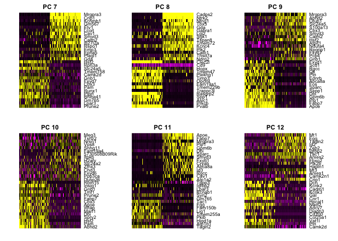
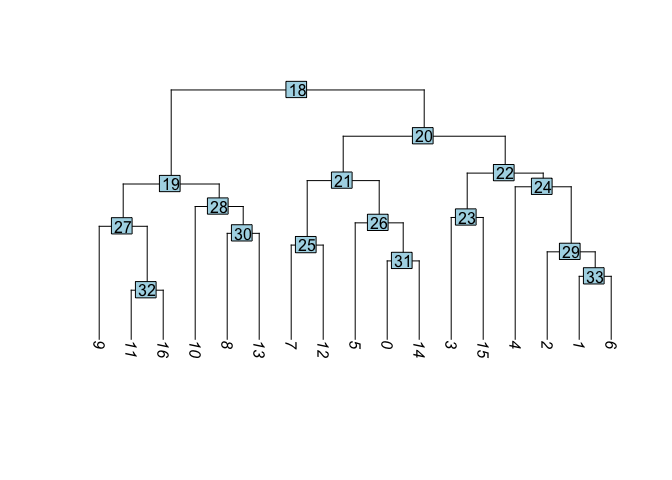
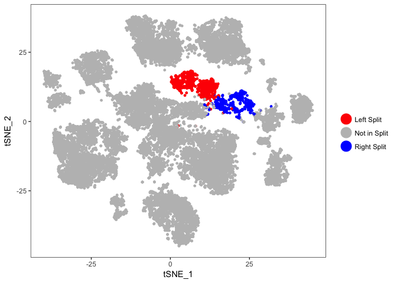
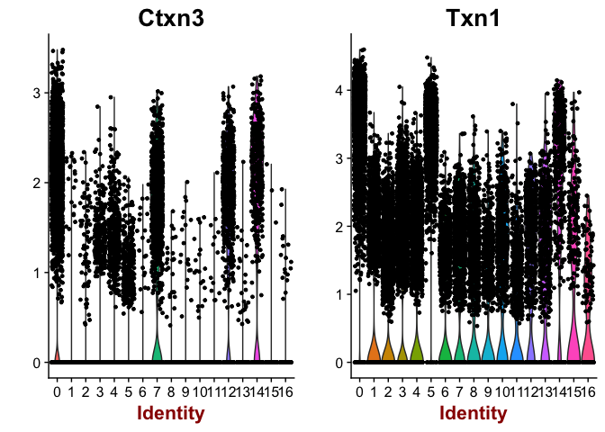
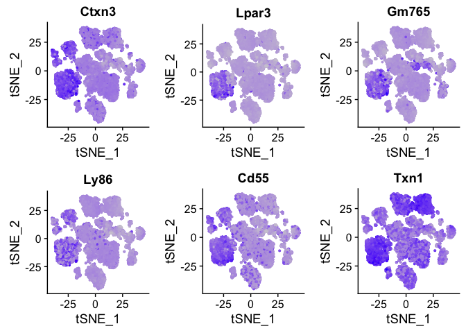
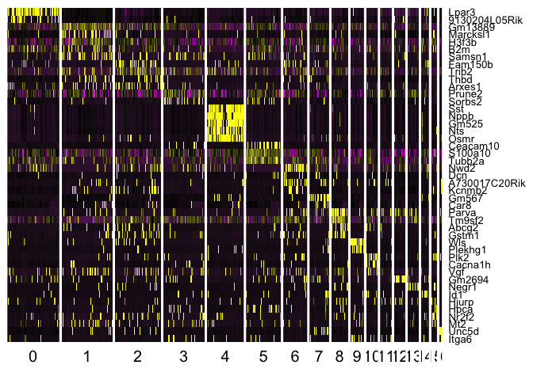
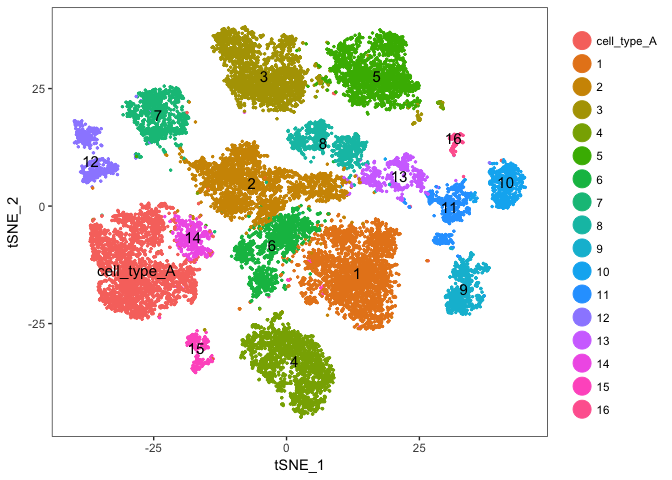

[Seurat](http://satijalab.org/seurat/) is a popular R package that is designed for QC, analysis, and exploration of single cell RNA-seq data. Seurat aims to enable users to identify and interpret sources of heterogeneity from single cell transcriptomic measurements, and to integrate diverse types of single cell data. Further, the authors provide several [tutorials](http://satijalab.org/seurat/get_started.html), on their website.

Dowload and expand the expression_tables.tar.gz file to extract the single cell matrix files for the three samples. These are isolated mouse cells ran on the 10X genomics platform for single cell RNA sequencing, sequenced with UC Davis on 1 HiSeq 4000.

* sample1, UCD_VitE_Def
* sample2, UCD_Supp_VitE
* sample3, UCD_Adj_VitE

We start with loading needed libraries for R, at this time all we need is the package [Seurat](http://satijalab.org/seurat/).

```
## Loading required package: ggplot2
```

```
## Loading required package: cowplot
```

```
## 
## Attaching package: 'cowplot'
```

```
## The following object is masked from 'package:ggplot2':
## 
##     ggsave
```

```
## Loading required package: Matrix
```

## Load the Cell Ranger Matrix Data and create the base Seurat object.
Cell Ranger provides a function `cellranger aggr` that will combine multiple samples into a single matrix file. However, when processing data in R and Seurat this is unnecessary and we can aggregate them in R.

Seurat provides a function `Read10X` to read in 10X data folder. First we read in data from each individual sample folder. First, we initialize the Seurat object (`CreateSeuratObject`) with the raw (non-normalized data). Keep all genes expressed in >= 10 cells. Keep all cells with at least 200 detected genes. Also extracting sample names, calculating and adding in the metadata mitochondrial percentage of each cell. Adding in the metadata batchid. Finally, saving the raw Seurat object.

```r
## Dataset for analysis
dataset_loc <- "expression_tables"
ids <- c("sample1", "sample2", "sample3")

d10x.data <- sapply(ids, function(i){
  d10x <- Read10X(file.path(dataset_loc,i,"outs/filtered_gene_bc_matrices/mm10/"))
  colnames(d10x) <- paste(sapply(strsplit(colnames(d10x),split="-"),'[[',1L),i,sep="-")
  d10x
})

experiment.data <- do.call("cbind", d10x.data)

experiment.aggregate <- CreateSeuratObject(
  experiment.data,
  project = "scRNA workshop", 
  min.cells = 10,
  min.genes = 200,
  names.field = 2,
  names.delim = "\\-")
```
Calculate percent mitochondrial genes per cell. In mouse these genes can be identified as those that begin with 'mt', in human data they begin with MT.

```r
mito.genes <- grep("^mt-", rownames(experiment.aggregate@data), value = T)
percent.mito <- Matrix::colSums(experiment.aggregate@raw.data[mito.genes, ]) / Matrix::colSums(experiment.aggregate@raw.data)

# AddMetaData adds columns to object@data.info, and is a great place to stash QC stats
experiment.aggregate <- AddMetaData(
  object = experiment.aggregate,
  metadata = percent.mito,
  col.name= "percent.mito")
```

The original samples names (the names above in ids) can be found in the metadata slot, column orig.ident. Here we build a new metadata variable 'batchid' which can be used to specify treatment groups.

```r
samplename = experiment.aggregate@meta.data$orig.ident
table(samplename)
```

```
## samplename
## sample1 sample2 sample3 
##    6956    7855    6874
```

```r
batchid = rep("UCD_VitE_Def",length(samplename))
batchid[samplename %in% c("sample2")] = "UCD_Supp_VitE"
batchid[samplename %in% c("sample3")] = "UCD_Adj_VitE"
names(batchid) = rownames(experiment.aggregate@meta.data)

experiment.aggregate <- AddMetaData(
  object = experiment.aggregate,
  metadata = batchid,
  col.name = "batchid")
```

Finally, save the original object, write out a tab-delimited table that could be read into excel, and view the object.

```r
## Original dataset in Seurat class, with no filtering
save(experiment.aggregate,file="original_seurat_object.RData")
# write.table(as.matrix(experiment.data),"raw.datatable.txt",sep="\t",col.names=T,row.names=T)
experiment.aggregate
```

```
## An object of class seurat in project scRNA workshop 
##  15606 genes across 21685 samples.
```

### Lets spend a little time getting to know the Seurat object.

The Seurat object is the center of each single cell analysis. It stores __all__ information associated with the dataset, including data, annotations, analyes, etc. The R function slotNames can be used to view the slot names within an object.


```r
slotNames(experiment.aggregate)
```

```
##  [1] "raw.data"     "data"         "scale.data"   "var.genes"   
##  [5] "is.expr"      "ident"        "meta.data"    "project.name"
##  [9] "dr"           "assay"        "hvg.info"     "imputed"     
## [13] "cell.names"   "cluster.tree" "snn"          "calc.params" 
## [17] "kmeans"       "spatial"      "misc"         "version"
```

We can then few the data within a slot with the `@` operator.

```r
head(experiment.aggregate@meta.data)
```

```
##                           nGene nUMI orig.ident percent.mito      batchid
## AAAACCTGAGATCACGG-sample1  1309 2435    sample1  0.075154004 UCD_VitE_Def
## AAAACCTGAGCATCATC-sample1  1331 2650    sample1  0.008301887 UCD_VitE_Def
## AAAACCTGAGCGCTCCA-sample1  1507 2817    sample1  0.038693646 UCD_VitE_Def
## AAAACCTGAGTGGGATC-sample1  1891 3625    sample1  0.005517241 UCD_VitE_Def
## AAAACCTGCAGACAGGT-sample1   786 1091    sample1  0.013748854 UCD_VitE_Def
## AAAACCTGGTATAGGTA-sample1  2505 7248    sample1  0.027179912 UCD_VitE_Def
```


```r
table(experiment.aggregate@meta.data$orig.ident)
```

```
## 
## sample1 sample2 sample3 
##    6956    7855    6874
```

## Some basic QA/QC of the metadata, print tables of the 5% quantiles.

Show 5% qunatiles for number of genes per cell per sample

```r
do.call("cbind", tapply(experiment.aggregate@meta.data$nGene,experiment.aggregate@ident,quantile,probs=seq(0,1,0.05)))
```

```
##      sample1 sample2 sample3
## 0%    602.00   575.0  852.00
## 5%    851.00   787.7 1104.65
## 10%   999.50   899.0 1197.00
## 15%  1126.00   990.0 1279.00
## 20%  1237.00  1060.0 1361.00
## 25%  1330.00  1133.0 1458.00
## 30%  1413.00  1207.0 1557.00
## 35%  1495.00  1300.0 1655.00
## 40%  1583.00  1381.0 1754.00
## 45%  1676.75  1469.0 1845.85
## 50%  1778.50  1572.0 1949.00
## 55%  1881.00  1669.7 2073.00
## 60%  1981.00  1771.4 2199.00
## 65%  2088.75  1873.0 2350.00
## 70%  2202.00  1987.0 2500.20
## 75%  2332.25  2132.5 2670.00
## 80%  2502.00  2266.0 2849.00
## 85%  2706.00  2426.9 3024.00
## 90%  3004.00  2634.0 3223.70
## 95%  3438.00  2939.0 3476.00
## 100% 5054.00  4793.0 5345.00
```

Show 5% qunatiles for number of UMI per cell per sample

```r
do.call("cbind", tapply(experiment.aggregate@meta.data$nUMI,experiment.aggregate@ident,quantile,probs=seq(0,1,0.05)))
```

```
##       sample1 sample2  sample3
## 0%    1006.00   929.0  1541.00
## 5%    1265.00  1142.7  1885.65
## 10%   1544.00  1351.0  2056.00
## 15%   1831.25  1555.0  2242.95
## 20%   2113.00  1711.0  2444.20
## 25%   2324.00  1861.0  2704.00
## 30%   2528.50  2039.2  2990.90
## 35%   2749.25  2245.0  3297.55
## 40%   3004.00  2463.0  3595.00
## 45%   3280.75  2690.3  3907.00
## 50%   3601.00  2960.0  4211.00
## 55%   3959.50  3271.0  4611.15
## 60%   4321.00  3573.4  5087.00
## 65%   4726.50  3912.6  5723.45
## 70%   5188.50  4346.0  6421.00
## 75%   5731.25  4860.5  7152.00
## 80%   6532.00  5446.0  8042.00
## 85%   7525.50  6179.6  9007.20
## 90%   8914.00  7131.2 10217.60
## 95%  11610.00  8700.5 12177.70
## 100% 27134.00 20518.0 31296.00
```

Show 5% qunatiles for number of mitochondrial percentage per cell per sample

```r
round(do.call("cbind", tapply(experiment.aggregate@meta.data$percent.mito,experiment.aggregate@ident,quantile,probs=seq(0,1,0.05))), digits = 3)
```

```
##      sample1 sample2 sample3
## 0%     0.000   0.000   0.000
## 5%     0.007   0.006   0.011
## 10%    0.011   0.010   0.018
## 15%    0.014   0.013   0.022
## 20%    0.016   0.016   0.025
## 25%    0.019   0.018   0.028
## 30%    0.021   0.021   0.032
## 35%    0.024   0.023   0.035
## 40%    0.027   0.026   0.037
## 45%    0.030   0.028   0.040
## 50%    0.033   0.031   0.043
## 55%    0.036   0.034   0.046
## 60%    0.039   0.037   0.049
## 65%    0.043   0.041   0.053
## 70%    0.047   0.044   0.056
## 75%    0.051   0.048   0.060
## 80%    0.055   0.052   0.064
## 85%    0.060   0.057   0.070
## 90%    0.067   0.064   0.076
## 95%    0.077   0.074   0.088
## 100%   0.271   0.277   0.338
```

Plot the number of cells each gene is represented by

```r
plot(sort(Matrix::rowSums(experiment.aggregate@data>=2)) , xlab="gene rank", ylab="number of cells", main="Cells per genes ( >= 2 )")
```

<!-- -->

Violin plot of 1) number of genes, 2) number of UMI and 3) percent mitochondrial genes

```r
VlnPlot(
  experiment.aggregate,
  c("nGene", "nUMI","percent.mito"),
  nCol = 1)
```

<!-- -->

Gene Plot, scatter plot of gene expression across cells, (colored by sample)

```r
GenePlot(
  experiment.aggregate, "nUMI", "nGene",
  cex.use = 0.5)
```

<!-- -->

### Cell filtering
We use the information above to filter out cells. Here we choose those that have percent mitochondrial genes max of 10% and unique UMI counts under 20,000 or greater than 500, Note that low.thresholds and high.thresholds are used to define a 'gate' -Inf and Inf should be used if you don't want a lower or upper threshold.


```r
experiment.aggregate <- FilterCells(
  object = experiment.aggregate,
  subset.names = c("percent.mito"),
  low.thresholds = c(-Inf),
  high.thresholds = c(0.1))

experiment.aggregate <- FilterCells(
  object = experiment.aggregate,
  subset.names = c("nUMI"),
  low.thresholds = c(500),
  high.thresholds = c(20000))

experiment.aggregate
```

```
## An object of class seurat in project scRNA workshop 
##  15606 genes across 21288 samples.
```


```r
table(experiment.aggregate@meta.data$orig.ident)
```

```
## 
## sample1 sample2 sample3 
##    6843    7772    6673
```

## Next we want to normalize the data

After filtering out cells from the dataset, the next step is to normalize the data. By default, we employ a global-scaling normalization method LogNormalize that normalizes the gene expression measurements for each cell by the total expression, multiplies this by a scale factor (10,000 by default), and then log-transforms the data.


```r
experiment.aggregate <- NormalizeData(
  object = experiment.aggregate,
  normalization.method = "LogNormalize",
  scale.factor = 10000)
```

### You may also want to filter out additional genes.

When creating the base Seurat object we did filter out some genes, recall _Keep all genes expressed in >= 10 cells_. After filtering cells and you may want to be more aggressive with the gene filter. Seurat doesn't supply such a function (that I can find), so below is a function that can do so, it filters genes requiring a min.value (log-normalized) in at least min.cells, here expression of 1 in at least 100 cells.


```r
FilterGenes <- 
function (object, min.value=1, min.cells = 0, genes = NULL) {
  parameters.to.store <- as.list(environment(), all = TRUE)[names(formals("FilterGenes"))]
  object <- Seurat:::SetCalcParams(object = object, calculation = "FilterGenes", ... = parameters.to.store)
  genes.use <- rownames(object@data)

  if (!is.null(genes)) {
    genes.use <- intersect(genes.use, genes)
    object@data <- object@data[genes.use, ]
    return(object)
  } else if (min.cells > 0) {
    num.cells <- Matrix::rowSums(object@data > min.value)
    genes.use <- names(num.cells[which(num.cells >= min.cells)])
    object@data <- object@data[genes.use, ]
    return(object)
  } else {
    return(object)
  }
}

experiment.aggregate <- FilterGenes(object = experiment.aggregate, min.value = 1, min.cells = 100)
experiment.aggregate
```

```
## An object of class seurat in project scRNA workshop 
##  11454 genes across 21288 samples.
```

## Identify variable genes

The function FindVariableGenes calculates highly variable genes (genes that are outliers on a 'mean variability plot') that can be used to focus on these for downstream analysis.  First, uses a function to calculate average expression (mean.function) and dispersion (dispersion.function) for each gene. Next, divides genes into num.bin (deafult 20) bins based on their average expression, and calculates z-scores for dispersion within each bin. The purpose of this is to identify variable genes while controlling for the strong relationship between variability and average expression. This helps control for the relationship between variability and average expression.


```r
experiment.aggregate <- FindVariableGenes(
  object = experiment.aggregate,
  mean.function = ExpMean,
  dispersion.function = LogVMR,
  x.low.cutoff = 0.125,
  x.high.cutoff = 4,
  y.cutoff = 0.5)
```

<!-- -->

```r
length(experiment.aggregate@var.genes)
```

```
## [1] 1123
```

Lets save the filtered and normalized data

```r
save(experiment.aggregate, file="pre_sample_corrected.RData")
```

## Batch effects

ScaleData - Scales and centers genes in the dataset. If variables are provided in vars.to.regress, they are individually regressed against each gene, and the resulting residuals are then scaled and centered. Here we use only the highly variable genes identified above and then regress out for sample (orig.ident), sequencing depth (nUMI) and percentage mitochondria (percent.mito).


```r
experiment.aggregate <- ScaleData(
  object = experiment.aggregate,
  genes.use=experiment.aggregate@var.genes,
  vars.to.regress = c("orig.ident", "nUMI","percent.mito"))
```

```
## [1] "Regressing out orig.ident"   "Regressing out nUMI"        
## [3] "Regressing out percent.mito"
## 
  |                                                                       
  |                                                                 |   0%
  |                                                                       
  |=====                                                            |   8%
  |                                                                       
  |===========                                                      |  17%
  |                                                                       
  |================                                                 |  25%
  |                                                                       
  |======================                                           |  33%
  |                                                                       
  |===========================                                      |  42%
  |                                                                       
  |================================                                 |  50%
  |                                                                       
  |======================================                           |  58%
  |                                                                       
  |===========================================                      |  67%
  |                                                                       
  |=================================================                |  75%
  |                                                                       
  |======================================================           |  83%
  |                                                                       
  |============================================================     |  92%
  |                                                                       
  |=================================================================| 100%
## [1] "Scaling data matrix"
## 
  |                                                                       
  |                                                                 |   0%
  |                                                                       
  |================================                                 |  50%
  |                                                                       
  |=================================================================| 100%
```

## Dimensionality reduction with PCA 

Next we perform PCA on the scaled data. By default, the genes in object@var.genes are used as input, but can be alternatively defined. Running dimensionality reduction on highly variable genes can improve performance. 


```r
experiment.aggregate <- RunPCA(
  object = experiment.aggregate,
  pc.genes = experiment.aggregate@var.genes,
  do.print = TRUE,
  pcs.print = 1:5,
  genes.print = 5,
  pcs.compute = 40,
  maxit = 500)
```

```
## [1] "PC1"
## [1] "S100b" "Nefh"  "Cntn1" "Thy1"  "Sv2b" 
## [1] ""
## [1] "Cd24a"   "S100a6"  "Tmem233" "Ubb"     "Arpc1b" 
## [1] ""
## [1] ""
## [1] "PC2"
## [1] "P2ry1"   "Rarres1" "Fam19a4" "Gm7271"  "Zfhx3"  
## [1] ""
## [1] "Calca"  "Celf4"  "Gap43"  "Zbtb20" "Fgf13" 
## [1] ""
## [1] ""
## [1] "PC3"
## [1] "Jak1"  "Nppb"  "Sst"   "Adk"   "Gm525"
## [1] ""
## [1] "Calca"  "Marcks" "Gap43"  "Stmn1"  "Fkbp1b"
## [1] ""
## [1] ""
## [1] "PC4"
## [1] "Lpar3" "Gm765" "Ctxn3" "Ly86"  "Cd55" 
## [1] ""
## [1] "Hpcal1" "Nppb"   "Sst"    "Npy2r"  "Gm525" 
## [1] ""
## [1] ""
## [1] "PC5"
## [1] "Tac1"   "Pcp4"   "Lgals1" "Gal"    "Mgst3" 
## [1] ""
## [1] "Nrn1"   "Rgs4"   "Spock3" "Ctxn3"  "Cd55"  
## [1] ""
## [1] ""
```

```r
PrintPCAParams(experiment.aggregate)
```

```
## Parameters used in latest PCA calculation run on: 2017-12-19 18:59:36
## =============================================================================
## PCs computed    Genes used in calculation    PCs Scaled by Variance Explained
##     40                  1123                               TRUE
## -----------------------------------------------------------------------------
## rev.pca 
##  FALSE
## -----------------------------------------------------------------------------
## Full gene list can be accessed using 
##  GetCalcParam(object = object, calculation = "RunPCA", parameter = "pc.genes")
```

Seurat then provides a number of ways to visualize the PCA results

```r
PCAPlot(
  object = experiment.aggregate,
  dim.1 = 1,
  dim.2 = 2 )
```

<!-- -->

Visualize top genes associated with principal components

```r
VizPCA(
  object = experiment.aggregate,
  pcs.use=1:2
)
```

<!-- -->

Draws a heatmap focusing on a principal component. Both cells and genes are sorted by their principal component scores. Allows for nice visualization of sources of heterogeneity in the dataset.


```r
PCHeatmap(
    object = experiment.aggregate, 
    pc.use = 1:6, 
    cells.use = 500, 
    do.balanced = TRUE, 
    label.columns = FALSE,
    use.full = FALSE
)
```

<!-- -->

```r
PCHeatmap(
    object = experiment.aggregate, 
    pc.use = 7:12, 
    cells.use = 500, 
    do.balanced = TRUE, 
    label.columns = FALSE,
    use.full = FALSE
)
```

<!-- -->

### Selecting which PCs to use
To overcome the extensive technical noise in any single gene, Seurat clusters cells based on their PCA scores, with each PC essentially representing a metagene that combines information across a correlated gene set. Determining how many PCs to include downstream is therefore an important step. 

PCElbowPlot plots the standard deviations (or approximate singular values if running PCAFast) of the principle components for easy identification of an elbow in the graph. This elbow often corresponds well with the significant PCs and is much faster to run.


```r
PCElbowPlot(
  experiment.aggregate,
  num.pc = 40)
```

<!-- -->

The JackStraw function randomly permutes a subset of data, and calculates projected PCA scores for these 'random' genes. Then compares the PCA scores for the 'random' genes with the observed PCA scores to determine statistical signifance. End result is a p-value for each gene's association with each principal component. We identify significant PCs as those who have a strong enrichment of low p-value genes.

__WARNING: TAKES A LONG TIME TO RUN__

```r
experiment.aggregate <- JackStraw(
    object = experiment.aggregate, 
    num.replicate = 100, 
    num.pc = 40,
    do.print = FALSE
)
```


```r
JackStrawPlot(object = experiment.aggregate, PCs = 1:40)
```

```
## Warning: Removed 33058 rows containing missing values (geom_point).
```

<!-- -->

Looking at the results of the JackStraw plot, we determine to use the first 35 PCs

```r
use.pcs = 1:35
```

## Identifying clusters

Seurat implements an graph-based clustering approach. Distances between the cells are calculated based on previously identified PCs. Seurat approach was heavily inspired by recent manuscripts which applied graph-based clustering approaches to scRNAseq data. Briefly, Seurat identify clusters of cells by a shared nearest neighbor (SNN) modularity optimization based clustering algorithm. First calculate k-nearest neighbors (KNN) and construct the SNN graph. Then optimize the modularity function to determine clusters. For a full description of the algorithms, see Waltman and van Eck (2013) The European Physical Journal B.

The FindClusters function implements the procedure, and contains a resolution parameter that sets the granularity of the downstream clustering, with increased values leading to a greater number of clusters. I tend to like to perform a series of resolutions, investigate and choose.

__WARNING: TAKES A LONG TIME TO RUN__

```r
experiment.aggregate <- FindClusters(
    object = experiment.aggregate, 
    reduction.type = "pca", 
    dims.use = use.pcs, 
    resolution = seq(0.5,4,0.5), 
    print.output = FALSE, 
    save.SNN = TRUE
)
PrintFindClustersParams(object = experiment.aggregate)
```

```
## Parameters used in latest FindClusters calculation run on: 2017-12-19 19:33:49
## =============================================================================
## Resolution: 0.5
## -----------------------------------------------------------------------------
## Modularity Function    Algorithm         n.start         n.iter
##      1                   1                 100             10
## -----------------------------------------------------------------------------
## Reduction used          k.param          k.scale          prune.SNN
##      pca                 30                25              0.0667
## -----------------------------------------------------------------------------
## Dims used in calculation
## =============================================================================
## 1 2 3 4 5 6 7 8 9 10 11 12 13 14 15 16 17 18 19 20 21 22 23 24 25 26 27 28 29
## 30 31 32 33 34 35
```

Lets first investigate how many clusters each resolution produces and set it to the smallest resolutions of 0.5 (fewest clusters). finnaly lets produce a table of cluster to sample assignments.


```r
sapply(grep("^res",colnames(experiment.aggregate@meta.data),value = TRUE),
       function(x) length(unique(experiment.aggregate@meta.data[,x])))
```

```
## res.0.5   res.1 res.1.5   res.2 res.2.5   res.3 res.3.5   res.4 
##      17      21      28      34      38      39      42      48
```

```r
experiment.aggregate <- SetAllIdent(experiment.aggregate, id = "res.0.5")

table(experiment.aggregate@ident,experiment.aggregate@meta.data$orig.ident)
```

```
##     
##      sample1 sample2 sample3
##   0     1093    1137     541
##   1      792     985     962
##   2      730     885     845
##   3      760     718     740
##   4      725     653     591
##   5      637     660     568
##   6      382     422     479
##   7      339     398     305
##   8      253     322     324
##   9      201     258     263
##   10     177     238     209
##   11     150     283     184
##   12     211     185     217
##   13     158     240     195
##   14     105     192     116
##   15      94     149      68
##   16      36      47      66
```

tSNE dimensionality reduction plots are then used to visualise clustering results. As input to the tSNE, you should use the same PCs as input to the clustering analysis.


```r
experiment.aggregate <- RunTSNE(
  object = experiment.aggregate,
  reduction.use = "pca",
  dims.use = 1:35,
  do.fast = TRUE)
```


Plot TSNE coloring by the slot 'ident' (default).

```r
TSNEPlot(object = experiment.aggregate, pt.size=0.5)
```

<!-- -->

Plot TSNE coloring by the slot 'orig.ident' (sample names).

```r
TSNEPlot(object = experiment.aggregate, group.by="orig.ident", pt.size=0.5)
```

<!-- -->

Plot TSNE coloring by the clustering resolution 4.5

```r
TSNEPlot(object = experiment.aggregate, group.by="res.4", pt.size=0.5, do.label = TRUE)
```

<!-- -->

FeaturePlot can be used to color cells with a 'feature', non categorical data, like number of UMIs

```r
FeaturePlot(experiment.aggregate, features.plot=c('nUMI'), pt.size=0.5)
```

<!-- -->
and number of genes present

```r
FeaturePlot(experiment.aggregate, features.plot=c('nGene'), pt.size=0.5)
```

<!-- -->

and percent mitochondrial 

```r
FeaturePlot(experiment.aggregate, features.plot=c('percent.mito'), pt.size=0.5)
```

<!-- -->

## Building  a  tree relating the 'average' cell from each cluster. Tree is estimated based on a distance matrix constructed in either gene expression space or PCA space.


```r
experiment.aggregate <- BuildClusterTree(
  experiment.aggregate,
  do.reorder = F,
  reorder.numeric = F,
  do.plot=F)
```

```
## [1] "Finished averaging RNA for cluster 0"
## [1] "Finished averaging RNA for cluster 1"
## [1] "Finished averaging RNA for cluster 2"
## [1] "Finished averaging RNA for cluster 3"
## [1] "Finished averaging RNA for cluster 4"
## [1] "Finished averaging RNA for cluster 5"
## [1] "Finished averaging RNA for cluster 6"
## [1] "Finished averaging RNA for cluster 7"
## [1] "Finished averaging RNA for cluster 8"
## [1] "Finished averaging RNA for cluster 9"
## [1] "Finished averaging RNA for cluster 10"
## [1] "Finished averaging RNA for cluster 11"
## [1] "Finished averaging RNA for cluster 12"
## [1] "Finished averaging RNA for cluster 13"
## [1] "Finished averaging RNA for cluster 14"
## [1] "Finished averaging RNA for cluster 15"
## [1] "Finished averaging RNA for cluster 16"
```

```r
PlotClusterTree(experiment.aggregate)
```

<!-- -->

Plot the split at node 30

```r
ColorTSNESplit(experiment.aggregate, node = 30)
```

<!-- -->


```r
TSNEPlot(object = experiment.aggregate, pt.size=0.5, do.label = TRUE)
```

<!-- -->


```r
# Merged clusters, not working correctly
#experiment.merged <- MergeNode(experiment.aggregate, node=30, rebuild.tree = F)
experiment.merged <- RenameIdent(
  object = experiment.aggregate,
  old.ident.name = c('14'),
  new.ident.name = '0'
)
TSNEPlot(object = experiment.merged, pt.size=0.5, do.label = T)
```

<!-- -->
## Identifying Marker Genes

Seurat can help you find markers that define clusters via differential expression.
`FindMarkers` identifies markers for a cluster relative to all other clusters.

`FindAllMarkers` does so for all clusters

`FindAllMarkersNode` defines all markers that split a Node __(Warning: need to validate)__


```r
markers = FindMarkers(experiment.aggregate, ident.1=c(0,14))
head(markers)
```

```
##       p_val avg_logFC pct.1 pct.2 p_val_adj
## Ctxn3     0  1.667422 0.924 0.144         0
## Txn1      0  1.560734 0.978 0.663         0
## Ly86      0  1.490297 0.633 0.092         0
## Lpar3     0  1.452380 0.760 0.016         0
## Gm765     0  1.446631 0.819 0.059         0
## Cd55      0  1.337367 0.932 0.261         0
```

Can use a violin plot to visualize the expression pattern of some markers

```r
VlnPlot(object = experiment.aggregate, features.plot = rownames(markers)[1:2])
```

<!-- -->

Or a feature plot

```r
FeaturePlot(
    experiment.aggregate, 
    head(rownames(markers)), 
    cols.use = c("lightgrey", "blue"), 
    nCol = 3
)
```

<!-- -->

FindAllMarkers can be used to automate the process across all genes.

```r
markers_all <- FindAllMarkers(
    object = experiment.aggregate, 
    only.pos = TRUE, 
    min.pct = 0.25, 
    thresh.use = 0.25
)
```

Plot a heatmap of genes by cluster for the top 5 marker genes per cluster

```r
library(dplyr)
```

```
## Warning: package 'dplyr' was built under R version 3.4.2
```

```
## 
## Attaching package: 'dplyr'
```

```
## The following object is masked from 'package:Biobase':
## 
##     combine
```

```
## The following objects are masked from 'package:BiocGenerics':
## 
##     combine, intersect, setdiff, union
```

```
## The following objects are masked from 'package:stats':
## 
##     filter, lag
```

```
## The following objects are masked from 'package:base':
## 
##     intersect, setdiff, setequal, union
```

```r
top5 <- markers_all %>% group_by(cluster) %>% top_n(5, avg_logFC)
DoHeatmap(
    object = experiment.aggregate, 
    genes.use = top5$gene, 
    slim.col.label = TRUE, 
    remove.key = TRUE
)
```

<!-- -->

## Finishing up clusters.

At this point in time you should use the tree, markers, domain knowledge, and goals to finalize your clusters. This may mean adjusting PCA to use, mergers clusters together, choosing a new resolutions, etc. When finished you can further name it cluster by something more informative. Ex.

```r
experiment.clusters <- experiment.aggregate
experiment.clusters <- RenameIdent(
  object = experiment.clusters,
  old.ident.name = c('0'),
  new.ident.name = 'cell_type_A'
)

TSNEPlot(object = experiment.clusters, pt.size=0.5, do.label = T)
```

<!-- -->

And last lets save our clustered object.

```r
save(experiment.clusters,file="clusters_seurat_object.RData")
```

Session Information

```r
sessionInfo()
```

```
## R version 3.4.1 (2017-06-30)
## Platform: x86_64-apple-darwin15.6.0 (64-bit)
## Running under: macOS High Sierra 10.13.2
## 
## Matrix products: default
## BLAS: /Library/Frameworks/R.framework/Versions/3.4/Resources/lib/libRblas.0.dylib
## LAPACK: /Library/Frameworks/R.framework/Versions/3.4/Resources/lib/libRlapack.dylib
## 
## locale:
## [1] en_US.UTF-8/en_US.UTF-8/en_US.UTF-8/C/en_US.UTF-8/en_US.UTF-8
## 
## attached base packages:
## [1] parallel  stats     graphics  grDevices utils     datasets  methods  
## [8] base     
## 
## other attached packages:
## [1] dplyr_0.7.4         bindrcpp_0.2        Seurat_2.1.0       
## [4] Biobase_2.36.2      BiocGenerics_0.22.1 Matrix_1.2-12      
## [7] cowplot_0.9.2       ggplot2_2.2.1      
## 
## loaded via a namespace (and not attached):
##   [1] diffusionMap_1.1-0   Rtsne_0.13           VGAM_1.0-4          
##   [4] colorspace_1.3-2     ggridges_0.4.1       class_7.3-14        
##   [7] modeltools_0.2-21    mclust_5.4           rprojroot_1.3-1     
##  [10] htmlTable_1.11.0     base64enc_0.1-3      proxy_0.4-20        
##  [13] rstudioapi_0.7       DRR_0.0.2            flexmix_2.3-14      
##  [16] lubridate_1.7.1      prodlim_1.6.1        mvtnorm_1.0-6       
##  [19] ranger_0.8.0         codetools_0.2-15     splines_3.4.1       
##  [22] R.methodsS3_1.7.1    mnormt_1.5-5         doParallel_1.0.11   
##  [25] robustbase_0.92-8    knitr_1.17           tclust_1.3-1        
##  [28] RcppRoll_0.2.2       Formula_1.2-2        caret_6.0-78        
##  [31] ica_1.0-1            broom_0.4.3          gridBase_0.4-7      
##  [34] ddalpha_1.3.1        cluster_2.0.6        kernlab_0.9-25      
##  [37] R.oo_1.21.0          sfsmisc_1.1-1        compiler_3.4.1      
##  [40] backports_1.1.2      assertthat_0.2.0     lazyeval_0.2.1      
##  [43] lars_1.2             acepack_1.4.1        htmltools_0.3.6     
##  [46] tools_3.4.1          igraph_1.1.2         gtable_0.2.0        
##  [49] glue_1.2.0           reshape2_1.4.3       Rcpp_0.12.14        
##  [52] NMF_0.20.6           trimcluster_0.1-2    gdata_2.18.0        
##  [55] ape_5.0              nlme_3.1-131         iterators_1.0.9     
##  [58] fpc_2.1-10           psych_1.7.8          timeDate_3042.101   
##  [61] gower_0.1.2          stringr_1.2.0        irlba_2.3.1         
##  [64] rngtools_1.2.4       gtools_3.5.0         DEoptimR_1.0-8      
##  [67] MASS_7.3-47          scales_0.5.0         ipred_0.9-6         
##  [70] RColorBrewer_1.1-2   yaml_2.1.16          pbapply_1.3-3       
##  [73] gridExtra_2.3        pkgmaker_0.22        segmented_0.5-3.0   
##  [76] rpart_4.1-11         latticeExtra_0.6-28  stringi_1.1.6       
##  [79] foreach_1.4.4        checkmate_1.8.5      caTools_1.17.1      
##  [82] ggjoy_0.4.0          lava_1.5.1           dtw_1.18-1          
##  [85] SDMTools_1.1-221     rlang_0.1.4          pkgconfig_2.0.1     
##  [88] prabclus_2.2-6       bitops_1.0-6         evaluate_0.10.1     
##  [91] lattice_0.20-35      ROCR_1.0-7           purrr_0.2.4         
##  [94] bindr_0.1            labeling_0.3         recipes_0.1.1       
##  [97] htmlwidgets_0.9      tidyselect_0.2.3     CVST_0.2-1          
## [100] plyr_1.8.4           magrittr_1.5         R6_2.2.2            
## [103] gplots_3.0.1         Hmisc_4.0-3          dimRed_0.1.0        
## [106] sn_1.5-1             withr_2.1.0          foreign_0.8-69      
## [109] mixtools_1.1.0       survival_2.41-3      scatterplot3d_0.3-40
## [112] nnet_7.3-12          tsne_0.1-3           tibble_1.3.4        
## [115] KernSmooth_2.23-15   rmarkdown_1.8        grid_3.4.1          
## [118] data.table_1.10.4-3  FNN_1.1              ModelMetrics_1.1.0  
## [121] digest_0.6.13        diptest_0.75-7       xtable_1.8-2        
## [124] numDeriv_2016.8-1    tidyr_0.7.2          R.utils_2.6.0       
## [127] stats4_3.4.1         munsell_0.4.3        registry_0.5
```
